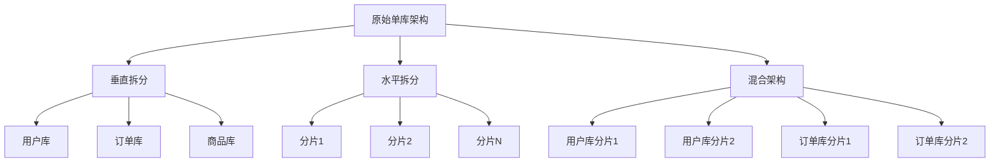
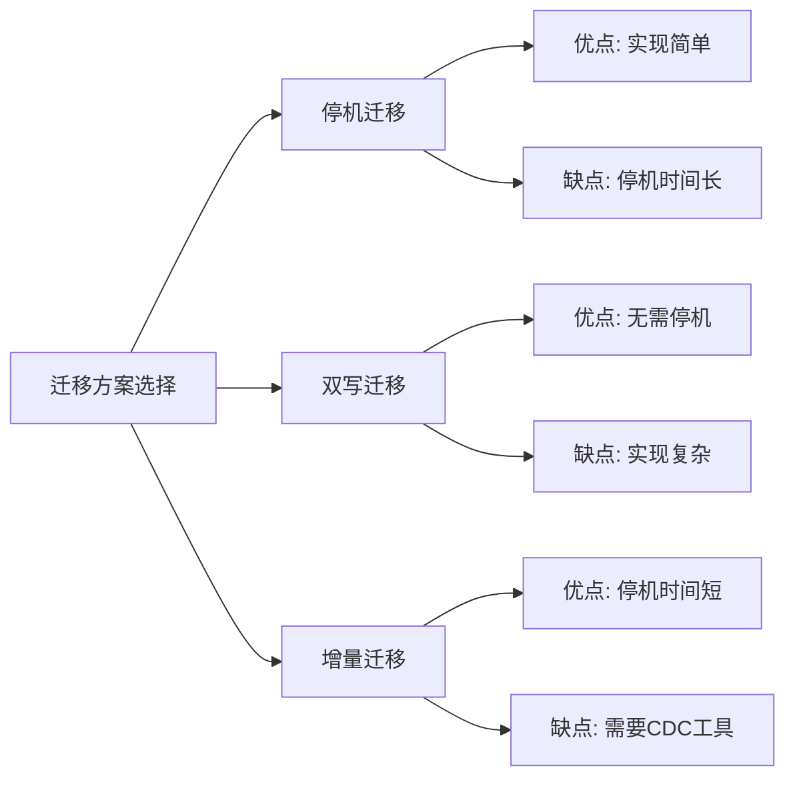

```markdown
---
title: MySQL千亿级数据扩容实施
icon: database
order: 1
---

# MySQL千亿级数据扩容实施

## 1. 背景与挑战

随着业务的快速发展，数据量呈指数级增长，当MySQL单库数据量达到TB级甚至PB级时，传统的单库单表架构将面临严重的性能瓶颈。千亿级数据扩容是大型互联网企业必须面对的技术挑战。

### 1.1 单库架构的瓶颈

在数据量达到千亿级别时，单库架构面临以下挑战：

- **存储容量限制**：单机存储容量有物理上限，即使使用分区表也难以突破
- **查询性能下降**：数据量增大导致索引深度增加，查询效率显著降低
- **并发处理能力受限**：连接数和锁竞争成为性能瓶颈
- **备份恢复困难**：大表备份耗时长，恢复时间无法满足业务SLA要求
- **运维复杂度高**：大表维护操作（如添加索引）可能导致长时间锁表

一个典型的例子是某电商平台的订单表，随着业务发展，单表记录数从最初的几百万增长到几十亿，查询响应时间从毫秒级上升到秒级，严重影响用户体验。

## 2. 扩容前的评估与规划

### 2.1 数据量增长评估

在进行扩容前，首先需要对数据增长趋势进行科学评估：

```sql
-- 评估当前数据量
SELECT 
    table_schema as '数据库',
    table_name as '表名',
    table_rows as '行数',
    ROUND((data_length + index_length)/1024/1024/1024, 2) as '总大小(GB)'
FROM information_schema.tables
WHERE table_schema = '目标数据库'
ORDER BY (data_length + index_length) DESC
LIMIT 10;

-- 分析表增长趋势
SELECT 
    DATE_FORMAT(create_time, '%Y-%m') as month,
    COUNT(*) as new_records
FROM orders
GROUP BY DATE_FORMAT(create_time, '%Y-%m')
ORDER BY month;
```

通过历史数据分析，我们需要：

1. **历史数据增长分析**：分析过去6-12个月的数据增长曲线，预测未来1-3年的数据量
2. **业务增长预期**：结合业务发展规划，评估可能的数据量激增场景
3. **季节性波动考量**：考虑业务的季节性特点，如电商的大促、金融的年报季等

### 2.2 业务访问模式分析

不同的业务访问模式决定了不同的扩容策略：

```sql
-- 分析热点查询模式
SELECT 
    SUBSTRING_INDEX(SUBSTRING_INDEX(query, 'WHERE', -1), 'ORDER', 1) as where_condition,
    COUNT(*) as frequency
FROM mysql.slow_log
WHERE query LIKE '%SELECT%FROM orders%WHERE%'
GROUP BY where_condition
ORDER BY frequency DESC
LIMIT 10;
```

需要重点分析：

- **读写比例**：读多写少还是写多读少
- **查询模式**：点查询多还是范围查询多
- **热点数据分布**：是否存在明显的热点数据
- **跨表关联**：是否存在大量的跨表JOIN查询
- **事务特性**：业务对事务一致性的要求程度

### 2.3 扩容方案选型

根据业务特点和数据特性，选择合适的扩容方案：

1. **垂直拆分**：按业务模块拆分数据库
   - 适用场景：业务模块相对独立，表之间关联不多
   - 优点：实现简单，对应用改造小
   - 缺点：单表数据量仍可能过大

2. **水平拆分**：按数据分片规则将同一表的数据分散到不同的数据库
   - 适用场景：单表数据量巨大，但业务逻辑相对简单
   - 优点：解决单表数据量问题，扩展性好
   - 缺点：跨分片查询复杂，事务处理困难

3. **混合架构**：结合垂直和水平拆分
   - 适用场景：复杂业务系统，数据量大且业务模块多
   - 优点：灵活性高，可针对不同业务采用不同策略
   - 缺点：架构复杂，运维难度大

下图展示了三种扩容方案的对比：



## 3. 分库分表核心实施

### 3.1 分片策略设计

选择合适的分片键和分片算法是成功实施的关键：

#### 3.1.1 分片键选择原则

- **数据均匀分布**：避免数据倾斜，导致某些分片负载过高
- **查询高效性**：常用查询条件应包含分片键，减少跨分片查询
- **业务关联性**：相关联的数据尽量分布在同一分片，减少分布式事务
- **扩展性考虑**：分片键应支持未来可能的扩容需求

常见的分片键选择：

| 业务场景 | 推荐分片键 | 原因 |
|---------|-----------|------|
| 电商订单 | 用户ID | 同一用户订单聚集，减少跨分片查询 |
| 社交内容 | 用户ID或内容ID | 根据访问模式决定 |
| 支付交易 | 商户ID | 商户维度报表查询多 |
| 日志系统 | 时间戳 | 按时间范围查询多 |

#### 3.1.2 常用分片算法

1. **哈希分片**：适用于数据均匀分布的场景

```java
/**
 * 简单的哈希分片算法示例
 */
public int getShardingIndex(String shardingKey, int shardingCount) {
    // 取绝对值避免负数
    int hashCode = Math.abs(shardingKey.hashCode());
    // 取模得到分片索引
    return hashCode % shardingCount;
}
```

2. **范围分片**：适用于按时间或ID范围查询的场景

```sql
-- 按ID范围分片的表结构示例
CREATE TABLE order_0 (
    id BIGINT PRIMARY KEY,
    user_id BIGINT,
    order_time DATETIME,
    amount DECIMAL(10,2),
    -- 其他字段
    CONSTRAINT id_range CHECK (id >= 0 AND id < 100000000)
);

CREATE TABLE order_1 (
    -- 相同结构
    CONSTRAINT id_range CHECK (id >= 100000000 AND id < 200000000)
);
-- 更多分片表...
```

3. **一致性哈希**：适用于需要动态扩容的场景

```java
/**
 * 一致性哈希分片算法示例
 */
public class ConsistentHashSharding {
    private final SortedMap<Integer, String> hashRing = new TreeMap<>();
    private final int virtualNodes = 160; // 每个物理节点的虚拟节点数
    
    public void addNode(String node) {
        for (int i = 0; i < virtualNodes; i++) {
            String virtualNode = node + "#" + i;
            int hash = getHash(virtualNode);
            hashRing.put(hash, node);
        }
    }
    
    public String getNode(String key) {
        if (hashRing.isEmpty()) {
            return null;
        }
        
        int hash = getHash(key);
        // 如果没有大于等于hash的节点，则返回第一个节点
        if (!hashRing.tailMap(hash).isEmpty()) {
            return hashRing.tailMap(hash).get(hashRing.tailMap(hash).firstKey());
        }
        return hashRing.get(hashRing.firstKey());
    }
    
    private int getHash(String key) {
        final int p = 16777619;
        int hash = (int) 2166136261L;
        for (int i = 0; i < key.length(); i++) {
            hash = (hash ^ key.charAt(i)) * p;
        }
        hash += hash << 13;
        hash ^= hash >> 7;
        hash += hash << 3;
        hash ^= hash >> 17;
        hash += hash << 5;
        return Math.abs(hash);
    }
}
```

### 3.2 分库分表中间件选型

市面上有多种分库分表中间件，各有特点：

1. **Sharding-JDBC**（现ShardingSphere-JDBC）
   - 工作原理：客户端架构，以jar包形式提供服务
   - 优点：无需额外部署，性能高，对业务侵入小
   - 缺点：仅支持Java语言

2. **MyCat**
   - 工作原理：代理架构，独立部署
   - 优点：支持多种语言，对应用透明
   - 缺点：需要单独部署维护，有一定性能损耗

3. **TDDL**（淘宝分布式数据层）
   - 工作原理：客户端架构，以jar包形式提供服务
   - 优点：经过淘宝大规模验证，性能优秀
   - 缺点：文档较少，学习曲线陡峭

中间件选型对比：

| 中间件 | 架构模式 | 性能 | 多语言支持 | 学习曲线 | 社区活跃度 |
|-------|---------|-----|-----------|---------|-----------|
| Sharding-JDBC | 客户端 | 高 | 仅Java | 中等 | 高 |
| MyCat | 代理 | 中 | 全支持 | 中等 | 中 |
| TDDL | 客户端 | 高 | 仅Java | 高 | 低 |

### 3.3 路由规则设计

路由规则决定了数据如何分布到各个分片：

```java
/**
 * 分片路由规则示例
 */
public class ShardingRouter {
    private final int dbCount; // 分库数量
    private final int tableCount; // 每个库中的分表数量
    
    public ShardingRouter(int dbCount, int tableCount) {
        this.dbCount = dbCount;
        this.tableCount = tableCount;
    }
    
    /**
     * 根据用户ID获取分库索引
     */
    public int getDbIndex(long userId) {
        return (int)(userId % dbCount);
    }
    
    /**
     * 根据用户ID获取分表索引
     */
    public int getTableIndex(long userId) {
        return (int)((userId / dbCount) % tableCount);
    }
    
    /**
     * 获取完整的表名
     */
    public String getTargetTable(String logicTable, long userId) {
        return logicTable + "_" + getTableIndex(userId);
    }
    
    /**
     * 获取完整的库表定位
     */
    public String getFullLocation(String logicTable, long userId) {
        return "db_" + getDbIndex(userId) + "." + getTargetTable(logicTable, userId);
    }
}
```

## 4. 数据迁移实施

千亿级数据迁移是一个复杂的工程，需要精心设计迁移策略：

### 4.1 迁移前准备

1. **容量规划**：确保目标库有足够的存储空间和性能余量
   ```bash
   # 检查磁盘空间
   df -h
   
   # 检查IOPS和吞吐量
   iostat -xm 5
   ```

2. **备份策略**：实施前完整备份源数据库
   ```bash
   # 使用XtraBackup进行全量备份
   xtrabackup --backup --target-dir=/backup/full
   ```

3. **回滚方案**：制定详细的回滚计划和触发条件
   ```
   回滚触发条件：
   - 数据不一致率超过0.01%
   - 迁移过程中业务响应时间增加超过50%
   - 关键业务功能异常
   ```

4. **环境准备**：准备迁移所需的服务器和网络环境
   ```
   网络带宽要求：至少10Gbps专用网络
   迁移服务器：每16个分片配置1台高性能迁移服务器
   监控系统：实时监控迁移进度和性能指标
   ```

### 4.2 迁移方案选择

根据业务特点和可接受的停机时间，选择合适的迁移方案：

1. **停机迁移**：适用于可接受停机的非核心业务
   - 优点：实施简单，数据一致性容易保证
   - 缺点：业务中断时间长

2. **双写迁移**：新数据同时写入新旧系统
   - 优点：不影响线上业务
   - 缺点：实现复杂，需要处理数据一致性

3. **增量迁移**：先全量迁移，再同步增量变更
   - 优点：停机时看起来这篇关于MySQL千亿级数据扩容实施的文档在第4.2节的"增量迁移"部分被截断了。我将继续完成这部分内容：

```markdown:/Users/guanrunbai/my/kphub2/src/.draft/temp3.md
   - 优点：停机时间短
   - 缺点：需要捕获变更数据，实现较复杂

下图展示了三种迁移方案的对比：



### 4.3 全量数据迁移

对于千亿级数据，全量迁移需要采用分批并行策略：

```bash
# 使用mysqldump导出分片数据示例（按用户ID分片）
for i in {0..255}; do
    mysqldump -h source_host -u username -p --single-transaction \
    --where="user_id % 256 = $i" database table > table_shard_$i.sql &
    
    # 控制并行度，避免源库负载过高
    if [ $((i % 16)) -eq 15 ]; then
        wait
    fi
done

# 并行导入多个分片
for i in {0..255}; do
    mysql -h target_host_$((i % 32)) -u username -p target_db < table_shard_$i.sql &
    
    # 控制并行度
    if [ $((i % 16)) -eq 15 ]; then
        wait
    fi
done
```

对于特别大的表，可以使用分段导出导入：

```sql
-- 创建临时表存储ID范围
CREATE TABLE id_ranges (
    range_id INT PRIMARY KEY,
    start_id BIGINT,
    end_id BIGINT,
    status ENUM('pending', 'processing', 'completed', 'failed') DEFAULT 'pending'
);

-- 填充ID范围（每段1000万条记录）
DELIMITER //
CREATE PROCEDURE fill_id_ranges()
BEGIN
    DECLARE max_id BIGINT;
    DECLARE i INT DEFAULT 0;
    DECLARE start_id BIGINT DEFAULT 0;
    
    SELECT MAX(id) INTO max_id FROM source_table;
    
    WHILE start_id <= max_id DO
        INSERT INTO id_ranges VALUES (i, start_id, start_id + 9999999, 'pending');
        SET start_id = start_id + 10000000;
        SET i = i + 1;
    END WHILE;
END //
DELIMITER ;

CALL fill_id_ranges();
```

然后使用多线程工具并行处理每个ID范围。

### 4.4 增量数据同步

全量迁移完成后，需要同步增量变更数据：

1. **基于binlog的CDC（变更数据捕获）**

```yaml
# Canal配置示例
canal.instance.master.address=source_db:3306
canal.instance.dbUsername=canal
canal.instance.dbPassword=canal
canal.instance.filter.regex=.*\\..*
canal.mq.topic=canal_data
canal.mq.partition=0
```

2. **数据校验与修复**

```java
/**
 * 数据校验工具示例
 */
public class DataVerifier {
    
    /**
     * 校验表数据一致性
     */
    public VerifyResult verifyTable(String sourceDb, String targetDb, String table, String shardingKey) {
        // 1. 校验记录总数
        long sourceCount = getRecordCount(sourceDb, table);
        long targetCount = getRecordCount(targetDb, table);
        
        if (sourceCount != targetCount) {
            return new VerifyResult(false, "记录总数不一致: 源库" + sourceCount + ", 目标库" + targetCount);
        }
        
        // 2. 校验数据采样
        List<Map<String, Object>> sourceSamples = getSampleRecords(sourceDb, table, shardingKey);
        
        for (Map<String, Object> record : sourceSamples) {
            String id = record.get("id").toString();
            Map<String, Object> targetRecord = getRecordById(targetDb, table, id);
            
            if (targetRecord == null || !compareRecords(record, targetRecord)) {
                return new VerifyResult(false, "记录内容不一致, ID: " + id);
            }
        }
        
        // 3. 校验关键指标
        Map<String, Object> sourceMetrics = getTableMetrics(sourceDb, table);
        Map<String, Object> targetMetrics = getTableMetrics(targetDb, table);
        
        if (!compareMetrics(sourceMetrics, targetMetrics)) {
            return new VerifyResult(false, "表指标不一致");
        }
        
        return new VerifyResult(true, "数据一致");
    }
    
    // 其他辅助方法...
}
```

### 4.5 切换与验证

数据迁移完成后，需要进行业务切换：

1. **预切换验证**
   - 在生产环境中抽样验证数据一致性
   - 使用影子表测试新系统查询性能
   - 模拟高峰期负载测试系统稳定性

2. **切换流程**
   ```
   1. 停止源系统写入（只读模式）
   2. 完成最后一批增量数据同步
   3. 验证数据一致性
   4. 切换应用连接到新系统
   5. 开启新系统写入功能
   6. 监控系统运行状态
   7. 确认无异常后，旧系统进入只读归档状态
   ```

3. **回滚预案**
   ```
   1. 立即切换应用连接回源系统
   2. 恢复源系统写入功能
   3. 分析新系统问题，修复后重新进行切换
   ```

## 5. 应用改造与适配

### 5.1 DAO层改造

应用需要适配分库分表架构：

```java
// 改造前
public Order getOrderById(Long orderId) {
    return orderMapper.selectById(orderId);
}

// 改造后
public Order getOrderById(Long orderId) {
    // 确定分片
    int dbIndex = shardingStrategy.calculateDbIndex(orderId);
    int tableIndex = shardingStrategy.calculateTableIndex(orderId);
    
    // 路由到正确的分片
    return orderMapper.selectByIdFromShard(orderId, dbIndex, tableIndex);
}
```

使用分库分表中间件后：

```java
// 使用ShardingSphere-JDBC后的代码
public Order getOrderById(Long orderId) {
    // 中间件自动路由，应用代码无需感知分片
    return orderMapper.selectById(orderId);
}
```

### 5.2 分布式事务处理

千亿级数据扩容后，跨库事务成为一个关键挑战：

#### 5.2.1 分布式事务模型

1. **XA事务**：基于两阶段提交协议
   - 优点：强一致性
   - 缺点：性能开销大，锁定时间长

```java
// XA事务示例代码
XAConnection xaConn1 = xaDataSource1.getXAConnection();
XAConnection xaConn2 = xaDataSource2.getXAConnection();
XAResource xaRes1 = xaConn1.getXAResource();
XAResource xaRes2 = xaConn2.getXAResource();

// 开始事务
Xid xid1 = new MyXid(100, new byte[]{0x01}, new byte[]{0x02});
Xid xid2 = new MyXid(100, new byte[]{0x01}, new byte[]{0x03});
xaRes1.start(xid1, XAResource.TMNOFLAGS);
xaRes2.start(xid2, XAResource.TMNOFLAGS);

// 执行操作...

// 准备阶段
xaRes1.end(xid1, XAResource.TMSUCCESS);
xaRes2.end(xid2, XAResource.TMSUCCESS);
xaRes1.prepare(xid1);
xaRes2.prepare(xid2);

// 提交阶段
xaRes1.commit(xid1, false);
xaRes2.commit(xid2, false);
```

2. **TCC模式**：Try-Confirm-Cancel
   - 优点：性能较好，适用于微服务架构
   - 缺点：开发复杂度高

```java
// TCC模式示例
@Transactional
public boolean transferMoney(Long fromAccount, Long toAccount, BigDecimal amount) {
    // Try阶段
    boolean tryResult = accountService.tryFreeze(fromAccount, amount);
    if (!tryResult) {
        return false;
    }
    
    try {
        boolean tryAddResult = accountService.tryAdd(toAccount, amount);
        if (!tryAddResult) {
            // Try失败，执行Cancel
            accountService.cancelFreeze(fromAccount, amount);
            return false;
        }
        
        // Confirm阶段
        accountService.confirmFreeze(fromAccount, amount);
        accountService.confirmAdd(toAccount, amount);
        return true;
    } catch (Exception e) {
        // 异常情况，执行Cancel
        accountService.cancelFreeze(fromAccount, amount);
        return false;
    }
}
```

3. **SAGA模式**：长事务拆分为多个本地事务
   - 优点：适合长流程业务
   - 缺点：最终一致性，补偿逻辑复杂

4. **本地消息表**：结合消息队列实现分布式事务
   - 优点：实现简单，性能好
   - 缺点：一致性保证较弱

```sql
-- 本地消息表示例
CREATE TABLE local_message (
    id BIGINT PRIMARY KEY,
    business_key VARCHAR(64) NOT NULL COMMENT '业务标识',
    message_content TEXT NOT NULL COMMENT '消息内容',
    status TINYINT NOT NULL DEFAULT 0 COMMENT '0:待发送 1:已发送 2:发送失败',
    retry_count INT NOT NULL DEFAULT 0 COMMENT '重试次数',
    next_retry_time DATETIME COMMENT '下次重试时间',
    create_time DATETIME NOT NULL,
    update_time DATETIME NOT NULL,
    INDEX idx_status_time (status, next_retry_time)
);
```

#### 5.2.2 实际应用策略

在千亿级数据场景下，通常采用混合策略：

1. **避免跨库事务**：通过合理的数据分片设计，尽量避免跨库事务
2. **弱一致性容忍**：对非核心业务接受最终一致性
3. **补偿机制**：建立完善的异常监控和数据修复机制

### 5.3 查询优化

分库分表后，查询优化变得更加重要：

1. **避免跨分片JOIN查询**
   ```sql
   -- 优化前：跨分片JOIN
   SELECT o.*, u.username 
   FROM orders o JOIN users u ON o.user_id = u.id
   WHERE o.create_time > '2023-01-01';
   
   -- 优化后：两次查询
   SELECT * FROM orders WHERE create_time > '2023-01-01';
   SELECT id, username FROM users WHERE id IN (1, 2, 3, ...);
   ```

2. **使用冗余字段减少关联**
   ```sql
   -- 在订单表中冗余用户名
   CREATE TABLE orders (
       id BIGINT PRIMARY KEY,
       user_id BIGINT,
       username VARCHAR(64), -- 冗余字段
       -- 其他字段
   );
   ```

3. **分页查询优化**
   ```java
   /**
    * 分库分表环境下的分页查询优化
    */
   public PageResult<Order> pageQuery(int pageNum, int pageSize, OrderQueryParam param) {
       // 1. 确定查询的分片
       List<ShardInfo> targetShards = shardingRouter.getTargetShards(param);
       
       // 2. 各分片并行查询
       List<Future<List<Order>>> futures = new ArrayList<>();
       for (ShardInfo shard : targetShards) {
           futures.add(executorService.submit(() -> {
               return orderMapper.queryFromShard(
                   shard.getDbIndex(), 
                   shard.getTableIndex(), 
                   param, 
                   pageNum * pageSize, 
                   pageSize * 2 // 多查一些，合并后再截断
               );
           }));
       }
       
       // 3. 合并结果
       List<Order> allOrders = new ArrayList<>();
       for (Future<List<Order>> future : futures) {
           allOrders.addAll(future.get());
       }
       
       // 4. 统一排序
       Collections.sort(allOrders, (o1, o2) -> o2.getCreateTime().compareTo(o1.getCreateTime()));
       
       // 5. 截取需要的数据
       int fromIndex = 0;
       int toIndex = Math.min(pageSize, allOrders.size());
       List<Order> pageData = allOrders.subList(fromIndex, toIndex);
       
       return new PageResult<>(pageData, allOrders.size(), pageNum, pageSize);
   }
   ```

## 6. 扩容后的运维管理

### 6.1 分布式监控体系

建立全面的监控体系，覆盖所有分片：

```yaml
# Prometheus监控配置示例
scrape_configs:
  - job_name: 'mysql_exporter'
    static_configs:
      - targets: ['db-shard-01:9104', 'db-shard-02:9104', 'db-shard-03:9104']
```

关键监控指标：
- 每个分片的QPS、TPS
- 连接数和线程使用情况
- 慢查询数量和分布
- 存储空间使用率

### 6.2 容量规划与扩展

建立数据增长预警机制，提