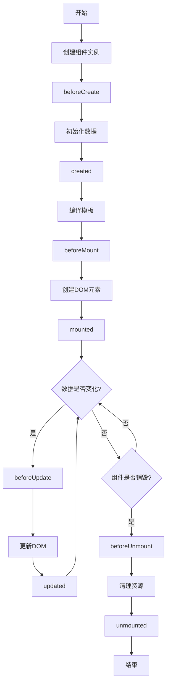

我将为您编写一份详细的Vue组件生命周期指南，适合不同级别的开发者阅读。

```markdown:c:\project\kphub\src\frontend\vue\03-组件\3.3-组件生命周期.md
---
title: 组件生命周期
icon: lifecycle
order: 3
---

# 组件生命周期

组件生命周期是理解组件工作机制的关键。本文将介绍Vue组件的生命周期钩子函数，包括创建、挂载、更新、卸载等各个阶段的钩子，以及它们的调用时机和使用场景，帮助读者掌握组件生命周期的管理方法。

## 什么是组件生命周期？

在Vue中，组件生命周期是指组件从创建、初始化数据、编译模板、挂载DOM、渲染、更新到卸载的整个过程。Vue为我们提供了一系列的生命周期钩子函数，让我们可以在组件生命周期的不同阶段执行自定义的代码。

理解组件生命周期对于以下方面至关重要：

1. **性能优化**：在合适的生命周期阶段执行代码，可以避免不必要的计算和渲染。
2. **资源管理**：在组件创建时设置资源（如定时器、事件监听器），并在组件销毁时清理这些资源。
3. **数据获取**：在组件挂载后从服务器获取数据。
4. **DOM操作**：在DOM可用后进行直接的DOM操作。
5. **组件交互**：控制父子组件之间的通信时机。

## 生命周期概览

Vue组件的生命周期可以分为四个主要阶段：**创建**、**挂载**、**更新**和**销毁**。每个阶段都有对应的生命周期钩子函数。

### Vue 2 生命周期钩子

在Vue 2中，生命周期钩子函数包括：

1. **创建阶段**：
   - `beforeCreate`：组件实例刚被创建，组件属性计算之前，如data属性等
   - `created`：组件实例创建完成，属性已绑定，但DOM还未生成

2. **挂载阶段**：
   - `beforeMount`：模板编译/挂载之前
   - `mounted`：模板编译/挂载之后

3. **更新阶段**：
   - `beforeUpdate`：组件更新之前
   - `updated`：组件更新之后

4. **销毁阶段**：
   - `beforeDestroy`：组件销毁前
   - `destroyed`：组件销毁后

5. **其他钩子**：
   - `activated`：被keep-alive缓存的组件激活时
   - `deactivated`：被keep-alive缓存的组件停用时
   - `errorCaptured`：捕获一个来自后代组件的错误时

### Vue 3 生命周期钩子

在Vue 3中，生命周期钩子函数有一些变化：

1. **创建阶段**：
   - `beforeCreate`：组件实例刚被创建
   - `created`：组件实例创建完成

2. **挂载阶段**：
   - `beforeMount`：模板编译/挂载之前
   - `mounted`：模板编译/挂载之后

3. **更新阶段**：
   - `beforeUpdate`：组件更新之前
   - `updated`：组件更新之后

4. **销毁阶段**（重命名）：
   - `beforeUnmount`：组件卸载前（替代beforeDestroy）
   - `unmounted`：组件卸载后（替代destroyed）

5. **其他钩子**：
   - `activated`：被keep-alive缓存的组件激活时
   - `deactivated`：被keep-alive缓存的组件停用时
   - `errorCaptured`：捕获一个来自后代组件的错误时
   - `renderTracked`：跟踪虚拟DOM重新渲染时
   - `renderTriggered`：虚拟DOM重新渲染被触发时

### 组合式API中的生命周期钩子

在Vue 3的组合式API中，生命周期钩子以函数的形式存在：

- `setup`：在beforeCreate和created之间执行
- `onBeforeMount`：对应beforeMount
- `onMounted`：对应mounted
- `onBeforeUpdate`：对应beforeUpdate
- `onUpdated`：对应updated
- `onBeforeUnmount`：对应beforeUnmount
- `onUnmounted`：对应unmounted
- `onActivated`：对应activated
- `onDeactivated`：对应deactivated
- `onErrorCaptured`：对应errorCaptured
- `onRenderTracked`：对应renderTracked
- `onRenderTriggered`：对应renderTriggered

## 生命周期图示

下面是Vue组件生命周期的流程图，展示了各个生命周期钩子的调用时机：



## 详解各个生命周期钩子

接下来，我们将详细介绍每个生命周期钩子的调用时机、可用资源和常见用途。

### 创建阶段

#### beforeCreate

**调用时机**：在实例初始化之后，数据观测（data observer）和事件配置之前被调用。

**可用资源**：组件实例已经创建，但是数据和事件都还没有初始化，因此无法访问data、computed、methods、watch等选项。

**常见用途**：
- 设置组件的初始状态
- 执行一些与组件数据无关的初始化操作

```vue
<script>
export default {
  beforeCreate() {
    console.log('beforeCreate被调用')
    console.log('this.message:', this.message) // undefined，因为data还没有初始化
  },
  data() {
    return {
      message: 'Hello Vue!'
    }
  }
}
</script>
```

#### created

**调用时机**：在实例创建完成后被立即调用。在这一步，实例已完成以下的配置：数据观测（data observer），属性和方法的运算，watch/event事件回调。然而，挂载阶段还没开始，$el属性目前不可见。

**可用资源**：可以访问data、computed、methods、watch等选项。

**常见用途**：
- 初始化数据
- 发送网络请求获取初始数据
- 设置事件监听器
- 执行其他需要在组件创建后立即进行的操作

```vue
<script>
export default {
  data() {
    return {
      message: 'Hello Vue!',
      users: []
    }
  },
  created() {
    console.log('created被调用')
    console.log('this.message:', this.message) // 'Hello Vue!'，可以访问data
    
    // 发送网络请求获取初始数据
    this.fetchUsers()
  },
  methods: {
    async fetchUsers() {
      try {
        const response = await fetch('https://api.example.com/users')
        this.users = await response.json()
      } catch (error) {
        console.error('获取用户数据失败:', error)
      }
    }
  }
}
</script>
```

### 挂载阶段

#### beforeMount

**调用时机**：在挂载开始之前被调用，相关的render函数首次被调用。

**可用资源**：可以访问data、computed、methods等选项，但是DOM还没有被挂载，因此无法访问$el。

**常见用途**：
- 在渲染前最后修改数据
- 访问并可能修改计算属性
- 执行一些与DOM无关的操作

```vue
<template>
  <div>
    <p>{{ message }}</p>
  </div>
</template>

<script>
export default {
  data() {
    return {
      message: 'Hello Vue!'
    }
  },
  beforeMount() {
    console.log('beforeMount被调用')
    console.log('this.$el:', this.$el) // undefined或注释节点，因为DOM还没有被挂载
    
    // 在渲染前最后修改数据
    this.message = 'Updated before mount'
  }
}
</script>
```

#### mounted

**调用时机**：在实例挂载到DOM后被调用，此时可以访问到DOM元素。

**可用资源**：可以访问data、computed、methods等选项，以及DOM元素（通过this.$el或ref）。

**常见用途**：
- 访问和操作DOM元素
- 初始化需要DOM的库（如图表库、地图库）
- 添加DOM事件监听器
- 发送网络请求并更新DOM

```vue
<template>
  <div>
    <p ref="messageEl">{{ message }}</p>
    <div ref="chartContainer"></div>
  </div>
</template>

<script>
export default {
  data() {
    return {
      message: 'Hello Vue!',
      chart: null
    }
  },
  mounted() {
    console.log('mounted被调用')
    console.log('this.$el:', this.$el) // 实际的DOM元素
    
    // 访问DOM元素
    console.log(this.$refs.messageEl.textContent) // 'Hello Vue!'
    
    // 初始化需要DOM的库
    this.initChart()
    
    // 添加DOM事件监听器
    window.addEventListener('resize', this.handleResize)
  },
  methods: {
    initChart() {
      // 假设我们使用某个图表库
      this.chart = new SomeChartLibrary(this.$refs.chartContainer, {
        // 配置选项
      })
    },
    handleResize() {
      // 处理窗口大小变化
      if (this.chart) {
        this.chart.resize()
      }
    }
  },
  beforeUnmount() {
    // 清理事件监听器
    window.removeEventListener('resize', this.handleResize)
    
    // 清理图表实例
    if (this.chart) {
      this.chart.destroy()
      this.chart = null
    }
  }
}
</script>
```

### 更新阶段

#### beforeUpdate

**调用时机**：在数据更新后，DOM更新之前被调用。

**可用资源**：可以访问更新后的数据，但DOM仍然是更新前的状态。

**常见用途**：
- 在DOM更新前访问现有的DOM，例如手动移除已添加的事件监听器
- 在更新前获取DOM状态（如滚动位置）

```vue
<template>
  <div>
    <p ref="messageEl">{{ message }}</p>
    <button @click="updateMessage">更新消息</button>
  </div>
</template>

<script>
export default {
  data() {
    return {
      message: 'Hello Vue!',
      scrollPosition: 0
    }
  },
  methods: {
    updateMessage() {
      this.message = 'Updated message: ' + Date.now()
    }
  },
  beforeUpdate() {
    console.log('beforeUpdate被调用')
    console.log('数据已更新:', this.message)
    console.log('DOM未更新:', this.$refs.messageEl.textContent) // 仍然显示旧消息
    
    // 在DOM更新前保存滚动位置
    this.scrollPosition = document.documentElement.scrollTop
  }
}
</script>
```

#### updated

**调用时机**：在数据更新导致的DOM更新完成后被调用。

**可用资源**：可以访问更新后的数据和DOM。

**常见用途**：
- 执行依赖于更新后DOM的操作
- 更新第三方库的状态
- 根据新DOM重新计算布局

```vue
<template>
  <div>
    <p ref="messageEl">{{ message }}</p>
    <button @click="updateMessage">更新消息</button>
    <div ref="listContainer">
      <div v-for="(item, index) in items" :key="index">{{ item }}</div>
    </div>
  </div>
</template>

<script>
export default {
  data() {
    return {
      message: 'Hello Vue!',
      items: ['Item 1', 'Item 2', 'Item 3']
    }
  },
  methods: {
    updateMessage() {
      this.message = 'Updated message: ' + Date.now()
      this.items.push('Item ' + (this.items.length + 1))
    }
  },
  updated() {
    console.log('updated被调用')
    console.log('DOM已更新:', this.$refs.messageEl.textContent) // 显示新消息
    
    // 执行依赖于更新后DOM的操作
    this.updateScrollbar()
  },
  methods: {
    updateMessage() {
      this.message = 'Updated message: ' + Date.now()
      this.items.push('Item ' + (this.items.length + 1))
    },
    updateScrollbar() {
      // 假设我们使用自定义滚动条库
      if (this.$refs.listContainer) {
        // 更新滚动条
        this.scrollbar.update()
      }
    }
  }
}
</script>
```

**注意事项**：
- 不要在`updated`钩子中修改组件的数据，这可能会导致无限循环更新。
- 如果需要监听特定数据的变化并执行操作，应该使用`watch`或计算属性。

### 销毁阶段

#### beforeUnmount (Vue 3) / beforeDestroy (Vue 2)

**调用时机**：在组件卸载前被调用。

**可用资源**：组件实例仍然完全可用，包括数据、方法和DOM。

**常见用途**：
- 清理定时器
- 移除事件监听器
- 取消网络请求
- 清理第三方库实例

```vue
<script>
export default {
  data() {
    return {
      timer: null,
      chart: null
    }
  },
  mounted() {
    // 设置定时器
    this.timer = setInterval(() => {
      console.log('定时器执行中...')
    }, 1000)
    
    // 初始化图表
    this.chart = new SomeChartLibrary(this.$refs.chartContainer)
    
    // 添加事件监听器
    window.addEventListener('resize', this.handleResize)
  },
  beforeUnmount() { // Vue 3
  // beforeDestroy() { // Vue 2
    console.log('beforeUnmount被调用')
    
    // 清理定时器
    if (this.timer) {
      clearInterval(this.timer)
      this.timer = null
    }
    
    // 清理图表实例
    if (this.chart) {
      this.chart.destroy()
      this.chart = null
    }
    
    // 移除事件监听器
    window.removeEventListener('resize', this.handleResize)
  },
  methods: {
    handleResize() {
      // 处理窗口大小变化
    }
  }
}
</script>
```

#### unmounted (Vue 3) / destroyed (Vue 2)

**调用时机**：在组件卸载后被调用。

**可用资源**：组件实例已经解绑，所有的指令都被解绑，子实例也被销毁。

**常见用途**：
- 执行最终的清理操作
- 通知其他组件或服务该组件已被销毁

```vue
<script>
export default {
  unmounted() { // Vue 3
  // destroyed() { // Vue 2
    console.log('unmounted被调用')
    console.log('组件已被完全销毁')
    
    // 通知其他组件或服务
    eventBus.emit('componentDestroyed', this.$options.name)
  }
}
</script>
```

### 其他钩子

#### activated

**调用时机**：被keep-alive缓存的组件激活时调用。

**常见用途**：
- 恢复组件状态
- 重新获取可能已过期的数据
- 重新初始化需要的资源

```vue
<script>
export default {
  data() {
    return {
      lastUpdated: null,
      data: null
    }
  },
  activated() {
    console.log('activated被调用')
    
    // 检查数据是否需要刷新
    const now = Date.now()
    if (!this.lastUpdated || now - this.lastUpdated > 60000) { // 如果数据超过1分钟
      this.fetchData()
      this.lastUpdated = now
    }
  },
  methods: {
    async fetchData() {
      // 获取最新数据
      const response = await fetch('https://api.example.com/data')
      this.data = await response.json()
    }
  }
}
</script>
```

#### deactivated

**调用时机**：被keep-alive缓存的组件停用时调用。

**常见用途**：
- 保存组件状态
- 暂停消耗资源的操作
- 清理临时资源

```vue
<script>
export default {
  data() {
    return {
      videoPlayer: null,
      scrollPosition: 0
    }
  },
  mounted() {
    this.initVideoPlayer()
  },
  deactivated() {
    console.log('deactivated被调用')
    
    // 暂停视频播放
    if (this.videoPlayer) {
      this.videoPlayer.pause()
    }
    
    // 保存滚动位置
    this.scrollPosition = this.$el.scrollTop
  },
  activated() {
    // 恢复滚动位置
    this.$nextTick(() => {
      this.$el.scrollTop = this.scrollPosition
    })
    
    // 如果用户之前在播放视频，可以选择是否自动恢复播放
  },
  methods: {
    initVideoPlayer() {
      // 初始化视频播放器
      this.videoPlayer = new VideoPlayer(this.$refs.videoContainer)
    }
  }
}
</script>
```

#### errorCaptured

**调用时机**：当捕获一个来自后代组件的错误时被调用。

**常见用途**：
- 错误处理和日志记录
- 显示错误信息
- 提供备用UI

```vue
<template>
  <div>
    <h2>父组件</h2>
    <div v-if="hasError">
      <p>子组件发生错误: {{ errorMessage }}</p>
      <button @click="resetError">重试</button>
    </div>
    <ChildComponent v-else />
  </div>
</template>

<script>
import ChildComponent from './ChildComponent.vue'

export default {
  components: {
    ChildComponent
  },
  data() {
    return {
      hasError: false,
      errorMessage: ''
    }
  },
  errorCaptured(err, vm, info) {
    console.log('errorCaptured被调用')
    console.error(err)
    
    // 记录错误
    this.logError(err, info)
    
    // 显示错误信息
    this.hasError = true
    this.errorMessage = err.message || '未知错误'
    
    // 返回false阻止错误继续向上传播
    return false
  },
  methods: {
    logError(err, info) {
      // 发送错误到日志服务
      console.log(`错误: ${err.toString()}\n信息: ${info}`)
    },
    resetError() {
      this.hasError = false
      this.errorMessage = ''
    }
  }
}
</script>
```

#### renderTracked 和 renderTriggered (Vue 3 only)

这两个钩子函数是Vue 3新增的，主要用于调试。

**renderTracked**：在渲染过程中追踪到响应式依赖时调用。

**renderTriggered**：在响应式依赖触发重新渲染时调用。

```vue
<script>
export default {
  renderTracked(event) {
    console.log('renderTracked', event)
  },
  renderTriggered(event) {
    console.log('renderTriggered', event)
  }
}
</script>
```

在组合式API中：

```vue
<script setup>
import { onRenderTracked, onRenderTriggered } from 'vue'

onRenderTracked((event) => {
  console.log('renderTracked', event)
})

onRenderTriggered((event) => {
  console.log('renderTriggered', event)
})
</script>
```

## 组合式API中的生命周期钩子

在Vue 3的组合式API中，生命周期钩子以函数的形式存在，需要在`setup`函数中调用。

```vue
<script>
import { 
  ref, 
  onBeforeMount, 
  onMounted, 
  onBeforeUpdate, 
  onUpdated, 
  onBeforeUnmount, 
  onUnmounted, 
  onActivated, 
  onDeactivated, 
  onErrorCaptured 
} from 'vue'

export default {
  setup() {
    const message = ref('Hello Vue!')
    
    // 创建阶段
    // beforeCreate 和 created 钩子不需要显式定义
    // 因为setup本身在beforeCreate和created之间执行
    console.log('setup执行，相当于beforeCreate和created之间')
    
    // 挂载阶段
    onBeforeMount(() => {
      console.log('onBeforeMount被调用')
    })
    
    onMounted(() => {
      console.log('onMounted被调用')
    })
    
    // 更新阶段
    onBeforeUpdate(() => {
      console.log('onBeforeUpdate被调用')
    })
    
    onUpdated(() => {
      console.log('onUpdated被调用')
    })
    
    // 销毁阶段
    onBeforeUnmount(() => {
      console.log('onBeforeUnmount被调用')
    })
    
    onUnmounted(() => {
      console.log('onUnmounted被调用')
    })
    
    // 其他钩子
    onActivated(() => {
      console.log('onActivated被调用')
    })
    
    onDeactivated(() => {
      console.log('onDeactivated被调用')
    })
    
    onErrorCaptured((err, vm, info) => {
      console.log('onErrorCaptured被调用')
      return false // 阻止错误继续向上传播
    })
    
    return {
      message
    }
  }
}
</script>
```

使用`<script setup>`语法糖：

```vue
<script setup>
import { 
  ref, 
  onBeforeMount, 
  onMounted, 
  onBeforeUpdate, 
  onUpdated, 
  onBeforeUnmount, 
  onUnmounted, 
  onActivated, 
  onDeactivated, 
  onErrorCaptured 
} from 'vue'

const message = ref('Hello Vue!')

// 挂载阶段
onBeforeMount(() => {
  console.log('onBeforeMount被调用')
})

onMounted(() => {
  console.log('onMounted被调用')
})

// 更新阶段
onBeforeUpdate(() => {
  console.log('onBeforeUpdate被调用')
})

onUpdated(() => {
  console.log('onUpdated被调用')
})

// 销毁阶段
onBeforeUnmount(() => {
  console.log('onBeforeUnmount被调用')
})

onUnmounted(() => {
  console.log('onUnmounted被调用')
})

// 其他钩子
onActivated(() => {
  console.log('onActivated被调用')
})

onDeactivated(() => {
  console.log('onDeactivated被调用')
})

onErrorCaptured((err, vm, info) => {
  console.log('onErrorCaptured被调用')
  return false // 阻止错误继续向上传播
})
</script>
```

## 生命周期钩子的实际应用

接下来，我们将通过一些实际的例子来展示如何在不同场景中使用生命周期钩子。

### 示例1：数据获取

在组件挂载后从服务器获取数据是一个常见的需求。

```vue
<template>
  <div>
    <h2>用户列表</h2>
    <div v-if="loading">加载中...</div>
    <div v-else-if="error">加载失败: {{ error }}</div>
    <ul v-else>
      <li v-for="user in users" :key="user.id">
        {{ user.name }} ({{ user.email }})
      </li>
    </ul>
  </div>
</template>

<script>
export default {
  data() {
    return {
      users: [],
      loading: true,
      error: null
    }
  },
  created() {
    // 在created钩子中发起请求，这样即使在服务器端渲染时也能执行
    this.fetchUsers()
  },
  methods: {
    async fetchUsers() {
      this.loading = true
      this.error = null
      
      try {
        const response = await fetch('https://jsonplaceholder.typicode.com/users')
        if (!response.ok) {
          throw new Error(`HTTP error! status: ${response.status}`)
        }
        this.users = await response.json()
      } catch (e) {
        this.error = e.message
        console.error('获取用户数据失败:', e)
      } finally {
        this.loading = false
      }
    }
  }
}
</script>
```

使用组合式API：

```vue
<template>
  <div>
    <h2>用户列表</h2>
    <div v-if="loading">加载中...</div>
    <div v-else-if="error">加载失败: {{ error }}</div>
    <ul v-else>
      <li v-for="user in users" :key="user.id">
        {{ user.name }} ({{ user.email }})
      </li>
    </ul>
  </div>
</template>

<script setup>
import { ref, onMounted } from 'vue'

const users = ref([])
const loading = ref(true)
const error = ref(null)

// 可以直接在setup中调用，或者在onMounted中调用
// 这里选择在onMounted中调用，因为我们只需要在客户端渲染时获取数据
onMounted(() => {
  fetchUsers()
})

async function fetchUsers() {
  loading.value = true
  error.value = null
  
  try {
    const response = await fetch('https://jsonplaceholder.typicode.com/users')
    if (!response.ok) {
      throw new Error(`HTTP error! status: ${response.status}`)
    }
    users.value = await response.json()
  } catch (e) {
    error.value = e.message
    console.error('获取用户数据失败:', e)
  } finally {
    loading.value = false
  }
}
</script>
```

### 示例2：集成第三方库

在`mounted`钩子中初始化需要DOM的第三方库，并在`beforeUnmount`钩子中清理。

```vue
<template>
  <div>
    <div ref="chart" style="width: 600px; height: 400px;"></div>
  </div>
</template>

<script>
// 假设我们使用ECharts
import * as echarts from 'echarts'

export default {
  data() {
    return {
      chart: null,
      chartData: [
        { name: '类别1', value: 20 },
        { name: '类别2', value: 50 },
        { name: '类别3', value: 30 }
      ]
    }
  },
  mounted() {
    // 在DOM挂载后初始化图表
    this.initChart()
    
    // 添加窗口大小变化的监听器
    window.addEventListener('resize', this.handleResize)
  },
  beforeUnm我将继续编写Vue组件生命周期的内容，接着上次的示例2部分。

```markdown:c:\project\kphub\src\frontend\vue\03-组件\3.3-组件生命周期.md
  mounted() {
    // 在DOM挂载后初始化图表
    this.initChart()
    
    // 添加窗口大小变化的监听器
    window.addEventListener('resize', this.handleResize)
  },
  beforeUnmount() { // Vue 3
  // beforeDestroy() { // Vue 2
    // 在组件销毁前清理资源
    if (this.chart) {
      this.chart.dispose()
      this.chart = null
    }
    
    // 移除事件监听器
    window.removeEventListener('resize', this.handleResize)
  },
  methods: {
    initChart() {
      // 初始化图表实例
      this.chart = echarts.init(this.$refs.chart)
      
      // 设置图表选项
      const option = {
        title: {
          text: '示例图表'
        },
        tooltip: {},
        xAxis: {
          data: this.chartData.map(item => item.name)
        },
        yAxis: {},
        series: [{
          name: '数值',
          type: 'bar',
          data: this.chartData.map(item => item.value)
        }]
      }
      
      // 渲染图表
      this.chart.setOption(option)
    },
    handleResize() {
      // 调整图表大小
      if (this.chart) {
        this.chart.resize()
      }
    }
  }
}
</script>
```

使用组合式API：

```vue
<template>
  <div>
    <div ref="chartRef" style="width: 600px; height: 400px;"></div>
  </div>
</template>

<script setup>
import { ref, onMounted, onBeforeUnmount } from 'vue'
import * as echarts from 'echarts'

const chartRef = ref(null)
let chart = null

const chartData = [
  { name: '类别1', value: 20 },
  { name: '类别2', value: 50 },
  { name: '类别3', value: 30 }
]

onMounted(() => {
  initChart()
  window.addEventListener('resize', handleResize)
})

onBeforeUnmount(() => {
  if (chart) {
    chart.dispose()
    chart = null
  }
  window.removeEventListener('resize', handleResize)
})

function initChart() {
  // 确保DOM元素已经渲染
  if (chartRef.value) {
    chart = echarts.init(chartRef.value)
    
    const option = {
      title: {
        text: '示例图表'
      },
      tooltip: {},
      xAxis: {
        data: chartData.map(item => item.name)
      },
      yAxis: {},
      series: [{
        name: '数值',
        type: 'bar',
        data: chartData.map(item => item.value)
      }]
    }
    
    chart.setOption(option)
  }
}

function handleResize() {
  if (chart) {
    chart.resize()
  }
}
</script>
```

### 示例3：表单状态管理

使用生命周期钩子管理表单状态，包括初始化、重置和提交。

```vue
<template>
  <div>
    <h2>用户表单</h2>
    <form @submit.prevent="submitForm">
      <div>
        <label for="name">姓名:</label>
        <input id="name" v-model="form.name" required>
      </div>
      <div>
        <label for="email">邮箱:</label>
        <input id="email" v-model="form.email" type="email" required>
      </div>
      <div>
        <label for="age">年龄:</label>
        <input id="age" v-model.number="form.age" type="number" min="0">
      </div>
      <div>
        <button type="submit">提交</button>
        <button type="button" @click="resetForm">重置</button>
      </div>
    </form>
    <div v-if="submitting">提交中...</div>
    <div v-if="submitSuccess">提交成功!</div>
    <div v-if="submitError">提交失败: {{ submitError }}</div>
  </div>
</template>

<script>
export default {
  props: {
    userId: {
      type: Number,
      default: null
    }
  },
  data() {
    return {
      initialForm: {
        name: '',
        email: '',
        age: null
      },
      form: {
        name: '',
        email: '',
        age: null
      },
      submitting: false,
      submitSuccess: false,
      submitError: null
    }
  },
  created() {
    // 如果有userId，则获取用户数据
    if (this.userId) {
      this.fetchUserData()
    }
  },
  methods: {
    async fetchUserData() {
      try {
        const response = await fetch(`https://api.example.com/users/${this.userId}`)
        const userData = await response.json()
        
        // 更新表单数据
        this.form = {
          name: userData.name,
          email: userData.email,
          age: userData.age
        }
        
        // 更新初始表单数据，用于重置
        this.initialForm = { ...this.form }
      } catch (error) {
        console.error('获取用户数据失败:', error)
      }
    },
    resetForm() {
      // 重置表单为初始状态
      this.form = { ...this.initialForm }
      this.submitSuccess = false
      this.submitError = null
    },
    async submitForm() {
      this.submitting = true
      this.submitSuccess = false
      this.submitError = null
      
      try {
        // 模拟API请求
        await new Promise(resolve => setTimeout(resolve, 1000))
        
        // 这里应该是实际的API请求
        // const response = await fetch('https://api.example.com/users', {
        //   method: this.userId ? 'PUT' : 'POST',
        //   headers: {
        //     'Content-Type': 'application/json'
        //   },
        //   body: JSON.stringify(this.form)
        // })
        
        // if (!response.ok) {
        //   throw new Error(`HTTP error! status: ${response.status}`)
        // }
        
        this.submitSuccess = true
        
        // 如果是新建用户，重置表单
        if (!this.userId) {
          this.resetForm()
        }
      } catch (error) {
        this.submitError = error.message
        console.error('提交表单失败:', error)
      } finally {
        this.submitting = false
      }
    }
  },
  // 当组件被复用时（如在路由切换时），重置表单状态
  beforeUpdate() {
    if (this.$route && this.$route.params.userId !== this.userId) {
      this.resetForm()
      if (this.$route.params.userId) {
        this.fetchUserData(this.$route.params.userId)
      }
    }
  }
}
</script>
```

使用组合式API：

```vue
<template>
  <div>
    <h2>用户表单</h2>
    <form @submit.prevent="submitForm">
      <div>
        <label for="name">姓名:</label>
        <input id="name" v-model="form.name" required>
      </div>
      <div>
        <label for="email">邮箱:</label>
        <input id="email" v-model="form.email" type="email" required>
      </div>
      <div>
        <label for="age">年龄:</label>
        <input id="age" v-model.number="form.age" type="number" min="0">
      </div>
      <div>
        <button type="submit">提交</button>
        <button type="button" @click="resetForm">重置</button>
      </div>
    </form>
    <div v-if="submitting">提交中...</div>
    <div v-if="submitSuccess">提交成功!</div>
    <div v-if="submitError">提交失败: {{ submitError }}</div>
  </div>
</template>

<script setup>
import { ref, reactive, watch, onMounted } from 'vue'
import { useRoute } from 'vue-router'

const props = defineProps({
  userId: {
    type: Number,
    default: null
  }
})

const initialForm = reactive({
  name: '',
  email: '',
  age: null
})

const form = reactive({
  name: '',
  email: '',
  age: null
})

const submitting = ref(false)
const submitSuccess = ref(false)
const submitError = ref(null)
const route = useRoute()

// 监听userId的变化
watch(() => props.userId, (newUserId) => {
  if (newUserId) {
    fetchUserData(newUserId)
  } else {
    resetForm()
  }
}, { immediate: true })

// 监听路由参数变化
watch(() => route.params.userId, (newUserId) => {
  if (newUserId !== props.userId) {
    resetForm()
    if (newUserId) {
      fetchUserData(Number(newUserId))
    }
  }
})

async function fetchUserData(userId) {
  try {
    const response = await fetch(`https://api.example.com/users/${userId}`)
    const userData = await response.json()
    
    // 更新表单数据
    Object.assign(form, {
      name: userData.name,
      email: userData.email,
      age: userData.age
    })
    
    // 更新初始表单数据，用于重置
    Object.assign(initialForm, { ...form })
  } catch (error) {
    console.error('获取用户数据失败:', error)
  }
}

function resetForm() {
  Object.assign(form, { ...initialForm })
  submitSuccess.value = false
  submitError.value = null
}

async function submitForm() {
  submitting.value = true
  submitSuccess.value = false
  submitError.value = null
  
  try {
    // 模拟API请求
    await new Promise(resolve => setTimeout(resolve, 1000))
    
    // 这里应该是实际的API请求
    // const response = await fetch('https://api.example.com/users', {
    //   method: props.userId ? 'PUT' : 'POST',
    //   headers: {
    //     'Content-Type': 'application/json'
    //   },
    //   body: JSON.stringify(form)
    // })
    
    // if (!response.ok) {
    //   throw new Error(`HTTP error! status: ${response.status}`)
    // }
    
    submitSuccess.value = true
    
    // 如果是新建用户，重置表单
    if (!props.userId) {
      resetForm()
    }
  } catch (error) {
    submitError.value = error.message
    console.error('提交表单失败:', error)
  } finally {
    submitting.value = false
  }
}
</script>
```

### 示例4：使用keep-alive和生命周期钩子

使用`keep-alive`组件缓存组件状态，并利用`activated`和`deactivated`钩子管理组件的激活和停用。

```vue
<!-- 父组件 -->
<template>
  <div>
    <button 
      v-for="tab in tabs" 
      :key="tab.id" 
      @click="currentTab = tab.id"
      :class="{ active: currentTab === tab.id }"
    >
      {{ tab.name }}
    </button>
    
    <keep-alive>
      <component :is="currentTabComponent"></component>
    </keep-alive>
  </div>
</template>

<script>
import TabA from './TabA.vue'
import TabB from './TabB.vue'
import TabC from './TabC.vue'

export default {
  components: {
    TabA,
    TabB,
    TabC
  },
  data() {
    return {
      currentTab: 'a',
      tabs: [
        { id: 'a', name: '标签A' },
        { id: 'b', name: '标签B' },
        { id: 'c', name: '标签C' }
      ]
    }
  },
  computed: {
    currentTabComponent() {
      return `Tab${this.currentTab.toUpperCase()}`
    }
  }
}
</script>
```

```vue
<!-- TabA.vue -->
<template>
  <div>
    <h2>标签A内容</h2>
    <input v-model="message" placeholder="输入消息">
    <p>消息: {{ message }}</p>
    <p>页面访问次数: {{ visitCount }}</p>
  </div>
</template>

<script>
export default {
  data() {
    return {
      message: '',
      visitCount: 0,
      intervalId: null
    }
  },
  // 组件首次创建时调用
  created() {
    console.log('TabA created')
  },
  // 组件首次挂载时调用
  mounted() {
    console.log('TabA mounted')
  },
  // 组件被keep-alive缓存后激活时调用
  activated() {
    console.log('TabA activated')
    this.visitCount++
    
    // 启动定时器
    this.intervalId = setInterval(() => {
      console.log('TabA 定时器运行中...')
    }, 1000)
  },
  // 组件被keep-alive缓存后停用时调用
  deactivated() {
    console.log('TabA deactivated')
    
    // 清理定时器
    if (this.intervalId) {
      clearInterval(this.intervalId)
      this.intervalId = null
    }
  },
  // 组件被销毁时调用（如果没有被keep-alive缓存）
  beforeUnmount() {
    console.log('TabA beforeUnmount')
  }
}
</script>
```

使用组合式API：

```vue
<!-- TabA.vue -->
<template>
  <div>
    <h2>标签A内容</h2>
    <input v-model="message" placeholder="输入消息">
    <p>消息: {{ message }}</p>
    <p>页面访问次数: {{ visitCount }}</p>
  </div>
</template>

<script setup>
import { ref, onMounted, onActivated, onDeactivated, onBeforeUnmount } from 'vue'

const message = ref('')
const visitCount = ref(0)
let intervalId = null

// 组件首次创建和挂载
onMounted(() => {
  console.log('TabA mounted')
})

// 组件被keep-alive缓存后激活
onActivated(() => {
  console.log('TabA activated')
  visitCount.value++
  
  // 启动定时器
  intervalId = setInterval(() => {
    console.log('TabA 定时器运行中...')
  }, 1000)
})

// 组件被keep-alive缓存后停用
onDeactivated(() => {
  console.log('TabA deactivated')
  
  // 清理定时器
  if (intervalId) {
    clearInterval(intervalId)
    intervalId = null
  }
})

// 组件被销毁（如果没有被keep-alive缓存）
onBeforeUnmount(() => {
  console.log('TabA beforeUnmount')
  
  // 确保清理定时器
  if (intervalId) {
    clearInterval(intervalId)
    intervalId = null
  }
})
</script>
```

## 生命周期钩子的最佳实践

在使用生命周期钩子时，以下是一些最佳实践：

### 1. 在正确的钩子中执行正确的操作

- **created**：适合进行初始化工作，如设置数据、事件监听等，但不涉及DOM操作。
- **mounted**：适合进行DOM操作、发送网络请求、访问子组件等。
- **updated**：适合在数据变化后执行DOM相关操作，但要避免在此钩子中修改数据，以防止无限循环。
- **beforeUnmount**：适合清理资源，如定时器、事件监听器等。

### 2. 避免在生命周期钩子中使用箭头函数

在选项式API中，避免使用箭头函数定义生命周期方法，因为箭头函数没有自己的`this`上下文。

```javascript
// 错误
export default {
  mounted: () => {
    // 这里的this不指向组件实例
    console.log(this.message) // undefined
  }
}

// 正确
export default {
  mounted() {
    // 这里的this指向组件实例
    console.log(this.message)
  }
}
```

### 3. 在合适的钩子中获取数据

- 如果数据对于渲染初始UI是必要的，可以在`created`钩子中获取。
- 如果数据获取依赖于DOM，应该在`mounted`钩子中获取。
- 对于需要在组件重新激活时刷新的数据，可以在`activated`钩子中获取。

### 4. 清理资源

始终在`beforeUnmount`（Vue 3）或`beforeDestroy`（Vue 2）钩子中清理组件创建的资源，如：

- 定时器（`setTimeout`、`setInterval`）
- 事件监听器（`addEventListener`）
- 第三方库实例
- WebSocket连接
- 观察者（如`MutationObserver`、`ResizeObserver`）

```javascript
export default {
  mounted() {
    this.timer = setInterval(() => {
      // 某些操作
    }, 1000)
    
    window.addEventListener('resize', this.handleResize)
  },
  beforeUnmount() {
    // 清理定时器
    clearInterval(this.timer)
    
    // 移除事件监听器
    window.removeEventListener('resize', this.handleResize)
  }
}
```

### 5. 使用watch代替生命周期钩子监听数据变化

对于需要响应特定数据变化的逻辑，使用`watch`或计算属性通常比在`updated`钩子中检查更有效。

```javascript
// 不推荐
export default {
  data() {
    return {
      message: ''
    }
  },
  updated() {
    // 这会在任何数据变化时触发，不仅仅是message
    console.log('message更新为:', this.message)
  }
}

// 推荐
export default {
  data() {
    return {
      message: ''
    }
  },
  watch: {
    message(newValue, oldValue) {
      // 只在message变化时触发
      console.log('message从', oldValue, '更新为', newValue)
    }
  }
}
```

### 6. 使用错误处理

在生命周期钩子中添加适当的错误处理，特别是在进行异步操作时。

```javascript
export default {
  async mounted() {
    try {
      await this.fetchData()
    } catch (error) {
      console.error('获取数据失败:', error)
      this.error = error.message
    }
  }
}
```

### 7. 避免在模板中使用生命周期钩子

生命周期钩子应该在组件定义中使用，而不是在模板中。

```vue
<!-- 不推荐 -->
<template>
  <div @mounted="doSomething">...</div>
</template>

<!-- 推荐 -->
<template>
  <div>...</div>
</template>

<script>
export default {
  mounted() {
    this.doSomething()
  },
  methods: {
    doSomething() {
      // ...
    }
  }
}
</script>
```

## 调试生命周期

在开发过程中，了解组件的生命周期状态对于调试非常有帮助。以下是一些调试生命周期的技巧：

### 1. 使用console.log

在各个生命周期钩子中添加`console.log`语句，可以帮助你了解钩子的调用顺序和时机。

```javascript
export default {
  beforeCreate() {
    console.log(`${this.$options.name || 'Component'} beforeCreate`)
  },
  created() {
    console.log(`${this.$options.name || 'Component'} created`)
  },
  beforeMount() {
    console.log(`${this.$options.name || 'Component'} beforeMount`)
  },
  mounted() {
    console.log(`${this.$options.name || 'Component'} mounted`)
  },
  beforeUpdate() {
    console.log(`${this.$options.name || 'Component'} beforeUpdate`)
  },
  updated() {
    console.log(`${this.$options.name || 'Component'} updated`)
  },
  beforeUnmount() {
    console.log(`${this.$options.name || 'Component'} beforeUnmount`)
  },
  unmounted() {
    console.log(`${this.$options.name || 'Component'} unmounted`)
  }
}
```

### 2. 使用Vue Devtools

Vue Devtools是一个浏览器扩展，可以帮助你检查Vue组件的状态、事件和生命周期。

### 3. 使用renderTracked和renderTriggered钩子（Vue 3）

在Vue 3中，可以使用`renderTracked`和`renderTriggered`钩子来调试组件的渲染过程。

```javascript
export default {
  renderTracked(event) {
    console.log('renderTracked', event)
  },
  renderTriggered(event) {
    console.log('renderTriggered', event)
  }
}
```

## 常见问题与解决方案

### 1. 在created中访问DOM

问题：在`created`钩子中尝试访问DOM元素，但它们还不存在。

解决方案：将DOM操作移到`mounted`钩子中。

```javascript
// 错误
export default {
  created() {
    // 此时DOM还不存在
    const element = document.getElementById('my-element') // null
  }
}

// 正确
export default {
  mounted() {
    // 此时DOM已经存在
    const element = document.getElementById('my-element')
  }
}
```

### 2. 在updated钩子中修改数据导致无限循环

问题：在`updated`钩子中修改数据，导致组件不断更新。

解决方案：使用条件判断避免无限循环，或者使用`watch`代替。

```javascript
// 错误
export default {
  data() {
    return {
      count: 0
    }
  },
  updated() {
    // 这会导致无限循环
    this.count++
  }
}

// 正确
export default {
  data() {
    return {
      count: 0,
      otherData: null
    }
  },
  updated() {
    // 使用条件判断避免无限循环
    if (this.otherData && this.count < 10) {
      this.count++
    }
  }
}

// 更好的方法：使用watch
export default {
  data() {
    return {
      count: 0,
      otherData: null
    }
  },
  watch: {
    otherData() {
      if (this.count < 10) {
        this.count++
      }
    }
  }
}
```

### 3. 组件销毁后仍然执行异步操作

问题：组件销毁后，异步操作（如定时器、Promise）仍然执行，可能导致错误。

解决方案：使用标志变量或取消令牌来跟踪组件状态。

```javascript
export default {
  data() {
    return {
      isDestroyed: false,
      data: null
    }
  },
  async mounted() {
    try {
      const result = await this.fetchData()
      
      // 检查组件是否已销毁
      if (!this.isDestroyed) {
        this.data = result
      }
    } catch (error) {
      if (!this.isDestroyed) {
        console.error('获取数据失败:', error)
      }
    }
  },
  beforeUnmount() {
    this.isDestroyed = true
  }
}
```

对于可取消的操作，如`fetch`，可以使用`AbortController`：

```javascript
export default {
  data() {
    return {
      abortController: new AbortController(),
      data: null
    }
  },
  async mounted() {
    try {
      const response = await fetch('https://api.example.com/data', {
        signal: this.abortController.signal
      })
      this.data = await response.json()
    } catch (error) {
      if (error.name !== 'AbortError') {
        console.error('获取数据失败:', error)
      }
    }
  },
  beforeUnmount() {
    // 取消未完成的请求
    this.abortController.abort()
  }
}
```

### 4. 父子组件生命周期顺序问题

问题：不清楚父子组件的生命周期钩子调用顺序。

解决方案：了解父子组件生命周期钩子的调用顺序：

1. 创建阶段：父组件 beforeCreate -> 父组件 created -> 父组件 beforeMount -> 子组件 beforeCreate -> 子组件 created -> 子组件 beforeMount -> 子组件 mounted -> 父组件 mounted
2. 更新阶段：父组件 beforeUpdate -> 子组件 beforeUpdate -> 子组件 updated -> 父组件 updated
3. 销毁阶段：父组件 beforeUnmount -> 子组件 beforeUnmount -> 子组件 unmounted -> 父组件 unmounted

## 总结

Vue组件的生命周期钩子提供了在组件不同阶段执行代码的能力，是构建复杂Vue应用的重要工具。通过理解和正确使用这些钩子，可以更好地控制组件的行为，优化性能，并确保资源的正确管理。

本文详细介绍了Vue组件的生命周期钩子，包括：

1. **生命周期概念**：组件从创建到销毁的整个过程。
2. **生命周期钩子**：Vue提供的在特定时机执行代码的函数。
3. **Vue 2和Vue 3的区别**：生命周期钩子的命名和使用方式的变化。
4. **组合式API中的生命周期钩子**：如何在组合式API中使用生命周期钩子。
5. **实际应用示例**：如何在实际项目中使用生命周期钩子。
6. **最佳实践**：使用生命周期钩子的推荐方式。
7. **调试技巧**：如何调试组件的生命周期。
8. **常见问题与解决方案**：使用生命周期钩子时可能遇到的问题及其解决方法。

通过掌握组件生命周期，你可以更好地控制组件的行为，构建更加健壮和高效的Vue应用。

## 参考资源

- [Vue.js官方文档 - 生命周期钩子](https://v3.cn.vuejs.org/guide/instance.html#生命周期钩子)
- [Vue.js官方文档 - 组合式API生命周期钩子](https://v3.cn.vuejs.org/guide/composition-api-lifecycle-hooks.html)
- [Vue.js官方文档 - keep-alive](https://v3.cn.vuejs.org/guide/component-dynamic-async.html#在动态组件上使用-keep-alive)
```

这份Vue组件生命周期指南详细介绍了Vue组件从创建到销毁的整个生命周期过程，包括各个生命周期钩子的调用时机、可用资源和常见用途。文档通过丰富的代码示例展示了如何在实际项目中使用这些钩子，并提供了最佳实践和常见问题的解决方案。内容既适合初学者理解基本概念，也能帮助中高级开发者掌握更复杂的生命周期管理技巧。