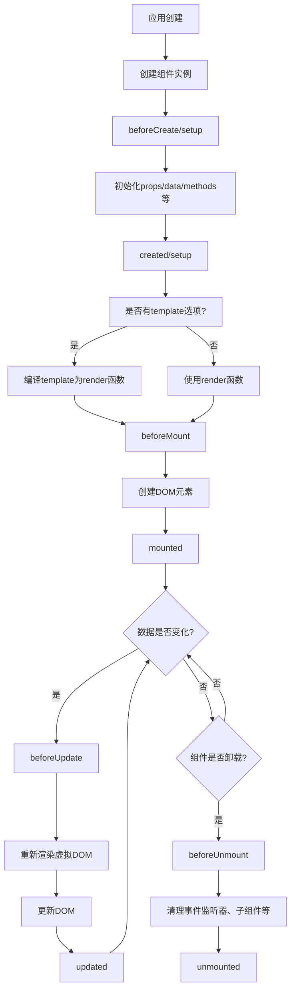

我将为您编写一份详细的Vue3生命周期知识文档，适合不同级别的开发者阅读。

```markdown:c:\project\kphub\src\frontend\vue\02-基础\2.6-Vue3生命周期.md
---
title: Vue3生命周期
icon: vue3
order: 2
---

# Vue3生命周期

Vue 3提供了组合式API中的生命周期钩子，同时保留了选项式API的生命周期钩子。本文将详细介绍Vue 3的生命周期钩子函数，包括选项式API钩子和组合式API钩子的对应关系、使用方法和注意事项，帮助读者全面理解Vue 3的组件生命周期。

## Vue3生命周期概述

生命周期（Lifecycle）是指Vue组件从创建、挂载、更新到销毁的整个过程。在这个过程中，Vue提供了一系列的钩子函数，让开发者能够在特定的时间点执行自定义代码。Vue3在保留Vue2生命周期概念的基础上，引入了组合式API（Composition API），为生命周期钩子提供了新的使用方式。

Vue3的生命周期可以分为四个主要阶段：

1. **创建阶段**：组件实例被创建
2. **挂载阶段**：组件被挂载到DOM
3. **更新阶段**：组件的响应式数据发生变化，导致DOM更新
4. **卸载阶段**：组件从DOM中移除

## 选项式API与组合式API的生命周期钩子对应关系

Vue3提供了两种编写组件的方式：选项式API（Options API）和组合式API（Composition API）。下表展示了这两种API中生命周期钩子的对应关系：

| 选项式API | 组合式API | 说明 |
|-----------|-----------|------|
| beforeCreate | setup() | 在组合式API中，setup函数本身就相当于beforeCreate和created |
| created | setup() | 同上 |
| beforeMount | onBeforeMount | 组件挂载到DOM前调用 |
| mounted | onMounted | 组件挂载到DOM后调用 |
| beforeUpdate | onBeforeUpdate | 组件更新前调用 |
| updated | onUpdated | 组件更新后调用 |
| beforeUnmount | onBeforeUnmount | 组件卸载前调用（Vue2中为beforeDestroy） |
| unmounted | onUnmounted | 组件卸载后调用（Vue2中为destroyed） |
| activated | onActivated | 被keep-alive缓存的组件激活时调用 |
| deactivated | onDeactivated | 被keep-alive缓存的组件停用时调用 |
| errorCaptured | onErrorCaptured | 捕获后代组件错误时调用 |
| renderTracked | onRenderTracked | 组件渲染过程中追踪到响应式依赖时调用（仅开发模式） |
| renderTriggered | onRenderTriggered | 响应式依赖触发组件重新渲染时调用（仅开发模式） |
| serverPrefetch | onServerPrefetch | 组件实例在服务器上被渲染前调用（仅SSR） |

## Vue3生命周期图解

下面是Vue3生命周期的流程图，它直观地展示了各个生命周期钩子的调用顺序和时机：



## 选项式API中的生命周期钩子

在Vue3中，选项式API的生命周期钩子与Vue2基本相同，只是将`beforeDestroy`和`destroyed`重命名为`beforeUnmount`和`unmounted`，并新增了`renderTracked`、`renderTriggered`和`serverPrefetch`钩子。

### 创建阶段

#### beforeCreate

**调用时机**：在实例初始化之后，数据观测和事件配置之前被调用。

**此时能访问到什么**：
- 可以访问到组件实例`this`
- 不能访问到`props`、`data`、`computed`、`methods`等选项

**示例代码**：
```javascript
export default {
  beforeCreate() {
    console.log('beforeCreate钩子被调用');
    console.log('此时data:', this.$data); // undefined
    console.log('此时DOM:', this.$el); // undefined
  }
}
```

#### created

**调用时机**：在实例创建完成后被立即调用。此时已完成数据观测、属性和方法的运算、事件回调的配置。

**此时能访问到什么**：
- 可以访问到组件实例`this`
- 可以访问到`props`、`data`、`computed`、`methods`等选项
- 不能访问到`$el`（组件的DOM元素）

**示例代码**：
```javascript
export default {
  data() {
    return {
      message: 'Hello Vue 3'
    }
  },
  created() {
    console.log('created钩子被调用');
    console.log('此时data:', this.message); // 'Hello Vue 3'
    console.log('此时DOM:', this.$el); // undefined
    
    // 发送API请求获取数据
    this.fetchData();
  },
  methods: {
    fetchData() {
      // 模拟API请求
      setTimeout(() => {
        this.message = '数据已更新';
      }, 1000);
    }
  }
}
```

### 挂载阶段

#### beforeMount

**调用时机**：在挂载开始之前被调用，相关的`render`函数首次被调用。

**此时能访问到什么**：
- 可以访问到组件实例`this`
- 可以访问到`props`、`data`、`computed`、`methods`等选项
- 不能访问到更新后的`$el`（组件的DOM元素）

**示例代码**：
```javascript
export default {
  beforeMount() {
    console.log('beforeMount钩子被调用');
    console.log('此时DOM:', this.$el); // 仍然是undefined或注释节点
  }
}
```

#### mounted

**调用时机**：实例被挂载到DOM后调用，此时`el`被新创建的`vm.$el`替换了。

**此时能访问到什么**：
- 可以访问到组件实例`this`
- 可以访问到`props`、`data`、`computed`、`methods`等选项
- 可以访问到`$el`（组件的DOM元素）

**示例代码**：
```javascript
export default {
  mounted() {
    console.log('mounted钩子被调用');
    console.log('此时DOM:', this.$el); // 真实的DOM元素
    
    // 访问DOM元素
    const titleElement = this.$el.querySelector('.title');
    if (titleElement) {
      console.log('标题内容:', titleElement.textContent);
    }
    
    // 初始化第三方库
    this.initChart();
  },
  methods: {
    initChart() {
      // 假设我们使用某个图表库
      console.log('初始化图表');
    }
  }
}
```

### 更新阶段

#### beforeUpdate

**调用时机**：数据更新时调用，发生在虚拟DOM重新渲染和打补丁之前。

**此时能访问到什么**：
- 可以访问到更新后的数据
- 可以访问到更新前的DOM

**示例代码**：
```javascript
export default {
  data() {
    return {
      count: 0
    }
  },
  beforeUpdate() {
    console.log('beforeUpdate钩子被调用');
    console.log('更新后的数据:', this.count);
    
    // 访问更新前的DOM
    const countElement = this.$el.querySelector('.count');
    if (countElement) {
      console.log('DOM中的count值:', countElement.textContent);
      // 注意：此时DOM中的值还是更新前的值
    }
  },
  methods: {
    increment() {
      this.count++;
    }
  }
}
```

#### updated

**调用时机**：数据更改导致的虚拟DOM重新渲染和打补丁之后调用。

**此时能访问到什么**：
- 可以访问到更新后的数据
- 可以访问到更新后的DOM

**示例代码**：
```javascript
export default {
  updated() {
    console.log('updated钩子被调用');
    
    // 访问更新后的DOM
    const countElement = this.$el.querySelector('.count');
    if (countElement) {
      console.log('DOM中的count值:', countElement.textContent);
      // 此时DOM中的值已经是更新后的值
    }
  }
}
```

### 卸载阶段

#### beforeUnmount

**调用时机**：实例卸载之前调用。在这一步，实例仍然完全可用。

**此时能访问到什么**：
- 可以访问到组件实例`this`
- 可以访问到`props`、`data`、`computed`、`methods`等选项
- 可以访问到`$el`（组件的DOM元素）

**示例代码**：
```javascript
export default {
  beforeUnmount() {
    console.log('beforeUnmount钩子被调用');
    
    // 清理定时器
    if (this.timer) {
      clearInterval(this.timer);
      this.timer = null;
    }
    
    // 移除事件监听器
    window.removeEventListener('resize', this.handleResize);
    
    // 销毁第三方库实例
    if (this.chart) {
      this.chart.dispose();
      this.chart = null;
    }
  },
  mounted() {
    // 设置定时器
    this.timer = setInterval(() => {
      console.log('定时器执行中...');
    }, 1000);
    
    // 添加事件监听器
    window.addEventListener('resize', this.handleResize);
  },
  methods: {
    handleResize() {
      console.log('窗口大小改变');
    }
  }
}
```

#### unmounted

**调用时机**：实例卸载后调用。调用后，所有的事件监听器会被移除，所有的子实例也会被销毁。

**此时能访问到什么**：
- 可以访问到组件实例`this`
- 组件的所有指令已被解绑
- 所有事件监听器已被移除
- 所有子实例已被销毁

**示例代码**：
```javascript
export default {
  unmounted() {
    console.log('unmounted钩子被调用');
    console.log('组件已完全销毁');
  }
}
```

### 特殊的生命周期钩子

#### activated

**调用时机**：被`<keep-alive>`缓存的组件激活时调用。

**示例代码**：
```javascript
export default {
  activated() {
    console.log('activated钩子被调用');
    
    // 恢复组件状态
    if (this.savedScrollPosition) {
      window.scrollTo(0, this.savedScrollPosition);
    }
    
    // 重新获取数据
    this.refreshData();
  },
  methods: {
    refreshData() {
      console.log('刷新数据');
    }
  }
}
```

#### deactivated

**调用时机**：被`<keep-alive>`缓存的组件停用时调用。

**示例代码**：
```javascript
export default {
  data() {
    return {
      savedScrollPosition: 0
    }
  },
  deactivated() {
    console.log('deactivated钩子被调用');
    
    // 保存组件状态
    this.savedScrollPosition = window.scrollY;
  }
}
```

#### errorCaptured

**调用时机**：当捕获一个来自后代组件的错误时被调用。

**参数**：
- `err`：错误对象
- `instance`：发生错误的组件实例
- `info`：错误来源信息

**返回值**：
- 返回`false`可以阻止错误继续向上传播

**示例代码**：
```javascript
export default {
  errorCaptured(err, instance, info) {
    console.log('errorCaptured钩子被调用');
    console.log('错误:', err);
    console.log('错误组件:', instance);
    console.log('错误信息:', info);
    
    // 设置错误状态
    this.hasError = true;
    this.errorMessage = err.message;
    
    // 阻止错误继续传播
    return false;
  }
}
```

#### renderTracked

**调用时机**：当组件渲染过程中追踪到响应式依赖时调用（仅在开发模式下可用）。

**参数**：
- `event`：包含有关依赖的信息的事件对象

**示例代码**：
```javascript
export default {
  renderTracked(event) {
    console.log('renderTracked钩子被调用');
    console.log('追踪到的依赖:', event);
    // event包含：
    // - target: 被追踪的对象
    // - type: 操作类型
    // - key: 访问的属性
  }
}
```

#### renderTriggered

**调用时机**：当响应式依赖触发组件重新渲染时调用（仅在开发模式下可用）。

**参数**：
- `event`：包含有关触发重新渲染的依赖的信息的事件对象

**示例代码**：
```javascript
export default {
  renderTriggered(event) {
    console.log('renderTriggered钩子被调用');
    console.log('触发重新渲染的依赖:', event);
    // event包含：
    // - target: 触发更新的对象
    // - type: 操作类型
    // - key: 被修改的属性
    // - oldValue: 旧值
    // - newValue: 新值
  }
}
```

#### serverPrefetch

**调用时机**：组件实例在服务器上被渲染前调用（仅在SSR中可用）。

**返回值**：
- 返回一个Promise，服务器会等待Promise解析完成后再渲染组件

**示例代码**：
```javascript
export default {
  async serverPrefetch() {
    console.log('serverPrefetch钩子被调用');
    
    // 在服务器端预取数据
    try {
      const result = await this.fetchData();
      this.serverData = result;
    } catch (error) {
      console.error('预取数据失败:', error);
    }
  },
  methods: {
    async fetchData() {
      // 模拟API请求
      return new Promise(resolve => {
        setTimeout(() => {
          resolve({ name: '服务器数据' });
        }, 100);
      });
    }
  }
}
```

## 组合式API中的生命周期钩子

Vue3的组合式API提供了一种更灵活的组织组件逻辑的方式。在组合式API中，生命周期钩子以函数的形式被导入和调用。

### 基本用法

在组合式API中使用生命周期钩子需要先从Vue导入相应的函数，然后在`setup`函数中调用它们：

```javascript
<script setup>
import { onMounted, onUpdated, onUnmounted } from 'vue'

onMounted(() => {
  console.log('组件已挂载')
})

onUpdated(() => {
  console.log('组件已更新')
})

onUnmounted(() => {
  console.log('组件已卸载')
})
</script>
```

或者在不使用`<script setup>`的情况下：

```javascript
import { onMounted } from 'vue'

export default {
  setup() {
    onMounted(() => {
      console.log('组件已挂载')
    })
    
    return {
      // 返回要暴露给模板的内容
    }
  }
}
```

### 生命周期钩子函数详解

#### setup

`setup`函数本身不是一个生命周期钩子，但它在组件实例创建之前被调用，相当于`beforeCreate`和`created`钩子的组合。

**调用时机**：在创建组件实例时，在初始化props之后立即调用。

**参数**：
- `props`：组件的props
- `context`：一个包含组件上下文的对象（attrs, slots, emit, expose）

**示例代码**：
```javascript
import { ref } from 'vue'

export default {
  props: {
    initialCount: Number
  },
  setup(props, context) {
    console.log('setup函数被调用');
    console.log('props:', props.initialCount);
    
    // 创建响应式状态
    const count = ref(props.initialCount || 0);
    
    // 定义方法
    function increment() {
      count.value++;
    }
    
    // 使用context.emit触发事件
    function notifyParent() {
      context.emit('update', count.value);
    }
    
    // 返回要暴露给模板的内容
    return {
      count,
      increment,
      notifyParent
    }
  }
}
```

在`<script setup>`中，`setup`函数是隐式的，props可以通过`defineProps`访问，emit可以通过`defineEmits`访问：

```javascript
<script setup>
import { ref } from 'vue'

const props = defineProps({
  initialCount: Number
})

const emit = defineEmits(['update'])

const count = ref(props.initialCount || 0)

function increment() {
  count.value++
}

function notifyParent() {
  emit('update', count.value)
}
</script>
```

#### onBeforeMount

**调用时机**：在组件挂载之前被调用。

**示例代码**：
```javascript
<script setup>
import { ref, onBeforeMount } from 'vue'

const message = ref('Hello Vue 3')

onBeforeMount(() => {
  console.log('onBeforeMount钩子被调用')
  console.log('此时message:', message.value)
  // DOM尚未创建
})
</script>
```

#### onMounted

**调用时机**：在组件挂载到DOM后被调用。

**示例代码**：
```javascript
<script setup>
import { ref, onMounted } from 'vue'

const message = ref('Hello Vue 3')
const titleRef = ref(null)

onMounted(() => {
  console.log('onMounted钩子被调用')
  
  // 访问DOM元素
  if (titleRef.value) {
    console.log('标题内容:', titleRef.value.textContent)
  }
  
  // 初始化第三方库
  initChart()
})

function initChart() {
  console.log('初始化图表')
  // 实际的图表初始化代码
}
</script>

<template>
  <h1 ref="titleRef">{{ message }}</h1>
</template>
```

#### onBeforeUpdate

**调用时机**：在组件即将因为响应式状态变更而更新其DOM树之前调用。

**示例代码**：
```javascript
<script setup>
import { ref, onBeforeUpdate } from 'vue'

const count = ref(0)

onBeforeUpdate(() => {
  console.log('onBeforeUpdate钩子被调用')
  console.log('更新后的数据:', count.value)
  // DOM尚未更新
})

function increment() {
  count.value++
}
</script>

<template>
  <div>
    <p class="count">{{ count }}</p>
    <button @click="increment">增加</button>
  </div>
</template>
```

#### onUpdated

**调用时机**：在组件因为响应式状态变更而更新其DOM树之后调用。

**示例代码**：
```javascript
<script setup>
import { ref, onUpdated } from 'vue'

const count = ref(0)

onUpdated(() => {
  console.log('onUpdated钩子被调用')
  // DOM已更新
  const countElement = document.querySelector('.count')
  if (countElement) {
    console.log('DOM中的count值:', countElement.textContent)
  }
})

function increment() {
  count.value++
}
</script>
```

#### onBeforeUnmount

**调用时机**：在组件实例被卸载之前调用。

**示例代码**：
```javascript
<script setup>
import { ref, onMounted, onBeforeUnmount } from 'vue'

const timer = ref(null)

onMounted(() => {
  // 设置定时器
  timer.value = setInterval(() => {
    console.log('定时器执行中...')
  }, 1000)
})

onBeforeUnmount(() => {
  console.log('onBeforeUnmount钩子被调用')
  
  // 清理定时器
  if (timer.value) {
    clearInterval(timer.value)
    timer.value = null
  }
})
</script>
```

#### onUnmounted

**调用时机**：在组件实例被卸载之后调用。

**示例代码**：
```javascript
<script setup>
import { onUnmounted } from 'vue'

onUnmounted(() => {
  console.log('onUnmounted钩子被调用')
  console.log('组件已完全销毁')
})
</script>
```

#### onActivated

**调用时机**：被`<keep-alive>`缓存的组件激活时调用。

**示例代码**：
```javascript
<script setup>
import { ref, onActivated, onDeactivated } from 'vue'

const scrollPosition = ref(0)

onActivated(() => {
  console.log('onActivated钩子被调用')
  
  // 恢复滚动位置
  window.scrollTo(0, scrollPosition.value)
  
  // 刷新数据
  refreshData()
})

onDeactivated(() => {
  // 保存滚动位置
  scrollPosition.value = window.scrollY
})

function refreshData() {
  console.log('刷新数据')
  // 实际的数据刷新代码
}
</script>
```

#### onDeactivated

**调用时机**：被`<keep-alive>`缓存的组件停用时调用。

**示例代码**：
```javascript
<script setup>
import { ref, onDeactivated } from 'vue'

const formData = ref({
  name: '',
  email: ''
})

onDeactivated(() => {
  console.log('onDeactivated钩子被调用')
  
  // 保存表单状态
  localStorage.setItem('formData', JSON.stringify(formData.value))
})
</script>
```

#### onErrorCaptured

**调用时机**：当捕获了后代组件传递的错误时调用。

**示例代码**：
```javascript
<script setup>
import { ref, onErrorCaptured } from 'vue'

const error = ref(null)
const hasError = ref(false)

onErrorCaptured((err, instance, info) => {
  console.log('onErrorCaptured钩子被调用')
  console.log('错误:', err)
  console.log('错误组件:', instance)
  console.log('错误信息:', info)
  
  // 设置错误状态
  hasError.value = true
  error.value = err.message
  
  // 阻止错误继续传播
  return false
})
</script>

<template>
  <div>
    <div v-if="hasError" class="error-message">
      发生错误: {{ error }}
    </div>
    <slot v-else></slot>
  </div>
</template>
```

#### onRenderTracked

**调用时机**：当组件渲染过程中追踪到响应式依赖时调用（仅在开发模式下可用）。

**示例代码**：
```javascript
<script setup>
import { ref, onRenderTracked } from 'vue'

const count = ref(0)

onRenderTracked((event) => {
  console.log('onRenderTracked钩子被调用')
  console.log('追踪到的依赖:', event)
})

function increment() {
  count.value++
}
</script>
```

#### onRenderTriggered

**调用时机**：当响应式依赖触发组件重新渲染时调用（仅在开发模式下可用）。

**示例代码**：
```javascript
<script setup>
import { ref, onRenderTriggered } from 'vue'

const count = ref(0)

onRenderTriggered((event) => {
  console.log('onRenderTriggered钩子被调用')
  console.log('触发重新渲染的依赖:', event)
})

function increment() {
  count.value++
}
</script>
```

#### onServerPrefetch

**调用时机**：组件实例在服务器上被渲染前调用（仅在SSR中可用）。

**示例代码**：
```javascript
<script setup>
import { ref, onServerPrefetch } from 'vue'

const data = ref(null)

onServerPrefetch(async () => {
  console.log('onServerPrefetch钩子被调用')
  
  // 在服务器端预取数据
  try {
    data.value = await fetchData()
  } catch (error) {
    console.error('预取数据失败:', error)
  }
})

async function fetchData() {
  // 模拟API请求
  return new Promise(resolve => {
    setTimeout(() => {
      resolve({ name: '服务器数据' })
    }, 100)
  })
}
</script>
```

## 生命周期钩子的实际应用

了解了各个生命周期钩子的调用时机和使用方法后，让我们通过一些实际应用案例来深入理解如何在实际开发中使用这些钩子。

### 案例1：数据获取和加载状态（组合式API）

```vue
<script setup>
import { ref, onMounted, watch } from 'vue'
import axios from 'axios'

const props = defineProps({
  userId: {
    type: String,
    required: true
  }
})

const user = ref(null)
const loading = ref(true)
const error = ref(null)

// 获取用户数据的函数
async function fetchUserData() {
  loading.value = true
  error.value = null
  
  try {
    const response = await axios.get(`/api/users/${props.userId}`)
    user.value = response.data
  } catch (err) {
    console.error('获取用户数据失败:', err)
    error.value = err.message || '获取用户数据失败'
  } finally {
    loading.value = false
  }
}

// 在组件挂载时获取数据
onMounted(fetchUserData)

// 当userId变化时重新获取数据
watch(() => props.userId, fetchUserData)
</script>

<template>
  <div class="user-profile">
    <div v-if="loading" class="loading">
      加载中...
    </div>
    <div v-else-if="error" class="error">
      加载失败: {{ error }}
    </div>
    <div v-else class="user-info">
      <h2>{{ user.name }}</h2>
      <p>邮箱: {{ user.email }}</p>
      <p>电话: {{ user.phone }}</p>
    </div>
  </div>
</template>
```

在这个例子中，我们使用`onMounted`钩子在组件挂载后获取用户数据，并使用`watch`监听`userId`的变化来重新获取数据。

### 案例2：图表组件（组合式API）

```vue
<script setup>
import { ref, onMounted, onBeforeUnm我将继续编写Vue3生命周期的内容，接着上次的案例2部分。

```markdown:c:\project\kphub\src\frontend\vue\02-基础\2.6-Vue3生命周期.md
<script setup>
import { ref, onMounted, onBeforeUnmount, watch } from 'vue'
import * as echarts from 'echarts'

const props = defineProps({
  salesData: {
    type: Array,
    required: true
  }
})

const chartEl = ref(null)
const chart = ref(null)

// 初始化图表
function initChart() {
  if (!chartEl.value) return
  
  // 初始化ECharts实例
  chart.value = echarts.init(chartEl.value)
  
  // 设置图表选项
  const option = {
    title: {
      text: '销售数据'
    },
    tooltip: {
      trigger: 'axis'
    },
    xAxis: {
      type: 'category',
      data: ['一月', '二月', '三月', '四月', '五月', '六月']
    },
    yAxis: {
      type: 'value'
    },
    series: [{
      data: props.salesData,
      type: 'line'
    }]
  }
  
  // 使用配置项设置图表
  chart.value.setOption(option)
}

// 调整图表大小
function resizeChart() {
  if (chart.value) {
    chart.value.resize()
  }
}

// 更新图表数据
function updateChart() {
  if (chart.value) {
    const option = chart.value.getOption()
    option.series[0].data = props.salesData
    chart.value.setOption(option)
  }
}

// 在组件挂载后初始化图表
onMounted(() => {
  initChart()
  // 添加窗口大小变化的监听器
  window.addEventListener('resize', resizeChart)
})

// 在组件卸载前清理资源
onBeforeUnmount(() => {
  // 销毁图表实例
  if (chart.value) {
    chart.value.dispose()
    chart.value = null
  }
  
  // 移除事件监听器
  window.removeEventListener('resize', resizeChart)
})

// 监听数据变化更新图表
watch(() => props.salesData, updateChart, { deep: true })
</script>

<template>
  <div class="chart-container">
    <div ref="chartEl" class="chart"></div>
  </div>
</template>
```

在这个例子中，我们使用`onMounted`钩子在组件挂载后初始化图表，使用`onBeforeUnmount`钩子在组件卸载前清理资源，并使用`watch`监听数据变化来更新图表。

### 案例3：表单组件与keep-alive（组合式API）

```vue
<!-- ParentComponent.vue -->
<script setup>
import { ref } from 'vue'
import Step1 from './Step1.vue'
import Step2 from './Step2.vue'
import Step3 from './Step3.vue'

const steps = ['Step1', 'Step2', 'Step3']
const stepIndex = ref(0)
const formData = ref({})

const currentStep = computed(() => {
  return steps[stepIndex.value]
})

function nextStep() {
  if (stepIndex.value < steps.length - 1) {
    stepIndex.value++
  }
}

function prevStep() {
  if (stepIndex.value > 0) {
    stepIndex.value--
  }
}

function submitForm() {
  console.log('提交表单数据:', formData.value)
  // 发送表单数据到服务器
}
</script>

<template>
  <div class="multi-step-form">
    <keep-alive>
      <component :is="currentStep" @next="nextStep" @prev="prevStep"></component>
    </keep-alive>
    
    <div class="form-navigation">
      <button v-if="stepIndex > 0" @click="prevStep">上一步</button>
      <button v-if="stepIndex < steps.length - 1" @click="nextStep">下一步</button>
      <button v-else @click="submitForm">提交</button>
    </div>
  </div>
</template>
```

```vue
<!-- Step1.vue -->
<script setup>
import { ref, onActivated, onDeactivated, onBeforeUnmount } from 'vue'

const emit = defineEmits(['next', 'prev'])

const formData = ref({
  name: '',
  email: ''
})

const savedData = ref(null)

// 当组件被激活时，恢复之前保存的表单数据
onActivated(() => {
  console.log('Step1组件被激活')
  
  // 恢复内存中保存的数据
  if (savedData.value) {
    formData.value = { ...savedData.value }
  }
  
  // 从localStorage恢复数据
  const savedState = localStorage.getItem('step1Data')
  if (savedState) {
    try {
      const parsedState = JSON.parse(savedState)
      formData.value = { ...formData.value, ...parsedState }
    } catch (e) {
      console.error('恢复状态失败:', e)
    }
  }
})

// 当组件被停用时，保存当前表单数据
onDeactivated(() => {
  console.log('Step1组件被停用')
  
  // 保存到内存
  savedData.value = { ...formData.value }
  
  // 保存到localStorage
  localStorage.setItem('step1Data', JSON.stringify(formData.value))
})

// 组件完全销毁前清理
onBeforeUnmount(() => {
  localStorage.removeItem('step1Data')
})

function goToNextStep() {
  emit('next')
}
</script>

<template>
  <div class="form-step">
    <h2>步骤1: 个人信息</h2>
    <form @submit.prevent="goToNextStep">
      <div class="form-group">
        <label for="name">姓名</label>
        <input id="name" v-model="formData.name" type="text" required>
      </div>
      <div class="form-group">
        <label for="email">邮箱</label>
        <input id="email" v-model="formData.email" type="email" required>
      </div>
      <button type="submit">继续</button>
    </form>
  </div>
</template>
```

在这个多步骤表单的例子中，我们使用`<keep-alive>`来保持各个步骤的组件状态，并在`onActivated`和`onDeactivated`钩子中恢复和保存表单数据。

## 生命周期钩子的最佳实践

在使用Vue3的生命周期钩子时，以下是一些最佳实践和注意事项：

### 1. 选择正确的钩子

- 使用`setup`或`created`进行数据初始化和API调用
- 使用`onMounted`进行DOM操作和第三方库初始化
- 使用`onBeforeUnmount`清理资源和事件监听器
- 使用`onActivated`和`onDeactivated`管理`<keep-alive>`组件的状态

### 2. 避免在不适当的钩子中执行操作

- 不要在`setup`函数返回之前访问DOM（此时DOM还未挂载）
- 避免在`onUpdated`中修改响应式状态，可能导致无限循环
- 不要在`onBeforeUnmount`之后访问子组件

### 3. 合理使用异步操作

在生命周期钩子中执行异步操作时，需要考虑组件可能在操作完成前被卸载的情况：

```javascript
<script setup>
import { ref, onMounted, onBeforeUnmount } from 'vue'

const isComponentActive = ref(true)
const data = ref(null)

// 在组件卸载前标记组件不活跃
onBeforeUnmount(() => {
  isComponentActive.value = false
})

// 获取数据的函数
async function fetchData() {
  try {
    const result = await api.getData()
    
    // 检查组件是否仍然活跃
    if (isComponentActive.value) {
      data.value = result
    }
  } catch (error) {
    if (isComponentActive.value) {
      console.error('获取数据失败:', error)
    }
  }
}

// 在组件挂载时获取数据
onMounted(fetchData)
</script>
```

### 4. 使用计算属性和侦听器代替某些生命周期操作

有时候，使用计算属性或侦听器比在生命周期钩子中执行操作更合适：

```javascript
<script setup>
import { ref, computed, watch } from 'vue'

// 不推荐
const firstName = ref('John')
const lastName = ref('Doe')
const fullName = ref('')

function updateFullName() {
  fullName.value = `${firstName.value} ${lastName.value}`
}

// 初始化
updateFullName()

// 监听变化
watch(firstName, updateFullName)
watch(lastName, updateFullName)

// 推荐
const firstNameBetter = ref('John')
const lastNameBetter = ref('Doe')
const fullNameBetter = computed(() => {
  return `${firstNameBetter.value} ${lastNameBetter.value}`
})
</script>
```

### 5. 使用nextTick处理DOM更新

当你需要在数据变化后访问更新后的DOM时，使用`nextTick`：

```javascript
<script setup>
import { ref, nextTick } from 'vue'

const message = ref('Hello')

async function updateMessage() {
  message.value = 'Updated'
  
  // 错误方式：DOM可能还未更新
  console.log(document.querySelector('.message').textContent) // 可能仍然显示"Hello"
  
  // 正确方式：等待DOM更新后再访问
  await nextTick()
  console.log(document.querySelector('.message').textContent) // 现在会显示"Updated"
}
</script>

<template>
  <div class="message">{{ message }}</div>
  <button @click="updateMessage">更新消息</button>
</template>
```

### 6. 组合式函数（Composables）中的生命周期钩子

在组合式函数中使用生命周期钩子时，钩子会自动绑定到调用它的组件实例上：

```javascript
// useMousePosition.js
import { ref, onMounted, onUnmounted } from 'vue'

export function useMousePosition() {
  const x = ref(0)
  const y = ref(0)
  
  function update(event) {
    x.value = event.pageX
    y.value = event.pageY
  }
  
  // 这些钩子会自动绑定到使用这个组合式函数的组件上
  onMounted(() => {
    window.addEventListener('mousemove', update)
  })
  
  onUnmounted(() => {
    window.removeEventListener('mousemove', update)
  })
  
  return { x, y }
}

// 在组件中使用
<script setup>
import { useMousePosition } from './useMousePosition'

// 钩子会绑定到当前组件
const { x, y } = useMousePosition()
</script>
```

### 7. 组件生命周期与路由导航守卫的结合

在使用Vue Router时，路由导航守卫与组件生命周期钩子的执行顺序如下：

1. 导航被触发
2. 在失活的组件里调用`beforeRouteLeave`守卫
3. 调用全局的`beforeEach`守卫
4. 在重用的组件里调用`beforeRouteUpdate`守卫
5. 在路由配置里调用`beforeEnter`守卫
6. 解析异步路由组件
7. 在被激活的组件里调用`beforeRouteEnter`守卫
8. 调用全局的`beforeResolve`守卫
9. 导航被确认
10. 调用全局的`afterEach`钩子
11. 触发DOM更新
12. 调用`beforeRouteEnter`守卫中传给`next`的回调函数，创建好的组件实例会作为回调函数的参数传入

```javascript
// 在组合式API中使用路由守卫
<script setup>
import { onBeforeRouteLeave, onBeforeRouteUpdate } from 'vue-router'

// 在当前路由改变，但是该组件被复用时调用
onBeforeRouteUpdate((to, from) => {
  // 可以访问组件实例 `this`
  console.log('路由更新:', to.path)
})

// 导航离开该组件的对应路由时调用
onBeforeRouteLeave((to, from) => {
  // 可以访问组件实例 `this`
  const answer = window.confirm('确定要离开吗？未保存的更改将会丢失！')
  if (!answer) return false
})
</script>
```

## 生命周期钩子的调试技巧

在开发过程中，了解组件的生命周期执行情况对于调试非常有帮助。以下是一些调试Vue3生命周期的技巧：

### 1. 使用console.log跟踪生命周期

最简单的方法是在每个生命周期钩子中添加`console.log`：

```javascript
<script setup>
import { onBeforeMount, onMounted, onBeforeUpdate, onUpdated, onBeforeUnmount, onUnmounted } from 'vue'

onBeforeMount(() => {
  console.log('组件名: onBeforeMount')
})

onMounted(() => {
  console.log('组件名: onMounted')
})

onBeforeUpdate(() => {
  console.log('组件名: onBeforeUpdate')
})

onUpdated(() => {
  console.log('组件名: onUpdated')
})

onBeforeUnmount(() => {
  console.log('组件名: onBeforeUnmount')
})

onUnmounted(() => {
  console.log('组件名: onUnmounted')
})
</script>
```

### 2. 使用Vue Devtools

Vue Devtools是一个浏览器扩展，可以帮助你检查和调试Vue应用：

- 它可以显示组件树和组件的状态
- 可以查看组件的props和响应式状态
- 可以追踪事件
- 可以进行时间旅行调试
- 支持Vue3的组合式API

### 3. 创建生命周期调试组合式函数

你可以创建一个组合式函数来为所有组件或特定组件添加生命周期调试：

```javascript
// useLifecycleLogger.js
import { onBeforeMount, onMounted, onBeforeUpdate, onUpdated, onBeforeUnmount, onUnmounted, onActivated, onDeactivated, onErrorCaptured } from 'vue'

export function useLifecycleLogger(componentName = 'Anonymous') {
  onBeforeMount(() => {
    console.log(`${componentName}: onBeforeMount`)
  })
  
  onMounted(() => {
    console.log(`${componentName}: onMounted`)
  })
  
  onBeforeUpdate(() => {
    console.log(`${componentName}: onBeforeUpdate`)
  })
  
  onUpdated(() => {
    console.log(`${componentName}: onUpdated`)
  })
  
  onBeforeUnmount(() => {
    console.log(`${componentName}: onBeforeUnmount`)
  })
  
  onUnmounted(() => {
    console.log(`${componentName}: onUnmounted`)
  })
  
  onActivated(() => {
    console.log(`${componentName}: onActivated`)
  })
  
  onDeactivated(() => {
    console.log(`${componentName}: onDeactivated`)
  })
  
  onErrorCaptured((err, instance, info) => {
    console.log(`${componentName}: onErrorCaptured`, err, instance, info)
    // 不阻止错误继续传播
    return true
  })
}

// 在组件中使用
<script setup>
import { useLifecycleLogger } from './useLifecycleLogger'

// 传入组件名
useLifecycleLogger('MyComponent')
</script>
```

### 4. 使用性能追踪API

Vue3提供了性能追踪API，可以帮助你了解组件的渲染性能：

```javascript
// 开启性能追踪
import { createApp } from 'vue'
import App from './App.vue'

const app = createApp(App)

// 仅在开发模式下启用
if (process.env.NODE_ENV === 'development') {
  app.config.performance = true
}

app.mount('#app')

// 在浏览器性能工具中，你可以看到以下标记：
// - ⚡️ vue-perf-start:组件名
// - ⚡️ vue-perf-end:组件名
// - ⚡️ vue-perf-render:组件名 (组件渲染)
// - 等等...
```

## Vue2与Vue3生命周期的主要区别

虽然Vue3保留了Vue2的大部分生命周期概念，但仍有一些重要的区别：

### 1. 命名变化

Vue3中的一些生命周期钩子名称发生了变化：

- `beforeDestroy` → `beforeUnmount`
- `destroyed` → `unmounted`

这些名称变化更准确地反映了实际发生的事情（组件的卸载而非销毁）。

### 2. 组合式API的引入

Vue3最大的变化是引入了组合式API，它提供了一种新的组织组件逻辑的方式：

- 在Vue2中，生命周期钩子是作为选项对象的属性提供的
- 在Vue3中，生命周期钩子可以作为导入的函数在`setup`函数中调用

### 3. setup函数的特殊性

`setup`函数本身不是一个生命周期钩子，但它在组件实例创建之前被调用，相当于`beforeCreate`和`created`钩子的组合：

- 在Vue2中，需要分别使用`beforeCreate`和`created`钩子
- 在Vue3中，可以直接在`setup`函数中编写初始化逻辑

### 4. 新增的调试钩子

Vue3新增了两个用于调试的生命周期钩子：

- `onRenderTracked`：当组件渲染过程中追踪到响应式依赖时调用
- `onRenderTriggered`：当响应式依赖的变更触发了组件重新渲染时调用

这些钩子提供了更详细的信息，帮助开发者了解组件的渲染过程。

### 5. 组合式函数中的生命周期钩子

在Vue3的组合式函数中，生命周期钩子会自动绑定到调用它的组件实例上，这在Vue2中是不可能的：

- 在Vue2中，混入（mixins）是复用生命周期逻辑的主要方式
- 在Vue3中，组合式函数提供了更灵活、更强大的逻辑复用方式

### 6. 多个相同的生命周期钩子

在Vue3的组合式API中，可以多次调用同一个生命周期钩子，它们会按照调用顺序依次执行：

```javascript
<script setup>
import { onMounted } from 'vue'

onMounted(() => {
  console.log('第一个onMounted钩子')
})

onMounted(() => {
  console.log('第二个onMounted钩子')
})

// 输出顺序：
// 1. 第一个onMounted钩子
// 2. 第二个onMounted钩子
</script>
```

而在Vue2的选项式API中，如果定义了多个相同的生命周期钩子，后面的会覆盖前面的（除非使用混入）。

## 总结

Vue3的生命周期钩子提供了在组件不同阶段执行代码的能力，是构建复杂Vue应用的重要工具。通过本文，我们详细了解了Vue3中选项式API和组合式API的生命周期钩子的调用时机、使用方法和最佳实践。

### 关键要点回顾

1. Vue3保留了Vue2的生命周期概念，但引入了组合式API，提供了新的使用方式
2. 选项式API中的`beforeDestroy`和`destroyed`被重命名为`beforeUnmount`和`unmounted`
3. 组合式API中的生命周期钩子需要从Vue导入，并在`setup`函数中调用
4. `setup`函数本身相当于`beforeCreate`和`created`钩子的组合
5. Vue3新增了`onRenderTracked`和`onRenderTriggered`调试钩子
6. 组合式函数提供了一种更灵活的生命周期逻辑复用方式

### 最佳实践总结

1. 选择正确的生命周期钩子执行操作
2. 避免在不适当的钩子中执行操作
3. 合理处理异步操作
4. 使用计算属性和侦听器代替某些生命周期操作
5. 使用`nextTick`处理DOM更新
6. 在组合式函数中正确使用生命周期钩子
7. 了解组件生命周期与路由导航守卫的结合

通过深入理解Vue3的生命周期，你可以更有效地控制组件的行为，构建更加健壮和高效的Vue应用。无论你是使用选项式API还是组合式API，生命周期钩子都是Vue开发中不可或缺的工具。
```

这部分内容完成了Vue3生命周期的剩余部分，包括实际应用案例、最佳实践、调试技巧、与Vue2的对比以及总结。文档全面介绍了Vue3生命周期钩子的各个方面，适合不同级别的开发者阅读。