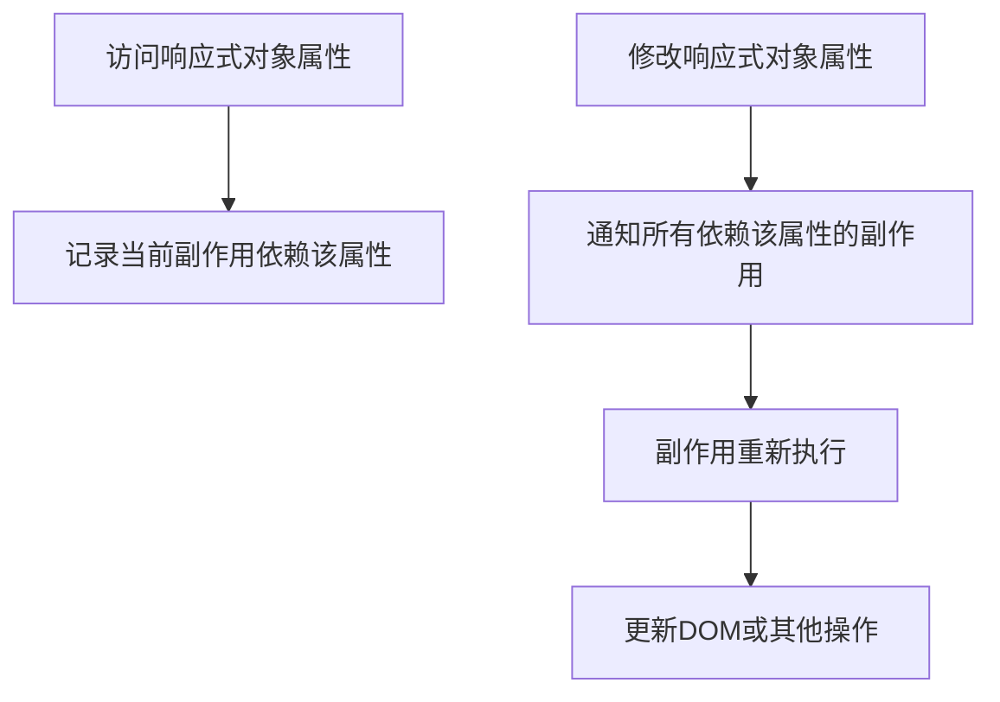

我将为您编写一份详细的Vue响应式系统知识文档，适合不同级别的开发者阅读。

```markdown:c:\project\kphub\src\frontend\vue\03-深入组件\3.3-响应式系统.md
---
title: 响应式系统
icon: reactive
order: 3
---

# 响应式系统

响应式系统是Vue的核心特性之一，它使得数据变化能够自动反映到视图上。本节将深入介绍Vue的响应式系统，包括响应式基础、ref、reactive、computed、watch等内容，帮助读者全面理解Vue的响应式原理和使用方法。

## 什么是响应式系统？

在前端开发中，响应式系统是一种能够自动追踪依赖关系并在数据变化时更新相关内容的机制。简单来说，当数据发生变化时，所有依赖这些数据的地方都会自动更新，无需手动干预。

想象一个简单的例子：假设我们有一个变量 `count` 和一个显示 `count` 值的UI元素。在传统的命令式编程中，当 `count` 变化时，我们需要手动更新UI：

```javascript
// 命令式编程
let count = 0;
const updateUI = () => {
  document.getElementById('counter').textContent = count;
};

// 初始化UI
updateUI();

// 当count变化时，需要手动调用updateUI
count++;
updateUI(); // 手动更新UI
```

而在响应式系统中，我们只需声明数据和UI之间的依赖关系，当数据变化时，系统会自动更新UI：

```javascript
// 响应式编程（伪代码）
const count = reactive(0);

// 声明依赖关系
effect(() => {
  document.getElementById('counter').textContent = count.value;
});

// 当count变化时，UI会自动更新
count.value++; // UI自动更新，无需手动调用
```

Vue的响应式系统正是基于这种理念构建的，它让开发者能够以声明式的方式构建交互式用户界面，大大简化了状态管理和UI更新的复杂性。

## Vue响应式系统的发展

Vue的响应式系统随着版本的迭代有了显著的发展：

### Vue 2的响应式系统

Vue 2使用`Object.defineProperty`来实现响应式系统。它通过以下步骤工作：

1. 在初始化时，Vue会遍历data对象的所有属性
2. 使用`Object.defineProperty`将这些属性转换为getter/setter
3. 在getter中收集依赖（即记录哪些组件使用了该属性）
4. 在setter中触发更新（当属性值变化时通知相关组件更新）

这种实现方式有一些限制：
- 无法检测对象属性的添加或删除
- 无法直接检测数组索引的变化和长度的变化
- 需要使用特殊的API（如`Vue.set`或`this.$set`）来添加响应式属性

```javascript
// Vue 2响应式系统示例
new Vue({
  data: {
    count: 0,
    user: {
      name: 'John'
    }
  },
  methods: {
    updateUser() {
      // 这不会触发响应式更新
      this.user.age = 30;
      
      // 需要使用特殊API
      this.$set(this.user, 'age', 30);
    }
  }
});
```

### Vue 3的响应式系统

Vue 3使用ES6的Proxy来重写了响应式系统，称为Reactivity API。这带来了几个重要的改进：

1. 能够检测对象属性的添加和删除
2. 能够检测数组索引和长度的变化
3. 支持更多的数据类型（如Map、Set等）
4. 性能更好，内存占用更低
5. 可以独立于Vue组件使用

```javascript
// Vue 3响应式系统示例
import { reactive, ref } from 'vue';

// 对象响应式
const user = reactive({
  name: 'John'
});

// 直接添加属性，会自动触发响应式更新
user.age = 30;

// 基本类型响应式
const count = ref(0);
count.value++; // 需要通过.value访问和修改
```

## 响应式系统的核心概念

在深入了解Vue 3的响应式API之前，我们需要理解几个核心概念：

### 1. 响应式对象（Reactive Objects）

响应式对象是被Vue的响应式系统包装过的对象，当其属性发生变化时，所有依赖这些属性的地方都会自动更新。

### 2. 副作用（Effects）

副作用是指那些依赖响应式状态并在状态变化时需要重新执行的函数。在Vue中，渲染函数、计算属性和侦听器都是副作用的例子。

### 3. 依赖追踪（Dependency Tracking）

依赖追踪是响应式系统的核心机制，它负责记录哪些副作用依赖哪些响应式对象的属性。当属性变化时，系统知道需要重新执行哪些副作用。

### 4. 响应式引用（Refs）

响应式引用是一种特殊的响应式对象，用于包装基本类型值（如数字、字符串等）使其变成响应式的。

## Vue 3的响应式API

Vue 3提供了一系列API来创建和操作响应式状态。以下是最常用的几个：

### ref

`ref`函数用于创建一个响应式引用，可以包装任何值类型（基本类型或对象）。

#### 基本用法

```javascript
import { ref } from 'vue';

// 创建一个响应式引用
const count = ref(0);

// 通过.value访问或修改值
console.log(count.value); // 0
count.value++;
console.log(count.value); // 1
```

#### 包装对象

`ref`也可以包装对象，但内部会使用`reactive`来处理对象：

```javascript
import { ref } from 'vue';

const user = ref({
  name: 'John',
  age: 30
});

// 访问和修改对象属性
console.log(user.value.name); // 'John'
user.value.age = 31;
```

#### 在模板中使用ref

在模板中使用ref时，Vue会自动解包，不需要使用`.value`：

```vue
<template>
  <div>
    <p>Count: {{ count }}</p>
    <button @click="increment">Increment</button>
  </div>
</template>

<script setup>
import { ref } from 'vue';

const count = ref(0);

function increment() {
  count.value++;
}
</script>
```

#### ref的解包规则

Vue在以下情况下会自动解包ref：

1. 在模板中作为顶层属性被访问时
2. 在响应式对象中作为属性被访问时

```javascript
import { ref, reactive } from 'vue';

const count = ref(0);
const obj = reactive({
  count
});

// 在响应式对象中，ref会被自动解包
console.log(obj.count); // 0，不需要.value

// 修改obj.count会更新原始ref
obj.count++;
console.log(count.value); // 1

// 修改原始ref也会更新obj.count
count.value++;
console.log(obj.count); // 2
```

但在以下情况下不会自动解包：

1. 在数组或普通对象中作为元素或属性被访问时
2. 作为函数参数传递时

```javascript
import { ref } from 'vue';

const count = ref(0);

// 在普通对象中不会自动解包
const obj = { count };
console.log(obj.count); // { value: 0 }，是ref对象本身

// 在数组中不会自动解包
const arr = [count];
console.log(arr[0]); // { value: 0 }，是ref对象本身
```

### reactive

`reactive`函数用于创建一个响应式对象。与`ref`不同，`reactive`只能用于对象类型（包括数组和普通对象），不能用于基本类型。

#### 基本用法

```javascript
import { reactive } from 'vue';

// 创建一个响应式对象
const state = reactive({
  count: 0,
  user: {
    name: 'John',
    age: 30
  }
});

// 直接访问和修改属性
console.log(state.count); // 0
state.count++;
console.log(state.count); // 1

// 嵌套属性也是响应式的
console.log(state.user.name); // 'John'
state.user.age = 31;
```

#### reactive的限制

`reactive`有几个重要的限制：

1. 只对对象类型有效（对象、数组和集合类型如Map、Set）
2. 不能替换整个响应式对象，这会破坏响应性
3. 不能解构或展开响应式对象，这会失去响应性

```javascript
import { reactive } from 'vue';

const state = reactive({
  count: 0,
  user: {
    name: 'John'
  }
});

// ❌ 替换整个对象会破坏响应性
state = reactive({ count: 1 }); // 这是错误的

// ❌ 解构会失去响应性
const { count, user } = state;
count++; // 不会更新state.count

// ❌ 展开也会失去响应性
const newState = { ...state };
newState.count++; // 不会更新state.count
```

为了解决这些限制，我们可以：

1. 使用`ref`来包装整个对象
2. 使用`toRefs`函数来保持解构的响应性

```javascript
import { reactive, toRefs } from 'vue';

const state = reactive({
  count: 0,
  user: {
    name: 'John'
  }
});

// ✅ 使用toRefs保持解构的响应性
const { count, user } = toRefs(state);
count.value++; // 会更新state.count
```

### 响应式系统的内部工作原理

Vue 3的响应式系统基于三个核心部分：

1. **依赖追踪**：当访问响应式对象的属性时，系统会记录当前正在执行的副作用（如渲染函数）依赖了这个属性。
2. **变更通知**：当修改响应式对象的属性时，系统会通知所有依赖这个属性的副作用需要重新执行。
3. **副作用重新执行**：被通知的副作用会重新执行，从而更新相关的内容（如DOM）。

下面是一个简化的响应式系统工作流程图：



让我们通过一个简单的例子来理解这个过程：

```javascript
import { ref, effect } from 'vue';

// 创建一个响应式引用
const count = ref(0);

// 创建一个副作用
effect(() => {
  document.body.innerHTML = `Count: ${count.value}`;
});

// 初始状态：页面显示 "Count: 0"

// 修改count
count.value++;
// 副作用自动重新执行，页面更新为 "Count: 1"
```

在这个例子中：

1. 当`effect`函数首次执行时，它会读取`count.value`，此时系统记录这个副作用依赖`count`。
2. 当`count.value`被修改时，系统通知所有依赖`count`的副作用需要重新执行。
3. 副作用重新执行，更新DOM。

## 计算属性（Computed）

计算属性是基于响应式依赖的缓存值。它只有在依赖的响应式状态发生变化时才会重新计算。

### 基本用法

```javascript
import { ref, computed } from 'vue';

const count = ref(0);

// 创建一个计算属性
const doubleCount = computed(() => count.value * 2);

console.log(doubleCount.value); // 0

count.value = 2;
console.log(doubleCount.value); // 4
```

### 计算属性的缓存机制

计算属性会缓存计算结果，只有当依赖的响应式状态发生变化时才会重新计算：

```javascript
import { ref, computed } from 'vue';

const count = ref(0);

// 创建一个计算属性，包含一个昂贵的计算
const expensiveComputation = computed(() => {
  console.log('Computing...');
  let result = 0;
  for (let i = 0; i < 1000000; i++) {
    result += count.value;
  }
  return result;
});

// 首次访问，会执行计算
console.log(expensiveComputation.value); // 输出 "Computing..." 和计算结果

// 再次访问，不会重新计算，直接返回缓存的结果
console.log(expensiveComputation.value); // 只输出计算结果，没有 "Computing..."

// 修改依赖的响应式状态
count.value++;

// 再次访问，会重新计算
console.log(expensiveComputation.value); // 输出 "Computing..." 和新的计算结果
```

### 可写的计算属性

计算属性默认是只读的，但也可以创建可写的计算属性：

```javascript
import { ref, computed } from 'vue';

const firstName = ref('John');
const lastName = ref('Doe');

// 创建一个可写的计算属性
const fullName = computed({
  // getter
  get() {
    return `${firstName.value} ${lastName.value}`;
  },
  // setter
  set(newValue) {
    const names = newValue.split(' ');
    firstName.value = names[0];
    lastName.value = names[1] || '';
  }
});

console.log(fullName.value); // "John Doe"

// 修改计算属性
fullName.value = 'Jane Smith';

console.log(firstName.value); // "Jane"
console.log(lastName.value); // "Smith"
```

### 计算属性vs方法

计算属性和方法的主要区别在于缓存：

```vue
<template>
  <div>
    <!-- 计算属性：多次访问只计算一次 -->
    <p>Double Count (computed): {{ doubleCount }}</p>
    <p>Double Count (computed): {{ doubleCount }}</p>
    
    <!-- 方法：每次访问都会重新计算 -->
    <p>Double Count (method): {{ getDoubleCount() }}</p>
    <p>Double Count (method): {{ getDoubleCount() }}</p>
  </div>
</template>

<script setup>
import { ref, computed } from 'vue';

const count = ref(0);

// 计算属性
const doubleCount = computed(() => {
  console.log('Computing doubleCount...');
  return count.value * 2;
});

// 方法
function getDoubleCount() {
  console.log('Calling getDoubleCount...');
  return count.value * 2;
}
</script>
```

在这个例子中：
- `doubleCount`计算属性只会计算一次，控制台只会输出一次"Computing doubleCount..."
- `getDoubleCount()`方法会被调用两次，控制台会输出两次"Calling getDoubleCount..."

## 侦听器（Watch）

侦听器用于在响应式状态变化时执行副作用（如异步操作、DOM操作等）。

### 基本用法

```javascript
import { ref, watch } from 'vue';

const count = ref(0);

// 侦听count的变化
watch(count, (newValue, oldValue) => {
  console.log(`count changed from ${oldValue} to ${newValue}`);
});

count.value = 1; // 输出: "count changed from 0 to 1"
```

### 侦听多个数据源

```javascript
import { ref, watch } from 'vue';

const x = ref(0);
const y = ref(0);

// 侦听多个数据源
watch([x, y], ([newX, newY], [oldX, oldY]) => {
  console.log(`x changed from ${oldX} to ${newX}`);
  console.log(`y changed from ${oldY} to ${newY}`);
});

x.value = 1; // 触发侦听器
```

### 侦听响应式对象

```javascript
import { reactive, watch } from 'vue';

const user = reactive({
  name: 'John',
  age: 30
});

// 侦听整个响应式对象
watch(user, (newValue, oldValue) => {
  // 注意：newValue和oldValue是相同的引用！
  console.log('user changed');
});

user.age = 31; // 触发侦听器

// 侦听响应式对象的特定属性
watch(
  () => user.age,
  (newAge, oldAge) => {
    console.log(`age changed from ${oldAge} to ${newAge}`);
  }
);

user.age = 32; // 触发侦听器
```

### 深度侦听

默认情况下，侦听器不会深度侦听嵌套的属性变化。可以使用`deep`选项启用深度侦听：

```javascript
import { reactive, watch } from 'vue';

const user = reactive({
  name: 'John',
  profile: {
    age: 30,
    address: {
      city: 'New York'
    }
  }
});

// 深度侦听
watch(
  user,
  (newValue, oldValue) => {
    console.log('user or its nested properties changed');
  },
  { deep: true }
);

// 修改嵌套属性
user.profile.address.city = 'Boston'; // 触发侦听器
```

### 立即执行

默认情况下，侦听器只在数据源变化时触发。可以使用`immediate`选项让侦听器在创建时立即执行一次：

```javascript
import { ref, watch } from 'vue';

const count = ref(0);

// 立即执行的侦听器
watch(
  count,
  (newValue, oldValue) => {
    console.log(`count: ${newValue}`);
  },
  { immediate: true }
); // 立即输出: "count: 0"
```

### watchEffect

`watchEffect`是一种更简洁的侦听方式，它会自动追踪函数内部使用的所有响应式状态，并在这些状态变化时重新执行函数：

```javascript
import { ref, watchEffect } from 'vue';

const count = ref(0);
const name = ref('John');

// watchEffect会自动追踪依赖
watchEffect(() => {
  console.log(`Count: ${count.value}, Name: ${name.value}`);
}); // 立即输出: "Count: 0, Name: John"

// 修改任一响应式状态都会触发watchEffect
count.value = 1; // 输出: "Count: 1, Name: John"
name.value = 'Jane'; // 输出: "Count: 1, Name: Jane"
```

`watchEffect`与`watch`的主要区别：

1. `watchEffect`会立即执行一次，自动追踪依赖
2. `watchEffect`不提供旧值
3. `watch`需要明确指定要侦听的数据源

### 停止侦听

侦听器会在组件卸载时自动停止。但也可以手动停止侦听：

```javascript
import { ref, watch } from 'vue';

const count = ref(0);

// watch返回一个停止函数
const stop = watch(count, (newValue) => {
  console.log(`count: ${newValue}`);
});

// 手动停止侦听
stop();

// 此后修改count不会触发侦听器
count.value = 1; // 不会输出任何内容
```

## 响应式工具函数

Vue 3提供了一系列响应式工具函数，用于处理各种响应式相关的需求：

### toRef和toRefs

`toRef`用于为响应式对象的属性创建一个引用，`toRefs`用于将响应式对象的所有属性转换为引用：

```javascript
import { reactive, toRef, toRefs } from 'vue';

const state = reactive({
  count: 0,
  name: 'John'
});

// 为单个属性创建引用
const countRef = toRef(state, 'count');
console.log(countRef.value); // 0

// 修改引用会更新原始对象
countRef.value++;
console.log(state.count); // 1

// 将所有属性转换为引用
const stateRefs = toRefs(state);
const { count, name } = stateRefs;

// 修改解构的引用会更新原始对象
count.value++;
console.log(state.count); // 2
```

### isRef、unref和isProxy

这些函数用于检查和处理响应式对象：

```javascript
import { ref, reactive, isRef, unref, isProxy } from 'vue';

const count = ref(0);
const state = reactive({});

// 检查是否是ref
console.log(isRef(count)); // true
console.log(isRef(0)); // false

// 获取ref的值或返回原始值
console.log(unref(count)); // 0
console.log(unref(1)); // 1

// 检查是否是响应式代理
console.log(isProxy(state)); // true
console.log(isProxy({})); // false
```

### readonly和isReadonly

`readonly`用于创建只读版本的响应式对象，`isReadonly`用于检查对象是否是只读的：

```javascript
import { reactive, readonly, isReadonly } from 'vue';

const original = reactive({ count: 0 });
const copy = readonly(original);

// 修改原始对象会影响只读对象
original.count++;
console.log(copy.count); // 1

// 尝试修改只读对象会失败（开发模式下会有警告）
copy.count++; // 不会改变值，开发模式下会有警告

// 检查是否是只读对象
console.log(isReadonly(copy)); // true
console.log(isReadonly(original)); // false
```

### shallowRef、shallowReactive和shallowReadonly

这些是浅层版本的响应式API，只有对象的顶层属性是响应式的：

```javascript
import { shallowRef, shallowReactive, shallowReadonly } from 'vue';

// 浅层ref
const state = shallowRef({ count: 0 });
state.value.count++; // 修改.value.count不会触发更新
state.value = { count: 1 }; // 替换整个对象会触发更新

// 浅层reactive
const user = shallowReactive({
  name: 'John',
  profile: { age: 30 }
});
user.name = 'Jane'; // 触发更新
user.profile.age = 31; // 不会触发更新

// 浅层readonly
const config = shallowReadonly({
  api: 'https://api.example.com',
  settings: { timeout: 1000 }
});
config.api = 'https://new-api.example.com'; // 不会改变值，开发模式下会有警告
config.settings.timeout = 2000; // 可以修改，不会有警告
```

### triggerRef

`triggerRef`用于手动触发`shallowRef`的更新：

```javascript
import { shallowRef, triggerRef } from 'vue';

const shallow = shallowRef({ count: 0 });

// 修改shallow.value.count不会自动触发更新
shallow.value.count++;

// 手动触发更新
triggerRef(shallow);
```

### customRef

`customRef`用于创建自定义的响应式引用，可以显式控制依赖追踪和触发更新：

```javascript
import { customRef } from 'vue';

// 创建一个带防抖功能的ref
function useDebouncedRef(value, delay = 200) {
  let timeout;
  return customRef((track, trigger) => {
    return {
      get() {
        track(); // 追踪依赖
        return value;
      },
      set(newValue) {
        clearTimeout(timeout);
        timeout = setTimeout(() => {
          value = newValue;
          trigger(); // 触发更新
        }, delay);
      }
    };
  });
}

// 使用自定义ref
const text = useDebouncedRef('hello', 500);
```

## 实际应用示例

接下来，我们将通过几个实际应用示例，展示如何在Vue项目中使用响应式系统。

### 示例1：简单计数器

```vue
<template>
  <div class="counter">
    <h2>计数器</h2>
    <p class="count">{{ count }}</p>
    <div class="buttons">
      <button @click="decrement">-</button>
      <button @click="increment">+</button>
    </div>
    <div class="info">
      <p>双倍值: {{ doubleCount }}</p>
      <p>是否为偶数: {{ isEven }}</p>
    </div>
  </div>
</template>

<script setup>
import { ref, computed } from 'vue';

// 创建响应式状态
const count = ref(0);

// 计算属性
const doubleCount = computed(() => count.value * 2);
const isEven = computed(() => count.value % 2 === 0);

// 方法
function increment() {
  count.value++;
}

function decrement() {
  count.value--;
}
</script>

<style scoped>
.counter {
  max-width: 300px;
  margin: 0 auto;
  padding: 20px;
  border: 1px solid #ccc;
  border-radius: 8px;
  text-align: center;
}

.count {
  font-size: 48px;
  margin: 20px 0;
}

.buttons {
  display: flex;
  justify-content: center;
  gap: 10px;
  margin-bottom: 20px;
}

button {
  width: 50px;
  height: 50px;
  font-size: 24px;
  border: none;
  border-radius: 50%;
  background-color: #4CAF50;
  color: white;
  cursor: pointer;
}

button:hover {
  background-color: #45a049;
}

.info {
  text-align: left;
  border-top: 1px solid #eee;
  padding-top: 10px;
}
</style>
```

这个简单的计数器示例展示了如何使用`ref`创建响应式状态，以及如何使用`computed`创建计算属性。

### 示例2：待办事项列表

```vue
<template>
  <div class="todo-app">
    <h2>待办事项列表</h2>
    
    <div class="add-todo">
      <input 
        v-model="newTodo" 
        @keyup.enter="addTodo"
        placeholder="添加新待办事项..."
      />
      <button @click="addTodo">添加</button>
    </div>
    
    <div class="filters">
      <button 
        :class="{ active: filter === 'all' }" 
        @click="filter = 'all'"
      >
        全部
      </button>
      <button 
        :class="{ active: filter === 'active' }" 
        @click="filter = 'active'"
      >
        未完成
      </button>
      <button 
        :class="{ active: filter === 'completed' }" 
        @click="filter = 'completed'"
      >
        已完成
      </button>
    </div>
    
    <ul class="todo-list">
      <li v-for="todo in filteredTodos" :key="todo.id" :class="{ completed: todo.completed }">
        <input 
          type="checkbox" 
          :checked="todo.completed"
          @change="toggleTodo(todo)"
        />
        <span class="todo-text">{{ todo.text }}</span我将继续编写Vue响应式系统的文档内容。

```markdown:c:\project\kphub\src\frontend\vue\03-深入组件\3.3-响应式系统.md
        <span class="todo-text">{{ todo.text }}</span>
        <button class="delete-btn" @click="deleteTodo(todo)">×</button>
      </li>
      <li v-if="filteredTodos.length === 0" class="empty-list">
        没有待办事项
      </li>
    </ul>
    
    <div class="todo-stats" v-if="todos.length > 0">
      <span>{{ activeCount }} 项未完成</span>
      <button v-if="completedCount > 0" @click="clearCompleted">
        清除已完成
      </button>
    </div>
  </div>
</template>

<script setup>
import { ref, reactive, computed, watch } from 'vue';

// 响应式状态
const newTodo = ref('');
const filter = ref('all');
const todos = reactive([]);

// 计算属性
const filteredTodos = computed(() => {
  switch (filter.value) {
    case 'active':
      return todos.filter(todo => !todo.completed);
    case 'completed':
      return todos.filter(todo => todo.completed);
    default:
      return todos;
  }
});

const activeCount = computed(() => {
  return todos.filter(todo => !todo.completed).length;
});

const completedCount = computed(() => {
  return todos.filter(todo => todo.completed).length;
});

// 方法
function addTodo() {
  const text = newTodo.value.trim();
  if (text) {
    todos.push({
      id: Date.now(),
      text,
      completed: false
    });
    newTodo.value = '';
  }
}

function toggleTodo(todo) {
  todo.completed = !todo.completed;
}

function deleteTodo(todo) {
  const index = todos.findIndex(t => t.id === todo.id);
  if (index !== -1) {
    todos.splice(index, 1);
  }
}

function clearCompleted() {
  for (let i = todos.length - 1; i >= 0; i--) {
    if (todos[i].completed) {
      todos.splice(i, 1);
    }
  }
}

// 侦听器：保存到本地存储
watch(todos, (newTodos) => {
  localStorage.setItem('todos', JSON.stringify(newTodos));
}, { deep: true });

// 初始化：从本地存储加载
function loadTodos() {
  const savedTodos = localStorage.getItem('todos');
  if (savedTodos) {
    const parsedTodos = JSON.parse(savedTodos);
    todos.push(...parsedTodos);
  }
}

// 组件挂载时加载数据
loadTodos();
</script>

<style scoped>
.todo-app {
  max-width: 500px;
  margin: 0 auto;
  padding: 20px;
  border: 1px solid #ccc;
  border-radius: 8px;
}

.add-todo {
  display: flex;
  margin-bottom: 20px;
}

.add-todo input {
  flex: 1;
  padding: 8px;
  border: 1px solid #ddd;
  border-radius: 4px 0 0 4px;
}

.add-todo button {
  padding: 8px 16px;
  background-color: #4CAF50;
  color: white;
  border: none;
  border-radius: 0 4px 4px 0;
  cursor: pointer;
}

.filters {
  display: flex;
  margin-bottom: 20px;
  gap: 10px;
}

.filters button {
  padding: 6px 12px;
  background-color: #f5f5f5;
  border: 1px solid #ddd;
  border-radius: 4px;
  cursor: pointer;
}

.filters button.active {
  background-color: #4CAF50;
  color: white;
  border-color: #4CAF50;
}

.todo-list {
  list-style: none;
  padding: 0;
  margin: 0;
}

.todo-list li {
  display: flex;
  align-items: center;
  padding: 10px;
  border-bottom: 1px solid #eee;
}

.todo-list li.completed .todo-text {
  text-decoration: line-through;
  color: #888;
}

.todo-text {
  flex: 1;
  margin: 0 10px;
}

.delete-btn {
  background: none;
  border: none;
  color: #ff4d4d;
  font-size: 18px;
  cursor: pointer;
}

.empty-list {
  text-align: center;
  color: #888;
  font-style: italic;
}

.todo-stats {
  display: flex;
  justify-content: space-between;
  margin-top: 20px;
  padding-top: 10px;
  border-top: 1px solid #eee;
}

.todo-stats button {
  background: none;
  border: none;
  color: #4CAF50;
  cursor: pointer;
}
</style>
```

这个待办事项列表示例展示了如何使用`ref`、`reactive`、`computed`和`watch`来构建一个功能完整的应用。它使用`reactive`来存储待办事项数组，使用`computed`来过滤待办事项，使用`watch`来将数据保存到本地存储。

### 示例3：用户资料表单

```vue
<template>
  <div class="profile-form">
    <h2>用户资料</h2>
    
    <form @submit.prevent="saveProfile">
      <div class="form-group">
        <label for="name">姓名</label>
        <input 
          id="name" 
          v-model="user.name" 
          :class="{ 'is-invalid': v$.name.$error }"
        />
        <div v-if="v$.name.$error" class="error-message">
          {{ v$.name.$errors[0].$message }}
        </div>
      </div>
      
      <div class="form-group">
        <label for="email">邮箱</label>
        <input 
          id="email" 
          type="email" 
          v-model="user.email"
          :class="{ 'is-invalid': v$.email.$error }"
        />
        <div v-if="v$.email.$error" class="error-message">
          {{ v$.email.$errors[0].$message }}
        </div>
      </div>
      
      <div class="form-group">
        <label for="age">年龄</label>
        <input 
          id="age" 
          type="number" 
          v-model.number="user.age"
          :class="{ 'is-invalid': v$.age.$error }"
        />
        <div v-if="v$.age.$error" class="error-message">
          {{ v$.age.$errors[0].$message }}
        </div>
      </div>
      
      <div class="form-group">
        <label>兴趣爱好</label>
        <div class="checkbox-group">
          <label v-for="hobby in hobbies" :key="hobby.id">
            <input 
              type="checkbox" 
              :value="hobby.id" 
              v-model="user.hobbies"
            />
            {{ hobby.name }}
          </label>
        </div>
      </div>
      
      <div class="form-actions">
        <button type="button" @click="resetForm">重置</button>
        <button type="submit" :disabled="v$.$invalid">保存</button>
      </div>
    </form>
    
    <div v-if="formStatus" :class="['status-message', formStatus.type]">
      {{ formStatus.message }}
    </div>
    
    <div class="preview">
      <h3>预览</h3>
      <div class="preview-content">
        <p><strong>姓名:</strong> {{ user.name }}</p>
        <p><strong>邮箱:</strong> {{ user.email }}</p>
        <p><strong>年龄:</strong> {{ user.age }}</p>
        <p><strong>兴趣爱好:</strong> {{ selectedHobbies }}</p>
      </div>
    </div>
  </div>
</template>

<script setup>
import { reactive, computed, ref, watch } from 'vue';
import { useVuelidate } from '@vuelidate/core';
import { required, email, minValue, maxValue } from '@vuelidate/validators';

// 响应式状态
const user = reactive({
  name: '',
  email: '',
  age: null,
  hobbies: []
});

const hobbies = [
  { id: 1, name: '阅读' },
  { id: 2, name: '旅行' },
  { id: 3, name: '音乐' },
  { id: 4, name: '运动' },
  { id: 5, name: '电影' }
];

const formStatus = ref(null);
const originalUser = { ...user };

// 表单验证规则
const rules = {
  name: { required },
  email: { required, email },
  age: { 
    required,
    minValue: minValue(18),
    maxValue: maxValue(120)
  }
};

const v$ = useVuelidate(rules, user);

// 计算属性
const selectedHobbies = computed(() => {
  return user.hobbies
    .map(id => hobbies.find(h => h.id === id)?.name)
    .filter(Boolean)
    .join(', ') || '无';
});

// 方法
function saveProfile() {
  v$.value.$validate();
  
  if (!v$.value.$error) {
    // 模拟API请求
    setTimeout(() => {
      formStatus.value = {
        type: 'success',
        message: '资料保存成功！'
      };
      
      // 更新原始数据
      Object.assign(originalUser, { ...user });
      
      // 3秒后清除状态消息
      setTimeout(() => {
        formStatus.value = null;
      }, 3000);
    }, 1000);
  }
}

function resetForm() {
  // 重置为原始数据
  Object.assign(user, { ...originalUser });
  // 清除验证错误
  v$.value.$reset();
  // 清除状态消息
  formStatus.value = null;
}

// 侦听器：检测表单是否有更改
const formChanged = computed(() => {
  return JSON.stringify(user) !== JSON.stringify(originalUser);
});

// 离开页面前提示保存
watch(formChanged, (changed) => {
  if (changed) {
    window.onbeforeunload = () => {
      return '您有未保存的更改，确定要离开吗？';
    };
  } else {
    window.onbeforeunload = null;
  }
});
</script>

<style scoped>
.profile-form {
  max-width: 600px;
  margin: 0 auto;
  padding: 20px;
  border: 1px solid #ccc;
  border-radius: 8px;
}

.form-group {
  margin-bottom: 20px;
}

label {
  display: block;
  margin-bottom: 5px;
  font-weight: bold;
}

input[type="text"],
input[type="email"],
input[type="number"] {
  width: 100%;
  padding: 8px;
  border: 1px solid #ddd;
  border-radius: 4px;
}

input.is-invalid {
  border-color: #ff4d4d;
}

.error-message {
  color: #ff4d4d;
  font-size: 0.9em;
  margin-top: 5px;
}

.checkbox-group {
  display: flex;
  flex-wrap: wrap;
  gap: 10px;
}

.checkbox-group label {
  display: flex;
  align-items: center;
  font-weight: normal;
}

.checkbox-group input {
  margin-right: 5px;
}

.form-actions {
  display: flex;
  justify-content: flex-end;
  gap: 10px;
  margin-top: 20px;
}

button {
  padding: 8px 16px;
  border: none;
  border-radius: 4px;
  cursor: pointer;
}

button[type="button"] {
  background-color: #f5f5f5;
  color: #333;
}

button[type="submit"] {
  background-color: #4CAF50;
  color: white;
}

button[type="submit"]:disabled {
  background-color: #cccccc;
  cursor: not-allowed;
}

.status-message {
  margin-top: 20px;
  padding: 10px;
  border-radius: 4px;
}

.status-message.success {
  background-color: #dff0d8;
  color: #3c763d;
}

.status-message.error {
  background-color: #f2dede;
  color: #a94442;
}

.preview {
  margin-top: 30px;
  padding-top: 20px;
  border-top: 1px solid #eee;
}

.preview-content {
  background-color: #f9f9f9;
  padding: 15px;
  border-radius: 4px;
}
</style>
```

这个用户资料表单示例展示了如何使用Vue的响应式系统结合表单验证库来构建一个复杂的表单。它使用`reactive`来存储用户数据，使用`computed`来计算派生值，使用`watch`来监听表单状态变化。

### 示例4：数据可视化仪表板

```vue
<template>
  <div class="dashboard">
    <h2>销售数据仪表板</h2>
    
    <div class="controls">
      <div class="date-range">
        <label>日期范围:</label>
        <select v-model="dateRange">
          <option value="7days">最近7天</option>
          <option value="30days">最近30天</option>
          <option value="90days">最近90天</option>
          <option value="year">今年</option>
        </select>
      </div>
      
      <div class="refresh">
        <button @click="refreshData" :disabled="loading">
          {{ loading ? '加载中...' : '刷新数据' }}
        </button>
      </div>
    </div>
    
    <div class="stats-grid">
      <div class="stat-card">
        <h3>总销售额</h3>
        <div class="stat-value">¥{{ formatNumber(totalSales) }}</div>
        <div class="stat-change" :class="salesTrend.class">
          {{ salesTrend.prefix }}{{ salesTrend.value }}%
        </div>
      </div>
      
      <div class="stat-card">
        <h3>订单数</h3>
        <div class="stat-value">{{ formatNumber(totalOrders) }}</div>
        <div class="stat-change" :class="ordersTrend.class">
          {{ ordersTrend.prefix }}{{ ordersTrend.value }}%
        </div>
      </div>
      
      <div class="stat-card">
        <h3>平均订单金额</h3>
        <div class="stat-value">¥{{ formatNumber(averageOrderValue) }}</div>
        <div class="stat-change" :class="aovTrend.class">
          {{ aovTrend.prefix }}{{ aovTrend.value }}%
        </div>
      </div>
      
      <div class="stat-card">
        <h3>转化率</h3>
        <div class="stat-value">{{ conversionRate }}%</div>
        <div class="stat-change" :class="conversionTrend.class">
          {{ conversionTrend.prefix }}{{ conversionTrend.value }}%
        </div>
      </div>
    </div>
    
    <div class="charts-grid">
      <div class="chart-card">
        <h3>销售趋势</h3>
        <div class="chart-container">
          <!-- 这里假设使用一个图表组件 -->
          <div class="chart-placeholder">
            <div class="chart-line" :style="{ height: salesChartHeight + 'px' }"></div>
          </div>
        </div>
      </div>
      
      <div class="chart-card">
        <h3>热门产品</h3>
        <div class="chart-container">
          <ul class="product-list">
            <li v-for="product in topProducts" :key="product.id">
              <span class="product-name">{{ product.name }}</span>
              <div class="product-bar-container">
                <div 
                  class="product-bar" 
                  :style="{ width: (product.sales / maxProductSales * 100) + '%' }"
                ></div>
              </div>
              <span class="product-sales">¥{{ formatNumber(product.sales) }}</span>
            </li>
          </ul>
        </div>
      </div>
    </div>
  </div>
</template>

<script setup>
import { ref, reactive, computed, watch, onMounted } from 'vue';

// 响应式状态
const dateRange = ref('30days');
const loading = ref(false);
const salesData = reactive({
  current: {
    sales: 0,
    orders: 0,
    visitors: 0
  },
  previous: {
    sales: 0,
    orders: 0,
    visitors: 0
  },
  products: []
});

// 计算属性
const totalSales = computed(() => salesData.current.sales);
const totalOrders = computed(() => salesData.current.orders);
const averageOrderValue = computed(() => {
  return totalOrders.value > 0 
    ? totalSales.value / totalOrders.value 
    : 0;
});
const conversionRate = computed(() => {
  return salesData.current.visitors > 0 
    ? (totalOrders.value / salesData.current.visitors * 100).toFixed(2) 
    : 0;
});

// 计算趋势
const salesTrend = computed(() => calculateTrend(
  salesData.current.sales, 
  salesData.previous.sales
));

const ordersTrend = computed(() => calculateTrend(
  salesData.current.orders, 
  salesData.previous.orders
));

const aovTrend = computed(() => {
  const currentAOV = salesData.current.orders > 0 
    ? salesData.current.sales / salesData.current.orders 
    : 0;
  const previousAOV = salesData.previous.orders > 0 
    ? salesData.previous.sales / salesData.previous.orders 
    : 0;
  return calculateTrend(currentAOV, previousAOV);
});

const conversionTrend = computed(() => {
  const currentConversion = salesData.current.visitors > 0 
    ? (salesData.current.orders / salesData.current.visitors * 100) 
    : 0;
  const previousConversion = salesData.previous.visitors > 0 
    ? (salesData.previous.orders / salesData.previous.visitors * 100) 
    : 0;
  return calculateTrend(currentConversion, previousConversion);
});

// 热门产品
const topProducts = computed(() => {
  return [...salesData.products]
    .sort((a, b) => b.sales - a.sales)
    .slice(0, 5);
});

const maxProductSales = computed(() => {
  return topProducts.value.length > 0 
    ? topProducts.value[0].sales 
    : 0;
});

// 销售图表高度（模拟数据）
const salesChartHeight = computed(() => {
  return 100 + Math.sin(Date.now() / 1000) * 50;
});

// 方法
function calculateTrend(current, previous) {
  if (previous === 0) return { value: 0, prefix: '', class: '' };
  
  const change = ((current - previous) / previous * 100).toFixed(2);
  const prefix = change > 0 ? '+' : '';
  const className = change > 0 ? 'positive' : change < 0 ? 'negative' : '';
  
  return {
    value: Math.abs(change),
    prefix,
    class: className
  };
}

function formatNumber(num) {
  return num.toLocaleString('zh-CN', {
    minimumFractionDigits: 2,
    maximumFractionDigits: 2
  });
}

async function fetchData() {
  loading.value = true;
  
  try {
    // 模拟API请求
    await new Promise(resolve => setTimeout(resolve, 1000));
    
    // 模拟数据
    const multiplier = {
      '7days': 1,
      '30days': 5,
      '90days': 15,
      'year': 50
    }[dateRange.value] || 1;
    
    // 生成随机数据
    const randomFactor = 0.8 + Math.random() * 0.4; // 0.8 - 1.2
    
    salesData.current = {
      sales: 100000 * multiplier * randomFactor,
      orders: 1000 * multiplier * randomFactor,
      visitors: 10000 * multiplier * randomFactor
    };
    
    salesData.previous = {
      sales: 100000 * multiplier * (randomFactor - 0.1),
      orders: 1000 * multiplier * (randomFactor - 0.05),
      visitors: 10000 * multiplier * (randomFactor + 0.05)
    };
    
    salesData.products = [
      { id: 1, name: '产品A', sales: 25000 * multiplier * randomFactor },
      { id: 2, name: '产品B', sales: 20000 * multiplier * randomFactor },
      { id: 3, name: '产品C', sales: 15000 * multiplier * randomFactor },
      { id: 4, name: '产品D', sales: 12000 * multiplier * randomFactor },
      { id: 5, name: '产品E', sales: 10000 * multiplier * randomFactor },
      { id: 6, name: '产品F', sales: 8000 * multiplier * randomFactor },
      { id: 7, name: '产品G', sales: 5000 * multiplier * randomFactor }
    ];
  } catch (error) {
    console.error('获取数据失败:', error);
  } finally {
    loading.value = false;
  }
}

function refreshData() {
  fetchData();
}

// 侦听器：日期范围变化时重新获取数据
watch(dateRange, () => {
  fetchData();
});

// 组件挂载时获取数据
onMounted(() => {
  fetchData();
});
</script>

<style scoped>
.dashboard {
  max-width: 1200px;
  margin: 0 auto;
  padding: 20px;
}

.controls {
  display: flex;
  justify-content: space-between;
  margin-bottom: 20px;
}

.date-range select {
  padding: 8px;
  border: 1px solid #ddd;
  border-radius: 4px;
}

.refresh button {
  padding: 8px 16px;
  background-color: #4CAF50;
  color: white;
  border: none;
  border-radius: 4px;
  cursor: pointer;
}

.refresh button:disabled {
  background-color: #cccccc;
  cursor: not-allowed;
}

.stats-grid {
  display: grid;
  grid-template-columns: repeat(auto-fill, minmax(250px, 1fr));
  gap: 20px;
  margin-bottom: 30px;
}

.stat-card {
  background-color: white;
  border-radius: 8px;
  padding: 20px;
  box-shadow: 0 2px 10px rgba(0, 0, 0, 0.1);
}

.stat-card h3 {
  margin-top: 0;
  color: #666;
  font-size: 16px;
}

.stat-value {
  font-size: 28px;
  font-weight: bold;
  margin: 10px 0;
}

.stat-change {
  font-size: 14px;
}

.stat-change.positive {
  color: #4CAF50;
}

.stat-change.negative {
  color: #f44336;
}

.charts-grid {
  display: grid;
  grid-template-columns: repeat(auto-fill, minmax(500px, 1fr));
  gap: 20px;
}

.chart-card {
  background-color: white;
  border-radius: 8px;
  padding: 20px;
  box-shadow: 0 2px 10px rgba(0, 0, 0, 0.1);
}

.chart-card h3 {
  margin-top: 0;
  color: #666;
  font-size: 16px;
}

.chart-container {
  height: 300px;
  margin-top: 20px;
}

.chart-placeholder {
  height: 100%;
  display: flex;
  align-items: flex-end;
  background-color: #f9f9f9;
  border-radius: 4px;
  padding: 10px;
}

.chart-line {
  width: 100%;
  background: linear-gradient(to top, #4CAF50, #8BC34A);
  border-radius: 4px 4px 0 0;
  transition: height 0.5s ease;
}

.product-list {
  list-style: none;
  padding: 0;
  margin: 0;
}

.product-list li {
  display: flex;
  align-items: center;
  margin-bottom: 15px;
}

.product-name {
  width: 80px;
  white-space: nowrap;
  overflow: hidden;
  text-overflow: ellipsis;
}

.product-bar-container {
  flex: 1;
  height: 20px;
  background-color: #f5f5f5;
  border-radius: 10px;
  margin: 0 10px;
  overflow: hidden;
}

.product-bar {
  height: 100%;
  background: linear-gradient(to right, #4CAF50, #8BC34A);
  border-radius: 10px;
  transition: width 0.5s ease;
}

.product-sales {
  width: 80px;
  text-align: right;
}
</style>
```

这个数据可视化仪表板示例展示了如何使用Vue的响应式系统构建一个复杂的数据驱动应用。它使用`ref`和`reactive`来存储状态，使用`computed`来计算派生值，使用`watch`来监听日期范围变化，使用`onMounted`生命周期钩子在组件挂载时获取数据。

## 响应式系统的最佳实践

在使用Vue的响应式系统时，以下是一些最佳实践：

### 1. 选择合适的响应式API

根据需求选择合适的响应式API：

- 对于简单的值，使用`ref`
- 对于对象，使用`reactive`
- 当需要解构响应式对象时，使用`toRefs`

```javascript
import { ref, reactive, toRefs } from 'vue';

// 简单值
const count = ref(0);

// 对象
const user = reactive({
  name: 'John',
  age: 30
});

// 需要解构的对象
function useUser() {
  const state = reactive({
    name: 'John',
    age: 30
  });
  
  return {
    ...toRefs(state),
    // 其他方法...
  };
}

// 使用解构
const { name, age } = useUser();
```

### 2. 避免直接替换响应式对象

直接替换响应式对象会破坏响应性。应该修改对象的属性，而不是替换整个对象：

```javascript
import { reactive } from 'vue';

const state = reactive({
  user: {
    name: 'John',
    age: 30
  }
});

// ❌ 错误：直接替换对象
state.user = { name: 'Jane', age: 25 };

// ✅ 正确：修改对象的属性
state.user.name = 'Jane';
state.user.age = 25;

// ✅ 正确：如果必须替换整个对象，使用Object.assign
Object.assign(state.user, { name: 'Jane', age: 25 });
```

### 3. 使用计算属性处理派生状态

当需要基于现有状态计算新值时，使用计算属性而不是方法：

```javascript
import { ref, computed } from 'vue';

const count = ref(0);

// ✅ 使用计算属性
const doubleCount = computed(() => count.value * 2);

// ❌ 不要在模板中使用方法
// <div>{{ getDoubleCount() }}</div>
function getDoubleCount() {
  return count.value * 2;
}
```

### 4. 使用侦听器处理副作用

当需要在状态变化时执行副作用（如异步操作）时，使用侦听器：

```javascript
import { ref, watch } from 'vue';

const query = ref('');
const results = ref([]);
const loading = ref(false);

// 使用侦听器处理搜索
watch(query, async (newQuery) => {
  if (newQuery.trim()) {
    loading.value = true;
    try {
      const data = await searchApi(newQuery);
      results.value = data;
    } catch (error) {我将继续编写Vue响应式系统的文档内容。

```markdown:c:\project\kphub\src\frontend\vue\03-深入组件\3.3-响应式系统.md
    } catch (error) {
      console.error('搜索失败:', error);
      results.value = [];
    } finally {
      loading.value = false;
    }
  } else {
    results.value = [];
  }
}, { immediate: true });
```

### 5. 避免过度使用响应式

不是所有数据都需要是响应式的。对于不会改变的数据或不需要触发更新的数据，可以使用普通变量：

```javascript
import { ref, reactive } from 'vue';

// 需要响应式的数据
const count = ref(0);
const user = reactive({ name: 'John' });

// 不需要响应式的数据
const API_URL = 'https://api.example.com';
const CONSTANTS = Object.freeze({
  MAX_COUNT: 10,
  MIN_COUNT: 0
});
```

### 6. 使用shallowRef和shallowReactive优化性能

对于大型对象或只关心顶层属性变化的情况，可以使用`shallowRef`和`shallowReactive`来优化性能：

```javascript
import { shallowRef, shallowReactive } from 'vue';

// 大型对象，只关心整体替换
const bigData = shallowRef({
  // 大量数据...
});

// 只关心顶层属性变化
const config = shallowReactive({
  theme: 'light',
  notifications: true,
  // 嵌套对象...
});
```

### 7. 使用toRaw优化性能

当需要执行大量操作但不希望触发响应式更新时，可以使用`toRaw`获取原始对象：

```javascript
import { reactive, toRaw } from 'vue';

const list = reactive([
  // 大量数据...
]);

function processItems() {
  // 获取原始数组，避免触发响应式更新
  const rawList = toRaw(list);
  
  // 执行大量操作
  for (let i = 0; i < rawList.length; i++) {
    // 处理数据...
  }
  
  // 完成后，触发一次更新
  list.length = 0;
  list.push(...rawList);
}
```

## 响应式系统的性能考虑

在使用Vue的响应式系统时，需要考虑以下性能因素：

### 1. 避免大型响应式对象

大型响应式对象会增加内存使用和性能开销。可以考虑以下策略：

- 只将需要响应式的数据设为响应式
- 使用`shallowRef`或`shallowReactive`
- 将大型对象分解为多个小对象

```javascript
import { reactive, shallowRef } from 'vue';

// ❌ 不好：整个大型对象都是响应式的
const badState = reactive({
  user: { /* 用户数据 */ },
  products: [ /* 大量产品数据 */ ],
  settings: { /* 设置数据 */ }
});

// ✅ 好：分解为多个响应式对象
const user = reactive({ /* 用户数据 */ });
const settings = reactive({ /* 设置数据 */ });
const products = shallowRef([ /* 大量产品数据 */ ]);
```

### 2. 避免不必要的计算属性

计算属性会在每次依赖变化时重新计算。避免创建不必要的计算属性或在计算属性中执行昂贵的操作：

```javascript
import { ref, computed } from 'vue';

const items = ref([
  // 大量数据...
]);

// ❌ 不好：在计算属性中执行昂贵的操作
const badComputed = computed(() => {
  return items.value.map(item => {
    // 昂贵的处理...
    return processItem(item);
  });
});

// ✅ 好：使用缓存或延迟计算
const processedItems = ref([]);

function processItems() {
  processedItems.value = items.value.map(item => {
    return processItem(item);
  });
}

// 只在需要时处理数据
```

### 3. 使用v-once和v-memo优化渲染

对于不会改变的内容，可以使用`v-once`指令；对于有条件更新的内容，可以使用`v-memo`指令：

```vue
<template>
  <!-- 只渲染一次的内容 -->
  <div v-once>
    <h1>{{ title }}</h1>
    <p>这个内容不会改变</p>
  </div>
  
  <!-- 只在依赖项变化时重新渲染 -->
  <div v-memo="[item.id]">
    <ExpensiveComponent :item="item" />
  </div>
</template>
```

### 4. 避免在模板中使用复杂表达式

在模板中使用复杂表达式会影响渲染性能。应该使用计算属性或方法来处理复杂逻辑：

```vue
<template>
  <!-- ❌ 不好：在模板中使用复杂表达式 -->
  <div>
    {{ items.filter(item => item.active).map(item => item.name).join(', ') }}
  </div>
  
  <!-- ✅ 好：使用计算属性 -->
  <div>
    {{ activeItemNames }}
  </div>
</template>

<script setup>
import { ref, computed } from 'vue';

const items = ref([
  // 数据...
]);

// 使用计算属性处理复杂逻辑
const activeItemNames = computed(() => {
  return items.value
    .filter(item => item.active)
    .map(item => item.name)
    .join(', ');
});
</script>
```

## 深入理解Vue 3的响应式原理

为了更好地理解Vue 3的响应式系统，让我们深入探讨其内部实现原理。

### Proxy的工作原理

Vue 3的响应式系统基于ES6的Proxy，它允许我们拦截对象的基本操作（如属性读取、属性设置等）。

```javascript
// 简化的响应式实现
function reactive(obj) {
  return new Proxy(obj, {
    // 拦截属性读取
    get(target, key, receiver) {
      const value = Reflect.get(target, key, receiver);
      // 追踪依赖
      track(target, key);
      // 如果值是对象，递归转换为响应式
      return typeof value === 'object' ? reactive(value) : value;
    },
    // 拦截属性设置
    set(target, key, value, receiver) {
      const oldValue = target[key];
      const result = Reflect.set(target, key, value, receiver);
      // 如果值发生变化，触发更新
      if (oldValue !== value) {
        trigger(target, key);
      }
      return result;
    }
  });
}
```

### 依赖追踪的实现

Vue 3使用一个全局的依赖图来追踪响应式对象的属性与副作用之间的关系：

```javascript
// 当前正在执行的副作用
let activeEffect;

// 依赖图：target -> key -> effects
const targetMap = new WeakMap();

// 追踪依赖
function track(target, key) {
  if (activeEffect) {
    // 获取target对应的依赖图
    let depsMap = targetMap.get(target);
    if (!depsMap) {
      targetMap.set(target, (depsMap = new Map()));
    }
    
    // 获取key对应的依赖集合
    let dep = depsMap.get(key);
    if (!dep) {
      depsMap.set(key, (dep = new Set()));
    }
    
    // 添加当前副作用到依赖集合
    dep.add(activeEffect);
  }
}

// 触发更新
function trigger(target, key) {
  // 获取target对应的依赖图
  const depsMap = targetMap.get(target);
  if (!depsMap) return;
  
  // 获取key对应的依赖集合
  const dep = depsMap.get(key);
  if (dep) {
    // 执行所有依赖这个属性的副作用
    dep.forEach(effect => effect());
  }
}

// 创建副作用
function effect(fn) {
  const effectFn = () => {
    activeEffect = effectFn;
    fn();
    activeEffect = null;
  };
  
  // 立即执行一次，建立依赖关系
  effectFn();
  
  return effectFn;
}
```

### ref的实现原理

`ref`是通过一个包含`value`属性的对象来实现的，这个对象的`get value()`和`set value()`方法被拦截以实现响应式：

```javascript
// 简化的ref实现
function ref(value) {
  const refObject = {
    get value() {
      track(refObject, 'value');
      return value;
    },
    set value(newValue) {
      if (value !== newValue) {
        value = newValue;
        trigger(refObject, 'value');
      }
    }
  };
  
  return refObject;
}
```

### computed的实现原理

`computed`是一个特殊的`ref`，它的值是通过一个getter函数计算得到的，并且会缓存计算结果：

```javascript
// 简化的computed实现
function computed(getter) {
  // 缓存相关变量
  let value;
  let dirty = true;
  
  // 创建一个副作用，当依赖变化时将dirty设为true
  const effectFn = effect(() => {
    dirty = true;
  });
  
  // 返回一个特殊的ref
  return {
    get value() {
      // 如果dirty为true，重新计算值
      if (dirty) {
        value = getter();
        dirty = false;
      }
      // 追踪依赖
      track(this, 'value');
      return value;
    }
  };
}
```

## 响应式系统的局限性

尽管Vue 3的响应式系统非常强大，但它仍有一些局限性需要了解：

### 1. 无法检测到的变化

虽然Vue 3的Proxy比Vue 2的`Object.defineProperty`有了很大改进，但仍有一些变化无法被检测到：

- 通过索引直接修改Map的值：`map[0] = newValue`（应使用`map.set(0, newValue)`）
- 使用`Set`的`has`方法检查已删除的值

### 2. 响应式对象的序列化

响应式对象包含非标准属性和方法，无法直接序列化为JSON：

```javascript
import { reactive } from 'vue';

const user = reactive({ name: 'John' });

// ❌ 不要直接序列化响应式对象
const json = JSON.stringify(user); // 可能包含非标准属性

// ✅ 使用toRaw或展开运算符
import { toRaw } from 'vue';
const json1 = JSON.stringify(toRaw(user));
const json2 = JSON.stringify({ ...user });
```

### 3. 响应式对象的比较

由于响应式对象是Proxy，它们的标识与原始对象不同：

```javascript
import { reactive } from 'vue';

const original = { name: 'John' };
const proxy = reactive(original);

console.log(original === proxy); // false
```

### 4. 集合类型的限制

对于Map和Set等集合类型，只有集合本身的方法（如`set`、`add`、`delete`等）才能触发响应式更新：

```javascript
import { reactive } from 'vue';

const set = reactive(new Set());
const map = reactive(new Map());

// ✅ 这些操作会触发响应式更新
set.add(1);
map.set('key', 'value');

// ❌ 这些操作不会触发响应式更新
const setArray = [...set];
setArray.push(2);
set = new Set(setArray); // 错误：不能替换整个响应式对象
```

## 总结

Vue的响应式系统是其最核心的特性之一，它使得开发者能够以声明式的方式构建交互式用户界面。通过本文，我们深入了解了Vue 3的响应式系统，包括：

1. **响应式基础**：了解了什么是响应式系统，以及Vue 2和Vue 3响应式系统的区别。
2. **核心API**：学习了`ref`、`reactive`、`computed`和`watch`等核心API的使用方法和注意事项。
3. **响应式工具函数**：探索了`toRef`、`toRefs`、`readonly`等工具函数的用途和使用场景。
4. **实际应用示例**：通过计数器、待办事项列表、用户资料表单和数据可视化仪表板等示例，展示了如何在实际项目中使用响应式系统。
5. **最佳实践**：总结了使用响应式系统的最佳实践，包括选择合适的API、避免直接替换响应式对象等。
6. **性能考虑**：讨论了响应式系统的性能优化策略，如避免大型响应式对象、使用`v-once`和`v-memo`等。
7. **深入原理**：深入探讨了Vue 3响应式系统的内部实现原理，包括Proxy、依赖追踪、ref和computed的实现。
8. **局限性**：了解了响应式系统的一些局限性，如无法检测到的变化、序列化问题等。

通过掌握Vue的响应式系统，我们可以更高效地开发Vue应用，构建出更具响应性和交互性的用户界面。无论是简单的表单处理还是复杂的数据可视化，响应式系统都能帮助我们以更声明式、更直观的方式处理数据和UI之间的关系。

## 参考资料

- [Vue 3官方文档 - 响应式基础](https://v3.cn.vuejs.org/guide/reactivity-fundamentals.html)
- [Vue 3官方文档 - 响应式计算和侦听](https://v3.cn.vuejs.org/guide/reactivity-computed-watchers.html)
- [Vue 3官方文档 - 深入响应式系统](https://v3.cn.vuejs.org/guide/reactivity.html)
- [Vue 3官方文档 - 响应式API](https://v3.cn.vuejs.org/api/reactivity-api.html)
- [Vue 3官方文档 - 性能优化](https://v3.cn.vuejs.org/guide/optimizations.html)
```

这份文档详细介绍了Vue 3的响应式系统，包括基础概念、核心API、工具函数、实际应用示例、最佳实践、性能优化、内部原理和局限性。通过这些内容，读者可以全面理解Vue的响应式系统，并在实际项目中更有效地使用它。