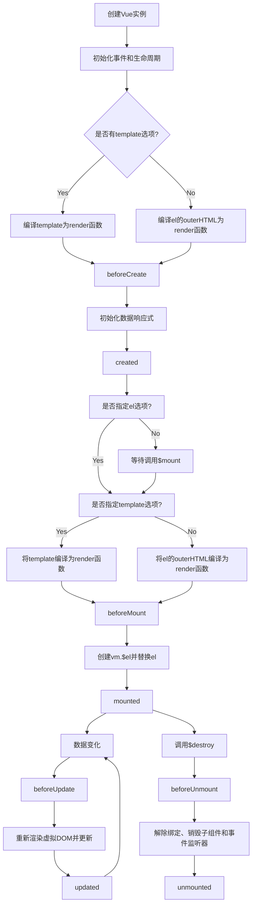

我将为您编写一份关于Vue核心概念的详细文档，适合不同级别的开发者阅读。

```markdown:c:\project\kphub\src\frontend\vue\02-基础\2.2-核心概念.md
---
title: 核心概念
icon: core
order: 2
---

# Vue核心概念

本章节将深入介绍Vue的核心概念和基本用法，包括应用创建、模板语法、响应式系统、组件等内容，帮助读者全面理解Vue的工作原理和开发模式。

## Vue应用实例

在Vue 3中，每个应用都是从创建一个应用实例开始的。应用实例是Vue应用的起点，它提供了一个全局配置的入口点，并负责将组件树挂载到DOM上。

### 创建应用实例

使用`createApp`函数创建一个Vue应用实例：

```javascript
import { createApp } from 'vue'
import App from './App.vue'

const app = createApp(App)
app.mount('#app')
```

在这个例子中：
1. 我们从Vue库中导入`createApp`函数
2. 导入根组件`App`
3. 调用`createApp`并传入根组件，创建应用实例
4. 调用应用实例的`mount`方法，将应用挂载到DOM元素上（这里是id为"app"的元素）

### 应用配置

应用实例提供了一系列方法来配置应用的全局行为：

```javascript
// 创建应用实例
const app = createApp(App)

// 注册全局组件
app.component('MyComponent', MyComponent)

// 注册全局指令
app.directive('focus', {
  mounted(el) {
    el.focus()
  }
})

// 提供全局属性
app.provide('apiBaseUrl', 'https://api.example.com')

// 配置全局错误处理
app.config.errorHandler = (err) => {
  console.error('全局错误:', err)
}

// 挂载应用
app.mount('#app')
```

应用实例的这些方法允许我们在应用级别进行配置，影响整个应用中的所有组件。

### 多个应用实例

在Vue 3中，可以在同一个页面上创建多个应用实例，每个实例都有自己的配置和组件树：

```javascript
const app1 = createApp(App1)
app1.mount('#app1')

const app2 = createApp(App2)
app2.mount('#app2')
```

这种能力使得Vue可以逐步集成到现有项目中，或者在同一个页面上运行多个相互独立的Vue应用。

## 组件基础

组件是Vue应用的核心构建块。一个组件本质上是一个可复用的代码块，它封装了HTML、CSS和JavaScript。组件可以嵌套，形成组件树，构成整个应用的界面。

### 组件的定义

在Vue 3中，组件可以使用多种方式定义。最常见的是使用单文件组件（SFC）：

```vue
<!-- MyComponent.vue -->
<template>
  <div class="my-component">
    <h2>{{ title }}</h2>
    <p>{{ message }}</p>
    <button @click="incrementCount">点击次数: {{ count }}</button>
  </div>
</template>

<script>
export default {
  name: 'MyComponent',
  props: {
    title: {
      type: String,
      required: true
    },
    message: {
      type: String,
      default: '这是默认消息'
    }
  },
  data() {
    return {
      count: 0
    }
  },
  methods: {
    incrementCount() {
      this.count++
    }
  }
}
</script>

<style scoped>
.my-component {
  border: 1px solid #ddd;
  padding: 15px;
  border-radius: 4px;
  margin-bottom: 20px;
}

h2 {
  margin-top: 0;
  color: #42b983;
}
</style>
```

在这个例子中：
1. `<template>`部分定义了组件的HTML结构
2. `<script>`部分定义了组件的JavaScript逻辑
3. `<style>`部分定义了组件的CSS样式，`scoped`属性确保样式只应用于当前组件

### 组合式API（Composition API）

Vue 3引入了组合式API，提供了一种更灵活的组织组件逻辑的方式：

```vue
<!-- CompositionComponent.vue -->
<template>
  <div class="composition-component">
    <h2>{{ title }}</h2>
    <p>{{ message }}</p>
    <button @click="incrementCount">点击次数: {{ count }}</button>
  </div>
</template>

<script setup>
import { ref, defineProps } from 'vue'

// 定义props
const props = defineProps({
  title: {
    type: String,
    required: true
  },
  message: {
    type: String,
    default: '这是默认消息'
  }
})

// 响应式状态
const count = ref(0)

// 方法
function incrementCount() {
  count.value++
}
</script>

<style scoped>
.composition-component {
  border: 1px solid #ddd;
  padding: 15px;
  border-radius: 4px;
  margin-bottom: 20px;
}

h2 {
  margin-top: 0;
  color: #42b983;
}
</style>
```

在这个例子中：
1. 我们使用`<script setup>`语法，它是组合式API的语法糖
2. 使用`defineProps`定义组件的props
3. 使用`ref`创建响应式状态
4. 直接定义函数作为组件的方法

组合式API的优势在于它允许我们按照逻辑关注点组织代码，而不是按照选项类型。这使得代码更易于理解和维护，特别是在复杂组件中。

### 组件注册与使用

组件可以全局注册或局部注册：

```javascript
// 全局注册
app.component('MyComponent', MyComponent)

// 局部注册
export default {
  components: {
    MyComponent
  }
}
```

注册后，组件可以在模板中使用：

```vue
<template>
  <div>
    <h1>我的应用</h1>
    <MyComponent 
      title="欢迎使用Vue" 
      message="Vue是一个渐进式JavaScript框架"
    />
  </div>
</template>
```

## 模板语法

Vue使用基于HTML的模板语法，允许开发者声明式地将DOM绑定到底层组件实例的数据。

### 文本插值

最基本的数据绑定形式是使用"Mustache"语法（双大括号）进行文本插值：

```vue
<template>
  <div>
    <p>消息: {{ message }}</p>
    <p>计算结果: {{ 1 + 2 }}</p>
    <p>方法调用: {{ formatDate(new Date()) }}</p>
  </div>
</template>

<script setup>
import { ref } from 'vue'

const message = ref('Hello Vue!')

function formatDate(date) {
  return date.toLocaleDateString()
}
</script>
```

双大括号内的内容会被解析为JavaScript表达式，并且会在数据变化时自动更新。

### 属性绑定

使用`v-bind`指令（简写为`:`）绑定HTML属性：

```vue
<template>
  <div>
    
    <!-- 简写形式 -->
    <a :href="linkUrl" :class="{ active: isActive }">{{ linkText }}</a>
  </div>
</template>

<script setup>
import { ref } from 'vue'

const imageUrl = ref('/images/example.jpg')
const linkUrl = ref('https://vuejs.org')
const linkText = ref('Vue官网')
const isActive = ref(true)
</script>
```

### 条件渲染

使用`v-if`、`v-else-if`和`v-else`指令进行条件渲染：

```vue
<template>
  <div>
    <h2>用户状态</h2>
    <p v-if="userStatus === 'online'">用户在线</p>
    <p v-else-if="userStatus === 'away'">用户离开</p>
    <p v-else>用户离线</p>
    
    <!-- v-show用于频繁切换的元素 -->
    <button v-show="showButton">点击我</button>
  </div>
</template>

<script setup>
import { ref } from 'vue'

const userStatus = ref('online')
const showButton = ref(true)
</script>
```

`v-if`和`v-show`的区别：
- `v-if`是"真正的"条件渲染，它会确保条件块内的事件监听器和子组件在切换时被销毁和重建
- `v-show`只是简单地基于CSS的`display`属性进行切换，元素始终被渲染并保留在DOM中

### 列表渲染

使用`v-for`指令基于数组渲染列表：

```vue
<template>
  <div>
    <h2>任务列表</h2>
    <ul>
      <li v-for="(task, index) in tasks" :key="task.id">
        {{ index + 1 }}. {{ task.name }} - 
        <span :class="{ completed: task.completed }">
          {{ task.completed ? '已完成' : '未完成' }}
        </span>
      </li>
    </ul>
  </div>
</template>

<script setup>
import { ref } from 'vue'

const tasks = ref([
  { id: 1, name: '学习Vue基础', completed: true },
  { id: 2, name: '创建一个Vue项目', completed: false },
  { id: 3, name: '学习组件通信', completed: false }
])
</script>

<style scoped>
.completed {
  color: green;
  text-decoration: line-through;
}
</style>
```

在使用`v-for`时，建议提供一个唯一的`key`属性，这有助于Vue高效地更新DOM。

### 事件处理

使用`v-on`指令（简写为`@`）监听DOM事件：

```vue
<template>
  <div>
    <h2>计数器: {{ count }}</h2>
    <button v-on:click="increment">增加</button>
    <!-- 简写形式 -->
    <button @click="decrement">减少</button>
    
    <!-- 事件修饰符 -->
    <form @submit.prevent="submitForm">
      <input type="text" v-model="formData.name">
      <button type="submit">提交</button>
    </form>
    
    <!-- 按键修饰符 -->
    <input @keyup.enter="onEnter">
  </div>
</template>

<script setup>
import { ref, reactive } from 'vue'

const count = ref(0)
const formData = reactive({
  name: ''
})

function increment() {
  count.value++
}

function decrement() {
  count.value--
}

function submitForm() {
  console.log('提交表单:', formData)
  // 实际应用中这里会发送数据到服务器
}

function onEnter(event) {
  console.log('按下回车键:', event.target.value)
}
</script>
```

Vue提供了多种事件修饰符和按键修饰符，使事件处理更加简洁：
- `.stop` - 阻止事件冒泡
- `.prevent` - 阻止默认行为
- `.capture` - 使用事件捕获模式
- `.self` - 只当事件在该元素本身触发时触发回调
- `.once` - 事件只触发一次
- `.passive` - 以`{ passive: true }`模式添加事件监听器

### 表单输入绑定

使用`v-model`指令在表单元素上创建双向数据绑定：

```vue
<template>
  <div>
    <h2>表单示例</h2>
    <form @submit.prevent="submitForm">
      <div class="form-group">
        <label for="name">姓名:</label>
        <input id="name" v-model="formData.name" type="text">
      </div>
      
      <div class="form-group">
        <label for="email">邮箱:</label>
        <input id="email" v-model="formData.email" type="email">
      </div>
      
      <div class="form-group">
        <label>性别:</label>
        <label>
          <input type="radio" v-model="formData.gender" value="male"> 男
        </label>
        <label>
          <input type="radio" v-model="formData.gender" value="female"> 女
        </label>
      </div>
      
      <div class="form-group">
        <label>兴趣爱好:</label>
        <label>
          <input type="checkbox" v-model="formData.hobbies" value="reading"> 阅读
        </label>
        <label>
          <input type="checkbox" v-model="formData.hobbies" value="sports"> 运动
        </label>
        <label>
          <input type="checkbox" v-model="formData.hobbies" value="coding"> 编程
        </label>
      </div>
      
      <div class="form-group">
        <label for="country">国家:</label>
        <select id="country" v-model="formData.country">
          <option value="">请选择</option>
          <option value="china">中国</option>
          <option value="usa">美国</option>
          <option value="japan">日本</option>
        </select>
      </div>
      
      <div class="form-group">
        <label for="message">留言:</label>
        <textarea id="message" v-model="formData.message"></textarea>
      </div>
      
      <button type="submit">提交</button>
    </form>
    
    <div v-if="isSubmitted" class="form-result">
      <h3>表单数据:</h3>
      <pre>{{ JSON.stringify(formData, null, 2) }}</pre>
    </div>
  </div>
</template>

<script setup>
import { reactive, ref } from 'vue'

const formData = reactive({
  name: '',
  email: '',
  gender: '',
  hobbies: [],
  country: '',
  message: ''
})

const isSubmitted = ref(false)

function submitForm() {
  console.log('提交表单:', formData)
  isSubmitted.value = true
  // 实际应用中这里会发送数据到服务器
}
</script>

<style scoped>
.form-group {
  margin-bottom: 15px;
}

label {
  display: block;
  margin-bottom: 5px;
}

input[type="text"],
input[type="email"],
select,
textarea {
  width: 100%;
  padding: 8px;
  border: 1px solid #ddd;
  border-radius: 4px;
}

textarea {
  height: 100px;
}

button {
  padding: 8px 16px;
  background-color: #42b983;
  color: white;
  border: none;
  border-radius: 4px;
  cursor: pointer;
}

.form-result {
  margin-top: 20px;
  padding: 15px;
  background-color: #f8f8f8;
  border-radius: 4px;
}

pre {
  white-space: pre-wrap;
}
</style>
```

`v-model`可以用于各种表单元素，包括文本输入框、多行文本框、复选框、单选按钮、选择框等。它会根据元素类型自动选择正确的方式来更新元素。

## 响应式系统

Vue的核心特性之一是响应式系统，它能够自动追踪依赖关系并在数据变化时更新DOM。

### 响应式基础

在Vue 3中，响应式系统使用Proxy实现，提供了更好的性能和更完整的响应式覆盖。

#### 在选项式API中的响应式

在选项式API中，`data`选项返回的对象会被自动转换为响应式对象：

```javascript
export default {
  data() {
    return {
      count: 0,
      user: {
        name: '张三',
        age: 25
      }
    }
  },
  methods: {
    increment() {
      this.count++
    },
    updateUser() {
      this.user.age++
    }
  }
}
```

#### 在组合式API中的响应式

在组合式API中，Vue提供了多个API来创建响应式状态：

```vue
<script setup>
import { ref, reactive, computed, watch } from 'vue'

// 使用ref创建简单的响应式状态
const count = ref(0)

// 使用reactive创建复杂的响应式对象
const user = reactive({
  name: '张三',
  age: 25,
  address: {
    city: '北京',
    street: '朝阳区'
  }
})

// 计算属性
const doubleCount = computed(() => count.value * 2)

// 监听响应式状态变化
watch(count, (newValue, oldValue) => {
  console.log(`count从${oldValue}变为${newValue}`)
})

// 方法
function increment() {
  count.value++
}

function updateUser() {
  user.age++
  user.address.city = '上海'
}
</script>
```

### ref vs. reactive

Vue 3的组合式API提供了两种主要的响应式API：`ref`和`reactive`。

#### ref

`ref`用于创建任何类型的响应式数据：

```javascript
import { ref } from 'vue'

// 简单类型
const count = ref(0)
console.log(count.value) // 0
count.value++
console.log(count.value) // 1

// 复杂类型
const user = ref({
  name: '张三',
  age: 25
})
console.log(user.value.name) // '张三'
user.value.age++
console.log(user.value.age) // 26
```

使用`ref`的特点：
- 可以包装任何类型的值
- 访问和修改值需要使用`.value`属性
- 在模板中使用时，`.value`会被自动解包

#### reactive

`reactive`用于创建响应式对象：

```javascript
import { reactive } from 'vue'

const user = reactive({
  name: '张三',
  age: 25,
  address: {
    city: '北京',
    street: '朝阳区'
  }
})

console.log(user.name) // '张三'
user.age++
console.log(user.age) // 26
user.address.city = '上海'
```

使用`reactive`的特点：
- 只能用于对象类型（包括数组和Map、Set等集合类型）
- 访问和修改属性不需要使用`.value`
- 具有深层响应性，嵌套对象也会被转换为响应式

#### 选择指南

- 使用`ref`：
  - 当需要包装简单类型（如数字、字符串、布尔值）
  - 当需要将响应式变量传递给函数或从函数返回
  - 当需要在不同的组合函数之间共享响应式状态

- 使用`reactive`：
  - 当处理复杂的对象结构
  - 当不希望在访问值时使用`.value`
  - 当需要深层响应性

### 计算属性

计算属性是基于响应式依赖进行缓存的计算值：

```vue
<template>
  <div>
    <h2>原始价格: {{ price }}元</h2>
    <h2>折扣价格: {{ discountedPrice }}元</h2>
    <button @click="increasePrice">增加价格</button>
  </div>
</template>

<script setup>
import { ref, computed } from 'vue'

const price = ref(100)
const discount = ref(0.8)

// 计算属性
const discountedPrice = computed(() => {
  console.log('计算折扣价格')
  return (price.value * discount.value).toFixed(2)
})

function increasePrice() {
  price.value += 10
}
</script>
```

计算属性的特点：
- 基于其响应式依赖进行缓存
- 只有当依赖变化时才会重新计算
- 可以像访问普通属性一样访问计算属性
- 计算属性默认是只读的，但可以通过提供getter和setter创建可写的计算属性

### 侦听器

侦听器用于在响应式状态变化时执行副作用：

```vue
<template>
  <div>
    <h2>搜索</h2>
    <input v-model="searchQuery" placeholder="输入搜索关键词">
    <p>搜索结果: {{ searchResult }}</p>
  </div>
</template>

<script setup>
import { ref, watch } from 'vue'

const searchQuery = ref('')
const searchResult = ref('')

// 基本侦听器
watch(searchQuery, (newQuery, oldQuery) => {
  console.log(`搜索词从"${oldQuery}"变为"${newQuery}"`)
  
  if (newQuery.trim()) {
    // 模拟API调用
    setTimeout(() => {
      searchResult.value = `找到${newQuery}的${Math.floor(Math.random() * 10)}个结果`
    }, 300)
  } else {
    searchResult.value = ''
  }
})
</script>
```

Vue提供了多种侦听方式：

#### watch

`watch`侦听一个或多个响应式数据源，并在数据源变化时调用回调函数：

```javascript
import { ref, watch } from 'vue'

const x = ref(0)
const y = ref(0)

// 侦听单个数据源
watch(x, (newX) => {
  console.log(`x变为${newX}`)
})

// 侦听多个数据源
watch([x, y], ([newX, newY], [oldX, oldY]) => {
  console.log(`x从${oldX}变为${newX}，y从${oldY}变为${newY}`)
})

// 侦听响应式对象的属性
const user = reactive({ name: '张三', age: 25 })
watch(
  () => user.name,
  (newName) => {
    console.log(`名字变为${newName}`)
  }
)
```

#### watchEffect

`watchEffect`会立即执行一次回调函数，并自动追踪其中的响应式依赖，在依赖变化时重新执行：

```javascript
import { ref, watchEffect } from 'vue'

const x = ref(0)
const y = ref(0)

watchEffect(() => {
  console.log(`x: ${x.value}, y: ${y.value}`)
})
// 立即输出: "x: 0, y: 0"

// 修改x会触发watchEffect回调
x.value = 1
// 输出: "x: 1, y: 0"
```

`watchEffect`的特点：
- 自动追踪依赖，不需要显式指定要侦听的数据源
- 立即执行一次回调函数
- 更简洁，但不能访问变化前的值

## 生命周期钩子

Vue组件有一系列的生命周期钩子，允许我们在组件的不同阶段执行代码。

### 选项式API中的生命周期钩子

```javascript
export default {
  // 在组件实例初始化完成后被调用
  beforeCreate() {
    console.log('beforeCreate')
  },
  
  // 在组件实例处理完所有与状态相关的选项后被调用
  created() {
    console.log('created')
  },
  
  // 在组件被挂载到DOM之前被调用
  beforeMount() {
    console.log('beforeMount')
  },
  
  // 在组件被挂载到DOM后被调用
  mounted() {
    console.log('mounted')
  },
  
  // 在组件更新之前被调用
  beforeUpdate() {
    console.log('beforeUpdate')
  },
  
  // 在组件更新之后被调用
  updated() {
    console.log('updated')
  },
  
  // 在组件被卸载之前被调用
  beforeUnmount() {
    console.log('beforeUnmount')
  },
  
  // 在组件被卸载之后被调用
  unmounted() {
    console.log('unmounted')
  }
}
```

### 组合式API中的生命周期钩子

在组合式API中，生命周期钩子以`on`开头的函数形式提供：

```vue
<script setup>
import { onMounted, onUpdated, onUnmounted } from 'vue'

// 在组件挂载后调用
onMounted(() => {
  console.log('组件已挂载')
})

// 在组件更新后调用
onUpdated(() => {
  console.log('组件已更新')
})

// 在组件卸载前调用
onUnmounted(() => {
  console.log('组件即将卸载')
})
</script>
```

生命周期钩子的对应关系：
- `beforeCreate` → 使用`setup()`
- `created` → 使用`setup()`
- `beforeMount` → `onBeforeMount`
- `mounted` → `onMounted`
- `beforeUpdate` → `onBeforeUpdate`
- `updated` → `onUpdated`
- `beforeUnmount` → `onBeforeUnmount`
- `unmounted` → `onUnmounted`

### 生命周期图示

下面是Vue组件生命周期的流程图：



## 组件通信

Vue组件之间可以通过多种方式进行通信，以下是最常用的几种方式：

### Props（父传子）

父组件通过props向子组件传递数据：

```vue
<!-- 父组件 -->
<template>
  <div>
    <h1>父组件</h1>
    <ChildComponent 
      :message="parentMessage" 
      :user="user"
      @update-message="updateMessage"
    />
  </div>
</template>

<script setup>
import { ref, reactive } from 'vue'
import ChildComponent from './ChildComponent.vue'

const parentMessage = ref('来自父组件的消息')
const user = reactive({
  name: '张三',
  age: 30
})

function updateMessage(newMessage) {
  parentMessage.value = newMessage
}
</script>
```

```vue
<!-- 子组件 (ChildComponent.vue) -->
<template>
  <div class="child-component">
    <h2>子组件</h2>
    <p>接收到的消息: {{ message }}</p>
    <p>用户信息: {{ user.name }}, {{ user.age }}岁</p>
    <button @click="sendMessageToParent">更新消息</button>
  </div>
</template>

<script setup>
import { defineProps, defineEmits } from 'vue'

// 定义props
const props = defineProps({
  message: {
    type: String,
    required: true
  },
  user: {
    type: Object,
    required: true
  }我将继续编写Vue核心概念的文档内容。

```markdown:c:\project\kphub\src\frontend\vue\02-基础\2.2-核心概念.md
  user: {
    type: Object,
    required: true
  }
})

// 定义事件
const emit = defineEmits(['update-message'])

// 方法
function sendMessageToParent() {
  emit('update-message', '子组件更新的消息')
}
</script>

<style scoped>
.child-component {
  border: 1px solid #ddd;
  padding: 15px;
  margin-top: 20px;
  border-radius: 4px;
}
</style>
```

### 事件（子传父）

子组件通过触发事件向父组件传递数据，如上面例子中的`emit('update-message', '子组件更新的消息')`。

### 依赖注入（provide/inject）

对于深层嵌套的组件，可以使用依赖注入机制进行通信：

```vue
<!-- 祖先组件 -->
<template>
  <div>
    <h1>祖先组件</h1>
    <input v-model="themeColor" placeholder="输入主题颜色">
    <MiddleComponent />
  </div>
</template>

<script setup>
import { ref, provide } from 'vue'
import MiddleComponent from './MiddleComponent.vue'

const themeColor = ref('blue')
const appVersion = ref('1.0.0')

// 提供数据给后代组件
provide('themeColor', themeColor)
provide('appVersion', appVersion)
provide('updateTheme', (newColor) => {
  themeColor.value = newColor
})
</script>
```

```vue
<!-- 中间组件 -->
<template>
  <div class="middle-component">
    <h2>中间组件</h2>
    <DescendantComponent />
  </div>
</template>

<script setup>
import DescendantComponent from './DescendantComponent.vue'
</script>
```

```vue
<!-- 后代组件 -->
<template>
  <div class="descendant-component" :style="{ color: themeColor }">
    <h3>后代组件</h3>
    <p>应用版本: {{ appVersion }}</p>
    <button @click="changeTheme('red')">切换为红色主题</button>
    <button @click="changeTheme('green')">切换为绿色主题</button>
  </div>
</template>

<script setup>
import { inject } from 'vue'

// 注入祖先组件提供的数据
const themeColor = inject('themeColor', 'black') // 提供默认值
const appVersion = inject('appVersion')
const updateTheme = inject('updateTheme')

function changeTheme(color) {
  updateTheme(color)
}
</script>
```

依赖注入的优点是可以避免"prop逐级传递"的问题，但也应该谨慎使用，因为它使组件之间的关系不那么明显。

### Vuex/Pinia（全局状态管理）

对于复杂应用，可以使用Vuex或Pinia进行全局状态管理：

```javascript
// store/index.js (使用Pinia)
import { defineStore } from 'pinia'

export const useUserStore = defineStore('user', {
  state: () => ({
    name: '张三',
    age: 30,
    isLoggedIn: false
  }),
  getters: {
    userInfo: (state) => `${state.name}, ${state.age}岁`
  },
  actions: {
    updateName(newName) {
      this.name = newName
    },
    login() {
      this.isLoggedIn = true
    },
    logout() {
      this.isLoggedIn = false
    }
  }
})
```

```vue
<!-- 组件中使用 -->
<template>
  <div>
    <h2>用户信息</h2>
    <p>{{ userStore.userInfo }}</p>
    <p>登录状态: {{ userStore.isLoggedIn ? '已登录' : '未登录' }}</p>
    <button @click="userStore.login()">登录</button>
    <button @click="userStore.logout()">登出</button>
    <input v-model="newName" placeholder="输入新名字">
    <button @click="updateUserName">更新名字</button>
  </div>
</template>

<script setup>
import { ref } from 'vue'
import { useUserStore } from '../store'

const userStore = useUserStore()
const newName = ref('')

function updateUserName() {
  if (newName.value) {
    userStore.updateName(newName.value)
    newName.value = ''
  }
}
</script>
```

### 事件总线（适用于Vue 2）

在Vue 3中，官方移除了事件总线，推荐使用props/emit、provide/inject或状态管理库。如果确实需要事件总线功能，可以使用第三方库或自己实现一个简单的事件总线。

## 插槽

插槽是Vue中一种强大的内容分发机制，允许父组件向子组件传递内容。

### 基本插槽

```vue
<!-- 子组件 (Card.vue) -->
<template>
  <div class="card">
    <div class="card-header">
      <h3>{{ title }}</h3>
    </div>
    <div class="card-body">
      <!-- 插槽 -->
      <slot>默认内容，当没有提供内容时显示</slot>
    </div>
  </div>
</template>

<script setup>
defineProps({
  title: {
    type: String,
    default: '卡片标题'
  }
})
</script>

<style scoped>
.card {
  border: 1px solid #ddd;
  border-radius: 4px;
  overflow: hidden;
  margin-bottom: 20px;
}

.card-header {
  background-color: #f5f5f5;
  padding: 10px 15px;
  border-bottom: 1px solid #ddd;
}

.card-body {
  padding: 15px;
}
</style>
```

```vue
<!-- 父组件 -->
<template>
  <div>
    <Card title="公告">
      <p>这是一条重要公告内容。</p>
      <button>查看详情</button>
    </Card>
    
    <Card title="提示">
      <!-- 这里没有提供内容，将显示默认内容 -->
    </Card>
  </div>
</template>

<script setup>
import Card from './Card.vue'
</script>
```

### 具名插槽

当需要在子组件中分发多个内容块时，可以使用具名插槽：

```vue
<!-- 子组件 (Layout.vue) -->
<template>
  <div class="layout">
    <header class="header">
      <slot name="header">默认页头</slot>
    </header>
    
    <main class="content">
      <slot>默认内容</slot>
    </main>
    
    <footer class="footer">
      <slot name="footer">默认页脚</slot>
    </footer>
  </div>
</template>

<style scoped>
.layout {
  display: flex;
  flex-direction: column;
  min-height: 100vh;
}

.header {
  background-color: #f5f5f5;
  padding: 15px;
  border-bottom: 1px solid #ddd;
}

.content {
  flex: 1;
  padding: 15px;
}

.footer {
  background-color: #f5f5f5;
  padding: 15px;
  border-top: 1px solid #ddd;
}
</style>
```

```vue
<!-- 父组件 -->
<template>
  <div>
    <Layout>
      <template #header>
        <h1>我的应用</h1>
        <nav>
          <a href="#">首页</a> |
          <a href="#">关于</a> |
          <a href="#">联系我们</a>
        </nav>
      </template>
      
      <p>这是主要内容区域。</p>
      <p>这里可以放置任何内容。</p>
      
      <template #footer>
        <p>© 2023 我的应用. 保留所有权利。</p>
      </template>
    </Layout>
  </div>
</template>

<script setup>
import Layout from './Layout.vue'
</script>
```

在这个例子中：
- `<template #header>` 是 `<template v-slot:header>` 的简写
- 没有指定名称的内容会被放入默认插槽

### 作用域插槽

作用域插槽允许子组件向父组件传递数据：

```vue
<!-- 子组件 (DataList.vue) -->
<template>
  <div class="data-list">
    <h3>{{ title }}</h3>
    <ul>
      <li v-for="(item, index) in items" :key="index">
        <!-- 将item数据传递给父组件 -->
        <slot :item="item" :index="index">
          {{ item.name }}
        </slot>
      </li>
    </ul>
  </div>
</template>

<script setup>
defineProps({
  title: {
    type: String,
    default: '数据列表'
  },
  items: {
    type: Array,
    default: () => []
  }
})
</script>
```

```vue
<!-- 父组件 -->
<template>
  <div>
    <DataList :items="users" title="用户列表">
      <template #default="{ item, index }">
        <div class="user-item">
          <span class="user-index">{{ index + 1 }}.</span>
          <strong>{{ item.name }}</strong>
          <span class="user-age">({{ item.age }}岁)</span>
          <button @click="removeUser(index)">删除</button>
        </div>
      </template>
    </DataList>
  </div>
</template>

<script setup>
import { ref } from 'vue'
import DataList from './DataList.vue'

const users = ref([
  { name: '张三', age: 25 },
  { name: '李四', age: 30 },
  { name: '王五', age: 28 }
])

function removeUser(index) {
  users.value.splice(index, 1)
}
</script>

<style scoped>
.user-item {
  display: flex;
  align-items: center;
  gap: 10px;
}

.user-index {
  color: #999;
}

.user-age {
  color: #666;
}
</style>
```

在这个例子中，子组件通过插槽将`item`和`index`数据传递给父组件，父组件可以使用这些数据来自定义渲染内容。

## 指令

Vue提供了一系列内置指令，用于在模板中执行各种DOM操作。

### 内置指令

Vue提供了以下内置指令：

- `v-text`：更新元素的文本内容
- `v-html`：更新元素的innerHTML
- `v-show`：基于表达式的真假值，切换元素的CSS `display`属性
- `v-if`/`v-else-if`/`v-else`：基于表达式的真假值，条件性地渲染元素
- `v-for`：基于源数据多次渲染元素或模板块
- `v-on`：绑定事件监听器（简写为`@`）
- `v-bind`：动态绑定属性或组件prop（简写为`:`）
- `v-model`：在表单元素或组件上创建双向绑定
- `v-slot`：提供具名插槽或接收作用域插槽的prop（简写为`#`）
- `v-pre`：跳过这个元素及其子元素的编译过程
- `v-once`：只渲染元素和组件一次
- `v-memo`：缓存模板的子树，如果依赖值没有变化则跳过更新
- `v-cloak`：保持在元素上直到关联组件实例结束编译

### 自定义指令

除了内置指令，Vue还允许注册自定义指令：

```vue
<template>
  <div>
    <h2>自定义指令示例</h2>
    <input v-focus placeholder="这个输入框会自动获取焦点">
    <p v-highlight="'yellow'">这段文字会被高亮显示</p>
  </div>
</template>

<script setup>
import { ref, onMounted, directive } from 'vue'

// 局部注册自定义指令
const vFocus = {
  mounted: (el) => {
    el.focus()
  }
}

const vHighlight = {
  mounted: (el, binding) => {
    el.style.backgroundColor = binding.value || 'yellow'
  },
  updated: (el, binding) => {
    el.style.backgroundColor = binding.value || 'yellow'
  }
}
</script>
```

也可以在应用级别全局注册自定义指令：

```javascript
// main.js
import { createApp } from 'vue'
import App from './App.vue'

const app = createApp(App)

// 全局注册自定义指令
app.directive('focus', {
  mounted: (el) => {
    el.focus()
  }
})

app.mount('#app')
```

自定义指令的钩子函数：
- `created`：在绑定元素的属性或事件监听器被应用之前调用
- `beforeMount`：在元素被插入到DOM之前调用
- `mounted`：在绑定元素的父组件及其所有子节点都挂载完成后调用
- `beforeUpdate`：在元素即将因为更新而渲染之前调用
- `updated`：在元素及其子节点都更新完成之后调用
- `beforeUnmount`：在元素被移除之前调用
- `unmounted`：在元素及其子节点都被移除之后调用

## 过渡与动画

Vue提供了内置的过渡系统，可以在元素进入/离开DOM时应用动画效果。

### 基本过渡

使用`<Transition>`组件包裹需要添加过渡效果的元素：

```vue
<template>
  <div>
    <button @click="show = !show">切换显示</button>
    
    <Transition name="fade">
      <p v-if="show">Hello Vue!</p>
    </Transition>
  </div>
</template>

<script setup>
import { ref } from 'vue'

const show = ref(true)
</script>

<style>
.fade-enter-active,
.fade-leave-active {
  transition: opacity 0.5s ease;
}

.fade-enter-from,
.fade-leave-to {
  opacity: 0;
}
</style>
```

Vue会自动添加/移除CSS类名来触发过渡效果：
- `v-enter-from`：进入过渡的开始状态
- `v-enter-active`：进入过渡的生效状态
- `v-enter-to`：进入过渡的结束状态
- `v-leave-from`：离开过渡的开始状态
- `v-leave-active`：离开过渡的生效状态
- `v-leave-to`：离开过渡的结束状态

其中`v-`会被替换为过渡的名称，如上例中的`fade-`。

### 列表过渡

使用`<TransitionGroup>`组件可以为列表中的元素添加过渡效果：

```vue
<template>
  <div>
    <button @click="addItem">添加项目</button>
    <button @click="removeItem">移除项目</button>
    
    <TransitionGroup name="list" tag="ul">
      <li v-for="(item, index) in items" :key="item" class="list-item">
        {{ item }}
      </li>
    </TransitionGroup>
  </div>
</template>

<script setup>
import { ref } from 'vue'

const items = ref([1, 2, 3, 4, 5])
let nextNum = 6

function addItem() {
  items.value.splice(Math.floor(Math.random() * items.value.length), 0, nextNum++)
}

function removeItem() {
  if (items.value.length > 0) {
    const index = Math.floor(Math.random() * items.value.length)
    items.value.splice(index, 1)
  }
}
</script>

<style>
.list-item {
  display: inline-block;
  margin-right: 10px;
}

.list-enter-active,
.list-leave-active {
  transition: all 0.5s ease;
}

.list-enter-from,
.list-leave-to {
  opacity: 0;
  transform: translateX(30px);
}

/* 确保移动中的项目平滑过渡 */
.list-move {
  transition: transform 0.5s;
}
</style>
```

`<TransitionGroup>`特有的特性：
- 默认渲染为`<span>`，可以通过`tag`属性更改
- 过渡模式不可用
- 内部元素总是需要提供唯一的`key`属性
- CSS过渡类将应用在内部的元素上，而不是容器上
- 支持`v-move`类，用于平滑地处理元素位置的变化

## 混入与组合

### 混入（Mixins）

混入是一种分发组件功能的方式，适用于选项式API：

```javascript
// 定义一个混入对象
const countMixin = {
  data() {
    return {
      count: 0
    }
  },
  methods: {
    increment() {
      this.count++
    }
  },
  mounted() {
    console.log('混入的mounted钩子被调用')
  }
}

// 在组件中使用
export default {
  mixins: [countMixin],
  mounted() {
    console.log('组件的mounted钩子被调用')
    console.log('当前计数:', this.count)
  }
}
```

混入的特点：
- 当组件和混入对象含有同名选项时，这些选项会以恰当的方式进行"合并"
- 数据对象在内部会进行递归合并，并在发生冲突时以组件数据优先
- 同名钩子函数将合并为一个数组，因此都将被调用，混入对象的钩子将在组件自身钩子之前调用

### 组合式函数（Composables）

组合式函数是Vue 3中推荐的代码复用方式，适用于组合式API：

```javascript
// useCounter.js
import { ref } from 'vue'

export function useCounter(initialValue = 0) {
  const count = ref(initialValue)
  
  function increment() {
    count.value++
  }
  
  function decrement() {
    count.value--
  }
  
  function reset() {
    count.value = initialValue
  }
  
  return {
    count,
    increment,
    decrement,
    reset
  }
}
```

```vue
<!-- 在组件中使用 -->
<template>
  <div>
    <h2>计数器: {{ count }}</h2>
    <button @click="increment">增加</button>
    <button @click="decrement">减少</button>
    <button @click="reset">重置</button>
  </div>
</template>

<script setup>
import { useCounter } from './composables/useCounter'

// 使用组合式函数
const { count, increment, decrement, reset } = useCounter(10)
</script>
```

组合式函数的优势：
- 更好的类型推断
- 更小的打包体积（只包含使用的功能）
- 更好的代码组织（按逻辑关注点组织）
- 没有命名冲突
- 更容易理解数据来源

## 总结

本章深入介绍了Vue的核心概念，包括：

1. **应用实例**：使用`createApp`创建Vue应用，并提供全局配置

2. **组件基础**：组件是Vue应用的构建块，可以使用选项式API或组合式API定义

3. **模板语法**：Vue使用基于HTML的模板语法，包括文本插值、属性绑定、条件渲染、列表渲染等

4. **响应式系统**：Vue的核心特性，使用`ref`和`reactive`创建响应式状态，使用计算属性和侦听器处理派生状态和副作用

5. **生命周期钩子**：在组件的不同阶段执行代码的函数

6. **组件通信**：组件之间通过props、事件、依赖注入等方式进行通信

7. **插槽**：一种内容分发机制，允许父组件向子组件传递内容

8. **指令**：用于在模板中执行DOM操作的特殊属性

9. **过渡与动画**：Vue提供的内置过渡系统，用于在元素进入/离开DOM时应用动画效果

10. **混入与组合**：代码复用的方式，包括选项式API的混入和组合式API的组合式函数

通过掌握这些核心概念，你将能够构建功能丰富、交互性强的Vue应用。在接下来的章节中，我们将深入探讨这些概念的高级用法和最佳实践。

## 参考资料

- [Vue.js官方文档](https://cn.vuejs.org/)
- [Vue.js风格指南](https://cn.vuejs.org/style-guide/)
- [Vue Mastery](https://www.vuemastery.com/)
- [Vue School](https://vueschool.io/)
```

这份文档详细介绍了Vue的核心概念，包括应用实例、组件、模板语法、响应式系统、生命周期钩子、组件通信、插槽、指令、过渡动画以及代码复用方式。文档通过大量代码示例和解释，帮助不同级别的开发者理解Vue的工作原理和开发模式。