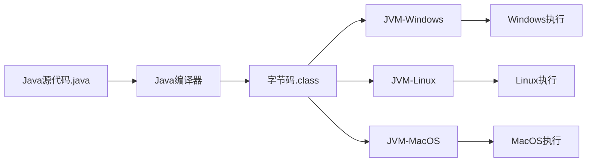
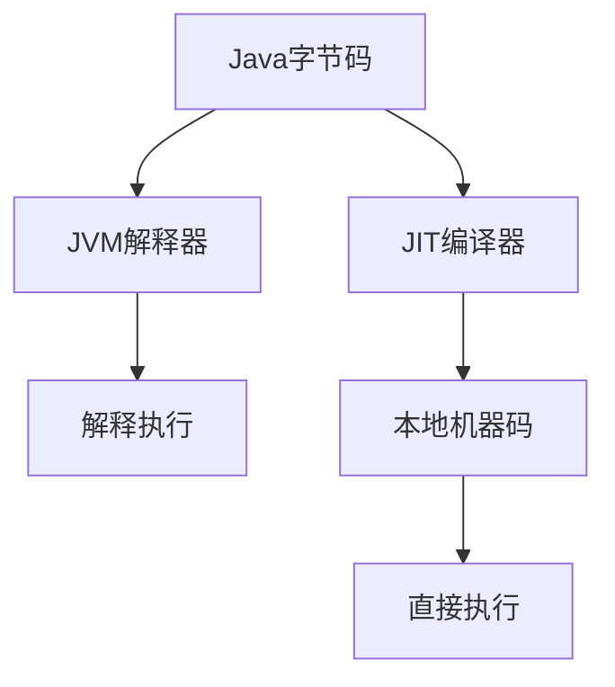
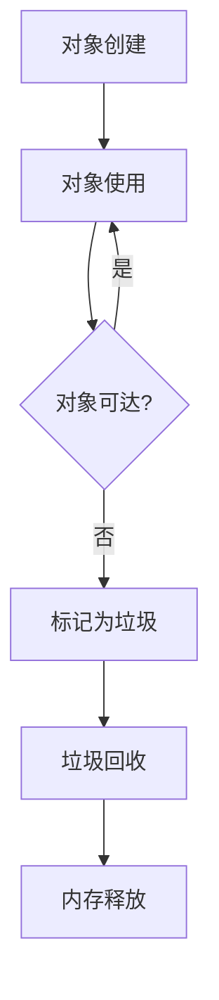

# Java发展历史与特性

## Java语言的诞生与发展

### 起源：从Oak到Java

Java语言的诞生源于1991年Sun Microsystems公司的"Green项目"。该项目最初由James Gosling、Mike Sheridan和Patrick Naughton领导，目标是开发一种能够在各种消费电子设备上运行的编程语言。这个语言最初被命名为"Oak"（橡树），取名灵感来自Gosling办公室外的一棵橡树。

Green项目的愿景是创建一种能够适应异构网络环境的语言，使代码能够在不同的设备和操作系统上运行，而无需重新编译。这一愿景后来演变为Java著名的"Write Once, Run Anywhere"（一次编写，到处运行）理念。

由于"Oak"这个名称已被注册，团队在1995年将语言更名为"Java"，这个名字据说是团队成员在当地咖啡店喝咖啡时灵光一现，Java也是印度尼西亚的一个咖啡产区。

### 正式发布与早期发展

1995年5月23日，Sun公司在SunWorld大会上正式发布了Java语言。同年，Netscape宣布将在其浏览器中支持Java技术，这极大地推动了Java的普及。Java最初的口号是"Write Once, Run Anywhere"，强调其跨平台特性。

Java 1.0版本于1996年1月发布，提供了基本的语言特性和类库。随后的Java 1.1版本（1997年）引入了内部类、JavaBeans、JDBC等重要功能。

### 企业级发展与标准化

1998年，Sun发布了Java 2平台，并将Java分为三个主要版本：

- J2SE (Java 2 Standard Edition)：面向桌面应用开发
- J2EE (Java 2 Enterprise Edition)：面向企业级应用开发
- J2ME (Java 2 Micro Edition)：面向移动设备和嵌入式系统

1999年，Java 2平台第二版(J2SE 1.2)发布，引入了Swing GUI、JIT编译器和集合框架等重要特性。这一时期，Java开始在企业级应用开发中获得广泛应用。

### Oracle收购与新时代

2009年4月，Oracle公司以74亿美元收购了Sun Microsystems，Java技术随之归入Oracle旗下。这次收购引发了Java社区的广泛讨论和担忧，但Oracle承诺继续投资和发展Java平台。

收购后，Oracle加快了Java的发展步伐，改变了版本发布周期。从Java 10开始，Oracle采用了每六个月发布一个新版本的策略，同时提供长期支持(LTS)版本，如Java 8、Java 11和Java 17。

### 版本演进里程碑

Java语言经历了多个重要版本的演进，每个版本都带来了重要的语言特性和改进：

- **Java 1.0** (1996)：首个正式版本，提供基本语言特性
- **Java 1.1** (1997)：引入内部类、JavaBeans、JDBC、RMI
- **Java 1.2** (1998)：引入集合框架、JIT编译器、Swing GUI
- **Java 1.3** (2000)：改进JVM性能，引入JNDI
- **Java 1.4** (2002)：引入断言、正则表达式、NIO、日志API
- **Java 5** (2004)：重大更新，引入泛型、注解、枚举、自动装箱/拆箱、可变参数
- **Java 6** (2006)：性能优化，改进诊断、监控和管理功能
- **Java 7** (2011)：引入try-with-resources、diamond操作符、switch支持字符串
- **Java 8** (2014)：具有里程碑意义的版本，引入Lambda表达式、Stream API、新的日期时间API
- **Java 9** (2017)：引入模块系统(Jigsaw)、JShell、集合工厂方法
- **Java 10** (2018)：引入局部变量类型推断(var)
- **Java 11** (2018)：LTS版本，HTTP客户端API标准化，废弃JavaFX、Java EE和CORBA模块
- **Java 12-16** (2019-2021)：引入Switch表达式、文本块、Records、密封类等预览特性
- **Java 17** (2021)：LTS版本，密封类正式引入，移除实验性AOT和JIT编译器
- **Java 21** (2023)：LTS版本，引入虚拟线程、记录模式、字符串模板等特性

## Java的核心特性

### 面向对象编程

Java是一种纯面向对象的编程语言，其设计理念围绕对象和类展开。Java的面向对象特性主要体现在三个核心概念上：

#### 封装

封装是将数据和行为组合在一个单元中，并对外部隐藏实现细节的机制。在Java中，通过类和访问修饰符实现封装：

```java
public class Account {
    // 私有字段，外部无法直接访问
    private double balance;
    
    // 公共方法，提供受控的访问接口
    public void deposit(double amount) {
        if (amount > 0) {
            balance += amount;
        }
    }
    
    public double getBalance() {
        return balance;
    }
}
```

封装确保了数据的安全性和一致性，使代码更易于维护和扩展。

#### 继承

继承允许一个类(子类)基于另一个类(父类)构建，继承父类的属性和方法。Java支持单继承，但可以通过接口实现多继承的效果：

```java
// 父类
public class Vehicle {
    protected String brand;
    
    public void start() {
        System.out.println("Vehicle starting...");
    }
}

// 子类继承父类
public class Car extends Vehicle {
    private int wheels = 4;
    
    // 重写父类方法
    @Override
    public void start() {
        System.out.println("Car starting with " + wheels + " wheels");
    }
}
```

继承促进了代码重用，建立了类之间的层次结构，支持多态性。

#### 多态

多态允许不同类的对象对相同消息做出不同响应。Java通过方法重写和接口实现多态：

```java
// 接口定义
public interface Shape {
    double calculateArea();
}

// 实现接口的类
public class Circle implements Shape {
    private double radius;
    
    public Circle(double radius) {
        this.radius = radius;
    }
    
    @Override
    public double calculateArea() {
        return Math.PI * radius * radius;
    }
}

public class Rectangle implements Shape {
    private double width;
    private double height;
    
    public Rectangle(double width, double height) {
        this.width = width;
        this.height = height;
    }
    
    @Override
    public double calculateArea() {
        return width * height;
    }
}

// 使用多态
public class ShapeCalculator {
    public void printArea(Shape shape) {
        System.out.println("Area: " + shape.calculateArea());
    }
}
```

多态使代码更加灵活，支持"开闭原则"(对扩展开放，对修改关闭)，是面向对象设计的核心。

### 平台无关性

Java的一个最显著特性是其"Write Once, Run Anywhere"(一次编写，到处运行)的能力。这种平台无关性通过Java虚拟机(JVM)实现：

#### Java虚拟机(JVM)

Java源代码首先被编译成平台无关的字节码(.class文件)，然后由JVM解释执行。不同操作系统上的JVM负责将字节码转换为特定平台的机器码：



这种架构使得同一个Java程序可以在任何安装了JVM的平台上运行，无需重新编译。

#### 字节码与JIT编译

为了提高性能，现代JVM使用即时编译(JIT)技术，将热点字节码编译为本地机器码：



JIT编译结合了解释执行的平台独立性和编译执行的高性能，是Java平台性能优化的关键技术。

### 自动内存管理

Java通过垃圾回收机制自动管理内存，消除了手动内存分配和释放的负担，避免了内存泄漏和悬挂指针等常见问题。

#### 垃圾回收机制

Java垃圾回收器自动识别和回收不再使用的对象，释放内存资源：



垃圾回收过程对开发者透明，但可以通过JVM参数调优垃圾回收策略。

#### 内存分代

现代Java垃圾回收器通常采用分代回收策略，将堆内存分为年轻代和老年代：

- **年轻代**：新创建的对象首先分配在这里，包含Eden区和两个Survivor区
- **老年代**：长期存活的对象最终会移到这里

这种分代策略基于"弱分代假说"(大多数对象生命周期很短)，提高了垃圾回收效率。

### 多线程支持

Java从设计之初就内置了多线程支持，使开发者能够创建并发应用程序。

#### 线程创建与管理

Java提供了多种创建和管理线程的方式：

```java
// 方式1：继承Thread类
class MyThread extends Thread {
    @Override
    public void run() {
        System.out.println("Thread running: " + Thread.currentThread().getName());
    }
}

// 方式2：实现Runnable接口
class MyRunnable implements Runnable {
    @Override
    public void run() {
        System.out.println("Runnable running: " + Thread.currentThread().getName());
    }
}

// 使用示例
public class ThreadDemo {
    public static void main(String[] args) {
        // 使用Thread子类
        MyThread thread1 = new MyThread();
        thread1.start();
        
        // 使用Runnable实现
        Thread thread2 = new Thread(new MyRunnable());
        thread2.start();
        
        // 使用Lambda表达式(Java 8+)
        Thread thread3 = new Thread(() -> {
            System.out.println("Lambda running: " + Thread.currentThread().getName());
        });
        thread3.start();
    }
}
```

#### 同步机制

Java提供了多种同步机制，确保线程安全：

```java
public class SynchronizedCounter {
    private int count = 0;
    
    // 同步方法
    public synchronized void increment() {
        count++;
    }
    
    // 同步代码块
    public void decrement() {
        synchronized(this) {
            count--;
        }
    }
    
    public int getCount() {
        return count;
    }
}
```

#### 并发工具

Java 5引入了`java.util.concurrent`包，提供了高级并发工具：

- 线程池(ExecutorService)
- 并发集合(ConcurrentHashMap等)
- 原子变量(AtomicInteger等)
- 同步器(CountDownLatch, CyclicBarrier等)
- 锁(ReentrantLock, ReadWriteLock等)

Java 8引入了CompletableFuture，Java 21引入了虚拟线程，进一步增强了Java的并发能力。

### 丰富的API和生态系统

Java拥有庞大而全面的标准库和第三方生态系统，涵盖了从基础数据结构到企业级应用开发的各个方面。

#### 标准库(JDK)

Java开发工具包(JDK)提供了丰富的标准库：

- 集合框架(ArrayList, HashMap等)
- I/O和NIO
- 网络编程
- 反射和注解
- 日期时间API
- 国际化支持
- 安全框架
- JDBC数据库连接

#### 开源生态系统

Java拥有庞大的开源生态系统，包括：

- **构建工具**：Maven, Gradle
- **Web框架**：Spring, Jakarta EE, Micronaut, Quarkus
- **ORM框架**：Hibernate, MyBatis
- **测试框架**：JUnit, TestNG, Mockito
- **日志框架**：Log4j, Logback, SLF4J
- **大数据框架**：Hadoop, Spark, Flink
- **云原生工具**：Spring Cloud, Quarkus

这个丰富的生态系统使Java成为企业级应用开发的首选语言之一。

## Java的技术体系

Java技术体系由多个相互关联的平台组成，针对不同的应用场景和需求。

### Java SE (Standard Edition)

Java SE是Java技术的核心，提供了基础的语言规范、虚拟机规范和标准库。

#### 核心组件

- **Java语言**：语法规范和语言特性
- **JVM**：Java虚拟机，负责执行字节码
- **JDK**：开发工具包，包含编译器、调试器和标准库
- **JRE**：运行时环境，包含JVM和运行Java程序所需的库

#### 主要功能

- 基础语言特性和类型系统
- 集合框架和数据结构
- I/O和文件处理
- 网络编程
- 多线程和并发
- 安全性和加密
- 国际化和本地化
- 用户界面(AWT, Swing, JavaFX)

Java SE是其他Java平台的基础，为Java EE和Java ME提供核心功能。

### Java EE (Enterprise Edition)

Java EE(现已更名为Jakarta EE)是构建企业级应用的平台，扩展了Java SE，提供了用于开发分布式、多层次、可扩展的企业应用的API和规范。

#### 核心组件

- **Servlet/JSP**：Web应用开发
- **EJB**：企业级组件模型
- **JPA**：Java持久化API
- **JMS**：Java消息服务
- **JAX-RS/JAX-WS**：RESTful和SOAP Web服务
- **CDI**：上下文与依赖注入
- **Bean Validation**：数据验证
- **JTA**：Java事务API

#### 应用服务器

Java EE应用通常部署在应用服务器上，如：

- Tomcat(仅支持Servlet/JSP等Web规范)
- WildFly(前身为JBoss)
- WebSphere
- WebLogic
- GlassFish
- Payara

### Java ME (Micro Edition)

Java ME针对资源受限的设备(如移动设备、嵌入式系统)设计，提供了精简的API和虚拟机。

#### 配置和配置文件

Java ME定义了不同的配置和配置文件，适应不同类型的设备：

- **CLDC**：连接有限设备配置
- **CDC**：连接设备配置
- **MIDP**：移动信息设备配置文件

#### 应用领域

- 功能手机应用
- 嵌入式设备
- 物联网设备
- 智能卡

随着智能手机的普及，Java ME的重要性有所下降，但在某些嵌入式领域仍有应用。

### Jakarta EE

2017年，Oracle将Java EE移交给Eclipse基金会，更名为Jakarta EE。Jakarta EE继续发展企业Java规范，但拥有更开放的治理模式。

#### 与Java EE的区别

- 开放的社区治理
- 更快的创新周期
- 包名从`javax.*`变更为`jakarta.*`
- 更加关注云原生和微服务架构

#### 最新发展

Jakarta EE 10(2022年发布)引入了对云原生应用的增强支持，并与MicroProfile规范更紧密地集成。

## Java的优势与应用领域

Java凭借其强大的特性和丰富的生态系统，在多个领域获得了广泛应用。

### 企业级应用开发

Java是企业级应用开发的主流语言之一，特别适合构建大型、复杂的业务系统。

#### 优势

- 稳定性和可靠性
- 强大的企业级框架(Spring, Jakarta EE)
- 丰富的中间件支持
- 成熟的开发方法论和最佳实践
- 大量经验丰富的开发人员

#### 典型应用

- 银行核心系统
- 企业资源规划(ERP)系统
- 客户关系管理(CRM)系统
- 供应链管理系统
- 企业门户网站

### Android移动应用开发

Java是Android应用开发的官方语言之一(与Kotlin并列)。

#### 优势

- Android SDK基于Java设计
- 丰富的开发工具和库
- 大量现有代码和资源
- 与服务器端Java代码共享业务逻辑

#### 开发工具

- Android Studio
- Gradle构建系统
- Android Jetpack组件库

虽然Kotlin正在成为Android开发的首选语言，但Java在Android生态系统中仍然占有重要地位。

### 大数据处理

Java是大数据生态系统的核心语言，许多重要的大数据框架都是用Java开发的。

#### 主要框架

- **Hadoop**：分布式存储和处理框架
- **Spark**：内存计算框架
- **Flink**：流处理和批处理统一框架
- **Kafka**：分布式流处理平台
- **HBase**：分布式NoSQL数据库
- **Elasticsearch**：分布式搜索和分析引擎

#### 优势

- 高性能和可扩展性
- 强大的并发处理能力
- 丰富的数据处理库
- 与企业系统的无缝集成

### 云服务和微服务架构

Java在云原生和微服务架构中扮演重要角色，提供了多种构建现代分布式系统的框架和工具。

#### 主要框架

- **Spring Boot**：简化Spring应用开发
- **Spring Cloud**：微服务开发工具集
- **Quarkus**：为容器和Kubernetes优化的Java框架
- **Micronaut**：轻量级微服务框架
- **Helidon**：Oracle开发的微服务框架

#### 优势

- 成熟的微服务设计模式
- 丰富的云原生工具和库
- 与主流云平台的良好集成
- 容器化和Kubernetes支持

### 金融、电信等关键业务系统

Java在金融、电信等对可靠性和安全性要求极高的行业广泛应用。

#### 优势

- 强大的类型系统减少运行时错误
- 成熟的安全框架和加密库
- 事务处理和高并发支持
- 长期支持和向后兼容性
- 严格的规范和认证

#### 典型应用

- 银行交易系统
- 证券交易平台
- 保险核心系统
- 电信计费系统
- 支付处理系统

## 结语

Java自1995年诞生以来，经历了近30年的发展，已经成为全球最流行的编程语言之一。其"一次编写，到处运行"的理念、面向对象的设计、自动内存管理、多线程支持以及丰富的生态系统，使其在企业级应用、Android开发、大数据处理和云服务等多个领域占据重要地位。

尽管面临来自其他语言的竞争，Java仍在不断创新和发展，通过引入新的语言特性和优化性能，保持其在软件开发领域的重要地位。随着云原生和微服务架构的兴起，Java也在积极适应新的技术趋势，为开发者提供构建现代应用所需的工具和框架。

无论是初学者还是经验丰富的开发者，掌握Java都能为职业发展提供坚实的基础和广阔的机会。