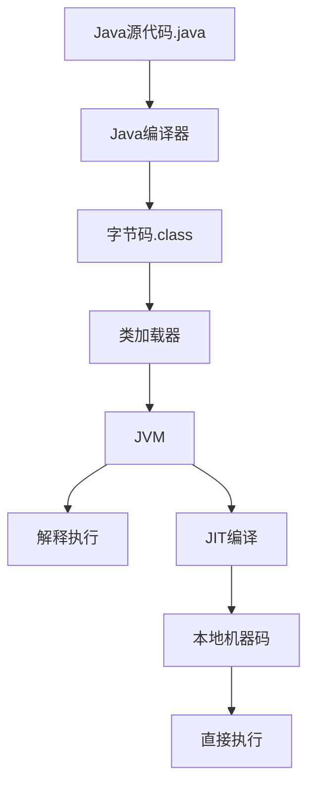
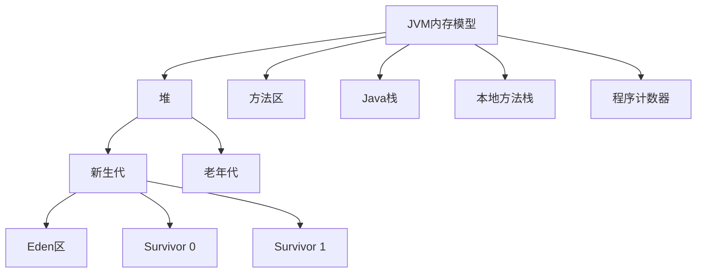
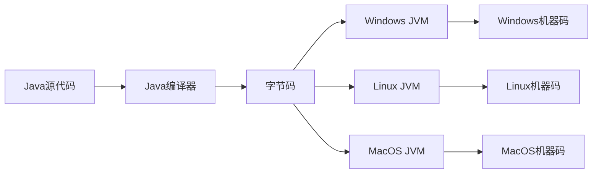
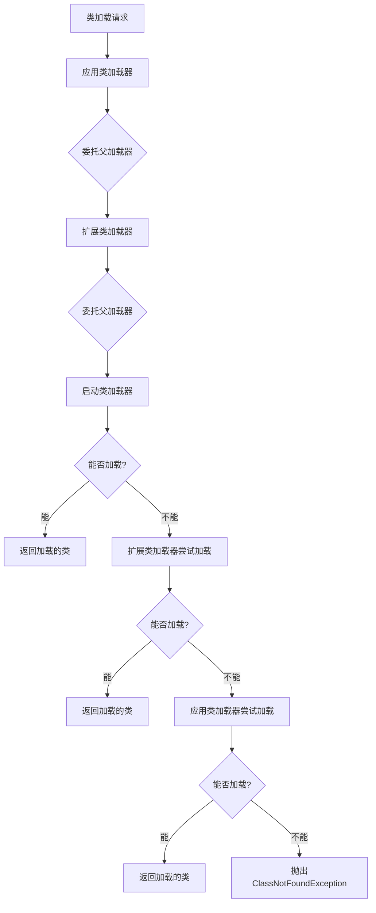
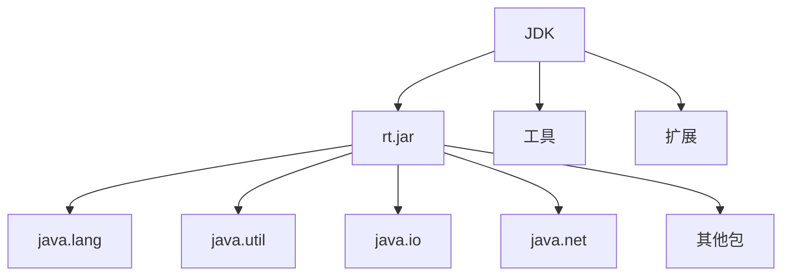

我将为您编写Java发展历史与特性原理篇的详细内容。

---
title: Java发展历史与特性原理篇
icon: history
order: 1
---

# Java发展历史与特性原理篇

## Java语言的核心原理

### JVM虚拟机原理与字节码执行机制

Java虚拟机(JVM)是Java平台的核心，它是一个抽象的计算机，提供了一个与硬件和操作系统无关的执行环境。

#### JVM架构组成

JVM主要由以下几个部分组成：

1. **类加载器子系统**：负责加载、链接和初始化类文件
2. **运行时数据区**：包括方法区、堆、Java栈、本地方法栈和程序计数器
3. **执行引擎**：包括即时编译器(JIT)和垃圾回收器(GC)
4. **本地方法接口**：与本地方法库交互的接口



#### 字节码执行过程

1. **编译**：Java源代码(.java)通过javac编译器编译成字节码(.class)
2. **加载**：类加载器将字节码加载到JVM中
3. **验证**：确保字节码符合JVM规范，不会危害JVM安全
4. **执行**：JVM通过以下两种方式执行字节码：
   - **解释执行**：逐条将字节码指令翻译成机器码执行
   - **即时编译(JIT)**：将热点代码编译成本地机器码直接执行

```java
// 一个简单的Java代码示例
public class HelloWorld {
    public static void main(String[] args) {
        System.out.println("Hello, World!");
    }
}

// 编译后生成的字节码(简化表示)
// 使用javap -c HelloWorld.class查看
/*
public static void main(java.lang.String[]);
  Code:
     0: getstatic     #2  // Field java/lang/System.out:Ljava/io/PrintStream;
     3: ldc           #3  // String Hello, World!
     5: invokevirtual #4  // Method java/io/PrintStream.println:(Ljava/lang/String;)V
     8: return
*/
```

### Java内存模型与管理机制

Java内存模型(JMM)定义了Java虚拟机如何与计算机内存进行交互，以及多线程程序中内存的可见性、有序性和原子性。

#### JVM内存区域划分

1. **堆(Heap)**：存储对象实例，是垃圾收集器管理的主要区域
2. **方法区(Method Area)**：存储类结构、常量、静态变量等
3. **Java栈(Java Stack)**：存储局部变量、操作数栈、方法出口等
4. **本地方法栈(Native Method Stack)**：为本地方法服务
5. **程序计数器(Program Counter Register)**：记录当前线程执行的位置



#### 垃圾回收机制

JVM自动管理内存，通过垃圾回收(GC)机制回收不再使用的对象。

1. **垃圾识别算法**：
   - **引用计数法**：计算对象的引用数，为0时回收
   - **可达性分析**：从GC Roots开始搜索，不可达的对象被回收

2. **垃圾回收算法**：
   - **标记-清除(Mark-Sweep)**：标记不再使用的对象，然后清除
   - **复制(Copying)**：将存活对象复制到另一块内存区域
   - **标记-整理(Mark-Compact)**：标记后将存活对象移到一端，清除边界外对象
   - **分代收集(Generational Collection)**：根据对象生命周期长短采用不同策略

3. **垃圾收集器**：
   - **Serial**：单线程收集器
   - **Parallel**：多线程并行收集器
   - **CMS(Concurrent Mark Sweep)**：并发标记清除收集器
   - **G1(Garbage First)**：面向服务端的分区收集器
   - **ZGC**：低延迟垃圾收集器

```java
// 垃圾回收示例
public class GCExample {
    public static void main(String[] args) {
        // 创建大量对象触发GC
        for (int i = 0; i < 100000; i++) {
            new Object();
        }
        // 显式请求垃圾回收(仅建议，不保证立即执行)
        System.gc();
    }
}
```

### 跨平台实现原理与JIT编译技术

Java的"一次编写，到处运行"(Write Once, Run Anywhere)是通过JVM实现的。

#### 跨平台实现原理

1. **字节码中间层**：Java源代码编译成平台无关的字节码
2. **虚拟机适配层**：不同平台上的JVM负责将字节码转换为特定平台的机器码
3. **本地方法接口(JNI)**：允许Java代码调用本地平台特定的代码



#### JIT编译技术

即时编译(Just-In-Time Compilation)是JVM提高性能的关键技术。

1. **热点代码识别**：JVM监控代码执行频率，识别热点代码
2. **编译优化**：将热点字节码编译为高效的本地机器码
3. **优化技术**：
   - **内联(Inlining)**：将方法调用替换为方法体
   - **逃逸分析(Escape Analysis)**：分析对象引用范围
   - **循环优化(Loop Optimization)**：优化循环结构
   - **死代码消除(Dead Code Elimination)**：移除永不执行的代码

```java
// JIT编译优化示例
public class JITExample {
    public static void main(String[] args) {
        long start = System.currentTimeMillis();
        
        // 循环执行会触发JIT编译
        for (int i = 0; i < 10000000; i++) {
            calculate(i);
        }
        
        long end = System.currentTimeMillis();
        System.out.println("执行时间: " + (end - start) + "ms");
    }
    
    private static int calculate(int n) {
        return n * n;
    }
}
```

### 类加载机制与双亲委派模型

Java的类加载机制是JVM动态加载类的核心机制。

#### 类加载过程

类加载过程分为五个阶段：

1. **加载(Loading)**：查找并加载类的二进制数据
2. **验证(Verification)**：确保加载的类符合JVM规范
3. **准备(Preparation)**：为类变量分配内存并设置初始值
4. **解析(Resolution)**：将符号引用转换为直接引用
5. **初始化(Initialization)**：执行类构造器`<clinit>()`方法

```java
// 类加载示例
public class ClassLoadingExample {
    // 静态变量和静态代码块在类初始化阶段执行
    static {
        System.out.println("ClassLoadingExample类被初始化");
    }
    
    public static void main(String[] args) throws Exception {
        // 显式加载类
        Class<?> clazz = Class.forName("java.util.ArrayList");
        System.out.println("成功加载: " + clazz.getName());
    }
}
```

#### 双亲委派模型

双亲委派模型是Java类加载器的层次结构，包括：

1. **启动类加载器(Bootstrap ClassLoader)**：加载Java核心类库
2. **扩展类加载器(Extension ClassLoader)**：加载扩展类库
3. **应用类加载器(Application ClassLoader)**：加载应用程序类路径下的类
4. **自定义类加载器**：用户自定义的类加载器

工作原理：
- 当一个类加载器收到类加载请求时，会先委托父加载器加载
- 只有当父加载器无法加载时，子加载器才会尝试加载
- 这种机制保证了Java核心类的安全性



### 反射机制与动态特性

反射是Java语言的一个重要特性，允许程序在运行时检查和操作类、接口、字段和方法。

#### 反射的核心功能

1. **获取类信息**：获取类的属性、方法、构造器等信息
2. **动态创建对象**：在运行时创建类的实例
3. **动态调用方法**：在运行时调用对象的方法
4. **访问私有成员**：访问类的私有字段和方法

```java
// 反射示例
import java.lang.reflect.*;

public class ReflectionExample {
    public static void main(String[] args) throws Exception {
        // 获取类信息
        Class<?> clazz = Class.forName("java.util.ArrayList");
        
        // 创建实例
        Object list = clazz.getDeclaredConstructor().newInstance();
        
        // 获取方法并调用
        Method addMethod = clazz.getMethod("add", Object.class);
        addMethod.invoke(list, "Hello, Reflection!");
        
        Method sizeMethod = clazz.getMethod("size");
        int size = (int) sizeMethod.invoke(list);
        
        System.out.println("列表大小: " + size);
    }
}
```

#### 动态代理

动态代理是反射的一个重要应用，允许在运行时创建实现特定接口的代理类。

```java
// 动态代理示例
import java.lang.reflect.Proxy;
import java.lang.reflect.InvocationHandler;
import java.lang.reflect.Method;

interface UserService {
    void addUser(String name);
    String getUser(int id);
}

class UserServiceImpl implements UserService {
    @Override
    public void addUser(String name) {
        System.out.println("添加用户: " + name);
    }
    
    @Override
    public String getUser(int id) {
        return "用户" + id;
    }
}

class LoggingHandler implements InvocationHandler {
    private Object target;
    
    public LoggingHandler(Object target) {
        this.target = target;
    }
    
    @Override
    public Object invoke(Object proxy, Method method, Object[] args) throws Throwable {
        System.out.println("开始执行: " + method.getName());
        Object result = method.invoke(target, args);
        System.out.println("执行结束: " + method.getName());
        return result;
    }
}

public class DynamicProxyExample {
    public static void main(String[] args) {
        UserService userService = new UserServiceImpl();
        
        UserService proxy = (UserService) Proxy.newProxyInstance(
            userService.getClass().getClassLoader(),
            userService.getClass().getInterfaces(),
            new LoggingHandler(userService)
        );
        
        proxy.addUser("张三");
        String user = proxy.getUser(1);
        System.out.println("获取到: " + user);
    }
}
```

#### 注解处理

Java注解结合反射提供了强大的元编程能力。

```java
// 注解处理示例
import java.lang.annotation.*;
import java.lang.reflect.*;

@Retention(RetentionPolicy.RUNTIME)
@Target(ElementType.METHOD)
@interface Authorized {
    String role() default "USER";
}

class SecurityService {
    public boolean hasRole(String role) {
        // 模拟权限检查
        return "ADMIN".equals(role);
    }
}

class UserController {
    @Authorized(role = "ADMIN")
    public void deleteUser(int id) {
        System.out.println("删除用户: " + id);
    }
    
    @Authorized
    public void viewUser(int id) {
        System.out.println("查看用户: " + id);
    }
}

public class AnnotationProcessingExample {
    public static void main(String[] args) throws Exception {
        UserController controller = new UserController();
        SecurityService securityService = new SecurityService();
        
        Method deleteMethod = UserController.class.getMethod("deleteUser", int.class);
        Method viewMethod = UserController.class.getMethod("viewUser", int.class);
        
        invokeWithAuthorization(controller, deleteMethod, securityService, new Object[]{1});
        invokeWithAuthorization(controller, viewMethod, securityService, new Object[]{1});
    }
    
    private static void invokeWithAuthorization(Object obj, Method method, 
                                               SecurityService securityService, 
                                               Object[] args) throws Exception {
        if (method.isAnnotationPresent(Authorized.class)) {
            Authorized auth = method.getAnnotation(Authorized.class);
            String role = auth.role();
            
            if (securityService.hasRole(role)) {
                method.invoke(obj, args);
            } else {
                System.out.println("权限不足，需要角色: " + role);
            }
        } else {
            method.invoke(obj, args);
        }
    }
}
```

## Java语言设计哲学

### 简单性与可靠性设计原则

Java语言设计的核心目标是简单易用且可靠，这体现在多个方面。

#### 语法简洁性

Java语法借鉴了C/C++，但移除了许多复杂特性：

1. **无指针算术**：避免内存直接操作带来的风险
2. **自动内存管理**：垃圾回收机制代替手动内存管理
3. **单继承**：避免多继承带来的复杂性和"菱形继承"问题
4. **包管理**：提供清晰的命名空间管理

```java
// Java简洁语法示例
public class SimpleExample {
    // 自动初始化为null
    private String name;
    // 自动初始化为0
    private int age;
    
    public void setInfo(String name, int age) {
        this.name = name;
        this.age = age;
    }
    
    public void printInfo() {
        // 自动进行空检查，不会导致系统崩溃
        System.out.println("姓名: " + name + ", 年龄: " + age);
    }
}
```

#### 强类型系统

Java的强类型系统提供了编译时类型检查，减少运行时错误：

1. **静态类型检查**：编译时捕获类型错误
2. **类型安全转换**：强制类型转换需显式声明
3. **泛型支持**：提供编译时类型安全的集合操作

```java
// 强类型系统示例
import java.util.ArrayList;
import java.util.List;

public class TypeSafetyExample {
    public static void main(String[] args) {
        // 使用泛型确保类型安全
        List<String> names = new ArrayList<>();
        names.add("张三");
        names.add("李四");
        
        // 编译错误: 不兼容的类型
        // names.add(42);
        
        // 无需类型转换，编译器保证类型安全
        for (String name : names) {
            System.out.println(name.toUpperCase());
        }
    }
}
```

#### 异常处理机制

Java的异常处理机制提高了程序的可靠性：

1. **检查型异常**：强制处理可预见的错误情况
2. **运行时异常**：处理程序逻辑错误
3. **try-catch-finally**：确保资源正确释放
4. **try-with-resources**：自动关闭资源

```java
// 异常处理示例
import java.io.*;

public class ExceptionHandlingExample {
    public static void main(String[] args) {
        // 传统try-catch-finally
        BufferedReader reader = null;
        try {
            reader = new BufferedReader(new FileReader("data.txt"));
            String line = reader.readLine();
            System.out.println(line);
        } catch (FileNotFoundException e) {
            System.err.println("文件不存在: " + e.getMessage());
        } catch (IOException e) {
            System.err.println("读取错误: " + e.getMessage());
        } finally {
            // 确保资源释放
            if (reader != null) {
                try {
                    reader.close();
                } catch (IOException e) {
                    System.err.println("关闭文件错误");
                }
            }
        }
        
        // Java 7引入的try-with-resources
        try (BufferedReader reader2 = new BufferedReader(new FileReader("data.txt"))) {
            String line = reader2.readLine();
            System.out.println(line);
        } catch (IOException e) {
            System.err.println("IO错误: " + e.getMessage());
        }
        // 自动关闭资源，无需finally块
    }
}
```

### 面向对象设计思想的贯彻

Java是一种纯面向对象的编程语言，其设计深入贯彻了面向对象的核心原则。

#### 封装、继承与多态

Java通过类和接口实现面向对象的三大特性：

1. **封装**：通过访问修饰符控制对类成员的访问
2. **继承**：通过extends关键字实现类的继承
3. **多态**：通过方法重写和接口实现多态行为

```java
// 面向对象三大特性示例
// 封装
class Account {
    private double balance; // 私有字段，实现封装
    
    public void deposit(double amount) {
        if (amount > 0) {
            balance += amount;
        }
    }
    
    public boolean withdraw(double amount) {
        if (amount > 0 && balance >= amount) {
            balance -= amount;
            return true;
        }
        return false;
    }
    
    public double getBalance() {
        return balance;
    }
}

// 继承
class SavingsAccount extends Account {
    private double interestRate;
    
    public SavingsAccount(double interestRate) {
        this.interestRate = interestRate;
    }
    
    public void addInterest() {
        double interest = getBalance() * interestRate;
        deposit(interest);
    }
}

// 多态
interface Payable {
    void pay(double amount);
}

class Employee implements Payable {
    private String name;
    
    public Employee(String name) {
        this.name = name;
    }
    
    @Override
    public void pay(double amount) {
        System.out.println("向员工" + name + "支付工资: " + amount);
    }
}

class Supplier implements Payable {
    private String company;
    
    public Supplier(String company) {
        this.company = company;
    }
    
    @Override
    public void pay(double amount) {
        System.out.println("向供应商" + company + "支付款项: " + amount);
    }
}

public class OOPExample {
    public static void main(String[] args) {
        // 封装示例
        Account acc = new Account();
        acc.deposit(1000);
        System.out.println("余额: " + acc.getBalance());
        
        // 继承示例
        SavingsAccount savingsAcc = new SavingsAccount(0.05);
        savingsAcc.deposit(1000);
        savingsAcc.addInterest();
        System.out.println("加息后余额: " + savingsAcc.getBalance());
        
        // 多态示例
        Payable employee = new Employee("张三");
        Payable supplier = new Supplier("ABC公司");
        
        // 同一接口，不同实现
        payEntity(employee, 5000);
        payEntity(supplier, 10000);
    }
    
    // 多态方法
    public static void payEntity(Payable entity, double amount) {
        entity.pay(amount);
    }
}
```

#### 接口与抽象类

Java通过接口和抽象类提供了灵活的代码组织方式：

1. **接口(Interface)**：定义行为契约，支持多实现
2. **抽象类(Abstract Class)**：提供部分实现，支持代码复用
3. **默认方法**：Java 8引入的接口默认实现

```java
// 接口与抽象类示例
// 接口定义
interface Vehicle {
    void start();
    void stop();
    
    // Java 8默认方法
    default void honk() {
        System.out.println("喇叭响起");
    }
}

// 抽象类
abstract class AbstractVehicle implements Vehicle {
    protected String brand;
    
    public AbstractVehicle(String brand) {
        this.brand = brand;
    }
    
    // 实现接口方法
    @Override
    public void stop() {
        System.out.println(brand + "停止了");
    }
    
    // 抽象方法，子类必须实现
    public abstract void refuel();
}

// 具体实现类
class Car extends AbstractVehicle {
    public Car(String brand) {
        super(brand);
    }
    
    @Override
    public void start() {
        System.out.println(brand + "汽车启动");
    }
    
    @Override
    public void refuel() {
        System.out.println(brand + "汽车加油");
    }
}

class ElectricCar extends AbstractVehicle {
    public ElectricCar(String brand) {
        super(brand);
    }
    
    @Override
    public void start() {
        System.out.println(brand + "电动车启动");
    }
    
    @Override
    public void refuel() {
        System.out.println(brand + "电动车充电");
    }
    
    // 覆盖默认方法
    @Override
    public void honk() {
        System.out.println(brand + "电动车发出温和的提示音");
    }
}

public class InterfaceAbstractExample {
    public static void main(String[] args) {
        Vehicle car = new Car("奔驰");
        Vehicle electricCar = new ElectricCar("特斯拉");
        
        car.start();
        car.honk();
        car.stop();
        
        electricCar.start();
        electricCar.honk();
        electricCar.stop();
        
        // 使用抽象类特有方法需要向下转型
        ((Car)car).refuel();
        ((ElectricCar)electricCar).refuel();
    }
}
```

#### 设计模式应用

Java语言设计鼓励使用设计模式，JDK本身也大量应用了设计模式：

1. **单例模式**：Runtime, Calendar等
2. **工厂模式**：Collections, Calendar.getInstance()等
3. **观察者模式**：EventListener框架
4. **装饰器模式**：I/O流类(InputStream, BufferedInputStream等)

```java
// 设计模式示例 - 单例模式
class Singleton {
    // 私有静态实例
    private static volatile Singleton instance;
    
    // 私有构造函数
    private Singleton() {}
    
    // 双重检查锁定
    public static Singleton getInstance() {
        if (instance == null) {
            synchronized (Singleton.class) {
                if (instance == null) {
                    instance = new Singleton();
                }
            }
        }
        return instance;
    }
    
    public void doSomething() {
        System.out.println("单例执行操作");
    }
}

// 设计模式示例 - 工厂模式
interface Product {
    void use();
}

class ConcreteProductA implements Product {
    @Override
    public void use() {
        System.out.println("使用产品A");
    }
}

class ConcreteProductB implements Product {
    @Override
    public void use() {
        System.out.println("使用产品B");
    }
}

class ProductFactory {
    public static Product createProduct(String type) {
        if ("A".equals(type)) {
            return new ConcreteProductA();
        } else if ("B".equals(type)) {
            return new ConcreteProductB();
        }
        throw new IllegalArgumentException("未知产品类型");
    }
}

public class DesignPatternExample {
    public static void main(String[] args) {
        // 单例模式
        Singleton singleton = Singleton.getInstance();
        singleton.doSomething();
        
        // 工厂模式
        Product productA = ProductFactory.createProduct("A");
        Product productB = ProductFactory.createProduct("B");
        
        productA.use();
        productB.use();
    }
}
```

### 安全性考量与沙箱机制

Java从设计之初就将安全性作为核心目标，通过多层防御机制保障应用安全。

#### 安全管理器与权限模型

Java提供了安全管理器(SecurityManager)和访问控制机制：

1. **安全管理器**：控制对敏感操作的访问
2. **访问控制列表(ACL)**：定义代码可执行的操作
3. **代码签名**：验证代码来源的真实性

```java
// 安全管理器示例
public class SecurityManagerExample {
    public static void main(String[] args) {
        // 设置安全管理器
        System.setSecurityManager(new SecurityManager());
        
        try {
            // 尝试读取系统属性
            String userHome = System.getProperty("user.home");
            System.out.println("用户主目录: " + userHome);
            
            // 尝试访问文件系统
            try {
                new java.io.File("/etc/passwd").delete();
            } catch (SecurityException e) {
                System.out.println("无法删除文件: " + e.getMessage());
            }
            
            // 尝试执行系统命令
            try {
                Runtime.getRuntime().exec("ls");
            } catch (SecurityException e) {
                System.out.println("无法执行系统命令: " + e.getMessage());
            }
        } catch (Exception e) {
            e.printStackTrace();
        }
    }
}
```

#### 类加载器安全

Java的类加载器提供了代码隔离和保护：

1. **命名空间隔离**：不同类加载器加载的类相互隔离
2. **双亲委派模型**：防止核心类库被恶意替换
3. **包访问限制**：限制对包内部类的访问

```java
// 自定义类加载器示例
import java.io.*;

public class CustomClassLoaderExample extends ClassLoader {
    private String classPath;
    
    public CustomClassLoaderExample(String classPath) {
        this.classPath = classPath;
    }
    
    @Override
    protected Class<?> findClass(String name) throws ClassNotFoundException {
        try {
            byte[] classData = loadClassData(name);
            return defineClass(name, classData, 0, classData.length);
        } catch (IOException e) {
            throw new ClassNotFoundException
我将继续编写Java发展历史与特性原理篇的内容。

```java
// 自定义类加载器示例
import java.io.*;

public class CustomClassLoaderExample extends ClassLoader {
    private String classPath;
    
    public CustomClassLoaderExample(String classPath) {
        this.classPath = classPath;
    }
    
    @Override
    protected Class<?> findClass(String name) throws ClassNotFoundException {
        try {
            byte[] classData = loadClassData(name);
            return defineClass(name, classData, 0, classData.length);
        } catch (IOException e) {
            throw new ClassNotFoundException("无法加载类: " + name, e);
        }
    }
    
    private byte[] loadClassData(String className) throws IOException {
        String fileName = classPath + File.separatorChar + 
                          className.replace('.', File.separatorChar) + ".class";
        try (FileInputStream fis = new FileInputStream(fileName);
             ByteArrayOutputStream baos = new ByteArrayOutputStream()) {
            
            int bufferSize = 1024;
            byte[] buffer = new byte[bufferSize];
            int bytesRead;
            while ((bytesRead = fis.read(buffer)) != -1) {
                baos.write(buffer, 0, bytesRead);
            }
            return baos.toByteArray();
        }
    }
    
    public static void main(String[] args) {
        try {
            // 创建自定义类加载器
            CustomClassLoaderExample loader = new CustomClassLoaderExample("./classes");
            
            // 加载类
            Class<?> clazz = loader.loadClass("com.example.Test");
            System.out.println("成功加载类: " + clazz.getName());
            
            // 验证类加载器
            System.out.println("类加载器: " + clazz.getClassLoader());
        } catch (Exception e) {
            e.printStackTrace();
        }
    }
}
```

#### 内存安全与类型安全

Java通过多种机制保障内存和类型安全：

1. **自动内存管理**：垃圾回收避免内存泄漏和悬挂指针
2. **数组边界检查**：防止缓冲区溢出攻击
3. **类型检查**：编译时和运行时类型检查防止非法转换
4. **字节码验证**：确保字节码不会破坏JVM安全

```java
// 内存和类型安全示例
public class SafetyExample {
    public static void main(String[] args) {
        // 数组边界检查
        int[] array = new int[5];
        try {
            // 尝试访问越界元素
            array[10] = 100;
        } catch (ArrayIndexOutOfBoundsException e) {
            System.out.println("数组越界: " + e.getMessage());
        }
        
        // 类型安全
        Object obj = "Hello";
        try {
            // 尝试非法类型转换
            Integer i = (Integer) obj;
        } catch (ClassCastException e) {
            System.out.println("类型转换错误: " + e.getMessage());
        }
        
        // 空指针检查
        String str = null;
        try {
            int length = str.length();
        } catch (NullPointerException e) {
            System.out.println("空指针异常: " + e.getMessage());
        }
    }
}
```

### 高性能与可伸缩性设计

Java在设计时考虑了高性能和可伸缩性，通过多种机制支持大规模应用开发。

#### JIT编译与性能优化

Java通过JIT编译器实现高性能：

1. **热点代码识别**：识别频繁执行的代码
2. **即时编译**：将热点字节码编译为本地机器码
3. **内联优化**：减少方法调用开销
4. **逃逸分析**：优化对象分配和同步

```java
// JIT优化示例
public class JITPerformanceExample {
    private static final int ITERATIONS = 100_000_000;
    
    public static void main(String[] args) {
        // 预热JVM，触发JIT编译
        for (int i = 0; i < 10000; i++) {
            calculateSum(100);
        }
        
        // 测量性能
        long start = System.nanoTime();
        long sum = calculateSum(ITERATIONS);
        long end = System.nanoTime();
        
        System.out.println("计算结果: " + sum);
        System.out.println("执行时间: " + (end - start) / 1_000_000 + " 毫秒");
    }
    
    // 会被JIT优化的方法
    private static long calculateSum(int n) {
        long sum = 0;
        for (int i = 1; i <= n; i++) {
            sum += i;
        }
        return sum;
    }
}
```

#### 并发与多线程支持

Java提供了强大的并发编程支持：

1. **线程API**：内置线程创建和管理
2. **同步机制**：synchronized关键字和锁API
3. **并发集合**：线程安全的数据结构
4. **线程池**：高效的线程管理
5. **原子类**：无锁并发操作

```java
// 并发编程示例
import java.util.concurrent.*;
import java.util.concurrent.atomic.*;

public class ConcurrencyExample {
    // 原子变量
    private static AtomicInteger counter = new AtomicInteger(0);
    // 线程安全集合
    private static ConcurrentHashMap<String, Integer> map = new ConcurrentHashMap<>();
    
    public static void main(String[] args) throws Exception {
        // 创建线程池
        ExecutorService executor = Executors.newFixedThreadPool(4);
        
        // 提交多个任务
        for (int i = 0; i < 10; i++) {
            final int taskId = i;
            executor.submit(() -> {
                // 原子操作
                int value = counter.incrementAndGet();
                // 并发集合操作
                map.put("Task-" + taskId, value);
                
                System.out.println("任务 " + taskId + " 完成，计数器值: " + value);
                return value;
            });
        }
        
        // 关闭线程池
        executor.shutdown();
        executor.awaitTermination(1, TimeUnit.MINUTES);
        
        System.out.println("最终计数器值: " + counter.get());
        System.out.println("Map内容: " + map);
    }
}
```

#### 可伸缩性架构

Java平台支持构建可伸缩的应用架构：

1. **模块化设计**：Java 9引入的模块系统
2. **分布式计算**：RMI和网络API
3. **微服务支持**：轻量级容器和框架
4. **响应式编程**：异步非阻塞处理

```java
// 模块化示例 (Java 9+)
// module-info.java
/*
module com.example.app {
    requires java.base;
    requires java.logging;
    
    exports com.example.app.api;
    
    provides com.example.app.api.Service with com.example.app.impl.ServiceImpl;
}
*/

// 响应式编程示例 (Java 9+)
import java.util.concurrent.Flow.*;
import java.util.concurrent.*;

public class ReactiveExample {
    public static void main(String[] args) throws InterruptedException {
        // 创建发布者
        SubmissionPublisher<String> publisher = new SubmissionPublisher<>();
        
        // 创建处理器
        MyProcessor processor = new MyProcessor();
        
        // 创建订阅者
        MySubscriber subscriber = new MySubscriber();
        
        // 连接发布者、处理器和订阅者
        publisher.subscribe(processor);
        processor.subscribe(subscriber);
        
        // 发布消息
        System.out.println("发布消息...");
        publisher.submit("消息1");
        publisher.submit("消息2");
        publisher.submit("消息3");
        publisher.close();
        
        // 等待处理完成
        Thread.sleep(1000);
    }
    
    // 处理器
    static class MyProcessor extends SubmissionPublisher<String> implements Processor<String, String> {
        private Subscription subscription;
        
        @Override
        public void onSubscribe(Subscription subscription) {
            this.subscription = subscription;
            subscription.request(Long.MAX_VALUE);
        }
        
        @Override
        public void onNext(String item) {
            // 处理并转换数据
            String result = "处理后: " + item.toUpperCase();
            submit(result);
        }
        
        @Override
        public void onError(Throwable throwable) {
            throwable.printStackTrace();
        }
        
        @Override
        public void onComplete() {
            System.out.println("处理器完成");
            close();
        }
    }
    
    // 订阅者
    static class MySubscriber implements Subscriber<String> {
        private Subscription subscription;
        
        @Override
        public void onSubscribe(Subscription subscription) {
            this.subscription = subscription;
            subscription.request(Long.MAX_VALUE);
        }
        
        @Override
        public void onNext(String item) {
            System.out.println("收到: " + item);
        }
        
        @Override
        public void onError(Throwable throwable) {
            throwable.printStackTrace();
        }
        
        @Override
        public void onComplete() {
            System.out.println("订阅者完成");
        }
    }
}
```

## Java技术架构演进

### 从单体JDK到模块化系统

Java平台经历了从单一整体到模块化系统的演进过程。

#### 早期JDK架构

Java早期版本采用单体架构：

1. **整体式JDK**：所有API打包在一起
2. **rt.jar**：包含所有核心类库
3. **扩展机制**：通过扩展目录加载额外库



#### Java 9模块系统

Java 9引入了Jigsaw项目，实现模块化：

1. **模块定义**：通过module-info.java定义模块
2. **强封装**：只暴露明确导出的包
3. **显式依赖**：明确声明模块间依赖
4. **可伸缩性**：支持自定义JRE

```java
// 模块系统示例
// module-info.java
/*
module com.example.core {
    // 依赖
    requires java.base;
    requires java.logging;
    
    // 导出包
    exports com.example.core.api;
    
    // 开放包用于反射
    opens com.example.core.model to com.example.persistence;
    
    // 服务提供
    provides com.example.core.api.Service with com.example.core.impl.ServiceImpl;
    
    // 服务使用
    uses com.example.core.api.Plugin;
}
*/

// 模块化应用示例
package com.example.core.api;

public interface Service {
    void execute();
}

package com.example.core.impl;

import com.example.core.api.Service;

public class ServiceImpl implements Service {
    @Override
    public void execute() {
        System.out.println("服务执行中...");
    }
}

// 主应用
package com.example.app;

import com.example.core.api.Service;
import java.util.ServiceLoader;

public class Application {
    public static void main(String[] args) {
        // 使用服务加载器加载服务实现
        ServiceLoader<Service> services = ServiceLoader.load(Service.class);
        
        for (Service service : services) {
            service.execute();
        }
    }
}
```

#### 自定义运行时

Java 9+支持创建自定义运行时映像：

1. **jlink工具**：创建自定义运行时
2. **模块选择**：只包含需要的模块
3. **减小体积**：显著减少部署大小

```bash
# 创建自定义运行时映像
jlink --module-path $JAVA_HOME/jmods:mods --add-modules com.example.app --output customjre

# 运行自定义运行时中的应用
customjre/bin/java -m com.example.app/com.example.app.Main
```

### 从传统Java EE到微服务架构

Java企业应用架构经历了从单体到分布式微服务的演进。

#### 传统Java EE架构

早期企业应用采用Java EE平台：

1. **多层架构**：表现层、业务层、持久层
2. **容器管理**：应用服务器管理组件生命周期
3. **声明式服务**：事务、安全、消息等

```java
// 传统Java EE示例
// EJB组件
@Stateless
public class OrderServiceEJB implements OrderService {
    @PersistenceContext
    private EntityManager em;
    
    @Resource
    private UserTransaction userTransaction;
    
    @Override
    @TransactionAttribute(TransactionAttributeType.REQUIRED)
    public void createOrder(Order order) {
        em.persist(order);
    }
    
    @Override
    public List<Order> findOrdersByCustomer(long customerId) {
        return em.createQuery("SELECT o FROM Order o WHERE o.customerId = :id", Order.class)
                 .setParameter("id", customerId)
                 .getResultList();
    }
}

// Servlet
@WebServlet("/orders")
public class OrderServlet extends HttpServlet {
    @EJB
    private OrderService orderService;
    
    @Override
    protected void doGet(HttpServletRequest req, HttpServletResponse resp) 
            throws ServletException, IOException {
        long customerId = Long.parseLong(req.getParameter("customerId"));
        List<Order> orders = orderService.findOrdersByCustomer(customerId);
        
        req.setAttribute("orders", orders);
        req.getRequestDispatcher("/WEB-INF/orders.jsp").forward(req, resp);
    }
}
```

#### 微服务架构

现代Java应用采用微服务架构：

1. **服务拆分**：按业务能力拆分为小型服务
2. **独立部署**：每个服务独立开发和部署
3. **轻量级通信**：REST、消息队列等
4. **容器化**：Docker和Kubernetes部署

```java
// 微服务示例 (Spring Boot)
// 订单服务
@SpringBootApplication
public class OrderServiceApplication {
    public static void main(String[] args) {
        SpringApplication.run(OrderServiceApplication.class, args);
    }
}

@RestController
@RequestMapping("/orders")
public class OrderController {
    @Autowired
    private OrderRepository orderRepository;
    
    @GetMapping("/{id}")
    public ResponseEntity<Order> getOrder(@PathVariable Long id) {
        return orderRepository.findById(id)
                .map(ResponseEntity::ok)
                .orElse(ResponseEntity.notFound().build());
    }
    
    @PostMapping
    public ResponseEntity<Order> createOrder(@RequestBody Order order) {
        Order savedOrder = orderRepository.save(order);
        return ResponseEntity.created(URI.create("/orders/" + savedOrder.getId()))
                .body(savedOrder);
    }
}

// 客户服务
@SpringBootApplication
public class CustomerServiceApplication {
    public static void main(String[] args) {
        SpringApplication.run(CustomerServiceApplication.class, args);
    }
}

@RestController
@RequestMapping("/customers")
public class CustomerController {
    @Autowired
    private CustomerRepository customerRepository;
    
    @Autowired
    private RestTemplate restTemplate;
    
    @GetMapping("/{id}/orders")
    public List<Order> getCustomerOrders(@PathVariable Long id) {
        // 调用订单服务
        return restTemplate.getForObject(
            "http://order-service/orders?customerId={id}",
            List.class,
            id
        );
    }
}
```

#### 云原生Java

现代Java应用正向云原生方向发展：

1. **容器化**：Docker容器打包和部署
2. **服务网格**：Istio等服务治理
3. **无服务器**：函数即服务(FaaS)
4. **DevOps集成**：CI/CD自动化

```java
// 云原生Java示例 (Quarkus)
// 微服务
@Path("/hello")
public class GreetingResource {
    @Inject
    GreetingService service;
    
    @GET
    @Produces(MediaType.TEXT_PLAIN)
    public String hello() {
        return service.greeting("World");
    }
}

@ApplicationScoped
public class GreetingService {
    public String greeting(String name) {
        return "Hello " + name;
    }
}

// Dockerfile
/*
FROM registry.access.redhat.com/ubi8/openjdk-11:latest
COPY target/quarkus-app/lib/ /deployments/lib/
COPY target/quarkus-app/*.jar /deployments/
COPY target/quarkus-app/app/ /deployments/app/
COPY target/quarkus-app/quarkus/ /deployments/quarkus/
EXPOSE 8080
CMD ["java", "-jar", "/deployments/quarkus-run.jar"]
*/

// Kubernetes部署
/*
apiVersion: apps/v1
kind: Deployment
metadata:
  name: greeting-service
spec:
  replicas: 3
  selector:
    matchLabels:
      app: greeting-service
  template:
    metadata:
      labels:
        app: greeting-service
    spec:
      containers:
      - name: greeting-service
        image: greeting-service:latest
        ports:
        - containerPort: 8080
---
apiVersion: v1
kind: Service
metadata:
  name: greeting-service
spec:
  selector:
    app: greeting-service
  ports:
  - port: 80
    targetPort: 8080
  type: ClusterIP
*/
```

### 从同步编程到响应式编程

Java编程模型经历了从同步阻塞到异步非阻塞的演进。

#### 传统同步编程

早期Java应用采用同步阻塞模型：

1. **线程阻塞**：I/O操作阻塞线程
2. **线程池**：通过线程池管理并发
3. **同步API**：阻塞式方法调用

```java
// 传统同步编程示例
import java.io.*;
import java.net.*;

public class SynchronousExample {
    public static void main(String[] args) throws Exception {
        // 创建服务器套接字
        ServerSocket serverSocket = new ServerSocket(8080);
        System.out.println("服务器启动，监听端口8080");
        
        // 线程池
        ExecutorService executor = Executors.newFixedThreadPool(10);
        
        while (true) {
            // 阻塞等待连接
            Socket clientSocket = serverSocket.accept();
            System.out.println("接收到新连接");
            
            // 为每个连接分配一个线程
            executor.submit(() -> handleConnection(clientSocket));
        }
    }
    
    private static void handleConnection(Socket socket) {
        try (
            BufferedReader in = new BufferedReader(
                new InputStreamReader(socket.getInputStream()));
            PrintWriter out = new PrintWriter(socket.getOutputStream(), true)
        ) {
            String line;
            while ((line = in.readLine()) != null) {
                // 处理请求
                System.out.println("收到: " + line);
                out.println("回复: " + line);
            }
        } catch (IOException e) {
            e.printStackTrace();
        }
    }
}
```

#### NIO和异步编程

Java 1.4引入NIO，支持非阻塞I/O：

1. **选择器(Selector)**：多路复用I/O
2. **通道(Channel)**：非阻塞I/O操作
3. **缓冲区(Buffer)**：高效数据处理

```java
// NIO非阻塞编程示例
import java.io.*;
import java.net.*;
import java.nio.*;
import java.nio.channels.*;
import java.util.*;

public class NIOExample {
    public static void main(String[] args) throws Exception {
        // 创建选择器
        Selector selector = Selector.open();
        
        // 创建服务器套接字通道
        ServerSocketChannel serverChannel = ServerSocketChannel.open();
        serverChannel.bind(new InetSocketAddress(8080));
        serverChannel.configureBlocking(false);
        
        // 注册接受连接事件
        serverChannel.register(selector, SelectionKey.OP_ACCEPT);
        System.out.println("服务器启动，监听端口8080");
        
        while (true) {
            // 非阻塞选择
            selector.select();
            
            // 处理就绪事件
            Iterator<SelectionKey> keys = selector.selectedKeys().iterator();
            while (keys.hasNext()) {
                SelectionKey key = keys.next();
                keys.remove();
                
                if (!key.isValid()) continue;
                
                if (key.isAcceptable()) {
                    // 接受新连接
                    accept(selector, key);
                } else if (key.isReadable()) {
                    // 读取数据
                    read(key);
                }
            }
        }
    }
    
    private static void accept(Selector selector, SelectionKey key) throws IOException {
        ServerSocketChannel serverChannel = (ServerSocketChannel) key.channel();
        SocketChannel clientChannel = serverChannel.accept();
        clientChannel.configureBlocking(false);
        
        // 注册读事件
        clientChannel.register(selector, SelectionKey.OP_READ);
        System.out.println("接受新连接: " + clientChannel.getRemoteAddress());
    }
    
    private static void read(SelectionKey key) throws IOException {
        SocketChannel channel = (SocketChannel) key.channel();
        ByteBuffer buffer = ByteBuffer.allocate(1024);
        
        int bytesRead = channel.read(buffer);
        if (bytesRead == -1) {
            // 连接关闭
            channel.close();
            key.cancel();
            return;
        }
        
        buffer.flip();
        byte[] data = new byte[buffer.limit()];
        buffer.get(data);
        
        String message = new String(data);
        System.out.println("收到: " + message.trim());
        
        // 回复
        ByteBuffer response = ByteBuffer.wrap(("回复: " + message).getBytes());
        channel.write(response);
    }
}
```

#### 响应式编程

现代Java应用采用响应式编程模型：

1. **事件驱动**：基于事件和回调
2. **非阻塞**：避免线程阻塞
3. **背压(Backpressure)**：控制数据流速率
4. **声明式**：函数式组合操作

```java
// 响应式编程示例 (Project Reactor)
import reactor.core.publisher.*;
import reactor.core.scheduler.Schedulers;

public class ReactorExample {
    public static void main(String[] args) throws InterruptedException {
        // 创建数据流
        Flux<String> messageFlux = Flux.just("消息1", "消息2", "消息3")
            .delayElements(Duration.ofMillis(500))
            .doOnNext(message -> System.out.println("发布: " + message));
        
        // 处理数据流
        messageFlux
            .map(String::toUpperCase)
            .filter(message -> message.length() > 3)
            .flatMap(message -> processAsync(message))
            .subscribeOn(Schedulers.parallel())
            .subscribe(
                result -> System.out.println("结果: " + result),
                error -> System.err.println("错误: " + error),
                () -> System.out.println("完成")
            );
        
        // 等待处理完成
        Thread.sleep(5000);
    }
    
    private static Mono<String> processAsync(String message) {
        return Mono.just("处理后: " + message)
            .delayElement(Duration.ofMillis(200))
            .doOnNext(result -> System.out.println("处理: " + message));
    }
}

// 响应式Web应用示例 (Spring WebFlux)
@RestController
public class ReactiveController {
    @Autowired
    private ReactiveRepository<Customer> customerRepository;
    
    @GetMapping("/customers")
    public Flux<Customer> getAllCustomers() {
        return customerRepository.findAll();
    }
    
    @GetMapping("/customers/{id}")
    public Mono<Customer> getCustomer(@PathVariable String id) {
        return customerRepository.findById(id);
    }
    
    @PostMapping("/customers")
    public Mono<Customer> createCustomer(@RequestBody Customer customer) {
        return customerRepository.save(customer);
    }
    
    @GetMapping("/customers/{id}/orders")
    public Flux<Order> getCustomerOrders(@PathVariable String id) {
        return customerRepository.findById(id)
            .flatMapMany(customer -> getOrdersForCustomer(customer.getId()));
    }
    
    private Flux<Order> getOrdersForCustomer(String customerId) {
        return WebClient.create("http://order-service")
            .get()
            .uri("/orders?customerId={id}", customerId)
            .retrieve()
            .bodyToFlux(Order.class);
    }
}
```

### 从命令式到函数式编程范式

Java编程范式经历了从命令式到函数式的演进。

#### 传统命令式编程

早期Java代码采用命令式风格：

1. **状态变化**：通过修改变量状态
2. **控制流**：使用循环和条件语句
3. **面向对象**：基于类和对象

```java
// 命令式编程示例
import java.util.*;

public class ImperativeExample {
    public static void main(String[] args) {
        List<String> names = Arrays.asList("Alice", "Bob", "Charlie", "David", "Eva");
        
        // 命令式过滤
        List<String> filteredNames = new ArrayList<>();
        for (String name : names) {
            if (name.length() > 3) {
                filteredNames.add(name);
            }
        }
        
        // 命令式转换
        List<String> upperNames = new ArrayList<>();
        for (String name : filteredNames) {
            upperNames.add(name.toUpperCase());
        }
        
        // 命令式排序
        Collections.sort(upperNames);
        
        // 命令式输出
        for (String name : upperNames) {
            System.out.println(name);
        }
    }
}
```

#### Java 8函数式特性

Java 8引入了函数式编程支持：

1. **Lambda表达式**：简洁的函数定义
2. **方法引用**：引用已有方法
3. **流API**：声明式数据处理
4. **函数式接口**：单一抽象方法接口

```java
// 函数式编程示例
import java.util.*;
import java.util.stream.*;
import java.util.function.*;

public class FunctionalExample {
    public static void main(String[] args) {
        List<String> names = Arrays.asList("Alice", "Bob", "Charlie", "David", "Eva");
        
        // 函数式数据处理
        names.stream()
            .filter(name -> name.length() > 3)
            .map(String::toUpperCase)
            .sorted()
            .forEach(System.out::println);
        
        // 函数式接口
        Predicate<String> lengthFilter = name -> name.length() > 3;
        Function<String, String> toUpper = String::toUpperCase;
        Consumer<String> printer = System.out::println;
        
        names.stream()
            .filter(lengthFilter)
            .map(toUpper)
            .sorted()
            .forEach(printer);
    }
}
```

#### 函数式编程进阶

现代Java应用采用更多函数式编程技术：

1. **不可变数据**：避免状态变化
2. **高阶函数**：函数作为参数和返回值
3. **组合**：函数组合和管道
4. **模式匹配**：结构化数据处理

```java
// 函数式编程进阶示例
import java.util.*;
import java.util.function.*;
import java.util.stream.*;

public class AdvancedFunctionalExample {
    public static void main(String[] args) {
        // 不可变集合
        List<String> names = List.of("Alice", "Bob", "Charlie", "David", "Eva");
        
        // 高阶函数
        Function<Predicate<String>, List<String>> filterNames = 
            predicate -> names.stream()
                .filter(predicate)
                .collect(Collectors.toList());
        
        // 函数组合
        Function<String, String> trim = String::trim;
        Function<String, String> toUpper = String::toUpperCase;
        Function<String, String> trimAndUpper = trim.andThen(toUpper);
        
        // 应用组合函数
        List<String> result = names.stream()
            .map(trimAndUpper)
            .collect(Collectors.toList());
        
        // 使
我将继续编写Java发展历史与特性原理篇的内容。

```java
// 函数式编程进阶示例
import java.util.*;
import java.util.function.*;
import java.util.stream.*;

public class AdvancedFunctionalExample {
    public static void main(String[] args) {
        // 不可变集合
        List<String> names = List.of("Alice", "Bob", "Charlie", "David", "Eva");
        
        // 高阶函数
        Function<Predicate<String>, List<String>> filterNames = 
            predicate -> names.stream()
                .filter(predicate)
                .collect(Collectors.toList());
        
        // 函数组合
        Function<String, String> trim = String::trim;
        Function<String, String> toUpper = String::toUpperCase;
        Function<String, String> trimAndUpper = trim.andThen(toUpper);
        
        // 应用组合函数
        List<String> result = names.stream()
            .map(trimAndUpper)
            .collect(Collectors.toList());
        
        // 使用高阶函数
        List<String> longNames = filterNames.apply(name -> name.length() > 4);
        System.out.println("长名字: " + longNames);
        
        // Optional处理
        Optional<String> firstLongName = names.stream()
            .filter(name -> name.length() > 4)
            .findFirst();
        
        String name = firstLongName.map(String::toUpperCase)
            .orElse("未找到");
        System.out.println("首个长名字: " + name);
    }
    
    // 柯里化示例
    static <T, U, R> Function<T, Function<U, R>> curry(BiFunction<T, U, R> biFunction) {
        return t -> u -> biFunction.apply(t, u);
    }
    
    // 部分应用示例
    static <T, U, R> Function<U, R> partial(BiFunction<T, U, R> biFunction, T t) {
        return u -> biFunction.apply(t, u);
    }
}

// Java 16+ 模式匹配示例 (预览特性)
/*
public class PatternMatchingExample {
    public static void main(String[] args) {
        Object obj = "Hello, Pattern Matching!";
        
        // 增强的instanceof模式匹配
        if (obj instanceof String s) {
            // 直接使用绑定变量s
            System.out.println("字符串长度: " + s.length());
        }
        
        // 记录模式匹配 (未来特性)
        record Point(int x, int y) {}
        
        Object point = new Point(10, 20);
        if (point instanceof Point(int x, int y)) {
            System.out.println("坐标: (" + x + ", " + y + ")");
        }
        
        // Switch表达式模式匹配 (未来特性)
        Object value = 42;
        String result = switch (value) {
            case String s -> "字符串: " + s;
            case Integer i -> "整数: " + i;
            case Point(int x, int y) -> "点: (" + x + ", " + y + ")";
            default -> "未知类型";
        };
        System.out.println(result);
    }
}
*/
```

#### 函数式数据处理

Java流API提供了强大的函数式数据处理能力：

1. **流操作**：中间操作和终端操作
2. **并行流**：自动并行处理
3. **收集器**：灵活的结果聚合
4. **惰性求值**：按需计算

```java
// 函数式数据处理示例
import java.util.*;
import java.util.stream.*;
import static java.util.stream.Collectors.*;

public class StreamProcessingExample {
    static class Person {
        private String name;
        private int age;
        private String department;
        
        public Person(String name, int age, String department) {
            this.name = name;
            this.age = age;
            this.department = department;
        }
        
        public String getName() { return name; }
        public int getAge() { return age; }
        public String getDepartment() { return department; }
        
        @Override
        public String toString() {
            return name + " (" + age + ")";
        }
    }
    
    public static void main(String[] args) {
        List<Person> people = Arrays.asList(
            new Person("张三", 28, "研发"),
            new Person("李四", 32, "市场"),
            new Person("王五", 45, "研发"),
            new Person("赵六", 36, "人事"),
            new Person("钱七", 27, "市场"),
            new Person("孙八", 52, "研发")
        );
        
        // 过滤和映射
        List<String> names = people.stream()
            .filter(p -> p.getAge() > 30)
            .map(Person::getName)
            .collect(toList());
        System.out.println("30岁以上人员: " + names);
        
        // 分组
        Map<String, List<Person>> byDepartment = people.stream()
            .collect(groupingBy(Person::getDepartment));
        System.out.println("按部门分组: " + byDepartment);
        
        // 统计
        Map<String, Double> avgAgeByDept = people.stream()
            .collect(groupingBy(
                Person::getDepartment,
                averagingInt(Person::getAge)
            ));
        System.out.println("各部门平均年龄: " + avgAgeByDept);
        
        // 分区
        Map<Boolean, List<Person>> partitioned = people.stream()
            .collect(partitioningBy(p -> p.getAge() > 40));
        System.out.println("40岁以上: " + partitioned.get(true));
        System.out.println("40岁以下: " + partitioned.get(false));
        
        // 并行处理
        long count = people.parallelStream()
            .filter(p -> p.getAge() > 30)
            .count();
        System.out.println("30岁以上人数: " + count);
        
        // 字符串连接
        String allNames = people.stream()
            .map(Person::getName)
            .collect(joining(", ", "员工: ", ""));
        System.out.println(allNames);
    }
}
```

通过以上内容，我们详细探讨了Java语言的核心原理、设计哲学和技术架构演进。从JVM虚拟机和内存模型，到面向对象设计思想和安全性考量，再到Java平台从单体架构到模块化系统、从传统编程到响应式编程的演进历程，全面展示了Java作为一门成熟且不断创新的编程语言的特点和优势。

Java的设计初衷是"一次编写，到处运行"，经过25年多的发展，它已经成为企业级应用开发的主流语言，并在云计算、大数据、人工智能等新兴领域继续发挥重要作用。Java语言的成功不仅在于其技术特性，更在于其生态系统的繁荣和社区的活跃，这使得Java能够不断适应技术变革和市场需求，保持持久的生命力。