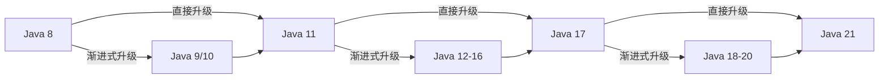
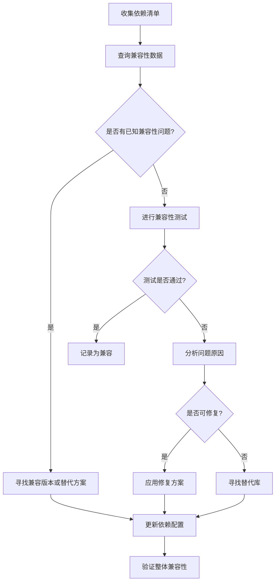
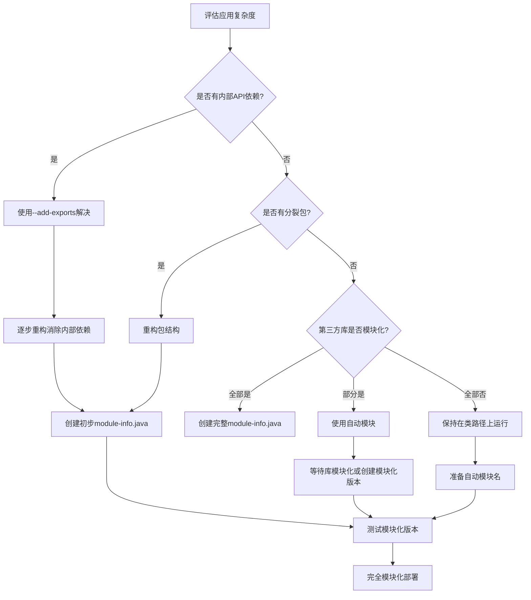

# 不同JDK版本兼容性处理

Java作为一种成熟的编程语言，其JDK版本更新一直遵循着"向后兼容"的原则，即新版本通常能运行为旧版本编写的代码。然而，随着Java的不断发展，特别是Java 9引入模块系统后，版本间的兼容性问题变得更加复杂。本文将详细探讨不同JDK版本间的兼容性处理策略，帮助开发者和企业平稳地进行JDK版本升级。

## JDK版本升级策略

### LTS版本vs非LTS版本选择指南

Java从JDK 9开始采用了新的发布节奏，每六个月发布一个新版本，并且每三年发布一个长期支持版本(LTS)。这种发布模式为用户提供了更多选择，但也带来了决策上的复杂性。

**LTS版本特点：**

- 长期支持期（通常为至少3年）
- 更稳定的API和功能
- 安全补丁和关键修复的持续更新
- 适合企业级应用和生产环境

目前的LTS版本包括Java 8、Java 11、Java 17和Java 21。

**非LTS版本特点：**

- 支持期较短（通常仅6个月，直到下一个版本发布）
- 包含新特性和实验性功能
- 适合尝鲜和技术验证
- 可作为向下一个LTS版本过渡的中间步骤

**选择建议：**

1. **企业级应用**：优先选择LTS版本，确保长期稳定性和支持
   
2. **创新项目**：可以考虑使用最新的非LTS版本，利用新特性提升开发效率

3. **开源库和框架**：通常需要支持多个JDK版本，尤其是流行的LTS版本

4. **学习和研究**：建议使用最新版本，了解Java的最新发展方向

下表展示了不同场景下的JDK版本选择建议：

| 应用场景 | 建议版本选择 | 原因 |
|---------|------------|------|
| 企业核心系统 | LTS版本 | 稳定性和长期支持至关重要 |
| 微服务应用 | 最新LTS或前一个非LTS | 平衡创新与稳定性 |
| 开发工具 | 最新版本 | 利用新特性提升开发体验 |
| 学术研究 | 最新版本 | 了解最新技术发展 |

### 企业级应用JDK升级路线图

企业级应用的JDK升级需要系统性规划，以下是一个建议的升级路线图：

1. **评估阶段（1-3个月）**
   - 盘点现有应用及其JDK依赖
   - 识别关键第三方库和框架的兼容性
   - 评估升级带来的收益和风险
   - 制定详细的升级计划和回滚策略

2. **准备阶段（1-2个月）**
   - 建立测试环境和CI/CD流水线
   - 培训开发和运维团队
   - 更新构建工具和依赖管理系统
   - 准备兼容性测试用例

3. **试点阶段（1-3个月）**
   - 选择非关键应用进行升级试点
   - 收集和解决兼容性问题
   - 优化构建和部署流程
   - 评估性能影响

4. **全面升级阶段（3-6个月）**
   - 按优先级分批升级应用
   - 持续监控和解决问题
   - 更新文档和最佳实践
   - 建立长期维护机制

5. **后续优化阶段（持续）**
   - 利用新版本特性优化代码
   - 移除对废弃API的依赖
   - 持续跟踪JDK更新和安全补丁

**典型的企业JDK升级路径：**



### 渐进式升级vs直接升级方案

在进行JDK版本升级时，企业通常面临两种主要策略：渐进式升级和直接升级。

**渐进式升级：**

渐进式升级是指按照版本顺序逐步升级，例如从Java 8先升级到Java 9，再到Java 10，最后到Java 11。

优点：
- 每次变更较小，风险可控
- 问题定位更精确
- 团队有足够时间适应变化
- 可以在中间版本停留一段时间

缺点：
- 总体升级周期较长
- 需要多次测试和部署
- 中间版本支持期有限
- 资源消耗较大

**直接升级：**

直接升级是指直接从当前版本升级到目标版本，例如从Java 8直接升级到Java 17。

优点：
- 一次性完成升级，减少中间步骤
- 直接获得目标版本的所有新特性和性能改进
- 避免在非LTS版本上投入过多资源
- 总体工作量可能更小

缺点：
- 变更幅度大，风险较高
- 问题排查可能更复杂
- 需要更全面的测试覆盖
- 团队需要一次性适应较多变化

**选择建议：**

| 场景 | 推荐策略 | 原因 |
|------|---------|------|
| 版本跨度小（如Java 11到Java 17） | 直接升级 | 变更相对可控，直接升级效率更高 |
| 版本跨度大（如Java 8到Java 17） | 渐进式升级 | 变更太大，分步骤降低风险 |
| 关键业务系统 | 渐进式升级 | 稳定性至上，逐步验证 |
| 新开发项目 | 直接使用最新LTS | 避免后续升级成本 |
| 微服务架构 | 服务级别渐进式升级 | 不同服务可以采用不同版本 |

### 兼容性测试与风险评估

JDK升级前的兼容性测试和风险评估是确保升级成功的关键步骤。

**兼容性测试策略：**

1. **静态代码分析**
   - 使用工具扫描代码中使用的已废弃或移除的API
   - 检查使用的内部API和非公开接口
   - 分析第三方依赖的JDK版本兼容性

   ```java
   // 使用jdeprscan工具检查废弃API使用
   jdeprscan --release 11 path/to/application.jar
   ```

2. **单元测试**
   - 在目标JDK版本上运行所有单元测试
   - 关注异常处理和边界条件测试
   - 使用不同的JDK实现（如OpenJDK、Oracle JDK）进行测试

3. **集成测试**
   - 测试与外部系统的集成点
   - 验证数据序列化和反序列化
   - 检查网络协议和加密算法兼容性

4. **性能测试**
   - 对比升级前后的性能指标
   - 测试内存使用和垃圾回收行为
   - 评估启动时间和响应时间变化

5. **安全测试**
   - 验证安全策略和权限设置
   - 测试TLS/SSL配置兼容性
   - 检查加密算法实现变化

**风险评估框架：**

| 风险类别 | 评估指标 | 缓解措施 |
|---------|---------|---------|
| API兼容性 | 使用废弃/移除API的数量 | 提前重构代码，使用兼容性库 |
| 第三方依赖 | 不兼容依赖的数量和重要性 | 升级依赖版本，寻找替代方案 |
| 性能影响 | 关键操作性能变化百分比 | 性能调优，资源扩容 |
| 部署复杂性 | 部署流程变更程度 | 自动化部署，灰度发布 |
| 回滚难度 | 回滚所需时间和步骤 | 准备详细回滚计划，保留旧环境 |

**风险评分示例：**

```
风险评分 = 影响程度(1-5) × 发生概率(1-5)

低风险：1-6分
中等风险：7-15分
高风险：16-25分
```

建议为每个识别的风险制定具体的缓解计划，并设置明确的决策点，确定何时继续升级或回滚。

### 升级后性能对比与优化

JDK版本升级通常会带来性能变化，有时是提升，有时可能出现退化。系统性的性能对比和优化是升级过程中的重要环节。

**性能对比方法：**

1. **基准测试**
   - 使用JMH(Java Microbenchmark Harness)进行微基准测试
   - 对比关键算法和操作的性能变化

   ```java
   @Benchmark
   public void testStringConcatenation() {
       String result = "";
       for (int i = 0; i < 1000; i++) {
           result += i;
       }
   }
   ```

2. **负载测试**
   - 使用实际或模拟的生产负载
   - 测量吞吐量、响应时间和错误率
   - 对比不同负载级别下的系统表现

3. **内存使用分析**
   - 监控堆内存使用情况
   - 分析对象分配和垃圾回收模式
   - 使用工具如VisualVM、JProfiler进行内存分析

4. **启动时间测量**
   - 对比应用启动时间变化
   - 分析类加载和初始化时间
   - 评估AOT编译和AppCDS的效果

**常见性能变化及优化：**

| JDK升级路径 | 常见性能变化 | 优化建议 |
|------------|------------|---------|
| 8到11 | G1成为默认GC，可能增加内存使用 | 调整G1参数，考虑使用-XX:+UseParallelGC |
| 11到17 | 字符串连接性能提升，ZGC改进 | 利用增强的字符串处理，测试ZGC |
| 17到21 | 虚拟线程提升并发性能 | 重构使用虚拟线程，减少线程池使用 |

**JDK 11性能优化示例：**

```java
// JDK 11 GC优化参数示例
-XX:+UseG1GC
-XX:MaxGCPauseMillis=200
-XX:G1HeapRegionSize=16M
-XX:+UseStringDeduplication
```

**JDK 17性能优化示例：**

```java
// JDK 17 ZGC优化参数示例
-XX:+UseZGC
-XX:ZCollectionInterval=120
-XX:+ZUncommit
-XX:ZUncommitDelay=300
```

**性能优化最佳实践：**

1. **建立性能基线**
   - 在升级前详细记录性能指标
   - 使用自动化工具持续监控性能

2. **逐步优化**
   - 先解决关键性能退化问题
   - 然后利用新版本特性进行优化
   - 最后进行全面的性能调优

3. **利用新版本特性**
   - 使用新的API和语言特性重构性能关键代码
   - 尝试新的GC算法和JVM参数
   - 利用新的诊断和分析工具

4. **持续监控**
   - 在生产环境中持续监控性能指标
   - 建立性能回归测试机制
   - 定期评估和优化

通过系统性的性能对比和优化，可以确保JDK升级不仅保持兼容性，还能带来性能提升，为升级提供更多价值。

## 向前兼容性问题处理

### API废弃与移除的应对策略

Java的演进过程中，一些API会被标记为废弃(deprecated)，并最终在后续版本中被移除。处理这些变化是JDK升级中的重要挑战。

**API生命周期理解：**

1. **正常使用阶段**：API被正式发布并推荐使用
2. **废弃阶段**：API被标记为@Deprecated，但仍然可用
3. **强烈废弃阶段**：API被标记为@Deprecated(forRemoval=true)，预警即将移除
4. **移除阶段**：API从JDK中完全移除，使用它的代码将无法编译或运行

**识别废弃和移除的API：**

1. **编译警告**：编译器会对使用废弃API的代码发出警告

   ```java
   // 编译时会产生警告
   Date date = new Date();
   date.getMonth(); // 废弃方法
   ```

2. **静态代码分析**：使用工具扫描代码库

   ```bash
   # 使用jdeprscan工具
   jdeprscan --release 17 myapp.jar
   
   # 使用SpotBugs等静态分析工具
   spotbugs -effort:max -dsa myapp.jar
   ```

3. **文档查阅**：查看Java API文档中的废弃标记

**应对策略：**

1. **主动替换**：在升级前主动替换废弃API

   ```java
   // 替换废弃的Date方法
   // 旧代码
   Date date = new Date();
   int month = date.getMonth();
   
   // 新代码
   LocalDate date = LocalDate.now();
   int month = date.getMonthValue() - 1; // 保持与旧API相同的月份表示(0-11)
   ```

2. **使用兼容性库**：引入提供兼容性的第三方库

   ```xml
   <!-- Maven依赖示例：引入JavaEE API兼容库 -->
   <dependency>
       <groupId>jakarta.xml.bind</groupId>
       <artifactId>jakarta.xml.bind-api</artifactId>
       <version>3.0.1</version>
   </dependency>
   <dependency>
       <groupId>com.sun.xml.bind</groupId>
       <artifactId>jaxb-impl</artifactId>
       <version>3.0.2</version>
       <scope>runtime</scope>
   </dependency>
   ```

3. **条件编译**：使用条件编译处理不同JDK版本

   ```java
   // 使用条件编译处理不同版本的API
   public class VersionCompatibility {
       public static void main(String[] args) {
           // 获取Java版本
           int version = Runtime.version().feature();
           
           if (version >= 11) {
               // Java 11+代码路径
               useJava11Features();
           } else {
               // 旧版本代码路径
               useLegacyFeatures();
           }
       }
       
       private static void useJava11Features() {
           // 使用Java 11+的API
           var httpClient = java.net.http.HttpClient.newHttpClient();
           // ...
       }
       
       private static void useLegacyFeatures() {
           // 使用旧版本兼容的API
           try {
               java.net.URL url = new java.net.URL("https://example.com");
               java.net.HttpURLConnection conn = (java.net.HttpURLConnection) url.openConnection();
               // ...
           } catch (Exception e) {
               e.printStackTrace();
           }
       }
   }
   ```

4. **反射访问**：在极端情况下使用反射访问移除的API（不推荐）

   ```java
   // 使用反射访问内部API（不推荐，仅作为临时解决方案）
   try {
       Class<?> sunMiscUnsafe = Class.forName("sun.misc.Unsafe");
       Field field = sunMiscUnsafe.getDeclaredField("theUnsafe");
       field.setAccessible(true);
       Object unsafe = field.get(null);
       // 使用unsafe对象...
   } catch (Exception e) {
       e.printStackTrace();
   }
   ```

5. **渐进式重构**：按优先级分批替换废弃API

   优先级确定因素：
   - 被移除的风险高低
   - 使用频率
   - 替换难度
   - 业务重要性

**常见废弃API及其替代方案：**

| 废弃/移除的API | 引入版本 | 移除版本 | 替代方案 |
|---------------|---------|---------|---------|
| java.util.Date的大部分方法 | Java 1.1 | - | java.time包中的类 |
| java.util.Stack | Java 1.0 | - | java.util.Deque接口的实现 |
| java.lang.Thread.stop() | Java 1.2 | - | 使用中断机制 |
| javax.xml.bind (JAXB) | Java 9 | Java 11 | jakarta.xml.bind |
| java.security.Certificate | Java 1.2 | Java 9 | java.security.cert.Certificate |
| sun.misc.Unsafe | Java 9 | - | java.lang.invoke.VarHandle |

### 内部API使用风险与替代方案

在Java开发中，有时开发者会使用JDK的内部API（如sun.*包下的类），这些API不属于公共接口，在版本升级时可能会发生变化或被移除，带来严重的兼容性问题。

**内部API使用的风险：**

1. **无向后兼容保证**：内部API可能在任何版本中变化，没有兼容性承诺
2. **可能被完全移除**：内部API可能在新版本中被移除
3. **不同JDK实现可能不同**：不同厂商的JDK实现可能有差异
4. **可能导致安全问题**：使用内部API可能绕过安全检查
5. **维护成本高**：依赖内部API的代码需要频繁适配新版本

**常见的内部API使用场景及替代方案：**

1. **sun.misc.Unsafe**

   使用场景：直接内存操作、对象创建、内存屏障等底层操作

   替代方案：
   ```java
   // 替代Unsafe的内存操作
   // 旧代码
   sun.misc.Unsafe unsafe = getUnsafeInstance();
   long address = unsafe.allocateMemory(1024);
   unsafe.putInt(address, 42);
   
   // 新代码 (Java 9+)
   try (Arena arena = Arena.ofConfined()) {
       MemorySegment segment = arena.allocate(1024);
       segment.set(ValueLayout.JAVA_INT, 0, 42);
   }
   ```

2. **sun.reflect包**

   使用场景：反射操作优化、访问私有成员

   替代方案：
   ```java
   // 替代sun.reflect的反射操作
   // 旧代码
   Method method = clazz.getDeclaredMethod("privateMethod");
   sun.reflect.ReflectionFactory factory = sun.reflect.ReflectionFactory.getReflectionFactory();
   sun.reflect.MethodAccessor accessor = factory.newMethodAccessor(method);
   
   // 新代码
   Method method = clazz.getDeclaredMethod("privateMethod");
   method.setAccessible(true); // 在允许的情况下使用
   method.invoke(instance);
   ```

3. **sun.misc.BASE64Encoder/Decoder**

   使用场景：Base64编解码

   替代方案：
   ```java
   // 替代sun.misc.BASE64Encoder/Decoder
   // 旧代码
   sun.misc.BASE64Encoder encoder = new sun.misc.BASE64Encoder();
   String encoded = encoder.encode(data.getBytes());
   
   // 新代码 (Java 8+)
   String encoded = java.util.Base64.getEncoder().encodeToString(data.getBytes());
   ```

4. **com.sun.net.httpserver包**

   使用场景：简单HTTP服务器实现

   替代方案：
   ```java
   // 使用公共API替代
   // 可以使用Java 11+的标准HTTP客户端
   HttpClient client = HttpClient.newHttpClient();
   
   // 或使用第三方库如Jetty、Undertow等
   Server server = new Server(8080);
   server.start();
   ```

**处理内部API依赖的策略：**

1. **识别内部API使用**
   - 使用静态代码分析工具扫描代码库
   - 检查编译警告和错误
   - 审查第三方库的依赖

2. **评估替代方案**
   - 查找官方推荐的替代API
   - 考虑使用第三方库
   - 评估自行实现的可能性

3. **制定迁移计划**
   - 按优先级排序需要替换的内部API
   - 为每个使用场景制定具体替代方案
   - 设定明确的迁移时间表

4. **临时解决方案**
   - 对于短期内难以替换的内部API，可以使用`--add-exports`和`--add-opens`参数临时允许访问

   ```bash
   # 允许访问内部模块
   java --add-exports java.base/sun.security.x509=ALL-UNNAMED MyApp
   ```

5. **长期策略**
   - 建立代码审查机制，防止新代码使用内部API
   - 在设计阶段考虑兼容性和可维护性
   - 持续关注JDK发展动态，及时适应变化

### 第三方库兼容性评估

第三方库的兼容性问题是JDK升级中的主要挑战之一。一个应用通常依赖多个第三方库，这些库可能与目标JDK版本不兼容。

**评估方法：**

1. **依赖清单分析**
   - 生成完整的依赖树
   - 识别直接和传递依赖

   ```bash
   # Maven依赖树分析
   mvn dependency:tree
   
   # Gradle依赖分析
   gradle dependencies
   ```

2. **兼容性数据库查询**
   - 查询已知的兼容性信息
   - 参考官方文档和社区报告

3. **测试验证**
   - 在目标JDK版本上运行集成测试
   - 使用不同的测试场景验证功能

4. **版本矩阵测试**
   - 测试不同库版本组合
   - 识别最佳兼容性配置

**常见第三方库兼容性问题及解决方案：**

| 库名称 | 常见问题 | 解决方案 |
|-------|---------|---------|
| Spring Framework < 5.0 | 不完全支持Java 9+ | 升级到Spring 5.3+，支持Java 17 |
| Hibernate < 5.4 | 使用内部反射API | 升级到Hibernate 5.6+或6.x |
| Apache Commons Collections < 4.4 | 序列化兼容性问题 | 升级到最新版本 |
| Log4j 1.x | 使用已移除的API | 迁移到Log4j 2或Logback |
| ASM < 7.0 | 不支持Java 11+类文件格式 | 升级到ASM 9.0+ |

**依赖冲突解决策略：**

1. **版本管理**
   - 使用依赖管理工具明确声明版本
   - 解决传递依赖冲突

   ```xml
   <!-- Maven依赖管理示例 -->
   <dependencyManagement>
       <dependencies>
           <dependency>
               <groupId>org.springframework</groupId>
               <artifactId>spring-framework-bom</artifactId>
               <version>5.3.20</version>
               <type>pom</type>
               <scope>import</scope>
           </dependency>
       </dependencies>
   </dependencyManagement>
   ```

2. **排除冲突依赖**
   - 排除传递依赖中的冲突版本
   - 显式声明兼容版本

   ```xml
   <dependency>
       <groupId>com.example</groupId>
       <artifactId>library</artifactId>
       <version>1.0.0</version>
       <exclusions>
           <exclusion>
               <groupId>commons-collections</groupId>
               <artifactId>commons-collections</artifactId>
           </exclusion>
       </exclusions>
   </dependency>
   ```

3. **使用兼容性桥接库**
   - 引入专门解决兼容性问题的库

   ```xml
   <!-- JAXB API for Java 11+ -->
   <dependency>
       <groupId>jakarta.xml.bind</groupId>
       <artifactId>jakarta.xml.bind-api</artifactId>
       <version>3.0.1</version>
   </dependency>
   <dependency>
       <groupId>com.sun.xml.bind</groupId>
       <artifactId>jaxb-impl</artifactId>
       <version>3.0.2</version>
       <scope>runtime</scope>
   </dependency>
   ```

4. **分析和解决类路径问题**
   - 使用工具分析类路径
   - 解决多版本冲突

   ```bash
   # 使用jdeps分析依赖
   jdeps --multi-release 17 -recursive -summary myapp.jar
   ```

**第三方库兼容性评估流程：**



### 模块系统迁移挑战

Java 9引入的模块系统(JPMS)是Java平台的重大变革，为应用提供了更好的封装和依赖管理，但也带来了迁移挑战。

**模块系统基本概念：**

1. **模块(Module)**：一个自包含的代码和数据单元，通过module-info.java文件定义

   ```java
   // module-info.java示例
   module com.example.myapp {
       // 依赖的模块
       requires java.sql;
       requires org.apache.commons.lang3;
       
       // 导出的包
       exports com.example.myapp.api;
让我继续完成关于模块系统迁移挑战的内容：

```java
// module-info.java示例
module com.example.myapp {
    // 依赖的模块
    requires java.sql;
    requires org.apache.commons.lang3;
    
    // 导出的包
    exports com.example.myapp.api;
    
    // 有限导出
    exports com.example.myapp.internal to com.example.plugin;
    
    // 服务提供和使用
    uses com.example.spi.Service;
    provides com.example.spi.Service with com.example.myapp.impl.ServiceImpl;
}
```

2. **模块路径(Module Path)**：替代传统的类路径，用于查找和加载模块

3. **强封装(Strong Encapsulation)**：默认情况下，模块中的包对其他模块不可见，除非显式导出

**迁移到模块系统的主要挑战：**

1. **类路径与模块路径共存**
   
   挑战：需要同时管理类路径和模块路径上的依赖
   
   解决方案：
   - 使用自动模块名为JAR文件命名
   - 逐步将类路径依赖迁移到模块路径
   
   ```xml
   <!-- 为非模块化JAR指定自动模块名 -->
   <plugin>
       <groupId>org.apache.maven.plugins</groupId>
       <artifactId>maven-jar-plugin</artifactId>
       <configuration>
           <archive>
               <manifestEntries>
                   <Automatic-Module-Name>com.example.legacy</Automatic-Module-Name>
               </manifestEntries>
           </archive>
       </configuration>
   </plugin>
   ```

2. **封装破坏(Encapsulation Breaking)**
   
   挑战：无法访问非导出包中的类
   
   解决方案：
   - 使用`--add-exports`和`--add-opens`参数
   - 重构代码，避免依赖非公开API
   
   ```bash
   # 允许访问非导出包
   java --add-exports java.base/sun.security.x509=com.example.myapp MyApp
   
   # 允许反射访问
   java --add-opens java.base/java.lang=ALL-UNNAMED MyApp
   ```

3. **分裂包(Split Packages)**
   
   挑战：同一个包名在多个模块中出现
   
   解决方案：
   - 重构代码，确保每个包只在一个模块中
   - 使用`--patch-module`临时合并包
   
   ```bash
   # 临时合并分裂包
   java --patch-module java.base=patch.jar MyApp
   ```

4. **循环依赖(Cyclic Dependencies)**
   
   挑战：模块系统不允许模块间的循环依赖
   
   解决方案：
   - 重构代码，打破循环依赖
   - 引入接口模块，实现依赖倒置
   
   ```
   // 重构前：A依赖B，B依赖A（循环依赖）
   
   // 重构后：
   // 1. 创建接口模块C
   // 2. A依赖C，B依赖C
   // 3. A和B各自实现C中的接口
   ```

5. **第三方库模块化**
   
   挑战：许多第三方库尚未模块化
   
   解决方案：
   - 使用自动模块
   - 创建模块化版本的第三方库
   - 使用jlink创建自定义运行时映像
   
   ```bash
   # 使用jlink创建自定义运行时
   jlink --module-path $MODULE_PATH --add-modules com.example.myapp --output myapp-runtime
   ```

**渐进式模块化策略：**

1. **阶段一：兼容性评估**
   - 使用`jdeps`工具分析依赖
   - 识别潜在的封装破坏和分裂包问题
   
   ```bash
   # 分析应用依赖
   jdeps --jdk-internals myapp.jar
   
   # 生成module-info.java建议
   jdeps --generate-module-info . myapp.jar
   ```

2. **阶段二：准备迁移**
   - 添加Automatic-Module-Name到JAR清单
   - 解决明显的封装破坏问题
   - 准备命令行参数处理兼容性问题

3. **阶段三：创建module-info.java**
   - 为应用创建模块描述符
   - 声明模块依赖和导出包
   - 保持在类路径上运行的能力

4. **阶段四：完全模块化**
   - 将应用部署为模块
   - 使用jlink创建自定义运行时
   - 利用模块系统的安全和性能优势

**模块化迁移决策树：**



### 编译时与运行时兼容性区别

在JDK升级过程中，理解编译时兼容性和运行时兼容性的区别至关重要，因为它们涉及不同的问题和解决方案。

**编译时兼容性：**

编译时兼容性指的是源代码能否在新版本JDK上成功编译。

常见编译时兼容性问题：

1. **API移除或签名变化**
   
   ```java
   // Java 8代码
   public void legacyMethod() {
       // 使用在Java 11中移除的javax.xml.bind.JAXBContext
       JAXBContext context = JAXBContext.newInstance(MyClass.class);
       // ...
   }
   ```
   
   解决方案：
   - 添加缺失的依赖
   - 使用替代API
   - 条件编译

   ```java
   // 添加缺失依赖
   // Maven示例
   <dependency>
       <groupId>jakarta.xml.bind</groupId>
       <artifactId>jakarta.xml.bind-api</artifactId>
       <version>3.0.1</version>
   </dependency>
   ```

2. **语言特性变化**
   
   ```java
   // 在Java 9+中，_ 成为保留关键字，不能单独用作标识符
   int _ = 10; // Java 8有效，Java 9+无效
   ```
   
   解决方案：
   - 更新代码以符合新语言规范
   - 使用兼容的语言特性

3. **默认方法冲突**
   
   ```java
   // 接口A和B都定义了相同的默认方法
   interface A {
       default void method() { /* 实现 */ }
   }
   
   interface B {
       default void method() { /* 实现 */ }
   }
   
   // 实现两个接口会导致冲突
   class C implements A, B {
       // 必须覆盖method()解决冲突
       @Override
       public void method() {
           A.super.method(); // 选择A的实现
       }
   }
   ```
   
   解决方案：
   - 显式覆盖冲突的默认方法
   - 选择一个接口的实现

**运行时兼容性：**

运行时兼容性指的是编译后的代码能否在新版本JDK上正确运行。

常见运行时兼容性问题：

1. **类加载行为变化**
   
   ```java
   // 在Java 9之前可能有效，Java 9+可能失败
   try {
       Class<?> clazz = ClassLoader.getSystemClassLoader().loadClass("sun.misc.Unsafe");
       // 使用反射访问内部类
   } catch (ClassNotFoundException e) {
       e.printStackTrace();
   }
   ```
   
   解决方案：
   - 使用公共API替代内部API
   - 使用`--add-opens`参数允许访问

2. **JVM行为变化**
   
   ```java
   // G1垃圾收集器（Java 9+默认）的行为与Parallel GC不同
   // 可能导致性能特征变化
   ```
   
   解决方案：
   - 调整JVM参数适应新的垃圾收集器
   - 显式指定垃圾收集器

   ```bash
   # 使用与旧版本相同的垃圾收集器
   java -XX:+UseParallelGC MyApp
   ```

3. **序列化兼容性**
   
   ```java
   // 序列化格式可能在不同JDK版本间变化
   try (ObjectOutputStream out = new ObjectOutputStream(new FileOutputStream("data.ser"))) {
       out.writeObject(myObject);
   }
   ```
   
   解决方案：
   - 实现自定义序列化逻辑
   - 使用版本无关的序列化格式（如JSON）
   - 确保serialVersionUID一致

   ```java
   class MyClass implements Serializable {
       // 显式定义serialVersionUID确保兼容性
       private static final long serialVersionUID = 1L;
       
       // 自定义序列化逻辑
       private void writeObject(ObjectOutputStream out) throws IOException {
           // 自定义序列化代码
       }
       
       private void readObject(ObjectInputStream in) throws IOException, ClassNotFoundException {
           // 自定义反序列化代码
       }
   }
   ```

**编译时vs运行时兼容性测试策略：**

| 兼容性类型 | 测试方法 | 工具 |
|-----------|---------|------|
| 编译时兼容性 | 在目标JDK上编译代码 | javac, Maven, Gradle |
| | 静态代码分析 | jdeps, SpotBugs |
| | API使用检查 | jdeprscan |
| 运行时兼容性 | 单元测试 | JUnit, TestNG |
| | 集成测试 | 自定义测试框架 |
| | 性能测试 | JMH, 负载测试工具 |
| | 内存分析 | JVisualVM, MAT |

**处理编译时和运行时兼容性的最佳实践：**

1. **多JDK版本测试**
   - 在多个目标JDK版本上编译和测试
   - 使用CI/CD流水线自动化测试

   ```yaml
   # GitHub Actions多JDK版本测试示例
   jobs:
     test:
       runs-on: ubuntu-latest
       strategy:
         matrix:
           java: [8, 11, 17]
       steps:
         - uses: actions/checkout@v2
         - name: Set up JDK ${{ matrix.java }}
           uses: actions/setup-java@v2
           with:
             java-version: ${{ matrix.java }}
         - name: Build with Maven
           run: mvn -B package
   ```

2. **源代码和目标兼容性设置**
   - 设置适当的源代码和目标兼容性级别
   - 使用工具强制执行兼容性规则

   ```xml
   <!-- Maven编译器插件配置 -->
   <plugin>
       <groupId>org.apache.maven.plugins</groupId>
       <artifactId>maven-compiler-plugin</artifactId>
       <version>3.10.1</version>
       <configuration>
           <source>11</source>
           <target>11</target>
           <release>11</release>
           <compilerArgs>
               <arg>-Xlint:all</arg>
           </compilerArgs>
       </configuration>
   </plugin>
   ```

3. **兼容性层(Compatibility Layer)**
   - 创建抽象层处理不同JDK版本的差异
   - 使用工厂模式创建适当的实现

   ```java
   // 兼容性层示例
   public interface HttpClientCompat {
       String get(String url) throws IOException;
       
       static HttpClientCompat create() {
           if (JavaVersion.isAtLeast(11)) {
               return new Java11HttpClient();
           } else {
               return new LegacyHttpClient();
           }
       }
   }
   
   // Java 11实现
   class Java11HttpClient implements HttpClientCompat {
       @Override
       public String get(String url) throws IOException {
           var client = java.net.http.HttpClient.newHttpClient();
           var request = java.net.http.HttpRequest.newBuilder()
               .uri(URI.create(url))
               .GET()
               .build();
           return client.send(request, java.net.http.HttpResponse.BodyHandlers.ofString()).body();
       }
   }
   
   // 旧版本实现
   class LegacyHttpClient implements HttpClientCompat {
       @Override
       public String get(String url) throws IOException {
           var connection = new URL(url).openConnection();
           try (var reader = new BufferedReader(new InputStreamReader(connection.getInputStream()))) {
               return reader.lines().collect(Collectors.joining("\n"));
           }
       }
   }
   ```

通过理解编译时和运行时兼容性的区别，开发者可以更有针对性地解决JDK升级过程中的兼容性问题，确保应用在新版本JDK上正常工作。

## 多JDK版本共存策略

### 多版本构建与部署方案

在企业环境中，通常需要支持多个JDK版本，特别是在过渡期或者需要同时维护多个产品线时。多版本构建与部署方案可以帮助团队有效管理这种复杂性。

**多版本构建策略：**

1. **条件编译**
   - 使用构建工具的条件编译功能
   - 根据目标JDK版本包含不同的源代码

   ```xml
   <!-- Maven多版本构建示例 -->
   <profiles>
       <profile>
           <id>java8</id>
           <activation>
               <jdk>1.8</jdk>
           </activation>
           <build>
               <plugins>
                   <plugin>
                       <groupId>org.apache.maven.plugins</groupId>
                       <artifactId>maven-compiler-plugin</artifactId>
                       <configuration>
                           <source>1.8</source>
                           <target>1.8</target>
                           <excludes>
                               <exclude>**/java9/**</exclude>
                               <exclude>**/java11/**</exclude>
                           </excludes>
                       </configuration>
                   </plugin>
               </plugins>
           </build>
       </profile>
       <profile>
           <id>java11</id>
           <activation>
               <jdk>[11,)</jdk>
           </activation>
           <build>
               <plugins>
                   <plugin>
                       <groupId>org.apache.maven.plugins</groupId>
                       <artifactId>maven-compiler-plugin</artifactId>
                       <configuration>
                           <release>11</release>
                           <excludes>
                               <exclude>**/java8/**</exclude>
                           </excludes>
                       </configuration>
                   </plugin>
               </plugins>
           </build>
       </profile>
   </profiles>
   ```

2. **多版本JAR(Multi-Release JAR)**
   - Java 9引入的特性，允许一个JAR包含针对不同Java版本的类文件
   - 在运行时自动选择适合当前JDK版本的类

   ```
   JAR文件结构：
   META-INF/
     MANIFEST.MF (包含Multi-Release: true)
   com/
     example/
       MyClass.class (基础版本，如Java 8)
   META-INF/
     versions/
       9/
         com/
           example/
             MyClass.class (Java 9特定版本)
       11/
         com/
           example/
             MyClass.class (Java 11特定版本)
   ```

   ```xml
   <!-- Maven多版本JAR配置 -->
   <plugin>
       <groupId>org.apache.maven.plugins</groupId>
       <artifactId>maven-compiler-plugin</artifactId>
       <executions>
           <execution>
               <id>base</id>
               <goals>
                   <goal>compile</goal>
               </goals>
               <configuration>
                   <release>8</release>
               </configuration>
           </execution>
           <execution>
               <id>java9</id>
               <goals>
                   <goal>compile</goal>
               </goals>
               <configuration>
                   <release>9</release>
                   <compileSourceRoots>
                       <compileSourceRoot>${project.basedir}/src/main/java9</compileSourceRoot>
                   </compileSourceRoots>
                   <outputDirectory>${project.build.outputDirectory}/META-INF/versions/9</outputDirectory>
               </configuration>
           </execution>
           <execution>
               <id>java11</id>
               <goals>
                   <goal>compile</goal>
               </goals>
               <configuration>
                   <release>11</release>
                   <compileSourceRoots>
                       <compileSourceRoot>${project.basedir}/src/main/java11</compileSourceRoot>
                   </compileSourceRoots>
                   <outputDirectory>${project.build.outputDirectory}/META-INF/versions/11</outputDirectory>
               </configuration>
           </execution>
       </executions>
   </plugin>
   <plugin>
       <groupId>org.apache.maven.plugins</groupId>
       <artifactId>maven-jar-plugin</artifactId>
       <configuration>
           <archive>
               <manifestEntries>
                   <Multi-Release>true</Multi-Release>
               </manifestEntries>
           </archive>
       </configuration>
   </plugin>
   ```

3. **分支策略**
   - 为不同JDK版本维护不同的代码分支
   - 使用共享库处理通用功能

   ```
   代码库结构：
   - main分支 (最新JDK版本)
   - java8分支 (Java 8兼容版本)
   - java11分支 (Java 11兼容版本)
   - common-lib (共享库，最低兼容版本)
   ```

**多版本部署策略：**

1. **并行部署**
   - 同时部署针对不同JDK版本构建的应用
   - 使用负载均衡或路由规则分发流量

   ```
   部署架构：
   - app-java8.jar (在JDK 8上运行)
   - app-java11.jar (在JDK 11上运行)
   - app-java17.jar (在JDK 17上运行)
   - 负载均衡器 (根据客户端需求路由请求)
   ```

2. **容器化部署**
   - 使用容器封装不同JDK版本的应用
   - 使用容器编排工具管理部署

   ```dockerfile
   # Java 8容器
   FROM openjdk:8-jre
   COPY target/app-java8.jar /app.jar
   CMD ["java", "-jar", "/app.jar"]
   
   # Java 17容器
   FROM openjdk:17-slim
   COPY target/app-java17.jar /app.jar
   CMD ["java", "-jar", "/app.jar"]
   ```

3. **特性标志(Feature Flags)**
   - 使用特性标志控制不同JDK版本特定的功能
   - 允许在运行时启用或禁用特定功能

   ```java
   // 特性标志示例
   if (FeatureFlags.isEnabled("java11.http.client")) {
       // 使用Java 11 HTTP客户端
       return useJava11HttpClient(url);
   } else {
       // 使用兼容所有版本的HTTP客户端
       return useLegacyHttpClient(url);
   }
   ```

**多版本测试策略：**

1. **矩阵测试**
   - 在多个JDK版本上运行测试
   - 使用CI/CD工具自动化测试

   ```yaml
   # GitHub Actions矩阵测试示例
   jobs:
     test:
       runs-on: ubuntu-latest
       strategy:
         matrix:
           java: [8, 11, 17]
           os: [ubuntu-latest, windows-latest]
       steps:
         - uses: actions/checkout@v2
         - name: Set up JDK ${{ matrix.java }}
           uses: actions/setup-java@v2
           with:
             java-version: ${{ matrix.java }}
             distribution: 'temurin'
         - name: Test with Maven
           run: mvn test
   ```

2. **版本特定测试**
   - 为特定JDK版本编写专门的测试
   - 使用条件测试跳过不适用的测试

   ```java
   @Test
   @EnabledOnJre(JRE.JAVA_11)
   public void testJava11Feature() {
       // 测试Java 11特定功能
   }
   
   @Test
   @DisabledOnJre(JRE.JAVA_8)
   public void testNewApiFeature() {
       // 测试Java 8不支持的功能
   }
   ```

**多版本构建与部署的最佳实践：**

1. **自动化构建流程**
   - 使用CI/CD自动化多版本构建
   - 确保构建产物的一致性和可重复性

2. **版本兼容性测试**
   - 全面测试所有支持的JDK版本
   - 自动化兼容性测试流程

3. **文档和标记**
   - 清晰标记每个构建产物的目标JDK版本
   - 提供详细的部署和配置文档

4. **监控和日志**
   - 监控不同JDK版本的应用性能
   - 收集版本特定的日志和指标

5. **渐进式迁移**
   - 使用流量分流策略逐步迁移到新版本
   - 保持回滚能力

通过实施多版本构建与部署策略，企业可以平稳地管理JDK版本过渡，同时最大限度地减少对用户的影响。

### JPMS模块版本管理

Java平台模块系统(JPMS)引入了新的版本管理挑战，特别是在需要支持多个JDK版本的项目中。有效的JPMS模块版本管理可以帮助开发者处理这些复杂性。

**JPMS版本管理基础：**

1. **模块版本声明**
   - 模块系统本身不直接支持版本号
   - 版本信息通常在构建系统和JAR清单中维护

   ```java
   // module-info.java不直接支持版本号
   module com.example.myapp {
       requires java.sql;
       requires org.apache.commons.lang3;
       // 无法指定依赖模块的版本
   }
   ```

   ```xml
   <!-- Maven中的版本管理 -->
   <dependency>
       <groupId>org.apache.commons</groupId>
       <artifactId>commons-lang3</artifactId>
       <version>3.12.0</version>
   </dependency>
   ```

2. **自动模块名和版本**
   - 非模块化JAR可以通过Automatic-Module-Name指定模块名
   - 版本通常从JAR文件名或清单中提取

   ```
   // JAR清单中指定自动模块名
   Manifest-Version: 1.0
   Automatic-Module-Name: org.apache.commons.lang3
   Implementation-Version: 3.12.0
   ```

3. **多版本模块**
   - 结合多版本JAR和模块系统
   - 允许模块在不同JDK版本上有不同实现

   ```
   模块化多版本JAR结构：
   META-INF/
     MANIFEST.MF (Multi-Release: true)
   module-info.class (基础版本)
   com/example/...
   META-INF/versions/
     9/
       module-info.class (Java 9特定版本)
     11/
       module-info.class (Java 11特定版本)
   ```

**JPMS多版本管理策略：**

1. **向下兼容模块设计**
   - 设计模块时考虑向下兼容性
   - 避免不必要的API变更

   ```java
   // 向下兼容的模块设计
   module com.example.api {
       // 稳定的公共API
       exports com.example.api.stable;
       
       // 实验性API，可能在未来版本变化
       exports com.example.api.experimental;
   }
   ```

2. **模块化与非模块化共存**
   - 支持同时在模块路径和类路径上运行
   - 使用条件编译处理不同环境

   ```java
   // 检测是否在模块环境中运行
   boolean isModular = getClass().getModule().isNamed();
   if (isModular) {
       // 模块化环境代码
   } else {
       // 非模块化环境代码
   }
   ```

3. **服务加载器适配**
   - 适配模块化和非模块化环境中的服务加载
   - 使用ServiceLoader机制

   ```java
   // 模块定义
   module com.example.service {
       exports com.example.service;
       uses com.example.service.MyService;
   }
   
   module com.example.provider {
       requires com.example.service;
       provides com.example.service.MyService with com.example.provider.MyServiceImpl;
   }
   ```

   ```java
   // 服务加载代码
   ServiceLoader<MyService> services = ServiceLoader.load(MyService.class);
   for (MyService service : services) {
       // 使用服务实现
   }
   ```

4. **版本范围依赖**
   - 在构建系统中指定版本范围
   - 处理模块间的版本兼容性

   ```xml
   <!-- Maven中的版本范围依赖 -->
   <dependency>
       <groupId>org.apache.commons</groupId>
       <artifactId>commons-lang3</artifactId>
       <version>[3.8,4.0)</version> <!-- 3.8及以上，4.0以下的版本 -->
   </dependency>
   ```

**JPMS版本冲突解决：**

1. **模块路径优先级**
   - 了解模块解析的优先级规则
   - 合理安排模块在模块路径中的顺序

   ```bash
   # 指定模块路径顺序
   java --module-path lib1:lib2:lib3 --module com.example.app
   ```

2. **升级模块**
   - 使用--upgrade-module-path替换平台模块
   - 解决与JDK模块的版本冲突

   ```bash
   # 升级平台模块
   java --upgrade-module-path upgraded-modules --module com.example.app
   ```

3. **模块补丁**
   - 使用--patch-module修改现有模块
   - 解决特定模块的兼容性问题

   ```bash
   # 为模块应用补丁
   java --patch-module java.base=patch-for-base.jar --module com.example.app
   ```

**JPMS版本管理工具：**

1. **ModiTect**
   - 用于在构建时添加模块描述符
   - 支持生成和自定义模块信息

   ```xml
   <!-- ModiTect Maven插件配置 -->
   <plugin>
       <groupId>org.moditect</groupId>
       <artifactId>moditect-maven-plugin</artifactId>
       <version>1.0.0.Final</version>
       <executions>
           <execution>
               <id>add-module-info</id>
               <phase>package</phase>
               <goals>
                   <goal>add-module-info</goal>
               </goals>
               <configuration>
                   
让我继续完成关于JPMS模块版本管理的内容：

```xml
<!-- ModiTect Maven插件配置 -->
<plugin>
    <groupId>org.moditect</groupId>
    <artifactId>moditect-maven-plugin</artifactId>
    <version>1.0.0.Final</version>
    <executions>
        <execution>
            <id>add-module-info</id>
            <phase>package</phase>
            <goals>
                <goal>add-module-info</goal>
            </goals>
            <configuration>
                <modules>
                    <module>
                        <artifact>commons-io:commons-io:2.11.0</artifact>
                        <moduleInfo>
                            <name>org.apache.commons.io</name>
                            <exports>
                                org.apache.commons.io*;
                            </exports>
                        </moduleInfo>
                    </module>
                </modules>
            </configuration>
        </execution>
    </executions>
</plugin>
```

2. **jlink**
   - 创建自定义运行时映像
   - 包含应用及其依赖的模块

   ```bash
   # 使用jlink创建自定义运行时
   jlink --module-path $MODULE_PATH --add-modules com.example.app,java.sql --output custom-runtime
   ```

3. **jdeps**
   - 分析模块依赖
   - 识别缺失或冲突的依赖

   ```bash
   # 分析模块依赖
   jdeps --module-path lib --module com.example.app
   
   # 生成module-info.java
   jdeps --generate-module-info . commons-io-2.11.0.jar
   ```

**JPMS版本管理最佳实践：**

1. **明确的模块边界**
   - 清晰定义模块的导出包
   - 避免过度导出内部实现

   ```java
   // 良好的模块设计
   module com.example.app {
       // 只导出公共API
       exports com.example.app.api;
       
       // 内部实现不导出
       // com.example.app.internal 包保持私有
   }
   ```

2. **版本化命名策略**
   - 在模块名中包含主版本号
   - 处理不兼容版本的共存

   ```java
   // 版本化模块命名
   module com.example.api.v1 {
       exports com.example.api.v1;
   }
   
   module com.example.api.v2 {
       exports com.example.api.v2;
   }
   ```

3. **兼容性测试**
   - 测试模块在不同JDK版本上的行为
   - 验证模块解析和服务加载

   ```java
   // JUnit 5模块测试示例
   @Test
   void testModuleResolution() {
       Module module = getClass().getModule();
       assertTrue(module.isNamed());
       assertTrue(module.canRead(ModuleLayer.boot().findModule("java.sql").get()));
   }
   ```

4. **文档化模块依赖**
   - 清晰记录模块的依赖关系
   - 说明版本兼容性要求

   ```java
   /**
    * 模块com.example.app
    * 
    * 依赖:
    * - java.sql (JDK 11+)
    * - org.apache.commons.lang3 (3.8+)
    * - com.example.api (1.0+)
    */
   module com.example.app {
       requires java.sql;
       requires org.apache.commons.lang3;
       requires com.example.api;
   }
   ```

通过有效的JPMS模块版本管理，开发者可以更好地处理多JDK版本环境中的模块依赖和兼容性问题，确保应用在不同环境中正常运行。

### 容器化环境中的JDK版本管理

容器化技术（如Docker和Kubernetes）为JDK版本管理提供了新的可能性和挑战。在容器环境中，可以更精确地控制每个应用的运行时环境，包括JDK版本。

**容器化JDK基础：**

1. **JDK基础镜像选择**
   - 官方JDK镜像（如Eclipse Temurin、Amazon Corretto）
   - 精简JDK镜像（如Alpine-based）
   - 自定义JDK镜像

   ```dockerfile
   # 使用官方Eclipse Temurin JDK 17
   FROM eclipse-temurin:17-jdk
   
   # 使用Alpine版本的JDK 11
   FROM eclipse-temurin:11-jdk-alpine
   
   # 使用Amazon Corretto JDK 8
   FROM amazoncorretto:8
   ```

2. **多阶段构建**
   - 使用一个JDK版本构建
   - 使用另一个JDK版本运行
   - 减小最终镜像大小

   ```dockerfile
   # 构建阶段 - 使用JDK 17构建
   FROM eclipse-temurin:17-jdk AS build
   WORKDIR /app
   COPY . .
   RUN ./mvnw package -DskipTests
   
   # 运行阶段 - 使用JDK 11运行
   FROM eclipse-temurin:11-jre
   WORKDIR /app
   COPY --from=build /app/target/myapp.jar .
   CMD ["java", "-jar", "myapp.jar"]
   ```

3. **自定义JDK运行时**
   - 使用jlink创建精简的JDK运行时
   - 只包含应用所需的模块
   - 显著减小镜像大小

   ```dockerfile
   # 构建自定义JDK运行时
   FROM eclipse-temurin:17-jdk AS jdk-build
   WORKDIR /jdk
   
   # 创建自定义运行时
   RUN jlink \
       --add-modules java.base,java.logging,java.sql,java.desktop \
       --strip-debug \
       --no-man-pages \
       --no-header-files \
       --compress=2 \
       --output /jdk/runtime
   
   # 构建应用
   FROM eclipse-temurin:17-jdk AS app-build
   WORKDIR /app
   COPY . .
   RUN ./mvnw package -DskipTests
   
   # 最终镜像
   FROM debian:bullseye-slim
   WORKDIR /app
   
   # 复制自定义JDK和应用
   COPY --from=jdk-build /jdk/runtime /opt/jdk
   COPY --from=app-build /app/target/myapp.jar .
   
   # 设置PATH
   ENV PATH="/opt/jdk/bin:${PATH}"
   
   CMD ["java", "-jar", "myapp.jar"]
   ```

**容器环境中的多JDK版本策略：**

1. **每个应用一个JDK版本**
   - 为每个应用选择最合适的JDK版本
   - 在容器编排层面管理不同版本

   ```yaml
   # Kubernetes部署示例 - Java 8应用
   apiVersion: apps/v1
   kind: Deployment
   metadata:
     name: legacy-app
   spec:
     replicas: 3
     template:
       spec:
         containers:
         - name: app
           image: myorg/legacy-app:latest
           # 基于Java 8的容器镜像
   
   # Kubernetes部署示例 - Java 17应用
   apiVersion: apps/v1
   kind: Deployment
   metadata:
     name: modern-app
   spec:
     replicas: 3
     template:
       spec:
         containers:
         - name: app
           image: myorg/modern-app:latest
           # 基于Java 17的容器镜像
   ```

2. **版本标签策略**
   - 使用明确的版本标签
   - 避免使用latest标签
   - 包含JDK版本信息

   ```bash
   # 构建并标记镜像，包含JDK版本信息
   docker build -t myorg/myapp:1.2.3-jdk11 .
   docker build -t myorg/myapp:1.2.3-jdk17 .
   ```

3. **CI/CD流水线多版本构建**
   - 在CI/CD流水线中构建多个JDK版本
   - 自动化测试和部署流程

   ```yaml
   # GitHub Actions多版本构建示例
   jobs:
     build:
       runs-on: ubuntu-latest
       strategy:
         matrix:
           java: [8, 11, 17]
       steps:
         - uses: actions/checkout@v2
         - name: Set up JDK ${{ matrix.java }}
           uses: actions/setup-java@v2
           with:
             java-version: ${{ matrix.java }}
         - name: Build with Maven
           run: mvn package
         - name: Build Docker image
           run: |
             docker build -t myorg/myapp:latest-jdk${{ matrix.java }} \
               --build-arg JDK_VERSION=${{ matrix.java }} .
         - name: Push Docker image
           run: docker push myorg/myapp:latest-jdk${{ matrix.java }}
   ```

4. **运行时JDK选择**
   - 使用环境变量或配置选择JDK版本
   - 支持动态切换

   ```dockerfile
   # 支持多JDK版本的Dockerfile
   FROM debian:bullseye-slim
   
   # 安装多个JDK版本
   RUN apt-get update && apt-get install -y \
       openjdk-8-jre \
       openjdk-11-jre \
       openjdk-17-jre
   
   # 设置默认JDK
   ENV JAVA_HOME=/usr/lib/jvm/java-11-openjdk-amd64
   ENV PATH=$JAVA_HOME/bin:$PATH
   
   # 添加JDK选择脚本
   COPY select-jdk.sh /usr/local/bin/
   RUN chmod +x /usr/local/bin/select-jdk.sh
   
   # 启动脚本
   COPY start.sh /
   RUN chmod +x /start.sh
   
   CMD ["/start.sh"]
   ```

   ```bash
   # select-jdk.sh
   #!/bin/bash
   case $JDK_VERSION in
     8)
       export JAVA_HOME=/usr/lib/jvm/java-8-openjdk-amd64
       ;;
     11)
       export JAVA_HOME=/usr/lib/jvm/java-11-openjdk-amd64
       ;;
     17)
       export JAVA_HOME=/usr/lib/jvm/java-17-openjdk-amd64
       ;;
     *)
       echo "Unsupported JDK version: $JDK_VERSION"
       exit 1
       ;;
   esac
   export PATH=$JAVA_HOME/bin:$PATH
   ```

**容器化JDK优化策略：**

1. **JVM容器感知**
   - 确保JVM正确识别容器资源限制
   - 适当配置内存和CPU参数

   ```bash
   # JDK 8u191+, JDK 11+已默认启用容器感知
   # 对于旧版本，需要显式启用
   java -XX:+UnlockExperimentalVMOptions -XX:+UseCGroupMemoryLimitForHeap -jar app.jar
   
   # 设置合适的内存限制
   java -Xmx512m -XX:MaxRAMPercentage=75.0 -jar app.jar
   ```

2. **启动时间优化**
   - 使用AppCDS减少启动时间
   - 考虑AOT编译（如GraalVM Native Image）

   ```dockerfile
   # 使用AppCDS优化启动时间
   FROM eclipse-temurin:17-jdk AS build
   WORKDIR /app
   COPY . .
   RUN ./mvnw package -DskipTests
   
   # 创建AppCDS归档
   RUN java -XX:DumpLoadedClassList=classes.lst -jar target/myapp.jar --exit
   RUN java -Xshare:dump -XX:SharedClassListFile=classes.lst -XX:SharedArchiveFile=app-cds.jsa -jar target/myapp.jar
   
   # 最终镜像
   FROM eclipse-temurin:17-jre
   WORKDIR /app
   COPY --from=build /app/target/myapp.jar .
   COPY --from=build /app/app-cds.jsa .
   
   # 使用AppCDS启动
   CMD ["java", "-Xshare:on", "-XX:SharedArchiveFile=app-cds.jsa", "-jar", "myapp.jar"]
   ```

3. **镜像大小优化**
   - 使用Alpine基础镜像
   - 使用jlink创建自定义运行时
   - 移除不必要的文件

   ```dockerfile
   # 使用Alpine基础镜像
   FROM eclipse-temurin:17-jdk-alpine AS build
   WORKDIR /app
   COPY . .
   RUN ./mvnw package -DskipTests
   
   # 最终镜像
   FROM eclipse-temurin:17-jre-alpine
   WORKDIR /app
   COPY --from=build /app/target/myapp.jar .
   
   # 减小镜像大小
   RUN apk --no-cache add curl && \
       rm -rf /tmp/* /var/cache/apk/*
   
   CMD ["java", "-jar", "myapp.jar"]
   ```

**容器化环境中的JDK版本管理最佳实践：**

1. **明确的版本策略**
   - 为每个应用定义明确的JDK版本要求
   - 在容器镜像中记录JDK版本信息

   ```dockerfile
   # 在镜像中记录JDK版本信息
   LABEL org.opencontainers.image.description="My Application running on JDK 17"
   LABEL app.java.version="17"
   ```

2. **自动化测试**
   - 在多个JDK版本上自动测试容器
   - 验证在目标环境中的行为

   ```bash
   # 测试不同JDK版本的容器
   for jdk in 8 11 17; do
     docker run --rm myorg/myapp:latest-jdk$jdk java -version
     docker run --rm myorg/myapp:latest-jdk$jdk ./run-tests.sh
   done
   ```

3. **监控和日志**
   - 监控不同JDK版本的容器性能
   - 收集JVM指标和应用日志

   ```yaml
   # Prometheus JMX Exporter配置
   - name: app
     image: myorg/myapp:latest-jdk17
     ports:
       - containerPort: 8080
       - containerPort: 9090  # JMX Exporter
     env:
       - name: JAVA_OPTS
         value: "-javaagent:/app/jmx_prometheus_javaagent.jar=9090:/app/jmx-config.yaml"
   ```

4. **安全更新策略**
   - 定期更新基础JDK镜像
   - 自动化安全补丁应用

   ```yaml
   # Renovate配置示例
   {
     "extends": ["config:base"],
     "packageRules": [
       {
         "matchPackagePatterns": ["^eclipse-temurin"],
         "automerge": true,
         "automergeType": "branch"
       }
     ]
   }
   ```

5. **资源效率**
   - 优化容器资源使用
   - 根据应用需求调整JVM参数

   ```bash
   # 优化JVM参数
   java -XX:+UseContainerSupport -XX:MaxRAMPercentage=75.0 -XX:InitialRAMPercentage=50.0 -jar app.jar
   ```

通过容器化技术，企业可以更灵活地管理多个JDK版本，简化部署和运维流程，同时确保应用在正确的JDK环境中运行。

### CI/CD流水线中的多版本测试

在现代软件开发中，持续集成和持续部署(CI/CD)流水线是确保代码质量和快速交付的关键。在多JDK版本环境中，CI/CD流水线需要特别设计，以确保应用在所有支持的JDK版本上正常工作。

**多版本测试基础设施：**

1. **矩阵构建配置**
   - 在CI/CD工具中配置矩阵构建
   - 同时测试多个JDK版本和操作系统

   ```yaml
   # GitHub Actions矩阵构建示例
   jobs:
     test:
       runs-on: ${{ matrix.os }}
       strategy:
         matrix:
           os: [ubuntu-latest, windows-latest, macos-latest]
           java: [8, 11, 17, 21]
         fail-fast: false  # 一个版本失败不会停止其他版本的测试
       steps:
         - uses: actions/checkout@v3
         - name: Set up JDK ${{ matrix.java }}
           uses: actions/setup-java@v3
           with:
             java-version: ${{ matrix.java }}
             distribution: 'temurin'
         - name: Build and test
           run: mvn verify
   ```

   ```yaml
   # Jenkins声明式流水线示例
   pipeline {
     agent none
     stages {
       stage('Test') {
         matrix {
           axes {
             axis {
               name 'JDK_VERSION'
               values '8', '11', '17', '21'
             }
             axis {
               name 'OS'
               values 'linux', 'windows'
             }
           }
           agent {
             docker {
               image "eclipse-temurin:${JDK_VERSION}-jdk"
               label "${OS}"
             }
           }
           stages {
             stage('Build & Test') {
               steps {
                 sh 'mvn verify'
               }
             }
           }
         }
       }
     }
   }
   ```

2. **版本特定构建配置**
   - 为不同JDK版本使用不同的构建配置
   - 处理版本特定的编译选项和依赖

   ```xml
   <!-- Maven多配置文件示例 -->
   <profiles>
     <profile>
       <id>java8</id>
       <activation>
         <jdk>1.8</jdk>
       </activation>
       <properties>
         <maven.compiler.source>1.8</maven.compiler.source>
         <maven.compiler.target>1.8</maven.compiler.target>
       </properties>
     </profile>
     <profile>
       <id>java11</id>
       <activation>
         <jdk>[11,)</jdk>
       </activation>
       <properties>
         <maven.compiler.release>11</maven.compiler.release>
       </properties>
     </profile>
   </profiles>
   ```

3. **测试环境容器化**
   - 使用Docker容器运行测试
   - 确保一致的测试环境

   ```dockerfile
   # 测试容器Dockerfile
   FROM eclipse-temurin:17-jdk
   
   # 安装测试依赖
   RUN apt-get update && apt-get install -y \
       curl \
       netcat \
       postgresql-client
   
   WORKDIR /app
   COPY . .
   
   # 运行测试
   CMD ["./mvnw", "verify"]
   ```

**多版本测试策略：**

1. **单元测试策略**
   - 使用条件测试跳过不兼容的测试
   - 为不同版本编写特定测试

   ```java
   // JUnit 5条件测试示例
   @Test
   @EnabledOnJre(JRE.JAVA_11)
   void testJava11Feature() {
       // 测试Java 11特定功能
   }
   
   @Test
   @DisabledOnJre(JRE.JAVA_8)
   void testNewApiFeature() {
       // 测试Java 8不支持的功能
   }
   
   @Test
   @EnabledForJreRange(min = JRE.JAVA_11, max = JRE.JAVA_17)
   void testFeatureInRange() {
       // 测试Java 11到17支持的功能
   }
   ```

2. **集成测试策略**
   - 测试与外部系统的集成
   - 验证不同JDK版本的兼容性

   ```java
   // 使用TestContainers进行集成测试
   @Testcontainers
   class DatabaseIntegrationTest {
       
       @Container
       static PostgreSQLContainer<?> postgres = new PostgreSQLContainer<>("postgres:14")
           .withDatabaseName("testdb")
           .withUsername("test")
           .withPassword("test");
       
       @Test
       void testDatabaseConnection() {
           // 测试数据库连接和操作
           // 在不同JDK版本上验证JDBC驱动兼容性
       }
   }
   ```

3. **性能测试策略**
   - 比较不同JDK版本的性能
   - 使用JMH进行微基准测试

   ```java
   // JMH基准测试示例
   @BenchmarkMode(Mode.AverageTime)
   @OutputTimeUnit(TimeUnit.MICROSECONDS)
   @State(Scope.Benchmark)
   public class StringConcatenationBenchmark {
       
       @Param({"8", "11", "17"})
       private String jdkVersion;  // 实际上是通过系统属性传入
       
       @Benchmark
       public String testStringConcatenation() {
           String result = "";
           for (int i = 0; i < 1000; i++) {
               result += i;
           }
           return result;
       }
       
       public static void main(String[] args) throws Exception {
           Options opt = new OptionsBuilder()
               .include(StringConcatenationBenchmark.class.getSimpleName())
               .forks(1)
               .build();
           new Runner(opt).run();
       }
   }
   ```

4. **兼容性测试矩阵**
   - 测试不同JDK版本与不同依赖版本的组合
   - 识别最佳兼容性配置

   ```groovy
   // Gradle测试矩阵示例
   tasks.register('compatibilityTest') {
       dependsOn tasks.withType(Test)
   }
   
   // 为不同Spring版本创建测试任务
   ['5.3.20', '6.0.0'].each { springVersion ->
       // 为不同JDK版本创建测试任务
       ['8', '11', '17'].each { jdkVersion ->
           tasks.register("testSpring${springVersion.replace('.', '_')}_JDK${jdkVersion}", Test) {
               useJUnitPlatform()
               systemProperty 'spring.version', springVersion
               systemProperty 'java.version', jdkVersion
               
               // 只在匹配的JDK版本上运行
               onlyIf {
                   System.getProperty('java.version').startsWith(jdkVersion)
               }
           }
       }
   }
   ```

**CI/CD流水线实现：**

1. **GitHub Actions示例**

   ```yaml
   name: Multi-JDK CI
   
   on:
     push:
       branches: [ main ]
     pull_request:
       branches: [ main ]
   
   jobs:
     build:
       runs-on: ubuntu-latest
       strategy:
         matrix:
           java: [8, 11, 17, 21]
       steps:
       - uses: actions/checkout@v3
       - name: Set up JDK ${{ matrix.java }}
         uses: actions/setup-java@v3
         with:
           java-version: ${{ matrix.java }}
           distribution: 'temurin'
           cache: 'maven'
       
       - name: Build with Maven
         run: mvn -B package
       
       - name: Run tests
         run: mvn -B test
       
       - name: Upload test results
         if: always()
         uses: actions/upload-artifact@v3
         with:
           name: test-results-java-${{ matrix.java }}
           path: target/surefire-reports/
       
       - name: Build Docker image
         run: |
           docker build -t myapp:jdk${{ matrix.java }} \
             --build-arg JDK_VERSION=${{ matrix.java }} .
       
       - name: Test Docker image
         run: |
           docker run --rm myapp:jdk${{ matrix.java }} java -version
           docker run --rm myapp:jdk${{ matrix.java }} ./run-tests.sh
   ```

2. **Jenkins Pipeline示例**

   ```groovy
   pipeline {
       agent none
       
       stages {
           stage('Build and Test') {
               matrix {
                   axes {
                       axis {
                           name 'JDK_VERSION'
                           values '8', '11', '17', '21'
                       }
                   }
                   agent {
                       docker {
                           image "eclipse-temurin:${JDK_VERSION}-jdk"
                           args '-v $HOME/.m2:/root/.m2'
                       }
                   }
                   stages {
                       stage('Build') {
                           steps {
                               sh 'mvn -B clean package -DskipTests'
                           }
                       }
                       stage('Test') {
                           steps {
                               sh 'mvn -B test'
                           }
                           post {
                               always {
                                   junit '**/target/surefire-reports/TEST-*.xml'
                               }
                           }
                       }
                       stage('Integration Test') {
                           steps {
                               sh 'mvn -B verify -DskipUnitTests'
                           }
                       }
                   }
               }
           }
           
           stage('Report') {
               agent any
               steps {
                   echo 'Generating compatibility report...'
                   // 生成兼容性报告的脚本
               }
           }
       }
   }
   ```

3. **GitLab CI示例**

   ```yaml
   variables:
     MAVEN_OPTS: "-Dmaven.repo.local=.m2/repository"
   
   cache:
     paths:
       - .m2/repository/
   
   .build_template: &build_definition
     script:
       - mvn -B clean package
   
   .test_template: &test_definition
     script:
       - mvn -B test
     artifacts:
       reports:
         junit: target/surefire-reports/TEST-*.xml
   
   build:jdk8:
     image: eclipse-temurin:8-jdk
     <<: *build_definition
   
   build:jdk11:
     image: eclipse-temurin:11-jdk
     <<: *build_definition
   
   build:jdk17:
     image: eclipse-temurin:17-jdk
     <<: *build_definition
   
   build:jdk21:
     image: eclipse-temurin:21-jdk
     <<: *build_definition
   
   test:jdk8:
     image: eclipse-temurin:8-jdk
     needs: ["build:jdk8"]
     <<: *test_definition
   
   test:jdk11:
     image: eclipse-temurin:11-jdk
     needs: ["build:jdk11"]
     <<: *test_definition
   
   test:jdk17:
     image: eclipse-temurin:17-jdk
     needs: ["build:jdk17"]
     <<: *test_definition
   
   test:jdk21:
     image: eclipse-temurin:21-jdk
     needs: ["build:jdk21"]
     <<: *test_definition
   
   compatibility_report:
     image: alpine
     stage: deploy
     needs: ["test:jdk8", "test:jdk11", "test:jdk17", "test:jdk21"]
     script:
       - echo "Generating compatibility report"
       # 生成兼容性报告的脚本
     artifacts:
       paths:
         - compatibility-report.html
   ```

**测试结果分析与报告：**

1. **兼容性矩阵报告**
   - 生成不同JDK版本的测试结果矩阵
   - 突出显示兼容性问题

   ```html
   <!-- 兼容性矩阵报告示例 -->
   <table>
     <tr>
       <th>功能/JDK版本</th>
       <th>JDK 8</th>
       <th>JDK 11</th>
       <th>JDK 17</th>
       <th>JDK 21</th>
     </tr>
     <tr>
       <td>核心功能</td>
       <td class="pass">通过</td>
       <td class="pass">通过</td>
       <td class="pass">通过</td>
       <td class="pass">通过</td>
     </tr>
     <tr>
       <td>HTTP客户端</td>
       <td class="warning">部分通过</td>
       <td class="pass">通过</td>
       <td class="pass">通过</td>
       <td class="pass">通过</td>
     </tr>
     <tr>
       <td>并发功能</td>
       <td class="pass">通过</td>
       <td class="pass">通过</td>
       <td class="pass">通过</td>
       <td class="fail">失败</td>
     </tr>
   </table
让我继续完成关于CI/CD流水线中的多版本测试的内容：

```html
<!-- 兼容性矩阵报告示例 -->
<table>
  <tr>
    <th>功能/JDK版本</th>
    <th>JDK 8</th>
    <th>JDK 11</th>
    <th>JDK 17</th>
    <th>JDK 21</th>
  </tr>
  <tr>
    <td>核心功能</td>
    <td class="pass">通过</td>
    <td class="pass">通过</td>
    <td class="pass">通过</td>
    <td class="pass">通过</td>
  </tr>
  <tr>
    <td>HTTP客户端</td>
    <td class="warning">部分通过</td>
    <td class="pass">通过</td>
    <td class="pass">通过</td>
    <td class="pass">通过</td>
  </tr>
  <tr>
    <td>并发功能</td>
    <td class="pass">通过</td>
    <td class="pass">通过</td>
    <td class="pass">通过</td>
    <td class="fail">失败</td>
  </tr>
</table>
```

2. **性能比较报告**
   - 比较不同JDK版本的性能指标
   - 识别性能改进或退化

   ```javascript
   // 使用Chart.js创建性能比较图表
   const ctx = document.getElementById('performanceChart').getContext('2d');
   const chart = new Chart(ctx, {
       type: 'bar',
       data: {
           labels: ['JDK 8', 'JDK 11', 'JDK 17', 'JDK 21'],
           datasets: [{
               label: '启动时间 (秒)',
               data: [4.2, 3.8, 3.5, 2.9],
               backgroundColor: 'rgba(54, 162, 235, 0.5)'
           }, {
               label: '吞吐量 (请求/秒)',
               data: [1200, 1350, 1480, 1650],
               backgroundColor: 'rgba(75, 192, 192, 0.5)'
           }, {
               label: '内存使用 (MB)',
               data: [512, 490, 475, 460],
               backgroundColor: 'rgba(255, 99, 132, 0.5)'
           }]
       }
   });
   ```

3. **自动化兼容性报告**
   - 自动生成兼容性报告
   - 集成到CI/CD流水线

   ```python
   # 生成兼容性报告的Python脚本示例
   import json
   import xml.etree.ElementTree as ET
   import os
   
   def parse_test_results(jdk_version):
       results = {"passed": 0, "failed": 0, "skipped": 0}
       path = f"target/surefire-reports-jdk{jdk_version}"
       
       for file in os.listdir(path):
           if file.endswith(".xml"):
               tree = ET.parse(os.path.join(path, file))
               root = tree.getroot()
               
               results["passed"] += int(root.attrib.get("tests", 0)) - int(root.attrib.get("failures", 0)) - int(root.attrib.get("skipped", 0))
               results["failed"] += int(root.attrib.get("failures", 0))
               results["skipped"] += int(root.attrib.get("skipped", 0))
       
       return results
   
   # 收集所有JDK版本的结果
   all_results = {}
   for jdk in ["8", "11", "17", "21"]:
       all_results[jdk] = parse_test_results(jdk)
   
   # 生成HTML报告
   with open("compatibility-report.html", "w") as f:
       f.write("<html><head><title>JDK兼容性报告</title></head><body>")
       f.write("<h1>JDK兼容性测试报告</h1>")
       f.write("<table border='1'>")
       f.write("<tr><th>JDK版本</th><th>通过</th><th>失败</th><th>跳过</th><th>通过率</th></tr>")
       
       for jdk, results in all_results.items():
           total = results["passed"] + results["failed"] + results["skipped"]
           pass_rate = results["passed"] / (results["passed"] + results["failed"]) * 100 if (results["passed"] + results["failed"]) > 0 else 0
           f.write(f"<tr><td>JDK {jdk}</td><td>{results['passed']}</td><td>{results['failed']}</td><td>{results['skipped']}</td><td>{pass_rate:.2f}%</td></tr>")
       
       f.write("</table></body></html>")
   ```

**多版本测试的最佳实践：**

1. **自动化测试流程**
   - 完全自动化多版本测试
   - 集成到每次提交或定期运行

   ```yaml
   # GitHub Actions定期测试示例
   name: Weekly Compatibility Test
   
   on:
     schedule:
       - cron: '0 0 * * 0'  # 每周日运行
     workflow_dispatch:  # 允许手动触发
   
   jobs:
     compatibility-test:
       runs-on: ubuntu-latest
       strategy:
         matrix:
           java: [8, 11, 17, 21]
       steps:
         # 测试步骤...
   ```

2. **测试覆盖率**
   - 确保测试覆盖所有关键功能
   - 特别关注版本敏感的功能

   ```xml
   <!-- JaCoCo测试覆盖率配置 -->
   <plugin>
       <groupId>org.jacoco</groupId>
       <artifactId>jacoco-maven-plugin</artifactId>
       <version>0.8.8</version>
       <executions>
           <execution>
               <goals>
                   <goal>prepare-agent</goal>
               </goals>
           </execution>
           <execution>
               <id>report</id>
               <phase>test</phase>
               <goals>
                   <goal>report</goal>
               </goals>
           </execution>
       </executions>
   </plugin>
   ```

3. **快速反馈**
   - 优先运行快速测试
   - 并行执行测试以减少等待时间

   ```xml
   <!-- Maven Surefire并行测试配置 -->
   <plugin>
       <groupId>org.apache.maven.plugins</groupId>
       <artifactId>maven-surefire-plugin</artifactId>
       <version>3.0.0</version>
       <configuration>
           <parallel>classes</parallel>
           <threadCount>4</threadCount>
           <groups>fast</groups>
       </configuration>
   </plugin>
   ```

4. **测试数据隔离**
   - 确保测试之间不相互干扰
   - 使用临时数据库或测试容器

   ```java
   // 使用TestContainers隔离测试数据
   @Testcontainers
   class IsolatedDatabaseTest {
       
       @Container
       static PostgreSQLContainer<?> postgres = new PostgreSQLContainer<>("postgres:14")
           .withDatabaseName("test_" + System.currentTimeMillis())  // 唯一数据库名
           .withUsername("test")
           .withPassword("test");
       
       @Test
       void testDatabaseOperations() {
           // 测试代码...
       }
   }
   ```

5. **版本特定测试资源**
   - 为不同JDK版本提供特定的测试资源
   - 处理版本间的差异

   ```
   src/
     test/
       resources/
         jdk8/
           application.properties
         jdk11/
           application.properties
         jdk17/
           application.properties
   ```

   ```java
   // 加载版本特定资源
   String jdkVersion = System.getProperty("java.version").startsWith("1.8") ? "jdk8" : 
                       System.getProperty("java.version").startsWith("11") ? "jdk11" : "jdk17";
   
   try (InputStream is = getClass().getResourceAsStream("/" + jdkVersion + "/application.properties")) {
       Properties props = new Properties();
       props.load(is);
       // 使用属性...
   }
   ```

通过在CI/CD流水线中实施多版本测试，开发团队可以确保应用在所有支持的JDK版本上正常工作，提前发现并解决兼容性问题，从而提高软件质量和用户满意度。

### 开发环境与生产环境版本一致性

在多JDK版本共存的环境中，确保开发环境与生产环境的JDK版本一致性是至关重要的。版本不一致可能导致"在我的机器上能运行"的问题，增加生产部署的风险。

**版本一致性挑战：**

1. **开发者环境差异**
   - 开发者可能使用不同的JDK版本和发行版
   - 本地环境配置不一致

2. **环境差异**
   - 开发、测试、预生产和生产环境可能使用不同的JDK版本
   - 操作系统和库版本可能不同

3. **依赖管理复杂性**
   - 第三方库可能对JDK版本有特定要求
   - 传递依赖可能引入兼容性问题

4. **工具链差异**
   - 构建工具和IDE可能使用不同的JDK版本
   - CI/CD环境可能与开发环境不同

**确保版本一致性的策略：**

1. **开发环境标准化**
   - 为团队定义标准JDK版本和发行版
   - 使用工具强制执行版本一致性

   ```xml
   <!-- Maven强制JDK版本 -->
   <plugin>
       <groupId>org.apache.maven.plugins</groupId>
       <artifactId>maven-enforcer-plugin</artifactId>
       <version>3.1.0</version>
       <executions>
           <execution>
               <id>enforce-java</id>
               <goals>
                   <goal>enforce</goal>
               </goals>
               <configuration>
                   <rules>
                       <requireJavaVersion>
                           <version>[17,18)</version>
                           <message>项目需要JDK 17</message>
                       </requireJavaVersion>
                   </rules>
               </configuration>
           </execution>
       </executions>
   </plugin>
   ```

2. **JDK版本管理工具**
   - 使用SDKMAN!、jEnv或Jabba等工具管理多个JDK版本
   - 为项目配置特定的JDK版本

   ```bash
   # 使用SDKMAN!安装和管理JDK
   sdk install java 17.0.5-tem
   sdk use java 17.0.5-tem
   
   # 使用jEnv设置项目JDK版本
   jenv local 17.0
   ```

   ```
   # .java-version文件（jEnv使用）
   17.0
   ```

3. **容器化开发环境**
   - 使用Docker容器标准化开发环境
   - 确保开发和生产使用相同的基础镜像

   ```dockerfile
   # 开发容器Dockerfile
   FROM eclipse-temurin:17-jdk
   
   # 安装开发工具
   RUN apt-get update && apt-get install -y \
       git \
       maven \
       vim
   
   WORKDIR /app
   
   # 挂载源代码
   VOLUME ["/app"]
   
   # 开发服务器端口
   EXPOSE 8080
   
   CMD ["./mvnw", "spring-boot:run"]
   ```

   ```yaml
   # Docker Compose开发环境
   version: '3'
   services:
     app:
       build: .
       volumes:
         - .:/app
         - ~/.m2:/root/.m2
       ports:
         - "8080:8080"
       environment:
         - SPRING_PROFILES_ACTIVE=dev
   ```

4. **项目级JDK配置**
   - 在项目中明确指定JDK版本
   - 使用构建工具的版本控制功能

   ```gradle
   // Gradle Java工具链配置
   java {
       toolchain {
           languageVersion = JavaLanguageVersion.of(17)
           vendor = JvmVendorSpec.ADOPTIUM
       }
   }
   ```

   ```properties
   # Maven Wrapper配置
   distributionUrl=https://repo.maven.apache.org/maven2/org/apache/maven/apache-maven/3.8.6/apache-maven-3.8.6-bin.zip
   wrapperUrl=https://repo.maven.apache.org/maven2/org/apache/maven/wrapper/maven-wrapper/3.1.1/maven-wrapper-3.1.1.jar
   ```

5. **版本检测和验证**
   - 在构建和部署过程中验证JDK版本
   - 在应用启动时检查运行时版本

   ```java
   // 应用启动时验证JDK版本
   public class Application {
       private static final int REQUIRED_MAJOR_VERSION = 17;
       
       public static void main(String[] args) {
           validateJavaVersion();
           // 启动应用...
       }
       
       private static void validateJavaVersion() {
           int version = Runtime.version().feature();
           if (version < REQUIRED_MAJOR_VERSION) {
               System.err.println("错误: 应用需要JDK " + REQUIRED_MAJOR_VERSION + "或更高版本");
               System.err.println("当前版本: " + Runtime.version());
               System.exit(1);
           }
       }
   }
   ```

**环境一致性实施方案：**

1. **开发环境设置指南**
   - 提供详细的环境设置文档
   - 包括JDK版本、IDE配置和工具设置

   ```markdown
   # 开发环境设置指南
   
   ## JDK要求
   - 版本: JDK 17 (推荐Eclipse Temurin)
   - 下载链接: https://adoptium.net/temurin/releases/?version=17
   
   ## IDE设置
   ### IntelliJ IDEA
   1. 转到File > Project Structure > Project
   2. 设置Project SDK为JDK 17
   3. 设置Project language level为"17 - Sealed types, always-strict floating-point semantics"
   
   ### VS Code
   1. 安装Extension Pack for Java
   2. 设置java.configuration.runtimes:
   ```json
   "java.configuration.runtimes": [
     {
       "name": "JavaSE-17",
       "path": "/path/to/jdk-17",
       "default": true
     }
   ]
   ```
   ```

2. **开发容器**
   - 提供预配置的开发容器
   - 支持VS Code Remote Containers或GitHub Codespaces

   ```json
   // .devcontainer/devcontainer.json
   {
     "name": "Java Development",
     "image": "mcr.microsoft.com/devcontainers/java:17",
     "extensions": [
       "vscjava.vscode-java-pack",
       "redhat.vscode-xml",
       "vmware.vscode-spring-boot"
     ],
     "settings": {
       "java.jdt.ls.java.home": "/usr/lib/jvm/msopenjdk-17-amd64",
       "java.configuration.runtimes": [
         {
           "name": "JavaSE-17",
           "path": "/usr/lib/jvm/msopenjdk-17-amd64",
           "default": true
         }
       ]
     },
     "remoteUser": "vscode"
   }
   ```

3. **CI/CD环境一致性**
   - 确保CI/CD环境使用与生产相同的JDK版本
   - 在流水线中验证版本一致性

   ```yaml
   # GitHub Actions工作流程
   name: Build and Deploy
   
   on:
     push:
       branches: [ main ]
   
   jobs:
     build:
       runs-on: ubuntu-latest
       steps:
       - uses: actions/checkout@v3
       
       - name: Set up JDK
         uses: actions/setup-java@v3
         with:
           java-version: '17'
           distribution: 'temurin'
           cache: 'maven'
       
       - name: Verify JDK version
         run: |
           java -version
           if [[ $(java -version 2>&1 | head -1) != *"17"* ]]; then
             echo "错误: 需要JDK 17"
             exit 1
           fi
       
       - name: Build with Maven
         run: mvn -B package
       
       # 部署步骤...
   ```

4. **运行时版本验证**
   - 在应用部署后验证运行时JDK版本
   - 记录版本信息以便故障排除

   ```java
   // 应用启动时记录JDK信息
   @SpringBootApplication
   public class Application {
       
       private static final Logger logger = LoggerFactory.getLogger(Application.class);
       
       public static void main(String[] args) {
           Runtime.Version version = Runtime.version();
           logger.info("应用启动于JDK: {}", version);
           logger.info("JVM供应商: {}", System.getProperty("java.vendor"));
           logger.info("JVM路径: {}", System.getProperty("java.home"));
           
           SpringApplication.run(Application.class, args);
       }
   }
   ```

5. **版本不匹配警报**
   - 实施监控和警报机制
   - 在检测到版本不匹配时通知团队

   ```java
   // 健康检查端点
   @Component
   public class JdkVersionHealthIndicator implements HealthIndicator {
       
       private static final int EXPECTED_VERSION = 17;
       
       @Override
       public Health health() {
           int version = Runtime.version().feature();
           
           if (version == EXPECTED_VERSION) {
               return Health.up()
                   .withDetail("jdkVersion", version)
                   .withDetail("fullVersion", Runtime.version().toString())
                   .build();
           } else {
               return Health.down()
                   .withDetail("jdkVersion", version)
                   .withDetail("expectedVersion", EXPECTED_VERSION)
                   .withDetail("fullVersion", Runtime.version().toString())
                   .build();
           }
       }
   }
   ```

**版本一致性最佳实践：**

1. **单一事实来源**
   - 在一个地方定义JDK版本要求
   - 所有环境引用相同的配置

   ```properties
   # gradle.properties (单一事实来源)
   org.gradle.java.home=/path/to/jdk-17
   javaVersion=17
   ```

   ```groovy
   // build.gradle
   def javaVersion = property('javaVersion') as int
   
   java {
       toolchain {
           languageVersion = JavaLanguageVersion.of(javaVersion)
       }
   }
   ```

2. **自动化环境设置**
   - 提供自动化脚本设置开发环境
   - 减少手动配置错误

   ```powershell
   # setup-dev.ps1 (Windows)
   # 检查JDK版本
   $requiredVersion = "17"
   $javaHome = [Environment]::GetEnvironmentVariable("JAVA_HOME", "User")
   
   if (-not $javaHome) {
       Write-Error "未设置JAVA_HOME环境变量"
       exit 1
   }
   
   $javaVersion = & "$javaHome\bin\java" -version 2>&1 | Select-String -Pattern "version"
   if (-not ($javaVersion -match $requiredVersion)) {
       Write-Error "JDK版本不匹配。需要版本$requiredVersion，但找到: $javaVersion"
       exit 1
   }
   
   # 设置项目特定配置
   Write-Host "配置开发环境..."
   # 其他设置步骤...
   ```

3. **版本锁定文件**
   - 使用版本锁定文件确保依赖一致性
   - 包括JDK和主要依赖的版本信息

   ```
   # .sdkmanrc
   java=17.0.5-tem
   ```

   ```
   # .tool-versions (asdf)
   java temurin-17.0.5+8
   ```

4. **环境配置即代码**
   - 将环境配置作为代码管理
   - 使用基础设施即代码(IaC)工具

   ```yaml
   # Terraform配置JDK版本
   resource "aws_elastic_beanstalk_environment" "app_env" {
     name                = "app-prod"
     application         = aws_elastic_beanstalk_application.app.name
     solution_stack_name = "64bit Amazon Linux 2 v3.4.1 running Corretto 17"
     
     # 其他配置...
   }
   ```

5. **定期环境审计**
   - 定期审计所有环境的JDK版本
   - 确保版本一致性得到维护

   ```bash
   # 环境审计脚本
   #!/bin/bash
   
   echo "JDK版本审计报告"
   echo "===================="
   
   echo "开发环境:"
   ssh dev-server "java -version"
   
   echo "测试环境:"
   ssh test-server "java -version"
   
   echo "预生产环境:"
   ssh staging-server "java -version"
   
   echo "生产环境:"
   ssh prod-server "java -version"
   ```

通过实施这些策略和最佳实践，团队可以确保开发环境与生产环境的JDK版本一致性，减少"在我的机器上能运行"的问题，提高部署的可靠性和应用的稳定性。

## 跨版本迁移实战案例

### Java 8到Java 11迁移指南

Java 8到Java 11的迁移是许多企业面临的第一个重大JDK版本升级挑战，因为Java 8和Java 11都是长期支持(LTS)版本。这个迁移涉及多个方面的变化，包括模块系统的引入、API的移除和JVM行为的变化。

**迁移前评估：**

1. **依赖分析**
   - 使用jdeps工具分析依赖
   - 识别使用已移除API的代码

   ```bash
   # 分析应用对JDK内部API的依赖
   jdeps --jdk-internals myapp.jar
   
   # 分析模块依赖
   jdeps --module-path lib --add-modules ALL-MODULE-PATH myapp.jar
   ```

2. **兼容性测试**
   - 在Java 11上运行现有测试
   - 记录并分类失败的测试

   ```bash
   # 使用Java 11运行测试
   "C:\Program Files\Eclipse Adoptium\jdk-11.0.17+8\bin\java" -version
   mvn test
   ```

3. **性能基准测试**
   - 建立Java 8上的性能基准
   - 为比较做准备

   ```java
   // JMH基准测试示例
   @BenchmarkMode(Mode.AverageTime)
   @OutputTimeUnit(TimeUnit.MILLISECONDS)
   @State(Scope.Benchmark)
   public class PerformanceBenchmark {
       
       @Benchmark
       public void testOperation() {
           // 测试关键操作性能
       }
       
       public static void main(String[] args) throws Exception {
           Options opt = new OptionsBuilder()
               .include(PerformanceBenchmark.class.getSimpleName())
               .forks(1)
               .build();
           new Runner(opt).run();
       }
   }
   ```

**主要迁移挑战及解决方案：**

1. **JavaEE模块移除**
   
   Java 11移除了JavaEE和CORBA模块，包括javax.xml.bind (JAXB)、javax.activation、javax.xml.ws (JAX-WS)等。
   
   解决方案：
   ```xml
   <!-- 添加JAXB依赖 -->
   <dependency>
       <groupId>javax.xml.bind</groupId>
       <artifactId>jaxb-api</artifactId>
       <version>2.3.1</version>
   </dependency>
   <dependency>
       <groupId>org.glassfish.jaxb</groupId>
       <artifactId>jaxb-runtime</artifactId>
       <version>2.3.1</version>
   </dependency>
   
   <!-- 添加JAF (Activation)依赖 -->
   <dependency>
       <groupId>javax.activation</groupId>
       <artifactId>javax.activation-api</artifactId>
       <version>1.2.0</version>
   </dependency>
   
   <!-- 添加JAX-WS依赖 -->
   <dependency>
       <groupId>javax.xml.ws</groupId>
       <artifactId>jaxws-api</artifactId>
       <version>2.3.1</version>
   </dependency>
   ```

2. **内部API访问限制**
   
   Java 9引入的模块系统限制了对内部API的访问，如sun.misc.Unsafe。
   
   解决方案：
   ```bash
   # 使用--add-opens允许访问内部API
   java --add-opens java.base/sun.nio.ch=ALL-UNNAMED --add-opens java.base/java.io=ALL-UNNAMED MyApp
   ```
   
   ```java
   // 使用反射API替代内部API
   // 旧代码
   sun.misc.Unsafe unsafe = getUnsafeInstance();
   long offset = unsafe.objectFieldOffset(field);
   
   // 新代码
   Field field = clazz.getDeclaredField("fieldName");
   field.setAccessible(true);
   field.set(instance, value);
   ```

3. **JDBC-ODBC桥移除**
   
   Java 8移除了JDBC-ODBC桥。
   
   解决方案：
   ```java
   // 使用数据库特定的JDBC驱动
   // 旧代码
   Connection conn = DriverManager.getConnection("jdbc:odbc:datasource");
   
   // 新代码 (使用MS SQL Server驱动示例)
   Class.forName("com.microsoft.sqlserver.jdbc.SQLServerDriver");
   Connection conn = DriverManager.getConnection("jdbc:sqlserver://server:1433;databaseName=mydb", "user", "password");
   ```

4. **安全管理器变更**
   
   Java 9+对安全管理器进行了变更，可能影响使用SecurityManager的应用。
   
   解决方案：
   ```java
   // 更新安全策略
   // 旧代码
   Policy.setPolicy(new CustomPolicy());
   
   // 新代码
   Policy.setPolicy(new CustomPolicy() {
       // 实现兼容Java 11的安全策略
   });
   ```

5. **GC变化**
   
   Java 9引入了G1作为默认垃圾收集器，替代了Parallel GC。
   
   解决方案：
   ```bash
   # 如果G1性能不理想，可以切换回Parallel GC
   java -XX:+UseParallelGC MyApp
   
   # 或调整G1参数
   java -XX:+UseG1GC -XX:MaxGCPauseMillis=200 MyApp
   ```

6. **HTTP客户端API变化**
   
   Java 11引入了新的HTTP客户端API，替代HttpURLConnection。
   
   解决方案：
   ```java
   // 使用Java 11 HTTP客户端
   HttpClient client = HttpClient.newHttpClient();
   HttpRequest request = HttpRequest.newBuilder()
       .uri(URI.create("https://example.com"))
       .GET()
       .build();
   HttpResponse<String> response = client.send(request, HttpResponse.BodyHandlers.ofString());
   ```

7. **字符串API变化**
   
   Java 11增强了String API，添加了新方法如isBlank()、lines()、strip()等。
   
   解决方案：
   ```java
   // 利用新的String API
   // 旧代码
   if (str != null && !str.trim().isEmpty()) {
       // 处理非空字符串
   }
   
   // 新代码
   if (str != null && !str.isBlank()) {
       // 处理非空字符串
   }
   ```

**迁移步骤：**

1. **更新构建配置**
   - 修改Maven或Gradle配置以支持Java 11
   - 更新编译器插件配置

   ```xml
   <!-- Maven配置Java 11 -->
   <properties>
       <maven.compiler.release>11</maven.compiler.release>
   </properties>
   
   <build>
       
让我继续完成关于Java 8到Java 11迁移指南的内容：

```xml
<!-- Maven配置Java 11 -->
<properties>
    <maven.compiler.release>11</maven.compiler.release>
</properties>

<build>
    <plugins>
        <plugin>
            <groupId>org.apache.maven.plugins</groupId>
            <artifactId>maven-compiler-plugin</artifactId>
            <version>3.10.1</version>
            <configuration>
                <release>11</release>
            </configuration>
        </plugin>
    </plugins>
</build>
```

```gradle
// Gradle配置Java 11
java {
    toolchain {
        languageVersion = JavaLanguageVersion.of(11)
    }
}

tasks.withType(JavaCompile) {
    options.release = 11
}
```

2. **添加缺失的依赖**
   - 添加已从JDK移除的模块的第三方依赖
   - 更新依赖版本以兼容Java 11

   ```xml
   <!-- 添加已移除的JavaEE模块依赖 -->
   <dependencies>
       <!-- JAXB -->
       <dependency>
           <groupId>javax.xml.bind</groupId>
           <artifactId>jaxb-api</artifactId>
           <version>2.3.1</version>
       </dependency>
       
       <!-- JavaBeans Activation Framework -->
       <dependency>
           <groupId>javax.activation</groupId>
           <artifactId>javax.activation-api</artifactId>
           <version>1.2.0</version>
       </dependency>
       
       <!-- 其他移除的模块... -->
   </dependencies>
   ```

3. **更新代码**
   - 修复使用已移除API的代码
   - 利用Java 11的新特性

   ```java
   // 更新使用已移除API的代码
   // 旧代码 - 使用JAXB
   JAXBContext context = JAXBContext.newInstance(MyClass.class);
   Marshaller marshaller = context.createMarshaller();
   marshaller.marshal(object, new File("output.xml"));
   
   // 新代码 - 确保添加了JAXB依赖
   import javax.xml.bind.JAXBContext;
   import javax.xml.bind.Marshaller;
   
   JAXBContext context = JAXBContext.newInstance(MyClass.class);
   Marshaller marshaller = context.createMarshaller();
   marshaller.marshal(object, new File("output.xml"));
   ```

4. **更新JVM参数**
   - 调整JVM参数以适应Java 11
   - 添加必要的模块和访问权限参数

   ```bash
   # 旧的JVM参数
   java -Xms1g -Xmx2g -XX:+UseConcMarkSweepGC MyApp
   
   # 新的JVM参数
   java -Xms1g -Xmx2g -XX:+UseG1GC --add-modules java.xml.bind MyApp
   ```

5. **测试和验证**
   - 在Java 11上运行全面测试
   - 验证功能和性能

   ```bash
   # 运行测试
   mvn clean test
   
   # 运行性能测试
   java -jar benchmarks.jar
   ```

**迁移后优化：**

1. **利用Java 9-11新特性**
   - 使用新的API和语言特性
   - 优化性能和代码质量

   ```java
   // 使用Java 9的集合工厂方法
   // 旧代码
   List<String> list = new ArrayList<>();
   list.add("a");
   list.add("b");
   list.add("c");
   
   // 新代码
   List<String> list = List.of("a", "b", "c");
   ```

   ```java
   // 使用Java 10的var关键字
   // 旧代码
   Map<String, List<String>> map = new HashMap<>();
   
   // 新代码
   var map = new HashMap<String, List<String>>();
   ```

   ```java
   // 使用Java 11的String新方法
   // 旧代码
   String multiline = "line1\nline2\nline3";
   String[] lines = multiline.split("\\n");
   for (String line : lines) {
       System.out.println(line);
   }
   
   // 新代码
   String multiline = "line1\nline2\nline3";
   multiline.lines().forEach(System.out::println);
   ```

2. **模块化应用**
   - 考虑将应用迁移到Java模块系统
   - 创建module-info.java文件

   ```java
   // module-info.java
   module com.example.myapp {
       requires java.sql;
       requires java.xml;
       requires javax.xml.bind;
       requires org.apache.commons.lang3;
       
       exports com.example.myapp.api;
   }
   ```

3. **容器优化**
   - 利用Java 11的容器感知特性
   - 优化容器中的JVM配置

   ```dockerfile
   # 使用Java 11基础镜像
   FROM eclipse-temurin:11-jre
   
   COPY target/myapp.jar /app/myapp.jar
   
   # 使用容器感知JVM参数
   ENTRYPOINT ["java", "-XX:+UseContainerSupport", "-XX:MaxRAMPercentage=75.0", "-jar", "/app/myapp.jar"]
   ```

**常见问题及解决方案：**

1. **ClassNotFoundException: javax.xml.bind.JAXBException**
   
   问题：JAXB API已从Java 11中移除。
   
   解决方案：添加JAXB依赖。
   ```xml
   <dependency>
       <groupId>javax.xml.bind</groupId>
       <artifactId>jaxb-api</artifactId>
       <version>2.3.1</version>
   </dependency>
   <dependency>
       <groupId>org.glassfish.jaxb</groupId>
       <artifactId>jaxb-runtime</artifactId>
       <version>2.3.1</version>
   </dependency>
   ```

2. **java.lang.NoClassDefFoundError: javax/activation/DataSource**
   
   问题：JavaBeans Activation Framework已从Java 11中移除。
   
   解决方案：添加JAF依赖。
   ```xml
   <dependency>
       <groupId>javax.activation</groupId>
       <artifactId>javax.activation-api</artifactId>
       <version>1.2.0</version>
   </dependency>
   ```

3. **java.lang.reflect.InaccessibleObjectException**
   
   问题：Java 9+增强了封装，限制了反射访问。
   
   解决方案：使用--add-opens参数。
   ```bash
   java --add-opens java.base/java.lang=ALL-UNNAMED MyApp
   ```

4. **java.lang.NoSuchFieldError: defaultReadObject**
   
   问题：序列化API的变化。
   
   解决方案：更新序列化/反序列化代码。
   ```java
   // 更新自定义序列化代码
   private void readObject(ObjectInputStream in) throws IOException, ClassNotFoundException {
       // 更新的反序列化逻辑
   }
   ```

5. **性能下降**
   
   问题：默认GC变化可能导致性能特征变化。
   
   解决方案：调整GC参数或切换回熟悉的GC。
   ```bash
   # 使用Parallel GC
   java -XX:+UseParallelGC MyApp
   
   # 或调整G1参数
   java -XX:+UseG1GC -XX:MaxGCPauseMillis=200 -XX:InitiatingHeapOccupancyPercent=70 MyApp
   ```

**迁移检查清单：**

1. **依赖检查**
   - [ ] 使用jdeps分析JDK内部API依赖
   - [ ] 添加已移除模块的替代依赖
   - [ ] 更新第三方库到Java 11兼容版本

2. **构建系统更新**
   - [ ] 更新Maven/Gradle配置
   - [ ] 设置Java 11编译器选项
   - [ ] 更新构建插件版本

3. **代码更新**
   - [ ] 修复使用已移除API的代码
   - [ ] 更新反射和安全相关代码
   - [ ] 考虑利用Java 9-11新特性

4. **运行时配置**
   - [ ] 更新JVM参数
   - [ ] 添加必要的模块和访问权限参数
   - [ ] 调整GC配置

5. **测试验证**
   - [ ] 运行单元测试
   - [ ] 运行集成测试
   - [ ] 执行性能测试
   - [ ] 验证第三方集成

6. **部署准备**
   - [ ] 更新部署脚本
   - [ ] 准备回滚计划
   - [ ] 更新监控和日志配置

通过遵循这个迁移指南，企业可以平稳地从Java 8过渡到Java 11，同时利用新版本提供的改进和新特性。

### Java 11到Java 17迁移指南

Java 11到Java 17的迁移相对于Java 8到Java 11的迁移来说通常更加平滑，因为Java 9引入的大多数破坏性变更已经在Java 8到Java 11的迁移中处理过了。然而，Java 17作为另一个长期支持(LTS)版本，仍然引入了一些重要变化和新特性。

**迁移前评估：**

1. **依赖分析**
   - 检查第三方库对Java 17的兼容性
   - 分析使用已弃用或移除API的代码

   ```bash
   # 使用jdeps分析依赖
   jdeps --jdk-internals --class-path "lib/*" myapp.jar
   
   # 使用jdeprscan检查已弃用API的使用
   jdeprscan --release 17 --class-path "lib/*" myapp.jar
   ```

2. **兼容性测试**
   - 在Java 17上运行现有测试
   - 识别并记录任何兼容性问题

   ```bash
   # 使用Java 17运行测试
   "C:\Program Files\Eclipse Adoptium\jdk-17.0.5+8\bin\java" -version
   mvn test
   ```

3. **性能基准测试**
   - 建立Java 11上的性能基准
   - 准备与Java 17进行比较

   ```java
   // 使用JMH进行基准测试
   @Benchmark
   public void testPerformanceCriticalOperation() {
       // 测试关键操作
   }
   ```

**主要迁移挑战及解决方案：**

1. **安全管理器弃用**
   
   Java 17弃用了安全管理器(SecurityManager)，计划在未来版本中移除。
   
   解决方案：
   ```java
   // 检查是否使用了SecurityManager
   if (System.getSecurityManager() != null) {
       // 记录警告
       logger.warn("应用使用了SecurityManager，该功能在Java 17中已弃用");
       
       // 考虑替代方案，如使用第三方安全框架
   }
   ```

2. **AOT和Graal VM原生镜像**
   
   Java 17改进了对AOT编译和GraalVM原生镜像的支持。
   
   解决方案：
   ```xml
   <!-- 使用GraalVM Native Image Maven插件 -->
   <plugin>
       <groupId>org.graalvm.nativeimage</groupId>
       <artifactId>native-image-maven-plugin</artifactId>
       <version>21.3.0</version>
       <executions>
           <execution>
               <goals>
                   <goal>native-image</goal>
               </goals>
               <phase>package</phase>
           </execution>
       </executions>
       <configuration>
           <mainClass>com.example.MyApp</mainClass>
           <buildArgs>--no-fallback</buildArgs>
       </configuration>
   </plugin>
   ```

3. **密封类(Sealed Classes)**
   
   Java 17引入了密封类作为标准特性。
   
   解决方案：
   ```java
   // 使用密封类限制继承
   public sealed class Shape permits Circle, Rectangle, Triangle {
       // 共享方法和属性
   }
   
   public final class Circle extends Shape {
       // Circle特定实现
   }
   
   public final class Rectangle extends Shape {
       // Rectangle特定实现
   }
   
   public non-sealed class Triangle extends Shape {
       // Triangle特定实现，允许进一步继承
   }
   ```

4. **模式匹配(Pattern Matching)**
   
   Java 17增强了instanceof的模式匹配。
   
   解决方案：
   ```java
   // 旧代码
   if (obj instanceof String) {
       String s = (String) obj;
       if (s.length() > 5) {
           // 使用字符串
       }
   }
   
   // 新代码 - 使用模式匹配
   if (obj instanceof String s && s.length() > 5) {
       // 使用字符串
   }
   ```

5. **文本块(Text Blocks)**
   
   Java 15引入了文本块作为标准特性。
   
   解决方案：
   ```java
   // 旧代码
   String json = "{\n" +
                 "  \"name\": \"John\",\n" +
                 "  \"age\": 30\n" +
                 "}";
   
   // 新代码 - 使用文本块
   String json = """
                 {
                   "name": "John",
                   "age": 30
                 }
                 """;
   ```

6. **记录类(Records)**
   
   Java 16引入了记录类作为标准特性。
   
   解决方案：
   ```java
   // 旧代码 - 使用普通类
   public class Point {
       private final int x;
       private final int y;
       
       public Point(int x, int y) {
           this.x = x;
           this.y = y;
       }
       
       public int getX() { return x; }
       public int getY() { return y; }
       
       @Override
       public boolean equals(Object o) {
           // equals实现
       }
       
       @Override
       public int hashCode() {
           // hashCode实现
       }
       
       @Override
       public String toString() {
           // toString实现
       }
   }
   
   // 新代码 - 使用记录类
   public record Point(int x, int y) {
       // 自动生成构造函数、getter、equals、hashCode和toString
   }
   ```

7. **强封装JDK内部API**
   
   Java 16进一步强化了JDK内部API的封装。
   
   解决方案：
   ```bash
   # 使用--illegal-access=permit允许访问内部API (仅适用于Java 16之前)
   java --illegal-access=permit MyApp
   
   # Java 16+需要使用特定的--add-opens参数
   java --add-opens java.base/sun.nio.ch=ALL-UNNAMED MyApp
   ```

**迁移步骤：**

1. **更新构建配置**
   - 修改Maven或Gradle配置以支持Java 17
   - 更新编译器插件配置

   ```xml
   <!-- Maven配置Java 17 -->
   <properties>
       <maven.compiler.release>17</maven.compiler.release>
   </properties>
   
   <build>
       <plugins>
           <plugin>
               <groupId>org.apache.maven.plugins</groupId>
               <artifactId>maven-compiler-plugin</artifactId>
               <version>3.10.1</version>
               <configuration>
                   <release>17</release>
               </configuration>
           </plugin>
       </plugins>
   </build>
   ```

   ```gradle
   // Gradle配置Java 17
   java {
       toolchain {
           languageVersion = JavaLanguageVersion.of(17)
       }
   }
   
   tasks.withType(JavaCompile) {
       options.release = 17
   }
   ```

2. **更新依赖**
   - 更新第三方库到Java 17兼容版本
   - 替换不兼容的依赖

   ```xml
   <!-- 更新Spring Boot版本 -->
   <parent>
       <groupId>org.springframework.boot</groupId>
       <artifactId>spring-boot-starter-parent</artifactId>
       <version>2.7.5</version> <!-- 支持Java 17 -->
   </parent>
   ```

3. **利用新特性**
   - 更新代码以利用Java 17的新特性
   - 提高代码质量和性能

   ```java
   // 使用Java 14+的switch表达式
   // 旧代码
   String result;
   switch (day) {
       case MONDAY:
       case FRIDAY:
       case SUNDAY:
           result = "休息日";
           break;
       case TUESDAY:
           result = "工作日";
           break;
       case THURSDAY:
       case SATURDAY:
           result = "学习日";
           break;
       case WEDNESDAY:
           result = "会议日";
           break;
       default:
           result = "未知";
   }
   
   // 新代码
   String result = switch (day) {
       case MONDAY, FRIDAY, SUNDAY -> "休息日";
       case TUESDAY -> "工作日";
       case THURSDAY, SATURDAY -> "学习日";
       case WEDNESDAY -> "会议日";
       default -> "未知";
   };
   ```

4. **测试和验证**
   - 在Java 17上运行全面测试
   - 验证功能和性能

   ```bash
   # 运行测试
   mvn clean test
   
   # 运行性能测试
   java -jar benchmarks.jar
   ```

**迁移后优化：**

1. **利用Java 12-17新特性**
   - 使用新的API和语言特性
   - 优化性能和代码质量

   ```java
   // 使用Java 12的String新方法
   // 旧代码
   String result = input.trim().toLowerCase().replace("old", "new");
   
   // 新代码
   String result = input.transform(s -> s.trim().toLowerCase().replace("old", "new"));
   ```

   ```java
   // 使用Java 12的CompactNumberFormat
   // 旧代码
   String formatted = NumberFormat.getNumberInstance().format(1_000_000);
   
   // 新代码
   String formatted = NumberFormat.getCompactNumberInstance(Locale.US, NumberFormat.Style.SHORT).format(1_000_000); // "1M"
   ```

   ```java
   // 使用Java 15的CharSequence isEmpty默认方法
   // 旧代码
   if (charSequence.length() == 0) {
       // 处理空序列
   }
   
   // 新代码
   if (charSequence.isEmpty()) {
       // 处理空序列
   }
   ```

2. **容器优化**
   - 利用Java 17的容器改进
   - 优化容器中的JVM配置

   ```dockerfile
   # 使用Java 17基础镜像
   FROM eclipse-temurin:17-jre
   
   COPY target/myapp.jar /app/myapp.jar
   
   # 使用优化的JVM参数
   ENTRYPOINT ["java", "-XX:+UseZGC", "-XX:+ZGenerational", "-Xmx512m", "-jar", "/app/myapp.jar"]
   ```

3. **利用新的垃圾收集器**
   - 测试并考虑使用ZGC或Shenandoah GC
   - 优化GC参数

   ```bash
   # 使用ZGC
   java -XX:+UseZGC -XX:+ZGenerational -Xmx8g MyApp
   
   # 使用Shenandoah GC
   java -XX:+UseShenandoahGC -Xmx8g MyApp
   ```

**常见问题及解决方案：**

1. **--illegal-access警告或错误**
   
   问题：Java 16强化了对非法反射访问的限制。
   
   解决方案：使用特定的--add-opens参数。
   ```bash
   java --add-opens java.base/java.lang=ALL-UNNAMED --add-opens java.base/java.util=ALL-UNNAMED MyApp
   ```

2. **默认方法冲突**
   
   问题：Java 9+引入的接口默认方法可能与现有代码冲突。
   
   解决方案：显式实现冲突的方法。
   ```java
   public class MyClass implements InterfaceA, InterfaceB {
       // 解决默认方法冲突
       @Override
       public void conflictingMethod() {
           // 选择一个接口的实现或自定义实现
           InterfaceA.super.conflictingMethod();
       }
   }
   ```

3. **ConcurrentHashMap API变化**
   
   问题：ConcurrentHashMap的某些方法行为在Java 9+中有变化。
   
   解决方案：更新使用这些方法的代码。
   ```java
   // 旧代码可能依赖于特定的遍历顺序
   map.forEach((k, v) -> process(k, v));
   
   // 新代码应该避免依赖遍历顺序
   map.entrySet().stream()
      .sorted(Map.Entry.comparingByKey())
      .forEach(e -> process(e.getKey(), e.getValue()));
   ```

4. **反序列化过滤器**
   
   问题：Java 9+增加了反序列化过滤器，可能影响现有的序列化/反序列化代码。
   
   解决方案：配置适当的过滤器。
   ```java
   // 配置反序列化过滤器
   ObjectInputFilter filter = ObjectInputFilter.Config.createFilter("java.base;java.util;com.example.*;!*");
   ObjectInputFilter.Config.setSerialFilter(filter);
   ```

5. **新的默认字符集**
   
   问题：Java 18将默认字符集更改为UTF-8（虽然不在Java 17范围内，但值得注意）。
   
   解决方案：显式指定字符集。
   ```java
   // 显式指定字符集，避免依赖默认值
   String content = new String(bytes, StandardCharsets.UTF_8);
   Files.write(path, content.getBytes(StandardCharsets.UTF_8));
   ```

**迁移检查清单：**

1. **依赖检查**
   - [ ] 检查第三方库对Java 17的兼容性
   - [ ] 更新依赖到兼容版本
   - [ ] 使用jdeprscan检查已弃用API的使用

2. **构建系统更新**
   - [ ] 更新Maven/Gradle配置
   - [ ] 设置Java 17编译器选项
   - [ ] 更新构建插件版本

3. **代码更新**
   - [ ] 修复使用已弃用或移除API的代码
   - [ ] 考虑利用Java 12-17新特性
   - [ ] 更新反射和安全相关代码

4. **运行时配置**
   - [ ] 更新JVM参数
   - [ ] 考虑测试新的垃圾收集器
   - [ ] 添加必要的模块和访问权限参数

5. **测试验证**
   - [ ] 运行单元测试
   - [ ] 运行集成测试
   - [ ] 执行性能测试
   - [ ] 验证第三方集成

6. **部署准备**
   - [ ] 更新部署脚本
   - [ ] 准备回滚计划
   - [ ] 更新监控和日志配置

通过遵循这个迁移指南，企业可以平稳地从Java 11过渡到Java 17，同时利用新版本提供的改进和新特性。Java 17作为长期支持版本，将获得至少8年的支持，是一个值得投资的目标版本。

### Java 17到Java 21迁移指南

Java 21是继Java 17之后的下一个长期支持(LTS)版本，发布于2023年9月。虽然Java 17到Java 21的迁移通常比早期版本的迁移更加平滑，但仍然引入了一些重要的新特性和变化。

**迁移前评估：**

1. **依赖分析**
   - 检查第三方库对Java 21的兼容性
   - 分析使用已弃用或移除API的代码

   ```bash
   # 使用jdeps分析依赖
   jdeps --jdk-internals --class-path "lib/*" myapp.jar
   
   # 使用jdeprscan检查已弃用API的使用
   jdeprscan --release 21 --class-path "lib/*" myapp.jar
   ```

2. **兼容性测试**
   - 在Java 21上运行现有测试
   - 识别并记录任何兼容性问题

   ```bash
   # 使用Java 21运行测试
   "C:\Program Files\Eclipse Adoptium\jdk-21.0.1+12\bin\java" -version
   mvn test
   ```

3. **性能基准测试**
   - 建立Java 17上的性能基准
   - 准备与Java 21进行比较

   ```java
   // 使用JMH进行基准测试
   @Benchmark
   public void testPerformanceCriticalOperation() {
       // 测试关键操作
   }
   ```

**主要迁移挑战及解决方案：**

1. **虚拟线程(Virtual Threads)**
   
   Java 21正式引入了虚拟线程，这是一个重要的并发编程改进。
   
   解决方案：
   ```java
   // 使用虚拟线程
   // 创建单个虚拟线程
   Thread vThread = Thread.startVirtualThread(() -> {
       // 任务代码
   });
   
   // 使用虚拟线程执行器
   try (var executor = Executors.newVirtualThreadPerTaskExecutor()) {
       IntStream.range(0, 10_000).forEach(i -> {
           executor.submit(() -> {
               // 任务代码
               return i;
           });
       });
   } // 执行器自动关闭
   ```

2. **结构化并发(Structured Concurrency)**
   
   Java 21引入了结构化并发API（预览特性）。
   
   解决方案：
   ```java
   // 使用结构化并发API
   try (var scope = new StructuredTaskScope.ShutdownOnFailure()) {
       Future<String> user = scope.fork(() -> fetchUser(userId));
       Future<List<Order>> orders = scope.fork(() -> fetchOrders(userId));
       
       scope.join();           // 等待所有任务完成
       scope.throwIfFailed();  // 如果有任务失败则抛出异常
       
       // 使用结果
       return new UserOrders(user.resultNow(), orders.resultNow());
   }
   ```

3. **记录模式(Record Patterns)**
   
   Java 21引入了记录模式作为标准特性。
   
   解决方案：
   ```java
   // 定义记录
   record Point(int x, int y) {}
   record Rectangle(Point upperLeft, Point lowerRight) {}
   
   // 使用记录模式
   Object obj = new Rectangle(new Point(1, 2), new Point(3, 4));
   
   if (obj instanceof Rectangle(Point(int x1, int y1), Point(int x2, int y2))) {
       int width = x2 - x1;
       int height = y2 - y1;
       System.out.println("Width: " + width + ", Height: " + height);
   }
   ```

4. **模式匹配switch(Pattern Matching for switch)**
   
   Java 21引入了switch的模式匹配作为标准特性。
   
   解决方案：
   ```java
   // 使用模式匹配switch
   Object obj = // ...
   
   String result = switch (obj) {
       case String s -> "String: " + s;
       case Integer i -> "Integer: " + i;
       case Long l -> "Long: " + l;
       case Point p -> "Point: " + p.x() + ", " + p.y();
       case null -> "null";
       default -> "Unknown";
   };
   ```

5. **字符串模板(String Templates)**
   
   Java 21引入了字符串模板作为预览特性。
   
   解决方案：
   ```java
   // 使用字符串模板（需要启用预览特
让我继续完成关于Java 17到Java 21迁移指南的内容：

```java
// 使用字符串模板（需要启用预览特性）
String name = "World";
int count = 3;

// 使用STR模板处理器
String message = STR."Hello \{name}, welcome! You have \{count} notifications.";

// 使用FMT模板处理器进行格式化
String formatted = FMT."Balance: \{balance;%.2f}";
```

6. **外部函数和内存API(Foreign Function & Memory API)**
   
   Java 21将外部函数和内存API作为标准特性引入，替代了JNI的部分功能。
   
   解决方案：
   ```java
   // 使用外部函数和内存API
   // 加载C库
   SymbolLookup stdlib = SymbolLookup.loaderLookup();
   MethodHandle malloc = linker.downcallHandle(
       stdlib.lookup("malloc").get(),
       FunctionDescriptor.of(ValueLayout.ADDRESS, ValueLayout.JAVA_LONG)
   );
   
   // 分配内存
   MemorySegment segment = (MemorySegment) malloc.invoke(1024);
   
   // 使用内存
   segment.set(ValueLayout.JAVA_BYTE, 0, (byte) 42);
   
   // 释放内存
   MethodHandle free = linker.downcallHandle(
       stdlib.lookup("free").get(),
       FunctionDescriptor.ofVoid(ValueLayout.ADDRESS)
   );
   free.invoke(segment);
   ```

7. **安全管理器移除计划**
   
   Java 17弃用了安全管理器，Java 21继续推进移除计划。
   
   解决方案：
   ```java
   // 检查是否使用了SecurityManager
   if (System.getSecurityManager() != null) {
       logger.warn("应用使用了SecurityManager，该功能已弃用并计划在未来版本中移除");
       
       // 实施替代安全机制
       // 考虑使用第三方安全框架如Spring Security
   }
   ```

**迁移步骤：**

1. **更新构建配置**
   - 修改Maven或Gradle配置以支持Java 21
   - 更新编译器插件配置

   ```xml
   <!-- Maven配置Java 21 -->
   <properties>
       <maven.compiler.release>21</maven.compiler.release>
   </properties>
   
   <build>
       <plugins>
           <plugin>
               <groupId>org.apache.maven.plugins</groupId>
               <artifactId>maven-compiler-plugin</artifactId>
               <version>3.11.0</version>
               <configuration>
                   <release>21</release>
                   <!-- 如果需要启用预览特性 -->
                   <!-- <compilerArgs>
                       <arg>--enable-preview</arg>
                   </compilerArgs> -->
               </configuration>
           </plugin>
       </plugins>
   </build>
   ```

   ```gradle
   // Gradle配置Java 21
   java {
       toolchain {
           languageVersion = JavaLanguageVersion.of(21)
       }
   }
   
   tasks.withType(JavaCompile).configureEach {
       options.release = 21
       // 如果需要启用预览特性
       // options.compilerArgs += "--enable-preview"
   }
   
   tasks.withType(Test).configureEach {
       // 如果需要启用预览特性
       // jvmArgs += "--enable-preview"
   }
   ```

2. **更新依赖**
   - 更新第三方库到Java 21兼容版本
   - 替换不兼容的依赖

   ```xml
   <!-- 更新Spring Boot版本 -->
   <parent>
       <groupId>org.springframework.boot</groupId>
       <artifactId>spring-boot-starter-parent</artifactId>
       <version>3.2.0</version> <!-- 支持Java 21 -->
   </parent>
   ```

3. **利用新特性**
   - 更新代码以利用Java 21的新特性
   - 提高代码质量和性能

   ```java
   // 使用虚拟线程优化Web应用
   // 旧代码 - 使用传统线程池
   @Bean
   public Executor taskExecutor() {
       ThreadPoolExecutor executor = new ThreadPoolExecutor(
           10, 50, 60, TimeUnit.SECONDS, new LinkedBlockingQueue<>(100));
       return executor;
   }
   
   // 新代码 - 使用虚拟线程
   @Bean
   public Executor taskExecutor() {
       return Executors.newVirtualThreadPerTaskExecutor();
   }
   ```

4. **测试和验证**
   - 在Java 21上运行全面测试
   - 验证功能和性能

   ```bash
   # 运行测试
   mvn clean test
   
   # 运行性能测试
   java -jar benchmarks.jar
   ```

**迁移后优化：**

1. **利用Java 18-21新特性**
   - 使用新的API和语言特性
   - 优化性能和代码质量

   ```java
   // 使用Java 19的Vector API (孵化特性)
   // 需要添加--add-modules jdk.incubator.vector
   var vectorA = FloatVector.fromArray(FloatVector.SPECIES_256, arrayA, 0);
   var vectorB = FloatVector.fromArray(FloatVector.SPECIES_256, arrayB, 0);
   var result = vectorA.mul(vectorB);
   result.intoArray(arrayC, 0);
   ```

   ```java
   // 使用Java 18的简单Web服务器
   var server = SimpleFileServer.createFileServer(
       new InetSocketAddress(8080),
       Path.of("/path/to/www"),
       SimpleFileServer.OutputLevel.VERBOSE
   );
   server.start();
   ```

2. **优化并发性能**
   - 利用虚拟线程提高并发性能
   - 使用结构化并发简化错误处理

   ```java
   // 使用虚拟线程处理大量并发请求
   @GetMapping("/process")
   public Flux<Result> processItems() {
       return Flux.fromIterable(items)
           .flatMap(item -> Mono.fromCallable(() -> {
               // 使用虚拟线程处理每个项目
               return Thread.startVirtualThread(() -> processItem(item)).join();
           }));
   }
   ```

3. **容器优化**
   - 利用Java 21的容器改进
   - 优化容器中的JVM配置

   ```dockerfile
   # 使用Java 21基础镜像
   FROM eclipse-temurin:21-jre
   
   COPY target/myapp.jar /app/myapp.jar
   
   # 使用优化的JVM参数
   ENTRYPOINT ["java", "-XX:+UseZGC", "-XX:+ZGenerational", "-Xmx512m", "--enable-preview", "-jar", "/app/myapp.jar"]
   ```

4. **利用改进的垃圾收集器**
   - 测试并考虑使用ZGC的分代模式
   - 优化GC参数

   ```bash
   # 使用分代ZGC
   java -XX:+UseZGC -XX:+ZGenerational -Xmx8g MyApp
   ```

**常见问题及解决方案：**

1. **预览特性兼容性**
   
   问题：使用预览特性可能导致未来版本的兼容性问题。
   
   解决方案：谨慎使用预览特性，并做好迁移计划。
   ```java
   // 标记使用预览特性的代码
   // TODO: 这里使用了Java 21的预览特性，需要在未来版本中更新
   ```

2. **虚拟线程与线程局部变量**
   
   问题：过度使用ThreadLocal可能导致虚拟线程性能问题。
   
   解决方案：重新评估ThreadLocal的使用。
   ```java
   // 避免在虚拟线程中过度使用ThreadLocal
   // 考虑使用上下文参数传递或作用域变量
   
   // 使用作用域变量替代ThreadLocal
   final ScopedValue<User> CURRENT_USER = ScopedValue.newInstance();
   
   void processWithUser(User user) {
       ScopedValue.where(CURRENT_USER, user).run(() -> {
           // 在此作用域内可以访问user
           doSomething();
       });
   }
   
   void doSomething() {
       User user = CURRENT_USER.get();
       // 使用user
   }
   ```

3. **序列化兼容性**
   
   问题：使用新的语言特性如记录类可能影响序列化兼容性。
   
   解决方案：谨慎处理序列化，考虑使用JSON等格式代替Java序列化。
   ```java
   // 使用Jackson处理记录类序列化
   @JsonSerialize(using = PointSerializer.class)
   @JsonDeserialize(using = PointDeserializer.class)
   public record Point(int x, int y) {}
   ```

4. **模块系统限制**
   
   问题：模块系统的限制可能影响反射和动态代理。
   
   解决方案：使用适当的模块声明或命令行参数。
   ```java
   // module-info.java
   module com.example.app {
       requires java.sql;
       
       // 允许反射访问
       opens com.example.app.model to java.persistence;
       
       // 导出API
       exports com.example.app.api;
   }
   ```

5. **新的默认GC行为**
   
   问题：默认GC行为的变化可能影响应用性能特征。
   
   解决方案：测试不同的GC配置，选择最适合的。
   ```bash
   # 测试不同GC配置
   java -XX:+UseG1GC -Xmx4g MyApp
   java -XX:+UseZGC -XX:+ZGenerational -Xmx4g MyApp
   java -XX:+UseParallelGC -Xmx4g MyApp
   ```

**迁移检查清单：**

1. **依赖检查**
   - [ ] 检查第三方库对Java 21的兼容性
   - [ ] 更新依赖到兼容版本
   - [ ] 使用jdeprscan检查已弃用API的使用

2. **构建系统更新**
   - [ ] 更新Maven/Gradle配置
   - [ ] 设置Java 21编译器选项
   - [ ] 配置预览特性支持（如需要）

3. **代码更新**
   - [ ] 修复使用已弃用或移除API的代码
   - [ ] 考虑利用Java 18-21新特性
   - [ ] 优化并发代码以使用虚拟线程

4. **运行时配置**
   - [ ] 更新JVM参数
   - [ ] 测试新的垃圾收集器配置
   - [ ] 添加必要的模块和预览特性参数

5. **测试验证**
   - [ ] 运行单元测试
   - [ ] 运行集成测试
   - [ ] 执行性能测试
   - [ ] 验证第三方集成

6. **部署准备**
   - [ ] 更新部署脚本
   - [ ] 准备回滚计划
   - [ ] 更新监控和日志配置

通过遵循这个迁移指南，企业可以平稳地从Java 17过渡到Java 21，同时利用新版本提供的改进和新特性。Java 21作为长期支持版本，将获得至少8年的支持，是一个值得投资的目标版本。

## 结论与最佳实践

### 多JDK版本管理总结

在本指南中，我们深入探讨了企业环境中多JDK版本的管理策略和实践。以下是关键要点的总结：

1. **版本选择策略**
   - 优先考虑长期支持(LTS)版本：Java 8、11、17和21
   - 根据应用需求和团队能力选择合适的版本
   - 建立明确的版本升级路线图

2. **开发环境管理**
   - 使用版本管理工具如SDKMAN!、jEnv或Jabba
   - 项目级JDK配置确保一致性
   - 容器化开发环境减少"在我的机器上能运行"问题

3. **构建与CI/CD**
   - 矩阵构建测试多个JDK版本
   - 自动化兼容性测试
   - 版本特定构建配置

4. **部署与运行时**
   - 容器化部署简化版本管理
   - 使用jlink创建自定义运行时
   - 监控JDK版本一致性

5. **迁移策略**
   - 增量迁移减少风险
   - 全面测试确保兼容性
   - 利用新特性提高性能和代码质量

### 企业级JDK版本管理最佳实践

基于我们的讨论，以下是企业级JDK版本管理的最佳实践建议：

1. **制定明确的JDK版本策略**
   - 建立版本标准和升级时间表
   - 明确支持和淘汰政策
   - 定期评估和更新策略

   ```
   # JDK版本策略示例
   - 生产环境：Java 17 LTS (主要版本)
   - 新项目：Java 21 LTS
   - 遗留系统：Java 8 LTS (计划2024年Q4迁移到Java 17)
   - 非生产环境：可以使用最新的非LTS版本进行特性评估
   ```

2. **自动化版本管理**
   - 在CI/CD流水线中强制执行版本要求
   - 自动化依赖分析和更新
   - 版本不匹配自动警报

   ```yaml
   # GitHub Actions版本检查示例
   name: JDK Version Check
   
   on:
     push:
       branches: [ main, develop ]
     pull_request:
       branches: [ main, develop ]
   
   jobs:
     check-java-version:
       runs-on: ubuntu-latest
       steps:
       - uses: actions/checkout@v3
       
       - name: Set up JDK
         uses: actions/setup-java@v3
         with:
           java-version: '17'
           distribution: 'temurin'
       
       - name: Verify JDK version
         run: |
           java -version
           if [[ $(java -version 2>&1 | head -1) != *"17"* ]]; then
             echo "错误: 需要JDK 17"
             exit 1
           fi
   ```

3. **全面的测试策略**
   - 在所有支持的JDK版本上测试
   - 自动化兼容性测试
   - 性能基准测试比较不同版本

   ```java
   // JUnit 5参数化测试示例
   @ParameterizedTest
   @ValueSource(ints = {8, 11, 17, 21})
   void testOnMultipleJdkVersions(int jdkVersion) {
       assumeTrue(Runtime.version().feature() == jdkVersion,
           "This test runs only on JDK " + jdkVersion);
       
       // 测试代码...
   }
   ```

4. **文档和知识共享**
   - 记录版本特定的问题和解决方案
   - 创建迁移指南和最佳实践
   - 团队培训和知识分享

   ```markdown
   # JDK版本兼容性指南
   
   ## Java 8特定问题
   - 问题：缺少java.time API的某些功能
   - 解决方案：使用ThreeTen-Extra库
   
   ## Java 11特定问题
   - 问题：JAXB API已移除
   - 解决方案：添加javax.xml.bind:jaxb-api依赖
   
   ## Java 17特定问题
   - 问题：强封装JDK内部API
   - 解决方案：使用--add-opens参数
   ```

5. **容器化策略**
   - 使用官方JDK基础镜像
   - 多阶段构建优化镜像大小
   - 明确的版本标签策略

   ```dockerfile
   # 多阶段构建示例
   FROM eclipse-temurin:17-jdk AS build
   WORKDIR /app
   COPY . .
   RUN ./mvnw package -DskipTests
   
   FROM eclipse-temurin:17-jre
   WORKDIR /app
   COPY --from=build /app/target/myapp.jar .
   
   # 记录JDK版本信息
   LABEL org.opencontainers.image.description="Application running on JDK 17"
   LABEL app.java.version="17"
   
   CMD ["java", "-jar", "myapp.jar"]
   ```

6. **监控和合规性**
   - 监控生产环境中的JDK版本
   - 自动检测版本不匹配
   - 安全补丁合规性检查

   ```java
   // Spring Boot Actuator端点示例
   @Component
   public class JdkVersionEndpoint {
       
       @ReadOperation
       public Map<String, Object> jdkInfo() {
           Runtime.Version version = Runtime.version();
           Map<String, Object> info = new HashMap<>();
           info.put("version", version.toString());
           info.put("feature", version.feature());
           info.put("vendor", System.getProperty("java.vendor"));
           info.put("vendorVersion", System.getProperty("java.vendor.version"));
           return info;
       }
   }
   ```

7. **渐进式迁移**
   - 优先迁移低风险应用
   - 增量迁移复杂系统
   - A/B测试验证新版本

   ```
   # 迁移优先级示例
   1. 开发/测试环境
   2. 内部工具和非关键应用
   3. 次要业务系统
   4. 核心业务系统
   ```

8. **版本特定优化**
   - 利用每个JDK版本的特定优化
   - 调整GC策略以匹配版本特性
   - 版本特定的性能调优

   ```bash
   # JDK 8优化示例
   java -XX:+UseParallelGC -XX:GCTimeRatio=19 -Xmx4g MyApp
   
   # JDK 11优化示例
   java -XX:+UseG1GC -XX:MaxGCPauseMillis=200 -Xmx4g MyApp
   
   # JDK 17/21优化示例
   java -XX:+UseZGC -XX:+ZGenerational -Xmx4g MyApp
   ```

### 未来展望

随着Java生态系统的不断发展，JDK版本管理将继续是企业面临的重要挑战。以下是未来可能的发展趋势：

1. **更短的发布周期**
   - 适应六个月的发布节奏
   - 建立更灵活的升级策略
   - 持续评估非LTS版本的价值

2. **模块化应用的普及**
   - 更广泛采用Java模块系统
   - 更精细的依赖管理
   - 更小的运行时映像

3. **云原生Java**
   - 优化容器中的Java应用
   - 无服务器Java应用的兴起
   - 更快的启动时间和更低的内存占用

4. **AI辅助迁移**
   - AI工具辅助代码迁移
   - 自动识别兼容性问题
   - 智能推荐版本特定优化

5. **更强大的工具链**
   - 更好的版本管理工具
   - 增强的兼容性分析
   - 自动化迁移助手

通过采用这些最佳实践并密切关注Java生态系统的发展，企业可以有效管理多JDK版本环境，确保应用的稳定性、安全性和性能，同时利用新版本带来的创新和改进。

### 资源与工具

为了帮助企业有效管理多JDK版本环境，以下是一些有用的资源和工具：

1. **JDK发行版**
   - [Eclipse Temurin (AdoptOpenJDK)](https://adoptium.net/)
   - [Amazon Corretto](https://aws.amazon.com/corretto/)
   - [Azul Zulu](https://www.azul.com/downloads/)
   - [BellSoft Liberica](https://bell-sw.com/pages/libericajdk/)
   - [GraalVM](https://www.graalvm.org/)

2. **版本管理工具**
   - [SDKMAN!](https://sdkman.io/) - 多平台JDK版本管理
   - [jEnv](https://www.jenv.be/) - Java环境管理器
   - [Jabba](https://github.com/shyiko/jabba) - Java版本管理器
   - [asdf-java](https://github.com/halcyon/asdf-java) - asdf插件for Java

3. **兼容性分析工具**
   - [jdeps](https://docs.oracle.com/en/java/javase/17/docs/specs/man/jdeps.html) - Java依赖分析器
   - [jdeprscan](https://docs.oracle.com/en/java/javase/17/docs/specs/man/jdeprscan.html) - 已弃用API扫描器
   - [JapiCmp](https://github.com/siom79/japicmp) - Java API兼容性检查器
   - [Revapi](https://revapi.org/) - API变更检测工具

4. **构建工具插件**
   - [Maven Enforcer Plugin](https://maven.apache.org/enforcer/maven-enforcer-plugin/) - 强制执行Maven环境要求
   - [Gradle Toolchains](https://docs.gradle.org/current/userguide/toolchains.html) - Gradle工具链支持
   - [ModiTect](https://github.com/moditect/moditect) - 模块化工具

5. **容器化工具**
   - [Jib](https://github.com/GoogleContainerTools/jib) - Java应用容器化
   - [Spring Boot Docker](https://spring.io/guides/topicals/spring-boot-docker/) - Spring Boot应用容器化
   - [Paketo Buildpacks](https://paketo.io/docs/buildpacks/language-family-buildpacks/java/) - Java应用构建包

6. **监控工具**
   - [JDK Mission Control](https://www.oracle.com/java/technologies/jdk-mission-control.html) - JDK监控工具
   - [VisualVM](https://visualvm.github.io/) - Java应用可视化监控
   - [Prometheus JVM Client](https://github.com/prometheus/client_java) - JVM指标收集

7. **文档与社区**
   - [OpenJDK](https://openjdk.java.net/) - OpenJDK项目
   - [Inside Java](https://inside.java/) - Java平台团队博客
   - [Java版本历史](https://en.wikipedia.org/wiki/Java_version_history) - Java版本历史维基
   - [Java兼容性指南](https://docs.oracle.com/en/java/javase/17/migrate/index.html) - Oracle迁移指南

8. **迁移助手**
   - [OpenRewrite](https://docs.openrewrite.org/) - 自动化源代码重构
   - [Modernizer Maven Plugin](https://github.com/gaul/modernizer-maven-plugin) - 检测过时Java API使用
   - [Spring Boot Migrator](https://github.com/spring-projects-experimental/spring-boot-migrator) - Spring Boot应用迁移

通过利用这些资源和工具，企业可以简化多JDK版本的管理，减少迁移风险，确保应用在不同Java版本上的兼容性和性能。

## 附录

### JDK版本特性对照表

以下是Java 8到Java 21主要版本的关键特性对照表，帮助开发团队了解各版本的主要变化和改进：

| 特性/API | Java 8 | Java 11 | Java 17 | Java 21 |
|---------|--------|---------|---------|---------|
| **发布日期** | 2014年3月 | 2018年9月 | 2021年9月 | 2023年9月 |
| **支持类型** | LTS | LTS | LTS | LTS |
| **支持结束** | 2030年12月 | 2026年10月 | 2029年10月 | 2031年9月 |
| **Lambda表达式** | ✅ | ✅ | ✅ | ✅ |
| **Stream API** | ✅ | ✅ | ✅ | ✅ |
| **模块系统(JPMS)** | ❌ | ✅ | ✅ | ✅ |
| **var局部变量类型推断** | ❌ | ✅ | ✅ | ✅ |
| **HTTP客户端(标准)** | ❌ | ✅ | ✅ | ✅ |
| **String新方法(isBlank,lines等)** | ❌ | ✅ | ✅ | ✅ |
| **集合工厂方法** | ❌ | ✅ | ✅ | ✅ |
| **私有接口方法** | ❌ | ✅ | ✅ | ✅ |
| **Switch表达式** | ❌ | ❌ | ✅ | ✅ |
| **文本块** | ❌ | ❌ | ✅ | ✅ |
| **Records** | ❌ | ❌ | ✅ | ✅ |
| **Sealed Classes** | ❌ | ❌ | ✅ | ✅ |
| **Pattern Matching for instanceof** | ❌ | ❌ | ✅ | ✅ |
| **虚拟线程** | ❌ | ❌ | ❌ | ✅ |
| **Pattern Matching for switch** | ❌ | ❌ | ❌ | ✅ |
| **Record Patterns** | ❌ | ❌ | ❌ | ✅ |
| **String Templates(预览)** | ❌ | ❌ | ❌ | ✅ |
| **默认GC** | Parallel | G1 | G1 | G1 |
| **ZGC** | ❌ | 实验性 | 生产就绪 | 分代ZGC |
| **JavaFX** | 包含 | 分离 | 分离 | 分离 |
| **JavaEE模块** | 包含 | 移除 | 移除 | 移除 |
| **安全管理器** | 支持 | 支持 | 弃用 | 弃用 |
| **Applet API** | 支持 | 弃用 | 弃用 | 移除 |
| **外部函数&内存API** | ❌ | ❌ | 孵化 | 标准 |
| **Vector API** | ❌ | ❌ | 孵化 | 孵化 |

### JDK版本迁移常见问题解答

**Q1: 我们应该选择哪个JDK版本?**

A1: 建议优先考虑长期支持(LTS)版本，如Java 8、11、17和21。具体选择取决于您的需求：
- 如果需要最长期的支持，Java 8仍然是选项，但缺少许多现代特性
- 如果需要平衡现代特性和稳定性，Java 17是很好的选择
- 如果需要最新特性如虚拟线程，Java 21是理想选择
- 对于新项目，建议从Java 17或21开始

**Q2: 如何处理第三方库的兼容性问题?**

A2: 处理第三方库兼容性的策略：
- 使用jdeps工具分析依赖
- 检查库的官方文档了解支持的Java版本
- 更新到支持目标JDK版本的库版本
- 对于不再维护的库，考虑寻找替
让我继续完成关于JDK版本迁移常见问题解答的内容：

**Q2: 如何处理第三方库的兼容性问题?**

A2: 处理第三方库兼容性的策略：
- 使用jdeps工具分析依赖
- 检查库的官方文档了解支持的Java版本
- 更新到支持目标JDK版本的库版本
- 对于不再维护的库，考虑寻找替代品
- 对于关键但不兼容的库，可以考虑在隔离的JVM中运行

**Q3: 如何在同一系统中管理多个JDK版本?**

A3: 多JDK版本管理策略：
- 使用版本管理工具如SDKMAN!、jEnv或Jabba
- 在项目级别明确指定JDK版本
- 使用容器化技术隔离不同版本
- 在CI/CD流水线中使用矩阵构建测试多版本
- 使用工具链功能（如Maven Toolchains或Gradle Toolchains）

**Q4: 迁移到新JDK版本的最佳时机是什么?**

A4: 迁移时机考虑因素：
- 当前版本的支持结束日期（如Java 8商业支持将在2030年结束）
- 新版本的稳定性（通常建议等待至少一个小版本更新）
- 业务周期（避开业务高峰期）
- 团队准备情况（知识和经验）
- 依赖库的兼容性状态
- 新特性对业务的价值

**Q5: 如何降低JDK版本迁移的风险?**

A5: 降低迁移风险的策略：
- 增量迁移，先从非关键系统开始
- 全面的自动化测试覆盖
- 在生产环境的副本上进行测试
- 准备详细的回滚计划
- A/B测试新旧版本
- 监控关键指标如性能、内存使用和错误率
- 分阶段部署，先部署到一小部分用户

**Q6: 迁移到新JDK版本后如何优化性能?**

A6: 版本迁移后的性能优化：
- 测试不同的垃圾收集器（如G1、ZGC、Shenandoah）
- 调整GC参数以适应新版本
- 利用新版本的并发特性（如Java 21的虚拟线程）
- 使用JMH进行微基准测试比较
- 使用JDK Mission Control或VisualVM分析性能瓶颈
- 考虑使用新的API和语言特性重构性能关键代码
- 优化容器环境中的JVM参数

**Q7: 如何处理模块系统(JPMS)相关的迁移问题?**

A7: JPMS迁移策略：
- 使用jdeps分析模块依赖
- 逐步添加module-info.java文件
- 使用--add-opens和--add-exports处理封装问题
- 考虑使用自动模块名过渡
- 使用jlink创建自定义运行时映像
- 使用ModiTect等工具帮助非模块化库的迁移
- 将大型应用分解为多个模块，逐步迁移

**Q8: 如何确保开发环境和生产环境的JDK版本一致?**

A8: 环境一致性策略：
- 使用容器化技术确保环境一致性
- 在CI/CD流水线中验证JDK版本
- 使用基础设施即代码(IaC)管理JDK安装
- 实施版本检测和报告机制
- 使用Maven Wrapper或Gradle Wrapper锁定构建工具版本
- 在应用启动时验证运行时JDK版本
- 定期审计所有环境的JDK版本

**Q9: 如何处理Java 8中的日期时间API与新版本的差异?**

A9: 日期时间API迁移：
- Java 8已引入了新的java.time API，所以基本兼容性较好
- 检查使用旧的java.util.Date和Calendar API的代码
- 使用ThreeTen-Extra库获取Java 8中缺少的功能
- 注意时区处理的差异，特别是ZoneId和ZoneOffset的使用
- 使用DateTimeFormatter替代SimpleDateFormat
- 注意Duration和Period的使用差异
- 测试日期时间计算，特别是跨DST边界的计算

**Q10: 如何处理不同JDK版本间的序列化兼容性问题?**

A10: 序列化兼容性策略：
- 尽量避免使用Java原生序列化，考虑JSON等格式
- 实现自定义的readObject和writeObject方法
- 维护serialVersionUID字段
- 测试不同JDK版本间的序列化和反序列化
- 使用记录类(Records)时特别注意序列化兼容性
- 考虑使用第三方序列化库如Jackson、Gson或Protocol Buffers
- 实施版本化的序列化策略

### JDK版本支持时间表

以下是主要JDK版本的发布和支持时间表，帮助企业规划版本迁移：

| JDK版本 | 发布日期 | 免费支持结束 | Oracle商业支持结束 | 主要特性 |
|--------|---------|------------|-----------------|---------|
| Java 8 (LTS) | 2014年3月 | 2022年3月 | 2030年12月 | Lambda表达式, Stream API, 新的日期时间API |
| Java 9 | 2017年9月 | 2018年3月 | 2018年3月 | 模块系统(JPMS), JShell, 集合工厂方法 |
| Java 10 | 2018年3月 | 2018年9月 | 2018年9月 | 局部变量类型推断(var), 并行全垃圾回收器 |
| Java 11 (LTS) | 2018年9月 | 2023年10月 | 2026年10月 | HTTP客户端API, String新方法, 运行单文件程序 |
| Java 12 | 2019年3月 | 2019年9月 | 2019年9月 | Switch表达式(预览), Shenandoah GC |
| Java 13 | 2019年9月 | 2020年3月 | 2020年3月 | 文本块(预览), 动态CDS归档 |
| Java 14 | 2020年3月 | 2020年9月 | 2020年9月 | Switch表达式(标准), Records(预览), 模式匹配(预览) |
| Java 15 | 2020年9月 | 2021年3月 | 2021年3月 | 文本块(标准), 密封类(预览), ZGC生产就绪 |
| Java 16 | 2021年3月 | 2021年9月 | 2021年9月 | Records(标准), 密封类(第二预览), 向量API(孵化) |
| Java 17 (LTS) | 2021年9月 | 2027年10月 | 2029年10月 | 密封类(标准), 模式匹配增强, 外部函数API(孵化) |
| Java 18 | 2022年3月 | 2022年9月 | 2022年9月 | UTF-8默认编码, 简单Web服务器, 向量API(第二孵化) |
| Java 19 | 2022年9月 | 2023年3月 | 2023年3月 | 虚拟线程(预览), 结构化并发(孵化), 记录模式(预览) |
| Java 20 | 2023年3月 | 2023年9月 | 2023年9月 | 作用域值(孵化), 记录模式(第二预览), 虚拟线程(第二预览) |
| Java 21 (LTS) | 2023年9月 | 2028年9月 | 2031年9月 | 虚拟线程(标准), 记录模式(标准), 字符串模板(预览), 分代ZGC |

注：
- LTS = 长期支持版本
- 免费支持指OpenJDK社区支持
- 商业支持日期可能因供应商而异，此处列出Oracle的支持日期
- 非LTS版本通常只有6个月的支持期

### JDK发行版对比

不同的JDK发行版有不同的特点和支持策略，以下是主要JDK发行版的对比：

| 发行版 | 提供商 | 许可证 | 支持平台 | 商业支持 | 特点 |
|-------|-------|-------|---------|---------|-----|
| Oracle JDK | Oracle | 商业许可(生产使用需付费) | Windows, Linux, macOS, Solaris | 付费 | 官方参考实现，包含商业特性 |
| OpenJDK | Oracle/社区 | GPL+CE | 主要平台 | 无 | 开源参考实现，短期支持 |
| Eclipse Temurin (AdoptOpenJDK) | Eclipse基金会 | GPL+CE | Windows, Linux, macOS, AIX, Solaris, ARM | 通过合作伙伴 | 社区驱动，广泛测试，长期支持 |
| Amazon Corretto | Amazon | GPL+CE | Windows, Linux, macOS | AWS客户 | 针对AWS优化，长期支持 |
| Azul Zulu | Azul Systems | GPL+CE/商业 | Windows, Linux, macOS, Solaris | 付费 | 提供免费和商业版本，长期支持 |
| BellSoft Liberica | BellSoft | GPL+CE/商业 | Windows, Linux, macOS, Solaris, 多种嵌入式 | 付费 | 全平台支持，包括ARM和嵌入式 |
| GraalVM | Oracle/社区 | GPL+CE/商业 | Windows, Linux, macOS | 付费 | 高性能JDK，支持多语言，原生镜像 |
| Microsoft Build of OpenJDK | Microsoft | GPL+CE | Windows, Linux, macOS | Azure客户 | 针对Azure优化，包含Windows特定修复 |
| SapMachine | SAP | GPL+CE | Windows, Linux, macOS | SAP客户 | 针对SAP应用优化 |
| Red Hat OpenJDK | Red Hat | GPL+CE | Linux | RHEL客户 | 针对Red Hat企业Linux优化 |
| IBM Semeru | IBM | GPL+CE | Windows, Linux, macOS, AIX, z/OS | IBM客户 | 针对IBM平台优化 |

注：
- GPL+CE = GNU通用公共许可证+类路径例外
- 支持期限和策略可能随时间变化，请参考各供应商的最新信息

### 常用JDK工具命令参考

以下是管理多JDK版本环境中常用的工具命令参考：

**1. JDK版本管理工具**

SDKMAN!:
```bash
# 安装SDKMAN!
curl -s "https://get.sdkman.io" | bash

# 列出可用的JDK版本
sdk list java

# 安装特定JDK版本
sdk install java 17.0.5-tem

# 设置默认JDK版本
sdk default java 17.0.5-tem

# 为当前目录设置JDK版本
sdk use java 17.0.5-tem

# 创建项目特定配置
echo "java=17.0.5-tem" > .sdkmanrc
```

jEnv:
```bash
# 添加JDK
jenv add /path/to/jdk

# 列出已添加的JDK
jenv versions

# 设置全局JDK版本
jenv global 17.0

# 设置本地JDK版本(项目级)
jenv local 17.0

# 设置shell实例JDK版本
jenv shell 17.0
```

**2. JDK分析工具**

jdeps:
```bash
# 分析JAR文件的依赖
jdeps myapp.jar

# 分析JDK内部API使用
jdeps --jdk-internals myapp.jar

# 生成模块描述符
jdeps --generate-module-info . myapp.jar

# 分析模块依赖
jdeps --module-path lib --add-modules ALL-MODULE-PATH myapp.jar
```

jdeprscan:
```bash
# 扫描已弃用API使用
jdeprscan myapp.jar

# 针对特定JDK版本扫描
jdeprscan --release 17 myapp.jar

# 扫描整个目录
jdeprscan --class-path "lib/*" --release 17 target/classes
```

jlink:
```bash
# 创建自定义运行时映像
jlink --module-path $JAVA_HOME/jmods --add-modules java.base,java.logging --output custom-runtime

# 创建优化的运行时映像
jlink --module-path $JAVA_HOME/jmods --add-modules java.base,java.logging --compress=2 --strip-debug --no-header-files --no-man-pages --output optimized-runtime
```

**3. 性能分析工具**

JMH (Java Microbenchmark Harness):
```bash
# 使用Maven创建JMH项目
mvn archetype:generate -DinteractiveMode=false -DarchetypeGroupId=org.openjdk.jmh -DarchetypeArtifactId=jmh-java-benchmark-archetype -DgroupId=org.sample -DartifactId=jmh-sample -Dversion=1.0

# 运行基准测试
java -jar target/benchmarks.jar
```

JFR (Java Flight Recorder):
```bash
# 启动应用并记录JFR数据
java -XX:+FlightRecorder -XX:StartFlightRecording=duration=60s,filename=recording.jfr MyApp

# 使用jcmd启动记录
jcmd <pid> JFR.start duration=60s filename=recording.jfr

# 转储JFR数据
jcmd <pid> JFR.dump name=1 filename=recording.jfr
```

**4. 容器相关命令**

Docker:
```bash
# 使用特定JDK版本构建
docker build -t myapp:jdk17 --build-arg JDK_VERSION=17 .

# 运行容器并检查JDK版本
docker run --rm myapp:jdk17 java -version

# 多阶段构建
docker build -f Dockerfile.multistage -t myapp:optimized .
```

Kubernetes:
```bash
# 部署使用特定JDK版本的应用
kubectl apply -f deployment-jdk17.yaml

# 检查Pod中的JDK版本
kubectl exec -it myapp-pod -- java -version
```

**5. CI/CD命令**

GitHub Actions:
```yaml
# 设置Java版本
- uses: actions/setup-java@v3
  with:
    java-version: '17'
    distribution: 'temurin'
    cache: 'maven'

# 矩阵构建
strategy:
  matrix:
    java: [8, 11, 17, 21]
```

Jenkins Pipeline:
```groovy
// 使用特定JDK版本
tools {
    jdk 'JDK17'
}

// 矩阵构建
matrix {
    axes {
        axis {
            name 'JDK_VERSION'
            values '8', '11', '17', '21'
        }
    }
    stages {
        stage('Build') {
            steps {
                sh 'java -version'
                sh './mvnw clean package'
            }
        }
    }
}
```

通过这些工具和命令，企业可以更有效地管理多JDK版本环境，确保应用在不同版本上的兼容性和性能。