# Java平台选择策略

## Java SE版本选择指南

### LTS版本vs非LTS版本的选择标准

Java SE的版本发布策略自Java 9以来发生了重大变化，Oracle采用了每六个月发布一个功能版本的节奏，并且每三年发布一个长期支持(LTS)版本。

**LTS版本特点：**
- 提供长期支持和更新（通常为8年或更长）
- 稳定性更高，Bug修复更全面
- 企业级应用的首选
- 当前的LTS版本包括Java 8、Java 11、Java 17和Java 21

**非LTS版本特点：**
- 支持期限短（通常仅6个月）
- 包含最新特性和实验性功能
- 适合技术验证和前沿开发
- 升级频率高，可能存在兼容性问题

**选择标准：**

| 场景 | 推荐版本类型 | 原因 |
|------|------------|------|
| 企业核心系统 | LTS | 稳定性和长期支持至关重要 |
| 新项目开发 | 最新LTS | 平衡新特性和稳定性 |
| 研发验证环境 | 非LTS | 可以尝试最新特性 |
| 遗留系统维护 | 当前使用的LTS | 避免不必要的迁移风险 |
| 开源项目 | LTS | 确保广泛的兼容性和采用率 |

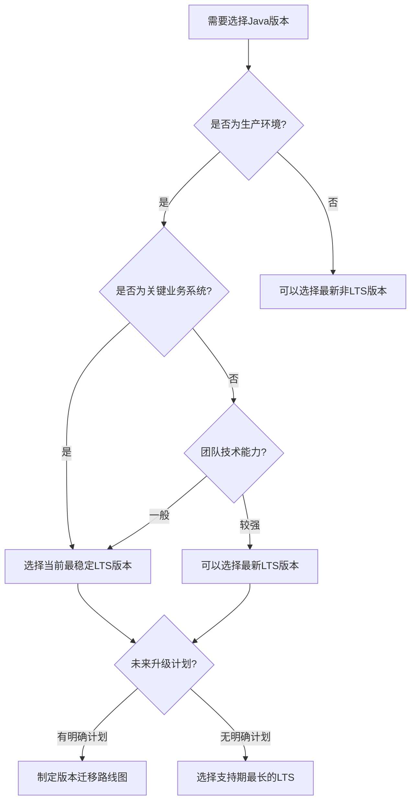

### 开源JDK vs 商业JDK对比

Java SE有多种实现，包括开源和商业版本，它们在许可证、支持服务和特性上有所不同。

**开源JDK：**
- 免费使用，通常基于GPL许可
- 社区驱动的开发和支持
- 可能缺乏商业级别的支持服务
- 例如：OpenJDK、AdoptOpenJDK/Eclipse Temurin

**商业JDK：**
- 通常需要付费订阅或购买许可
- 提供专业的技术支持和服务级别协议(SLA)
- 可能包含额外的性能优化和工具
- 例如：Oracle JDK商业版、Azul Platform Prime、IBM Semeru

**详细对比：**

| 特性 | 开源JDK | 商业JDK |
|------|---------|---------|
| 许可成本 | 免费 | 通常需要付费 |
| 技术支持 | 社区支持，无SLA | 专业支持，有SLA保障 |
| 安全补丁 | 公开发布，可能延迟 | 及时提供，有时提前获取 |
| 性能优化 | 基础优化 | 可能包含额外优化 |
| 监控工具 | 基础工具 | 高级诊断和监控工具 |
| 长期支持 | 取决于社区 | 有合同保障 |
| 法律保障 | 有限 | 通常提供知识产权保障 |

**选择建议：**
- 初创公司和小型项目：开源JDK通常足够
- 大型企业和关键业务：考虑商业JDK的支持和保障
- 高性能要求场景：评估商业JDK的性能优化价值
- 预算有限但需要支持：考虑Azul Zulu等提供商业支持的开源JDK

### Oracle JDK vs OpenJDK vs Azul Zulu等实现比较

Java SE有多种不同的实现，每种都有其特点和适用场景。

**Oracle JDK：**
- Oracle官方发布的Java实现
- 自Java 11起，商业用途需要付费订阅
- 提供全面的技术支持和更新
- 包含一些专有功能和工具

**OpenJDK：**
- Java SE的开源参考实现
- 由Oracle和社区共同维护
- 免费使用，但支持周期较短
- 与Oracle JDK在功能上几乎相同

**Eclipse Temurin (前AdoptOpenJDK)：**
- 由Eclipse基金会维护的OpenJDK发行版
- 提供预构建的二进制文件和长期支持
- 经过全面测试，适合生产环境
- 完全免费，支持多种平台

**Azul Zulu：**
- Azul Systems提供的OpenJDK构建版本
- 提供免费和商业支持两种选择
- 支持更多平台，包括Windows、Linux、macOS和ARM
- 提供长期支持和安全更新

**Amazon Corretto：**
- 亚马逊提供的OpenJDK发行版
- 针对AWS环境优化
- 提供长期支持，无需额外费用
- 适合在AWS云上运行的应用

**GraalVM：**
- Oracle开发的高性能JDK实现
- 支持多语言执行和提前编译(AOT)
- 可以生成本地可执行文件，减少启动时间和内存占用
- 有社区版(免费)和企业版(付费)

**详细功能对比：**

| 特性 | Oracle JDK | OpenJDK | Eclipse Temurin | Azul Zulu | Amazon Corretto | GraalVM |
|------|------------|---------|-----------------|-----------|-----------------|---------|
| 许可 | 商业 | GPL+CE | GPL+CE | GPL+CE/商业 | GPL+CE | GPL+CE/商业 |
| 长期支持 | 8年+ | 6个月 | 4年+ | 10年+ | 4年+ | 取决于版本 |
| 商业支持 | 官方支持 | 社区 | 通过合作伙伴 | 官方支持 | AWS支持 | 官方支持 |
| 平台覆盖 | 广泛 | 有限 | 广泛 | 非常广泛 | 广泛 | 有限 |
| 性能优化 | 高 | 标准 | 标准 | 高 | AWS优化 | 非常高 |
| 云环境集成 | 一般 | 一般 | 一般 | 一般 | AWS优化 | 一般 |
| 容器支持 | 良好 | 良好 | 良好 | 优秀 | 优秀 | 优秀 |
| 原生镜像 | 不支持 | 不支持 | 不支持 | 不支持 | 不支持 | 支持 |

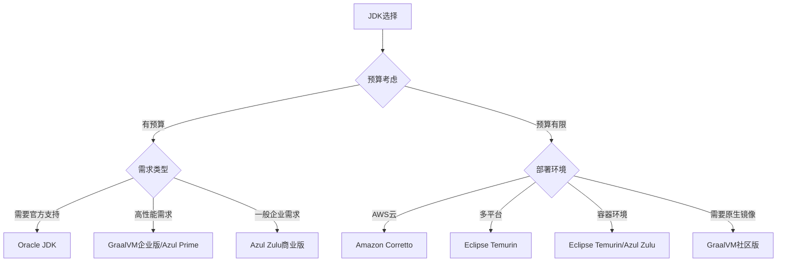

### 企业级应用的JDK版本策略

企业级应用的JDK版本策略需要平衡创新、稳定性、安全性和成本等多方面因素。

**版本标准化策略：**
- 建立企业级JDK版本标准
- 定义明确的版本升级周期和流程
- 建立版本兼容性测试框架
- 制定不同应用类型的版本策略

**多版本共存策略：**
- 核心系统使用稳定LTS版本
- 创新项目可使用较新版本
- 建立版本隔离机制（容器化部署）
- 定义清晰的版本支持矩阵

**版本升级策略：**
1. **评估阶段**：
   - 分析新版本特性和改进
   - 评估对现有系统的影响
   - 成本效益分析

2. **测试阶段**：
   - 兼容性测试
   - 性能基准测试
   - 安全性评估

3. **迁移阶段**：
   - 制定详细迁移计划
   - 分批次升级应用
   - 回滚机制准备

4. **监控阶段**：
   - 性能监控
   - 异常监控
   - 用户反馈收集

**企业JDK版本策略示例：**

| 应用类型 | 推荐JDK版本 | 更新频率 | 支持策略 |
|---------|------------|---------|---------|
| 核心业务系统 | 当前LTS-1 | 2-3年一次 | 全面支持 |
| 内部业务系统 | 当前LTS | 1-2年一次 | 标准支持 |
| 创新项目 | 最新LTS或非LTS | 6-12个月 | 有限支持 |
| 遗留系统 | 原有版本 | 仅安全更新 | 维护支持 |

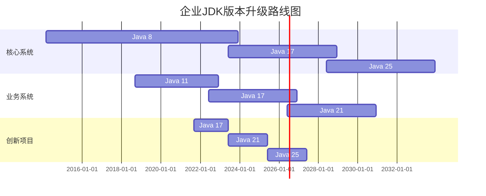

### 新项目JDK版本选择决策框架

为新项目选择合适的JDK版本是一个重要决策，需要考虑多种因素。以下是一个结构化的决策框架：

**1. 需求分析**
- 项目生命周期预期
- 性能和资源要求
- 安全性要求
- 团队技术能力
- 与现有系统集成需求

**2. 技术评估**
- 所需语言特性和API
- 框架和库的兼容性
- 开发工具支持情况
- 部署环境兼容性
- 性能基准测试结果

**3. 风险评估**
- 版本成熟度和稳定性
- 支持周期与项目生命周期匹配度
- 升级路径清晰度
- 技术债务风险
- 供应商锁定风险

**4. 成本分析**
- 许可成本
- 培训成本
- 开发和测试成本
- 运维成本
- 未来升级成本

**决策矩阵示例：**

| 评估因素 | 权重 | Java 8 | Java 11 | Java 17 | Java 21 |
|---------|------|--------|---------|---------|---------|
| 长期支持 | 20% | 5 (2030年) | 4 (2026年) | 5 (2029年) | 5 (2031年) |
| 现代特性 | 15% | 1 (旧) | 3 (中等) | 4 (较新) | 5 (最新) |
| 生态系统支持 | 20% | 5 (成熟) | 4 (良好) | 3 (发展中) | 2 (新兴) |
| 性能 | 15% | 2 (基础) | 3 (改进) | 4 (优化) | 5 (最佳) |
| 团队熟悉度 | 15% | 5 (熟悉) | 3 (部分) | 2 (有限) | 1 (陌生) |
| 未来适应性 | 15% | 1 (有限) | 3 (中等) | 4 (良好) | 5 (最佳) |
| **加权总分** | **100%** | **3.25** | **3.45** | **3.7** | **3.8** |

**决策流程图：**

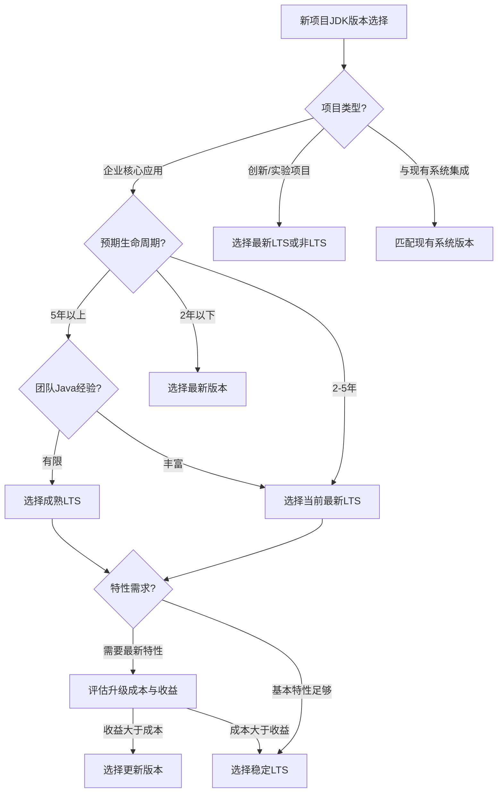

**最佳实践建议：**
- 除非有特殊需求，通常选择最新的LTS版本开始新项目
- 确保所选版本至少有3-5年的支持周期
- 考虑团队学习曲线和培训需求
- 进行概念验证(POC)测试关键功能和性能
- 记录决策理由，便于未来回顾和调整

## Java EE/Jakarta EE平台选择

### Java EE vs Spring生态系统对比

Java企业级应用开发主要有两大技术栈：Java EE/Jakarta EE和Spring生态系统。它们各有优势，适用于不同场景。

**Java EE/Jakarta EE特点：**
- 标准化的企业级Java规范
- 由多个供应商实现，避免厂商锁定
- 完整的企业级功能集
- 强调稳定性和向后兼容性
- 2019年后由Eclipse基金会管理，更名为Jakarta EE

**Spring生态系统特点：**
- 更灵活的非标准化框架
- 由Pivotal(现为VMware)主导开发
- 创新速度快，紧跟技术趋势
- 模块化设计，可按需使用
- 庞大的社区和丰富的第三方集成

**详细对比：**

| 方面 | Java EE/Jakarta EE | Spring生态系统 |
|------|-------------------|---------------|
| 标准化 | 正式标准，多厂商实现 | 事实标准，单一厂商主导 |
| 创新速度 | 较慢，需要规范流程 | 快速，灵活响应市场需求 |
| 学习曲线 | 陡峭，规范庞大 | 中等，文档丰富 |
| 模块化 | Jakarta EE 9+改进 | 高度模块化，按需引入 |
| 微服务支持 | MicroProfile | Spring Boot/Cloud |
| 云原生支持 | 有限，正在改进 | 完善，Spring Cloud生态 |
| 社区活跃度 | 中等 | 非常活跃 |
| 就业市场 | 稳定，传统企业多 | 广泛，创新企业多 |
| 开发效率 | 中等 | 高，约定优于配置 |
| 运行时性能 | 良好 | 良好，但可能有额外开销 |

**适用场景对比：**

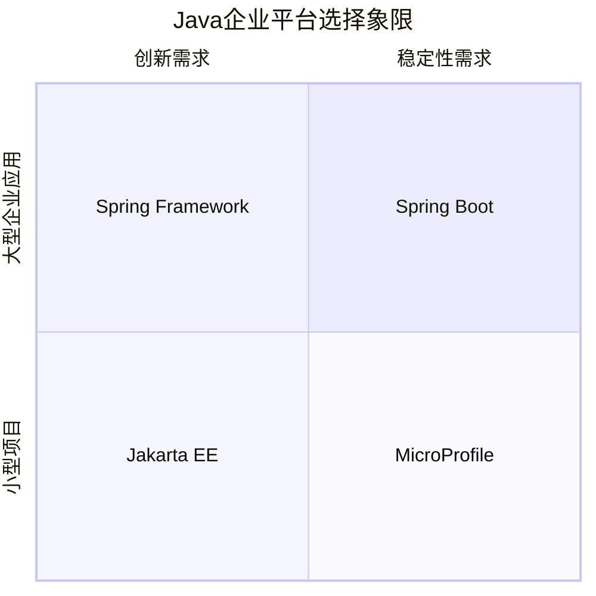

**选择建议：**
- 大型企业应用，强调标准化：Jakarta EE
- 快速迭代的创新项目：Spring Boot
- 微服务架构：Spring Cloud或MicroProfile
- 混合架构：可以共存，按模块选择适合的技术

### 传统应用服务器vs轻量级容器

企业Java应用的部署环境主要分为传统的全功能应用服务器和轻量级容器两大类，它们有着不同的特点和适用场景。

**传统应用服务器特点：**
- 提供完整的Java EE/Jakarta EE实现
- 内置企业级功能（事务管理、安全、消息等）
- 集中式管理和监控
- 通常资源消耗较大
- 例如：WebSphere, WebLogic, JBoss EAP, GlassFish

**轻量级容器特点：**
- 专注于Web容器功能
- 启动快，资源占用少
- 配置简单，易于使用
- 可能需要额外添加企业级功能
- 例如：Tomcat, Jetty, Undertow

**详细对比：**

| 特性 | 传统应用服务器 | 轻量级容器 |
|------|--------------|-----------|
| 资源消耗 | 高 | 低 |
| 启动时间 | 长（分钟级） | 短（秒级） |
| 配置复杂度 | 高 | 低 |
| 功能完整性 | 完整Java EE | 基本Servlet容器 |
| 集群支持 | 内置强大支持 | 基础或需要外部支持 |
| 管理工具 | 完善的管理控制台 | 简单或命令行 |
| 许可成本 | 通常较高 | 多为开源免费 |
| 容器化适应性 | 较差 | 优秀 |
| 微服务适用性 | 较差 | 优秀 |
| 开发便捷性 | 配置繁琐 | 简单直接 |

**性能和资源对比：**

```mermaid
bar
    title 不同服务器资源消耗对比
    x-axis 服务器类型
    y-axis 资源消耗 (相对值)
    "WebSphere" : 100
    "WebLogic" : 95
    "JBoss EAP" : 80
    "WildFly" : 60
    "TomEE" : 50
    "Tomcat" : 30
    "Jetty" : 25
    "Undertow" : 20
```

**选择决策框架：**

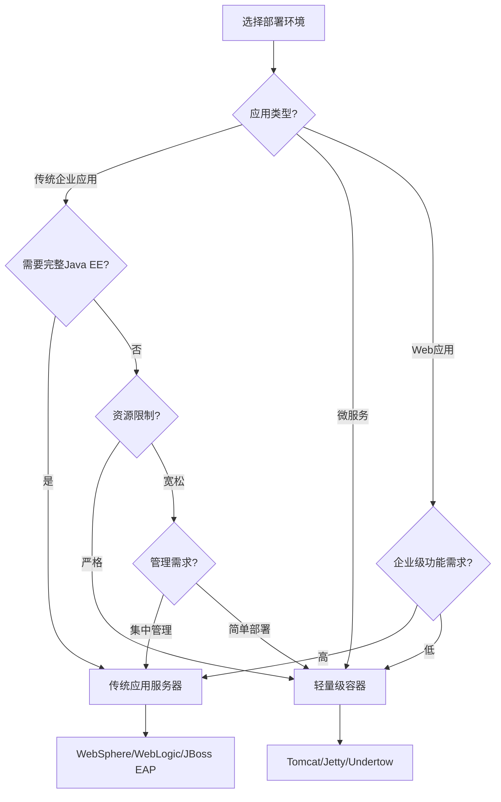

**现代趋势与最佳实践：**
- 容器化部署推动轻量级容器的普及
- Spring Boot等框架使轻量级容器能够支持企业级功能
- 传统应用服务器也在推出轻量级版本（如Liberty Profile）
- 混合策略：关键系统使用应用服务器，边缘服务使用轻量级容器
- 考虑总拥有成本(TCO)而非仅考虑许可成本

### Jakarta EE实现选择(Payara, WildFly, TomEE等)

Jakarta EE（前Java EE）有多种实现，每种都有其特点和优势。选择合适的实现对于项目成功至关重要。

**主要Jakarta EE实现对比：**

**1. WildFly (Red Hat)**
- 开源的Jakarta EE实现，由Red Hat支持
- 高性能，模块化架构
- 商业版为Red Hat JBoss EAP
- 强大的集群和高可用性支持
- 活跃的社区和文档

**2. Payara Server (Payara Foundation)**
- 基于GlassFish的企业级分支
- 提供免费社区版和商业支持版
- 专注于稳定性和安全性
- 提供微服务版本(Payara Micro)
- 良好的云平台集成

**3. TomEE (Apache)**
- 基于Tomcat的Jakarta EE实现
- 轻量级，启动快速
- 保持Tomcat的简单性，添加EE功能
- 适合中小型应用
- Apache许可证，完全开源

**4. GlassFish (Eclipse Foundation)**
- Jakarta EE的参考实现
- 完整实现所有Jakarta EE规范
- 开发者友好，适合学习和测试
- 生产环境支持有限
- Eclipse基金会维护

**5. Open Liberty (IBM)**
- IBM开源的轻量级Jakarta EE服务器
- 高度模块化，按需加载功能
- 快速启动，低内存占用
- 商业版为IBM WebSphere Liberty
- 良好的云原生支持

**6. Eclipse Jetty**
- 轻量级Web容器，可扩展为Jakarta EE容器
- 极低的内存占用
- 嵌入式应用的理想选择
- 不是完整的Jakarta EE实现
- 高度可定制

**详细功能对比：**

| 特性 | WildFly | Payara | TomEE | GlassFish | Open Liberty | Jetty |
|------|---------|--------|-------|-----------|--------------|-------|
| Jakarta EE兼容性 | 完整 | 完整 | 部分 | 完整 | 完整 | 部分 |
| 启动时间 | 中等 | 中等 | 快 | 慢 | 非常快 | 非常快 |
| 内存占用 | 中等 | 中等 | 低 | 高 | 低 | 非常低 |
| 集群支持 | 优秀 | 良好 | 基础 | 中等 | 良好 | 基础 |
| 管理工具 | 完善 | 完善 | 基础 | 完善 | 中等 | 最小 |
| 商业支持 | Red Hat | Payara | 社区 | 有限 | IBM | 社区 |
| 云原生支持 | 良好 | 优秀 | 中等 | 中等 | 优秀 | 良好 |
| 微服务支持 | WildFly Swarm | Payara Micro | TomEE Microprofile | 有限 | Liberty Microprofile | Jetty Runner |
| 开发体验 | 良好 | 良好 | 优秀 | 中等 | 良好 | 基础 |
| 社区活跃度 | 高 | 中等 | 中等 | 低 | 中等 | 高 |

**性能对比（相对值）：**

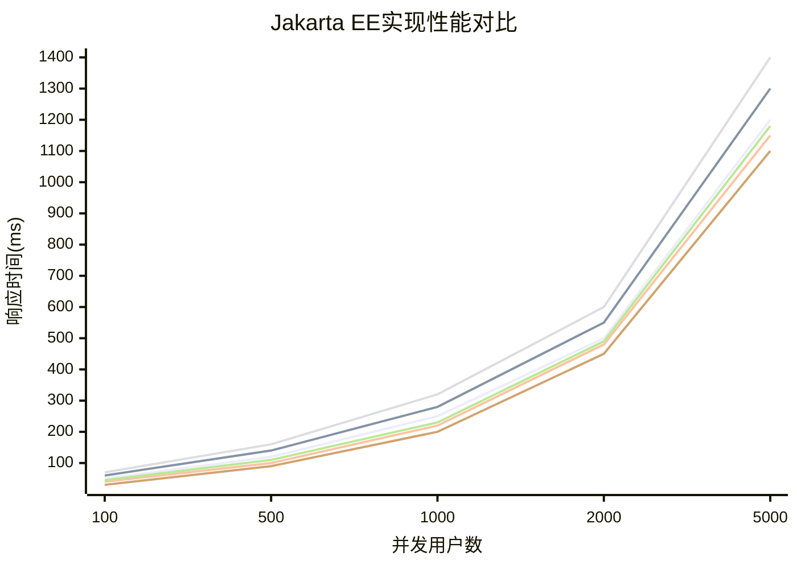

**选择建议：**

| 场景 | 推荐实现 | 原因 |
|------|---------|------|
| 企业级应用 | WildFly/JBoss EAP | 完整功能，商业支持，稳定性 |
| 云原生应用 | Payara/Open Liberty | 良好的云集成，微服务支持 |
| 中小型应用 | TomEE | 轻量级，易于使用，熟悉Tomcat |
| 微服务架构 | Payara Micro/Liberty | 专为微服务优化 |
| 嵌入式应用 | Jetty | 极低资源占用，易于嵌入 |
| 学习测试 | GlassFish | 参考实现，完整功能 |

**最佳实践：**
- 进行概念验证(POC)测试，评估实际性能和兼容性
- 考虑团队熟悉度和学习曲线
- 评估长期支持和社区活跃度
- 考虑与现有技术栈的集成
- 权衡商业支持需求与开源灵活性

### 微服务架构中的Java EE定位

随着微服务架构的兴起，传统的Java EE平台也在适应这一变化。了解Java EE/Jakarta EE在微服务架构中的定位对于技术选型至关重要。

**Java EE与微服务的演进：**
- 传统Java EE设计偏向单体应用
- MicroProfile规范的出现弥补了微服务领域的不足
- Jakarta EE 9+开始更好地支持云原生和微服务架构
- 各实现厂商推出了微服务专用版本

**MicroProfile与Jakarta EE的关系：**
- MicroProfile是对Jakarta EE的补充，专注于微服务
- 提供配置、容错、指标、健康检查等微服务必要功能
- 许多Jakarta EE实现同时支持MicroProfile
- 两者正在逐步融合，相互借鉴

**Java EE微服务实现对比：**

| 实现 | 微服务支持 | 特点 |
|------|-----------|------|
| Payara Micro | 优秀 | 基于Payara Server，支持MicroProfile，可嵌入JAR |
| WildFly Swarm/Thorntail | 良好 | 基于WildFly，按需打包依赖 |
| Open Liberty | 优秀 | 模块化设计，快速启动，低内存占用 |
| Helidon | 专为微服
让我继续完成关于微服务架构中的Java EE定位部分：

**Java EE微服务实现对比：**

| 实现 | 微服务支持 | 特点 |
|------|-----------|------|
| Payara Micro | 优秀 | 基于Payara Server，支持MicroProfile，可嵌入JAR |
| WildFly Swarm/Thorntail | 良好 | 基于WildFly，按需打包依赖 |
| Open Liberty | 优秀 | 模块化设计，快速启动，低内存占用 |
| Helidon | 专为微服务 | Oracle开发，支持MicroProfile和反应式编程 |
| KumuluzEE | 专为微服务 | 轻量级框架，专注于云原生微服务 |
| TomEE Microprofile | 良好 | 基于TomEE，实现MicroProfile规范 |

**Java EE微服务架构模式：**

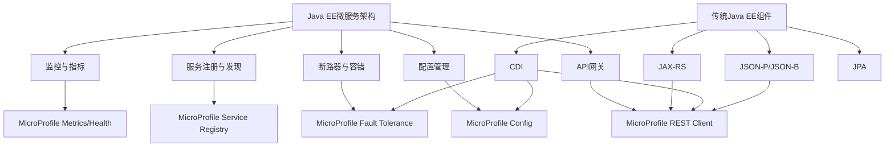

**Java EE微服务与Spring Boot对比：**

| 方面 | Java EE/MicroProfile | Spring Boot |
|------|---------------------|-------------|
| 标准化 | 正式标准，多厂商实现 | 事实标准，单一厂商 |
| 生态系统 | 相对较小，但在增长 | 庞大，成熟 |
| 启动时间 | 较慢，但新实现有改进 | 快速 |
| 开发体验 | 配置较多，但在简化 | 简单，约定优于配置 |
| 云原生支持 | 通过MicroProfile改进 | 原生支持，Spring Cloud |
| 社区支持 | 企业支持强，社区中等 | 社区非常活跃 |
| 学习曲线 | 中等到陡峭 | 中等 |
| 部署灵活性 | 多种服务器选择 | 内嵌服务器，独立部署 |

**Java EE微服务最佳实践：**

1. **轻量级部署**
   - 使用专为微服务设计的容器（如Payara Micro）
   - 利用Jlink创建自定义运行时映像减小体积
   - 采用Docker容器化部署

2. **API设计**
   - 使用JAX-RS构建RESTful API
   - 采用JSON-B进行数据序列化
   - 实现API版本控制策略
   - 使用OpenAPI规范文档化API

3. **服务通信**
   - 使用MicroProfile REST Client简化服务调用
   - 实现异步通信模式
   - 考虑使用消息队列解耦服务

4. **弹性设计**
   - 使用MicroProfile Fault Tolerance实现断路器
   - 实现重试、超时和舱壁模式
   - 设计无状态服务便于扩展

5. **配置与发现**
   - 使用MicroProfile Config外部化配置
   - 实现服务注册与发现
   - 集中式配置管理

6. **监控与可观测性**
   - 实现健康检查端点
   - 使用MicroProfile Metrics收集指标
   - 集成分布式追踪系统

**选择建议：**
- 已有Java EE经验的团队：考虑MicroProfile实现
- 需要标准化和避免厂商锁定：选择Jakarta EE/MicroProfile
- 需要快速开发和丰富生态：考虑Spring Boot
- 混合架构：可以在同一系统中混合使用不同技术栈

### 云原生环境中的Java EE应用

随着云计算的普及，Java EE/Jakarta EE也在向云原生方向发展。了解如何在云环境中有效部署和运行Java EE应用对于现代企业至关重要。

**云原生Java EE的挑战：**
- 传统Java EE应用通常资源消耗大
- 启动时间长，不适合动态扩展
- 配置管理复杂，难以外部化
- 状态管理与云环境的无状态理念冲突

**Jakarta EE的云原生转型：**
- Jakarta EE 9+简化了核心API
- 移除了过时的规范，减轻了负担
- 更好地支持模块化和轻量级部署
- MicroProfile补充了云原生功能

**云原生Java EE实现策略：**

1. **容器化部署**
   - 使用Docker容器封装Java EE应用
   - 优化容器镜像大小和启动时间
   - 实现健康检查和优雅关闭
   - 使用多阶段构建减小镜像体积

   ```dockerfile
   # 多阶段构建示例
   FROM payara/server-full:5.2022.2 AS build
   COPY --chown=payara:payara myapp.war ${DEPLOY_DIR}
   RUN asadmin start-domain && \
       asadmin deploy --availabilityenabled=true ${DEPLOY_DIR}/myapp.war && \
       asadmin stop-domain

   FROM payara/server-full:5.2022.2
   COPY --from=build ${PAYARA_DIR}/glassfish/domains/domain1 ${PAYARA_DIR}/glassfish/domains/domain1
   HEALTHCHECK --interval=5s --timeout=3s CMD curl -f http://localhost:8080/myapp/health || exit 1
   ```

2. **Kubernetes部署**
   - 使用Kubernetes编排Java EE容器
   - 实现自动扩展和自愈能力
   - 利用ConfigMaps和Secrets管理配置
   - 使用Operators简化管理

   ```yaml
   # Kubernetes部署示例
   apiVersion: apps/v1
   kind: Deployment
   metadata:
     name: javaee-app
   spec:
     replicas: 3
     selector:
       matchLabels:
         app: javaee-app
     template:
       metadata:
         labels:
           app: javaee-app
       spec:
         containers:
         - name: javaee-app
           image: myregistry/javaee-app:1.0
           ports:
           - containerPort: 8080
           livenessProbe:
             httpGet:
               path: /health
               port: 8080
           readinessProbe:
             httpGet:
               path: /health/ready
               port: 8080
           env:
           - name: DB_URL
             valueFrom:
               configMapKeyRef:
                 name: app-config
                 key: db.url
   ```

3. **云原生功能实现**
   - 使用MicroProfile Config管理配置
   - 实现健康检查和指标收集
   - 使用分布式追踪监控服务调用
   - 实现弹性模式和容错机制

   ```java
   @Path("/orders")
   @ApplicationScoped
   public class OrderResource {
       
       @Inject
       @ConfigProperty(name = "service.payment.url")
       private String paymentServiceUrl;
       
       @Inject
       @RestClient
       private PaymentService paymentService;
       
       @GET
       @Path("/{id}")
       @Produces(MediaType.APPLICATION_JSON)
       @Retry(maxRetries = 3)
       @Timeout(500)
       @Fallback(fallbackMethod = "getOrderFallback")
       public Response getOrder(@PathParam("id") long id) {
           // 实现获取订单逻辑
       }
       
       public Response getOrderFallback(long id) {
           // 降级逻辑
       }
       
       @GET
       @Path("/health")
       @Health
       public Response healthCheck() {
           // 健康检查实现
       }
   }
   ```

4. **无状态设计**
   - 避免使用HTTP会话状态
   - 使用分布式缓存替代本地缓存
   - 实现幂等API设计
   - 使用外部存储持久化状态

5. **云服务集成**
   - 使用云数据库服务替代自管理数据库
   - 集成云消息服务实现异步通信
   - 利用云监控和日志服务
   - 使用云身份认证服务

**云平台部署对比：**

| 云平台 | Java EE支持 | 部署选项 | 特点 |
|-------|------------|---------|------|
| AWS | 良好 | Elastic Beanstalk, ECS, EKS | 完整生态系统，多种部署选项 |
| Azure | 良好 | App Service, AKS | 与Microsoft工具集成良好 |
| Google Cloud | 中等 | GKE, Cloud Run | Kubernetes原生支持强 |
| IBM Cloud | 优秀 | WebSphere服务, IKS | 传统Java EE支持最佳 |
| Oracle Cloud | 优秀 | WebLogic服务, OKE | 与Oracle中间件集成良好 |

**性能优化策略：**

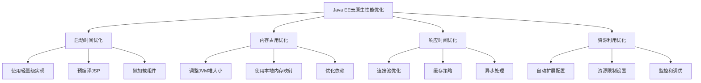

**最佳实践建议：**
- 从单体应用逐步迁移到云原生架构
- 使用专为云设计的Java EE实现
- 实施DevOps和CI/CD流程
- 采用基础设施即代码(IaC)管理云资源
- 实现全面的监控和可观测性
- 定期进行性能测试和优化

## 特定领域Java技术选型

### 大数据处理：Hadoop生态vs Spark

在大数据处理领域，Java平台提供了多种成熟的解决方案，其中Hadoop生态系统和Apache Spark是两个主要选择。了解它们的特点和适用场景对于大数据项目至关重要。

**Hadoop生态系统概述：**
- 基于MapReduce编程模型
- 分布式文件系统HDFS
- 包含多个子项目：Hive, HBase, Pig等
- 批处理为主，流处理能力有限
- 成熟稳定，广泛部署

**Apache Spark概述：**
- 基于内存计算的统一分析引擎
- 支持批处理、流处理、机器学习和图计算
- 提供高级API：Spark SQL, Streaming, MLlib, GraphX
- 性能通常优于Hadoop MapReduce
- 与Hadoop兼容，可以读写HDFS

**详细技术对比：**

| 特性 | Hadoop生态 | Apache Spark |
|------|-----------|-------------|
| 处理模型 | MapReduce批处理 | 统一批处理和流处理 |
| 性能 | 磁盘IO密集，较慢 | 内存计算，更快 |
| 易用性 | 复杂，低级API | 简单，高级API |
| 容错性 | 高，数据复制 | 高，RDD血统 |
| 实时处理 | 有限(需Storm等) | 原生支持(Spark Streaming) |
| 机器学习 | 需Mahout等 | 内置MLlib |
| 资源需求 | 磁盘为主，内存要求低 | 内存密集 |
| 生态系统 | 非常庞大成熟 | 相对较新但增长快 |
| 学习曲线 | 陡峭 | 中等 |
| 社区活跃度 | 稳定 | 非常活跃 |

**性能对比（相对值）：**

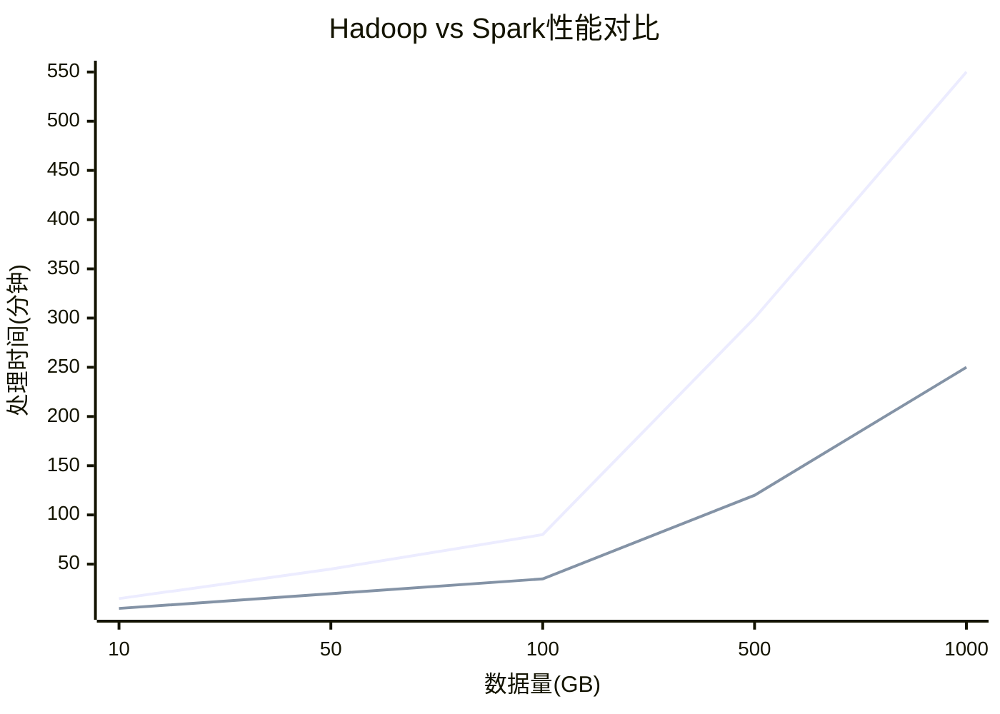

**适用场景对比：**

| 场景 | Hadoop生态 | Apache Spark | 推荐选择 |
|------|-----------|-------------|---------|
| 批量ETL | 适合 | 适合 | Spark(更快) |
| 实时分析 | 不适合 | 非常适合 | Spark |
| 机器学习 | 有限支持 | 优秀支持 | Spark |
| 图计算 | 需第三方 | 内置GraphX | Spark |
| 超大数据集 | 非常适合 | 受内存限制 | Hadoop |
| 低成本存储 | HDFS优秀 | 依赖外部存储 | Hadoop |
| 复杂ETL管道 | 成熟工具链 | 需定制开发 | Hadoop |
| 流处理 | 需Storm/Flink | Structured Streaming | Spark |

**代码示例对比：**

Hadoop MapReduce示例：
```java
public class WordCount {
    public static class TokenizerMapper extends Mapper<Object, Text, Text, IntWritable> {
        private final static IntWritable one = new IntWritable(1);
        private Text word = new Text();
        
        public void map(Object key, Text value, Context context) throws IOException, InterruptedException {
            StringTokenizer itr = new StringTokenizer(value.toString());
            while (itr.hasMoreTokens()) {
                word.set(itr.nextToken());
                context.write(word, one);
            }
        }
    }
    
    public static class IntSumReducer extends Reducer<Text, IntWritable, Text, IntWritable> {
        private IntWritable result = new IntWritable();
        
        public void reduce(Text key, Iterable<IntWritable> values, Context context) 
                throws IOException, InterruptedException {
            int sum = 0;
            for (IntWritable val : values) {
                sum += val.get();
            }
            result.set(sum);
            context.write(key, result);
        }
    }
    
    // 主方法配置作业
}
```

Spark示例：
```java
import org.apache.spark.api.java.JavaPairRDD;
import org.apache.spark.api.java.JavaRDD;
import org.apache.spark.api.java.JavaSparkContext;
import scala.Tuple2;

JavaSparkContext sc = new JavaSparkContext("local", "WordCount");
JavaRDD<String> textFile = sc.textFile("hdfs://...");
JavaRDD<String> words = textFile.flatMap(s -> Arrays.asList(s.split(" ")).iterator());
JavaPairRDD<String, Integer> pairs = words.mapToPair(s -> new Tuple2<>(s, 1));
JavaPairRDD<String, Integer> counts = pairs.reduceByKey((a, b) -> a + b);
counts.saveAsTextFile("hdfs://...");
```

**架构对比：**

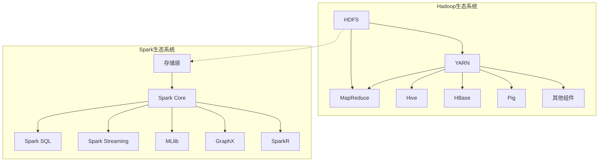

**选择决策框架：**

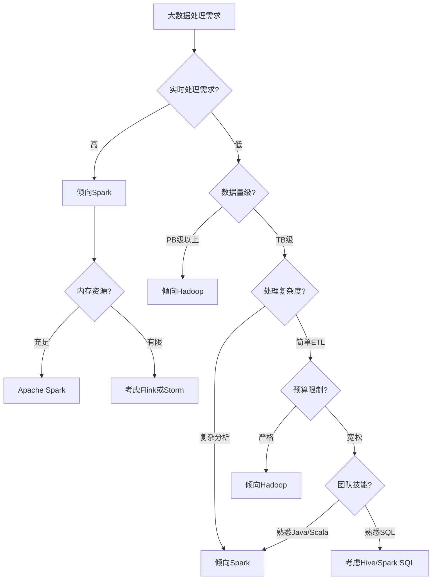

**最佳实践建议：**
- 混合使用：HDFS存储+Spark处理是常见组合
- 根据具体任务选择合适的工具
- 考虑团队技能和学习曲线
- 评估硬件资源，特别是内存需求
- 从小规模概念验证开始，逐步扩展
- 关注数据安全和治理需求

### 响应式编程：RxJava vs Project Reactor

响应式编程已成为处理异步数据流和构建高响应性应用的重要范式。在Java生态系统中，RxJava和Project Reactor是两个主要的响应式编程库。

**响应式编程概述：**
- 基于观察者模式的异步数据流处理
- 声明式而非命令式编程风格
- 专注于数据流和变化传播
- 适合高并发、低延迟系统
- 遵循响应式宣言(Reactive Manifesto)原则

**RxJava概述：**
- Netflix开发的响应式扩展(ReactiveX)的Java实现
- 跨语言实现，有多种编程语言版本
- 丰富的操作符集合
- 支持多种并发模型
- 广泛应用于Android开发

**Project Reactor概述：**
- Pivotal开发，Spring WebFlux的基础
- 专为Java 8+设计
- 完全支持响应式流规范
- 与Spring生态系统深度集成
- 专注于服务器端应用

**详细技术对比：**

| 特性 | RxJava | Project Reactor |
|------|--------|-----------------|
| 核心类型 | Observable, Flowable | Mono, Flux |
| 背压支持 | Flowable支持，Observable不支持 | 完全支持 |
| 操作符丰富度 | 非常丰富 | 丰富 |
| 学习曲线 | 陡峭 | 中等 |
| 错误处理 | 丰富的错误处理机制 | 丰富的错误处理机制 |
| 调试支持 | 良好 | 优秀，钩子和追踪支持 |
| 内存效率 | 良好 | 优秀，专注于效率 |
| 生态系统 | 广泛，跨平台 | 主要与Spring集成 |
| 社区支持 | 活跃，成熟 | 活跃，增长快 |
| 适用场景 | 通用，特别是Android | 服务器端，Spring应用 |

**代码示例对比：**

RxJava示例：
```java
import io.reactivex.rxjava3.core.Flowable;

Flowable.fromArray("Hello", "World")
    .map(String::toUpperCase)
    .filter(s -> s.length() > 4)
    .subscribe(
        data -> System.out.println("Received: " + data),
        error -> System.err.println("Error: " + error),
        () -> System.out.println("Completed")
    );
```

Project Reactor示例：
```java
import reactor.core.publisher.Flux;

Flux.just("Hello", "World")
    .map(String::toUpperCase)
    .filter(s -> s.length() > 4)
    .subscribe(
        data -> System.out.println("Received: " + data),
        error -> System.err.println("Error: " + error),
        () -> System.out.println("Completed")
    );
```

**性能对比：**

```mermaid
bar
    title "响应式库性能对比（相对值，越低越好）"
    x-axis 操作类型
    y-axis 执行时间(ms)
    "简单映射" RxJava:120 Reactor:100
    "过滤操作" RxJava:110 Reactor:95
    "合并流" RxJava:150 Reactor:130
    "背压处理" RxJava:180 Reactor:140
    "错误恢复" RxJava:130 Reactor:120
```

**适用场景对比：**

| 场景 | RxJava | Project Reactor | 推荐选择 |
|------|--------|-----------------|---------|
| Spring WebFlux应用 | 适合 | 非常适合 | Reactor |
| Android应用 | 非常适合 | 不适合 | RxJava |
| 微服务后端 | 适合 | 非常适合 | Reactor |
| 跨平台库 | 非常适合 | 适合 | RxJava |
| 高性能数据处理 | 适合 | 非常适合 | Reactor |
| 事件驱动系统 | 非常适合 | 适合 | RxJava |
| 与Spring集成 | 适合 | 非常适合 | Reactor |
| 复杂异步流程 | 非常适合 | 适合 | RxJava |

**选择决策框架：**

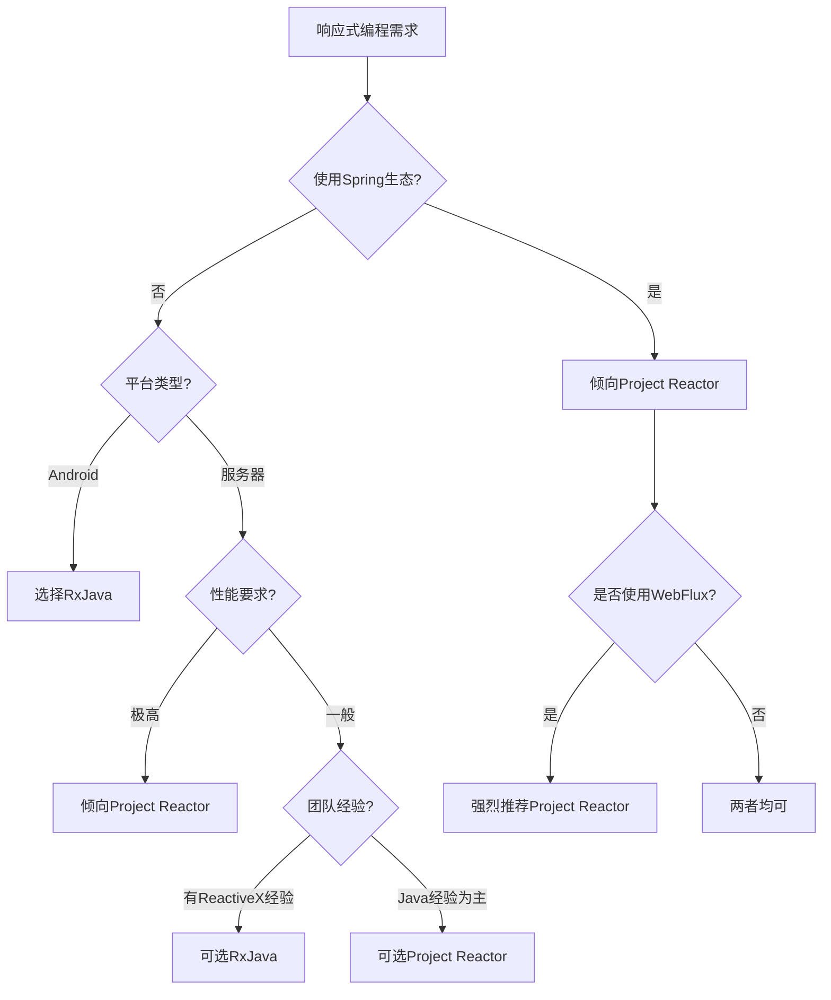

**最佳实践建议：**
- Spring生态系统中优先选择Project Reactor
- Android开发中选择RxJava
- 关注背压处理，特别是处理大量数据时
- 使用适当的调度器管理并发
- 实施错误处理策略
- 避免过度使用响应式编程，简单场景使用CompletableFuture可能更合适
- 考虑测试和调试的复杂性

### 微服务框架：Spring Boot vs Quarkus vs Micronaut

微服务架构已成为现代应用开发的主流范式，Java生态系统提供了多种成熟的微服务框架。了解Spring Boot、Quarkus和Micronaut的特点和适用场景对于技术选型至关重要。

**Spring Boot概述：**
- Pivotal(现为VMware)开发的轻量级框架
- 基于Spring框架，简化配置和部署
- 庞大的生态系统和社区支持
- 约定优于配置的理念
- 广泛的企业采用率

**Quarkus概述：**
- Red Hat开发的Kubernetes原生Java框架
- 专为GraalVM和HotSpot优化
- 极低的内存占用和快速启动时间
- 支持命令式和响应式编程模型
- 强调开发者体验和云原生部署

**Micronaut概述：**
- Object Computing Inc.开发的JVM微服务框架
- 设计用于克服Spring的反射依赖
- 编译时依赖注入和AOP
- 低内存占用和快速启动时间
- 内置云原生特性

**详细技术对比：**

| 特性 | Spring Boot | Quarkus | Micronaut |
|------|-------------|---------|-----------|
| 启动时间 | 较慢 | 非常快 | 非常快 |
| 内存占用 | 较高 | 低 | 低 |
| 依赖注入 | 运行时(反射) | 构建时 | 编译时 |
| 热重载 | 支持 | 优秀支持 | 支持 |
| 原生镜像支持 | 有限 | 优秀 | 良好 |
| 响应式支持 | WebFlux | Mutiny | Reactor |
| 社区规模 | 非常大 | 中等，增长快 | 小，但活跃 |
| 学习曲线 | 中等 | 中等 | 中等 |
| 文档质量 | 优秀 | 良好 | 良好 |
| 企业支持 | VMware | Red Hat | 商业支持 |
| 生态系统 | 庞大 | 增长中 | 小但增长 |
| 云原生支持 | 良好 | 优秀 | 优秀 |

**性能对比：**

```mermaid
bar
    title "微服务框架性能对比"
    x-axis 指标
    y-axis 相对值(越低越好)
    "启动时间(秒)" SpringBoot:10.5 Quarkus:0.8 Micronaut:1.2
    "内存占用(MB)" SpringBoot:140 Quarkus:25 Micronaut:30
    "首次响应时间(ms)" SpringBoot:220 Quarkus:12 Micronaut:15
    "吞吐量(相对值)" SpringBoot:100 Quarkus:115 Micronaut:110
```

**原生镜像性能对比：**

```mermaid
bar
    title "原生镜像性能对比"
    x-axis 指标
    y-axis 相对值(越低越好)
    "启动时间(ms)" SpringBoot:1500 Quarkus:15 Micronaut:20
    "内存占用(MB)" SpringBoot:90 Quarkus:20 Micronaut:25
    "构建时间(分钟)" SpringBoot:15 Quarkus:5 Micronaut:7
```

**代码示例对比：**

Spring Boot示例：
```java
import org.springframework.boot.SpringApplication;
import org.springframework.boot.autoconfigure.SpringBootApplication;
import org.springframework.web.bind.annotation.GetMapping;
import org.springframework.web.bind.annotation.RestController;

@SpringBootApplication
public class Application {
    public static void main(String[] args) {
        SpringApplication.run(Application.class, args);
    }
}

@RestController
class HelloController {
    @GetMapping("/hello")
    public String hello() {
        return "Hello, World!";
    }
}
```

Quarkus示例：
```java
import javax.ws.rs.GET;
import javax.ws.rs.Path;
import javax.ws.rs.Produces;
import javax.ws.rs.core.MediaType;

@Path("/hello")
public class HelloResource {
    @GET
    @Produces(MediaType.TEXT_PLAIN)
    public String
让我继续完成微服务框架的对比内容：

Quarkus示例：
```java
import javax.ws.rs.GET;
import javax.ws.rs.Path;
import javax.ws.rs.Produces;
import javax.ws.rs.core.MediaType;

@Path("/hello")
public class HelloResource {
    @GET
    @Produces(MediaType.TEXT_PLAIN)
    public String hello() {
        return "Hello, World!";
    }
}
```

Micronaut示例：
```java
import io.micronaut.http.annotation.Controller;
import io.micronaut.http.annotation.Get;

@Controller("/hello")
public class HelloController {
    @Get
    public String hello() {
        return "Hello, World!";
    }
}
```

**适用场景对比：**

| 场景 | Spring Boot | Quarkus | Micronaut | 推荐选择 |
|------|-------------|---------|-----------|---------|
| 传统企业应用 | 非常适合 | 适合 | 适合 | Spring Boot |
| Kubernetes部署 | 适合 | 非常适合 | 非常适合 | Quarkus |
| Serverless函数 | 不太适合 | 非常适合 | 非常适合 | Quarkus/Micronaut |
| 微服务架构 | 适合 | 非常适合 | 非常适合 | 取决于生态需求 |
| 资源受限环境 | 不太适合 | 非常适合 | 非常适合 | Quarkus |
| 已有Spring技能 | 非常适合 | 适合 | 较难适应 | Spring Boot |
| 需要丰富生态 | 非常适合 | 适合 | 适合 | Spring Boot |
| 需要极致性能 | 不太适合 | 非常适合 | 非常适合 | Quarkus |

**选择决策框架：**

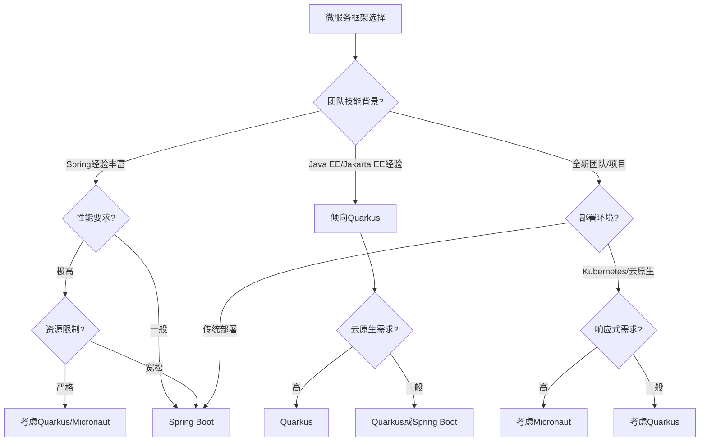

**最佳实践建议：**
- 已有Spring生态投资的团队：继续使用Spring Boot
- 新项目且关注云原生：考虑Quarkus或Micronaut
- 资源受限环境（如IoT、边缘计算）：优先考虑Quarkus
- 需要快速启动时间（如Serverless）：Quarkus或Micronaut
- 混合架构：可以在同一系统中使用不同框架
- 进行概念验证(POC)测试实际性能和开发体验
- 考虑长期维护和团队技能培养成本

### 云原生应用：Spring Cloud vs MicroProfile

随着云原生架构的普及，Java生态系统提供了多种框架来支持分布式系统的开发。Spring Cloud和MicroProfile是两个主要的云原生框架集合，各有特点和适用场景。

**Spring Cloud概述：**
- 基于Spring Boot的分布式系统工具集
- 提供服务发现、配置管理、断路器等功能
- 与Netflix OSS深度集成
- 丰富的组件生态系统
- 广泛的企业采用

**MicroProfile概述：**
- 基于Jakarta EE的微服务规范
- 多厂商支持的开放标准
- 专注于企业级微服务功能
- 轻量级设计
- 避免厂商锁定

**详细技术对比：**

| 特性 | Spring Cloud | MicroProfile |
|------|--------------|--------------|
| 标准化 | 事实标准 | 正式标准 |
| 服务发现 | Eureka, Consul, Zookeeper | MicroProfile Service Registry |
| 配置管理 | Spring Cloud Config | MicroProfile Config |
| 断路器 | Resilience4j, Hystrix | MicroProfile Fault Tolerance |
| API文档 | SpringDoc, Swagger | MicroProfile OpenAPI |
| 客户端负载均衡 | Spring Cloud LoadBalancer | MicroProfile Rest Client |
| 分布式追踪 | Spring Cloud Sleuth | MicroProfile Telemetry |
| 安全 | Spring Security | MicroProfile JWT |
| 实现 | Spring生态 | Quarkus, Open Liberty, Payara等 |
| 学习曲线 | 陡峭 | 中等 |
| 社区规模 | 非常大 | 中等 |
| 更新频率 | 快速 | 稳定 |

**架构对比：**

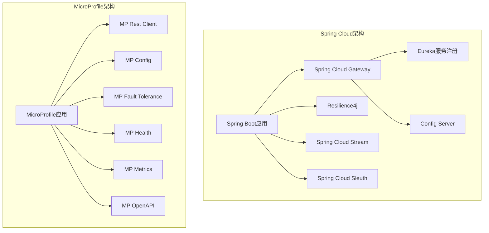

**代码示例对比：**

Spring Cloud服务发现示例：
```java
// 服务注册
@SpringBootApplication
@EnableEurekaServer
public class ServiceRegistryApplication {
    public static void main(String[] args) {
        SpringApplication.run(ServiceRegistryApplication.class, args);
    }
}

// 服务消费者
@SpringBootApplication
@EnableDiscoveryClient
public class ServiceConsumerApplication {
    @Bean
    @LoadBalanced
    public RestTemplate restTemplate() {
        return new RestTemplate();
    }
}

@Service
class UserService {
    @Autowired
    private RestTemplate restTemplate;
    
    public User getUser(Long id) {
        return restTemplate.getForObject("http://user-service/users/" + id, User.class);
    }
}
```

MicroProfile服务发现示例：
```java
@ApplicationScoped
public class UserService {
    @Inject
    @RestClient
    private UserClient userClient;
    
    public User getUser(Long id) {
        return userClient.getUser(id);
    }
}

@RegisterRestClient(baseUri = "http://user-service")
public interface UserClient {
    @GET
    @Path("/users/{id}")
    User getUser(@PathParam("id") Long id);
}
```

**适用场景对比：**

| 场景 | Spring Cloud | MicroProfile | 推荐选择 |
|------|--------------|--------------|---------|
| 已有Spring生态 | 非常适合 | 适合 | Spring Cloud |
| 多厂商环境 | 适合 | 非常适合 | MicroProfile |
| 需要标准化 | 不太适合 | 非常适合 | MicroProfile |
| 快速开发 | 非常适合 | 适合 | Spring Cloud |
| 轻量级部署 | 适合 | 非常适合 | MicroProfile |
| 云原生部署 | 非常适合 | 非常适合 | 两者均可 |
| 需要丰富组件 | 非常适合 | 适合 | Spring Cloud |
| 避免厂商锁定 | 不太适合 | 非常适合 | MicroProfile |

**选择决策框架：**

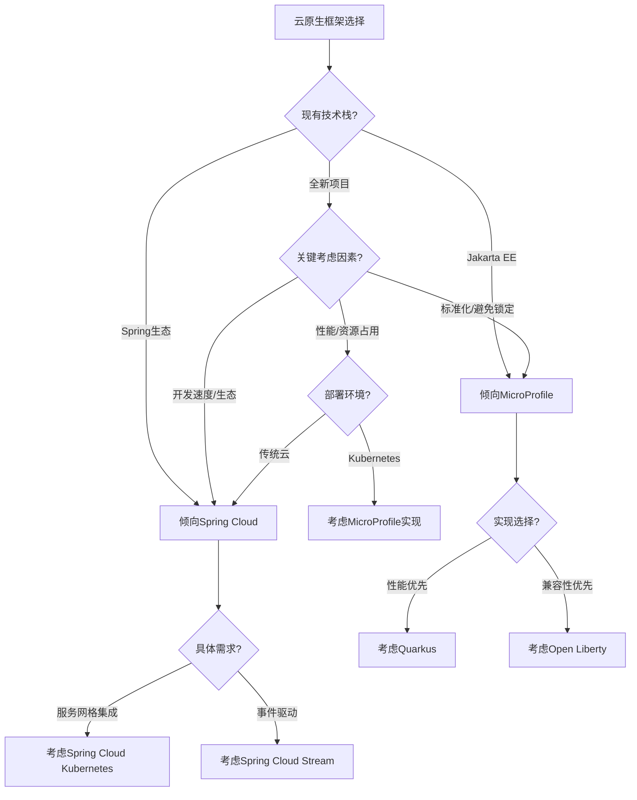

**最佳实践建议：**
- 已有Spring Boot应用：选择Spring Cloud扩展
- 需要标准化和可移植性：选择MicroProfile
- 考虑混合使用：核心服务使用MicroProfile，边缘服务使用Spring Cloud
- 关注云平台集成能力
- 评估运维复杂度和团队技能
- 考虑服务网格(如Istio)与微服务框架的结合
- 进行概念验证测试验证实际性能和开发体验

### 实时系统：Java RT vs 普通Java应用

在需要确定性响应时间的实时系统中，Java平台提供了专门的解决方案。了解Java RT(实时Java)与普通Java应用的区别对于特定领域应用至关重要。

**Java RT概述：**
- 实时规范(RTSJ)的Java实现
- 提供确定性垃圾回收
- 支持优先级调度
- 提供实时线程和内存区域
- 适用于硬实时和软实时系统

**普通Java应用概述：**
- 标准JVM实现
- 非确定性垃圾回收
- 通用线程调度
- 适用于大多数企业应用
- 不保证实时响应

**详细技术对比：**

| 特性 | Java RT | 普通Java应用 |
|------|---------|-------------|
| 垃圾回收 | 确定性GC | 非确定性GC |
| 线程调度 | 实时调度 | 普通调度 |
| 内存管理 | 支持不受GC影响的内存区域 | 全部受GC管理 |
| 响应时间 | 可预测，低延迟 | 不可预测，可能有停顿 |
| 吞吐量 | 通常较低 | 通常较高 |
| 硬件要求 | 通常较高 | 较低 |
| 开发复杂度 | 高 | 中等 |
| 生态系统 | 有限 | 丰富 |
| 适用场景 | 控制系统，金融交易 | 企业应用，Web系统 |
| 实现 | Azul Zing, JamaicaVM, aicas JamaicaVM | HotSpot, OpenJ9等 |

**性能特性对比：**

```mermaid
xychart-beta
    title "Java RT vs 普通Java响应时间分布"
    x-axis "响应时间(ms)" [1, 5, 10, 15, 20, 25, 30, 35, 40]
    y-axis "请求百分比" 
    line "Java RT" [5, 30, 40, 20, 5, 0, 0, 0, 0]
    line "普通Java" [0, 5, 15, 25, 20, 15, 10, 5, 5]
```

**适用场景对比：**

| 场景 | Java RT | 普通Java | 推荐选择 |
|------|---------|---------|---------|
| 工业控制系统 | 非常适合 | 不适合 | Java RT |
| 金融交易系统 | 非常适合 | 适合 | 取决于延迟要求 |
| 电信系统 | 非常适合 | 适合 | 取决于SLA |
| 航空航天系统 | 非常适合 | 不适合 | Java RT |
| 企业信息系统 | 不太适合 | 非常适合 | 普通Java |
| Web应用 | 不适合 | 非常适合 | 普通Java |
| 游戏服务器 | 适合 | 适合 | 取决于游戏类型 |
| IoT边缘计算 | 非常适合 | 适合 | 取决于实时要求 |

**代码示例对比：**

普通Java线程示例：
```java
public class StandardThreadExample {
    public static void main(String[] args) {
        Thread thread = new Thread(() -> {
            while (true) {
                processData();
                try {
                    Thread.sleep(100);  // 可能被打断，不精确
                } catch (InterruptedException e) {
                    Thread.currentThread().interrupt();
                    break;
                }
            }
        });
        thread.start();
    }
    
    private static void processData() {
        // 处理数据，可能被GC打断
    }
}
```

Java RT线程示例：
```java
import javax.realtime.*;

public class RealtimeThreadExample {
    public static void main(String[] args) {
        PriorityParameters priority = new PriorityParameters(
            PriorityScheduler.instance().getMaxPriority());
        PeriodicParameters period = new PeriodicParameters(null, new RelativeTime(100, 0));
        
        RealtimeThread rtThread = new RealtimeThread(priority, period) {
            public void run() {
                while (true) {
                    processData();
                    waitForNextPeriod();  // 精确的周期执行
                }
            }
        };
        rtThread.start();
    }
    
    private static void processData() {
        // 实时处理，不会被GC打断
    }
}
```

**内存管理对比：**

```mermaid
graph TD
    subgraph "普通Java内存管理"
        A[Java堆] --> B[年轻代]
        A --> C[老年代]
        B --> D[Eden]
        B --> E[Survivor]
        F[GC] --> A
    end
    
    subgraph "Java RT内存管理"
        G[Java堆] --> H[年轻代]
        G --> I[老年代]
        J[不受GC影响的内存区域] --> K[ImmortalMemory]
        J --> L[ScopedMemory]
        M[确定性GC] --> G
    end
```

**选择决策框架：**

```mermaid
flowchart TD
    A[实时系统需求] --> B{响应时间要求?}
    B -->|硬实时| C[Java RT]
    B -->|软实时| D{延迟容忍度?}
    B -->|非实时| E[普通Java]
    
    D -->|低延迟,低抖动| F{预算和资源?}
    D -->|可接受偶尔延迟| G[考虑优化的普通Java]
    
    F -->|充足| H[Java RT]
    F -->|有限| I[优化的普通Java + 调优]
    
    C --> J{具体实现选择}
    H --> J
    
    J -->|商业支持需求| K[Azul Zing]
    J -->|嵌入式系统| L[aicas JamaicaVM]
    J -->|安全关键系统| M[PTC Perc]
```

**最佳实践建议：**
- 明确定义实时需求（硬实时vs软实时）
- 评估延迟要求和抖动容忍度
- 考虑成本和复杂性权衡
- 对于软实时系统，先尝试优化普通Java：
  - 使用G1或ZGC等低延迟垃圾收集器
  - 应用线程优先级和亲和性
  - 减少对象分配和垃圾产生
- 对于硬实时系统，选择适当的Java RT实现
- 进行全面的性能测试和压力测试
- 考虑混合架构：关键路径使用Java RT，非关键部分使用普通Java

## 跨平台部署策略

### 容器化部署vs传统部署

随着容器技术的成熟，Java应用的部署模式正在发生变革。了解容器化部署与传统部署的区别和适用场景对于制定有效的部署策略至关重要。

**传统部署概述：**
- 直接在物理服务器或虚拟机上部署
- 通常使用应用服务器或Web容器
- 手动或脚本化配置环境
- 较长的部署周期
- 环境一致性挑战

**容器化部署概述：**
- 使用Docker等容器技术封装应用
- 应用与依赖打包在一起
- 环境隔离和一致性
- 支持编排工具如Kubernetes
- 适合微服务和云原生架构

**详细对比：**

| 特性 | 传统部署 | 容器化部署 |
|------|---------|-----------|
| 资源利用率 | 较低 | 较高 |
| 部署速度 | 慢 | 快 |
| 环境一致性 | 难以保证 | 高度一致 |
| 扩展能力 | 有限，通常垂直扩展 | 强大，水平扩展 |
| 隔离性 | 有限 | 良好 |
| 运维复杂度 | 中等 | 初期高，长期低 |
| 启动时间 | 长 | 短 |
| 资源开销 | 低 | 有容器开销 |
| 监控与管理 | 传统工具 | 容器编排平台 |
| 适合架构 | 单体应用 | 微服务 |
| 开发运维协作 | 分离 | DevOps集成 |

**部署流程对比：**

```mermaid
graph TD
    subgraph "传统部署流程"
        A[开发] --> B[构建WAR/EAR]
        B --> C[准备服务器环境]
        C --> D[配置应用服务器]
        D --> E[部署应用]
        E --> F[配置负载均衡]
        F --> G[监控设置]
    end
    
    subgraph "容器化部署流程"
        H[开发] --> I[构建JAR]
        I --> J[构建Docker镜像]
        J --> K[推送到镜像仓库]
        K --> L[部署到Kubernetes]
        L --> M[服务发现自动配置]
        M --> N[监控集成]
    end
```

**性能和资源对比：**

```mermaid
bar
    title "部署方式资源利用对比"
    x-axis 指标
    y-axis 相对值
    "资源利用率" 传统部署:60 容器化部署:85
    "部署时间(分钟)" 传统部署:45 容器化部署:5
    "环境一致性(%)" 传统部署:70 容器化部署:95
    "运维工作量" 传统部署:80 容器化部署:40
```

**Java应用容器化最佳实践：**

1. **优化容器镜像**
   - 使用多阶段构建减小镜像大小
   - 选择适合的基础镜像(如Eclipse Temurin)
   - 考虑使用Alpine或Distroless基础镜像
   - 使用层缓存优化构建

   ```dockerfile
   # 多阶段构建示例
   FROM maven:3.8.5-openjdk-17 AS build
   WORKDIR /app
   COPY pom.xml .
   RUN mvn dependency:go-offline
   COPY src ./src
   RUN mvn package -DskipTests
   
   FROM eclipse-temurin:17-jre
   WORKDIR /app
   COPY --from=build /app/target/*.jar app.jar
   EXPOSE 8080
   ENTRYPOINT ["java", "-jar", "app.jar"]
   ```

2. **JVM容器优化**
   - 配置JVM识别容器资源限制
   - 调整堆内存和GC参数
   - 考虑使用ZGC或Shenandoah GC
   - 优化启动时间

   ```dockerfile
   ENTRYPOINT ["java", \
       "-XX:+UseContainerSupport", \
       "-XX:MaxRAMPercentage=75.0", \
       "-XX:+UseZGC", \
       "-Djava.security.egd=file:/dev/urandom", \
       "-jar", "app.jar"]
   ```

3. **健康检查与监控**
   - 实现健康检查端点
   - 配置就绪和存活探针
   - 集成Prometheus指标
   - 实现分布式追踪

   ```yaml
   # Kubernetes健康检查配置
   livenessProbe:
     httpGet:
       path: /actuator/health/liveness
       port: 8080
     initialDelaySeconds: 30
     periodSeconds: 10
   readinessProbe:
     httpGet:
       path: /actuator/health/readiness
       port: 8080
     initialDelaySeconds: 30
     periodSeconds: 10
   ```

4. **配置管理**
   - 使用环境变量传递配置
   - 利用ConfigMaps和Secrets
   - 实现配置热更新
   - 避免硬编码配置

   ```yaml
   # Kubernetes ConfigMap示例
   apiVersion: v1
   kind: ConfigMap
   metadata:
     name: app-config
   data:
     application.properties: |
       spring.datasource.url=jdbc:postgresql://db:5432/mydb
       logging.level.root=INFO
   ```

**适用场景对比：**

| 场景 | 传统部署 | 容器化部署 | 推荐选择 |
|------|---------|-----------|---------|
| 遗留单体应用 | 非常适合 | 适合 | 传统或容器化过渡 |
| 微服务架构 | 不太适合 | 非常适合 | 容器化 |
| 需要快速扩展 | 不太适合 | 非常适合 | 容器化 |
| 开发测试环境 | 适合 | 非常适合 | 容器化 |
| 资源受限环境 | 适合 | 不太适合 | 传统 |
| 高安全要求 | 适合 | 需要额外措施 | 取决于安全策略 |
| 云环境部署 | 适合 | 非常适合 | 容器化 |
| 需要环境一致性 | 不太适合 | 非常适合 | 容器化 |

**选择决策框架：**

```mermaid
flowchart TD
    A[部署策略选择] --> B{应用架构?}
    B -->|单体应用| C{云部署?}
    B -->|微服务| D[容器化部署]
    
    C -->|是| E{是否计划拆分?}
    C -->|否| F{团队DevOps能力?}
    
    E -->|是| G[容器化部署]
    E -->|否| H{性能要求?}
    
    F -->|强| I[可考虑容器化]
    F -->|弱| J[传统部署]
    
    H -->|极高| K[传统部署]
    H -->|一般| L[容器化或传统均可]
    
    D --> M{编排需求?}
    M -->|复杂| N[Kubernetes]
    M -->|简单| O[Docker Compose]
```

**混合部署策略：**
- 逐步容器化：先从非关键组件开始
- 边车模式：传统应用+容器化辅助服务
- 蓝绿部署：容器化版本与传统版本并行
- 分层部署：前端容器化，后端传统部署
- 按环境区分：开发测试容器化，生产传统部署

### 多云环境中的Java应用部署

随着云计算的普及，企业越来越倾向于采用多云策略以避免厂商锁定并优化成本。了解如何在多云环境中有效部署Java应用对于现代企业至关重要。

**多云策略概述：**
- 使用多个云服务提供商
- 避免单一云厂商锁定
- 优化不同工作负载的成本和性能
- 提高可用性和灾难恢复能力
- 满足不同地区的合规要求

**多云Java部署挑战：**
- 云服务API差异
- 配置和环境不一致
- 网络和安全复杂性
- 监控和管理分散
- 技能要求多样化

**多云部署模式：**

1. **云无关部署**
   - 使用容器和Kubernetes实现可移植性
   - 避免使用云厂商特定服务
   - 自行管理中间件和数据库
   - 最大化可移植性，但可能牺牲云原生优势

2. **云特定优化部署**
   - 利用每个云平台的优势服务
   - 使用抽象层处理差异
   - 为每个云环境优化配置
   - 平衡可移植性和云原生优势

3. **混合云部署**
   - 关键应用部署在私有云或本地
   - 弹性工作负载部署在公有云
   - 使用一致的管理工具
   - 数据和服务跨环境集成

**多云Java技术栈：**

```mermaid
graph TD
    A[Java多云应用] --> B[容器化层]
    A --> C[抽象层]
    A --> D[管理层]
    A --> E[监控层]
    
    B --> F[Docker]
    B --> G[Kubernetes]
    
    C --> H[Spring Cloud]
    C --> I[Quarkus]
    C --> J[多云SDK]
    
    D --> K[Terraform]
    D --> L[Ansible]
    D --> M[GitOps工具]
    
    E --> N[Prometheus]
    E --> O[Grafana]
    E --> P[ELK/EFK]
```

**主要云平台Java支持对比：**

| 特性 | AWS | Azure | Google Cloud | 多云策略 |
|------|-----|-------|-------------|---------|
| Java运行时服务 | Elastic Beanstalk | App Service | App Engine | 容器化标准化 |
| 容器服务 | ECS, EKS | AKS | GKE | Kubernetes标准化 |
| Serverless | Lambda | Functions | Cloud Functions | 框架抽象 |
| 数据库服务 | RDS, DynamoDB | CosmosDB, SQL | Cloud SQL, Firestore | 数据访问抽象 |
| 消息服务 | SQS, SNS | Service Bus | Pub/Sub | 消息API抽象 |
| 监控 | CloudWatch | Monitor | Cloud Monitoring | 第三方监控 |
| CI/CD | CodePipeline | DevOps | Cloud Build | 跨云CI/CD |
| 身份认证 | IAM, Cognito | Active Directory | IAM | 联合身份 |

**多云Java应用最佳实践：**

1. **容器化和编排**
   - 使用Docker容器封装应用
   - 采用Kubernetes作为跨云编排平台
   - 使用Helm Charts管理应用部署
   - 实现云无关的服务发现和负载均衡

   ```yaml
   # Kubernetes部署示例
   apiVersion: apps/v1
   kind: Deployment
   metadata:
     name: java-app
   spec:
     replicas: 3
     selector:
       matchLabels:
         app:
让我继续完成多云环境中的Java应用部署部分：

```yaml
# Kubernetes部署示例
apiVersion: apps/v1
kind: Deployment
metadata:
  name: java-app
spec:
  replicas: 3
  selector:
    matchLabels:
      app: java-app
  template:
    metadata:
      labels:
        app: java-app
    spec:
      containers:
      - name: java-app
        image: ${REGISTRY}/java-app:${VERSION}
        ports:
        - containerPort: 8080
        env:
        - name: SPRING_PROFILES_ACTIVE
          value: ${CLOUD_PROVIDER}
```

2. **配置管理**
   - 使用外部化配置
   - 实现按环境和云平台的配置切换
   - 利用配置服务或Kubernetes ConfigMaps
   - 避免硬编码云特定配置

   ```java
   @Configuration
   @Profile("aws")
   public class AwsConfig {
       @Bean
       public StorageService storageService(
           @Value("${aws.s3.bucket}") String bucket) {
           return new S3StorageService(bucket);
       }
   }
   
   @Configuration
   @Profile("azure")
   public class AzureConfig {
       @Bean
       public StorageService storageService(
           @Value("${azure.blob.container}") String container) {
           return new AzureBlobStorageService(container);
       }
   }
   ```

3. **服务抽象**
   - 定义云服务抽象接口
   - 实现特定云平台的适配器
   - 使用依赖注入和工厂模式
   - 考虑使用多云SDK如JClouds

   ```java
   public interface MessageService {
       void sendMessage(String topic, String message);
       void subscribe(String topic, MessageHandler handler);
   }
   
   @Service
   @Profile("aws")
   public class AwsSnsService implements MessageService {
       // AWS SNS实现
   }
   
   @Service
   @Profile("gcp")
   public class GcpPubSubService implements MessageService {
       // Google Pub/Sub实现
   }
   ```

4. **基础设施即代码**
   - 使用Terraform管理多云资源
   - 模块化云资源定义
   - 使用工作区分离环境
   - 版本控制基础设施代码

   ```hcl
   # Terraform多云配置示例
   module "aws_resources" {
     source = "./modules/aws"
     count  = var.deploy_to_aws ? 1 : 0
     
     app_name = var.app_name
     region   = var.aws_region
   }
   
   module "azure_resources" {
     source = "./modules/azure"
     count  = var.deploy_to_azure ? 1 : 0
     
     app_name = var.app_name
     location = var.azure_location
   }
   ```

5. **CI/CD流水线**
   - 实现多云CI/CD流水线
   - 使用条件构建和部署
   - 自动化测试跨云兼容性
   - 实现渐进式部署策略

   ```yaml
   # GitHub Actions多云部署示例
   name: Multi-Cloud Deploy
   
   on:
     push:
       branches: [ main ]
   
   jobs:
     build:
       runs-on: ubuntu-latest
       steps:
         - uses: actions/checkout@v3
         - name: Set up JDK
           uses: actions/setup-java@v3
           with:
             java-version: '17'
             distribution: 'temurin'
         - name: Build
           run: ./mvnw package
         - name: Build Docker image
           run: docker build -t java-app:${{ github.sha }} .
   
     deploy-aws:
       needs: build
       runs-on: ubuntu-latest
       steps:
         - name: Configure AWS
           uses: aws-actions/configure-aws-credentials@v1
         - name: Deploy to EKS
           run: |
             aws eks update-kubeconfig --name my-cluster
             kubectl apply -f k8s/aws/ --set image.tag=${{ github.sha }}
   
     deploy-azure:
       needs: build
       runs-on: ubuntu-latest
       steps:
         - name: Azure Login
           uses: azure/login@v1
         - name: Deploy to AKS
           run: |
             az aks get-credentials --name my-cluster
             kubectl apply -f k8s/azure/ --set image.tag=${{ github.sha }}
   ```

**多云架构模式：**

```mermaid
graph TD
    A[用户请求] --> B[全球DNS/流量管理]
    B --> C[云A: 前端服务]
    B --> D[云B: 前端服务]
    
    C --> E[云A: API网关]
    D --> F[云B: API网关]
    
    E --> G[云A: 微服务]
    E --> H[云A: 数据服务]
    F --> I[云B: 微服务]
    F --> J[云B: 数据服务]
    
    G <--> I[数据同步]
    H <--> J[数据复制]
    
    K[统一监控] --> C
    K --> D
    K --> E
    K --> F
    K --> G
    K --> H
    K --> I
    K --> J
```

**多云部署决策框架：**

```mermaid
flowchart TD
    A[多云部署需求] --> B{主要驱动因素?}
    B -->|避免厂商锁定| C[云无关策略]
    B -->|优化成本/性能| D[云特定优化]
    B -->|合规/地域需求| E[区域特定部署]
    
    C --> F{应用复杂度?}
    F -->|简单| G[容器化+Kubernetes]
    F -->|复杂| H[服务抽象+适配器]
    
    D --> I{优化重点?}
    I -->|成本| J[按工作负载分配云]
    I -->|性能| K[按服务特性选择云]
    
    E --> L{数据主权?}
    L -->|严格| M[区域隔离部署]
    L -->|一般| N[全球+区域混合]
    
    G --> O[选择多云管理平台]
    H --> O
    J --> P[实施云成本监控]
    K --> Q[实施性能基准测试]
    M --> R[实施数据隔离]
    N --> S[实施数据同步]
```

**最佳实践建议：**
- 从单云开始，逐步扩展到多云
- 优先考虑容器化和Kubernetes作为标准化基础
- 实施云抽象层，但避免过度抽象
- 关注数据一致性和同步策略
- 建立统一的监控和日志系统
- 实施自动化测试验证跨云兼容性
- 考虑使用多云管理平台简化运维
- 定期评估云服务和成本，优化资源分配

### GraalVM原生镜像vs JVM部署

随着云原生应用的兴起，GraalVM原生镜像技术为Java应用提供了一种新的部署选择。了解GraalVM原生镜像与传统JVM部署的区别对于优化应用性能和资源利用至关重要。

**GraalVM原生镜像概述：**
- 将Java应用预编译为本地可执行文件
- 启动时间极快，通常毫秒级
- 内存占用显著降低
- 不需要完整JVM运行时
- 适合Serverless和容器环境

**传统JVM部署概述：**
- 使用JVM解释和即时编译(JIT)执行字节码
- 动态优化和自适应编译
- 完整的Java生态系统支持
- 成熟稳定的运行时环境
- 适合长时间运行的应用

**详细技术对比：**

| 特性 | GraalVM原生镜像 | 传统JVM部署 |
|------|----------------|-----------|
| 启动时间 | 极快(毫秒级) | 较慢(秒到分钟级) |
| 内存占用 | 低 | 高 |
| 峰值性能 | 通常较低 | 长期运行后较高 |
| 动态特性支持 | 有限 | 完全支持 |
| 反射支持 | 需要配置 | 完全支持 |
| 动态代理 | 需要配置 | 完全支持 |
| 类加载 | 编译时静态分析 | 运行时动态加载 |
| 构建时间 | 长 | 短 |
| 调试难度 | 高 | 低 |
| 生态系统兼容性 | 有限 | 完全 |

**性能对比：**

```mermaid
xychart-beta
    title "GraalVM原生镜像 vs JVM性能对比"
    x-axis "运行时间" [启动, 1分钟, 5分钟, 15分钟, 30分钟, 1小时, 24小时]
    y-axis "性能(相对值)" 
    line "GraalVM原生镜像" [100, 95, 90, 85, 85, 85, 85]
    line "JVM" [20, 60, 80, 90, 95, 100, 100]
```

**资源使用对比：**

```mermaid
bar
    title "资源使用对比"
    x-axis 指标
    y-axis 相对值(越低越好)
    "启动时间(ms)" GraalVM:25 JVM:2500
    "内存占用(MB)" GraalVM:20 JVM:120
    "容器镜像大小(MB)" GraalVM:80 JVM:180
    "冷启动延迟(ms)" GraalVM:30 JVM:3000
```

**适用场景对比：**

| 场景 | GraalVM原生镜像 | 传统JVM | 推荐选择 |
|------|----------------|---------|---------|
| Serverless函数 | 非常适合 | 不适合 | GraalVM |
| 微服务 | 适合 | 适合 | 取决于具体需求 |
| 长时间运行的服务 | 不太适合 | 非常适合 | JVM |
| 容器化部署 | 非常适合 | 适合 | GraalVM |
| 资源受限环境 | 非常适合 | 不适合 | GraalVM |
| 复杂企业应用 | 不太适合 | 非常适合 | JVM |
| 需要动态加载 | 不适合 | 非常适合 | JVM |
| 需要快速扩展 | 非常适合 | 适合 | GraalVM |

**GraalVM原生镜像构建示例：**

使用Spring Boot和GraalVM：
```xml
<!-- pom.xml -->
<build>
    <plugins>
        <plugin>
            <groupId>org.springframework.boot</groupId>
            <artifactId>spring-boot-maven-plugin</artifactId>
            <configuration>
                <image>
                    <builder>paketobuildpacks/builder:tiny</builder>
                    <env>
                        <BP_NATIVE_IMAGE>true</BP_NATIVE_IMAGE>
                    </env>
                </image>
            </configuration>
        </plugin>
    </plugins>
</build>
```

使用Quarkus：
```bash
# 创建Quarkus项目
mvn io.quarkus:quarkus-maven-plugin:create \
    -DprojectGroupId=org.acme \
    -DprojectArtifactId=getting-started \
    -DclassName="org.acme.getting.started.GreetingResource" \
    -Dpath="/hello"

# 构建原生镜像
./mvnw package -Pnative -Dquarkus.native.container-build=true
```

**GraalVM配置挑战：**

反射配置示例：
```json
[
  {
    "name": "com.example.MyClass",
    "allDeclaredConstructors": true,
    "allPublicConstructors": true,
    "allDeclaredMethods": true,
    "allPublicMethods": true,
    "allDeclaredFields": true,
    "allPublicFields": true
  }
]
```

资源包含配置：
```json
{
  "resources": [
    {"pattern": "application.properties"},
    {"pattern": "static/.*"},
    {"pattern": "templates/.*"}
  ]
}
```

**选择决策框架：**

```mermaid
flowchart TD
    A[部署策略选择] --> B{应用类型?}
    B -->|Serverless函数| C[GraalVM原生镜像]
    B -->|微服务| D{启动时间要求?}
    B -->|长时间运行服务| E[传统JVM]
    
    D -->|快速启动| F{框架兼容性?}
    D -->|一般| G{资源限制?}
    
    F -->|良好| H[GraalVM原生镜像]
    F -->|有挑战| I[需评估迁移成本]
    
    G -->|严格| J[GraalVM原生镜像]
    G -->|宽松| K[传统JVM]
    
    I --> L{投入产出比?}
    L -->|值得| M[解决兼容性问题]
    L -->|不值得| K
    
    M --> H
```

**最佳实践建议：**
- 从概念验证开始，测试应用兼容性
- 使用支持GraalVM的框架（如Quarkus、Micronaut、Spring Native）
- 解决反射、动态代理和资源加载问题
- 实施自动化测试验证功能等价性
- 考虑混合部署：关键微服务使用原生镜像，复杂服务使用JVM
- 监控性能和资源使用情况
- 权衡构建时间增加与运行时性能提升
- 关注GraalVM的版本更新和兼容性改进

### 资源受限环境中的Java应用优化

在IoT设备、边缘计算和资源受限的云环境中，Java应用需要特别的优化以确保高效运行。了解如何优化Java应用以适应资源受限环境对于特定领域应用至关重要。

**资源受限环境的挑战：**
- 有限的内存和CPU资源
- 存储空间限制
- 网络带宽和连接限制
- 电池寿命考虑（对于移动和IoT设备）
- 启动时间要求

**Java优化策略：**

1. **运行时选择**
   - 使用小型JVM实现（如Eclipse OpenJ9）
   - 考虑GraalVM原生镜像
   - 使用专为嵌入式设计的JVM（如JamaicaVM）
   - 评估Java SE Embedded或Java ME

2. **内存优化**
   - 减少堆内存使用
   - 优化对象创建和回收
   - 使用值类型和原始类型
   - 避免装箱/拆箱
   - 使用对象池和缓存策略

3. **启动时间优化**
   - 使用AppCDS（应用类数据共享）
   - 优化类加载
   - 减少依赖项
   - 使用懒加载策略
   - 考虑AOT编译

4. **代码优化**
   - 减少反射使用
   - 优化集合操作
   - 使用高效的算法和数据结构
   - 避免不必要的抽象层
   - 实施资源感知的设计模式

**Java SE vs Java ME vs 嵌入式解决方案：**

| 特性 | Java SE | Java ME | 嵌入式专用JVM |
|------|---------|---------|-------------|
| 内存需求 | 较高 | 低 | 非常低 |
| API完整性 | 完整 | 有限 | 可配置 |
| 性能 | 高 | 中等 | 针对嵌入式优化 |
| 生态系统 | 丰富 | 有限 | 专业化 |
| 开发便捷性 | 高 | 中等 | 低 |
| 适用设备 | 服务器、桌面、高端嵌入式 | 移动设备、IoT | 实时系统、微控制器 |

**内存优化技术：**

```mermaid
graph TD
    A[Java内存优化] --> B[堆内存优化]
    A --> C[非堆内存优化]
    A --> D[代码优化]
    
    B --> E[对象生命周期管理]
    B --> F[减少临时对象]
    B --> G[使用原始类型]
    
    C --> H[减少类加载]
    C --> I[优化方法区]
    C --> J[控制线程栈大小]
    
    D --> K[避免递归]
    D --> L[优化字符串操作]
    D --> M[使用高效集合]
    
    E --> N[对象池模式]
    F --> O[避免不必要的装箱/拆箱]
    G --> P[使用数组而非集合]
    
    H --> Q[懒加载]
    I --> R[类合并]
    J --> S[减少线程数]
```

**JVM参数优化示例：**

```bash
# 小型设备的JVM参数示例
java -Xms16m -Xmx64m \
     -XX:MaxMetaspaceSize=64m \
     -XX:+UseSerialGC \
     -XX:+UseStringDeduplication \
     -XX:+UseCompressedOops \
     -XX:+UseCompressedClassPointers \
     -jar myapp.jar
```

**代码优化示例：**

内存效率优化：
```java
// 优化前
List<Integer> numbers = new ArrayList<>();
for (int i = 0; i < 1000; i++) {
    numbers.add(i);
}

// 优化后
int[] numbers = new int[1000];
for (int i = 0; i < numbers.length; i++) {
    numbers[i] = i;
}
```

对象池模式：
```java
public class ObjectPool<T> {
    private final List<T> available = new ArrayList<>();
    private final List<T> inUse = new ArrayList<>();
    private final Supplier<T> creator;
    
    public ObjectPool(Supplier<T> creator, int initialSize) {
        this.creator = creator;
        for (int i = 0; i < initialSize; i++) {
            available.add(creator.get());
        }
    }
    
    public synchronized T borrow() {
        if (available.isEmpty()) {
            T object = creator.get();
            inUse.add(object);
            return object;
        } else {
            T object = available.remove(available.size() - 1);
            inUse.add(object);
            return object;
        }
    }
    
    public synchronized void returnObject(T object) {
        inUse.remove(object);
        available.add(object);
    }
}
```

**容器环境优化：**

```dockerfile
# 优化的Docker镜像示例
FROM eclipse-temurin:17-jre-alpine
WORKDIR /app
COPY target/app.jar .
ENV JAVA_OPTS="-Xms32m -Xmx128m -XX:+UseSerialGC -XX:MaxRAMPercentage=75.0"
ENTRYPOINT exec java $JAVA_OPTS -jar app.jar
```

**适用场景和解决方案：**

| 场景 | 挑战 | 推荐解决方案 |
|------|------|-------------|
| IoT设备 | 极低内存，电池寿命 | Java ME或GraalVM原生镜像 |
| 边缘计算 | 有限资源，需要快速响应 | 优化的Java SE或GraalVM |
| 容器化微服务 | 高密度部署，资源竞争 | 优化JVM参数，使用轻量级框架 |
| Serverless | 冷启动延迟，计费模型 | GraalVM原生镜像，AppCDS |
| 嵌入式系统 | 实时性，资源严格限制 | 专用嵌入式JVM，RTSJ实现 |
| 移动应用 | 电池寿命，后台限制 | 优化算法，减少网络操作 |

**选择决策框架：**

```mermaid
flowchart TD
    A[资源受限Java应用] --> B{设备类型?}
    B -->|IoT/嵌入式| C{内存限制?}
    B -->|边缘计算| D{性能要求?}
    B -->|容器/云| E{密度要求?}
    
    C -->|极低<32MB| F[Java ME/专用JVM]
    C -->|低<128MB| G[GraalVM原生镜像]
    C -->|中等>128MB| H[优化的Java SE]
    
    D -->|实时| I[RTSJ实现]
    D -->|高性能| J[优化的OpenJDK]
    D -->|一般| K[标准JVM+优化]
    
    E -->|高密度| L[容器优化JVM]
    E -->|一般| M[标准配置]
    
    F --> N[优化代码和算法]
    G --> N
    H --> N
    I --> N
    J --> N
    K --> N
    L --> O[优化JVM参数]
    M --> O
```

**最佳实践建议：**
- 从性能基准测试开始，识别瓶颈
- 优先考虑内存使用优化
- 使用性能分析工具指导优化
- 实施资源监控和自适应策略
- 考虑异步和事件驱动架构
- 优化I/O和网络操作
- 实施优雅降级机制
- 权衡功能复杂性与资源限制
- 定期重新评估优化策略

### 混合架构中的Java组件集成

现代企业IT环境通常是多语言、多平台的混合架构。了解如何有效地集成Java组件与其他技术栈是构建成功的企业系统的关键。

**混合架构概述：**
- 多语言开发环境
- 不同技术栈的共存
- 遗留系统与现代应用的集成
- 微服务与单体应用的混合
- 云服务与本地系统的协作

**Java与其他技术栈集成挑战：**
- 数据格式和类型转换
- 通信协议兼容性
- 性能开销
- 错误处理和传播
- 安全模型差异
- 部署和运维复杂性

**集成模式和技术：**

1. **API集成**
   - RESTful API
   - GraphQL
   - gRPC
   - WebSockets
   - OpenAPI规范

2. **消息集成**
   - 消息队列(RabbitMQ, Kafka)
   - 事件总线
   - 发布/订阅模式
   - 异步通信

3. **数据集成**
   - 共享数据库
   - 数据复制
   - ETL/ELT流程
   - 数据虚拟化
   - CDC(变更数据捕获)

4. **进程集成**
   - JNI/JNA本地接口
   - WebAssembly
   - 容器间通信
   - 共享内存

**Java与主要技术栈集成对比：**

| 技术栈 | 集成方式 | 优势 | 挑战 |
|-------|---------|------|------|
| .NET | REST/gRPC, 消息队列 | 成熟的互操作性 | 类型系统差异 |
| Node.js | REST/GraphQL, 事件流 | 异步处理能力 | 性能模型差异 |
| Python | REST, 消息队列, JNI | 数据科学生态 | GIL限制并发 |
| Go | gRPC, 消息队列 | 高性能微服务 | 错误处理模型差异 |
| C/C++ | JNI/JNA, 共享内存 | 性能关键组件 | 内存安全风险 |
| Rust | JNI, WebAssembly | 安全性和性能 | 生态系统成熟度 |

**混合架构模式：**

```mermaid
graph TD
    A[用户界面] --> B[API网关]
    
    B --> C[Java微服务]
    B --> D[Node.js微服务]
    B --> E[Go微服务]
    B --> F[.NET微服务]
    
    C --> G[Java遗留系统]
    C --> H[消息队列]
    D --> H
    E --> H
    F --> H
    
    G --> I[数据库]
    C --> J[缓存]
    D --> J
    E --> J
    
    K[Python数据处理] --> I
    K --> H
    
    L[监控系统] --> C
    L --> D
    L --> E
    L --> F
    L --> G
    L --> K
```

**集成代码示例：**

Java与REST API集成：
```java
@RestController
@RequestMapping("/api/integration")
public class IntegrationController {
    
    private final RestTemplate restTemplate;
    
    public IntegrationController(RestTemplate restTemplate) {
        this.restTemplate = restTemplate;
    }
    
    @GetMapping("/node-service")
    public ResponseEntity<NodeServiceResponse> callNodeService() {
        return restTemplate.getForEntity(
            "http://node-service/api/data", 
            NodeServiceResponse.class
        );
    }
    
    @PostMapping("/process")
    public ResponseEntity<ProcessResult> processData(@RequestBody ProcessRequest request) {
        // 处理数据并返回结果
        return ResponseEntity.ok(new ProcessResult());
    }
}
```

Java与Kafka消息集成：
```java
@Service
public class MessageIntegrationService {
    
    private final KafkaTemplate<String, String> kafkaTemplate;
    
    public MessageIntegrationService(KafkaTemplate<String, String> kafkaTemplate) {
        this.kafkaTemplate = kafkaTemplate;
    }
    
    public void sendEvent(IntegrationEvent event) {
        kafkaTemplate.send("integration-topic", objectMapper.writeValueAsString(event));
    }
    
    @KafkaListener(topics = "external-events")
    public void processExternalEvent(String eventJson) {
        ExternalEvent event = objectMapper.readValue(eventJson, ExternalEvent.class);
        // 处理外部事件
    }
}
```

Java与gRPC集成：
```java
// gRPC服务定义
syntax = "proto3";

service IntegrationService {
  rpc ProcessData (ProcessRequest) returns (ProcessResponse);
}

message ProcessRequest {
  string data = 1;
}

message ProcessResponse {
  string result = 1;
  bool success = 2;
}

// Java实现
public class IntegrationServiceImpl extends IntegrationServiceGrpc.IntegrationServiceImplBase {
    @Override
    public void processData(ProcessRequest request, StreamObserver<ProcessResponse> responseObserver) {
        // 处理请求
        ProcessResponse response = ProcessResponse.newBuilder()
            .setResult("Processed: " + request.getData())
            .setSuccess(true)
            .build();
        
        responseObserver.onNext(response);
        responseObserver.onCompleted();
    }
}
```

**混合架构最佳实践：**

1. **接口设计**
   - 使用通用数据格式(JSON, Protocol Buffers)
   - 定义清晰的API契约
   - 版本化API
   - 使用OpenAPI或gRPC IDL文档化

2. **错误处理**
   - 统一错误响应格式
   - 实现跨服务追踪
   - 优雅降级机制
   - 断路器模式

3. **安全集成**
   - 统一认证机制(OAuth, JWT)
   - 服务间安全通信
   - 权限传播
   - 数据加密

4. **监控和可观测性**
   - 分布式追踪(Jaeger, Zipkin)
   - 集中式日志(ELK)
   - 统一指标收集(Prometheus)
   - 健康检查标准化

5. **部署策略**
   - 容器化所有组件
   - 使用
让我继续完成混合架构中的Java组件集成部分：

5. **部署策略**
   - 容器化所有组件
   - 使用Kubernetes统一编排
   - 实施服务网格(Istio, Linkerd)
   - CI/CD流水线协调

**跨语言服务调用性能对比：**

```mermaid
bar
    title "跨语言服务调用性能对比(越低越好)"
    x-axis 调用方式
    y-axis 延迟(ms)
    "REST/JSON" 25
    "gRPC" 8
    "消息队列" 15
    "GraphQL" 20
    "WebSocket" 5
    "JNI/本地调用" 0.5
```

**集成架构决策框架：**

```mermaid
flowchart TD
    A[混合架构集成需求] --> B{集成类型?}
    B -->|系统间集成| C{通信模式?}
    B -->|组件间集成| D{部署模式?}
    B -->|数据集成| E{数据特性?}
    
    C -->|同步| F[REST/gRPC]
    C -->|异步| G[消息队列/事件流]
    C -->|双向| H[WebSocket]
    
    D -->|共同部署| I[库依赖/容器间通信]
    D -->|分布式| J[服务发现+负载均衡]
    
    E -->|结构化数据| K[ORM/共享模式]
    E -->|非结构化数据| L[对象存储/文件共享]
    E -->|流数据| M[流处理平台]
    
    F --> N{性能要求?}
    N -->|高| O[gRPC/二进制协议]
    N -->|中| P[REST/JSON]
    N -->|低| Q[SOAP/XML]
    
    G --> R{可靠性要求?}
    R -->|高| S[持久化队列]
    R -->|中| T[发布订阅]
    R -->|低| U[简单事件]
```

**Java与不同语言集成的特定考虑：**

1. **Java与.NET集成**
   - 使用WCF或REST服务
   - 考虑使用gRPC提高性能
   - 注意日期时间和数字格式差异
   - 使用JWT实现统一认证

2. **Java与Node.js集成**
   - 利用Node.js的事件驱动特性
   - 使用JSON作为数据交换格式
   - 考虑使用GraphQL统一API
   - 注意异步模型差异

3. **Java与Python集成**
   - 数据科学和机器学习场景
   - 考虑使用Apache Arrow高效数据交换
   - 使用消息队列处理GIL限制
   - 注意Python的并发模型限制

4. **Java与Go集成**
   - 高性能微服务场景
   - 使用gRPC实现高效通信
   - 利用Go的并发优势处理I/O密集任务
   - 注意错误处理模型差异

5. **Java与C/C++/Rust集成**
   - 性能关键组件
   - 使用JNI/JNA进行本地调用
   - 考虑内存安全和资源管理
   - 使用共享内存提高性能

**案例研究：电子商务混合架构**

```mermaid
graph TD
    A[用户Web界面<br>React+Node.js] --> B[API网关<br>Spring Cloud Gateway]
    
    B --> C[用户服务<br>Java/Spring Boot]
    B --> D[产品目录<br>Node.js]
    B --> E[购物车服务<br>Go]
    B --> F[订单服务<br>Java/Quarkus]
    B --> G[支付服务<br>.NET Core]
    
    C --> H[用户数据库<br>PostgreSQL]
    D --> I[产品数据库<br>MongoDB]
    E --> J[Redis缓存]
    F --> K[订单数据库<br>MySQL]
    G --> L[支付网关集成]
    
    M[推荐引擎<br>Python/ML] --> I
    M --> N[Kafka事件流]
    
    C --> N
    D --> N
    E --> N
    F --> N
    
    O[数据仓库<br>Spark/Java] --> N
    P[实时分析<br>Flink/Java] --> N
    
    Q[监控系统<br>Prometheus/Grafana] --> C
    Q --> D
    Q --> E
    Q --> F
    Q --> G
```

**最佳实践建议：**
- 定义明确的服务边界和责任
- 选择适合场景的集成模式
- 实施统一的认证和授权
- 建立端到端监控和追踪
- 自动化测试跨服务交互
- 文档化API和集成点
- 实施优雅降级和断路器模式
- 考虑使用API管理平台
- 建立跨团队协作流程
- 定期评估和优化集成性能

总结起来，在混合架构中成功集成Java组件需要仔细考虑通信模式、数据格式、错误处理和性能要求。通过选择适当的集成技术和遵循最佳实践，可以构建灵活、可靠且高性能的混合系统，充分利用各种技术栈的优势。

## 总结

Java平台选择是一个多维度的决策过程，需要平衡技术、业务和组织因素。本文档提供了全面的指南，涵盖了从Java SE版本选择到特定领域技术栈，以及从传统部署到云原生架构的各个方面。

关键要点包括：

1. **Java SE选择**：根据稳定性、支持周期和特性需求选择合适的JDK版本和实现。

2. **Java EE/Jakarta EE平台**：在标准化的Jakarta EE和灵活的Spring生态系统之间做出选择，并根据需求选择合适的应用服务器或轻量级容器。

3. **特定领域技术**：针对大数据处理、响应式编程、微服务和实时系统等特定领域，选择最适合的Java技术栈。

4. **部署策略**：根据应用特性和基础设施环境，选择传统部署、容器化部署或云原生部署，并针对资源受限环境进行优化。

5. **集成策略**：在混合架构中有效集成Java组件与其他技术栈，选择合适的集成模式和技术。

最终，成功的Java平台选择应该是业务需求驱动的，考虑到团队技能、现有投资、性能要求和长期维护。通过遵循本文档中的决策框架和最佳实践，组织可以做出明智的技术选择，构建稳定、高效且可维护的Java应用系统。