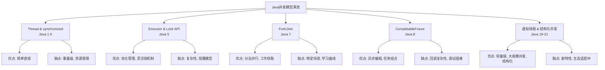
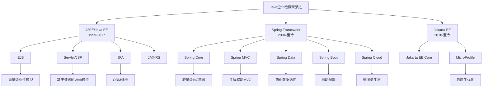
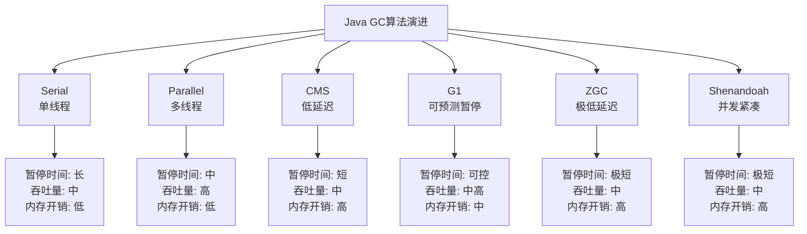
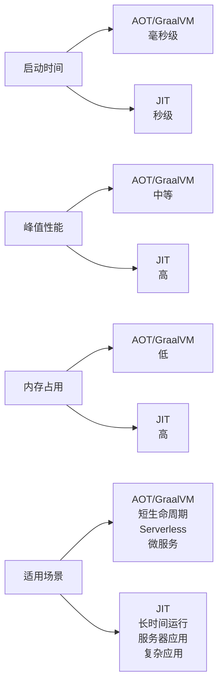

# Java语言特性演变

Java语言自1995年首次发布以来，经历了多次重大更新和演变。从最初的简单面向对象语言，逐步发展成为一个功能丰富、性能强大的企业级开发平台。本文将详细介绍Java语言特性的演变历程，帮助开发者更好地理解Java的发展脉络和技术积累。

## 语法特性的演进

### 从冗长到简洁：语法糖的引入历程

Java语言最初以其严谨但冗长的语法而闻名，随着版本迭代，不断引入语法糖以提升开发效率。

**Java 5之前的冗长语法**

早期Java代码通常需要大量的样板代码：

```java
// Java 1.4 迭代集合
List list = new ArrayList();
list.add("Java");
list.add("Python");
list.add("C++");

Iterator iterator = list.iterator();
while (iterator.hasNext()) {
    String language = (String) iterator.next();
    System.out.println(language);
}
```

**Java 5引入的语法糖**

Java 5(2004年)带来了多项重要的语法改进：

```java
// 泛型
List<String> list = new ArrayList<String>();

// 增强for循环
for (String language : list) {
    System.out.println(language);
}

// 自动装箱/拆箱
Integer num = 100; // 自动装箱
int primitive = num; // 自动拆箱

// 枚举类型
enum Day { MONDAY, TUESDAY, WEDNESDAY, THURSDAY, FRIDAY, SATURDAY, SUNDAY }

// 可变参数
public void printAll(String... messages) {
    for (String message : messages) {
        System.out.println(message);
    }
}

// 静态导入
import static java.lang.Math.PI;
```

**Java 7的语法简化**

Java 7(2011年)进一步简化了常见操作：

```java
// 钻石操作符
List<String> list = new ArrayList<>();

// 数字字面量改进
int million = 1_000_000;

// try-with-resources
try (FileInputStream fis = new FileInputStream("file.txt")) {
    // 使用fis
} // 自动关闭资源

// 多catch合并
try {
    // 可能抛出多种异常的代码
} catch (IOException | SQLException e) {
    e.printStackTrace();
}

// Switch支持String
String day = "MONDAY";
switch (day) {
    case "MONDAY":
        System.out.println("周一");
        break;
    case "TUESDAY":
        System.out.println("周二");
        break;
    // ...
}
```

**Java 8及以后的现代语法**

Java 8(2014年)引入了函数式编程特性，使代码更加简洁：

```java
// Lambda表达式
list.forEach(item -> System.out.println(item));

// 方法引用
list.forEach(System.out::println);

// Stream API
list.stream()
    .filter(s -> s.length() > 3)
    .map(String::toUpperCase)
    .sorted()
    .forEach(System.out::println);
```

Java 10(2018年)引入局部变量类型推断：

```java
// var关键字
var list = new ArrayList<String>(); // 编译器推断类型为ArrayList<String>
var number = 42; // 编译器推断类型为int
var person = new Person("John", 30); // 编译器推断类型为Person
```

Java 14-16(2020-2021年)引入了更多现代语言特性：

```java
// 文本块 (Java 15正式版)
String html = """
              <html>
                  <body>
                      <p>Hello, World!</p>
                  </body>
              </html>
              """;

// Record类型 (Java 16正式版)
record Person(String name, int age) {}

// 模式匹配instanceof (Java 16正式版)
if (obj instanceof String s) {
    // 直接使用s，无需强制类型转换
    System.out.println(s.length());
}

// Switch表达式 (Java 14正式版)
String result = switch (day) {
    case "MONDAY", "TUESDAY" -> "工作日开始";
    case "WEDNESDAY" -> "工作周中间";
    case "THURSDAY", "FRIDAY" -> "周末临近";
    case "SATURDAY", "SUNDAY" -> "周末";
    default -> "未知日期";
};
```

Java 17-21(2021-2023年)继续简化语法：

```java
// 密封类 (Java 17)
public sealed class Shape permits Circle, Rectangle, Square {}

// 模式匹配switch (Java 21预览)
Object obj = "Hello";
String formatted = switch (obj) {
    case Integer i -> String.format("int %d", i);
    case Long l    -> String.format("long %d", l);
    case Double d  -> String.format("double %f", d);
    case String s  -> String.format("String %s", s);
    default        -> obj.toString();
};

// 记录模式 (Java 21预览)
record Point(int x, int y) {}
record Rectangle(Point upperLeft, Point lowerRight) {}

Rectangle r = new Rectangle(new Point(1, 2), new Point(3, 4));
if (r instanceof Rectangle(Point(int x1, int y1), Point(int x2, int y2))) {
    System.out.println(x1 + y1 + x2 + y2);
}
```

### 类型系统的增强：泛型与类型推断

Java的类型系统经历了从简单到复杂、从严格到灵活的演变过程。

**Java 5之前的类型系统**

早期Java使用原始类型，集合无法保证类型安全：

```java
// Java 1.4
List list = new ArrayList();
list.add("字符串");
list.add(123); // 可以添加任何类型

// 使用时需要强制类型转换
String first = (String) list.get(0); // 正确
String second = (String) list.get(1); // 运行时ClassCastException
```

**Java 5引入泛型**

泛型提供了编译时类型安全检查：

```java
// 使用泛型
List<String> list = new ArrayList<String>();
list.add("字符串");
// list.add(123); // 编译错误

// 泛型方法
public <T> T getFirst(List<T> list) {
    return list.isEmpty() ? null : list.get(0);
}

// 泛型类
class Box<T> {
    private T value;
    
    public Box(T value) {
        this.value = value;
    }
    
    public T getValue() {
        return value;
    }
}

// 泛型通配符
void processList(List<? extends Number> list) {
    // 可以处理List<Integer>, List<Double>等
}
```

**Java 7的钻石操作符**

简化泛型实例化语法：

```java
// Java 7之前
Map<String, List<String>> map = new HashMap<String, List<String>>();

// Java 7及以后
Map<String, List<String>> map = new HashMap<>(); // 类型推断
```

**Java 8的类型推断增强**

改进了泛型方法调用的类型推断：

```java
// 无需显式指定类型参数
List<String> list = Collections.emptyList(); // 自动推断为List<String>

// 改进的目标类型推断
Comparator<String> comparator = Comparator.comparing(String::length);
```

**Java 10的局部变量类型推断**

引入var关键字，进一步简化变量声明：

```java
// 不使用var
ArrayList<String> list = new ArrayList<String>();
BufferedReader reader = new BufferedReader(new InputStreamReader(System.in));

// 使用var
var list = new ArrayList<String>();
var reader = new BufferedReader(new InputStreamReader(System.in));
```

**Java 11的Lambda参数类型推断**

增强了Lambda表达式的类型推断能力：

```java
// Java 11之前
(var x, var y) -> x + y // 不合法

// Java 11及以后
(var x, var y) -> x + y // 合法
```

### 面向对象特性的完善：接口默认方法、密封类

Java作为面向对象语言，其OOP特性也在不断完善和增强。

**Java 8之前的接口**

传统接口只能包含抽象方法和常量：

```java
// Java 7及之前
interface Vehicle {
    int MAX_SPEED = 120; // 常量
    void start(); // 抽象方法
    void stop(); // 抽象方法
}

// 实现类必须实现所有方法
class Car implements Vehicle {
    @Override
    public void start() {
        System.out.println("Car starting");
    }
    
    @Override
    public void stop() {
        System.out.println("Car stopping");
    }
}
```

**Java 8的接口默认方法和静态方法**

允许接口包含实现代码，提高了API演进的灵活性：

```java
// Java 8接口
interface Vehicle {
    int MAX_SPEED = 120;
    
    void start();
    void stop();
    
    // 默认方法
    default void honk() {
        System.out.println("Beep beep!");
    }
    
    // 静态方法
    static Vehicle createElectricVehicle() {
        return new ElectricCar();
    }
}

// 实现类可以选择性重写默认方法
class Car implements Vehicle {
    @Override
    public void start() {
        System.out.println("Car starting");
    }
    
    @Override
    public void stop() {
        System.out.println("Car stopping");
    }
    
    // 可以不重写honk()方法
}
```

**Java 9的私有接口方法**

允许接口中的代码复用：

```java
interface Vehicle {
    // 私有方法
    private void log(String message) {
        System.out.println("Vehicle Log: " + message);
    }
    
    default void start() {
        log("Starting vehicle");
        // 启动逻辑
    }
    
    default void stop() {
        log("Stopping vehicle");
        // 停止逻辑
    }
}
```

**Java 15-17的密封类**

通过密封类控制继承关系，增强了类型安全：

```java
// Java 17密封类
public sealed class Shape permits Circle, Rectangle, Square {
    // 共同属性和方法
}

// 允许的子类必须使用final、sealed或non-sealed修饰
public final class Circle extends Shape {
    private double radius;
    // 实现
}

public final class Rectangle extends Shape {
    private double width;
    private double height;
    // 实现
}

public sealed class Square extends Shape permits ColoredSquare {
    private double side;
    // 实现
}

public final class ColoredSquare extends Square {
    private String color;
    // 实现
}

// 使用模式匹配处理密封类层次结构
double area = switch (shape) {
    case Circle c -> Math.PI * c.radius() * c.radius();
    case Rectangle r -> r.width() * r.height();
    case Square s -> s.side() * s.side();
    case ColoredSquare cs -> cs.side() * cs.side();
};
```

**Java 16的记录类**

提供了不可变数据类的简洁表示：

```java
// 传统POJO类
class Person {
    private final String name;
    private final int age;
    
    public Person(String name, int age) {
        this.name = name;
        this.age = age;
    }
    
    public String getName() { return name; }
    public int getAge() { return age; }
    
    @Override
    public boolean equals(Object o) {
        // 实现equals
    }
    
    @Override
    public int hashCode() {
        // 实现hashCode
    }
    
    @Override
    public String toString() {
        // 实现toString
    }
}

// Java 16记录类
record Person(String name, int age) {
    // 编译器自动生成:
    // - 构造函数
    // - 访问器方法 name()和age()
    // - equals(), hashCode(), toString()
    
    // 可以添加静态字段、静态方法
    public static final int MINIMUM_AGE = 0;
    
    // 可以添加实例方法
    public boolean isAdult() {
        return age >= 18;
    }
    
    // 可以自定义规范构造器
    public Person {
        if (age < MINIMUM_AGE) {
            throw new IllegalArgumentException("Age cannot be negative");
        }
    }
    
    // 可以添加紧凑构造器
    public Person(String name) {
        this(name, 0);
    }
}
```

### 函数式编程范式的融入：Lambda与方法引用

Java 8引入了函数式编程特性，使Java成为一种多范式编程语言。

**Java 8之前的匿名内部类**

实现回调和事件处理需要冗长的匿名内部类：

```java
// Java 7及之前
button.addActionListener(new ActionListener() {
    @Override
    public void actionPerformed(ActionEvent e) {
        System.out.println("Button clicked");
    }
});

// 排序
Collections.sort(names, new Comparator<String>() {
    @Override
    public int compare(String s1, String s2) {
        return s1.compareTo(s2);
    }
});
```

**Java 8的Lambda表达式**

大幅简化了函数式接口的实现：

```java
// 使用Lambda表达式
button.addActionListener(e -> System.out.println("Button clicked"));

// 排序
Collections.sort(names, (s1, s2) -> s1.compareTo(s2));

// 多行Lambda
button.addActionListener(e -> {
    System.out.println("Button clicked");
    System.out.println("Performing action...");
    performAction();
});
```

**方法引用**

进一步简化了Lambda表达式：

```java
// 静态方法引用
list.forEach(System.out::println);

// 实例方法引用
list.stream().map(String::toUpperCase);

// 特定对象的实例方法引用
String prefix = "Mr. ";
list.stream().map(prefix::concat);

// 构造函数引用
list.stream().map(Person::new);
```

**函数式接口**

Java 8引入了一系列函数式接口，支持函数式编程：

```java
// 常用函数式接口
Predicate<String> isEmpty = s -> s.isEmpty(); // 接受一个参数，返回布尔值
Consumer<String> printer = s -> System.out.println(s); // 接受一个参数，无返回值
Function<String, Integer> length = s -> s.length(); // 接受一个参数，返回一个结果
Supplier<String> generator = () -> "Generated String"; // 无参数，返回一个结果
BiFunction<String, String, String> combiner = (s1, s2) -> s1 + s2; // 接受两个参数，返回一个结果

// 自定义函数式接口
@FunctionalInterface
interface TriFunction<T, U, V, R> {
    R apply(T t, U u, V v);
}
```

**Stream API**

提供了强大的数据处理能力：

```java
// 数据转换
List<String> upperCaseNames = names.stream()
    .map(String::toUpperCase)
    .collect(Collectors.toList());

// 过滤
List<Person> adults = people.stream()
    .filter(p -> p.getAge() >= 18)
    .collect(Collectors.toList());

// 聚合
int totalAge = people.stream()
    .mapToInt(Person::getAge)
    .sum();

// 分组
Map<Integer, List<Person>> peopleByAge = people.stream()
    .collect(Collectors.groupingBy(Person::getAge));

// 并行处理
long count = people.parallelStream()
    .filter(p -> p.getAge() > 20)
    .count();
```

**Optional类**

更优雅地处理空值：

```java
// 传统空值检查
Person person = findPerson();
String name = null;
if (person != null) {
    Address address = person.getAddress();
    if (address != null) {
        Country country = address.getCountry();
        if (country != null) {
            name = country.getName();
        }
    }
}

// 使用Optional
String name = Optional.ofNullable(findPerson())
    .map(Person::getAddress)
    .map(Address::getCountry)
    .map(Country::getName)
    .orElse("Unknown");
```

**Java 9的Stream API增强**

增加了更多便捷方法：

```java
// takeWhile和dropWhile
Stream.of(1, 2, 3, 4, 5, 1, 2)
    .takeWhile(n -> n < 3) // 结果: [1, 2]
    .forEach(System.out::println);

// iterate重载方法
Stream.iterate(1, n -> n <= 10, n -> n + 1)
    .forEach(System.out::println);

// ofNullable方法
Stream<String> stream = Stream.ofNullable(getString()); // 可能为null的值
```

## 并发编程模型的变革

Java的并发编程模型经历了从底层到高级抽象的演变，使开发者能够更容易地编写高效、安全的并发程序。

### 从Thread到Executor框架

**早期的Thread API**

Java 1.0引入的Thread类是最基本的并发单元：

```java
// 继承Thread类
class MyThread extends Thread {
    @Override
    public void run() {
        System.out.println("Thread running: " + Thread.currentThread().getName());
    }
}

// 使用
MyThread thread = new MyThread();
thread.start();

// 实现Runnable接口
Runnable task = new Runnable() {
    @Override
    public void run() {
        System.out.println("Task running: " + Thread.currentThread().getName());
    }
};

// 使用
Thread thread = new Thread(task);
thread.start();
```

**Thread API的局限性**

直接使用Thread存在多个问题：
- 线程创建和销毁开销大
- 缺乏线程池管理
- 无法方便地获取执行结果
- 难以控制并发数量

**Java 5引入的Executor框架**

提供了更高级的线程管理抽象：

```java
// 创建线程池
ExecutorService executor = Executors.newFixedThreadPool(10);

// 提交任务
executor.submit(() -> {
    System.out.println("Task executed by " + Thread.currentThread().getName());
});

// 提交有返回值的任务
Future<String> future = executor.submit(() -> {
    Thread.sleep(1000);
    return "Task result";
});

// 获取结果（阻塞）
try {
    String result = future.get();
    System.out.println(result);
} catch (InterruptedException | ExecutionException e) {
    e.printStackTrace();
}

// 关闭线程池
executor.shutdown();
```

**常用的线程池类型**

Executors工厂类提供了多种预配置的线程池：

```java
// 固定大小线程池
ExecutorService fixedPool = Executors.newFixedThreadPool(10);

// 缓存线程池（按需创建线程）
ExecutorService cachedPool = Executors.newCachedThreadPool();

// 单线程执行器
ExecutorService singleThreadExecutor = Executors.newSingleThreadExecutor();

// 定时任务线程池
ScheduledExecutorService scheduledPool = Executors.newScheduledThreadPool(5);

// 使用定时任务
scheduledPool.scheduleAtFixedRate(() -> {
    System.out.println("Scheduled task running");
}, 1, 10, TimeUnit.SECONDS); // 1秒后开始，每10秒执行一次
```

**Java 7的Fork/Join框架**

针对"分而治之"并行计算任务的框架：

```java
class SumTask extends RecursiveTask<Long> {
    private final long[] numbers;
    private final int start;
    private final int end;
    private static final int THRESHOLD = 10_000;

    SumTask(long[] numbers, int start, int end) {
        this.numbers = numbers;
        this.start = start;
        this.end = end;
    }

    @Override
    protected Long compute() {
        int length = end - start;
        if (length <= THRESHOLD) {
            // 小任务直接计算
            return computeDirectly();
        }
        
        // 大任务分解
        int middle = start + length / 2;
        SumTask leftTask = new SumTask(numbers, start, middle);
        SumTask rightTask = new SumTask(numbers, middle, end);
        
        leftTask.fork(); // 异步执行左半部分
        long rightResult = rightTask.compute(); // 直接执行右半部分
        long leftResult = leftTask.join(); // 等待左半部分结果
        
        return leftResult + rightResult;
    }

    private long computeDirectly() {
        long sum = 0;
        for (int i = start; i < end; i++) {
            sum += numbers[i];
        }
        return sum;
    }
}

// 使用Fork/Join框架
ForkJoinPool pool = new ForkJoinPool();
long[] numbers = new long[100_000_000];
// 初始化数组...
long sum = pool.invoke(new SumTask(numbers, 0, numbers.length));
```

### 从synchronized到Lock API

**早期的synchronized关键字**

Java 1.0引入的基本同步机制：

```java
class Counter {
    private int count = 0;
    
    // 同步方法
    public synchronized void increment() {
        count++;
    }
    
    // 同步代码块
    public void decrement() {
        synchronized (this) {
            count--;
        }
    }
    
    // 静态同步方法（锁定类）
    public static synchronized void staticMethod() {
        // 同步代码
    }
    
    public int getCount() {
        synchronized (this) {
            return count;
        }
    }
}
```

**synchronized的局限性**

- 无法中断正在等待锁的线程
- 无法设置超时
- 无法实现非阻塞获取锁
- 一个synchronized块只能有一个条件变量

**Java 5引入的Lock接口**

提供了更灵活的锁机制：

```java
class Counter {
    private final Lock lock = new ReentrantLock();
    private int count = 0;
    
    public void increment() {
        lock.lock(); // 获取锁
        try {
            count++;
        } finally {
            lock.unlock(); // 确保释放锁
        }
    }
    
    public boolean tryIncrement() {
        if (lock.tryLock()) { // 尝试获取锁，不阻塞
            try {
                count++;
                return true;
            } finally {
                lock.unlock();
            }
        }
        return false;
    }
    
    public void incrementWithTimeout() throws InterruptedException {
        if (lock.tryLock(1, TimeUnit.SECONDS)) { // 尝试获取锁，最多等待1秒
            try {
                count++;
            } finally {
                lock.unlock();
            }
        }
    }
    
    public void incrementInterruptibly() throws InterruptedException {
        lock.lockInterruptibly(); // 可中断的锁获取
        try {
            count++;
        } finally {
            lock.unlock();
        }
    }
}
```

**ReadWriteLock接口**

支持读写分离的锁：

```java
class Cache {
    private final Map<String, Object> cache = new HashMap<>();
    private final ReadWriteLock rwLock = new ReentrantReadWriteLock();
    private final Lock readLock = rwLock.readLock();
    private final Lock writeLock = rwLock.writeLock();
    
    public Object get(String key) {
        readLock.lock(); // 多个线程可以同时读取
        try {
            return cache.get(key);
        } finally {
            readLock.unlock();
        }
    }
    
    public void put(String key, Object value) {
        writeLock.lock(); // 写入时独占锁
        try {
            cache.put(key, value);
        } finally {
            writeLock.unlock();
        }
    }
}
```

**Condition接口**

提供了比wait/notify更灵活的线程等待/通知机制：

```java
class BoundedBuffer<T> {
    private final Lock lock = new ReentrantLock();
    private final Condition notFull = lock.newCondition();
    private final Condition notEmpty = lock.newCondition();
    
    private final Object[] items = new Object[100];
    private int putIndex, takeIndex, count;
    
    public void put(T x) throws InterruptedException {
        lock.lock();
        try {
            while (count == items.length) {
                notFull.await(); // 缓冲区满时等待
            }
            items[putIndex] = x;
            if (++putIndex == items.length) putIndex = 0;
            count++;
            notEmpty.signal(); // 通知等待的消费者
        } finally {
            lock.unlock();
        }
    }
    
    @SuppressWarnings("unchecked")
    public T take() throws InterruptedException {
        lock.lock();
        try {
            while (count == 0) {
                notEmpty.await(); // 缓冲区空时等待
            }
            Object x = items[takeIndex];
            if (++takeIndex == items.length) takeIndex = 0;
            count--;
            notFull.signal(); // 通知等待的生产者
            return (T) x;
        } finally {
            lock.unlock();
        }
    }
}
```

**Java 8的StampedLock**

提供了乐观读取功能的锁：

```java
class Point {
    private double x, y;
    private final StampedLock lock = new StampedLock();
    
    // 写入方法
    void move(double deltaX, double deltaY) {
        long stamp = lock.writeLock(); // 获取写锁
        try {
            x += deltaX;
            y += deltaY;
        } finally {
            lock.unlockWrite(stamp); // 释放写锁
        }
    }
    
    // 读取方法（悲观读）
    double distanceFromOrigin() {
        long stamp = lock.readLock(); // 获取读锁
        try {
            return Math.hypot(x, y);
        } finally {
            lock.unlockRead(stamp); // 释放读锁
        }
    }
    
    // 乐观读取
    double distanceFromOriginOptimistic() {
        long stamp = lock.tryOptimisticRead(); // 尝试乐观读
        double currentX = x, currentY = y;
        if (!lock.validate(stamp)) { // 检查读取期间是否有写入
            stamp = lock.readLock(); // 获取悲观读锁
            try {
                currentX = x;
                currentY = y;
            } finally {
                lock.unlockRead(stamp);
            }
        }
        return Math.hypot(currentX, currentY);
    }
}
```

### 从阻塞集合到并发集合

**早期的同步集合**

Java早期通过Collections工具类提供同步包装器：

```java
// 同步List
List<String> synchronizedList = Collections.synchronizedList(new ArrayList<>());

// 同步Map
Map<String, Integer> synchronizedMap = Collections.synchronizedMap(new HashMap<>());

// 使用时需要额外同步迭代操作
synchronized (synchronizedList) {
    Iterator<String> iterator = synchronizedList.iterator();
    while (iterator.hasNext()) {
        // 处理元素
    }
}
```

**Java 5引入的并发集合**

提供了专为并发设计的集合类：

```java
// 并发Map
ConcurrentMap<String, Integer> concurrentMap = new ConcurrentHashMap<>();
concurrentMap.put("key", 1);
concurrentMap.putIfAbsent("key", 2); // 原子操作
concurrentMap.replace("key", 1, 3); // CAS操作

// 阻塞队列
BlockingQueue<Task> taskQueue = new LinkedBlockingQueue<>(100);
taskQueue.put(new Task()); // 如果队列满，会阻塞
Task task = taskQueue.take(); // 如果队列空，会阻塞
Task task2 = taskQueue.poll(5, TimeUnit.SECONDS); // 带超时的获取

// 生产者-消费者模式
class Producer implements Runnable {
    private final BlockingQueue<Data> queue;
    
    Producer(BlockingQueue<Data> queue) {
        this.queue = queue;
    }
    
    @Override
    public void run() {
        try {
            
让我继续完成Java语言特性演变的内容：

```java
// 生产者-消费者模式
class Producer implements Runnable {
    private final BlockingQueue<Data> queue;
    
    Producer(BlockingQueue<Data> queue) {
        this.queue = queue;
    }
    
    @Override
    public void run() {
        try {
            while (!Thread.interrupted()) {
                Data data = produceData();
                queue.put(data); // 阻塞式放入
            }
        } catch (InterruptedException e) {
            // 处理中断
        }
    }
    
    private Data produceData() {
        // 生产数据
        return new Data();
    }
}

class Consumer implements Runnable {
    private final BlockingQueue<Data> queue;
    
    Consumer(BlockingQueue<Data> queue) {
        this.queue = queue;
    }
    
    @Override
    public void run() {
        try {
            while (!Thread.interrupted()) {
                Data data = queue.take(); // 阻塞式获取
                processData(data);
            }
        } catch (InterruptedException e) {
            // 处理中断
        }
    }
    
    private void processData(Data data) {
        // 处理数据
    }
}
```

**CopyOnWriteArrayList**

适用于读多写少的场景：

```java
// 线程安全的ArrayList，适合读多写少的场景
CopyOnWriteArrayList<String> list = new CopyOnWriteArrayList<>();
list.add("item1");

// 迭代时不需要额外同步
for (String item : list) {
    System.out.println(item);
}

// 即使在迭代过程中修改集合也不会抛出ConcurrentModificationException
Iterator<String> iterator = list.iterator();
list.add("item2"); // 不会影响当前迭代器
while (iterator.hasNext()) {
    System.out.println(iterator.next());
}
```

**Java 7的TransferQueue**

支持生产者直接将元素交给消费者：

```java
TransferQueue<Data> queue = new LinkedTransferQueue<>();

// 生产者线程
new Thread(() -> {
    try {
        Data data = produceData();
        queue.transfer(data); // 阻塞直到有消费者接收
        System.out.println("数据已交付给消费者");
    } catch (InterruptedException e) {
        Thread.currentThread().interrupt();
    }
}).start();

// 消费者线程
new Thread(() -> {
    try {
        Data data = queue.take();
        processData(data);
    } catch (InterruptedException e) {
        Thread.currentThread().interrupt();
    }
}).start();
```

**Java 8的ConcurrentHashMap增强**

增加了更多原子操作和聚合方法：

```java
ConcurrentHashMap<String, Integer> map = new ConcurrentHashMap<>();

// 原子更新
map.compute("key", (k, v) -> (v == null) ? 1 : v + 1);
map.merge("key", 1, Integer::sum);

// 聚合操作
int sum = map.reduce(2, (k, v) -> v, Integer::sum);

// 并行遍历
map.forEach(4, (k, v) -> System.out.println(k + "=" + v));

// 搜索
String key = map.search(4, (k, v) -> v > 10 ? k : null);
```

### 从Future到CompletableFuture

**Java 5的Future接口**

提供了异步计算的基本抽象：

```java
ExecutorService executor = Executors.newFixedThreadPool(10);

// 提交任务并获取Future
Future<Integer> future = executor.submit(() -> {
    // 耗时计算
    Thread.sleep(1000);
    return 42;
});

// 阻塞等待结果
try {
    Integer result = future.get(); // 阻塞直到任务完成
    System.out.println("Result: " + result);
} catch (InterruptedException | ExecutionException e) {
    e.printStackTrace();
}

// 带超时的等待
try {
    Integer result = future.get(2, TimeUnit.SECONDS);
    System.out.println("Result: " + result);
} catch (TimeoutException e) {
    System.out.println("任务超时");
    future.cancel(true); // 尝试取消任务
}
```

**Future的局限性**

- 无法手动完成
- 无法组合多个Future
- 无法处理计算完成时的回调
- 无法处理异常

**Java 8的CompletableFuture**

提供了强大的异步编程模型：

```java
// 创建CompletableFuture
CompletableFuture<String> future = CompletableFuture.supplyAsync(() -> {
    // 异步执行的代码
    try {
        Thread.sleep(1000);
    } catch (InterruptedException e) {
        Thread.currentThread().interrupt();
    }
    return "Result";
});

// 添加回调
future.thenAccept(result -> System.out.println("Got result: " + result));

// 转换结果
CompletableFuture<Integer> lengthFuture = future.thenApply(String::length);

// 组合两个Future
CompletableFuture<String> future1 = CompletableFuture.supplyAsync(() -> "Hello");
CompletableFuture<String> future2 = CompletableFuture.supplyAsync(() -> "World");
CompletableFuture<String> combined = future1.thenCombine(future2, (s1, s2) -> s1 + " " + s2);

// 组合多个Future
CompletableFuture<String> future3 = CompletableFuture.supplyAsync(() -> "!");
CompletableFuture.allOf(future1, future2, future3)
    .thenRun(() -> System.out.println("All futures completed"));

// 处理异常
future.exceptionally(ex -> {
    System.err.println("Error: " + ex.getMessage());
    return "Default result";
});

// 更完整的异常处理
future.handle((result, ex) -> {
    if (ex != null) {
        System.err.println("Error: " + ex.getMessage());
        return "Default result";
    }
    return result;
});

// 超时处理
future.completeOnTimeout("Timeout result", 2, TimeUnit.SECONDS);

// 自定义线程池
ExecutorService executor = Executors.newFixedThreadPool(5);
CompletableFuture<String> customFuture = CompletableFuture.supplyAsync(() -> {
    // 异步代码
    return "Custom executor result";
}, executor);
```

**异步任务编排示例**

```java
// 模拟微服务调用链
CompletableFuture<User> getUserFuture = CompletableFuture.supplyAsync(() -> {
    // 从数据库获取用户
    return new User("user123");
});

// 并行调用多个服务
CompletableFuture<List<Order>> getOrdersFuture = getUserFuture.thenComposeAsync(user -> 
    CompletableFuture.supplyAsync(() -> {
        // 获取用户订单
        return fetchOrders(user.getId());
    })
);

CompletableFuture<UserProfile> getProfileFuture = getUserFuture.thenComposeAsync(user -> 
    CompletableFuture.supplyAsync(() -> {
        // 获取用户资料
        return fetchProfile(user.getId());
    })
);

// 组合结果
CompletableFuture<UserData> userDataFuture = getUserFuture
    .thenCombine(getOrdersFuture, (user, orders) -> new UserData(user, orders, null))
    .thenCombine(getProfileFuture, (userData, profile) -> {
        userData.setProfile(profile);
        return userData;
    });

// 添加超时和错误处理
userDataFuture = userDataFuture
    .completeOnTimeout(new UserData(), 3, TimeUnit.SECONDS)
    .exceptionally(ex -> {
        logError("Failed to fetch user data", ex);
        return new UserData(); // 返回默认值
    });

// 等待结果
UserData userData = userDataFuture.join();
```

### 从线程池到虚拟线程与结构化并发

**传统线程池模型**

基于操作系统线程的池化管理：

```java
// 创建固定大小线程池
ExecutorService executor = Executors.newFixedThreadPool(100);

// 提交大量任务
for (int i = 0; i < 10000; i++) {
    final int taskId = i;
    executor.submit(() -> {
        // 模拟I/O操作
        try {
            Thread.sleep(100);
            System.out.println("Task " + taskId + " completed by " + Thread.currentThread().getName());
        } catch (InterruptedException e) {
            Thread.currentThread().interrupt();
        }
    });
}

// 关闭线程池
executor.shutdown();
```

**传统线程的局限性**

- 线程是重量级资源，创建和切换开销大
- 线程数量受系统限制，通常只能创建几千个
- 线程池管理复杂，容易出现资源耗尽
- 难以追踪任务之间的关系

**Java 19-21的虚拟线程(Project Loom)**

轻量级线程实现，支持大规模并发：

```java
// Java 21虚拟线程
try {
    // 创建单个虚拟线程
    Thread vThread = Thread.ofVirtual().start(() -> {
        System.out.println("Running in virtual thread");
    });
    vThread.join();
    
    // 使用虚拟线程执行器
    try (var executor = Executors.newVirtualThreadPerTaskExecutor()) {
        // 提交大量任务，每个任务一个虚拟线程
        for (int i = 0; i < 10_000; i++) {
            final int taskId = i;
            executor.submit(() -> {
                // 模拟I/O操作
                try {
                    Thread.sleep(100);
                    System.out.println("Task " + taskId + " completed");
                } catch (InterruptedException e) {
                    Thread.currentThread().interrupt();
                }
                return taskId;
            });
        }
        // 执行器关闭时会等待所有任务完成
    }
    
    // 使用结构化并发(Java 21预览)
    try (var scope = new StructuredTaskScope.ShutdownOnFailure()) {
        // 并行执行多个子任务
        Future<String> user = scope.fork(() -> fetchUser());
        Future<List<Order>> orders = scope.fork(() -> fetchOrders());
        
        // 等待所有任务完成或有任务失败
        scope.join();
        // 检查是否有任务失败
        scope.throwIfFailed();
        
        // 处理结果
        processUserData(user.resultNow(), orders.resultNow());
    }
} catch (Exception e) {
    e.printStackTrace();
}
```

**虚拟线程的优势**

- 极轻量级，可创建数百万个
- 适合I/O密集型应用
- 简化异步编程模型
- 更好的资源利用率
- 代码更易于理解和维护

**结构化并发**

提供了任务之间的父子关系和生命周期管理：

```java
// 结构化并发示例 - 处理超时
try (var scope = new StructuredTaskScope.ShutdownOnTimeout(3, TimeUnit.SECONDS)) {
    // 并行执行多个子任务
    Future<String> userFuture = scope.fork(() -> fetchUser());
    Future<List<Order>> ordersFuture = scope.fork(() -> fetchOrders());
    Future<UserProfile> profileFuture = scope.fork(() -> fetchProfile());
    
    // 等待所有任务完成，或超时，或有任务失败
    scope.join();
    
    // 处理结果，检查哪些任务成功完成
    UserData userData = new UserData();
    
    if (userFuture.state() == Future.State.SUCCESS) {
        userData.setUser(userFuture.resultNow());
    }
    
    if (ordersFuture.state() == Future.State.SUCCESS) {
        userData.setOrders(ordersFuture.resultNow());
    }
    
    if (profileFuture.state() == Future.State.SUCCESS) {
        userData.setProfile(profileFuture.resultNow());
    }
    
    return userData;
}
```

**不同并发模型的对比**



## 模块化与项目结构演进

Java生态系统的项目结构和模块化机制经历了从简单到复杂、从非正式到正式的演变过程。

### 从单一JAR包到模块系统

**早期的类路径机制**

Java最初使用简单的类路径机制组织代码：

```
project/
├── src/
│   └── com/example/
│       ├── Main.java
│       └── util/
│           └── Helper.java
└── lib/
    ├── dependency1.jar
    └── dependency2.jar
```

编译和运行：
```bash
# 编译
javac -cp lib/dependency1.jar:lib/dependency2.jar -d bin src/com/example/*.java src/com/example/util/*.java

# 运行
java -cp bin:lib/dependency1.jar:lib/dependency2.jar com.example.Main
```

**JAR文件打包**

将类文件和资源打包为单一JAR文件：

```bash
# 创建JAR文件
jar cvf myapp.jar -C bin .

# 创建可执行JAR
jar cvfe myapp.jar com.example.Main -C bin .
```

JAR清单文件(META-INF/MANIFEST.MF)：
```
Manifest-Version: 1.0
Main-Class: com.example.Main
Class-Path: lib/dependency1.jar lib/dependency2.jar
```

**JAR依赖管理的问题**

- 类路径扁平化，没有命名空间隔离
- JAR地狱：依赖冲突和版本不兼容
- 缺乏封装机制，无法隐藏实现细节
- 运行时类加载顺序不确定
- 缺乏显式依赖声明

**Java 9的模块系统(JPMS)**

引入了正式的模块化机制：

```
module-app/
├── src/
│   └── com.example.app/
│       ├── module-info.java
│       └── com/example/app/
│           └── Main.java
├── src/
│   └── com.example.util/
│       ├── module-info.java
│       └── com/example/util/
│           └── Helper.java
```

模块描述文件(module-info.java)：
```java
// com.example.app模块
module com.example.app {
    requires com.example.util;
    requires java.logging;
    
    exports com.example.app.api;
    
    provides com.example.spi.Service with com.example.app.impl.ServiceImpl;
}

// com.example.util模块
module com.example.util {
    exports com.example.util;
}
```

编译和运行模块化应用：
```bash
# 编译模块
javac -d mods/com.example.util src/com.example.util/module-info.java src/com.example.util/com/example/util/*.java
javac --module-path mods -d mods/com.example.app src/com.example.app/module-info.java src/com.example.app/com/example/app/*.java

# 运行模块化应用
java --module-path mods -m com.example.app/com.example.app.Main
```

**模块系统的优势**

- 强封装：明确控制哪些包可以被外部访问
- 显式依赖：清晰声明模块间的依赖关系
- 可靠配置：编译时检查依赖完整性
- 平台模块化：JDK自身被模块化
- 优化部署：支持自定义运行时映像

**自定义运行时映像(jlink)**

创建包含应用和所需JDK模块的自定义运行时：

```bash
# 创建自定义运行时映像
jlink --module-path $JAVA_HOME/jmods:mods --add-modules com.example.app --output customjre

# 运行自定义映像中的应用
customjre/bin/java -m com.example.app/com.example.app.Main
```

**多版本JAR**

Java 9引入的支持不同Java版本的JAR格式：

```
multirelease.jar
├── META-INF/
│   └── MANIFEST.MF (包含"Multi-Release: true")
│   └── versions/
│       ├── 9/
│       │   └── com/example/util/Helper.class (Java 9特定实现)
│       └── 11/
│           └── com/example/util/Helper.class (Java 11特定实现)
├── com/
│   └── example/
│       └── util/
│           └── Helper.class (基础实现)
```

### 从传统构建到Maven/Gradle

**早期的Ant构建**

基于XML的过程式构建工具：

```xml
<!-- build.xml -->
<project name="MyProject" default="dist" basedir=".">
    <property name="src" location="src"/>
    <property name="build" location="build"/>
    <property name="dist" location="dist"/>
    
    <target name="init">
        <mkdir dir="${build}"/>
    </target>
    
    <target name="compile" depends="init">
        <javac srcdir="${src}" destdir="${build}"/>
    </target>
    
    <target name="dist" depends="compile">
        <mkdir dir="${dist}"/>
        <jar jarfile="${dist}/MyProject.jar" basedir="${build}"/>
    </target>
    
    <target name="clean">
        <delete dir="${build}"/>
        <delete dir="${dist}"/>
    </target>
</project>
```

**Maven的声明式构建**

基于约定优于配置的依赖管理：

```xml
<!-- pom.xml -->
<project xmlns="http://maven.apache.org/POM/4.0.0">
    <modelVersion>4.0.0</modelVersion>
    
    <groupId>com.example</groupId>
    <artifactId>my-project</artifactId>
    <version>1.0.0</version>
    
    <properties>
        <maven.compiler.source>17</maven.compiler.source>
        <maven.compiler.target>17</maven.compiler.target>
        <spring.version>5.3.20</spring.version>
    </properties>
    
    <dependencies>
        <dependency>
            <groupId>org.springframework</groupId>
            <artifactId>spring-context</artifactId>
            <version>${spring.version}</version>
        </dependency>
        <dependency>
            <groupId>junit</groupId>
            <artifactId>junit</artifactId>
            <version>4.13.2</version>
            <scope>test</scope>
        </dependency>
    </dependencies>
    
    <build>
        <plugins>
            <plugin>
                <groupId>org.apache.maven.plugins</groupId>
                <artifactId>maven-jar-plugin</artifactId>
                <version>3.2.2</version>
                <configuration>
                    <archive>
                        <manifest>
                            <mainClass>com.example.Main</mainClass>
                        </manifest>
                    </archive>
                </configuration>
            </plugin>
        </plugins>
    </build>
</project>
```

**Maven的标准目录结构**

```
my-project/
├── pom.xml
├── src/
│   ├── main/
│   │   ├── java/
│   │   ├── resources/
│   │   └── webapp/ (Web应用)
│   └── test/
│       ├── java/
│       └── resources/
└── target/ (构建输出)
```

**Maven的生命周期**

- validate：验证项目
- compile：编译源代码
- test：测试编译后的代码
- package：打包编译后的代码
- verify：验证包
- install：安装包到本地仓库
- deploy：部署到远程仓库

**Gradle的灵活构建**

基于Groovy/Kotlin的DSL构建系统：

```groovy
// build.gradle
plugins {
    id 'java'
    id 'application'
}

group = 'com.example'
version = '1.0.0'
sourceCompatibility = '17'

repositories {
    mavenCentral()
}

dependencies {
    implementation 'org.springframework:spring-context:5.3.20'
    testImplementation 'junit:junit:4.13.2'
}

application {
    mainClass = 'com.example.Main'
}

tasks.withType(JavaCompile) {
    options.encoding = 'UTF-8'
}

// 自定义任务
task createDocs(type: Javadoc) {
    source = sourceSets.main.allJava
}
```

Kotlin DSL版本：
```kotlin
// build.gradle.kts
plugins {
    java
    application
}

group = "com.example"
version = "1.0.0"
java.sourceCompatibility = JavaVersion.VERSION_17

repositories {
    mavenCentral()
}

dependencies {
    implementation("org.springframework:spring-context:5.3.20")
    testImplementation("junit:junit:4.13.2")
}

application {
    mainClass.set("com.example.Main")
}

tasks.withType<JavaCompile> {
    options.encoding = "UTF-8"
}
```

**多模块项目结构**

Maven多模块项目：
```
parent-project/
├── pom.xml (parent)
├── module1/
│   └── pom.xml
├── module2/
│   └── pom.xml
└── module3/
    └── pom.xml
```

Parent POM:
```xml
<project>
    <modelVersion>4.0.0</modelVersion>
    
    <groupId>com.example</groupId>
    <artifactId>parent-project</artifactId>
    <version>1.0.0</version>
    <packaging>pom</packaging>
    
    <modules>
        <module>module1</module>
        <module>module2</module>
        <module>module3</module>
    </modules>
    
    <dependencyManagement>
        <!-- 集中管理依赖版本 -->
    </dependencyManagement>
</project>
```

Gradle多模块项目：
```groovy
// settings.gradle
rootProject.name = 'parent-project'
include 'module1', 'module2', 'module3'

// build.gradle (root)
allprojects {
    group = 'com.example'
    version = '1.0.0'
}

subprojects {
    apply plugin: 'java'
    
    repositories {
        mavenCentral()
    }
    
    dependencies {
        // 公共依赖
    }
}
```

### 从单体应用到微服务架构

**传统单体应用结构**

所有功能集中在一个应用中：

```
monolith-app/
├── src/
│   └── main/
│       ├── java/
│       │   └── com/example/
│       │       ├── controller/
│       │       ├── service/
│       │       ├── repository/
│       │       ├── domain/
│       │       └── Application.java
│       └── resources/
│           ├── static/
│           ├── templates/
│           └── application.properties
└── pom.xml
```

Spring Boot单体应用示例：
```java
@SpringBootApplication
public class Application {
    public static void main(String[] args) {
        SpringApplication.run(Application.class, args);
    }
}

@RestController
class UserController {
    @Autowired
    private UserService userService;
    
    @GetMapping("/users/{id}")
    public User getUser(@PathVariable Long id) {
        return userService.findById(id);
    }
}

@Service
class UserService {
    @Autowired
    private UserRepository userRepository;
    @Autowired
    private OrderService orderService;
    
    public User findById(Long id) {
        return userRepository.findById(id).orElseThrow();
    }
}
```

**微服务架构结构**

将应用拆分为多个独立服务：

```
microservices/
├── user-service/
│   ├── src/
│   │   └── main/
│   │       ├── java/
│   │       └── resources/
│   └── pom.xml
├── order-service/
│   ├── src/
│   │   └── main/
│   │       ├── java/
│   │       └── resources/
│   └── pom.xml
├── product-service/
│   ├── src/
│   │   └── main/
│   │       ├── java/
│   │       └── resources/
│   └── pom.xml
└── api-gateway/
    ├── src/
    │   └── main/
    │       ├── java/
    │       └── resources/
    └── pom.xml
```

Spring Cloud微服务示例：

服务注册与发现：
```java
// 服务注册中心
@SpringBootApplication
@EnableEurekaServer
public class DiscoveryServiceApplication {
    public static void main(String[] args) {
        SpringApplication.run(DiscoveryServiceApplication.class, args);
    }
}

// 微服务应用
@SpringBootApplication
@EnableDiscoveryClient
public class UserServiceApplication {
    public static void main(String[] args) {
        SpringApplication.run(UserServiceApplication.class, args);
    }
}
```

服务间通信：
```java
// 声明式REST客户端
@FeignClient("order-service")
public interface OrderClient {
    @GetMapping("/orders/user/{userId}")
    List<Order> getOrdersByUserId(@PathVariable("userId") Long userId);
}

@RestController
class UserController {
    @Autowired
    private UserService userService;
    @Autowired
    private OrderClient orderClient;
    
    @GetMapping("/users/{id}/with-orders")
    public UserWithOrders getUserWithOrders(@PathVariable Long id) {
        User user = userService.findById(id);
        List<Order> orders = orderClient.getOrdersByUserId(id);
        return new UserWithOrders(user, orders);
    }
}
```

API网关：
```java
@SpringBootApplication
@EnableDiscoveryClient
@EnableZuulProxy
public class ApiGatewayApplication {
    public static void main(String[] args) {
        SpringApplication.run(ApiGatewayApplication.class, args);
    }
}
```

配置服务：
```java
@SpringBootApplication
@EnableConfigServer
public class ConfigServerApplication {
    public static void main(String[] args) {
        SpringApplication.run(ConfigServerApplication.class, args);
    }
}
```

**容器化微服务**

使用Docker和Kubernetes部署：

Dockerfile:
```dockerfile
FROM openjdk:17-jdk-slim
WORKDIR /app
COPY target/*.jar app.jar
EXPOSE 8080
ENTRYPOINT ["java", "-jar", "app.jar"]
```

Kubernetes部署:
```yaml
apiVersion: apps/v1
kind: Deployment
metadata:
  name: user-service
spec:
  replicas: 3
  selector:
    matchLabels:
      app: user-service
  template:
    metadata:
      labels:
        app: user-service
    spec:
      containers:
      - name: user-service
        image: my-registry/user-service:latest
        ports:
        - containerPort: 8080
        env:
        - name: SPRING_PROFILES_ACTIVE
          value: "prod"
```

**服务网格**

使用Istio等服务网格管理微服务通信：

```yaml
apiVersion: networking.istio.io/v1alpha3
kind: VirtualService
metadata:
  name: user-service
spec:
  hosts:
  - user-service
  http:
  - route:
    - destination:
        host: user-service
        subset: v1
      weight: 90
    - destination:
        host: user-service
        subset: v2
      weight
让我继续完成Java语言特性演变的内容：

```yaml
apiVersion: networking.istio.io/v1alpha3
kind: VirtualService
metadata:
  name: user-service
spec:
  hosts:
  - user-service
  http:
  - route:
    - destination:
        host: user-service
        subset: v1
      weight: 90
    - destination:
        host: user-service
        subset: v2
      weight: 10
  - fault:
      delay:
        percentage:
          value: 5
        fixedDelay: 2s
```

### 从JEE规范到Spring生态

**早期的J2EE规范**

Java 2 Enterprise Edition提供了一套企业级应用开发标准：

```java
// EJB 2.x示例
public interface UserService extends EJBObject {
    User findById(Long id) throws RemoteException;
}

public class UserServiceBean implements SessionBean {
    private SessionContext context;
    
    public User findById(Long id) {
        // 实现
        return new User();
    }
    
    public void setSessionContext(SessionContext context) {
        this.context = context;
    }
    
    public void ejbCreate() {}
    public void ejbRemove() {}
    public void ejbActivate() {}
    public void ejbPassivate() {}
}
```

部署描述符(ejb-jar.xml):
```xml
<ejb-jar>
    <enterprise-beans>
        <session>
            <ejb-name>UserService</ejb-name>
            <home>com.example.UserServiceHome</home>
            <remote>com.example.UserService</remote>
            <ejb-class>com.example.UserServiceBean</ejb-class>
            <session-type>Stateless</session-type>
            <transaction-type>Container</transaction-type>
        </session>
    </enterprise-beans>
</ejb-jar>
```

**Java EE 5-7的简化**

引入注解简化开发：

```java
// EJB 3.x示例
@Stateless
public class UserServiceBean implements UserService {
    @PersistenceContext
    private EntityManager em;
    
    public User findById(Long id) {
        return em.find(User.class, id);
    }
}

// JPA实体
@Entity
public class User {
    @Id
    @GeneratedValue(strategy = GenerationType.IDENTITY)
    private Long id;
    
    private String username;
    
    @OneToMany(mappedBy = "user")
    private List<Order> orders;
    
    // getters and setters
}
```

**Spring框架的兴起**

提供了更轻量级的企业应用开发方式：

```java
// Spring 2.x XML配置
<beans>
    <bean id="userService" class="com.example.UserServiceImpl">
        <property name="userRepository" ref="userRepository"/>
    </bean>
    
    <bean id="userRepository" class="com.example.JdbcUserRepository">
        <property name="dataSource" ref="dataSource"/>
    </bean>
    
    <bean id="dataSource" class="org.apache.commons.dbcp.BasicDataSource">
        <property name="driverClassName" value="com.mysql.jdbc.Driver"/>
        <property name="url" value="jdbc:mysql://localhost/mydb"/>
        <property name="username" value="user"/>
        <property name="password" value="password"/>
    </bean>
</beans>
```

Spring 2.5+的注解支持：
```java
@Service
public class UserServiceImpl implements UserService {
    @Autowired
    private UserRepository userRepository;
    
    public User findById(Long id) {
        return userRepository.findById(id);
    }
}

@Repository
public class JdbcUserRepository implements UserRepository {
    @Autowired
    private JdbcTemplate jdbcTemplate;
    
    public User findById(Long id) {
        return jdbcTemplate.queryForObject(
            "SELECT * FROM users WHERE id = ?",
            new Object[]{id},
            (rs, rowNum) -> new User(rs.getLong("id"), rs.getString("username"))
        );
    }
}
```

**Spring Boot的简化**

自动配置和约定优于配置：

```java
@SpringBootApplication
public class Application {
    public static void main(String[] args) {
        SpringApplication.run(Application.class, args);
    }
}

@RestController
@RequestMapping("/api/users")
public class UserController {
    @Autowired
    private UserService userService;
    
    @GetMapping("/{id}")
    public ResponseEntity<User> getUser(@PathVariable Long id) {
        return ResponseEntity.ok(userService.findById(id));
    }
    
    @PostMapping
    public ResponseEntity<User> createUser(@RequestBody User user) {
        User created = userService.save(user);
        return ResponseEntity
            .created(URI.create("/api/users/" + created.getId()))
            .body(created);
    }
}
```

application.properties:
```properties
spring.datasource.url=jdbc:mysql://localhost/mydb
spring.datasource.username=user
spring.datasource.password=password
spring.jpa.hibernate.ddl-auto=update
server.port=8080
```

**Spring Cloud与微服务**

提供了完整的微服务开发生态：

```java
// 配置客户端
@SpringBootApplication
@EnableConfigClient
public class ServiceApplication {
    @Value("${service.message}")
    private String message;
    
    @Bean
    public CommandLineRunner run() {
        return args -> System.out.println("Message: " + message);
    }
}

// 服务发现
@SpringBootApplication
@EnableDiscoveryClient
public class ServiceApplication {
    @Bean
    @LoadBalanced
    public RestTemplate restTemplate() {
        return new RestTemplate();
    }
}

// 断路器
@Service
public class UserService {
    @Autowired
    private RestTemplate restTemplate;
    
    @HystrixCommand(fallbackMethod = "getDefaultOrders")
    public List<Order> getOrdersForUser(Long userId) {
        return restTemplate.getForObject(
            "http://order-service/orders/user/{userId}",
            List.class,
            userId
        );
    }
    
    public List<Order> getDefaultOrders(Long userId) {
        return Collections.emptyList();
    }
}
```

**Jakarta EE的演进**

Java EE转移到Eclipse基金会后的继续发展：

```java
// Jakarta EE 9+
@ApplicationScoped
public class UserService {
    @Inject
    private UserRepository userRepository;
    
    public User findById(Long id) {
        return userRepository.findById(id)
            .orElseThrow(() -> new NotFoundException("User not found"));
    }
}

// JAX-RS REST API
@Path("/users")
@Produces(MediaType.APPLICATION_JSON)
@Consumes(MediaType.APPLICATION_JSON)
public class UserResource {
    @Inject
    private UserService userService;
    
    @GET
    @Path("/{id}")
    public Response getUser(@PathParam("id") Long id) {
        return Response.ok(userService.findById(id)).build();
    }
}
```

**MicroProfile规范**

为微服务架构优化的Jakarta EE子集：

```java
// 配置
@Inject
@ConfigProperty(name = "service.timeout", defaultValue = "1000")
private long timeout;

// 容错
@Retry(maxRetries = 3)
@Timeout(value = 2, unit = ChronoUnit.SECONDS)
@Fallback(fallbackMethod = "getDefaultUser")
public User findById(Long id) {
    // 实现
}

// 指标
@Counted(name = "userQueries", description = "How many user queries have been performed")
@Timed(name = "userQueryTimer", description = "A measure of how long it takes to perform the query")
public User findById(Long id) {
    // 实现
}

// 健康检查
@Health
@ApplicationScoped
public class ServiceHealthCheck implements HealthCheck {
    @Override
    public HealthCheckResponse call() {
        return HealthCheckResponse.named("service")
            .up()
            .withData("memory", Runtime.getRuntime().freeMemory())
            .build();
    }
}
```

**企业应用框架对比**



## 性能与优化方向

Java平台的性能优化经历了多次重大演进，从早期的解释执行到现代的即时编译和提前编译技术。

### JIT编译技术的演进

**早期的解释执行模式**

Java 1.0-1.2使用纯解释执行：

```
源代码(.java) -> 编译器(javac) -> 字节码(.class) -> 解释器 -> 执行
```

性能特点：
- 启动快速
- 执行速度慢
- 无运行时优化
- 跨平台一致性好

**Java 1.3-1.4的HotSpot技术**

引入基本的JIT编译：

```
字节码 -> 解释执行 -> 热点检测 -> JIT编译 -> 本地代码执行
```

优化技术：
- 方法内联
- 循环展开
- 常量折叠
- 死代码消除

**Java 5-6的分层编译**

引入客户端编译器(C1)和服务器编译器(C2)：

```java
// 启用服务器编译器
java -server MyApplication

// 启用客户端编译器
java -client MyApplication
```

C1编译器特点：
- 编译速度快
- 优化程度中等
- 适合客户端应用和启动性能

C2编译器特点：
- 编译速度慢
- 优化程度高
- 适合长时间运行的服务器应用

**Java 7-8的分层编译增强**

改进的热点检测和编译策略：

```
字节码 -> 解释执行 -> 热点检测 -> C1编译 -> C1编译代码执行 -> 更热点检测 -> C2编译 -> C2编译代码执行
```

```java
// 启用分层编译
java -XX:+TieredCompilation MyApplication

// 设置编译阈值
java -XX:CompileThreshold=10000 MyApplication
```

**Java 9-11的JIT编译器改进**

引入Graal编译器作为实验性替代：

```java
// 使用Graal作为JIT编译器
java -XX:+UnlockExperimentalVMOptions -XX:+UseJVMCICompiler MyApplication
```

Graal编译器特点：
- 使用Java编写的JIT编译器
- 更激进的优化
- 更好的内联策略
- 部分逃逸分析

**Java 12-17的JIT编译器进一步优化**

增强的C2编译器和Graal改进：

```java
// 启用实验性优化
java -XX:+UnlockExperimentalVMOptions -XX:+UseShenandoahGC MyApplication
```

新增优化：
- 字符串连接优化
- Switch表达式优化
- 动态编译器切换
- 改进的内联策略

**JIT编译的关键优化技术**

1. **方法内联**：将调用的方法代码直接插入调用点

```java
// 原始代码
public int compute(int x) {
    return square(x) + 1;
}

private int square(int x) {
    return x * x;
}

// 内联后等效代码
public int compute(int x) {
    return x * x + 1;
}
```

2. **逃逸分析**：确定对象是否逃逸出方法或线程

```java
// 未优化
public void method() {
    StringBuilder sb = new StringBuilder();
    sb.append("Hello");
    sb.append(" World");
    String result = sb.toString();
    System.out.println(result);
}

// 优化后（栈分配）
public void method() {
    // StringBuilder在栈上分配，无需堆分配和GC
    System.out.println("Hello World");
}
```

3. **循环优化**：循环展开、循环融合、循环向量化

```java
// 原始循环
for (int i = 0; i < array.length; i++) {
    array[i] *= 2;
}

// 循环展开
for (int i = 0; i < array.length; i += 4) {
    array[i] *= 2;
    array[i+1] *= 2;
    array[i+2] *= 2;
    array[i+3] *= 2;
}

// SIMD向量化（伪代码）
for (int i = 0; i < array.length; i += 4) {
    vector_multiply(array[i:i+3], 2);
}
```

4. **锁消除**：移除不必要的同步

```java
// 原始代码
public String concatStrings(String a, String b) {
    // StringBuffer是线程安全的
    StringBuffer sb = new StringBuffer();
    sb.append(a);
    sb.append(b);
    return sb.toString();
}

// 优化后（JIT可能执行的转换）
public String concatStrings(String a, String b) {
    // 由于对象不逃逸，可以移除同步
    StringBuilder sb = new StringBuilder();
    sb.append(a);
    sb.append(b);
    return sb.toString();
}
```

### GC算法的代际更迭

**早期的简单GC**

Java 1.0-1.3使用简单的标记-清除和标记-压缩算法：

```
堆内存 -> 标记活动对象 -> 清除/压缩 -> 应用继续执行
```

特点：
- 单线程执行
- 全堆扫描
- 应用暂停时间长
- 内存碎片问题

**分代收集的引入**

Java 1.4-1.8的主流GC策略：

```
年轻代(Eden + S0 + S1) -> 老年代 -> 永久代/元空间
```

常见的GC组合：
- Serial GC：单线程收集器
- Parallel GC：多线程收集器
- CMS (Concurrent Mark Sweep)：低延迟收集器

```java
// 使用Serial GC
java -XX:+UseSerialGC MyApplication

// 使用Parallel GC
java -XX:+UseParallelGC -XX:ParallelGCThreads=4 MyApplication

// 使用CMS GC
java -XX:+UseConcMarkSweepGC MyApplication
```

**G1收集器的引入**

Java 7引入，Java 9成为默认：

```
堆被划分为多个大小相等的区域(Region)，而不是连续的年轻代和老年代
```

G1特点：
- 可预测的暂停时间
- 整堆并发标记
- 增量式垃圾收集
- 更好的碎片处理

```java
// 使用G1 GC
java -XX:+UseG1GC MyApplication

// 设置暂停时间目标
java -XX:+UseG1GC -XX:MaxGCPauseMillis=200 MyApplication
```

**ZGC和Shenandoah的引入**

Java 11-15引入的低延迟GC：

ZGC (Java 11+)：
- 暂停时间不超过10ms
- 支持TB级堆
- 并发处理
- 基于区域的内存管理

```java
// 使用ZGC
java -XX:+UnlockExperimentalVMOptions -XX:+UseZGC MyApplication
```

Shenandoah (Java 12+)：
- 与应用并发执行
- 独立于堆大小的暂停时间
- 紧凑的堆布局

```java
// 使用Shenandoah GC
java -XX:+UseShenandoahGC MyApplication
```

**GC算法对比**



**GC调优参数示例**

```java
// 堆大小设置
java -Xms4g -Xmx4g MyApplication

// 年轻代大小
java -XX:NewSize=1g -XX:MaxNewSize=1g MyApplication

// GC日志
java -Xlog:gc*=debug:file=gc.log MyApplication

// G1区域大小
java -XX:G1HeapRegionSize=16m MyApplication

// 并行GC线程
java -XX:ParallelGCThreads=8 -XX:ConcGCThreads=2 MyApplication
```

### 内存管理模型的优化

**早期的内存模型**

Java 1.0-1.4的简单内存模型：

```
堆内存 + 方法区 + 本地方法栈 + Java虚拟机栈
```

**Java 5的内存模型修订**

引入了JSR-133，解决了多线程内存可见性问题：

```java
// volatile保证可见性
private volatile boolean flag = false;

// synchronized保证原子性和可见性
public synchronized void increment() {
    count++;
}
```

**Java 8的元空间**

永久代被元空间取代：

```
Java 7: 堆 + 永久代(方法区)
Java 8: 堆 + 元空间(本地内存)
```

```java
// 设置元空间大小
java -XX:MetaspaceSize=256m -XX:MaxMetaspaceSize=512m MyApplication
```

**Java 9-11的紧凑字符串**

默认使用Latin-1编码而非UTF-16：

```java
// 禁用紧凑字符串
java -XX:-CompactStrings MyApplication
```

**Java 12-17的弹性元空间**

更智能的元空间管理：

```java
// 启用弹性元空间
java -XX:+UseCompressedClassPointers MyApplication
```

**内存分配优化**

TLAB (Thread Local Allocation Buffer)：
- 每个线程有自己的分配缓冲区
- 减少线程间同步
- 提高分配速度

```java
// 配置TLAB
java -XX:+UseTLAB -XX:TLABSize=512k MyApplication
```

**逃逸分析和标量替换**

允许将对象分配在栈上而非堆上：

```java
// 启用逃逸分析
java -XX:+DoEscapeAnalysis MyApplication

// 启用标量替换
java -XX:+EliminateAllocations MyApplication
```

**内存压缩技术**

压缩指针减少64位JVM的内存占用：

```java
// 启用压缩指针
java -XX:+UseCompressedOops MyApplication

// 启用压缩类指针
java -XX:+UseCompressedClassPointers MyApplication
```

### AOT编译与GraalVM

**传统JIT编译的局限性**

- 冷启动性能问题
- 预热时间长
- 内存占用大
- 不适合短生命周期应用

**Java 9的AOT编译器**

引入jaotc工具进行提前编译：

```bash
# 编译特定类
jaotc --output libClasses.so MyClass.class

# 编译整个模块
jaotc --output libApp.so --module myapp

# 使用AOT编译库
java -XX:AOTLibrary=./libApp.so MyApplication
```

**GraalVM的原生镜像**

将Java应用编译为独立的本地可执行文件：

```bash
# 安装native-image工具
gu install native-image

# 构建原生镜像
native-image -cp myapp.jar com.example.MainClass

# 运行原生镜像
./com.example.mainclass
```

**GraalVM原生镜像的特点**

优势：
- 极快的启动时间（毫秒级）
- 低内存占用
- 无JVM依赖
- 适合Serverless和容器环境

限制：
- 构建时间长
- 动态特性受限
- 反射需要配置
- 调试复杂

**反射配置示例**

```json
[
  {
    "name": "com.example.MyClass",
    "allDeclaredConstructors": true,
    "allPublicConstructors": true,
    "allDeclaredMethods": true,
    "allPublicMethods": true
  }
]
```

**资源配置示例**

```json
{
  "resources": [
    {"pattern": ".*\\.properties"},
    {"pattern": "META-INF/services/.*"}
  ]
}
```

**Spring Native**

Spring Boot应用的原生镜像支持：

```xml
<dependencies>
    <dependency>
        <groupId>org.springframework.experimental</groupId>
        <artifactId>spring-native</artifactId>
        <version>0.11.0</version>
    </dependency>
</dependencies>

<build>
    <plugins>
        <plugin>
            <groupId>org.springframework.boot</groupId>
            <artifactId>spring-boot-maven-plugin</artifactId>
            <configuration>
                <image>
                    <builder>paketobuildpacks/builder:tiny</builder>
                    <env>
                        <BP_NATIVE_IMAGE>true</BP_NATIVE_IMAGE>
                    </env>
                </image>
            </configuration>
        </plugin>
    </plugins>
</build>
```

**Quarkus框架**

专为GraalVM优化的云原生Java框架：

```java
@Path("/hello")
public class GreetingResource {
    @GET
    @Produces(MediaType.TEXT_PLAIN)
    public String hello() {
        return "Hello from Quarkus";
    }
}
```

构建Quarkus原生镜像：
```bash
./mvnw package -Pnative
```

**Micronaut框架**

设计用于GraalVM的微服务框架：

```java
@Controller("/hello")
public class HelloController {
    @Get
    public String hello() {
        return "Hello from Micronaut";
    }
}
```

**JIT vs AOT性能对比**



## 总结

Java语言特性的演变反映了软件开发范式的变迁和技术需求的变化。从最初的面向对象语言，Java逐步融合了函数式编程、并发编程、模块化和云原生等现代编程理念，同时保持了向后兼容性和平台独立性的核心优势。

主要演变方向包括：

1. **语法简化与表达力增强**：从冗长的样板代码到简洁的Lambda表达式和记录类，Java语法变得更加现代和富有表现力。

2. **并发模型的高级抽象**：从底层的Thread和synchronized到高级的CompletableFuture和虚拟线程，并发编程变得更加安全和高效。

3. **模块化与组件化**：从简单的JAR包到正式的模块系统(JPMS)，代码组织和依赖管理更加清晰和安全。

4. **性能优化与资源效率**：从解释执行到JIT编译再到AOT编译，Java平台不断提升性能和资源利用效率。

5. **云原生与微服务支持**：从单体应用到微服务架构，Java生态系统提供了全面的云原生应用开发支持。

这些演变使Java成为一种多范式、高性能、企业级编程语言，能够适应从嵌入式设备到大型分布式系统的各种应用场景。随着Java平台的持续创新，我们可以期待它在未来继续保持活力和相关性，满足不断变化的软件开发需求。