# Java平台架构演进

Java平台自1995年首次发布以来，经历了多次重大架构演进，从最初的简单虚拟机发展成为一个复杂而强大的技术生态系统。本文将详细介绍Java平台架构的演进历程，帮助读者理解Java技术栈的发展脉络和未来趋势。

## Java平台的三大版本

Java平台分为三个主要版本，分别针对不同的应用场景和需求，它们共同构成了完整的Java技术生态系统。

### Java SE (Standard Edition)的演进历程

Java SE是Java平台的基础，提供了核心API和运行时环境。

**早期发展 (1995-2004)**

Java最初由Sun Microsystems开发，早期版本主要关注跨平台能力：

- **JDK 1.0 (1996)**: 首个正式版本，引入了基本的语言特性和AWT
- **JDK 1.1 (1997)**: 添加了JDBC、JavaBeans、RMI和内部类
- **J2SE 1.2 (1998)**: 引入了Swing、JIT编译器和集合框架
- **J2SE 1.3 (2000)**: 改进了JVM性能，添加了JNDI和JavaSound
- **J2SE 1.4 (2002)**: 引入了assert关键字、正则表达式、NIO和日志API
- **J2SE 5.0 (2004)**: 重大更新，引入泛型、注解、枚举、可变参数和自动装箱/拆箱

**现代Java SE (2006-至今)**

2006年后，Java被Oracle收购，并加快了发展步伐：

- **Java SE 6 (2006)**: 性能优化，引入了脚本语言支持
- **Java SE 7 (2011)**: 添加了try-with-resources、钻石操作符、switch支持String
- **Java SE 8 (2014)**: 里程碑版本，引入Lambda表达式、Stream API、新日期时间API
- **Java SE 9 (2017)**: 引入模块系统(JPMS)、JShell、集合工厂方法
- **Java SE 10 (2018)**: 引入局部变量类型推断(var)
- **Java SE 11 (2018)**: 长期支持版本(LTS)，HTTP客户端API标准化
- **Java SE 17 (2021)**: 长期支持版本(LTS)，密封类正式版，模式匹配增强
- **Java SE 21 (2023)**: 长期支持版本(LTS)，虚拟线程正式版，记录模式预览

**发布周期变化**

Java SE的发布策略也经历了重大变化：

- **早期**: 不规则发布，间隔2-5年
- **Java 9后**: 采用6个月快速迭代发布模式
- **LTS版本**: 每2-3年发布一个长期支持版本(8, 11, 17, 21)

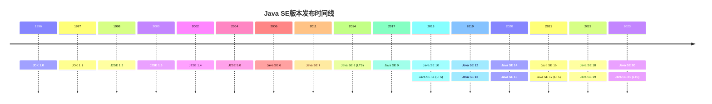

**Java SE架构演进**

Java SE的架构也在不断演进：

- **从单体到模块化**: Java 9引入JPMS，将JDK拆分为约100个模块
- **从臃肿到精简**: 引入jlink工具创建自定义运行时映像
- **从单一JDK到多种实现**: 除Oracle JDK外，还有OpenJDK、Eclipse Adoptium、Amazon Corretto等

### Java EE (Enterprise Edition)到Jakarta EE的转变

Java EE是为企业级应用设计的平台，提供了Web服务、事务管理、消息传递等企业级功能。

**J2EE时代 (1999-2006)**

早期企业版Java由Sun主导：

- **J2EE 1.2 (1999)**: 首个企业版，引入Servlet、JSP、EJB、JMS等
- **J2EE 1.3 (2001)**: 添加了连接器架构和JAAS
- **J2EE 1.4 (2003)**: 引入Web服务支持和J2EE管理API

**Java EE时代 (2006-2017)**

更名为Java EE，并简化了开发模型：

- **Java EE 5 (2006)**: 引入注解、简化EJB开发、添加JAX-WS
- **Java EE 6 (2009)**: 引入Profiles概念、CDI、JAX-RS 1.1
- **Java EE 7 (2013)**: 添加WebSocket、JSON-P、批处理API
- **Java EE 8 (2017)**: 添加HTTP/2支持、JSON-B、安全API更新

**Jakarta EE转型 (2017-至今)**

Oracle将Java EE移交给Eclipse基金会：

- **Jakarta EE 8 (2019)**: 与Java EE 8功能相同，但更名为Jakarta EE
- **Jakarta EE 9 (2020)**: 包命名从javax.*更改为jakarta.*
- **Jakarta EE 9.1 (2021)**: 支持Java SE 11
- **Jakarta EE 10 (2022)**: 引入核心Profile、更新Web Profile
- **Jakarta EE 11 (2023)**: 支持Java SE 21，增强云原生支持

**Java EE/Jakarta EE架构演进**

企业版Java的架构也经历了重大变革：

- **从重量级到轻量级**: 从复杂的EJB到轻量级的CDI和JAX-RS
- **从XML配置到注解**: 大幅减少XML配置，增加注解支持
- **从单体到微服务**: 引入MicroProfile规范支持微服务架构
- **从商业到开源**: 从Oracle控制转向Eclipse基金会开放治理

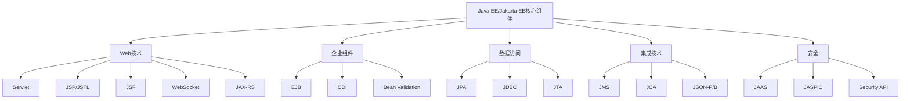

### Java ME (Micro Edition)的发展与应用场景

Java ME专为资源受限设备设计，如手机、PDA和嵌入式设备。

**早期发展 (1999-2006)**

最初针对功能手机和PDA设计：

- **J2ME 1.0 (1999)**: 引入CLDC和MIDP配置
- **J2ME 1.1 (2002)**: 改进MIDP，添加更多API
- **Java ME 3.0 (2006)**: 重新设计，支持更多设备类型

**智能手机时代的挑战 (2007-2015)**

随着Android和iOS崛起，Java ME面临挑战：

- **Java ME 4.0 (2007)**: 尝试适应智能手机市场
- **Java ME 8 (2014)**: 重大更新，与Java SE 8对齐，支持Lambda表达式

**物联网时代的复兴 (2015-至今)**

Java ME重新定位为IoT平台：

- **Java ME 8.1 (2015)**: 针对IoT设备优化
- **Java ME 8.2 (2016)**: 增强安全性和连接能力
- **Java ME 8.3 (2018)**: 改进部署模型和远程管理

**Java ME架构特点**

Java ME采用了分层架构以适应不同设备：

- **配置层**: 定义基本JVM特性和核心类库
  - CLDC (Connected Limited Device Configuration): 适用于资源极其受限的设备
  - CDC (Connected Device Configuration): 适用于资源较丰富的设备

- **配置文件层**: 在配置层基础上提供特定领域API
  - MIDP (Mobile Information Device Profile): 移动设备配置文件
  - IMP (Information Module Profile): 信息模块配置文件
  - FP (Foundation Profile): 基础配置文件

### Java嵌入式与IoT应用

Java在嵌入式和IoT领域的应用超越了传统的Java ME范畴。

**Java嵌入式解决方案**

- **Java SE Embedded**: 针对嵌入式设备优化的Java SE版本
- **Java Embedded Suite**: 包含JavaFX、Java DB等组件的嵌入式套件
- **Oracle Java ME Embedded**: 针对微控制器和小型设备的解决方案

**IoT平台与框架**

Java为IoT开发提供了多种选择：

- **Eclipse Kura**: 基于OSGi的IoT网关框架
- **Eclipse Kapua**: 模块化IoT云平台
- **Eclipse Californium**: 轻量级CoAP实现
- **Eclipse Paho**: MQTT客户端库

**实际应用场景**

Java在嵌入式和IoT领域的典型应用：

- **智能家居**: 家庭自动化控制器和网关
- **工业物联网**: 工厂自动化和监控系统
- **智能电表**: 能源管理和监控
- **医疗设备**: 患者监护和医疗数据收集
- **车载系统**: 信息娱乐和车辆诊断系统

**Java嵌入式架构特点**

- **实时性能**: 使用RTSJ (Real-Time Specification for Java)
- **内存优化**: 减少内存占用和垃圾收集暂停
- **安全性**: 加密和安全通信支持
- **远程管理**: OTA更新和远程监控能力

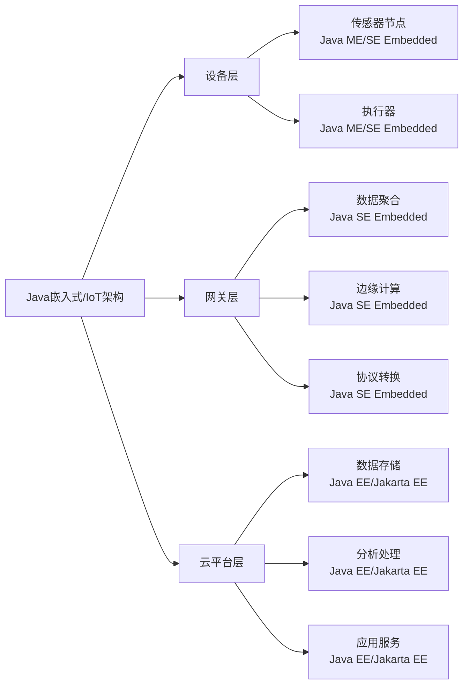

## JVM架构的演进

Java虚拟机(JVM)是Java平台的核心组件，负责执行Java字节码。JVM架构经历了多次重大演进，不断提升性能和可用性。

### 从经典JVM到HotSpot VM

**早期JVM实现 (1995-1999)**

Java最初的虚拟机实现相对简单：

- **Sun Classic VM**: 首个JVM实现，纯解释执行
- **Exact VM**: 改进的内存管理和垃圾收集
- **Sun JIT**: 早期即时编译器

**HotSpot VM的诞生与发展 (1999-至今)**

HotSpot VM由Longview Technologies开发，后被Sun收购：

- **HotSpot 1.0 (1999)**: 引入自适应优化技术
- **HotSpot 1.3 (2000)**: 成为J2SE 1.3的默认JVM
- **HotSpot 5.0 (2004)**: 引入分层编译和改进的GC
- **HotSpot 6 (2006)**: 性能优化和内存管理改进
- **HotSpot 7-8 (2011-2014)**: G1收集器成熟，PermGen移除
- **HotSpot 9-17 (2017-2021)**: 模块化支持，ZGC和Shenandoah引入
- **HotSpot 18-21 (2022-2023)**: 虚拟线程支持，GC进一步优化

**HotSpot VM的架构特点**

HotSpot VM采用了多项创新技术：

- **热点检测**: 识别频繁执行的代码并优化
- **即时编译**: 将热点字节码编译为本地代码
- **自适应优化**: 根据运行时信息调整优化策略
- **分代垃圾收集**: 根据对象生命周期特性优化GC
- **线程模型**: 将Java线程映射到操作系统线程

**其他重要JVM实现**

除HotSpot外，还有其他重要的JVM实现：

- **IBM J9**: IBM开发的高性能JVM，现为Eclipse OpenJ9
- **JRockit**: BEA开发的服务器JVM，后被Oracle收购并与HotSpot合并
- **Azul Zing/Prime**: 低延迟、大内存JVM
- **Android ART**: Android平台的运行时，前身为Dalvik VM
- **GraalVM**: Oracle开发的多语言虚拟机

### 从分代收集到ZGC/Shenandoah

垃圾收集(GC)是JVM的核心功能，其演进反映了Java平台对性能和可用性的追求。

**早期垃圾收集器 (1995-2004)**

最初的GC算法相对简单：

- **Serial GC**: 单线程标记-复制(年轻代)和标记-整理(老年代)算法
- **ParNew**: Serial GC的并行版本，多线程收集年轻代
- **Parallel Scavenge**: 关注吞吐量的年轻代收集器
- **Serial Old**: 单线程标记-整理老年代收集器
- **Parallel Old**: Parallel Scavenge的老年代版本

**并发收集器时代 (2004-2017)**

为减少停顿时间，引入了并发收集技术：

- **CMS (Concurrent Mark Sweep)**: 低延迟老年代收集器，大部分工作与应用并发执行
- **G1 (Garbage First)**: 面向服务器的收集器，将堆分割为多个区域，可预测的停顿时间

**现代低延迟收集器 (2018-至今)**

为满足实时性要求，开发了新一代GC：

- **ZGC (Z Garbage Collector)**: 可扩展的低延迟收集器，停顿时间不超过10ms
- **Shenandoah**: Red Hat开发的低延迟GC，与应用程序并发执行大部分工作
- **Epsilon**: 实验性的无操作收集器，适用于短生命周期应用

**垃圾收集器性能对比**

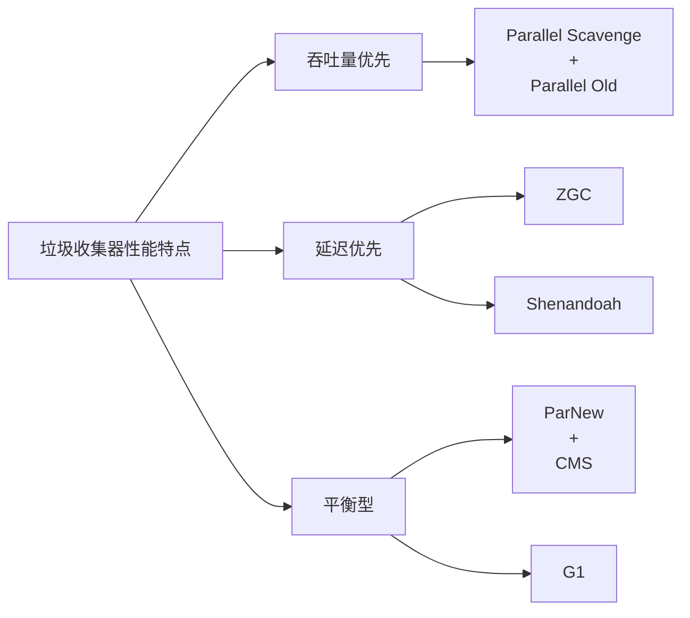

**GC算法技术演进**

垃圾收集算法也在不断创新：

- **从分代到区域**: G1将堆分为多个区域，而不是连续的年轻代和老年代
- **从标记-清除到标记-复制**: 减少内存碎片问题
- **从STW到并发**: 减少停顿时间，提高响应性
- **从引用计数到可达性分析**: 解决循环引用问题
- **从保守式GC到精确式GC**: 提高GC精度和效率
- **从固定大小堆到弹性堆**: 根据应用需求动态调整堆大小

**GC调优参数演进**

GC相关的JVM参数也在不断简化和统一：

- **早期**: 大量分散的参数，如-XX:+UseSerialGC, -XX:+UseParallelGC
- **统一日志**: Java 9引入-Xlog替代-XX:+PrintGCDetails等
- **自适应调整**: 更多参数默认为自动调整，减少手动配置需求

### 从解释执行到JIT编译

Java执行模型从纯解释执行发展到复杂的即时编译系统，大幅提升了性能。

**纯解释执行时代 (1995-1997)**

最初的JVM采用纯解释执行模式：

- **字节码解释器**: 逐条解释执行字节码指令
- **性能问题**: 执行速度慢，无法与本地代码竞争
- **优势**: 实现简单，跨平台一致性好

**早期JIT编译 (1997-2000)**

为提高性能，引入了简单的JIT编译：

- **Sun JIT**: JDK 1.1引入的简单JIT编译器
- **Symantec JIT**: 早期高性能JIT实现
- **工作原理**: 将整个方法一次性编译为本地代码
- **局限性**: 编译开销大，内存占用高

**HotSpot混合执行模型 (1999-2008)**

HotSpot VM引入了创新的混合执行模型：

- **解释执行+JIT编译**: 初始解释执行，热点代码JIT编译
- **热点检测**: 使用计数器识别频繁执行的方法和循环
- **自适应优化**: 根据运行时信息调整编译策略
- **去优化**: 当假设不再成立时，回退到解释执行

**JIT编译器的关键优化技术**

现代JIT编译器采用了多种优化技术：

- **方法内联**: 将调用的方法代码直接插入调用点
- **逃逸分析**: 确定对象是否逃逸出方法或线程
- **锁消除**: 移除不必要的同步
- **循环优化**: 循环展开、循环不变量外提、循环向量化
- **分支预测**: 优化条件分支执行
- **类型特化**: 为特定类型生成优化代码
- **部分逃逸分析**: 允许部分对象逃逸

**JIT编译的执行流程**

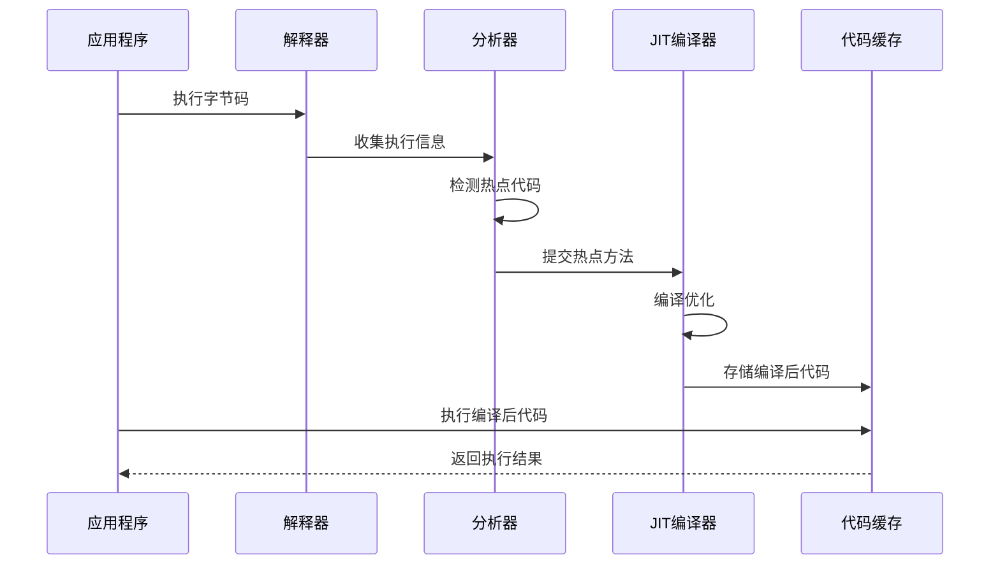

### 从单JIT到分层编译

随着JVM技术的发展，编译系统也从单一编译器发展为多层次编译架构。

**单一编译器时代 (1999-2008)**

早期HotSpot VM提供了两种编译器，但一次只能使用一种：

- **客户端编译器(C1)**: 快速编译，中等优化，适合客户端应用
- **服务器编译器(C2)**: 慢速编译，激进优化，适合长时间运行的服务器应用
- **使用方式**: 通过-client或-server参数选择

**分层编译的引入 (2008-2014)**

Java 7引入了实验性的分层编译，Java 8默认启用：

- **Level 0**: 解释执行
- **Level 1**: C1编译，无分析
- **Level 2**: C1编译，基本分析
- **Level 3**: C1编译，完全分析
- **Level 4**: C2编译，完全优化

**分层编译的优势**

分层编译结合了C1和C2的优点：

- **快速启动**: 使用C1快速编译热点方法
- **高峰值性能**: 热点方法最终由C2优化
- **资源平衡**: 根据方法重要性分配编译资源
- **自适应优化**: 根据运行时反馈调整编译策略

**现代分层编译增强 (2014-至今)**

Java 9-21进一步增强了分层编译：

- **AOT编译集成**: 可与提前编译结合使用
- **分层编译微调**: 更精细的编译策略控制
- **编译器接口(JVMCI)**: 允许使用Java编写的编译器
- **Graal编译器集成**: 作为实验性C2替代品

**编译器优化技术演进**

编译器优化技术也在不断发展：

- **从基本优化到高级优化**: 增加了更复杂的优化技术
- **从通用优化到特定优化**: 针对特定Java特性的优化
- **从静态分析到动态分析**: 利用运行时信息指导优化
- **从单一优化到组合优化**: 多种优化技术协同工作

### 从传统VM到GraalVM

GraalVM代表了Java虚拟机技术的一个重要发展方向，提供了多语言支持和高性能执行环境。

**GraalVM的起源与发展**

GraalVM由Oracle Labs开发，经历了多个阶段：

- **研究阶段 (2012-2016)**: 作为研究项目开始
- **早期版本 (2017-2018)**: 发布实验性版本
- **GraalVM 19 (2019)**: 首个生产版本
- **GraalVM 20-21 (2020-2021)**: 功能和性能增强
- **GraalVM 22 (2022)**: 与JDK 17 LTS对齐
- **GraalVM 23 (2023)**: 与JDK 20/21对齐，性能优化

**GraalVM的核心组件**

GraalVM由多个关键组件组成：

- **Graal编译器**: 用Java编写的高性能JIT编译器
- **Truffle框架**: 语言实现框架，简化新语言开发
- **Sulong**: LLVM bitcode解释器，支持C/C++等语言
- **Native Image**: 将Java应用编译为本地可执行文件
- **Polyglot API**: 多语言互操作API

**GraalVM支持的语言**

GraalVM提供了广泛的语言支持：

- **JVM语言**: Java, Scala, Kotlin, Clojure等
- **JavaScript/Node.js**: 通过Graal.js实现
- **Python**: 通过GraalPython实现
- **Ruby**: 通过TruffleRuby实现
- **R**: 通过FastR实现
- **WebAssembly**: 通过GraalWasm实现
- **C/C++**: 通过Sulong运行LLVM bitcode

**GraalVM的架构创新**

GraalVM引入了多项架构创新：

- **多语言运行时**: 在同一VM中执行多种语言
- **共享内存模型**: 不同语言间高效数据交换
- **部分求值**: 编译时执行部分程序逻辑
- **多层次优化**: 从AST解释到机器码编译
- **多语言调试**: 统一的调试体验

**GraalVM Native Image**

Native Image是GraalVM的一个重要特性：

- **AOT编译**: 将Java应用编译为独立的本地可执行文件
- **优势**: 快速启动、低内存占用、无JVM依赖
- **限制**: 动态特性受限，反射需要配置
- **应用场景**: Serverless、微服务、命令行工具
- **生态系统**: Spring Native, Quarkus, Micronaut等框架支持

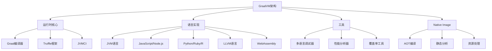

**传统JVM与GraalVM对比**

GraalVM与传统JVM相比有多项差异：

- **语言支持**: 传统JVM主要支持JVM语言，GraalVM支持多种语言
- **优化策略**: GraalVM提供更激进的优化
- **部署选项**: GraalVM提供本地可执行文件选项
- **内存模型**: GraalVM允许不同语言共享内存
- **生态系统**: GraalVM扩展了Java生态系统边界

## Java生态系统的扩展

Java生态系统从最初的核心平台发展成为一个庞大而多样化的技术生态，涵盖了从桌面到云端的各种应用场景。

### 从Applet到JavaFX

Java在客户端UI技术方面经历了多次重大变革，从早期的Applet到现代的JavaFX。

**Applet时代 (1995-2010)**

Java最初的客户端技术是Applet：

- **工作原理**: 嵌入网页的Java小程序
- **优势**: 跨平台、安全沙箱、丰富交互
- **局限性**: 浏览器插件依赖、启动慢、安全问题
- **应用场景**: 网页游戏、交互式应用、企业内部应用

```java
// 典型Applet示例
public class HelloWorldApplet extends Applet {
    public void paint(Graphics g) {
        g.drawString("Hello World!", 50, 25);
    }
}
```

**Swing时代 (1998-2014)**

Swing成为Java桌面应用的主要UI工具包：

- **特点**: 纯Java实现、轻量级组件、可插拔外观
- **架构**: M
让我继续完成Java平台架构演进的内容：

**Swing时代 (1998-2014)**

Swing成为Java桌面应用的主要UI工具包：

- **特点**: 纯Java实现、轻量级组件、可插拔外观
- **架构**: MVC设计模式、双缓冲绘制
- **优势**: 丰富组件库、跨平台一致性、可定制性
- **局限性**: 性能问题、原生外观集成困难
- **应用场景**: 企业应用、开发工具、科学计算软件

```java
// 典型Swing应用示例
public class SwingDemo extends JFrame {
    public SwingDemo() {
        setTitle("Swing Demo");
        setSize(300, 200);
        setDefaultCloseOperation(JFrame.EXIT_ON_CLOSE);
        
        JButton button = new JButton("Click Me");
        button.addActionListener(e -> JOptionPane.showMessageDialog(this, "Hello World!"));
        
        getContentPane().setLayout(new FlowLayout());
        getContentPane().add(button);
    }
    
    public static void main(String[] args) {
        SwingUtilities.invokeLater(() -> new SwingDemo().setVisible(true));
    }
}
```

**SWT和Eclipse RCP (2001-至今)**

IBM开发的SWT提供了更好的原生集成：

- **特点**: 使用原生操作系统组件、JNI实现
- **架构**: 轻量级包装器、手动资源管理
- **优势**: 原生外观和性能、与平台紧密集成
- **局限性**: 平台依赖、需要手动释放资源
- **应用场景**: Eclipse IDE、企业应用、RCP应用

**JavaFX的诞生与发展 (2008-至今)**

JavaFX作为现代Java UI平台：

- **JavaFX 1.0 (2008)**: 使用JavaFX Script语言
- **JavaFX 2.0 (2011)**: 重写为Java API
- **JavaFX 8 (2014)**: 集成到Java 8，功能完善
- **JavaFX 11+ (2018-至今)**: 从JDK分离，成为独立模块

**JavaFX的现代特性**

JavaFX提供了丰富的现代UI功能：

- **声明式UI**: 使用FXML定义界面
- **CSS样式**: 使用CSS自定义外观
- **富媒体支持**: 内置音频、视频、Web支持
- **3D图形**: 支持3D场景和效果
- **响应式布局**: 自适应不同屏幕尺寸
- **动画和过渡**: 内置动画框架
- **WebView**: 嵌入式Web浏览器组件

```java
// JavaFX应用示例
public class JavaFXDemo extends Application {
    @Override
    public void start(Stage primaryStage) {
        Button btn = new Button("Say 'Hello World'");
        btn.setOnAction(e -> {
            Alert alert = new Alert(AlertType.INFORMATION);
            alert.setTitle("Information");
            alert.setHeaderText(null);
            alert.setContentText("Hello World!");
            alert.showAndWait();
        });
        
        StackPane root = new StackPane();
        root.getChildren().add(btn);
        
        Scene scene = new Scene(root, 300, 250);
        
        primaryStage.setTitle("JavaFX Demo");
        primaryStage.setScene(scene);
        primaryStage.show();
    }
    
    public static void main(String[] args) {
        launch(args);
    }
}
```

**FXML声明式UI示例**

```xml
<!-- sample.fxml -->
<?xml version="1.0" encoding="UTF-8"?>
<?import javafx.scene.control.*?>
<?import javafx.scene.layout.*?>

<VBox xmlns="http://javafx.com/javafx" 
      xmlns:fx="http://javafx.com/fxml"
      fx:controller="com.example.SampleController"
      spacing="10" padding="20">
    <Label text="Hello JavaFX" style="-fx-font-size: 20px;"/>
    <TextField fx:id="nameField" promptText="Enter your name"/>
    <Button text="Greet" onAction="#handleGreetAction"/>
</VBox>
```

**客户端UI技术演进对比**

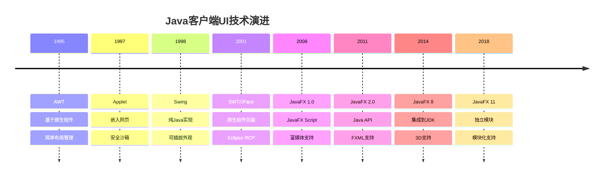

### 从Servlet到Spring生态

Java Web技术从简单的Servlet发展成为以Spring为核心的庞大生态系统。

**Servlet时代 (1997-2003)**

Servlet是Java Web开发的基础：

- **Servlet 1.0 (1997)**: 基本的请求处理模型
- **Servlet 2.2 (1999)**: 引入WAR部署格式
- **Servlet 2.3 (2001)**: 引入过滤器和监听器
- **JSP 1.0-1.2**: 将Java代码嵌入HTML

```java
// 典型Servlet示例
public class HelloServlet extends HttpServlet {
    @Override
    protected void doGet(HttpServletRequest request, HttpServletResponse response) 
            throws ServletException, IOException {
        response.setContentType("text/html");
        PrintWriter out = response.getWriter();
        out.println("<html><body>");
        out.println("<h1>Hello, World!</h1>");
        out.println("</body></html>");
    }
}
```

**MVC框架兴起 (2003-2009)**

为解决Servlet/JSP混合模式的问题，MVC框架兴起：

- **Struts 1.x**: 最早流行的MVC框架
- **WebWork**: 影响后来Struts 2的框架
- **JSF 1.0-1.2**: 标准组件化Web框架
- **Spring MVC早期版本**: 基于Spring的MVC实现

```java
// Struts 1.x Action示例
public class HelloAction extends Action {
    public ActionForward execute(ActionMapping mapping, ActionForm form,
                                HttpServletRequest request, HttpServletResponse response)
            throws Exception {
        request.setAttribute("message", "Hello, World!");
        return mapping.findForward("success");
    }
}
```

**Spring崛起 (2004-2013)**

Spring框架逐渐成为Java企业开发的主流：

- **Spring 1.0 (2004)**: 引入IoC容器和AOP
- **Spring 2.0-2.5 (2006-2008)**: 注解支持、Java配置
- **Spring 3.0 (2009)**: REST支持、Java 5+特性
- **Spring 3.1-3.2 (2011-2012)**: 缓存抽象、异步支持

```java
// Spring MVC控制器示例
@Controller
public class HelloController {
    @RequestMapping("/hello")
    public String hello(Model model) {
        model.addAttribute("message", "Hello, World!");
        return "hello";
    }
}
```

**Spring Boot革命 (2014-至今)**

Spring Boot彻底简化了Spring应用开发：

- **Spring Boot 1.0 (2014)**: 自动配置、内嵌服务器
- **Spring Boot 1.5 (2017)**: 生产就绪特性增强
- **Spring Boot 2.0 (2018)**: 响应式编程支持
- **Spring Boot 2.5-2.7 (2021-2022)**: 原生镜像支持、可观测性
- **Spring Boot 3.0+ (2022-2023)**: Jakarta EE 9+支持、虚拟线程

```java
// Spring Boot应用示例
@SpringBootApplication
public class HelloApplication {
    public static void main(String[] args) {
        SpringApplication.run(HelloApplication.class, args);
    }
}

@RestController
class HelloController {
    @GetMapping("/hello")
    public String hello() {
        return "Hello, World!";
    }
}
```

**Spring Cloud与微服务 (2015-至今)**

Spring Cloud提供了完整的微服务解决方案：

- **Spring Cloud Netflix**: 集成Netflix OSS组件
- **Spring Cloud Config**: 分布式配置
- **Spring Cloud Gateway**: API网关
- **Spring Cloud Stream**: 消息驱动微服务
- **Spring Cloud Sleuth/Zipkin**: 分布式追踪

```java
// Spring Cloud服务发现示例
@SpringBootApplication
@EnableDiscoveryClient
public class ServiceApplication {
    public static void main(String[] args) {
        SpringApplication.run(ServiceApplication.class, args);
    }
}

@RestController
class ServiceController {
    @Autowired
    private DiscoveryClient discoveryClient;
    
    @GetMapping("/services")
    public List<String> getServices() {
        return discoveryClient.getServices();
    }
}
```

**响应式Spring (2017-至今)**

Spring 5引入了响应式编程模型：

- **Spring WebFlux**: 响应式Web框架
- **Spring Data R2DBC**: 响应式数据访问
- **Spring Cloud Stream**: 响应式消息处理
- **Spring Security Reactive**: 响应式安全

```java
// Spring WebFlux示例
@RestController
public class ReactiveController {
    @GetMapping("/flux")
    public Flux<String> getFlux() {
        return Flux.just("Hello", "Reactive", "World")
                  .delayElements(Duration.ofMillis(500));
    }
    
    @GetMapping("/mono")
    public Mono<String> getMono() {
        return Mono.just("Hello Reactive World")
                  .delayElement(Duration.ofSeconds(1));
    }
}
```

**Spring生态系统**

Spring已发展成为一个庞大的生态系统：

- **Spring Framework**: 核心容器、AOP、数据访问等
- **Spring Boot**: 简化Spring应用开发
- **Spring Cloud**: 分布式系统和微服务支持
- **Spring Data**: 简化数据访问层
- **Spring Security**: 安全框架
- **Spring Batch**: 批处理框架
- **Spring Integration**: 企业集成模式
- **Spring Session**: 分布式会话管理
- **Spring HATEOAS**: 超媒体API支持
- **Spring GraphQL**: GraphQL支持

```mermaid
graph TD
    A[Spring生态系统] --> B[Spring Framework]
    A --> C[Spring Boot]
    A --> D[Spring Cloud]
    A --> E[Spring Data]
    A --> F[Spring Security]
    A --> G[其他Spring项目]
    
    B --> B1[Core]
    B --> B2[Web MVC]
    B --> B3[WebFlux]
    B --> B4[AOP]
    B --> B5[Data Access]
    
    C --> C1[自动配置]
    C --> C2[内嵌服务器]
    C --> C3[Actuator]
    C --> C4[DevTools]
    
    D --> D1[Config]
    D --> D2[Discovery]
    D --> D3[Gateway]
    D --> D4[Circuit Breaker]
    
    E --> E1[JPA]
    E --> E2[MongoDB]
    E --> E3[Redis]
    E --> E4[R2DBC]
    
    F --> F1[认证]
    F --> F2[授权]
    F --> F3[OAuth2]
    F --> F4[SAML]
    
    G --> G1[Batch]
    G --> G2[Integration]
    G --> G3[Session]
    G --> G4[GraphQL]
```

### 从EJB到微服务架构

企业Java应用架构经历了从单体EJB到微服务的重大变革。

**EJB时代 (1998-2006)**

EJB是早期Java企业应用的主要组件模型：

- **EJB 1.0 (1998)**: 初始版本，复杂的编程模型
- **EJB 2.0 (2001)**: 增加消息驱动Bean，但仍然复杂
- **EJB 2.1 (2003)**: 添加Web服务支持
- **问题**: 重量级、复杂XML配置、测试困难

```java
// EJB 2.x示例
public interface HelloService extends EJBObject {
    String sayHello(String name) throws RemoteException;
}

public class HelloServiceBean implements SessionBean {
    public String sayHello(String name) {
        return "Hello, " + name + "!";
    }
    
    // 必须实现的生命周期方法
    public void setSessionContext(SessionContext ctx) {}
    public void ejbCreate() {}
    public void ejbRemove() {}
    public void ejbActivate() {}
    public void ejbPassivate() {}
}
```

**轻量级框架革命 (2004-2010)**

Spring等轻量级框架改变了Java企业开发：

- **Spring Framework**: IoC容器替代EJB容器
- **Hibernate**: ORM框架简化数据访问
- **Struts/Spring MVC**: 简化Web层开发
- **优势**: 轻量级、POJO编程、测试友好

```java
// Spring轻量级服务示例
@Service
public class HelloServiceImpl implements HelloService {
    public String sayHello(String name) {
        return "Hello, " + name + "!";
    }
}
```

**Java EE简化 (2006-2013)**

Java EE也开始简化其编程模型：

- **EJB 3.0 (2006)**: 基于注解的简化模型
- **EJB 3.1-3.2 (2009-2013)**: 进一步简化，添加单例Bean
- **CDI**: 依赖注入标准化
- **JAX-RS**: REST API标准

```java
// EJB 3.x示例
@Stateless
public class HelloServiceBean implements HelloService {
    public String sayHello(String name) {
        return "Hello, " + name + "!";
    }
}
```

**SOA与Web服务 (2005-2012)**

面向服务架构成为企业集成的主流：

- **SOAP Web服务**: 基于XML的服务协议
- **WSDL**: Web服务描述语言
- **JAX-WS**: Java Web服务标准
- **ESB**: 企业服务总线
- **问题**: 复杂协议、重量级XML、性能开销

```java
// JAX-WS Web服务示例
@WebService
public class HelloWebService {
    @WebMethod
    public String sayHello(@WebParam(name = "name") String name) {
        return "Hello, " + name + "!";
    }
}
```

**REST API兴起 (2008-2014)**

REST成为Web API的主流设计风格：

- **JAX-RS**: Java REST API标准
- **Jersey/RESTEasy**: JAX-RS实现
- **Spring MVC REST**: Spring的REST支持
- **优势**: 轻量级、易于理解、HTTP原生

```java
// JAX-RS REST API示例
@Path("/hello")
public class HelloResource {
    @GET
    @Path("/{name}")
    @Produces(MediaType.TEXT_PLAIN)
    public String sayHello(@PathParam("name") String name) {
        return "Hello, " + name + "!";
    }
}
```

**微服务架构兴起 (2014-至今)**

微服务成为现代分布式系统的主流架构：

- **特点**: 小型、专注、自治服务
- **技术栈**: Spring Boot/Cloud、MicroProfile
- **部署模型**: 容器化、Kubernetes
- **优势**: 独立开发部署、技术多样性、弹性扩展

```java
// Spring Boot微服务示例
@SpringBootApplication
public class UserServiceApplication {
    public static void main(String[] args) {
        SpringApplication.run(UserServiceApplication.class, args);
    }
}

@RestController
@RequestMapping("/users")
class UserController {
    @Autowired
    private UserService userService;
    
    @GetMapping("/{id}")
    public User getUser(@PathVariable Long id) {
        return userService.findById(id);
    }
}
```

**微服务架构模式**

微服务架构引入了多种设计模式：

- **API网关**: 统一入口点和路由
- **服务发现**: 动态定位服务实例
- **配置中心**: 集中管理配置
- **断路器**: 防止级联故障
- **事件溯源**: 基于事件的状态管理
- **CQRS**: 命令查询职责分离
- **后端为前端(BFF)**: 为前端定制的API

**云原生架构 (2017-至今)**

微服务进一步演进为云原生架构：

- **12因素应用**: 云原生应用设计原则
- **不可变基础设施**: 容器和镜像
- **声明式API**: Kubernetes资源定义
- **服务网格**: Istio, Linkerd等
- **无服务器**: 函数即服务(FaaS)

```yaml
# Kubernetes部署示例
apiVersion: apps/v1
kind: Deployment
metadata:
  name: user-service
spec:
  replicas: 3
  selector:
    matchLabels:
      app: user-service
  template:
    metadata:
      labels:
        app: user-service
    spec:
      containers:
      - name: user-service
        image: example/user-service:latest
        ports:
        - containerPort: 8080
```

**企业应用架构演进**

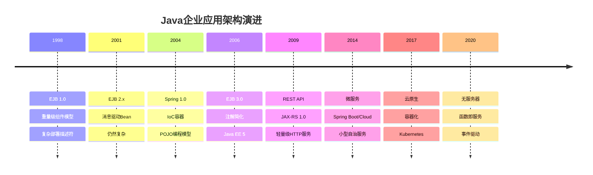

### 从JDBC到ORM框架

Java数据访问技术从底层JDBC发展到高级ORM框架，大幅简化了数据库操作。

**JDBC时代 (1997-2003)**

JDBC提供了Java访问关系数据库的标准API：

- **JDBC 1.0 (1997)**: 基本数据库访问
- **JDBC 2.0 (1999)**: 添加连接池、批处理
- **JDBC 3.0 (2001)**: 保存点、参数元数据
- **问题**: 冗长代码、手动资源管理、SQL硬编码

```java
// 典型JDBC示例
Connection conn = null;
PreparedStatement stmt = null;
ResultSet rs = null;
try {
    conn = DriverManager.getConnection("jdbc:mysql://localhost/test", "user", "password");
    stmt = conn.prepareStatement("SELECT * FROM users WHERE id = ?");
    stmt.setLong(1, 1L);
    rs = stmt.executeQuery();
    
    if (rs.next()) {
        String name = rs.getString("name");
        String email = rs.getString("email");
        System.out.println("User: " + name + ", " + email);
    }
} catch (SQLException e) {
    e.printStackTrace();
} finally {
    try { if (rs != null) rs.close(); } catch (SQLException e) {}
    try { if (stmt != null) stmt.close(); } catch (SQLException e) {}
    try { if (conn != null) conn.close(); } catch (SQLException e) {}
}
```

**早期ORM框架 (2001-2005)**

为简化数据访问，出现了多种ORM框架：

- **Hibernate 1.0 (2001)**: 最流行的ORM框架
- **TopLink**: Oracle的ORM解决方案
- **iBATIS (后来的MyBatis)**: 轻量级SQL映射
- **JDO**: Java数据对象标准

```java
// Hibernate 2.x示例
Session session = sessionFactory.openSession();
Transaction tx = null;
try {
    tx = session.beginTransaction();
    User user = (User) session.get(User.class, 1L);
    System.out.println("User: " + user.getName() + ", " + user.getEmail());
    tx.commit();
} catch (Exception e) {
    if (tx != null) tx.rollback();
    throw e;
} finally {
    session.close();
}
```

**JPA标准化 (2006-2013)**

Java持久化API统一了ORM标准：

- **JPA 1.0 (2006)**: 基本ORM功能标准化
- **JPA 2.0 (2009)**: 添加Criteria API
- **JPA 2.1 (2013)**: 存储过程、批量操作增强
- **实现**: Hibernate, EclipseLink, OpenJPA

```java
// JPA 2.x示例
EntityManager em = emf.createEntityManager();
EntityTransaction tx = null;
try {
    tx = em.getTransaction();
    tx.begin();
    
    User user = em.find(User.class, 1L);
    System.out.println("User: " + user.getName() + ", " + user.getEmail());
    
    tx.commit();
} catch (Exception e) {
    if (tx != null && tx.isActive()) tx.rollback();
    throw e;
} finally {
    em.close();
}
```

**Spring数据访问抽象 (2004-至今)**

Spring提供了统一的数据访问抽象：

- **JdbcTemplate**: 简化JDBC操作
- **HibernateTemplate**: 简化Hibernate操作
- **JpaTemplate**: 简化JPA操作
- **事务管理**: 声明式事务支持

```java
// Spring JdbcTemplate示例
@Repository
public class UserDaoImpl implements UserDao {
    @Autowired
    private JdbcTemplate jdbcTemplate;
    
    public User findById(Long id) {
        return jdbcTemplate.queryForObject(
            "SELECT * FROM users WHERE id = ?",
            new Object[]{id},
            (rs, rowNum) -> new User(
                rs.getLong("id"),
                rs.getString("name"),
                rs.getString("email")
            )
        );
    }
}
```

**Spring Data革命 (2011-至今)**

Spring Data进一步简化了数据访问：

- **Spring Data JPA**: 自动生成JPA仓库实现
- **Spring Data MongoDB**: MongoDB支持
- **Spring Data Redis**: Redis支持
- **Spring Data REST**: 自动REST API生成

```java
// Spring Data JPA示例
public interface UserRepository extends JpaRepository<User, Long> {
    // 自动实现的方法
    List<User> findByNameContaining(String name);
    
    // 自定义查询
    @Query("SELECT u FROM User u WHERE u.email LIKE %:domain%")
    List<User> findByEmailDomain(@Param("domain") String domain);
}

// 使用仓库
@Service
public class UserService {
    @Autowired
    private UserRepository userRepository;
    
    public User findById(Long id) {
        return userRepository.findById(id).orElseThrow(() -> 
            new EntityNotFoundException("User not found: " + id));
    }
}
```

**响应式数据访问 (2017-至今)**

响应式编程模型扩展到数据访问层：

- **R2DBC**: 响应式关系数据库连接
- **Spring Data R2DBC**: 响应式SQL数据访问
- **Spring Data Reactive MongoDB**: 响应式MongoDB
- **Spring Data Reactive Redis**: 响应式Redis

```java
// Spring Data R2DBC示例
public interface UserRepository extends ReactiveCrudRepository<User, Long> {
    Flux<User> findByNameContaining(String name);
}

@Service
public class UserService {
    @Autowired
    private UserRepository userRepository;
    
    public Mono<User> findById(Long id) {
        return userRepository.findById(id)
            .switchIfEmpty(Mono.error(new EntityNotFoundException("User not found: " + id)));
    }
}
```

**NoSQL数据库集成 (2010-至今)**

Java生态系统扩展到NoSQL数据库：

- **MongoDB**: 文档数据库
- **Redis**: 键值存储
- **Cassandra**: 列族数据库
- **Neo4j**: 图数据库
- **Elasticsearch**: 搜索引擎

```java
// Spring Data MongoDB示例
@Document
public class Product {
    @Id
    private String id;
    private String name;
    private BigDecimal price;
    private List<String> categories;
    // getters and setters
}

public interface ProductRepository extends MongoRepository<Product, String> {
    List<Product> findByCategoriesContaining(String category);
}
```

**数据访问技术演进**

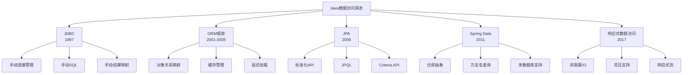

### 从传统部署到云原生应用

Java应用部署模式经历了从传统部署到云原生的重大变革。

**传统部署时代 (1995-2005)**

早期Java应用采用传统部署模式：

- **WAR/EAR文件**: 标准Java Web/企业应用打包
- **应用服务器**: WebLogic, WebSphere, JBoss
- **部署流程**: 手动部署、停机更新
- **扩展方式**: 垂直扩展、集群配置复杂

**虚拟化时代 (2005-2013)**

虚拟化技术改变了部署模式：

- **虚拟机**: VMware, Xen, KVM
- **部署单元**: 虚拟机镜像
- **优势**: 资源隔离、快照、迁移
- **挑战**: 资源开销大、启动慢、镜像大

**容器化革命 (2013-至今)**

Docker引领了容器化革命：

- **容器技术**: Docker, containerd, CRI-O
- **镜像格式**: OCI标准镜像
- **优势**: 轻量级、快速启动、一致环境
- **Java容器化**: 专用基础镜像、JVM调优

```dockerfile
# Java应用Dockerfile示例
FROM openjdk:17-slim
WORKDIR /app
COPY target/myapp.jar app.jar
EXPOSE 8080
ENTRYPOINT ["java", "-jar", "app.jar"]
```

**容器编排平台 (2015-至今)**

Kubernetes成为容器编排的事实标准：

- **核心概念**: Pod, Deployment, Service, Ingress
- **自动化**: 自动扩展、自愈、滚动更新
- **Java部署**: 资源配置、健康检查、配置管理

```yaml
# Kubernetes部署示例
apiVersion: apps/v1
kind: Deployment
metadata:
  name: java-app
spec:
  replicas: 3
  selector:
    matchLabels:
      app: java-app
  template:
    metadata:
      labels:
        app: java-app
    spec:
      containers:
      - name: java-app
        image: myregistry/java-app:1.0
        ports:
        - containerPort: 8080
        resources:
          requests:
            memory: "512Mi"
            cpu: "
让我继续完成Java平台架构演进的内容：

```yaml
# Kubernetes部署示例
apiVersion: apps/v1
kind: Deployment
metadata:
  name: java-app
spec:
  replicas: 3
  selector:
    matchLabels:
      app: java-app
  template:
    metadata:
      labels:
        app: java-app
    spec:
      containers:
      - name: java-app
        image: myregistry/java-app:1.0
        ports:
        - containerPort: 8080
        resources:
          requests:
            memory: "512Mi"
            cpu: "500m"
          limits:
            memory: "1Gi"
            cpu: "1000m"
        readinessProbe:
          httpGet:
            path: /actuator/health
            port: 8080
          initialDelaySeconds: 30
          periodSeconds: 10
        livenessProbe:
          httpGet:
            path: /actuator/health/liveness
            port: 8080
          initialDelaySeconds: 60
          periodSeconds: 15
```

**云原生Java应用 (2017-至今)**

云原生架构为Java应用带来了新的设计理念：

- **12因素应用**: 配置外部化、无状态设计
- **健康检查**: 应用自检和报告健康状态
- **可观测性**: 指标、日志、追踪三大支柱
- **弹性设计**: 断路器、重试、超时、舱壁模式

```java
// Spring Boot Actuator健康检查示例
@Component
public class DatabaseHealthIndicator implements HealthIndicator {
    @Autowired
    private DataSource dataSource;
    
    @Override
    public Health health() {
        try (Connection conn = dataSource.getConnection()) {
            PreparedStatement ps = conn.prepareStatement("SELECT 1");
            ResultSet rs = ps.executeQuery();
            if (rs.next()) {
                return Health.up()
                    .withDetail("database", "Available")
                    .build();
            }
            return Health.down()
                .withDetail("database", "Cannot execute query")
                .build();
        } catch (SQLException e) {
            return Health.down()
                .withDetail("database", "Unavailable")
                .withException(e)
                .build();
        }
    }
}
```

**Serverless Java (2018-至今)**

无服务器架构为Java带来了新的挑战和机遇：

- **AWS Lambda**: 支持Java运行时
- **Azure Functions**: Java函数支持
- **Google Cloud Functions**: Java支持
- **挑战**: 冷启动时间、内存占用
- **解决方案**: GraalVM原生镜像、Quarkus、Micronaut

```java
// AWS Lambda Java函数示例
public class MyHandler implements RequestHandler<APIGatewayProxyRequestEvent, APIGatewayProxyResponseEvent> {
    @Override
    public APIGatewayProxyResponseEvent handleRequest(APIGatewayProxyRequestEvent input, Context context) {
        context.getLogger().log("Processing request: " + input.getBody());
        
        APIGatewayProxyResponseEvent response = new APIGatewayProxyResponseEvent();
        response.setStatusCode(200);
        response.setBody("Hello from Lambda!");
        
        return response;
    }
}
```

**Java应用部署模式演进**

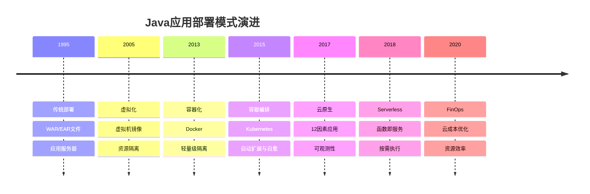

**云原生Java框架**

为适应云原生环境，出现了专门的Java框架：

- **Quarkus**: 为Kubernetes优化的超音速Java框架
- **Micronaut**: 低内存占用、快速启动的微服务框架
- **Helidon**: Oracle开发的微服务框架
- **Spring Native**: Spring应用的GraalVM原生镜像支持

```java
// Quarkus REST服务示例
@Path("/hello")
public class GreetingResource {
    @GET
    @Produces(MediaType.TEXT_PLAIN)
    public String hello() {
        return "Hello from Quarkus";
    }
}
```

## Java平台的未来发展方向

Java平台持续创新，多个重要项目正在塑造Java的未来。

### Project Loom与虚拟线程

**背景与目标**

Project Loom旨在彻底改革Java的并发模型：

- **问题**: 传统线程是重量级资源，限制了并发能力
- **目标**: 提供轻量级线程实现，支持高并发
- **状态**: Java 19引入预览，Java 21正式发布

**虚拟线程的核心特性**

虚拟线程是Java平台的重大创新：

- **轻量级**: 可创建数百万个虚拟线程
- **调度**: 由JVM管理，而非操作系统
- **编程模型**: 与传统线程API兼容
- **适用场景**: I/O密集型应用、高并发服务

```java
// Java 21虚拟线程示例
public class VirtualThreadDemo {
    public static void main(String[] args) throws Exception {
        // 创建单个虚拟线程
        Thread vThread = Thread.ofVirtual().start(() -> {
            System.out.println("Running in virtual thread");
        });
        vThread.join();
        
        // 使用虚拟线程执行器
        try (var executor = Executors.newVirtualThreadPerTaskExecutor()) {
            // 提交大量任务，每个任务一个虚拟线程
            for (int i = 0; i < 10_000; i++) {
                final int taskId = i;
                executor.submit(() -> {
                    // 模拟I/O操作
                    try {
                        Thread.sleep(100);
                        System.out.println("Task " + taskId + " completed");
                    } catch (InterruptedException e) {
                        Thread.currentThread().interrupt();
                    }
                    return taskId;
                });
            }
            // 执行器关闭时会等待所有任务完成
        }
    }
}
```

**结构化并发**

Loom还引入了结构化并发API：

- **目标**: 简化多任务协作和生命周期管理
- **特性**: 父子任务关系、自动传播取消
- **状态**: Java 19-21预览特性

```java
// 结构化并发示例
try (var scope = new StructuredTaskScope.ShutdownOnFailure()) {
    // 并行执行多个子任务
    Future<String> user = scope.fork(() -> fetchUser());
    Future<List<Order>> orders = scope.fork(() -> fetchOrders());
    
    // 等待所有任务完成或有任务失败
    scope.join();
    // 检查是否有任务失败
    scope.throwIfFailed();
    
    // 处理结果
    processUserData(user.resultNow(), orders.resultNow());
}
```

**虚拟线程对Java生态的影响**

虚拟线程将深刻影响Java生态系统：

- **Web框架**: 从响应式回归到命令式编程
- **数据访问**: 同步API可达到响应式性能
- **并发库**: CompletableFuture与虚拟线程协同
- **性能特性**: 降低延迟、提高吞吐量、减少资源消耗

### Project Valhalla与值类型

**背景与目标**

Project Valhalla旨在改进Java的数据表示：

- **问题**: 当前Java对象模型导致内存开销和性能损失
- **目标**: 引入值类型，提高性能和内存效率
- **状态**: 正在开发中，部分特性已在预览

**原始类(Primitive Classes)**

Valhalla的核心创新是原始类：

- **特点**: 无标识、不可变、栈分配
- **优势**: 减少内存占用、减少GC压力、提高缓存效率
- **状态**: JDK 20-21预览

```java
// 原始类示例 (JDK 21预览语法)
primitive class Point {
    private final int x;
    private final int y;
    
    public Point(int x, int y) {
        this.x = x;
        this.y = y;
    }
    
    public int x() { return x; }
    public int y() { return y; }
    
    public Point add(Point other) {
        return new Point(x + other.x, y + other.y);
    }
}
```

**通用泛型(Universal Generics)**

Valhalla还将改进Java泛型系统：

- **目标**: 允许泛型类型参数为原始类型
- **优势**: 消除装箱开销、统一泛型模型
- **示例**: `ArrayList<int>` 将成为可能

```java
// 通用泛型示例 (未来语法)
void processNumbers(ArrayList<int> numbers) {
    int sum = 0;
    for (int num : numbers) {
        sum += num; // 无装箱/拆箱开销
    }
    return sum;
}
```

**专用数组(Specialized Arrays)**

为原始类优化的数组实现：

- **特点**: 内存紧凑、缓存友好
- **优势**: 减少内存占用、提高访问速度
- **应用**: 科学计算、图形处理、游戏开发

**Valhalla对Java生态的影响**

Valhalla将显著影响Java生态系统：

- **集合库**: 性能大幅提升
- **数据处理**: 更高效的大数据处理
- **科学计算**: 接近C/C++的性能
- **游戏开发**: 更适合高性能游戏

### Project Amber与语言特性增强

**背景与目标**

Project Amber专注于Java语言的生产力提升：

- **目标**: 简化常见编程模式、减少样板代码
- **方法**: 小型、有针对性的语言改进
- **状态**: 多个特性已在Java 14-21中发布

**记录类(Records)**

简化不可变数据类的定义：

- **特点**: 自动生成构造器、访问器、equals/hashCode/toString
- **优势**: 减少样板代码、提高可读性
- **状态**: Java 16正式发布

```java
// 记录类示例
public record Person(String name, int age) {
    // 紧凑构造器
    public Person {
        if (age < 0) {
            throw new IllegalArgumentException("Age cannot be negative");
        }
    }
    
    // 可添加额外方法
    public boolean isAdult() {
        return age >= 18;
    }
}
```

**模式匹配(Pattern Matching)**

增强Java的模式匹配能力：

- **instanceof模式匹配**: 简化类型检查和转换
- **switch表达式**: 更简洁的多分支处理
- **switch模式匹配**: 基于对象结构的匹配
- **记录模式**: 解构记录类
- **状态**: 部分已发布，部分在预览

```java
// 模式匹配示例
// instanceof模式匹配 (Java 16)
if (obj instanceof String s && s.length() > 0) {
    System.out.println(s.toUpperCase());
}

// switch表达式 (Java 14)
String result = switch (day) {
    case MONDAY, FRIDAY -> "Work day";
    case SATURDAY, SUNDAY -> "Weekend";
    default -> "Midweek";
};

// switch模式匹配 (Java 21预览)
String formatted = switch (obj) {
    case Integer i -> String.format("int %d", i);
    case Long l -> String.format("long %d", l);
    case Double d -> String.format("double %f", d);
    case String s -> String.format("String %s", s);
    case null -> "null";
    default -> obj.toString();
};

// 记录模式 (Java 21预览)
if (obj instanceof Point(int x, int y)) {
    System.out.println("Point at " + x + ", " + y);
}
```

**密封类(Sealed Classes)**

控制类层次结构的扩展：

- **特点**: 限制哪些类可以继承/实现
- **优势**: 增强类型安全、支持穷举分析
- **状态**: Java 17正式发布

```java
// 密封类示例
public sealed interface Shape
    permits Circle, Rectangle, Triangle {
    double area();
}

public final class Circle implements Shape {
    private final double radius;
    
    public Circle(double radius) {
        this.radius = radius;
    }
    
    @Override
    public double area() {
        return Math.PI * radius * radius;
    }
}

// 其他允许的实现类...
```

**文本块(Text Blocks)**

简化多行字符串表示：

- **特点**: 保留格式、减少转义
- **优势**: 提高可读性、简化HTML/SQL/JSON等
- **状态**: Java 15正式发布

```java
// 文本块示例
String html = """
    <html>
        <body>
            <h1>Hello, World!</h1>
        </body>
    </html>
    """;

String query = """
    SELECT id, name, email
    FROM users
    WHERE active = true
    ORDER BY name
    """;
```

**其他Amber特性**

Project Amber还包括多项其他改进：

- **局部变量类型推断(var)**: Java 10
- **switch表达式**: Java 14
- **有用的NullPointerException**: Java 14
- **instanceof模式匹配**: Java 16
- **字符串模板**: Java 21预览

### Project Panama与本地接口

**背景与目标**

Project Panama旨在改进Java与本地代码的互操作：

- **问题**: 当前JNI复杂、低效、不安全
- **目标**: 简化Java与本地库的集成
- **状态**: 部分特性已在Java 14-21中发布

**外部内存访问API**

安全高效地访问堆外内存：

- **特点**: 类型安全、生命周期管理
- **优势**: 减少复制、提高性能、安全释放
- **状态**: Java 14-21预览，逐步完善

```java
// 外部内存访问示例 (Java 21)
// 分配堆外内存
try (Arena arena = Arena.ofConfined()) {
    // 分配100个int的空间
    MemorySegment segment = arena.allocate(100 * 4);
    
    // 获取句柄并写入数据
    VarHandle intHandle = MemoryLayout.sequenceLayout(100, ValueLayout.JAVA_INT)
        .varHandle(MemoryLayout.PathElement.sequenceElement());
    
    for (int i = 0; i < 100; i++) {
        intHandle.set(segment, (long) i, i * 2);
    }
    
    // 读取数据
    int value = (int) intHandle.get(segment, 42L);
    System.out.println("Value at index 42: " + value);
}
```

**外部函数接口(FFI)**

简化调用本地库函数：

- **特点**: 声明式API、无需JNI代码
- **优势**: 减少样板代码、提高安全性
- **状态**: Java 17-21预览

```java
// 外部函数接口示例 (Java 21)
// 定义C库函数接口
interface LibC {
    static final Linker LINKER = Linker.nativeLinker();
    static final SymbolLookup LOOKUP = SymbolLookup.loaderLookup();
    
    static final MethodHandle strlen = LINKER.downcallHandle(
        LOOKUP.lookup("strlen").orElseThrow(),
        FunctionDescriptor.of(ValueLayout.JAVA_LONG, ValueLayout.ADDRESS)
    );
    
    // 使用函数
    static long strlen(String str) throws Throwable {
        try (Arena arena = Arena.ofConfined()) {
            MemorySegment cString = arena.allocateUtf8String(str);
            return (long) strlen.invoke(cString);
        }
    }
}

// 调用C函数
try {
    long length = LibC.strlen("Hello, World!");
    System.out.println("String length: " + length);
} catch (Throwable t) {
    t.printStackTrace();
}
```

**向量API (Vector API)**

利用CPU SIMD指令进行并行计算：

- **特点**: 表达式式向量计算
- **优势**: 提高数值计算性能
- **应用**: 科学计算、机器学习、图形处理
- **状态**: Java 16-21预览

```java
// 向量API示例 (Java 21)
static void vectorSum(float[] a, float[] b, float[] c) {
    VectorSpecies<Float> species = FloatVector.SPECIES_256;
    
    int i = 0;
    int upperBound = species.loopBound(a.length);
    
    // 向量化主循环
    for (; i < upperBound; i += species.length()) {
        FloatVector va = FloatVector.fromArray(species, a, i);
        FloatVector vb = FloatVector.fromArray(species, b, i);
        va.add(vb).intoArray(c, i);
    }
    
    // 处理剩余元素
    for (; i < a.length; i++) {
        c[i] = a[i] + b[i];
    }
}
```

**Panama对Java生态的影响**

Panama将扩展Java的应用领域：

- **系统编程**: 更高效的系统级编程
- **科学计算**: 接近原生性能的数值计算
- **游戏开发**: 高性能图形和物理引擎
- **AI/ML**: 更高效的机器学习库集成

### Java与AI/ML集成趋势

**背景与机遇**

AI/ML领域的爆发式增长为Java带来新机遇：

- **优势**: 企业级部署经验、成熟生态系统
- **挑战**: 性能要求、与Python生态集成
- **趋势**: 从部署平台向开发平台扩展

**Java ML框架与库**

Java生态系统中的ML工具：

- **DL4J (Deeplearning4j)**: Java深度学习框架
- **Eclipse Deeplearning4j**: 企业级深度学习
- **Tribuo**: Oracle开发的ML库
- **Smile**: 统计机器学习库
- **Weka**: 经典数据挖掘工具

```java
// DL4J示例
MultiLayerConfiguration conf = new NeuralNetConfiguration.Builder()
    .seed(123)
    .updater(new Adam(0.001))
    .list()
    .layer(0, new DenseLayer.Builder()
        .nIn(784)
        .nOut(256)
        .activation(Activation.RELU)
        .build())
    .layer(1, new OutputLayer.Builder()
        .nIn(256)
        .nOut(10)
        .activation(Activation.SOFTMAX)
        .lossFunction(LossFunctions.LossFunction.NEGATIVELOGLIKELIHOOD)
        .build())
    .build();

MultiLayerNetwork model = new MultiLayerNetwork(conf);
model.init();
```

**与Python ML生态集成**

Java应用与Python ML模型的集成：

- **PMML**: 预测模型标记语言
- **ONNX**: 开放神经网络交换格式
- **TensorFlow Java API**: TensorFlow的Java绑定
- **PyTorch JNI**: PyTorch的Java接口
- **DJL (Deep Java Library)**: 统一深度学习接口

```java
// DJL示例
ZooModel<Image, Classifications> model = 
    MxModelZoo.RESNET.loadModel(Criteria.builder()
        .setTypes(Image.class, Classifications.class)
        .optModelUrls("path/to/model")
        .optProgress(new ProgressBar())
        .build());

Predictor<Image, Classifications> predictor = model.newPredictor();
Classifications result = predictor.predict(ImageFactory.getInstance().fromFile(Paths.get("path/to/image")));
```

**Java在AI/ML部署中的角色**

Java在AI/ML工作流中的优势：

- **模型服务**: 高性能推理服务
- **特征工程**: 数据预处理和转换
- **工作流编排**: 端到端ML流程管理
- **企业集成**: 与现有系统集成

**Spring AI**

Spring生态系统对AI的支持：

- **特点**: 简化AI服务集成
- **支持**: OpenAI、Azure、Hugging Face等
- **状态**: 正在开发中

```java
// Spring AI示例 (概念性代码)
@Service
public class AIService {
    @Autowired
    private OpenAIClient openAIClient;
    
    public String generateText(String prompt) {
        CompletionRequest request = CompletionRequest.builder()
            .prompt(prompt)
            .maxTokens(100)
            .build();
        
        return openAIClient.complete(request).getText();
    }
}
```

**GraalVM与AI性能**

GraalVM为AI应用提供性能优化：

- **Python集成**: 高性能Python运行时
- **原生镜像**: 快速启动的推理服务
- **LLVM集成**: 与C/C++ ML库集成
- **向量化**: 利用SIMD指令加速

**未来趋势**

Java在AI/ML领域的发展趋势：

- **专用硬件支持**: GPU/TPU加速
- **联邦学习**: 分布式隐私保护学习
- **AutoML**: 自动化机器学习
- **边缘AI**: 在边缘设备部署模型
- **LLM集成**: 大型语言模型应用开发

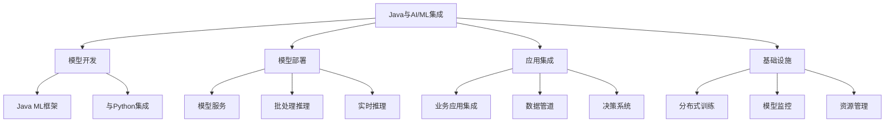

## 总结

Java平台架构在过去近30年的发展中经历了多次重大演进，从最初的简单虚拟机发展成为一个复杂而强大的技术生态系统。这些演进涵盖了语言特性、运行时性能、开发框架和部署模式等多个方面。

**核心平台演进**

- **Java SE**: 从早期的基础功能到现代化的模块化平台
- **Java EE/Jakarta EE**: 从重量级企业组件到轻量级微服务框架
- **Java ME**: 从功能手机平台到物联网解决方案

**JVM技术演进**

- **执行模型**: 从解释执行到JIT编译再到AOT编译
- **内存管理**: 从简单GC到低延迟并发收集器
- **并发模型**: 从操作系统线程到虚拟线程

**开发生态演进**

- **UI技术**: 从Applet到Swing再到JavaFX
- **Web框架**: 从Servlet到Spring MVC再到Spring Boot
- **数据访问**: 从JDBC到ORM再到响应式数据访问
- **应用架构**: 从单体到SOA再到微服务和云原生

**未来发展方向**

- **Project Loom**: 彻底改革Java并发模型
- **Project Valhalla**: 提高数据表示效率
- **Project Amber**: 增强语言表达力
- **Project Panama**: 改进本地代码互操作
- **AI/ML集成**: 扩展Java在AI领域的应用

Java平台的成功在于其持续创新与稳定演进的平衡。一方面，Java保持了强大的向后兼容性，保护了企业的技术投资；另一方面，Java不断吸收现代编程语言的优秀特性，并在性能和开发效率方面持续改进。这种平衡使Java成为企业级应用开发的首选平台，并在云计算、大数据和人工智能等新兴领域保持竞争力。

随着计算范式的不断变化，Java平台将继续演进，以适应新的技术挑战和业务需求。虚拟线程、值类型、模式匹配等创新将使Java在保持熟悉编程模型的同时，提供更高的性能和开发效率。Java与AI/ML的深度集成也将为Java开发者打开新的应用领域，确保Java在未来的技术格局中继续发挥重要作用。