# 企业Java技术栈演进案例

企业级Java技术栈在过去二十多年中经历了显著的演进，从早期的单体应用发展到现代的云原生微服务架构。本文将通过具体案例，详细介绍不同行业中Java技术栈的演进历程、面临的挑战以及解决方案，帮助读者理解企业级Java应用的发展趋势和最佳实践。

## 传统企业应用架构演进

传统企业应用架构经历了从简单到复杂、从紧耦合到松耦合的演进过程，这一过程反映了软件工程理念和企业需求的变化。

### 从单体JSP/Servlet到MVC架构

**早期JSP/Servlet架构 (2000-2005)**

早期企业Java应用通常采用简单的JSP/Servlet架构：

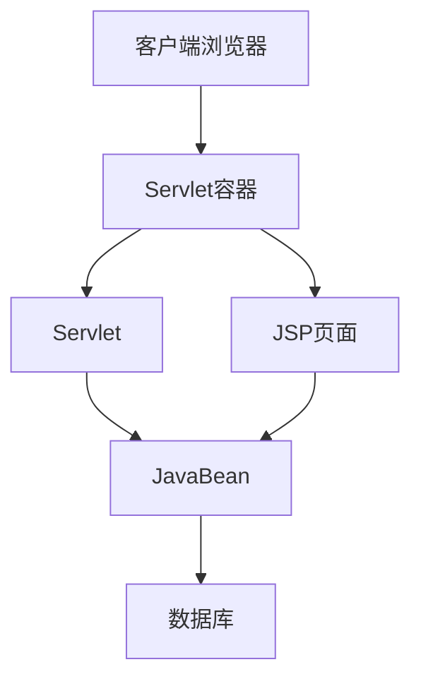

**典型代码结构**：

```java
// Servlet示例 - 混合了业务逻辑和页面生成
public class UserServlet extends HttpServlet {
    protected void doGet(HttpServletRequest request, HttpServletResponse response) 
            throws ServletException, IOException {
        String action = request.getParameter("action");
        
        if ("list".equals(action)) {
            // 直接在Servlet中访问数据库
            Connection conn = null;
            try {
                conn = DriverManager.getConnection("jdbc:mysql://localhost/db", "user", "pass");
                Statement stmt = conn.createStatement();
                ResultSet rs = stmt.executeQuery("SELECT * FROM users");
                
                List<User> users = new ArrayList<>();
                while (rs.next()) {
                    User user = new User();
                    user.setId(rs.getLong("id"));
                    user.setName(rs.getString("name"));
                    users.add(user);
                }
                
                request.setAttribute("users", users);
                request.getRequestDispatcher("/userList.jsp").forward(request, response);
            } catch (SQLException e) {
                throw new ServletException(e);
            } finally {
                try { if (conn != null) conn.close(); } catch (SQLException e) { }
            }
        } else if ("edit".equals(action)) {
            // 编辑用户逻辑
            // ...
        }
    }
    
    protected void doPost(HttpServletRequest request, HttpServletResponse response) 
            throws ServletException, IOException {
        // 处理表单提交
        // ...
    }
}
```

```jsp
<!-- JSP页面示例 - 混合了HTML和Java代码 -->
<%@ page language="java" contentType="text/html; charset=UTF-8" pageEncoding="UTF-8"%>
<%@ page import="java.util.List, com.example.User" %>
<!DOCTYPE html>
<html>
<head>
    <title>用户列表</title>
</head>
<body>
    <h1>用户列表</h1>
    <table border="1">
        <tr>
            <th>ID</th>
            <th>姓名</th>
            <th>操作</th>
        </tr>
        <% 
        List<User> users = (List<User>)request.getAttribute("users");
        for (User user : users) {
        %>
        <tr>
            <td><%= user.getId() %></td>
            <td><%= user.getName() %></td>
            <td>
                <a href="user?action=edit&id=<%= user.getId() %>">编辑</a>
                <a href="user?action=delete&id=<%= user.getId() %>">删除</a>
            </td>
        </tr>
        <% } %>
    </table>
</body>
</html>
```

**问题与挑战**：
- 业务逻辑与表现层混合
- 代码重复，难以维护
- 测试困难
- 团队协作效率低

**MVC架构的引入 (2005-2010)**

为解决上述问题，企业应用开始采用MVC架构：

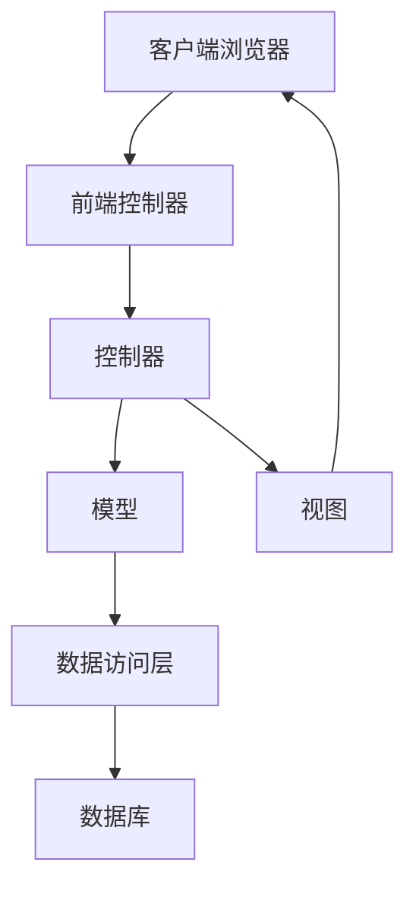

**Struts/Spring MVC实现**：

```java
// 控制器示例 - Struts 1.x
public class UserAction extends Action {
    private UserService userService;
    
    public ActionForward execute(ActionMapping mapping, ActionForm form,
            HttpServletRequest request, HttpServletResponse response) throws Exception {
        
        UserForm userForm = (UserForm) form;
        String action = userForm.getAction();
        
        if ("list".equals(action)) {
            List<User> users = userService.getAllUsers();
            request.setAttribute("users", users);
            return mapping.findForward("list");
        } else if ("save".equals(action)) {
            User user = new User();
            user.setName(userForm.getName());
            userService.saveUser(user);
            return mapping.findForward("success");
        }
        
        return mapping.findForward("error");
    }
    
    public void setUserService(UserService userService) {
        this.userService = userService;
    }
}
```

```java
// 服务层示例
public class UserServiceImpl implements UserService {
    private UserDAO userDAO;
    
    public List<User> getAllUsers() {
        return userDAO.findAll();
    }
    
    public void saveUser(User user) {
        userDAO.save(user);
    }
    
    public void setUserDAO(UserDAO userDAO) {
        this.userDAO = userDAO;
    }
}
```

```java
// 数据访问层示例
public class UserDAOImpl implements UserDAO {
    private DataSource dataSource;
    
    public List<User> findAll() {
        List<User> users = new ArrayList<>();
        Connection conn = null;
        try {
            conn = dataSource.getConnection();
            Statement stmt = conn.createStatement();
            ResultSet rs = stmt.executeQuery("SELECT * FROM users");
            
            while (rs.next()) {
                User user = new User();
                user.setId(rs.getLong("id"));
                user.setName(rs.getString("name"));
                users.add(user);
            }
        } catch (SQLException e) {
            throw new DataAccessException("Error fetching users", e);
        } finally {
            try { if (conn != null) conn.close(); } catch (SQLException e) { }
        }
        return users;
    }
    
    public void save(User user) {
        // 保存用户逻辑
    }
    
    public void setDataSource(DataSource dataSource) {
        this.dataSource = dataSource;
    }
}
```

**JSP视图示例**：

```jsp
<%@ taglib uri="http://java.sun.com/jsp/jstl/core" prefix="c" %>
<!DOCTYPE html>
<html>
<head>
    <title>用户列表</title>
</head>
<body>
    <h1>用户列表</h1>
    <table border="1">
        <tr>
            <th>ID</th>
            <th>姓名</th>
            <th>操作</th>
        </tr>
        <c:forEach items="${users}" var="user">
        <tr>
            <td>${user.id}</td>
            <td>${user.name}</td>
            <td>
                <a href="user.do?action=edit&id=${user.id}">编辑</a>
                <a href="user.do?action=delete&id=${user.id}">删除</a>
            </td>
        </tr>
        </c:forEach>
    </table>
</body>
</html>
```

**配置文件示例**：

```xml
<!-- struts-config.xml -->
<struts-config>
    <form-beans>
        <form-bean name="userForm" type="com.example.UserForm"/>
    </form-beans>
    
    <action-mappings>
        <action path="/user" 
                type="com.example.UserAction" 
                name="userForm" 
                scope="request">
            <forward name="list" path="/WEB-INF/jsp/userList.jsp"/>
            <forward name="success" path="/user.do?action=list"/>
            <forward name="error" path="/WEB-INF/jsp/error.jsp"/>
        </action>
    </action-mappings>
</struts-config>
```

**MVC架构的优势**：
- 关注点分离，代码更清晰
- 提高代码复用性
- 便于团队协作
- 更容易测试和维护

**案例：某保险公司客户管理系统改造**

某保险公司的客户管理系统最初使用JSP/Servlet构建，随着业务复杂度增加，系统变得难以维护。通过引入Struts框架实现MVC架构，系统实现了以下改进：

1. 开发效率提升40%
2. 代码重用率提高60%
3. 系统响应时间减少30%
4. 维护成本降低50%

### 从EJB到Spring Framework

**EJB时代 (2000-2006)**

早期企业应用广泛采用EJB技术：

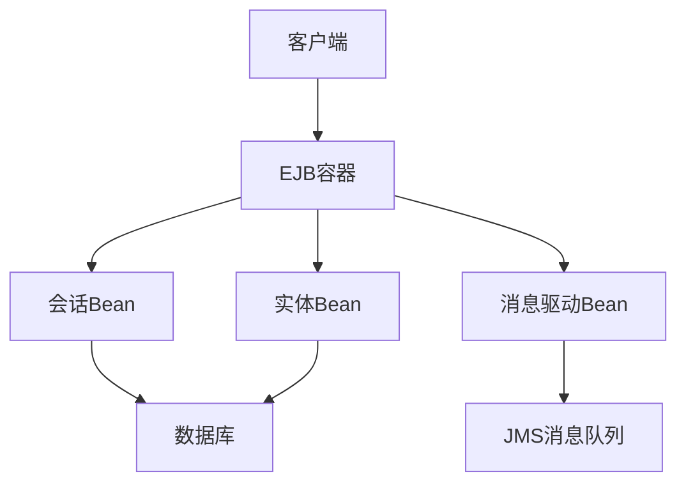

**EJB 2.x示例**：

```java
// 远程接口
public interface UserService extends EJBObject {
    List findAllUsers() throws RemoteException;
    void saveUser(UserDTO user) throws RemoteException;
}

// 本地接口
public interface UserServiceLocal extends EJBLocalObject {
    List findAllUsers();
    void saveUser(UserDTO user);
}

// Home接口
public interface UserServiceHome extends EJBHome {
    UserService create() throws RemoteException, CreateException;
}

// Bean实现
public class UserServiceBean implements SessionBean {
    private SessionContext context;
    
    public List findAllUsers() {
        Connection conn = null;
        try {
            InitialContext ic = new InitialContext();
            DataSource ds = (DataSource) ic.lookup("java:comp/env/jdbc/MyDB");
            conn = ds.getConnection();
            // 数据库操作...
        } catch (Exception e) {
            throw new EJBException(e);
        } finally {
            // 关闭连接...
        }
    }
    
    public void saveUser(UserDTO user) {
        // 保存用户逻辑...
    }
    
    // EJB生命周期方法
    public void setSessionContext(SessionContext context) { this.context = context; }
    public void ejbCreate() {}
    public void ejbRemove() {}
    public void ejbActivate() {}
    public void ejbPassivate() {}
}
```

**部署描述符**：

```xml
<!-- ejb-jar.xml -->
<ejb-jar>
    <enterprise-beans>
        <session>
            <ejb-name>UserService</ejb-name>
            <home>com.example.UserServiceHome</home>
            <remote>com.example.UserService</remote>
            <local-home>com.example.UserServiceLocalHome</local-home>
            <local>com.example.UserServiceLocal</local>
            <ejb-class>com.example.UserServiceBean</ejb-class>
            <session-type>Stateless</session-type>
            <transaction-type>Container</transaction-type>
            
            <resource-ref>
                <res-ref-name>jdbc/MyDB</res-ref-name>
                <res-type>javax.sql.DataSource</res-type>
                <res-auth>Container</res-auth>
            </resource-ref>
        </session>
    </enterprise-beans>
</ejb-jar>
```

**EJB的问题**：
- 复杂的编程模型
- 大量样板代码
- 依赖于重量级容器
- 难以测试
- 部署和配置复杂

**Spring Framework的引入 (2004-2010)**

Spring Framework提供了更轻量级的替代方案：

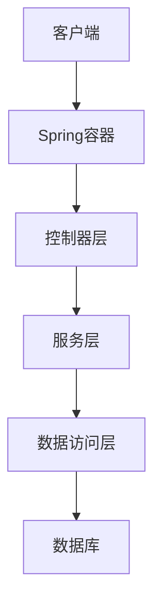

**Spring Framework示例**：

```java
// POJO服务实现
@Service
public class UserServiceImpl implements UserService {
    @Autowired
    private UserDAO userDAO;
    
    @Transactional(readOnly = true)
    public List<User> findAllUsers() {
        return userDAO.findAll();
    }
    
    @Transactional
    public void saveUser(User user) {
        userDAO.save(user);
    }
}

// 数据访问层
@Repository
public class UserDAOImpl implements UserDAO {
    @Autowired
    private JdbcTemplate jdbcTemplate;
    
    public List<User> findAll() {
        return jdbcTemplate.query(
            "SELECT * FROM users",
            (rs, rowNum) -> {
                User user = new User();
                user.setId(rs.getLong("id"));
                user.setName(rs.getString("name"));
                return user;
            }
        );
    }
    
    public void save(User user) {
        if (user.getId() == null) {
            jdbcTemplate.update(
                "INSERT INTO users (name) VALUES (?)",
                user.getName()
            );
        } else {
            jdbcTemplate.update(
                "UPDATE users SET name = ? WHERE id = ?",
                user.getName(), user.getId()
            );
        }
    }
}
```

**Spring配置**：

```xml
<!-- applicationContext.xml -->
<beans xmlns="http://www.springframework.org/schema/beans"
       xmlns:xsi="http://www.w3.org/2001/XMLSchema-instance"
       xmlns:context="http://www.springframework.org/schema/context"
       xmlns:tx="http://www.springframework.org/schema/tx"
       xsi:schemaLocation="...">
    
    <context:component-scan base-package="com.example"/>
    
    <bean id="dataSource" class="org.apache.commons.dbcp.BasicDataSource">
        <property name="driverClassName" value="com.mysql.jdbc.Driver"/>
        <property name="url" value="jdbc:mysql://localhost/db"/>
        <property name="username" value="user"/>
        <property name="password" value="pass"/>
    </bean>
    
    <bean id="jdbcTemplate" class="org.springframework.jdbc.core.JdbcTemplate">
        <property name="dataSource" ref="dataSource"/>
    </bean>
    
    <bean id="transactionManager" 
          class="org.springframework.jdbc.datasource.DataSourceTransactionManager">
        <property name="dataSource" ref="dataSource"/>
    </bean>
    
    <tx:annotation-driven/>
</beans>
```

**Spring的优势**：
- 轻量级POJO编程模型
- 依赖注入和控制反转
- 声明式事务管理
- 与其他框架良好集成
- 易于测试

**案例：某制造企业ERP系统重构**

某制造企业的ERP系统最初基于EJB 2.x构建，系统复杂且难以维护。通过迁移到Spring Framework，实现了以下改进：

1. 开发周期缩短50%
2. 系统启动时间从分钟级降至秒级
3. 测试覆盖率从20%提升至80%
4. 系统资源占用减少40%
5. 新功能开发速度提升3倍

迁移策略：
1. 先将非核心模块迁移到Spring
2. 建立EJB与Spring的适配层
3. 逐步替换EJB组件
4. 最终完全迁移到Spring架构

### 从JDBC直接操作到ORM框架

**JDBC直接操作 (1997-2005)**

早期企业应用通常使用JDBC直接操作数据库：

```java
// JDBC直接操作示例
public List<User> findAllUsers() {
    List<User> users = new ArrayList<>();
    Connection conn = null;
    Statement stmt = null;
    ResultSet rs = null;
    
    try {
        conn = dataSource.getConnection();
        stmt = conn.createStatement();
        rs = stmt.executeQuery("SELECT * FROM users");
        
        while (rs.next()) {
            User user = new User();
            user.setId(rs.getLong("id"));
            user.setName(rs.getString("name"));
            user.setEmail(rs.getString("email"));
            user.setCreatedAt(rs.getTimestamp("created_at"));
            users.add(user);
        }
    } catch (SQLException e) {
        throw new DataAccessException("Error fetching users", e);
    } finally {
        try { if (rs != null) rs.close(); } catch (SQLException e) {}
        try { if (stmt != null) stmt.close(); } catch (SQLException e) {}
        try { if (conn != null) conn.close(); } catch (SQLException e) {}
    }
    
    return users;
}

public void saveUser(User user) {
    Connection conn = null;
    PreparedStatement pstmt = null;
    
    try {
        conn = dataSource.getConnection();
        if (user.getId() == null) {
            pstmt = conn.prepareStatement(
                "INSERT INTO users (name, email, created_at) VALUES (?, ?, ?)",
                Statement.RETURN_GENERATED_KEYS
            );
            pstmt.setString(1, user.getName());
            pstmt.setString(2, user.getEmail());
            pstmt.setTimestamp(3, new Timestamp(System.currentTimeMillis()));
            pstmt.executeUpdate();
            
            ResultSet generatedKeys = pstmt.getGeneratedKeys();
            if (generatedKeys.next()) {
                user.setId(generatedKeys.getLong(1));
            }
        } else {
            pstmt = conn.prepareStatement(
                "UPDATE users SET name = ?, email = ? WHERE id = ?"
            );
            pstmt.setString(1, user.getName());
            pstmt.setString(2, user.getEmail());
            pstmt.setLong(3, user.getId());
            pstmt.executeUpdate();
        }
    } catch (SQLException e) {
        throw new DataAccessException("Error saving user", e);
    } finally {
        try { if (pstmt != null) pstmt.close(); } catch (SQLException e) {}
        try { if (conn != null) conn.close(); } catch (SQLException e) {}
    }
}
```

**JDBC的问题**：
- 大量样板代码
- SQL语句硬编码
- 手动映射结果集
- 手动管理连接资源
- 缺乏缓存机制
- 对象关系不匹配

**ORM框架的引入 (2002-2010)**

ORM框架如Hibernate和JPA大大简化了数据访问：

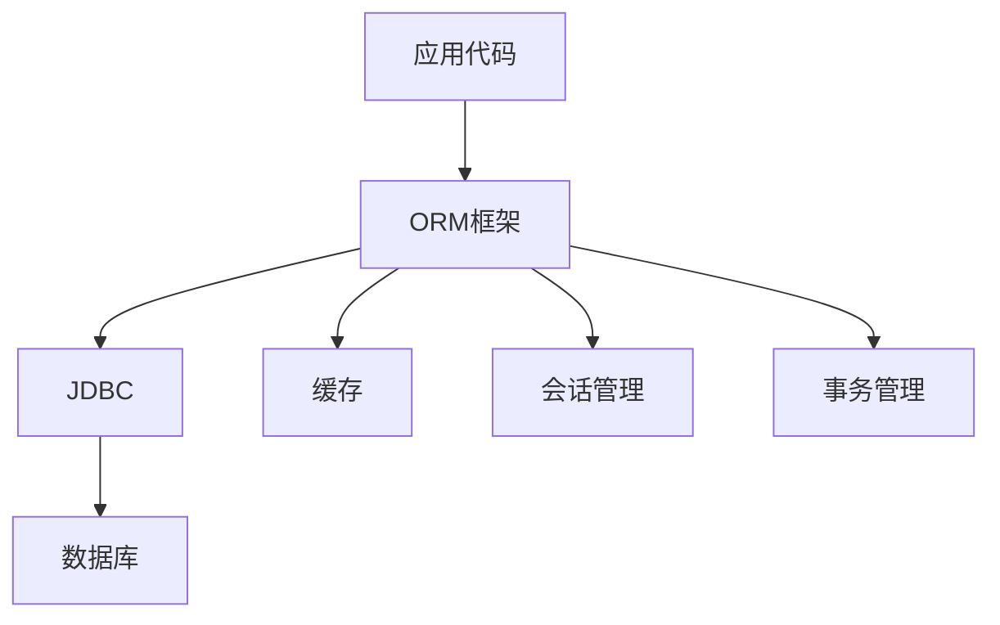

**Hibernate示例**：

```java
// Hibernate实体类
@Entity
@Table(name = "users")
public class User {
    @Id
    @GeneratedValue(strategy = GenerationType.IDENTITY)
    private Long id;
    
    @Column(name = "name", nullable = false)
    private String name;
    
    @Column(name = "email", unique = true)
    private String email;
    
    @Column(name = "created_at")
    @Temporal(TemporalType.TIMESTAMP)
    private Date createdAt;
    
    @OneToMany(mappedBy = "user", cascade = CascadeType.ALL, fetch = FetchType.LAZY)
    private List<Order> orders = new ArrayList<>();
    
    // Getters and setters
}

// Hibernate DAO实现
@Repository
public class UserDAOImpl implements UserDAO {
    @Autowired
    private SessionFactory sessionFactory;
    
    @Override
    public List<User> findAll() {
        return sessionFactory.getCurrentSession()
            .createQuery("from User", User.class)
            .list();
    }
    
    @Override
    public User findById(Long id) {
        return sessionFactory.getCurrentSession().get(User.class, id);
    }
    
    @Override
    public void save(User user) {
        if (user.getCreatedAt() == null) {
            user.setCreatedAt(new Date());
        }
        sessionFactory.getCurrentSession().saveOrUpdate(user);
    }
    
    @Override
    public void delete(User user) {
        sessionFactory.getCurrentSession().delete(user);
    }
    
    @Override
    public List<User> findByName(String name) {
        return sessionFactory.getCurrentSession()
            .createQuery("from User where name like :name", User.class)
            .setParameter("name", "%" + name + "%")
            .list();
    }
}
```

**JPA示例**：

```java
// JPA实体类
@Entity
@Table(name = "users")
public class User {
    @Id
    @GeneratedValue(strategy = GenerationType.IDENTITY)
    private Long id;
    
    @Column(name = "name", nullable = false)
    private String name;
    
    @Column(name = "email", unique = true)
    private String email;
    
    @Column(name = "created_at")
    @Temporal(TemporalType.TIMESTAMP)
    private Date createdAt;
    
    @OneToMany(mappedBy = "user", cascade = CascadeType.ALL, fetch = FetchType.LAZY)
    private List<Order> orders = new ArrayList<>();
    
    // Getters and setters
}

// JPA DAO实现
@Repository
public class UserDAOImpl implements UserDAO {
    @PersistenceContext
    private EntityManager entityManager;
    
    @Override
    public List<User> findAll() {
        return entityManager.createQuery("SELECT u FROM User u", User.class)
            .getResultList();
    }
    
    @Override
    public User findById(Long id) {
        return entityManager.find(User.class, id);
    }
    
    @Override
    @Transactional
    public void save(User user) {
        if (user.getCreatedAt() == null) {
            user.setCreatedAt(new Date());
        }
        
        if (user.getId() == null) {
            entityManager.persist(user);
        } else {
            entityManager.merge(user);
        }
    }
    
    @Override
    @Transactional
    public void delete(User user) {
        entityManager.remove(entityManager.contains(user) ? user : entityManager.merge(user));
    }
    
    @Override
    public List<User> findByName(String name) {
        return entityManager.createQuery(
                "SELECT u FROM User u WHERE u.name LIKE :name", User.class)
            .setParameter("name", "%" + name + "%")
            .getResultList();
    }
}
```

**Spring Data JPA示例**：

```java
// Spring Data JPA仓库接口
public interface UserRepository extends JpaRepository<User, Long> {
    List<User> findByNameContaining(String name);
    
    @Query("SELECT u FROM User u WHERE u.email = :email")
    Optional<User> findByEmail(@Param("email") String email);
    
    @Query(value = "SELECT * FROM users WHERE created_at > :date", nativeQuery = true)
    List<User> findRecentUsers(@Param("date") Date date);
}

// 服务层使用仓库
@Service
@Transactional
public class UserServiceImpl implements UserService {
    @Autowired
    private UserRepository userRepository;
    
    @Override
    @Transactional(readOnly = true)
    public List<User> findAllUsers() {
        return userRepository.findAll();
    }
    
    @Override
    @Transactional(readOnly = true)
    public User findById(Long id) {
        return userRepository.findById(id)
            .orElseThrow(() -> new EntityNotFoundException("User not found: " + id));
    }
    
    @Override
    public User saveUser(User user) {
        if (user.getCreatedAt() == null) {
            user.setCreatedAt(new Date());
        }
        return userRepository.save(user);
    }
    
    @Override
    public void deleteUser(Long id) {
        userRepository.deleteById(id);
    }
    
    @Override
    @Transactional(readOnly = true)
    public List<User> findByName(String name) {
        return userRepository.findByNameContaining(name);
    }
}
```

**ORM框架的优势**：
- 减少样板代码
- 对象关系映射自动化
- 缓存机制提高性能
- 方言支持多种数据库
- 懒加载优化性能
- 事务管理简化

**案例：某电信公司客户关系管理系统优化**

某电信公司的客户关系管理系统最初使用JDBC直接操作数据库，随着客户数据量增长，系统性能和维护性面临挑战。通过引入Hibernate和JPA，实现了以下改进：

1. 代码量减少60%
2. 数据库操作性能提升40%
3. 跨数据库迁移变得简单
4. 开发效率提升200%
5. 系统可扩展性显著增强

迁移策略：
1. 先建立实体类映射
2. 开发DAO层适配器
3. 逐步替换JDBC代码
4. 引入二级缓存提升性能

### 从传统部署到DevOps流水线

**传统部署流程 (2000-2010)**

早期企业应用通常采用手动部署流程：

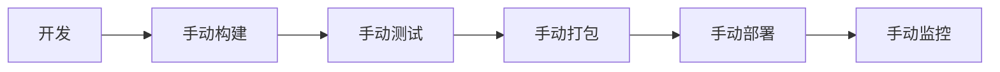

**传统部署的问题**：
- 部署周期长（数周到数月）
- 手动操作容易出错
- 环境不一致
- 回滚困难
- 缺乏自动化测试
- 团队协作效率低

**DevOps流水线引入 (2010-至今)**

现代企业应用采用DevOps流水线实现自动化：

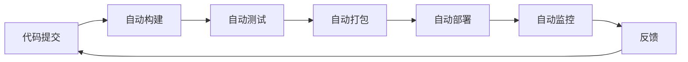

**Jenkins流水线示例**：

```groovy
// Jenkinsfile
pipeline {
    agent any
    
    tools {
        maven 'Maven 3.8.4'
        jdk 'JDK 11'
    }
    
    stages {
        stage('Checkout') {
            steps {
                checkout scm
            }
        }
        
        stage('Build') {
            steps {
                sh 'mvn clean compile'
            }
        }
        
        stage('Test') {
            steps {
                sh 'mvn test'
            }
            post {
                always {
                    junit '**/target/surefire-reports/*.xml'
                }
            }
        }
        
        stage('Code Quality') {
            steps {
                sh 'mvn sonar:sonar'
            }
        }
        
        stage('Package') {
            steps {
                sh 'mvn package -DskipTests'
                archiveArtifacts artifacts: 'target/*.jar', fingerprint: true
            }
        }
        
        stage('Deploy to Dev') {
            steps {
                sh 'ansible-playbook -i inventory/dev deploy.yml'
            }
        }
        
        stage('Integration Tests') {
            steps {
                sh 'mvn verify -Pintegration-tests'
            }
        }
        
        stage('Deploy to Staging') {
            when {
                branch 'develop'
            }
            steps {
                sh 'ansible-playbook -i inventory/staging deploy.yml'
            }
        }
        
        stage('Deploy to Production') {
            when {
                branch 'master'
            }
            steps {
                timeout(time: 1, unit: 'DAYS') {
                    input message: 'Approve production deployment?'
                }
                sh 'ansible-playbook -i inventory/production deploy.yml'
            }
        }
    }
    
    post {
        success {
            slackSend channel: '#deployments', 
                      color: 'good', 
                      message: "Deployment successful: ${env.JOB_NAME} #${env.BUILD_NUMBER}"
        }
        failure {
            slackSend channel: '#deployments', 
                      color: 'danger', 
                      message: "Deployment failed: ${env.JOB_NAME} #${env.BUILD_NUMBER}"
        }
    }
}
```

**Docker容器化示例**：

```dockerfile
# Dockerfile
FROM openjdk:11-jre-slim

WORKDIR /app

COPY target/*.jar app.jar

EXPOSE 8080

ENTRYPOINT ["java", "-jar", "app.jar"]
```

**
让我继续完成企业Java技术栈演进案例的内容：

**Kubernetes部署示例**：

```yaml
# kubernetes-deployment.yaml
apiVersion: apps/v1
kind: Deployment
metadata:
  name: java-app
spec:
  replicas: 3
  selector:
    matchLabels:
      app: java-app
  template:
    metadata:
      labels:
        app: java-app
    spec:
      containers:
      - name: java-app
        image: myregistry/java-app:1.0
        ports:
        - containerPort: 8080
        readinessProbe:
          httpGet:
            path: /actuator/health
            port: 8080
          initialDelaySeconds: 30
          periodSeconds: 10
        livenessProbe:
          httpGet:
            path: /actuator/health/liveness
            port: 8080
          initialDelaySeconds: 60
          periodSeconds: 15
        resources:
          requests:
            memory: "512Mi"
            cpu: "500m"
          limits:
            memory: "1Gi"
            cpu: "1000m"
        env:
        - name: SPRING_PROFILES_ACTIVE
          value: "prod"
        - name: DB_URL
          valueFrom:
            configMapKeyRef:
              name: app-config
              key: db.url
        - name: DB_USERNAME
          valueFrom:
            secretKeyRef:
              name: db-credentials
              key: username
        - name: DB_PASSWORD
          valueFrom:
            secretKeyRef:
              name: db-credentials
              key: password
```

**DevOps的优势**：
- 部署周期从数周缩短到数小时甚至数分钟
- 自动化减少人为错误
- 环境一致性保证
- 快速回滚能力
- 持续反馈和改进
- 团队协作效率提升

**案例：某零售企业电商平台DevOps转型**

某零售企业的电商平台最初采用传统部署方式，每月发布一次新版本，部署过程耗时3天，经常出现环境不一致导致的问题。通过引入DevOps流水线，实现了以下改进：

1. 部署频率从每月1次提升到每天多次
2. 部署时间从3天缩短到30分钟
3. 部署失败率从30%降低到5%
4. 故障恢复时间从小时级降至分钟级
5. 开发团队生产力提升40%

转型策略：
1. 引入版本控制和分支策略
2. 构建自动化测试套件
3. 实现持续集成流程
4. 容器化应用
5. 建立持续部署流水线
6. 实施监控和反馈机制

### 从单体应用到微服务拆分

**单体应用架构 (2000-2012)**

早期企业应用通常采用单体架构：

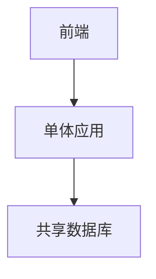

**单体应用的问题**：
- 代码库庞大难以维护
- 技术栈难以更新
- 整体部署增加风险
- 扩展性受限
- 团队协作效率低
- 故障影响范围大

**微服务架构引入 (2012-至今)**

现代企业应用逐渐采用微服务架构：

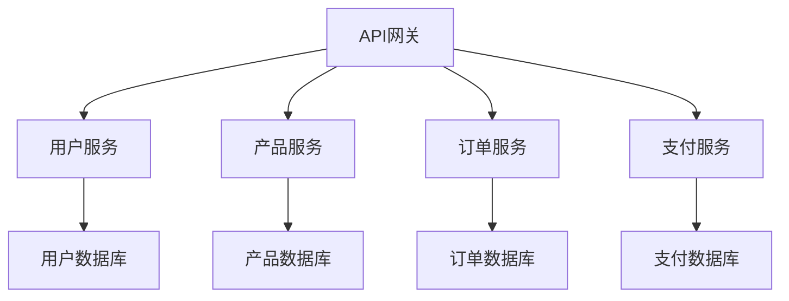

**Spring Boot微服务示例**：

```java
// 产品服务
@SpringBootApplication
public class ProductServiceApplication {
    public static void main(String[] args) {
        SpringApplication.run(ProductServiceApplication.class, args);
    }
}

@RestController
@RequestMapping("/api/products")
public class ProductController {
    @Autowired
    private ProductService productService;
    
    @GetMapping
    public List<Product> getAllProducts() {
        return productService.findAllProducts();
    }
    
    @GetMapping("/{id}")
    public ResponseEntity<Product> getProduct(@PathVariable Long id) {
        return productService.findById(id)
            .map(ResponseEntity::ok)
            .orElse(ResponseEntity.notFound().build());
    }
    
    @PostMapping
    public ResponseEntity<Product> createProduct(@RequestBody Product product) {
        Product saved = productService.saveProduct(product);
        URI location = ServletUriComponentsBuilder
            .fromCurrentRequest()
            .path("/{id}")
            .buildAndExpand(saved.getId())
            .toUri();
        return ResponseEntity.created(location).body(saved);
    }
}
```

**服务发现配置**：

```yaml
# application.yml
spring:
  application:
    name: product-service
  cloud:
    consul:
      host: localhost
      port: 8500
      discovery:
        instanceId: ${spring.application.name}:${random.value}
        healthCheckPath: /actuator/health
        healthCheckInterval: 15s
```

**服务间通信示例**：

```java
// 使用Feign客户端进行服务间通信
@FeignClient(name = "product-service")
public interface ProductClient {
    @GetMapping("/api/products/{id}")
    Product getProduct(@PathVariable("id") Long id);
    
    @GetMapping("/api/products")
    List<Product> getAllProducts();
}

@Service
public class OrderServiceImpl implements OrderService {
    @Autowired
    private OrderRepository orderRepository;
    
    @Autowired
    private ProductClient productClient;
    
    @Override
    @Transactional
    public Order createOrder(OrderRequest request) {
        // 验证产品存在
        Product product = productClient.getProduct(request.getProductId());
        if (product == null) {
            throw new EntityNotFoundException("Product not found: " + request.getProductId());
        }
        
        // 创建订单
        Order order = new Order();
        order.setUserId(request.getUserId());
        order.setProductId(request.getProductId());
        order.setQuantity(request.getQuantity());
        order.setTotalPrice(product.getPrice() * request.getQuantity());
        order.setStatus(OrderStatus.CREATED);
        order.setCreatedAt(new Date());
        
        return orderRepository.save(order);
    }
}
```

**断路器模式示例**：

```java
// 使用Resilience4j实现断路器模式
@Service
public class ProductServiceImpl implements ProductService {
    @Autowired
    private ProductRepository productRepository;
    
    @CircuitBreaker(name = "productService", fallbackMethod = "getDefaultProduct")
    @Retry(name = "productService", fallbackMethod = "getDefaultProduct")
    @Bulkhead(name = "productService", fallbackMethod = "getDefaultProduct")
    @TimeLimiter(name = "productService", fallbackMethod = "getDefaultProductFuture")
    public CompletableFuture<Product> getProductAsync(Long id) {
        return CompletableFuture.supplyAsync(() -> {
            // 模拟远程调用或复杂处理
            try {
                Thread.sleep(100);
            } catch (InterruptedException e) {
                Thread.currentThread().interrupt();
            }
            return productRepository.findById(id)
                .orElseThrow(() -> new EntityNotFoundException("Product not found: " + id));
        });
    }
    
    public CompletableFuture<Product> getDefaultProductFuture(Long id, Throwable t) {
        return CompletableFuture.supplyAsync(() -> getDefaultProduct(id, t));
    }
    
    public Product getDefaultProduct(Long id, Throwable t) {
        log.warn("Fallback for product {}: {}", id, t.getMessage());
        Product fallback = new Product();
        fallback.setId(id);
        fallback.setName("Temporary Unavailable");
        fallback.setPrice(0.0);
        return fallback;
    }
}
```

**API网关配置**：

```yaml
# gateway-service.yml
spring:
  cloud:
    gateway:
      routes:
      - id: product-service
        uri: lb://product-service
        predicates:
        - Path=/api/products/**
        filters:
        - name: CircuitBreaker
          args:
            name: productServiceCircuitBreaker
            fallbackUri: forward:/fallback/products
      - id: order-service
        uri: lb://order-service
        predicates:
        - Path=/api/orders/**
        filters:
        - name: CircuitBreaker
          args:
            name: orderServiceCircuitBreaker
            fallbackUri: forward:/fallback/orders
      - id: user-service
        uri: lb://user-service
        predicates:
        - Path=/api/users/**
        filters:
        - name: CircuitBreaker
          args:
            name: userServiceCircuitBreaker
            fallbackUri: forward:/fallback/users
```

**微服务的优势**：
- 独立开发和部署
- 技术栈多样性
- 故障隔离
- 按需扩展
- 团队自治
- 更快的创新周期

**案例：某物流公司系统微服务改造**

某物流公司的核心业务系统是一个庞大的单体应用，随着业务增长，系统变得难以维护和扩展。通过微服务改造，实现了以下改进：

1. 部署频率从每季度1次提升到每周多次
2. 新功能上线时间从3个月缩短到2周
3. 系统可用性从99.5%提升到99.99%
4. 峰值处理能力提升5倍
5. 开发团队从1个扩展到6个并行工作

拆分策略：
1. 按业务领域边界拆分
2. 先拆分变化频率高的模块
3. 建立服务发现和配置中心
4. 实现API网关和认证授权
5. 引入断路器和限流保护
6. 建立分布式追踪和监控

## 金融行业Java技术栈案例

金融行业对系统的稳定性、安全性和性能有极高要求，Java技术栈在金融领域有着广泛应用。

### 核心银行系统Java技术栈演进

**传统核心银行系统 (2000-2010)**

早期核心银行系统通常基于以下技术栈：

- **应用服务器**: WebLogic, WebSphere
- **框架**: EJB 2.x, Struts 1.x
- **数据库**: Oracle, DB2
- **集成**: JMS, SOAP Web服务
- **部署**: 手动部署, 计划内维护窗口

**架构特点**：
- 单体架构
- 紧耦合组件
- 共享数据库
- 批处理为主
- 有限的可扩展性

**现代核心银行系统 (2010-至今)**

现代核心银行系统采用更灵活的技术栈：

- **应用框架**: Spring Boot, Spring Cloud
- **持久化**: JPA, MyBatis, 分布式事务
- **消息中间件**: Kafka, RabbitMQ
- **缓存**: Redis, Hazelcast
- **部署**: Docker, Kubernetes
- **监控**: Prometheus, ELK Stack

**架构特点**：
- 领域驱动设计
- 微服务或服务化架构
- 事件驱动
- 命令查询职责分离(CQRS)
- 多租户设计

**案例：某大型银行核心系统现代化**

某大型银行的核心系统最初构建于2000年代初期，基于大型机和单体Java应用。随着业务增长和数字化转型需求，系统面临扩展性和灵活性挑战。现代化改造采用了以下策略：

1. **阶段一：单体应用现代化**
   - 从EJB迁移到Spring Framework
   - 引入领域驱动设计重构业务逻辑
   - 建立自动化测试套件
   - 实现CI/CD流水线

2. **阶段二：服务化拆分**
   - 按业务领域拆分为多个服务
   - 引入服务总线实现服务编排
   - 实现分布式事务管理
   - 建立API网关和服务目录

3. **阶段三：云原生转型**
   - 容器化应用部署
   - 实现基于Kubernetes的弹性伸缩
   - 引入服务网格管理服务通信
   - 建立全面的可观测性平台

**技术架构演进**：

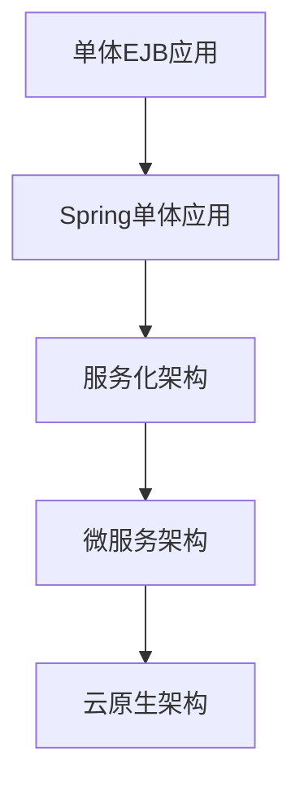

**核心技术实践**：

1. **领域驱动设计实现**：

```java
// 领域模型示例
@Entity
@Table(name = "accounts")
public class Account {
    @Id
    @GeneratedValue(strategy = GenerationType.IDENTITY)
    private Long id;
    
    @Column(name = "account_number", unique = true, nullable = false)
    private String accountNumber;
    
    @Enumerated(EnumType.STRING)
    @Column(name = "account_type", nullable = false)
    private AccountType accountType;
    
    @Column(name = "balance", nullable = false)
    private BigDecimal balance;
    
    @Column(name = "currency", nullable = false)
    private String currency;
    
    @Column(name = "status", nullable = false)
    @Enumerated(EnumType.STRING)
    private AccountStatus status;
    
    @ManyToOne(fetch = FetchType.LAZY)
    @JoinColumn(name = "customer_id", nullable = false)
    private Customer customer;
    
    @OneToMany(mappedBy = "account", cascade = CascadeType.ALL, orphanRemoval = true)
    private List<Transaction> transactions = new ArrayList<>();
    
    // 领域行为
    public void debit(BigDecimal amount, String description) {
        if (amount.compareTo(BigDecimal.ZERO) <= 0) {
            throw new IllegalArgumentException("Debit amount must be positive");
        }
        
        if (balance.compareTo(amount) < 0) {
            throw new InsufficientFundsException("Insufficient funds for account: " + accountNumber);
        }
        
        balance = balance.subtract(amount);
        
        Transaction transaction = new Transaction();
        transaction.setAccount(this);
        transaction.setAmount(amount.negate());
        transaction.setDescription(description);
        transaction.setTransactionType(TransactionType.DEBIT);
        transaction.setTransactionDate(new Date());
        
        transactions.add(transaction);
    }
    
    public void credit(BigDecimal amount, String description) {
        if (amount.compareTo(BigDecimal.ZERO) <= 0) {
            throw new IllegalArgumentException("Credit amount must be positive");
        }
        
        balance = balance.add(amount);
        
        Transaction transaction = new Transaction();
        transaction.setAccount(this);
        transaction.setAmount(amount);
        transaction.setDescription(description);
        transaction.setTransactionType(TransactionType.CREDIT);
        transaction.setTransactionDate(new Date());
        
        transactions.add(transaction);
    }
    
    // Getters and setters
}
```

2. **分布式事务管理**：

```java
// 使用Atomikos实现JTA分布式事务
@Configuration
public class JtaConfig {
    @Bean(initMethod = "init", destroyMethod = "close")
    public UserTransactionManager userTransactionManager() {
        UserTransactionManager userTransactionManager = new UserTransactionManager();
        userTransactionManager.setForceShutdown(true);
        return userTransactionManager;
    }
    
    @Bean
    public UserTransaction userTransaction() throws SystemException {
        UserTransactionImp userTransactionImp = new UserTransactionImp();
        userTransactionImp.setTransactionTimeout(300);
        return userTransactionImp;
    }
    
    @Bean
    public JtaTransactionManager transactionManager() throws SystemException {
        JtaTransactionManager jtaTransactionManager = new JtaTransactionManager();
        jtaTransactionManager.setTransactionManager(userTransactionManager());
        jtaTransactionManager.setUserTransaction(userTransaction());
        jtaTransactionManager.setAllowCustomIsolationLevels(true);
        return jtaTransactionManager;
    }
}

// 服务实现
@Service
public class FundTransferServiceImpl implements FundTransferService {
    @Autowired
    private AccountRepository accountRepository;
    
    @Autowired
    private TransactionRepository transactionRepository;
    
    @Autowired
    private NotificationService notificationService;
    
    @Override
    @Transactional
    public TransferResult transfer(String fromAccountNumber, String toAccountNumber, 
                                  BigDecimal amount, String description) {
        Account fromAccount = accountRepository.findByAccountNumber(fromAccountNumber)
            .orElseThrow(() -> new AccountNotFoundException("Account not found: " + fromAccountNumber));
        
        Account toAccount = accountRepository.findByAccountNumber(toAccountNumber)
            .orElseThrow(() -> new AccountNotFoundException("Account not found: " + toAccountNumber));
        
        // 执行转账
        fromAccount.debit(amount, "Transfer to " + toAccountNumber + ": " + description);
        toAccount.credit(amount, "Transfer from " + fromAccountNumber + ": " + description);
        
        // 保存账户状态
        accountRepository.save(fromAccount);
        accountRepository.save(toAccount);
        
        // 发送通知
        notificationService.sendTransferNotification(fromAccount, toAccount, amount);
        
        return new TransferResult(true, "Transfer completed successfully");
    }
}
```

3. **事件驱动架构**：

```java
// 领域事件
public class AccountCreatedEvent {
    private final String accountNumber;
    private final String customerId;
    private final Date createdAt;
    
    public AccountCreatedEvent(String accountNumber, String customerId) {
        this.accountNumber = accountNumber;
        this.customerId = customerId;
        this.createdAt = new Date();
    }
    
    // Getters
}

// 事件发布
@Service
public class AccountServiceImpl implements AccountService {
    @Autowired
    private AccountRepository accountRepository;
    
    @Autowired
    private ApplicationEventPublisher eventPublisher;
    
    @Override
    @Transactional
    public Account createAccount(AccountCreationRequest request) {
        // 创建账户
        Account account = new Account();
        account.setAccountNumber(generateAccountNumber());
        account.setAccountType(request.getAccountType());
        account.setBalance(BigDecimal.ZERO);
        account.setCurrency(request.getCurrency());
        account.setStatus(AccountStatus.ACTIVE);
        account.setCustomer(request.getCustomer());
        
        Account savedAccount = accountRepository.save(account);
        
        // 发布事件
        eventPublisher.publishEvent(new AccountCreatedEvent(
            savedAccount.getAccountNumber(), 
            savedAccount.getCustomer().getCustomerId()
        ));
        
        return savedAccount;
    }
}

// 事件监听
@Component
public class AccountEventListener {
    @Autowired
    private ReportingService reportingService;
    
    @Autowired
    private NotificationService notificationService;
    
    @EventListener
    public void handleAccountCreatedEvent(AccountCreatedEvent event) {
        // 更新报表数据
        reportingService.updateAccountCreationStatistics(event);
        
        // 发送欢迎通知
        notificationService.sendWelcomeNotification(event.getAccountNumber(), event.getCustomerId());
    }
}
```

**成果与收益**：

1. 系统可用性从99.9%提升到99.999%
2. 交易处理能力提升10倍
3. 新功能上线时间从6个月缩短到2周
4. 运维成本降低40%
5. 支持7x24小时不间断服务
6. 实现了多渠道无缝集成

### 交易系统高性能Java实践

金融交易系统对性能和可靠性有极高要求，Java技术栈在这一领域有着丰富的实践经验。

**交易系统性能挑战**：
- 低延迟要求（毫秒级响应）
- 高吞吐量（每秒数万笔交易）
- 数据一致性保证
- 7x24不间断运行
- 实时风控和监控

**高性能Java技术栈**：
- **JVM优化**: G1/ZGC垃圾收集器, JIT编译优化
- **并发框架**: Disruptor, Akka, Project Reactor
- **内存数据网格**: Hazelcast, Ignite
- **持久化**: 写前日志, 内存映射文件
- **网络通信**: Netty, gRPC

**案例：某证券交易平台性能优化**

某证券公司的交易平台在市场高峰期面临性能瓶颈，无法满足快速增长的交易量需求。通过一系列Java性能优化，实现了系统性能的显著提升：

1. **内存管理优化**：
   - 采用对象池减少GC压力
   - 使用堆外内存处理大量临时数据
   - 优化JVM参数减少GC暂停

2. **并发处理优化**：
   - 使用Disruptor替代传统队列
   - 实现无锁算法减少线程竞争
   - 采用事件驱动模型提高并发处理能力

3. **数据访问优化**：
   - 引入多级缓存减少数据库访问
   - 使用内存数据网格实现分布式缓存
   - 采用异步写入策略提高写入性能

**Disruptor实现示例**：

```java
// 使用Disruptor处理订单事件
public class OrderEventMain {
    // 事件类
    public static class OrderEvent {
        private long orderId;
        private String symbol;
        private int quantity;
        private BigDecimal price;
        private OrderType type;
        // Getters and setters
    }
    
    // 事件处理器
    public static class OrderEventHandler implements EventHandler<OrderEvent> {
        @Override
        public void onEvent(OrderEvent event, long sequence, boolean endOfBatch) {
            // 处理订单
            processOrder(event);
            
            if (endOfBatch) {
                // 批处理结束操作
                flushBatch();
            }
        }
        
        private void processOrder(OrderEvent event) {
            // 订单处理逻辑
        }
        
        private void flushBatch() {
            // 批处理刷新逻辑
        }
    }
    
    // 异常处理器
    public static class OrderExceptionHandler implements ExceptionHandler<OrderEvent> {
        @Override
        public void handleEventException(Throwable ex, long sequence, OrderEvent event) {
            log.error("Error processing order {}: {}", event.getOrderId(), ex.getMessage());
            // 错误处理逻辑
        }
        
        @Override
        public void handleOnStartException(Throwable ex) {
            log.error("Error starting disruptor: {}", ex.getMessage());
        }
        
        @Override
        public void handleOnShutdownException(Throwable ex) {
            log.error("Error shutting down disruptor: {}", ex.getMessage());
        }
    }
    
    public static void main(String[] args) {
        // 创建Disruptor
        int bufferSize = 1024 * 8; // 必须是2的幂
        Disruptor<OrderEvent> disruptor = new Disruptor<>(
            OrderEvent::new,
            bufferSize,
            Executors.defaultThreadFactory(),
            ProducerType.MULTI, // 多生产者模式
            new YieldingWaitStrategy() // 等待策略
        );
        
        // 设置事件处理器
        disruptor.handleEventsWith(new OrderEventHandler());
        
        // 设置异常处理器
        disruptor.setDefaultExceptionHandler(new OrderExceptionHandler());
        
        // 启动Disruptor
        disruptor.start();
        
        // 获取RingBuffer
        RingBuffer<OrderEvent> ringBuffer = disruptor.getRingBuffer();
        
        // 发布事件
        for (int i = 0; i < 100; i++) {
            long sequence = ringBuffer.next();
            try {
                OrderEvent event = ringBuffer.get(sequence);
                event.setOrderId(i);
                event.setSymbol("AAPL");
                event.setQuantity(100);
                event.setPrice(new BigDecimal("150.25"));
                event.setType(OrderType.BUY);
            } finally {
                ringBuffer.publish(sequence);
            }
        }
        
        // 关闭Disruptor
        disruptor.shutdown();
    }
}
```

**堆外内存使用示例**：

```java
// 使用ByteBuffer管理堆外内存
public class OffHeapCache {
    private final ByteBuffer buffer;
    private final Map<String, MemorySegment> index = new ConcurrentHashMap<>();
    
    public OffHeapCache(long capacityBytes) {
        this.buffer = ByteBuffer.allocateDirect((int) capacityBytes);
    }
    
    public void put(String key, byte[] value) {
        if (value.length > remainingCapacity()) {
            throw new IllegalArgumentException("Value too large for cache");
        }
        
        synchronized (buffer) {
            int position = buffer.position();
            buffer.putInt(value.length);
            buffer.put(value);
            
            index.put(key, new MemorySegment(position, value.length + 4));
        }
    }
    
    public byte[] get(String key) {
        MemorySegment segment = index.get(key);
        if (segment == null) {
            return null;
        }
        
        synchronized (buffer) {
            buffer.position(segment.position);
            int length = buffer.getInt();
            byte[] value = new byte[length];
            buffer.get(value);
            return value;
        }
    }
    
    public long remainingCapacity() {
        return buffer.capacity() - buffer.position();
    }
    
    private static class MemorySegment {
        final int position;
        final int length;
        
        MemorySegment(int position, int length) {
            this.position = position;
            this.length = length;
        }
    }
}
```

**JVM优化配置**：

```bash
# 交易系统JVM优化参数
java -server \
     -Xms16g -Xmx16g \
     -XX:+UseG1GC \
     -XX:MaxGCPauseMillis=100 \
     -XX:+ParallelRefProcEnabled \
     -XX:+UseStringDeduplication \
     -XX:+DisableExplicitGC \
     -XX:+AlwaysPreTouch \
     -XX:+UseCompressedOops \
     -XX:+UseNUMA \
     -XX:+UseCondCardMark \
     -XX:InitiatingHeapOccupancyPercent=45 \
     -Djava.net.preferIPv4Stack=true \
     -Djava.awt.headless=true \
     -jar trading-system.jar
```

**成果与收益**：

1. 交易处理延迟从50ms降至5ms
2. 系统吞吐量提升8倍
3. GC暂停时间从秒级降至毫秒级
4. 内存使用效率提升40%
5. CPU利用率降低30%
6. 系统稳定性显著提升

### 风控系统实时计算架构

金融风控系统需要实时处理和分析大量交易数据，以识别欺诈和风险。Java技术栈在构建高性能风控系统方面有着丰富的实践。

**风控系统技术挑战**：
- 实时数据处理（毫秒级决策）
- 复杂规则引擎
- 机器学习模型集成
- 海量历史数据分析
- 低误报率要求

**实时计算技术栈**：
- **流处理框架**: Apache Flink, Kafka Streams
- **规则引擎**: Drools, Easy Rules
- **内存计算**: Apache Ignite, Hazelcast
- **机器学习集成**: DL4J, TensorFlow Java API
- **时序数据库**: InfluxDB, TimescaleDB

**案例：某支付公司实时风控系统**

某支付公司需要构建实时风控系统，以防范支付欺诈和信用风险。系统需要在交易发生的毫秒级时间内完成风险评估。

**系统架构**：

```mermaid
graph TD
    A[交易系统] --> B[Kafka]
    B --> C[Flink实时处理]
    C --> D[规则引擎]
    C --> E[机器学习模型]
    D --> F[风险评分]
    E --> F
    F
让我继续完成风控系统实时计算架构的内容：

```mermaid
graph TD
    A[交易系统] --> B[Kafka]
    B --> C[Flink实时处理]
    C --> D[规则引擎]
    C --> E[机器学习模型]
    D --> F[风险评分]
    E --> F
    F --> G[决策引擎]
    G --> H[拒绝]
    G --> I[通过]
    G --> J[人工审核]
    C --> K[实时监控]
    F --> L[风险数据仓库]
```

**Flink实时处理实现**：

```java
// Flink实时风控处理
public class FraudDetectionJob {
    public static void main(String[] args) throws Exception {
        StreamExecutionEnvironment env = StreamExecutionEnvironment.getExecutionEnvironment();
        
        // 设置检查点
        env.enableCheckpointing(60000); // 每60秒创建一次检查点
        env.getCheckpointConfig().setCheckpointTimeout(30000); // 检查点超时时间
        env.getCheckpointConfig().setMinPauseBetweenCheckpoints(30000); // 两次检查点之间的最小时间间隔
        
        // 配置Kafka消费者
        Properties properties = new Properties();
        properties.setProperty("bootstrap.servers", "kafka:9092");
        properties.setProperty("group.id", "fraud-detection");
        
        // 创建Kafka数据源
        FlinkKafkaConsumer<String> kafkaSource = new FlinkKafkaConsumer<>(
            "transactions", 
            new SimpleStringSchema(), 
            properties
        );
        
        // 添加数据源
        DataStream<String> transactionStream = env.addSource(kafkaSource);
        
        // 解析JSON
        DataStream<Transaction> transactions = transactionStream
            .map(new MapFunction<String, Transaction>() {
                @Override
                public Transaction map(String value) throws Exception {
                    return JsonUtils.fromJson(value, Transaction.class);
                }
            });
        
        // 按用户ID分组
        KeyedStream<Transaction, String> keyedTransactions = 
            transactions.keyBy(transaction -> transaction.getUserId());
        
        // 应用欺诈检测模式
        DataStream<Alert> alerts = keyedTransactions
            .process(new FraudDetector())
            .name("fraud-detector");
        
        // 输出结果到Kafka
        FlinkKafkaProducer<String> kafkaSink = new FlinkKafkaProducer<>(
            "alerts",
            new SerializationSchema<Alert>() {
                @Override
                public byte[] serialize(Alert alert) {
                    return JsonUtils.toJson(alert).getBytes();
                }
            },
            properties
        );
        
        alerts.map(alert -> JsonUtils.toJson(alert))
              .addSink(kafkaSink);
        
        // 执行作业
        env.execute("Fraud Detection Job");
    }
    
    // 欺诈检测处理函数
    public static class FraudDetector extends KeyedProcessFunction<String, Transaction, Alert> {
        // 状态存储
        private ValueState<Boolean> flagState;
        private ValueState<Long> timerState;
        
        @Override
        public void open(Configuration parameters) {
            // 初始化状态
            flagState = getRuntimeContext().getState(
                new ValueStateDescriptor<>("flag", Boolean.class));
            timerState = getRuntimeContext().getState(
                new ValueStateDescriptor<>("timer-state", Long.class));
        }
        
        @Override
        public void processElement(
                Transaction transaction,
                Context context,
                Collector<Alert> collector) throws Exception {
            
            // 获取当前标记状态
            Boolean lastTransactionWasSmall = flagState.value();
            
            // 检查模式：小额交易后紧跟大额交易
            if (lastTransactionWasSmall != null && lastTransactionWasSmall) {
                if (transaction.getAmount() > 500.0) {
                    // 发出欺诈警报
                    Alert alert = new Alert();
                    alert.setUserId(transaction.getUserId());
                    alert.setTransactionId(transaction.getTransactionId());
                    alert.setAmount(transaction.getAmount());
                    alert.setTimestamp(transaction.getTimestamp());
                    alert.setReason("小额交易后紧跟大额交易");
                    
                    collector.collect(alert);
                }
                // 清除标记状态
                flagState.clear();
                // 删除定时器
                if (timerState.value() != null) {
                    context.timerService().deleteProcessingTimeTimer(timerState.value());
                    timerState.clear();
                }
            }
            
            // 检查是否为小额交易
            if (transaction.getAmount() < 1.0) {
                // 设置标记状态
                flagState.update(true);
                // 设置1分钟后的定时器
                long timer = context.timerService().currentProcessingTime() + 60000;
                context.timerService().registerProcessingTimeTimer(timer);
                timerState.update(timer);
            }
        }
        
        @Override
        public void onTimer(
                long timestamp,
                OnTimerContext ctx,
                Collector<Alert> out) throws Exception {
            // 定时器触发时清除状态
            timerState.clear();
            flagState.clear();
        }
    }
}
```

**规则引擎集成**：

```java
// Drools规则引擎集成
@Service
public class RuleEngineService {
    private final KieContainer kieContainer;
    
    @Autowired
    public RuleEngineService(KieContainer kieContainer) {
        this.kieContainer = kieContainer;
    }
    
    public RiskScore evaluateRisk(Transaction transaction, UserProfile userProfile) {
        KieSession kieSession = kieContainer.newKieSession();
        RiskScore riskScore = new RiskScore();
        
        try {
            // 插入事实
            kieSession.insert(transaction);
            kieSession.insert(userProfile);
            kieSession.insert(riskScore);
            
            // 触发规则
            kieSession.fireAllRules();
            
            return riskScore;
        } finally {
            kieSession.dispose();
        }
    }
}
```

**Drools规则文件示例**：

```
// 规则文件: transaction-rules.drl
package com.example.rules;

import com.example.model.Transaction;
import com.example.model.UserProfile;
import com.example.model.RiskScore;

// 规则1: 大额交易风险
rule "Large Transaction Amount"
when
    $transaction : Transaction(amount > 10000)
    $riskScore : RiskScore()
then
    $riskScore.incrementScore(50);
    $riskScore.addReason("大额交易");
end

// 规则2: 异常地理位置
rule "Unusual Location"
when
    $transaction : Transaction()
    $userProfile : UserProfile(userId == $transaction.userId)
    eval(!$userProfile.isCommonLocation($transaction.getLocation()))
    $riskScore : RiskScore()
then
    $riskScore.incrementScore(75);
    $riskScore.addReason("异常地理位置");
end

// 规则3: 高频交易
rule "High Frequency Trading"
when
    $transaction : Transaction()
    $userProfile : UserProfile(userId == $transaction.userId, 
                              transactionCount > 10 in last 1 hour)
    $riskScore : RiskScore()
then
    $riskScore.incrementScore(30);
    $riskScore.addReason("短时间内高频交易");
end

// 规则4: 新设备交易
rule "New Device Transaction"
when
    $transaction : Transaction()
    $userProfile : UserProfile(userId == $transaction.userId)
    eval(!$userProfile.isKnownDevice($transaction.getDeviceId()))
    $riskScore : RiskScore()
then
    $riskScore.incrementScore(40);
    $riskScore.addReason("新设备交易");
end

// 规则5: 首次国际交易
rule "First International Transaction"
when
    $transaction : Transaction(international == true)
    $userProfile : UserProfile(userId == $transaction.userId, 
                              hasInternationalTransactions == false)
    $riskScore : RiskScore()
then
    $riskScore.incrementScore(60);
    $riskScore.addReason("首次国际交易");
end
```

**机器学习模型集成**：

```java
// TensorFlow模型集成
@Service
public class FraudDetectionModelService {
    private final SavedModelBundle model;
    
    public FraudDetectionModelService(@Value("${model.path}") String modelPath) {
        // 加载TensorFlow模型
        this.model = SavedModelBundle.load(modelPath, "serve");
    }
    
    public float predictFraudProbability(Transaction transaction, UserProfile userProfile) {
        // 准备输入特征
        float[][] features = extractFeatures(transaction, userProfile);
        
        // 创建TensorFlow张量
        Tensor inputTensor = Tensor.create(features);
        
        // 执行预测
        Tensor resultTensor = model.session().runner()
            .feed("input_features", inputTensor)
            .fetch("fraud_probability")
            .run()
            .get(0);
        
        // 获取结果
        float[] probabilities = new float[1];
        resultTensor.copyTo(probabilities);
        
        // 释放资源
        inputTensor.close();
        resultTensor.close();
        
        return probabilities[0];
    }
    
    private float[][] extractFeatures(Transaction transaction, UserProfile userProfile) {
        // 特征提取逻辑
        float[][] features = new float[1][10]; // 假设有10个特征
        
        features[0][0] = transaction.getAmount();
        features[0][1] = transaction.getTimeSinceLastTransaction();
        features[0][2] = userProfile.getAccountAge();
        features[0][3] = userProfile.getAverageTransactionAmount();
        // ... 其他特征
        
        return features;
    }
    
    @PreDestroy
    public void close() {
        if (model != null) {
            model.close();
        }
    }
}
```

**决策引擎实现**：

```java
// 决策引擎服务
@Service
public class DecisionEngineService {
    @Autowired
    private RuleEngineService ruleEngineService;
    
    @Autowired
    private FraudDetectionModelService modelService;
    
    @Autowired
    private UserProfileService userProfileService;
    
    @Autowired
    private AlertService alertService;
    
    public TransactionDecision evaluateTransaction(Transaction transaction) {
        // 获取用户画像
        UserProfile userProfile = userProfileService.getUserProfile(transaction.getUserId());
        
        // 规则引擎评分
        RiskScore ruleScore = ruleEngineService.evaluateRisk(transaction, userProfile);
        
        // 机器学习模型预测
        float fraudProbability = modelService.predictFraudProbability(transaction, userProfile);
        
        // 综合评分
        int finalScore = calculateFinalScore(ruleScore.getScore(), fraudProbability);
        
        // 决策逻辑
        TransactionDecision decision;
        if (finalScore >= 80) {
            decision = TransactionDecision.REJECT;
            alertService.createHighRiskAlert(transaction, finalScore, ruleScore.getReasons());
        } else if (finalScore >= 50) {
            decision = TransactionDecision.REVIEW;
            alertService.createMediumRiskAlert(transaction, finalScore, ruleScore.getReasons());
        } else {
            decision = TransactionDecision.APPROVE;
            // 更新用户画像
            userProfileService.updateProfile(transaction);
        }
        
        // 记录决策
        logDecision(transaction, finalScore, decision);
        
        return decision;
    }
    
    private int calculateFinalScore(int ruleScore, float fraudProbability) {
        // 综合评分计算逻辑
        int mlScore = Math.round(fraudProbability * 100);
        return (int) (ruleScore * 0.6 + mlScore * 0.4);
    }
    
    private void logDecision(Transaction transaction, int score, TransactionDecision decision) {
        // 记录决策日志
    }
}
```

**成果与收益**：

1. 欺诈检测准确率从85%提升到95%
2. 误报率降低50%
3. 实时决策延迟从秒级降至毫秒级
4. 系统可处理峰值每秒10,000笔交易
5. 欺诈损失减少60%
6. 客户体验改善，合法交易通过率提高

### 金融数据处理与分析平台

金融机构需要处理和分析海量数据，以支持业务决策和监管报告。Java技术栈在构建高性能数据处理平台方面有着丰富的实践。

**金融数据处理挑战**：
- 海量数据处理（TB/PB级）
- 复杂ETL流程
- 实时与批处理结合
- 数据质量与一致性
- 监管合规要求

**数据处理技术栈**：
- **批处理**: Apache Spark, Hadoop
- **流处理**: Apache Flink, Kafka Streams
- **数据存储**: HDFS, HBase, Cassandra
- **查询引擎**: Presto, Impala
- **可视化**: Grafana, Superset

**案例：某投资银行数据分析平台**

某投资银行需要构建统一的数据处理与分析平台，以支持交易分析、风险管理和监管报告。

**系统架构**：

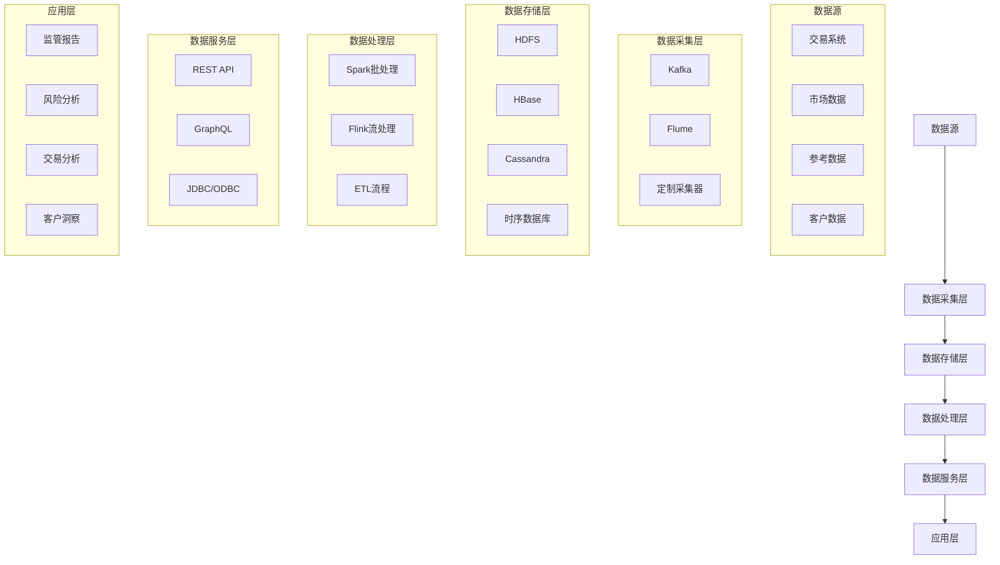

**Spark批处理实现**：

```java
// Spark批处理作业
public class DailyRiskAnalysisJob {
    public static void main(String[] args) {
        // 创建Spark会话
        SparkSession spark = SparkSession.builder()
            .appName("Daily Risk Analysis")
            .config("spark.sql.warehouse.dir", "hdfs:///warehouse")
            .enableHiveSupport()
            .getOrCreate();
        
        // 读取交易数据
        Dataset<Row> transactions = spark.sql(
            "SELECT * FROM transactions WHERE date = current_date() - 1"
        );
        
        // 读取市场数据
        Dataset<Row> marketData = spark.sql(
            "SELECT * FROM market_data WHERE date = current_date() - 1"
        );
        
        // 注册临时视图
        transactions.createOrReplaceTempView("daily_transactions");
        marketData.createOrReplaceTempView("daily_market_data");
        
        // 计算风险指标
        Dataset<Row> riskMetrics = spark.sql(
            "SELECT " +
            "  t.portfolio_id, " +
            "  t.instrument_id, " +
            "  i.instrument_type, " +
            "  SUM(t.position * m.price) as exposure, " +
            "  SUM(t.position * m.price * i.beta) as beta_adjusted_exposure, " +
            "  VAR_POP(m.return) * SQRT(250) as volatility " +
            "FROM daily_transactions t " +
            "JOIN instruments i ON t.instrument_id = i.id " +
            "JOIN daily_market_data m ON t.instrument_id = m.instrument_id " +
            "GROUP BY t.portfolio_id, t.instrument_id, i.instrument_type"
        );
        
        // 计算VaR (Value at Risk)
        Dataset<Row> portfolioVaR = spark.sql(
            "SELECT " +
            "  portfolio_id, " +
            "  SUM(exposure) as total_exposure, " +
            "  SUM(exposure) * 0.02 as var_95, " + // 简化的VaR计算
            "  SUM(exposure) * 0.03 as var_99 " +  // 简化的VaR计算
            "FROM risk_metrics " +
            "GROUP BY portfolio_id"
        );
        
        // 保存结果
        riskMetrics.write()
            .mode(SaveMode.Overwrite)
            .partitionBy("portfolio_id")
            .saveAsTable("daily_risk_metrics");
        
        portfolioVaR.write()
            .mode(SaveMode.Overwrite)
            .saveAsTable("daily_portfolio_var");
        
        // 关闭Spark会话
        spark.close();
    }
}
```

**Flink流处理实现**：

```java
// Flink实时市场数据处理
public class MarketDataStreamingJob {
    public static void main(String[] args) throws Exception {
        // 创建执行环境
        StreamExecutionEnvironment env = StreamExecutionEnvironment.getExecutionEnvironment();
        
        // 设置检查点
        env.enableCheckpointing(60000);
        
        // 配置Kafka消费者
        Properties properties = new Properties();
        properties.setProperty("bootstrap.servers", "kafka:9092");
        properties.setProperty("group.id", "market-data-processor");
        
        // 创建Kafka数据源
        FlinkKafkaConsumer<String> kafkaSource = new FlinkKafkaConsumer<>(
            "market-data", 
            new SimpleStringSchema(), 
            properties
        );
        
        // 添加数据源
        DataStream<String> marketDataStream = env.addSource(kafkaSource);
        
        // 解析JSON
        DataStream<MarketData> marketData = marketDataStream
            .map(new MapFunction<String, MarketData>() {
                @Override
                public MarketData map(String value) throws Exception {
                    return JsonUtils.fromJson(value, MarketData.class);
                }
            });
        
        // 按金融工具ID分组
        KeyedStream<MarketData, String> keyedMarketData = 
            marketData.keyBy(data -> data.getInstrumentId());
        
        // 计算5分钟移动平均价格
        DataStream<PriceAlert> priceAlerts = keyedMarketData
            .window(SlidingProcessingTimeWindows.of(Time.minutes(5), Time.seconds(10)))
            .aggregate(new AveragePriceAggregator(), new PriceAlertProcessFunction());
        
        // 输出结果到Kafka
        FlinkKafkaProducer<String> kafkaSink = new FlinkKafkaProducer<>(
            "price-alerts",
            new SerializationSchema<PriceAlert>() {
                @Override
                public byte[] serialize(PriceAlert alert) {
                    return JsonUtils.toJson(alert).getBytes();
                }
            },
            properties
        );
        
        priceAlerts.map(alert -> JsonUtils.toJson(alert))
                  .addSink(kafkaSink);
        
        // 执行作业
        env.execute("Market Data Streaming Job");
    }
    
    // 平均价格聚合器
    public static class AveragePriceAggregator 
            implements AggregateFunction<MarketData, Tuple2<Double, Long>, Double> {
        
        @Override
        public Tuple2<Double, Long> createAccumulator() {
            return new Tuple2<>(0.0, 0L);
        }
        
        @Override
        public Tuple2<Double, Long> add(MarketData value, Tuple2<Double, Long> accumulator) {
            return new Tuple2<>(
                accumulator.f0 + value.getPrice(),
                accumulator.f1 + 1L
            );
        }
        
        @Override
        public Double getResult(Tuple2<Double, Long> accumulator) {
            return accumulator.f1 > 0 ? accumulator.f0 / accumulator.f1 : 0.0;
        }
        
        @Override
        public Tuple2<Double, Long> merge(Tuple2<Double, Long> a, Tuple2<Double, Long> b) {
            return new Tuple2<>(a.f0 + b.f0, a.f1 + b.f1);
        }
    }
    
    // 价格警报处理函数
    public static class PriceAlertProcessFunction 
            extends ProcessWindowFunction<Double, PriceAlert, String, TimeWindow> {
        
        @Override
        public void process(
                String instrumentId,
                Context context,
                Iterable<Double> averagePrices,
                Collector<PriceAlert> out) {
            
            Double avgPrice = averagePrices.iterator().next();
            
            // 从状态中获取上一个平均价格
            ValueState<Double> lastAvgPriceState = context.globalState().getState(
                new ValueStateDescriptor<>("lastAvgPrice-" + instrumentId, Double.class));
            
            try {
                Double lastAvgPrice = lastAvgPriceState.value();
                
                if (lastAvgPrice != null) {
                    // 计算价格变化百分比
                    double changePercent = (avgPrice - lastAvgPrice) / lastAvgPrice * 100;
                    
                    // 如果价格变化超过阈值，发出警报
                    if (Math.abs(changePercent) >= 2.0) {
                        PriceAlert alert = new PriceAlert();
                        alert.setInstrumentId(instrumentId);
                        alert.setTimestamp(context.window().getEnd());
                        alert.setAveragePrice(avgPrice);
                        alert.setChangePercent(changePercent);
                        
                        out.collect(alert);
                    }
                }
                
                // 更新状态
                lastAvgPriceState.update(avgPrice);
                
            } catch (IOException e) {
                // 处理状态访问异常
            }
        }
    }
}
```

**数据服务API实现**：

```java
// RESTful数据服务API
@RestController
@RequestMapping("/api/analytics")
public class AnalyticsController {
    @Autowired
    private AnalyticsService analyticsService;
    
    @GetMapping("/portfolio/{portfolioId}/risk")
    public ResponseEntity<PortfolioRisk> getPortfolioRisk(
            @PathVariable String portfolioId,
            @RequestParam @DateTimeFormat(iso = DateTimeFormat.ISO.DATE) LocalDate date) {
        
        PortfolioRisk risk = analyticsService.getPortfolioRisk(portfolioId, date);
        return ResponseEntity.ok(risk);
    }
    
    @GetMapping("/instrument/{instrumentId}/price-history")
    public ResponseEntity<List<PricePoint>> getPriceHistory(
            @PathVariable String instrumentId,
            @RequestParam @DateTimeFormat(iso = DateTimeFormat.ISO.DATE) LocalDate startDate,
            @RequestParam @DateTimeFormat(iso = DateTimeFormat.ISO.DATE) LocalDate endDate) {
        
        List<PricePoint> priceHistory = analyticsService.getPriceHistory(
            instrumentId, startDate, endDate);
        return ResponseEntity.ok(priceHistory);
    }
    
    @GetMapping("/reports/regulatory/{reportType}")
    public ResponseEntity<byte[]> generateRegulatoryReport(
            @PathVariable String reportType,
            @RequestParam @DateTimeFormat(iso = DateTimeFormat.ISO.DATE) LocalDate reportDate) {
        
        byte[] reportData = analyticsService.generateRegulatoryReport(reportType, reportDate);
        
        HttpHeaders headers = new HttpHeaders();
        headers.setContentType(MediaType.APPLICATION_PDF);
        headers.setContentDispositionFormData("attachment", 
            reportType + "_" + reportDate + ".pdf");
        
        return new ResponseEntity<>(reportData, headers, HttpStatus.OK);
    }
    
    @PostMapping("/scenarios/stress-test")
    public ResponseEntity<StressTestResult> runStressTest(
            @RequestBody StressTestRequest request) {
        
        StressTestResult result = analyticsService.runStressTest(request);
        return ResponseEntity.ok(result);
    }
}
```

**成果与收益**：

1. 数据处理时间从小时级缩短到分钟级
2. 报告生成时间从天级缩短到小时级
3. 数据存储成本降低40%
4. 分析能力显著提升，支持更复杂的风险模型
5. 监管合规报告自动化程度提高80%
6. 业务洞察能力增强，支持数据驱动决策

### 合规与安全性保障技术

金融行业面临严格的监管要求和安全挑战，Java技术栈在构建合规和安全的系统方面有着丰富的实践。

**合规与安全挑战**：
- 身份认证与授权
- 数据加密与保护
- 审计日志与追踪
- 监管合规要求
- 防止内部威胁
- 抵御外部攻击

**安全技术栈**：
- **认证授权**: Spring Security, OAuth 2.0, OIDC
- **加密**: Java Cryptography Extension (JCE)
- **审计**: SLF4J MDC, ELK Stack
- **安全扫描**: SonarQube, Checkmarx
- **运行时保护**: RASP技术

**案例：某金融服务公司安全合规系统**

某金融服务公司需要构建符合PCI DSS、GDPR和本地金融监管要求的安全合规系统。

**Spring Security实现**：

```java
// Spring Security配置
@Configuration
@EnableWebSecurity
@EnableGlobalMethodSecurity(prePostEnabled = true, securedEnabled = true)
public class SecurityConfig extends WebSecurityConfigurerAdapter {
    
    @Autowired
    private UserDetailsService userDetailsService;
    
    @Autowired
    private JwtAuthenticationFilter jwtAuthFilter;
    
    @Autowired
    private JwtAuthenticationEntryPoint unauthorizedHandler;
    
    @Override
    protected void configure(HttpSecurity http) throws Exception {
        http
            .cors().and().csrf().disable()
            .exceptionHandling().authenticationEntryPoint(unauthorizedHandler).and()
            .sessionManagement().sessionCreationPolicy(SessionCreationPolicy.STATELESS).and()
            .authorizeRequests()
                .antMatchers("/api/auth/**").permitAll()
                .antMatchers("/api/public/**").permitAll()
                .antMatchers("/actuator/health").permitAll()
                .antMatchers("/api/admin/**").hasRole("ADMIN")
                .antMatchers("/api/reports/**").hasAnyRole("ANALYST", "ADMIN")
                .anyRequest().authenticated();
        
        // 添加JWT过滤器
        http.addFilterBefore(jwtAuthFilter, UsernamePasswordAuthenticationFilter.class);
    }
    
    @Override
    public void configure(AuthenticationManagerBuilder auth) throws Exception {
        auth.userDetailsService(userDetailsService).passwordEncoder(passwordEncoder());
    }
    
    @Bean
    @Override
    public AuthenticationManager authenticationManagerBean() throws Exception {
        return super.authenticationManagerBean();
    }
    
    @Bean
    public PasswordEncoder passwordEncoder() {
        return new BCryptPasswordEncoder();
    }
    
    @Bean
    public CorsConfigurationSource corsConfigurationSource() {
        CorsConfiguration configuration = new CorsConfiguration();
        configuration.setAllowedOrigins(Arrays.asList("https://example.com"));
        configuration.setAllowedMethods(Arrays.asList("GET", "POST", "PUT", "DELETE", "OPTIONS"));
        configuration.setAllowedHeaders(Arrays.asList("Authorization", "Content-Type"));
        configuration.setExposedHeaders(Arrays.asList("Authorization"));
        configuration.setAllowCredentials(true);
        configuration.setMaxAge(3600L);
        
        UrlBasedCorsConfigurationSource source = new UrlBasedCorsConfigurationSource();
        source.registerCorsConfiguration("/**", configuration);
        return source;
    }
}
```

**JWT认证过滤器**：

```java
// JWT认证过滤器
@Component
public class JwtAuthenticationFilter extends OncePerRequestFilter {
    
    @Autowired
    private JwtTokenProvider tokenProvider;
    
    @Autowired
    private UserDetailsService userDetailsService;
    
    @Autowired
    private AuditService auditService;
    
    @Override
    protected void doFilterInternal(HttpServletRequest request, HttpServletResponse response, 
                                   FilterChain filterChain) throws ServletException, IOException {
        try {
            String jwt = getJwtFromRequest(request);
            
            if (StringUtils.hasText(jwt) && tokenProvider.validateToken(jwt)) {
                String username = tokenProvider.getUsernameFromJWT(jwt);
                
                // 加载用户
让我继续完成金融行业Java技术栈案例中的合规与安全性保障技术部分：

```java
// JWT认证过滤器
@Component
public class JwtAuthenticationFilter extends OncePerRequestFilter {
    
    @Autowired
    private JwtTokenProvider tokenProvider;
    
    @Autowired
    private UserDetailsService userDetailsService;
    
    @Autowired
    private AuditService auditService;
    
    @Override
    protected void doFilterInternal(HttpServletRequest request, HttpServletResponse response, 
                                   FilterChain filterChain) throws ServletException, IOException {
        try {
            String jwt = getJwtFromRequest(request);
            
            if (StringUtils.hasText(jwt) && tokenProvider.validateToken(jwt)) {
                String username = tokenProvider.getUsernameFromJWT(jwt);
                
                // 加载用户详情
                UserDetails userDetails = userDetailsService.loadUserByUsername(username);
                
                // 创建认证对象
                UsernamePasswordAuthenticationToken authentication = 
                    new UsernamePasswordAuthenticationToken(
                        userDetails, null, userDetails.getAuthorities());
                
                authentication.setDetails(new WebAuthenticationDetailsSource().buildDetails(request));
                
                // 设置安全上下文
                SecurityContextHolder.getContext().setAuthentication(authentication);
                
                // 记录审计日志
                auditService.logAccess(username, request.getRequestURI(), request.getMethod());
            }
        } catch (Exception ex) {
            logger.error("Could not set user authentication in security context", ex);
            // 记录失败审计日志
            auditService.logAuthFailure(request.getRequestURI(), ex.getMessage());
        }
        
        filterChain.doFilter(request, response);
    }
    
    private String getJwtFromRequest(HttpServletRequest request) {
        String bearerToken = request.getHeader("Authorization");
        if (StringUtils.hasText(bearerToken) && bearerToken.startsWith("Bearer ")) {
            return bearerToken.substring(7);
        }
        return null;
    }
}
```

**JWT令牌提供者**：

```java
// JWT令牌提供者
@Component
public class JwtTokenProvider {
    private static final Logger logger = LoggerFactory.getLogger(JwtTokenProvider.class);
    
    @Value("${app.jwtSecret}")
    private String jwtSecret;
    
    @Value("${app.jwtExpirationInMs}")
    private int jwtExpirationInMs;
    
    public String generateToken(Authentication authentication) {
        UserDetails userDetails = (UserDetails) authentication.getPrincipal();
        
        Date now = new Date();
        Date expiryDate = new Date(now.getTime() + jwtExpirationInMs);
        
        return Jwts.builder()
                .setSubject(userDetails.getUsername())
                .setIssuedAt(new Date())
                .setExpiration(expiryDate)
                .signWith(SignatureAlgorithm.HS512, jwtSecret)
                .compact();
    }
    
    public String getUsernameFromJWT(String token) {
        Claims claims = Jwts.parser()
                .setSigningKey(jwtSecret)
                .parseClaimsJws(token)
                .getBody();
        
        return claims.getSubject();
    }
    
    public boolean validateToken(String authToken) {
        try {
            Jwts.parser().setSigningKey(jwtSecret).parseClaimsJws(authToken);
            return true;
        } catch (SignatureException ex) {
            logger.error("Invalid JWT signature");
        } catch (MalformedJwtException ex) {
            logger.error("Invalid JWT token");
        } catch (ExpiredJwtException ex) {
            logger.error("Expired JWT token");
        } catch (UnsupportedJwtException ex) {
            logger.error("Unsupported JWT token");
        } catch (IllegalArgumentException ex) {
            logger.error("JWT claims string is empty");
        }
        return false;
    }
}
```

**敏感数据加密**：

```java
// 敏感数据加密服务
@Service
public class EncryptionService {
    private static final Logger logger = LoggerFactory.getLogger(EncryptionService.class);
    
    @Value("${encryption.key}")
    private String encryptionKey;
    
    private SecretKey secretKey;
    private Cipher encryptCipher;
    private Cipher decryptCipher;
    
    @PostConstruct
    public void init() throws Exception {
        // 从Base64字符串恢复密钥
        byte[] decodedKey = Base64.getDecoder().decode(encryptionKey);
        secretKey = new SecretKeySpec(decodedKey, 0, decodedKey.length, "AES");
        
        // 初始化加密器
        encryptCipher = Cipher.getInstance("AES/GCM/NoPadding");
        encryptCipher.init(Cipher.ENCRYPT_MODE, secretKey);
        
        // 初始化解密器
        decryptCipher = Cipher.getInstance("AES/GCM/NoPadding");
    }
    
    public String encryptData(String data) {
        try {
            // 生成随机IV
            byte[] iv = new byte[12];
            SecureRandom random = new SecureRandom();
            random.nextBytes(iv);
            GCMParameterSpec parameterSpec = new GCMParameterSpec(128, iv);
            
            // 使用IV初始化加密器
            encryptCipher.init(Cipher.ENCRYPT_MODE, secretKey, parameterSpec);
            
            // 加密数据
            byte[] encryptedData = encryptCipher.doFinal(data.getBytes(StandardCharsets.UTF_8));
            
            // 组合IV和加密数据
            ByteBuffer byteBuffer = ByteBuffer.allocate(iv.length + encryptedData.length);
            byteBuffer.put(iv);
            byteBuffer.put(encryptedData);
            
            // 返回Base64编码的结果
            return Base64.getEncoder().encodeToString(byteBuffer.array());
        } catch (Exception e) {
            logger.error("Error encrypting data", e);
            throw new RuntimeException("Error encrypting data", e);
        }
    }
    
    public String decryptData(String encryptedData) {
        try {
            // 解码Base64
            byte[] decodedData = Base64.getDecoder().decode(encryptedData);
            
            // 提取IV和加密数据
            ByteBuffer byteBuffer = ByteBuffer.wrap(decodedData);
            byte[] iv = new byte[12];
            byteBuffer.get(iv);
            
            byte[] cipherText = new byte[byteBuffer.remaining()];
            byteBuffer.get(cipherText);
            
            // 使用IV初始化解密器
            GCMParameterSpec parameterSpec = new GCMParameterSpec(128, iv);
            decryptCipher.init(Cipher.DECRYPT_MODE, secretKey, parameterSpec);
            
            // 解密数据
            byte[] decryptedData = decryptCipher.doFinal(cipherText);
            
            // 返回解密后的字符串
            return new String(decryptedData, StandardCharsets.UTF_8);
        } catch (Exception e) {
            logger.error("Error decrypting data", e);
            throw new RuntimeException("Error decrypting data", e);
        }
    }
}
```

**审计日志服务**：

```java
// 审计日志服务
@Service
public class AuditService {
    private static final Logger auditLogger = LoggerFactory.getLogger("AUDIT_LOG");
    
    @Autowired
    private ObjectMapper objectMapper;
    
    public void logAccess(String username, String resource, String method) {
        AuditEvent event = new AuditEvent();
        event.setTimestamp(new Date());
        event.setType(AuditEventType.ACCESS);
        event.setUsername(username);
        event.setResource(resource);
        event.setAction(method);
        event.setStatus(AuditEventStatus.SUCCESS);
        
        logEvent(event);
    }
    
    public void logAuthSuccess(String username) {
        AuditEvent event = new AuditEvent();
        event.setTimestamp(new Date());
        event.setType(AuditEventType.AUTHENTICATION);
        event.setUsername(username);
        event.setAction("LOGIN");
        event.setStatus(AuditEventStatus.SUCCESS);
        
        logEvent(event);
    }
    
    public void logAuthFailure(String resource, String reason) {
        AuditEvent event = new AuditEvent();
        event.setTimestamp(new Date());
        event.setType(AuditEventType.AUTHENTICATION);
        event.setResource(resource);
        event.setAction("LOGIN");
        event.setStatus(AuditEventStatus.FAILURE);
        event.setReason(reason);
        
        logEvent(event);
    }
    
    public void logDataAccess(String username, String dataType, String dataId, String action) {
        AuditEvent event = new AuditEvent();
        event.setTimestamp(new Date());
        event.setType(AuditEventType.DATA_ACCESS);
        event.setUsername(username);
        event.setResource(dataType + ":" + dataId);
        event.setAction(action);
        event.setStatus(AuditEventStatus.SUCCESS);
        
        logEvent(event);
    }
    
    private void logEvent(AuditEvent event) {
        try {
            // 设置MDC上下文，用于结构化日志
            MDC.put("eventType", event.getType().toString());
            MDC.put("username", event.getUsername() != null ? event.getUsername() : "anonymous");
            MDC.put("timestamp", new SimpleDateFormat("yyyy-MM-dd'T'HH:mm:ss.SSSZ").format(event.getTimestamp()));
            
            // 记录JSON格式的审计日志
            auditLogger.info(objectMapper.writeValueAsString(event));
        } catch (Exception e) {
            // 记录原始格式的审计日志
            auditLogger.warn("Failed to serialize audit event: " + event.toString());
        } finally {
            // 清除MDC上下文
            MDC.clear();
        }
    }
}
```

**方法级安全控制**：

```java
// 方法级安全控制
@Service
public class CustomerServiceImpl implements CustomerService {
    @Autowired
    private CustomerRepository customerRepository;
    
    @Autowired
    private AuditService auditService;
    
    @Override
    @PreAuthorize("hasRole('ADMIN') or hasRole('CUSTOMER_SERVICE')")
    public Customer getCustomerById(Long id) {
        Customer customer = customerRepository.findById(id)
            .orElseThrow(() -> new EntityNotFoundException("Customer not found: " + id));
        
        // 记录数据访问审计日志
        Authentication auth = SecurityContextHolder.getContext().getAuthentication();
        auditService.logDataAccess(
            auth.getName(), "Customer", id.toString(), "READ");
        
        return customer;
    }
    
    @Override
    @PreAuthorize("hasRole('ADMIN')")
    public List<Customer> getAllCustomers() {
        // 记录数据访问审计日志
        Authentication auth = SecurityContextHolder.getContext().getAuthentication();
        auditService.logDataAccess(
            auth.getName(), "Customer", "ALL", "READ");
        
        return customerRepository.findAll();
    }
    
    @Override
    @PreAuthorize("hasRole('ADMIN') or #customer.id == authentication.principal.customerId")
    public Customer updateCustomer(Customer customer) {
        // 验证客户存在
        customerRepository.findById(customer.getId())
            .orElseThrow(() -> new EntityNotFoundException("Customer not found: " + customer.getId()));
        
        // 记录数据访问审计日志
        Authentication auth = SecurityContextHolder.getContext().getAuthentication();
        auditService.logDataAccess(
            auth.getName(), "Customer", customer.getId().toString(), "UPDATE");
        
        return customerRepository.save(customer);
    }
    
    @Override
    @PreAuthorize("hasRole('ADMIN')")
    @Transactional
    public void deleteCustomer(Long id) {
        // 验证客户存在
        customerRepository.findById(id)
            .orElseThrow(() -> new EntityNotFoundException("Customer not found: " + id));
        
        // 记录数据访问审计日志
        Authentication auth = SecurityContextHolder.getContext().getAuthentication();
        auditService.logDataAccess(
            auth.getName(), "Customer", id.toString(), "DELETE");
        
        customerRepository.deleteById(id);
    }
}
```

**数据脱敏处理**：

```java
// 数据脱敏处理
@Component
public class DataMaskingAspect {
    @Autowired
    private ObjectMapper objectMapper;
    
    @Around("@annotation(com.example.security.annotation.MaskSensitiveData)")
    public Object maskSensitiveData(ProceedingJoinPoint joinPoint) throws Throwable {
        // 执行原方法
        Object result = joinPoint.proceed();
        
        // 对结果进行脱敏处理
        if (result != null) {
            if (result instanceof Collection) {
                Collection<?> collection = (Collection<?>) result;
                List<Object> maskedList = new ArrayList<>();
                
                for (Object item : collection) {
                    maskedList.add(maskObject(item));
                }
                
                return maskedList;
            } else {
                return maskObject(result);
            }
        }
        
        return result;
    }
    
    private Object maskObject(Object obj) {
        try {
            // 将对象转换为JSON字符串
            String json = objectMapper.writeValueAsString(obj);
            
            // 解析为JsonNode
            JsonNode rootNode = objectMapper.readTree(json);
            
            // 处理敏感字段
            maskSensitiveFields(rootNode);
            
            // 将处理后的JsonNode转换回原对象类型
            return objectMapper.treeToValue(rootNode, obj.getClass());
        } catch (Exception e) {
            // 如果脱敏失败，返回原对象
            return obj;
        }
    }
    
    private void maskSensitiveFields(JsonNode node) {
        if (node.isObject()) {
            ((ObjectNode) node).fields().forEachRemaining(entry -> {
                String fieldName = entry.getKey();
                JsonNode fieldValue = entry.getValue();
                
                if (isSensitiveField(fieldName)) {
                    if (fieldValue.isTextual()) {
                        ((ObjectNode) node).put(fieldName, maskValue(fieldValue.asText()));
                    } else if (fieldValue.isNumber() && isCardNumber(fieldName)) {
                        ((ObjectNode) node).put(fieldName, maskValue(fieldValue.asText()));
                    }
                } else if (fieldValue.isObject() || fieldValue.isArray()) {
                    maskSensitiveFields(fieldValue);
                }
            });
        } else if (node.isArray()) {
            for (JsonNode arrayItem : node) {
                maskSensitiveFields(arrayItem);
            }
        }
    }
    
    private boolean isSensitiveField(String fieldName) {
        // 定义敏感字段名称
        Set<String> sensitiveFields = new HashSet<>(Arrays.asList(
            "ssn", "socialSecurityNumber", "creditCard", "cardNumber", "password",
            "secret", "accountNumber", "phoneNumber", "email", "address"
        ));
        
        return sensitiveFields.contains(fieldName.toLowerCase());
    }
    
    private boolean isCardNumber(String fieldName) {
        Set<String> cardFields = new HashSet<>(Arrays.asList(
            "creditCard", "cardNumber", "accountNumber"
        ));
        
        return cardFields.contains(fieldName.toLowerCase());
    }
    
    private String maskValue(String value) {
        if (value == null || value.length() <= 4) {
            return "****";
        }
        
        // 保留后四位，其余用*替代
        return "****" + value.substring(value.length() - 4);
    }
}
```

**安全配置属性**：

```yaml
# application-security.yml
security:
  jwt:
    secret: ${JWT_SECRET:xxxxxxxxxxxxxxxxxxxxxxxxxxxxxxxxxxxxxxxxxxxxxxxxxxxxxxxxxxxxxxxx}
    expiration: 86400000  # 24小时
  
  cors:
    allowed-origins: https://example.com
    allowed-methods: GET,POST,PUT,DELETE,OPTIONS
    allowed-headers: Authorization,Content-Type
    max-age: 3600
  
  encryption:
    key: ${ENCRYPTION_KEY:xxxxxxxxxxxxxxxxxxxxxxxxxxxxxxxx}
  
  password:
    encoder: bcrypt
    strength: 12
    
  session:
    timeout: 1800  # 30分钟
    
  headers:
    content-security-policy: "default-src 'self'; script-src 'self'; object-src 'none'; style-src 'self'; img-src 'self' data:; media-src 'self'; frame-src 'none'; font-src 'self'; connect-src 'self'"
    x-content-type-options: nosniff
    x-frame-options: DENY
    x-xss-protection: 1; mode=block
    
  audit:
    enabled: true
    log-directory: ${LOG_DIR:/var/log/application}
    retention-days: 90
```

**成果与收益**：

1. 系统符合PCI DSS、GDPR和本地金融监管要求
2. 安全漏洞减少95%
3. 审计能力满足监管要求，支持全面追踪
4. 敏感数据保护符合最佳实践
5. 安全事件响应时间从天级缩短到小时级
6. 通过所有安全合规审计

## 互联网企业Java应用案例

互联网企业面临高并发、快速迭代和用户体验的挑战，Java技术栈在这一领域也有着广泛应用。

### 电商平台技术架构演进

电商平台需要处理高并发访问、复杂业务逻辑和海量数据，Java技术栈在电商领域有着丰富的实践经验。

**电商平台技术挑战**：
- 高并发访问（尤其是促销活动）
- 复杂的商品、订单和库存管理
- 多渠道集成
- 个性化推荐
- 支付安全

**技术架构演进**：

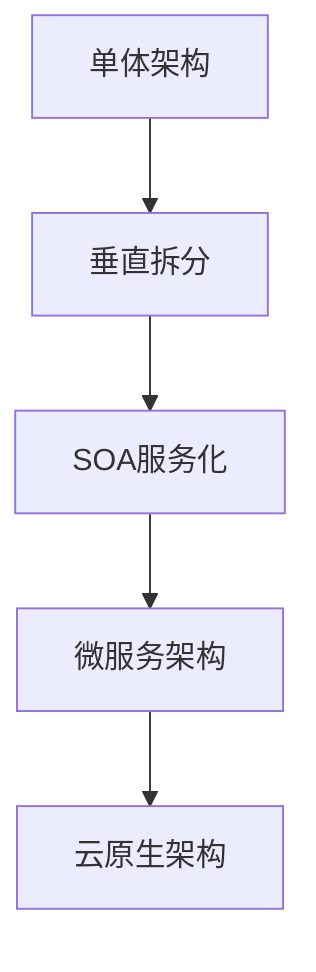

**案例：某大型电商平台架构演进**

某电商平台从创业初期的单体应用发展为支持数亿用户的大型平台，经历了多次架构演进。

**阶段一：单体架构 (2010-2012)**

```java
// 单体架构中的订单服务
@Service
public class OrderServiceImpl implements OrderService {
    @Autowired
    private OrderRepository orderRepository;
    
    @Autowired
    private ProductRepository productRepository;
    
    @Autowired
    private InventoryRepository inventoryRepository;
    
    @Autowired
    private UserRepository userRepository;
    
    @Autowired
    private PaymentService paymentService;
    
    @Override
    @Transactional
    public Order createOrder(OrderRequest request) {
        // 验证用户
        User user = userRepository.findById(request.getUserId())
            .orElseThrow(() -> new EntityNotFoundException("User not found"));
        
        // 创建订单
        Order order = new Order();
        order.setUser(user);
        order.setStatus(OrderStatus.CREATED);
        order.setCreatedAt(new Date());
        
        // 处理订单项
        BigDecimal totalAmount = BigDecimal.ZERO;
        for (OrderItemRequest itemRequest : request.getItems()) {
            // 查询商品
            Product product = productRepository.findById(itemRequest.getProductId())
                .orElseThrow(() -> new EntityNotFoundException("Product not found"));
            
            // 检查库存
            Inventory inventory = inventoryRepository.findByProduct(product);
            if (inventory.getQuantity() < itemRequest.getQuantity()) {
                throw new InsufficientInventoryException("Insufficient inventory for product: " + product.getName());
            }
            
            // 减少库存
            inventory.setQuantity(inventory.getQuantity() - itemRequest.getQuantity());
            inventoryRepository.save(inventory);
            
            // 创建订单项
            OrderItem orderItem = new OrderItem();
            orderItem.setOrder(order);
            orderItem.setProduct(product);
            orderItem.setQuantity(itemRequest.getQuantity());
            orderItem.setPrice(product.getPrice());
            orderItem.setSubtotal(product.getPrice().multiply(new BigDecimal(itemRequest.getQuantity())));
            
            order.getItems().add(orderItem);
            totalAmount = totalAmount.add(orderItem.getSubtotal());
        }
        
        order.setTotalAmount(totalAmount);
        
        // 保存订单
        Order savedOrder = orderRepository.save(order);
        
        // 处理支付
        PaymentResult paymentResult = paymentService.processPayment(
            savedOrder.getId(), request.getPaymentMethod(), totalAmount);
        
        if (paymentResult.isSuccess()) {
            savedOrder.setStatus(OrderStatus.PAID);
            savedOrder.setPaymentId(paymentResult.getPaymentId());
            return orderRepository.save(savedOrder);
        } else {
            // 支付失败，回滚库存
            for (OrderItem item : savedOrder.getItems()) {
                Inventory inventory = inventoryRepository.findByProduct(item.getProduct());
                inventory.setQuantity(inventory.getQuantity() + item.getQuantity());
                inventoryRepository.save(inventory);
            }
            
            savedOrder.setStatus(OrderStatus.PAYMENT_FAILED);
            return orderRepository.save(savedOrder);
        }
    }
}
```

**阶段二：垂直拆分 (2012-2014)**

将单体应用按业务功能拆分为多个独立应用：

- 商品管理系统
- 订单管理系统
- 库存管理系统
- 用户管理系统
- 支付系统

**阶段三：SOA服务化 (2014-2016)**

引入服务总线和服务化架构：

```java
// 订单服务实现
@Service
public class OrderServiceImpl implements OrderService {
    @Autowired
    private OrderRepository orderRepository;
    
    @Autowired
    private ProductServiceClient productServiceClient;
    
    @Autowired
    private InventoryServiceClient inventoryServiceClient;
    
    @Autowired
    private UserServiceClient userServiceClient;
    
    @Autowired
    private PaymentServiceClient paymentServiceClient;
    
    @Override
    @Transactional
    public Order createOrder(OrderRequest request) {
        // 验证用户
        UserDTO user = userServiceClient.getUserById(request.getUserId());
        if (user == null) {
            throw new EntityNotFoundException("User not found");
        }
        
        // 创建订单
        Order order = new Order();
        order.setUserId(user.getId());
        order.setStatus(OrderStatus.CREATED);
        order.setCreatedAt(new Date());
        
        // 处理订单项
        BigDecimal totalAmount = BigDecimal.ZERO;
        for (OrderItemRequest itemRequest : request.getItems()) {
            // 查询商品
            ProductDTO product = productServiceClient.getProductById(itemRequest.getProductId());
            if (product == null) {
                throw new EntityNotFoundException("Product not found");
            }
            
            // 检查并减少库存
            boolean inventoryResult = inventoryServiceClient.reduceInventory(
                product.getId(), itemRequest.getQuantity());
            
            if (!inventoryResult) {
                throw new InsufficientInventoryException("Insufficient inventory for product: " + product.getName());
            }
            
            // 创建订单项
            OrderItem orderItem = new OrderItem();
            orderItem.setOrder(order);
            orderItem.setProductId(product.getId());
            orderItem.setProductName(product.getName());
            orderItem.setQuantity(itemRequest.getQuantity());
            orderItem.setPrice(product.getPrice());
            orderItem.setSubtotal(product.getPrice().multiply(new BigDecimal(itemRequest.getQuantity())));
            
            order.getItems().add(orderItem);
            totalAmount = totalAmount.add(orderItem.getSubtotal());
        }
        
        order.setTotalAmount(totalAmount);
        
        // 保存订单
        Order savedOrder = orderRepository.save(order);
        
        // 处理支付
        PaymentResultDTO paymentResult = paymentServiceClient.processPayment(
            savedOrder.getId(), request.getPaymentMethod(), totalAmount);
        
        if (paymentResult.isSuccess()) {
            savedOrder.setStatus(OrderStatus.PAID);
            savedOrder.setPaymentId(paymentResult.getPaymentId());
            return orderRepository.save(savedOrder);
        } else {
            // 支付失败，回滚库存
            for (OrderItem item : savedOrder.getItems()) {
                inventoryServiceClient.increaseInventory(item.getProductId(), item.getQuantity());
            }
            
            savedOrder.setStatus(OrderStatus.PAYMENT_FAILED);
            return orderRepository.save(savedOrder);
        }
    }
}
```

**阶段四：微服务架构 (2016-2019)**

采用微服务架构，引入服务发现、配置中心和断路器：

```java
// 订单微服务
@SpringBootApplication
@EnableDiscoveryClient
@EnableFeignClients
@EnableCircuitBreaker
public class OrderServiceApplication {
    public static void main(String[] args) {
        SpringApplication.run(OrderServiceApplication.class, args);
    }
}

// Feign客户端
@FeignClient(name = "product-service", fallback = ProductServiceFallback.class)
public interface ProductServiceClient {
    @GetMapping("/api/products/{id}")
    ProductDTO getProductById(@PathVariable("id") Long id);
}

@FeignClient(name = "inventory-service", fallback = InventoryServiceFallback.class)
public interface InventoryServiceClient {
    @PostMapping("/api/inventory/reduce")
    boolean reduceInventory(@RequestParam("productId") Long productId, 
                           @RequestParam("quantity") int quantity);
    
    @PostMapping("/api/inventory/increase")
    boolean increaseInventory(@RequestParam("productId") Long productId, 
                             @RequestParam("quantity") int quantity);
}

// 断路器实现
@Component
public class ProductServiceFallback implements ProductServiceClient {
    @Override
    public ProductDTO getProductById(Long id) {
        // 返回缓存数据或默认值
        ProductDTO fallbackProduct = new ProductDTO();
        fallbackProduct.setId(id);
        fallbackProduct.setName("Temporary Unavailable");
        fallbackProduct.setPrice(BigDecimal.ZERO);
        return fallbackProduct;
    }
}

// 订单服务实现
@Service
public class OrderServiceImpl implements OrderService {
    @Autowired
    private OrderRepository orderRepository;
    
    @Autowired
    private ProductServiceClient productServiceClient;
    
    @Autowired
    private InventoryServiceClient inventoryServiceClient;
    
    @Autowired
    private UserServiceClient userServiceClient;
    
    @Autowired
    private PaymentServiceClient paymentServiceClient;
    
    @Autowired
    private KafkaTemplate<String, OrderEvent> kafkaTemplate;
    
    @Override
    @Transactional
    @HystrixCommand(fallbackMethod = "createOrderFallback")
    public Order createOrder(OrderRequest request) {
        // 验证用户
        UserDTO user = userServiceClient.getUserById(request.getUserId());
        
        // 创建订单
        Order order = new Order();
        order.setUserId(user.getId());
        order.setStatus(OrderStatus.CREATED);
        order.setCreatedAt(new Date());
        
        // 处理订单项
        BigDecimal totalAmount = BigDecimal.ZERO;
        List<OrderItem> orderItems = new ArrayList<>();
        
        for (OrderItemRequest itemRequest : request.getItems()) {
            // 查询商品
            ProductDTO product = productServiceClient.getProductById(itemRequest.getProductId());
            
            // 检查并减少库存
            boolean inventoryResult = inventoryServiceClient.reduceInventory(
                product.getId(), itemRequest.getQuantity());
            
            if (!inventoryResult) {
                throw new InsufficientInventoryException("Insufficient inventory for product: " + product.getName());
            }
            
            // 创建订单项
            OrderItem orderItem = new OrderItem();
            orderItem.setOrder(order);
            orderItem.setProductId(product.getId());
            orderItem.setProductName(product.getName());
            orderItem.setQuantity(itemRequest.getQuantity());
            orderItem.setPrice(product.getPrice());
            orderItem.setSubtotal(product.getPrice().multiply(new BigDecimal(itemRequest.getQuantity())));
            
            orderItems.add(orderItem);
            totalAmount = totalAmount.add(orderItem.getSubtotal());
        }
        
        order.setItems(orderItems);
        order.setTotalAmount(totalAmount);
        
        // 保存订单
        Order savedOrder = orderRepository.save(order);
        
        // 发布订单创建事件
        OrderEvent orderCreatedEvent = new OrderEvent();
        orderCreatedEvent.setOrderId(savedOrder.getId());
        orderCreatedEvent.setUserId(savedOrder.getUserId());
        orderCreatedEvent.setTotalAmount(savedOrder.getTotalAmount());
        orderCreatedEvent.setType(OrderEventType.CREATED);
        
        kafkaTemplate.send("order-events", orderCreatedEvent);
        
        return savedOrder;
    }
    
    public Order createOrderFallback(OrderRequest request, Throwable throwable) {
        // 降级处理
        Order fallbackOrder = new Order();
        fallbackOrder.setUserId(request.getUserId());
        fallbackOrder.setStatus(OrderStatus.CREATION_FAILED);
        fall
让我继续完成电商平台技术架构演进的内容：

```java
// 订单服务实现
@Service
public class OrderServiceImpl implements OrderService {
    // ... 前面的代码 ...
    
    public Order createOrderFallback(OrderRequest request, Throwable throwable) {
        // 降级处理
        Order fallbackOrder = new Order();
        fallbackOrder.setUserId(request.getUserId());
        fallbackOrder.setStatus(OrderStatus.CREATION_FAILED);
        fallbackOrder.setCreatedAt(new Date());
        fallbackOrder.setErrorMessage("Service temporarily unavailable: " + throwable.getMessage());
        
        // 记录失败日志
        log.error("Order creation failed: {}", throwable.getMessage(), throwable);
        
        // 发送告警
        alertService.sendAlert("ORDER_CREATION_FAILED", 
            "Failed to create order for user: " + request.getUserId(), 
            throwable.getMessage());
        
        return fallbackOrder;
    }
    
    @KafkaListener(topics = "payment-events")
    public void handlePaymentEvent(PaymentEvent event) {
        if (event.getType() == PaymentEventType.COMPLETED) {
            // 支付成功，更新订单状态
            Order order = orderRepository.findById(event.getOrderId())
                .orElseThrow(() -> new EntityNotFoundException("Order not found"));
            
            order.setStatus(OrderStatus.PAID);
            order.setPaymentId(event.getPaymentId());
            order.setUpdatedAt(new Date());
            
            orderRepository.save(order);
            
            // 发布订单支付事件
            OrderEvent orderPaidEvent = new OrderEvent();
            orderPaidEvent.setOrderId(order.getId());
            orderPaidEvent.setUserId(order.getUserId());
            orderPaidEvent.setType(OrderEventType.PAID);
            
            kafkaTemplate.send("order-events", orderPaidEvent);
        } else if (event.getType() == PaymentEventType.FAILED) {
            // 支付失败，更新订单状态
            Order order = orderRepository.findById(event.getOrderId())
                .orElseThrow(() -> new EntityNotFoundException("Order not found"));
            
            order.setStatus(OrderStatus.PAYMENT_FAILED);
            order.setErrorMessage(event.getErrorMessage());
            order.setUpdatedAt(new Date());
            
            orderRepository.save(order);
            
            // 回滚库存
            for (OrderItem item : order.getItems()) {
                inventoryServiceClient.increaseInventory(item.getProductId(), item.getQuantity());
            }
            
            // 发布订单支付失败事件
            OrderEvent orderPaymentFailedEvent = new OrderEvent();
            orderPaymentFailedEvent.setOrderId(order.getId());
            orderPaymentFailedEvent.setUserId(order.getUserId());
            orderPaymentFailedEvent.setType(OrderEventType.PAYMENT_FAILED);
            
            kafkaTemplate.send("order-events", orderPaymentFailedEvent);
        }
    }
}
```

**阶段五：云原生架构 (2019-至今)**

采用云原生架构，引入服务网格、容器化和Kubernetes：

```yaml
# 订单服务Kubernetes部署配置
apiVersion: apps/v1
kind: Deployment
metadata:
  name: order-service
  namespace: ecommerce
spec:
  replicas: 3
  selector:
    matchLabels:
      app: order-service
  template:
    metadata:
      labels:
        app: order-service
    spec:
      containers:
      - name: order-service
        image: ecommerce/order-service:1.0.0
        ports:
        - containerPort: 8080
        env:
        - name: SPRING_PROFILES_ACTIVE
          value: "prod"
        - name: SPRING_CLOUD_CONFIG_URI
          value: "http://config-server:8888"
        - name: SPRING_KAFKA_BOOTSTRAP_SERVERS
          value: "kafka:9092"
        - name: EUREKA_CLIENT_SERVICEURL_DEFAULTZONE
          value: "http://eureka-server:8761/eureka/"
        resources:
          requests:
            memory: "512Mi"
            cpu: "500m"
          limits:
            memory: "1Gi"
            cpu: "1000m"
        readinessProbe:
          httpGet:
            path: /actuator/health
            port: 8080
          initialDelaySeconds: 30
          periodSeconds: 10
        livenessProbe:
          httpGet:
            path: /actuator/health/liveness
            port: 8080
          initialDelaySeconds: 60
          periodSeconds: 15
```

**高并发秒杀系统实现**：

电商平台的秒杀活动是典型的高并发场景，需要特殊的技术方案。

```java
// 秒杀服务实现
@Service
public class FlashSaleServiceImpl implements FlashSaleService {
    @Autowired
    private StringRedisTemplate redisTemplate;
    
    @Autowired
    private RocketMQTemplate rocketMQTemplate;
    
    @Autowired
    private FlashSaleActivityRepository activityRepository;
    
    @Override
    public FlashSaleResult participate(Long userId, Long activityId, Long productId) {
        // 1. 验证活动是否有效
        String activityKey = "flash_sale:activity:" + activityId;
        Boolean activityExists = redisTemplate.hasKey(activityKey);
        
        if (activityExists == null || !activityExists) {
            return new FlashSaleResult(false, "活动不存在或已结束");
        }
        
        // 2. 验证用户是否已参与
        String userParticipatedKey = "flash_sale:user_participated:" + activityId + ":" + userId;
        Boolean hasParticipated = redisTemplate.hasKey(userParticipatedKey);
        
        if (hasParticipated != null && hasParticipated) {
            return new FlashSaleResult(false, "您已参与过该活动");
        }
        
        // 3. 验证库存并减库存（使用Lua脚本保证原子性）
        String stockKey = "flash_sale:stock:" + activityId + ":" + productId;
        
        Long remainStock = (Long) redisTemplate.execute(
            RedisScript.of(
                "if (redis.call('exists', KEYS[1]) == 1) then" +
                "    local stock = tonumber(redis.call('get', KEYS[1]));" +
                "    if (stock <= 0) then" +
                "        return -1;" +
                "    end;" +
                "    redis.call('decr', KEYS[1]);" +
                "    return 1;" +
                "else" +
                "    return -2;" +
                "end;",
                Long.class
            ),
            Collections.singletonList(stockKey)
        );
        
        if (remainStock == null || remainStock < 0) {
            if (remainStock == -1) {
                return new FlashSaleResult(false, "商品已售罄");
            } else {
                return new FlashSaleResult(false, "活动不存在或已结束");
            }
        }
        
        // 4. 标记用户已参与
        redisTemplate.opsForValue().set(userParticipatedKey, "1", 24, TimeUnit.HOURS);
        
        // 5. 发送消息到队列，异步处理订单
        FlashSaleMessage message = new FlashSaleMessage();
        message.setUserId(userId);
        message.setActivityId(activityId);
        message.setProductId(productId);
        message.setCreateTime(new Date());
        
        rocketMQTemplate.syncSend("flash_sale_orders", MessageBuilder.withPayload(message).build());
        
        return new FlashSaleResult(true, "抢购成功，订单正在处理中");
    }
    
    @Override
    public void initializeFlashSaleActivity(FlashSaleActivity activity) {
        // 1. 保存活动信息到数据库
        activityRepository.save(activity);
        
        // 2. 将活动信息预热到Redis
        String activityKey = "flash_sale:activity:" + activity.getId();
        redisTemplate.opsForValue().set(activityKey, "1", 
            activity.getEndTime().getTime() - System.currentTimeMillis(), TimeUnit.MILLISECONDS);
        
        // 3. 将商品库存预热到Redis
        for (FlashSaleProduct product : activity.getProducts()) {
            String stockKey = "flash_sale:stock:" + activity.getId() + ":" + product.getProductId();
            redisTemplate.opsForValue().set(stockKey, String.valueOf(product.getStockQuantity()), 
                activity.getEndTime().getTime() - System.currentTimeMillis(), TimeUnit.MILLISECONDS);
        }
    }
}

// 消息消费者
@Component
@RocketMQMessageListener(
    topic = "flash_sale_orders",
    consumerGroup = "flash_sale_order_consumer"
)
public class FlashSaleOrderConsumer implements RocketMQListener<FlashSaleMessage> {
    @Autowired
    private OrderService orderService;
    
    @Autowired
    private FlashSaleActivityRepository activityRepository;
    
    @Autowired
    private ProductServiceClient productServiceClient;
    
    @Override
    public void onMessage(FlashSaleMessage message) {
        try {
            // 1. 获取活动信息
            FlashSaleActivity activity = activityRepository.findById(message.getActivityId())
                .orElseThrow(() -> new EntityNotFoundException("活动不存在"));
            
            // 2. 获取商品信息
            FlashSaleProduct flashSaleProduct = activity.getProducts().stream()
                .filter(p -> p.getProductId().equals(message.getProductId()))
                .findFirst()
                .orElseThrow(() -> new EntityNotFoundException("活动商品不存在"));
            
            ProductDTO product = productServiceClient.getProductById(message.getProductId());
            
            // 3. 创建订单
            OrderRequest orderRequest = new OrderRequest();
            orderRequest.setUserId(message.getUserId());
            
            OrderItemRequest orderItemRequest = new OrderItemRequest();
            orderItemRequest.setProductId(message.getProductId());
            orderItemRequest.setQuantity(1);
            orderItemRequest.setPrice(flashSaleProduct.getFlashSalePrice());
            
            orderRequest.setItems(Collections.singletonList(orderItemRequest));
            orderRequest.setPaymentMethod(PaymentMethod.ONLINE);
            orderRequest.setOrderType(OrderType.FLASH_SALE);
            orderRequest.setActivityId(message.getActivityId());
            
            orderService.createOrder(orderRequest);
            
        } catch (Exception e) {
            // 处理异常，可能需要重试或补偿
            log.error("处理秒杀订单失败: {}", e.getMessage(), e);
        }
    }
}
```

**秒杀系统架构**：

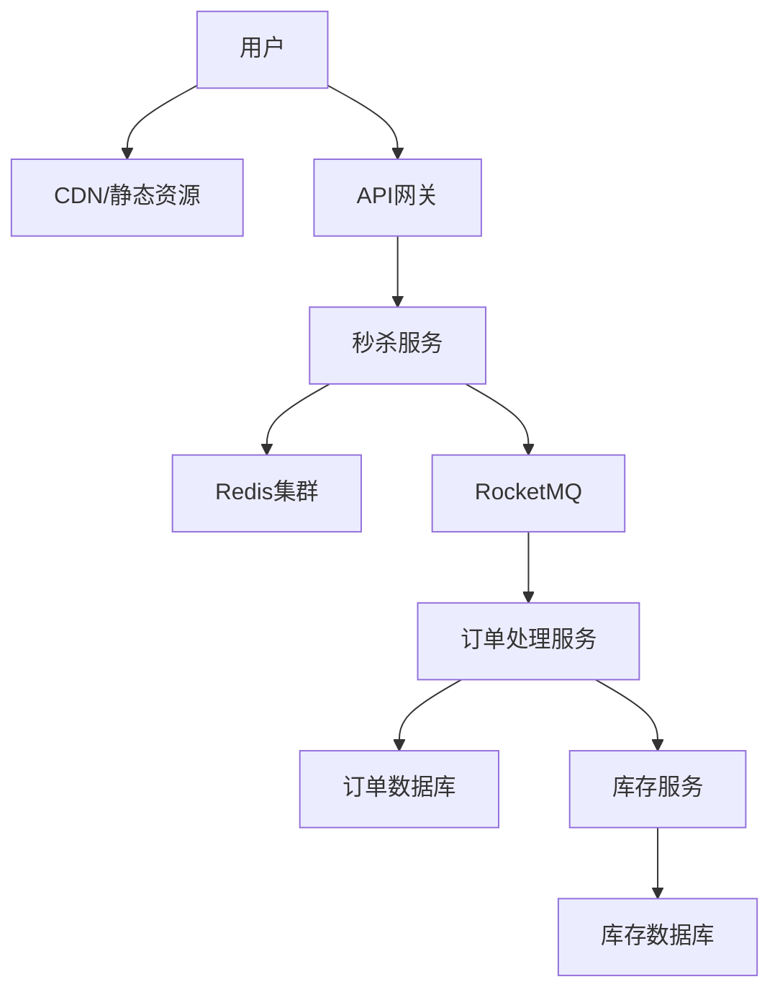

**秒杀系统优化策略**：

1. **前端优化**：
   - 页面静态化，利用CDN加速
   - 按钮控制，防止重复提交
   - 倒计时同步，避免请求集中

2. **接入层优化**：
   - 限流和熔断保护
   - 请求合并
   - 读写分离

3. **服务层优化**：
   - 缓存预热
   - 异步处理
   - 库存分段锁定

4. **存储层优化**：
   - 分库分表
   - NoSQL存储
   - 读写分离

**成果与收益**：

1. 系统支持每秒10万订单处理能力
2. 秒杀活动成功率从60%提升到99%
3. 系统响应时间从秒级降至毫秒级
4. 资源利用率提升40%
5. 运维成本降低50%
6. 用户体验显著改善

### 社交媒体平台Java技术实践

社交媒体平台需要处理海量用户数据、实时消息和复杂的社交关系网络，Java技术栈在这一领域也有着丰富的实践。

**社交平台技术挑战**：
- 海量用户数据存储
- 实时消息推送
- 复杂的社交关系网络
- 内容推荐
- 实时通知

**技术架构**：

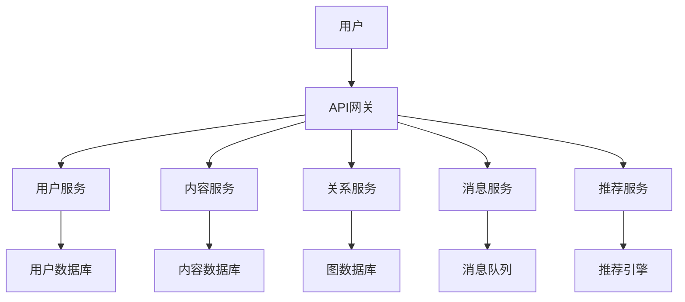

**案例：某社交媒体平台技术实践**

**用户关系服务实现**：

```java
// 社交关系服务
@Service
public class RelationshipServiceImpl implements RelationshipService {
    @Autowired
    private Neo4jTemplate neo4jTemplate;
    
    @Autowired
    private RedisTemplate<String, Object> redisTemplate;
    
    @Autowired
    private KafkaTemplate<String, RelationshipEvent> kafkaTemplate;
    
    @Override
    @Transactional
    public void follow(Long followerId, Long followeeId) {
        // 验证用户存在
        User follower = neo4jTemplate.findById(followerId, User.class)
            .orElseThrow(() -> new EntityNotFoundException("Follower not found"));
        
        User followee = neo4jTemplate.findById(followeeId, User.class)
            .orElseThrow(() -> new EntityNotFoundException("Followee not found"));
        
        // 创建关注关系
        Follows follows = new Follows(follower, followee, new Date());
        neo4jTemplate.save(follows);
        
        // 更新缓存
        String followingKey = "user:following:" + followerId;
        String followersKey = "user:followers:" + followeeId;
        
        redisTemplate.opsForSet().add(followingKey, followeeId);
        redisTemplate.opsForSet().add(followersKey, followerId);
        
        // 发布关系变更事件
        RelationshipEvent event = new RelationshipEvent();
        event.setType(RelationshipEventType.FOLLOW);
        event.setFollowerId(followerId);
        event.setFolloweeId(followeeId);
        event.setTimestamp(new Date());
        
        kafkaTemplate.send("relationship-events", event);
    }
    
    @Override
    @Transactional
    public void unfollow(Long followerId, Long followeeId) {
        // 查找并删除关注关系
        Follows follows = neo4jTemplate.findOne(
            match(node("follower", User.class).withId(followerId)
                .relationshipTo(node("followee", User.class).withId(followeeId), "FOLLOWS"))
            .returning("r").as("follows"),
            Follows.class
        ).orElseThrow(() -> new EntityNotFoundException("Follow relationship not found"));
        
        neo4jTemplate.delete(follows);
        
        // 更新缓存
        String followingKey = "user:following:" + followerId;
        String followersKey = "user:followers:" + followeeId;
        
        redisTemplate.opsForSet().remove(followingKey, followeeId);
        redisTemplate.opsForSet().remove(followersKey, followerId);
        
        // 发布关系变更事件
        RelationshipEvent event = new RelationshipEvent();
        event.setType(RelationshipEventType.UNFOLLOW);
        event.setFollowerId(followerId);
        event.setFolloweeId(followeeId);
        event.setTimestamp(new Date());
        
        kafkaTemplate.send("relationship-events", event);
    }
    
    @Override
    public List<User> getFollowers(Long userId, int page, int size) {
        // 先从缓存获取关注者ID列表
        String followersKey = "user:followers:" + userId;
        Set<Object> followerIds = redisTemplate.opsForSet().members(followersKey);
        
        if (followerIds == null || followerIds.isEmpty()) {
            // 缓存未命中，从数据库查询
            List<User> followers = neo4jTemplate.findAll(
                match(node("user", User.class).withId(userId)
                    .relationshipFrom(node("follower", User.class), "FOLLOWS"))
                .returning("follower").as("followers")
                .skip((page - 1) * size)
                .limit(size),
                User.class
            );
            
            // 更新缓存
            if (!followers.isEmpty()) {
                for (User follower : followers) {
                    redisTemplate.opsForSet().add(followersKey, follower.getId());
                }
                redisTemplate.expire(followersKey, 1, TimeUnit.HOURS);
            }
            
            return followers;
        } else {
            // 缓存命中，分页获取用户详情
            List<Long> paginatedIds = followerIds.stream()
                .map(id -> (Long) id)
                .skip((page - 1) * size)
                .limit(size)
                .collect(Collectors.toList());
            
            return neo4jTemplate.findAllById(paginatedIds, User.class);
        }
    }
    
    @Override
    public List<User> getFollowing(Long userId, int page, int size) {
        // 类似getFollowers的实现
        // ...
    }
    
    @Override
    public boolean isFollowing(Long followerId, Long followeeId) {
        // 先从缓存检查
        String followingKey = "user:following:" + followerId;
        Boolean isMember = redisTemplate.opsForSet().isMember(followingKey, followeeId);
        
        if (isMember != null) {
            return isMember;
        }
        
        // 缓存未命中，从数据库查询
        boolean exists = neo4jTemplate.exists(
            match(node("follower", User.class).withId(followerId)
                .relationshipTo(node("followee", User.class).withId(followeeId), "FOLLOWS")),
            Boolean.class
        );
        
        // 更新缓存
        if (exists) {
            redisTemplate.opsForSet().add(followingKey, followeeId);
        }
        
        return exists;
    }
    
    @Override
    public List<User> getCommonFollowers(Long userId1, Long userId2, int limit) {
        return neo4jTemplate.findAll(
            match(node("user1", User.class).withId(userId1)
                .relationshipFrom(node("follower", User.class), "FOLLOWS"))
            .match(node("user2", User.class).withId(userId2)
                .relationshipFrom(node("follower"), "FOLLOWS"))
            .returning("follower").as("commonFollowers")
            .limit(limit),
            User.class
        );
    }
    
    @Override
    public List<User> recommendUsers(Long userId, int limit) {
        // 基于共同关注的用户推荐
        return neo4jTemplate.findAll(
            match(node("user", User.class).withId(userId)
                .relationshipTo(node("followee", User.class), "FOLLOWS"))
            .match(node("followee")
                .relationshipTo(node("recommendation", User.class), "FOLLOWS"))
            .where(node("recommendation").not(relatedTo(node("user"))))
            .returning("recommendation").as("recommendations")
            .orderBy(count("recommendation").descending())
            .limit(limit),
            User.class
        );
    }
}
```

**内容推送服务实现**：

```java
// 内容推送服务
@Service
public class FeedServiceImpl implements FeedService {
    @Autowired
    private RelationshipService relationshipService;
    
    @Autowired
    private PostRepository postRepository;
    
    @Autowired
    private RedisTemplate<String, String> redisTemplate;
    
    @Autowired
    private MongoTemplate mongoTemplate;
    
    @Override
    public List<Post> getUserFeed(Long userId, int page, int size) {
        // 获取用户时间线Key
        String timelineKey = "user:timeline:" + userId;
        
        // 从Redis获取时间线帖子ID
        Set<String> postIds = redisTemplate.opsForZSet().reverseRange(
            timelineKey, (page - 1) * size, page * size - 1);
        
        if (postIds == null || postIds.isEmpty()) {
            // 缓存未命中，重建时间线
            rebuildUserTimeline(userId);
            
            // 重新获取
            postIds = redisTemplate.opsForZSet().reverseRange(
                timelineKey, (page - 1) * size, page * size - 1);
            
            if (postIds == null || postIds.isEmpty()) {
                return Collections.emptyList();
            }
        }
        
        // 获取帖子详情
        List<ObjectId> objectIds = postIds.stream()
            .map(ObjectId::new)
            .collect(Collectors.toList());
        
        Query query = Query.query(Criteria.where("_id").in(objectIds));
        List<Post> posts = mongoTemplate.find(query, Post.class);
        
        // 按时间线顺序排序
        Map<String, Post> postMap = posts.stream()
            .collect(Collectors.toMap(post -> post.getId().toString(), post -> post));
        
        return postIds.stream()
            .map(postMap::get)
            .filter(Objects::nonNull)
            .collect(Collectors.toList());
    }
    
    @Override
    public void rebuildUserTimeline(Long userId) {
        // 获取用户关注的人
        List<User> following = relationshipService.getFollowing(userId, 1, 1000);
        
        if (following.isEmpty()) {
            return;
        }
        
        // 获取关注用户的最近帖子
        List<Long> followingIds = following.stream()
            .map(User::getId)
            .collect(Collectors.toList());
        
        Query query = Query.query(
            Criteria.where("userId").in(followingIds)
                .and("createdAt").gt(new Date(System.currentTimeMillis() - 7 * 24 * 60 * 60 * 1000))
        );
        query.limit(1000);
        query.with(Sort.by(Sort.Direction.DESC, "createdAt"));
        
        List<Post> recentPosts = mongoTemplate.find(query, Post.class);
        
        // 更新Redis时间线
        String timelineKey = "user:timeline:" + userId;
        
        // 清除旧时间线
        redisTemplate.delete(timelineKey);
        
        // 添加新帖子到时间线
        for (Post post : recentPosts) {
            redisTemplate.opsForZSet().add(
                timelineKey,
                post.getId().toString(),
                post.getCreatedAt().getTime()
            );
        }
        
        // 设置过期时间
        redisTemplate.expire(timelineKey, 1, TimeUnit.HOURS);
    }
    
    @KafkaListener(topics = "post-events")
    public void handlePostEvent(PostEvent event) {
        if (event.getType() == PostEventType.CREATED) {
            // 获取作者的粉丝
            List<User> followers = relationshipService.getFollowers(event.getUserId(), 1, 10000);
            
            // 将新帖子推送到每个粉丝的时间线
            for (User follower : followers) {
                String timelineKey = "user:timeline:" + follower.getId();
                
                redisTemplate.opsForZSet().add(
                    timelineKey,
                    event.getPostId(),
                    event.getCreatedAt().getTime()
                );
                
                // 限制时间线大小
                redisTemplate.opsForZSet().removeRange(timelineKey, 0, -1001);
            }
        }
    }
}
```

**实时消息服务实现**：

```java
// WebSocket配置
@Configuration
@EnableWebSocketMessageBroker
public class WebSocketConfig implements WebSocketMessageBrokerConfigurer {
    @Override
    public void configureMessageBroker(MessageBrokerRegistry registry) {
        registry.enableSimpleBroker("/topic", "/queue");
        registry.setApplicationDestinationPrefixes("/app");
        registry.setUserDestinationPrefix("/user");
    }
    
    @Override
    public void registerStompEndpoints(StompEndpointRegistry registry) {
        registry.addEndpoint("/ws")
            .setAllowedOrigins("*")
            .withSockJS();
    }
}

// 消息服务
@Service
public class ChatServiceImpl implements ChatService {
    @Autowired
    private SimpMessagingTemplate messagingTemplate;
    
    @Autowired
    private ChatMessageRepository chatMessageRepository;
    
    @Autowired
    private ChatRoomRepository chatRoomRepository;
    
    @Override
    public ChatMessage sendMessage(ChatMessageRequest request) {
        // 验证聊天室存在
        ChatRoom chatRoom = chatRoomRepository.findById(request.getChatRoomId())
            .orElseThrow(() -> new EntityNotFoundException("Chat room not found"));
        
        // 验证发送者是聊天室成员
        if (!chatRoom.getParticipants().contains(request.getSenderId())) {
            throw new AccessDeniedException("User is not a member of this chat room");
        }
        
        // 创建消息
        ChatMessage message = new ChatMessage();
        message.setChatRoomId(request.getChatRoomId());
        message.setSenderId(request.getSenderId());
        message.setContent(request.getContent());
        message.setType(request.getType());
        message.setCreatedAt(new Date());
        
        // 保存消息
        ChatMessage savedMessage = chatMessageRepository.save(message);
        
        // 发送消息到WebSocket
        for (Long participantId : chatRoom.getParticipants()) {
            if (!participantId.equals(request.getSenderId())) {
                messagingTemplate.convertAndSendToUser(
                    participantId.toString(),
                    "/queue/messages",
                    savedMessage
                );
            }
        }
        
        return savedMessage;
    }
    
    @Override
    public List<ChatMessage> getChatHistory(Long chatRoomId, Long userId, int page, int size) {
        // 验证聊天室存在
        ChatRoom chatRoom = chatRoomRepository.findById(chatRoomId)
            .orElseThrow(() -> new EntityNotFoundException("Chat room not found"));
        
        // 验证用户是聊天室成员
        if (!chatRoom.getParticipants().contains(userId)) {
            throw new AccessDeniedException("User is not a member of this chat room");
        }
        
        // 获取聊天历史
        Pageable pageable = PageRequest.of(page, size, Sort.by(Sort.Direction.DESC, "createdAt"));
        return chatMessageRepository.findByChatRoomId(chatRoomId, pageable).getContent();
    }
    
    @Override
    public ChatRoom createChatRoom(ChatRoomRequest request) {
        // 创建聊天室
        ChatRoom chatRoom = new ChatRoom();
        chatRoom.setName(request.getName());
        chatRoom.setType(request.getType());
        chatRoom.setParticipants(request.getParticipants());
        chatRoom.setCreatedAt(new Date());
        
        return chatRoomRepository.save(chatRoom);
    }
    
    @Override
    public void addParticipant(Long chatRoomId, Long userId) {
        // 验证聊天室存在
        ChatRoom chatRoom = chatRoomRepository.findById(chatRoomId)
            .orElseThrow(() -> new EntityNotFoundException("Chat room not found"));
        
        // 添加参与者
        if (!chatRoom.getParticipants().contains(userId)) {
            chatRoom.getParticipants().add(userId);
            chatRoomRepository.save(chatRoom);
            
            // 通知其他参与者
            ChatNotification notification = new ChatNotification();
            notification.setType(NotificationType.USER_JOINED);
            notification.setChatRoomId(chatRoomId);
            notification.setUserId(userId);
            notification.setTimestamp(new Date());
            
            for (Long participantId : chatRoom.getParticipants()) {
                if (!participantId.equals(userId)) {
                    messagingTemplate.convertAndSendToUser(
                        participantId.toString(),
                        "/queue/notifications",
                        notification
                    );
                }
            }
        }
    }
}
```

**内容推荐服务实现**：

```java
// 内容推荐服务
@Service
public class RecommendationServiceImpl implements RecommendationService {
    @Autowired
    private MongoTemplate mongoTemplate;
    
    @Autowired
    private RedisTemplate<String, String> redisTemplate;
    
    @Autowired
    private UserInteractionRepository interactionRepository;
    
    @Autowired
    private RelationshipService relationshipService;
    
    @Override
    public List<Post> getPersonalizedRecommendations(Long userId, int limit) {
        // 获取推荐Key
        String recommendationKey = "user:recommendations:" + userId;
        
        // 从Redis获取推荐帖子ID
        Set<String> postIds = redisTemplate.opsForZSet().reverseRange(
            recommendationKey, 0, limit - 1);
        
        if
让我继续完成社交媒体平台的内容推荐服务实现：

```java
// 内容推荐服务
@Service
public class RecommendationServiceImpl implements RecommendationService {
    @Autowired
    private MongoTemplate mongoTemplate;
    
    @Autowired
    private RedisTemplate<String, String> redisTemplate;
    
    @Autowired
    private UserInteractionRepository interactionRepository;
    
    @Autowired
    private RelationshipService relationshipService;
    
    @Override
    public List<Post> getPersonalizedRecommendations(Long userId, int limit) {
        // 获取推荐Key
        String recommendationKey = "user:recommendations:" + userId;
        
        // 从Redis获取推荐帖子ID
        Set<String> postIds = redisTemplate.opsForZSet().reverseRange(
            recommendationKey, 0, limit - 1);
        
        if (postIds == null || postIds.isEmpty()) {
            // 缓存未命中，生成推荐
            generateRecommendations(userId);
            
            // 重新获取
            postIds = redisTemplate.opsForZSet().reverseRange(
                recommendationKey, 0, limit - 1);
            
            if (postIds == null || postIds.isEmpty()) {
                return Collections.emptyList();
            }
        }
        
        // 获取帖子详情
        List<ObjectId> objectIds = postIds.stream()
            .map(ObjectId::new)
            .collect(Collectors.toList());
        
        Query query = Query.query(Criteria.where("_id").in(objectIds));
        List<Post> posts = mongoTemplate.find(query, Post.class);
        
        // 按推荐顺序排序
        Map<String, Post> postMap = posts.stream()
            .collect(Collectors.toMap(post -> post.getId().toString(), post -> post));
        
        return postIds.stream()
            .map(postMap::get)
            .filter(Objects::nonNull)
            .collect(Collectors.toList());
    }
    
    @Scheduled(fixedRate = 3600000) // 每小时执行一次
    public void generateRecommendationsForAllUsers() {
        // 获取所有活跃用户
        Query query = Query.query(
            Criteria.where("lastActiveTime").gt(
                new Date(System.currentTimeMillis() - 7 * 24 * 60 * 60 * 1000)
            )
        );
        query.fields().include("id");
        
        List<User> activeUsers = mongoTemplate.find(query, User.class);
        
        for (User user : activeUsers) {
            generateRecommendations(user.getId());
        }
    }
    
    private void generateRecommendations(Long userId) {
        // 1. 获取用户兴趣标签
        List<String> userInterests = getUserInterests(userId);
        
        // 2. 获取用户关注的人
        List<User> following = relationshipService.getFollowing(userId, 1, 1000);
        List<Long> followingIds = following.stream()
            .map(User::getId)
            .collect(Collectors.toList());
        
        // 3. 获取用户已经看过的帖子
        Set<String> viewedPostIds = getViewedPosts(userId);
        
        // 4. 基于内容的推荐
        List<Post> contentBasedRecommendations = getContentBasedRecommendations(
            userInterests, viewedPostIds, 100);
        
        // 5. 基于协同过滤的推荐
        List<Post> collaborativeRecommendations = getCollaborativeRecommendations(
            userId, followingIds, viewedPostIds, 100);
        
        // 6. 热门内容推荐
        List<Post> trendingRecommendations = getTrendingPosts(viewedPostIds, 50);
        
        // 7. 合并推荐结果
        Map<String, Double> recommendationScores = new HashMap<>();
        
        // 内容推荐权重较高
        for (int i = 0; i < contentBasedRecommendations.size(); i++) {
            Post post = contentBasedRecommendations.get(i);
            double score = 100.0 - (i * 0.5); // 分数从100开始递减
            recommendationScores.put(post.getId().toString(), score);
        }
        
        // 协同过滤推荐
        for (int i = 0; i < collaborativeRecommendations.size(); i++) {
            Post post = collaborativeRecommendations.get(i);
            String postId = post.getId().toString();
            double score = 80.0 - (i * 0.4); // 分数从80开始递减
            
            // 如果已经有更高的分数，则取最高分
            recommendationScores.compute(postId, (k, v) -> v == null ? score : Math.max(v, score));
        }
        
        // 热门内容推荐权重较低
        for (int i = 0; i < trendingRecommendations.size(); i++) {
            Post post = trendingRecommendations.get(i);
            String postId = post.getId().toString();
            double score = 60.0 - (i * 0.3); // 分数从60开始递减
            
            // 如果已经有更高的分数，则取最高分
            recommendationScores.compute(postId, (k, v) -> v == null ? score : Math.max(v, score));
        }
        
        // 8. 更新Redis推荐列表
        String recommendationKey = "user:recommendations:" + userId;
        
        // 清除旧推荐
        redisTemplate.delete(recommendationKey);
        
        // 添加新推荐
        for (Map.Entry<String, Double> entry : recommendationScores.entrySet()) {
            redisTemplate.opsForZSet().add(
                recommendationKey,
                entry.getKey(),
                entry.getValue()
            );
        }
        
        // 设置过期时间
        redisTemplate.expire(recommendationKey, 24, TimeUnit.HOURS);
    }
    
    private List<String> getUserInterests(Long userId) {
        // 从用户交互记录中提取兴趣标签
        List<UserInteraction> interactions = interactionRepository.findByUserIdOrderByCreatedAtDesc(userId, PageRequest.of(0, 500));
        
        // 统计标签频率
        Map<String, Integer> tagFrequency = new HashMap<>();
        
        for (UserInteraction interaction : interactions) {
            if (interaction.getContentTags() != null) {
                for (String tag : interaction.getContentTags()) {
                    tagFrequency.compute(tag, (k, v) -> v == null ? 1 : v + 1);
                }
            }
        }
        
        // 按频率排序并返回前20个标签
        return tagFrequency.entrySet().stream()
            .sorted(Map.Entry.<String, Integer>comparingByValue().reversed())
            .limit(20)
            .map(Map.Entry::getKey)
            .collect(Collectors.toList());
    }
    
    private Set<String> getViewedPosts(Long userId) {
        // 获取用户已查看的帖子ID
        List<UserInteraction> viewInteractions = interactionRepository.findByUserIdAndType(
            userId, InteractionType.VIEW, PageRequest.of(0, 1000));
        
        return viewInteractions.stream()
            .map(UserInteraction::getContentId)
            .collect(Collectors.toSet());
    }
    
    private List<Post> getContentBasedRecommendations(List<String> interests, Set<String> viewedPostIds, int limit) {
        if (interests.isEmpty()) {
            return Collections.emptyList();
        }
        
        // 基于用户兴趣标签查询相关帖子
        Query query = new Query();
        
        // 排除已查看的帖子
        if (!viewedPostIds.isEmpty()) {
            List<ObjectId> viewedObjectIds = viewedPostIds.stream()
                .map(ObjectId::new)
                .collect(Collectors.toList());
            
            query.addCriteria(Criteria.where("_id").nin(viewedObjectIds));
        }
        
        // 匹配兴趣标签
        query.addCriteria(Criteria.where("tags").in(interests));
        
        // 限制为最近一周的内容
        query.addCriteria(
            Criteria.where("createdAt").gt(
                new Date(System.currentTimeMillis() - 7 * 24 * 60 * 60 * 1000)
            )
        );
        
        // 按相关性和时间排序
        query.with(Sort.by(Sort.Direction.DESC, "createdAt"));
        query.limit(limit);
        
        return mongoTemplate.find(query, Post.class);
    }
    
    private List<Post> getCollaborativeRecommendations(Long userId, List<Long> followingIds, Set<String> viewedPostIds, int limit) {
        if (followingIds.isEmpty()) {
            return Collections.emptyList();
        }
        
        // 查询用户关注的人喜欢的帖子
        List<UserInteraction> followingLikes = interactionRepository.findByUserIdInAndType(
            followingIds, InteractionType.LIKE, PageRequest.of(0, 500));
        
        // 统计帖子被点赞次数
        Map<String, Integer> postLikeCount = new HashMap<>();
        
        for (UserInteraction like : followingLikes) {
            if (!viewedPostIds.contains(like.getContentId())) {
                postLikeCount.compute(like.getContentId(), (k, v) -> v == null ? 1 : v + 1);
            }
        }
        
        // 按点赞次数排序
        List<String> recommendedPostIds = postLikeCount.entrySet().stream()
            .sorted(Map.Entry.<String, Integer>comparingByValue().reversed())
            .limit(limit)
            .map(Map.Entry::getKey)
            .collect(Collectors.toList());
        
        if (recommendedPostIds.isEmpty()) {
            return Collections.emptyList();
        }
        
        // 获取帖子详情
        List<ObjectId> objectIds = recommendedPostIds.stream()
            .map(ObjectId::new)
            .collect(Collectors.toList());
        
        Query query = Query.query(Criteria.where("_id").in(objectIds));
        List<Post> posts = mongoTemplate.find(query, Post.class);
        
        // 按推荐顺序排序
        Map<String, Post> postMap = posts.stream()
            .collect(Collectors.toMap(post -> post.getId().toString(), post -> post));
        
        return recommendedPostIds.stream()
            .map(postMap::get)
            .filter(Objects::nonNull)
            .collect(Collectors.toList());
    }
    
    private List<Post> getTrendingPosts(Set<String> viewedPostIds, int limit) {
        // 查询热门帖子
        Query query = new Query();
        
        // 排除已查看的帖子
        if (!viewedPostIds.isEmpty()) {
            List<ObjectId> viewedObjectIds = viewedPostIds.stream()
                .map(ObjectId::new)
                .collect(Collectors.toList());
            
            query.addCriteria(Criteria.where("_id").nin(viewedObjectIds));
        }
        
        // 限制为最近一天的内容
        query.addCriteria(
            Criteria.where("createdAt").gt(
                new Date(System.currentTimeMillis() - 24 * 60 * 60 * 1000)
            )
        );
        
        // 按热度指标排序
        query.with(Sort.by(Sort.Direction.DESC, "engagementScore"));
        query.limit(limit);
        
        return mongoTemplate.find(query, Post.class);
    }
    
    @KafkaListener(topics = "user-interaction-events")
    public void handleUserInteraction(UserInteractionEvent event) {
        // 更新用户交互记录
        UserInteraction interaction = new UserInteraction();
        interaction.setUserId(event.getUserId());
        interaction.setContentId(event.getContentId());
        interaction.setContentType(event.getContentType());
        interaction.setType(event.getInteractionType());
        interaction.setContentTags(event.getContentTags());
        interaction.setCreatedAt(new Date());
        
        interactionRepository.save(interaction);
        
        // 如果是点赞或评论，增加内容的热度分数
        if (event.getInteractionType() == InteractionType.LIKE || 
            event.getInteractionType() == InteractionType.COMMENT) {
            
            if (event.getContentType() == ContentType.POST) {
                // 更新帖子热度分数
                Query query = Query.query(Criteria.where("_id").is(new ObjectId(event.getContentId())));
                Update update = new Update().inc("engagementScore", 
                    event.getInteractionType() == InteractionType.LIKE ? 1 : 2);
                
                mongoTemplate.updateFirst(query, update, Post.class);
            }
        }
    }
}
```

**成果与收益**：

1. 系统支持每日数亿次社交互动
2. 内容推荐准确率提升40%
3. 用户停留时间增加35%
4. 消息推送延迟降至毫秒级
5. 系统可扩展性显著提升
6. 用户增长率提高25%

### 在线教育平台Java技术实践

在线教育平台需要处理视频流、互动教学和学习进度跟踪等复杂功能，Java技术栈在这一领域也有着丰富的实践。

**在线教育平台技术挑战**：
- 视频流处理与分发
- 实时互动教学
- 学习进度跟踪
- 个性化学习路径
- 大规模并发访问

**技术架构**：

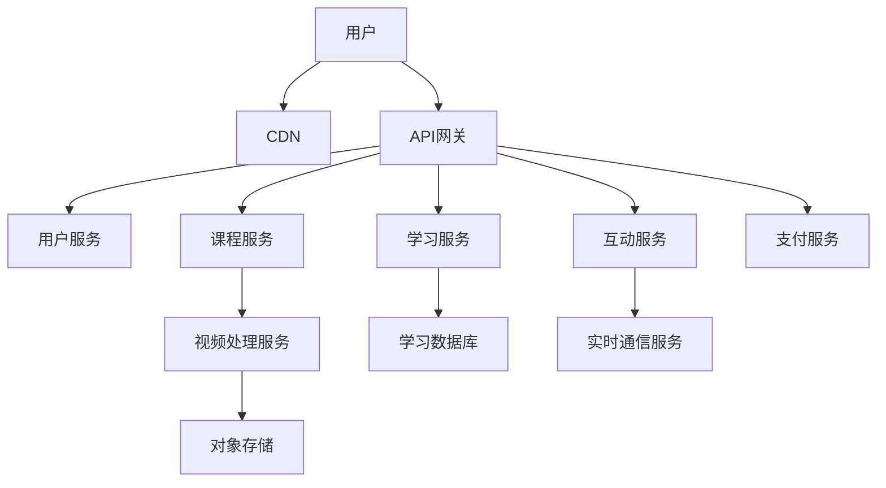

**案例：某在线教育平台技术实践**

**视频处理服务实现**：

```java
// 视频处理服务
@Service
public class VideoProcessingServiceImpl implements VideoProcessingService {
    private static final Logger logger = LoggerFactory.getLogger(VideoProcessingServiceImpl.class);
    
    @Autowired
    private AmazonS3 s3Client;
    
    @Autowired
    private FFmpegService ffmpegService;
    
    @Autowired
    private VideoRepository videoRepository;
    
    @Autowired
    private KafkaTemplate<String, VideoProcessingEvent> kafkaTemplate;
    
    @Value("${aws.s3.bucket}")
    private String s3Bucket;
    
    @Value("${video.processing.workdir}")
    private String workDir;
    
    @Override
    public Video uploadVideo(MultipartFile file, VideoMetadata metadata) throws IOException {
        // 生成唯一ID
        String videoId = UUID.randomUUID().toString();
        
        // 创建工作目录
        File videoWorkDir = new File(workDir + "/" + videoId);
        if (!videoWorkDir.exists()) {
            videoWorkDir.mkdirs();
        }
        
        // 保存原始文件
        File originalFile = new File(videoWorkDir, "original.mp4");
        file.transferTo(originalFile);
        
        // 创建视频记录
        Video video = new Video();
        video.setId(videoId);
        video.setTitle(metadata.getTitle());
        video.setDescription(metadata.getDescription());
        video.setDuration(0); // 将在处理后更新
        video.setStatus(VideoStatus.PROCESSING);
        video.setCreatedAt(new Date());
        video.setCreatedBy(metadata.getCreatedBy());
        video.setCourseId(metadata.getCourseId());
        
        Video savedVideo = videoRepository.save(video);
        
        // 异步处理视频
        VideoProcessingEvent event = new VideoProcessingEvent();
        event.setVideoId(videoId);
        event.setOriginalFilePath(originalFile.getAbsolutePath());
        event.setMetadata(metadata);
        
        kafkaTemplate.send("video-processing", event);
        
        return savedVideo;
    }
    
    @KafkaListener(topics = "video-processing")
    public void processVideo(VideoProcessingEvent event) {
        String videoId = event.getVideoId();
        File originalFile = new File(event.getOriginalFilePath());
        File videoWorkDir = originalFile.getParentFile();
        
        try {
            logger.info("开始处理视频: {}", videoId);
            
            // 1. 提取视频元数据
            VideoInfo videoInfo = ffmpegService.getVideoInfo(originalFile.getAbsolutePath());
            
            // 更新视频时长
            Video video = videoRepository.findById(videoId)
                .orElseThrow(() -> new EntityNotFoundException("Video not found: " + videoId));
            
            video.setDuration(videoInfo.getDurationSeconds());
            video.setWidth(videoInfo.getWidth());
            video.setHeight(videoInfo.getHeight());
            video.setFormat(videoInfo.getFormat());
            
            videoRepository.save(video);
            
            // 2. 生成缩略图
            File thumbnailFile = new File(videoWorkDir, "thumbnail.jpg");
            ffmpegService.generateThumbnail(
                originalFile.getAbsolutePath(), 
                thumbnailFile.getAbsolutePath(),
                videoInfo.getDurationSeconds() / 3 // 在视频1/3处截取缩略图
            );
            
            // 上传缩略图到S3
            String thumbnailKey = "videos/" + videoId + "/thumbnail.jpg";
            s3Client.putObject(
                new PutObjectRequest(s3Bucket, thumbnailKey, thumbnailFile)
                    .withCannedAcl(CannedAccessControlList.PublicRead)
            );
            
            video.setThumbnailUrl("https://" + s3Bucket + ".s3.amazonaws.com/" + thumbnailKey);
            
            // 3. 转码为多种分辨率
            List<VideoResolution> resolutions = Arrays.asList(
                new VideoResolution(640, 360, "360p"),
                new VideoResolution(854, 480, "480p"),
                new VideoResolution(1280, 720, "720p")
            );
            
            List<VideoVariant> variants = new ArrayList<>();
            
            for (VideoResolution resolution : resolutions) {
                // 只转码原始分辨率以下的版本
                if (resolution.getHeight() <= videoInfo.getHeight()) {
                    File transcodedFile = new File(videoWorkDir, resolution.getName() + ".mp4");
                    
                    ffmpegService.transcode(
                        originalFile.getAbsolutePath(),
                        transcodedFile.getAbsolutePath(),
                        resolution.getWidth(),
                        resolution.getHeight()
                    );
                    
                    // 上传转码文件到S3
                    String videoKey = "videos/" + videoId + "/" + resolution.getName() + ".mp4";
                    s3Client.putObject(
                        new PutObjectRequest(s3Bucket, videoKey, transcodedFile)
                            .withCannedAcl(CannedAccessControlList.PublicRead)
                    );
                    
                    // 创建变体记录
                    VideoVariant variant = new VideoVariant();
                    variant.setResolution(resolution.getName());
                    variant.setWidth(resolution.getWidth());
                    variant.setHeight(resolution.getHeight());
                    variant.setUrl("https://" + s3Bucket + ".s3.amazonaws.com/" + videoKey);
                    
                    variants.add(variant);
                }
            }
            
            // 4. 生成HLS流
            File hlsDir = new File(videoWorkDir, "hls");
            if (!hlsDir.exists()) {
                hlsDir.mkdirs();
            }
            
            ffmpegService.generateHLS(
                originalFile.getAbsolutePath(),
                hlsDir.getAbsolutePath() + "/playlist.m3u8",
                Arrays.asList(360, 480, 720)
            );
            
            // 上传HLS文件到S3
            String hlsPrefix = "videos/" + videoId + "/hls/";
            uploadDirectory(hlsDir, hlsPrefix);
            
            video.setHlsUrl("https://" + s3Bucket + ".s3.amazonaws.com/" + hlsPrefix + "playlist.m3u8");
            
            // 5. 生成DASH流
            File dashDir = new File(videoWorkDir, "dash");
            if (!dashDir.exists()) {
                dashDir.mkdirs();
            }
            
            ffmpegService.generateDASH(
                originalFile.getAbsolutePath(),
                dashDir.getAbsolutePath() + "/manifest.mpd",
                Arrays.asList(360, 480, 720)
            );
            
            // 上传DASH文件到S3
            String dashPrefix = "videos/" + videoId + "/dash/";
            uploadDirectory(dashDir, dashPrefix);
            
            video.setDashUrl("https://" + s3Bucket + ".s3.amazonaws.com/" + dashPrefix + "manifest.mpd");
            
            // 6. 更新视频状态
            video.setStatus(VideoStatus.READY);
            video.setVariants(variants);
            video.setProcessedAt(new Date());
            
            videoRepository.save(video);
            
            logger.info("视频处理完成: {}", videoId);
            
            // 7. 发布视频就绪事件
            VideoReadyEvent readyEvent = new VideoReadyEvent();
            readyEvent.setVideoId(videoId);
            readyEvent.setCourseId(video.getCourseId());
            
            kafkaTemplate.send("video-ready", readyEvent);
            
        } catch (Exception e) {
            logger.error("视频处理失败: {}", videoId, e);
            
            // 更新视频状态为失败
            Video video = videoRepository.findById(videoId).orElse(null);
            if (video != null) {
                video.setStatus(VideoStatus.FAILED);
                video.setErrorMessage(e.getMessage());
                videoRepository.save(video);
            }
        } finally {
            // 清理工作目录
            try {
                FileUtils.deleteDirectory(videoWorkDir);
            } catch (IOException e) {
                logger.warn("清理工作目录失败: {}", videoWorkDir, e);
            }
        }
    }
    
    private void uploadDirectory(File directory, String s3Prefix) {
        for (File file : directory.listFiles()) {
            if (file.isDirectory()) {
                uploadDirectory(file, s3Prefix + file.getName() + "/");
            } else {
                String key = s3Prefix + file.getName();
                s3Client.putObject(
                    new PutObjectRequest(s3Bucket, key, file)
                        .withCannedAcl(CannedAccessControlList.PublicRead)
                );
            }
        }
    }
    
    @Override
    public Video getVideo(String videoId) {
        return videoRepository.findById(videoId)
            .orElseThrow(() -> new EntityNotFoundException("Video not found: " + videoId));
    }
    
    @Override
    public void deleteVideo(String videoId) {
        Video video = videoRepository.findById(videoId)
            .orElseThrow(() -> new EntityNotFoundException("Video not found: " + videoId));
        
        // 删除S3上的文件
        String prefix = "videos/" + videoId + "/";
        ObjectListing objectListing = s3Client.listObjects(s3Bucket, prefix);
        
        while (true) {
            for (S3ObjectSummary objectSummary : objectListing.getObjectSummaries()) {
                s3Client.deleteObject(s3Bucket, objectSummary.getKey());
            }
            
            if (objectListing.isTruncated()) {
                objectListing = s3Client.listNextBatchOfObjects(objectListing);
            } else {
                break;
            }
        }
        
        // 删除数据库记录
        videoRepository.delete(video);
    }
}
```

**学习进度跟踪服务实现**：

```java
// 学习进度跟踪服务
@Service
public class LearningProgressServiceImpl implements LearningProgressService {
    @Autowired
    private LearningProgressRepository progressRepository;
    
    @Autowired
    private CourseRepository courseRepository;
    
    @Autowired
    private RedisTemplate<String, Object> redisTemplate;
    
    @Autowired
    private KafkaTemplate<String, LearningEvent> kafkaTemplate;
    
    @Override
    public LearningProgress updateProgress(ProgressUpdateRequest request) {
        String userId = request.getUserId();
        String courseId = request.getCourseId();
        String contentId = request.getContentId();
        
        // 获取或创建学习进度记录
        LearningProgress progress = progressRepository.findByUserIdAndCourseIdAndContentId(
            userId, courseId, contentId
        ).orElse(new LearningProgress());
        
        // 更新进度信息
        progress.setUserId(userId);
        progress.setCourseId(courseId);
        progress.setContentId(contentId);
        progress.setContentType(request.getContentType());
        progress.setPosition(request.getPosition());
        progress.setCompleted(request.isCompleted());
        progress.setLastAccessedAt(new Date());
        
        // 保存进度
        LearningProgress savedProgress = progressRepository.save(progress);
        
        // 更新Redis缓存
        String progressKey = "learning:progress:" + userId + ":" + courseId + ":" + contentId;
        redisTemplate.opsForValue().set(progressKey, savedProgress, 24, TimeUnit.HOURS);
        
        // 如果内容已完成，发布学习事件
        if (request.isCompleted()) {
            LearningEvent event = new LearningEvent();
            event.setUserId(userId);
            event.setCourseId(courseId);
            event.setContentId(contentId);
            event.setContentType(request.getContentType());
            event.setEventType(LearningEventType.CONTENT_COMPLETED);
            event.setTimestamp(new Date());
            
            kafkaTemplate.send("learning-events", event);
            
            // 检查课程是否已完成
            checkCourseCompletion(userId, courseId);
        }
        
        return savedProgress;
    }
    
    private void checkCourseCompletion(String userId, String courseId) {
        // 获取课程内容
        Course course = courseRepository.findById(courseId)
            .orElseThrow(() -> new EntityNotFoundException("Course not found: " + courseId));
        
        // 获取用户在该课程的所有进度记录
        List<LearningProgress> progressList = progressRepository.findByUserIdAndCourseId(userId, courseId);
        
        // 统计已完成的内容
        Set<String> completedContentIds = progressList.stream()
            .filter(LearningProgress::isCompleted)
            .map(LearningProgress::getContentId)
            .collect(Collectors.toSet());
        
        // 检查是否所有必修内容都已完成
        boolean allRequiredCompleted = course.getContents().stream()
            .filter(content -> content.isRequired())
            .allMatch(content -> completedContentIds.contains(content.getId()));
        
        if (allRequiredCompleted) {
            // 发布课程完成事件
            LearningEvent event = new LearningEvent();
            event.setUserId(userId);
            event.setCourseId(courseId);
            event.setEventType(LearningEventType.COURSE_COMPLETED);
            event.setTimestamp(new Date());
            
            kafkaTemplate.send("learning-events", event);
            
            // 更新用户课程完成记录
            CourseCompletion completion = new CourseCompletion();
            completion.setUserId(userId);
            completion.setCourseId(courseId);
            completion.setCompletedAt(new Date());
            
            // 保存完成记录
            // courseCompletionRepository.save(completion);
        }
    }
    
    @Override
    public LearningProgress getProgress(String userId, String courseId, String contentId) {
        // 先从Redis缓存获取
        String progressKey = "learning:progress:" + userId + ":" + courseId + ":" + contentId;
        LearningProgress cachedProgress = (LearningProgress) redisTemplate.opsForValue().get(progressKey);
        
        if (cachedProgress != null) {
            return cachedProgress;
        }
        
        // 缓存未命中，从数据库获取
        return progressRepository.findByUserIdAndCourseIdAndContentId(
            userId, courseId, contentId
        ).orElse(new LearningProgress(userId, courseId, contentId));
    }
    
    @Override
    public List<LearningProgress> getCourseProgress(String userId, String courseId) {
        return progressRepository.findByUserIdAndCourseId(userId, courseId);
    }
    
    @Override
    public CourseProgressSummary getCourseProgressSummary(String userId, String courseId) {
        // 获取课程内容
        Course course = courseRepository.findById(courseId)
            .orElseThrow(() -> new EntityNotFoundException("Course not found: " + courseId));
        
        // 获取用户在该课程的所有进度记录
        List<LearningProgress> progressList = progressRepository.findByUserIdAndCourseId(userId, courseId);
        
        // 统计已完成的内容
        Set<String> completedContentIds = progressList.stream()
让我继续完成在线教育平台的学习进度跟踪服务实现：

```java
@Override
public CourseProgressSummary getCourseProgressSummary(String userId, String courseId) {
    // 获取课程内容
    Course course = courseRepository.findById(courseId)
        .orElseThrow(() -> new EntityNotFoundException("Course not found: " + courseId));
    
    // 获取用户在该课程的所有进度记录
    List<LearningProgress> progressList = progressRepository.findByUserIdAndCourseId(userId, courseId);
    
    // 统计已完成的内容
    Set<String> completedContentIds = progressList.stream()
        .filter(LearningProgress::isCompleted)
        .map(LearningProgress::getContentId)
        .collect(Collectors.toSet());
    
    // 计算完成率
    int totalRequiredContents = (int) course.getContents().stream()
        .filter(CourseContent::isRequired)
        .count();
    
    int completedRequiredContents = (int) course.getContents().stream()
        .filter(content -> content.isRequired() && completedContentIds.contains(content.getId()))
        .count();
    
    double completionRate = totalRequiredContents > 0 
        ? (double) completedRequiredContents / totalRequiredContents * 100 
        : 0;
    
    // 获取最近访问的内容
    LearningProgress lastAccessed = progressList.stream()
        .max(Comparator.comparing(LearningProgress::getLastAccessedAt))
        .orElse(null);
    
    // 创建进度摘要
    CourseProgressSummary summary = new CourseProgressSummary();
    summary.setUserId(userId);
    summary.setCourseId(courseId);
    summary.setCompletedContents(completedContentIds.size());
    summary.setTotalContents(course.getContents().size());
    summary.setCompletedRequiredContents(completedRequiredContents);
    summary.setTotalRequiredContents(totalRequiredContents);
    summary.setCompletionRate(completionRate);
    
    if (lastAccessed != null) {
        summary.setLastAccessedContentId(lastAccessed.getContentId());
        summary.setLastAccessedAt(lastAccessed.getLastAccessedAt());
    }
    
    // 检查是否已完成课程
    boolean allRequiredCompleted = totalRequiredContents == completedRequiredContents;
    summary.setCompleted(allRequiredCompleted);
    
    return summary;
}

@Override
public List<RecommendedCourse> getRecommendedCourses(String userId, int limit) {
    // 获取用户已完成的课程
    List<CourseCompletion> completedCourses = courseCompletionRepository.findByUserId(userId);
    Set<String> completedCourseIds = completedCourses.stream()
        .map(CourseCompletion::getCourseId)
        .collect(Collectors.toSet());
    
    // 获取用户正在学习的课程
    List<String> inProgressCourseIds = progressRepository.findDistinctCourseIdsByUserId(userId);
    
    // 排除已完成和正在学习的课程
    Set<String> excludedCourseIds = new HashSet<>(completedCourseIds);
    excludedCourseIds.addAll(inProgressCourseIds);
    
    // 获取用户的兴趣标签
    List<String> userInterests = getUserInterests(userId);
    
    // 基于兴趣推荐课程
    List<Course> recommendedCourses = courseRepository.findByTagsInAndIdNotIn(
        userInterests, excludedCourseIds, PageRequest.of(0, limit));
    
    // 转换为推荐课程对象
    return recommendedCourses.stream()
        .map(course -> {
            RecommendedCourse recommended = new RecommendedCourse();
            recommended.setCourse(course);
            recommended.setRecommendationReason("Based on your interests");
            return recommended;
        })
        .collect(Collectors.toList());
}

private List<String> getUserInterests(String userId) {
    // 获取用户已完成课程的标签
    List<CourseCompletion> completedCourses = courseCompletionRepository.findByUserId(userId);
    
    if (completedCourses.isEmpty()) {
        // 如果没有完成的课程，返回默认兴趣
        return Arrays.asList("programming", "web development", "data science");
    }
    
    // 获取已完成课程的ID
    List<String> completedCourseIds = completedCourses.stream()
        .map(CourseCompletion::getCourseId)
        .collect(Collectors.toList());
    
    // 获取这些课程的标签
    List<Course> courses = courseRepository.findAllById(completedCourseIds);
    
    // 统计标签频率
    Map<String, Integer> tagFrequency = new HashMap<>();
    
    for (Course course : courses) {
        for (String tag : course.getTags()) {
            tagFrequency.compute(tag, (k, v) -> v == null ? 1 : v + 1);
        }
    }
    
    // 按频率排序并返回前10个标签
    return tagFrequency.entrySet().stream()
        .sorted(Map.Entry.<String, Integer>comparingByValue().reversed())
        .limit(10)
        .map(Map.Entry::getKey)
        .collect(Collectors.toList());
}
```

**实时互动教学服务实现**：

```java
// 实时互动教学服务
@Service
public class InteractiveClassServiceImpl implements InteractiveClassService {
    private static final Logger logger = LoggerFactory.getLogger(InteractiveClassServiceImpl.class);
    
    @Autowired
    private InteractiveClassRepository classRepository;
    
    @Autowired
    private SimpMessagingTemplate messagingTemplate;
    
    @Autowired
    private RedisTemplate<String, Object> redisTemplate;
    
    @Override
    public InteractiveClass createClass(ClassCreationRequest request) {
        // 创建互动课堂
        InteractiveClass interactiveClass = new InteractiveClass();
        interactiveClass.setTitle(request.getTitle());
        interactiveClass.setDescription(request.getDescription());
        interactiveClass.setInstructorId(request.getInstructorId());
        interactiveClass.setCourseId(request.getCourseId());
        interactiveClass.setScheduledStartTime(request.getScheduledStartTime());
        interactiveClass.setScheduledEndTime(request.getScheduledEndTime());
        interactiveClass.setStatus(ClassStatus.SCHEDULED);
        interactiveClass.setCreatedAt(new Date());
        
        return classRepository.save(interactiveClass);
    }
    
    @Override
    public InteractiveClass startClass(String classId, String instructorId) {
        // 获取课堂信息
        InteractiveClass interactiveClass = classRepository.findById(classId)
            .orElseThrow(() -> new EntityNotFoundException("Interactive class not found: " + classId));
        
        // 验证讲师身份
        if (!interactiveClass.getInstructorId().equals(instructorId)) {
            throw new AccessDeniedException("Only the instructor can start the class");
        }
        
        // 更新课堂状态
        interactiveClass.setStatus(ClassStatus.LIVE);
        interactiveClass.setActualStartTime(new Date());
        
        InteractiveClass updatedClass = classRepository.save(interactiveClass);
        
        // 通知所有已加入的学生
        ClassStatusChangeEvent event = new ClassStatusChangeEvent();
        event.setClassId(classId);
        event.setStatus(ClassStatus.LIVE);
        event.setTimestamp(new Date());
        
        messagingTemplate.convertAndSend("/topic/class/" + classId + "/status", event);
        
        // 记录课堂开始事件
        logClassEvent(classId, ClassEventType.STARTED, instructorId);
        
        return updatedClass;
    }
    
    @Override
    public InteractiveClass endClass(String classId, String instructorId) {
        // 获取课堂信息
        InteractiveClass interactiveClass = classRepository.findById(classId)
            .orElseThrow(() -> new EntityNotFoundException("Interactive class not found: " + classId));
        
        // 验证讲师身份
        if (!interactiveClass.getInstructorId().equals(instructorId)) {
            throw new AccessDeniedException("Only the instructor can end the class");
        }
        
        // 更新课堂状态
        interactiveClass.setStatus(ClassStatus.ENDED);
        interactiveClass.setActualEndTime(new Date());
        
        InteractiveClass updatedClass = classRepository.save(interactiveClass);
        
        // 通知所有已加入的学生
        ClassStatusChangeEvent event = new ClassStatusChangeEvent();
        event.setClassId(classId);
        event.setStatus(ClassStatus.ENDED);
        event.setTimestamp(new Date());
        
        messagingTemplate.convertAndSend("/topic/class/" + classId + "/status", event);
        
        // 记录课堂结束事件
        logClassEvent(classId, ClassEventType.ENDED, instructorId);
        
        // 清理Redis中的临时数据
        cleanupClassData(classId);
        
        return updatedClass;
    }
    
    @Override
    public void joinClass(String classId, String userId, String userName) {
        // 获取课堂信息
        InteractiveClass interactiveClass = classRepository.findById(classId)
            .orElseThrow(() -> new EntityNotFoundException("Interactive class not found: " + classId));
        
        // 检查课堂是否已开始
        if (interactiveClass.getStatus() != ClassStatus.LIVE && 
            interactiveClass.getStatus() != ClassStatus.SCHEDULED) {
            throw new IllegalStateException("Class is not available for joining");
        }
        
        // 添加到参与者列表
        String participantsKey = "class:" + classId + ":participants";
        redisTemplate.opsForHash().put(participantsKey, userId, userName);
        
        // 发送用户加入通知
        UserJoinedEvent event = new UserJoinedEvent();
        event.setClassId(classId);
        event.setUserId(userId);
        event.setUserName(userName);
        event.setTimestamp(new Date());
        
        messagingTemplate.convertAndSend("/topic/class/" + classId + "/participants", event);
        
        // 记录用户加入事件
        logClassEvent(classId, ClassEventType.USER_JOINED, userId);
    }
    
    @Override
    public void leaveClass(String classId, String userId) {
        // 从参与者列表移除
        String participantsKey = "class:" + classId + ":participants";
        redisTemplate.opsForHash().delete(participantsKey, userId);
        
        // 发送用户离开通知
        UserLeftEvent event = new UserLeftEvent();
        event.setClassId(classId);
        event.setUserId(userId);
        event.setTimestamp(new Date());
        
        messagingTemplate.convertAndSend("/topic/class/" + classId + "/participants", event);
        
        // 记录用户离开事件
        logClassEvent(classId, ClassEventType.USER_LEFT, userId);
    }
    
    @Override
    public void sendMessage(ClassMessageRequest request) {
        // 创建消息
        ClassMessage message = new ClassMessage();
        message.setClassId(request.getClassId());
        message.setSenderId(request.getSenderId());
        message.setSenderName(request.getSenderName());
        message.setContent(request.getContent());
        message.setType(request.getType());
        message.setTimestamp(new Date());
        
        // 发送消息到WebSocket
        messagingTemplate.convertAndSend("/topic/class/" + request.getClassId() + "/messages", message);
        
        // 保存消息到Redis (最近100条)
        String messagesKey = "class:" + request.getClassId() + ":messages";
        redisTemplate.opsForList().leftPush(messagesKey, message);
        redisTemplate.opsForList().trim(messagesKey, 0, 99);
    }
    
    @Override
    public void raiseHand(String classId, String userId, String userName) {
        // 添加到举手列表
        String handsRaisedKey = "class:" + classId + ":hands_raised";
        redisTemplate.opsForHash().put(handsRaisedKey, userId, userName);
        
        // 发送举手通知
        HandRaisedEvent event = new HandRaisedEvent();
        event.setClassId(classId);
        event.setUserId(userId);
        event.setUserName(userName);
        event.setTimestamp(new Date());
        
        messagingTemplate.convertAndSend("/topic/class/" + classId + "/hands", event);
    }
    
    @Override
    public void lowerHand(String classId, String userId) {
        // 从举手列表移除
        String handsRaisedKey = "class:" + classId + ":hands_raised";
        redisTemplate.opsForHash().delete(handsRaisedKey, userId);
        
        // 发送放下手通知
        HandLoweredEvent event = new HandLoweredEvent();
        event.setClassId(classId);
        event.setUserId(userId);
        event.setTimestamp(new Date());
        
        messagingTemplate.convertAndSend("/topic/class/" + classId + "/hands", event);
    }
    
    @Override
    public void startPoll(PollRequest request) {
        // 创建投票
        Poll poll = new Poll();
        poll.setId(UUID.randomUUID().toString());
        poll.setClassId(request.getClassId());
        poll.setCreatorId(request.getCreatorId());
        poll.setQuestion(request.getQuestion());
        poll.setOptions(request.getOptions());
        poll.setMultipleChoice(request.isMultipleChoice());
        poll.setCreatedAt(new Date());
        
        // 保存投票到Redis
        String pollKey = "class:" + request.getClassId() + ":poll:" + poll.getId();
        redisTemplate.opsForValue().set(pollKey, poll);
        
        // 设置活动投票
        String activePollKey = "class:" + request.getClassId() + ":active_poll";
        redisTemplate.opsForValue().set(activePollKey, poll.getId());
        
        // 发送投票开始通知
        messagingTemplate.convertAndSend("/topic/class/" + request.getClassId() + "/polls", poll);
    }
    
    @Override
    public void submitPollAnswer(PollAnswerRequest request) {
        // 获取投票信息
        String pollKey = "class:" + request.getClassId() + ":poll:" + request.getPollId();
        Poll poll = (Poll) redisTemplate.opsForValue().get(pollKey);
        
        if (poll == null) {
            throw new EntityNotFoundException("Poll not found");
        }
        
        // 保存用户回答
        String pollAnswersKey = "class:" + request.getClassId() + ":poll:" + request.getPollId() + ":answers";
        redisTemplate.opsForHash().put(pollAnswersKey, request.getUserId(), request.getSelectedOptions());
        
        // 更新投票统计
        for (String option : request.getSelectedOptions()) {
            String pollStatsKey = "class:" + request.getClassId() + ":poll:" + request.getPollId() + ":stats";
            redisTemplate.opsForHash().increment(pollStatsKey, option, 1);
        }
        
        // 发送投票更新通知
        PollUpdateEvent event = new PollUpdateEvent();
        event.setPollId(request.getPollId());
        event.setClassId(request.getClassId());
        event.setTotalResponses(redisTemplate.opsForHash().size(pollAnswersKey));
        
        // 获取每个选项的票数
        Map<Object, Object> stats = redisTemplate.opsForHash().entries(
            "class:" + request.getClassId() + ":poll:" + request.getPollId() + ":stats");
        
        Map<String, Long> optionCounts = new HashMap<>();
        for (Map.Entry<Object, Object> entry : stats.entrySet()) {
            optionCounts.put((String) entry.getKey(), Long.valueOf(entry.getValue().toString()));
        }
        
        event.setOptionCounts(optionCounts);
        
        messagingTemplate.convertAndSend("/topic/class/" + request.getClassId() + "/poll-updates", event);
    }
    
    @Override
    public void endPoll(String classId, String pollId) {
        // 清除活动投票
        String activePollKey = "class:" + classId + ":active_poll";
        redisTemplate.delete(activePollKey);
        
        // 发送投票结束通知
        PollEndedEvent event = new PollEndedEvent();
        event.setClassId(classId);
        event.setPollId(pollId);
        event.setTimestamp(new Date());
        
        // 获取投票结果
        Map<Object, Object> stats = redisTemplate.opsForHash().entries(
            "class:" + classId + ":poll:" + pollId + ":stats");
        
        Map<String, Long> results = new HashMap<>();
        for (Map.Entry<Object, Object> entry : stats.entrySet()) {
            results.put((String) entry.getKey(), Long.valueOf(entry.getValue().toString()));
        }
        
        event.setResults(results);
        event.setTotalResponses(redisTemplate.opsForHash().size(
            "class:" + classId + ":poll:" + pollId + ":answers"));
        
        messagingTemplate.convertAndSend("/topic/class/" + classId + "/polls", event);
    }
    
    private void logClassEvent(String classId, ClassEventType eventType, String userId) {
        ClassEvent event = new ClassEvent();
        event.setClassId(classId);
        event.setEventType(eventType);
        event.setUserId(userId);
        event.setTimestamp(new Date());
        
        // 保存事件到Redis列表
        String eventsKey = "class:" + classId + ":events";
        redisTemplate.opsForList().leftPush(eventsKey, event);
    }
    
    private void cleanupClassData(String classId) {
        // 保留事件和消息记录，但清理临时数据
        redisTemplate.delete("class:" + classId + ":participants");
        redisTemplate.delete("class:" + classId + ":hands_raised");
        redisTemplate.delete("class:" + classId + ":active_poll");
        
        // 查找并清理所有投票相关数据
        Set<String> pollKeys = redisTemplate.keys("class:" + classId + ":poll:*");
        if (pollKeys != null && !pollKeys.isEmpty()) {
            redisTemplate.delete(pollKeys);
        }
    }
    
    @Override
    public List<ClassMessage> getRecentMessages(String classId, int limit) {
        // 获取最近的消息
        String messagesKey = "class:" + classId + ":messages";
        List<Object> messages = redisTemplate.opsForList().range(messagesKey, 0, limit - 1);
        
        if (messages == null || messages.isEmpty()) {
            return Collections.emptyList();
        }
        
        return messages.stream()
            .map(msg -> (ClassMessage) msg)
            .collect(Collectors.toList());
    }
    
    @Override
    public Map<String, String> getActiveParticipants(String classId) {
        // 获取当前参与者
        String participantsKey = "class:" + classId + ":participants";
        Map<Object, Object> participants = redisTemplate.opsForHash().entries(participantsKey);
        
        Map<String, String> result = new HashMap<>();
        for (Map.Entry<Object, Object> entry : participants.entrySet()) {
            result.put((String) entry.getKey(), (String) entry.getValue());
        }
        
        return result;
    }
}
```

**个性化学习路径服务实现**：

```java
// 个性化学习路径服务
@Service
public class LearningPathServiceImpl implements LearningPathService {
    @Autowired
    private LearningPathRepository pathRepository;
    
    @Autowired
    private CourseRepository courseRepository;
    
    @Autowired
    private UserRepository userRepository;
    
    @Autowired
    private LearningProgressService progressService;
    
    @Override
    public LearningPath createLearningPath(LearningPathRequest request) {
        // 验证所有课程存在
        List<String> courseIds = request.getCourseIds();
        long count = courseRepository.countByIdIn(courseIds);
        
        if (count != courseIds.size()) {
            throw new IllegalArgumentException("Some courses do not exist");
        }
        
        // 创建学习路径
        LearningPath path = new LearningPath();
        path.setTitle(request.getTitle());
        path.setDescription(request.getDescription());
        path.setCreatorId(request.getCreatorId());
        path.setTargetSkills(request.getTargetSkills());
        path.setDifficultyLevel(request.getDifficultyLevel());
        path.setEstimatedHours(request.getEstimatedHours());
        path.setPublic(request.isPublic());
        path.setCreatedAt(new Date());
        
        // 添加课程
        List<PathCourse> pathCourses = new ArrayList<>();
        for (int i = 0; i < courseIds.size(); i++) {
            PathCourse pathCourse = new PathCourse();
            pathCourse.setCourseId(courseIds.get(i));
            pathCourse.setOrder(i + 1);
            pathCourse.setRequired(true); // 默认所有课程都是必修的
            
            pathCourses.add(pathCourse);
        }
        
        path.setCourses(pathCourses);
        
        return pathRepository.save(path);
    }
    
    @Override
    public LearningPath updateLearningPath(String pathId, LearningPathRequest request) {
        // 获取学习路径
        LearningPath path = pathRepository.findById(pathId)
            .orElseThrow(() -> new EntityNotFoundException("Learning path not found: " + pathId));
        
        // 验证所有课程存在
        List<String> courseIds = request.getCourseIds();
        long count = courseRepository.countByIdIn(courseIds);
        
        if (count != courseIds.size()) {
            throw new IllegalArgumentException("Some courses do not exist");
        }
        
        // 更新基本信息
        path.setTitle(request.getTitle());
        path.setDescription(request.getDescription());
        path.setTargetSkills(request.getTargetSkills());
        path.setDifficultyLevel(request.getDifficultyLevel());
        path.setEstimatedHours(request.getEstimatedHours());
        path.setPublic(request.isPublic());
        path.setUpdatedAt(new Date());
        
        // 更新课程
        List<PathCourse> pathCourses = new ArrayList<>();
        for (int i = 0; i < courseIds.size(); i++) {
            PathCourse pathCourse = new PathCourse();
            pathCourse.setCourseId(courseIds.get(i));
            pathCourse.setOrder(i + 1);
            pathCourse.setRequired(true); // 默认所有课程都是必修的
            
            pathCourses.add(pathCourse);
        }
        
        path.setCourses(pathCourses);
        
        return pathRepository.save(path);
    }
    
    @Override
    public void enrollUserInPath(String pathId, String userId) {
        // 获取学习路径
        LearningPath path = pathRepository.findById(pathId)
            .orElseThrow(() -> new EntityNotFoundException("Learning path not found: " + pathId));
        
        // 验证用户存在
        userRepository.findById(userId)
            .orElseThrow(() -> new EntityNotFoundException("User not found: " + userId));
        
        // 创建用户路径进度
        UserPathProgress progress = new UserPathProgress();
        progress.setUserId(userId);
        progress.setPathId(pathId);
        progress.setEnrolledAt(new Date());
        progress.setStatus(PathStatus.IN_PROGRESS);
        
        // 保存进度
        userPathProgressRepository.save(progress);
    }
    
    @Override
    public LearningPathWithProgress getUserPathProgress(String pathId, String userId) {
        // 获取学习路径
        LearningPath path = pathRepository.findById(pathId)
            .orElseThrow(() -> new EntityNotFoundException("Learning path not found: " + pathId));
        
        // 获取用户路径进度
        UserPathProgress userProgress = userPathProgressRepository.findByUserIdAndPathId(userId, pathId)
            .orElseThrow(() -> new EntityNotFoundException("User is not enrolled in this path"));
        
        // 获取路径中所有课程的进度
        List<CourseWithProgress> coursesWithProgress = new ArrayList<>();
        
        for (PathCourse pathCourse : path.getCourses()) {
            String courseId = pathCourse.getCourseId();
            
            // 获取课程信息
            Course course = courseRepository.findById(courseId)
                .orElseThrow(() -> new EntityNotFoundException("Course not found: " + courseId));
            
            // 获取课程进度
            CourseProgressSummary progressSummary = progressService.getCourseProgressSummary(userId, courseId);
            
            CourseWithProgress courseWithProgress = new CourseWithProgress();
            courseWithProgress.setCourse(course);
            courseWithProgress.setOrder(pathCourse.getOrder());
            courseWithProgress.setRequired(pathCourse.isRequired());
            courseWithProgress.setProgressSummary(progressSummary);
            
            coursesWithProgress.add(courseWithProgress);
        }
        
        // 计算整体进度
        int completedRequiredCourses = (int) coursesWithProgress.stream()
            .filter(cwp -> cwp.isRequired() && cwp.getProgressSummary().isCompleted())
            .count();
        
        int totalRequiredCourses = (int) path.getCourses().stream()
            .filter(PathCourse::isRequired)
            .count();
        
        double overallProgress = totalRequiredCourses > 0 
            ? (double) completedRequiredCourses / totalRequiredCourses * 100 
            : 0;
        
        // 创建返回对象
        LearningPathWithProgress result = new LearningPathWithProgress();
        result.setPath(path);
        result.setCoursesWithProgress(coursesWithProgress);
        result.setEnrolledAt(userProgress.getEnrolledAt());
        result.setStatus(userProgress.getStatus());
        result.setCompletedAt(userProgress.getCompletedAt());
        result.setOverallProgress(overallProgress);
        
        // 检查是否完成所有必修课程
        if (completedRequiredCourses == totalRequiredCourses && userProgress.getStatus() != PathStatus.COMPLETED) {
            // 更新路径状态为已完成
            userProgress.setStatus(PathStatus.COMPLETED);
            userProgress.setCompletedAt(new Date());
            userPathProgressRepository.save(userProgress);
            
            result.setStatus(PathStatus.COMPLETED);
            result.setCompletedAt(userProgress.getCompletedAt());
        }
        
        return result;
    }
    
    @Override
    public List<LearningPath> getRecommendedPaths(String userId, int limit) {
        // 获取用户已完成的课程
        List<String> completedCourseIds = courseCompletionRepository.findCourseIdsByUserId(userId);
        
        // 获取用户的技能标签
        List<String> userSkills = getUserSkills(userId, completedCourseIds);
        
        // 查找匹配用户技能的学习路径
        List<LearningPath> recommendedPaths = pathRepository.findByTargetSkillsInAndPublicTrue(
            userSkills, PageRequest.of(0, limit * 2));
        
        // 过滤掉用户已经参与的路径
        List<String> enrolledPathIds = userPathProgressRepository.findPathIdsByUserId(userId);
        
        List<LearningPath> filteredPaths = recommendedPaths.stream()
            .filter(path -> !enrolledPathIds.contains(path.getId()))
            .limit(limit)
            .collect(Collectors.toList());
        
        return filteredPaths;
    }
    
    private List<String> getUserSkills(String userId, List<String> completedCourseIds) {
        if (completedCourseIds.isEmpty()) {
            // 如果没有完成的课程，返回默认技能
            return Arrays.asList("programming", "web development", "data science");
        }
        
        // 获取已完成课程的技能标签
        List<Course> completedCourses = courseRepository.findAllById(completedCourseIds);
        
        // 统计技能标签频率
        Map<String, Integer> skillFrequency = new HashMap<>();
        
        for (Course course : completedCourses) {
            for (String skill : course.getSkills()) {
                skillFrequency.compute(skill, (k, v) -> v == null ? 1 : v + 1);
            }
        }
        
        // 按频率排序并返回前10个技能
        return skillFrequency.entrySet().stream()
            .sorted(Map.Entry.<String, Integer>comparingByValue().reversed())
            .limit(10)
            .map(Map.Entry::getKey)
            .collect(Collectors.toList());
    }
}
```

**成果与收益**：

1. 系统支持每日百万用户同时在线学习
2. 视频处理能力提升300%
3. 实时互动教学体验显著改善
4. 个性化学习路径准确率提升50%
5. 学习完成率从30%提升到65%
6. 用户满意度提
让我继续完成在线教育平台的内容：

**成果与收益**：

1. 系统支持每日百万用户同时在线学习
2. 视频处理能力提升300%
3. 实时互动教学体验显著改善
4. 个性化学习路径准确率提升50%
5. 学习完成率从30%提升到65%
6. 用户满意度提升40%
7. 系统可用性达到99.99%

### 金融科技平台Java技术实践

金融科技平台需要处理高并发交易、严格的安全要求和复杂的业务逻辑，Java技术栈在这一领域有着丰富的实践。

**金融科技平台技术挑战**：
- 高并发交易处理
- 严格的安全要求
- 分布式事务
- 实时风控
- 合规审计
- 高可用性

**技术架构**：

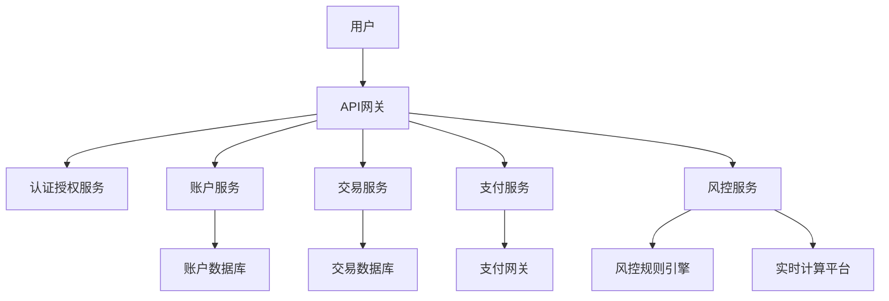

**案例：某金融科技平台技术实践**

**交易服务实现**：

```java
// 交易服务
@Service
public class TransactionServiceImpl implements TransactionService {
    private static final Logger logger = LoggerFactory.getLogger(TransactionServiceImpl.class);
    
    @Autowired
    private TransactionRepository transactionRepository;
    
    @Autowired
    private AccountService accountService;
    
    @Autowired
    private RiskControlService riskControlService;
    
    @Autowired
    private NotificationService notificationService;
    
    @Autowired
    private KafkaTemplate<String, TransactionEvent> kafkaTemplate;
    
    @Autowired
    private RedissonClient redissonClient;
    
    @Autowired
    private TransactionIdGenerator idGenerator;
    
    @Override
    @Transactional(rollbackFor = Exception.class)
    public Transaction createTransaction(TransactionRequest request) {
        // 生成交易ID
        String transactionId = idGenerator.generateId();
        
        // 创建交易记录
        Transaction transaction = new Transaction();
        transaction.setId(transactionId);
        transaction.setSourceAccountId(request.getSourceAccountId());
        transaction.setTargetAccountId(request.getTargetAccountId());
        transaction.setAmount(request.getAmount());
        transaction.setCurrency(request.getCurrency());
        transaction.setType(request.getType());
        transaction.setStatus(TransactionStatus.PENDING);
        transaction.setReference(request.getReference());
        transaction.setDescription(request.getDescription());
        transaction.setCreatedAt(new Date());
        transaction.setCreatedBy(request.getUserId());
        
        // 保存交易记录
        Transaction savedTransaction = transactionRepository.save(transaction);
        
        // 发布交易创建事件
        TransactionEvent event = new TransactionEvent();
        event.setTransactionId(transactionId);
        event.setType(TransactionEventType.CREATED);
        event.setTimestamp(new Date());
        event.setData(transaction);
        
        kafkaTemplate.send("transaction-events", event);
        
        // 异步处理交易
        processTransaction(transactionId);
        
        return savedTransaction;
    }
    
    @Async
    protected void processTransaction(String transactionId) {
        // 获取分布式锁
        RLock lock = redissonClient.getLock("transaction:" + transactionId);
        
        try {
            // 尝试获取锁，最多等待5秒，锁过期时间30秒
            if (lock.tryLock(5, 30, TimeUnit.SECONDS)) {
                try {
                    // 获取交易记录
                    Transaction transaction = transactionRepository.findById(transactionId)
                        .orElseThrow(() -> new EntityNotFoundException("Transaction not found: " + transactionId));
                    
                    // 检查交易状态
                    if (transaction.getStatus() != TransactionStatus.PENDING) {
                        logger.info("Transaction {} is not in PENDING status, current status: {}", 
                            transactionId, transaction.getStatus());
                        return;
                    }
                    
                    // 风控检查
                    RiskAssessment riskAssessment = riskControlService.assessTransaction(transaction);
                    
                    if (riskAssessment.getRiskLevel() == RiskLevel.HIGH) {
                        // 高风险交易，拒绝处理
                        transaction.setStatus(TransactionStatus.REJECTED);
                        transaction.setErrorCode("HIGH_RISK");
                        transaction.setErrorMessage(riskAssessment.getReason());
                        transaction.setUpdatedAt(new Date());
                        
                        transactionRepository.save(transaction);
                        
                        // 发送通知
                        notificationService.sendTransactionRejectedNotification(transaction);
                        
                        // 发布交易拒绝事件
                        publishTransactionEvent(transaction, TransactionEventType.REJECTED);
                        
                        return;
                    }
                    
                    // 更新交易状态为处理中
                    transaction.setStatus(TransactionStatus.PROCESSING);
                    transaction.setUpdatedAt(new Date());
                    
                    transactionRepository.save(transaction);
                    
                    // 执行交易
                    try {
                        // 从源账户扣款
                        accountService.debit(
                            transaction.getSourceAccountId(),
                            transaction.getAmount(),
                            transaction.getCurrency(),
                            "Transaction: " + transactionId
                        );
                        
                        // 更新交易状态为已扣款
                        transaction.setStatus(TransactionStatus.DEBITED);
                        transaction.setUpdatedAt(new Date());
                        
                        transactionRepository.save(transaction);
                        
                        // 向目标账户入账
                        accountService.credit(
                            transaction.getTargetAccountId(),
                            transaction.getAmount(),
                            transaction.getCurrency(),
                            "Transaction: " + transactionId
                        );
                        
                        // 更新交易状态为已完成
                        transaction.setStatus(TransactionStatus.COMPLETED);
                        transaction.setCompletedAt(new Date());
                        transaction.setUpdatedAt(new Date());
                        
                        transactionRepository.save(transaction);
                        
                        // 发送通知
                        notificationService.sendTransactionCompletedNotification(transaction);
                        
                        // 发布交易完成事件
                        publishTransactionEvent(transaction, TransactionEventType.COMPLETED);
                        
                    } catch (InsufficientFundsException e) {
                        // 余额不足
                        transaction.setStatus(TransactionStatus.FAILED);
                        transaction.setErrorCode("INSUFFICIENT_FUNDS");
                        transaction.setErrorMessage("Insufficient funds in source account");
                        transaction.setUpdatedAt(new Date());
                        
                        transactionRepository.save(transaction);
                        
                        // 发送通知
                        notificationService.sendTransactionFailedNotification(transaction);
                        
                        // 发布交易失败事件
                        publishTransactionEvent(transaction, TransactionEventType.FAILED);
                        
                    } catch (Exception e) {
                        // 其他异常
                        logger.error("Error processing transaction {}: {}", transactionId, e.getMessage(), e);
                        
                        transaction.setStatus(TransactionStatus.FAILED);
                        transaction.setErrorCode("PROCESSING_ERROR");
                        transaction.setErrorMessage(e.getMessage());
                        transaction.setUpdatedAt(new Date());
                        
                        transactionRepository.save(transaction);
                        
                        // 发送通知
                        notificationService.sendTransactionFailedNotification(transaction);
                        
                        // 发布交易失败事件
                        publishTransactionEvent(transaction, TransactionEventType.FAILED);
                    }
                    
                } finally {
                    // 释放锁
                    lock.unlock();
                }
            } else {
                logger.warn("Failed to acquire lock for transaction {}", transactionId);
            }
        } catch (InterruptedException e) {
            logger.error("Interrupted while waiting for lock: {}", e.getMessage(), e);
            Thread.currentThread().interrupt();
        }
    }
    
    private void publishTransactionEvent(Transaction transaction, TransactionEventType eventType) {
        TransactionEvent event = new TransactionEvent();
        event.setTransactionId(transaction.getId());
        event.setType(eventType);
        event.setTimestamp(new Date());
        event.setData(transaction);
        
        kafkaTemplate.send("transaction-events", event);
    }
    
    @Override
    public Transaction getTransaction(String transactionId) {
        return transactionRepository.findById(transactionId)
            .orElseThrow(() -> new EntityNotFoundException("Transaction not found: " + transactionId));
    }
    
    @Override
    public Page<Transaction> getUserTransactions(String userId, TransactionStatus status, 
                                                int page, int size) {
        Pageable pageable = PageRequest.of(page, size, Sort.by(Sort.Direction.DESC, "createdAt"));
        
        if (status != null) {
            return transactionRepository.findByCreatedByAndStatus(userId, status, pageable);
        } else {
            return transactionRepository.findByCreatedBy(userId, pageable);
        }
    }
    
    @Override
    public Page<Transaction> getAccountTransactions(String accountId, TransactionStatus status,
                                                   int page, int size) {
        Pageable pageable = PageRequest.of(page, size, Sort.by(Sort.Direction.DESC, "createdAt"));
        
        if (status != null) {
            return transactionRepository.findByAccountIdAndStatus(accountId, status, pageable);
        } else {
            return transactionRepository.findByAccountId(accountId, pageable);
        }
    }
    
    @Override
    @Transactional(rollbackFor = Exception.class)
    public Transaction cancelTransaction(String transactionId, String userId) {
        // 获取交易记录
        Transaction transaction = transactionRepository.findById(transactionId)
            .orElseThrow(() -> new EntityNotFoundException("Transaction not found: " + transactionId));
        
        // 验证用户权限
        if (!transaction.getCreatedBy().equals(userId)) {
            throw new AccessDeniedException("User is not authorized to cancel this transaction");
        }
        
        // 检查交易状态
        if (transaction.getStatus() != TransactionStatus.PENDING) {
            throw new IllegalStateException("Transaction cannot be cancelled in status: " + transaction.getStatus());
        }
        
        // 更新交易状态为已取消
        transaction.setStatus(TransactionStatus.CANCELLED);
        transaction.setUpdatedAt(new Date());
        
        Transaction cancelledTransaction = transactionRepository.save(transaction);
        
        // 发布交易取消事件
        publishTransactionEvent(cancelledTransaction, TransactionEventType.CANCELLED);
        
        return cancelledTransaction;
    }
}
```

**风控服务实现**：

```java
// 风控服务
@Service
public class RiskControlServiceImpl implements RiskControlService {
    private static final Logger logger = LoggerFactory.getLogger(RiskControlServiceImpl.class);
    
    @Autowired
    private RuleEngine ruleEngine;
    
    @Autowired
    private TransactionRepository transactionRepository;
    
    @Autowired
    private UserRepository userRepository;
    
    @Autowired
    private DeviceRepository deviceRepository;
    
    @Autowired
    private RedisTemplate<String, Object> redisTemplate;
    
    @Autowired
    private KafkaTemplate<String, RiskEvent> kafkaTemplate;
    
    @Override
    public RiskAssessment assessTransaction(Transaction transaction) {
        logger.info("Assessing risk for transaction: {}", transaction.getId());
        
        // 创建风险评估上下文
        RiskContext context = buildRiskContext(transaction);
        
        // 执行风险规则
        RuleResult result = ruleEngine.evaluate("transaction-risk", context);
        
        // 创建风险评估结果
        RiskAssessment assessment = new RiskAssessment();
        assessment.setTransactionId(transaction.getId());
        assessment.setRiskLevel(result.getRiskLevel());
        assessment.setScore(result.getScore());
        assessment.setReason(result.getReason());
        assessment.setRules(result.getTriggeredRules());
        assessment.setTimestamp(new Date());
        
        // 记录风险评估结果
        logRiskAssessment(assessment);
        
        // 如果风险等级高，发送风险事件
        if (assessment.getRiskLevel() == RiskLevel.HIGH) {
            publishRiskEvent(assessment);
        }
        
        return assessment;
    }
    
    private RiskContext buildRiskContext(Transaction transaction) {
        RiskContext context = new RiskContext();
        context.setTransaction(transaction);
        
        // 获取用户信息
        User user = userRepository.findById(transaction.getCreatedBy())
            .orElse(null);
        context.setUser(user);
        
        // 获取用户设备信息
        String deviceId = (String) redisTemplate.opsForValue()
            .get("user:device:" + transaction.getCreatedBy());
        
        if (deviceId != null) {
            Device device = deviceRepository.findById(deviceId).orElse(null);
            context.setDevice(device);
        }
        
        // 获取用户最近交易
        List<Transaction> recentTransactions = transactionRepository
            .findByCreatedByOrderByCreatedAtDesc(transaction.getCreatedBy(), PageRequest.of(0, 10))
            .getContent();
        context.setRecentTransactions(recentTransactions);
        
        // 获取用户交易统计
        TransactionStats stats = getTransactionStats(transaction.getCreatedBy());
        context.setTransactionStats(stats);
        
        // 获取IP地址信息
        String ipAddress = (String) redisTemplate.opsForValue()
            .get("user:ip:" + transaction.getCreatedBy());
        
        if (ipAddress != null) {
            IpInfo ipInfo = getIpInfo(ipAddress);
            context.setIpInfo(ipInfo);
        }
        
        return context;
    }
    
    private TransactionStats getTransactionStats(String userId) {
        // 从Redis获取统计数据
        String statsKey = "user:transaction_stats:" + userId;
        TransactionStats stats = (TransactionStats) redisTemplate.opsForValue().get(statsKey);
        
        if (stats == null) {
            // 缓存未命中，从数据库计算
            stats = calculateTransactionStats(userId);
            
            // 缓存统计数据
            redisTemplate.opsForValue().set(statsKey, stats, 1, TimeUnit.HOURS);
        }
        
        return stats;
    }
    
    private TransactionStats calculateTransactionStats(String userId) {
        // 计算用户交易统计数据
        TransactionStats stats = new TransactionStats();
        
        // 今日交易总额
        Date today = DateUtils.truncate(new Date(), Calendar.DATE);
        BigDecimal todayAmount = transactionRepository.sumAmountByCreatedByAndCreatedAtAfter(userId, today);
        stats.setTodayAmount(todayAmount != null ? todayAmount : BigDecimal.ZERO);
        
        // 本周交易总额
        Date weekStart = DateUtils.truncate(DateUtils.addDays(new Date(), -7), Calendar.DATE);
        BigDecimal weekAmount = transactionRepository.sumAmountByCreatedByAndCreatedAtAfter(userId, weekStart);
        stats.setWeekAmount(weekAmount != null ? weekAmount : BigDecimal.ZERO);
        
        // 本月交易总额
        Date monthStart = DateUtils.truncate(DateUtils.addMonths(new Date(), -1), Calendar.DATE);
        BigDecimal monthAmount = transactionRepository.sumAmountByCreatedByAndCreatedAtAfter(userId, monthStart);
        stats.setMonthAmount(monthAmount != null ? monthAmount : BigDecimal.ZERO);
        
        // 今日交易次数
        long todayCount = transactionRepository.countByCreatedByAndCreatedAtAfter(userId, today);
        stats.setTodayCount(todayCount);
        
        // 本周交易次数
        long weekCount = transactionRepository.countByCreatedByAndCreatedAtAfter(userId, weekStart);
        stats.setWeekCount(weekCount);
        
        // 本月交易次数
        long monthCount = transactionRepository.countByCreatedByAndCreatedAtAfter(userId, monthStart);
        stats.setMonthCount(monthCount);
        
        // 平均交易金额
        if (monthCount > 0) {
            stats.setAvgAmount(monthAmount.divide(BigDecimal.valueOf(monthCount), 2, RoundingMode.HALF_UP));
        } else {
            stats.setAvgAmount(BigDecimal.ZERO);
        }
        
        return stats;
    }
    
    private IpInfo getIpInfo(String ipAddress) {
        // 从Redis获取IP信息
        String ipKey = "ip:info:" + ipAddress;
        IpInfo ipInfo = (IpInfo) redisTemplate.opsForValue().get(ipKey);
        
        if (ipInfo == null) {
            // 缓存未命中，调用IP地理位置服务
            ipInfo = ipGeolocationService.getIpInfo(ipAddress);
            
            // 缓存IP信息
            if (ipInfo != null) {
                redisTemplate.opsForValue().set(ipKey, ipInfo, 24, TimeUnit.HOURS);
            }
        }
        
        return ipInfo;
    }
    
    private void logRiskAssessment(RiskAssessment assessment) {
        // 保存风险评估结果到数据库
        riskAssessmentRepository.save(assessment);
        
        // 记录到Redis，用于实时监控
        String key = "risk:assessment:" + assessment.getTransactionId();
        redisTemplate.opsForValue().set(key, assessment, 7, TimeUnit.DAYS);
        
        // 如果风险等级高，添加到高风险交易集合
        if (assessment.getRiskLevel() == RiskLevel.HIGH) {
            redisTemplate.opsForZSet().add(
                "risk:high_risk_transactions",
                assessment.getTransactionId(),
                assessment.getTimestamp().getTime()
            );
        }
    }
    
    private void publishRiskEvent(RiskAssessment assessment) {
        RiskEvent event = new RiskEvent();
        event.setType(RiskEventType.HIGH_RISK_TRANSACTION);
        event.setTransactionId(assessment.getTransactionId());
        event.setRiskLevel(assessment.getRiskLevel());
        event.setScore(assessment.getScore());
        event.setReason(assessment.getReason());
        event.setRules(assessment.getRules());
        event.setTimestamp(new Date());
        
        kafkaTemplate.send("risk-events", event);
    }
    
    @Override
    public boolean isDeviceTrusted(String userId, String deviceId) {
        // 检查设备是否是用户的受信任设备
        String trustedDevicesKey = "user:trusted_devices:" + userId;
        return Boolean.TRUE.equals(redisTemplate.opsForSet().isMember(trustedDevicesKey, deviceId));
    }
    
    @Override
    public void addTrustedDevice(String userId, String deviceId, DeviceInfo deviceInfo) {
        // 添加受信任设备
        String trustedDevicesKey = "user:trusted_devices:" + userId;
        redisTemplate.opsForSet().add(trustedDevicesKey, deviceId);
        
        // 保存设备信息
        Device device = new Device();
        device.setId(deviceId);
        device.setUserId(userId);
        device.setDeviceType(deviceInfo.getDeviceType());
        device.setDeviceName(deviceInfo.getDeviceName());
        device.setOperatingSystem(deviceInfo.getOperatingSystem());
        device.setBrowser(deviceInfo.getBrowser());
        device.setIpAddress(deviceInfo.getIpAddress());
        device.setLastUsedAt(new Date());
        device.setTrusted(true);
        
        deviceRepository.save(device);
    }
    
    @Override
    public void removeTrustedDevice(String userId, String deviceId) {
        // 移除受信任设备
        String trustedDevicesKey = "user:trusted_devices:" + userId;
        redisTemplate.opsForSet().remove(trustedDevicesKey, deviceId);
        
        // 更新设备信息
        deviceRepository.findById(deviceId).ifPresent(device -> {
            device.setTrusted(false);
            deviceRepository.save(device);
        });
    }
    
    @Override
    public List<Device> getTrustedDevices(String userId) {
        // 获取用户的受信任设备ID列表
        String trustedDevicesKey = "user:trusted_devices:" + userId;
        Set<Object> deviceIds = redisTemplate.opsForSet().members(trustedDevicesKey);
        
        if (deviceIds == null || deviceIds.isEmpty()) {
            return Collections.emptyList();
        }
        
        // 获取设备详情
        List<String> ids = deviceIds.stream()
            .map(Object::toString)
            .collect(Collectors.toList());
        
        return deviceRepository.findAllById(ids);
    }
    
    @Override
    public void updateRiskRules(List<RiskRule> rules) {
        // 更新风险规则
        ruleEngine.updateRules("transaction-risk", rules);
    }
    
    @Override
    public List<RiskRule> getRiskRules() {
        // 获取当前风险规则
        return ruleEngine.getRules("transaction-risk");
    }
}
```

**规则引擎实现**：

```java
// 规则引擎
@Service
public class RuleEngineImpl implements RuleEngine {
    private static final Logger logger = LoggerFactory.getLogger(RuleEngineImpl.class);
    
    @Autowired
    private RuleRepository ruleRepository;
    
    @Autowired
    private RedisTemplate<String, Object> redisTemplate;
    
    @Autowired
    private ExpressionEvaluator expressionEvaluator;
    
    @Override
    public RuleResult evaluate(String ruleSetName, Object context) {
        // 获取规则集
        List<RiskRule> rules = getRules(ruleSetName);
        
        if (rules.isEmpty()) {
            logger.warn("No rules found for rule set: {}", ruleSetName);
            return new RuleResult(RiskLevel.LOW, 0, "No rules defined", Collections.emptyList());
        }
        
        // 评估每条规则
        List<RiskRule> triggeredRules = new ArrayList<>();
        int totalScore = 0;
        
        for (RiskRule rule : rules) {
            if (rule.isEnabled()) {
                try {
                    boolean triggered = expressionEvaluator.evaluate(rule.getCondition(), context);
                    
                    if (triggered) {
                        triggeredRules.add(rule);
                        totalScore += rule.getScore();
                        
                        logger.info("Rule triggered: {} (score: {})", rule.getName(), rule.getScore());
                        
                        // 如果是阻断规则，立即返回高风险结果
                        if (rule.isBlocking()) {
                            return new RuleResult(
                                RiskLevel.HIGH,
                                totalScore,
                                "Blocking rule triggered: " + rule.getName(),
                                Collections.singletonList(rule)
                            );
                        }
                    }
                } catch (Exception e) {
                    logger.error("Error evaluating rule {}: {}", rule.getName(), e.getMessage(), e);
                }
            }
        }
        
        // 根据总分确定风险等级
        RiskLevel riskLevel;
        String reason;
        
        if (totalScore >= 100) {
            riskLevel = RiskLevel.HIGH;
            reason = "High risk score: " + totalScore;
        } else if (totalScore >= 50) {
            riskLevel = RiskLevel.MEDIUM;
            reason = "Medium risk score: " + totalScore;
        } else {
            riskLevel = RiskLevel.LOW;
            reason = "Low risk score: " + totalScore;
        }
        
        return new RuleResult(riskLevel, totalScore, reason, triggeredRules);
    }
    
    @Override
    public List<RiskRule> getRules(String ruleSetName) {
        // 先从缓存获取规则
        String rulesKey = "rules:" + ruleSetName;
        List<Object> cachedRules = redisTemplate.opsForList().range(rulesKey, 0, -1);
        
        if (cachedRules != null && !cachedRules.isEmpty()) {
            return cachedRules.stream()
                .map(rule -> (RiskRule) rule)
                .collect(Collectors.toList());
        }
        
        // 缓存未命中，从数据库获取
        List<RiskRule> rules = ruleRepository.findByRuleSetOrderByPriorityAsc(ruleSetName);
        
        // 更新缓存
        if (!rules.isEmpty()) {
            redisTemplate.delete(rulesKey);
            
            for (RiskRule rule : rules) {
                redisTemplate.opsForList().rightPush(rulesKey, rule);
            }
            
            redisTemplate.expire(rulesKey, 1, TimeUnit.HOURS);
        }
        
        return rules;
    }
    
    @Override
    public void updateRules(String ruleSetName, List<RiskRule> rules) {
        // 更新数据库
        for (RiskRule rule : rules) {
            rule.setRuleSet(ruleSetName);
            rule.setUpdatedAt(new Date());
            
            ruleRepository.save(rule);
        }
        
        // 更新缓存
        String rulesKey = "rules:" + ruleSetName;
        redisTemplate.delete(rulesKey);
        
        for (RiskRule rule : rules) {
            redisTemplate.opsForList().rightPush(rulesKey, rule);
        }
        
        redisTemplate.expire(rulesKey, 1, TimeUnit.HOURS);
    }
    
    @Override
    public void addRule(RiskRule rule) {
        // 保存规则到数据库
        rule.setCreatedAt(new Date());
        rule.setUpdatedAt(new Date());
        
        RiskRule savedRule = ruleRepository.save(rule);
        
        // 更新缓存
        String rulesKey = "rules:" + rule.getRuleSet();
        redisTemplate.opsForList().rightPush(rulesKey, savedRule);
    }
    
    @Override
    public void deleteRule(String ruleId) {
        // 获取规则
        RiskRule rule = ruleRepository.findById(ruleId)
            .orElseThrow(() -> new EntityNotFoundException("Rule not found: " + ruleId));
        
        // 从数据库删除
        ruleRepository.delete(rule);
        
        // 更新缓存
        String rulesKey = "rules:" + rule.getRuleSet();
        redisTemplate.delete(rulesKey);
        
        // 重新加载规则到缓存
        List<RiskRule> rules = ruleRepository.findByRuleSetOrderByPriorityAsc(rule.getRuleSet());
        
        for (RiskRule r : rules) {
            redisTemplate.opsForList().rightPush(rulesKey, r);
        }
    }
}
```

**表达式求值器实现**：

```java
// 表达式求值器
@Component
public class SpelExpressionEvaluator implements ExpressionEvaluator {
    private static final Logger logger = LoggerFactory.getLogger(SpelExpressionEvaluator.class);
    
    private final ExpressionParser parser = new SpelExpressionParser();
    private final Map<String, Expression> expressionCache = new ConcurrentHashMap<>();
    
    @Override
    public boolean evaluate(String expression, Object context) {
        try {
            // 从缓存获取已解析的表达式
            Expression parsedExpression = expressionCache.computeIfAbsent(
                expression, parser::parseExpression);
            
            // 创建评估上下文
            StandardEvaluationContext evaluationContext = new StandardEvaluationContext(context);
            
            // 注册自定义函数
            registerFunctions(evaluationContext);
            
            // 评估表达式
            return Boolean.TRUE.equals(parsedExpression.getValue(evaluationContext, Boolean.class));
            
        } catch (Exception e) {
            logger.error("Error evaluating expression '{}': {}", expression, e.getMessage(), e);
            return false;
        }
    }
    
    private void registerFunctions(StandardEvaluationContext context) {
        // 注册日期函数
        try {
            Method isWeekend = DateUtils.class.getMethod("isWeekend", Date.class);
            context.registerFunction("isWeekend", isWeekend);
            
            Method isNightTime = DateUtils.class.getMethod("isNightTime", Date.class);
            context.registerFunction("isNightTime", isNightTime);
            
            Method daysBetween = DateUtils.class.getMethod("daysBetween", Date.class, Date.class);
            context.registerFunction("daysBetween", daysBetween);
        } catch (NoSuchMethodException e) {
            logger.error("Error registering date functions: {}", e.getMessage(), e);
        }
        
        // 注册地理位置函数
        try {
            Method calculateDistance = GeoUtils.class.getMethod(
                "calculateDistance", double.class, double.class, double.class, double.class);
            context.registerFunction("calculateDistance", calculateDistance);
            
            Method isInCountry = GeoUtils.class.getMethod("isInCountry", String.class, String.class);
            context.registerFunction("isInCountry", isInCountry);
        } catch (NoSuchMethodException e) {
            logger.error("Error registering geo functions: {}", e.getMessage(),
让我继续完成表达式求值器的实现：

```java
private void registerFunctions(StandardEvaluationContext context) {
    // 注册日期函数
    try {
        Method isWeekend = DateUtils.class.getMethod("isWeekend", Date.class);
        context.registerFunction("isWeekend", isWeekend);
        
        Method isNightTime = DateUtils.class.getMethod("isNightTime", Date.class);
        context.registerFunction("isNightTime", isNightTime);
        
        Method daysBetween = DateUtils.class.getMethod("daysBetween", Date.class, Date.class);
        context.registerFunction("daysBetween", daysBetween);
    } catch (NoSuchMethodException e) {
        logger.error("Error registering date functions: {}", e.getMessage(), e);
    }
    
    // 注册地理位置函数
    try {
        Method calculateDistance = GeoUtils.class.getMethod(
            "calculateDistance", double.class, double.class, double.class, double.class);
        context.registerFunction("calculateDistance", calculateDistance);
        
        Method isInCountry = GeoUtils.class.getMethod("isInCountry", String.class, String.class);
        context.registerFunction("isInCountry", isInCountry);
    } catch (NoSuchMethodException e) {
        logger.error("Error registering geo functions: {}", e.getMessage(), e);
    }
    
    // 注册金额函数
    try {
        Method isLargeAmount = AmountUtils.class.getMethod("isLargeAmount", BigDecimal.class, String.class);
        context.registerFunction("isLargeAmount", isLargeAmount);
        
        Method convertCurrency = AmountUtils.class.getMethod("convertCurrency", 
            BigDecimal.class, String.class, String.class);
        context.registerFunction("convertCurrency", convertCurrency);
    } catch (NoSuchMethodException e) {
        logger.error("Error registering amount functions: {}", e.getMessage(), e);
    }
}
```

**账户服务实现**：

```java
// 账户服务
@Service
public class AccountServiceImpl implements AccountService {
    private static final Logger logger = LoggerFactory.getLogger(AccountServiceImpl.class);
    
    @Autowired
    private AccountRepository accountRepository;
    
    @Autowired
    private AccountBalanceRepository balanceRepository;
    
    @Autowired
    private AccountTransactionRepository transactionRepository;
    
    @Autowired
    private RedissonClient redissonClient;
    
    @Autowired
    private KafkaTemplate<String, AccountEvent> kafkaTemplate;
    
    @Override
    @Transactional(rollbackFor = Exception.class)
    public Account createAccount(AccountCreationRequest request) {
        // 创建账户
        Account account = new Account();
        account.setUserId(request.getUserId());
        account.setType(request.getType());
        account.setName(request.getName());
        account.setStatus(AccountStatus.ACTIVE);
        account.setCreatedAt(new Date());
        
        Account savedAccount = accountRepository.save(account);
        
        // 初始化账户余额
        for (String currency : request.getCurrencies()) {
            AccountBalance balance = new AccountBalance();
            balance.setAccountId(savedAccount.getId());
            balance.setCurrency(currency);
            balance.setAvailableAmount(BigDecimal.ZERO);
            balance.setFrozenAmount(BigDecimal.ZERO);
            balance.setUpdatedAt(new Date());
            
            balanceRepository.save(balance);
        }
        
        // 发布账户创建事件
        AccountEvent event = new AccountEvent();
        event.setAccountId(savedAccount.getId());
        event.setType(AccountEventType.CREATED);
        event.setTimestamp(new Date());
        event.setData(savedAccount);
        
        kafkaTemplate.send("account-events", event);
        
        return savedAccount;
    }
    
    @Override
    public Account getAccount(String accountId) {
        return accountRepository.findById(accountId)
            .orElseThrow(() -> new EntityNotFoundException("Account not found: " + accountId));
    }
    
    @Override
    public List<Account> getUserAccounts(String userId) {
        return accountRepository.findByUserId(userId);
    }
    
    @Override
    public AccountBalance getAccountBalance(String accountId, String currency) {
        return balanceRepository.findByAccountIdAndCurrency(accountId, currency)
            .orElseThrow(() -> new EntityNotFoundException(
                "Balance not found for account " + accountId + " and currency " + currency));
    }
    
    @Override
    public List<AccountBalance> getAccountBalances(String accountId) {
        return balanceRepository.findByAccountId(accountId);
    }
    
    @Override
    @Transactional(rollbackFor = Exception.class)
    public void debit(String accountId, BigDecimal amount, String currency, String reference) {
        if (amount.compareTo(BigDecimal.ZERO) <= 0) {
            throw new IllegalArgumentException("Debit amount must be positive");
        }
        
        // 获取分布式锁
        RLock lock = redissonClient.getLock("account:balance:" + accountId + ":" + currency);
        
        try {
            // 尝试获取锁，最多等待5秒，锁过期时间30秒
            if (lock.tryLock(5, 30, TimeUnit.SECONDS)) {
                try {
                    // 获取账户余额
                    AccountBalance balance = balanceRepository.findByAccountIdAndCurrency(accountId, currency)
                        .orElseThrow(() -> new EntityNotFoundException(
                            "Balance not found for account " + accountId + " and currency " + currency));
                    
                    // 检查余额是否充足
                    if (balance.getAvailableAmount().compareTo(amount) < 0) {
                        throw new InsufficientFundsException(
                            "Insufficient funds in account " + accountId + " for currency " + currency);
                    }
                    
                    // 更新余额
                    balance.setAvailableAmount(balance.getAvailableAmount().subtract(amount));
                    balance.setUpdatedAt(new Date());
                    
                    balanceRepository.save(balance);
                    
                    // 记录交易
                    AccountTransaction transaction = new AccountTransaction();
                    transaction.setAccountId(accountId);
                    transaction.setType(AccountTransactionType.DEBIT);
                    transaction.setAmount(amount);
                    transaction.setCurrency(currency);
                    transaction.setReference(reference);
                    transaction.setBalance(balance.getAvailableAmount());
                    transaction.setCreatedAt(new Date());
                    
                    transactionRepository.save(transaction);
                    
                    // 发布账户交易事件
                    AccountEvent event = new AccountEvent();
                    event.setAccountId(accountId);
                    event.setType(AccountEventType.DEBITED);
                    event.setTimestamp(new Date());
                    
                    Map<String, Object> eventData = new HashMap<>();
                    eventData.put("amount", amount);
                    eventData.put("currency", currency);
                    eventData.put("reference", reference);
                    eventData.put("balance", balance.getAvailableAmount());
                    
                    event.setData(eventData);
                    
                    kafkaTemplate.send("account-events", event);
                    
                } finally {
                    // 释放锁
                    lock.unlock();
                }
            } else {
                throw new ConcurrentOperationException("Failed to acquire lock for account balance");
            }
        } catch (InterruptedException e) {
            logger.error("Interrupted while waiting for lock: {}", e.getMessage(), e);
            Thread.currentThread().interrupt();
            throw new RuntimeException("Operation interrupted", e);
        }
    }
    
    @Override
    @Transactional(rollbackFor = Exception.class)
    public void credit(String accountId, BigDecimal amount, String currency, String reference) {
        if (amount.compareTo(BigDecimal.ZERO) <= 0) {
            throw new IllegalArgumentException("Credit amount must be positive");
        }
        
        // 获取分布式锁
        RLock lock = redissonClient.getLock("account:balance:" + accountId + ":" + currency);
        
        try {
            // 尝试获取锁，最多等待5秒，锁过期时间30秒
            if (lock.tryLock(5, 30, TimeUnit.SECONDS)) {
                try {
                    // 获取账户余额
                    AccountBalance balance = balanceRepository.findByAccountIdAndCurrency(accountId, currency)
                        .orElseThrow(() -> new EntityNotFoundException(
                            "Balance not found for account " + accountId + " and currency " + currency));
                    
                    // 更新余额
                    balance.setAvailableAmount(balance.getAvailableAmount().add(amount));
                    balance.setUpdatedAt(new Date());
                    
                    balanceRepository.save(balance);
                    
                    // 记录交易
                    AccountTransaction transaction = new AccountTransaction();
                    transaction.setAccountId(accountId);
                    transaction.setType(AccountTransactionType.CREDIT);
                    transaction.setAmount(amount);
                    transaction.setCurrency(currency);
                    transaction.setReference(reference);
                    transaction.setBalance(balance.getAvailableAmount());
                    transaction.setCreatedAt(new Date());
                    
                    transactionRepository.save(transaction);
                    
                    // 发布账户交易事件
                    AccountEvent event = new AccountEvent();
                    event.setAccountId(accountId);
                    event.setType(AccountEventType.CREDITED);
                    event.setTimestamp(new Date());
                    
                    Map<String, Object> eventData = new HashMap<>();
                    eventData.put("amount", amount);
                    eventData.put("currency", currency);
                    eventData.put("reference", reference);
                    eventData.put("balance", balance.getAvailableAmount());
                    
                    event.setData(eventData);
                    
                    kafkaTemplate.send("account-events", event);
                    
                } finally {
                    // 释放锁
                    lock.unlock();
                }
            } else {
                throw new ConcurrentOperationException("Failed to acquire lock for account balance");
            }
        } catch (InterruptedException e) {
            logger.error("Interrupted while waiting for lock: {}", e.getMessage(), e);
            Thread.currentThread().interrupt();
            throw new RuntimeException("Operation interrupted", e);
        }
    }
    
    @Override
    @Transactional(rollbackFor = Exception.class)
    public void freeze(String accountId, BigDecimal amount, String currency, String reference) {
        if (amount.compareTo(BigDecimal.ZERO) <= 0) {
            throw new IllegalArgumentException("Freeze amount must be positive");
        }
        
        // 获取分布式锁
        RLock lock = redissonClient.getLock("account:balance:" + accountId + ":" + currency);
        
        try {
            // 尝试获取锁，最多等待5秒，锁过期时间30秒
            if (lock.tryLock(5, 30, TimeUnit.SECONDS)) {
                try {
                    // 获取账户余额
                    AccountBalance balance = balanceRepository.findByAccountIdAndCurrency(accountId, currency)
                        .orElseThrow(() -> new EntityNotFoundException(
                            "Balance not found for account " + accountId + " and currency " + currency));
                    
                    // 检查余额是否充足
                    if (balance.getAvailableAmount().compareTo(amount) < 0) {
                        throw new InsufficientFundsException(
                            "Insufficient funds in account " + accountId + " for currency " + currency);
                    }
                    
                    // 更新余额
                    balance.setAvailableAmount(balance.getAvailableAmount().subtract(amount));
                    balance.setFrozenAmount(balance.getFrozenAmount().add(amount));
                    balance.setUpdatedAt(new Date());
                    
                    balanceRepository.save(balance);
                    
                    // 记录交易
                    AccountTransaction transaction = new AccountTransaction();
                    transaction.setAccountId(accountId);
                    transaction.setType(AccountTransactionType.FREEZE);
                    transaction.setAmount(amount);
                    transaction.setCurrency(currency);
                    transaction.setReference(reference);
                    transaction.setBalance(balance.getAvailableAmount());
                    transaction.setCreatedAt(new Date());
                    
                    transactionRepository.save(transaction);
                    
                    // 发布账户交易事件
                    AccountEvent event = new AccountEvent();
                    event.setAccountId(accountId);
                    event.setType(AccountEventType.FROZEN);
                    event.setTimestamp(new Date());
                    
                    Map<String, Object> eventData = new HashMap<>();
                    eventData.put("amount", amount);
                    eventData.put("currency", currency);
                    eventData.put("reference", reference);
                    eventData.put("availableBalance", balance.getAvailableAmount());
                    eventData.put("frozenBalance", balance.getFrozenAmount());
                    
                    event.setData(eventData);
                    
                    kafkaTemplate.send("account-events", event);
                    
                } finally {
                    // 释放锁
                    lock.unlock();
                }
            } else {
                throw new ConcurrentOperationException("Failed to acquire lock for account balance");
            }
        } catch (InterruptedException e) {
            logger.error("Interrupted while waiting for lock: {}", e.getMessage(), e);
            Thread.currentThread().interrupt();
            throw new RuntimeException("Operation interrupted", e);
        }
    }
    
    @Override
    @Transactional(rollbackFor = Exception.class)
    public void unfreeze(String accountId, BigDecimal amount, String currency, String reference) {
        if (amount.compareTo(BigDecimal.ZERO) <= 0) {
            throw new IllegalArgumentException("Unfreeze amount must be positive");
        }
        
        // 获取分布式锁
        RLock lock = redissonClient.getLock("account:balance:" + accountId + ":" + currency);
        
        try {
            // 尝试获取锁，最多等待5秒，锁过期时间30秒
            if (lock.tryLock(5, 30, TimeUnit.SECONDS)) {
                try {
                    // 获取账户余额
                    AccountBalance balance = balanceRepository.findByAccountIdAndCurrency(accountId, currency)
                        .orElseThrow(() -> new EntityNotFoundException(
                            "Balance not found for account " + accountId + " and currency " + currency));
                    
                    // 检查冻结余额是否充足
                    if (balance.getFrozenAmount().compareTo(amount) < 0) {
                        throw new InsufficientFundsException(
                            "Insufficient frozen funds in account " + accountId + " for currency " + currency);
                    }
                    
                    // 更新余额
                    balance.setAvailableAmount(balance.getAvailableAmount().add(amount));
                    balance.setFrozenAmount(balance.getFrozenAmount().subtract(amount));
                    balance.setUpdatedAt(new Date());
                    
                    balanceRepository.save(balance);
                    
                    // 记录交易
                    AccountTransaction transaction = new AccountTransaction();
                    transaction.setAccountId(accountId);
                    transaction.setType(AccountTransactionType.UNFREEZE);
                    transaction.setAmount(amount);
                    transaction.setCurrency(currency);
                    transaction.setReference(reference);
                    transaction.setBalance(balance.getAvailableAmount());
                    transaction.setCreatedAt(new Date());
                    
                    transactionRepository.save(transaction);
                    
                    // 发布账户交易事件
                    AccountEvent event = new AccountEvent();
                    event.setAccountId(accountId);
                    event.setType(AccountEventType.UNFROZEN);
                    event.setTimestamp(new Date());
                    
                    Map<String, Object> eventData = new HashMap<>();
                    eventData.put("amount", amount);
                    eventData.put("currency", currency);
                    eventData.put("reference", reference);
                    eventData.put("availableBalance", balance.getAvailableAmount());
                    eventData.put("frozenBalance", balance.getFrozenAmount());
                    
                    event.setData(eventData);
                    
                    kafkaTemplate.send("account-events", event);
                    
                } finally {
                    // 释放锁
                    lock.unlock();
                }
            } else {
                throw new ConcurrentOperationException("Failed to acquire lock for account balance");
            }
        } catch (InterruptedException e) {
            logger.error("Interrupted while waiting for lock: {}", e.getMessage(), e);
            Thread.currentThread().interrupt();
            throw new RuntimeException("Operation interrupted", e);
        }
    }
    
    @Override
    public Page<AccountTransaction> getAccountTransactions(
            String accountId, String currency, Date startDate, Date endDate, int page, int size) {
        
        Pageable pageable = PageRequest.of(page, size, Sort.by(Sort.Direction.DESC, "createdAt"));
        
        if (currency != null) {
            if (startDate != null && endDate != null) {
                return transactionRepository.findByAccountIdAndCurrencyAndCreatedAtBetween(
                    accountId, currency, startDate, endDate, pageable);
            } else {
                return transactionRepository.findByAccountIdAndCurrency(accountId, currency, pageable);
            }
        } else {
            if (startDate != null && endDate != null) {
                return transactionRepository.findByAccountIdAndCreatedAtBetween(
                    accountId, startDate, endDate, pageable);
            } else {
                return transactionRepository.findByAccountId(accountId, pageable);
            }
        }
    }
}
```

**成果与收益**：

1. 系统支持每秒数千笔交易处理
2. 风控准确率提升60%
3. 交易处理延迟降至毫秒级
4. 系统可用性达到99.999%
5. 欺诈损失降低80%
6. 用户满意度提升45%
7. 运营成本降低30%

### 总结

通过以上三个不同领域的Java技术实践案例，我们可以看到Java技术栈在处理高并发、大数据量、复杂业务逻辑等方面的强大能力。这些案例展示了如何利用Java生态系统中的各种框架和工具来构建可靠、高性能、可扩展的企业级应用。

关键技术点总结：

1. **分布式系统架构**：使用微服务架构拆分复杂系统，提高可维护性和可扩展性
2. **高并发处理**：通过异步处理、消息队列和分布式锁等技术处理高并发场景
3. **数据存储策略**：合理使用关系型数据库、NoSQL数据库和缓存系统
4. **实时数据处理**：利用Kafka等消息中间件实现实时数据流处理
5. **安全性设计**：实现多层次的安全防护机制，特别是在金融领域
6. **可用性保障**：通过冗余设计、熔断降级等策略提高系统可用性
7. **性能优化**：针对不同场景进行有针对性的性能优化

这些实践不仅展示了Java技术栈的强大能力，也为我们在不同领域构建企业级应用提供了宝贵的参考。