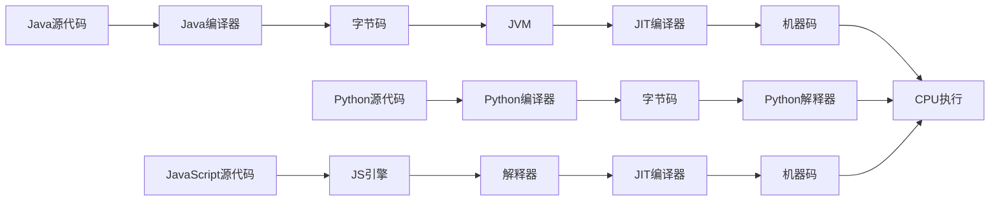
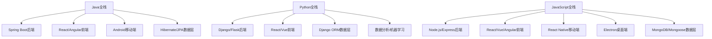
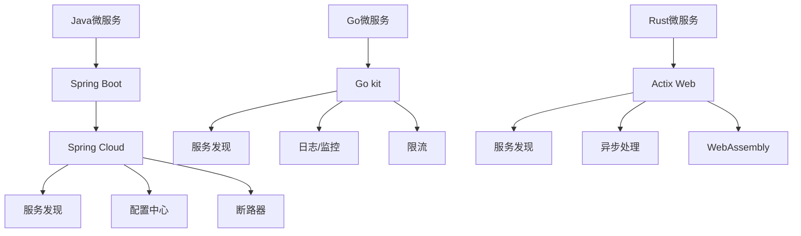
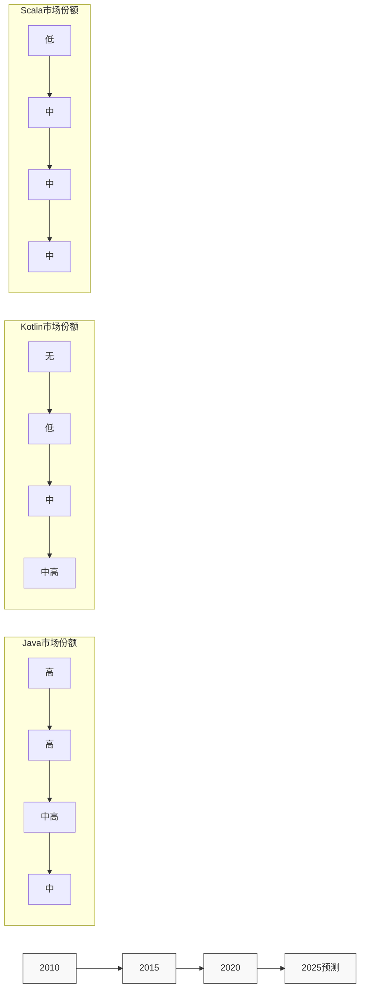

# Java与其他编程语言对比

## Java vs C/C++

### 内存管理模型对比

Java和C/C++在内存管理方面有着根本性的差异：

- **Java的自动内存管理**：
  - 使用垃圾回收器(GC)自动管理内存分配和释放
  - 开发者无需手动释放内存，减少了内存泄漏和悬挂指针问题
  - 支持引用计数、标记-清除、分代回收等多种GC算法
  - 内存分配在堆上，由JVM统一管理

- **C/C++的手动内存管理**：
  - 开发者需要手动分配和释放内存(`malloc`/`free`，`new`/`delete`)
  - 提供更精细的内存控制能力，但增加了开发复杂度
  - C++11引入智能指针(`shared_ptr`、`unique_ptr`)减轻手动管理负担
  - 支持栈内存和堆内存的灵活使用

```java
// Java示例 - 自动内存管理
public class MemoryExample {
    public static void main(String[] args) {
        // 创建对象，无需关心内存释放
        List<String> list = new ArrayList<>();
        for (int i = 0; i < 10000; i++) {
            list.add("Item " + i);
        }
        // 离开作用域后，list会被GC自动回收
    }
}
```

```cpp
// C++示例 - 手动内存管理
#include <iostream>
#include <vector>
#include <string>

int main() {
    // 手动分配内存
    int* array = new int[1000];
    
    // 使用内存
    for (int i = 0; i < 1000; i++) {
        array[i] = i;
    }
    
    // 必须手动释放内存，否则会造成内存泄漏
    delete[] array;
    
    // 使用智能指针自动管理内存(C++11及以上)
    std::unique_ptr<int[]> smartArray(new int[1000]);
    // 离开作用域后自动释放内存
    
    return 0;
}
```

### 性能与效率比较

Java和C/C++在性能方面的差异主要体现在以下几个方面：

| 特性 | Java | C/C++ |
|------|------|-------|
| 执行模式 | JIT编译+解释执行 | 直接编译为机器码 |
| 启动时间 | 较长(JVM启动) | 较短 |
| 峰值性能 | 接近C++的70-95% | 最高 |
| 内存占用 | 较高(JVM开销) | 较低 |
| 优化能力 | JIT动态优化 | 编译时静态优化 |

- **Java性能特点**：
  - 初始启动较慢，但长时间运行后性能接近原生代码
  - JIT编译器能进行运行时优化，根据实际执行情况调整代码
  - 现代JVM(如HotSpot)具有高效的垃圾回收算法
  - 适合长时间运行的服务端应用

- **C/C++性能特点**：
  - 直接编译为机器码，无解释开销
  - 可以进行底层优化和内存布局控制
  - 无GC暂停，实时性更好
  - 适合系统编程和对性能要求极高的场景

### 开发效率与安全性分析

开发效率和安全性是选择编程语言的重要考量因素：

- **Java的优势**：
  - 强类型系统，编译时类型检查
  - 无指针算术，避免缓冲区溢出
  - 自动边界检查，防止数组越界
  - 异常处理机制完善
  - 丰富的标准库和第三方库
  - 跨平台能力强，"一次编写，到处运行"

- **C/C++的挑战**：
  - 手动内存管理容易导致内存泄漏和悬挂指针
  - 指针操作可能引发安全漏洞
  - 缺乏内置边界检查，容易出现缓冲区溢出
  - 编译错误信息有时难以理解
  - 平台依赖性强，需要针对不同平台重新编译

```java
// Java示例 - 安全特性
public class SafetyExample {
    public static void main(String[] args) {
        int[] array = new int[10];
        try {
            // 自动边界检查，越界会抛出异常
            array[15] = 100;  // 抛出ArrayIndexOutOfBoundsException
        } catch (ArrayIndexOutOfBoundsException e) {
            System.out.println("捕获到数组越界异常: " + e.getMessage());
        }
    }
}
```

```cpp
// C++示例 - 安全隐患
#include <iostream>

int main() {
    int array[10];
    
    // 没有自动边界检查，越界访问不会立即报错
    // 但可能导致程序崩溃或不可预测的行为
    array[15] = 100;  // 危险操作!
    
    std::cout << "程序继续执行，但可能已经损坏了内存" << std::endl;
    
    return 0;
}
```

### 应用场景差异

Java和C/C++各自适合不同的应用场景：

- **Java适合的场景**：
  - 企业级应用和大型信息系统
  - Web应用和服务器端开发
  - 跨平台桌面应用
  - Android移动应用开发
  - 大数据处理框架(Hadoop, Spark等)
  - 金融和电子商务系统

- **C/C++适合的场景**：
  - 操作系统和系统级软件
  - 嵌入式系统和IoT设备
  - 游戏引擎和高性能图形应用
  - 实时系统(如交易系统、控制系统)
  - 资源受限环境下的应用
  - 需要直接硬件访问的应用

### JNI与本地代码集成

Java本地接口(JNI)允许Java代码与本地代码(如C/C++)交互：

- **JNI的主要用途**：
  - 访问平台特定功能和硬件
  - 重用现有的C/C++库
  - 性能关键部分使用本地代码实现
  - 与系统级API交互

- **JNI的工作流程**：
  1. 在Java中声明native方法
  2. 使用javah生成C/C++头文件
  3. 实现本地方法
  4. 编译为共享库(.so/.dll)
  5. 在Java代码中加载本地库

```java
// Java代码 - 声明native方法
public class NativeExample {
    // 加载本地库
    static {
        System.loadLibrary("nativelib");
    }
    
    // 声明本地方法
    public native int performComplexCalculation(int input);
    
    public static void main(String[] args) {
        NativeExample example = new NativeExample();
        int result = example.performComplexCalculation(42);
        System.out.println("计算结果: " + result);
    }
}
```

```cpp
// C++实现 - 实现native方法
#include <jni.h>
#include "NativeExample.h"  // 由javah生成的头文件

JNIEXPORT jint JNICALL Java_NativeExample_performComplexCalculation
  (JNIEnv *env, jobject obj, jint input) {
    // 执行复杂计算
    return input * 2;  // 简化示例
}
```

## Java vs Python/JavaScript

### 静态类型vs动态类型

Java、Python和JavaScript在类型系统上有本质区别：

- **Java的静态类型系统**：
  - 变量类型在编译时确定
  - 需要显式声明变量类型
  - 编译时进行类型检查
  - 提供更好的IDE支持和代码补全
  - 有助于早期发现类型错误
  - 泛型支持类型安全的集合操作

- **Python/JavaScript的动态类型系统**：
  - 变量类型在运行时确定
  - 无需显式声明变量类型
  - 运行时进行类型检查
  - 代码更简洁，开发速度更快
  - 更灵活，但可能在运行时出现类型错误
  - Duck typing: "如果它走路像鸭子，叫声像鸭子，那它就是鸭子"

```java
// Java - 静态类型示例
public class StaticTypingExample {
    public static void main(String[] args) {
        // 必须声明变量类型
        String name = "Java";
        int count = 10;
        
        // 类型错误在编译时被捕获
        // count = "20";  // 编译错误
        
        // 泛型确保类型安全
        List<String> names = new ArrayList<>();
        names.add("Alice");
        names.add("Bob");
        // names.add(42);  // 编译错误
        
        for (String s : names) {
            System.out.println(s.toUpperCase());  // 安全调用方法
        }
    }
}
```

```python
# Python - 动态类型示例
def dynamic_typing_example():
    # 无需声明变量类型
    name = "Python"
    count = 10
    
    # 可以改变变量类型
    count = "20"  # 合法，但可能导致逻辑错误
    
    # 列表可以包含不同类型
    names = ["Alice", "Bob", 42]
    
    # 可能在运行时出现类型错误
    for item in names:
        try:
            print(item.upper())  # 对数字调用upper()会抛出异常
        except AttributeError:
            print(f"Cannot call upper() on {item}")
```

```javascript
// JavaScript - 动态类型示例
function dynamicTypingExample() {
    // 无需声明变量类型
    let name = "JavaScript";
    let count = 10;
    
    // 可以改变变量类型
    count = "20";  // 合法
    
    // 数组可以包含不同类型
    const names = ["Alice", "Bob", 42];
    
    // 可能在运行时出现类型错误
    names.forEach(item => {
        try {
            console.log(item.toUpperCase());  // 对数字调用toUpperCase()会抛出异常
        } catch (error) {
            console.log(`Cannot call toUpperCase() on ${item}`);
        }
    });
}
```

### 编译执行vs解释执行

这三种语言的执行模型有显著差异：

- **Java的执行模型**：
  - 源代码(.java)编译为字节码(.class)
  - 字节码由JVM解释执行
  - JIT编译器将热点代码编译为机器码
  - 结合了编译语言和解释语言的优点
  - 需要JVM作为运行环境

- **Python的执行模型**：
  - 源代码编译为字节码(.pyc)
  - 字节码由Python解释器执行
  - CPython是最常用的解释器
  - PyPy等实现提供JIT编译
  - 执行速度通常慢于Java

- **JavaScript的执行模型**：
  - 传统上是纯解释执行
  - 现代JS引擎(V8, SpiderMonkey)使用JIT编译
  - 在浏览器或Node.js环境中运行
  - 执行速度显著提升，但仍慢于Java

执行流程对比：



### 并发模型对比

三种语言在并发处理上采用不同的模型：

- **Java的并发模型**：
  - 基于线程的并发模型
  - 内置的`synchronized`关键字和`Lock`接口
  - `java.util.concurrent`包提供高级并发工具
  - 支持线程池和并行流
  - 内存模型明确定义了线程间的交互规则
  - Java 8引入CompletableFuture支持异步编程
  - Java 19引入虚拟线程(Project Loom)

- **Python的并发模型**：
  - 全局解释器锁(GIL)限制了真正的并行执行
  - 多线程适合I/O密集型任务
  - 多进程适合CPU密集型任务
  - `asyncio`库支持协程和异步编程
  - 第三方库如`concurrent.futures`提供线程池和进程池

- **JavaScript的并发模型**：
  - 单线程事件循环模型
  - 基于回调的异步编程
  - Promise和async/await简化异步代码
  - Web Workers提供有限的多线程能力
  - Node.js中的cluster模块支持多进程

```java
// Java - 并发示例
public class ConcurrencyExample {
    public static void main(String[] args) throws Exception {
        // 使用线程池
        ExecutorService executor = Executors.newFixedThreadPool(4);
        
        // 提交多个任务
        List<Future<Integer>> futures = new ArrayList<>();
        for (int i = 0; i < 10; i++) {
            final int taskId = i;
            futures.add(executor.submit(() -> {
                System.out.println("Task " + taskId + " running on thread " + 
                                  Thread.currentThread().getName());
                return taskId * 10;
            }));
        }
        
        // 获取结果
        for (Future<Integer> future : futures) {
            System.out.println("Result: " + future.get());
        }
        
        executor.shutdown();
        
        // Java 8 并行流
        List<Integer> numbers = Arrays.asList(1, 2, 3, 4, 5, 6, 7, 8, 9, 10);
        int sum = numbers.parallelStream()
                        .mapToInt(n -> n * 2)
                        .sum();
        System.out.println("Parallel sum: " + sum);
    }
}
```

```python
# Python - 并发示例
import concurrent.futures
import asyncio

# 使用线程池
def thread_pool_example():
    def task(n):
        import threading
        print(f"Task {n} running on thread {threading.current_thread().name}")
        return n * 10
    
    with concurrent.futures.ThreadPoolExecutor(max_workers=4) as executor:
        futures = [executor.submit(task, i) for i in range(10)]
        for future in concurrent.futures.as_completed(futures):
            print(f"Result: {future.result()}")

# 使用asyncio
async def async_example():
    async def async_task(n):
        await asyncio.sleep(0.1)  # 模拟I/O操作
        return n * 10
    
    tasks = [async_task(i) for i in range(10)]
    results = await asyncio.gather(*tasks)
    print(f"Async results: {results}")

# 运行示例
if __name__ == "__main__":
    thread_pool_example()
    
    # 运行异步示例
    asyncio.run(async_example())
```

```javascript
// JavaScript - 并发示例
// 使用Promise
function promiseExample() {
    const tasks = [];
    
    for (let i = 0; i < 10; i++) {
        tasks.push(new Promise((resolve) => {
            setTimeout(() => {
                console.log(`Task ${i} completed`);
                resolve(i * 10);
            }, Math.random() * 1000);
        }));
    }
    
    Promise.all(tasks)
        .then(results => console.log(`All results: ${results}`));
}

// 使用async/await
async function asyncExample() {
    const delay = (ms) => new Promise(resolve => setTimeout(resolve, ms));
    
    const tasks = [];
    for (let i = 0; i < 10; i++) {
        tasks.push(async () => {
            await delay(Math.random() * 1000);
            console.log(`Async task ${i} completed`);
            return i * 10;
        });
    }
    
    const results = await Promise.all(tasks.map(task => task()));
    console.log(`Async results: ${results}`);
}

// 运行示例
promiseExample();
asyncExample().catch(console.error);
```

### 生态系统与框架比较

三种语言拥有各自丰富的生态系统：

- **Java生态系统**：
  - 企业级应用框架：Spring、Jakarta EE
  - Web框架：Spring Boot、Micronaut、Quarkus
  - ORM工具：Hibernate、MyBatis
  - 构建工具：Maven、Gradle
  - 大数据框架：Hadoop、Spark、Flink
  - 测试框架：JUnit、TestNG、Mockito
  - 云原生支持：Spring Cloud、Quarkus

- **Python生态系统**：
  - Web框架：Django、Flask、FastAPI
  - 数据科学：NumPy、Pandas、SciPy
  - 机器学习：TensorFlow、PyTorch、scikit-learn
  - 自动化和脚本：Ansible、Fabric
  - 数据可视化：Matplotlib、Seaborn、Plotly
  - Web爬虫：Scrapy、Beautiful Soup

- **JavaScript生态系统**：
  - 前端框架：React、Vue、Angular
  - 后端框架：Express、NestJS、Next.js
  - 全栈框架：Meteor、Nuxt.js
  - 移动应用：React Native、Ionic
  - 桌面应用：Electron
  - 状态管理：Redux、Vuex、MobX
  - 构建工具：Webpack、Vite、Rollup

### 全栈开发能力对比

三种语言在全栈开发方面各有优势：

- **Java全栈开发**：
  - 后端：Spring Boot提供强大的后端能力
  - 前端：可以与JavaScript框架集成，或使用JSP、Thymeleaf等模板
  - 移动端：Android原生开发
  - 优势：企业级应用的稳定性和可靠性
  - 劣势：前端开发相对繁琐，全栈技术栈较重

- **Python全栈开发**：
  - 后端：Django、Flask提供完整的后端解决方案
  - 前端：可以与JavaScript框架集成，或使用Django模板
  - 数据处理：强大的数据分析和机器学习能力
  - 优势：快速开发原型和数据密集型应用
  - 劣势：大型应用的性能和扩展性挑战

- **JavaScript全栈开发**：
  - 后端：Node.js生态系统(Express、NestJS)
  - 前端：React、Vue、Angular等现代框架
  - 移动端：React Native、Ionic
  - 桌面端：Electron
  - 优势：单一语言贯穿全栈，开发效率高
  - 劣势：大型企业应用的稳定性和类型安全挑战

全栈开发技术栈对比：



## Java vs Go/Rust

### 现代语言特性对比

Java、Go和Rust代表了不同代的编程语言设计理念：

- **Java语言特性**：
  - 面向对象编程(OOP)为核心范式
  - 强类型系统和泛型支持
  - Lambda表达式和函数式编程(Java 8+)
  - 模块系统(Java 9+)
  - 记录类型(Java 16+)
  - 模式匹配(Java 17+)
  - 虚拟线程(Java 19+)

- **Go语言特性**：
  - 简洁的语法，减少语言复杂性
  - 内置并发支持(goroutines和channels)
  - 接口隐式实现
  - 强大的标准库
  - 快速编译
  - 垃圾回收
  - 无泛型(Go 1.18前)，泛型支持有限

- **Rust语言特性**：
  - 所有权系统和借用检查器
  - 无GC的内存安全
  - 零成本抽象
  - 模式匹配和代数数据类型
  - Trait系统(类似接口)
  - 宏系统
  - 并发安全保证

```java
// Java - 现代特性示例
public class ModernJavaExample {
    public static void main(String[] args) {
        // Lambda表达式
        Runnable task = () -> System.out.println("Hello from lambda");
        task.run();
        
        // 流API
        List<String> names = List.of("Alice", "Bob", "Charlie");
        names.stream()
             .filter(name -> name.startsWith("A"))
             .map(String::toUpperCase)
             .forEach(System.out::println);
        
        // 记录类型(Java 16+)
        record Person(String name, int age) {}
        Person person = new Person("Alice", 30);
        System.out.println(person.name() + " is " + person.age() + " years old");
        
        // 模式匹配(Java 17+)
        Object obj = "Hello";
        if (obj instanceof String s) {
            System.out.println("String length: " + s.length());
        }
    }
}
```

```go
// Go - 语言特性示例
package main

import (
    "fmt"
    "strings"
)

// 结构体定义
type Person struct {
    Name string
    Age  int
}

// 接口定义
type Greeter interface {
    Greet() string
}

// 实现接口(隐式)
func (p Person) Greet() string {
    return fmt.Sprintf("Hello, my name is %s", p.Name)
}

func main() {
    // 并发 - goroutine
    go func() {
        fmt.Println("Hello from goroutine")
    }()
    
    // 通道
    ch := make(chan string)
    go func() {
        ch <- "Message from channel"
    }()
    msg := <-ch
    fmt.Println(msg)
    
    // 切片操作
    names := []string{"Alice", "Bob", "Charlie"}
    for _, name := range names {
        if strings.HasPrefix(name, "A") {
            fmt.Println(strings.ToUpper(name))
        }
    }
    
    // 结构体和接口
    person := Person{Name: "Alice", Age: 30}
    var g Greeter = person
    fmt.Println(g.Greet())
}
```

```rust
// Rust - 语言特性示例
use std::thread;
use std::sync::mpsc;

// 结构体定义
struct Person {
    name: String,
    age: u32,
}

// 特性(trait)定义
trait Greeter {
    fn greet(&self) -> String;
}

// 实现特性
impl Greeter for Person {
    fn greet(&self) -> String {
        format!("Hello, my name is {}", self.name)
    }
}

fn main() {
    // 所有权和借用
    let s1 = String::from("hello");
    let s2 = s1.clone();  // 深拷贝，而不是引用
    println!("s1: {}, s2: {}", s1, s2);
    
    // 线程和消息传递
    let (tx, rx) = mpsc::channel();
    thread::spawn(move || {
        tx.send("Message from thread").unwrap();
    });
    let received = rx.recv().unwrap();
    println!("{}", received);
    
    // 模式匹配
    let x = Some(5);
    match x {
        Some(value) => println!("Value is {}", value),
        None => println!("No value"),
    }
    
    // 结构体和特性
    let person = Person {
        name: String::from("Alice"),
        age: 30,
    };
    println!("{}", person.greet());
    
    // 错误处理
    let result: Result<i32, &str> = Ok(42);
    if let Ok(value) = result {
        println!("Success: {}", value);
    } else {
        println!("Error");
    }
}
```

### 内存管理机制比较

三种语言采用不同的内存管理策略：

- **Java的内存管理**：
  - 自动垃圾回收(GC)
  - 分代回收策略
  - GC调优选项丰富
  - 可能出现GC暂停
  - 内存开销较大
  - 开发者无需关心内存释放

- **Go的内存管理**：
  - 自动垃圾回收(GC)
  - 并发标记-清除算法
  - 低延迟GC设计
  - 简单的内存模型
  - 栈分配优化
  - 逃逸分析减少堆分配

- **Rust的内存管理**：
  - 所有权系统(ownership)
  - 借用检查器(borrow checker)
  - 无GC，无运行时开销
  - 编译时内存安全检查
  - RAII(资源获取即初始化)模式
  - 生命周期(lifetime)标注

内存管理对比表：

| 特性 | Java | Go | Rust |
|------|------|-----|------|
| 内存安全 | 运行时保证 | 运行时保证 | 编译时保证 |
| GC | 是 | 是 | 否 |
| 内存控制 | 有限 | 中等 | 完全 |
| 学习曲线 | 中等 | 低 | 高 |
| 运行时开销 | 高 | 中 | 低 |
| 内存泄漏可能性 | 低 | 低 | 低(非unsafe代码) |

### 并发编程模型分析

三种语言的并发模型各具特色：

- **Java的并发模型**：
  - 基于线程和共享内存
  - 同步原语：synchronized、Lock
  - 并发集合和原子变量
  - 线程池和任务执行框架
  - Fork/Join框架
  - 并行流
  - 虚拟线程(Java 19+)

- **Go的并发模型**：
  - 轻量级goroutines
  - 基于CSP的channel通信
  - "不要通过共享内存来通信，而是通过通信来共享内存"
  - select语句处理多通道操作
  - 内置的race detector
  - 简单易用的并发API

- **Rust的并发模型**：
  - 所有权系统保证线程安全
  - 编译时防止数据竞争
  - 标准库提供线程API
  - 通道(channel)用于消息传递
  - Mutex和RwLock用于共享状态
  -
让我继续完成Java与其他编程语言的对比：

### 并发编程模型分析（续）

- **Rust的并发模型**：
  - 所有权系统保证线程安全
  - 编译时防止数据竞争
  - 标准库提供线程API
  - 通道(channel)用于消息传递
  - Mutex和RwLock用于共享状态
  - Send和Sync特性控制线程间数据传递
  - 异步编程支持(async/await)

并发模型代码对比：

```java
// Java - 并发示例
import java.util.concurrent.*;

public class ConcurrencyDemo {
    public static void main(String[] args) throws Exception {
        // 线程池
        ExecutorService executor = Executors.newFixedThreadPool(4);
        
        // 共享状态 - 需要同步
        ConcurrentHashMap<String, Integer> sharedMap = new ConcurrentHashMap<>();
        
        // 提交多个任务
        for (int i = 0; i < 10; i++) {
            final int id = i;
            executor.submit(() -> {
                // 线程安全的操作
                sharedMap.put("Task-" + id, id);
                return id;
            });
        }
        
        // 等待任务完成
        executor.shutdown();
        executor.awaitTermination(1, TimeUnit.MINUTES);
        
        // 结果
        System.out.println("Results: " + sharedMap);
        
        // Java 19+ 虚拟线程
        try (var executor2 = Executors.newVirtualThreadPerTaskExecutor()) {
            for (int i = 0; i < 10000; i++) {
                final int id = i;
                executor2.submit(() -> {
                    Thread.sleep(100);  // 模拟I/O
                    return id;
                });
            }
        }  // 自动关闭并等待完成
    }
}
```

```go
// Go - 并发示例
package main

import (
    "fmt"
    "sync"
    "time"
)

func main() {
    // 通道通信
    ch := make(chan int, 10)
    
    // 启动多个goroutine
    var wg sync.WaitGroup
    for i := 0; i < 10; i++ {
        wg.Add(1)
        go func(id int) {
            defer wg.Done()
            // 发送数据到通道
            ch <- id
            time.Sleep(100 * time.Millisecond)  // 模拟工作
        }(i)
    }
    
    // 启动接收goroutine
    go func() {
        for i := 0; i < 10; i++ {
            // 从通道接收数据
            value := <-ch
            fmt.Printf("Received: %d\n", value)
        }
    }()
    
    // 等待所有goroutine完成
    wg.Wait()
    
    // select多路复用
    ch1 := make(chan string)
    ch2 := make(chan string)
    
    go func() { ch1 <- "from channel 1" }()
    go func() { ch2 <- "from channel 2" }()
    
    select {
    case msg1 := <-ch1:
        fmt.Println(msg1)
    case msg2 := <-ch2:
        fmt.Println(msg2)
    case <-time.After(1 * time.Second):
        fmt.Println("timeout")
    }
}
```

```rust
// Rust - 并发示例
use std::thread;
use std::sync::{Arc, Mutex};
use std::sync::mpsc;
use std::time::Duration;

fn main() {
    // 线程创建
    let mut handles = vec![];
    
    // 共享状态 - 使用Arc和Mutex
    let counter = Arc::new(Mutex::new(0));
    
    for i in 0..10 {
        let counter_clone = Arc::clone(&counter);
        let handle = thread::spawn(move || {
            let mut num = counter_clone.lock().unwrap();
            *num += 1;
            println!("Thread {} incremented counter to {}", i, *num);
        });
        handles.push(handle);
    }
    
    // 等待所有线程完成
    for handle in handles {
        handle.join().unwrap();
    }
    
    // 消息传递
    let (tx, rx) = mpsc::channel();
    
    thread::spawn(move || {
        let messages = vec!["Hello", "from", "the", "thread"];
        for msg in messages {
            tx.send(msg).unwrap();
            thread::sleep(Duration::from_millis(100));
        }
    });
    
    // 接收消息
    for received in rx {
        println!("Got: {}", received);
    }
    
    // 异步编程(需要tokio或async-std库)
    // async fn async_task() {
    //     println!("Async task started");
    //     // await some future
    // }
}
```

### 性能与资源占用

三种语言在性能和资源占用方面的比较：

- **Java性能特点**：
  - 启动时间较长(JVM预热)
  - 内存占用较高
  - JIT编译后性能接近原生代码
  - GC暂停可能影响实时性能
  - 适合长时间运行的服务

- **Go性能特点**：
  - 快速编译和启动
  - 内存占用适中
  - 接近C的性能
  - GC暂停短且可预测
  - 适合微服务和网络应用

- **Rust性能特点**：
  - 接近C/C++的性能
  - 内存占用最低
  - 无GC暂停
  - 零成本抽象
  - 适合性能关键型应用

性能对比表：

| 指标 | Java | Go | Rust |
|------|------|-----|------|
| 启动时间 | 慢 | 快 | 快 |
| 峰值性能 | 高 | 高 | 最高 |
| 内存占用 | 高 | 中 | 低 |
| 编译速度 | 中 | 快 | 慢 |
| 实时性能 | 受GC影响 | 较好 | 最佳 |
| 资源效率 | 中 | 高 | 最高 |

### 微服务与云原生支持

三种语言在微服务和云原生环境中的适用性：

- **Java的云原生支持**：
  - 成熟的微服务框架：Spring Boot、Quarkus、Micronaut
  - 容器化支持：Docker、Kubernetes
  - 服务网格集成：Istio
  - 云平台支持：所有主流云平台
  - 挑战：容器镜像较大，启动时间长
  - 优势：生态系统成熟，企业级支持

- **Go的云原生支持**：
  - 为云原生而生：Docker、Kubernetes等都用Go编写
  - 轻量级微服务框架：Go kit、Gin、Echo
  - 小型容器镜像
  - 快速启动时间
  - 低内存占用
  - 内置HTTP服务器

- **Rust的云原生支持**：
  - 新兴的微服务框架：Actix、Rocket、Warp
  - 最小的容器镜像
  - 最低的资源占用
  - 最高的性能
  - 挑战：生态系统相对年轻
  - WebAssembly支持

微服务架构对比：



## Java vs Kotlin/Scala

### JVM语言家族特点

Java、Kotlin和Scala都运行在JVM上，但设计理念不同：

- **Java特点**：
  - 语法简单明了
  - 向后兼容性强
  - 渐进式演进
  - 企业级应用的首选
  - 学习曲线平缓
  - 庞大的开发者社区

- **Kotlin特点**：
  - 由JetBrains开发，Android官方语言
  - 与Java 100%互操作
  - 更简洁的语法
  - 空安全类型系统
  - 协程支持
  - 函数式和面向对象编程的结合

- **Scala特点**：
  - 强大的类型系统
  - 函数式编程特性丰富
  - 高度表达性
  - 并发编程模型(Akka)
  - 大数据处理(Spark)
  - 学习曲线较陡

JVM语言对比：

| 特性 | Java | Kotlin | Scala |
|------|------|--------|-------|
| 语法简洁性 | 中等 | 高 | 高 |
| 函数式特性 | 有限 | 丰富 | 最丰富 |
| 类型系统 | 强类型 | 强类型+空安全 | 强类型+高级特性 |
| 互操作性 | 基准 | 与Java完全互操作 | 与Java良好互操作 |
| 学习曲线 | 平缓 | 中等 | 陡峭 |
| 编译速度 | 快 | 中等 | 慢 |

### 语法简洁性与表达能力

三种语言在语法简洁性和表达能力上的对比：

- **Java语法**：
  - 明确而冗长
  - 需要大量样板代码
  - Java 8+引入Lambda和Stream API
  - Java 14+引入记录类型减少样板代码
  - 类型擦除的泛型

- **Kotlin语法**：
  - 简洁明了
  - 数据类减少样板代码
  - 空安全操作符
  - 扩展函数
  - 高阶函数和Lambda表达式
  - 智能类型转换

- **Scala语法**：
  - 高度表达性
  - 类型推断
  - 模式匹配
  - 隐式转换和参数
  - 特质(Traits)
  - 函数式编程构造
  - 操作符重载

语法对比示例：

```java
// Java - 数据类
public class Person {
    private final String name;
    private final int age;
    
    public Person(String name, int age) {
        this.name = name;
        this.age = age;
    }
    
    public String getName() {
        return name;
    }
    
    public int getAge() {
        return age;
    }
    
    @Override
    public boolean equals(Object o) {
        if (this == o) return true;
        if (o == null || getClass() != o.getClass()) return false;
        Person person = (Person) o;
        return age == person.age && Objects.equals(name, person.name);
    }
    
    @Override
    public int hashCode() {
        return Objects.hash(name, age);
    }
    
    @Override
    public String toString() {
        return "Person{name='" + name + "', age=" + age + "}";
    }
}

// Java 16+ 记录类型
record PersonRecord(String name, int age) {}
```

```kotlin
// Kotlin - 数据类
data class Person(val name: String, val age: Int)

// 空安全示例
fun getNameLength(person: Person?): Int {
    return person?.name?.length ?: 0
}

// 扩展函数
fun String.isPalindrome(): Boolean {
    return this == this.reversed()
}

// 高阶函数
fun processNumbers(numbers: List<Int>, processor: (Int) -> Int): List<Int> {
    return numbers.map(processor)
}

// 使用
val doubled = processNumbers(listOf(1, 2, 3)) { it * 2 }
```

```scala
// Scala - 数据类
case class Person(name: String, age: Int)

// 模式匹配
def describe(x: Any): String = x match {
  case i: Int if i > 0 => "positive integer"
  case s: String => s"string: $s"
  case Person(name, age) => s"person: $name, $age years old"
  case _ => "something else"
}

// 隐式转换
implicit class StringOps(s: String) {
  def isPalindrome: Boolean = s == s.reverse
}

// 使用
"racecar".isPalindrome // true

// 函数式编程
val numbers = List(1, 2, 3, 4, 5)
val doubled = numbers.map(_ * 2)
val sum = numbers.foldLeft(0)(_ + _)
```

### 互操作性与迁移成本

三种语言之间的互操作性和迁移成本：

- **Java与Kotlin互操作**：
  - 无缝互操作，可以混合使用
  - Kotlin可以直接调用Java代码
  - Java可以调用Kotlin代码
  - IDE支持Java到Kotlin的自动转换
  - 渐进式迁移成本低
  - Android开发从Java到Kotlin的迁移路径成熟

- **Java与Scala互操作**：
  - 良好互操作，但有一些注意事项
  - Scala可以调用Java代码
  - Java调用Scala代码需要注意Scala特有特性
  - 迁移成本较高，学习曲线陡峭
  - 需要团队整体技能提升

- **Kotlin与Scala互操作**：
  - 都可以通过JVM互操作
  - 通常通过Java作为中间层
  - 直接互操作较少见

互操作性示例：

```java
// Java代码调用Kotlin
// 假设有Kotlin数据类: data class User(val id: Int, val name: String)

public class JavaClass {
    public void useKotlinClass() {
        // 创建Kotlin类实例
        User user = new User(1, "Alice");
        
        // 访问属性(Kotlin生成了getter)
        System.out.println(user.getId() + ": " + user.getName());
        
        // 使用Kotlin扩展函数(通过生成的静态方法)
        String result = UserKt.getFormattedName(user);
    }
}
```

```kotlin
// Kotlin代码调用Java
// 假设有Java类: public class JavaUser { private String name; ... }

fun useJavaClass() {
    // 创建Java类实例
    val javaUser = JavaUser()
    javaUser.name = "Bob"  // 调用Java setter
    
    // 处理可空性(Java没有空安全)
    val javaString: String? = javaUser.someMethodThatMightReturnNull()
    val length = javaString?.length ?: 0
    
    // 使用Java集合
    val javaList = ArrayList<String>()
    javaList.add("item")
    
    // 转换为Kotlin集合
    val kotlinList = javaList.toList()
}
```

```scala
// Scala代码调用Java
import java.util.{ArrayList, List}

object ScalaJavaInterop {
  def useJavaClass(): Unit = {
    // 创建Java类实例
    val javaList: List[String] = new ArrayList[String]()
    javaList.add("item")
    
    // 转换为Scala集合
    import scala.jdk.CollectionConverters._
    val scalaList = javaList.asScala.toList
    
    // 使用Java流API
    val stream = javaList.stream()
    val filtered = stream.filter(s => s.length > 2).toArray
  }
}
```

### 企业应用中的定位

三种语言在企业应用中的定位和适用场景：

- **Java的企业定位**：
  - 企业级应用的主流选择
  - 银行、金融、保险等传统行业的首选
  - 大型遗留系统的基础
  - 稳定性和向后兼容性至关重要的场景
  - 人才市场最广泛

- **Kotlin的企业定位**：
  - Android开发的官方语言
  - 现代化Java项目的替代选择
  - 与Spring Boot等框架良好集成
  - 初创公司和技术前沿企业的新项目
  - 需要Java互操作性但追求更现代语法的场景

- **Scala的企业定位**：
  - 大数据处理和分析(Spark)
  - 高并发系统(Akka)
  - 复杂领域模型的函数式实现
  - 金融分析和算法交易
  - 学术和研究领域
  - 追求函数式编程范式的团队

企业应用场景对比：

| 应用类型 | 首选语言 | 次选语言 | 备注 |
|---------|---------|---------|------|
| 传统企业应用 | Java | Kotlin | 稳定性和人才可用性 |
| 移动应用(Android) | Kotlin | Java | 官方支持和简洁语法 |
| 微服务 | Java/Kotlin | Scala | 取决于团队技能 |
| 大数据处理 | Scala | Java | Spark生态系统 |
| 高并发系统 | Scala | Kotlin | Akka和协程 |
| 新项目(现代团队) | Kotlin | Java | 开发效率和语言特性 |

### 未来发展趋势预测

三种语言的未来发展趋势：

- **Java的发展趋势**：
  - 六个月一次的快速发布周期
  - 持续增加现代语言特性
  - 虚拟线程和结构化并发
  - 模式匹配和记录模式
  - 值类型和原始类型泛型
  - GraalVM原生镜像提升云原生能力
  - 保持企业市场主导地位

- **Kotlin的发展趋势**：
  - 多平台开发(Kotlin Multiplatform)
  - 移动开发主导地位巩固
  - 服务器端应用增长
  - 与Spring生态系统深度集成
  - 协程和异步编程模型成熟
  - 逐步蚕食Java市场份额
  - WebAssembly支持

- **Scala的发展趋势**：
  - Scala 3(Dotty)带来语言革新
  - 简化语法，降低入门门槛
  - 保持在大数据和函数式编程领域的优势
  - 与Rust和Haskell竞争函数式编程市场
  - 在特定领域保持利基市场
  - 编译性能和工具链改进

语言采用趋势图：



总结：

Java、Kotlin和Scala作为JVM语言家族的三个代表，各自有着独特的优势和适用场景。Java凭借其稳定性、成熟度和庞大的生态系统，仍将在企业应用中保持重要地位；Kotlin通过现代语法和与Java的无缝互操作，正在迅速获得市场份额，特别是在Android开发领域；Scala则凭借其强大的函数式编程能力和大数据处理优势，在特定领域保持竞争力。

企业在选择语言时，需要综合考虑项目需求、团队技能、生态系统成熟度和长期维护成本等因素，而不仅仅是语言特性本身。在许多情况下，混合使用这些语言可能是最佳选择，利用各自的优势来解决不同的问题。