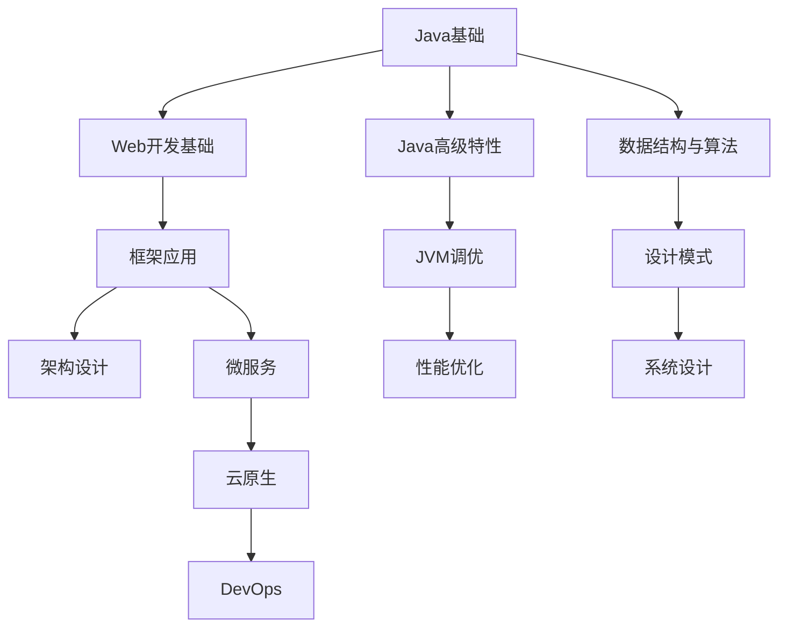

# Java社区资源利用

Java作为一门成熟的编程语言，拥有庞大而活跃的社区生态系统。有效利用这些社区资源，不仅可以帮助开发者解决技术问题，还能促进职业发展，扩展人脉网络，甚至参与塑造Java的未来。本文将全面介绍Java社区资源及其利用方法。

## Java官方资源

### JCP(Java Community Process)参与指南

Java社区进程(JCP)是开发和修订Java技术规范的正式机制，由Oracle公司管理。

**什么是JCP？**

JCP是一个开放的国际组织，由个人和组织组成，共同开发Java平台的标准技术规范。这些规范被称为Java规范请求(JSR)。

**参与JCP的方式：**

1. **成为JCP会员**
   - 个人会员：任何人都可以免费注册成为JCP个人会员
   - 公司会员：企业可以申请成为公司会员，参与更深层次的决策

2. **参与级别**
   - 观察者：关注JSR进展，阅读公开文档
   - 评论者：对JSR草案提供反馈
   - 专家组成员：直接参与JSR的开发
   - 执行委员会成员：投票决定JSR是否进入下一阶段

3. **参与流程**
   ```mermaid
   graph TD
       A[注册JCP会员] --> B[关注感兴趣的JSR]
       B --> C[阅读公开的规范文档]
       C --> D[提交评论和反馈]
       D --> E[申请加入专家组]
       E --> F[参与规范开发]
   ```

4. **实用链接**
   - JCP官网：https://jcp.org
   - 会员注册：https://jcp.org/en/participation/membership
   - 活跃JSR列表：https://jcp.org/en/jsr/stage?listBy=active

**参与JCP的价值：**
- 影响Java技术的发展方向
- 提前了解即将到来的Java特性
- 与Java领域的专家建立联系
- 在简历中展示你的社区贡献

### OpenJDK社区贡献方法

OpenJDK是Java SE平台的开源实现，是大多数Java开发者使用的JDK的基础。

**OpenJDK贡献流程：**

1. **准备工作**
   - 签署Oracle贡献协议(OCA)
   - 加入邮件列表：https://mail.openjdk.org/mailman/listinfo
   - 熟悉OpenJDK代码库和开发流程

2. **贡献类型**
   - 错误修复：解决JDK中的bug
   - 性能改进：优化现有功能
   - 新特性：提议并实现新功能
   - 文档改进：完善JavaDoc和其他文档

3. **贡献步骤**
   ```mermaid
   graph TD
       A[找到感兴趣的问题] --> B[在邮件列表讨论]
       B --> C[创建JBS问题单]
       C --> D[开发并测试解决方案]
       D --> E[提交补丁进行审查]
       E --> F[根据反馈修改]
       F --> G[补丁被接受并合并]
   ```

4. **开发环境设置**
   ```bash
   # 克隆OpenJDK代码库
   git clone https://github.com/openjdk/jdk.git
   
   # 配置构建环境
   cd jdk
   bash configure
   
   # 构建OpenJDK
   make images
   ```

5. **提交第一个补丁的建议**
   - 从简单的问题开始，如文档改进或小型bug修复
   - 确保遵循代码风格指南
   - 包含适当的测试用例
   - 耐心等待反馈，可能需要多次修改

**实用资源：**
- OpenJDK官网：https://openjdk.org
- 贡献指南：https://openjdk.org/contribute/
- JDK Bug系统：https://bugs.openjdk.org

### Oracle Java资源中心使用技巧

Oracle作为Java的管理者，提供了丰富的官方资源。

**核心资源：**

1. **Oracle Java技术网站**
   - Java SE文档：https://docs.oracle.com/en/java/javase/
   - Java EE/Jakarta EE文档：https://jakarta.ee/specifications/
   - Java教程：https://docs.oracle.com/javase/tutorial/

2. **Oracle开发者门户**
   - 技术文章和教程
   - 示例代码和最佳实践
   - 开发者论坛

3. **Oracle学习资源**
   - Oracle University：提供Java认证培训
   - Oracle Learning Library：免费视频教程
   - Oracle Developer Live：在线技术会议

**高效使用技巧：**

1. **文档导航技巧**
   - 使用版本选择器查看特定JDK版本的文档
   - 利用API文档的类层次结构视图理解继承关系
   - 使用搜索功能快速定位类和方法

2. **示例代码利用**
   - JDK示例代码：`$JAVA_HOME/demo`目录
   - 官方教程中的示例可以直接复制使用
   - GitHub上的Oracle示例仓库

3. **技术支持获取**
   - Oracle支持门户（需要商业支持合同）
   - 社区论坛：https://community.oracle.com/tech/developers/categories/java

### Java规范与JSR查阅指南

Java规范请求(JSR)定义了Java平台的标准特性和API。

**JSR基础知识：**

1. **JSR生命周期**
   ```mermaid
   graph LR
       A[提案] --> B[早期草案]
       B --> C[公开审查]
       C --> D[提案最终版]
       D --> E[维护]
   ```

2. **重要JSR示例**
   - JSR 335：Lambda表达式和流API
   - JSR 310：日期和时间API
   - JSR 380：Bean验证2.0
   - JSR 370：JAX-RS 2.1

**查阅和使用JSR的方法：**

1. **查找相关JSR**
   - JCP网站搜索：https://jcp.org/en/jsr/all
   - 按技术领域分类浏览
   - 查看特定Java版本包含的JSR列表

2. **阅读JSR文档**
   - 规范文档：详细描述API和行为
   - 参考实现：规范的示例实现
   - 技术兼容性工具包(TCK)：验证实现是否符合规范

3. **应用JSR知识**
   - 了解API的设计原理和最佳实践
   - 基于标准API开发可移植的应用
   - 评估第三方库是否符合相关JSR

**实用技巧：**
- 关注JSR的变更历史，了解API的演进
- 查看专家组讨论，理解设计决策
- 比较不同实现之间的差异（如不同厂商的JPA实现）

### JEPs(JDK Enhancement Proposals)跟踪

JDK增强提案(JEP)是OpenJDK项目中用于提议和跟踪JDK新特性的机制。

**JEP与JSR的区别：**
- JEP主要关注JDK实现层面的变更
- JSR定义Java平台的规范
- JEP通常更具体，范围更小
- JEP流程更轻量，迭代更快

**跟踪JEP的方法：**

1. **JEP索引**
   - 官方JEP索引：https://openjdk.org/jeps/0
   - 按状态过滤：草稿、候选、已提交、已完成等
   - 按目标JDK版本过滤

2. **JEP状态流程**
   ```mermaid
   graph TD
       A[草稿] --> B[候选]
       B --> C[提议]
       C --> D[已提交]
       D --> E[已完成]
       D --> F[已撤回]
   ```

3. **重要JEP示例**
   - JEP 361：Switch表达式（Java 14）
   - JEP 395：Records（Java 16）
   - JEP 444：虚拟线程（Java 21）

**利用JEP信息的价值：**

1. **技术前瞻**
   - 了解即将到来的Java特性
   - 评估新特性对项目的影响
   - 提前规划技术升级路径

2. **深入学习**
   - JEP文档通常包含设计动机和技术细节
   - 可以了解语言设计者的思考过程
   - 帮助理解特性的最佳使用场景

3. **参与反馈**
   - 在早期阶段提供使用场景和需求
   - 测试早期访问版本并报告问题
   - 在邮件列表中参与讨论

**实用技巧：**
- 订阅jdk-dev邮件列表获取JEP更新
- 关注Java版本发布计划，了解哪些JEP将包含在下一个版本
- 尝试使用早期访问版本测试新特性

## 开源社区资源

### Apache软件基金会Java项目

Apache软件基金会(ASF)是全球最大的开源软件基金会之一，托管了众多重要的Java项目。

**主要Apache Java项目：**

1. **Web和服务器技术**
   - Tomcat：最流行的Java Servlet容器
   - Struts：MVC Web应用框架
   - CXF：Web服务框架

2. **大数据和云计算**
   - Hadoop：分布式计算框架
   - Spark：快速大数据处理引擎
   - Kafka：高吞吐量分布式消息系统

3. **通用工具库**
   - Commons：通用Java组件集合
   - Log4j：Java日志框架
   - POI：Java API for Microsoft文档

4. **构建和项目管理**
   - Maven：项目管理和构建工具
   - Ant：构建自动化工具

**参与Apache项目的方式：**

1. **入门参与**
   - 订阅项目邮件列表
   - 阅读贡献指南
   - 解决初学者友好的问题
   - 改进文档

2. **贡献流程**
   ```mermaid
   graph TD
       A[找到感兴趣的项目] --> B[订阅邮件列表]
       B --> C[阅读贡献指南]
       C --> D[解决简单问题]
       D --> E[提交补丁]
       E --> F[成为提交者]
       F --> G[成为PMC成员]
   ```

3. **Apache之道**
   - 社区胜于代码
   - 公开透明的决策
   - 基于共识的治理
   - 实用主义方法

**利用Apache资源的技巧：**

1. **学习最佳实践**
   - 研究Apache项目的代码组织
   - 学习测试策略和质量保证方法
   - 了解大型开源项目的协作模式

2. **解决方案集成**
   - 利用Apache项目构建企业解决方案
   - 组合多个Apache组件创建完整系统
   - 参考Apache项目的参考架构

3. **职业发展**
   - 在简历中展示Apache项目贡献
   - 建立与行业专家的联系
   - 获得开源开发经验

**实用链接：**
- Apache项目目录：https://projects.apache.org/projects.html?language=Java
- 如何贡献：https://www.apache.org/dev/
- Apache孵化器：https://incubator.apache.org/

### Eclipse基金会Java相关资源

Eclipse基金会是另一个重要的开源组织，最初以Java IDE闻名，现在托管了众多Java相关项目。

**Eclipse基金会核心项目：**

1. **IDE和开发工具**
   - Eclipse IDE：流行的Java开发环境
   - Eclipse JDT：Java开发工具
   - Eclipse PDE：插件开发环境

2. **企业Java技术**
   - Jakarta EE：企业Java平台（前身为Java EE）
   - MicroProfile：微服务架构的企业Java规范
   - Eclipse Vert.x：反应式应用程序工具包

3. **建模和工具**
   - Eclipse EMF：Eclipse建模框架
   - Eclipse Xtext：领域特定语言框架
   - Eclipse Sirius：图形化建模工具

**参与Eclipse项目：**

1. **贡献方式**
   - 代码贡献：修复bug或添加功能
   - 文档改进：完善用户和开发者指南
   - 测试：帮助测试新功能和修复
   - 本地化：翻译界面和文档

2. **Eclipse开发流程**
   - 使用Gerrit进行代码审查
   - 遵循Eclipse IP流程
   - 签署Eclipse贡献者协议(ECA)

3. **社区参与**
   - Eclipse论坛：https://www.eclipse.org/forums/
   - 邮件列表：特定项目的开发者讨论
   - Eclipse Con：年度Eclipse社区会议

**利用Eclipse资源：**

1. **学习资源**
   - Eclipse教程和文档
   - Eclipse社区博客
   - Eclipse市场中的示例项目

2. **工具和框架**
   - 利用Eclipse插件扩展开发环境
   - 使用Eclipse运行时组件构建应用
   - 基于Eclipse建模框架创建自定义工具

3. **企业Java开发**
   - 使用Jakarta EE规范开发企业应用
   - 采用MicroProfile构建微服务
   - 参考Eclipse企业模式和最佳实践

**实用链接：**
- Eclipse项目：https://projects.eclipse.org/
- Jakarta EE：https://jakarta.ee/
- Eclipse MicroProfile：https://microprofile.io/

### Spring生态系统社区参与

Spring框架是Java企业级开发中最流行的框架之一，拥有活跃的社区和丰富的生态系统。

**Spring生态系统概览：**

1. **核心项目**
   - Spring Framework：核心容器和基础功能
   - Spring Boot：简化Spring应用开发
   - Spring Cloud：分布式系统开发工具
   - Spring Data：数据访问抽象
   - Spring Security：安全框架

2. **社区组织**
   - VMware（原Pivotal）：主要赞助商
   - Spring开发团队：核心维护者
   - Spring社区贡献者：全球开发者

**参与Spring社区：**

1. **贡献方式**
   - GitHub问题和PR：https://github.com/spring-projects
   - Stack Overflow回答：使用[spring]标签
   - 博客和教程：分享Spring使用经验
   - 本地用户组：组织或参加Spring meetup

2. **贡献流程**
   ```mermaid
   graph TD
       A[找到感兴趣的Spring项目] --> B[阅读贡献指南]
       B --> C[Fork GitHub仓库]
       C --> D[开发功能或修复]
       D --> E[提交PR]
       E --> F[根据反馈修改]
       F --> G[PR被合并]
   ```

3. **Spring社区活动**
   - SpringOne：年度Spring技术大会
   - Spring Live：在线技术讲座
   - Spring Office Hours：与Spring团队交流

**利用Spring资源：**

1. **学习资源**
   - Spring官方文档：https://spring.io/projects
   - Spring指南：https://spring.io/guides
   - Spring博客：https://spring.io/blog
   - Spring YouTube频道：教程和演讲

2. **开发工具**
   - Spring Initializr：快速创建Spring项目
   - Spring Boot CLI：命令行工具
   - Spring Tool Suite：专用IDE

3. **示例和模板**
   - Spring官方示例：GitHub上的示例项目
   - Spring PetClinic：参考应用
   - Spring Boot Starters：项目模板

**实用技巧：**
- 关注Spring团队成员的Twitter和博客
- 参与Spring Boot问题的讨论
- 尝试早期访问版本并提供反馈
- 创建并分享自定义Spring Boot Starter

### GitHub上的Java开源项目贡献

GitHub是全球最大的代码托管平台，拥有数以万计的Java开源项目，为开发者提供了丰富的学习和贡献机会。

**寻找合适的项目：**

1. **项目发现方法**
   - GitHub Explore：https://github.com/explore
   - GitHub Topics：https://github.com/topics/java
   - Awesome Java：https://github.com/akullpp/awesome-java
   - GitHub趋势：https://github.com/trending/java

2. **选择适合初学者的项目**
   - 寻找带有"good first issue"标签的问题
   - 查看项目的贡献指南
   - 评估项目活跃度（最近提交、问题响应时间）
   - 考虑项目文档的完善程度

3. **热门Java开源项目类别**
   - 框架和库：Netty, RxJava, Guava
   - 工具和应用：Jenkins, Elasticsearch
   - 学习资源：Java设计模式, 算法实现
   - 游戏和图形：Minecraft模组, Processing

**贡献流程：**

1. **准备工作**
   - Fork项目仓库
   - 克隆到本地
   - 设置开发环境
   - 阅读贡献指南和代码风格

2. **找到贡献机会**
   - 浏览open issues
   - 查看项目路线图
   - 改进文档或测试
   - 修复bug或实现小功能

3. **提交贡献**
   ```bash
   # 创建功能分支
   git checkout -b feature/my-contribution
   
   # 开发并提交更改
   git add .
   git commit -m "Add feature X"
   
   # 推送到你的fork
   git push origin feature/my-contribution
   
   # 创建Pull Request
   # 通过GitHub界面创建PR
   ```

4. **PR最佳实践**
   - 清晰描述你的更改
   - 关联相关issue
   - 包含测试用例
   - 保持PR范围小而集中
   - 积极响应审查意见

**从开源贡献中获益：**

1. **技能提升**
   - 学习大型项目的代码组织
   - 掌握协作开发流程
   - 提高代码质量和测试技能
   - 接触新技术和最佳实践

2. **职业发展**
   - 建立公开的代码组合
   - 获得实际项目经验
   - 扩展专业网络
   - 提高在招聘中的竞争力

3. **社区认可**
   - 成为项目贡献者
   - 获得维护者权限
   - 在技术社区建立声誉
   - 受邀参加技术活动

**实用工具：**
- GitHub CLI：命令行操作GitHub
- GitHub Desktop：图形界面Git客户端
- IDE集成：IntelliJ IDEA和VS Code的GitHub插件
- Dependabot：自动更新依赖

### StackOverflow等问答平台高效利用

技术问答平台是解决问题和分享知识的宝贵资源，其中StackOverflow是Java开发者最常用的平台之一。

**StackOverflow基础：**

1. **平台机制**
   - 声誉系统：通过有用的问答获得积分
   - 徽章：表彰特定成就
   - 投票：社区评价内容质量
   - 接受答案：标记最有帮助的回答

2. **Java相关标签**
   - [java]：核心Java问题
   - [spring]：Spring框架相关
   - [hibernate]：ORM和数据访问
   - [android]：Android开发
   - [maven]/[gradle]：构建工具

**高效提问：**

1. **提问前的准备**
   - 搜索现有问题
   - 尝试自行解决
   - 创建最小可复现示例
   - 整理相关错误信息

2. **编写高质量问题**
   - 使用描述性标题
   - 清晰说明问题背景
   - 包含代码示例（格式化良好）
   - 描述期望结果和实际结果
   - 列出已尝试的解决方案

   ```java
   // 好的代码示例
   public class Example {
       public static void main(String[] args) {
           List<String> items = Arrays.asList("a", "b", "c");
           // 尝试修改不可变列表，抛出UnsupportedOperationException
           items.add("d");  // 这里出现问题
       }
   }
   ```

3. **回应和互动**
   - 及时回应评论和问题
   - 提供请求的额外信息
   - 测试并反馈建议的解决方案
   - 接受最有帮助的答案

**回答问题：**

1. **选择适合回答的问题**
   - 你有实际经验的领域
   - 最近活跃的问题
   - 没有完整答案的问题
   - 你可以提供独特视角的问题

2. **编写高质量答案**
   - 直接解决核心问题
   - 提供完整、可运行的代码
   - 解释解决方案的原理
   - 引用官方文档或权威来源
   - 考虑性能和最佳实践

3. **持续改进**
   - 根据评论更新答案
   - 添加替代解决方案
   - 修正错误或不准确之处
   - 保持答案与最新Java版本兼容

**其他有价值的问答平台：**

1. **Reddit的Java社区**
   - r/java：Java新闻和讨论
   - r/learnjava：初学者友好的社区
   - r/javahelp：问题解答

2. **专业论坛**
   - CodeRanch：友好的Java论坛
   - DZone Java区：文章和问答
   - Oracle社区：官方Java论坛

3. **中文社区**
   - SegmentFault
   - V2EX
   - 掘金

**实用技巧：**
- 使用Google高级搜索：`site:stackoverflow.com java concurrent hashmap`
- 创建StackOverflow收藏夹整理有用问答
- 设置关注标签接收相关问题更新
- 定期回顾高票答案学习最佳实践

## Java技术会议与活动

### JavaOne/Oracle Code One大会

JavaOne曾是全球最重要的Java技术大会，后更名为Oracle Code One，现已并入Oracle CloudWorld。

**会议概览：**

1. **历史与演变**
   - 1996年：首届JavaOne在旧金山举办
   - 2017年：更名为Oracle Code One
   - 2019年：最后一届独立的Code One大会
   - 2020年起：并入Oracle CloudWorld

2. **会议内容**
   - 技术演讲：核心Java、企业Java、云原生等
   - 动手实验：实际操作新技术
   - 展示厅：合作伙伴和技术展示
   - 社交活动：与Java社区成员交流

3. **重要环节**
   - 主题演讲：Java平台更新和路线图
   - Duke's Choice Awards：表彰创新Java应用
   - 专家圆桌：深入讨论Java技术话题
   - 社区活动：Hackathon和非正式聚会

**参会价值：**

1. **学习最新技术**
   - 直接从Java平台架构师学习
   - 了解即将发布的Java特性
   - 掌握Java生态系统的最新发展
   - 获取企业级Java应用的最佳实践

2. **职业发展**
   - 与行业专家建立联系
   - 结识潜在雇主和合作伙伴
   - 展示自己的技术专长
   - 获取职业发展建议

3. **社区参与**
   - 与全球Java开发者交流
   - 分享经验和解决方案
   - 参与开源项目讨论
   - 建立长期专业关系

**有效参会策略：**

1. **会前准备**
   - 研究会议日程，标记感兴趣的讲座
   - 准备问题清单
   - 更新个人社交媒体和名片
   - 安装会议应用程序

2. **会中参与**
   - 积极提问和参与讨论
   - 利用休息时间与演讲者交流
   - 参加社交活动和非正式聚会
   - 记录关键见解和联系信息

3. **会后跟进**
   - 复习笔记和演讲材料
   - 与新认识的联系人保持沟通
   - 在团队中分享学到的知识
   - 实践新技术和方法

**替代活动：**
- Oracle Developer Live：在线技术会议
- Oracle CloudWorld：包含Java内容的更大规模会议
- 区域性Oracle Code活动

### Devoxx全球Java开发者大会

Devoxx是欧洲最大的Java社区会议，已扩展到全球多个国家，由开发者社区主导。

**Devoxx系列会议：**

1. **全球Devoxx活动**
   - Devoxx Belgium：最大和最原始的Devoxx
   - Devoxx UK：英国伦敦
   - Devoxx France：法国巴黎
   - Devoxx Poland：波兰克拉科夫
   - Devoxx Morocco：摩洛哥
   - Devoxx Ukraine：乌克兰

2. **会议特色**
   - 深度技术内容
   - 社区驱动的议程
   - 多样化的演讲形式
   - 强调实用技能和最佳实践

3. **内容形式**
   - 会议演讲：50分钟深度技术讲座
   - 快速讲座：15分钟简短分享
   - 动手实验：3小时实践课程
   - BOF会议：非正式讨论特定话题
   - 闪电演讲：5分钟快速分享

**参与方式：**

1. **参会**
   - 购买会议门票
   - 规划个人日程
   - 准备问题和讨论点
   - 参与社交活动

2. **演讲**
   - 关注演讲征集(CFP)公告
   - 准备引人入胜的演讲提案
   - 强调实用经验和案例研究
   - 提交并等待评审结果

3. **志愿者**
   - 申请会议志愿者岗位
   - 协助会议组织和后勤
   - 获得参会机会
   - 与组织者建立联系

**Devoxx资源利用：**

1. **在线内容**
   - Devoxx YouTube频道：过去会议的录像
   - 演讲幻灯片：通常在会后分享
   - Devoxx博客：技术文章和会议更新

2. **社区连接**
   - Twitter:
让我继续完成Java社区资源利用的内容：

### Devoxx全球Java开发者大会（续）

2. **社区连接**
   - Twitter: 关注@Devoxx和相关标签
   - LinkedIn: 与其他参会者建立联系
   - Devoxx论坛: 会议前后的讨论

3. **职业发展**
   - 在简历中展示Devoxx演讲经历
   - 分享会议见解建立个人品牌
   - 利用会议人脉寻找工作机会

**实用链接：**
- Devoxx官网：https://devoxx.com/
- Devoxx YouTube频道：https://www.youtube.com/c/Devoxx
- 演讲征集信息：https://cfp.devoxx.com/

### JVM语言峰会

JVM语言峰会是一个专注于JVM上运行的各种编程语言的技术会议，汇集了语言设计者和核心开发者。

**峰会概览：**

1. **会议特点**
   - 小型、高强度的技术会议
   - 邀请制，主要面向语言设计者和核心贡献者
   - 深入讨论JVM语言的技术挑战和发展方向
   - 促进JVM语言之间的协作和创新

2. **涵盖语言**
   - Java
   - Scala
   - Kotlin
   - Groovy
   - Clojure
   - JRuby
   - Jython
   - 其他JVM语言

3. **讨论主题**
   - 语言设计和演进
   - JVM优化和性能
   - 跨语言互操作性
   - 编译器技术
   - 类型系统和语言特性

**参与和关注方式：**

1. **内容获取**
   - 会议总结和报告
   - 演讲幻灯片（如果公开）
   - 相关博客文章和技术论文
   - 社交媒体上的讨论和更新

2. **间接参与**
   - 关注参会者的博客和社交媒体
   - 参与相关邮件列表讨论
   - 在GitHub上跟踪语言项目的变化
   - 尝试实现会议中讨论的概念

**峰会价值：**

1. **技术前瞻**
   - 了解JVM语言的未来发展方向
   - 预见即将到来的语言特性
   - 洞察JVM平台的演进路径

2. **深度学习**
   - 理解语言设计决策背后的原理
   - 学习高级JVM优化技术
   - 掌握跨语言开发的最佳实践

3. **社区影响**
   - 间接影响JVM语言的发展
   - 在早期阶段了解并评估新特性
   - 为自己的项目选择合适的JVM语言

**相关资源：**
- OpenJDK官网JVM语言峰会页面
- 语言设计者的个人博客和Twitter
- JVM语言GitHub仓库的讨论区

### SpringOne平台大会

SpringOne是专注于Spring生态系统的主要技术会议，由Spring背后的公司VMware Tanzu（前Pivotal）主办。

**会议概览：**

1. **会议规模与形式**
   - 每年举办一次
   - 数千名与会者
   - 数百场技术讲座和工作坊
   - 现场和在线参与选项

2. **内容焦点**
   - Spring框架核心更新
   - Spring Boot和Spring Cloud最佳实践
   - 云原生应用开发
   - DevOps和现代软件交付
   - 微服务架构和设计模式

3. **参与者构成**
   - Spring核心团队成员
   - 企业Java开发者
   - 架构师和技术决策者
   - 开源贡献者
   - 云平台提供商

**参会价值：**

1. **技术学习**
   - 直接从Spring创建者学习
   - 掌握Spring最新特性和最佳实践
   - 了解Spring路线图和未来发展
   - 获取实际项目经验和案例研究

2. **实践机会**
   - 动手实验室和工作坊
   - 与Spring专家一对一咨询
   - 代码实验和现场演示
   - 认证考试准备

3. **社区参与**
   - 与Spring社区成员建立联系
   - 分享经验和解决方案
   - 与Spring团队直接交流
   - 参与开源讨论

**有效参会策略：**

1. **会前准备**
   ```mermaid
   graph TD
       A[确定学习目标] --> B[研究会议日程]
       B --> C[准备技术问题]
       C --> D[复习Spring基础知识]
       D --> E[安装必要软件]
   ```

2. **会中参与**
   - 参加Spring核心团队的演讲
   - 选择与当前项目相关的讲座
   - 利用实验室时间尝试新技术
   - 记录关键见解和代码示例

3. **会后应用**
   - 复习会议材料和笔记
   - 在团队中分享学到的知识
   - 实施相关技术和最佳实践
   - 继续通过Spring社区资源学习

**替代和补充资源：**
- SpringOne视频库：过去会议的录像
- Spring官方博客：会议更新和技术文章
- Spring开发者YouTube频道
- 区域性Spring用户组活动

### 区域性Java用户组(JUG)活动

Java用户组(JUG)是本地Java开发者社区，定期组织技术分享、讨论和社交活动。

**JUG基础知识：**

1. **什么是JUG**
   - 由志愿者组织的本地Java社区
   - 定期举办技术讲座和工作坊
   - 提供学习和交流的平台
   - 与全球Java社区保持联系

2. **全球JUG网络**
   - 全球有数百个活跃的JUG
   - 由Oracle认可的官方社区组织
   - 通过Java Champions项目连接
   - 区域性和国家级JUG联盟

3. **典型活动形式**
   - 技术讲座：特定Java技术的分享
   - 代码实验室：动手编程活动
   - 闪电演讲：多个简短技术分享
   - 社交聚会：非正式交流
   - 黑客马拉松：团队编程挑战

**参与JUG的方式：**

1. **找到本地JUG**
   - Java用户组列表：https://www.java.net/jugs/java-user-groups
   - Meetup.com搜索"Java"或"JUG"
   - 社交媒体和技术社区询问

2. **参与级别**
   - 参会者：参加活动学习和交流
   - 演讲者：分享技术经验和知识
   - 志愿者：协助组织和运营活动
   - 组织者：创建和管理JUG

3. **演讲机会**
   - 提议适合本地社区的话题
   - 准备清晰、实用的演示
   - 包含代码示例和实际应用
   - 欢迎初学者友好的内容

**JUG参与价值：**

1. **技术成长**
   - 接触多样化的Java技术和应用
   - 从本地专家学习实用技能
   - 获取实际项目经验和案例研究
   - 在安全环境中尝试新技术

2. **职业发展**
   - 建立本地专业网络
   - 了解当地就业市场和机会
   - 展示技术专长和经验
   - 获得职业指导和建议

3. **社区贡献**
   - 帮助他人学习和成长
   - 推广最佳实践和质量标准
   - 支持本地技术生态系统
   - 与全球Java社区建立联系

**创建或振兴JUG的建议：**

1. **启动步骤**
   - 联系Oracle JUG计划
   - 建立核心组织团队
   - 确定会议地点和频率
   - 创建在线存在（网站、社交媒体）

2. **活动组织**
   - 邀请多样化的演讲者
   - 平衡技术深度和广度
   - 创建欢迎的、包容的环境
   - 收集反馈并持续改进

3. **可持续发展**
   - 培养新的组织者和志愿者
   - 寻求公司赞助和支持
   - 与其他技术社区合作
   - 定期更新内容和形式

**实用资源：**
- Oracle JUG支持计划
- Adopt-a-JSR计划：参与Java标准开发
- Java Champions网络：连接全球Java专家
- AdoptOpenJDK：支持OpenJDK发展

## 学习与职业发展资源

### Java认证体系与备考资源

Java认证是验证和展示Java技能的官方途径，由Oracle管理。

**Java认证概览：**

1. **主要认证路径**
   - Oracle认证助理Java程序员(OCA)
   - Oracle认证专业Java程序员(OCP)
   - Oracle认证专家(OCE)：特定领域专业认证
   - Oracle认证大师(OCM)：最高级别认证

2. **认证版本**
   - 基于不同Java版本：Java 8, 11, 17等
   - 新版本发布后通常会更新认证
   - 旧版本认证仍然有效，但建议更新

3. **认证价值**
   - 验证Java技能水平
   - 增强简历竞争力
   - 在某些组织中可能带来薪资提升
   - 为职业晋升提供客观标准

**主要认证详情：**

1. **Java SE认证**
   - OCA Java SE 8/11 程序员I：基础知识
   - OCP Java SE 8/11 程序员II：高级概念
   - 升级考试：从旧版本升级到新版本

2. **Java EE/Jakarta EE认证**
   - Jakarta EE 8 应用开发者
   - 企业应用组件开发者
   - Web服务开发者

3. **专业领域认证**
   - Spring专业认证（非Oracle官方）
   - Java架构师认证
   - 性能调优专家

**备考策略：**

1. **学习资源**
   - 官方认证指南和学习材料
   - 第三方认证备考书籍
   - 在线课程和培训
   - 模拟考试和练习题

2. **备考计划**
   ```mermaid
   graph TD
       A[评估当前知识] --> B[制定学习计划]
       B --> C[系统学习考试内容]
       C --> D[实践编码和练习]
       D --> E[模拟测试]
       E --> F[查漏补缺]
       F --> G[参加考试]
   ```

3. **实践准备**
   - 编写符合考试要求的代码
   - 手动跟踪代码执行和结果
   - 熟悉无IDE环境的编码
   - 练习时间管理

**推荐备考资源：**

1. **官方资源**
   - Oracle University课程
   - Oracle认证官方指南
   - Oracle Java文档

2. **书籍**
   - OCA/OCP Java SE 8/11 认证指南（Jeanne Boyarsky和Scott Selikoff著）
   - Java认证学习指南（Kathy Sierra和Bert Bates著）
   - Enthuware模拟考试软件

3. **在线资源**
   - Pluralsight Java认证路径
   - Udemy Java认证课程
   - CodeRanch认证论坛
   - Whizlabs模拟测试

**认证考试技巧：**

1. **考前准备**
   - 熟悉考试格式和时间
   - 复习常见陷阱和难点
   - 确保充分休息
   - 准备必要的身份证件

2. **考试策略**
   - 先回答有把握的题目
   - 标记不确定的问题稍后回顾
   - 注意题目中的细节和关键词
   - 利用排除法缩小选项范围

3. **后续发展**
   - 获得认证后继续学习
   - 考虑更高级别认证
   - 在实际项目中应用所学知识
   - 分享认证经验帮助他人

### 优质Java技术博客与公众号

跟踪高质量的Java技术博客和公众号是保持技术更新和深入学习的有效方式。

**英文技术博客：**

1. **Java官方博客**
   - Inside Java：https://inside.java/
   - Oracle Java Magazine
   - Java Champions博客

2. **Java专家博客**
   - Baeldung：全面的Java教程和最佳实践
   - Thoughts on Java by Thorben Janssen：JPA和Hibernate专家
   - Java Code Geeks：多作者Java技术博客
   - InfoQ Java：企业Java新闻和文章
   - DZone Java Zone：Java社区文章和教程

3. **框架和库博客**
   - Spring Blog：Spring官方博客
   - Vlad Mihalcea's Blog：Hibernate性能专家
   - JetBrains IntelliJ IDEA Blog：IDE和工具技巧
   - Inside.Akka.io：Akka框架博客

**中文技术博客和公众号：**

1. **技术博客**
   - 美团技术团队：大规模Java应用实践
   - 阿里巴巴中间件：分布式系统和中间件
   - 江南白衣：Spring Cloud专家
   - 泥瓦匠BYSocket：Java和Spring教程
   - 程序猿DD：Spring Cloud和微服务

2. **公众号**
   - JavaEdge：Java核心技术和面试
   - Java技术栈：Java全栈技术
   - 码农小胖哥：Java进阶和源码分析
   - Java架构师必看：架构设计和最佳实践
   - 并发编程网：Java并发和性能优化

3. **技术社区**
   - 掘金Java专区
   - CSDN Java板块
   - 开源中国Java资讯
   - InfoQ中文站Java频道

**有效利用博客资源：**

1. **内容筛选策略**
   - 使用RSS阅读器订阅博客
   - 设置关键词过滤
   - 优先关注与当前工作相关的主题
   - 定期清理低质量或不再相关的订阅

2. **学习方法**
   - 主动实践博客中的代码示例
   - 记录关键见解和技巧
   - 与同事分享和讨论有价值的文章
   - 定期回顾和应用学到的知识

3. **参与互动**
   - 评论和提问
   - 分享自己的经验和见解
   - 在社交媒体上转发有价值的内容
   - 考虑创建自己的技术博客

**博客内容评估标准：**

1. **技术准确性**
   - 内容是否基于最新版本
   - 是否包含完整的代码示例
   - 是否解释了底层原理
   - 是否考虑了边缘情况和限制

2. **实用性**
   - 是否提供实际问题的解决方案
   - 是否包含性能考虑
   - 是否讨论最佳实践
   - 是否有真实项目的案例研究

3. **更新频率**
   - 博客是否定期更新
   - 旧文章是否得到维护和更新
   - 是否跟进Java新版本和新特性
   - 是否响应读者反馈和问题

### Java相关书籍与在线课程推荐

高质量的书籍和在线课程是系统学习Java的重要资源。

**经典Java书籍：**

1. **入门级**
   - 《Java编程思想》(Thinking in Java) - Bruce Eckel
   - 《Head First Java》- Kathy Sierra & Bert Bates
   - 《Java核心技术》(Java Core) - Cay S. Horstmann
   - 《Java从入门到精通》- 明日科技

2. **进阶级**
   - 《Effective Java》- Joshua Bloch
   - 《Java并发编程实战》(Java Concurrency in Practice) - Brian Goetz
   - 《深入理解Java虚拟机》- 周志明
   - 《Java性能权威指南》(Java Performance) - Scott Oaks

3. **专业领域**
   - 《Spring实战》(Spring in Action) - Craig Walls
   - 《Spring Boot实战》(Spring Boot in Action) - Craig Walls
   - 《Java微服务》(Java Microservices) - Eberhard Wolff
   - 《高性能MySQL》- Baron Schwartz

4. **架构设计**
   - 《企业应用架构模式》- Martin Fowler
   - 《领域驱动设计》- Eric Evans
   - 《Clean Architecture》- Robert C. Martin
   - 《微服务架构设计模式》- Chris Richardson

**优质在线课程平台：**

1. **综合平台**
   - Pluralsight：高质量Java和企业技术课程
   - Udemy：广泛的Java课程选择
   - Coursera：大学和企业提供的Java课程
   - edX：学术机构的Java和计算机科学课程

2. **专业Java平台**
   - Baeldung：专注于Spring和Java的课程
   - Java Brains：Java和Spring视频教程
   - Marco Behler：实用Java开发课程
   - JetBrains Academy：交互式Java学习

3. **中文平台**
   - 慕课网：实战型Java课程
   - 极客时间：Java专家专栏
   - 拉勾教育：Java就业导向课程
   - B站Java教程：免费入门视频

**选择适合的学习资源：**

1. **根据学习阶段**
   - 初学者：选择结构清晰、示例丰富的入门资源
   - 中级开发者：关注最佳实践和深入理解
   - 高级开发者：专注架构设计和性能优化

2. **根据学习风格**
   - 视觉学习者：视频课程和图解书籍
   - 阅读学习者：详细的技术书籍和文档
   - 实践学习者：动手项目和编码挑战

3. **根据时间投入**
   - 短期学习：精简课程和实践指南
   - 中期学习：综合课程和专题书籍
   - 长期学习：系统性教材和认证路径

**有效学习策略：**

1. **主动学习方法**
   ```mermaid
   graph TD
       A[学习概念] --> B[编写代码实践]
       B --> C[解决实际问题]
       C --> D[教授他人/写博客]
       D --> E[回顾和深化]
   ```

2. **项目驱动学习**
   - 设定明确的项目目标
   - 逐步实现功能
   - 应用所学知识
   - 解决实际问题
   - 代码审查和改进

3. **持续学习习惯**
   - 每日编码练习
   - 定期阅读技术文章
   - 参与开源项目
   - 解决编程挑战
   - 与同行讨论和分享

**免费学习资源：**

1. **官方文档**
   - Java SE文档和教程
   - Spring框架指南
   - Apache项目文档

2. **开源电子书**
   - GitHub上的Java学习资源
   - Java设计模式开源教程
   - 免费的Java编程电子书

3. **视频教程**
   - YouTube上的Java频道
   - Oracle的Java教程视频
   - 开源会议录像

### Java开发者职业发展路径

Java开发者有多种职业发展路径，了解这些路径可以帮助规划长期职业目标。

**技术发展阶段：**

1. **初级Java开发者**
   - 技能要求：Java基础、简单Web开发、SQL基础
   - 典型职责：实现预定义功能、修复简单bug、单元测试
   - 发展重点：掌握核心Java、学习常用框架、理解软件工程基础

2. **中级Java开发者**
   - 技能要求：Java高级特性、框架深入应用、数据库优化
   - 典型职责：设计和实现功能模块、代码审查、性能优化
   - 发展重点：深入理解JVM、掌握设计模式、提高系统设计能力

3. **高级Java开发者**
   - 技能要求：架构设计、性能调优、分布式系统
   - 典型职责：技术选型、架构设计、指导团队、解决复杂问题
   - 发展重点：系统架构、技术领导力、前沿技术研究

**专业发展方向：**

1. **技术专家路线**
   - Java架构师：设计企业级Java应用架构
   - 性能专家：Java应用性能分析和优化
   - 安全专家：Java应用安全设计和实现
   - 框架专家：特定框架（如Spring）的深度专家

2. **管理路线**
   - 技术团队领导：管理小型开发团队
   - 开发经理：管理多个团队和项目
   - 技术总监：制定技术战略和标准
   - CTO：企业技术决策和战略

3. **创业路线**
   - 技术合伙人：创业公司技术负责人
   - 独立咨询师：Java技术咨询和培训
   - 产品开发者：开发Java相关产品或工具
   - 开源项目维护者：维护流行Java开源项目

**技能进阶路线图：**



**职业发展策略：**

1. **技能培养**
   - T型技能结构：Java深度+相关技术广度
   - 持续学习新版本Java特性
   - 掌握相关技术：数据库、前端、DevOps
   - 软技能发展：沟通、团队协作、项目管理

2. **经验积累**
   - 参与不同类型和规模的项目
   - 解决各种技术挑战和问题
   - 担任不同角色积累多方面经验
   - 记录和分享技术经验

3. **职业规划**
   - 设定短期和长期职业目标
   - 定期评估和调整发展路径
   - 寻找导师和榜样
   - 建立职业发展反馈循环

**行业趋势与机会：**

1. **热门领域**
   - 云原生Java应用开发
   - 微服务和分布式系统
   - 大数据处理和分析
   - AI/ML集成Java应用

2. **新兴技术**
   - GraalVM和原生镜像
   - 响应式编程
   - 低代码/无代码平台
   - WebAssembly和Java

3. **行业需求**
   - 金融科技：交易系统、风控平台
   - 企业SaaS：云服务和解决方案
   - 电子商务：高并发交易系统
   - 物联网：Java后端和设备管理

**实用建议：**
- 创建个人技能发展计划
- 寻找技术导师指导职业发展
- 参与开源项目积累实战经验
- 建立个人品牌和技术影响力

### Java技术专家社交网络建立

建立专业的技术社交网络对Java开发者的职业发展至关重要。

**社交网络的价值：**

1. **职业发展**
   - 获取工作机会和推荐
   - 了解行业趋势和需求
   - 接触新项目和合作机会
   - 获得职业建议和指导

2. **技术成长**
   - 学习最佳实践和经验
   - 获取技术问题的快速解答
   - 接触前沿技术和创新
   - 参与技术讨论和辩论

3. **个人品牌**
   - 展示专业知识和技能
   - 建立行业声誉和影响力
   - 分享观点和见解
   - 获得专业认可

**建立网络的平台：**

1. **专业社交媒体**
   - LinkedIn：职业社交网络
   - Twitter：技术讨论和分享
   - GitHub：代码贡献和开源参与
   - Stack Overflow：问答和知识分享

2. **技术社区**
   - Reddit Java社区
   - DZone和InfoQ
   - Java用户组(JUG)
   - Slack和Discord技术频道

3. **会议和活动**
   - 技术大会和研讨会
   - 线上线下Meetup
   - 黑客马拉松
   - 技术工作坊

**建立网络的策略：**

1. **线上社交**
   - 创建专业的社交媒体档案
   - 定期分享有价值的技术内容
   - 参与技术讨论和回答问题
   - 关注和互动行业专家

2. **内容创作**
   - 技术博客写作
   - 开源项目贡献
   - 技术演讲和分享
   - 教程和指南编写

3. **社区参与**
   - 加入Java用户组
   - 参与开源项目
   - 回答技术问题
   - 组织或志愿者参与活动

**社交网络维护：**

1. **持续互动**
   - 定期更新社交媒体
   - 回应评论和消息
   - 分享和推广他人内容
   - 参与定期社区活动

2. **价值提供**
   - 分享独特见解和经验
   - 提供实用技术解决方案
   - 帮助新手和回答问题
   - 创建有价值的技术资源

3. **关系深化**
   - 一对一交流和讨论
   - 合作项目和内容创作
   - 线下会面和交流
   - 长期保持联系

**个人品牌建设：**

1. **专业形象**
   - 统一的专业头像和简介
   - 清晰的技术专长和兴趣
   - 展示项目和成就
   - 专业的交流方式

2. **内容策略**
   - 
让我继续完成Java技术专家社交网络建立的内容：

### Java技术专家社交网络建立（续）

2. **内容策略**
   - 选择专注的技术领域
   - 保持内容质量和一致性
   - 分享原创见解和经验
   - 定期发布和互动

3. **影响力扩展**
   - 跨平台内容分享
   - 参与技术讨论和辩论
   - 担任社区角色（版主、组织者）
   - 与其他专家合作创作

**实用社交技巧：**

1. **有效沟通**
   - 清晰表达技术观点
   - 尊重不同意见
   - 提供建设性反馈
   - 适当使用技术术语

2. **人脉管理**
   - 分类整理专业联系人
   - 定期跟进重要关系
   - 记录关键信息和交流
   - 互惠互利的合作方式

3. **跨文化交流**
   - 了解国际Java社区文化
   - 适应不同沟通风格
   - 使用英语参与全球讨论
   - 尊重文化差异

**案例分析：成功的Java技术专家网络建设**

以下是几位成功建立专业网络的Java技术专家案例：

1. **开源贡献者路径**
   - 从小型PR开始参与开源项目
   - 逐步承担更多责任
   - 成为项目维护者
   - 在会议上分享项目经验
   - 建立与其他维护者的联系

2. **技术博主路径**
   - 创建专注于特定Java技术的博客
   - 定期发布高质量教程
   - 在社交媒体分享文章
   - 回应读者问题和评论
   - 受邀参与技术活动和访谈

3. **社区组织者路径**
   - 参与本地Java用户组
   - 组织小型技术分享
   - 扩展为大型技术活动
   - 邀请行业专家演讲
   - 建立广泛的行业联系

**常见挑战与解决方案：**

1. **时间管理**
   - 挑战：平衡工作、学习和社交网络建设
   - 解决方案：设定优先级，集中精力在高价值活动，利用碎片时间

2. **内容创作压力**
   - 挑战：持续创作高质量内容的压力
   - 解决方案：建立内容库，重复利用内容，与他人合作创作

3. **专业定位**
   - 挑战：在众多Java专家中找到自己的定位
   - 解决方案：专注特定领域，发展独特视角，解决特定问题

4. **跨越初始障碍**
   - 挑战：缺乏初始人脉和影响力
   - 解决方案：积极参与开放社区，提供价值，寻找导师指导

**衡量网络建设成效：**

1. **定量指标**
   - 专业联系人数量和质量
   - 内容互动和分享数
   - 收到的工作和合作机会
   - 技术问题的解答率

2. **定性指标**
   - 专业声誉和认可度
   - 人脉关系深度和互动质量
   - 获取关键信息的能力
   - 在社区中的影响力

3. **长期发展指标**
   - 职业发展机会增加
   - 技术视野拓展
   - 学习资源获取能力
   - 专业满足感和成就感

**行动计划模板：**

```markdown
# Java技术社交网络建设90天计划

## 第1-30天：基础建设
- 完善LinkedIn和GitHub个人资料
- 每周发布1篇技术博客文章
- 加入3个Java技术社区
- 每天回答1-2个技术问题

## 第31-60天：内容创作与互动
- 开始一个小型开源项目或贡献
- 每周参与1次技术讨论
- 与5位行业专家建立联系
- 参加2次线上或线下技术活动

## 第61-90天：深化与扩展
- 组织或参与1次技术分享
- 与2-3位同行合作创作内容
- 扩展到相关技术领域
- 回顾和调整社交策略
```

通过系统性地建立和维护Java技术专家社交网络，开发者不仅能够加速职业发展，还能持续获取最新知识和技术趋势，在快速变化的技术环境中保持竞争力。最重要的是，这些联系将成为职业生涯中宝贵的资产，带来持续的价值和机会。