# Java技术选型决策方法

技术选型是软件开发过程中的关键决策点，直接影响项目的成功与否。对于Java生态系统而言，丰富的框架和工具选择既是优势也是挑战。本文将系统介绍Java技术选型的方法论、评估框架、决策流程和实用工具，帮助开发团队做出明智的技术决策。

## 技术选型评估框架

### 业务需求与技术匹配度分析

技术选型的首要原则是技术必须服务于业务。评估技术与业务需求的匹配度需要考虑以下方面：

**1. 功能需求匹配**

功能需求匹配是指技术方案能否满足业务的核心功能需求。评估方法包括：

- **功能覆盖率分析**：列出所有业务功能需求，评估每个技术方案的覆盖程度
- **核心功能支持度**：重点评估关键业务功能的支持情况
- **定制化难度**：当现有功能不满足需求时，评估定制开发的难度

```markdown
功能需求匹配度评估表示例：

| 业务需求 | 重要性 | 方案A支持度 | 方案B支持度 | 备注 |
|---------|-------|------------|------------|------|
| 用户认证 | 高    | 完全支持    | 完全支持    | 方案B需要额外配置 |
| 数据导出 | 中    | 部分支持    | 完全支持    | 方案A需要定制开发 |
| 实时通知 | 高    | 完全支持    | 不支持      | 方案B需要集成第三方服务 |
```

**2. 非功能需求匹配**

非功能需求是指系统的质量属性，如性能、可用性、安全性等。评估方法包括：

- **性能需求**：响应时间、吞吐量、并发用户数等
- **可用性需求**：系统正常运行时间、故障恢复能力
- **安全需求**：认证、授权、数据保护等
- **可扩展性**：系统处理增长负载的能力

**3. 业务发展匹配**

技术选型不仅要满足当前需求，还要考虑业务未来发展：

- **业务增长预测**：评估技术方案是否能支持业务规模增长
- **业务变化适应性**：技术方案对业务变化的适应能力
- **技术演进路径**：技术方案的升级路径是否清晰

**4. 行业特性匹配**

不同行业有不同的技术需求特点：

- **金融行业**：注重事务一致性、安全性和审计能力
- **电商行业**：注重高并发、弹性扩展和个性化推荐
- **医疗行业**：注重数据隐私和合规性
- **制造业**：注重系统稳定性和集成能力

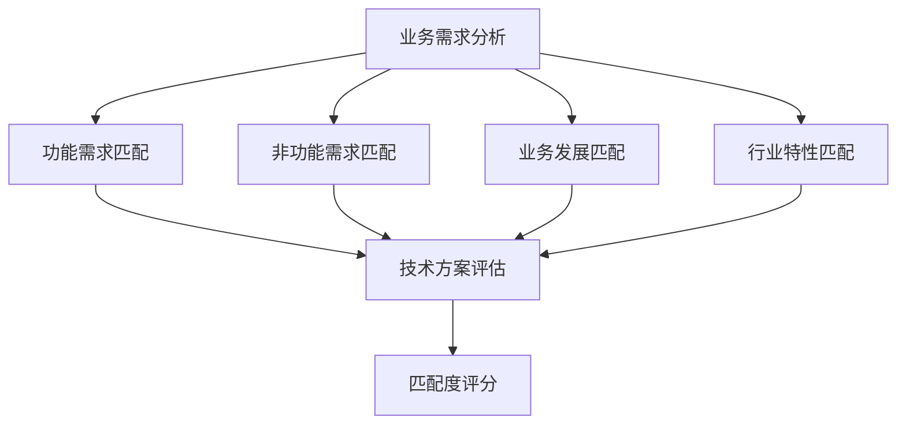

### 性能与可伸缩性评估方法

性能和可伸缩性是系统质量的关键指标，尤其对于企业级Java应用。

**1. 性能评估维度**

- **响应时间**：系统响应用户请求的时间
  - 平均响应时间
  - 95%/99%响应时间（长尾延迟）
  - 最大响应时间

- **吞吐量**：系统单位时间内处理的请求数或事务数
  - 每秒请求数(RPS)
  - 每秒事务数(TPS)
  - 数据处理速率(MB/s)

- **资源利用率**：系统运行时对计算资源的使用情况
  - CPU利用率
  - 内存使用量
  - 磁盘I/O
  - 网络带宽

**2. 可伸缩性评估维度**

- **水平扩展能力**：通过增加节点提高系统容量
  - 线性扩展特性
  - 集群协调开销
  - 状态管理策略

- **垂直扩展能力**：通过增加单节点资源提高系统容量
  - 多核心利用效率
  - 内存利用效率
  - JVM调优空间

- **弹性伸缩能力**：系统根据负载自动调整资源
  - 动态扩缩容机制
  - 负载均衡策略
  - 故障恢复能力

**3. 性能测试方法**

- **负载测试**：在预期负载下评估系统性能
- **压力测试**：评估系统在极限负载下的表现
- **耐久性测试**：长时间运行系统评估性能稳定性
- **峰值测试**：模拟流量突增场景

**4. 性能基准测试工具**

- **JMH (Java Microbenchmark Harness)**：评估代码级性能
- **Apache JMeter**：Web应用负载测试
- **Gatling**：高性能负载测试
- **wrk/wrk2**：HTTP基准测试

**5. 实际案例分析**

以下是Spring Boot与Quarkus在启动时间和内存占用上的对比示例：

```java
// 性能测试代码示例 - 使用JMH进行基准测试
@BenchmarkMode(Mode.AverageTime)
@OutputTimeUnit(TimeUnit.MILLISECONDS)
@State(Scope.Thread)
@Fork(value = 2, jvmArgs = {"-Xms2G", "-Xmx2G"})
@Warmup(iterations = 3)
@Measurement(iterations = 5)
public class FrameworkPerformanceTest {

    @Benchmark
    public void testSpringBootStartup() {
        // 测量Spring Boot应用启动时间
        SpringApplication.run(TestApplication.class);
    }
    
    @Benchmark
    public void testQuarkusStartup() {
        // 测量Quarkus应用启动时间
        Quarkus.run(TestApplication.class);
    }
}
```

性能测试结果示例：

```
框架启动时间对比：
- Spring Boot: 2.5秒
- Quarkus: 0.4秒

内存占用对比：
- Spring Boot: 140MB
- Quarkus: 70MB

每秒请求处理能力(相同硬件条件)：
- Spring Boot: 15,000 RPS
- Quarkus: 22,000 RPS
```

### 开发效率与维护成本考量

技术选型不仅要考虑运行时性能，还要评估开发和维护阶段的效率和成本。

**1. 开发效率评估因素**

- **学习曲线**：团队掌握技术的时间成本
  - 文档质量和完整性
  - 学习资源可获得性
  - 与团队已有技能的相似度

- **开发工具支持**：IDE和开发工具的支持程度
  - 代码补全和提示
  - 调试工具
  - 热部署支持
  - 代码生成功能

- **代码量和复杂度**：实现相同功能所需的代码量
  - 样板代码(boilerplate code)数量
  - API设计的直观性
  - 配置复杂度

- **测试便利性**：编写和运行测试的难易程度
  - 单元测试支持
  - 集成测试框架
  - 测试覆盖率工具

**2. 维护成本评估因素**

- **代码可读性和可维护性**
  - 代码结构清晰度
  - 命名约定一致性
  - 模块化和解耦程度

- **升级和迁移成本**
  - 版本升级的兼容性
  - 破坏性变更的频率
  - 升级文档和工具

- **问题诊断和修复难度**
  - 日志和监控支持
  - 错误信息清晰度
  - 调试和分析工具

- **长期维护负担**
  - 技术债务累积速度
  - 重构难易程度
  - 代码腐化风险

**3. 开发效率量化方法**

- **功能点分析**：评估实现相同功能点所需的时间
- **开发周期测量**：从需求到部署的时间
- **缺陷率统计**：单位代码量的缺陷数
- **变更响应时间**：实现需求变更所需的时间

**4. 框架对比示例**

以下是不同Java Web框架实现相同功能的代码对比：

```java
// Spring Boot实现REST API
@RestController
@RequestMapping("/api/users")
public class UserController {
    @Autowired
    private UserService userService;
    
    @GetMapping("/{id}")
    public User getUser(@PathVariable Long id) {
        return userService.findById(id);
    }
}
```

```java
// Quarkus实现REST API
@Path("/api/users")
@Produces(MediaType.APPLICATION_JSON)
@Consumes(MediaType.APPLICATION_JSON)
public class UserResource {
    @Inject
    UserService userService;
    
    @GET
    @Path("/{id}")
    public User getUser(@PathParam("id") Long id) {
        return userService.findById(id);
    }
}
```

```java
// Jakarta EE (JAX-RS)实现REST API
@Path("/api/users")
@Produces(MediaType.APPLICATION_JSON)
@Consumes(MediaType.APPLICATION_JSON)
public class UserResource {
    @EJB
    private UserService userService;
    
    @GET
    @Path("/{id}")
    public User getUser(@PathParam("id") Long id) {
        return userService.findById(id);
    }
}
```

**5. 开发效率与维护成本评估矩阵**

```markdown
| 评估维度 | 权重 | Spring Boot | Quarkus | Jakarta EE |
|---------|------|------------|---------|------------|
| 学习曲线 | 20%  | 4          | 3       | 2          |
| 开发速度 | 25%  | 5          | 4       | 3          |
| 代码简洁性 | 15% | 4          | 5       | 3          |
| 测试便利性 | 15% | 5          | 4       | 3          |
| 维护成本 | 25%  | 4          | 4       | 3          |
| 加权总分 | 100% | 4.4        | 4.0     | 2.8        |

评分标准：1-5分，5分最高
```

### 社区活跃度与长期支持评估

技术的社区活跃度和长期支持是确保技术方案可持续性的关键因素。

**1. 社区活跃度评估指标**

- **GitHub指标**
  - Star和Fork数量
  - 贡献者数量和活跃度
  - Issue响应时间和解决率
  - 代码提交频率和最近活动

- **社区参与度**
  - Stack Overflow问题数量和回答质量
  - 技术论坛和讨论组活跃度
  - 社区活动和会议
  - 用户群体规模

- **生态系统健康度**
  - 第三方插件和扩展数量
  - 配套工具和库的完善程度
  - 与其他技术的集成能力
  - 商业支持和服务提供商

**2. 长期支持评估指标**

- **项目历史和稳定性**
  - 项目存在时间
  - 版本发布频率和规律性
  - 重大版本的平稳过渡历史
  - 向后兼容性策略

- **组织支持**
  - 背后的组织或公司
  - 商业模式可持续性
  - 开发团队规模和稳定性
  - 财务支持状况

- **技术路线图**
  - 明确的发展规划
  - 创新与稳定性的平衡
  - 对新技术趋势的响应能力
  - 废弃特性的处理策略

**3. 数据收集和分析方法**

- **GitHub API分析**：获取项目活动数据
- **Google Trends分析**：评估技术关注度趋势
- **社区调查**：了解用户满意度和使用情况
- **技术雷达跟踪**：观察技术在行业中的采用情况

**4. 社区活跃度可视化示例**

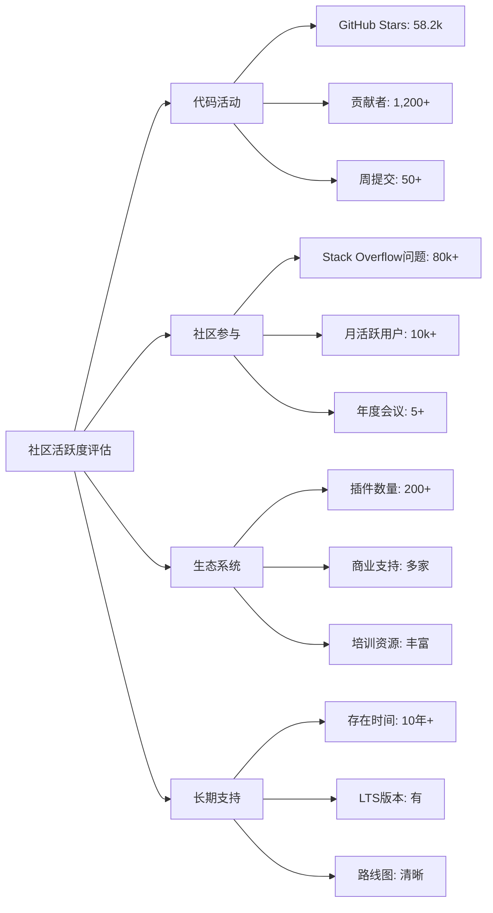

**5. 框架社区活跃度对比示例**

```markdown
Spring Boot社区指标(2023年数据):
- GitHub Stars: 68.5k
- 贡献者: 800+
- 最近提交: 活跃(每日多次)
- Stack Overflow问题: 100,000+
- 商业支持: VMware/Pivotal, 多家咨询公司
- 版本发布: 稳定, 6个月一个主要版本
- LTS支持: 商业支持可获得

Quarkus社区指标(2023年数据):
- GitHub Stars: 11.7k
- 贡献者: 500+
- 最近提交: 活跃(每日多次)
- Stack Overflow问题: 5,000+
- 商业支持: Red Hat, 部分咨询公司
- 版本发布: 频繁, 1-2个月一个版本
- LTS支持: 通过Red Hat订阅
```

### 安全性与合规性评价标准

在企业环境中，技术选型必须考虑安全性和合规性要求，尤其是在金融、医疗和政府等受监管行业。

**1. 安全性评估维度**

- **代码安全**
  - 已知漏洞数量和严重程度
  - 安全更新频率和响应速度
  - 代码审计和安全测试实践
  - 默认安全配置水平

- **认证与授权**
  - 身份验证机制支持
  - 细粒度访问控制能力
  - 与企业身份系统集成能力
  - 多因素认证支持

- **数据安全**
  - 数据加密支持(传输中和静态)
  - 敏感数据处理机制
  - 数据泄露防护能力
  - 密钥管理支持

- **安全合规框架支持**
  - OWASP Top 10防护
  - SANS 25控制措施
  - 行业特定安全标准支持

**2. 合规性评估维度**

- **行业标准合规**
  - PCI DSS(支付卡行业)
  - HIPAA(医疗行业)
  - GDPR(欧盟数据保护)
  - SOX(财务报告)

- **审计与日志**
  - 审计日志完整性
  - 不可篡改日志机制
  - 用户活动跟踪能力
  - 合规报告生成

- **隐私保护**
  - 数据最小化原则支持
  - 用户同意管理
  - 数据主体权利支持
  - 隐私设计原则遵循

**3. 安全评估方法**

- **漏洞扫描**：使用工具扫描框架和依赖项的已知漏洞
- **渗透测试**：模拟攻击者测试系统安全性
- **代码审查**：检查框架代码中的安全问题
- **合规性检查清单**：根据行业标准评估合规性

**4. 安全工具与实践**

- **依赖检查工具**：OWASP Dependency Check, Snyk
- **静态代码分析**：SonarQube, Checkmarx
- **动态应用安全测试**：OWASP ZAP, Burp Suite
- **安全编码指南**：OWASP Secure Coding Practices

**5. 框架安全特性对比示例**

```markdown
| 安全特性 | Spring Boot | Quarkus | Jakarta EE |
|---------|------------|---------|------------|
| 认证框架 | Spring Security | 多种选项(包括JWT) | Jakarta Security |
| 授权模型 | 细粒度, 灵活 | 基于角色和属性 | 基于角色 |
| CSRF保护 | 内置 | 需配置 | 框架相关 |
| 安全头部 | Spring Security | 需配置 | 需配置 |
| 加密支持 | 丰富 | 基本 | 基本 |
| 漏洞响应 | 快速 | 较快 | 取决于实现 |
| CVE历史 | 中等数量,快速修复 | 较少 | 取决于实现 |
```

**6. 合规性支持示例**

```java
// Spring Boot安全配置示例
@Configuration
@EnableWebSecurity
public class SecurityConfig extends WebSecurityConfigurerAdapter {
    
    @Override
    protected void configure(HttpSecurity http) throws Exception {
        http
            .authorizeRequests()
                .antMatchers("/api/public/**").permitAll()
                .antMatchers("/api/admin/**").hasRole("ADMIN")
                .anyRequest().authenticated()
            .and()
            .formLogin()
            .and()
            .csrf().csrfTokenRepository(CookieCsrfTokenRepository.withHttpOnlyFalse())
            .and()
            .headers()
                .contentSecurityPolicy("script-src 'self'")
            .and()
            .referrerPolicy(ReferrerPolicy.SAME_ORIGIN);
    }
}
```

## 框架选型决策流程

### 需求分析与技术调研阶段

技术选型的第一步是深入理解需求并进行全面的技术调研。

**1. 需求分析方法**

- **需求分类**
  - 功能需求：系统必须提供的功能
  - 非功能需求：性能、可用性、安全性等质量属性
  - 约束条件：预算、时间、技术限制等

- **需求优先级划分**
  - 必须实现(Must Have)
  - 应该实现(Should Have)
  - 可以实现(Could Have)
  - 暂不实现(Won't Have)

- **需求与技术映射**
  - 识别需求对技术选择的影响
  - 确定技术选型的关键决策因素
  - 建立需求与技术特性的追踪矩阵

**2. 技术调研方法**

- **信息收集渠道**
  - 官方文档和网站
  - 技术博客和文章
  - 社区论坛和讨论
  - 行业报告和分析

- **调研维度**
  - 技术成熟度和稳定性
  - 功能完整性和适用性
  - 性能和可伸缩性
  - 社区支持和生态系统
  - 学习曲线和开发效率

- **调研工具**
  - 技术雷达(Technology Radar)
  - 比较矩阵(Comparison Matrix)
  - SWOT分析(优势、劣势、机会、威胁)

**3. 调研报告模板**

```markdown
# 技术调研报告：[技术名称]

## 1. 技术概述
- 简介和历史
- 核心特性
- 适用场景

## 2. 技术评估
- 功能完整性
- 性能和可伸缩性
- 开发效率
- 社区支持
- 安全性和合规性

## 3. 案例研究
- 成功案例
- 失败案例
- 行业采用情况

## 4. 与需求匹配分析
- 功能需求匹配度
- 非功能需求匹配度
- 约束条件兼容性

## 5. 风险分析
- 技术风险
- 实施风险
- 长期维护风险

## 6. 结论和建议
- 总体评价
- 适用场景
- 后续步骤建议
```

**4. 需求与技术映射示例**

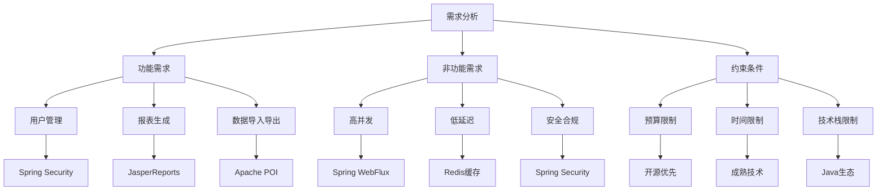

### 概念验证(POC)设计与实施

概念验证(Proof of Concept, POC)是技术选型中验证技术可行性的关键步骤。

**1. POC的目的**

- 验证技术方案是否满足关键需求
- 评估技术实现的复杂度和风险
- 获取实际开发和运行经验
- 为最终决策提供实证依据

**2. POC范围确定**

- **关键功能验证**：选择最具代表性的功能
- **技术挑战验证**：测试最具风险的技术点
- **集成验证**：测试与现有系统的集成
- **性能验证**：测试关键性能指标

**3. POC设计原则**

- **小而精**：范围要小但必须包含关键点
- **真实场景**：尽量模拟真实业务场景
- **可比较**：确保不同方案的POC具有可比性
- **时间控制**：设定合理的时间限制
- **明确指标**：定义清晰的成功标准

**4. POC实施步骤**

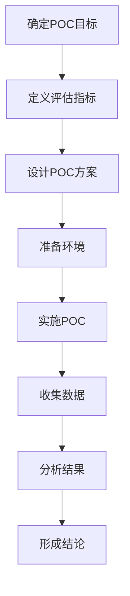

**5. POC评估指标示例**

```markdown
| 评估维度 | 评估指标 | 目标值 | 方案A结果 | 方案B结果 |
|---------|---------|-------|----------|----------|
| 功能实现 | 核心API完成度 | 100% | 100% | 90% |
| 性能 | 每秒事务数 | >1000 TPS | 1200 TPS | 950 TPS |
| 性能 | 平均响应时间 | <100ms | 85ms | 120ms |
| 开发效率 | 完成POC时间 | <5人天 | 4人天 | 6人天 |
| 学习曲线 | 文档查阅次数 | - | 15次 | 25次 |
| 集成 | 与现有系统集成 | 顺利 | 顺利 | 部分问题 |
```

**6. POC代码示例**

以下是使用不同ORM框架实现相同数据访问功能的POC代码示例：

```java
// Hibernate POC示例
@Entity
public class User {
    @Id
    @GeneratedValue(strategy = GenerationType.IDENTITY)
    private Long id;
    private String username;
    private String email;
    // getters and setters
}

@Repository
public class HibernateUserRepository {
    @PersistenceContext
    private EntityManager entityManager;
    
    public User findById(Long id) {
        return entityManager.find(User.class, id);
    }
    
    public List<User> findByEmail(String email) {
        return entityManager.createQuery(
            "SELECT u FROM User u WHERE u.email = :email", User.class)
            .setParameter("email", email)
            .getResultList();
    }
}
```

```java
// MyBatis POC示例
public interface UserMapper {
    @Select("SELECT * FROM users WHERE id = #{id}")
    User findById(@Param("id") Long id);
    
    @Select("SELECT * FROM users WHERE email = #{email}")
    List<User> findByEmail(@Param("email") String email);
}

@Service
public class MyBatisUserService {
    @Autowired
    private UserMapper userMapper;
    
    public User findById(Long id) {
        return userMapper.findById(id);
    }
    
    public List<User> findByEmail(String email) {
        return userMapper.findByEmail(email);
    }
}
```

**7. POC报告模板**

```markdown
# 概念验证(POC)报告：[技术方案名称]

## 1. POC概述
- 目标和范围
- 测试环境
- 评估指标

## 2. 实施过程
- 实施步骤
- 遇到的问题和解决方法
- 代码和配置示例

## 3. 测试结果
- 功能测试结果
- 性能测试结果
- 集成测试结果

## 4. 发现的优势
- 技术优势
- 实施优势
- 长期价值

## 5. 发现的问题和风险
- 技术限制
- 实施挑战
- 长期风险

## 6. 结论和建议
- 总体评价
- 与其他方案比较
- 后续建议
```

### 多方案对比与评分卡方法

在完成需求分析、技术调研和概念验证后，需要系统地对比多个技术方案并做出决策。

**1. 评估维度确定**

- **基于需求的维度**：从需求分析中提取关键评估维度
- **基于风险的维度**：识别潜在风险并纳入评估
- **基于长期价值的维度**：考虑长期维护和发展因素

**2. 评分卡设计**

- **评估维度权重**：根据重要性分配权重
- **评分标准**：为每个维度定义明确的评分标准
- **评分尺度**：通常使用1-5或1-10的评分尺度

**3. 评分卡模板**
让我继续完成Java技术选型决策方法的内容：

### 多方案对比与评分卡方法（续）

**3. 评分卡模板**

```markdown
| 评估维度 | 权重 | 评分标准 | 方案A评分 | 方案B评分 | 方案C评分 |
|---------|------|---------|----------|----------|----------|
| 功能完整性 | 20% | 1-5分 | 4 | 5 | 3 |
| 性能 | 15% | 1-5分 | 5 | 3 | 4 |
| 可扩展性 | 15% | 1-5分 | 4 | 4 | 3 |
| 开发效率 | 15% | 1-5分 | 3 | 5 | 4 |
| 社区支持 | 10% | 1-5分 | 5 | 3 | 2 |
| 学习曲线 | 10% | 1-5分 | 4 | 3 | 2 |
| 长期维护 | 10% | 1-5分 | 5 | 3 | 3 |
| 安全性 | 5% | 1-5分 | 4 | 4 | 3 |
| 加权总分 | 100% | - | 4.25 | 3.9 | 3.15 |
```

**4. 定性与定量分析结合**

- **定量分析**：基于评分卡的数值评估
- **定性分析**：专家意见、团队讨论和经验判断
- **案例研究**：参考类似项目的成功案例
- **风险评估**：考虑各方案的风险因素

**5. 多维度可视化对比**

雷达图是直观展示多个技术方案在不同维度表现的有效工具：

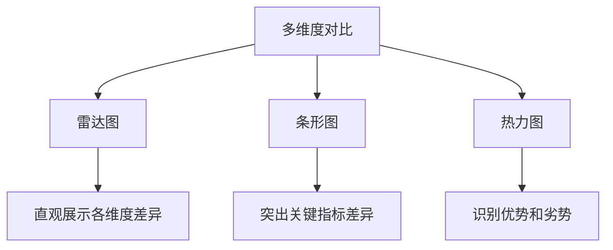

**6. 框架选型对比示例**

以下是Spring Boot、Quarkus和Jakarta EE在不同维度的对比示例：

```markdown
| 评估维度 | Spring Boot | Quarkus | Jakarta EE |
|---------|------------|---------|------------|
| 启动时间 | 中等 | 极快 | 较慢 |
| 内存占用 | 中等 | 低 | 高 |
| 开发效率 | 高 | 高 | 中等 |
| 社区支持 | 极强 | 中等 | 强 |
| 学习曲线 | 平缓 | 中等 | 陡峭 |
| 云原生支持 | 良好 | 优秀 | 基本 |
| 企业采用度 | 高 | 增长中 | 稳定 |
| 长期稳定性 | 高 | 中等 | 高 |
```

**7. 决策矩阵方法**

决策矩阵是一种结构化的多标准决策方法：

1. **确定评估标准**：列出所有相关的决策标准
2. **分配权重**：根据重要性为每个标准分配权重
3. **评分**：对每个方案在每个标准上进行评分
4. **计算加权得分**：计算每个方案的总加权得分
5. **排序和分析**：根据得分排序并分析结果

**8. 敏感性分析**

敏感性分析可以测试权重变化对最终决策的影响：

- 调整关键维度的权重
- 观察排名变化
- 识别决策的稳健性
- 确定关键决策因素

### 团队技能与学习曲线考量

技术选型必须考虑团队的现有技能和学习能力，这直接影响项目的实施效率和风险。

**1. 团队技能评估方法**

- **技能矩阵**：映射团队成员与技术技能的关系
- **技能深度评估**：评估团队在相关技术上的专业程度
- **技能差距分析**：识别需求与现有技能之间的差距
- **学习能力评估**：评估团队的技术学习速度和适应性

**2. 技能矩阵示例**

```markdown
| 团队成员 | Java核心 | Spring | Hibernate | React | Docker | Kubernetes |
|---------|---------|--------|-----------|-------|--------|------------|
| 张三 | 专家 | 专家 | 高级 | 初级 | 中级 | 初级 |
| 李四 | 高级 | 高级 | 中级 | 高级 | 初级 | 无经验 |
| 王五 | 中级 | 初级 | 初级 | 专家 | 高级 | 中级 |
| 赵六 | 高级 | 中级 | 高级 | 中级 | 中级 | 初级 |

技能等级：无经验 < 初级 < 中级 < 高级 < 专家
```

**3. 学习曲线分析**

- **学习曲线陡峭度**：掌握技术所需的时间和努力
- **知识迁移性**：现有知识对学习新技术的帮助程度
- **学习资源可获得性**：培训、文档和社区支持
- **实践机会**：在项目中应用和巩固新技能的机会

**4. 学习曲线对比示例**

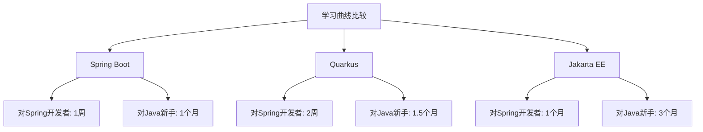

**5. 技能发展策略**

- **培训计划**：制定针对性的技术培训
- **导师制**：安排有经验的开发者指导新手
- **渐进式采用**：分阶段引入新技术
- **技术社区**：建立内部技术社区促进知识共享
- **实践项目**：通过小型项目积累实战经验

**6. 技能风险缓解措施**

- **核心团队**：组建掌握关键技术的核心团队
- **外部专家**：聘请外部专家提供指导
- **技术支持**：购买商业技术支持服务
- **备选方案**：准备技术替代方案
- **知识文档**：建立详细的技术文档和知识库

**7. 团队技能与技术选择的平衡**

在技术选型中需要平衡理想的技术方案与团队实际能力：

```markdown
决策矩阵：技术理想度vs团队适应性

| 情况 | 技术理想度 | 团队适应性 | 决策建议 |
|------|----------|-----------|---------|
| 最佳情况 | 高 | 高 | 直接采用 |
| 学习投资 | 高 | 低 | 投资培训，渐进采用 |
| 实用妥协 | 低 | 高 | 短期采用，长期规划替代 |
| 避免采用 | 低 | 低 | 寻找替代方案 |
```

### 最终决策与风险管理

技术选型的最终决策需要综合考虑各种因素，并制定相应的风险管理策略。

**1. 决策流程**

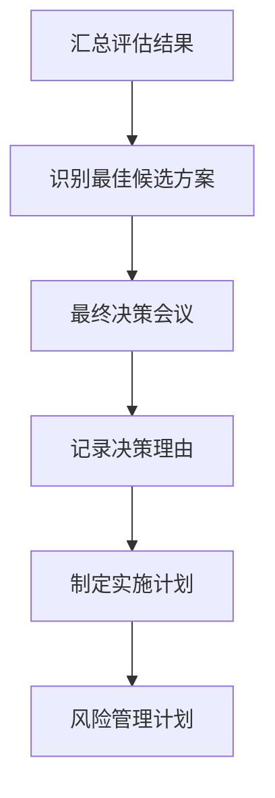

**2. 决策参与者**

- **技术负责人**：提供技术评估和建议
- **项目经理**：考虑进度和资源影响
- **架构师**：评估架构适配性
- **开发团队代表**：提供实施视角
- **业务代表**：确保业务需求满足
- **运维代表**：考虑部署和运维因素

**3. 决策文档模板**

```markdown
# 技术选型决策文档

## 1. 决策概述
- 选定技术：[技术名称]
- 决策日期：[日期]
- 决策参与者：[名单]

## 2. 决策背景
- 项目需求概述
- 技术选型目标
- 考虑的备选方案

## 3. 评估过程
- 评估方法概述
- 关键评估维度
- POC结果摘要

## 4. 决策理由
- 选定方案的优势
- 与其他方案的对比
- 关键决策因素

## 5. 风险与缓解措施
- 已识别风险
- 风险缓解策略
- 监控指标

## 6. 实施计划
- 技术采用路线图
- 培训需求
- 里程碑和时间表

## 7. 附录
- 详细评估数据
- POC报告链接
- 参考资料
```

**4. 风险识别与分类**

- **技术风险**：技术成熟度、性能问题、安全漏洞
- **实施风险**：团队技能、学习曲线、集成复杂性
- **业务风险**：需求变更、业务中断、合规问题
- **供应商风险**：支持中断、版本变更、商业模式变化

**5. 风险评估矩阵**

```markdown
| 风险 | 概率 | 影响 | 风险等级 | 缓解措施 | 责任人 |
|------|------|------|---------|---------|-------|
| 性能不满足需求 | 中 | 高 | 高 | 提前进行负载测试，预留性能优化时间 | 架构师 |
| 团队学习曲线陡峭 | 高 | 中 | 高 | 提前培训，引入外部专家 | 技术负责人 |
| 与遗留系统集成困难 | 中 | 高 | 高 | 详细设计集成方案，准备备选方案 | 集成负责人 |
| 依赖库安全漏洞 | 低 | 高 | 中 | 定期安全扫描，快速响应机制 | 安全负责人 |
| 供应商支持不足 | 低 | 中 | 低 | 建立内部专业知识，考虑商业支持 | 项目经理 |
```

**6. 风险缓解策略**

- **避免**：选择规避特定风险的替代方案
- **转移**：通过合同或保险转移风险
- **减轻**：采取措施降低风险概率或影响
- **接受**：对低影响风险制定应急计划
- **监控**：持续跟踪风险指标

**7. 决策后评审**

- **短期评审**：实施初期检查决策有效性
- **中期评审**：项目中期评估技术表现
- **长期评审**：项目完成后的经验总结
- **持续改进**：将经验应用于未来决策

## 实用技术选型工具

### 技术雷达(Technology Radar)构建

技术雷达是一种可视化工具，用于跟踪技术趋势和评估技术在组织中的适用性。

**1. 技术雷达的结构**

- **象限(Quadrants)**：将技术分为不同类别
  - 工具(Tools)：开发和运维工具
  - 平台(Platforms)：提供服务的技术平台
  - 技术(Techniques)：方法和实践
  - 语言和框架(Languages & Frameworks)：编程语言和框架

- **环(Rings)**：表示技术的采用阶段
  - 采用(Adopt)：推荐使用的成熟技术
  - 试验(Trial)：值得在项目中尝试的技术
  - 评估(Assess)：值得探索的新兴技术
  - 暂缓(Hold)：不推荐使用或需谨慎使用的技术

**2. 构建技术雷达的步骤**

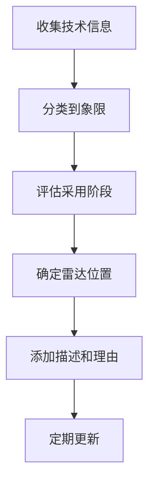

**3. Java技术雷达示例**

```markdown
Java技术雷达(2023年)

采用(Adopt):
- Spring Boot
- Hibernate/JPA
- JUnit 5
- Gradle/Maven
- Docker

试验(Trial):
- Quarkus
- Kotlin for Java projects
- Micronaut
- Testcontainers
- Kubernetes

评估(Assess):
- GraalVM Native Image
- Helidon
- Project Loom (Virtual Threads)
- GraphQL Java
- Reactive programming with Project Reactor

暂缓(Hold):
- JSF
- SOAP Web Services
- XML配置(转向注解或Java配置)
- Ant
- Monolithic applications
```

**4. 技术雷达可视化**

技术雷达通常以圆形图表呈现，技术项目放置在相应的象限和环中：

```
                    工具
                     |
                     |
           暂缓      评估      试验      采用
            |        |         |        |
            v        v         v        v
            o        o         o        o
           o o      o o       o o      o o
          o   o    o   o     o   o    o   o
         o     o  o     o   o     o  o     o
        o-------o-------o---o-----o--------o
       /                                    \
      /                                      \
     /                                        \
    o-------o-------o---o-----o--------o-------o
   /        |        |         |        |        \
  /         |        |         |        |         \
 /          v        v         v        v          \
平台        o        o         o        o         语言和框架
           o o      o o       o o      o o
          o   o    o   o     o   o    o   o
         o     o  o     o   o     o  o     o
        o-------o-------o---o-----o--------o
       /                                    \
      /                                      \
     /                                        \
    o-------o-------o---o-----o--------o-------o
            |        |         |        |
            v        v         v        v
            o        o         o        o
           o o      o o       o o      o o
          o   o    o   o     o   o    o   o
         o     o  o     o   o     o  o     o
                     |
                     |
                    技术
```

**5. 技术雷达的应用**

- **技术战略规划**：指导组织的技术发展方向
- **项目技术选型**：为具体项目提供技术选择指南
- **技术投资决策**：确定值得投入学习和采用的技术
- **技术风险管理**：识别需要淘汰或谨慎使用的技术
- **团队技能规划**：指导团队技能发展方向

**6. 定制化技术雷达**

组织可以根据自身需求定制技术雷达：

- **调整象限**：根据技术分类需求调整
- **修改环定义**：根据组织技术采用流程调整
- **添加评估维度**：如成熟度、风险、投资回报率
- **集成决策流程**：与组织的技术治理流程集成

**7. 技术雷达工具**

- **ThoughtWorks技术雷达**：行业参考标准
- **开源工具**：如Zalando的技术雷达
- **自定义实现**：使用D3.js等可视化库
- **简化版本**：使用电子表格或看板工具

### 决策矩阵(Decision Matrix)应用

决策矩阵是一种结构化的多标准决策工具，特别适合技术选型这类复杂决策。

**1. 决策矩阵基本结构**

```markdown
| 评估标准 | 权重 | 选项A评分 | 选项A加权分 | 选项B评分 | 选项B加权分 | 选项C评分 | 选项C加权分 |
|---------|------|----------|------------|----------|------------|----------|------------|
| 标准1   | 30%  | 4        | 1.2        | 5        | 1.5        | 3        | 0.9        |
| 标准2   | 25%  | 5        | 1.25       | 3        | 0.75       | 4        | 1.0        |
| 标准3   | 20%  | 3        | 0.6        | 4        | 0.8        | 5        | 1.0        |
| 标准4   | 15%  | 4        | 0.6        | 3        | 0.45       | 3        | 0.45       |
| 标准5   | 10%  | 5        | 0.5        | 4        | 0.4        | 2        | 0.2        |
| 总计    | 100% |          | 4.15       |          | 3.9        |          | 3.55       |
```

**2. 创建决策矩阵的步骤**

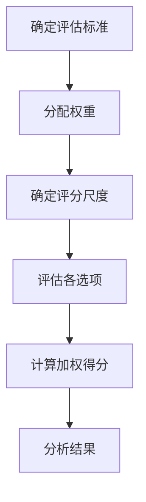

**3. 评估标准选择**

有效的评估标准应该：
- 相互独立，避免重叠
- 可测量或可比较
- 与决策目标相关
- 覆盖所有关键考虑因素

**4. 权重分配方法**

- **直接分配**：基于经验直接分配百分比
- **层次分析法(AHP)**：通过两两比较确定权重
- **Delphi方法**：通过专家意见达成共识
- **100点分配法**：在所有标准中分配100点

**5. 评分尺度设计**

- **线性尺度**：1-5分或1-10分
- **非线性尺度**：如对数尺度，适合差异巨大的情况
- **定性转定量**：将定性评价转为数值（如：差=1，良=3，优=5）
- **相对评分**：相对于基准选项的评分

**6. Java框架选型决策矩阵示例**

```markdown
| 评估标准 | 权重 | Spring Boot | 加权分 | Quarkus | 加权分 | Micronaut | 加权分 |
|---------|------|------------|-------|---------|-------|-----------|-------|
| 性能 | 20% | 4 | 0.8 | 5 | 1.0 | 5 | 1.0 |
| 开发效率 | 25% | 5 | 1.25 | 4 | 1.0 | 4 | 1.0 |
| 社区支持 | 20% | 5 | 1.0 | 3 | 0.6 | 3 | 0.6 |
| 学习曲线 | 15% | 5 | 0.75 | 3 | 0.45 | 3 | 0.45 |
| 云原生支持 | 10% | 4 | 0.4 | 5 | 0.5 | 5 | 0.5 |
| 成熟度 | 10% | 5 | 0.5 | 3 | 0.3 | 3 | 0.3 |
| 总计 | 100% |  | 4.7 |  | 3.85 |  | 3.85 |

评分标准：1=很差，2=差，3=一般，4=好，5=很好
```

**7. 决策矩阵的优化**

- **敏感性分析**：测试权重变化对结果的影响
- **多人评分**：汇总多位专家的评分
- **分层决策矩阵**：对复杂标准进行分解
- **定性评论**：补充数值评分的定性分析

**8. 决策矩阵的局限性**

- 可能过度简化复杂问题
- 权重分配存在主观性
- 难以捕捉标准间的相互作用
- 可能忽略难以量化的因素

### SWOT分析在技术选型中的应用

SWOT分析(优势、劣势、机会、威胁)是一种战略规划工具，可以有效应用于技术选型决策。

**1. SWOT分析框架**

- **优势(Strengths)**：技术方案的内部优点
- **劣势(Weaknesses)**：技术方案的内部缺点
- **机会(Opportunities)**：外部环境提供的有利因素
- **威胁(Threats)**：外部环境带来的不利因素

**2. SWOT分析矩阵模板**

```markdown
# [技术名称] SWOT分析

## 优势(Strengths)
- 优势1
- 优势2
- 优势3

## 劣势(Weaknesses)
- 劣势1
- 劣势2
- 劣势3

## 机会(Opportunities)
- 机会1
- 机会2
- 机会3

## 威胁(Threats)
- 威胁1
- 威胁2
- 威胁3

## 策略分析
- SO策略(利用优势抓住机会)
- WO策略(克服劣势抓住机会)
- ST策略(利用优势应对威胁)
- WT策略(克服劣势避免威胁)
```

**3. Spring Boot SWOT分析示例**

```markdown
# Spring Boot SWOT分析

## 优势(Strengths)
- 强大的自动配置能力，减少样板代码
- 庞大的社区支持和丰富的文档
- 与Spring生态系统无缝集成
- 成熟稳定，广泛应用于生产环境
- 优秀的开发工具支持

## 劣势(Weaknesses)
- 启动时间相对较长
- 内存占用较高
- 对云原生环境的支持需要额外配置
- 依赖注入容器增加了运行时开销
- 配置过多可能导致"魔法"难以调试

## 机会(Opportunities)
- 微服务架构的广泛采用
- 云平台的普及提供了部署便利
- 容器技术的成熟简化了部署
- 企业对快速开发的需求增长
- Spring Native提供了原生编译能力

## 威胁(Threats)
- Quarkus等新兴框架在性能上的竞争
- 云原生技术对轻量级框架的偏好
- Serverless架构对冷启动时间的要求
- Kotlin等新语言可能影响Java生态
- 技术栈多样化导致专注度分散

## 策略分析
- SO策略：利用成熟生态和工具支持，快速开发微服务应用
- WO策略：采用Spring Native减少启动时间和内存占用
- ST策略：强调稳定性和生态优势，应对新兴框架挑战
- WT策略：关注性能优化，减少资源消耗，适应云原生环境
```

**4. SWOT分析在技术选型中的应用**

- **比较多个技术方案**：为每个候选方案创建SWOT分析
- **识别关键决策因素**：通过SWOT突出最重要的考虑因素
- **制定风险缓解策略**：基于威胁和劣势设计缓解措施
- **发现竞争优势**：识别技术方案的独特优势
- **预测长期发展**：评估技术在未来环境中的适应性

**5. SWOT分析的扩展应用**

- **加权SWOT**：为各项因素分配权重
- **定量SWOT**：为各项因素评分
- **动态SWOT**：考虑时间维度的变化
- **场景SWOT**：在不同业务场景下进行分析

**6. SWOT分析的局限性**

- 可能过于简化复杂问题
- 难以量化比较不同方案
- 容易受主观判断影响
- 静态分析，难以反映动态变化

### 专家评审与Delphi方法

在技术选型中，利用集体智慧和专家经验可以提高决策质量。专家评审和Delphi方法是两种常用的结构化专家意见收集方法。

**1. 专家评审(Expert Review)流程**

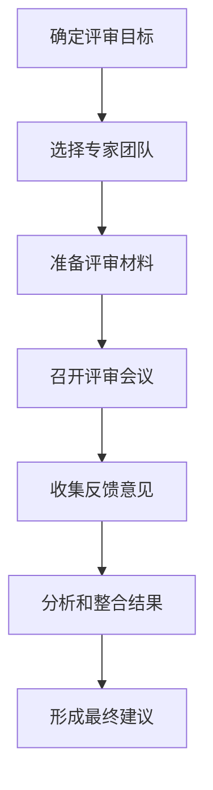

**2. 专家评审的类型**

- **技术可行性评审**：评估技术方案的可行性
- **架构评审**：评估技术架构设计
- **风险评审**：识别和评估技术风险
- **最佳实践评审**：基于经验提供最佳实践建议
- **供应商评审**：评估技术供应商

**3. 专家评审会议结构**

- **介绍阶段**：说明评审目标和背景
- **方案展示**：详细介绍技术方案
- **问答环节**：专家提问和讨论
- **评估环节**：专家提供评估意见
- **总结阶段**：归纳关键发现和建议

**4. Delphi方法概述**

Delphi方法是一种结构化的专家意见收集技术，通过多轮匿名反馈达成共识：

- **匿名性**：专家意见保持匿名，避免从众效应
- **迭代过程**：多轮收集和反馈
- **受控反馈**：每轮提供前一轮的汇总结果
- **统计汇总**：量化专家意见的集中趋势

**5. Delphi方法在技术选型中的应用步骤**

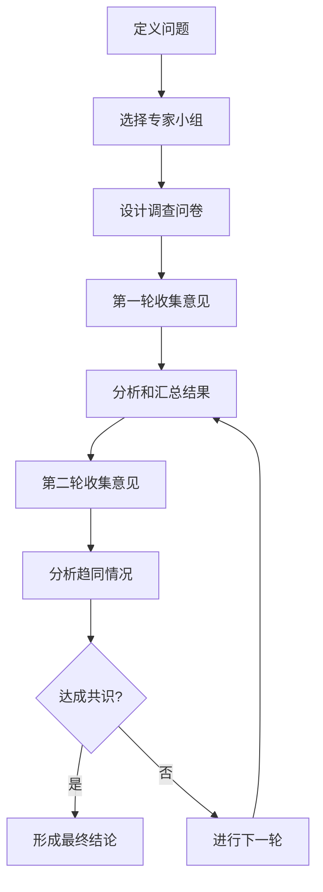

**6. Delphi问卷设计示例**

```markdown
# Java框架选型Delphi调查问卷
让我继续完成Java技术选型决策方法的内容：

### 专家评审与Delphi方法（续）

**6. Delphi问卷设计示例**

```markdown
# Java框架选型Delphi调查问卷（第1轮）

请根据您的专业经验，对以下问题进行评分和评论。
所有回答将保持匿名，并在下一轮中与其他专家意见一起汇总反馈。

## 第一部分：框架评分

对以下Java框架在各维度上进行评分(1-5分，5分最高)：

1. Spring Boot
   - 性能: [   ]
   - 开发效率: [   ]
   - 学习曲线: [   ]
   - 社区支持: [   ]
   - 长期可维护性: [   ]
   - 总体评价: [   ]
   - 评论: ___________________________

2. Quarkus
   (同样的评分项)

3. Micronaut
   (同样的评分项)

## 第二部分：开放性问题

1. 您认为哪个框架最适合本项目？为什么？
   ___________________________

2. 您对所选框架有哪些顾虑？如何缓解？
   ___________________________

3. 未来2-3年，您认为这些框架的发展趋势如何？
   ___________________________
```

**7. Delphi结果分析示例**

```markdown
# Java框架选型Delphi调查结果（第1轮）

参与专家：8人
回答率：100%

## 框架评分汇总（平均分）

| 评估维度 | Spring Boot | Quarkus | Micronaut |
|---------|------------|---------|-----------|
| 性能 | 3.8 | 4.6 | 4.5 |
| 开发效率 | 4.7 | 4.0 | 3.9 |
| 学习曲线 | 4.5 | 3.2 | 3.0 |
| 社区支持 | 4.9 | 3.5 | 3.2 |
| 长期可维护性 | 4.6 | 3.8 | 3.7 |
| 总体评价 | 4.5 | 4.0 | 3.7 |

## 意见分布

框架选择建议：
- Spring Boot: 5票
- Quarkus: 3票
- Micronaut: 0票

主要顾虑：
- Spring Boot: 性能和资源消耗(5人提及)
- Quarkus: 社区成熟度和学习曲线(6人提及)
- Micronaut: 社区规模和文档完整性(7人提及)

## 第2轮调查重点
1. 性能与资源消耗的重要性
2. 社区支持与长期维护的权衡
3. 团队学习曲线的影响程度
```

**8. 专家评审与Delphi方法的优势**

- **集体智慧**：汇集多位专家的知识和经验
- **减少偏见**：特别是Delphi方法可减少个人偏见
- **全面视角**：从不同角度评估技术方案
- **风险识别**：更全面地识别潜在风险
- **增强决策信心**：提高决策的可信度

**9. 应用建议**

- **选择合适的专家**：技术背景多样，经验丰富
- **明确评审范围**：聚焦关键决策点
- **结构化流程**：使用标准化的评估框架
- **避免群体思维**：鼓励独立思考和不同意见
- **结合其他方法**：与定量分析方法互补

### A/B测试在技术选型中的应用

A/B测试是一种实验方法，通过比较两个或多个版本的性能来确定最佳选择。在技术选型中，A/B测试可以提供实证数据支持决策。

**1. A/B测试基本原理**

- **并行实验**：同时运行多个技术方案
- **随机分配**：随机将请求或用户分配到不同方案
- **指标收集**：收集关键性能和用户体验指标
- **统计分析**：分析数据确定显著差异
- **决策依据**：基于实证数据做出选择

**2. 技术选型中的A/B测试类型**

- **性能A/B测试**：比较不同技术方案的性能指标
- **用户体验A/B测试**：评估技术选择对用户体验的影响
- **运维A/B测试**：比较部署和维护的复杂性
- **成本A/B测试**：评估不同方案的资源消耗和成本

**3. A/B测试设计步骤**

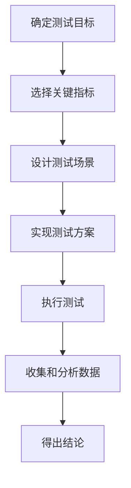

**4. 关键指标选择**

- **性能指标**：响应时间、吞吐量、资源利用率
- **可靠性指标**：错误率、故障恢复时间
- **用户体验指标**：页面加载时间、交互延迟
- **业务指标**：转化率、用户参与度
- **开发指标**：开发速度、代码质量

**5. Java框架A/B测试示例**

```java
// 性能测试代码示例
public class FrameworkPerformanceTest {
    
    private static final int TEST_DURATION_SECONDS = 300;
    private static final int CONCURRENT_USERS = 1000;
    
    public static void main(String[] args) {
        // 配置测试参数
        TestConfig config = new TestConfig()
            .withDuration(TEST_DURATION_SECONDS)
            .withConcurrentUsers(CONCURRENT_USERS)
            .withEndpoints(Arrays.asList(
                // 方案A - Spring Boot应用
                new Endpoint("spring-boot", "http://spring-app:8080/api/test"),
                // 方案B - Quarkus应用
                new Endpoint("quarkus", "http://quarkus-app:8080/api/test")
            ));
        
        // 执行测试
        TestRunner runner = new TestRunner(config);
        TestResults results = runner.run();
        
        // 分析结果
        System.out.println("=== 性能测试结果 ===");
        System.out.println("Spring Boot平均响应时间: " + 
                          results.getAvgResponseTime("spring-boot") + "ms");
        System.out.println("Quarkus平均响应时间: " + 
                          results.getAvgResponseTime("quarkus") + "ms");
        
        System.out.println("Spring Boot吞吐量: " + 
                          results.getThroughput("spring-boot") + " req/sec");
        System.out.println("Quarkus吞吐量: " + 
                          results.getThroughput("quarkus") + " req/sec");
        
        System.out.println("Spring Boot错误率: " + 
                          results.getErrorRate("spring-boot") + "%");
        System.out.println("Quarkus错误率: " + 
                          results.getErrorRate("quarkus") + "%");
        
        // 统计显著性分析
        SignificanceTest sigTest = new SignificanceTest(results);
        boolean isSignificant = sigTest.isResponseTimeDifferenceSignificant();
        System.out.println("响应时间差异是否显著: " + isSignificant);
    }
}
```

**6. A/B测试结果分析示例**

```markdown
# Java框架A/B测试结果报告

## 测试配置
- 测试持续时间: 5分钟
- 并发用户数: 1000
- 测试场景: REST API调用混合负载
- 硬件环境: AWS t3.large实例

## 性能指标对比

| 指标 | Spring Boot | Quarkus | 差异 | 显著性 |
|------|------------|---------|------|--------|
| 平均响应时间 | 145ms | 98ms | -32.4% | 是 |
| 95%响应时间 | 320ms | 210ms | -34.4% | 是 |
| 吞吐量 | 1250 req/s | 1850 req/s | +48.0% | 是 |
| CPU使用率 | 78% | 52% | -33.3% | 是 |
| 内存使用 | 1.2GB | 0.7GB | -41.7% | 是 |
| 启动时间 | 12.5s | 1.8s | -85.6% | 是 |
| 错误率 | 0.05% | 0.04% | -20.0% | 否 |

## 资源效率对比
- Spring Boot: 16.0 req/s/CPU%
- Quarkus: 35.6 req/s/CPU%
- 效率提升: 122.5%

## 结论
1. Quarkus在所有关键性能指标上显著优于Spring Boot
2. 特别是在资源效率方面，Quarkus表现出色
3. 启动时间差异巨大，对容器环境和自动扩展特别有利
4. 错误率差异不显著，两个框架都表现良好

## 建议
基于性能测试结果，推荐选择Quarkus框架，特别是考虑到项目对资源效率和启动时间的要求。
```

**7. A/B测试的最佳实践**

- **明确假设**：清晰定义测试假设和预期结果
- **控制变量**：确保只有待测技术不同，其他条件相同
- **足够样本量**：收集足够数据确保统计显著性
- **真实环境**：在接近生产的环境中进行测试
- **多维度评估**：考虑多个指标，而非单一指标
- **长期测试**：某些问题只在长期运行中显现

**8. A/B测试的局限性**

- **资源消耗**：需要实现和部署多个方案
- **时间成本**：需要足够的测试时间
- **复杂性**：测试环境搭建和数据收集复杂
- **适用范围**：不是所有技术决策都适合A/B测试
- **短期vs长期**：短期测试可能无法反映长期问题

**9. 轻量级A/B测试方法**

对于资源有限的团队，可以采用简化的A/B测试方法：

- **功能子集测试**：只测试关键功能
- **阶段性测试**：分阶段测试不同方面
- **模拟负载**：使用模拟数据和负载
- **基准测试**：使用标准化的基准测试
- **金丝雀测试**：小规模生产环境测试

## 常见技术选型案例分析

### Web框架选型：Spring MVC vs JSF vs JAX-RS

Web框架是Java应用开发的基础组件，选择合适的框架对项目成功至关重要。

**1. 框架概述**

- **Spring MVC**
  - 基于Spring框架的MVC实现
  - 注解驱动的控制器
  - 灵活的视图技术支持
  - 与Spring生态系统紧密集成

- **JSF (JavaServer Faces)**
  - Java EE标准的Web框架
  - 组件化UI开发
  - 强大的组件库支持
  - 状态管理和事件处理

- **JAX-RS (Java API for RESTful Web Services)**
  - Java EE标准的REST API框架
  - 注解驱动的资源类
  - 专注于RESTful服务
  - 多种实现(如Jersey, RESTEasy)

**2. 技术特点对比**

```markdown
| 特性 | Spring MVC | JSF | JAX-RS |
|------|------------|-----|--------|
| 编程模型 | 控制器+视图 | 组件+页面 | 资源+方法 |
| 主要用途 | Web应用+REST | 富UI Web应用 | REST API |
| 状态管理 | 无状态(可扩展) | 有状态 | 无状态 |
| 视图技术 | 多种(Thymeleaf等) | Facelets | 不适用/自定义 |
| AJAX支持 | 需额外库 | 内置 | 不适用 |
| REST支持 | 良好 | 有限 | 专注REST |
| 学习曲线 | 中等 | 陡峭 | 平缓 |
| 社区活跃度 | 非常活跃 | 中等 | 活跃 |
```

**3. 代码示例对比**

```java
// Spring MVC控制器示例
@Controller
@RequestMapping("/users")
public class UserController {
    
    @Autowired
    private UserService userService;
    
    @GetMapping
    public String listUsers(Model model) {
        model.addAttribute("users", userService.findAll());
        return "user/list";
    }
    
    @GetMapping("/{id}")
    @ResponseBody
    public User getUser(@PathVariable Long id) {
        return userService.findById(id);
    }
    
    @PostMapping
    public String createUser(@ModelAttribute User user, BindingResult result) {
        if (result.hasErrors()) {
            return "user/form";
        }
        userService.save(user);
        return "redirect:/users";
    }
}
```

```java
// JSF托管Bean示例
@ManagedBean
@ViewScoped
public class UserBean implements Serializable {
    
    @EJB
    private UserService userService;
    
    private List<User> users;
    private User selectedUser = new User();
    
    @PostConstruct
    public void init() {
        users = userService.findAll();
    }
    
    public String save() {
        userService.save(selectedUser);
        init();
        return "list?faces-redirect=true";
    }
    
    // getters and setters
}

// JSF页面示例(XHTML)
<h:form>
    <h:dataTable value="#{userBean.users}" var="user">
        <h:column>
            <f:facet name="header">ID</f:facet>
            #{user.id}
        </h:column>
        <h:column>
            <f:facet name="header">Name</f:facet>
            #{user.name}
        </h:column>
        <h:column>
            <h:commandButton value="Edit" action="#{userBean.edit(user)}" />
        </h:column>
    </h:dataTable>
</h:form>
```

```java
// JAX-RS资源示例
@Path("/users")
@Produces(MediaType.APPLICATION_JSON)
@Consumes(MediaType.APPLICATION_JSON)
public class UserResource {
    
    @Inject
    private UserService userService;
    
    @GET
    public List<User> getUsers() {
        return userService.findAll();
    }
    
    @GET
    @Path("/{id}")
    public User getUser(@PathParam("id") Long id) {
        return userService.findById(id);
    }
    
    @POST
    public Response createUser(User user) {
        userService.save(user);
        return Response.status(Response.Status.CREATED)
                      .entity(user)
                      .build();
    }
}
```

**4. 选型决策矩阵**

```markdown
| 评估维度 | 权重 | Spring MVC | JSF | JAX-RS |
|---------|------|------------|-----|--------|
| 功能完整性 | 15% | 5 | 4 | 3 |
| 性能 | 15% | 4 | 3 | 5 |
| 开发效率 | 20% | 5 | 3 | 4 |
| 学习曲线 | 10% | 4 | 2 | 5 |
| 社区支持 | 15% | 5 | 3 | 4 |
| 前端集成 | 10% | 4 | 5 | 3 |
| REST支持 | 15% | 4 | 2 | 5 |
| 加权总分 | 100% | 4.45 | 3.15 | 4.15 |

评分标准：1=很差，2=差，3=一般，4=好，5=很好
```

**5. 适用场景分析**

- **Spring MVC适合**
  - 全栈Web应用开发
  - 已使用Spring生态系统的项目
  - 需要灵活视图技术的项目
  - 同时提供Web界面和REST API

- **JSF适合**
  - 企业内部管理系统
  - 需要丰富UI组件的应用
  - 表单密集型应用
  - Java EE标准化要求高的环境

- **JAX-RS适合**
  - 纯REST API开发
  - 微服务架构
  - 前后端分离架构
  - 性能要求高的API服务

**6. 选型案例分析**

```markdown
## 项目背景
- 电子商务平台重构
- 需要提供Web界面和移动API
- 团队有Spring经验
- 性能和可扩展性要求高

## 需求分析
- 前后端分离架构
- RESTful API为主
- 管理后台需要Web界面
- 未来需扩展为微服务

## 框架评估
1. Spring MVC:
   - 优势: 团队熟悉，生态完善，灵活性高
   - 劣势: REST支持不如专用框架

2. JSF:
   - 优势: 组件丰富，适合管理后台
   - 劣势: 性能较差，不适合API开发，学习曲线陡

3. JAX-RS:
   - 优势: REST专长，性能优秀
   - 劣势: 仅适合API，不适合Web界面

## 决策
- 主系统采用Spring MVC(结合RestController)
- 考虑未来微服务拆分时逐步引入JAX-RS
- 不选择JSF，因为不适合前后端分离架构

## 风险缓解
- 加强Spring MVC的REST最佳实践培训
- 建立API设计规范确保一致性
- 性能测试验证Spring MVC的REST性能
```

### ORM框架选择：Hibernate vs MyBatis vs JOOQ

ORM(对象关系映射)框架是Java应用中数据访问层的关键组件，不同框架有各自的优势和适用场景。

**1. 框架概述**

- **Hibernate**
  - 全功能ORM框架
  - JPA规范的主要实现
  - 对象关系映射自动化
  - 丰富的查询能力(HQL/JPQL)

- **MyBatis**
  - 轻量级数据访问框架
  - SQL和Java对象映射
  - 手动控制SQL
  - 简单直观的配置

- **JOOQ**
  - 类型安全的SQL构建器
  - 代码生成与数据库模式同步
  - 流畅的API设计
  - 专注于SQL控制和类型安全

**2. 技术特点对比**

```markdown
| 特性 | Hibernate | MyBatis | JOOQ |
|------|-----------|---------|------|
| 抽象级别 | 高 | 中 | 中-低 |
| SQL控制 | 有限 | 完全 | 完全(类型安全) |
| 学习曲线 | 陡峭 | 平缓 | 中等 |
| 性能控制 | 有限 | 良好 | 优秀 |
| 代码量 | 少 | 中等 | 中等 |
| 类型安全 | 部分 | 无 | 完全 |
| 数据库移植性 | 高 | 低 | 中 |
| 复杂查询支持 | 中等 | 优秀 | 优秀 |
| 批处理性能 | 中等 | 良好 | 优秀 |
| 懒加载支持 | 内置 | 手动 | 无 |
```

**3. 代码示例对比**

```java
// Hibernate/JPA示例
@Entity
@Table(name = "users")
public class User {
    @Id
    @GeneratedValue(strategy = GenerationType.IDENTITY)
    private Long id;
    
    private String username;
    
    @Email
    private String email;
    
    @OneToMany(mappedBy = "user", cascade = CascadeType.ALL)
    private List<Order> orders = new ArrayList<>();
    
    // getters and setters
}

// 使用JPA Repository
@Repository
public interface UserRepository extends JpaRepository<User, Long> {
    List<User> findByEmailContaining(String email);
    
    @Query("SELECT u FROM User u WHERE u.username LIKE %:name% AND u.active = true")
    List<User> findActiveUsersByName(@Param("name") String name);
}

// 使用EntityManager
@Repository
public class UserRepositoryImpl {
    @PersistenceContext
    private EntityManager entityManager;
    
    public List<User> findUsersByOrderCount(int minOrders) {
        return entityManager.createQuery(
            "SELECT u FROM User u WHERE SIZE(u.orders) >= :minOrders", User.class)
            .setParameter("minOrders", minOrders)
            .getResultList();
    }
}
```

```java
// MyBatis示例
// User.java - 普通POJO
public class User {
    private Long id;
    private String username;
    private String email;
    private List<Order> orders;
    // getters and setters
}

// UserMapper.java - 接口
public interface UserMapper {
    @Select("SELECT * FROM users WHERE id = #{id}")
    User findById(@Param("id") Long id);
    
    @Select("SELECT * FROM users WHERE email LIKE #{email}")
    List<User> findByEmailContaining(@Param("email") String email);
    
    @Select("SELECT u.* FROM users u " +
            "JOIN orders o ON u.id = o.user_id " +
            "GROUP BY u.id HAVING COUNT(o.id) >= #{minOrders}")
    List<User> findUsersByOrderCount(@Param("minOrders") int minOrders);
    
    @Results({
        @Result(property = "id", column = "id"),
        @Result(property = "orders", javaType = List.class, column = "id",
                many = @Many(select = "com.example.OrderMapper.findByUserId"))
    })
    @Select("SELECT * FROM users WHERE username LIKE #{name} AND active = 1")
    List<User> findActiveUsersByName(@Param("name") String name);
}
```

```java
// JOOQ示例
// 自动生成的表和记录类
import static com.example.jooq.Tables.*;

public class UserRepository {
    private final DSLContext dsl;
    
    public UserRepository(DSLContext dsl) {
        this.dsl = dsl;
    }
    
    public UserRecord findById(Long id) {
        return dsl.selectFrom(USERS)
                  .where(USERS.ID.eq(id))
                  .fetchOne();
    }
    
    public List<UserRecord> findByEmailContaining(String email) {
        return dsl.selectFrom(USERS)
                  .where(USERS.EMAIL.like("%" + email + "%"))
                  .fetch();
    }
    
    public List<UserRecord> findUsersByOrderCount(int minOrders) {
        return dsl.selectFrom(USERS)
                  .where(
                      dsl.selectCount()
                         .from(ORDERS)
                         .where(ORDERS.USER_ID.eq(USERS.ID))
                         .ge(minOrders)
                  )
                  .fetch();
    }
    
    public List<UserRecord> findActiveUsersByName(String name) {
        return dsl.selectFrom(USERS)
                  .where(USERS.USERNAME.like("%" + name + "%"))
                  .and(USERS.ACTIVE.eq((byte)1))
                  .fetch();
    }
}
```

**4. 性能对比**

```markdown
| 操作类型 | Hibernate | MyBatis | JOOQ |
|---------|-----------|---------|------|
| 单记录查询 | 较慢 | 快 | 快 |
| 批量插入 | 慢(默认) | 快 | 很快 |
| 复杂查询 | 较慢 | 快 | 快 |
| 简单CRUD | 快 | 快 | 快 |
| 大数据集处理 | 慢 | 中等 | 快 |

注：Hibernate性能可通过适当配置和优化显著提升
```

**5. 选型决策矩阵**

```markdown
| 评估维度 | 权重 | Hibernate | MyBatis | JOOQ |
|---------|------|-----------|---------|------|
| 开发效率 | 20% | 5 | 3 | 4 |
| 性能 | 15% | 3 | 4 | 5 |
| SQL控制 | 15% | 2 | 5 | 5 |
| 学习曲线 | 10% | 2 | 4 | 3 |
| 类型安全 | 10% | 3 | 2 | 5 |
| 功能完整性 | 10% | 5 | 3 | 4 |
| 社区支持 | 10% | 5 | 4 | 3 |
| 数据库兼容性 | 10% | 5 | 3 | 4 |
| 加权总分 | 100% | 3.8 | 3.6 | 4.2 |

评分标准：1=很差，2=差，3=一般，4=好，5=很好
```

**6. 适用场景分析**

- **Hibernate适合**
  - 领域驱动设计(DDD)项目
  - 数据模型复杂且关联丰富的应用
  - 需要数据库无关性的项目
  - 快速开发原型和CRUD应用

- **MyBatis适合**
  - 需要精确控制SQL的项目
  - 与遗留数据库集成
  - 性能敏感的应用
  - 团队SQL技能强的项目

- **JOOQ适合**
  - 需要类型安全SQL的项目
  - 复杂查询和报表应用
  - 性能关键型应用
  - 喜欢流畅API的开发团队

**7. 选型案例分析**

```markdown
## 项目背景
- 金融交易系统重构
- 复杂的数据查询和报表需求
- 性能和准确性要求极高
- 团队有SQL优化经验

## 需求分析
- 精确控制SQL执行计划
- 复杂的多表关联查询
- 大数据量批处理
- 严格的事务和一致性要求

## 框架评估
1. Hibernate:
   - 优势: 开发速度快，对象映射自动化
   - 劣势: SQL控制有限，性能优化复杂

2. MyBatis:
   - 优势: 完全控制SQL，性能好
   - 劣势: 类型安全性差，代码量大

3. JOOQ:
   - 优势: 类型安全，性能优秀，API流畅
   - 劣势: 学习曲线，社区相对小

## 决策
选择JOOQ，主要考虑因素:
- 类型安全减少运行时错误
- 性能优势适合金融交易系统
- SQL控制能力满足复杂查询需求
- 代码生成减轻手写SQL负担

## 风险缓解
- 提前培训团队JOOQ技能
- 建立性能基准测试验证决策
- 保留少量MyBatis用于特殊SQL场景
- 建立详细的JOOQ最佳实践文档
```

### 微服务框架：Spring Boot vs Quarkus vs Helidon

微
让我继续完成Java技术选型决策方法的内容：

### 微服务框架：Spring Boot vs Quarkus vs Helidon

微服务架构已成为企业应用开发的主流模式，选择合适的微服务框架对项目成功至关重要。

**1. 框架概述**

- **Spring Boot**
  - Spring生态系统的微服务框架
  - 约定优于配置的设计理念
  - 丰富的starter简化依赖管理
  - 强大的自动配置能力

- **Quarkus**
  - Red Hat开发的云原生Java框架
  - 专为GraalVM和容器优化
  - 极低的内存占用和启动时间
  - 响应式和命令式编程模型支持

- **Helidon**
  - Oracle开发的微服务框架
  - 提供MicroProfile和Reactive两种风格
  - 轻量级设计
  - 无需应用服务器

**2. 技术特点对比**

```markdown
| 特性 | Spring Boot | Quarkus | Helidon |
|------|------------|---------|---------|
| 启动时间 | 秒级 | 毫秒级 | 秒级 |
| 内存占用 | 较高 | 非常低 | 低 |
| 开发体验 | 优秀 | 良好 | 良好 |
| 热重载 | 支持 | 优秀 | 支持 |
| 原生镜像 | 支持(Spring Native) | 一流支持 | 支持 |
| 社区规模 | 非常大 | 中等 | 小 |
| 生态系统 | 非常丰富 | 增长中 | 有限 |
| 学习曲线 | 中等 | 中等 | 平缓 |
| 云原生支持 | 良好 | 优秀 | 良好 |
| 响应式支持 | Spring WebFlux | Mutiny | Helidon Reactive |
```

**3. 性能指标对比**

```markdown
| 指标 | Spring Boot | Quarkus | Helidon |
|------|------------|---------|---------|
| JVM模式启动时间 | ~2.5秒 | ~0.8秒 | ~1.2秒 |
| 原生镜像启动时间 | ~0.15秒 | ~0.02秒 | ~0.05秒 |
| JVM模式内存占用 | ~140MB | ~70MB | ~80MB |
| 原生镜像内存占用 | ~70MB | ~20MB | ~30MB |
| REST吞吐量(JVM) | 15,000 req/s | 22,000 req/s | 18,000 req/s |
| REST吞吐量(原生) | 18,000 req/s | 28,000 req/s | 22,000 req/s |

注：数据基于典型Hello World微服务，实际性能因应用复杂度和配置而异
```

**4. 代码示例对比**

```java
// Spring Boot示例
@SpringBootApplication
public class SpringBootApp {
    public static void main(String[] args) {
        SpringApplication.run(SpringBootApp.class, args);
    }
}

@RestController
@RequestMapping("/api/users")
public class UserController {
    @Autowired
    private UserService userService;
    
    @GetMapping("/{id}")
    public User getUser(@PathVariable Long id) {
        return userService.findById(id);
    }
    
    @PostMapping
    @ResponseStatus(HttpStatus.CREATED)
    public User createUser(@RequestBody User user) {
        return userService.save(user);
    }
}
```

```java
// Quarkus示例
@QuarkusMain
public class QuarkusApp {
    public static void main(String[] args) {
        Quarkus.run(args);
    }
}

@Path("/api/users")
@Produces(MediaType.APPLICATION_JSON)
@Consumes(MediaType.APPLICATION_JSON)
public class UserResource {
    @Inject
    UserService userService;
    
    @GET
    @Path("/{id}")
    public User getUser(@PathParam("id") Long id) {
        return userService.findById(id);
    }
    
    @POST
    @Transactional
    public Response createUser(User user) {
        userService.save(user);
        return Response.status(Status.CREATED).entity(user).build();
    }
}
```

```java
// Helidon SE示例
public class HelidonApp {
    public static void main(String[] args) {
        WebServer server = WebServer
            .create(Routing.builder()
                .register("/api/users", new UserService())
                .build())
            .start()
            .await();
    }
}

public class UserService implements Service {
    private final UserRepository userRepository = new UserRepository();
    
    @Override
    public void update(Routing.Rules rules) {
        rules.get("/{id}", this::getUser)
             .post("/", this::createUser);
    }
    
    private void getUser(ServerRequest request, ServerResponse response) {
        Long id = Long.parseLong(request.path().param("id"));
        User user = userRepository.findById(id);
        response.send(user);
    }
    
    private void createUser(ServerRequest request, ServerResponse response) {
        request.content().as(User.class)
            .thenAccept(user -> {
                userRepository.save(user);
                response.status(Http.Status.CREATED_201).send(user);
            });
    }
}
```

**5. 选型决策矩阵**

```markdown
| 评估维度 | 权重 | Spring Boot | Quarkus | Helidon |
|---------|------|------------|---------|---------|
| 性能 | 20% | 3 | 5 | 4 |
| 开发效率 | 20% | 5 | 4 | 3 |
| 社区支持 | 15% | 5 | 3 | 2 |
| 云原生适配 | 15% | 4 | 5 | 4 |
| 学习曲线 | 10% | 4 | 3 | 4 |
| 生态系统 | 10% | 5 | 3 | 2 |
| 长期支持 | 10% | 5 | 4 | 3 |
| 加权总分 | 100% | 4.35 | 4.0 | 3.25 |

评分标准：1=很差，2=差，3=一般，4=好，5=很好
```

**6. 适用场景分析**

- **Spring Boot适合**
  - 企业级大型微服务系统
  - 需要丰富生态系统支持的项目
  - 团队已熟悉Spring技术栈
  - 开发速度优先于极致性能的场景

- **Quarkus适合**
  - Kubernetes/OpenShift部署环境
  - Serverless和FaaS应用场景
  - 对启动时间和资源消耗敏感的项目
  - 需要GraalVM原生镜像支持的场景

- **Helidon适合**
  - 轻量级微服务需求
  - Oracle云环境部署
  - MicroProfile规范的严格遵循者
  - 简单直接的微服务实现

**7. 选型案例分析**

```markdown
## 项目背景
- 大型零售企业的微服务改造
- 需要部署在Kubernetes环境
- 预期高峰期大量弹性伸缩
- 团队有Spring经验但愿意学习新技术

## 需求分析
- 快速启动时间(支持弹性伸缩)
- 低资源消耗(降低云成本)
- 高吞吐量API服务
- 与现有系统集成

## 框架评估
1. Spring Boot:
   - 优势: 团队熟悉，生态丰富，开发速度快
   - 劣势: 启动时间长，资源消耗较高

2. Quarkus:
   - 优势: 极快启动时间，低内存占用，原生镜像支持
   - 劣势: 团队需要学习，生态相对较小

3. Helidon:
   - 优势: 轻量级，启动较快
   - 劣势: 社区小，工具支持有限

## 决策
选择Quarkus，主要考虑因素:
- 弹性伸缩需求对启动时间敏感
- 资源效率直接影响云成本
- 原生镜像支持提供额外性能优势
- 与Spring Boot概念相似，学习曲线可接受

## 风险缓解
- 安排Quarkus培训加速团队适应
- 先从非关键微服务开始迁移
- 建立性能基准确保满足需求
- 保持与Spring Boot的兼容性设计
```

### 消息中间件：Kafka vs RabbitMQ vs ActiveMQ

消息中间件是分布式系统和微服务架构中的关键组件，用于实现可靠的异步通信和事件驱动架构。

**1. 中间件概述**

- **Apache Kafka**
  - 分布式流处理平台
  - 高吞吐量、持久化日志设计
  - 主题和分区模型
  - 适合大数据量和流处理

- **RabbitMQ**
  - 实现AMQP协议的消息代理
  - 灵活的路由机制
  - 多种交换类型
  - 适合复杂路由需求

- **ActiveMQ**
  - 实现JMS规范的消息中间件
  - 支持多种协议(AMQP, MQTT, STOMP等)
  - 传统企业消息队列
  - ActiveMQ Artemis提供新一代架构

**2. 技术特点对比**

```markdown
| 特性 | Kafka | RabbitMQ | ActiveMQ |
|------|-------|----------|----------|
| 消息模型 | 发布/订阅(日志) | 交换器/队列/绑定 | 点对点和发布/订阅 |
| 吞吐量 | 极高 | 中等 | 中等 |
| 消息保留 | 可配置保留期 | 消费即删除 | 消费即删除 |
| 消息顺序 | 分区内保证 | 单队列保证 | 单队列保证 |
| 消息路由 | 简单(基于主题) | 复杂(多种交换器) | 中等(选择器) |
| 消息优先级 | 不支持 | 支持 | 支持 |
| 事务支持 | 有限 | 支持 | 完全支持 |
| 延迟消息 | 需自行实现 | 插件支持 | 支持 |
| 集群扩展性 | 极佳 | 良好 | 中等 |
| 管理界面 | 第三方工具 | 内置优秀UI | 内置UI |
```

**3. 性能对比**

```markdown
| 指标 | Kafka | RabbitMQ | ActiveMQ |
|------|-------|----------|----------|
| 生产吞吐量 | 100K+/秒/分区 | 20K+/秒/队列 | 10K+/秒/队列 |
| 消费吞吐量 | 100K+/秒/分区 | 20K+/秒/队列 | 10K+/秒/队列 |
| 延迟 | 毫秒级 | 微秒级 | 毫秒级 |
| 单机扩展性 | 高(分区) | 中(队列) | 中(队列) |
| 集群扩展性 | 线性扩展 | 镜像队列开销 | 主从架构 |

注：实际性能取决于硬件、网络、消息大小和配置
```

**4. Java客户端代码示例**

```java
// Kafka生产者示例
public class KafkaProducerExample {
    public static void main(String[] args) {
        Properties props = new Properties();
        props.put("bootstrap.servers", "localhost:9092");
        props.put("key.serializer", "org.apache.kafka.common.serialization.StringSerializer");
        props.put("value.serializer", "org.apache.kafka.common.serialization.StringSerializer");
        
        Producer<String, String> producer = new KafkaProducer<>(props);
        
        for (int i = 0; i < 100; i++) {
            producer.send(new ProducerRecord<>("my-topic", 
                                              "key-" + i, 
                                              "value-" + i), 
                         (metadata, exception) -> {
                             if (exception != null) {
                                 exception.printStackTrace();
                             } else {
                                 System.out.println("Sent message: " + metadata.offset());
                             }
                         });
        }
        
        producer.close();
    }
}

// Kafka消费者示例
public class KafkaConsumerExample {
    public static void main(String[] args) {
        Properties props = new Properties();
        props.put("bootstrap.servers", "localhost:9092");
        props.put("group.id", "test-group");
        props.put("key.deserializer", "org.apache.kafka.common.serialization.StringDeserializer");
        props.put("value.deserializer", "org.apache.kafka.common.serialization.StringDeserializer");
        
        Consumer<String, String> consumer = new KafkaConsumer<>(props);
        consumer.subscribe(Arrays.asList("my-topic"));
        
        while (true) {
            ConsumerRecords<String, String> records = consumer.poll(Duration.ofMillis(100));
            for (ConsumerRecord<String, String> record : records) {
                System.out.printf("offset = %d, key = %s, value = %s%n", 
                                 record.offset(), record.key(), record.value());
            }
        }
    }
}
```

```java
// RabbitMQ生产者示例
public class RabbitMQProducerExample {
    private final static String QUEUE_NAME = "my-queue";
    
    public static void main(String[] args) throws Exception {
        ConnectionFactory factory = new ConnectionFactory();
        factory.setHost("localhost");
        
        try (Connection connection = factory.newConnection();
             Channel channel = connection.createChannel()) {
            
            channel.queueDeclare(QUEUE_NAME, false, false, false, null);
            
            for (int i = 0; i < 100; i++) {
                String message = "Message " + i;
                channel.basicPublish("", QUEUE_NAME, null, message.getBytes());
                System.out.println("Sent: " + message);
            }
        }
    }
}

// RabbitMQ消费者示例
public class RabbitMQConsumerExample {
    private final static String QUEUE_NAME = "my-queue";
    
    public static void main(String[] args) throws Exception {
        ConnectionFactory factory = new ConnectionFactory();
        factory.setHost("localhost");
        
        Connection connection = factory.newConnection();
        Channel channel = connection.createChannel();
        
        channel.queueDeclare(QUEUE_NAME, false, false, false, null);
        
        DeliverCallback deliverCallback = (consumerTag, delivery) -> {
            String message = new String(delivery.getBody(), "UTF-8");
            System.out.println("Received: " + message);
        };
        
        channel.basicConsume(QUEUE_NAME, true, deliverCallback, consumerTag -> { });
    }
}
```

```java
// ActiveMQ生产者示例
public class ActiveMQProducerExample {
    public static void main(String[] args) throws Exception {
        ActiveMQConnectionFactory connectionFactory = new ActiveMQConnectionFactory("tcp://localhost:61616");
        
        Connection connection = connectionFactory.createConnection();
        connection.start();
        
        Session session = connection.createSession(false, Session.AUTO_ACKNOWLEDGE);
        Destination destination = session.createQueue("my-queue");
        
        MessageProducer producer = session.createProducer(destination);
        producer.setDeliveryMode(DeliveryMode.NON_PERSISTENT);
        
        for (int i = 0; i < 100; i++) {
            TextMessage message = session.createTextMessage("Message " + i);
            producer.send(message);
            System.out.println("Sent: " + message.getText());
        }
        
        session.close();
        connection.close();
    }
}

// ActiveMQ消费者示例
public class ActiveMQConsumerExample {
    public static void main(String[] args) throws Exception {
        ActiveMQConnectionFactory connectionFactory = new ActiveMQConnectionFactory("tcp://localhost:61616");
        
        Connection connection = connectionFactory.createConnection();
        connection.start();
        
        Session session = connection.createSession(false, Session.AUTO_ACKNOWLEDGE);
        Destination destination = session.createQueue("my-queue");
        
        MessageConsumer consumer = session.createConsumer(destination);
        
        consumer.setMessageListener(message -> {
            if (message instanceof TextMessage) {
                try {
                    String text = ((TextMessage) message).getText();
                    System.out.println("Received: " + text);
                } catch (JMSException e) {
                    e.printStackTrace();
                }
            }
        });
        
        // 保持连接
        Thread.sleep(Long.MAX_VALUE);
        
        session.close();
        connection.close();
    }
}
```

**5. 选型决策矩阵**

```markdown
| 评估维度 | 权重 | Kafka | RabbitMQ | ActiveMQ |
|---------|------|-------|----------|----------|
| 吞吐量 | 20% | 5 | 3 | 2 |
| 可靠性 | 15% | 4 | 5 | 4 |
| 功能多样性 | 15% | 3 | 5 | 4 |
| 延迟 | 10% | 3 | 5 | 4 |
| 运维复杂度 | 10% | 4 | 5 | 3 |
| 社区活跃度 | 10% | 5 | 4 | 3 |
| 生态系统 | 10% | 5 | 4 | 3 |
| 学习曲线 | 10% | 3 | 4 | 5 |
| 加权总分 | 100% | 4.05 | 4.35 | 3.45 |

评分标准：1=很差，2=差，3=一般，4=好，5=很好
```

**6. 适用场景分析**

- **Kafka适合**
  - 高吞吐量数据流处理
  - 日志收集和分析
  - 事件溯源架构
  - 需要消息持久化和重放
  - 大数据集成场景

- **RabbitMQ适合**
  - 复杂路由需求
  - 需要低延迟的场景
  - 传统消息队列模式
  - 需要丰富消息特性(优先级、TTL等)
  - 中小规模部署

- **ActiveMQ适合**
  - JMS标准兼容需求
  - 企业集成模式
  - 多协议支持需求
  - 传统Java EE应用
  - 简单部署和管理需求

**7. 选型案例分析**

```markdown
## 项目背景
- 电子商务平台订单处理系统
- 需要处理订单、库存、支付等多种消息
- 峰值每秒数千订单
- 需要可靠的消息传递和复杂路由

## 需求分析
- 消息必须可靠传递(不丢失)
- 需要支持多种消息路由模式
- 需要消息优先级支持
- 管理界面监控消息流
- 与现有Java系统集成

## 中间件评估
1. Kafka:
   - 优势: 高吞吐量，持久化，分区扩展
   - 劣势: 路由能力有限，无优先级支持

2. RabbitMQ:
   - 优势: 灵活路由，优先级支持，管理UI
   - 劣势: 吞吐量相对较低

3. ActiveMQ:
   - 优势: JMS兼容，简单部署
   - 劣势: 扩展性有限，性能较低

## 决策
选择RabbitMQ，主要考虑因素:
- 复杂路由需求(交换器类型多样)
- 消息优先级支持(紧急订单处理)
- 管理界面便于监控和故障排查
- 吞吐量足以满足当前和可预见的未来需求

## 风险缓解
- 进行负载测试验证峰值处理能力
- 配置集群提高可用性
- 实现消息持久化确保可靠性
- 监控系统及时发现性能瓶颈
```

### 缓存技术：Redis vs Hazelcast vs Ehcache

缓存是提升应用性能的关键技术，选择合适的缓存解决方案对系统性能和可扩展性有重大影响。

**1. 缓存技术概述**

- **Redis**
  - 开源内存数据结构存储
  - 支持多种数据类型
  - 主从复制和集群模式
  - 持久化和事务支持

- **Hazelcast**
  - 开源内存数据网格
  - 分布式数据结构和计算
  - Java原生集成
  - 弹性伸缩和容错

- **Ehcache**
  - Java原生缓存框架
  - 轻量级设计
  - 多级缓存支持
  - 与Hibernate等ORM集成

**2. 技术特点对比**

```markdown
| 特性 | Redis | Hazelcast | Ehcache |
|------|-------|-----------|---------|
| 部署模式 | 客户端-服务器 | 内嵌或客户端-服务器 | 内嵌 |
| 数据结构 | 丰富(字符串,列表,集合等) | 丰富(Map,Queue,Set等) | 基本(键值对) |
| 分布式支持 | 原生支持 | 原生支持 | 需Terracotta扩展 |
| 持久化 | RDB和AOF | 可配置 | 磁盘存储 |
| 事务支持 | 基本支持 | 分布式事务 | 有限支持 |
| 语言支持 | 多语言客户端 | 主要为Java | 仅Java |
| 监控工具 | Redis CLI, Dashboard | Management Center | JMX |
| 集群管理 | 手动或Redis Cluster | 自动发现 | 有限 |
| 内存管理 | 手动配置 | 自动管理 | 自动管理 |
| 过期策略 | 多种策略 | TTL支持 | TTL支持 |
```

**3. 性能对比**

```markdown
| 指标 | Redis | Hazelcast | Ehcache |
|------|-------|-----------|---------|
| 读取延迟 | <1ms | 1-2ms | <1ms |
| 写入延迟 | <1ms | 1-2ms | <1ms |
| 读吞吐量 | 极高 | 高 | 高(本地) |
| 写吞吐量 | 高 | 中 | 高(本地) |
| 内存效率 | 高 | 中 | 高 |
| 网络开销 | 中 | 高 | 低(本地) |
| 扩展性 | 良好 | 优秀 | 有限 |

注：性能数据基于典型配置，实际性能取决于硬件、网络和工作负载
```

**4. Java客户端代码示例**

```java
// Redis示例(使用Jedis客户端)
public class RedisExample {
    public static void main(String[] args) {
        // 连接Redis服务器
        Jedis jedis = new Jedis("localhost", 6379);
        
        // 基本操作
        jedis.set("key", "value");
        String value = jedis.get("key");
        System.out.println("Retrieved value: " + value);
        
        // 使用Hash结构
        jedis.hset("user:1000", "name", "John Doe");
        jedis.hset("user:1000", "email", "john@example.com");
        jedis.hset("user:1000", "age", "30");
        
        Map<String, String> userFields = jedis.hgetAll("user:1000");
        System.out.println("User: " + userFields);
        
        // 列表操作
        jedis.lpush("messages", "Hello");
        jedis.lpush("messages", "World");
        List<String> messages = jedis.lrange("messages", 0, -1);
        System.out.println("Messages: " + messages);
        
        // 设置过期时间
        jedis.setex("session:123", 3600, "session-data");
        
        // 关闭连接
        jedis.close();
    }
}
```

```java
// Hazelcast示例
public class HazelcastExample {
    public static void main(String[] args) {
        // 创建Hazelcast实例
        HazelcastInstance hazelcastInstance = Hazelcast.newHazelcastInstance();
        
        // 获取分布式Map
        IMap<String, String> map = hazelcastInstance.getMap("my-map");
        
        // 基本操作
        map.put("key", "value");
        String value = map.get("key");
        System.out.println("Retrieved value: " + value);
        
        // 使用对象
        IMap<Integer, User> userMap = hazelcastInstance.getMap("users");
        userMap.put(1000, new User("John Doe", "john@example.com", 30));
        User user = userMap.get(1000);
        System.out.println("User: " + user);
        
        // 分布式队列
        IQueue<String> queue = hazelcastInstance.getQueue("messages");
        queue.offer("Hello");
        queue.offer("World");
        System.out.println("Message: " + queue.poll());
        System.out.println("Message: " + queue.poll());
        
        // 设置过期时间
        map.put("session:123", "session-data", 3600, TimeUnit.SECONDS);
        
        // 关闭实例
        hazelcastInstance.shutdown();
    }
}
```

```java
// Ehcache示例
public class EhcacheExample {
    public static void main(String[] args) {
        // 创建缓存管理器
        CacheManager cacheManager = CacheManagerBuilder.newCacheManagerBuilder().build();
        cacheManager.init();
        
        // 创建缓存
        Cache<String, String> simpleCache = cacheManager.createCache("simple-cache",
            CacheConfigurationBuilder.newCacheConfigurationBuilder(
                String.class, String.class,
                ResourcePoolsBuilder.heap(100))
                .withExpiry(ExpiryPolicyBuilder.timeToLiveExpiration(Duration.ofSeconds(3600)))
                .build());
        
        // 基本操作
        simpleCache.put("key", "value");
        String value = simpleCache.get("key");
        System.out.println("Retrieved value: " + value);
        
        // 使用对象
        Cache<Integer, User> userCache = cacheManager.createCache("user-cache",
            CacheConfigurationBuilder.newCacheConfigurationBuilder(
                Integer.class, User.class,
                ResourcePoolsBuilder.heap(100)).build());
        
        userCache.put(1000, new User("John Doe", "john@example.com", 30));
        User user = userCache.get(1000);
        System.out.println("User: " + user);
        
        // 关闭缓存管理器
        cacheManager.close();
    }
}
```

**5. 选型决策矩阵**

```markdown
| 评估维度 | 权重 | Redis | Hazelcast | Ehcache |
|---------|------|-------|-----------|---------|
| 性能 | 20% | 5 | 4 | 4 |
| 功能丰富度 | 15% | 5 | 4 | 3 |
| 分布式能力 | 15% | 4 | 5 | 2 |
| 可靠性 | 15% | 4 | 5 | 3 |
| 运维复杂度 | 10% | 3 | 4 | 5 |
| 社区支持 | 10% | 5 | 3 | 4 |
| Java集成 | 10% | 4 |
让我继续完成Java技术选型决策方法的内容：

### 缓存技术：Redis vs Hazelcast vs Ehcache（续）

**5. 选型决策矩阵**

```markdown
| 评估维度 | 权重 | Redis | Hazelcast | Ehcache |
|---------|------|-------|-----------|---------|
| 性能 | 20% | 5 | 4 | 4 |
| 功能丰富度 | 15% | 5 | 4 | 3 |
| 分布式能力 | 15% | 4 | 5 | 2 |
| 可靠性 | 15% | 4 | 5 | 3 |
| 运维复杂度 | 10% | 3 | 4 | 5 |
| 社区支持 | 10% | 5 | 3 | 4 |
| Java集成 | 10% | 4 | 5 | 5 |
| 学习曲线 | 5% | 3 | 4 | 5 |
| 加权总分 | 100% | 4.3 | 4.35 | 3.6 |

评分标准：1=很差，2=差，3=一般，4=好，5=很好
```

**6. 适用场景分析**

- **Redis适合**
  - 需要丰富数据结构的场景
  - 高性能键值存储需求
  - 分布式会话管理
  - 排行榜和计数器
  - 实时分析和消息队列
  - 多语言环境

- **Hazelcast适合**
  - Java分布式应用
  - 需要内存数据网格的场景
  - 分布式计算需求
  - 需要事务支持的缓存
  - 集群自动发现和管理
  - 需要与应用紧密集成的场景

- **Ehcache适合**
  - 单体Java应用
  - 简单的本地缓存需求
  - 与Hibernate等ORM集成
  - 多级缓存需求(内存+磁盘)
  - 资源受限环境
  - 简单部署和配置需求

**7. 选型案例分析**

```markdown
## 项目背景
- 电子商务网站商品目录系统
- 高并发读取，低频率更新
- 需要支持商品搜索和分类浏览
- Java Spring Boot应用架构
- 需要跨多个应用服务器共享缓存

## 需求分析
- 高性能读取(毫秒级响应)
- 数据一致性(更新后快速反映)
- 支持复杂数据结构(商品属性、分类等)
- 监控和管理能力
- 可靠性和容错性

## 缓存技术评估
1. Redis:
   - 优势: 高性能，丰富数据结构，成熟稳定
   - 劣势: 需要单独部署和维护

2. Hazelcast:
   - 优势: Java原生，分布式能力强，自动管理
   - 劣势: 资源消耗较高，社区相对较小

3. Ehcache:
   - 优势: 轻量级，易于集成，学习曲线平缓
   - 劣势: 分布式能力有限，功能相对简单

## 决策
选择Redis，主要考虑因素:
- 性能优势满足高并发读取需求
- 丰富数据结构支持复杂商品数据模型
- 成熟的生态系统和工具支持
- 广泛的社区支持和丰富的最佳实践

## 风险缓解
- 配置主从复制提高可用性
- 实现本地缓存作为二级缓存减轻Redis负载
- 建立监控系统及时发现问题
- 制定缓存更新和失效策略确保数据一致性
```

## 总结与最佳实践

Java技术选型是一个复杂的决策过程，需要综合考虑技术特性、业务需求、团队能力和长期发展等多方面因素。通过本文介绍的评估框架、决策流程和实用工具，开发团队可以更加系统化地进行技术选型决策。

### 技术选型关键原则

1. **业务驱动技术**：技术选型必须服务于业务目标，而非技术而技术
2. **全生命周期考量**：考虑从开发到维护的全生命周期成本
3. **团队能力匹配**：选择与团队能力相匹配的技术
4. **证据驱动决策**：基于概念验证和实证数据做决策
5. **平衡短期与长期**：平衡短期交付与长期可维护性
6. **风险意识**：识别并缓解技术选型带来的风险
7. **保持灵活性**：避免过度绑定特定技术，保留演进空间

### 常见技术选型误区

1. **跟风选择**：盲目追随技术潮流而忽视实际需求
2. **过度工程**：选择过于复杂的技术解决简单问题
3. **忽视团队因素**：只关注技术特性而忽视团队适应性
4. **决策孤立**：技术决策未考虑业务和运维视角
5. **缺乏验证**：未通过概念验证验证技术可行性
6. **忽视长期成本**：只关注短期开发效率而忽视维护成本
7. **技术偏见**：基于个人偏好而非客观评估做决策

### 技术选型最佳实践

1. **建立技术雷达**：定期更新组织的技术雷达，指导技术选择
2. **标准化决策流程**：建立结构化的技术选型决策流程
3. **多角色参与**：确保开发、架构、运维等多角色参与决策
4. **文档化决策**：记录决策理由、考虑的方案和风险缓解措施
5. **持续评估**：定期回顾技术选型决策的有效性
6. **渐进式采用**：通过小规模试点逐步采用新技术
7. **知识共享**：分享技术选型经验和教训，建立组织知识库

通过系统化的技术选型方法，Java开发团队可以做出更加明智的技术决策，降低项目风险，提高开发效率，确保系统的长期可维护性和可扩展性。技术选型不是一次性活动，而是贯穿项目全生命周期的持续过程，需要团队不断学习、调整和优化。