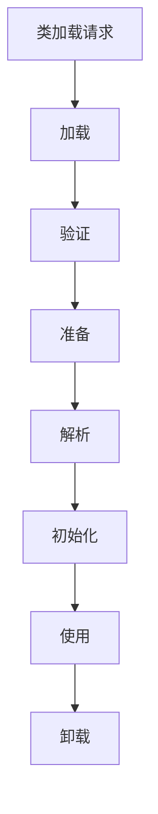
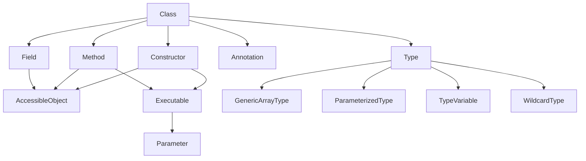
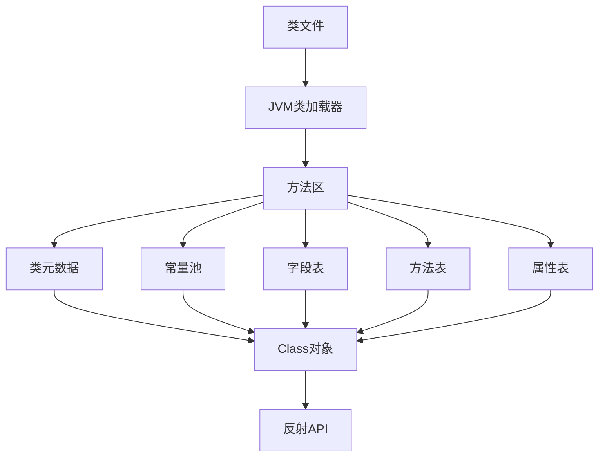
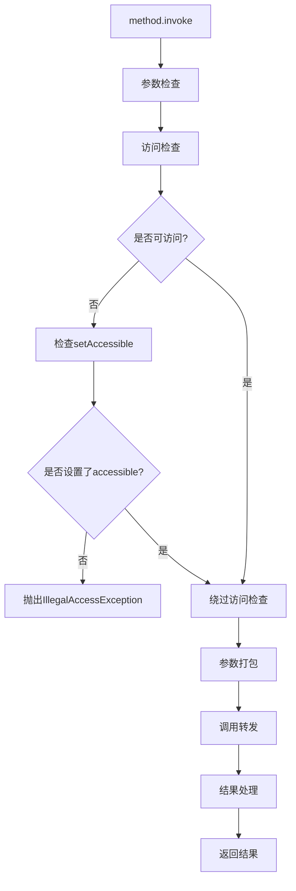
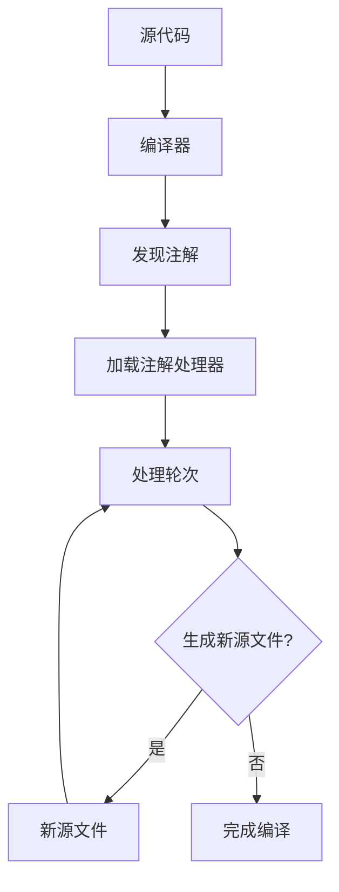

# 反射与注解原理篇

## 反射基础概念

### 反射的定义与作用

反射（Reflection）是Java语言的一个重要特性，它允许程序在运行时检查、访问和修改自身的结构和行为。通过反射，我们可以在运行时获取类的信息、创建对象、调用方法、访问字段，甚至修改访问权限，而这些操作在编译时可能是未知的。

反射的核心作用包括：

1. **动态获取类信息**：在运行时获取类的完整结构，包括类名、修饰符、父类、实现的接口、字段、方法和构造器等。

2. **动态创建对象**：不需要在编译时知道具体的类，可以在运行时根据类名创建对象实例。

3. **动态调用方法**：可以在运行时调用任意对象的任意方法，即使这些方法在编译时是私有的或未知的。

4. **动态访问字段**：可以在运行时读取或修改对象的任意字段，包括私有字段。

5. **支持泛型和注解**：可以获取泛型和注解信息，这些信息通常在编译后会被擦除。

反射在很多场景中非常有用，例如：

- 框架开发（如Spring、Hibernate等）
- 动态代理
- 序列化与反序列化
- 单元测试
- 插件和模块化系统

```java
// 反射基本使用示例
public class ReflectionDemo {
    public static void main(String[] args) throws Exception {
        // 获取类信息
        Class<?> clazz = Class.forName("java.util.ArrayList");
        
        // 创建实例
        Object list = clazz.getDeclaredConstructor().newInstance();
        
        // 获取方法并调用
        Method addMethod = clazz.getMethod("add", Object.class);
        addMethod.invoke(list, "Hello, Reflection!");
        
        // 获取字段
        Field sizeField = clazz.getDeclaredField("size");
        sizeField.setAccessible(true); // 允许访问私有字段
        int size = (int) sizeField.get(list);
        
        System.out.println("List size: " + size);
    }
}
```

### Class对象与类加载

在Java中，每个类型（类、接口、数组、基本类型等）在JVM中都有一个唯一对应的`Class`对象，它是反射API的入口点。`Class`对象包含了类型的所有信息，是进行反射操作的基础。

#### 获取Class对象的方式

有三种主要方式获取`Class`对象：

1. **通过类字面常量**：`Class<?> clazz = String.class;`
   - 最简单、最高效的方式
   - 编译时类型安全
   - 适用于编译时已知类型的情况

2. **通过对象的getClass()方法**：`Class<?> clazz = "Hello".getClass();`
   - 适用于已有对象实例的情况
   - 返回对象的实际运行时类型

3. **通过Class.forName()方法**：`Class<?> clazz = Class.forName("java.lang.String");`
   - 通过完全限定类名动态加载类
   - 可能抛出ClassNotFoundException
   - 适用于类名在运行时才能确定的情况

#### 类加载过程

当JVM第一次使用某个类时，会触发该类的加载过程，主要包括以下阶段：

1. **加载（Loading）**：
   - 通过类加载器查找并加载类的字节码
   - 在内存中创建代表这个类的`Class`对象

2. **链接（Linking）**：
   - **验证（Verification）**：确保字节码符合JVM规范
   - **准备（Preparation）**：为类的静态字段分配内存并设置默认值
   - **解析（Resolution）**：将符号引用转换为直接引用

3. **初始化（Initialization）**：
   - 执行类的静态初始化代码
   - 为静态字段赋予正确的初始值



类加载器负责加载类的字节码并创建`Class`对象。Java使用双亲委派模型组织类加载器：

- **启动类加载器（Bootstrap ClassLoader）**：加载Java核心类库
- **扩展类加载器（Extension ClassLoader）**：加载扩展类库
- **应用类加载器（Application ClassLoader）**：加载应用程序类路径下的类
- **自定义类加载器**：开发者可以实现自己的类加载器

```java
// 类加载器层次结构示例
public class ClassLoaderDemo {
    public static void main(String[] args) {
        // 应用类加载器
        ClassLoader appClassLoader = ClassLoaderDemo.class.getClassLoader();
        System.out.println("应用类加载器: " + appClassLoader);
        
        // 扩展类加载器
        ClassLoader extClassLoader = appClassLoader.getParent();
        System.out.println("扩展类加载器: " + extClassLoader);
        
        // 启动类加载器（通常显示为null）
        ClassLoader bootClassLoader = extClassLoader.getParent();
        System.out.println("启动类加载器: " + bootClassLoader);
        
        // String类由启动类加载器加载
        System.out.println("String的类加载器: " + String.class.getClassLoader());
    }
}
```

### 类型信息的运行时表示

Java反射API通过一系列类来表示类型的各个方面，这些类主要位于`java.lang.reflect`包中：

#### 类型信息的核心类

1. **Class<T>**：表示类型本身，包含类的整体信息
   - 可以表示类、接口、数组、枚举、注解、基本类型等
   - 提供获取类成员（字段、方法、构造器等）的方法
   - 支持创建实例、检查类型关系等操作

2. **Field**：表示类的字段（成员变量）
   - 包含字段名、类型、修饰符等信息
   - 支持获取和设置字段值

3. **Method**：表示类的方法
   - 包含方法名、返回类型、参数类型、修饰符等信息
   - 支持方法调用

4. **Constructor<T>**：表示类的构造器
   - 包含参数类型、修饰符等信息
   - 支持创建对象实例

5. **Parameter**：表示方法或构造器的参数
   - 包含参数名、类型、修饰符等信息

6. **Modifier**：提供解析修饰符的工具方法
   - 用于检查类、字段、方法等的修饰符（public、private等）

7. **Array**：提供操作数组的工具方法
   - 支持创建数组、获取和设置数组元素等

8. **AccessibleObject**：`Field`、`Method`和`Constructor`的公共父类
   - 提供控制访问权限的功能（如`setAccessible()`方法）

```java
// 类型信息的运行时表示示例
public class TypeInfoDemo {
    public static void main(String[] args) throws Exception {
        Class<?> clazz = Person.class;
        
        // 获取类的基本信息
        System.out.println("类名: " + clazz.getName());
        System.out.println("简单类名: " + clazz.getSimpleName());
        System.out.println("是否为接口: " + clazz.isInterface());
        System.out.println("修饰符: " + Modifier.toString(clazz.getModifiers()));
        
        // 获取字段信息
        Field[] fields = clazz.getDeclaredFields();
        System.out.println("\n字段信息:");
        for (Field field : fields) {
            System.out.printf("  %s %s %s%n", 
                Modifier.toString(field.getModifiers()),
                field.getType().getSimpleName(),
                field.getName());
        }
        
        // 获取方法信息
        Method[] methods = clazz.getDeclaredMethods();
        System.out.println("\n方法信息:");
        for (Method method : methods) {
            System.out.printf("  %s %s %s%n", 
                Modifier.toString(method.getModifiers()),
                method.getReturnType().getSimpleName(),
                method.getName());
        }
        
        // 获取构造器信息
        Constructor<?>[] constructors = clazz.getDeclaredConstructors();
        System.out.println("\n构造器信息:");
        for (Constructor<?> constructor : constructors) {
            System.out.printf("  %s %s%n", 
                Modifier.toString(constructor.getModifiers()),
                clazz.getSimpleName());
        }
    }
}

class Person {
    private String name;
    private int age;
    
    public Person() {}
    
    public Person(String name, int age) {
        this.name = name;
        this.age = age;
    }
    
    public String getName() { return name; }
    public void setName(String name) { this.name = name; }
    public int getAge() { return age; }
    public void setAge(int age) { this.age = age; }
}
```

### 反射与静态类型系统的关系

Java是一种静态类型语言，这意味着变量的类型在编译时就已确定，编译器会进行类型检查以确保类型安全。而反射则提供了一种在运行时操作类型的机制，它在某种程度上绕过了静态类型系统的限制。

#### 静态类型系统与反射的对比

| 特性 | 静态类型系统 | 反射 |
|------|------------|------|
| 类型检查时机 | 编译时 | 运行时 |
| 类型安全性 | 高（编译时检查） | 低（运行时可能出错） |
| 性能 | 高（直接调用） | 低（间接调用） |
| 灵活性 | 低（编译时确定） | 高（运行时动态） |
| 错误发现 | 编译时发现 | 运行时发现 |
| 代码可读性 | 高 | 相对较低 |

#### 反射如何突破静态类型的限制

1. **动态类型检查**：反射允许在运行时检查对象的实际类型，而不仅仅是编译时声明的类型。

2. **访问私有成员**：通过`setAccessible(true)`可以访问私有字段和方法，这在静态类型系统中是不允许的。

3. **动态方法调用**：可以根据字符串名称查找并调用方法，而不需要在编译时知道方法名。

4. **泛型擦除后的类型恢复**：反射API提供了`getGenericType()`等方法，可以获取泛型信息，而这些信息在普通Java代码中因为类型擦除是不可访问的。

```java
// 反射突破静态类型限制示例
public class ReflectionVsStaticType {
    public static void main(String[] args) throws Exception {
        // 静态类型：编译时确定
        PrivateClass instance = new PrivateClass();
        // 以下代码在编译时会报错：
        // instance.privateMethod();  // 私有方法，不可访问
        // instance.privateField = 10;  // 私有字段，不可访问
        
        // 反射：运行时动态访问
        Class<?> clazz = PrivateClass.class;
        Object obj = clazz.getDeclaredConstructor().newInstance();
        
        // 访问私有方法
        Method method = clazz.getDeclaredMethod("privateMethod");
        method.setAccessible(true);  // 突破访问限制
        method.invoke(obj);  // 成功调用私有方法
        
        // 访问私有字段
        Field field = clazz.getDeclaredField("privateField");
        field.setAccessible(true);  // 突破访问限制
        field.set(obj, 10);  // 成功修改私有字段
        System.out.println("privateField值: " + field.get(obj));
    }
}

class PrivateClass {
    private int privateField;
    
    private void privateMethod() {
        System.out.println("这是一个私有方法");
    }
}
```

### Java反射API的整体架构

Java反射API的设计遵循了面向对象的原则，形成了一个层次清晰的架构。整个反射API主要围绕`Class`类展开，通过它可以获取类的各种成员的反射信息。

#### 反射API的核心组件



1. **Class层**：`Class`类是反射API的入口点，提供获取类信息的方法。

2. **成员层**：
   - `Field`：表示字段
   - `Method`：表示方法
   - `Constructor`：表示构造器
   - `Parameter`：表示方法或构造器的参数

3. **类型层**：
   - `Type`：所有类型的公共接口
   - `GenericArrayType`：表示泛型数组类型
   - `ParameterizedType`：表示参数化类型（如`List<String>`）
   - `TypeVariable`：表示类型变量（如`T`在`class MyClass<T>`中）
   - `WildcardType`：表示通配符类型（如`?`、`? extends Number`）

4. **注解层**：
   - `AnnotatedElement`：可以被注解的元素的接口
   - `Annotation`：注解的公共接口

5. **辅助类**：
   - `Modifier`：提供解析修饰符的工具方法
   - `Array`：提供操作数组的工具方法
   - `Proxy`：提供创建动态代理的功能

#### 反射API的使用模式

反射API的典型使用模式如下：

1. **获取Class对象**：通过类字面常量、`getClass()`方法或`Class.forName()`方法。

2. **检查类信息**：获取类的名称、修饰符、父类、接口等信息。

3. **获取成员信息**：获取字段、方法、构造器等成员的反射对象。

4. **操作成员**：使用反射对象读写字段、调用方法、创建实例等。

```java
// 反射API使用模式示例
public class ReflectionAPIDemo {
    public static void main(String[] args) throws Exception {
        // 1. 获取Class对象
        Class<?> clazz = Class.forName("java.util.ArrayList");
        
        // 2. 检查类信息
        System.out.println("类名: " + clazz.getName());
        System.out.println("父类: " + clazz.getSuperclass().getName());
        System.out.println("实现的接口数量: " + clazz.getInterfaces().length);
        
        // 3. 获取成员信息
        Constructor<?> constructor = clazz.getConstructor();
        Method addMethod = clazz.getMethod("add", Object.class);
        Method getMethod = clazz.getMethod("get", int.class);
        Field sizeField = clazz.getDeclaredField("size");
        sizeField.setAccessible(true);
        
        // 4. 操作成员
        Object list = constructor.newInstance();  // 创建实例
        addMethod.invoke(list, "Hello");  // 调用add方法
        addMethod.invoke(list, "World");  // 调用add方法
        System.out.println("第一个元素: " + getMethod.invoke(list, 0));  // 调用get方法
        System.out.println("列表大小: " + sizeField.get(list));  // 读取私有字段
    }
}
```

## 注解基础概念

### 注解的定义与本质

注解（Annotation）是Java 5引入的一种特殊的接口类型，它提供了一种为程序元素（类、方法、字段等）添加元数据的标准方式。注解本身不会改变程序的行为，但可以被编译器、开发工具或运行时环境读取和处理，从而影响程序的编译和执行过程。

#### 注解的本质

从本质上讲，注解是一种特殊的接口，具有以下特点：

1. 注解类型声明使用`@interface`关键字
2. 注解可以包含元素（类似接口中的方法），但有默认值
3. 注解可以应用于各种程序元素（类、方法、字段等）
4. 注解信息可以保留在源代码、类文件中或在运行时可用

在字节码层面，注解被存储为特殊的属性表（attribute），可以通过反射API在运行时获取。

#### 注解的定义

定义注解的基本语法如下：

```java
// 注解定义示例
public @interface MyAnnotation {
    // 注解元素（类似方法）
    String value() default "";  // 带默认值的元素
    int count();  // 必须指定值的元素
    String[] tags() default {};  // 数组类型元素
}
```

注解元素的类型只能是：
- 基本数据类型（int, float, boolean等）
- String
- Class或泛型Class（如Class<?>）
- 枚举类型
- 注解类型
- 以上类型的数组

#### 注解的使用

使用注解时，需要在目标元素前加上`@`符号，后跟注解名称和元素值（如果有）：

```java
// 注解使用示例
@MyAnnotation(value = "测试", count = 10, tags = {"tag1", "tag2"})
public class AnnotatedClass {
    
    @MyAnnotation(count = 5)  // 使用默认value和tags
    private String field;
    
    @MyAnnotation(value = "方法注解", count = 3)
    public void annotatedMethod() {
        // 方法体
    }
}
```

如果注解只有一个名为`value`的元素，且只需要设置该元素，可以使用简写形式：

```java
@SomeAnnotation("值")  // 等同于 @SomeAnnotation(value = "值")
```

### 元注解与注解类型

元注解（Meta-Annotations）是用于注解其他注解的特殊注解。Java提供了几个标准的元注解，它们定义在`java.lang.annotation`包中，用于控制注解的行为和使用方式。

#### 标准元注解

1. **@Retention**：指定注解的保留策略
   - 定义注解在什么级别可用（源码、类文件、运行时）
   - 例如：`@Retention(RetentionPolicy.RUNTIME)`

2. **@Target**：指定注解可以应用的程序元素类型
   - 如类、方法、字段、参数等
   - 例如：`@Target({ElementType.METHOD, ElementType.FIELD})`

3. **@Documented**：指定注解应该被包含在JavaDoc中
   - 默认情况下，注解不会出现在JavaDoc中
   - 例如：`@Documented`

4. **@Inherited**：指定注解可以被子类继承
   - 默认情况下，注解不会被子类继承
   - 例如：`@Inherited`

5. **@Repeatable**（Java 8引入）：指定注解可以在同一元素上多次使用
   - 需要定义一个容器注解
   - 例如：`@Repeatable(MyAnnotations.class)`

```java
// 元注解使用示例
import java.lang.annotation.*;

// 自定义注解，使用元注解
@Retention(RetentionPolicy.RUNTIME)  // 运行时可用
@Target({ElementType.TYPE, ElementType.METHOD})  // 可用于类和方法
@Documented  // 包含在JavaDoc中
@Inherited  // 可被子类继承
public @interface MyCustomAnnotation {
    String value() default "";
}

// 可重复注解示例
@Retention(RetentionPolicy.RUNTIME)
@Target(ElementType.TYPE)
@Repeatable(Colors.class)
@interface Color {
    String value();
}

// 容器注解
@Retention(RetentionPolicy.RUNTIME)
@Target(ElementType.TYPE)
@interface Colors {
    Color[] value();
}

// 使用可重复注解
@Color("Red")
@Color("Blue")
class Rainbow {
    // 类定义
}
```

#### 注解类型分类

根据用途和处理方式，注解可以分为以下几类：

1. **标记注解**：不包含元素的注解，仅用于标记程序元素
   - 例如：`@Override`、`@Deprecated`

2. **单值注解**：只有一个名为`value`的元素的注解
   - 例如：`@SuppressWarnings("unchecked")`

3. **完整注解**：包含多个元素的注解
   - 例如：`@MyAnnotation(name = "test", value = 10)`

4. **编译时注解**：在编译时由注解处理器处理的注解
   - 例如：Lombok的`@Getter`、`@Setter`

5. **运行时注解**：在运行时通过反射API处理的注解
   - 例如：Spring的`@Autowired`、JUnit的`@Test`

### 注解的保留策略

注解的保留策略（Retention Policy）决定了注解信息保留到哪个阶段。Java提供了三种保留策略，通过`@Retention`元注解指定：

#### 保留策略类型

1. **SOURCE**：注解仅在源代码中保留，编译时会被丢弃
   - 适用于：编译器提示、代码生成工具、IDE工具等
   - 例如：`@Override`、`@SuppressWarnings`

2. **CLASS**：注解在编译后的类文件中保留，但在运行时不可通过反射获取
   - 这是默认的保留策略
   - 适用于：字节码工具、类加载时处理等
   - 例如：一些框架使用的编译后处理的注解

3. **RUNTIME**：注解在运行时可通过反射API获取
   - 适用于：需要在运行时读取注解信息的场景
   - 例如：Spring的`@Component`、JPA的`@Entity`

```java
// 不同保留策略的注解示例
import java.lang.annotation.*;

// 源码级注解
@Retention(RetentionPolicy.SOURCE)
@interface SourceAnnotation {
    String value();
}

// 类文件级注解（默认）
@Retention(RetentionPolicy.CLASS)
@interface ClassAnnotation {
    String value();
}

// 运行时注解
@Retention(RetentionPolicy.RUNTIME)
@interface RuntimeAnnotation {
    String value();
}

// 使用不同保留策略的注解
@SourceAnnotation("仅在源码中可见")
@ClassAnnotation("在类文件中可见")
@RuntimeAnnotation("在运行时可见")
public class RetentionDemo {
    public static void main(String[] args) {
        Class<?> clazz = RetentionDemo.class;
        
        // 只有RUNTIME级别的注解可以通过反射获取
        System.out.println("是否有SourceAnnotation: " + 
            clazz.isAnnotationPresent(SourceAnnotation.class));  // 输出false
            
        System.out.println("是否有ClassAnnotation: " + 
            clazz.isAnnotationPresent(ClassAnnotation.class));  // 输出false
            
        System.out.println("是否有RuntimeAnnotation: " + 
            clazz.isAnnotationPresent(RuntimeAnnotation.class));  // 输出true
            
        if (clazz.isAnnotationPresent(RuntimeAnnotation.class)) {
            RuntimeAnnotation annotation = clazz.getAnnotation(RuntimeAnnotation.class);
            System.out.println("RuntimeAnnotation值: " + annotation.value());
        }
    }
}
```

#### 选择合适的保留策略

选择注解的保留策略应基于注解的用途：

1. 如果注解仅用于编译时检查或代码生成，选择**SOURCE**
2. 如果注解需要在类加载时处理，但不需要在运行时通过反射访问，选择**CLASS**
3. 如果注解需要在运行时通过反射API获取和处理，选择**RUNTIME**

大多数框架使用的注解（如Spring、Hibernate等）都采用RUNTIME保留策略，因为它们需要在运行时读取注解信息来实现依赖注入、ORM映射等功能。

### 注解的目标元素

注解的目标元素（Target Element）指定了注解可以应用的程序元素类型。通过`@Target`元注解可以限制注解的使用范围。

#### 目标元素类型

Java定义了以下目标元素类型，它们在`java.lang.annotation.ElementType`枚举中定义：

1. **TYPE**：类、接口、枚举、注解类型
2. **FIELD**：字段（包括枚举常量）
3. **METHOD**：方法
4. **PARAMETER**：方法参数
5. **CONSTRUCTOR**：构造器
6. **LOCAL_VARIABLE**：局部变量
7. **ANNOTATION_TYPE**：注解类型
8. **PACKAGE**：包
9. **TYPE_PARAMETER**（Java 8）：类型参数（如`<T>`）
10. **TYPE_USE**（Java 8）：任何类型使用处
11. **MODULE**（Java 9）：模块

如果不指定`@Target`，则注解可以应用于任何元素。

```java
// 不同目标元素的注解示例
import java.lang.annotation.*;

// 类注解
@Target(ElementType.TYPE)
@Retention(RetentionPolicy.RUNTIME)
@interface ClassAnnotation {
    String value();
}

// 方法注解
@Target(ElementType.METHOD)
@Retention(RetentionPolicy.RUNTIME)
@interface MethodAnnotation {
    String value();
}

// 字段注解
@Target(ElementType.FIELD)
@Retention(RetentionPolicy.RUNTIME)
@interface FieldAnnotation {
    String value();
}

// 参数注解
@Target(ElementType.PARAMETER)
@Retention(RetentionPolicy.RUNTIME)
@interface ParamAnnotation {
    String value();
}

// 多目标注解
@Target({ElementType.METHOD, ElementType.FIELD})
@Retention(RetentionPolicy.RUNTIME)
@interface MultiTargetAnnotation {
    String value();
}

// 类型使用注解
@Target(ElementType.TYPE_USE)
@Retention(RetentionPolicy.RUNTIME)
@interface TypeUseAnnotation {
}

// 使用不同目标的注解
@ClassAnnotation("类注解")
public class TargetDemo {
    
    @FieldAnnotation("字段注解")
    @MultiTargetAnnotation("字段多目标注解")
    private String field;
    
    @MethodAnnotation("方法注解")
    @MultiTargetAnnotation("方法多目标注解")
    public void method(@ParamAnnotation("参数注解") String param) {
        // 局部变量上的类型使用注解
        @TypeUseAnnotation List<@TypeUseAnnotation String> list = new ArrayList<>();
    }
}
```

#### 类型注解（Java 8+）
让我继续完成反射与注解原理篇的内容：

### 注解的目标元素（续）

#### 类型注解（Java 8+）

Java 8引入了类型注解，通过`ElementType.TYPE_USE`和`ElementType.TYPE_PARAMETER`扩展了注解的使用范围。类型注解可以应用于任何使用类型的地方，包括：

- 类实例创建表达式
- 类型转换
- 实现子句
- 泛型类型参数
- 数组类型
- 异常声明

类型注解主要用于增强Java的类型系统，结合注解处理器可以进行更严格的类型检查。例如，著名的Checker Framework使用类型注解来检测空指针、不可变性等问题。

```java
// 类型注解示例
import java.lang.annotation.*;
import java.util.*;

@Target(ElementType.TYPE_USE)
@Retention(RetentionPolicy.RUNTIME)
@interface NotNull {}

@Target(ElementType.TYPE_USE)
@Retention(RetentionPolicy.RUNTIME)
@interface Immutable {}

public class TypeAnnotationDemo {
    // 在类型使用处应用注解
    @NotNull String text = "Hello";
    
    // 在泛型参数上使用类型注解
    List<@NotNull String> list = new ArrayList<>();
    
    // 在数组类型上使用类型注解
    @NotNull String @NotNull [] array;
    
    // 在异常声明上使用类型注解
    public void process() throws @Immutable Exception {
        // 在类型转换上使用类型注解
        Object obj = "Hello";
        String str = (@NotNull String) obj;
        
        // 在实例创建表达式上使用类型注解
        @NotNull String text = new @NotNull String("Hello");
    }
    
    // 在类型参数声明上使用类型注解
    public <@NotNull T> T getValue(T t) {
        return t;
    }
}
```

### 注解与反射的关联

注解和反射是紧密关联的两个特性，它们共同构成了Java元编程的基础。反射提供了在运行时检查和操作程序结构的能力，而注解则提供了为程序元素添加元数据的方式。通过反射API，我们可以在运行时获取和处理注解信息。

#### 通过反射获取注解

Java反射API提供了一系列方法来获取程序元素上的注解：

1. **检查是否存在特定注解**：
   - `boolean isAnnotationPresent(Class<? extends Annotation> annotationClass)`

2. **获取单个注解**：
   - `<T extends Annotation> T getAnnotation(Class<T> annotationClass)`
   - `<T extends Annotation> T getDeclaredAnnotation(Class<T> annotationClass)` (Java 8+)

3. **获取所有注解**：
   - `Annotation[] getAnnotations()`
   - `Annotation[] getDeclaredAnnotations()`

4. **获取重复注解**（Java 8+）：
   - `<T extends Annotation> T[] getAnnotationsByType(Class<T> annotationClass)`
   - `<T extends Annotation> T[] getDeclaredAnnotationsByType(Class<T> annotationClass)`

这些方法在`Class`、`Method`、`Field`、`Constructor`、`Parameter`等反射类中都有提供，它们都实现了`AnnotatedElement`接口。

```java
// 通过反射获取注解示例
import java.lang.annotation.*;
import java.lang.reflect.*;

@Retention(RetentionPolicy.RUNTIME)
@Target({ElementType.TYPE, ElementType.METHOD, ElementType.FIELD})
@interface MyAnnotation {
    String value();
    int count() default 0;
}

@MyAnnotation("类注解")
public class AnnotationReflectionDemo {
    
    @MyAnnotation("字段注解")
    private String field;
    
    @MyAnnotation(value = "方法注解", count = 5)
    public void annotatedMethod() {
        // 方法体
    }
    
    public static void main(String[] args) throws Exception {
        Class<?> clazz = AnnotationReflectionDemo.class;
        
        // 获取类上的注解
        if (clazz.isAnnotationPresent(MyAnnotation.class)) {
            MyAnnotation annotation = clazz.getAnnotation(MyAnnotation.class);
            System.out.println("类上的注解值: " + annotation.value() + ", count: " + annotation.count());
        }
        
        // 获取字段上的注解
        Field field = clazz.getDeclaredField("field");
        if (field.isAnnotationPresent(MyAnnotation.class)) {
            MyAnnotation annotation = field.getAnnotation(MyAnnotation.class);
            System.out.println("字段上的注解值: " + annotation.value() + ", count: " + annotation.count());
        }
        
        // 获取方法上的注解
        Method method = clazz.getDeclaredMethod("annotatedMethod");
        if (method.isAnnotationPresent(MyAnnotation.class)) {
            MyAnnotation annotation = method.getAnnotation(MyAnnotation.class);
            System.out.println("方法上的注解值: " + annotation.value() + ", count: " + annotation.count());
        }
    }
}
```

#### 注解处理模式

使用反射处理注解的常见模式包括：

1. **配置驱动**：通过注解配置组件行为
   ```java
   @ConfigValue("app.name")
   private String appName;
   
   // 处理配置注解
   private void processConfigAnnotations(Object instance) {
       for (Field field : instance.getClass().getDeclaredFields()) {
           if (field.isAnnotationPresent(ConfigValue.class)) {
               ConfigValue annotation = field.getAnnotation(ConfigValue.class);
               String configKey = annotation.value();
               String configValue = getConfigValue(configKey);
               
               field.setAccessible(true);
               try {
                   field.set(instance, configValue);
               } catch (IllegalAccessException e) {
                   // 处理异常
               }
           }
       }
   }
   ```

2. **行为标记**：通过注解标记特定行为的方法
   ```java
   @Test
   public void testSomething() {
       // 测试代码
   }
   
   // 处理测试注解
   private void runTests(Class<?> testClass) throws Exception {
       Object instance = testClass.getDeclaredConstructor().newInstance();
       
       for (Method method : testClass.getDeclaredMethods()) {
           if (method.isAnnotationPresent(Test.class)) {
               try {
                   method.invoke(instance);
                   System.out.println(method.getName() + " 测试通过");
               } catch (Exception e) {
                   System.out.println(method.getName() + " 测试失败: " + e.getCause());
               }
           }
       }
   }
   ```

3. **元数据提供**：通过注解提供元数据
   ```java
   @Entity
   @Table(name = "users")
   public class User {
       @Id
       @Column(name = "user_id")
       private Long id;
       
       @Column(name = "username", length = 50, nullable = false)
       private String username;
       
       // 其他字段和方法
   }
   
   // 处理ORM注解
   private String generateSQL(Class<?> entityClass) {
       if (!entityClass.isAnnotationPresent(Entity.class)) {
           throw new IllegalArgumentException("Not an entity class");
       }
       
       Table tableAnnotation = entityClass.getAnnotation(Table.class);
       String tableName = tableAnnotation != null ? tableAnnotation.name() : entityClass.getSimpleName().toLowerCase();
       
       StringBuilder sql = new StringBuilder("SELECT ");
       List<String> columns = new ArrayList<>();
       
       for (Field field : entityClass.getDeclaredFields()) {
           if (field.isAnnotationPresent(Column.class)) {
               Column columnAnnotation = field.getAnnotation(Column.class);
               columns.add(columnAnnotation.name());
           }
       }
       
       sql.append(String.join(", ", columns));
       sql.append(" FROM ").append(tableName);
       
       return sql.toString();
   }
   ```

## 反射的内部实现

### JVM中的类型信息存储

Java虚拟机（JVM）在加载类时，会将类的结构信息存储在方法区（Method Area）中。这些信息包括类的名称、父类、实现的接口、字段、方法、构造器等。反射API就是通过访问这些存储在方法区的类型信息来实现其功能的。

#### 类型信息的内部表示

在JVM内部，类型信息主要通过以下数据结构表示：

1. **类元数据**：存储类的基本信息
   - 类名、访问标志（public、final等）
   - 父类引用
   - 接口数组
   - 常量池引用

2. **字段表**：存储类的字段信息
   - 字段名、类型、访问标志
   - 属性表（如注解信息）

3. **方法表**：存储类的方法信息
   - 方法名、返回类型、参数类型、访问标志
   - 方法字节码
   - 属性表（如注解信息、局部变量表、异常表等）

4. **常量池**：存储类中使用的常量
   - 字符串常量
   - 类和方法引用
   - 字段引用
   - 数值常量

5. **属性表**：存储附加信息
   - 源文件名
   - 内部类信息
   - 注解信息
   - 泛型信息



#### 类型信息的加载过程

当JVM加载一个类时，会经历以下步骤：

1. **加载**：读取类文件，创建二进制表示
2. **验证**：确保类文件格式正确，字节码合法
3. **准备**：为静态字段分配内存并设置默认值
4. **解析**：将符号引用转换为直接引用
5. **初始化**：执行静态初始化代码

在这个过程中，JVM会解析类文件的结构，提取类型信息，并在方法区中创建相应的数据结构。同时，JVM会为每个加载的类创建一个唯一的`Class`对象，作为访问类型信息的入口点。

### 反射调用的内部机制

反射API允许程序在运行时调用任意方法，即使这些方法在编译时是未知的。这种动态调用能力是通过一系列复杂的内部机制实现的。

#### 方法调用的基本流程

当使用反射调用方法（如`method.invoke(obj, args)`）时，内部会经历以下步骤：

1. **参数检查**：验证目标对象类型和参数类型是否匹配方法声明
2. **访问检查**：检查调用者是否有权限访问该方法
3. **参数打包**：将参数打包成数组
4. **调用转发**：将调用转发到适当的调用机制
5. **结果处理**：处理返回值和异常



#### 反射调用的实现策略

JVM对反射调用有多种实现策略，根据调用频率和上下文动态选择：

1. **解释执行**：最简单但最慢的方式，直接解释执行反射调用
   - 用于首次调用或不频繁的调用

2. **方法句柄（Method Handle）**：Java 7引入的底层机制
   - 比传统反射更轻量级
   - 提供更直接的方法调用路径

3. **动态生成字节码**：为频繁调用的反射操作生成专用字节码
   - 使用ASM或CGLIB等字节码生成库
   - 生成直接调用目标方法的字节码
   - 避免反射API的开销

4. **内联缓存**：缓存方法查找和调用信息
   - 减少重复查找的开销
   - 针对同一方法的多次调用进行优化

#### 反射调用的性能优化

现代JVM对反射调用进行了多种优化：

1. **调用点内联**：对频繁执行的反射调用进行内联优化
2. **类型特化**：为特定类型的调用生成优化代码
3. **去虚拟化**：将虚方法调用转换为直接调用
4. **逃逸分析**：减少不必要的对象分配

这些优化使得频繁执行的反射调用性能接近直接调用，但首次调用或不频繁的调用仍有较大开销。

```java
// 反射调用性能对比示例
public class ReflectionPerformanceDemo {
    public static void main(String[] args) throws Exception {
        // 准备测试对象和参数
        TargetClass target = new TargetClass();
        String arg = "test";
        
        // 获取方法对象
        Method method = TargetClass.class.getDeclaredMethod("targetMethod", String.class);
        method.setAccessible(true);
        
        // 预热（让JIT有机会优化）
        for (int i = 0; i < 10000; i++) {
            method.invoke(target, arg);
            target.targetMethod(arg);
        }
        
        // 测试直接调用
        long start = System.nanoTime();
        for (int i = 0; i < 1000000; i++) {
            target.targetMethod(arg);
        }
        long directTime = System.nanoTime() - start;
        
        // 测试反射调用
        start = System.nanoTime();
        for (int i = 0; i < 1000000; i++) {
            method.invoke(target, arg);
        }
        long reflectTime = System.nanoTime() - start;
        
        System.out.printf("直接调用: %d ns%n", directTime);
        System.out.printf("反射调用: %d ns%n", reflectTime);
        System.out.printf("反射调用是直接调用的 %.2f 倍%n", (double)reflectTime / directTime);
    }
}

class TargetClass {
    public String targetMethod(String arg) {
        return arg;
    }
}
```

### 方法句柄与方法调用

方法句柄（Method Handle）是Java 7引入的一种低级别API，提供了比传统反射更轻量级、更灵活的方法调用机制。方法句柄是对方法、构造器或字段的类型安全的引用，可以像函数指针一样使用。

#### 方法句柄的基本概念

方法句柄API位于`java.lang.invoke`包中，主要包括：

1. **MethodHandle**：表示一个方法的引用，可以被调用
2. **MethodType**：描述方法的签名（参数类型和返回类型）
3. **MethodHandles.Lookup**：查找方法句柄的工厂类

与反射相比，方法句柄有以下特点：

- 更接近底层，性能更好
- 支持更灵活的调用转换（如自动类型转换）
- 与invokedynamic指令紧密集成
- 支持方法引用组合和变换

```java
// 方法句柄基本使用示例
import java.lang.invoke.*;

public class MethodHandleDemo {
    public static void main(String[] args) throws Throwable {
        // 创建Lookup对象
        MethodHandles.Lookup lookup = MethodHandles.lookup();
        
        // 定义方法类型（参数类型和返回类型）
        MethodType mt = MethodType.methodType(String.class, int.class);
        
        // 查找方法句柄
        MethodHandle mh = lookup.findVirtual(String.class, "substring", mt);
        
        // 调用方法句柄
        String result = (String) mh.invoke("Hello, World", 7);
        System.out.println(result);  // 输出: World
        
        // 绑定接收者（创建绑定方法句柄）
        MethodHandle boundMh = mh.bindTo("Hello, Java");
        
        // 调用绑定方法句柄（不需要提供接收者）
        String boundResult = (String) boundMh.invoke(7);
        System.out.println(boundResult);  // 输出: Java
    }
}
```

#### 方法句柄的查找

`MethodHandles.Lookup`类提供了多种查找方法句柄的方法：

1. **findStatic**：查找静态方法
2. **findVirtual**：查找实例方法
3. **findConstructor**：查找构造器
4. **findGetter**/**findSetter**：查找字段的getter/setter
5. **findStaticGetter**/**findStaticSetter**：查找静态字段的getter/setter
6. **findSpecial**：查找特殊方法（如私有方法、超类方法）

```java
// 方法句柄查找示例
import java.lang.invoke.*;

public class MethodHandleLookupDemo {
    private String privateField = "private value";
    
    private void privateMethod(String arg) {
        System.out.println("Private method called with: " + arg);
    }
    
    public static void main(String[] args) throws Throwable {
        MethodHandles.Lookup lookup = MethodHandles.lookup();
        
        // 查找静态方法
        MethodType mtStatic = MethodType.methodType(void.class, String.class);
        MethodHandle printlnMh = lookup.findStatic(System.class, "println", 
            MethodType.methodType(void.class, String.class));
        printlnMh.invoke("Static method called");
        
        // 查找构造器
        MethodHandle constructorMh = lookup.findConstructor(String.class, 
            MethodType.methodType(void.class, char[].class));
        String str = (String) constructorMh.invoke("Hello".toCharArray());
        System.out.println(str);
        
        // 查找私有方法
        MethodHandleLookupDemo demo = new MethodHandleLookupDemo();
        MethodHandle privateMh = lookup.findSpecial(
            MethodHandleLookupDemo.class, 
            "privateMethod", 
            MethodType.methodType(void.class, String.class),
            MethodHandleLookupDemo.class);
        privateMh.invoke(demo, "Accessing private method");
        
        // 查找字段getter
        MethodHandle getterMh = lookup.findGetter(
            MethodHandleLookupDemo.class, 
            "privateField", 
            String.class);
        String fieldValue = (String) getterMh.invoke(demo);
        System.out.println("Field value: " + fieldValue);
        
        // 查找字段setter
        MethodHandle setterMh = lookup.findSetter(
            MethodHandleLookupDemo.class, 
            "privateField", 
            String.class);
        setterMh.invoke(demo, "new value");
        System.out.println("New field value: " + getterMh.invoke(demo));
    }
}
```

#### 方法句柄的转换和组合

方法句柄API提供了丰富的转换和组合操作，可以创建更复杂的调用序列：

1. **asType**：调整方法句柄的类型（进行自动类型转换）
2. **bindTo**：将方法句柄绑定到特定接收者
3. **dropArguments**：创建忽略某些参数的方法句柄
4. **insertArguments**：创建预设某些参数的方法句柄
5. **collectArguments**：将一个方法句柄的结果作为另一个的参数
6. **guardWithTest**：创建条件执行的方法句柄

```java
// 方法句柄转换和组合示例
import java.lang.invoke.*;

public class MethodHandleTransformDemo {
    public static void main(String[] args) throws Throwable {
        MethodHandles.Lookup lookup = MethodHandles.lookup();
        
        // 原始方法句柄
        MethodHandle concatMh = lookup.findStatic(
            MethodHandleTransformDemo.class, 
            "concat", 
            MethodType.methodType(String.class, String.class, String.class));
        
        // 类型转换
        MethodHandle convertedMh = concatMh.asType(
            MethodType.methodType(Object.class, Object.class, Object.class));
        Object result = convertedMh.invoke(10, 20);
        System.out.println("转换结果: " + result);  // 输出: 转换结果: 1020
        
        // 参数绑定
        MethodHandle boundMh = concatMh.bindTo("Hello, ");
        String boundResult = (String) boundMh.invoke("World");
        System.out.println("绑定结果: " + boundResult);  // 输出: 绑定结果: Hello, World
        
        // 插入参数
        MethodHandle insertedMh = MethodHandles.insertArguments(concatMh, 1, "!");
        String insertedResult = (String) insertedMh.invoke("Hello");
        System.out.println("插入结果: " + insertedResult);  // 输出: 插入结果: Hello!
        
        // 条件执行
        MethodHandle isEmptyMh = lookup.findVirtual(String.class, "isEmpty", 
            MethodType.methodType(boolean.class));
        MethodHandle defaultMh = MethodHandles.constant(String.class, "(empty)");
        MethodHandle guardMh = MethodHandles.guardWithTest(
            isEmptyMh.asType(MethodType.methodType(boolean.class, String.class)),
            defaultMh,
            MethodHandles.identity(String.class));
        
        System.out.println("空字符串结果: " + guardMh.invoke(""));  // 输出: 空字符串结果: (empty)
        System.out.println("非空字符串结果: " + guardMh.invoke("Hello"));  // 输出: 非空字符串结果: Hello
    }
    
    // 用于演示的静态方法
    public static String concat(String a, String b) {
        return a + b;
    }
}
```

### 反射访问控制的实现

Java的访问控制机制（如private、protected修饰符）在编译时和运行时都会强制执行。然而，反射API提供了`setAccessible(true)`方法，允许程序在运行时绕过这些访问限制。这一机制的实现涉及到JVM内部的访问检查和安全管理器。

#### 访问控制的基本机制

在Java中，访问控制基于以下规则：

1. **public**：任何类都可以访问
2. **protected**：同包类和子类可以访问
3. **默认（包私有）**：同包类可以访问
4. **private**：只有定义类可以访问

JVM在方法调用和字段访问时会执行这些规则，如果违反规则，会抛出`IllegalAccessException`。

#### setAccessible的工作原理

`setAccessible(true)`方法是`AccessibleObject`类（`Field`、`Method`和`Constructor`的父类）的一个方法，它告诉JVM在后续反射操作中绕过访问检查。

其内部实现涉及以下步骤：

1. **安全检查**：首先检查调用者是否有权限修改访问标志
   - 如果有安全管理器，会调用`checkPermission`方法
   - 需要`ReflectPermission("suppressAccessChecks")`权限

2. **修改访问标志**：设置内部标志，指示后续操作绕过访问检查

3. **访问检查绕过**：在后续反射操作中，JVM检测到该标志后，会跳过常规的访问控制检查

```java
// 反射访问控制示例
import java.lang.reflect.*;

public class AccessControlDemo {
    public static void main(String[] args) throws Exception {
        // 创建目标对象
        PrivateClass target = new PrivateClass();
        
        // 获取私有字段
        Field privateField = PrivateClass.class.getDeclaredField("privateField");
        
        // 尝试直接访问（会失败）
        try {
            Object value = privateField.get(target);
            System.out.println("直接访问值: " + value);
        } catch (IllegalAccessException e) {
            System.out.println("直接访问失败: " + e.getMessage());
        }
        
        // 使用setAccessible绕过访问控制
        privateField.setAccessible(true);
        
        // 现在可以访问私有字段
        Object value = privateField.get(target);
        System.out.println("绕过访问控制后的值: " + value);
        
        // 修改私有字段
        privateField.set(target, "新值");
        System.out.println("修改后的值: " + privateField.get(target));
        
        // 获取并调用私有方法
        Method privateMethod = PrivateClass.class.getDeclaredMethod("privateMethod");
        privateMethod.setAccessible(true);
        privateMethod.invoke(target);
    }
}

class PrivateClass {
    private String privateField = "私有值";
    
    private void privateMethod() {
        System.out.println("私有方法被调用");
    }
}
```

#### 安全管理器与访问控制

Java的安全管理器（SecurityManager）可以限制反射API的使用，包括`setAccessible`方法。在启用安全管理器的环境中（如Applet、Web应用服务器），反射的能力可能会受到限制。

安全管理器通过权限检查来控制反射操作：

1. **ReflectPermission("suppressAccessChecks")**：控制`setAccessible`方法的使用
2. **RuntimePermission("accessDeclaredMembers")**：控制访问类的非公共成员
3. **RuntimePermission("getClassLoader")**：控制获取类加载器的操作

```java
// 安全管理器限制反射示例
import java.lang.reflect.*;
import java.security.*;

public class SecurityManagerDemo {
    public static void main(String[] args) {
        // 安装安全管理器
        System.setSecurityManager(new SecurityManager());
        
        try {
            // 尝试访问私有字段
            Field field = String.class.getDeclaredField("value");
            field.setAccessible(true);  // 这里会抛出SecurityException
            
            // 如果没有抛出异常，打印字段值
            char[] value = (char[]) field.get("Hello");
            System.out.println("字段值: " + new String(value));
        } catch (SecurityException e) {
            System.out.println("安全异常: " + e.getMessage());
        } catch (Exception e) {
            System.out.println("其他异常: " + e.getMessage());
        }
    }
}
```

### 反射性能开销的原因

反射虽然强大，但通常比直接方法调用慢，特别是在频繁调用的场景中。了解反射性能开销的原因有助于我们在使用反射时做出更明智的决策。

#### 反射性能开销的主要来源

1. **类型检查和转换**：
   - 反射调用需要在运行时进行参数类型检查和转换
   - 直接调用的类型检查在编译时完成

2. **访问检查**：
   - 反射调用需要检查访问权限
   - 即使使用`setAccessible(true)`，也有一定开销

3. **数组创建和包装**：
   - 反射调用时，参数需要打包成对象数
让我继续完成反射与注解原理篇的内容：

### 反射性能开销的原因（续）

3. **数组创建和包装**：
   - 反射调用时，参数需要打包成对象数组
   - 基本类型参数需要装箱成对应的包装类型
   - 返回值可能需要拆箱或类型转换

4. **方法查找**：
   - 每次反射调用都需要在方法表中查找方法
   - 直接调用的方法解析在编译时或类加载时完成

5. **JIT优化受限**：
   - 反射调用路径复杂，难以被JIT编译器完全优化
   - 动态性使得某些静态优化技术无法应用

6. **异常处理**：
   - 反射API使用检查异常，需要额外的异常处理逻辑
   - 异常处理机制本身有性能开销

#### 性能开销的量化分析

反射调用的性能开销可以分为两部分：

1. **一次性开销**：
   - 获取`Class`对象
   - 查找方法/字段/构造器
   - 设置访问权限

2. **每次调用开销**：
   - 参数类型检查和转换
   - 参数打包和拆箱
   - 调用分派
   - 异常处理

在实际应用中，一次性开销可以通过缓存反射对象来减少，而每次调用开销则是使用反射的固有成本。

```java
// 反射性能开销分析示例
import java.lang.reflect.*;
import java.util.*;

public class ReflectionPerformanceAnalysis {
    // 测试方法
    public String testMethod(String arg) {
        return arg + " processed";
    }
    
    public static void main(String[] args) throws Exception {
        ReflectionPerformanceAnalysis instance = new ReflectionPerformanceAnalysis();
        String arg = "test";
        
        // 直接调用
        long start = System.nanoTime();
        for (int i = 0; i < 1_000_000; i++) {
            instance.testMethod(arg);
        }
        long directTime = System.nanoTime() - start;
        
        // 反射调用（包括查找方法）
        start = System.nanoTime();
        for (int i = 0; i < 1_000_000; i++) {
            Method method = ReflectionPerformanceAnalysis.class.getMethod("testMethod", String.class);
            method.invoke(instance, arg);
        }
        long fullReflectionTime = System.nanoTime() - start;
        
        // 反射调用（缓存方法对象）
        Method cachedMethod = ReflectionPerformanceAnalysis.class.getMethod("testMethod", String.class);
        start = System.nanoTime();
        for (int i = 0; i < 1_000_000; i++) {
            cachedMethod.invoke(instance, arg);
        }
        long cachedReflectionTime = System.nanoTime() - start;
        
        // 输出结果
        System.out.printf("直接调用时间: %,d ns%n", directTime);
        System.out.printf("完整反射调用时间: %,d ns (是直接调用的 %.2f 倍)%n", 
                         fullReflectionTime, (double)fullReflectionTime/directTime);
        System.out.printf("缓存反射调用时间: %,d ns (是直接调用的 %.2f 倍)%n", 
                         cachedReflectionTime, (double)cachedReflectionTime/directTime);
    }
}
```

#### 减少反射性能开销的策略

1. **缓存反射对象**：
   - 缓存`Class`、`Method`、`Field`、`Constructor`对象
   - 避免重复查找和解析

2. **减少反射调用频率**：
   - 将反射限制在初始化或配置阶段
   - 对于热点代码路径，考虑使用代码生成或动态代理

3. **使用方法句柄**：
   - 在Java 7+中，考虑使用`MethodHandle`代替传统反射
   - 方法句柄设计更轻量，性能更好

4. **批量设置访问权限**：
   - 使用`AccessibleObject.setAccessible(AccessibleObject[], boolean)`一次性设置多个对象的访问权限

5. **避免基本类型的装箱/拆箱**：
   - 如果可能，使用对象类型参数而非基本类型
   - 考虑使用专门的反射工具库，如FastUtil

```java
// 反射性能优化示例
import java.lang.reflect.*;
import java.util.*;

public class ReflectionOptimizationDemo {
    // 缓存反射对象
    private static final Map<String, Method> METHOD_CACHE = new HashMap<>();
    
    // 获取缓存的方法对象
    private static Method getCachedMethod(Class<?> clazz, String methodName, Class<?>... paramTypes) 
            throws NoSuchMethodException {
        String key = clazz.getName() + "." + methodName;
        Method method = METHOD_CACHE.get(key);
        if (method == null) {
            method = clazz.getMethod(methodName, paramTypes);
            method.setAccessible(true);
            METHOD_CACHE.put(key, method);
        }
        return method;
    }
    
    public static void main(String[] args) throws Exception {
        List<String> list = new ArrayList<>();
        
        // 预热和缓存方法
        Method addMethod = getCachedMethod(List.class, "add", Object.class);
        Method sizeMethod = getCachedMethod(List.class, "size");
        
        // 使用缓存的反射方法
        for (int i = 0; i < 100; i++) {
            addMethod.invoke(list, "Item " + i);
        }
        
        Integer size = (Integer) sizeMethod.invoke(list);
        System.out.println("List size: " + size);
        
        // 批量设置访问权限
        Field[] fields = ArrayList.class.getDeclaredFields();
        AccessibleObject.setAccessible(fields, true);
        
        // 现在可以直接访问所有字段
        for (Field field : fields) {
            System.out.println(field.getName() + ": " + field.get(list));
        }
    }
}
```

## 注解的处理机制

### 编译时注解处理器

编译时注解处理器是Java提供的一种在编译期间处理注解的机制。它允许开发者编写处理器来读取、验证和处理注解，甚至可以生成新的源文件、类文件或资源文件。这种机制是许多流行框架和工具的基础，如Lombok、Dagger、MapStruct等。

#### 注解处理器的工作原理

注解处理器在Java编译过程中的工作流程如下：

1. **编译器启动**：javac开始编译源文件
2. **发现注解**：编译器在源代码中发现注解
3. **处理器注册**：编译器查找并加载注册的注解处理器
4. **处理轮次**：编译器执行一个或多个处理轮次
   - 每轮处理器处理其声明支持的注解
   - 处理器可以生成新的源文件
5. **代码生成**：处理器可能生成新的源文件或类文件
6. **编译完成**：所有处理轮次完成后，编译器完成编译过程



#### 创建自定义注解处理器

创建自定义注解处理器需要以下步骤：

1. **定义注解**：创建自定义注解类型
2. **实现处理器**：实现`javax.annotation.processing.Processor`接口（通常通过继承`AbstractProcessor`）
3. **注册处理器**：通过服务提供者机制注册处理器

```java
// 自定义注解处理器示例

// 1. 定义注解
import java.lang.annotation.*;

@Retention(RetentionPolicy.SOURCE)  // 编译时注解
@Target(ElementType.TYPE)  // 应用于类
public @interface GenerateGetter {
    String[] fields() default {};  // 指定需要生成getter的字段
}

// 2. 实现处理器
import javax.annotation.processing.*;
import javax.lang.model.SourceVersion;
import javax.lang.model.element.*;
import javax.lang.model.util.*;
import javax.tools.JavaFileObject;
import java.io.*;
import java.util.*;

@SupportedAnnotationTypes("com.example.GenerateGetter")  // 支持的注解类型
@SupportedSourceVersion(SourceVersion.RELEASE_8)  // 支持的源代码版本
public class GetterProcessor extends AbstractProcessor {
    
    @Override
    public boolean process(Set<? extends TypeElement> annotations, RoundEnvironment roundEnv) {
        // 处理带有@GenerateGetter注解的元素
        for (Element element : roundEnv.getElementsAnnotatedWith(GenerateGetter.class)) {
            // 只处理类
            if (element.getKind() != ElementKind.CLASS) {
                continue;
            }
            
            TypeElement typeElement = (TypeElement) element;
            GenerateGetter annotation = typeElement.getAnnotation(GenerateGetter.class);
            
            try {
                // 创建新的源文件
                String className = typeElement.getSimpleName() + "WithGetters";
                String packageName = processingEnv.getElementUtils()
                    .getPackageOf(typeElement).getQualifiedName().toString();
                
                JavaFileObject sourceFile = processingEnv.getFiler()
                    .createSourceFile(packageName + "." + className);
                
                try (PrintWriter out = new PrintWriter(sourceFile.openWriter())) {
                    // 生成新类
                    out.println("package " + packageName + ";");
                    out.println();
                    out.println("public class " + className + " {");
                    
                    // 生成字段
                    for (String fieldName : annotation.fields()) {
                        out.println("    private String " + fieldName + ";");
                    }
                    
                    out.println();
                    
                    // 生成getter方法
                    for (String fieldName : annotation.fields()) {
                        String capitalizedName = fieldName.substring(0, 1).toUpperCase() + 
                                               fieldName.substring(1);
                        out.println("    public String get" + capitalizedName + "() {");
                        out.println("        return " + fieldName + ";");
                        out.println("    }");
                        out.println();
                    }
                    
                    out.println("}");
                }
            } catch (IOException e) {
                processingEnv.getMessager().printMessage(
                    Diagnostic.Kind.ERROR, "Error generating file: " + e.getMessage(), element);
            }
        }
        
        return true;  // 声明注解已被处理
    }
}

// 3. 注册处理器（在META-INF/services目录下创建文件）
// 文件名: META-INF/services/javax.annotation.processing.Processor
// 文件内容: com.example.GetterProcessor
```

#### 注解处理器的应用场景

编译时注解处理器有多种应用场景：

1. **代码生成**：
   - 生成样板代码（如getter/setter、构造器）
   - 生成辅助类（如工厂类、代理类）
   - 生成元数据文件（如配置文件、索引）

2. **编译时验证**：
   - 检查注解使用是否正确
   - 验证代码约束和规则
   - 提供编译时错误和警告

3. **文档生成**：
   - 从注解生成文档
   - 创建API文档、报告或图表

4. **资源处理**：
   - 处理和转换资源文件
   - 生成辅助资源

#### 流行的基于注解处理器的工具

多个流行的Java库和工具使用注解处理器：

1. **Lombok**：通过注解自动生成getter/setter、构造器等
2. **Dagger/Dagger2**：编译时依赖注入框架
3. **MapStruct**：对象映射代码生成器
4. **AutoValue**：不可变值类型生成器
5. **QueryDSL**：类型安全的查询生成器
6. **JAXB/JAX-RS**：XML/JSON绑定和REST服务生成

### 运行时注解的获取与解析

运行时注解（使用`RetentionPolicy.RUNTIME`）可以在程序运行时通过反射API获取和解析。这种机制是许多框架（如Spring、Hibernate、JUnit）的基础，它们使用注解来配置组件行为、映射对象关系或标记测试方法。

#### 获取注解的方法

Java反射API提供了多种获取注解的方法：

1. **获取单个注解**：
   - `<T extends Annotation> T getAnnotation(Class<T> annotationClass)`
   - `<T extends Annotation> T getDeclaredAnnotation(Class<T> annotationClass)` (Java 8+)

2. **获取所有注解**：
   - `Annotation[] getAnnotations()`
   - `Annotation[] getDeclaredAnnotations()`

3. **检查是否存在注解**：
   - `boolean isAnnotationPresent(Class<? extends Annotation> annotationClass)`

4. **获取重复注解**（Java 8+）：
   - `<T extends Annotation> T[] getAnnotationsByType(Class<T> annotationClass)`
   - `<T extends Annotation> T[] getDeclaredAnnotationsByType(Class<T> annotationClass)`

这些方法在`Class`、`Method`、`Field`、`Constructor`、`Parameter`等反射类中都有提供。

```java
// 运行时注解获取示例
import java.lang.annotation.*;
import java.lang.reflect.*;

// 定义运行时注解
@Retention(RetentionPolicy.RUNTIME)
@Target({ElementType.TYPE, ElementType.METHOD, ElementType.FIELD})
@interface MyRuntimeAnnotation {
    String value();
    int priority() default 0;
}

// 定义可重复注解
@Retention(RetentionPolicy.RUNTIME)
@Target(ElementType.METHOD)
@Repeatable(MyRepeatedAnnotations.class)
@interface MyRepeatedAnnotation {
    String value();
}

// 容器注解
@Retention(RetentionPolicy.RUNTIME)
@Target(ElementType.METHOD)
@interface MyRepeatedAnnotations {
    MyRepeatedAnnotation[] value();
}

// 使用注解的类
@MyRuntimeAnnotation("类注解")
public class RuntimeAnnotationDemo {
    
    @MyRuntimeAnnotation("字段注解")
    private String annotatedField;
    
    @MyRuntimeAnnotation(value = "方法注解", priority = 1)
    public void annotatedMethod() {
        // 方法体
    }
    
    @MyRepeatedAnnotation("第一个注解")
    @MyRepeatedAnnotation("第二个注解")
    public void repeatedAnnotationMethod() {
        // 方法体
    }
    
    public static void main(String[] args) throws Exception {
        Class<?> clazz = RuntimeAnnotationDemo.class;
        
        // 获取类上的注解
        if (clazz.isAnnotationPresent(MyRuntimeAnnotation.class)) {
            MyRuntimeAnnotation annotation = clazz.getAnnotation(MyRuntimeAnnotation.class);
            System.out.println("类注解值: " + annotation.value());
            System.out.println("类注解优先级: " + annotation.priority());
        }
        
        // 获取字段上的注解
        Field field = clazz.getDeclaredField("annotatedField");
        if (field.isAnnotationPresent(MyRuntimeAnnotation.class)) {
            MyRuntimeAnnotation annotation = field.getAnnotation(MyRuntimeAnnotation.class);
            System.out.println("字段注解值: " + annotation.value());
        }
        
        // 获取方法上的注解
        Method method = clazz.getDeclaredMethod("annotatedMethod");
        if (method.isAnnotationPresent(MyRuntimeAnnotation.class)) {
            MyRuntimeAnnotation annotation = method.getAnnotation(MyRuntimeAnnotation.class);
            System.out.println("方法注解值: " + annotation.value());
            System.out.println("方法注解优先级: " + annotation.priority());
        }
        
        // 获取重复注解
        Method repeatedMethod = clazz.getDeclaredMethod("repeatedAnnotationMethod");
        MyRepeatedAnnotation[] annotations = repeatedMethod.getAnnotationsByType(MyRepeatedAnnotation.class);
        System.out.println("重复注解数量: " + annotations.length);
        for (MyRepeatedAnnotation annotation : annotations) {
            System.out.println("重复注解值: " + annotation.value());
        }
    }
}
```

#### 注解解析策略

解析运行时注解通常涉及以下策略：

1. **反射扫描**：
   - 扫描类、方法、字段等元素
   - 检查是否存在特定注解
   - 提取注解属性值

2. **注解处理器**：
   - 创建专门的处理器类处理特定注解
   - 根据注解配置执行相应操作

3. **代理和拦截**：
   - 创建代理对象拦截方法调用
   - 根据注解执行额外逻辑（如事务、缓存、日志）

4. **元数据驱动**：
   - 使用注解作为元数据源
   - 根据注解配置组件行为

```java
// 注解解析策略示例
import java.lang.annotation.*;
import java.lang.reflect.*;
import java.util.*;

// 定义注解
@Retention(RetentionPolicy.RUNTIME)
@Target(ElementType.METHOD)
@interface Transactional {
    boolean readOnly() default false;
}

// 业务接口和实现
interface UserService {
    void createUser(String username);
    List<String> getAllUsers();
}

class UserServiceImpl implements UserService {
    @Override
    @Transactional
    public void createUser(String username) {
        System.out.println("创建用户: " + username);
    }
    
    @Override
    @Transactional(readOnly = true)
    public List<String> getAllUsers() {
        System.out.println("获取所有用户");
        return Arrays.asList("user1", "user2", "user3");
    }
}

// 事务代理工厂
class TransactionalProxyFactory {
    @SuppressWarnings("unchecked")
    public static <T> T createProxy(T target) {
        return (T) Proxy.newProxyInstance(
            target.getClass().getClassLoader(),
            target.getClass().getInterfaces(),
            new TransactionalInvocationHandler(target));
    }
    
    static class TransactionalInvocationHandler implements InvocationHandler {
        private final Object target;
        
        public TransactionalInvocationHandler(Object target) {
            this.target = target;
        }
        
        @Override
        public Object invoke(Object proxy, Method method, Object[] args) throws Throwable {
            // 查找实现类中对应的方法
            Method implMethod = target.getClass().getMethod(
                method.getName(), method.getParameterTypes());
            
            // 检查是否有@Transactional注解
            if (implMethod.isAnnotationPresent(Transactional.class)) {
                Transactional annotation = implMethod.getAnnotation(Transactional.class);
                boolean readOnly = annotation.readOnly();
                
                // 开始事务
                System.out.println("开始事务 [readOnly=" + readOnly + "]");
                
                try {
                    // 调用目标方法
                    Object result = method.invoke(target, args);
                    
                    // 提交事务
                    System.out.println("提交事务");
                    return result;
                } catch (Exception e) {
                    // 回滚事务
                    System.out.println("回滚事务");
                    throw e;
                }
            } else {
                // 没有注解，直接调用
                return method.invoke(target, args);
            }
        }
    }
}

// 使用示例
public class AnnotationProcessingDemo {
    public static void main(String[] args) {
        // 创建原始服务
        UserService userService = new UserServiceImpl();
        
        // 创建事务代理
        UserService proxiedService = TransactionalProxyFactory.createProxy(userService);
        
        // 调用代理方法
        proxiedService.createUser("newUser");
        System.out.println();
        
        List<String> users = proxiedService.getAllUsers();
        System.out.println("用户列表: " + users);
    }
}
```

### 注解信息的缓存策略

在使用反射获取注解时，频繁的反射操作可能导致性能问题。为了提高性能，Java运行时和应用框架通常会实现注解信息的缓存策略。

#### 注解缓存的必要性

注解缓存的必要性源于以下因素：

1. **反射开销**：反射操作相对昂贵，特别是在频繁调用的代码路径上
2. **重复访问**：同一个类的注解信息通常会被多次访问
3. **不变性**：一旦类加载完成，其注解信息通常不会改变

#### JDK内置的注解缓存

Java运行时内部已经实现了一些注解缓存机制：

1. **Class对象缓存**：`Class.getAnnotation()`方法内部会缓存结果
2. **AnnotatedElement缓存**：`AnnotatedElement`接口的实现类通常会缓存注解信息
3. **注解代理缓存**：注解实例通常作为动态代理实现，JDK会缓存这些代理实例

这些内置缓存对应用程序是透明的，但了解它们有助于理解注解处理的性能特性。

#### 自定义注解缓存策略

在开发框架或性能敏感的应用时，可能需要实现自定义的注解缓存策略：

1. **类级缓存**：缓存整个类的注解信息
2. **方法/字段级缓存**：缓存特定方法或字段的注解
3. **层次结构缓存**：缓存类继承层次结构中的注解
4. **组合注解缓存**：缓存由多个注解组合形成的元注解

```java
// 自定义注解缓存示例
import java.lang.annotation.*;
import java.lang.reflect.*;
import java.util.concurrent.*;

// 定义注解
@Retention(RetentionPolicy.RUNTIME)
@Target({ElementType.TYPE, ElementType.METHOD})
@interface Cacheable {
    String region() default "";
    int ttl() default 300;
}

// 注解缓存管理器
class AnnotationCacheManager {
    // 类注解缓存
    private static final ConcurrentMap<Class<?>, Cacheable> CLASS_ANNOTATION_CACHE = 
        new ConcurrentHashMap<>();
    
    // 方法注解缓存
    private static final ConcurrentMap<Method, Cacheable> METHOD_ANNOTATION_CACHE = 
        new ConcurrentHashMap<>();
    
    // 获取类上的@Cacheable注解（带缓存）
    public static Cacheable getCacheableAnnotation(Class<?> clazz) {
        // 先检查缓存
        Cacheable cached = CLASS_ANNOTATION_CACHE.get(clazz);
        if (cached != null) {
            return cached;
        }
        
        // 缓存未命中，通过反射获取
        Cacheable annotation = clazz.getAnnotation(Cacheable.class);
        
        // 更新缓存（即使注解不存在，也缓存null值）
        if (annotation != null) {
            CLASS_ANNOTATION_CACHE.put(clazz, annotation);
        }
        
        return annotation;
    }
    
    // 获取方法上的@Cacheable注解（带缓存）
    public static Cacheable getCacheableAnnotation(Method method) {
        // 先检查缓存
        Cacheable cached = METHOD_ANNOTATION_CACHE.get(method);
        if (cached != null) {
            return cached;
        }
        
        // 缓存未命中，通过反射获取
        Cacheable annotation = method.getAnnotation(Cacheable.class);
        
        // 更新缓存
        if (annotation != null) {
            METHOD_ANNOTATION_CACHE.put(method, annotation);
        }
        
        return annotation;
    }
    
    // 清除缓存（用于测试或热重载场景）
    public static void clearCache() {
        CLASS_ANNOTATION_CACHE.clear();
        METHOD_ANNOTATION_CACHE.clear();
    }
}

// 使用缓存的服务类
@Cacheable(region = "userService", ttl = 600)
class CachedUserService {
    
    @Cacheable(region = "users.all", ttl = 60)
    public void getAllUsers() {
        System.out.println("获取所有用户");
    }
    
    @Cacheable(region = "users.byId")
    public void getUserById(String id) {
        System.out.println("获取用户: " + id);
    }
    
    public void updateUser(String id) {
        System.out.println("更新用户: " + id);
    }
}

// 缓存代理示例
public class AnnotationCachingDemo {
    public static void main(String[] args) throws Exception {
        CachedUserService service = new CachedUserService();
        Class<?> serviceClass = service.getClass();
        
        // 获取类注解（首次访问）
        long start = System.nanoTime();
        Cacheable classAnnotation1 = AnnotationCacheManager.getCacheableAnnotation(serviceClass);
        long firstTime = System.nanoTime() - start;
        
        // 获取类注解（第二次访问，应该从缓存获取）
        start = System.nanoTime();
        Cacheable classAnnotation2 = AnnotationCacheManager.getCacheableAnnotation(serviceClass);
        long secondTime = System.nanoTime() - start;
        
        System.out.println("类注解缓存性能:");
        System.out.println("首次访问: " + firstTime + " ns");
        System.out.println("缓存访问: " + secondTime + " ns");
        System.out.println("加速比: " + (double)firstTime / secondTime);
        
        // 检查方法注解
        Method getAllMethod = serviceClass.getMethod("getAllUsers");
        Method getByIdMethod = serviceClass.getMethod("getUserById", String.class);
        Method updateMethod = serviceClass.getMethod("updateUser", String.class);
        
        // 打印注解信息
        System.out.println("\n方法注解信息:");
        printCacheableInfo(getAllMethod);
        printCacheableInfo(getByIdMethod);
        printCacheableInfo(updateMethod);
    }
    
    private static void printCacheableInfo(Method method) {
        Cacheable annotation = AnnotationCacheManager.getCacheableAnnotation(method);
        if (annotation != null) {
            System.out.println(method.getName() + ": region=" + annotation.region() + 
                              ", ttl=" + annotation.ttl());
        } else {
            System.out.println(method.getName() + ": 无缓存注解");
        }
    }
}
```

#### 框架中的注解缓存实践

主流Java框架通常实现了复杂的注解缓存策略：

1. **Spring Framework**：
   - 缓存注解元数据
   - 使用`AnnotationUtils`类提供缓存查找
   - 支持组合注解和元注解

2. **Hibernate**：
   - 缓存实体和字段的注解信息
   - 在启动时预处理注解
   - 使用元数据缓存提高性能

3. **JAX-RS实现**（如RESTEasy、Jersey）：
   - 缓存资源类和方法的注解
   - 构建路由表和请求映射

### 注解继承的实现原理

Java注解可以通过两种方式"继承"：元注解`@Inherited`和注解组合。了解这些机制的实现原理有助于正确使用注解继承特性。

#### @Inherited元注解

`@Inherited`元注解指示注解类型可以从超类继承。当一个类使用了
让我继续完成反射与注解原理篇的内容：

### 注解继承的实现原理（续）

#### @Inherited元注解

`@Inherited`元注解指示注解类型可以从超类继承。当一个类使用了被`@Inherited`标记的注解，其子类也会被视为使用了该注解，即使子类没有显式地标注该注解。

`@Inherited`的工作原理：

1. 只对**类注解**有效，对方法、字段等其他元素的注解无效
2. 只影响**类继承**，不影响接口实现
3. 只能继承直接父类的注解，不能继承接口或更远祖先的注解
4. 如果子类显式使用了同一注解，则会覆盖继承的注解

```java
// @Inherited注解示例
import java.lang.annotation.*;
import java.lang.reflect.*;

// 可继承的注解
@Inherited
@Retention(RetentionPolicy.RUNTIME)
@Target(ElementType.TYPE)
@interface InheritableAnnotation {
    String value();
}

// 不可继承的注解
@Retention(RetentionPolicy.RUNTIME)
@Target(ElementType.TYPE)
@interface NonInheritableAnnotation {
    String value();
}

// 父类
@InheritableAnnotation("父类的可继承注解")
@NonInheritableAnnotation("父类的不可继承注解")
class Parent {
}

// 子类（没有显式使用注解）
class Child extends Parent {
}

// 重写注解的子类
@InheritableAnnotation("子类自己的注解")
class OverridingChild extends Parent {
}

// 测试注解继承
public class AnnotationInheritanceDemo {
    public static void main(String[] args) {
        // 检查父类注解
        System.out.println("父类注解:");
        printAnnotations(Parent.class);
        
        // 检查子类注解
        System.out.println("\n子类注解:");
        printAnnotations(Child.class);
        
        // 检查重写注解的子类
        System.out.println("\n重写注解的子类:");
        printAnnotations(OverridingChild.class);
    }
    
    private static void printAnnotations(Class<?> clazz) {
        // 检查可继承注解
        InheritableAnnotation inheritableAnn = 
            clazz.getAnnotation(InheritableAnnotation.class);
        if (inheritableAnn != null) {
            System.out.println("InheritableAnnotation: " + inheritableAnn.value());
        } else {
            System.out.println("InheritableAnnotation: 不存在");
        }
        
        // 检查不可继承注解
        NonInheritableAnnotation nonInheritableAnn = 
            clazz.getAnnotation(NonInheritableAnnotation.class);
        if (nonInheritableAnn != null) {
            System.out.println("NonInheritableAnnotation: " + nonInheritableAnn.value());
        } else {
            System.out.println("NonInheritableAnnotation: 不存在");
        }
    }
}
```

#### 注解继承的内部实现

在JVM内部，`@Inherited`的实现涉及以下步骤：

1. **类加载时**：
   - JVM读取类文件中的注解信息
   - 检查每个注解是否被`@Inherited`标记

2. **获取注解时**：
   - 当调用`Class.getAnnotation()`等方法时
   - 如果在当前类找不到指定注解
   - JVM会检查该注解类型是否被`@Inherited`标记
   - 如果是，则查找父类的相同注解

3. **注解合并**：
   - 如果子类和父类都有相同的注解，子类的注解优先
   - 不同的注解类型独立继承，不会相互影响

```java
// 注解继承的伪代码实现
public <A extends Annotation> A getAnnotation(Class<A> annotationType) {
    // 首先检查当前类是否有该注解
    A annotation = getDeclaredAnnotation(annotationType);
    if (annotation != null) {
        return annotation;
    }
    
    // 如果当前类没有该注解，检查该注解是否可继承
    if (annotationType.isAnnotationPresent(Inherited.class)) {
        // 如果可继承，查找父类的注解
        Class<?> superclass = getSuperclass();
        if (superclass != null) {
            return superclass.getAnnotation(annotationType);
        }
    }
    
    // 没有找到注解
    return null;
}
```

#### 注解组合（元注解）

除了`@Inherited`，Java还支持通过注解组合（也称为元注解）实现一种形式的"注解继承"。这种机制允许创建由多个其他注解组成的自定义注解。

注解组合的工作原理：

1. 在自定义注解上使用其他注解
2. 使用自定义注解时，相当于同时使用了其组成注解
3. 需要特殊的注解处理逻辑来识别和处理组合注解

```java
// 注解组合示例
import java.lang.annotation.*;
import java.lang.reflect.*;

// 基础注解
@Retention(RetentionPolicy.RUNTIME)
@Target({ElementType.TYPE, ElementType.METHOD})
@interface Component {
    String value() default "";
}

@Retention(RetentionPolicy.RUNTIME)
@Target({ElementType.TYPE, ElementType.METHOD})
@interface Scope {
    String value() default "singleton";
}

// 组合注解
@Retention(RetentionPolicy.RUNTIME)
@Target(ElementType.TYPE)
@Component("service")  // 使用@Component注解
@Scope("prototype")    // 使用@Scope注解
@interface Service {
    String name() default "";
}

// 使用组合注解
@Service(name = "userService")
class UserService {
    // 服务实现
}

// 注解组合处理
public class CompositeAnnotationDemo {
    public static void main(String[] args) {
        Class<?> serviceClass = UserService.class;
        
        // 直接获取组合注解
        Service serviceAnn = serviceClass.getAnnotation(Service.class);
        if (serviceAnn != null) {
            System.out.println("Service注解: name=" + serviceAnn.name());
        }
        
        // 获取组成注解（标准方式，不会找到组合的注解）
        Component componentAnn = serviceClass.getAnnotation(Component.class);
        Scope scopeAnn = serviceClass.getAnnotation(Scope.class);
        
        System.out.println("直接获取Component: " + componentAnn);  // 输出null
        System.out.println("直接获取Scope: " + scopeAnn);  // 输出null
        
        // 使用自定义逻辑查找组合注解
        System.out.println("\n查找组合注解:");
        findCompositeAnnotations(serviceClass);
    }
    
    // 自定义方法查找组合注解
    private static void findCompositeAnnotations(Class<?> clazz) {
        // 获取类上的所有注解
        Annotation[] annotations = clazz.getAnnotations();
        
        for (Annotation ann : annotations) {
            System.out.println("发现注解: " + ann.annotationType().getName());
            
            // 检查该注解上是否有其他注解
            Class<? extends Annotation> annType = ann.annotationType();
            
            // 查找@Component
            Component componentAnn = annType.getAnnotation(Component.class);
            if (componentAnn != null) {
                System.out.println("  组合的@Component: value=" + componentAnn.value());
            }
            
            // 查找@Scope
            Scope scopeAnn = annType.getAnnotation(Scope.class);
            if (scopeAnn != null) {
                System.out.println("  组合的@Scope: value=" + scopeAnn.value());
            }
        }
    }
}
```

#### Spring框架中的注解继承实现

Spring框架实现了更复杂的注解继承和组合机制，它能够：

1. **递归查找元注解**：不仅查找直接注解，还递归查找注解的注解
2. **属性覆盖**：允许子注解覆盖元注解的属性
3. **属性别名**：支持在不同注解间创建属性别名
4. **注解合并**：合并多个注解的属性

Spring的`AnnotatedElementUtils`类提供了这些高级功能：

```java
// Spring注解继承示例（伪代码）
import org.springframework.core.annotation.*;

// 基础注解
@Retention(RetentionPolicy.RUNTIME)
@Target(ElementType.TYPE)
@interface Repository {
    String value() default "";
}

// 组合注解
@Retention(RetentionPolicy.RUNTIME)
@Target(ElementType.TYPE)
@Repository("userRepo")
@interface UserRepository {
    String name() default "";
}

// 使用组合注解
@UserRepository(name = "customUserRepo")
class UserRepositoryImpl {
    // 实现
}

// 使用Spring工具类处理
public class SpringAnnotationDemo {
    public static void main(String[] args) {
        // 使用Spring的工具类查找组合注解
        // 注意：这是伪代码，实际使用需要Spring依赖
        
        // 标准方式无法找到@Repository
        Repository repo = UserRepositoryImpl.class.getAnnotation(Repository.class);
        System.out.println("标准方式: " + repo);  // 输出null
        
        // 使用Spring工具类可以找到
        Repository springRepo = AnnotatedElementUtils.findMergedAnnotation(
            UserRepositoryImpl.class, Repository.class);
        System.out.println("Spring方式: " + springRepo.value());  // 输出"userRepo"
        
        // 获取所有元注解
        Set<Annotation> metaAnnotations = AnnotatedElementUtils.findAllMergedAnnotations(
            UserRepositoryImpl.class, Annotation.class);
        System.out.println("元注解数量: " + metaAnnotations.size());
    }
}
```

### 注解在字节码中的表示

注解在Java字节码中以特殊的属性表（attribute）形式存储。了解这种表示方式有助于理解注解的底层实现和工具如何处理注解信息。

#### 字节码结构中的注解

在Java类文件（.class）中，注解信息存储在以下属性表中：

1. **RuntimeVisibleAnnotations**：保存`RetentionPolicy.RUNTIME`级别的注解
2. **RuntimeInvisibleAnnotations**：保存`RetentionPolicy.CLASS`级别的注解
3. **RuntimeVisibleParameterAnnotations**：保存方法参数上的运行时可见注解
4. **RuntimeInvisibleParameterAnnotations**：保存方法参数上的运行时不可见注解
5. **AnnotationDefault**：保存注解类型元素的默认值

这些属性表可以附加到类、方法、字段和方法参数等结构上。

#### 注解的二进制表示

在字节码中，每个注解的二进制表示包括：

1. **类型索引**：指向常量池中的注解类型名称
2. **元素值对**：注解的元素名称和值
   - 元素名索引：指向常量池中的元素名
   - 元素值：根据元素类型编码的值

对于复杂的元素类型（如数组、枚举、注解），使用特殊的编码方式。

```
// 注解在字节码中的伪表示
RuntimeVisibleAnnotations_attribute {
    u2 attribute_name_index;  // 指向"RuntimeVisibleAnnotations"字符串
    u4 attribute_length;      // 属性长度
    u2 num_annotations;       // 注解数量
    annotation annotations[num_annotations];  // 注解数组
}

annotation {
    u2 type_index;            // 注解类型索引
    u2 num_element_value_pairs;  // 元素值对数量
    {
        u2 element_name_index;   // 元素名索引
        element_value value;     // 元素值
    } element_value_pairs[num_element_value_pairs];
}

element_value {
    u1 tag;                   // 值类型标签
    union {
        u2 const_value_index;    // 常量值索引
        {
            u2 type_name_index;     // 枚举类型名索引
            u2 const_name_index;    // 枚举常量名索引
        } enum_const_value;
        u2 class_info_index;     // 类信息索引
        annotation annotation_value;  // 注解值
        {
            u2 num_values;          // 数组长度
            element_value values[num_values];  // 数组元素
        } array_value;
    } value;
}
```

#### 使用字节码工具查看注解

可以使用字节码分析工具（如javap、ASM、Byte Buddy）查看类文件中的注解信息：

```java
// 使用javap查看注解字节码
// 命令: javap -verbose AnnotatedClass

// 示例注解类
@Retention(RetentionPolicy.RUNTIME)
@Target(ElementType.TYPE)
@interface MyClassAnnotation {
    String value();
    int count() default 0;
}

// 带注解的类
@MyClassAnnotation(value = "测试", count = 5)
public class AnnotatedClass {
    // 类定义
}

/*
javap输出示例（部分）:

RuntimeVisibleAnnotations:
  0: #18(#19=s#20,#21=I#22)
    MyClassAnnotation(
      value="测试",
      count=5
    )
*/
```

使用ASM等字节码操作库可以编程方式访问和修改注解信息：

```java
// 使用ASM读取注解信息示例
import org.objectweb.asm.*;
import org.objectweb.asm.commons.*;
import java.io.*;

public class ASMAnnotationReader {
    public static void main(String[] args) throws Exception {
        // 读取类文件
        ClassReader reader = new ClassReader("AnnotatedClass");
        
        // 创建访问者
        ClassVisitor visitor = new ClassVisitor(Opcodes.ASM9) {
            @Override
            public AnnotationVisitor visitAnnotation(String descriptor, boolean visible) {
                System.out.println("发现注解: " + descriptor + ", 可见性: " + visible);
                
                // 创建注解访问者
                return new AnnotationVisitor(Opcodes.ASM9) {
                    @Override
                    public void visit(String name, Object value) {
                        System.out.println("  元素: " + name + " = " + value);
                        super.visit(name, value);
                    }
                    
                    @Override
                    public AnnotationVisitor visitAnnotation(String name, String descriptor) {
                        System.out.println("  嵌套注解: " + name + ", 类型: " + descriptor);
                        return this;
                    }
                    
                    @Override
                    public AnnotationVisitor visitArray(String name) {
                        System.out.println("  数组元素: " + name);
                        return this;
                    }
                };
            }
        };
        
        // 访问类
        reader.accept(visitor, 0);
    }
}
```

#### 注解处理器如何读取注解

编译时注解处理器通过Java编译器提供的API（javax.lang.model）读取注解信息，而不是直接读取字节码：

```java
// 编译时注解处理器读取注解示例
import javax.annotation.processing.*;
import javax.lang.model.element.*;
import javax.lang.model.util.*;
import java.util.*;

@SupportedAnnotationTypes("*")
public class AnnotationProcessor extends AbstractProcessor {
    @Override
    public boolean process(Set<? extends TypeElement> annotations, RoundEnvironment roundEnv) {
        // 遍历所有注解
        for (TypeElement annotation : annotations) {
            // 获取使用该注解的元素
            Set<? extends Element> elements = roundEnv.getElementsAnnotatedWith(annotation);
            
            for (Element element : elements) {
                // 获取注解实例
                Object annotationInstance = element.getAnnotation(annotation.asType());
                
                // 打印注解信息
                processingEnv.getMessager().printMessage(
                    Diagnostic.Kind.NOTE,
                    "元素 " + element + " 上的注解 " + annotation + ": " + annotationInstance
                );
            }
        }
        
        return false;  // 允许其他处理器处理这些注解
    }
}
```

## 反射与注解的安全性

### 反射破坏封装的风险

反射提供了在运行时检查和操作程序内部结构的能力，但这种能力也带来了破坏封装的风险。封装是面向对象编程的核心原则之一，它通过访问修饰符（如private、protected）限制对类内部实现的访问。反射可以绕过这些限制，从而可能导致安全问题和代码脆弱性。

#### 反射破坏封装的方式

反射可以通过以下方式破坏封装：

1. **访问私有成员**：
   - 使用`setAccessible(true)`访问私有字段和方法
   - 修改final字段的值
   - 调用私有构造器创建实例

2. **绕过安全检查**：
   - 访问本应受保护的内部API
   - 修改不应被修改的系统类

3. **破坏不变性**：
   - 修改被设计为不可变的对象
   - 破坏依赖不变性的安全假设

```java
// 反射破坏封装示例
import java.lang.reflect.*;

public class EncapsulationBreakingDemo {
    public static void main(String[] args) throws Exception {
        // 破坏String的不可变性
        String originalString = "Hello";
        System.out.println("原始字符串: " + originalString);
        
        // 获取String内部的字符数组字段
        Field valueField = String.class.getDeclaredField("value");
        valueField.setAccessible(true);  // 绕过访问检查
        
        // 在Java 9+中，String内部使用byte[]而非char[]，此示例假设使用Java 8
        char[] value = (char[]) valueField.get(originalString);
        
        // 修改字符数组内容
        value[0] = 'J';
        
        // 输出修改后的字符串
        System.out.println("修改后字符串: " + originalString);  // 输出"Jello"
        
        // 破坏Integer缓存
        Integer a = 100;  // 使用缓存的Integer对象
        Integer b = 100;  // 同一个缓存对象
        System.out.println("初始状态: a == b: " + (a == b));  // 输出true
        
        // 获取Integer内部缓存数组
        Class<?> integerCacheClass = Class.forName("java.lang.Integer$IntegerCache");
        Field cacheField = integerCacheClass.getDeclaredField("cache");
        cacheField.setAccessible(true);
        Integer[] cache = (Integer[]) cacheField.get(null);
        
        // 修改缓存中的值
        Field intValueField = Integer.class.getDeclaredField("value");
        intValueField.setAccessible(true);
        intValueField.set(cache[100], 101);  // 将值100的Integer对象修改为101
        
        // 检查结果
        System.out.println("修改后: a = " + a + ", b = " + b);
        System.out.println("a == b: " + (a == b));  // 仍然是true
        System.out.println("a + b = " + (a + b));  // 输出202而非200
    }
}
```

#### 封装破坏的后果

反射破坏封装可能导致以下后果：

1. **代码脆弱性**：
   - 依赖于内部实现细节，使代码对实现变化敏感
   - 在库或JDK升级时可能失效

2. **安全漏洞**：
   - 绕过访问控制可能导致未授权访问
   - 可能被用于恶意攻击

3. **并发问题**：
   - 破坏线程安全假设
   - 导致数据竞争和不一致状态

4. **维护困难**：
   - 使代码行为难以预测和理解
   - 增加调试和维护成本

### 访问控制与安全管理器

Java提供了安全管理器（SecurityManager）机制来控制敏感操作，包括反射API的使用。安全管理器可以限制反射访问，防止未授权的代码破坏封装或访问敏感资源。

#### 安全管理器基础

安全管理器是Java安全模型的核心组件：

1. **工作原理**：
   - 在执行敏感操作前检查权限
   - 如果没有足够权限，抛出SecurityException

2. **启用方式**：
   - 通过命令行参数：`java -Djava.security.manager`
   - 通过代码：`System.setSecurityManager(new SecurityManager())`

3. **权限控制**：
   - 通过策略文件配置权限
   - 基于代码源（如JAR文件URL）和签名授予权限

```java
// 安全管理器示例
import java.lang.reflect.*;
import java.security.*;

public class SecurityManagerDemo {
    public static void main(String[] args) {
        // 安装安全管理器
        System.setSecurityManager(new SecurityManager());
        
        try {
            // 尝试使用反射访问私有字段
            Class<?> stringClass = String.class;
            Field valueField = stringClass.getDeclaredField("value");
            valueField.setAccessible(true);  // 这里会抛出SecurityException
            
            // 如果没有抛出异常，获取字段值
            Object value = valueField.get("Hello");
            System.out.println("字段值: " + value);
        } catch (SecurityException e) {
            System.out.println("安全异常: " + e.getMessage());
        } catch (Exception e) {
            System.out.println("其他异常: " + e.getMessage());
        }
    }
}
```

#### 反射相关的权限

与反射相关的主要权限包括：

1. **ReflectPermission**：
   - `suppressAccessChecks`：允许使用`setAccessible(true)`
   - 控制反射API绕过访问控制的能力

2. **RuntimePermission**：
   - `accessDeclaredMembers`：允许访问类的声明成员
   - `getClassLoader`：允许获取类加载器
   - `createClassLoader`：允许创建类加载器

3. **其他相关权限**：
   - `FilePermission`：控制文件访问
   - `SecurityPermission`：控制安全相关操作
   - `PropertyPermission`：控制系统属性访问

```java
// 安全策略文件示例 (policy.txt)
/*
grant {
    // 允许反射访问
    permission java.lang.reflect.ReflectPermission "suppressAccessChecks";
    
    // 允许访问声明成员
    permission java.lang.RuntimePermission "accessDeclaredMembers";
    
    // 其他权限
    permission java.io.FilePermission "/tmp/*", "read,write";
};
*/

// 使用自定义策略文件
// java -Djava.security.manager -Djava.security.policy=policy.txt SecurityManagerDemo
```

#### 安全管理器的限制

虽然安全管理器可以限制反射访问，但它有一些限制：

1. **性能开销**：
   - 权限检查增加运行时开销
   - 在性能敏感应用中可能不适用

2. **配置复杂**：
   - 安全策略配置复杂且容易出错
   - 需要全面了解应用的权限需求

3. **可绕过性**：
   - 具有足够权限的代码仍然可以禁用安全管理器
   - 不能防止所有可能的攻击

4. **使用减少**：
   - 在现代Java应用中使用较少
   - Java 17开始，安全管理器已被标记为废弃

### 反射攻击的防范措施

反射可能被用于各种攻击，如绕过访问控制、修改不可变对象或执行未授权操作。了解这些攻击并采取防范措施对于开发安全的Java应用至关重要。

#### 常见的反射攻击

1. **访问控制绕过**：
   - 使用反射访问私有字段和方法
   - 修改final字段或不可变对象

2. **序列化攻击**：
   - 利用反序列化过程中的反射操作
   - 构造恶意对象图执行任意代码

3. **类加载器攻击**：
   - 使用反射获取或修改类加载器
   - 加载恶意类或替换系统类

4. **命令注入**：
   - 通过反射调用危险方法
   - 执行系统命令或加载本地库

#### 防范措施

1. **限制反射使用**：
   - 只在必要时使用反射
   - 限制反射操作的范围和权限

2. **安全管理器**：
   - 在敏感环境中启用安全管理器
   - 配置最小权限策略

3. **输入验证**：
   - 验证用于反射的所有外部输入
   - 白名单允许的类和方法

4. **封装敏感逻辑**：
   - 使用私有内部类封装敏感逻辑
   - 避免暴露敏感字段和方法

5. **序列化防护**：
   - 实现readObject方法进行验证
   - 使用SerialFilter过滤可反序列化的类

```java
// 反射攻击防范示例
import java.lang.reflect.*;
import java.util.*;

public class ReflectionSecurityDemo {
    // 白名单类和方法
    private static final Set<String> ALLOWED_CLASSES = new HashSet<>(Arrays.asList(
        "java.lang.String",
        "java.util.ArrayList",
        "java.util.HashMap"
    ));
    
    private static final Set<String> ALLOWED_METHODS = new HashSet<>(Arrays.asList(
        "length",
        "size",
        "get",
        "put"
    ));
    
    // 安全的反射调用
    public static Object safeInvoke(String className, String methodName, 
                                   Object target, Object[] args) 
            throws Exception {
        
        // 检查类名是否在白名单中
        if (!ALLOWED_CLASSES.contains(className)) {
            throw new SecurityException("不允许的类: " + className);
        }
        
        // 检查方法名是否在白名单中
        if (!ALLOWED_METHODS.contains(methodName)) {
            throw new SecurityException("不允许的方法: " + methodName);
        }
        
        // 获取类
        Class<?> clazz = Class.forName(className);
        
        // 查找方法（仅公共方法）
        Method method = null;
        if (args != null) {
            Class<?>[] paramTypes = new Class<?>[args.length];
            for (int i = 0; i < args.length; i++) {
                paramTypes[i] = args[i] != null ? args[i].getClass() : null;
            }
            try {
                method = clazz.getMethod(methodName, paramTypes);
            } catch (NoSuchMethodException e) {
                // 尝试查找兼容的方法
                for (Method m : clazz.getMethods()) {
                    if (m.getName().equals(methodName) && 
                        isCompatible(m.getParameterTypes(), args)) {
                        method = m;
                        break;
                    }
                }
                if (method == null) {
                    throw e;
                }
            }
        } else {
            method = clazz.getMethod(methodName);
        }
        
        // 确保方法是公共的
        if (!Modifier.isPublic(method.getModifiers())) {
            throw new SecurityException("只允许访问公共方法");
        }
        
        // 调用方法
        return method.invoke(target, args);
    }
    
    // 检查参数类型
让我继续完成反射与注解原理篇的内容：

### 反射攻击的防范措施（续）

```java
// 检查参数类型是否兼容
private static boolean isCompatible(Class<?>[] paramTypes, Object[] args) {
    if (paramTypes.length != args.length) {
        return false;
    }
    
    for (int i = 0; i < paramTypes.length; i++) {
        if (args[i] != null && !paramTypes[i].isAssignableFrom(args[i].getClass())) {
            return false;
        }
    }
    
    return true;
}

public static void main(String[] args) {
    try {
        // 安全调用
        String str = "Hello, World";
        int length = (Integer) safeInvoke("java.lang.String", "length", str, null);
        System.out.println("字符串长度: " + length);
        
        // 尝试不安全调用
        try {
            safeInvoke("java.lang.Runtime", "exec", Runtime.getRuntime(), 
                      new Object[]{"calc.exe"});
        } catch (SecurityException e) {
            System.out.println("安全异常: " + e.getMessage());
        }
    } catch (Exception e) {
        e.printStackTrace();
    }
}
```

#### 深度防御策略

对于高安全性要求的应用，应采用深度防御策略：

1. **多层防御**：
   - 结合多种安全机制
   - 不依赖单一防御措施

2. **最小权限原则**：
   - 只授予必要的最小权限
   - 限制代码的访问范围

3. **代码隔离**：
   - 使用类加载器隔离不可信代码
   - 在沙箱环境中执行不可信代码

4. **安全审计**：
   - 记录敏感反射操作
   - 监控异常反射使用模式

5. **定期安全评估**：
   - 进行代码安全审查
   - 使用安全扫描工具检测漏洞

### 注解的安全考虑

注解虽然本身不执行代码，但它们可能影响程序行为，特别是当与反射结合使用时。了解注解的安全风险和最佳实践对于开发安全的Java应用同样重要。

#### 注解相关的安全风险

1. **信息泄露**：
   - 注解可能包含敏感信息（如数据库凭据）
   - 通过反射或字节码分析可能泄露这些信息

2. **代码注入**：
   - 处理外部提供的注解值时可能导致注入攻击
   - 特别是当注解值用于生成代码或SQL查询时

3. **权限提升**：
   - 注解可能被用于绕过访问控制
   - 例如，某些框架使用注解授予特殊权限

4. **拒绝服务**：
   - 复杂的注解处理逻辑可能被利用导致性能问题
   - 特别是递归或嵌套注解的处理

#### 注解安全最佳实践

1. **验证注解值**：
   - 不信任外部提供的注解值
   - 对注解值进行验证和清理

2. **避免敏感信息**：
   - 不在注解中存储敏感信息
   - 使用间接引用或加密敏感值

3. **限制注解处理范围**：
   - 只处理预期的注解类型
   - 限制注解处理的递归深度

4. **安全的注解处理**：
   - 在处理注解时使用安全编码实践
   - 防止注解值导致的注入攻击

```java
// 注解安全实践示例
import java.lang.annotation.*;
import java.lang.reflect.*;
import java.util.regex.*;

// 定义需要验证的注解
@Retention(RetentionPolicy.RUNTIME)
@Target(ElementType.FIELD)
@interface ValidatedField {
    String pattern() default ".*";  // 正则表达式模式
    String message() default "验证失败";
}

// 使用注解的类
class UserData {
    @ValidatedField(pattern = "[a-zA-Z0-9]{3,20}", message = "用户名只能包含字母和数字，长度3-20")
    private String username;
    
    @ValidatedField(pattern = "^(?=.*[0-9])(?=.*[a-z])(?=.*[A-Z]).{8,}$", 
                   message = "密码必须包含数字、大小写字母，长度至少8位")
    private String password;
    
    // 构造器和getter/setter
    public UserData(String username, String password) {
        this.username = username;
        this.password = password;
    }
    
    // Getters and setters
    public String getUsername() { return username; }
    public void setUsername(String username) { this.username = username; }
    public String getPassword() { return password; }
    public void setPassword(String password) { this.password = password; }
}

// 安全的注解处理器
class AnnotationValidator {
    // 验证对象的所有带注解字段
    public static void validate(Object obj) throws ValidationException {
        Class<?> clazz = obj.getClass();
        
        // 获取所有字段
        for (Field field : clazz.getDeclaredFields()) {
            // 检查是否有ValidatedField注解
            if (field.isAnnotationPresent(ValidatedField.class)) {
                ValidatedField annotation = field.getAnnotation(ValidatedField.class);
                
                // 获取字段值
                field.setAccessible(true);
                String value;
                try {
                    Object fieldValue = field.get(obj);
                    if (fieldValue == null) {
                        continue;  // 跳过null值
                    }
                    value = fieldValue.toString();
                } catch (IllegalAccessException e) {
                    throw new ValidationException("无法访问字段: " + field.getName(), e);
                }
                
                // 验证注解模式
                String pattern = annotation.pattern();
                // 安全检查：验证模式是否安全
                if (!isValidRegexPattern(pattern)) {
                    throw new ValidationException("不安全的正则表达式模式: " + pattern);
                }
                
                // 使用模式验证值
                if (!Pattern.matches(pattern, value)) {
                    throw new ValidationException(
                        "字段 " + field.getName() + " 验证失败: " + annotation.message());
                }
            }
        }
    }
    
    // 检查正则表达式是否安全（防止ReDoS攻击）
    private static boolean isValidRegexPattern(String pattern) {
        // 检查模式长度
        if (pattern.length() > 100) {
            return false;
        }
        
        // 检查是否包含潜在的危险模式（如嵌套重复）
        if (pattern.matches(".*\\(.*\\*.*\\)\\+.*") || 
            pattern.matches(".*\\(.*\\+.*\\)\\*.*")) {
            return false;
        }
        
        // 尝试编译模式（设置超时）
        try {
            Pattern.compile(pattern);
            return true;
        } catch (PatternSyntaxException e) {
            return false;
        }
    }
    
    // 自定义验证异常
    public static class ValidationException extends Exception {
        public ValidationException(String message) {
            super(message);
        }
        
        public ValidationException(String message, Throwable cause) {
            super(message, cause);
        }
    }
}

// 使用示例
public class AnnotationSecurityDemo {
    public static void main(String[] args) {
        // 有效数据
        UserData validUser = new UserData("user123", "Password123");
        
        // 无效数据
        UserData invalidUser = new UserData("u$er", "password");
        
        // 验证有效用户
        try {
            AnnotationValidator.validate(validUser);
            System.out.println("有效用户验证通过");
        } catch (AnnotationValidator.ValidationException e) {
            System.out.println("有效用户验证失败: " + e.getMessage());
        }
        
        // 验证无效用户
        try {
            AnnotationValidator.validate(invalidUser);
            System.out.println("无效用户验证通过");
        } catch (AnnotationValidator.ValidationException e) {
            System.out.println("无效用户验证失败: " + e.getMessage());
        }
    }
}
```

## 反射与注解的性能优化

### 反射调用的性能优化

反射操作通常比直接方法调用慢，但通过合理的优化策略，可以显著减少反射的性能开销，使其在性能敏感的应用中也能高效使用。

#### 缓存反射对象

缓存反射对象（如Class、Method、Field、Constructor）是最重要的优化策略之一：

1. **静态缓存**：
   - 使用静态字段缓存常用的反射对象
   - 适用于固定的反射操作

2. **动态缓存**：
   - 使用Map缓存动态查找的反射对象
   - 适用于运行时确定的反射操作

3. **软引用缓存**：
   - 使用SoftReference包装缓存的反射对象
   - 在内存压力下允许垃圾回收

```java
// 反射缓存优化示例
import java.lang.reflect.*;
import java.util.concurrent.*;
import java.lang.ref.*;

public class ReflectionCacheDemo {
    // 静态缓存示例
    private static final Method STRING_LENGTH_METHOD;
    
    static {
        try {
            STRING_LENGTH_METHOD = String.class.getMethod("length");
        } catch (NoSuchMethodException e) {
            throw new RuntimeException("无法初始化反射缓存", e);
        }
    }
    
    // 动态缓存示例
    private static final ConcurrentMap<String, SoftReference<Method>> METHOD_CACHE = 
        new ConcurrentHashMap<>();
    
    // 使用静态缓存的反射调用
    public static int getStringLength(String str) throws Exception {
        return (Integer) STRING_LENGTH_METHOD.invoke(str);
    }
    
    // 使用动态缓存的反射调用
    public static Object invokeMethod(Object target, String methodName, Object... args) 
            throws Exception {
        
        Class<?>[] paramTypes = new Class<?>[args.length];
        for (int i = 0; i < args.length; i++) {
            paramTypes[i] = args[i].getClass();
        }
        
        // 构建缓存键
        String cacheKey = target.getClass().getName() + "." + methodName + 
                         "(" + String.join(",", (CharSequence[])paramTypes) + ")";
        
        // 尝试从缓存获取
        Method method = null;
        SoftReference<Method> ref = METHOD_CACHE.get(cacheKey);
        
        if (ref != null) {
            method = ref.get();
        }
        
        // 缓存未命中或引用已被回收
        if (method == null) {
            method = target.getClass().getMethod(methodName, paramTypes);
            METHOD_CACHE.put(cacheKey, new SoftReference<>(method));
        }
        
        // 调用方法
        return method.invoke(target, args);
    }
    
    // 性能测试
    public static void main(String[] args) throws Exception {
        String testString = "Hello, World";
        int iterations = 1_000_000;
        
        // 直接调用
        long start = System.nanoTime();
        for (int i = 0; i < iterations; i++) {
            int length = testString.length();
        }
        long directTime = System.nanoTime() - start;
        
        // 未缓存反射
        start = System.nanoTime();
        for (int i = 0; i < iterations; i++) {
            Method method = String.class.getMethod("length");
            int length = (Integer) method.invoke(testString);
        }
        long uncachedTime = System.nanoTime() - start;
        
        // 静态缓存反射
        start = System.nanoTime();
        for (int i = 0; i < iterations; i++) {
            int length = getStringLength(testString);
        }
        long staticCachedTime = System.nanoTime() - start;
        
        // 动态缓存反射
        start = System.nanoTime();
        for (int i = 0; i < iterations; i++) {
            int length = (Integer) invokeMethod(testString, "length");
        }
        long dynamicCachedTime = System.nanoTime() - start;
        
        // 输出结果
        System.out.printf("直接调用: %,d ns%n", directTime);
        System.out.printf("未缓存反射: %,d ns (%.2f倍)%n", 
                         uncachedTime, (double)uncachedTime/directTime);
        System.out.printf("静态缓存反射: %,d ns (%.2f倍)%n", 
                         staticCachedTime, (double)staticCachedTime/directTime);
        System.out.printf("动态缓存反射: %,d ns (%.2f倍)%n", 
                         dynamicCachedTime, (double)dynamicCachedTime/directTime);
    }
}
```

#### 批量操作和预处理

批量处理反射操作可以减少开销：

1. **批量访问控制**：
   - 使用`AccessibleObject.setAccessible(AccessibleObject[], boolean)`
   - 一次性设置多个对象的访问权限

2. **预处理和索引**：
   - 在初始化阶段预处理反射信息
   - 构建索引加速后续查找

3. **延迟初始化**：
   - 只在首次使用时初始化反射对象
   - 避免不必要的反射操作

```java
// 批量反射操作示例
import java.lang.reflect.*;
import java.util.*;

class ReflectionBatchDemo {
    // 批量设置访问权限
    public static void makeAccessible(AccessibleObject[] objects) {
        AccessibleObject.setAccessible(objects, true);
    }
    
    // 预处理类的字段
    public static Map<String, Field> indexFields(Class<?> clazz) {
        Map<String, Field> fieldMap = new HashMap<>();
        Field[] fields = clazz.getDeclaredFields();
        
        // 批量设置访问权限
        makeAccessible(fields);
        
        // 索引字段
        for (Field field : fields) {
            fieldMap.put(field.getName(), field);
        }
        
        return fieldMap;
    }
    
    // 使用预处理的字段映射
    public static void main(String[] args) throws Exception {
        // 预处理Person类的字段
        Map<String, Field> personFields = indexFields(Person.class);
        
        // 创建Person对象
        Person person = new Person();
        
        // 使用预处理的字段设置值
        personFields.get("name").set(person, "张三");
        personFields.get("age").set(person, 30);
        
        // 使用预处理的字段获取值
        String name = (String) personFields.get("name").get(person);
        int age = (Integer) personFields.get("age").get(person);
        
        System.out.println("姓名: " + name + ", 年龄: " + age);
    }
    
    // 测试类
    static class Person {
        private String name;
        private int age;
        
        // Getters and setters
        public String getName() { return name; }
        public void setName(String name) { this.name = name; }
        public int getAge() { return age; }
        public void setAge(int age) { this.age = age; }
    }
}
```

#### 方法句柄和invokedynamic

Java 7引入的方法句柄（MethodHandle）和invokedynamic指令提供了比传统反射更高效的动态调用机制：

1. **方法句柄**：
   - 比反射API更轻量级
   - 更接近直接方法调用
   - 支持更多优化

2. **invokedynamic**：
   - 允许JVM延迟方法解析
   - 支持动态语言和lambda表达式
   - 提供更好的性能特性

```java
// 方法句柄优化示例
import java.lang.invoke.*;
import java.lang.reflect.*;

public class MethodHandleDemo {
    public static void main(String[] args) throws Throwable {
        String testString = "Hello, World";
        int iterations = 1_000_000;
        
        // 获取方法句柄
        MethodHandles.Lookup lookup = MethodHandles.lookup();
        MethodHandle lengthMH = lookup.findVirtual(String.class, "length", 
                                                  MethodType.methodType(int.class));
        
        // 获取反射Method
        Method lengthMethod = String.class.getMethod("length");
        
        // 直接调用
        long start = System.nanoTime();
        for (int i = 0; i < iterations; i++) {
            int length = testString.length();
        }
        long directTime = System.nanoTime() - start;
        
        // 方法句柄调用
        start = System.nanoTime();
        for (int i = 0; i < iterations; i++) {
            int length = (int) lengthMH.invoke(testString);
        }
        long methodHandleTime = System.nanoTime() - start;
        
        // 反射调用
        start = System.nanoTime();
        for (int i = 0; i < iterations; i++) {
            int length = (Integer) lengthMethod.invoke(testString);
        }
        long reflectionTime = System.nanoTime() - start;
        
        // 输出结果
        System.out.printf("直接调用: %,d ns%n", directTime);
        System.out.printf("方法句柄: %,d ns (%.2f倍)%n", 
                         methodHandleTime, (double)methodHandleTime/directTime);
        System.out.printf("反射调用: %,d ns (%.2f倍)%n", 
                         reflectionTime, (double)reflectionTime/directTime);
        
        // 绑定方法句柄（更高效）
        MethodHandle boundMH = lengthMH.bindTo(testString);
        
        start = System.nanoTime();
        for (int i = 0; i < iterations; i++) {
            int length = (int) boundMH.invoke();
        }
        long boundMethodHandleTime = System.nanoTime() - start;
        
        System.out.printf("绑定方法句柄: %,d ns (%.2f倍)%n", 
                         boundMethodHandleTime, (double)boundMethodHandleTime/directTime);
    }
}
```

#### 避免装箱和拆箱

反射调用时的基本类型装箱和拆箱操作会增加性能开销：

1. **使用特定的反射方法**：
   - 对于基本类型字段，使用`getInt()`、`setLong()`等特定方法
   - 避免使用通用的`get()`和`set()`方法

2. **使用方法句柄**：
   - 方法句柄可以避免某些装箱/拆箱操作
   - 使用正确的MethodType避免类型转换

3. **预先转换参数类型**：
   - 在反射调用前预先转换参数类型
   - 减少运行时类型转换

```java
// 避免装箱拆箱示例
import java.lang.reflect.*;

public class BoxingAvoidanceDemo {
    private int intValue = 42;
    private long longValue = 1000L;
    
    public static void main(String[] args) throws Exception {
        BoxingAvoidanceDemo instance = new BoxingAvoidanceDemo();
        Class<?> clazz = BoxingAvoidanceDemo.class;
        
        // 获取字段
        Field intField = clazz.getDeclaredField("intValue");
        Field longField = clazz.getDeclaredField("longValue");
        
        intField.setAccessible(true);
        longField.setAccessible(true);
        
        int iterations = 1_000_000;
        
        // 使用通用get方法（会导致装箱）
        long start = System.nanoTime();
        for (int i = 0; i < iterations; i++) {
            Integer value = (Integer) intField.get(instance);
            int primitiveValue = value.intValue();  // 拆箱
        }
        long genericTime = System.nanoTime() - start;
        
        // 使用特定getInt方法（避免装箱）
        start = System.nanoTime();
        for (int i = 0; i < iterations; i++) {
            int primitiveValue = intField.getInt(instance);  // 直接获取基本类型
        }
        long specificTime = System.nanoTime() - start;
        
        // 输出结果
        System.out.printf("通用get方法: %,d ns%n", genericTime);
        System.out.printf("特定getInt方法: %,d ns%n", specificTime);
        System.out.printf("性能提升: %.2f倍%n", (double)genericTime/specificTime);
        
        // 设置值测试
        // 使用通用set方法（会导致装箱）
        start = System.nanoTime();
        for (int i = 0; i < iterations; i++) {
            intField.set(instance, 100);  // 自动装箱
        }
        long genericSetTime = System.nanoTime() - start;
        
        // 使用特定setInt方法（避免装箱）
        start = System.nanoTime();
        for (int i = 0; i < iterations; i++) {
            intField.setInt(instance, 100);  // 直接设置基本类型
        }
        long specificSetTime = System.nanoTime() - start;
        
        // 输出结果
        System.out.printf("\n通用set方法: %,d ns%n", genericSetTime);
        System.out.printf("特定setInt方法: %,d ns%n", specificSetTime);
        System.out.printf("性能提升: %.2f倍%n", (double)genericSetTime/specificSetTime);
    }
}
```

### 注解处理的性能优化

注解处理，特别是运行时注解处理，可能会影响应用性能。通过合理的优化策略，可以减少注解处理的性能开销。

#### 注解信息缓存

缓存注解信息是优化注解处理性能的关键：

1. **类级缓存**：
   - 缓存类的注解信息
   - 避免重复反射查询

2. **方法/字段级缓存**：
   - 缓存方法和字段的注解
   - 特别适用于频繁访问的元素

3. **注解值缓存**：
   - 缓存解析后的注解值
   - 避免重复解析注解属性

```java
// 注解缓存优化示例
import java.lang.annotation.*;
import java.lang.reflect.*;
import java.util.concurrent.*;

// 定义注解
@Retention(RetentionPolicy.RUNTIME)
@Target({ElementType.TYPE, ElementType.METHOD})
@interface Loggable {
    String value() default "";
    boolean enabled() default true;
}

// 注解缓存管理器
class AnnotationCacheManager {
    // 类注解缓存
    private static final ConcurrentMap<Class<?>, Loggable> CLASS_ANNOTATION_CACHE = 
        new ConcurrentHashMap<>();
    
    // 方法注解缓存
    private static final ConcurrentMap<Method, Loggable> METHOD_ANNOTATION_CACHE = 
        new ConcurrentHashMap<>();
    
    // 获取类上的@Loggable注解（带缓存）
    public static Loggable getLoggableAnnotation(Class<?> clazz) {
        // 先检查缓存
        Loggable cached = CLASS_ANNOTATION_CACHE.get(clazz);
        if (cached != null) {
            return cached;
        }
        
        // 缓存未命中，通过反射获取
        Loggable annotation = clazz.getAnnotation(Loggable.class);
        
        // 更新缓存（即使注解不存在，也缓存null值）
        CLASS_ANNOTATION_CACHE.put(clazz, annotation);
        
        return annotation;
    }
    
    // 获取方法上的@Loggable注解（带缓存）
    public static Loggable getLoggableAnnotation(Method method) {
        // 先检查缓存
        Loggable cached = METHOD_ANNOTATION_CACHE.get(method);
        if (cached != null) {
            return cached;
        }
        
        // 缓存未命中，通过反射获取
        Loggable annotation = method.getAnnotation(Loggable.class);
        
        // 更新缓存
        METHOD_ANNOTATION_CACHE.put(method, annotation);
        
        return annotation;
    }
    
    // 清除缓存（用于测试或热重载场景）
    public static void clearCache() {
        CLASS_ANNOTATION_CACHE.clear();
        METHOD_ANNOTATION_CACHE.clear();
    }
}

// 使用缓存的日志切面
class LoggingAspect {
    // 处理方法调用
    public static Object logMethodCall(Object target, Method method, Object[] args) throws Exception {
        // 获取方法上的注解（使用缓存）
        Loggable methodAnnotation = AnnotationCacheManager.getLoggableAnnotation(method);
        
        // 如果方法上没有注解，检查类上的注解
        if (methodAnnotation == null) {
            methodAnnotation = AnnotationCacheManager.getLoggableAnnotation(target.getClass());
        }
        
        // 如果有注解且启用了日志
        if (methodAnnotation != null && methodAnnotation.enabled()) {
            String logMessage = methodAnnotation.value().isEmpty() ? 
                method.getName() : methodAnnotation.value();
            
            System.out.println("调用前: " + logMessage);
            
            try {
                Object result = method.invoke(target, args);
                System.out.println("调用后: " + logMessage);
                return result;
            } catch (Exception e) {
                System.out.println("调用异常: " + logMessage + " - " + e.getMessage());
                throw e;
            }
        } else {
            // 没有注解或日志未启用，直接调用方法
            return method.invoke(target, args);
        }
    }
}

// 测试类
@Loggable("UserService类")
class UserService {
    @Loggable("创建用户")
    public void createUser(String username) {
        System.out.println("创建用户: " + username);
    }
    
    @Loggable(value = "获取用户", enabled = false)
    public void getUser(String username) {
        System.out.println("获取用户: " + username);
    }
    
    // 没有注解，将使用类级注解
    public void updateUser(String username) {
        System.out.println("更新用户: " + username);
    }
}

// 性能测试
public class AnnotationCachePerformanceDemo {
    public static void main(String[] args) throws Exception {
        UserService service = new UserService();
        Method createMethod = UserService.class.getMethod("createUser", String.class);
        
        int iterations = 1_000_000;
        
        // 不使用缓存
        AnnotationCacheManager.clearCache();
        long start = System.nanoTime();
        for (int i = 0; i < iterations; i++) {
            Loggable annotation = createMethod.getAnnotation(Loggable.class);
            if (annotation == null) {
                annotation = UserService.class.getAnnotation(Loggable.class);
            }
            // 只检查注解，不执行实际逻辑
        }
        long uncachedTime = System.nanoTime() - start;
        
        // 使用缓存
        start = System.nanoTime();
        for (int i = 0; i < iterations; i++) {
            Loggable annotation = AnnotationCacheManager.getLoggableAnnotation(createMethod);
            if (annotation == null) {
                annotation = AnnotationCacheManager.getLoggableAnnotation(UserService.class);
            }
        }
        long cachedTime = System.nanoTime() - start;
        
        // 输出结果
        System.out.printf("不使用缓存: %,d ns%n", uncachedTime);
        System.out.printf("使用缓存: %,d ns%n", cachedTime);
        System.out.printf("性能提升: %.2f倍%n", (double)uncachedTime/cachedTime);
        
        // 实际使用示例
        System.out.println("\n实际使用示例:");
        LoggingAspect.logMethodCall(service, createMethod, new Object
让我继续完成反射与注解原理篇的内容：

### 注解处理的性能优化（续）

```java
// 实际使用示例
System.out.println("\n实际使用示例:");
LoggingAspect.logMethodCall(service, createMethod, new Object[]{"user1"});

// 禁用日志的方法
Method getMethod = UserService.class.getMethod("getUser", String.class);
LoggingAspect.logMethodCall(service, getMethod, new Object[]{"user1"});

// 使用类级注解的方法
Method updateMethod = UserService.class.getMethod("updateUser", String.class);
LoggingAspect.logMethodCall(service, updateMethod, new Object[]{"user1"});
```

#### 延迟处理和按需加载

延迟处理注解可以减少启动时间和内存使用：

1. **延迟扫描**：
   - 只在需要时扫描注解
   - 避免启动时全量扫描

2. **按需加载**：
   - 只加载当前需要的注解信息
   - 减少内存占用

3. **分层处理**：
   - 将注解处理分为多个阶段
   - 优先处理关键注解，延迟处理次要注解

```java
// 延迟注解处理示例
import java.lang.annotation.*;
import java.lang.reflect.*;
import java.util.*;
import java.util.concurrent.*;

// 定义注解
@Retention(RetentionPolicy.RUNTIME)
@Target(ElementType.TYPE)
@interface Component {
    String value() default "";
}

@Retention(RetentionPolicy.RUNTIME)
@Target(ElementType.METHOD)
@interface Init {
    int priority() default 0;
}

// 组件容器
class ComponentContainer {
    // 存储已注册的组件
    private final Map<String, Object> components = new ConcurrentHashMap<>();
    
    // 存储已初始化的组件类
    private final Set<Class<?>> initializedClasses = ConcurrentHashMap.newKeySet();
    
    // 延迟初始化的方法
    private final Map<Class<?>, List<Method>> lazyInitMethods = new ConcurrentHashMap<>();
    
    // 注册组件
    public void registerComponent(Object component) {
        Class<?> componentClass = component.getClass();
        
        // 检查@Component注解
        Component annotation = componentClass.getAnnotation(Component.class);
        if (annotation == null) {
            throw new IllegalArgumentException("类 " + componentClass.getName() + " 没有@Component注解");
        }
        
        // 获取组件名称
        String name = annotation.value();
        if (name.isEmpty()) {
            name = componentClass.getSimpleName();
            // 首字母小写
            name = Character.toLowerCase(name.charAt(0)) + name.substring(1);
        }
        
        // 注册组件
        components.put(name, component);
        
        // 不立即初始化，而是收集@Init方法
        collectInitMethods(componentClass);
    }
    
    // 收集初始化方法
    private void collectInitMethods(Class<?> componentClass) {
        List<Method> initMethods = new ArrayList<>();
        
        for (Method method : componentClass.getDeclaredMethods()) {
            if (method.isAnnotationPresent(Init.class)) {
                method.setAccessible(true);
                initMethods.add(method);
            }
        }
        
        if (!initMethods.isEmpty()) {
            // 按优先级排序
            initMethods.sort((m1, m2) -> {
                Init a1 = m1.getAnnotation(Init.class);
                Init a2 = m2.getAnnotation(Init.class);
                return Integer.compare(a2.priority(), a1.priority());  // 高优先级在前
            });
            
            lazyInitMethods.put(componentClass, initMethods);
        }
    }
    
    // 获取组件（按需初始化）
    public Object getComponent(String name) {
        Object component = components.get(name);
        if (component == null) {
            return null;
        }
        
        // 按需初始化
        initializeIfNeeded(component.getClass(), component);
        
        return component;
    }
    
    // 按需初始化组件
    private void initializeIfNeeded(Class<?> componentClass, Object component) {
        // 检查是否已初始化
        if (initializedClasses.contains(componentClass)) {
            return;
        }
        
        // 获取初始化方法
        List<Method> methods = lazyInitMethods.get(componentClass);
        if (methods != null) {
            for (Method method : methods) {
                try {
                    System.out.println("延迟初始化: " + componentClass.getSimpleName() + 
                                     "." + method.getName());
                    method.invoke(component);
                } catch (Exception e) {
                    throw new RuntimeException("初始化方法调用失败", e);
                }
            }
        }
        
        // 标记为已初始化
        initializedClasses.add(componentClass);
    }
    
    // 初始化所有组件
    public void initializeAll() {
        for (Object component : components.values()) {
            initializeIfNeeded(component.getClass(), component);
        }
    }
}

// 测试组件
@Component("userService")
class UserServiceLazy {
    @Init(priority = 1)
    private void initDatabase() {
        System.out.println("初始化用户数据库连接");
    }
    
    @Init
    private void loadConfig() {
        System.out.println("加载用户服务配置");
    }
    
    public void createUser(String username) {
        System.out.println("创建用户: " + username);
    }
}

@Component
class EmailService {
    @Init(priority = 2)
    private void connectToMailServer() {
        System.out.println("连接到邮件服务器");
    }
    
    public void sendEmail(String to, String subject) {
        System.out.println("发送邮件到 " + to + ": " + subject);
    }
}

// 测试延迟初始化
public class LazyAnnotationProcessingDemo {
    public static void main(String[] args) {
        ComponentContainer container = new ComponentContainer();
        
        // 注册组件（不会立即初始化）
        container.registerComponent(new UserServiceLazy());
        container.registerComponent(new EmailService());
        
        System.out.println("组件已注册，但未初始化");
        System.out.println("------------------------");
        
        // 按需初始化
        System.out.println("获取并使用userService:");
        UserServiceLazy userService = (UserServiceLazy) container.getComponent("userService");
        userService.createUser("user1");
        
        System.out.println("------------------------");
        System.out.println("emailService尚未初始化");
        
        // 初始化所有剩余组件
        System.out.println("------------------------");
        System.out.println("初始化所有组件:");
        container.initializeAll();
        
        // 使用emailService
        System.out.println("------------------------");
        EmailService emailService = (EmailService) container.getComponent("emailService");
        emailService.sendEmail("user@example.com", "欢迎");
    }
}
```

#### 编译时预处理

将注解处理从运行时移至编译时可以显著提高性能：

1. **编译时代码生成**：
   - 使用注解处理器在编译时生成代码
   - 避免运行时反射开销

2. **元数据生成**：
   - 在编译时生成注解元数据
   - 运行时直接读取元数据，避免反射扫描

3. **索引生成**：
   - 生成注解索引文件
   - 加速运行时注解查找

```java
// 编译时注解处理示例（需要在实际项目中使用注解处理器）

// 1. 定义注解
@Retention(RetentionPolicy.CLASS)  // 编译时注解
@Target(ElementType.TYPE)
@interface Service {
    String value() default "";
}

// 2. 注解处理器（在单独的项目中实现）
/*
@SupportedAnnotationTypes("com.example.Service")
@SupportedSourceVersion(SourceVersion.RELEASE_8)
public class ServiceProcessor extends AbstractProcessor {
    @Override
    public boolean process(Set<? extends TypeElement> annotations, RoundEnvironment roundEnv) {
        // 处理@Service注解
        for (Element element : roundEnv.getElementsAnnotatedWith(Service.class)) {
            if (element.getKind() != ElementKind.CLASS) {
                continue;
            }
            
            TypeElement typeElement = (TypeElement) element;
            Service annotation = typeElement.getAnnotation(Service.class);
            
            // 生成服务索引文件
            try {
                generateServiceIndex(typeElement, annotation);
            } catch (IOException e) {
                processingEnv.getMessager().printMessage(
                    Diagnostic.Kind.ERROR, "生成服务索引失败: " + e.getMessage(), element);
            }
        }
        
        return true;
    }
    
    private void generateServiceIndex(TypeElement typeElement, Service annotation) 
            throws IOException {
        String packageName = processingEnv.getElementUtils()
            .getPackageOf(typeElement).getQualifiedName().toString();
        
        String className = typeElement.getSimpleName().toString();
        String serviceName = annotation.value().isEmpty() ? className : annotation.value();
        
        // 创建服务工厂类
        String factoryName = className + "Factory";
        JavaFileObject sourceFile = processingEnv.getFiler()
            .createSourceFile(packageName + "." + factoryName);
        
        try (PrintWriter out = new PrintWriter(sourceFile.openWriter())) {
            out.println("package " + packageName + ";");
            out.println();
            out.println("// 自动生成的服务工厂");
            out.println("public class " + factoryName + " {");
            out.println("    public static final String SERVICE_NAME = \"" + serviceName + "\";");
            out.println("    public static " + className + " createInstance() {");
            out.println("        return new " + className + "();");
            out.println("    }");
            out.println("}");
        }
        
        // 生成服务索引文件
        FileObject indexFile = processingEnv.getFiler()
            .createResource(StandardLocation.CLASS_OUTPUT, "", "META-INF/services.idx");
        
        try (PrintWriter out = new PrintWriter(indexFile.openWriter())) {
            out.println(serviceName + "=" + packageName + "." + className);
        }
    }
}
*/

// 3. 运行时使用生成的代码
class ServiceRegistry {
    private static final Map<String, Object> SERVICES = new HashMap<>();
    
    static {
        // 加载服务索引
        try {
            loadServiceIndex();
        } catch (Exception e) {
            System.err.println("加载服务索引失败: " + e.getMessage());
        }
    }
    
    private static void loadServiceIndex() throws Exception {
        // 在实际应用中，这会加载编译时生成的索引文件
        // 这里为了演示，手动模拟索引内容
        registerService("userService", new UserServiceImpl());
        registerService("productService", new ProductServiceImpl());
    }
    
    public static void registerService(String name, Object service) {
        SERVICES.put(name, service);
    }
    
    public static Object getService(String name) {
        return SERVICES.get(name);
    }
}

// 服务实现类
@Service("userService")
class UserServiceImpl {
    public void processUser(String username) {
        System.out.println("处理用户: " + username);
    }
}

@Service("productService")
class ProductServiceImpl {
    public void getProduct(String id) {
        System.out.println("获取产品: " + id);
    }
}

// 使用服务
public class CompileTimeAnnotationDemo {
    public static void main(String[] args) {
        // 获取服务（无需反射）
        UserServiceImpl userService = (UserServiceImpl) ServiceRegistry.getService("userService");
        userService.processUser("user1");
        
        ProductServiceImpl productService = 
            (ProductServiceImpl) ServiceRegistry.getService("productService");
        productService.getProduct("prod1");
        
        // 在实际应用中，我们会使用编译时生成的工厂类
        // UserServiceImplFactory.createInstance().processUser("user1");
    }
}
```

#### 减少注解扫描范围

限制注解扫描范围可以提高性能：

1. **包过滤**：
   - 只扫描特定包下的类
   - 避免扫描不相关的包

2. **类型过滤**：
   - 只扫描特定类型的类
   - 如只扫描实现了特定接口的类

3. **注解过滤**：
   - 只处理特定的注解
   - 忽略不相关的注解

```java
// 注解扫描优化示例
import java.lang.annotation.*;
import java.lang.reflect.*;
import java.util.*;

// 定义注解
@Retention(RetentionPolicy.RUNTIME)
@Target(ElementType.TYPE)
@interface Controller {
    String value() default "";
}

@Retention(RetentionPolicy.RUNTIME)
@Target(ElementType.METHOD)
@interface RequestMapping {
    String value();
}

// 控制器类
@Controller("/users")
class UserController {
    @RequestMapping("/list")
    public void listUsers() {
        System.out.println("列出所有用户");
    }
    
    @RequestMapping("/create")
    public void createUser() {
        System.out.println("创建用户");
    }
}

@Controller("/products")
class ProductController {
    @RequestMapping("/list")
    public void listProducts() {
        System.out.println("列出所有产品");
    }
}

class OtherClass {
    // 不是控制器
}

// 优化的注解扫描器
class OptimizedAnnotationScanner {
    // 存储扫描结果
    private final Map<String, Method> requestMappings = new HashMap<>();
    
    // 包过滤器
    private final Set<String> packagePrefixes = new HashSet<>();
    
    // 添加包前缀过滤器
    public void addPackagePrefix(String prefix) {
        packagePrefixes.add(prefix);
    }
    
    // 扫描类
    public void scanClass(Class<?> clazz) {
        // 包过滤
        String packageName = clazz.getPackage().getName();
        boolean packageMatched = packagePrefixes.isEmpty() || 
            packagePrefixes.stream().anyMatch(packageName::startsWith);
        
        if (!packageMatched) {
            return;  // 跳过不匹配的包
        }
        
        // 类型过滤：只处理带有@Controller注解的类
        Controller controllerAnn = clazz.getAnnotation(Controller.class);
        if (controllerAnn == null) {
            return;  // 跳过非控制器类
        }
        
        // 获取控制器基础路径
        String basePath = controllerAnn.value();
        
        // 扫描方法
        for (Method method : clazz.getDeclaredMethods()) {
            // 注解过滤：只处理带有@RequestMapping的方法
            RequestMapping mappingAnn = method.getAnnotation(RequestMapping.class);
            if (mappingAnn == null) {
                continue;  // 跳过没有映射注解的方法
            }
            
            // 构建完整路径
            String fullPath = basePath + mappingAnn.value();
            
            // 存储映射
            requestMappings.put(fullPath, method);
        }
    }
    
    // 批量扫描类
    public void scanClasses(Class<?>... classes) {
        for (Class<?> clazz : classes) {
            scanClass(clazz);
        }
    }
    
    // 获取请求映射
    public Map<String, Method> getRequestMappings() {
        return Collections.unmodifiableMap(requestMappings);
    }
    
    // 处理请求
    public void handleRequest(String path, Object... controllers) {
        Method handler = requestMappings.get(path);
        if (handler == null) {
            System.out.println("未找到路径处理器: " + path);
            return;
        }
        
        // 查找控制器实例
        Class<?> controllerClass = handler.getDeclaringClass();
        Object controller = null;
        
        for (Object c : controllers) {
            if (controllerClass.isInstance(c)) {
                controller = c;
                break;
            }
        }
        
        if (controller == null) {
            System.out.println("未找到控制器实例: " + controllerClass.getName());
            return;
        }
        
        // 调用处理方法
        try {
            handler.invoke(controller);
        } catch (Exception e) {
            System.out.println("处理请求失败: " + e.getMessage());
        }
    }
}

// 测试优化扫描
public class OptimizedScanningDemo {
    public static void main(String[] args) {
        // 创建扫描器
        OptimizedAnnotationScanner scanner = new OptimizedAnnotationScanner();
        
        // 添加包过滤器（假设这些类在com.example包下）
        // scanner.addPackagePrefix("com.example");
        
        // 扫描类
        long start = System.nanoTime();
        scanner.scanClasses(
            UserController.class,
            ProductController.class,
            OtherClass.class  // 这个会被过滤掉
        );
        long scanTime = System.nanoTime() - start;
        
        // 打印扫描结果
        Map<String, Method> mappings = scanner.getRequestMappings();
        System.out.println("扫描到 " + mappings.size() + " 个请求映射:");
        for (Map.Entry<String, Method> entry : mappings.entrySet()) {
            System.out.println(entry.getKey() + " => " + entry.getValue().getDeclaringClass().getSimpleName() + 
                             "." + entry.getValue().getName());
        }
        
        System.out.println("扫描耗时: " + scanTime / 1_000_000.0 + " ms");
        
        // 创建控制器实例
        UserController userController = new UserController();
        ProductController productController = new ProductController();
        
        // 处理请求
        System.out.println("\n处理请求:");
        scanner.handleRequest("/users/list", userController, productController);
        scanner.handleRequest("/products/list", userController, productController);
        scanner.handleRequest("/unknown", userController, productController);
    }
}
```

## 总结与最佳实践

### 反射使用的最佳实践

反射是一个强大但需谨慎使用的工具。以下是使用反射的最佳实践：

#### 何时使用反射

1. **框架开发**：
   - 开发通用框架和库
   - 实现插件系统和扩展机制

2. **动态加载**：
   - 动态加载和实例化类
   - 实现热插拔功能

3. **测试工具**：
   - 访问私有成员进行测试
   - 模拟和注入依赖

4. **元编程**：
   - 根据元数据生成代码
   - 实现自定义DSL

#### 何时避免使用反射

1. **性能关键路径**：
   - 高频调用的代码
   - 实时系统的关键部分

2. **简单直接的场景**：
   - 有简单直接的替代方案
   - 不需要动态性的场景

3. **安全敏感区域**：
   - 处理敏感数据的代码
   - 需要严格访问控制的部分

4. **维护性要求高的代码**：
   - 需要良好IDE支持的代码
   - 团队协作的核心代码

#### 反射使用的最佳实践

1. **缓存反射对象**：
   - 缓存Class、Method、Field等对象
   - 避免重复查找

2. **最小化反射范围**：
   - 只反射必要的部分
   - 尽可能使用公共API

3. **错误处理**：
   - 妥善处理反射异常
   - 提供有意义的错误信息

4. **文档化反射使用**：
   - 清晰记录反射的目的和使用
   - 说明反射依赖的假设

5. **考虑替代方案**：
   - 接口和多态
   - 依赖注入
   - 代码生成

```java
// 反射最佳实践示例
import java.lang.reflect.*;
import java.util.concurrent.*;
import java.util.function.*;

public class ReflectionBestPracticesDemo {
    // 1. 缓存反射对象
    private static final ConcurrentMap<String, Method> METHOD_CACHE = new ConcurrentHashMap<>();
    
    // 2. 封装反射逻辑
    public static Object invokeMethod(Object target, String methodName, Object... args) {
        try {
            // 构建缓存键
            String cacheKey = target.getClass().getName() + "." + methodName;
            
            // 从缓存获取或查找方法
            Method method = METHOD_CACHE.computeIfAbsent(cacheKey, key -> {
                try {
                    // 查找方法（简化版，实际应考虑参数类型）
                    for (Method m : target.getClass().getMethods()) {
                        if (m.getName().equals(methodName) && 
                            m.getParameterCount() == args.length) {
                            return m;
                        }
                    }
                    throw new NoSuchMethodException(methodName);
                } catch (NoSuchMethodException e) {
                    throw new RuntimeException("方法未找到: " + key, e);
                }
            });
            
            // 调用方法
            return method.invoke(target, args);
        } catch (InvocationTargetException e) {
            // 3. 适当的异常处理
            Throwable cause = e.getCause();
            if (cause instanceof RuntimeException) {
                throw (RuntimeException) cause;
            } else {
                throw new RuntimeException("调用方法时发生异常", cause);
            }
        } catch (Exception e) {
            throw new RuntimeException("反射调用失败", e);
        }
    }
    
    // 4. 提供类型安全的包装
    public static <T> T createInstance(Class<T> clazz) {
        try {
            return clazz.getDeclaredConstructor().newInstance();
        } catch (Exception e) {
            throw new RuntimeException("无法创建实例: " + clazz.getName(), e);
        }
    }
    
    // 5. 使用函数式接口包装反射
    public static <T, R> Function<T, R> createGetter(Class<T> targetClass, String fieldName) {
        try {
            // 查找getter方法
            String getterName = "get" + fieldName.substring(0, 1).toUpperCase() + 
                              fieldName.substring(1);
            Method getter = targetClass.getMethod(getterName);
            
            // 返回函数
            return obj -> {
                try {
                    @SuppressWarnings("unchecked")
                    R result = (R) getter.invoke(obj);
                    return result;
                } catch (Exception e) {
                    throw new RuntimeException("调用getter失败", e);
                }
            };
        } catch (Exception e) {
            throw new RuntimeException("创建getter失败", e);
        }
    }
    
    // 测试类
    static class Person {
        private String name;
        private int age;
        
        public Person() {
            this.name = "未知";
            this.age = 0;
        }
        
        public Person(String name, int age) {
            this.name = name;
            this.age = age;
        }
        
        public String getName() { return name; }
        public void setName(String name) { this.name = name; }
        public int getAge() { return age; }
        public void setAge(int age) { this.age = age; }
        
        public void greet() {
            System.out.println("你好，我是 " + name + "，今年 " + age + " 岁");
        }
    }
    
    // 测试最佳实践
    public static void main(String[] args) {
        // 创建实例
        Person person = createInstance(Person.class);
        person.setName("张三");
        person.setAge(30);
        
        // 使用封装的反射调用
        invokeMethod(person, "greet");
        
        // 使用函数式包装
        Function<Person, String> nameGetter = createGetter(Person.class, "name");
        Function<Person, Integer> ageGetter = createGetter(Person.class, "age");
        
        System.out.println("姓名: " + nameGetter.apply(person));
        System.out.println("年龄: " + ageGetter.apply(person));
        
        // 性能测试
        int iterations = 1_000_000;
        
        // 直接调用
        long start = System.nanoTime();
        for (int i = 0; i < iterations; i++) {
            String name = person.getName();
        }
        long directTime = System.nanoTime() - start;
        
        // 函数式包装
        start = System.nanoTime();
        for (int i = 0; i < iterations; i++) {
            String name = nameGetter.apply(person);
        }
        long wrapperTime = System.nanoTime() - start;
        
        System.out.printf("直接调用: %,d ns%n", directTime);
        System.out.printf("函数式包装: %,d ns (%.2f倍)%n", 
                         wrapperTime, (double)wrapperTime/directTime);
    }
}
```

### 注解使用的最佳实践

注解是Java中声明式编程的重要工具，但需要合理设计和使用。以下是注解的最佳实践：

#### 注解设计原则

1. **单一职责**：
   - 每个注解应有明确的单一目的
   - 避免过于复杂的多功能注解

2. **明确的语义**：
   - 注解名称应清晰表达其用途
   - 属性名应具有自解释性

3. **适当的保留策略**：
   - 根据实际需要选择保留策略
   - 不要过度保留注解信息

4. **文档完善**：
   - 使用Javadoc详细说明注解用途
   - 提供使用示例和注意事项

#### 注解使用原则

1. **避免过度使用**：
   - 不要为简单问题创建复杂注解
   - 避免用注解替代良好的OO设计

2. **注解与代码分离**：
   - 注解应提供元数据，不应包含逻辑
   - 将注解处理逻辑与注解定义分离

3. **验证注解使用**：
   - 在编译时或运行时验证注解使用
   - 提供清晰的错误信息

4. **考虑向后兼容性**：
   - 谨慎修改已发布的注解
   - 为注解属性提供合理的默认值

```java
// 注解最佳实践示例
import java.lang.annotation.*;
import java.lang.reflect.*;
import java.util.*;

// 1. 设计良好的注解
/**
 * 标记需要验证的字段。
 * 
 * <p>此注解用于指定字段的验证规则，包括：
 * <ul>
 *   <li>是否必填</li>
 *   <li>最小长度</li>
 *   <li>最大长度</li>
 *   <li>正则表达式模式</li>
 * </ul>
 * 
 * <p>示例用法：
 * <pre>
 * public class User {
 *     {@literal @}Validate(required = true, minLength = 3, maxLength = 50)
 *     private String username;
 * }
 * </pre>
 */
@Documented  // 包含在Javadoc中
@Retention(RetentionPolicy.RUNTIME)  // 运行时可用
@Target(ElementType.FIELD)  // 只能用于字段
@interface Validate {
    /**
     * 字段是否必填。
     * @return 如果字段必填则为true，否则为false
     */
    boolean required() default false;
    
    /**
     * 字段的最小长度。
     * @return 最小长度，0表示无限制
     */
    int minLength() default 0;
    
    /**
     * 字段的最大长度。
     * @return 最大长度，Integer.MAX_VALUE表示无限制
     */
    int maxLength() default Integer.MAX_VALUE;
    
    /**
     * 验证字段值的正则表达式模式。
     * @return 正则表达式，空字符串表示不使用正则验证
     */
    String pattern() default
让我继续完成反射与注解原理篇的内容：

### 注解使用的最佳实践（续）

```java
    /**
     * 验证字段值的正则表达式模式。
     * @return 正则表达式，空字符串表示不使用正则验证
     */
    String pattern() default "";
    
    /**
     * 验证失败时的错误消息。
     * @return 自定义错误消息
     */
    String message() default "字段验证失败";
}

// 2. 验证异常
class ValidationException extends RuntimeException {
    private final Map<String, String> errors = new HashMap<>();
    
    public ValidationException() {
        super("验证失败");
    }
    
    public void addError(String field, String message) {
        errors.put(field, message);
    }
    
    public Map<String, String> getErrors() {
        return Collections.unmodifiableMap(errors);
    }
    
    public boolean hasErrors() {
        return !errors.isEmpty();
    }
    
    @Override
    public String getMessage() {
        if (errors.isEmpty()) {
            return super.getMessage();
        }
        
        StringBuilder sb = new StringBuilder("验证失败:\n");
        for (Map.Entry<String, String> entry : errors.entrySet()) {
            sb.append(" - ").append(entry.getKey()).append(": ")
              .append(entry.getValue()).append("\n");
        }
        return sb.toString();
    }
}

// 3. 注解处理器
class Validator {
    /**
     * 验证对象的所有带@Validate注解的字段。
     * 
     * @param object 要验证的对象
     * @throws ValidationException 如果验证失败
     */
    public static void validate(Object object) {
        ValidationException exception = new ValidationException();
        
        // 获取所有字段，包括私有字段
        for (Field field : object.getClass().getDeclaredFields()) {
            // 检查字段是否有@Validate注解
            Validate annotation = field.getAnnotation(Validate.class);
            if (annotation == null) {
                continue;  // 跳过没有注解的字段
            }
            
            // 确保可以访问私有字段
            field.setAccessible(true);
            
            try {
                // 获取字段值
                Object value = field.get(object);
                String stringValue = value != null ? value.toString() : null;
                
                // 验证规则
                validateField(field.getName(), stringValue, annotation, exception);
                
            } catch (IllegalAccessException e) {
                exception.addError(field.getName(), "无法访问字段: " + e.getMessage());
            }
        }
        
        // 如果有错误，抛出异常
        if (exception.hasErrors()) {
            throw exception;
        }
    }
    
    private static void validateField(String fieldName, String value, 
                                     Validate annotation, ValidationException exception) {
        // 必填检查
        if (annotation.required() && (value == null || value.isEmpty())) {
            exception.addError(fieldName, annotation.message() + ": 字段为必填项");
            return;  // 如果必填字段为空，不进行其他验证
        }
        
        // 如果值为null，且不是必填，则跳过其他验证
        if (value == null) {
            return;
        }
        
        // 长度检查
        if (value.length() < annotation.minLength()) {
            exception.addError(fieldName, annotation.message() + 
                              ": 长度不能小于 " + annotation.minLength());
        }
        
        if (value.length() > annotation.maxLength()) {
            exception.addError(fieldName, annotation.message() + 
                              ": 长度不能大于 " + annotation.maxLength());
        }
        
        // 正则表达式检查
        if (!annotation.pattern().isEmpty() && !value.matches(annotation.pattern())) {
            exception.addError(fieldName, annotation.message() + 
                              ": 不匹配模式 " + annotation.pattern());
        }
    }
}

// 4. 使用注解的模型类
class User {
    @Validate(required = true, minLength = 3, maxLength = 20, 
             pattern = "[a-zA-Z0-9_]+", 
             message = "用户名验证失败")
    private String username;
    
    @Validate(required = true, minLength = 8, 
             pattern = "^(?=.*[0-9])(?=.*[a-z])(?=.*[A-Z]).*$", 
             message = "密码必须包含数字、大小写字母")
    private String password;
    
    @Validate(pattern = "^[\\w.-]+@[\\w.-]+\\.[a-zA-Z]{2,}$", 
             message = "邮箱格式不正确")
    private String email;
    
    // 构造器和getter/setter
    public User() {}
    
    public User(String username, String password, String email) {
        this.username = username;
        this.password = password;
        this.email = email;
    }
    
    // Getters and setters
    public String getUsername() { return username; }
    public void setUsername(String username) { this.username = username; }
    public String getPassword() { return password; }
    public void setPassword(String password) { this.password = password; }
    public String getEmail() { return email; }
    public void setEmail(String email) { this.email = email; }
    
    @Override
    public String toString() {
        return "User{username='" + username + "', email='" + email + "'}";
    }
}

// 5. 测试注解使用
public class AnnotationBestPracticesDemo {
    public static void main(String[] args) {
        // 有效用户
        User validUser = new User(
            "john_doe",
            "Password123",
            "john@example.com"
        );
        
        // 无效用户
        User invalidUser = new User(
            "jo",  // 用户名太短
            "password",  // 没有大写字母
            "invalid-email"  // 无效邮箱
        );
        
        // 验证有效用户
        try {
            Validator.validate(validUser);
            System.out.println("有效用户验证通过: " + validUser);
        } catch (ValidationException e) {
            System.out.println("有效用户验证失败: " + e.getMessage());
        }
        
        // 验证无效用户
        try {
            Validator.validate(invalidUser);
            System.out.println("无效用户验证通过: " + invalidUser);
        } catch (ValidationException e) {
            System.out.println("无效用户验证失败:\n" + e.getMessage());
        }
    }
}
```

### 反射与注解的未来发展

Java反射和注解API在不断发展，新版本的Java引入了许多改进和新特性。了解这些发展趋势有助于更好地利用这些强大的工具。

#### Java反射的发展趋势

1. **性能优化**：
   - JVM对反射调用的持续优化
   - 内联缓存和代码生成技术

2. **方法句柄增强**：
   - 更丰富的方法句柄API
   - 更好的性能特性

3. **模块系统集成**：
   - 与Java 9模块系统的深度集成
   - 反射访问控制的增强

4. **安全性改进**：
   - 更精细的访问控制
   - 更安全的反射API

```java
// Java 9+ 反射新特性示例
import java.lang.invoke.*;
import java.lang.reflect.*;
import java.util.*;

public class ModernReflectionDemo {
    public static void main(String[] args) throws Throwable {
        // 1. VarHandle (Java 9+)
        // 比反射更高效的字段访问方式
        Class<?> personClass = Person.class;
        VarHandle nameHandle = MethodHandles.lookup()
            .findVarHandle(personClass, "name", String.class);
        
        Person person = new Person("张三", 30);
        
        // 读取字段
        String name = (String) nameHandle.get(person);
        System.out.println("通过VarHandle读取name: " + name);
        
        // 修改字段
        nameHandle.set(person, "李四");
        System.out.println("修改后的name: " + person.getName());
        
        // 2. 改进的方法句柄API
        // 创建方法句柄
        MethodHandle greetHandle = MethodHandles.lookup()
            .findVirtual(personClass, "greet", 
                        MethodType.methodType(void.class));
        
        // 调用方法
        greetHandle.invoke(person);
        
        // 3. 方法句柄组合
        // 获取getName方法句柄
        MethodHandle getNameHandle = MethodHandles.lookup()
            .findVirtual(personClass, "getName", 
                        MethodType.methodType(String.class));
        
        // 创建打印函数的方法句柄
        MethodHandle printHandle = MethodHandles.lookup()
            .findStatic(System.class, "println", 
                       MethodType.methodType(void.class, Object.class));
        
        // 组合方法句柄：先调用getName，再将结果传给println
        MethodHandle printNameHandle = MethodHandles.filterReturnValue(
            getNameHandle, printHandle);
        
        // 调用组合的方法句柄
        System.out.print("组合方法句柄输出: ");
        printNameHandle.invoke(person);
        
        // 4. 模块反射 (Java 9+)
        // 获取模块信息
        Module javaBaseModule = String.class.getModule();
        System.out.println("java.base模块名: " + javaBaseModule.getName());
        
        // 获取模块导出的包
        Set<String> packages = javaBaseModule.getPackages();
        System.out.println("java.base模块包含的部分包: " + 
                         new ArrayList<>(packages).subList(0, 5));
    }
    
    static class Person {
        private String name;
        private int age;
        
        public Person(String name, int age) {
            this.name = name;
            this.age = age;
        }
        
        public String getName() { return name; }
        public int getAge() { return age; }
        
        public void greet() {
            System.out.println("你好，我是 " + name);
        }
    }
}
```

#### 注解的发展趋势

1. **类型注解**：
   - Java 8引入的类型注解
   - 用于类型检查和静态分析

2. **重复注解**：
   - 在同一元素上多次使用相同注解
   - 简化复杂注解场景

3. **注解处理器改进**：
   - 更强大的编译时注解处理
   - 更好的代码生成支持

4. **函数式编程集成**：
   - 与函数式接口的结合
   - 注解驱动的函数式编程模式

```java
// 现代注解特性示例
import java.lang.annotation.*;
import java.lang.reflect.*;
import java.util.*;

// 1. 重复注解
@Repeatable(Roles.class)  // 使注解可重复
@Retention(RetentionPolicy.RUNTIME)
@Target(ElementType.TYPE)
@interface Role {
    String value();
}

@Retention(RetentionPolicy.RUNTIME)
@Target(ElementType.TYPE)
@interface Roles {
    Role[] value();
}

// 2. 类型注解
@Retention(RetentionPolicy.RUNTIME)
@Target({ElementType.TYPE_USE, ElementType.TYPE_PARAMETER})
@interface NotNull {}

@Retention(RetentionPolicy.RUNTIME)
@Target({ElementType.TYPE_USE, ElementType.TYPE_PARAMETER})
@interface Positive {}

// 使用现代注解特性的类
@Role("管理员")
@Role("用户")
class AdminUser {
    private List<@NotNull String> permissions;
    
    public void addPermission(@NotNull String permission) {
        if (permissions == null) {
            permissions = new ArrayList<>();
        }
        permissions.add(permission);
    }
    
    public @NotNull String getHighestPermission() {
        if (permissions == null || permissions.isEmpty()) {
            return "none";
        }
        return permissions.get(0);
    }
    
    public <@NotNull T> T process(T input) {
        return input;
    }
    
    public void setAge(@Positive int age) {
        // 实现
    }
}

// 测试现代注解特性
public class ModernAnnotationDemo {
    public static void main(String[] args) throws Exception {
        // 测试重复注解
        Class<?> adminClass = AdminUser.class;
        
        // 获取所有@Role注解
        Role[] roles = adminClass.getAnnotationsByType(Role.class);
        System.out.println("角色数量: " + roles.length);
        for (Role role : roles) {
            System.out.println("角色: " + role.value());
        }
        
        // 获取容器注解
        Roles rolesContainer = adminClass.getAnnotation(Roles.class);
        if (rolesContainer != null) {
            System.out.println("通过容器获取的角色数量: " + rolesContainer.value().length);
        }
        
        // 测试类型注解
        // 获取方法参数上的类型注解
        Method addPermissionMethod = adminClass.getMethod("addPermission", String.class);
        Annotation[][] paramAnnotations = addPermissionMethod.getParameterAnnotations();
        
        for (int i = 0; i < paramAnnotations.length; i++) {
            for (Annotation annotation : paramAnnotations[i]) {
                System.out.println("参数 " + i + " 的注解: " + annotation);
            }
        }
        
        // 获取方法返回类型上的注解
        Method getHighestMethod = adminClass.getMethod("getHighestPermission");
        Annotation[] returnAnnotations = getHighestMethod.getAnnotatedReturnType()
            .getAnnotations();
        
        for (Annotation annotation : returnAnnotations) {
            System.out.println("返回类型注解: " + annotation);
        }
        
        // 获取泛型类型参数上的注解
        Method processMethod = adminClass.getMethod("process", Object.class);
        AnnotatedType[] typeParameters = processMethod.getAnnotatedTypeParameters();
        
        for (AnnotatedType type : typeParameters) {
            System.out.println("类型参数注解: " + Arrays.toString(type.getAnnotations()));
        }
    }
}
```

#### 未来可能的发展方向

1. **更强大的元编程支持**：
   - 更丰富的运行时代码生成
   - 更灵活的动态类型系统

2. **更好的性能**：
   - 反射操作的零开销抽象
   - 编译时优化的注解处理

3. **更深入的静态分析**：
   - 基于注解的强大静态分析
   - 与IDE和构建工具的更好集成

4. **跨语言互操作性**：
   - 与其他JVM语言的更好互操作
   - 支持多语言元编程

```java
// 未来可能的反射和注解用法（概念性示例）

// 假设的未来API：零开销反射
/*
// 编译时生成的高效访问器
class Person_Accessor implements ReflectionAccessor<Person> {
    public String getName(Person target) {
        return target.name;  // 直接访问，无反射开销
    }
    
    public void setName(Person target, String value) {
        target.name = value;  // 直接访问，无反射开销
    }
    
    // 其他访问器方法...
}

// 使用零开销反射
Person person = new Person("张三", 30);
ReflectionAccessor<Person> accessor = ReflectionFactory.getAccessor(Person.class);
String name = accessor.getName(person);  // 无反射开销
accessor.setName(person, "李四");  // 无反射开销
*/

// 假设的未来API：增强的注解处理
/*
// 声明式验证和转换
@Validate
class Order {
    @NotBlank @Length(max = 50)
    String customerId;
    
    @NotEmpty
    List<@Valid OrderItem> items;
    
    @PositiveOrZero
    BigDecimal totalAmount;
    
    // 自动生成的验证方法（编译时）
    public static ValidationResult validate(Order order) {
        // 编译时生成的高效验证代码
    }
}

// 使用
Order order = new Order();
ValidationResult result = Order.validate(order);
if (!result.isValid()) {
    System.out.println("验证失败: " + result.getErrors());
}
*/

// 假设的未来API：跨语言元数据
/*
// Java类
@CrossLanguage
public class Customer {
    @Property(description = "客户唯一标识")
    private String id;
    
    @Property(description = "客户全名")
    private String name;
    
    // 方法...
}

// 在其他语言中使用（如TypeScript）
/*
// 自动生成的TypeScript接口
interface Customer {
    // 客户唯一标识
    id: string;
    
    // 客户全名
    name: string;
}
*/
```

## 结语

反射和注解是Java平台强大的元编程工具，它们使Java具备了动态语言的灵活性，同时保持了静态类型语言的安全性和性能。通过本文的学习，我们深入了解了反射和注解的工作原理、性能优化技术以及最佳实践。

反射允许我们在运行时检查和操作类、方法、字段等程序元素，使得框架开发、动态加载和测试工具等场景成为可能。注解则提供了一种声明式的元数据机制，简化了配置，增强了代码的表达能力，并支持各种自动化处理。

在使用这些强大工具的同时，我们也需要注意它们的局限性和潜在风险。反射操作通常比直接调用慢，可能破坏封装，并带来安全隐患。注解如果设计不当或过度使用，可能导致代码难以理解和维护。

通过遵循本文介绍的最佳实践，我们可以充分发挥反射和注解的优势，同时避免常见的陷阱和问题。随着Java平台的不断发展，反射和注解API也在不断改进，为我们提供更强大、更高效的元编程能力。

希望本文能帮助你深入理解Java反射与注解的原理，并在实际开发中合理、高效地使用这些强大的工具。