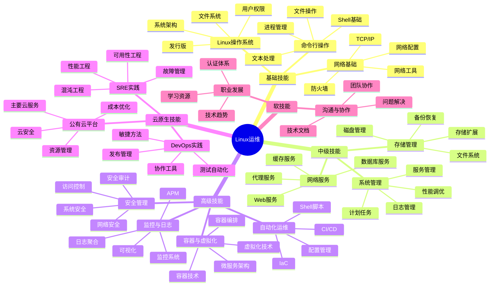

我将为您编写Linux运维技能图谱的详细内容。

---
title: Linux运维技能图谱
icon: diagram
order: 1
---

# Linux运维技能图谱

## 基础技能

### Linux操作系统基础
- **Linux发行版**：RHEL/CentOS、Ubuntu、Debian等主流发行版特点与选择
- **系统架构**：内核、Shell、文件系统层次结构
- **用户与权限管理**：用户/组创建、权限设置、sudo机制
- **文件系统**：ext4、XFS、Btrfs等文件系统特点与管理

### 命令行操作
- **Shell基础**：Bash语法、环境变量、配置文件
- **文本处理**：grep、sed、awk、vim等工具
- **文件操作**：find、tar、rsync等常用命令
- **进程管理**：ps、top、kill、nice等命令
- **系统监控**：iostat、vmstat、netstat、dstat等工具

### 网络基础
- **TCP/IP协议栈**：网络分层模型、常见协议原理
- **网络配置**：IP设置、路由配置、DNS配置
- **网络工具**：ping、traceroute、nslookup、dig、curl等
- **防火墙**：iptables/nftables规则配置、firewalld管理

## 中级技能

### 系统管理
- **服务管理**：systemd服务单元、服务依赖关系
- **日志管理**：rsyslog配置、journald使用、日志轮转
- **计划任务**：crontab、anacron、at命令
- **性能调优**：系统参数优化、资源限制设置
- **软件包管理**：rpm/deb、yum/dnf/apt等包管理工具

### 存储管理
- **磁盘管理**：分区、LVM、软RAID配置
- **文件系统管理**：挂载、配额、快照
- **存储扩展**：SAN、NAS、对象存储基础
- **备份恢复**：备份策略、常用备份工具

### 网络服务
- **Web服务**：Nginx、Apache配置与优化
- **数据库服务**：MySQL/MariaDB、PostgreSQL基础管理
- **缓存服务**：Redis、Memcached部署与管理
- **代理服务**：反向代理、负载均衡配置

## 高级技能

### 自动化运维
- **Shell脚本**：自动化脚本编写、正则表达式
- **配置管理**：Ansible、Puppet、SaltStack等工具
- **CI/CD**：Jenkins、GitLab CI等持续集成工具
- **IaC**：Terraform、CloudFormation等基础设施即代码

### 容器与虚拟化
- **虚拟化技术**：KVM、Xen、VMware基础
- **容器技术**：Docker、Podman基本操作
- **容器编排**：Kubernetes基础概念与操作
- **微服务架构**：服务发现、配置中心、API网关

### 监控与日志
- **监控系统**：Prometheus、Zabbix、Nagios等
- **可视化**：Grafana仪表盘配置
- **日志聚合**：ELK/EFK栈、Graylog
- **APM**：应用性能监控基础

### 安全管理
- **系统安全**：安全基线、漏洞管理、补丁更新
- **访问控制**：SELinux/AppArmor、PAM模块
- **网络安全**：SSH安全、TLS/SSL配置
- **安全审计**：日志审计、入侵检测

## 云原生技能

### 公有云平台
- **AWS/阿里云/腾讯云**：主要服务使用与管理
- **云资源管理**：计算、存储、网络资源配置
- **云安全**：IAM权限、安全组、网络ACL
- **成本优化**：资源规划、弹性伸缩配置

### DevOps实践
- **敏捷方法**：Scrum、看板方法论
- **协作工具**：Git、Jira、Confluence
- **测试自动化**：单元测试、集成测试、端到端测试
- **发布管理**：蓝绿部署、金丝雀发布、A/B测试

### SRE实践
- **可用性工程**：SLI、SLO、SLA定义与监控
- **故障管理**：故障树分析、根因分析
- **混沌工程**：故障注入、弹性测试
- **性能工程**：负载测试、性能分析

## 软技能

### 沟通与协作
- **技术文档**：系统文档、操作手册、故障报告
- **团队协作**：跨团队沟通、知识分享
- **问题解决**：故障排查方法论、分析思路

### 职业发展
- **技术趋势**：新技术学习路径、技术选型
- **认证体系**：RHCE/RHCA、AWS认证、K8s认证
- **学习资源**：技术社区、开源项目、学习平台

## 技能图谱

## 学习路径建议

### 入门阶段（0-6个月）
1. 掌握Linux基础命令和文件系统
2. 学习基本系统管理（用户、权限、服务）
3. 理解网络基础知识和简单配置
4. 编写简单Shell脚本自动化任务

### 进阶阶段（6-18个月）
1. 深入学习系统服务配置与优化
2. 掌握常见应用服务部署与管理
3. 学习自动化工具（如Ansible）
4. 了解容器基础知识和Docker操作

### 资深阶段（18个月以上）
1. 掌握Kubernetes等容器编排技术
2. 构建完整监控和日志分析系统
3. 实践DevOps和SRE理念
4. 深入云原生技术栈和多云管理

## 运维工作职责

### 日常运维
- 系统监控与告警处理
- 性能问题排查与优化
- 安全补丁更新与漏洞修复
- 备份与恢复测试

### 项目支持
- 新系统上线支持
- 容量规划与扩展
- 技术方案评估与实施
- 灾备演练与应急预案

### 持续改进
- 自动化流程建设
- 运维文档维护
- 知识库建设
- 技术债务清理

## 结语

Linux运维是一个不断发展的领域，随着云计算、容器化和DevOps实践的普及，运维工程师的角色正在向平台工程师、SRE工程师等方向演进。掌握这份技能图谱中的核心能力，并保持持续学习的态度，将帮助您在运维领域获得长足发展。