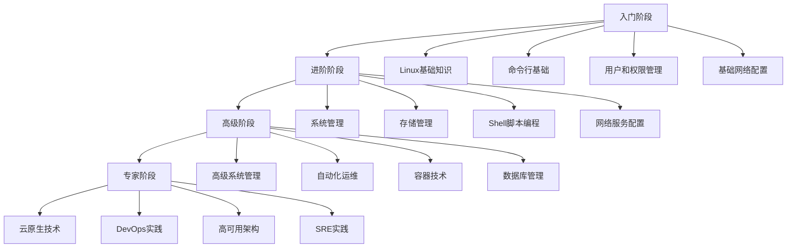

# 从入门到精通的学习路径

本文将为您规划一条从Linux运维入门到精通的学习路径，帮助您系统化地掌握运维技能。通过分阶段学习计划，让您的技能提升更有针对性和连贯性。

## 入门阶段（0-3个月）

### Linux基础知识
- **操作系统概念**：了解操作系统的基本组成、进程管理、内存管理等核心概念
- **Linux发行版选择**：熟悉CentOS/RHEL、Ubuntu、Debian等主流发行版的特点，选择一个作为学习平台
- **虚拟机环境搭建**：使用VirtualBox或VMware创建Linux学习环境，掌握基本安装配置

### 命令行基础
- **Shell基础**：掌握Bash shell的基本操作和概念
- **文件系统导航**：学习`cd`、`ls`、`pwd`等基本命令，理解Linux文件系统层次结构
- **文件操作**：掌握`cp`、`mv`、`rm`、`mkdir`、`touch`等文件管理命令
- **文本处理**：学习`cat`、`less`、`head`、`tail`、`grep`等文本查看和处理命令
- **编辑器使用**：熟练使用vi/vim或nano等文本编辑器

### 用户和权限管理
- **用户管理**：学习`useradd`、`usermod`、`userdel`等用户管理命令
- **组管理**：掌握`groupadd`、`groupmod`、`groupdel`等组管理命令
- **权限体系**：理解Linux权限模型（读、写、执行）和`chmod`、`chown`、`chgrp`命令
- **sudo机制**：了解sudo的工作原理和配置方法

### 基础网络配置
- **网络基础**：了解IP地址、子网掩码、网关、DNS等基本概念
- **网络配置**：学习如何配置网络接口、静态IP和DHCP
- **网络工具**：掌握`ping`、`ifconfig`/`ip`、`netstat`/`ss`等基本网络命令

### 学习资源推荐
- **在线课程**：Linux Foundation的"Introduction to Linux"
- **书籍**：《鸟哥的Linux私房菜》基础篇
- **实践平台**：Linux Journey、TryHackMe的Linux基础路径

## 进阶阶段（3-6个月）

### 系统管理
- **服务管理**：掌握systemd服务管理，学习`systemctl`命令
- **进程管理**：深入了解`ps`、`top`、`kill`、`nice`等进程管理命令
- **日志系统**：学习rsyslog配置和journald日志查看
- **计划任务**：掌握crontab和at命令，实现任务自动化

### 存储管理
- **磁盘分区**：学习`fdisk`、`parted`等分区工具
- **文件系统**：了解ext4、XFS等文件系统的特点和管理
- **LVM管理**：掌握逻辑卷管理的概念和操作
- **RAID配置**：了解软RAID的配置和管理

### Shell脚本编程
- **脚本基础**：学习Shell脚本的基本语法和结构
- **变量和参数**：掌握变量定义、参数传递和环境变量
- **条件和循环**：学习if/else、for、while等控制结构
- **函数**：了解函数定义和使用方法
- **自动化脚本**：编写实用的系统管理脚本

```bash
#!/bin/bash
# 一个简单的系统信息收集脚本示例

echo "系统信息收集开始..."
echo "======================="

# 收集主机名和内核信息
echo "主机名: $(hostname)"
echo "内核版本: $(uname -r)"

# 收集CPU信息
echo "CPU信息:"
lscpu | grep "Model name" | sed 's/Model name://g' | sed 's/^[ \t]*//'

# 收集内存信息
echo "内存使用情况:"
free -h | grep "Mem" | awk '{print "总内存: " $2 ", 已使用: " $3 ", 可用: " $4}'

# 收集磁盘信息
echo "磁盘使用情况:"
df -h | grep "^/dev" | awk '{print $1 " 挂载点: " $6 ", 总容量: " $2 ", 已用: " $3 ", 可用: " $4}'

echo "======================="
echo "信息收集完成!"
```

### 网络服务配置
- **SSH服务**：配置SSH服务器，了解密钥认证和安全加固
- **Web服务**：学习Apache或Nginx的基本配置
- **DNS服务**：了解DNS原理和本地DNS配置
- **防火墙**：掌握iptables或firewalld的基本配置

### 学习资源推荐
- **在线课程**：Udemy上的"Linux Administration Bootcamp"
- **书籍**：《Linux系统管理与网络管理》
- **实践项目**：搭建个人网站或博客服务器

## 高级阶段（6-12个月）

### 高级系统管理
- **性能调优**：学习系统性能分析和调优技术
- **资源监控**：掌握`sar`、`iostat`、`vmstat`等高级监控工具
- **故障排查**：系统故障分析和排查方法论
- **安全加固**：系统安全基线配置和漏洞管理

### 自动化运维
- **配置管理**：学习Ansible自动化工具
- **版本控制**：掌握Git基础操作和工作流
- **CI/CD概念**：了解持续集成和持续部署的基本概念
- **自动化脚本进阶**：编写更复杂的自动化脚本和工具

### 容器技术
- **Docker基础**：学习容器概念和Docker基本操作
- **容器管理**：掌握容器的创建、运行和管理
- **Docker Compose**：学习多容器应用的编排
- **容器网络**：了解容器网络模型和配置方法

### 数据库管理
- **MySQL/MariaDB**：学习数据库安装、配置和基本管理
- **数据备份**：掌握数据库备份和恢复策略
- **性能优化**：了解数据库性能监控和优化基础

### 学习资源推荐
- **在线课程**：Linux Academy的"Red Hat Certified System Administrator"
- **书籍**：《UNIX和Linux系统管理手册》
- **认证准备**：RHCSA或LPIC-1认证学习

## 专家阶段（12个月以上）

### 云原生技术
- **Kubernetes基础**：学习容器编排平台的核心概念
- **云平台使用**：熟悉AWS、阿里云等主流云平台的服务和管理
- **IaC工具**：学习Terraform等基础设施即代码工具
- **微服务架构**：了解微服务设计原则和实践

### DevOps实践
- **CI/CD管道**：构建完整的CI/CD流程
- **监控系统**：学习Prometheus、Grafana等监控工具
- **日志管理**：掌握ELK/EFK栈的部署和使用
- **自动化测试**：了解自动化测试在运维中的应用

### 高可用架构
- **负载均衡**：学习HAProxy、Nginx等负载均衡技术
- **集群技术**：掌握高可用集群的设计和实现
- **数据复制**：了解数据库复制和分片技术
- **灾备设计**：设计完善的灾难恢复方案

### SRE实践
- **可靠性工程**：学习SRE核心理念和实践
- **服务水平目标**：了解SLI、SLO、SLA的定义和监控
- **故障管理**：掌握故障响应、分析和复盘方法
- **容量规划**：学习系统容量预测和规划技术

### 学习资源推荐
- **在线课程**：Kubernetes认证课程（CKA/CKAD）
- **书籍**：《SRE: Google运维解密》、《Kubernetes权威指南》
- **社区参与**：参与开源项目或技术社区

## 学习方法建议

### 实践驱动学习
- **搭建家庭实验室**：使用旧电脑或树莓派搭建实验环境
- **项目驱动**：通过具体项目学习相关技术
- **问题驱动**：解决实际问题来加深理解

### 知识体系构建
- **知识图谱**：绘制个人知识图谱，找出知识盲点
- **定期复习**：使用间隔重复法巩固已学知识
- **教学相长**：尝试向他人解释技术概念，加深理解

### 持续学习习惯
- **每日学习**：保持每天至少1小时的学习时间
- **技术追踪**：关注技术博客、论坛和新闻
- **参与社区**：加入技术社区，与他人交流学习

## 学习路径图



## 技能评估指标

### 入门阶段
- 能够熟练使用基本Linux命令
- 理解文件权限和用户管理
- 能够配置基本网络设置
- 会使用文本编辑器编辑配置文件

### 进阶阶段
- 能够编写基本Shell脚本自动化任务
- 掌握服务管理和日志分析
- 能够配置常见网络服务
- 理解存储管理和文件系统

### 高级阶段
- 能够使用Ansible等工具进行自动化配置
- 掌握Docker容器的创建和管理
- 能够进行系统性能分析和调优
- 具备数据库基本管理能力

### 专家阶段
- 能够设计和实现高可用架构
- 掌握Kubernetes集群的部署和管理
- 能够构建完整的CI/CD流水线
- 具备云平台资源管理和优化能力

## 结语

Linux运维的学习是一个持续的过程，技术栈不断更新，学习永无止境。本文提供的学习路径是一个框架，您可以根据自己的兴趣和职业规划进行调整。关键是保持好奇心和实践精神，通过解决实际问题来提升技能。记住，成为一名优秀的运维工程师不仅需要技术能力，还需要良好的沟通能力和解决问题的思维方式。祝您在Linux运维的学习道路上取得成功！