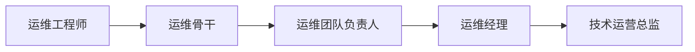
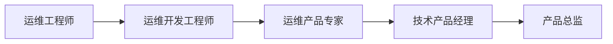

# 不同岗位所需技能对照表

运维领域包含多种不同的岗位方向，每个方向所需的技能侧重点各不相同。本文将详细对比分析不同运维岗位的技能要求，帮助您根据职业规划选择学习重点。

## 传统运维工程师

### 核心职责
- 维护服务器和网络基础设施的稳定运行
- 处理日常故障和问题排查
- 执行系统更新、补丁管理和备份恢复
- 配置和管理各类服务和应用

### 必备技能
| 技能类别 | 重要程度 | 具体技能要求 |
|---------|---------|------------|
| Linux基础 | ★★★★★ | 深入理解Linux系统架构、文件系统、进程管理 |
| Shell脚本 | ★★★★☆ | 能编写中等复杂度的自动化脚本，熟悉awk、sed等工具 |
| 网络知识 | ★★★★☆ | 掌握TCP/IP协议栈，能进行网络故障排查和配置 |
| 服务配置 | ★★★★★ | 熟练配置Web服务器、数据库、缓存等常用服务 |
| 监控技能 | ★★★★☆ | 能部署和使用Zabbix、Nagios等监控系统 |
| 安全知识 | ★★★☆☆ | 了解基本安全加固方法和防火墙配置 |
| 虚拟化   | ★★★☆☆ | 熟悉VMware、KVM等虚拟化平台的管理 |

### 技能提升路径
1. 深入学习Linux系统内部机制和性能调优
2. 提升Shell脚本编程能力，实现更复杂的自动化任务
3. 学习更多服务的配置和优化方法
4. 掌握备份恢复和灾难恢复的最佳实践

## 云平台运维工程师

### 核心职责
- 管理和维护云平台基础设施
- 设计和实施云资源的部署方案
- 优化云资源使用效率和成本
- 保障云平台的安全性和可用性

### 必备技能
| 技能类别 | 重要程度 | 具体技能要求 |
|---------|---------|------------|
| 云服务知识 | ★★★★★ | 深入了解AWS/阿里云/腾讯云等主流云平台的核心服务 |
| IaC工具 | ★★★★☆ | 熟练使用Terraform、CloudFormation等基础设施即代码工具 |
| Linux基础 | ★★★★☆ | 掌握Linux系统管理和故障排查能力 |
| 网络知识 | ★★★★★ | 理解VPC、子网、安全组、负载均衡等云网络概念 |
| 安全知识 | ★★★★☆ | 了解云平台安全最佳实践和合规要求 |
| 脚本编程 | ★★★★☆ | 能使用Python/Shell编写云资源管理脚本 |
| 成本优化 | ★★★★☆ | 能分析和优化云资源使用成本 |

### 技能提升路径
1. 获取主流云平台的专业认证（如AWS SA、阿里云ACA/ACP）
2. 学习多云管理和混合云架构设计
3. 深入了解云原生技术栈和服务
4. 掌握云平台自动化运维和监控方法

## DevOps工程师

### 核心职责
- 构建和维护CI/CD流水线
- 推动开发和运维团队协作
- 实现基础设施和应用部署的自动化
- 持续优化开发和部署流程

### 必备技能
| 技能类别 | 重要程度 | 具体技能要求 |
|---------|---------|------------|
| CI/CD工具 | ★★★★★ | 精通Jenkins、GitLab CI、GitHub Actions等CI/CD工具 |
| 容器技术 | ★★★★★ | 深入理解Docker和容器编排技术 |
| 代码管理 | ★★★★★ | 熟练使用Git和代码版本控制最佳实践 |
| 自动化测试 | ★★★★☆ | 了解自动化测试框架和集成测试方法 |
| 配置管理 | ★★★★☆ | 熟练使用Ansible、Puppet等配置管理工具 |
| 编程能力 | ★★★★☆ | 具备Python、Go等语言的编程能力 |
| Linux基础 | ★★★★☆ | 掌握Linux系统管理和故障排查 |

### 技能提升路径
1. 深入学习现代CI/CD工具和方法论
2. 提升容器和Kubernetes技能
3. 学习基础设施即代码(IaC)和配置即代码(CaC)
4. 掌握DevSecOps实践，将安全融入开发流程

## SRE工程师

### 核心职责
- 设计和实施高可用、高可靠的系统架构
- 建立和优化监控、告警和故障响应机制
- 通过自动化减少人工操作和错误
- 分析和改进系统性能和可靠性

### 必备技能
| 技能类别 | 重要程度 | 具体技能要求 |
|---------|---------|------------|
| 系统设计 | ★★★★★ | 能设计高可用、可扩展的系统架构 |
| 监控告警 | ★★★★★ | 精通Prometheus、Grafana等监控工具和方法论 |
| 性能分析 | ★★★★★ | 能进行深入的性能分析和调优 |
| 自动化能力 | ★★★★★ | 高度自动化的思维和实现能力 |
| 编程能力 | ★★★★☆ | 具备较强的编程能力，能开发运维工具 |
| 容器技术 | ★★★★☆ | 深入理解容器和Kubernetes |
| 故障管理 | ★★★★★ | 掌握故障分析、定位和复盘方法 |

### 技能提升路径
1. 学习Google SRE实践和方法论
2. 深入理解分布式系统原理和设计模式
3. 提升数据分析和可观测性技能
4. 学习混沌工程和弹性设计

## 容器云平台工程师

### 核心职责
- 设计、部署和维护Kubernetes集群
- 构建和优化容器化应用的运行环境
- 实现容器平台的自动化运维
- 保障容器平台的安全性和稳定性

### 必备技能
| 技能类别 | 重要程度 | 具体技能要求 |
|---------|---------|------------|
| Kubernetes | ★★★★★ | 深入理解Kubernetes架构和核心组件 |
| 容器技术 | ★★★★★ | 精通Docker和容器运行时 |
| 网络知识 | ★★★★★ | 掌握容器网络模型和CNI插件 |
| 存储技术 | ★★★★☆ | 了解持久化存储和CSI机制 |
| Linux基础 | ★★★★☆ | 具备Linux系统管理和故障排查能力 |
| 监控技能 | ★★★★☆ | 熟悉Prometheus等容器监控方案 |
| CI/CD | ★★★★☆ | 了解容器化应用的CI/CD流程 |

### 技能提升路径
1. 获取CKA、CKAD等Kubernetes认证
2. 学习服务网格(Service Mesh)技术
3. 深入了解云原生生态系统的各种工具
4. 掌握Kubernetes安全最佳实践

## 数据库运维工程师

### 核心职责
- 管理和维护各类数据库系统
- 设计和实施数据库备份恢复方案
- 优化数据库性能和资源使用
- 保障数据库的安全性和可用性

### 必备技能
| 技能类别 | 重要程度 | 具体技能要求 |
|---------|---------|------------|
| 数据库原理 | ★★★★★ | 深入理解数据库系统内部原理 |
| SQL能力 | ★★★★★ | 精通SQL语言和查询优化 |
| 性能调优 | ★★★★★ | 能进行数据库性能分析和调优 |
| 备份恢复 | ★★★★★ | 熟练掌握各种备份恢复策略和工具 |
| 高可用方案 | ★★★★☆ | 了解数据库集群和复制技术 |
| Linux基础 | ★★★★☆ | 具备Linux系统管理能力 |
| 监控技能 | ★★★★☆ | 能搭建数据库监控系统 |

### 技能提升路径
1. 深入学习特定数据库(MySQL/PostgreSQL/MongoDB等)的内部机制
2. 掌握数据库高可用架构设计和实现
3. 学习数据库安全加固和审计方法
4. 了解NewSQL和分布式数据库技术

## 安全运维工程师

### 核心职责
- 实施和维护系统安全防护措施
- 监控和应对安全威胁和漏洞
- 进行安全审计和合规检查
- 制定和执行安全策略和规范

### 必备技能
| 技能类别 | 重要程度 | 具体技能要求 |
|---------|---------|------------|
| 安全基础 | ★★★★★ | 深入理解网络和系统安全原理 |
| 漏洞管理 | ★★★★★ | 熟悉漏洞扫描和修复流程 |
| 防火墙/WAF | ★★★★★ | 精通防火墙、WAF等安全设备配置 |
| 入侵检测 | ★★★★☆ | 了解IDS/IPS系统和安全监控 |
| Linux安全 | ★★★★★ | 掌握Linux系统安全加固方法 |
| 安全合规 | ★★★★☆ | 了解等级保护、ISO27001等安全标准 |
| 应急响应 | ★★★★☆ | 具备安全事件响应和处置能力 |

### 技能提升路径
1. 获取安全相关认证(如CISSP、CISP等)
2. 学习渗透测试和安全评估方法
3. 深入了解云平台和容器安全
4. 掌握安全自动化和DevSecOps实践

## 网络运维工程师

### 核心职责
- 设计、部署和维护网络基础设施
- 监控和优化网络性能
- 排查和解决网络故障
- 实施网络安全防护措施

### 必备技能
| 技能类别 | 重要程度 | 具体技能要求 |
|---------|---------|------------|
| 网络协议 | ★★★★★ | 深入理解TCP/IP协议栈和路由协议 |
| 网络设备 | ★★★★★ | 熟练配置路由器、交换机等网络设备 |
| 网络架构 | ★★★★★ | 能设计可靠、高性能的网络架构 |
| 网络安全 | ★★★★☆ | 了解网络安全设备和防护策略 |
| 监控工具 | ★★★★☆ | 熟悉网络监控工具和方法 |
| 故障排查 | ★★★★★ | 具备网络故障分析和排查能力 |
| SDN/NFV | ★★★☆☆ | 了解软件定义网络和网络功能虚拟化 |

### 技能提升路径
1. 获取网络厂商认证(如CCNA/CCNP、HCNA/HCNP等)
2. 学习现代网络架构和设计模式
3. 深入了解云网络和容器网络
4. 掌握网络自动化和编程技能

## 岗位技能对比图

```mermaid
radar
    title 不同运维岗位技能雷达图
    Linux基础: 90,80,80,80,80,80,70
    自动化能力: 70,80,90,95,85,70,75
    网络知识: 80,90,70,75,85,75,95
    安全技能: 60,80,70,80,70,95,80
    编程能力: 70,80,90,90,80,70,70
    容器技术: 60,75,95,90,95,60,60
    监控能力: 80,75,80,95,85,80,85
```

## 跨岗位核心能力

无论您选择哪个运维方向，以下核心能力都是各个岗位共同需要的：

### 1. 问题分析与解决能力
在运维工作中，故障排查和问题解决是日常工作的核心。培养系统性思维和逻辑分析能力，建立有效的问题定位和解决方法论，是所有运维工程师的必备素质。

### 2. 自动化思维
随着基础设施规模的扩大，手动操作已经无法满足需求。具备自动化思维，能够识别可自动化的任务并实现自动化，是提高效率和减少人为错误的关键。

### 3. 持续学习能力
技术更新迭代速度快，运维工程师需要保持持续学习的习惯，跟踪新技术发展趋势，不断更新知识体系。

### 4. 沟通协作能力
运维工作需要与开发、测试、产品等多个团队协作。良好的沟通能力和团队协作精神能够提高工作效率，减少沟通成本。

### 5. 文档编写能力
完善的文档是知识传承和团队协作的基础。运维工程师需要具备清晰表达和文档编写能力，将经验和知识沉淀下来。

## 岗位选择建议

### 个人兴趣与特长匹配
- 如果您喜欢深入研究系统内部机制，传统运维或SRE可能更适合
- 如果您对自动化和编程有浓厚兴趣，DevOps方向值得考虑
- 如果您对网络和安全领域感兴趣，网络运维或安全运维是不错的选择

### 行业发展趋势考量
- 云计算和容器技术是当前主流趋势，云平台运维和容器云平台工程师需求旺盛
- 随着安全意识提升，安全运维岗位的重要性日益凸显
- DevOps和SRE理念正被越来越多的企业采纳

### 企业规模与岗位细分
- 大型企业通常岗位分工更细，可以选择专精某个领域
- 中小企业可能需要全栈型运维人才，需要掌握更广泛的技能
- 创业公司可能需要DevOps工程师，兼顾开发和运维职责

## 职业发展路径

### 技术专家路线
深耕特定技术领域，成为该领域的专家和权威，可以向架构师或技术专家方向发展。


### 管理路线
逐步承担团队管理职责，从技术骨干发展为团队负责人，最终成为技术管理者。



### 产品路线
将运维经验转化为产品思维，参与或主导运维产品的设计和开发，如监控平台、自动化工具等。



## 结语

运维领域的岗位多样，每个岗位都有其独特的技能要求和发展路径。选择适合自己的岗位方向，有针对性地学习和提升相关技能，是运维职业发展的关键。无论选择哪个方向，扎实的基础知识、持续学习的态度和解决问题的能力都是成功的基石。希望本文的岗位技能对照表能够帮助您更清晰地了解各个运维岗位的要求，为职业规划提供参考。