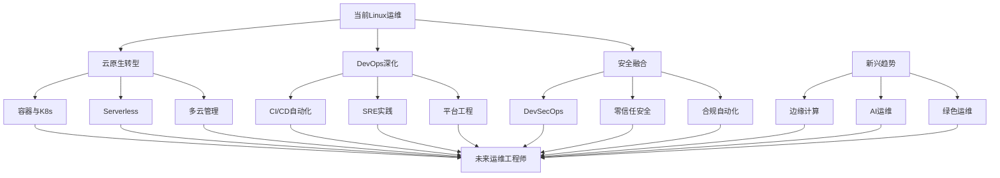

# Linux运维发展趋势与前景

随着云计算、容器化、DevOps等技术的发展，Linux运维工作也在不断演进。本文分析了当前运维领域的技术趋势和未来发展方向，帮助您把握行业脉搏，做好职业规划。

## 云原生技术的全面普及

云原生技术正在重塑运维工作的本质，从传统的基础设施管理转向平台工程和服务编排。

### 容器化与编排技术

容器技术彻底改变了应用的打包、分发和运行方式，而Kubernetes则成为了容器编排的事实标准。

#### Docker与容器生态
- **标准化应用交付**：容器解决了"在我机器上能运行"的问题，实现了应用的标准化交付
- **轻量级虚拟化**：相比传统虚拟机，容器共享主机内核，资源占用更少，启动更快
- **镜像分层机制**：Docker的镜像分层设计使得镜像构建和分发更加高效
- **容器运行时演进**：从Docker到containerd、CRI-O等OCI兼容运行时，生态更加开放

#### Kubernetes主导地位
- **声明式配置**：通过YAML定义期望状态，Kubernetes负责协调实际状态与期望状态的一致
- **自动化编排**：自动完成容器调度、扩缩容、自愈、滚动更新等复杂操作
- **丰富的扩展机制**：CRD、Operator等扩展机制使其能够管理几乎任何类型的资源
- **服务网格集成**：与Istio等服务网格技术结合，提供更强大的微服务治理能力

#### 运维工作的转变
- **从管理服务器到管理集群**：关注点从单机管理转向集群管理
- **基础设施即代码**：通过代码定义和管理基础设施，提高一致性和可重复性
- **声明式运维**：关注"应该是什么样"而非"如何做到"，减少手动操作
- **自动化程度提升**：大量重复性工作被自动化，运维人员专注于平台建设

### 无服务器架构

无服务器架构（Serverless）进一步抽象了基础设施，让开发者更专注于业务逻辑。

#### FaaS与BaaS服务
- **函数即服务(FaaS)**：AWS Lambda、Azure Functions等平台允许直接运行函数代码
- **后端即服务(BaaS)**：提供数据库、认证、存储等现成服务，无需自行部署维护
- **事件驱动架构**：基于事件触发函数执行，实现松耦合的系统设计
- **按使用付费模式**：只为实际使用的资源付费，闲置时不产生费用

#### Serverless的影响
- **运维职责变化**：从服务器维护转向平台监控和优化
- **成本模型转变**：从固定成本转向可变成本，需要更精细的成本管理
- **性能监控挑战**：冷启动、分布式追踪等问题需要新的监控方法
- **安全边界扩展**：安全关注点从基础设施扩展到函数和API级别

### 多云与混合云战略

企业越来越倾向于采用多云或混合云策略，以避免厂商锁定并优化成本和性能。

#### 多云管理平台
- **统一控制平面**：通过单一界面管理多个云平台资源
- **跨云编排工具**：使用Terraform等工具实现跨云资源编排
- **云间数据同步**：解决多云环境下的数据一致性和同步问题
- **成本优化引擎**：根据价格和性能需求自动选择最优云服务

#### 混合云架构
- **本地与云端结合**：关键业务保留在本地，弹性需求部署在云端
- **一致的运行环境**：通过容器和Kubernetes实现环境一致性
- **统一身份管理**：跨环境的身份认证和访问控制
- **混合网络连接**：安全高效的本地与云端网络互联

## DevOps与SRE实践深化

DevOps文化和SRE实践正在深入影响运维工作方式，推动更高效的协作和更可靠的服务交付。

### CI/CD流水线自动化

持续集成和持续交付/部署已成为现代软件开发的标准实践。

#### 流水线工具演进
- **从Jenkins到云原生CI/CD**：从传统Jenkins到GitLab CI、GitHub Actions、Tekton等云原生工具
- **声明式流水线**：通过YAML等格式定义流水线，实现版本控制和可重复性
- **流水线即代码**：将CI/CD流水线视为应用代码的一部分，遵循相同的开发实践
- **测试自动化集成**：自动化单元测试、集成测试、端到端测试融入流水线

#### GitOps工作流
- **Git作为单一事实来源**：所有配置和部署定义存储在Git仓库中
- **自动同步机制**：系统自动将Git中的期望状态同步到实际环境
- **审计和回滚能力**：所有变更有记录，可轻松回滚到任何历史版本
- **声明式部署**：通过修改Git中的声明式配置触发部署，而非直接操作系统

```yaml
# GitOps工作流示例：使用Flux CD的配置
apiVersion: source.toolkit.fluxcd.io/v1beta1
kind: GitRepository
metadata:
  name: webapp
  namespace: flux-system
spec:
  interval: 1m
  url: https://github.com/example/webapp
  ref:
    branch: main
---
apiVersion: kustomize.toolkit.fluxcd.io/v1beta1
kind: Kustomization
metadata:
  name: webapp
  namespace: flux-system
spec:
  interval: 10m
  path: "./deploy/production"
  prune: true
  sourceRef:
    kind: GitRepository
    name: webapp
  validation: client
  healthChecks:
    - apiVersion: apps/v1
      kind: Deployment
      name: webapp
      namespace: production
```

### SRE实践与可靠性工程

SRE（Site Reliability Engineering，站点可靠性工程）将软件工程应用于运维问题，提高系统可靠性。

#### SLI、SLO与SLA
- **服务水平指标(SLI)**：衡量服务性能的具体指标，如可用性、延迟、错误率
- **服务水平目标(SLO)**：对SLI的目标值，如"99.9%的请求延迟小于200ms"
- **服务水平协议(SLA)**：与用户的正式协议，包含未达标的后果
- **错误预算**：允许的服务不可用时间，用于平衡可靠性和创新速度

#### 可观测性三大支柱
- **日志(Logs)**：记录系统中发生的离散事件
- **指标(Metrics)**：系统行为的数值表示，便于聚合和分析
- **追踪(Traces)**：跟踪请求在分布式系统中的完整路径
- **关联分析**：将三者关联起来，提供系统行为的完整视图

#### 混沌工程实践
- **故障注入**：主动注入故障，测试系统韧性
- **游戏日演练**：定期进行故障模拟演练，提高团队应对能力
- **自动化恢复机制**：开发自动检测和恢复故障的机制
- **持续验证假设**：通过实验验证对系统行为的假设

### 运维自动化与编程

运维工作越来越依赖编程能力，从脚本自动化到复杂的自动化系统开发。

#### 基础设施即代码(IaC)
- **声明式配置工具**：使用Terraform、Pulumi等工具声明式定义基础设施
- **配置管理演进**：从Puppet、Chef到Ansible，再到不可变基础设施模式
- **版本控制集成**：基础设施代码纳入版本控制，实现审计和回滚
- **测试驱动基础设施**：对基础设施代码进行单元测试和集成测试

#### 运维编程语言趋势
- **Python主导地位**：Python凭借简洁语法和丰富库成为运维首选语言
- **Go语言崛起**：Go语言在云原生工具开发中日益流行
- **专用DSL发展**：HCL(HashiCorp Configuration Language)等领域特定语言兴起
- **函数式编程应用**：函数式编程理念在自动化工具中的应用

#### 自动化平台构建
- **自服务门户**：为开发团队提供自助服务能力
- **工作流编排**：通过可视化界面或代码定义复杂的自动化工作流
- **API驱动架构**：所有功能通过API暴露，便于集成和扩展
- **事件驱动自动化**：基于系统事件触发自动化操作

## 安全与合规的融合

安全不再是事后考虑的问题，而是从设计阶段就融入整个生命周期。

### DevSecOps实践

DevSecOps将安全实践融入DevOps流程，实现"左移"安全。

#### 安全左移策略
- **设计阶段安全**：在系统设计阶段考虑安全因素
- **代码安全扫描**：在CI流程中集成SAST(静态应用安全测试)
- **依赖检查**：自动检查和更新有漏洞的依赖
- **容器镜像扫描**：部署前检查容器镜像中的漏洞

#### 安全即代码
- **安全策略即代码**：将安全策略编写为代码，纳入版本控制
- **合规检查自动化**：自动验证系统是否符合安全标准和法规
- **安全测试自动化**：将安全测试集成到CI/CD流程中
- **基础设施安全扫描**：使用工具自动检查基础设施配置中的安全问题

```yaml
# 在CI/CD流水线中集成安全扫描的示例
stages:
  - build
  - test
  - security
  - deploy

build:
  stage: build
  script:
    - docker build -t myapp:$CI_COMMIT_SHA .

unit_tests:
  stage: test
  script:
    - docker run myapp:$CI_COMMIT_SHA npm test

dependency_check:
  stage: security
  script:
    - npm audit

container_scan:
  stage: security
  script:
    - trivy image myapp:$CI_COMMIT_SHA

deploy:
  stage: deploy
  script:
    - kubectl apply -f k8s/deployment.yaml
  only:
    - main
```

### 零信任安全模型

零信任模型正在取代传统的边界安全模型，适应现代分布式系统的安全需求。

#### 身份为新边界
- **强身份验证**：基于多因素认证和证书的身份验证
- **最小权限原则**：只授予完成任务所需的最小权限
- **动态访问控制**：基于上下文(设备、位置、时间等)动态调整访问权限
- **持续验证**：不断重新验证身份和权限，而非一次性验证

#### 微分段与服务网格安全
- **网络微分段**：将网络划分为小的安全区域，限制横向移动
- **服务间认证**：服务之间通过mTLS进行双向认证
- **细粒度访问控制**：基于身份和策略控制服务间通信
- **加密传输**：所有服务间通信默认加密

#### 安全可观测性
- **安全事件监控**：实时监控和分析安全相关事件
- **异常行为检测**：使用机器学习识别异常访问模式
- **安全态势感知**：全面了解系统安全状态
- **自动响应机制**：自动响应检测到的安全威胁

### 合规自动化

随着法规要求的增加，合规自动化成为必要手段。

#### 合规即代码
- **合规要求编码**：将合规要求转化为可执行的检查代码
- **持续合规验证**：在CI/CD流程中自动验证合规性
- **合规报告自动化**：自动生成合规报告和证据
- **配置漂移检测**：自动检测和修正与合规基线的偏差

#### 审计与追踪
- **不可变日志**：使用不可篡改的日志记录所有操作
- **全面审计跟踪**：记录谁在何时做了什么操作
- **证据自动收集**：自动收集合规审计所需的证据
- **法规变化适应**：快速适应新的法规要求

## 数据驱动的运维决策

数据分析和人工智能正在改变运维决策方式，从经验驱动转向数据驱动。

### AIOps与智能运维

AIOps(人工智能运维)利用AI技术提高运维效率和准确性。

#### 异常检测与预测
- **模式识别**：识别系统行为中的正常和异常模式
- **预测性维护**：预测潜在故障并提前干预
- **根因分析**：自动分析故障根本原因
- **容量预测**：基于历史数据预测未来资源需求

#### 自动化修复与自愈
- **自动诊断**：AI辅助诊断系统问题
- **自动修复**：根据诊断结果自动执行修复操作
- **学习型系统**：从过去的修复经验中学习
- **人机协作**：AI提供建议，人类做最终决策

#### 智能告警与降噪
- **告警关联**：将相关告警分组，减少告警风暴
- **优先级智能排序**：基于影响和紧急程度排序告警
- **告警疲劳减轻**：减少重复和不必要的告警
- **上下文丰富化**：为告警添加有用的上下文信息

### 大规模监控与可观测性

随着系统规模和复杂性增加，监控和可观测性技术也在不断演进。

#### 分布式追踪发展
- **OpenTelemetry标准化**：统一的可观测性数据收集标准
- **全链路追踪**：跟踪请求穿越多个服务的完整路径
- **高基数数据处理**：处理大量唯一标识符的能力
- **实时分析能力**：对追踪数据进行实时分析

#### 监控即代码
- **监控配置版本化**：将监控配置纳入版本控制
- **声明式监控定义**：通过代码定义监控需求
- **监控即服务**：为应用提供自助式监控能力
- **测试驱动监控**：验证监控系统本身的有效性

#### 可视化与仪表板
- **动态仪表板**：根据用户角色和关注点动态调整视图
- **交互式分析**：支持即时查询和深入分析
- **关联视图**：将不同数据源的信息关联展示
- **自定义视图构建**：用户可自定义关注的指标和视图

## 运维职业发展新方向

随着技术变革，运维职业也在发生深刻变化，出现了新的职业发展路径。

### 平台工程兴起

平台工程(Platform Engineering)正成为连接开发和基础设施的关键角色。

#### 内部开发者平台
- **自服务能力**：为开发者提供自助式基础设施和服务
- **抽象复杂性**：隐藏底层复杂性，提供简单接口
- **标准化工作流**：定义和实施标准化的开发和部署流程
- **黄金路径**：为常见场景提供最佳实践路径

#### 平台即产品思维
- **用户体验关注**：将开发者视为平台的用户，关注其体验
- **产品生命周期**：应用产品管理方法论管理平台
- **持续改进循环**：基于用户反馈不断改进平台
- **价值交付衡量**：衡量平台为组织带来的实际价值

#### 平台工程师技能组合
- **全栈技术知识**：从基础设施到应用开发的广泛知识
- **API设计能力**：设计直观易用的平台API
- **自动化专长**：高度自动化平台功能
- **用户体验设计**：为开发者设计流畅的使用体验

### 专业化与T型人才

运维领域正在经历专业化分工，同时也需要具备广泛知识的T型人才。

#### 专业化方向
- **云平台专家**：专注于特定云平台的架构和优化
- **Kubernetes专家**：深入掌握容器编排和云原生技术
- **可观测性工程师**：专注于监控、日志和追踪系统
- **安全运维专家**：专注于DevSecOps和安全自动化

#### T型技能结构
- **广泛的技术视野**：了解各个技术领域的基础知识
- **深度专业技能**：在特定领域具备深入的专业知识
- **跨领域协作能力**：能够与不同专业背景的人员协作
- **持续学习习惯**：不断拓展知识广度和深度

#### 软技能重要性提升
- **沟通表达能力**：清晰表达技术概念和方案
- **团队协作技能**：在跨职能团队中有效协作
- **项目管理能力**：管理复杂技术项目的实施
- **商业价值理解**：将技术工作与业务目标关联

## 未来五年的关键趋势

展望未来五年，以下趋势将深刻影响Linux运维领域。

### 边缘计算与分布式系统

计算正在从集中式云向分布式边缘扩展，带来新的运维挑战。

#### 边缘运维挑战
- **大规模分布式管理**：管理分布在各地的大量边缘节点
- **有限连接环境**：处理网络连接不稳定的边缘环境
- **资源受限设备**：在资源有限的设备上优化应用运行
- **远程故障排除**：远程诊断和修复边缘设备问题

#### 边云协同架构
- **集中管理分散执行**：集中控制平面，分散数据平面
- **离线操作能力**：边缘节点断网时的自主运行能力
- **数据同步机制**：边缘和云端数据的高效同步
- **渐进式部署**：支持边缘环境的渐进式更新

### 可持续性与绿色运维

环境可持续性正成为IT运营的重要考量因素。

#### 能源效率优化
- **碳足迹监控**：监测和报告IT基础设施的碳排放
- **能耗优化策略**：优化服务器和数据中心能源使用
- **动态资源调度**：根据能源效率动态调度工作负载
- **硬件生命周期管理**：延长硬件使用寿命，减少电子废物

#### 可持续发展实践
- **绿色采购标准**：将可持续性纳入技术采购决策
- **远程工作基础设施**：支持远程工作，减少通勤碳排放
- **数据中心选址**：考虑可再生能源可用性的数据中心选址
- **环境影响评估**：评估技术决策的环境影响

### 技能转型与持续学习

技术快速变化要求运维人员不断学习和适应。

#### 学习路径演变
- **从专业到通用**：从专业技术知识向通用问题解决能力转变
- **从工具到原理**：从掌握特定工具到理解底层原理
- **从手动到编程**：从手动操作到编程自动化
- **从技术到业务**：从纯技术视角到业务价值视角

#### 持续学习策略
- **微学习习惯**：培养每日学习小知识点的习惯
- **实践项目驱动**：通过实际项目学习新技术
- **社区参与**：积极参与技术社区和开源项目
- **知识管理系统**：建立个人知识管理系统



## 如何为未来做好准备

面对快速变化的运维领域，如何做好准备至关重要。

### 技能投资策略

明智地投资时间学习最有价值的技能。

#### 核心技能巩固
- **Linux基础**：深入理解Linux系统原理和内部机制
- **网络基础**：掌握网络协议和架构的核心概念
- **编程能力**：至少精通一种编程语言(如Python或Go)
- **安全思维**：培养安全第一的思维方式

#### 新兴技术学习
- **容器和Kubernetes**：深入学习容器技术和编排系统
- **云平台技能**：掌握至少一个主流云平台的核心服务
- **IaC工具**：学习Terraform等基础设施即代码工具
- **可观测性技术**：了解现代监控和可观测性实践

#### 软技能培养
- **沟通表达**：提升技术沟通和文档编写能力
- **问题解决**：培养系统性思考和问题分析能力
- **团队协作**：发展在跨职能团队中的协作能力
- **业务理解**：培养对业务目标和价值的理解

### 实践学习路径

通过实践项目加速学习和技能应用。

#### 个人实验环境
- **家庭实验室**：搭建个人实验环境练习新技术
- **云沙箱环境**：利用云平台免费层级实践云技术
- **开源工具链**：使用开源工具构建完整的DevOps环境
- **自动化项目**：开发解决实际问题的自动化工具

#### 社区参与
- **开源贡献**：参与开源项目开发或文档编写
- **技术社区**：加入技术社区分享和学习
- **技术会议**：参加行业会议扩展视野和人脉
- **知识分享**：通过博客或视频分享所学知识

#### 职业规划
- **定期技能评估**：定期评估自己的技能图谱
- **目标岗位分析**：分析目标岗位所需的关键技能
- **有针对性学习**：根据职业目标有针对性地学习
- **导师指导寻求**：寻找行业导师获取指导和建议

## 结语

Linux运维领域正经历前所未有的变革，从传统的服务器管理转向云原生平台工程和自动化运维。这一转变既带来挑战，也创造了新的机遇。通过拥抱云原生技术、DevOps文化、安全自动化和数据驱动决策，运维工程师可以在这个变革时代保持竞争力。

未来的运维工程师将不再仅仅是系统的维护者，而是业务价值的创造者、平台的构建者和创新的推动者。通过持续学习、实践和适应，每个运维专业人士都能在这个充满机遇的时代找到自己的发展路径。

记住，在技术快速变化的今天，最宝贵的能力不是掌握特定工具，而是学习新技术的能力、解决复杂问题的思维方式和创造业务价值的洞察力。这些核心能力将帮助您在Linux运维的未来之路上走得更远、更成功。