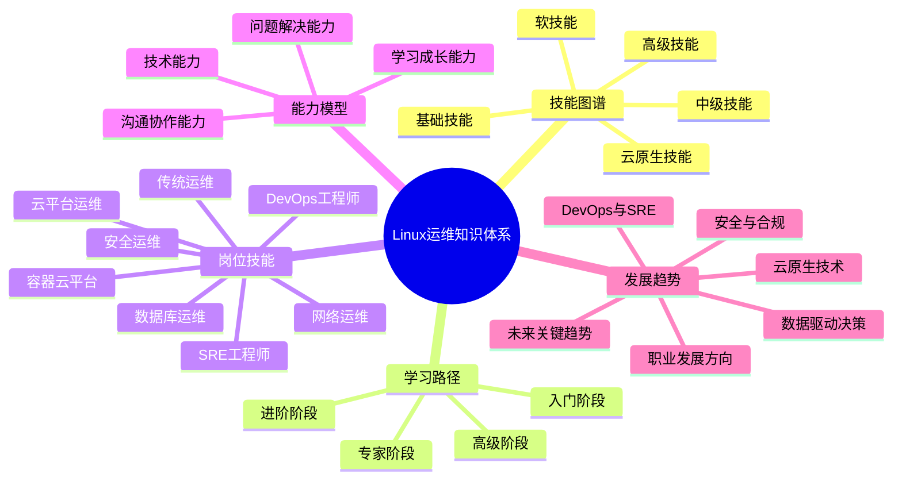

# 运维知识体系概览

本节内容将帮助您了解Linux运维工程师的核心技能体系，为学习提供清晰的指导。通过全面的知识图谱和能力模型，让您对运维工作有整体认识，明确学习方向和目标。

## 知识体系结构

Linux运维是一个涵盖广泛技术领域的综合性工作，需要掌握从基础设施到自动化工具的多层次知识。本章节通过五个核心部分，为您构建完整的运维知识体系框架：

### [Linux运维技能图谱](./01-Linux运维技能图谱.md)

这部分内容为您展示了运维工程师需要掌握的核心技能全景图，帮助您了解运维工作的全貌。从基础技能到高级能力，系统梳理了运维工程师的知识领域，包括：

- 基础技能：Linux操作系统基础、命令行操作、网络基础
- 中级技能：系统管理、存储管理、网络服务
- 高级技能：自动化运维、容器与虚拟化、监控与日志、安全管理
- 云原生技能：公有云平台、DevOps实践、SRE实践
- 软技能：沟通与协作、职业发展

通过这份技能图谱，您可以全面了解运维工程师需要掌握的技术栈和知识体系。

### [从入门到精通的学习路径](./02-从入门到精通的学习路径.md)

为了帮助您系统化地学习运维技能，这部分内容规划了一条从入门到精通的学习路径。按照不同阶段的学习目标和重点，为您提供了清晰的学习指南：

- 入门阶段（0-3个月）：Linux基础知识、命令行基础、用户和权限管理、基础网络配置
- 进阶阶段（3-6个月）：系统管理、存储管理、Shell脚本编程、网络服务配置
- 高级阶段（6-12个月）：高级系统管理、自动化运维、容器技术、数据库管理
- 专家阶段（12个月以上）：云原生技术、DevOps实践、高可用架构、SRE实践

每个阶段都配有详细的学习内容、推荐资源和实践建议，帮助您循序渐进地提升运维技能。

### [不同岗位所需技能对照表](./03-不同岗位所需技能对照表.md)

运维领域包含多种不同的岗位方向，每个方向所需的技能侧重点各不相同。这部分内容详细对比分析了不同运维岗位的技能要求，包括：

- 传统运维工程师：系统稳定性维护、故障处理、服务配置管理
- 云平台运维工程师：云资源管理、多云策略、成本优化
- DevOps工程师：CI/CD流水线、容器技术、自动化测试
- SRE工程师：可靠性设计、监控告警、性能分析
- 容器云平台工程师：Kubernetes管理、容器网络、微服务架构
- 数据库运维工程师：数据库优化、备份恢复、高可用方案
- 安全运维工程师：安全防护、漏洞管理、合规检查
- 网络运维工程师：网络架构、设备配置、故障排查

通过这份对照表，您可以根据自己的职业规划，有针对性地选择学习重点。

### [运维工程师核心能力模型](./04-运维工程师核心能力模型.md)

除了技术知识外，优秀的运维工程师还需要具备多方面的核心能力。这部分内容详细阐述了运维工程师的核心能力模型，包括：

- 技术能力：系统管理能力、网络技术能力、自动化能力、安全防护能力
- 问题解决能力：故障分析能力、应急响应能力、性能优化能力
- 沟通协作能力：团队协作能力、业务理解能力、文档编写能力
- 学习成长能力：技术学习能力、知识体系构建、职业发展规划

这个能力模型帮助您全面评估自己的能力水平，找出需要提升的方向，制定有针对性的能力发展计划。

### [Linux运维发展趋势与前景](./05-Linux运维发展趋势与前景.md)

随着技术的快速发展，运维领域也在不断演进。这部分内容分析了当前运维领域的技术趋势和未来发展方向，包括：

- 云原生技术的全面普及：容器化与编排技术、无服务器架构、多云与混合云战略
- DevOps与SRE实践深化：CI/CD流水线自动化、SRE实践与可靠性工程、运维自动化与编程
- 安全与合规的融合：DevSecOps实践、零信任安全模型、合规自动化
- 数据驱动的运维决策：AIOps与智能运维、大规模监控与可观测性
- 运维职业发展新方向：平台工程兴起、专业化与T型人才、软技能重要性提升
- 未来五年的关键趋势：边缘计算与分布式系统、可持续性与绿色运维、技能转型与持续学习

了解这些趋势，有助于您把握行业脉搏，做好职业规划，在快速变化的技术环境中保持竞争力。

## 如何使用本知识体系

为了充分利用这套知识体系，建议您按照以下步骤进行学习：

1. **整体了解**：首先通过[Linux运维技能图谱](./01-Linux运维技能图谱.md)了解运维工作的全貌和所需技能
2. **规划路径**：参考[从入门到精通的学习路径](./02-从入门到精通的学习路径.md)，根据自己的基础制定学习计划
3. **明确方向**：通过[不同岗位所需技能对照表](./03-不同岗位所需技能对照表.md)，确定自己感兴趣的运维方向
4. **能力评估**：使用[运维工程师核心能力模型](./04-运维工程师核心能力模型.md)评估自己的能力水平，找出需要提升的方向
5. **把握趋势**：了解[Linux运维发展趋势与前景](./05-Linux运维发展趋势与前景.md)，确保学习内容与行业发展同步

记住，运维知识体系是一个不断发展的领域，持续学习和实践是成为优秀运维工程师的关键。通过本章节提供的框架和指导，您可以更加系统、高效地学习运维知识，在运维领域取得长足的发展。

## 知识体系思维导图

通过这套完整的知识体系，您将能够清晰地了解运维工作的全貌，有针对性地学习所需技能，为成为一名优秀的Linux运维工程师打下坚实基础。