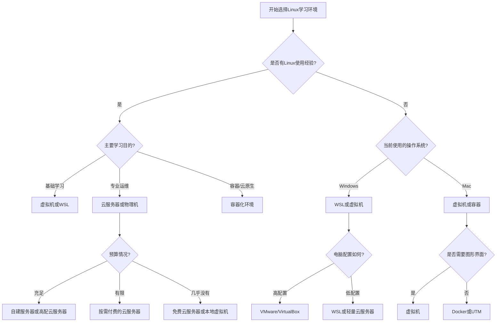

# 学习环境准备

选择合适的学习环境是掌握Linux运维技能的重要基础。本章将全面介绍各种Linux学习环境的搭建方法，帮助您根据自身条件选择最适合的学习方式，为Linux运维技能的学习打下坚实基础。

## 本章内容概览

### [Linux学习环境对比分析](./01-Linux学习环境对比分析.md)

不同的Linux学习环境各有优缺点，本节将详细对比物理机安装、虚拟机、WSL、云服务器和容器化环境等多种学习方式，分析它们的适用场景、优势与局限性，帮助您根据自身需求做出明智选择。

### [Windows和Mac下的学习环境搭建](./02-Windows和Mac下的学习环境搭建.md)

对于Windows和Mac用户，本节提供了详细的环境搭建指南，包括虚拟机安装配置、WSL(Windows Subsystem for Linux)设置、远程连接工具使用等内容，让您无需更换主力操作系统即可高效学习Linux。

### [云服务器选择与配置指南](./03-云服务器选择与配置指南.md)

云服务器是学习Linux运维的理想环境，本节将介绍主流云服务提供商的特点、如何选择适合学习的云服务器配置、安全设置以及成本控制策略，帮助您在云端搭建专业的Linux学习环境。

### [常用工具与资源推荐](./04-常用工具与资源推荐.md)

高效的工具能显著提升学习效率，本节推荐了Linux运维学习过程中常用的工具和学习资源，包括SSH客户端、终端模拟器、文本编辑器、在线学习平台、书籍和社区等，帮助您更高效地学习和工作。

### [高效学习方法与路径规划](./05-高效学习方法与路径规划.md)

掌握高效的学习方法可以事半功倍。本节分享了学习Linux运维的有效策略和方法，包括实践驱动学习、项目式学习、问题导向学习等，以及如何制定个性化的学习计划和目标，帮助您系统性地提升Linux运维技能。

通过本章的学习，您将能够根据自身情况选择并搭建最适合的Linux学习环境，掌握必要的工具使用方法，并采用科学的学习策略，为后续深入学习Linux运维技能奠定坚实基础。

## 环境选择决策树

根据您的具体情况，可以参考以下决策树来选择最适合的Linux学习环境：

## 环境准备核心要点

无论您选择哪种学习环境，以下是需要重点关注的核心要点：

1. **系统选择**：初学者建议选择Ubuntu或CentOS等主流发行版，它们拥有丰富的学习资源和社区支持
2. **资源分配**：为Linux环境分配足够的系统资源（CPU、内存、存储），确保流畅运行
3. **网络连接**：确保Linux环境能够正常连接网络，便于安装软件和查找资料
4. **备份机制**：建立定期备份机制，防止重要数据丢失
5. **学习工具**：准备好必要的学习工具，如SSH客户端、文本编辑器等
6. **参考资料**：收集相关学习资料，包括官方文档、教程和问题解决方案

通过本章的学习，您将能够建立一个适合自己的Linux学习环境，为后续的技能学习打下坚实基础。记住，选择最适合自己的环境比盲目追求"最好"的环境更重要，关键是能够支持您持续有效地学习和实践。