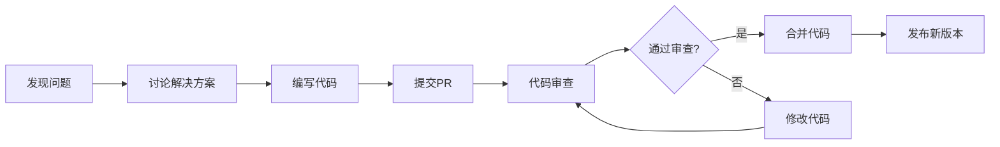

# 开源软件生态系统概述

Linux作为开源软件的代表，已经形成了庞大而活跃的生态系统。本文将介绍开源软件的发展历程、开源许可证类型以及围绕Linux形成的软件生态。

## 1. 开源软件的起源与发展

### 1.1 早期自由软件运动

开源软件的历史可以追溯到20世纪70年代末和80年代初的自由软件运动。这一时期的关键事件包括：

- **1969年**：AT&T贝尔实验室开发UNIX操作系统
- **1983年**：Richard Stallman发起GNU计划，旨在创建一个完全自由的操作系统
- **1985年**：Richard Stallman成立自由软件基金会(FSF)
- **1989年**：第一个GNU通用公共许可证(GPL)发布

Richard Stallman提出的自由软件理念强调用户应该拥有四项基本自由：
1. 为任何目的运行程序的自由
2. 研究和修改程序源代码的自由
3. 重新分发程序副本的自由
4. 分发修改后程序的自由

### 1.2 开源运动的兴起

1990年代末，一群自由软件支持者提出了"开源"(Open Source)这一术语，试图以更加务实的方式推广自由软件的理念：

- **1997年**：Eric Raymond发表《大教堂与集市》，分析了开源开发模式的优势
- **1998年**：Netscape公司开放Navigator浏览器源代码
- **1998年**：开源促进会(OSI)成立，正式定义"开源"概念
- **1998年**：开源定义(OSD)发布，确立开源软件的标准

开源运动强调的是开放源代码的实用价值，如更高的质量、更好的可靠性、更低的成本和更大的灵活性，而不仅仅是自由的哲学意义。

### 1.3 开源软件的现代发展

21世纪以来，开源软件已经从边缘走向主流：

- **2000-2010年**：Linux在服务器市场取得重大突破
- **2008年**：Android（基于Linux内核）发布，开源进入移动领域
- **2010年代**：GitHub等平台极大促进了开源协作
- **2010年代中期**：微软、IBM等传统软件巨头拥抱开源
- **2018年**：Microsoft收购GitHub，IBM收购Red Hat
- **2020年代**：开源已成为云计算、AI和区块链等新兴领域的主导力量

如今，开源软件已经渗透到几乎所有技术领域，从操作系统到数据库，从Web服务器到人工智能框架。

## 2. 开源许可证详解

### 2.1 许可证的基本概念

开源许可证是一种法律工具，定义了用户可以如何使用、修改和分发软件：

- **版权**：软件默认受版权法保护，未经许可不能复制或修改
- **许可证**：作者通过许可证授予用户特定权利
- **条款与条件**：许可证规定了用户必须遵守的条件
- **合规性**：使用开源软件必须遵守其许可证条款

### 2.2 主要开源许可证类型

开源许可证可以大致分为以下几类：

#### 2.2.1 Copyleft许可证（强制共享）

Copyleft许可证要求修改后的作品必须以相同许可证发布：

- **GNU通用公共许可证(GPL)**
  - 最著名的Copyleft许可证
  - 要求任何包含GPL代码的软件也必须以GPL发布
  - 版本：GPLv2、GPLv3
  - 代表项目：Linux内核、GNU工具链

- **GNU宽通用公共许可证(LGPL)**
  - GPL的弱化版本
  - 允许非GPL软件链接LGPL库而不受GPL传染
  - 代表项目：glibc、LibreOffice

- **Mozilla公共许可证(MPL)**
  - 文件级别的Copyleft
  - 只要求修改的文件保持开源
  - 代表项目：Firefox、Thunderbird

#### 2.2.2 宽松许可证（非强制共享）

宽松许可证对衍生作品几乎没有限制：

- **MIT许可证**
  - 极其简短和宽松
  - 只要求保留版权声明和许可证文本
  - 代表项目：X Window System、jQuery、Ruby on Rails

- **BSD许可证**
  - 类似MIT，但有不同变体（2条款、3条款）
  - 代表项目：FreeBSD、部分macOS组件

- **Apache许可证2.0**
  - 更详细的宽松许可证
  - 包含专利授权条款
  - 代表项目：Apache HTTP Server、Android、Hadoop

#### 2.2.3 其他重要许可证

- **Eclipse公共许可证(EPL)**
  - 商业友好的弱Copyleft许可证
  - 代表项目：Eclipse IDE

- **通用开发与分发许可证(CDDL)**
  - Sun Microsystems创建的MPL变体
  - 代表项目：OpenSolaris

- **GNU Affero通用公共许可证(AGPL)**
  - GPL的变体，针对网络服务
  - 要求通过网络提供服务的修改版本也必须开源
  - 代表项目：MongoDB(早期版本)、NextCloud

### 2.3 许可证选择考量

选择开源许可证时应考虑以下因素：

- **项目目标**：是否希望衍生作品保持开源
- **兼容性**：与其他开源组件的许可证兼容性
- **商业考量**：是否允许在专有软件中使用
- **社区期望**：特定开发社区可能偏好某些许可证
- **专利条款**：是否需要明确的专利授权

### 2.4 许可证兼容性

许可证兼容性是指不同许可证的代码能否合法组合：

- **单向兼容**：例如，MIT代码可以包含在GPL项目中，但反之不行
- **不兼容**：某些许可证组合在法律上不兼容
- **常见兼容性路径**：
  - 宽松 → 宽松（通常兼容）
  - 宽松 → Copyleft（通常兼容）
  - Copyleft → Copyleft（可能不兼容，如GPLv2与GPLv3）
  - Copyleft → 宽松（通常不兼容）

## 3. Linux生态系统的核心组件

### 3.1 基础系统组件

Linux生态系统的基础组件包括：

- **Linux内核**：操作系统的核心，负责管理硬件资源
- **GNU工具链**：基本系统工具和库
  - GNU Coreutils：基本命令行工具
  - GNU Compiler Collection (GCC)：编译器集合
  - GNU C Library (glibc)：C标准库
- **Shell**：命令行解释器
  - Bash (Bourne Again SHell)
  - Zsh, Fish等替代shell
- **X Window System / Wayland**：图形显示系统
- **桌面环境**：
  - GNOME
  - KDE Plasma
  - Xfce
  - LXDE/LXQt
  - Cinnamon

### 3.2 系统服务与中间件

Linux平台上的关键服务和中间件：

- **初始化系统**：
  - systemd
  - SysVinit（传统）
  - OpenRC
- **网络服务**：
  - Apache HTTP Server
  - Nginx
  - BIND (DNS服务器)
  - Postfix/Sendmail (邮件服务器)
- **数据库**：
  - MySQL/MariaDB
  - PostgreSQL
  - SQLite
  - MongoDB
  - Redis
- **容器与虚拟化**：
  - Docker
  - Kubernetes
  - KVM
  - LXC/LXD

### 3.3 开发工具与语言

Linux平台支持丰富的开发工具和编程语言：

- **编程语言**：
  - C/C++
  - Python
  - Java
  - JavaScript/Node.js
  - Ruby
  - Go
  - Rust
- **开发工具**：
  - Git（版本控制）
  - Visual Studio Code
  - Eclipse
  - JetBrains系列IDE
  - Vim/Emacs（文本编辑器）
- **构建工具**：
  - Make
  - CMake
  - Gradle
  - Maven
  - npm/yarn

### 3.4 应用软件

Linux平台上的主要应用软件：

- **办公软件**：
  - LibreOffice
  - Calligra Suite
  - ONLYOFFICE
- **图形设计**：
  - GIMP
  - Inkscape
  - Krita
  - Blender
- **多媒体**：
  - VLC Media Player
  - Audacity
  - OBS Studio
  - Kdenlive
- **Web浏览器**：
  - Firefox
  - Chromium/Chrome
  - Opera
  - Brave

## 4. 开源软件的商业模式

### 4.1 主要商业模式

开源软件的商业模式多种多样：

- **开源+专业服务**：
  - 提供咨询、培训、定制开发等服务
  - 例如：Red Hat、SUSE

- **开源核心+专有扩展**：
  - 核心产品开源，高级功能收费
  - 例如：GitLab、Elastic

- **开源+托管服务**：
  - 提供软件即服务(SaaS)
  - 例如：WordPress.com、MongoDB Atlas

- **双重许可**：
  - 同一软件提供开源和商业许可选择
  - 例如：MySQL、Qt

- **开放核心**：
  - 核心功能开源，企业版本收费
  - 例如：Docker、Neo4j

### 4.2 成功的商业案例

几个开源商业成功的代表性案例：

- **Red Hat**：
  - 开源订阅模式的先驱
  - 2019年被IBM以340亿美元收购

- **MySQL**：
  - 最流行的开源数据库之一
  - 2008年被Sun以10亿美元收购，后随Sun并入Oracle

- **Elastic**：
  - Elasticsearch和Elastic Stack的开发者
  - 2018年成功IPO，市值数十亿美元

- **MongoDB**：
  - 领先的NoSQL数据库
  - 2017年IPO，改变许可证以应对云提供商竞争

- **Canonical**：
  - Ubuntu Linux的商业支持者
  - 通过企业支持和云服务盈利

### 4.3 开源基金会的角色

开源基金会在生态系统中扮演重要角色：

- **Linux基金会**：
  - 支持Linux内核和众多其他项目
  - 管理关键项目如Kubernetes、Node.js

- **Apache软件基金会**：
  - "Apache方式"的开源治理模式
  - 管理200多个项目，包括Hadoop、Spark、Kafka

- **Mozilla基金会**：
  - Firefox浏览器背后的组织
  - 推动开放Web标准

- **GNOME基金会**：
  - 支持GNOME桌面环境
  - 促进自由软件桌面生态

- **自由软件基金会**：
  - 支持GNU项目
  - 维护GPL许可证

## 5. 开源社区与协作模式

### 5.1 社区结构与治理

开源项目采用不同的治理模式：

- **独裁者模式**：
  - 单一领导者（如Linux的Linus Torvalds）
  - 最终决策权集中

- **精英治理**：
  - 核心贡献者团队做出决策
  - 基于技术贡献获得影响力

- **基金会治理**：
  - 正式的组织结构和流程
  - 通常用于大型、成熟的项目

- **公司主导**：
  - 由单一公司主导开发
  - 可能接受外部贡献，但决策权在公司内部

### 5.2 贡献流程

典型的开源项目贡献流程包括：

- **问题报告**：发现并报告bug或功能请求
- **讨论**：在邮件列表、论坛或issue tracker上讨论解决方案
- **代码贡献**：提交补丁或pull request
- **代码审查**：由核心开发者审查代码
- **测试与CI**：自动化测试确保质量
- **合并**：通过审查后合并到主代码库
- **发布**：定期发布新版本

### 5.3 社区健康与可持续性

健康的开源社区具有以下特征：

- **活跃的贡献者**：持续有新代码提交
- **贡献者多样性**：不依赖单一个人或组织
- **良好的文档**：便于新人入门和使用
- **明确的行为准则**：促进包容和尊重
- **透明的决策过程**：公开讨论重要决定
- **可持续的资金来源**：支持长期发展

### 5.4 开源开发工具与平台

现代开源开发依赖于多种工具和平台：

- **代码托管平台**：
  - GitHub
  - GitLab
  - Bitbucket
  - SourceForge

- **协作工具**：
  - 邮件列表
  - IRC/Slack/Discord
  - 论坛
  - Wiki

- **持续集成/持续部署**：
  - Jenkins
  - Travis CI
  - GitHub Actions
  - GitLab CI/CD

- **包管理与分发**：
  - npm (JavaScript)
  - PyPI (Python)
  - Maven Central (Java)
  - RubyGems (Ruby)

## 6. 开源软件的优势与挑战

### 6.1 开源软件的优势

开源软件相比专有软件具有多方面优势：

#### 6.1.1 技术优势

- **透明性**：源代码公开，可以审查安全性和质量
- **可定制性**：可以根据需求修改代码
- **创新速度**：全球开发者共同贡献，加速创新
- **标准遵循**：通常更好地遵循开放标准
- **互操作性**：更容易与其他系统集成

#### 6.1.2 经济优势

- **成本效益**：通常免费使用，降低许可成本
- **避免厂商锁定**：不依赖单一供应商
- **共享开发成本**：多方共同投入开发
- **定制化成本降低**：可以直接修改源代码
- **培训资源丰富**：大量免费学习资料

#### 6.1.3 社会优势

- **知识共享**：促进技术知识传播
- **教育价值**：为学生和开发者提供学习资源
- **数字主权**：国家和组织可以控制自己的技术
- **包容性**：降低参与技术开发的门槛
- **长期可持续性**：不依赖单一公司的存续

### 6.2 开源软件面临的挑战

开源软件也面临一系列挑战：

#### 6.2.1 技术挑战

- **用户体验**：有时不如商业软件精致
- **硬件兼容性**：某些专有硬件支持有限
- **碎片化**：过多选择可能导致生态系统分散
- **标准化**：不同项目可能采用不同标准
- **安全响应**：安全漏洞修复依赖社区响应速度

#### 6.2.2 经济挑战

- **可持续发展**：资金来源不稳定
- **商业压力**：与资金充足的专有软件竞争
- **维护负担**：长期维护需要持续投入
- **"免费搭车"问题**：使用者不贡献回馈
- **人才流失**：开发者可能转向薪资更高的工作

#### 6.2.3 社区挑战

- **治理问题**：决策过程可能不够高效
- **贡献者多样性**：某些社区缺乏多样性
- **维护者倦怠**：核心维护者负担过重
- **知识传承**：关键贡献者离开后的知识传递
- **社区冲突**：价值观和目标的分歧

### 6.3 开源软件的未来趋势

开源软件生态系统正在经历一些重要变化：

- **商业参与增加**：大公司越来越多地参与和投资开源
- **新许可证模式**：应对云服务提供商的新型许可证
- **开源基础设施**：关键基础设施越来越依赖开源
- **AI与开源**：开源AI模型和工具的兴起
- **开源治理演进**：更成熟的治理模式和资金机制
- **安全关注提升**：更多关注开源软件供应链安全

## 7. Linux生态系统的未来展望

### 7.1 技术发展方向

Linux生态系统的技术发展趋势包括：

- **容器与云原生技术**：Kubernetes生态系统持续发展
- **边缘计算**：Linux在IoT和边缘设备上的应用扩展
- **安全增强**：更强大的隔离和安全机制
- **实时Linux**：在实时应用领域的拓展
- **系统简化**：模块化和最小化的专用Linux发行版
- **新硬件支持**：对新型处理器架构的支持

### 7.2 社区与生态系统发展

Linux社区和生态系统的发展趋势：

- **商业与社区平衡**：寻找商业参与和社区控制的平衡
- **新参与者模式**：降低贡献门槛，吸引更多样化的贡献者
- **教育与培训**：更系统的知识传递和培训体系
- **跨项目协作**：不同开源项目之间更紧密的协作
- **可持续发展模式**：探索更可持续的资金和维护模式

### 7.3 开源对产业的影响

开源软件将继续深刻影响各行各业：

- **企业IT转型**：更多企业采用开源优先策略
- **政府采用**：政府机构增加开源软件使用
- **教育变革**：开源工具在教育中的应用扩大
- **创新加速**：开源模式加速新技术创新和采用
- **数字主权**：国家和组织通过开源确保技术自主

## 总结

开源软件生态系统，尤其是以Linux为核心的生态，已经从边缘走向主流，成为现代技术基础设施的关键组成部分。从自由软件运动的理想主义起源，到如今的商业成功和广泛应用，开源软件展现了协作创新的强大力量。

开源许可证提供了法律框架，确保软件自由的同时也支持多种商业模式。Linux生态系统的核心组件构成了一个完整的技术栈，从底层系统到应用软件，为用户提供了丰富的选择。

开源社区的协作模式展示了一种新型的组织和生产方式，虽然面临挑战，但也不断探索解决方案。随着技术的发展和社会的变化，开源软件将继续演进，在塑造数字未来的过程中发挥越来越重要的作用。

无论是初学者还是专业人士，理解开源软件生态系统的工作原理和发展趋势，都有助于更好地利用这些资源，并在适当的时候为这个共同的知识宝库做出贡献。