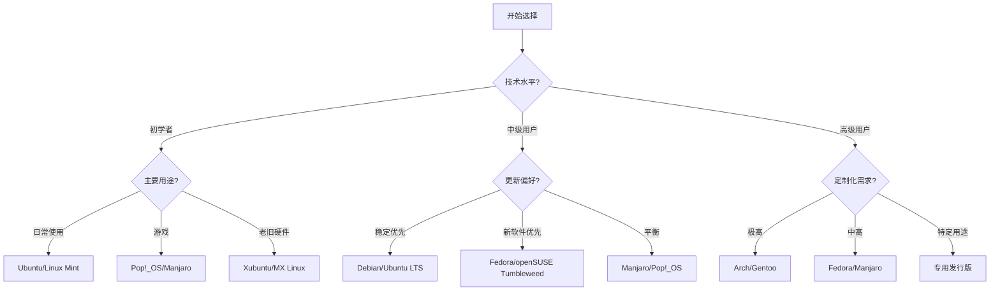

# 选择适合自己的Linux发行版

面对众多Linux发行版，如何选择最适合自己的版本是初学者常见的困惑。本文将提供实用的选择指南和决策流程，帮助您找到最适合自己需求的Linux发行版。

## 1. 了解自己的需求

在选择Linux发行版之前，首先需要明确自己的使用需求和技术水平。

### 1.1 使用场景分析

不同的使用场景适合不同的发行版：

- **个人桌面使用**：
  - 日常办公（文档处理、网页浏览、邮件收发）
  - 多媒体娱乐（视频观看、音乐欣赏、图片处理）
  - 游戏娱乐
  - 学习编程

- **服务器应用**：
  - Web服务器
  - 数据库服务器
  - 文件服务器
  - 虚拟化平台
  - 云计算环境

- **特殊用途**：
  - 嵌入式系统
  - 网络安全测试
  - 科学计算
  - 多媒体制作
  - 教育环境

### 1.2 技术水平评估

诚实评估自己的Linux技术水平，选择适合的入门难度：

- **初学者**：
  - 无Linux使用经验
  - 希望有图形界面和友好的用户体验
  - 需要完善的中文支持
  - 希望安装过程简单直观

- **中级用户**：
  - 有一定Linux使用经验
  - 了解基本命令行操作
  - 能够解决常见问题
  - 愿意学习和探索新功能

- **高级用户**：
  - 丰富的Linux使用经验
  - 熟悉命令行和系统管理
  - 能够编译软件和定制系统
  - 可能需要高度定制化的系统

### 1.3 硬件兼容性考量

考虑您的硬件配置和兼容性需求：

- **计算机年代**：
  - 现代硬件（5年内）：大多数发行版都能良好支持
  - 老旧硬件：需要轻量级发行版
  
- **硬件规格**：
  - CPU架构（x86、x86_64、ARM等）
  - RAM容量（轻量级发行版可能只需512MB，而现代桌面环境可能需要4GB以上）
  - 显卡类型（NVIDIA、AMD、Intel）及驱动支持
  - 特殊硬件（如触摸屏、指纹读取器等）

- **笔记本特定考量**：
  - 电源管理和电池寿命
  - 无线网卡兼容性
  - 触控板支持
  - 休眠/睡眠功能

## 2. 主要发行版家族概览

Linux发行版可以按照其"血统"分为几个主要家族，了解这些家族的特点有助于缩小选择范围。

### 2.1 Debian系

**核心特点**：
- 稳定性高，软件包经过严格测试
- 庞大的软件仓库
- 使用APT包管理系统（.deb格式）
- 强调自由软件理念

**代表发行版**：

1. **Debian**：
   - 特点：极高的稳定性，完全社区驱动
   - 优势：安全可靠，适合服务器
   - 劣势：软件包可能较旧，对新手不够友好
   - 适合用户：系统管理员，喜欢稳定性的用户

2. **Ubuntu**：
   - 特点：基于Debian，注重易用性，每6个月发布一次，LTS版本每2年
   - 优势：大量文档和社区支持，硬件兼容性好
   - 劣势：某些版本可能存在稳定性问题
   - 适合用户：Linux新手，需要良好桌面体验的用户

3. **Linux Mint**：
   - 特点：基于Ubuntu，提供传统桌面体验
   - 优势：对Windows用户友好，预装多媒体编解码器
   - 劣势：创新性较低，依赖上游更新
   - 适合用户：从Windows迁移的用户，喜欢传统界面的用户

4. **Pop!_OS**：
   - 特点：基于Ubuntu，由System76电脑制造商开发
   - 优势：针对NVIDIA显卡优化，开发者友好
   - 劣势：定制化程度较高，可能与某些Ubuntu教程不完全兼容
   - 适合用户：开发者，游戏玩家，使用NVIDIA显卡的用户

### 2.2 Red Hat系

**核心特点**：
- 企业级稳定性和安全性
- 使用RPM包管理系统（.rpm格式）
- 强调商业支持和认证
- 较长的发行周期

**代表发行版**：

1. **Red Hat Enterprise Linux (RHEL)**：
   - 特点：企业级Linux，提供商业支持和认证
   - 优势：稳定性极高，长期支持，广泛的企业应用
   - 劣势：需要付费订阅，对个人用户不够友好
   - 适合用户：企业用户，需要商业支持的组织

2. **Fedora**：
   - 特点：由Red Hat赞助的社区项目，RHEL的上游
   - 优势：创新前沿，采用最新技术，开发者友好
   - 劣势：更新频繁，稳定性可能不如LTS发行版
   - 适合用户：技术爱好者，开发者，喜欢尝鲜的用户

3. **Rocky Linux / AlmaLinux**：
   - 特点：RHEL的免费替代品，CentOS的精神继承者
   - 优势：与RHEL二进制兼容，长期稳定支持
   - 劣势：创新性较低，主要面向服务器应用
   - 适合用户：系统管理员，需要RHEL兼容性的用户

### 2.3 SUSE系

**核心特点**：
- 欧洲起源，在企业环境中受欢迎
- 使用RPM包管理系统，但有自己的工具Zypper
- 强大的YaST配置工具
- 良好的KDE Plasma支持

**代表发行版**：

1. **SUSE Linux Enterprise (SLE)**：
   - 特点：企业级Linux，提供商业支持
   - 优势：稳定可靠，适合关键业务，良好的技术支持
   - 劣势：需要付费订阅
   - 适合用户：企业用户，特别是欧洲地区

2. **openSUSE Leap**：
   - 特点：基于SLE，提供免费稳定版本
   - 优势：企业级稳定性，强大的系统管理工具
   - 劣势：软件包可能不如其他发行版新
   - 适合用户：需要稳定系统的个人和小型组织

3. **openSUSE Tumbleweed**：
   - 特点：滚动更新模式，始终提供最新软件
   - 优势：软件包新鲜，同时保持相对稳定
   - 劣势：需要更频繁的系统维护
   - 适合用户：喜欢最新软件的高级用户

### 2.4 Arch系

**核心特点**：
- 滚动更新模式，没有固定版本
- 极简设计理念，仅提供必要组件
- 使用Pacman包管理系统
- 强调用户自主选择和配置

**代表发行版**：

1. **Arch Linux**：
   - 特点：极简主义，高度定制化
   - 优势：始终最新的软件，完全控制系统
   - 劣势：安装和维护复杂，学习曲线陡峭
   - 适合用户：有经验的Linux用户，喜欢完全控制的技术爱好者

2. **Manjaro**：
   - 特点：基于Arch，但更用户友好
   - 优势：保留Arch的新鲜软件，同时简化安装和使用
   - 劣势：可能偶尔出现稳定性问题
   - 适合用户：想尝试Arch但希望更简单入门的用户

3. **EndeavourOS**：
   - 特点：Antergos的精神继承者，接近原生Arch体验
   - 优势：简化Arch安装，保持Arch的纯粹性
   - 劣势：仍需一定的Linux知识
   - 适合用户：希望尽可能接近Arch但需要安装帮助的用户

### 2.5 其他独立发行版

除了主要家族外，还有一些重要的独立发行版：

1. **Slackware**：
   - 特点：最古老的活跃发行版之一，简洁传统
   - 优势：稳定性高，系统透明度好
   - 劣势：包管理相对原始，自动依赖解析有限
   - 适合用户：Unix传统主义者，系统管理员

2. **Gentoo**：
   - 特点：源代码编译，高度可定制
   - 优势：性能优化，完全控制软件编译选项
   - 劣势：安装和维护耗时，需要大量知识
   - 适合用户：性能爱好者，希望深入了解Linux的高级用户

3. **Solus**：
   - 特点：独立构建，不基于其他发行版
   - 优势：Budgie桌面环境，针对家庭用户优化
   - 劣势：软件仓库相对较小
   - 适合用户：寻找简洁现代桌面体验的用户

4. **MX Linux**：
   - 特点：基于Debian，注重性能和易用性
   - 优势：在中等配置硬件上表现出色，工具丰富
   - 劣势：美观性可能不如其他现代发行版
   - 适合用户：寻找轻量级但功能完整发行版的用户

## 3. 桌面环境选择

Linux的一大特色是可以选择不同的桌面环境，这对系统的外观和使用体验有重大影响。

### 3.1 主流桌面环境对比

1. **GNOME**：
   - 特点：现代简约设计，注重易用性
   - 资源占用：中高（需要3D加速）
   - 定制性：中等
   - 适合用户：喜欢简洁现代界面的用户，触屏设备用户
   - 代表发行版：Ubuntu、Fedora

2. **KDE Plasma**：
   - 特点：功能丰富，高度可定制
   - 资源占用：中高（但近年优化良好）
   - 定制性：极高
   - 适合用户：喜欢调整界面细节的用户，前Windows用户
   - 代表发行版：Kubuntu、KDE Neon、openSUSE

3. **Xfce**：
   - 特点：轻量级，传统桌面体验
   - 资源占用：低
   - 定制性：中高
   - 适合用户：硬件配置较低的用户，喜欢简单稳定的用户
   - 代表发行版：Xubuntu、MX Linux

4. **MATE**：
   - 特点：GNOME 2的继承者，传统界面
   - 资源占用：低中
   - 定制性：中等
   - 适合用户：怀念传统GNOME 2界面的用户
   - 代表发行版：Ubuntu MATE、Linux Mint MATE

5. **Cinnamon**：
   - 特点：现代外观，传统操作逻辑
   - 资源占用：中等
   - 定制性：中高
   - 适合用户：从Windows迁移的用户
   - 代表发行版：Linux Mint

6. **LXQt/LXDE**：
   - 特点：极轻量级
   - 资源占用：极低
   - 定制性：中等
   - 适合用户：硬件非常有限的用户
   - 代表发行版：Lubuntu

### 3.2 桌面环境选择考量

选择桌面环境时应考虑以下因素：

- **硬件资源**：配置较低选择轻量级桌面环境
- **使用习惯**：Windows用户可能更喜欢Cinnamon或KDE
- **工作流程**：不同桌面环境有不同的工作流设计
- **美观需求**：有些桌面环境更注重视觉效果
- **定制需求**：如果喜欢调整系统外观，选择高定制性的桌面环境

## 4. 特定用途的发行版推荐

### 4.1 桌面用户推荐

**新手友好型**：
- **Ubuntu**：最广泛的社区支持和文档
- **Linux Mint**：对Windows用户友好，预装多媒体编解码器
- **Pop!_OS**：优秀的硬件支持，尤其是NVIDIA显卡
- **Zorin OS**：专为Windows和macOS用户设计的界面

**性能优先型**：
- **Xubuntu**：Ubuntu的轻量级变种，使用Xfce
- **MX Linux**：轻量级但功能完整
- **Lubuntu**：极轻量级，适合老旧硬件
- **Peppermint OS**：轻量级，云应用集成

**创意工作站**：
- **Ubuntu Studio**：预装多媒体创作软件
- **AV Linux**：音频和视频制作优化
- **Fedora Design Suite**：为设计师优化

**游戏玩家**：
- **Pop!_OS**：NVIDIA驱动支持，游戏优化
- **Manjaro**：最新驱动和库，Steam支持
- **Garuda Linux**：基于Arch，为游戏优化
- **SteamOS**：Valve开发的游戏专用系统

### 4.2 开发者推荐

**Web开发**：
- **Ubuntu**：广泛的开发工具支持
- **Fedora**：最新开发工具和库
- **Pop!_OS**：开发者友好的工作环境

**系统/底层开发**：
- **Fedora**：接近上游，最新编译器和工具
- **Arch Linux**：最新工具链，滚动更新
- **Gentoo**：完全控制编译选项

**数据科学/AI**：
- **Ubuntu**：广泛的AI框架支持
- **Fedora**：最新Python生态系统
- **Pop!_OS**：NVIDIA驱动支持，适合GPU计算

**嵌入式开发**：
- **Fedora**：良好的跨平台开发工具
- **Ubuntu**：广泛的ARM支持
- **Yocto Project**：定制嵌入式Linux系统

### 4.3 服务器推荐

**通用服务器**：
- **Ubuntu Server LTS**：长期支持，广泛兼容性
- **Debian**：极高稳定性，安全更新
- **Rocky Linux/AlmaLinux**：RHEL兼容，企业级稳定性

**Web服务器**：
- **Ubuntu Server**：LAMP/LEMP栈支持良好
- **Debian**：稳定可靠，资源占用低
- **CentOS Stream**：接近RHEL，适合企业环境

**数据库服务器**：
- **Debian**：稳定性优先
- **Ubuntu Server**：良好的企业数据库支持
- **RHEL/Rocky Linux**：企业级认证支持

**虚拟化/容器平台**：
- **Proxmox VE**：基于Debian，集成虚拟化解决方案
- **Ubuntu Server**：优秀的Docker和LXC支持
- **Rocky Linux**：企业级KVM支持

### 4.4 特殊用途推荐

**安全/渗透测试**：
- **Kali Linux**：渗透测试工具集成
- **Parrot OS**：安全工具和日常使用平衡
- **BlackArch**：基于Arch的安全发行版

**隐私保护**：
- **Tails**：匿名操作系统，通过Tor路由所有流量
- **Whonix**：基于Tor的隔离设计
- **Qubes OS**：基于虚拟化的安全隔离系统

**教育用途**：
- **Edubuntu**：教育软件集成
- **Ubuntu MATE**：适合各年龄段学习者
- **Endless OS**：离线内容丰富，适合资源受限地区

**救援/维护**：
- **SystemRescue**：系统救援和恢复工具
- **Clonezilla Live**：磁盘克隆和备份
- **GParted Live**：分区管理工具

## 5. 选择决策流程

### 5.1 决策树

以下决策树可以帮助您缩小选择范围：

### 5.2 试用方法

在做出最终决定前，可以通过以下方式试用Linux发行版：

- **虚拟机**：
  - 使用VirtualBox或VMware在当前系统中创建虚拟机
  - 优点：不影响现有系统，可以同时测试多个发行版
  - 缺点：性能受限，可能无法测试硬件兼容性

- **Live USB**：
  - 将Linux发行版刻录到USB驱动器
  - 使用Rufus(Windows)、Etcher(跨平台)或dd(Linux/macOS)创建
  - 优点：体验真实硬件性能，不修改硬件
  - 缺点：运行速度可能较慢，设置不会保存(除非设置持久化)

- **双系统**：
  - 在硬盘上分区，与现有系统共存
  - 优点：完整体验，性能最佳
  - 缺点：设置复杂，有数据丢失风险

- **WSL(仅限Windows 10/11)**：
  - Windows Subsystem for Linux
  - 优点：无需重启切换系统，与Windows集成
  - 缺点：不是完整Linux体验，无法测试桌面环境

### 5.3 常见选择误区

避免以下常见的选择误区：

- **盲目追随流行**：最流行的发行版不一定最适合您
- **过于关注新功能**：稳定性通常比最新功能更重要
- **忽视硬件兼容性**：确保关键硬件(如Wi-Fi、显卡)得到良好支持
- **低估学习曲线**：某些发行版需要大量学习时间
- **忽视长期支持**：考虑发行版的支持周期和社区活跃度

## 6. 安装与迁移指南

### 6.1 安装前准备

在安装Linux之前，应做好以下准备：

- **备份重要数据**：
  - 备份所有重要文件到外部存储设备
  - 导出浏览器书签、邮件和应用程序设置

- **了解硬件信息**：
  - 记录CPU、显卡、无线网卡型号
  - 了解启动模式(UEFI或Legacy BIOS)
  - 检查硬盘分区情况

- **准备安装媒介**：
  - 下载ISO镜像文件(优先选择官方网站)
  - 验证下载文件的完整性(检查SHA256校验和)
  - 准备至少8GB的USB驱动器
  - 使用可靠的工具创建启动盘

- **调整BIOS/UEFI设置**：
  - 禁用Secure Boot(某些发行版支持Secure Boot)
  - 更改启动顺序，优先从USB启动
  - 对于双系统，可能需要调整磁盘模式(AHCI而非RAID)

### 6.2 常见安装方式

Linux安装通常有以下几种方式：

- **单系统安装**：
  - 完全替换现有操作系统
  - 最简单的安装方式，无需考虑分区共存
  - 适合专用Linux机器

- **双系统安装**：
  - 与Windows或其他操作系统共存
  - 启动时选择要进入的系统
  - 需要合理规划磁盘分区
  - 安装Linux时需要"安装到其他位置"或"手动分区"

- **加密安装**：
  - 全盘加密或仅加密home分区
  - 提供额外安全层，保护敏感数据
  - 需要每次启动输入密码
  - 可能略微影响性能

- **高级分区方案**：
  - 单独的/home分区便于重装系统
  - 单独的/boot分区用于特殊启动配置
  - 针对特定需求的自定义分区

### 6.3 从Windows迁移到Linux

从Windows迁移到Linux时的注意事项：

- **替代软件**：
  - Office套件：LibreOffice, WPS Office, OnlyOffice
  - 图像编辑：GIMP, Krita, Inkscape
  - 视频编辑：Kdenlive, DaVinci Resolve, Shotcut
  - 音频工作：Audacity, Ardour
  - 游戏：Steam, Lutris, Wine/Proton

- **数据迁移**：
  - 文档和媒体文件可直接复制
  - 浏览器数据可通过账号同步或导出导入
  - 邮件可通过IMAP同步或导出导入
  - 某些应用程序设置可能需要手动配置

- **学习资源**：
  - 发行版官方文档和Wiki
  - 在线教程和视频
  - 社区论坛和问答网站
  - Linux用户组

- **适应期建议**：
  - 保留双系统一段时间，逐步迁移
  - 从基本任务开始，逐步学习高级功能
  - 使用桌面环境的默认设置，熟悉后再定制
  - 记录遇到的问题和解决方法

### 6.4 常见安装问题解决

安装过程中可能遇到的问题及解决方法：

- **无法启动安装媒介**：
  - 检查BIOS/UEFI启动顺序
  - 重新创建启动媒介
  - 尝试不同的USB端口
  - 禁用Secure Boot

- **图形界面问题**：
  - 使用nomodeset启动参数
  - 选择兼容性图形模式
  - 更新安装后立即更新显卡驱动

- **无线网络不工作**：
  - 某些网卡需要专有固件
  - 使用有线连接完成安装后解决
  - 查找特定网卡的驱动安装指南

- **双系统引导问题**：
  - 使用Boot-Repair工具修复GRUB
  - 确保Windows Fast Startup已禁用
  - 检查是否以正确模式(UEFI或Legacy)安装

## 7. 长期使用与维护

### 7.1 系统更新策略

不同发行版有不同的更新策略：

- **固定发布模式**：
  - 例如Ubuntu、Fedora、Debian
  - 定期发布新版本
  - 版本之间需要升级
  - 通常有LTS(长期支持)版本

- **滚动发布模式**：
  - 例如Arch、Manjaro、openSUSE Tumbleweed
  - 持续更新，无需版本升级
  - 始终使用最新软件
  - 需要更频繁地进行系统维护

- **更新最佳实践**：
  - 定期更新系统(安全更新尤为重要)
  - 在更新前备份重要数据
  - 阅读更新说明，了解重大变化
  - 考虑使用快照或备份工具

### 7.2 软件管理

Linux系统的软件管理方式：

- **包管理器**：
  - Debian系：apt, apt-get, dpkg
  - Red Hat系：dnf, yum, rpm
  - Arch系：pacman
  - SUSE系：zypper

- **软件中心**：
  - GNOME软件
  - KDE Discover
  - Linux Mint软件管理器
  - Elementary AppCenter

- **通用打包格式**：
  - Flatpak：沙盒化应用程序
  - Snap：Ubuntu推广的容器化应用
  - AppImage：便携式应用程序

- **软件仓库**：
  - 官方仓库：经过发行版维护者审核
  - 第三方仓库：提供额外软件(PPA, COPR等)
  - 手动安装：从源代码编译或二进制包

### 7.3 系统维护任务

保持Linux系统健康的维护任务：

- **定期任务**：
  - 系统更新
  - 清理临时文件和缓存
  - 检查磁盘空间
  - 备份重要数据

- **监控工具**：
  - 系统监视器
  - htop/top：进程监控
  - iotop：磁盘I/O监控
  - nethogs：网络使用监控

- **故障排除**：
  - 系统日志(/var/log/)
  - 诊断工具(如dmesg, journalctl)
  - 性能分析工具(如perf, strace)

- **系统优化**：
  - 启动项管理
  - 服务优化
  - 内核参数调整
  - 文件系统优化

### 7.4 社区资源利用

充分利用Linux社区资源：

- **官方支持渠道**：
  - 发行版官方文档
  - 官方论坛和Wiki
  - 邮件列表和IRC频道

- **社区支持**：
  - Stack Exchange网站
  - Reddit社区(r/linux, r/linuxquestions等)
  - 本地Linux让我继续完成关于选择适合自己的Linux发行版的内容。

### 7.4 社区资源利用

充分利用Linux社区资源：

- **官方支持渠道**：
  - 发行版官方文档
  - 官方论坛和Wiki
  - 邮件列表和IRC频道

- **社区支持**：
  - Stack Exchange网站
  - Reddit社区(r/linux, r/linuxquestions等)
  - 本地Linux用户组(LUG)
  - 技术博客和YouTube频道

- **贡献方式**：
  - 报告bug
  - 参与测试
  - 改进文档
  - 帮助回答问题
  - 开发代码

- **国际化资源**：
  - 中文社区论坛
  - 本地化文档
  - 特定语言的用户组

## 8. 发行版切换与尝试

### 8.1 何时考虑切换发行版

以下情况可能需要考虑切换发行版：

- **需求变化**：
  - 从桌面用户转为开发者
  - 从初学者成长为高级用户
  - 硬件升级或更换
  - 工作环境要求变化

- **技术原因**：
  - 当前发行版不再满足性能需求
  - 需要更新或更稳定的软件包
  - 硬件支持问题
  - 特定软件兼容性需求

- **个人偏好**：
  - 寻找更适合的工作流程
  - 尝试不同的桌面环境
  - 探索不同的Linux哲学
  - 学习新的系统管理方法

### 8.2 保留数据的迁移方法

在发行版之间迁移时保留数据的方法：

- **独立/home分区**：
  - 安装时保留/home分区
  - 确保不格式化该分区
  - 使用相同的用户名和UID

- **数据备份与恢复**：
  - 使用rsync备份重要文件
  - 云存储同步
  - 外部硬盘备份
  - 系统备份工具(如Timeshift)

- **配置文件迁移**：
  - 备份~/.config目录
  - 保存应用程序特定配置
  - 记录系统自定义设置
  - 导出列表已安装的软件包

- **注意事项**：
  - 不同发行版可能有不同的配置文件格式
  - 软件版本差异可能导致兼容性问题
  - 权限和所有权可能需要调整

### 8.3 多发行版共存策略

同时使用多个Linux发行版的策略：

- **多重引导**：
  - 在同一台计算机上安装多个发行版
  - 共享/home分区或使用独立分区
  - 使用引导加载程序(如GRUB)选择启动系统

- **虚拟化**：
  - 使用VirtualBox、KVM或VMware
  - 主系统上运行其他发行版
  - 适合测试和学习

- **容器技术**：
  - 使用Docker或LXC
  - 在主系统中运行其他发行版环境
  - 适合开发和测试

- **远程系统**：
  - 在远程服务器或VPS上使用不同发行版
  - 通过SSH或远程桌面访问
  - 适合服务器应用场景

## 9. 特定用户群体的选择指南

### 9.1 从Windows迁移的用户

对于从Windows迁移的用户，推荐以下发行版：

- **Linux Mint (Cinnamon)**：
  - 传统桌面布局，类似Windows
  - 预装多媒体编解码器
  - 简单易用的系统工具
  - 强大的社区支持

- **Zorin OS**：
  - 专为Windows用户设计
  - 可切换的界面布局，模仿Windows或macOS
  - 内置Wine和PlayOnLinux支持Windows应用
  - 注重美观和易用性

- **Kubuntu (KDE)**：
  - 高度可定制的KDE桌面
  - 类似Windows的任务栏和开始菜单
  - 强大的系统设置工具
  - 与Ubuntu兼容的软件生态系统

- **适应建议**：
  - 选择熟悉的桌面布局
  - 利用Wine运行必要的Windows应用
  - 寻找Linux替代软件
  - 逐步学习Linux命令行

### 9.2 从macOS迁移的用户

对于从macOS迁移的用户，推荐以下发行版：

- **elementary OS**：
  - 设计灵感来自macOS
  - 注重美观和一致性
  - 简洁直观的用户界面
  - AppCenter类似App Store

- **Ubuntu (GNOME)**：
  - 现代简约的GNOME桌面
  - 活动概览类似Mission Control
  - 良好的触控板支持
  - 丰富的应用生态系统

- **Deepin**：
  - 美观的自定义桌面环境
  - 类似macOS的Dock和控制中心
  - 丰富的自带应用
  - 良好的中文支持

- **适应建议**：
  - 配置触控板手势
  - 熟悉Linux文件系统结构
  - 寻找常用macOS应用的替代品
  - 学习包管理概念

### 9.3 程序员和开发者

对于程序员和开发者，推荐以下发行版：

- **Ubuntu**：
  - 广泛的开发工具支持
  - 大量文档和教程
  - 良好的容器和云工具集成
  - 多种开发环境可选

- **Fedora**：
  - 最新的开发工具和库
  - 接近上游项目
  - 强大的SELinux安全特性
  - Red Hat技术预览

- **Arch Linux**：
  - 最新软件包
  - 高度定制化
  - 优秀的文档(Arch Wiki)
  - 完全控制系统

- **开发环境建议**：
  - 选择支持您编程语言的发行版
  - 考虑容器支持(Docker, Podman)
  - 评估开发工具的可用性
  - 考虑CI/CD工具集成

### 9.4 服务器管理员

对于服务器管理员，推荐以下发行版：

- **Ubuntu Server LTS**：
  - 5年支持周期
  - 广泛的企业采用
  - 良好的云平台支持
  - 活跃的社区和文档

- **Debian**：
  - 极高的稳定性
  - 最小化安全风险
  - 高效的资源利用
  - 庞大的软件仓库

- **Rocky Linux / AlmaLinux**：
  - RHEL兼容性
  - 企业级稳定性
  - 10年支持周期
  - 适合企业环境

- **服务器选择考量**：
  - 支持周期长度
  - 安全更新频率
  - 硬件兼容性认证
  - 商业支持选项
  - 容器和虚拟化支持

## 10. 决策工具和资源

### 10.1 发行版选择器工具

以下工具可以帮助您选择适合的Linux发行版：

- **Distrochooser**：
  - 网址：https://distrochooser.de/
  - 通过回答问题推荐发行版
  - 支持多种语言
  - 考虑多种使用因素

- **Linux Distribution Chooser**：
  - 基于技术水平和需求推荐
  - 提供详细解释
  - 包含主流和小众发行版

- **DistroWatch**：
  - 网址：https://distrowatch.com/
  - 发行版排名和比较
  - 详细的发行版信息
  - 新闻和评论

- **Reddit社区投票**：
  - r/FindMeADistro
  - 根据具体需求获取个性化建议
  - 真实用户经验分享

### 10.2 比较和评测资源

了解不同发行版的比较和评测资源：

- **专业评测网站**：
  - OMG! Ubuntu!
  - Phoronix
  - Linux Journal
  - It's FOSS

- **YouTube频道**：
  - DistroTube
  - The Linux Experiment
  - Chris Titus Tech
  - Luke Smith

- **对比矩阵**：
  - 发行版官方对比
  - Wikipedia比较表
  - 社区维护的对比图表

- **性能基准测试**：
  - Phoronix Test Suite结果
  - 启动时间比较
  - 内存占用对比
  - 电池寿命测试

### 10.3 试用和体验方法

在做出最终决定前体验不同发行版的方法：

- **多启动USB**：
  - Ventoy：在一个USB上安装多个ISO
  - MultiBootUSB：创建多启动USB
  - YUMI：多系统启动工具

- **在线体验**：
  - DistroTest.net：在浏览器中试用Linux
  - JSLinux：JavaScript模拟的Linux
  - 发行版官方在线演示

- **预配置虚拟机**：
  - OSBoxes：预装Linux的虚拟机镜像
  - VirtualBoxes：各种预配置虚拟机
  - Vagrant boxes：开发环境虚拟机

- **Live环境持久化**：
  - 使用持久存储的Live USB
  - 保存设置和文件
  - 在不安装的情况下长期试用

## 11. 总结与决策框架

### 11.1 选择流程总结

选择Linux发行版的推荐流程：

1. **明确需求**：
   - 确定主要使用场景
   - 评估技术水平
   - 考虑硬件兼容性

2. **缩小范围**：
   - 选择适合的发行版家族
   - 考虑更新模式(固定或滚动)
   - 确定桌面环境偏好

3. **深入研究**：
   - 阅读候选发行版文档
   - 查看社区活跃度
   - 了解支持选项

4. **实际测试**：
   - 使用Live USB或虚拟机试用
   - 测试硬件兼容性
   - 体验用户界面和工作流

5. **做出决定**：
   - 选择最符合需求的发行版
   - 考虑长期使用因素
   - 准备安装和迁移

### 11.2 长期选择考量

长期使用Linux发行版需要考虑的因素：

- **发行版寿命**：
  - 项目历史和稳定性
  - 开发团队规模和资金
  - 社区规模和活跃度

- **支持周期**：
  - 版本支持时长
  - 安全更新频率
  - 升级路径

- **生态系统**：
  - 软件可用性
  - 第三方支持
  - 商业应用兼容性

- **未来发展**：
  - 发展路线图
  - 创新方向
  - 技术采用趋势

### 11.3 个性化决策矩阵

创建个人决策矩阵的方法：

1. **列出关键因素**：
   - 易用性
   - 稳定性
   - 软件新鲜度
   - 硬件兼容性
   - 社区支持
   - 个人偏好

2. **分配权重**：
   - 根据个人需求分配各因素权重
   - 例如：稳定性(30%)、易用性(25%)等

3. **评分候选发行版**：
   - 对每个因素给予1-10分
   - 计算加权总分

4. **比较结果**：
   - 选择得分最高的发行版
   - 考虑非量化因素
   - 做出最终决定

### 11.4 持续学习与适应

Linux世界不断发展，保持适应的建议：

- **关注发展趋势**：
  - 订阅Linux新闻网站
  - 关注发行版公告
  - 参与社区讨论

- **定期评估需求**：
  - 每年或每两年重新评估选择
  - 考虑新发行版和技术
  - 调整使用习惯

- **扩展知识**：
  - 学习命令行技能
  - 尝试不同的桌面环境
  - 探索高级Linux功能

- **贡献社区**：
  - 分享经验和解决方案
  - 帮助新用户
  - 参与开源项目

## 12. 结语

选择适合自己的Linux发行版是一个个人化的过程，没有放之四海而皆准的答案。通过了解自己的需求、技术水平和硬件环境，结合本指南提供的信息，您可以找到最适合自己的Linux发行版。

记住，Linux的美妙之处在于其多样性和可定制性。无论您选择哪个发行版，都可以根据自己的喜好进行调整。最重要的是开始使用并享受Linux带来的自由和控制感。

随着经验的积累，您可能会尝试不同的发行版，这是Linux学习旅程的自然部分。保持开放的心态，享受探索的过程，您将在Linux世界中找到属于自己的位置。

祝您的Linux之旅愉快而充实！