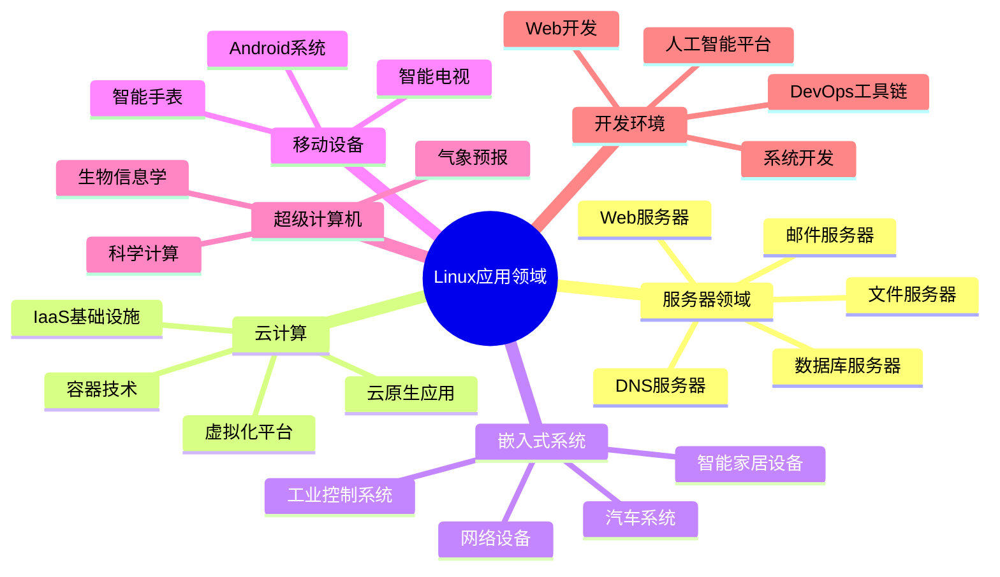
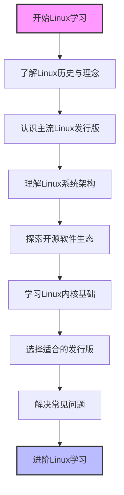

# Linux系统概述

本节内容将帮助您了解Linux系统的基本概念、发展历史、主流发行版以及系统架构，为后续学习打下坚实基础。

## 章节内容

### [Linux发展历史与核心理念](./01-Linux发展历史与核心理念.md)

探索Linux的历史起源、与UNIX的关系以及开源运动的发展。了解Linux背后的设计哲学和核心价值观，包括"一切皆文件"、"小而美"的工具设计理念以及开源协作模式如何塑造了现代软件开发方式。

### [主流发行版对比与选择](./02-主流发行版对比与选择.md)

认识Ubuntu、CentOS、Debian、Fedora等主流Linux发行版及其特点和适用场景。本节将详细比较不同发行版的包管理系统、更新周期、社区支持和技术特性，帮助您选择最适合自己需求的发行版。

### [Linux系统架构详解](./03-Linux系统架构详解.md)

深入了解Linux系统的整体架构、组件关系和工作原理。从内核层到用户空间，系统调用机制到进程管理，文件系统到设备驱动，全面解析Linux系统的分层结构和各组件间的交互方式。

### [开源软件生态系统概述](./04-开源软件生态系统概述.md)

了解围绕Linux构建的丰富开源软件生态系统及其应用领域。从基础工具链到企业级应用，从开发框架到云原生技术，探索开源软件如何协同工作，以及如何在不同领域发挥关键作用。

### [Linux内核架构与模块化设计](./05-Linux内核架构与模块化设计.md)

学习Linux内核的基本架构和模块化设计原理。了解内核的核心子系统（进程调度、内存管理、文件系统、网络栈等）如何协同工作，以及模块化设计如何实现灵活性和可扩展性。

### [选择适合自己的Linux发行版](./06-选择适合自己的Linux发行版.md)

获取选择最适合自己需求的Linux发行版的实用指南。根据不同应用场景（个人桌面、服务器、嵌入式设备等）和用户技能水平，提供详细的决策框架和推荐方案，帮助您做出明智选择。

### [初学者常见问题与解答](./07-初学者常见问题与解答.md)

解答Linux初学者最常遇到的问题和困惑。从安装问题到基本操作，从权限管理到软件安装，提供清晰的解释和实用解决方案，帮助您顺利度过学习初期的各种挑战。

## 学习目标

通过本章节的学习，您将能够：

1. 理解Linux操作系统的基本概念和核心特性
2. 了解Linux的历史发展脉络及其与UNIX的关系
3. 掌握Linux的设计哲学和开源文化精神
4. 区分不同Linux发行版的特点和适用场景
5. 了解Linux内核的基本架构和工作原理
6. 认识Linux系统的整体架构和组件关系
7. 了解Linux开源生态系统的广泛应用
8. 根据自身需求选择合适的Linux发行版
9. 解决Linux学习过程中的常见问题

## 重要性

Linux作为一个开源操作系统，已经成为现代IT基础设施的核心组成部分。无论是服务器、云计算、嵌入式系统还是移动设备，Linux都扮演着至关重要的角色。了解Linux系统的基本概念和架构，不仅是IT专业人士的必备知识，也是任何对计算机技术感兴趣的人的宝贵资产。

在当今技术环境中，Linux的重要性体现在以下几个方面：

- **云计算基础设施**：绝大多数云服务提供商都在其基础设施中使用Linux
- **服务器市场**：Linux在服务器市场占据主导地位，特别是在Web服务器领域
- **嵌入式系统**：从智能家电到工业控制系统，Linux广泛应用于各种嵌入式设备
- **移动设备**：Android系统基于Linux内核，是全球最流行的移动操作系统
- **超级计算机**：几乎所有的超级计算机都运行Linux系统
- **开发环境**：Linux为开发人员提供了强大而灵活的开发环境

通过本章节的学习，您将建立对Linux系统的全面认识，为后续深入学习Linux系统管理、网络配置、安全加固等高级主题奠定坚实基础。

## Linux系统应用领域

## 学习建议

- **循序渐进**：对于完全的Linux新手，建议按照章节顺序逐一学习
- **选择性学习**：已有一定Linux使用经验的读者，可以选择性地阅读感兴趣的主题
- **实践结合**：实践是最好的学习方法，建议在学习过程中安装一个Linux虚拟机进行实际操作
- **动手实验**：尝试在虚拟机中安装不同的Linux发行版，体验它们的差异
- **记录笔记**：记录学习过程中的关键概念和命令，建立自己的知识库
- **寻求帮助**：遇到问题时，可以参考"初学者常见问题与解答"章节，或在开源社区寻求帮助
- **持续学习**：Linux生态系统不断发展，保持学习新知识的习惯

## 预备知识

学习Linux系统不需要太多预备知识，但以下基础将有助于您更好地理解本章内容：

- 基本的计算机操作技能
- 对操作系统概念的基本了解
- 简单的命令行操作概念
- 对开源软件的初步认识

即使您是计算机领域的完全新手，本章节也会从基础概念开始，循序渐进地引导您进入Linux的世界。

## Linux学习路径

让我们开始Linux的学习之旅吧！