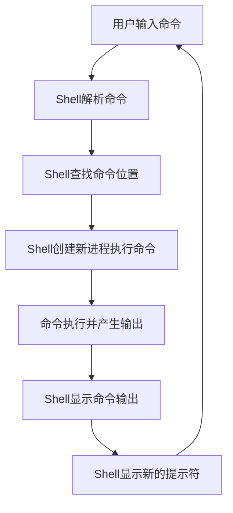
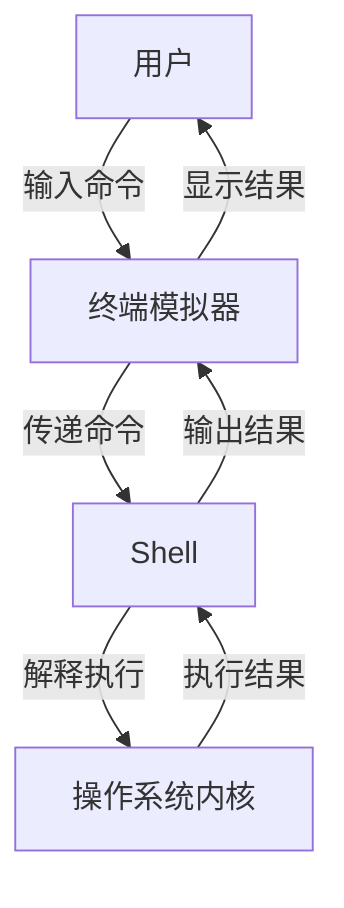

# 终端与Shell基础知识

终端和Shell是Linux系统中用户与操作系统交互的重要接口。本文将介绍终端的概念、常见Shell类型及其基本工作原理，帮助初学者理解命令行环境的基础知识。

## 1. 什么是终端(Terminal)

### 1.1 终端的历史演变

终端最初指的是物理设备，是连接到大型主机的输入输出设备。在计算机发展的早期，终端通常是一台带有显示器和键盘的专用设备，用户通过它连接到中央计算机。随着技术的发展，物理终端逐渐被软件终端模拟器所取代。

### 1.2 现代终端模拟器

现代操作系统中的"终端"实际上是终端模拟器(Terminal Emulator)，它是一个软件程序，模拟了传统物理终端的功能。终端模拟器提供了一个文本界面，允许用户输入命令并查看输出结果。

常见的终端模拟器包括：

- **Linux系统**：GNOME Terminal、Konsole、xterm、Terminator、Alacritty
- **macOS系统**：Terminal.app、iTerm2
- **Windows系统**：Windows Terminal、PowerShell、Command Prompt、WSL Terminal

### 1.3 终端的作用

终端在现代计算环境中仍然非常重要，主要有以下作用：

1. **提供命令行界面**：允许用户通过文本命令与操作系统交互
2. **执行系统管理任务**：许多系统管理和配置任务最适合在终端中完成
3. **远程系统管理**：通过SSH等协议远程连接和管理服务器
4. **自动化操作**：编写和执行脚本以自动化重复任务
5. **开发环境**：为开发者提供编译、调试和版本控制等工具

## 2. 什么是Shell

### 2.1 Shell的定义与作用

Shell是一个命令行解释器，是用户与操作系统内核之间的接口程序。当用户在终端中输入命令时，Shell负责解释这些命令并将其转换为操作系统能够理解的指令。

Shell的主要作用包括：

1. **命令解释**：解析用户输入的命令并执行
2. **程序执行**：启动和管理其他程序的执行
3. **环境管理**：维护环境变量和工作目录
4. **脚本执行**：解释和执行Shell脚本
5. **I/O重定向**：控制命令的输入和输出流向
6. **管道操作**：连接多个命令，使一个命令的输出成为另一个命令的输入

### 2.2 Shell的工作原理

Shell的基本工作流程如下：

1. **等待输入**：Shell显示提示符，等待用户输入命令
2. **读取命令**：用户输入命令并按下回车键
3. **解析命令**：Shell解析命令行，识别命令名称、参数和重定向符号等
4. **查找命令**：Shell在PATH环境变量指定的目录中查找命令
5. **执行命令**：Shell创建一个新的进程来执行命令
6. **等待完成**：Shell等待命令执行完成
7. **显示结果**：Shell显示命令的输出结果
8. **返回等待状态**：Shell返回到等待输入的状态，显示新的提示符

这个过程可以用下图表示：



### 2.3 常见的Shell类型

Linux/Unix系统中有多种Shell，每种都有其特点和适用场景：

#### 2.3.1 Bash (Bourne Again Shell)

Bash是目前最流行的Shell，是大多数Linux发行版的默认Shell。

**特点**：
- 强大的脚本编程能力
- 命令历史记录和补全功能
- 作业控制
- 别名(alias)功能
- 丰富的内置命令

**示例提示符**：
```bash
username@hostname:~$
```

#### 2.3.2 Zsh (Z Shell)

Zsh是一个功能强大的Shell，兼容Bash但提供了更多高级特性。

**特点**：
- 更强大的自动补全功能
- 拼写纠正
- 可定制的提示符
- 插件系统(如Oh My Zsh)
- 更好的主题支持

**示例提示符**：
```bash
username@hostname ~%
```

#### 2.3.3 Fish (Friendly Interactive Shell)

Fish是一个注重用户友好性的现代Shell。

**特点**：
- 语法高亮
- 基于历史的自动建议
- 网页配置界面
- 简化的脚本语法
- 开箱即用的智能功能

**示例提示符**：
```bash
username@hostname ~>
```

#### 2.3.4 其他Shell

- **sh (Bourne Shell)**：最早的Unix Shell，功能相对简单
- **ksh (Korn Shell)**：结合了Bourne Shell和C Shell的特性
- **csh/tcsh (C Shell)**：语法类似C语言，主要用于BSD系统
- **dash**：轻量级Shell，专注于快速执行脚本

### 2.4 如何查看和更改当前Shell

**查看当前Shell**：
```bash
echo $SHELL
```

**查看系统可用的Shell**：
```bash
cat /etc/shells
```

**更改默认Shell**：
```bash
chsh -s /bin/zsh  # 将默认Shell更改为Zsh
```

## 3. 终端与Shell的关系

终端和Shell是密切相关但不同的概念，它们的关系可以概括为：

- **终端**是一个程序，提供了用户输入命令和查看输出的界面
- **Shell**是在终端内运行的命令解释器，负责处理用户输入的命令

可以将终端理解为"容器"，而Shell是在这个容器中运行的"引擎"。一个终端可以运行不同类型的Shell，而同一种Shell也可以在不同的终端中运行。

下图展示了终端、Shell和操作系统之间的关系：



## 4. Shell提示符解析

Shell提示符(Prompt)是Shell显示的等待用户输入的文本标记。默认提示符通常包含有用的信息，如用户名、主机名和当前目录。

### 4.1 Bash提示符

Bash的默认提示符由PS1环境变量定义，常见的提示符元素包括：

- `\u`：当前用户名
- `\h`：主机名
- `\w`：当前工作目录(完整路径)
- `\W`：当前工作目录(仅目录名)
- `\d`：当前日期
- `\t`：当前时间
- `\$`：普通用户显示$，root用户显示#
- `\n`：换行符

**示例**：
```bash
# 默认的Bash提示符
PS1='\u@\h:\w\$ '

# 显示效果
username@hostname:~/documents$
```

### 4.2 自定义提示符

可以通过修改PS1变量来自定义提示符：

```bash
# 添加颜色和Git分支信息的提示符
PS1='\[\033[01;32m\]\u@\h\[\033[00m\]:\[\033[01;34m\]\w\[\033[00m\]\[\033[01;33m\]$(__git_ps1 " (%s)")\[\033[00m\]\$ '
```

要永久更改提示符，可以将PS1设置添加到Shell配置文件中：

```bash
# 对于Bash
echo 'PS1="\u@\h:\w\$ "' >> ~/.bashrc

# 对于Zsh
echo 'PROMPT="%n@%m:%~%# "' >> ~/.zshrc
```

## 5. 终端和Shell的基本操作

### 5.1 启动终端

在不同的操作系统和桌面环境中，启动终端的方法各不相同：

- **Linux (GNOME)**：按下`Ctrl+Alt+T`或在应用菜单中查找"Terminal"
- **Linux (KDE)**：按下`Ctrl+Alt+T`或在应用启动器中查找"Konsole"
- **macOS**：按下`Command+Space`打开Spotlight，然后输入"Terminal"
- **Windows**：按下`Win+R`，输入"cmd"或"powershell"，然后按Enter

### 5.2 基本Shell命令

以下是一些基本的Shell命令，适用于大多数Shell：

```bash
# 显示当前目录
pwd

# 列出文件和目录
ls
ls -la  # 显示详细信息和隐藏文件

# 切换目录
cd /path/to/directory
cd ~    # 切换到主目录
cd ..   # 切换到上级目录

# 创建目录
mkdir new_directory

# 创建文件
touch new_file.txt

# 查看文件内容
cat file.txt
less file.txt  # 分页查看
head file.txt  # 查看前10行
tail file.txt  # 查看后10行

# 复制文件
cp source.txt destination.txt

# 移动或重命名文件
mv old_name.txt new_name.txt

# 删除文件
rm file.txt

# 删除目录
rmdir empty_directory
rm -r directory  # 递归删除目录及其内容

# 查找文件
find /path -name "filename"

# 查看命令帮助
man command
command --help
```

### 5.3 Shell快捷键

Shell提供了许多快捷键，可以提高命令行操作效率：

**光标移动**：
- `Ctrl+A`：移动到行首
- `Ctrl+E`：移动到行尾
- `Alt+B`：向后移动一个单词
- `Alt+F`：向前移动一个单词

**编辑命令**：
- `Ctrl+U`：删除光标前的所有字符
- `Ctrl+K`：删除光标后的所有字符
- `Ctrl+W`：删除光标前的一个单词
- `Alt+D`：删除光标后的一个单词
- `Ctrl+Y`：粘贴之前删除的文本

**历史命令**：
- `Ctrl+P`或上箭头：显示上一条命令
- `Ctrl+N`或下箭头：显示下一条命令
- `Ctrl+R`：反向搜索历史命令
- `!!`：重复执行上一条命令
- `!n`：执行历史记录中的第n条命令
- `!string`：执行最近的以string开头的命令

**其他**：
- `Ctrl+L`：清屏
- `Ctrl+C`：中断当前命令
- `Ctrl+D`：退出当前Shell
- `Ctrl+Z`：将当前进程放入后台

## 6. Shell配置文件

Shell使用配置文件来设置环境变量、别名和函数等。不同的Shell有不同的配置文件。

### 6.1 Bash配置文件

Bash使用以下配置文件：

- `/etc/profile`：系统全局配置，对所有用户生效
- `/etc/bash.bashrc`：系统全局Bash配置
- `~/.bash_profile`：用户登录时执行
- `~/.bashrc`：每次打开新的Bash Shell时执行
- `~/.bash_logout`：退出Shell时执行

### 6.2 Zsh配置文件

Zsh使用以下配置文件：

- `/etc/zshenv`：系统全局环境变量
- `/etc/zshrc`：系统全局Zsh配置
- `~/.zshenv`：用户环境变量
- `~/.zprofile`：登录时执行
- `~/.zshrc`：每次打开新的Zsh Shell时执行
- `~/.zlogin`：登录后执行
- `~/.zlogout`：退出Shell时执行

### 6.3 常见配置示例

以下是一些常见的Shell配置示例：

**设置环境变量**：
```bash
# 添加目录到PATH
export PATH=$PATH:/usr/local/bin

# 设置编辑器
export EDITOR=vim
```

**创建别名**：
```bash
# 常用命令的简写
alias ll='ls -la'
alias c='clear'
alias ..='cd ..'

# 安全措施
alias rm='rm -i'
alias cp='cp -i'
alias mv='mv -i'
```

**创建函数**：
```bash
# 创建并进入目录
mkcd() {
    mkdir -p "$1" && cd "$1"
}

# 解压各种格式的文件
extract() {
    if [ -f $1 ]; then
        case $1 in
            *.tar.bz2)   tar xjf $1     ;;
            *.tar.gz)    tar xzf $1     ;;
            *.bz2)       bunzip2 $1     ;;
            *.rar)       unrar e $1     ;;
            *.gz)        gunzip $1      ;;
            *.tar)       tar xf $1      ;;
            *.tbz2)      tar xjf $1     ;;
            *.tgz)       tar xzf $1     ;;
            *.zip)       unzip $1       ;;
            *.Z)         uncompress $1  ;;
            *.7z)        7z x $1        ;;
            *)           echo "'$1' cannot be extracted via extract()" ;;
        esac
    else
        echo "'$1' is not a valid file"
    fi
}
```

## 7. Shell脚本基础

Shell脚本是包含一系列Shell命令的文本文件，可以自动执行重复性任务。

### 7.1 创建第一个Shell脚本

1. 创建脚本文件：
```bash
touch hello.sh
```

2. 编辑脚本文件：
```bash
#!/bin/bash
# 这是我的第一个Shell脚本
echo "Hello, World!"
echo "当前日期是: $(date)"
echo "当前用户是: $USER"
```

3. 添加执行权限：
```bash
chmod +x hello.sh
```

4. 执行脚本：
```bash
./hello.sh
```

### 7.2 Shell脚本的基本语法

**变量**：
```bash
# 定义变量
name="John"
age=25

# 使用变量
echo "Name: $name, Age: $age"

# 命令替换
current_date=$(date)
echo "Current date: $current_date"
```

**条件语句**：
```bash
# if语句
if [ "$age" -gt 18 ]; then
    echo "成年人"
else
    echo "未成年人"
fi

# case语句
case "$name" in
    "John")
        echo "Hello John!"
        ;;
    "Mary")
        echo "Hello Mary!"
        ;;
    *)
        echo "Hello stranger!"
        ;;
esac
```

**循环**：
```bash
# for循环
for i in 1 2 3 4 5; do
    echo "Number: $i"
done

# while循环
count=1
while [ $count -le 5 ]; do
    echo "Count: $count"
    count=$((count + 1))
done
```

**函数**：
```bash
# 定义函数
greet() {
    echo "Hello, $1!"
}

# 调用函数
greet "World"
```

## 8. 终端多路复用工具

终端多路复用工具允许在一个终端窗口中运行多个终端会话，提高工作效率。

### 8.1 tmux

tmux是一个流行的终端多路复用工具，它允许在单个终端窗口中创建多个会话、窗口和面板。

**安装tmux**：
```bash
# Debian/Ubuntu
sudo apt install tmux

# CentOS/RHEL
sudo yum install tmux

# macOS
brew install tmux
```

**基本tmux命令**：
```bash
# 启动新会话
tmux

# 创建命名会话
tmux new -s session_name

# 分离当前会话
# 快捷键: Ctrl+b d

# 列出所有会话
tmux ls

# 重新连接到会话
tmux attach -t session_name

# 创建新窗口
# 快捷键: Ctrl+b c

# 切换窗口
# 快捷键: Ctrl+b 窗口编号

# 水平分割面板
# 快捷键: Ctrl+b "

# 垂直分割面板
# 快捷键: Ctrl+b %

# 在面板间切换
# 快捷键: Ctrl+b 箭头键
```

### 8.2 screen

screen是另一个终端多路复用工具，功能类似于tmux但历史更悠久。

**安装screen**：
```bash
# Debian/Ubuntu
sudo apt install screen

# CentOS/RHEL
sudo yum install screen

# macOS
brew install screen
```

**基本screen命令**：
```bash
# 启动新会话
screen

# 创建命名会话
screen -S session_name

# 分离当前会话
# 快捷键: Ctrl+a d

# 列出所有会话
screen -ls

# 重新连接到会话
screen -r session_name

# 创建新窗口
# 快捷键: Ctrl+a c

# 切换窗口
# 快捷键: Ctrl+a 窗口编号

# 分割屏幕
# 快捷键: Ctrl+a S (水平分割)
# 快捷键: Ctrl+a | (垂直分割)

# 在分割区域间切换
# 快捷键: Ctrl+a Tab
```

## 9. 终端和Shell的高级技巧

### 9.1 命令历史搜索与编辑

```bash
# 显示命令历史
history

# 执行历史中的特定命令
!42  # 执行历史记录中的第42条命令

# 搜索历史命令
# 按Ctrl+r，然后输入搜索词

# 编辑历史命令
# 找到命令后，按左/右箭头进入编辑模式
```

### 9.2 命令替换与进程替换

```bash
# 命令替换
echo "Today is $(date +%A)"

# 进程替换
diff <(ls dir1) <(ls dir2)
```

### 9.3 I/O重定向与管道

```bash
# 重定向标准输出
command > output.txt

# 追加到文件
command >> output.txt

# 重定向标准错误
command 2> error.txt

# 重定向标准输出和标准错误
command > output.txt 2>&1
# 或者在Bash 4+中
command &> output.txt

# 管道：将一个命令的输出作为另一个命令的输入
command1 | command2

# 示例：计算文件中的行数
cat file.txt | wc -l
```

### 9.4 作业控制

```bash
# 将命令放入后台运行
command &

# 暂停当前前台任务
# 按Ctrl+Z

# 查看所有作业
jobs

# 将后台作业带到前台
fg %job_number

# 将暂停的作业放到后台继续运行
bg %job_number

# 终止作业
kill %job_number
```

## 10. 常见问题与解决方案

### 10.1 命令未找到

**问题**：执行命令时显示"command not found"。

**解决方案**：
1. 确认命令拼写正确
2. 检查命令是否已安装
3. 检查命令是否在PATH中
   ```bash
   echo $PATH
   # 如果需要，添加目录到PATH
   export PATH=$PATH:/path/to/command
   ```

### 10.2 权限被拒绝

**问题**：执行命令时显示"Permission denied"。

**解决方案**：
1. 检查文件权限
   ```bash
   ls -l filename
   ```
2. 添加执行权限
   ```bash
   chmod +x filename
   ```
3. 使用sudo执行需要特权的命令
   ```bash
   sudo command
   ```

### 10.3 Shell配置问题

**问题**：修改Shell配置文件后，更改没有生效。

**解决方案**：
1. 确保配置文件语法正确
2. 重新加载配置文件
   ```bash
   # 对于Bash
   source ~/.bashrc
   
   # 对于Zsh
   source ~/.zshrc
   ```
3. 打开新的终端会话

## 总结

终端和Shell是Linux/Unix系统中最强大的工具之一，掌握它们的基本概念和操作可以显著提高工作效率。本文介绍了终端和Shell的基本概念、常见Shell类型、基本操作和高级技巧，为初学者提供了全面的入门指南。

随着经验的积累，您可以进一步探索Shell脚本编程、自定义Shell环境以及更高级的终端工具，充分发挥命令行环境的强大功能。记住，熟练使用终端和Shell是成为高效Linux/Unix用户的关键技能之一。