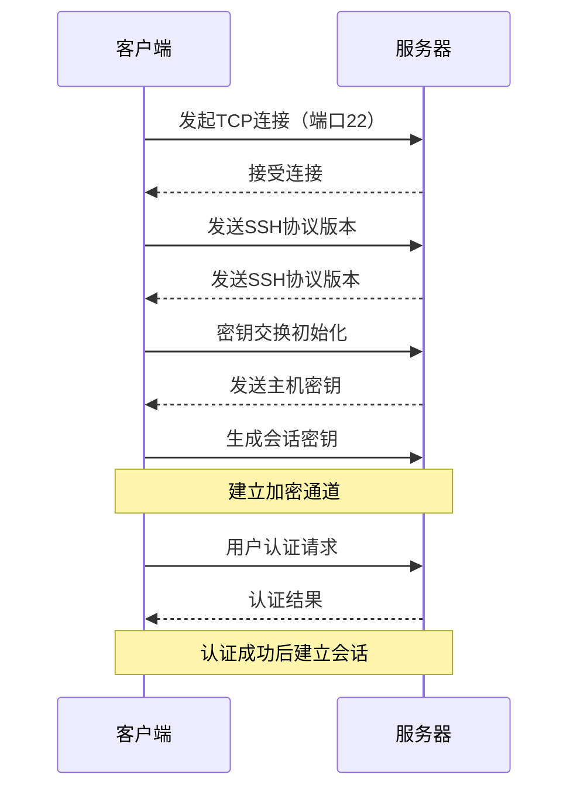

# 远程连接Linux系统

远程连接是Linux系统管理的重要方式，特别是对于服务器环境。本文将介绍SSH协议基础知识，以及如何使用SSH客户端从Windows、Mac或其他Linux系统远程连接到Linux服务器。

## 1. SSH协议基础

### 1.1 什么是SSH

SSH（Secure Shell）是一种加密网络协议，用于在不安全的网络上安全地执行远程登录和其他网络服务。SSH通过在客户端和服务器之间创建安全通道，确保数据传输的机密性和完整性。

SSH最初是作为telnet、rlogin和rsh等不安全远程登录协议的替代品开发的。这些早期协议以明文形式传输数据（包括密码），容易被网络上的攻击者截获。

### 1.2 SSH的工作原理

SSH协议的工作流程可以简化为以下几个步骤：

1. **TCP连接建立**：客户端与服务器建立TCP连接（默认端口22）
2. **协议版本协商**：双方交换支持的SSH协议版本信息
3. **密钥交换**：使用Diffie-Hellman等算法安全地交换会话密钥
4. **服务器认证**：客户端验证服务器的身份
5. **用户认证**：服务器验证用户的身份（密码、密钥等方式）
6. **会话建立**：建立加密的通信通道



### 1.3 SSH的主要特性

SSH协议提供了多种重要功能：

1. **加密通信**：所有数据都经过加密，防止窃听
2. **完整性检查**：确保数据在传输过程中不被篡改
3. **服务器认证**：防止中间人攻击
4. **多种认证方式**：支持密码、公钥、键盘交互等认证方法
5. **端口转发**：可以创建加密隧道转发其他协议
6. **文件传输**：通过SFTP或SCP安全传输文件
7. **X11转发**：远程运行图形应用程序

## 2. SSH服务器配置

在连接到Linux服务器之前，需要确保SSH服务已正确配置。

### 2.1 安装SSH服务器

大多数Linux发行版默认不安装SSH服务器。以下是在主流发行版上安装SSH服务器的命令：

```bash
# Debian/Ubuntu系统
sudo apt update
sudo apt install openssh-server

# RHEL/CentOS/Fedora系统
sudo dnf install openssh-server
# 或
sudo yum install openssh-server

# Arch Linux
sudo pacman -S openssh
```

安装完成后，SSH服务通常会自动启动。可以使用以下命令检查服务状态：

```bash
sudo systemctl status sshd
```

### 2.2 配置SSH服务器

SSH服务器的主要配置文件是`/etc/ssh/sshd_config`。以下是一些重要的配置选项：

```bash
# 编辑SSH配置文件
sudo nano /etc/ssh/sshd_config
```

常见配置选项：

```
# 监听端口（默认22）
Port 22

# 是否允许root直接登录
PermitRootLogin no

# 是否允许密码认证
PasswordAuthentication yes

# 是否允许公钥认证
PubkeyAuthentication yes

# 允许的用户
AllowUsers user1 user2

# 空闲超时时间（秒）
ClientAliveInterval 300
ClientAliveCountMax 2
```

修改配置后，需要重启SSH服务使更改生效：

```bash
sudo systemctl restart sshd
```

### 2.3 防火墙配置

确保防火墙允许SSH连接：

```bash
# Ubuntu/Debian (UFW)
sudo ufw allow ssh

# RHEL/CentOS/Fedora (firewalld)
sudo firewall-cmd --permanent --add-service=ssh
sudo firewall-cmd --reload
```

## 3. 从Windows连接Linux

Windows用户有多种工具可以连接到Linux服务器。

### 3.1 使用OpenSSH客户端（Windows 10/11内置）

Windows 10和Windows 11已经内置了OpenSSH客户端，可以直接在命令提示符或PowerShell中使用：

```powershell
# 基本连接
ssh username@server_ip

# 指定端口
ssh -p 2222 username@server_ip

# 使用私钥
ssh -i C:\path\to\private_key.pem username@server_ip
```

如果OpenSSH客户端未安装，可以通过"设置 > 应用 > 可选功能"安装。

### 3.2 使用PuTTY

PuTTY是Windows平台上最流行的SSH客户端之一。

1. 从[PuTTY官网](https://www.putty.org/)下载并安装
2. 启动PuTTY，在会话配置界面输入：
   - 主机名/IP地址
   - 端口（默认22）
   - 连接类型选择SSH
3. 可以保存会话配置以便将来使用
4. 点击"打开"按钮连接

PuTTY还提供了其他工具：
- PuTTYgen：生成和管理SSH密钥对
- Pageant：SSH密钥代理
- PSCP：命令行文件传输工具

### 3.3 使用Windows Terminal

Windows Terminal是微软的新一代终端应用，支持多种shell，包括SSH连接：

1. 从Microsoft Store安装Windows Terminal
2. 打开Windows Terminal，创建新的SSH配置文件或直接在命令行中使用ssh命令
3. 在设置中可以自定义SSH连接的外观和行为

### 3.4 使用VSCode的Remote-SSH扩展

Visual Studio Code提供了Remote-SSH扩展，可以直接在编辑器中连接到远程服务器：

1. 在VSCode中安装Remote-SSH扩展
2. 按F1打开命令面板，输入"Remote-SSH: Connect to Host"
3. 输入连接信息：`username@server_ip`
4. VSCode会建立连接并打开远程文件系统

这种方式特别适合开发人员，因为它提供了完整的开发环境，而不仅仅是终端访问。

## 4. 从Mac或Linux连接Linux

Mac和Linux系统已经内置了SSH客户端，使用起来非常简单。

### 4.1 基本SSH连接

打开终端，使用ssh命令连接：

```bash
# 基本连接
ssh username@server_ip

# 指定端口
ssh -p 2222 username@server_ip

# 使用私钥
ssh -i /path/to/private_key username@server_ip

# 启用X11转发（图形应用）
ssh -X username@server_ip
```

### 4.2 SSH配置文件

可以创建`~/.ssh/config`文件来简化SSH连接：

```
# 基本主机配置
Host myserver
    HostName 192.168.1.100
    User username
    Port 22

# 使用密钥的配置
Host production
    HostName production.example.com
    User admin
    IdentityFile ~/.ssh/prod_key
    Port 2222

# 通过跳板机连接
Host internal
    HostName 10.0.0.5
    User developer
    ProxyJump jumphost
```

配置好后，可以直接使用主机别名连接：

```bash
ssh myserver
ssh production
ssh internal
```

### 4.3 Mac上的图形化SSH客户端

虽然命令行SSH客户端功能强大，但Mac用户也可以选择图形化工具：

1. **Terminal.app**：Mac自带的终端应用
2. **iTerm2**：功能更强大的终端替代品，支持分屏、自动补全等
3. **Royal TSX**：支持多种协议的远程连接管理工具
4. **Termius**：跨平台的SSH客户端，支持同步配置

## 5. SSH密钥认证

密钥认证比密码认证更安全，也更方便（无需每次输入密码）。

### 5.1 生成SSH密钥对

在客户端生成SSH密钥对：

```bash
# Windows (PowerShell)
ssh-keygen -t rsa -b 4096

# Mac/Linux
ssh-keygen -t rsa -b 4096
# 或使用更现代的Ed25519算法
ssh-keygen -t ed25519
```

执行命令后，系统会提示：
1. 保存密钥的位置（默认为`~/.ssh/id_rsa`或`~/.ssh/id_ed25519`）
2. 设置密钥密码（可选，但推荐设置）

生成的文件：
- 私钥：`id_rsa`或`id_ed25519`（保密，不要分享）
- 公钥：`id_rsa.pub`或`id_ed25519.pub`（可以分享）

### 5.2 将公钥上传到服务器

有多种方法可以将公钥上传到服务器：

**方法1：使用ssh-copy-id（Linux/Mac）**

```bash
ssh-copy-id username@server_ip
```

**方法2：手动复制（适用于所有平台）**

```bash
# 在Windows上（PowerShell）
type $env:USERPROFILE\.ssh\id_rsa.pub | ssh username@server_ip "mkdir -p ~/.ssh && cat >> ~/.ssh/authorized_keys"

# 在Mac/Linux上
cat ~/.ssh/id_rsa.pub | ssh username@server_ip "mkdir -p ~/.ssh && cat >> ~/.ssh/authorized_keys"
```

**方法3：手动编辑authorized_keys文件**

1. 在本地查看公钥内容：
   ```bash
   cat ~/.ssh/id_rsa.pub
   ```
2. 复制公钥内容
3. 登录到服务器
4. 编辑或创建authorized_keys文件：
   ```bash
   mkdir -p ~/.ssh
   chmod 700 ~/.ssh
   nano ~/.ssh/authorized_keys
   # 粘贴公钥内容，保存文件
   chmod 600 ~/.ssh/authorized_keys
   ```

### 5.3 测试密钥认证

设置完成后，尝试使用SSH密钥连接：

```bash
ssh username@server_ip
```

如果设置了密钥密码，系统会提示输入密码。如果一切正常，应该能够无需输入服务器密码直接登录。

### 5.4 使用SSH代理管理密钥

如果设置了密钥密码，可以使用SSH代理避免重复输入密码：

**在Linux/Mac上：**

```bash
# 启动ssh-agent
eval $(ssh-agent)

# 添加密钥
ssh-add ~/.ssh/id_rsa
```

**在Windows上（PowerShell）：**

```powershell
# 启动ssh-agent服务
Start-Service ssh-agent

# 添加密钥
ssh-add $env:USERPROFILE\.ssh\id_rsa
```

## 6. 高级SSH用法

SSH不仅可以用于远程登录，还有许多高级功能。

### 6.1 端口转发

SSH端口转发（隧道）允许通过SSH连接安全地传输其他协议的数据。

**本地端口转发**：将本地端口转发到远程服务器

```bash
# 将本地8080端口转发到远程服务器的80端口
ssh -L 8080:localhost:80 username@server_ip

# 将本地3306端口转发到远程数据库服务器
ssh -L 3306:database_server:3306 username@server_ip
```

**远程端口转发**：将远程端口转发到本地机器

```bash
# 将远程服务器的8080端口转发到本地80端口
ssh -R 8080:localhost:80 username@server_ip
```

**动态端口转发**：创建SOCKS代理

```bash
# 在本地1080端口创建SOCKS代理
ssh -D 1080 username@server_ip
```

### 6.2 X11转发

X11转发允许在本地显示远程图形应用程序：

```bash
# 启用X11转发
ssh -X username@server_ip

# 在远程服务器上启动图形应用
firefox
```

在Windows上使用X11转发需要安装X服务器，如Xming或VcXsrv。

### 6.3 SSH跳板机

通过跳板机（堡垒机）连接到内部网络中的服务器：

```bash
# 通过跳板机连接到内部服务器
ssh -J jumpuser@jumphost internaluser@internal_server

# 在配置文件中设置
# 在~/.ssh/config中：
Host internal
    HostName internal_server
    User internaluser
    ProxyJump jumpuser@jumphost
```

### 6.4 保持连接活跃

防止SSH连接因空闲超时而断开：

```bash
# 在命令行中设置
ssh -o ServerAliveInterval=60 username@server_ip

# 在配置文件中设置
# 在~/.ssh/config中：
Host *
    ServerAliveInterval 60
    ServerAliveCountMax 3
```

## 7. 文件传输

SSH协议提供了多种安全的文件传输方式。

### 7.1 使用SCP

SCP（Secure Copy Protocol）是基于SSH的文件复制工具：

```bash
# 从本地复制到远程
scp local_file.txt username@server_ip:/remote/directory/

# 从远程复制到本地
scp username@server_ip:/remote/file.txt local_directory/

# 复制目录（递归）
scp -r local_directory/ username@server_ip:/remote/directory/

# 指定端口
scp -P 2222 local_file.txt username@server_ip:/remote/directory/
```

### 7.2 使用SFTP

SFTP（SSH File Transfer Protocol）提供了更多的文件操作功能：

```bash
# 连接到SFTP服务器
sftp username@server_ip

# SFTP命令
# 列出远程目录内容
sftp> ls

# 切换远程目录
sftp> cd remote_directory

# 切换本地目录
sftp> lcd local_directory

# 上传文件
sftp> put local_file.txt

# 下载文件
sftp> get remote_file.txt

# 上传目录
sftp> put -r local_directory

# 下载目录
sftp> get -r remote_directory

# 退出
sftp> exit
```

### 7.3 使用图形化SFTP客户端

对于不熟悉命令行的用户，可以使用图形化SFTP客户端：

**Windows：**
- FileZilla
- WinSCP
- Cyberduck

**Mac：**
- FileZilla
- Cyberduck
- Transmit

**Linux：**
- FileZilla
- Nautilus/Dolphin（内置SFTP支持）

## 8. SSH安全最佳实践

保护SSH服务器和连接的安全性至关重要。

### 8.1 服务器端安全措施

1. **禁用密码认证，仅使用密钥认证**
   ```
   # 在/etc/ssh/sshd_config中设置
   PasswordAuthentication no
   ```

2. **禁用root直接登录**
   ```
   # 在/etc/ssh/sshd_config中设置
   PermitRootLogin no
   ```

3. **更改默认端口**
   ```
   # 在/etc/ssh/sshd_config中设置
   Port 2222  # 使用非标准端口
   ```

4. **限制允许的用户**
   ```
   # 在/etc/ssh/sshd_config中设置
   AllowUsers user1 user2
   ```

5. **使用防火墙限制访问**
   ```bash
   # 使用iptables限制SSH访问
   sudo iptables -A INPUT -p tcp --dport 22 -s trusted_ip -j ACCEPT
   sudo iptables -A INPUT -p tcp --dport 22 -j DROP
   ```

6. **设置登录失败限制**
   使用Fail2ban等工具自动封禁多次失败登录的IP地址

7. **定期更新SSH服务器**
   ```bash
   sudo apt update && sudo apt upgrade openssh-server
   ```

### 8.2 客户端安全措施

1. **保护私钥安全**
   - 设置强密码保护私钥
   - 不要在不安全的设备上存储私钥

2. **使用SSH配置文件增强安全性**
   ```
   # 在~/.ssh/config中设置
   Host *
       UseRoaming no
       HashKnownHosts yes
       IdentitiesOnly yes
   ```

3. **验证主机密钥**
   首次连接到服务器时，验证主机密钥指纹

4. **使用SSH代理转发而非复制私钥**
   ```bash
   # 启用代理转发
   ssh -A username@server_ip
   
   # 在配置文件中设置特定主机
   Host trusted_server
       ForwardAgent yes
   ```

## 9. 常见问题与解决方案

### 9.1 连接被拒绝

**问题**：`Connection refused`

**可能原因**：
- SSH服务未运行
- 防火墙阻止连接
- 服务器监听的端口不正确

**解决方案**：
1. 确认SSH服务正在运行：`sudo systemctl status sshd`
2. 检查防火墙设置：`sudo iptables -L`
3. 验证SSH配置中的端口设置：`grep Port /etc/ssh/sshd_config`

### 9.2 认证失败

**问题**：`Permission denied (publickey,password)`

**可能原因**：
- 用户名或密码错误
- 密钥未正确设置
- 服务器不允许使用密码认证

**解决方案**：
1. 确认用户名和密码正确
2. 检查公钥是否正确添加到服务器：`cat ~/.ssh/authorized_keys`
3. 检查SSH服务器配置：`grep Authentication /etc/ssh/sshd_config`
4. 检查权限：`chmod 700 ~/.ssh && chmod 600 ~/.ssh/authorized_keys`

### 9.3 主机密钥更改警告

**问题**：`WARNING: REMOTE HOST IDENTIFICATION HAS CHANGED!`

**可能原因**：
- 服务器重装或SSH重新配置
- 可能的中间人攻击

**解决方案**：
1. 如果确认服务器确实重装，删除旧的主机密钥：
   ```bash
   ssh-keygen -R server_ip
   ```
2. 如果不确定，联系服务器管理员验证主机密钥

### 9.4 连接缓慢

**问题**：SSH连接建立非常缓慢

**可能原因**：
- DNS反向查询超时
- GSS认证问题
- 网络延迟

**解决方案**：
1. 在服务器配置中禁用DNS反向查询：
   ```
   # 在/etc/ssh/sshd_config中设置
   UseDNS no
   ```
2. 禁用GSS认证：
   ```
   # 在客户端~/.ssh/config中设置
   Host *
       GSSAPIAuthentication no
   ```

## 10. 实用SSH工具和扩展

### 10.1 Mosh (Mobile Shell)

Mosh是SSH的替代品，专为不稳定的网络连接设计：
- 连接在IP变化或睡眠后保持活跃
- 即时响应，减少延迟感知
- 使用UDP而非TCP

```bash
# 安装Mosh
sudo apt install mosh  # Debian/Ubuntu

# 使用Mosh连接
mosh username@server_ip
```

### 10.2 tmux/screen

tmux和screen是终端复用器，可以保持会话在SSH断开后继续运行：

```bash
# 安装tmux
sudo apt install tmux

# 创建新会话
tmux new -s mysession

# 分离会话（Ctrl+B然后按D）

# 重新连接
tmux attach -t mysession
```

### 10.3 sshfs

sshfs允许通过SSH挂载远程文件系统：

```bash
# 安装sshfs
sudo apt install sshfs  # Debian/Ubuntu

# 挂载远程目录
mkdir ~/remote
sshfs username@server_ip:/remote/path ~/remote

# 卸载
fusermount -u ~/remote  # Linux
umount ~/remote         # Mac
```

### 10.4 自动化工具

**Ansible**：基于SSH的自动化配置管理工具
```bash
# 安装Ansible
sudo apt install ansible

# 执行简单命令
ansible all -i "server_ip," -u username -m ping
```

**Fabric**：Python库，用于通过SSH执行命令和传输文件
```python
from fabric import Connection

c = Connection('username@server_ip')
result = c.run('uname -s')
print(result.stdout)
```

## 总结

SSH是连接和管理Linux系统的强大工具，提供了安全、灵活的远程访问方式。通过本文介绍的基础知识和高级技巧，你应该能够：

1. 理解SSH的工作原理和安全特性
2. 从不同平台（Windows、Mac、Linux）连接到Linux服务器
3. 设置和使用SSH密钥认证
4. 利用端口转发和其他高级功能
5. 安全地传输文件
6. 应用安全最佳实践保护SSH连接
7. 解决常见的SSH连接问题

随着经验的积累，你可以进一步探索SSH的高级用法，将其集成到自动化工作流程中，提高远程系统管理的效率和安全性。

无论是管理单个服务器还是大型服务器集群，SSH都是Linux系统管理员和开发人员必不可少的工具。