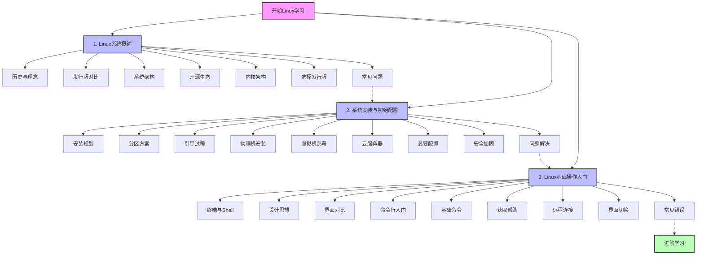

# Linux基础与安装配置

本章节介绍Linux系统的基础知识、安装配置方法以及入门级操作技巧，帮助初学者快速掌握Linux系统的基本使用。

## 概述

Linux作为一个强大、灵活且开源的操作系统，已经成为互联网基础设施和云计算的核心。无论是服务器运维、软件开发还是嵌入式系统，Linux都扮演着至关重要的角色。对于初学者来说，了解Linux的基础知识、掌握安装配置方法以及熟悉基本操作技巧，是进入Linux世界的第一步。

本章节分为三个主要部分：Linux系统概述、系统安装与初始配置以及Linux基础操作入门。我们将从Linux的历史、理念和架构入手，帮助你理解Linux的本质；然后详细介绍如何规划、安装和配置Linux系统；最后通过实际操作指导，帮助你掌握Linux的基本使用方法。

无论你是计算机专业学生、IT从业人员，还是对Linux感兴趣的爱好者，本章节都将为你提供系统化的入门指南，帮助你建立坚实的Linux基础知识体系。

## 内容目录

### 1. Linux系统概述

这部分内容帮助你了解Linux的起源、发展历程、核心理念以及系统架构，为后续学习打下理论基础。

1. [Linux发展历史与核心理念](./01-Linux系统概述/01-Linux发展历史与核心理念.md) - 了解Linux的起源、发展历程和开源精神

2. [主流发行版对比与选择](./01-Linux系统概述/02-主流发行版对比与选择.md) - 比较不同Linux发行版的特点和适用场景

3. [Linux系统架构详解](./01-Linux系统概述/03-Linux系统架构详解.md) - 深入理解Linux系统的层次结构和工作原理

4. [开源软件生态系统概述](./01-Linux系统概述/04-开源软件生态系统概述.md) - 探索围绕Linux构建的丰富开源软件生态

5. [Linux内核架构与模块化设计](./01-Linux系统概述/05-Linux内核架构与模块化设计.md) - 了解Linux内核的结构和模块化设计思想

6. [选择适合自己的Linux发行版](./01-Linux系统概述/06-选择适合自己的Linux发行版.md) - 根据个人需求和使用场景选择合适的Linux发行版

7. [初学者常见问题与解答](./01-Linux系统概述/07-初学者常见问题与解答.md) - 解答Linux新手常见的疑问和困惑

### 2. 系统安装与初始配置

这部分内容详细介绍Linux系统的安装过程和初始配置方法，包括物理机安装、虚拟机部署和云服务器环境初始化。

1. [安装前的规划与准备](./02-系统安装与初始配置/01-安装前的规划与准备.md) - 安装Linux前的硬件评估和系统规划

2. [分区方案设计原则](./02-系统安装与初始配置/02-分区方案设计原则.md) - 了解Linux分区的概念和设计合理的分区方案

3. [引导加载过程详解](./02-系统安装与初始配置/03-引导加载过程详解.md) - 深入理解Linux系统的启动和引导过程

4. [物理机安装图解教程](./02-系统安装与初始配置/04-物理机安装图解教程.md) - 在实体计算机上安装Linux系统的详细步骤

5. [VirtualBox和VMware虚拟机部署](./02-系统安装与初始配置/05-VirtualBox和VMware虚拟机部署.md) - 在虚拟环境中安装和配置Linux系统

6. [云服务器环境初始化](./02-系统安装与初始配置/06-云服务器环境初始化.md) - 配置和优化云平台上的Linux服务器

7. [系统安装后的必要配置](./02-系统安装与初始配置/07-系统安装后的必要配置.md) - 安装完成后需要进行的基本系统设置

8. [系统安全加固步骤详解](./02-系统安装与初始配置/08-系统安全加固步骤详解.md) - 提高Linux系统安全性的基本措施

9. [安装过程常见问题解决](./02-系统安装与初始配置/09-安装过程常见问题解决.md) - 解决Linux安装过程中可能遇到的问题

### 3. Linux基础操作入门

这部分内容帮助你掌握Linux系统的基本操作方法，包括终端使用、命令行基础和远程连接等内容。

1. [终端与Shell基础知识](./03-Linux基础操作入门/01-终端与Shell基础知识.md) - 了解Linux终端和Shell的概念、工作原理及基本用法

2. [Linux哲学与设计思想](./03-Linux基础操作入门/02-Linux哲学与设计思想.md) - 探索Linux系统背后的设计理念和核心哲学

3. [命令行界面vs图形界面](./03-Linux基础操作入门/03-命令行界面vs图形界面.md) - 比较两种界面的优缺点及适用场景

4. [第一次使用命令行](./03-Linux基础操作入门/04-第一次使用命令行.md) - 命令行的基本操作和初次使用指南

5. [必会的20个基础命令](./03-Linux基础操作入门/05-必会的20个基础命令.md) - 掌握Linux系统中最常用的基础命令

6. [获取帮助的多种方式](./03-Linux基础操作入门/06-获取帮助的多种方式.md) - 学习如何使用man、info等工具查找命令和系统帮助

7. [远程连接Linux系统](./03-Linux基础操作入门/07-远程连接Linux系统.md) - 使用SSH等工具远程管理Linux服务器

8. [图形界面与命令行切换](./03-Linux基础操作入门/08-图形界面与命令行切换.md) - 在不同运行级别和界面模式间切换的方法

9. [初学者常见错误](./03-Linux基础操作入门/09-初学者常见错误.md) - 避免Linux新手常犯的错误和解决方案

## 学习路径图

以下是本章节的学习路径图，帮助您清晰地了解学习顺序和各部分内容的关联：

## 学习建议

1. **循序渐进**：按照章节顺序学习，先了解基础概念，再进行实际操作
2. **动手实践**：Linux学习最有效的方式是实际操作，建议边学边做
3. **环境准备**：可以使用虚拟机或云服务器作为学习环境，避免影响主系统
4. **问题解决**：遇到问题时，学会查阅文档和使用搜索引擎寻找解决方案
5. **做好笔记**：记录学习过程中的关键命令和概念，建立自己的知识库
6. **项目驱动**：设定小目标（如搭建Web服务器），通过完成项目来巩固所学知识
7. **社区参与**：加入Linux社区，与其他学习者交流经验和问题

## 适用人群

- **IT专业学生**：需要系统学习Linux基础知识
- **运维新手**：准备进入系统运维领域的初学者
- **开发人员**：需要在Linux环境下进行开发的程序员
- **技术爱好者**：对操作系统和开源技术感兴趣的自学者
- **转行人士**：计划进入IT行业，需要掌握Linux基础的人士

通过系统学习上述内容，你将能够从零开始，逐步掌握Linux系统的基础知识、安装配置方法和基本操作技能，为后续深入学习和实际应用奠定坚实基础。无论你的目标是成为系统管理员、开发人员还是安全专家，这些基础知识都是不可或缺的。