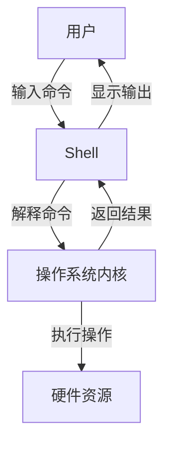

# Shell类型与特点对比

Linux系统中有多种Shell可供选择，如Bash、Zsh、Fish等。本文将对比不同Shell的特点、语法差异和适用场景，帮助用户选择最适合自己的Shell环境。

## 1. 什么是Shell

Shell是一个命令行解释器，它接收用户输入的命令，并将其转化为操作系统能够理解的指令。Shell不仅是一个命令处理器，还是一个功能强大的编程语言，允许用户创建脚本来自动化任务。

在Linux/Unix系统中，Shell是用户与内核交互的桥梁，提供了访问操作系统服务的接口。当我们打开终端时，实际上是启动了一个Shell程序，等待我们输入命令。



## 2. 主流Shell类型概述

### 2.1 Bash (Bourne Again SHell)

Bash是GNU项目的一部分，是大多数Linux发行版的默认Shell。它是Bourne Shell (sh)的增强版本，兼容sh的同时添加了许多新特性。

**主要特点：**
- 几乎所有Linux/Unix系统默认安装
- 强大的命令历史功能
- 命令和文件名自动补全
- 作业控制能力
- 命令别名（alias）
- 丰富的内置命令

**适用场景：**
- 系统管理和自动化脚本
- 需要跨平台兼容性的环境
- 服务器环境（稳定性和兼容性优先）

### 2.2 Zsh (Z Shell)

Zsh在兼容Bash的同时，提供了更多高级功能和定制选项。随着Oh My Zsh等配置框架的流行，Zsh获得了广泛的用户基础。macOS从Catalina版本开始将Zsh设为默认Shell。

**主要特点：**
- 更强大的自动补全系统
- 拼写纠正功能
- 可定制的提示符（包括右侧提示符）
- 插件系统（尤其是通过Oh My Zsh）
- 更灵活的通配符和模式匹配
- 共享命令历史（多终端会话间）

**适用场景：**
- 日常开发工作
- 需要高度定制Shell体验的用户
- 喜欢视觉反馈和提示的用户

### 2.3 Fish (Friendly Interactive SHell)

Fish以用户友好性为设计目标，提供了许多开箱即用的功能，无需复杂配置。它不完全兼容POSIX标准，但提供了更现代的语法和交互体验。

**主要特点：**
- 语法高亮显示
- 基于历史的智能命令建议
- 网页界面配置
- 开箱即用的自动补全
- 清晰易读的脚本语法
- 无需配置的用户友好体验

**适用场景：**
- 初学者和命令行新手
- 重视交互体验胜过兼容性的用户
- 个人工作站（而非服务器环境）

### 2.4 其他常见Shell

#### 2.4.1 Ksh (KornShell)

由AT&T贝尔实验室的David Korn开发，结合了Bourne Shell和C Shell的特性。

**主要特点：**
- 强大的脚本编程能力
- 良好的性能
- 兼容Bourne Shell
- 内置的算术运算

**适用场景：**
- 企业环境，特别是传统Unix系统
- 需要高性能脚本执行的场景

#### 2.4.2 Tcsh

Tcsh是C Shell (csh)的增强版本，提供了命令行编辑和其他交互功能。

**主要特点：**
- C语言风格的语法
- 命令历史和编辑功能
- 文件名补全
- 拼写检查

**适用场景：**
- BSD系统用户
- 习惯C语言语法的开发者

#### 2.4.3 Dash

Dash是一个轻量级的Shell，专注于POSIX兼容性和执行速度。Ubuntu使用Dash作为`/bin/sh`的默认实现。

**主要特点：**
- 极快的启动和执行速度
- 严格的POSIX兼容性
- 最小化的内存占用

**适用场景：**
- 系统脚本（如启动脚本）
- 资源受限的环境
- 需要严格POSIX兼容性的脚本

## 3. 语法和功能对比

### 3.1 基本语法对比

不同Shell在基本语法上有一些差异，尤其是在变量定义、条件语句和循环结构方面。

#### 3.1.1 变量定义和使用

**Bash/Zsh:**
```bash
# 变量赋值（等号两边不能有空格）
name="John"
# 使用变量
echo $name
echo ${name}
```

**Fish:**
```fish
# 变量赋值
set name "John"
# 使用变量
echo $name
```

#### 3.1.2 条件语句

**Bash/Zsh:**
```bash
if [ "$name" = "John" ]; then
    echo "Hello John"
elif [ "$name" = "Jane" ]; then
    echo "Hello Jane"
else
    echo "Hello Stranger"
fi
```

**Fish:**
```fish
if test "$name" = "John"
    echo "Hello John"
else if test "$name" = "Jane"
    echo "Hello Jane"
else
    echo "Hello Stranger"
end
```

#### 3.1.3 循环结构

**Bash/Zsh:**
```bash
# For循环
for i in 1 2 3 4 5; do
    echo $i
done

# While循环
count=1
while [ $count -le 5 ]; do
    echo $count
    count=$((count + 1))
done
```

**Fish:**
```fish
# For循环
for i in 1 2 3 4 5
    echo $i
end

# While循环
set count 1
while test $count -le 5
    echo $count
    set count (math $count + 1)
end
```

### 3.2 功能特性对比表

| 功能/特性 | Bash | Zsh | Fish | Ksh | Tcsh | Dash |
|-----------|------|-----|------|-----|------|------|
| POSIX兼容性 | 高 | 高 | 部分 | 高 | 部分 | 严格 |
| 语法高亮 | 无内置 | 插件支持 | 内置 | 无内置 | 无内置 | 无 |
| 自动补全 | 基本 | 高级 | 高级 | 基本 | 基本 | 最小 |
| 命令建议 | 无内置 | 插件支持 | 内置 | 无内置 | 无内置 | 无 |
| 插件系统 | 有限 | 强大 | 内置 | 有限 | 有限 | 无 |
| 配置复杂度 | 中等 | 高(无框架)/低(有框架) | 低 | 中等 | 中等 | 低 |
| 启动速度 | 中等 | 慢(无优化)/中等(优化) | 中等 | 快 | 中等 | 非常快 |
| 资源占用 | 中等 | 高 | 中高 | 低 | 中等 | 非常低 |
| 脚本执行速度 | 中等 | 中等 | 慢 | 快 | 中等 | 非常快 |

## 4. 实际使用体验对比

### 4.1 交互体验

#### 4.1.1 Bash

Bash的交互体验相对基础，但通过配置可以增强功能：

```bash
# .bashrc中的常用配置
# 启用颜色提示
export CLICOLOR=1
export LSCOLORS=ExFxCxDxBxegedabagacad

# 自定义提示符
PS1='\u@\h:\w\$ '

# 启用历史搜索
bind '"\e[A": history-search-backward'
bind '"\e[B": history-search-forward'
```

**优点：**
- 几乎所有系统都可用
- 无需额外学习成本
- 配置简单直接

**缺点：**
- 默认功能相对基础
- 需要手动配置许多现代Shell的标准功能

#### 4.1.2 Zsh (使用Oh My Zsh)

Zsh配合Oh My Zsh提供了丰富的交互体验：

```bash
# .zshrc中的Oh My Zsh配置示例
export ZSH="$HOME/.oh-my-zsh"
ZSH_THEME="robbyrussell"

# 插件
plugins=(git docker kubectl python vscode)

source $ZSH/oh-my-zsh.sh
```

**优点：**
- 丰富的主题和提示符选项
- 强大的插件生态系统
- 智能的目录导航（如`cd -`历史）
- 高级的自动补全（如修正大小写错误）

**缺点：**
- 配置过多可能导致启动变慢
- 学习曲线略陡（尤其是高级定制）

#### 4.1.3 Fish

Fish提供了现代化的交互体验，几乎无需配置：

```fish
# 无需大量配置，以下是一些自定义示例
# config.fish

# 设置编辑器
set -gx EDITOR vim

# 自定义函数示例
function ll
    ls -lh $argv
end
```

**优点：**
- 开箱即用的智能功能
- 实时语法高亮
- 基于历史的命令建议
- 直观的Web界面配置

**缺点：**
- 与POSIX脚本不完全兼容
- 在某些服务器环境中可能不可用

### 4.2 脚本编写对比

#### 4.2.1 Bash脚本示例

```bash
#!/bin/bash
# 简单的备份脚本

backup_dir="/backup/$(date +%Y%m%d)"
source_dir="/var/www"

# 创建备份目录
if [ ! -d "$backup_dir" ]; then
    mkdir -p "$backup_dir"
    if [ $? -ne 0 ]; then
        echo "Error: Failed to create backup directory."
        exit 1
    fi
fi

# 执行备份
echo "Starting backup of $source_dir to $backup_dir"
tar -czf "$backup_dir/www_backup.tar.gz" "$source_dir"

# 检查结果
if [ $? -eq 0 ]; then
    echo "Backup completed successfully."
else
    echo "Backup failed."
    exit 1
fi
```

#### 4.2.2 Zsh脚本示例

```zsh
#!/bin/zsh
# Zsh特有功能示例脚本

# 使用数组关联（类似哈希表）
typeset -A file_types
file_types=(
    txt "Text file"
    jpg "JPEG image"
    png "PNG image"
    pdf "PDF document"
)

# 使用扩展的通配符
echo "Finding all image files:"
for file in **/*.(jpg|png|gif); do
    extension=${file:e}
    echo "$file - ${file_types[$extension]:-Unknown type}"
done

# 使用Zsh特有的参数扩展
files=(*.txt)
echo "First file: $files[1]"
echo "Last file: $files[-1]"
echo "All but first: $files[2,-1]"
```

#### 4.2.3 Fish脚本示例

```fish
#!/usr/bin/env fish
# Fish脚本示例

# 定义函数
function process_file
    echo "Processing $argv[1]"
    set -l extension (string split -r -m1 . $argv[1])[2]
    
    switch $extension
        case "txt"
            echo "Text file detected"
        case "jpg" "png" "gif"
            echo "Image file detected"
        case "*"
            echo "Unknown file type"
    end
end

# 使用列表推导（list comprehension）
set files *.txt
set file_sizes (for file in $files; stat -c "%s" $file; end)

# 遍历文件并处理
for file in $files
    process_file $file
    echo "Size: "(math (stat -c "%s" $file) / 1024)" KB"
end
```

## 5. 如何选择适合自己的Shell

选择Shell应该基于个人需求、工作环境和偏好。以下是一些选择建议：

### 5.1 基于使用场景选择

1. **系统管理员/DevOps工程师**
   - 推荐: Bash 或 Zsh
   - 原因: 兼容性好，脚本可在多种环境运行，自动化能力强

2. **软件开发者**
   - 推荐: Zsh 或 Fish
   - 原因: 提供更好的开发体验，集成开发工具，提高效率

3. **命令行新手**
   - 推荐: Fish
   - 原因: 用户友好，学习曲线平缓，提供即时反馈

4. **系统脚本开发**
   - 推荐: Bash 或 Dash
   - 原因: 最佳兼容性和执行效率

5. **个人工作站**
   - 推荐: Zsh (配合Oh My Zsh) 或 Fish
   - 原因: 可高度定制，提供现代化体验

### 5.2 切换Shell的方法

如果你决定尝试新的Shell，以下是切换方法：

1. **安装新Shell**

```bash
# Debian/Ubuntu
sudo apt install zsh fish

# RHEL/CentOS/Fedora
sudo dnf install zsh fish

# macOS (使用Homebrew)
brew install zsh fish
```

2. **查看可用Shell**

```bash
cat /etc/shells
```

3. **临时切换Shell**

只需在终端中输入Shell名称即可临时切换：

```bash
zsh
fish
```

4. **永久切换默认Shell**

```bash
# 使用chsh命令
chsh -s $(which zsh)
# 或
chsh -s $(which fish)
```

5. **配置新Shell**

- Zsh: 安装Oh My Zsh `sh -c "$(curl -fsSL https://raw.github.com/ohmyzsh/ohmyzsh/master/tools/install.sh)"`
- Fish: 使用内置的`fish_config`命令打开Web配置界面

### 5.3 多Shell共存策略

你不必局限于单一Shell，可以采用多Shell共存策略：

1. **保持Bash作为基础**：确保所有脚本使用`#!/bin/bash`明确指定解释器
2. **日常交互使用现代Shell**：如Zsh或Fish
3. **保持配置同步**：使用工具如[dotfiles](https://github.com/mathiasbynens/dotfiles)管理配置
4. **学习Shell的共同点**：专注于POSIX兼容的功能，确保技能可迁移

## 6. Shell配置与定制

### 6.1 Bash配置基础

Bash主要通过以下文件配置：

- `/etc/profile`: 系统级配置，所有用户登录时读取
- `~/.bash_profile`: 用户登录时读取
- `~/.bashrc`: 每次打开新Shell时读取
- `~/.bash_aliases`: 常用于存储别名定义

基本配置示例：

```bash
# ~/.bashrc

# 命令历史设置
HISTSIZE=1000
HISTFILESIZE=2000
HISTCONTROL=ignoreboth

# 别名
alias ll='ls -alF'
alias la='ls -A'
alias l='ls -CF'

# 自定义提示符
PS1='\[\033[01;32m\]\u@\h\[\033[00m\]:\[\033[01;34m\]\w\[\033[00m\]\$ '

# 启用颜色支持
if [ -x /usr/bin/dircolors ]; then
    test -r ~/.dircolors && eval "$(dircolors -b ~/.dircolors)" || eval "$(dircolors -b)"
    alias ls='ls --color=auto'
    alias grep='grep --color=auto'
fi
```

### 6.2 Zsh与Oh My Zsh

Zsh配置主要通过`~/.zshrc`文件，但使用Oh My Zsh可以大大简化配置过程：

```bash
# ~/.zshrc with Oh My Zsh

# Oh My Zsh路径
export ZSH="$HOME/.oh-my-zsh"

# 主题设置
ZSH_THEME="agnoster"

# 插件
plugins=(
  git
  docker
  npm
  vscode
  zsh-autosuggestions
  zsh-syntax-highlighting
)

# 加载Oh My Zsh
source $ZSH/oh-my-zsh.sh

# 自定义别名
alias zshconfig="nano ~/.zshrc"
alias ohmyzsh="nano ~/.oh-my-zsh"
```

常用Oh My Zsh插件：
- `zsh-autosuggestions`: 根据历史记录提供命令建议
- `zsh-syntax-highlighting`: 命令语法高亮
- `git`: Git命令缩写和补全
- `docker`: Docker命令补全
- `z`: 快速目录跳转

### 6.3 Fish配置

Fish配置存储在`~/.config/fish/config.fish`文件中，但大多数配置可以通过`fish_config`命令的Web界面完成：

```fish
# ~/.config/fish/config.fish

# 环境变量
set -gx PATH $HOME/bin $PATH

# 别名
alias ll='ls -lh'
alias la='ls -lah'

# 自定义函数
function mkcd
    mkdir -p $argv[1]
    and cd $argv[1]
end

# 提示符定制（也可通过fish_config设置）
function fish_prompt
    set_color green
    echo -n (whoami)
    set_color normal
    echo -n '@'
    set_color blue
    echo -n (hostname)
    set_color normal
    echo -n ':'
    set_color yellow
    echo -n (prompt_pwd)
    set_color normal
    echo -n '> '
end
```

Fish的插件管理可以使用Fisher或Oh My Fish：

```fish
# 安装Fisher
curl -sL https://git.io/fisher | source && fisher install jorgebucaran/fisher

# 安装常用插件
fisher install jorgebucaran/nvm.fish
fisher install PatrickF1/fzf.fish
```

## 7. 性能与兼容性考量

### 7.1 启动时间对比

Shell的启动时间会影响用户体验，尤其是在脚本执行和远程会话中：

| Shell | 空载启动时间 | 带配置启动时间 |
|-------|------------|--------------|
| Dash  | ~1-2ms     | ~2-3ms       |
| Bash  | ~10-15ms   | ~20-30ms     |
| Ksh   | ~5-10ms    | ~15-20ms     |
| Zsh   | ~15-20ms   | ~50-200ms (取决于插件) |
| Fish  | ~20-30ms   | ~50-100ms    |

**注意**：实际启动时间取决于系统配置、硬件性能和加载的插件/配置数量。

### 7.2 脚本兼容性

在编写需要在多种环境运行的脚本时，兼容性是关键考虑因素：

- **最佳兼容性**: 使用`#!/bin/sh`并遵循POSIX标准
- **广泛兼容**: 使用`#!/bin/bash`并避免Bash 4+特性
- **特定环境**: 可以使用目标环境的特定Shell

兼容性测试示例：

```bash
#!/bin/sh
# 测试脚本兼容性

# POSIX兼容的条件测试
if [ -f "/etc/passwd" ]; then
    echo "File exists (POSIX compatible)"
fi

# 不是所有Shell都支持以下数组语法
# 在Dash中会失败
names=("John" "Jane" "Bob")
for name in "${names[@]}"; do
    echo "$name"
done
```

### 7.3 远程服务器考量

在远程服务器环境中，Shell选择需要考虑以下因素：

1. **默认可用性**: Bash几乎在所有系统上默认可用
2. **资源消耗**: 在资源受限环境中，轻量级Shell如Dash更合适
3. **安全性**: 更改默认Shell可能引入安全风险
4. **维护考虑**: 非标准Shell可能增加团队维护负担

远程服务器Shell策略建议：
- 系统脚本使用`/bin/sh`或`/bin/bash`
- 个人交互可以使用偏好的Shell
- 考虑使用SSH配置指定远程Shell：
  ```
  # ~/.ssh/config
  Host myserver
      User username
      HostName server.example.com
      RequestTTY yes
      RemoteCommand /usr/bin/zsh
  ```

## 8. 总结与建议

### 8.1 各Shell的最佳使用场景

- **Bash**: 系统管理、跨平台脚本、需要广泛兼容性的场景
- **Zsh**: 日常开发工作、需要高度定制的个人工作站
- **Fish**: 命令行新手、重视用户体验胜过兼容性的用户
- **Dash**: 系统脚本、启动脚本、资源受限环境
- **Ksh**: 企业环境、性能关键型脚本
- **Tcsh**: BSD系统、习惯C语言语法的用户

### 8.2 学习路径建议

1. **初学者路径**:
   - 从Bash基础开始学习
   - 熟悉基本命令和概念
   - 尝试Fish获得更友好的体验
   - 逐步学习Shell脚本编写

2. **开发者路径**:
   - 掌握Bash基础
   - 迁移到Zsh并配置Oh My Zsh
   - 学习高级Shell脚本技术
   - 根据需要探索特定Shell的高级功能

3. **系统管理员路径**:
   - 深入学习Bash和POSIX标准
   - 掌握Shell脚本调试技术
   - 了解不同Shell的性能特性
   - 学习安全Shell编程实践

### 8.3 最终选择建议

选择Shell没有绝对的对错，最好的选择是适合你工作流程和偏好的Shell：

1. **重视兼容性和可移植性**: 选择Bash
2. **追求现代化体验和定制性**: 选择Zsh + Oh My Zsh
3. **希望简单直观的用户体验**: 选择Fish
4. **关注脚本执行性能**: 考虑Ksh或Dash

无论选择哪种Shell，关键是深入学习其功能，并根据自己的工作流程进行优化。记住，Shell只是工具，最重要的是它如何提高你的工作效率和体验。

最后，不要害怕尝试不同的Shell，你可以随时切换回熟悉的环境，而这个过程本身就是学习和发现的机会。