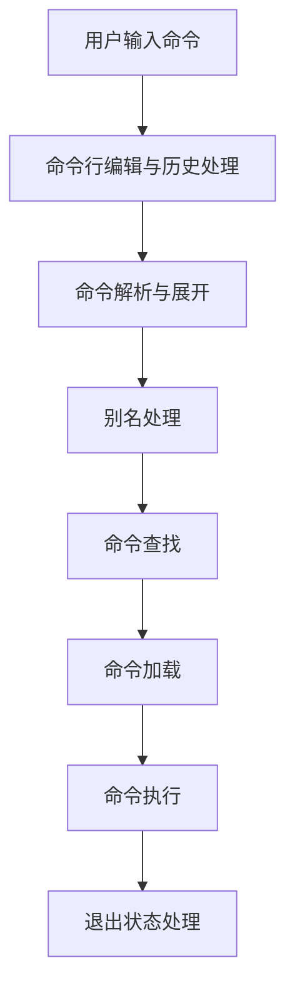
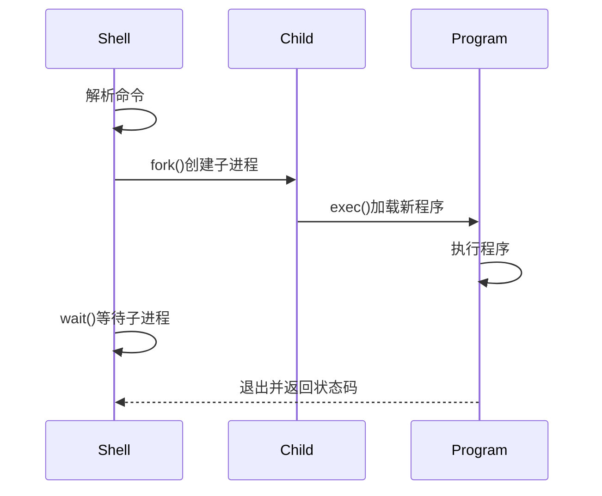

# Linux命令执行原理

当用户在终端输入命令时，Shell会经历一系列处理步骤来执行这些命令。本文将深入解析命令执行的完整过程，包括命令解析、查找、加载和执行等环节。

## 1. 命令执行流程概述

在Linux系统中，从用户输入命令到命令执行完成，整个过程涉及多个步骤和组件的协同工作。理解这一过程有助于我们更好地使用命令行，排查问题，以及编写高效的脚本。

命令执行的基本流程如下：



接下来，我们将详细探讨每个步骤的工作原理。

## 2. 命令行编辑与历史处理

### 2.1 命令行编辑

当我们在终端中输入命令时，Shell提供了一系列编辑功能，这些功能由readline库（在大多数Shell中）提供支持：

- **光标移动**：使用方向键或组合键（如Ctrl+A移到行首，Ctrl+E移到行尾）
- **文本编辑**：删除字符（Backspace、Delete）、剪切单词（Ctrl+W）等
- **命令补全**：使用Tab键自动补全命令、文件名和目录
- **历史搜索**：使用Ctrl+R搜索历史命令

这些功能使命令行操作更加高效，减少了输入错误。

### 2.2 命令历史处理

Shell会记录用户执行过的命令，存储在历史文件中（如Bash的`~/.bash_history`）。当用户按上下方向键或使用历史命令时，Shell会从这个历史记录中检索命令。

```bash
# 显示命令历史
history

# 执行历史中的第n条命令
!n

# 执行最近使用的以"string"开头的命令
!string
```

历史记录的大小通常由环境变量控制：

```bash
# 设置历史记录大小
HISTSIZE=1000  # 内存中保存的命令数
HISTFILESIZE=2000  # 历史文件中保存的命令数
```

## 3. 命令解析与展开

当用户按下Enter键后，Shell开始解析输入的命令行。

### 3.1 词法分析

Shell首先将命令行分解为"词"（tokens），这个过程称为词法分析。Shell根据特定规则（如空格分隔、引号处理）将输入分割成命令名和参数。

例如，命令`echo "Hello World" > output.txt`会被分解为：
- 命令名：`echo`
- 参数：`"Hello World"`
- 重定向操作符：`>`
- 重定向目标：`output.txt`

### 3.2 各种展开处理

Shell在执行命令前会进行多种展开（expansion）处理，按以下顺序：

1. **花括号展开**：展开形如`{a,b,c}`的模式
   ```bash
   echo file{1,2,3}.txt  # 输出: file1.txt file2.txt file3.txt
   ```

2. **波浪号展开**：将`~`展开为用户主目录
   ```bash
   echo ~  # 输出: /home/username
   echo ~/documents  # 输出: /home/username/documents
   ```

3. **参数和变量展开**：替换变量为其值
   ```bash
   echo $HOME  # 输出: /home/username
   echo ${VAR:-default}  # 如果VAR未设置，使用"default"
   ```

4. **命令替换**：执行命令并将其输出插入到命令行
   ```bash
   echo "Today is $(date)"
   # 或使用反引号（较旧的语法）
   echo "Today is `date`"
   ```

5. **算术展开**：计算算术表达式
   ```bash
   echo $((2 + 2))  # 输出: 4
   ```

6. **单词分割**：根据IFS（内部字段分隔符）变量分割展开结果
   ```bash
   data="a b c"
   for i in $data; do echo $i; done
   # 输出:
   # a
   # b
   # c
   ```

7. **路径名展开**：展开通配符（*, ?, [abc]等）
   ```bash
   echo *.txt  # 列出所有.txt文件
   ```

8. **进程替换**：创建临时文件描述符
   ```bash
   diff <(ls dir1) <(ls dir2)  # 比较两个目录的内容
   ```

这些展开步骤使Shell能够灵活处理各种命令行模式，但也可能导致一些意外行为，特别是在处理包含特殊字符的文件名时。

### 3.3 引号处理

Shell中的引号用于控制展开行为：

- **双引号（"）**：阻止单词分割和路径名展开，但允许变量、命令和算术展开
  ```bash
  echo "The path is $PATH"  # $PATH会被展开
  ```

- **单引号（'）**：阻止所有展开
  ```bash
  echo 'The path is $PATH'  # 输出字面文本: The path is $PATH
  ```

- **反斜杠（\）**：转义单个字符
  ```bash
  echo "Value: \$100"  # 输出: Value: $100
  ```

## 4. 别名处理

在命令解析后，Shell会检查命令是否是一个别名（alias）。别名是用户定义的命令替代，可以简化常用命令或添加默认选项。

```bash
# 定义别名
alias ll='ls -la'
alias rm='rm -i'  # 交互式删除，防止意外删除

# 使用别名
ll  # 等同于执行 ls -la
```

当Shell遇到别名时，它会用别名定义的内容替换原始命令，然后重新开始解析过程。为避免无限递归，Shell通常只替换一次。

可以使用`\`前缀临时禁用别名：

```bash
\rm file.txt  # 忽略rm别名，直接执行原始rm命令
```

## 5. 命令查找

命令解析完成后，Shell需要确定要执行的命令类型并找到它的位置。Shell按以下顺序查找命令：

### 5.1 内建命令

Shell首先检查命令是否是内建命令。内建命令是Shell本身实现的命令，不需要启动新进程。

常见的内建命令包括：
- `cd`：更改目录
- `echo`：显示文本
- `export`：设置环境变量
- `source`或`.`：执行脚本在当前Shell环境中
- `alias`：定义命令别名

可以使用`type`命令检查命令类型：

```bash
type cd  # 输出: cd is a shell builtin
```

内建命令执行速度快，可以修改Shell的环境，这是外部命令无法做到的。

### 5.2 函数

如果命令不是内建命令，Shell会检查它是否是一个已定义的函数。函数是用户在当前Shell会话中定义的命令集合。

```bash
# 定义函数
hello() {
    echo "Hello, $1!"
}

# 调用函数
hello World  # 输出: Hello, World!
```

函数与内建命令类似，在当前Shell进程中执行，可以访问和修改Shell环境。

### 5.3 哈希表查找

为了提高性能，Shell维护一个哈希表，记录之前找到的命令的路径。当再次执行相同命令时，Shell可以直接从哈希表中获取路径，而不需要搜索PATH。

```bash
# 显示命令哈希表
hash

# 清除哈希表
hash -r
```

### 5.4 PATH搜索

如果命令不是内建命令或函数，且哈希表中没有记录，Shell会在PATH环境变量指定的目录中按顺序查找可执行文件。

```bash
echo $PATH  # 显示PATH变量
# 输出示例: /usr/local/bin:/usr/bin:/bin:/usr/sbin:/sbin
```

Shell会依次检查每个目录，直到找到匹配的可执行文件或搜索完所有目录。

如果提供了相对或绝对路径（如`./script.sh`或`/usr/local/bin/python`），Shell会直接检查指定位置，而不搜索PATH。

## 6. 命令加载与执行

找到命令后，Shell需要加载并执行它。这个过程因命令类型而异。

### 6.1 内建命令和函数执行

内建命令和函数直接在当前Shell进程中执行，不需要创建新进程。这使它们能够：
- 修改当前Shell的环境变量
- 更改当前工作目录
- 创建和修改Shell变量和函数

例如，`cd`命令必须是内建命令，因为它需要更改当前Shell的工作目录。

### 6.2 外部命令执行

对于外部命令（在文件系统中找到的可执行文件），Shell会创建一个新的进程来执行命令。这个过程涉及以下步骤：

1. **Fork**：Shell使用`fork()`系统调用创建一个子进程，这个子进程是Shell进程的副本
2. **Exec**：子进程使用`exec()`系统调用将自身替换为目标程序
3. **Wait**：Shell进程（父进程）使用`wait()`系统调用等待子进程完成



这个过程称为"fork-exec模型"，是Unix/Linux系统执行程序的基础机制。

### 6.3 脚本执行

Shell脚本是包含Shell命令的文本文件。执行脚本时，Shell会：

1. 检查文件权限（是否可执行）
2. 检查文件开头的shebang行（`#!/bin/bash`）以确定使用哪个解释器
3. 启动指定的解释器并传入脚本文件

如果脚本没有执行权限，可以通过显式调用解释器来执行：

```bash
bash script.sh
```

如果脚本有执行权限但没有shebang行，Shell会使用默认的解释器（通常是当前Shell）。

## 7. 重定向和管道处理

Shell在执行命令前会设置输入/输出重定向和管道。

### 7.1 文件描述符

Linux中，每个进程默认有三个标准文件描述符：
- 0: 标准输入（stdin）
- 1: 标准输出（stdout）
- 2: 标准错误（stderr）

### 7.2 输入/输出重定向

Shell支持多种重定向操作：

```bash
# 将标准输出重定向到文件（覆盖）
command > file.txt

# 将标准输出追加到文件
command >> file.txt

# 将标准错误重定向到文件
command 2> errors.txt

# 将标准输出和标准错误都重定向到同一文件
command > file.txt 2>&1
# 或使用更现代的语法（Bash 4+）
command &> file.txt

# 从文件读取标准输入
command < input.txt

# 使用Here Document（多行输入）
command << EOF
line 1
line 2
EOF
```

Shell在执行命令前会设置这些重定向，修改子进程的文件描述符表。

### 7.3 管道处理

管道（`|`）将一个命令的输出连接到另一个命令的输入：

```bash
command1 | command2 | command3
```

Shell通过创建管道（使用`pipe()`系统调用）并设置相应的文件描述符来实现这一功能。在上面的例子中：
1. Shell创建两个管道
2. 将command1的标准输出连接到第一个管道的写入端
3. 将command2的标准输入连接到第一个管道的读取端
4. 将command2的标准输出连接到第二个管道的写入端
5. 将command3的标准输入连接到第二个管道的读取端
6. 启动所有三个命令

管道中的所有命令几乎是同时运行的，数据在它们之间流动，这是Unix/Linux强大的数据处理能力的基础。

## 8. 作业控制

Shell提供了作业控制功能，允许用户管理多个命令的执行。

### 8.1 前台和后台执行

命令默认在前台执行，占用终端。可以使用`&`将命令放在后台执行：

```bash
# 后台执行命令
long_running_command &
```

可以使用`jobs`命令查看当前Shell的作业：

```bash
jobs  # 列出所有作业
```

### 8.2 作业控制命令

Shell提供了多个命令来控制作业：

```bash
# 将作业移到前台
fg %1  # 将作业1移到前台

# 将作业移到后台
bg %1  # 将作业1移到后台

# 停止前台作业
# 按Ctrl+Z

# 终止作业
kill %1  # 终止作业1
```

作业控制使用信号机制与进程通信，例如，Ctrl+Z发送SIGTSTP信号暂停进程，`kill`命令默认发送SIGTERM信号终止进程。

## 9. 退出状态处理

命令执行完成后会返回一个退出状态（exit status），这是一个0-255之间的整数：
- 0通常表示成功
- 非0值表示错误，具体含义由命令定义

Shell将最后执行的命令的退出状态存储在特殊变量`$?`中：

```bash
ls /tmp
echo $?  # 如果/tmp存在，输出0（成功）

ls /nonexistent
echo $?  # 如果目录不存在，输出非0值（失败）
```

退出状态用于条件执行和脚本流程控制：

```bash
# 条件执行：只有当第一个命令成功时才执行第二个命令
command1 && command2

# 条件执行：只有当第一个命令失败时才执行第二个命令
command1 || command2

# 在脚本中使用退出状态
if command; then
    echo "Command succeeded"
else
    echo "Command failed"
fi
```

## 10. 环境变量和子进程继承

当Shell执行外部命令时，子进程会继承父Shell的环境变量，但不会继承Shell变量。

### 10.1 Shell变量与环境变量

- **Shell变量**：仅在当前Shell中可见
  ```bash
  VAR="local value"
  ```

- **环境变量**：可被子进程继承
  ```bash
  export VAR="inherited value"
  # 或
  VAR="inherited value"; export VAR
  ```

### 10.2 子进程环境

子进程继承的内容包括：
- 环境变量
- 打开的文件描述符（经过重定向处理）
- 当前工作目录
- 用户ID和组ID
- 资源限制

子进程不会继承：
- Shell变量（未导出的变量）
- Shell函数和别名
- Shell选项设置
- 作业控制信息

这种继承机制确保子进程有足够的信息来执行任务，同时保持与父进程的适当隔离。

## 11. 命令执行优化

Shell实现了多种优化技术来提高命令执行效率：

### 11.1 命令哈希

如前所述，Shell使用哈希表缓存命令路径，避免重复搜索PATH。

### 11.2 内建命令优化

常用命令被实现为内建命令，避免创建新进程的开销。例如，许多Shell将`echo`、`test`等命令实现为内建命令，尽管它们也有外部命令版本。

### 11.3 命令分组

Shell可以在一个子Shell中执行多个命令：

```bash
# 在子Shell中执行命令组
(cd /tmp && ls)  # 当前目录不变

# 在当前Shell中执行命令组
{ cd /tmp && ls; }  # 当前目录变为/tmp
```

命令分组可以控制变量作用域和重定向范围。

## 12. 实际案例分析

让我们通过分析一个复杂命令的执行过程，来综合理解上述概念：

```bash
find /var/log -name "*.log" -type f -mtime -7 | xargs grep "ERROR" | sort | uniq -c | sort -nr > error_summary.txt
```

这个命令的执行过程：

1. **命令解析**：Shell将命令行分解为多个部分（find命令、管道、xargs命令等）

2. **展开处理**：展开通配符`*.log`和变量（如果有）

3. **命令查找**：
   - `find`：外部命令，在PATH中查找
   - `xargs`：外部命令，在PATH中查找
   - `sort`：外部命令，在PATH中查找
   - `uniq`：外部命令，在PATH中查找

4. **设置管道和重定向**：
   - 创建三个管道连接四个命令
   - 设置最后一个命令的标准输出重定向到文件

5. **执行命令**：
   - 创建五个进程（四个命令加一个Shell）
   - 设置适当的文件描述符
   - 启动所有命令

6. **数据流**：
   - `find`查找最近7天修改的日志文件
   - 文件名通过管道传给`xargs`
   - `xargs`在这些文件中搜索"ERROR"
   - 匹配行通过管道传给`sort`
   - 排序后的行通过管道传给`uniq`，计算每行出现次数
   - 结果按数字逆序排序
   - 最终输出写入`error_summary.txt`

7. **完成**：所有命令执行完毕，Shell显示提示符等待下一个命令

这个例子展示了Shell如何协调多个命令和进程，以及如何通过管道和重定向连接它们，形成强大的数据处理流水线。

## 13. 不同Shell的差异

不同的Shell（如Bash、Zsh、Fish等）在命令执行过程中有一些差异：

### 13.1 展开顺序

不同Shell可能有不同的展开顺序。例如，Bash和Zsh在某些展开类型的处理顺序上有细微差别。

### 13.2 内建命令

各Shell实现的内建命令集合不同。例如，Zsh比Bash有更多的内建命令，这可能导致某些命令在Zsh中执行更快。

### 13.3 作业控制

不同Shell的作业控制语法和功能可能有所不同，尽管基本概念相似。

### 13.4 脚本兼容性

由于这些差异，为一种Shell编写的脚本可能在另一种Shell中无法正确执行，特别是使用了Shell特定功能的脚本。

## 14. 总结

Linux命令执行是一个复杂而精密的过程，涉及多个步骤：

1. **命令行编辑**：用户输入命令并使用编辑功能
2. **命令解析**：Shell将命令行分解为组件
3. **展开处理**：处理变量、通配符等
4. **别名处理**：替换已定义的别名
5. **命令查找**：确定命令类型并找到其位置
6. **重定向和管道设置**：配置输入/输出路径
7. **命令执行**：加载并运行命令
8. **退出状态处理**：处理命令的返回值

理解这个过程有助于：
- 更有效地使用命令行
- 编写更高效的Shell脚本
- 排查命令执行问题
- 理解Linux系统的工作原理

Shell的命令执行机制体现了Unix/Linux的设计哲学：简单、模块化的工具可以通过管道和重定向组合，创建强大的命令链，解决复杂问题。这种设计使Linux命令行成为一个强大而灵活的工具，能够适应各种系统管理和数据处理任务。