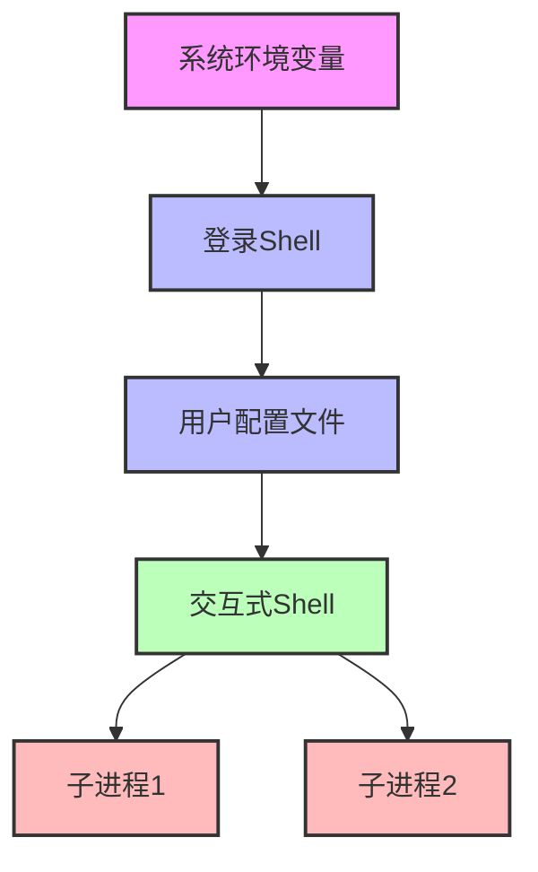

# 环境变量工作机制

环境变量是Linux系统中的重要概念，它们影响着命令的执行环境和系统行为。本文将介绍环境变量的定义、查看和修改方法，以及常见环境变量的作用和配置技巧。

## 1. 环境变量基础概念

### 1.1 什么是环境变量

环境变量是存储在操作系统中的动态命名值，可以被进程访问并影响程序行为的一种机制。简单来说，环境变量是一种在操作系统层面存储信息的方式，这些信息可以被系统中运行的程序读取和使用。

环境变量通常表示为"名称=值"的形式，例如：`HOME=/home/user`。这种机制使得程序可以在不同环境中运行时获取不同的配置信息，而无需修改程序本身。

### 1.2 环境变量的作用

环境变量在Linux系统中扮演着多种重要角色：

1. **配置程序行为**：许多程序通过读取环境变量来确定其行为方式
2. **存储系统信息**：如用户主目录、终端类型、系统语言等
3. **定义系统路径**：告诉系统在哪里查找可执行文件、库文件等
4. **进程间通信**：父进程可以通过环境变量向子进程传递信息
5. **安全控制**：某些环境变量可以影响系统安全性和访问控制

### 1.3 环境变量与Shell变量的区别

在Linux中，变量可以分为两大类：环境变量和Shell变量。

**环境变量**：
- 可以被当前Shell及其所有子进程访问
- 使用`export`命令创建或修改
- 通常用于影响程序行为或存储系统信息

**Shell变量**：
- 仅在当前Shell会话中可见，子进程无法访问
- 直接赋值创建或修改，无需`export`
- 通常用于Shell脚本中的临时数据存储

```bash
# 创建Shell变量
local_var="仅当前Shell可见"

# 创建环境变量
export env_var="子进程可见"

# 将Shell变量转换为环境变量
export local_var
```

## 2. 环境变量的查看与管理

### 2.1 查看环境变量

Linux提供了多种查看环境变量的命令：

```bash
# 查看所有环境变量
env
printenv

# 查看特定环境变量
echo $HOME
printenv HOME
```

`env`和`printenv`命令显示当前Shell的所有环境变量，而`echo $变量名`可以显示特定变量的值。

### 2.2 设置环境变量

设置环境变量有多种方法，取决于你希望变量持续的时间范围：

#### 2.2.1 临时设置（当前会话）

临时设置的环境变量仅在当前Shell会话中有效，关闭终端后变量将消失：

```bash
# 设置新环境变量
export MY_VAR="Hello World"

# 修改已有环境变量
export PATH="$PATH:/new/path"
```

#### 2.2.2 永久设置（用户级别）

要使环境变量在用户的所有会话中持久存在，需要将其添加到Shell的配置文件中：

**Bash用户**：
```bash
# 编辑~/.bashrc文件
echo 'export MY_VAR="Hello World"' >> ~/.bashrc
echo 'export PATH="$PATH:/new/path"' >> ~/.bashrc

# 使更改立即生效
source ~/.bashrc
```

**Zsh用户**：
```bash
# 编辑~/.zshrc文件
echo 'export MY_VAR="Hello World"' >> ~/.zshrc
echo 'export PATH="$PATH:/new/path"' >> ~/.zshrc

# 使更改立即生效
source ~/.zshrc
```

#### 2.2.3 永久设置（系统级别）

要为系统所有用户设置环境变量，需要修改系统级配置文件：

```bash
# 创建新的配置文件（需要root权限）
sudo sh -c 'echo "export MY_VAR=\"Hello World\"" > /etc/profile.d/my_custom_env.sh'

# 使文件可执行
sudo chmod +x /etc/profile.d/my_custom_env.sh
```

系统级环境变量通常在以下文件中设置：
- `/etc/environment`：系统范围的环境变量
- `/etc/profile`：登录Shell的系统范围设置
- `/etc/profile.d/*.sh`：模块化的系统范围设置
- `/etc/bash.bashrc`：所有bash用户的系统范围设置

### 2.3 删除环境变量

删除环境变量可以使用`unset`命令：

```bash
# 删除环境变量
unset MY_VAR
```

要永久删除环境变量，需要从相应的配置文件中移除设置该变量的行。

### 2.4 环境变量的继承与作用域

环境变量遵循一定的继承规则：

1. **父进程到子进程**：子进程继承父进程的环境变量
2. **单向传递**：子进程对环境变量的修改不会影响父进程
3. **会话隔离**：不同终端会话之间的环境变量相互独立



## 3. 重要的环境变量

Linux系统中有许多预定义的环境变量，它们控制着系统的各个方面。以下是一些最重要的环境变量：

### 3.1 PATH环境变量

`PATH`是最常用的环境变量之一，它定义了Shell查找可执行文件的目录列表：

```bash
echo $PATH
# 输出示例: /usr/local/sbin:/usr/local/bin:/usr/sbin:/usr/bin:/sbin:/bin
```

当你在终端输入命令时，Shell会在`PATH`指定的目录中按顺序查找该命令的可执行文件。

#### 3.1.1 修改PATH变量

添加新目录到`PATH`的正确方式是：

```bash
# 添加到PATH末尾
export PATH="$PATH:/new/directory"

# 添加到PATH开头（优先搜索）
export PATH="/new/directory:$PATH"
```

**注意**：修改`PATH`时，始终包含原有的`$PATH`，否则会覆盖而不是追加，导致大多数命令无法找到。

### 3.2 HOME环境变量

`HOME`变量指定用户的主目录路径：

```bash
echo $HOME
# 输出示例: /home/username
```

许多程序使用`HOME`变量来确定配置文件的位置。波浪号(`~`)在Shell中是`HOME`变量的简写。

### 3.3 USER和LOGNAME环境变量

这些变量存储当前登录用户的用户名：

```bash
echo $USER
echo $LOGNAME
```

### 3.4 SHELL环境变量

`SHELL`变量指定用户的默认Shell：

```bash
echo $SHELL
# 输出示例: /bin/bash
```

### 3.5 LANG和语言相关变量

这些变量控制程序的语言和区域设置：

```bash
echo $LANG
# 输出示例: en_US.UTF-8

# 其他语言相关变量
echo $LC_ALL
echo $LC_CTYPE
```

这些设置影响日期格式、数字格式、排序规则和字符编码等。

### 3.6 TERM环境变量

`TERM`变量指定终端类型，影响终端的颜色支持和功能：

```bash
echo $TERM
# 输出示例: xterm-256color
```

### 3.7 PWD和OLDPWD环境变量

- `PWD`：当前工作目录
- `OLDPWD`：上一个工作目录（使用`cd -`命令可以返回到`OLDPWD`）

```bash
echo $PWD
echo $OLDPWD
```

### 3.8 DISPLAY环境变量

在图形环境中，`DISPLAY`变量告诉X客户端程序要连接的X服务器：

```bash
echo $DISPLAY
# 输出示例: :0
```

这对于远程X11转发和图形应用程序非常重要。

## 4. 环境变量的高级用法

### 4.1 条件默认值

Bash提供了多种变量扩展语法，用于处理变量可能不存在的情况：

```bash
# 如果变量未设置或为空，使用默认值
echo ${VAR:-default}

# 如果变量未设置或为空，设置为默认值并返回
echo ${VAR:=default}

# 如果变量已设置且非空，使用替代值
echo ${VAR:+alternative}

# 如果变量未设置或为空，显示错误信息并退出
echo ${VAR:?error message}
```

这些语法在Shell脚本中特别有用，可以处理缺少环境变量的情况。

### 4.2 子字符串操作

环境变量值可以使用子字符串操作进行处理：

```bash
# 提取子字符串（从位置2开始，长度为3）
VAR="abcdefg"
echo ${VAR:2:3}  # 输出: cde

# 移除前缀匹配
FILE="document.txt"
echo ${FILE#*.}  # 输出: txt（移除最短匹配的*.）

# 移除后缀匹配
echo ${FILE%.*}  # 输出: document（移除最短匹配的.*）
```

### 4.3 间接引用

Bash支持间接变量引用，即使用一个变量的值作为另一个变量的名称：

```bash
# 设置变量
NAME="John"
USER_NAME="NAME"

# 间接引用
echo ${!USER_NAME}  # 输出: John
```

### 4.4 数组环境变量

Bash支持数组环境变量，可以在一个变量中存储多个值：

```bash
# 定义数组
export ARRAY=(value1 value2 value3)

# 访问单个元素
echo ${ARRAY[0]}  # 输出: value1

# 访问所有元素
echo ${ARRAY[@]}  # 输出: value1 value2 value3

# 获取数组长度
echo ${#ARRAY[@]}  # 输出: 3
```

## 5. 环境变量最佳实践

### 5.1 命名约定

环境变量命名应遵循一定的约定：

1. **使用大写字母**：环境变量通常使用全大写字母
2. **使用下划线分隔单词**：如`MY_CUSTOM_VAR`
3. **避免特殊字符**：变量名应只包含字母、数字和下划线
4. **避免与系统变量冲突**：不要覆盖`PATH`、`HOME`等重要系统变量
5. **使用前缀**：为项目特定的变量使用前缀，如`APP_CONFIG_PATH`

### 5.2 安全考虑

环境变量可能带来安全风险，应注意以下几点：

1. **不要在环境变量中存储敏感信息**（如密码、API密钥）
2. **注意环境变量注入攻击**，特别是在Web应用程序中
3. **限制环境变量的作用域**，只在需要的地方设置
4. **定期审查系统环境变量**，移除不必要的变量

### 5.3 调试环境变量问题

当遇到环境变量相关问题时，可以使用以下技巧：

```bash
# 查看所有环境变量
env | sort

# 跟踪变量设置过程
bash -x script.sh

# 检查特定变量
echo "Variable: $MY_VAR"

# 临时修改环境变量测试
MY_VAR="test" command
```

### 5.4 环境变量与配置文件

为了更好地管理环境变量，可以采用以下策略：

1. **模块化配置**：将相关环境变量分组到单独的文件中
   ```bash
   # 创建模块化配置
   mkdir -p ~/.config/env.d/
   echo 'export DB_HOST="localhost"' > ~/.config/env.d/database.sh
   echo 'export DB_PORT="5432"' >> ~/.config/env.d/database.sh
   
   # 在~/.bashrc中加载所有配置
   echo 'for file in ~/.config/env.d/*.sh; do source "$file"; done' >> ~/.bashrc
   ```

2. **使用dotenv文件**：对于项目特定的环境变量，使用`.env`文件
   ```bash
   # .env文件示例
   APP_ENV=development
   DEBUG=true
   API_KEY=abcdef123456
   
   # 加载.env文件（需要安装工具或使用脚本）
   eval $(cat .env | sed 's/^/export /')
   ```

3. **版本控制考虑**：不要将包含敏感信息的环境变量文件添加到版本控制系统
   ```bash
   # .gitignore示例
   .env
   *.local.sh
   ```

## 6. 常见环境变量配置场景

### 6.1 开发环境配置

开发人员经常需要配置特定的环境变量：

```bash
# 开发环境配置示例
export NODE_ENV=development
export DEBUG=true
export LOG_LEVEL=debug
export API_URL=http://localhost:3000/api
```

### 6.2 多版本语言管理

使用环境变量管理多个版本的编程语言：

```bash
# Python版本管理（使用pyenv）
export PYENV_ROOT="$HOME/.pyenv"
export PATH="$PYENV_ROOT/bin:$PATH"
eval "$(pyenv init -)"

# Node.js版本管理（使用nvm）
export NVM_DIR="$HOME/.nvm"
[ -s "$NVM_DIR/nvm.sh" ] && \. "$NVM_DIR/nvm.sh"
```

### 6.3 代理设置

在需要使用代理的环境中：

```bash
# HTTP代理设置
export http_proxy=http://proxy.example.com:8080
export https_proxy=http://proxy.example.com:8080
export no_proxy=localhost,127.0.0.1

# Git代理设置
export GIT_PROXY_COMMAND=/path/to/proxy-command
```

### 6.4 数据库连接

数据库连接信息通常通过环境变量配置：

```bash
# 数据库连接环境变量
export DB_HOST=localhost
export DB_PORT=5432
export DB_NAME=myapp
export DB_USER=dbuser
export DB_PASS=dbpassword
```

## 7. 环境变量加载顺序

理解环境变量的加载顺序对于解决冲突和调试问题非常重要。

### 7.1 Bash加载顺序

Bash加载环境变量的顺序如下：

1. `/etc/environment`：系统范围的环境变量
2. `/etc/profile`：所有用户的全局配置
3. `/etc/profile.d/*.sh`：模块化的全局配置
4. `~/.bash_profile`、`~/.bash_login`或`~/.profile`（按此顺序查找第一个存在的文件）：用户登录时的配置
5. `~/.bashrc`：交互式非登录Shell的配置

对于非登录Shell（如从图形环境启动的终端），只加载`~/.bashrc`。

```mermaid
flowchart TD
    A[登录Shell启动] --> B[/etc/environment]
    B --> C[/etc/profile]
    C --> D[/etc/profile.d/*.sh]
    D --> E{~/.bash_profile存在?}
    E -->|是| F[~/.bash_profile]
    E -->|否| G{~/.bash_login存在?}
    G -->|是| H[~/.bash_login]
    G -->|否| I[~/.profile]
    F --> J[通常会source ~/.bashrc]
    H --> J
    I --> J
    
    K[非登录Shell启动] --> L[~/.bashrc]
    L --> M[/etc/bash.bashrc]
```

### 7.2 Zsh加载顺序

Zsh的加载顺序略有不同：

1. `/etc/zshenv`：所有Shell的全局设置
2. `~/.zshenv`：所有Shell的用户设置
3. `/etc/zprofile`：登录Shell的全局设置
4. `~/.zprofile`：登录Shell的用户设置
5. `/etc/zshrc`：交互式Shell的全局设置
6. `~/.zshrc`：交互式Shell的用户设置
7. `/etc/zlogin`：登录Shell结束时的全局设置
8. `~/.zlogin`：登录Shell结束时的用户设置

### 7.3 解决加载顺序问题

当遇到环境变量加载顺序问题时：

1. **使用`echo`调试**：在各个配置文件中添加`echo`语句跟踪加载过程
2. **优先级覆盖**：在较晚加载的文件中重新定义变量以覆盖早期设置
3. **条件设置**：只在变量未设置时设置它
   ```bash
   # 只在变量未设置时设置它
   if [ -z "$MY_VAR" ]; then
       export MY_VAR="default value"
   fi
   ```

## 8. 总结与实践建议

环境变量是Linux系统中一个强大而灵活的机制，正确使用它们可以提高系统的可配置性和可维护性。

### 8.1 关键要点回顾

1. **环境变量是进程间共享配置的机制**，子进程继承父进程的环境变量
2. **临时设置使用`export`命令**，永久设置需修改配置文件
3. **PATH变量决定命令查找位置**，修改时应保留原值
4. **环境变量有不同的作用域**：系统级、用户级和会话级
5. **Shell提供了丰富的变量扩展语法**，用于条件默认值和字符串操作

### 8.2 最佳实践总结

1. **遵循命名约定**：使用大写字母和下划线
2. **模块化管理**：将相关变量分组到单独的配置文件中
3. **安全第一**：不在环境变量中存储敏感信息
4. **明智地使用作用域**：只在需要的范围内设置变量
5. **文档化**：记录项目所需的环境变量及其用途
6. **使用工具**：考虑使用dotenv等工具管理项目环境变量

### 8.3 进阶学习方向

掌握了环境变量的基础知识后，可以进一步探索：

1. **容器环境变量**：Docker和Kubernetes中的环境变量管理
2. **环境变量加密**：使用工具安全存储敏感环境变量
3. **配置管理工具**：如Ansible、Chef等如何处理环境变量
4. **CI/CD中的环境变量**：在持续集成和部署流程中管理环境变量

通过深入理解和合理使用环境变量，你可以更有效地配置和管理Linux系统，使其更好地适应各种工作环境和需求。