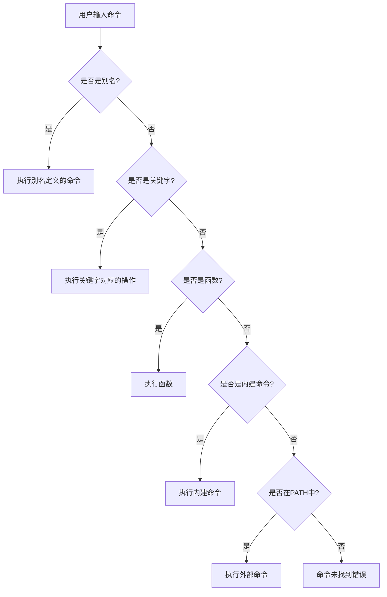

# 命令查找路径与优先级

当执行命令时，Linux系统会按照特定的路径和优先级规则查找可执行文件。本文将详细介绍PATH环境变量、命令查找机制以及如何管理命令的优先级和冲突。

## 1. 命令查找的基本原理

在Linux系统中，当你在终端输入命令并按下回车键时，Shell会按照一定的顺序和规则查找并执行相应的程序。理解这个查找过程对于解决命令冲突、优化系统配置以及排查"命令未找到"等问题至关重要。

### 1.1 命令类型概述

在开始讨论查找路径之前，我们需要了解Linux中存在几种不同类型的命令：

1. **内建命令(Built-in Commands)**：这些命令是Shell本身的一部分，不需要从文件系统加载。例如：`cd`、`echo`、`pwd`等。

2. **外部命令(External Commands)**：这些命令是存储在文件系统中的独立可执行文件。例如：`ls`、`grep`、`find`等。

3. **别名(Aliases)**：用户自定义的命令快捷方式。例如：`alias ll='ls -la'`。

4. **函数(Functions)**：Shell脚本中定义的函数，可以在当前Shell环境中调用。

5. **关键字(Keywords)**：Shell语法的一部分，如`if`、`for`、`while`等。

每种类型的命令在查找和执行时都有不同的优先级和规则。

### 1.2 命令查找的基本流程

当你输入命令时，Shell会按照以下顺序查找命令：



这个流程确保了命令的正确查找和执行，同时也决定了不同类型命令之间的优先级。

## 2. PATH环境变量详解

PATH环境变量是Linux系统中最重要的环境变量之一，它定义了Shell查找外部命令的目录列表。

### 2.1 PATH的结构和格式

PATH变量包含一系列由冒号(`:`)分隔的目录路径：

```bash
echo $PATH
# 输出示例: /usr/local/sbin:/usr/local/bin:/usr/sbin:/usr/bin:/sbin:/bin
```

当你输入一个命令时，Shell会按照PATH中列出的目录顺序，从左到右依次查找具有相同名称的可执行文件。一旦找到匹配的可执行文件，Shell就会停止搜索并执行该文件。

### 2.2 默认PATH目录及其作用

标准Linux系统中，PATH通常包含以下目录（顺序可能因发行版而异）：

1. **/usr/local/sbin**：本地系统管理员命令，优先级高于系统自带命令
2. **/usr/local/bin**：本地用户命令，通常是手动编译安装的程序
3. **/usr/sbin**：系统管理员命令，通常需要root权限
4. **/usr/bin**：大多数用户命令，系统自带的标准命令
5. **/sbin**：基本系统管理员命令，启动和修复系统时使用
6. **/bin**：基本用户命令，系统最核心的命令

这些目录的组织遵循一定的逻辑：
- `/bin`和`/sbin`包含系统启动和基本操作所需的命令
- `/usr/bin`和`/usr/sbin`包含大部分系统命令
- `/usr/local/bin`和`/usr/local/sbin`用于存放本地安装的命令，优先级高于系统命令

### 2.3 查看和修改PATH

#### 2.3.1 查看当前PATH

```bash
# 显示当前PATH变量
echo $PATH

# 以更易读的格式显示
echo $PATH | tr ':' '\n'
```

#### 2.3.2 临时修改PATH

临时修改PATH只影响当前终端会话，关闭终端后修改将失效：

```bash
# 在PATH末尾添加新目录
export PATH=$PATH:/path/to/new/directory

# 在PATH开头添加新目录（提高优先级）
export PATH=/path/to/new/directory:$PATH
```

#### 2.3.3 永久修改PATH

要永久修改PATH，需要编辑Shell配置文件：

**对于Bash用户**：
```bash
# 编辑~/.bashrc文件
echo 'export PATH=$PATH:/path/to/new/directory' >> ~/.bashrc

# 使更改立即生效
source ~/.bashrc
```

**对于Zsh用户**：
```bash
# 编辑~/.zshrc文件
echo 'export PATH=$PATH:/path/to/new/directory' >> ~/.zshrc

# 使更改立即生效
source ~/.zshrc
```

**系统级修改**（影响所有用户）：
```bash
# 创建新的配置文件（需要root权限）
sudo sh -c 'echo "export PATH=$PATH:/path/to/new/directory" > /etc/profile.d/custom_path.sh'

# 使文件可执行
sudo chmod +x /etc/profile.d/custom_path.sh
```

### 2.4 PATH安全性考虑

修改PATH时需要注意以下安全问题：

1. **目录顺序**：将不受信任的目录放在PATH的末尾，避免命令劫持
2. **相对路径**：避免在PATH中包含相对路径（如`.`或`..`）
3. **权限控制**：确保PATH中的目录具有适当的权限，防止未授权修改
4. **当前目录**：不要将当前目录（`.`）添加到PATH中，这可能导致执行恶意程序

```bash
# 不安全的PATH配置（包含当前目录）
export PATH=.:$PATH  # 不推荐!

# 更安全的替代方案
alias run-here='./'
```

## 3. 命令查找的优先级规则

当存在多个同名命令时，Shell会按照特定的优先级规则决定执行哪一个。

### 3.1 命令类型的优先级顺序

Shell查找命令的完整优先级顺序如下（从高到低）：

1. **别名(Aliases)**
2. **关键字(Keywords)**
3. **函数(Functions)**
4. **内建命令(Built-ins)**
5. **外部命令(PATH中的可执行文件)**

这意味着如果你创建了一个名为`ls`的别名，它将优先于系统的`ls`命令被执行。

### 3.2 验证命令类型和位置

Linux提供了多种工具来确定命令的类型和位置：

#### 3.2.1 type命令

`type`命令可以显示命令的类型：

```bash
# 检查命令类型
type cd
# 输出: cd is a shell builtin

type ls
# 输出: ls is aliased to `ls --color=auto'
# 或: ls is /usr/bin/ls

# 查看所有可能的命令位置
type -a ls
# 输出可能包含别名和实际路径
```

#### 3.2.2 which命令

`which`命令用于查找外部命令的完整路径：

```bash
which python
# 输出: /usr/bin/python

# 查找多个命令
which python python3 pip
```

注意：`which`命令只查找PATH中的可执行文件，不显示内建命令、别名或函数。

#### 3.2.3 whereis命令

`whereis`命令可以查找命令的二进制文件、源代码和手册页：

```bash
whereis ls
# 输出: ls: /usr/bin/ls /usr/share/man/man1/ls.1.gz
```

#### 3.2.4 command命令

`command`命令可以忽略别名和函数，直接执行内建命令或外部命令：

```bash
# 忽略别名，执行原始命令
command ls

# 检查命令是否存在
command -v python
```

### 3.3 哈希表机制

为了提高命令查找的效率，Shell使用哈希表缓存已找到的命令路径：

```bash
# 显示命令哈希表
hash

# 清除哈希表
hash -r

# 清除特定命令的哈希
hash -d ls
```

当你第一次执行外部命令时，Shell会搜索PATH中的目录并记住找到的位置。之后再执行同一命令时，Shell直接使用哈希表中的路径，避免重复搜索PATH。

如果命令位置发生变化（如安装了新版本），可能需要清除哈希表使Shell重新搜索。

## 4. 管理命令冲突和优先级

在实际使用中，我们经常需要管理命令的优先级或解决命令冲突。

### 4.1 使用绝对路径

最直接的方法是使用命令的绝对路径，完全绕过PATH查找：

```bash
# 使用绝对路径执行特定版本的Python
/usr/local/bin/python3.9 script.py

# 即使有同名别名，也执行系统命令
/bin/ls
```

### 4.2 临时忽略别名

如果要忽略别名并使用原始命令，可以：

```bash
# 使用反斜杠前缀
\ls

# 使用command命令
command ls

# 使用绝对路径
/bin/ls
```

### 4.3 创建和管理别名

别名是管理命令优先级的有效工具：

```bash
# 创建别名
alias ll='ls -la'
alias grep='grep --color=auto'

# 查看所有别名
alias

# 查看特定别名
alias ls

# 删除别名
unalias ls
```

别名通常在Shell配置文件（如`~/.bashrc`或`~/.zshrc`）中定义，以便在每次登录时自动加载。

### 4.4 使用符号链接管理版本

符号链接是管理多个版本命令的常用方法：

```bash
# 创建指向特定版本的符号链接
sudo ln -sf /usr/bin/python3.9 /usr/local/bin/python

# 检查链接
ls -l /usr/local/bin/python
```

许多软件包管理器（如Debian的`update-alternatives`）使用这种方法管理多个版本的命令。

### 4.5 使用环境管理工具

对于编程语言和开发环境，专用的版本管理工具通常是更好的选择：

- **Python**: pyenv, virtualenv, conda
- **Node.js**: nvm, n
- **Ruby**: rvm, rbenv
- **Java**: jenv, sdkman

这些工具通过修改PATH或创建隔离环境来管理不同版本的命令。

```bash
# 使用pyenv选择Python版本
pyenv global 3.9.7

# 使用nvm选择Node.js版本
nvm use 16.13.0
```

## 5. 实际应用场景

让我们通过几个实际场景来理解命令查找和优先级的应用。

### 5.1 安装自定义软件

当你从源代码编译安装软件时，通常需要将其添加到PATH中：

```bash
# 编译安装软件
./configure --prefix=/opt/myapp
make
make install

# 添加到PATH
echo 'export PATH=/opt/myapp/bin:$PATH' >> ~/.bashrc
source ~/.bashrc
```

将新目录放在PATH的开头可以确保优先使用新安装的版本。

### 5.2 管理Python多版本环境

Python开发中经常需要使用不同的Python版本：

```bash
# 使用pyenv安装多个Python版本
pyenv install 3.8.12
pyenv install 3.9.7

# 设置全局Python版本
pyenv global 3.9.7

# 为特定项目设置Python版本
cd myproject
pyenv local 3.8.12

# 创建虚拟环境
python -m venv venv
source venv/bin/activate
```

pyenv通过修改PATH和创建shims（拦截器）来管理Python命令的优先级。

### 5.3 临时使用特定版本的命令

有时你需要临时使用特定版本的命令，而不改变全局配置：

```bash
# 临时修改PATH
PATH=/opt/alternative/bin:$PATH command_name

# 使用env命令
env PATH=/opt/alternative/bin:$PATH command_name

# 在子Shell中修改环境
(export PATH=/opt/alternative/bin:$PATH; command_name)
```

这些方法只在当前命令或子Shell中修改PATH，不影响全局环境。

### 5.4 创建命令包装器

命令包装器（wrapper）是一种常用的技术，用于在执行原始命令前后添加额外的功能：

```bash
# 创建git包装器函数
git() {
    echo "Executing git command: $@"
    command git "$@"
    echo "Git command completed with status: $?"
}

# 或创建包装器脚本
cat > ~/bin/python-wrapper << 'EOF'
#!/bin/bash
echo "Python wrapper: $@"
/usr/bin/python "$@"
EOF
chmod +x ~/bin/python-wrapper

# 添加到PATH
export PATH=~/bin:$PATH
```

包装器可以用于日志记录、权限检查、环境设置或参数转换等。

## 6. 排查命令查找问题

在使用Linux时，经常会遇到命令查找相关的问题。以下是一些常见问题及其解决方法。

### 6.1 "命令未找到"错误

当Shell无法在PATH中找到命令时，会显示"command not found"错误：

```bash
some_command
# 输出: some_command: command not found
```

可能的原因和解决方法：

1. **命令未安装**：使用包管理器安装
   ```bash
   sudo apt install package-name  # Debian/Ubuntu
   sudo yum install package-name  # RHEL/CentOS
   ```

2. **命令不在PATH中**：检查并修改PATH
   ```bash
   # 查找命令位置
   find / -name some_command 2>/dev/null
   
   # 添加到PATH
   export PATH=$PATH:/path/to/command/directory
   ```

3. **权限问题**：检查文件权限
   ```bash
   # 确保文件可执行
   chmod +x /path/to/some_command
   ```

### 6.2 执行了错误版本的命令

有时系统执行的命令版本与预期不符：

```bash
python --version
# 输出: Python 2.7.18  (但你期望的是Python 3.x)
```

排查步骤：

1. **检查命令类型和位置**
   ```bash
   type -a python
   which python
   ```

2. **检查别名**
   ```bash
   alias python
   ```

3. **检查符号链接**
   ```bash
   ls -l $(which python)
   ```

4. **检查PATH顺序**
   ```bash
   echo $PATH | tr ':' '\n'
   ```

5. **清除命令哈希**
   ```bash
   hash -d python
   ```

### 6.3 PATH相关的安全问题

不正确的PATH配置可能导致安全风险：

1. **检测可疑PATH条目**
   ```bash
   echo $PATH | tr ':' '\n' | grep -E '^\.|^$|^ | $'
   ```

2. **检查目录权限**
   ```bash
   # 检查PATH中目录的权限
   for dir in $(echo $PATH | tr ':' ' '); do
       ls -ld "$dir"
   done
   ```

3. **检查可写目录**
   ```bash
   # 查找PATH中其他用户可写的目录
   for dir in $(echo $PATH | tr ':' ' '); do
       if [ -d "$dir" ] && [ -w "$dir" ] && [ "$(stat -c '%U' "$dir")" != "$(whoami)" ]; then
           echo "Warning: $dir is writable by others"
       fi
   done
   ```

### 6.4 调试工具和技巧

调试命令查找问题的有用工具和技巧：

1. **使用strace跟踪系统调用**
   ```bash
   strace -e execve bash -c 'command_name'
   ```

2. **启用Shell调试模式**
   ```bash
   # Bash调试模式
   set -x
   command_name
   set +x
   ```

3. **使用which的详细模式**
   ```bash
   # 在某些系统上支持
   which -a -v command_name
   ```

4. **检查Shell启动文件**
   ```bash
   # 查找修改PATH的行
   grep -r "PATH" ~/.bashrc ~/.bash_profile ~/.profile /etc/profile /etc/profile.d/
   ```

## 7. 最佳实践和建议

基于上述内容，以下是一些关于命令查找和PATH管理的最佳实践：

### 7.1 PATH管理建议

1. **保持PATH简洁**：只包含必要的目录，避免重复
2. **优先级排序**：将最常用或优先级最高的目录放在前面
3. **定期审查**：定期检查PATH中的目录，移除不再需要的条目
4. **模块化管理**：使用配置文件管理不同类别的PATH条目

```bash
# ~/.bashrc中的模块化PATH管理
# 基本系统PATH
export PATH="/usr/local/sbin:/usr/local/bin:/usr/sbin:/usr/bin:/sbin:/bin"

# 用户bin目录
if [ -d "$HOME/bin" ] ; then
    PATH="$HOME/bin:$PATH"
fi

# 开发工具
if [ -d "/opt/development/bin" ] ; then
    PATH="/opt/development/bin:$PATH"
fi
```

### 7.2 命令优先级管理建议

1. **使用别名进行简单覆盖**：对于简单的命令修改，使用别名
2. **使用函数进行复杂覆盖**：需要复杂逻辑时，使用Shell函数
3. **使用专用工具管理版本**：对于编程语言和开发工具，使用专用的版本管理工具
4. **避免修改系统命令**：尽量不要替换或修改核心系统命令

### 7.3 安全建议

1. **不要将当前目录添加到PATH**：避免执行当前目录中的命令
2. **检查目录权限**：确保PATH中的目录具有适当的权限
3. **优先使用包管理器**：尽可能使用系统包管理器安装软件
4. **定期审计PATH**：检查PATH中是否有可疑或不必要的目录

### 7.4 多用户环境建议

在多用户系统中：

1. **使用/opt目录**：将自定义软件安装到/opt目录
2. **使用/etc/profile.d**：系统范围的PATH修改放在/etc/profile.d中
3. **使用模块系统**：考虑使用Environment Modules或Lmod管理环境变量
4. **文档化PATH要求**：记录系统和应用程序的PATH要求

## 8. 总结

命令查找路径和优先级是Linux系统中的基础概念，对于有效使用命令行和排查问题至关重要。本文详细介绍了：

1. **命令查找的基本原理**：Shell如何查找和执行不同类型的命令
2. **PATH环境变量**：其结构、作用和管理方法
3. **命令优先级规则**：不同类型命令的优先级顺序
4. **冲突管理**：如何处理命令冲突和管理优先级
5. **实际应用场景**：在实际工作中应用这些知识
6. **问题排查**：解决常见的命令查找问题
7. **最佳实践**：PATH和命令优先级管理的建议

通过理解和应用这些知识，你可以更有效地使用Linux命令行，解决命令冲突，优化系统配置，并提高系统的安全性和可维护性。

无论你是系统管理员、开发人员还是Linux爱好者，掌握命令查找路径和优先级的知识都将帮助你更好地控制和使用Linux系统。