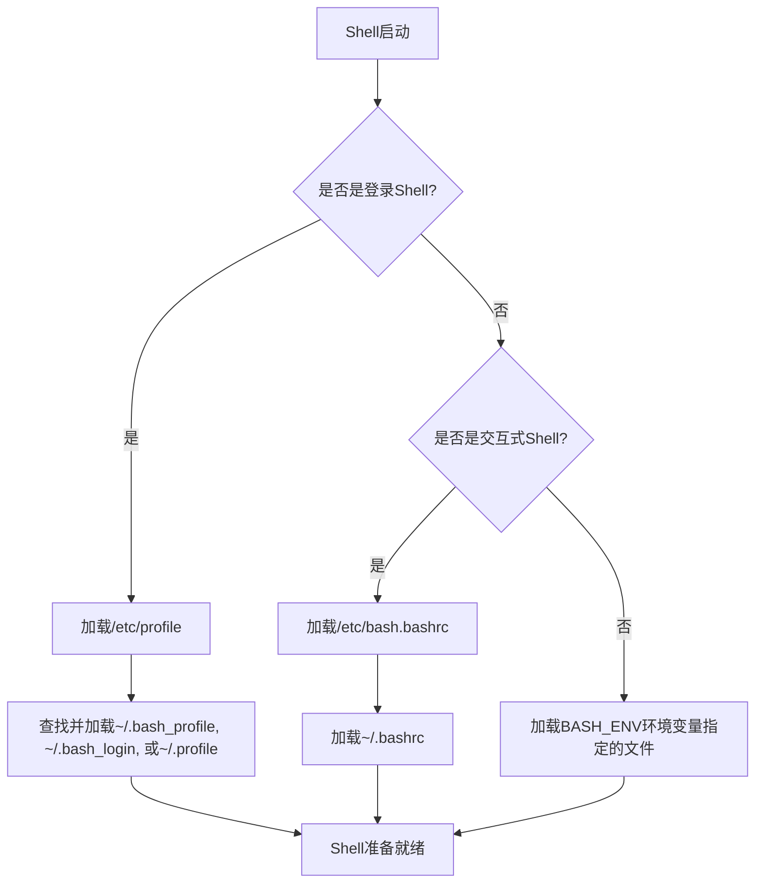

# 命令行环境个性化配置

Shell环境可以根据个人偏好进行定制和优化。本文将介绍如何通过配置文件（如.bashrc、.bash_profile等）自定义命令行环境，包括提示符、颜色方案和功能扩展等。

## 1. Shell配置文件基础

在深入个性化配置之前，我们需要了解Shell配置文件的基本概念和加载顺序，这对于正确配置环境至关重要。

### 1.1 常见Shell配置文件

不同的Shell使用不同的配置文件：

**Bash配置文件**：
- `~/.bash_profile`：登录Shell时加载
- `~/.bashrc`：交互式非登录Shell时加载
- `~/.bash_logout`：退出Shell时执行
- `/etc/profile`：系统级配置，所有用户的登录Shell都会加载
- `/etc/bashrc`或`/etc/bash.bashrc`：系统级配置，所有用户的交互式Shell都会加载

**Zsh配置文件**：
- `~/.zshrc`：交互式Shell启动时加载
- `~/.zprofile`：登录Shell时加载
- `~/.zlogin`：登录Shell后加载
- `~/.zlogout`：退出登录Shell时执行
- `/etc/zsh/zshrc`：系统级配置

**Fish配置文件**：
- `~/.config/fish/config.fish`：Fish Shell启动时加载
- `~/.config/fish/functions/`：存放自定义函数的目录

### 1.2 配置文件加载顺序

了解配置文件的加载顺序有助于避免配置冲突：

**Bash登录Shell加载顺序**：
1. `/etc/profile`
2. `~/.bash_profile`、`~/.bash_login`或`~/.profile`（按此顺序查找，仅加载找到的第一个）
3. 退出时加载`~/.bash_logout`

**Bash非登录交互式Shell加载顺序**：
1. `/etc/bash.bashrc`或`/etc/bashrc`（取决于系统）
2. `~/.bashrc`



### 1.3 登录Shell与非登录Shell

理解不同类型的Shell会话对于正确配置环境变量和别名至关重要：

- **登录Shell**：通过登录过程启动的Shell，如通过SSH连接或在终端登录系统
- **非登录Shell**：不通过登录过程启动的Shell，如在图形界面中打开终端窗口
- **交互式Shell**：允许用户输入命令的Shell，通常有提示符
- **非交互式Shell**：执行脚本的Shell，不等待用户输入

为确保配置在所有场景下都能正确加载，一个常见的做法是在`~/.bash_profile`中加载`~/.bashrc`：

```bash
# 在~/.bash_profile中添加
if [ -f ~/.bashrc ]; then
    . ~/.bashrc
fi
```

这样可以确保登录Shell也能加载为交互式Shell准备的配置。

## 2. 基本环境配置

让我们从基本的环境配置开始，包括环境变量、别名和函数。

### 2.1 配置环境变量

环境变量影响Shell和其他程序的行为。以下是一些常用环境变量的配置示例：

```bash
# 在~/.bashrc或~/.bash_profile中添加

# 配置PATH环境变量（添加自定义目录）
export PATH="$HOME/bin:$PATH"
export PATH="$PATH:$HOME/.local/bin"

# 配置编辑器
export EDITOR="vim"
export VISUAL="code"

# 配置语言和区域设置
export LANG="en_US.UTF-8"
export LC_ALL="en_US.UTF-8"

# 配置历史命令
export HISTSIZE=10000
export HISTFILESIZE=20000
export HISTCONTROL=ignoreboth:erasedups
export HISTIGNORE="ls:cd:exit:pwd:clear"
export HISTTIMEFORMAT="%F %T "

# 配置颜色支持
export CLICOLOR=1
export LSCOLORS=ExFxCxDxBxegedabagacad
```

这些环境变量设置会影响Shell的各种行为，从命令搜索路径到历史记录保存方式。

### 2.2 创建实用别名

别名可以简化常用命令，提高工作效率：

```bash
# 在~/.bashrc中添加

# 基本命令别名
alias ll='ls -la'
alias la='ls -A'
alias l='ls -CF'
alias cls='clear'
alias h='history'
alias j='jobs -l'

# 安全操作别名
alias rm='rm -i'
alias cp='cp -i'
alias mv='mv -i'

# 导航别名
alias ..='cd ..'
alias ...='cd ../..'
alias ....='cd ../../..'
alias .....='cd ../../../..'

# 网络相关别名
alias myip='curl http://ipecho.net/plain; echo'
alias ports='netstat -tulanp'
alias ping='ping -c 5'

# Git相关别名
alias gs='git status'
alias ga='git add'
alias gc='git commit'
alias gp='git push'
alias gl='git pull'
alias gd='git diff'
alias gco='git checkout'
alias gb='git branch'
```

别名是提高命令行效率的最简单方法之一，可以根据个人工作流程定制。

### 2.3 创建自定义函数

对于更复杂的操作，可以创建Shell函数：

```bash
# 在~/.bashrc中添加

# 创建并进入目录
mkcd() {
    mkdir -p "$1" && cd "$1"
}

# 提取各种压缩文件
extract() {
    if [ -f "$1" ]; then
        case "$1" in
            *.tar.bz2)   tar xjf "$1"     ;;
            *.tar.gz)    tar xzf "$1"     ;;
            *.bz2)       bunzip2 "$1"     ;;
            *.rar)       unrar e "$1"     ;;
            *.gz)        gunzip "$1"      ;;
            *.tar)       tar xf "$1"      ;;
            *.tbz2)      tar xjf "$1"     ;;
            *.tgz)       tar xzf "$1"     ;;
            *.zip)       unzip "$1"       ;;
            *.Z)         uncompress "$1"  ;;
            *.7z)        7z x "$1"        ;;
            *)           echo "'$1' cannot be extracted via extract()" ;;
        esac
    else
        echo "'$1' is not a valid file"
    fi
}

# 快速备份文件
bak() {
    cp "$1"{,.bak}
}

# 查找文件并高亮显示
ff() {
    find . -name "*$1*" -print
}

# 查找包含特定文本的文件
ft() {
    grep -r "$1" .
}

# 显示目录大小并排序
ducks() {
    du -cks * | sort -rn | head -11
}
```

函数比别名更强大，可以接受参数并包含复杂的逻辑。

## 3. 自定义命令提示符

命令提示符是与Shell交互时最常见的元素，自定义它可以提供更多信息和更好的视觉体验。

### 3.1 Bash提示符基础

Bash使用`PS1`环境变量定义主提示符。以下是一些常用的提示符转义序列：

| 序列 | 描述 |
|------|------|
| `\u` | 当前用户名 |
| `\h` | 主机名（短） |
| `\H` | 完整主机名 |
| `\w` | 当前工作目录（完整路径） |
| `\W` | 当前工作目录（仅目录名） |
| `\t` | 当前时间（24小时制，HH:MM:SS） |
| `\d` | 当前日期 |
| `\n` | 换行 |
| `\$` | 如果是root用户显示#，否则显示$ |
| `\[` | 开始非打印字符序列（用于颜色等） |
| `\]` | 结束非打印字符序列 |

### 3.2 添加颜色和样式

使用ANSI转义序列可以为提示符添加颜色：

```bash
# 在~/.bashrc中添加

# 定义颜色
RESET="\[\033[0m\]"
BLACK="\[\033[0;30m\]"
RED="\[\033[0;31m\]"
GREEN="\[\033[0;32m\]"
YELLOW="\[\033[0;33m\]"
BLUE="\[\033[0;34m\]"
PURPLE="\[\033[0;35m\]"
CYAN="\[\033[0;36m\]"
WHITE="\[\033[0;37m\]"

# 基本彩色提示符
PS1="${GREEN}\u@\h${RESET}:${BLUE}\w${RESET}\$ "

# 或者更复杂的提示符
PS1="${CYAN}\t${RESET} ${GREEN}\u@\h${RESET}:${BLUE}\w${RESET}\n\$ "
```

这些配置会创建彩色提示符，使不同元素更容易区分。

### 3.3 添加Git状态信息

如果你经常使用Git，在提示符中显示Git仓库状态非常有用：

```bash
# 在~/.bashrc中添加

# 确保git-prompt.sh已加载
if [ -f /etc/bash_completion.d/git-prompt ]; then
    . /etc/bash_completion.d/git-prompt
elif [ -f /usr/share/git-core/contrib/completion/git-prompt.sh ]; then
    . /usr/share/git-core/contrib/completion/git-prompt.sh
fi

# 配置Git提示符
GIT_PS1_SHOWDIRTYSTATE=1
GIT_PS1_SHOWSTASHSTATE=1
GIT_PS1_SHOWUNTRACKEDFILES=1
GIT_PS1_SHOWUPSTREAM="auto"
GIT_PS1_SHOWCOLORHINTS=1

# 设置提示符
PS1="${GREEN}\u@\h${RESET}:${BLUE}\w${RESET}${YELLOW}\$(__git_ps1 ' (%s)')${RESET}\n\$ "
```

这个配置会在Git仓库中显示分支名称和状态信息。

### 3.4 高级提示符示例

以下是一个更复杂的提示符示例，包含时间、用户、主机、目录、Git状态和命令执行状态：

```bash
# 在~/.bashrc中添加

# 显示上一个命令的退出状态
function prompt_command {
    local EXIT="$?"
    PS1=""
    
    # 添加退出状态
    if [ $EXIT -eq 0 ]; then
        PS1+="${GREEN}✓${RESET} "
    else
        PS1+="${RED}✗ $EXIT${RESET} "
    fi
    
    # 添加时间
    PS1+="${CYAN}\t${RESET} "
    
    # 添加用户和主机
    PS1+="${GREEN}\u@\h${RESET}:"
    
    # 添加当前目录
    PS1+="${BLUE}\w${RESET}"
    
    # 添加Git状态（如果在Git仓库中）
    PS1+="${YELLOW}\$(__git_ps1 ' (%s)')${RESET}"
    
    # 添加换行和提示符
    PS1+="\n\$ "
}

PROMPT_COMMAND=prompt_command
```

这个提示符会显示上一个命令是否成功执行，以及执行时间、用户信息和Git状态。

## 4. 颜色方案和主题

除了提示符，你还可以自定义终端的整体颜色方案和外观。

### 4.1 终端颜色配置

大多数终端模拟器允许自定义颜色方案：

**配置ls命令的颜色**：
```bash
# 在~/.bashrc中添加

# 启用颜色支持
if [ -x /usr/bin/dircolors ]; then
    test -r ~/.dircolors && eval "$(dircolors -b ~/.dircolors)" || eval "$(dircolors -b)"
    alias ls='ls --color=auto'
    alias dir='dir --color=auto'
    alias vdir='vdir --color=auto'
    alias grep='grep --color=auto'
    alias fgrep='fgrep --color=auto'
    alias egrep='egrep --color=auto'
fi

# macOS的颜色支持
if [[ "$OSTYPE" == "darwin"* ]]; then
    export CLICOLOR=1
    export LSCOLORS=ExFxCxDxBxegedabagacad
    alias ls='ls -G'
fi
```

**创建自定义.dircolors文件**：
```bash
# 创建~/.dircolors文件
# 可以从/etc/DIR_COLORS复制并修改
# 或使用dircolors -p > ~/.dircolors生成默认配置
```

### 4.2 流行的终端主题

许多终端模拟器支持主题导入：

**Solarized主题**：
```bash
# 下载并安装Solarized
git clone https://github.com/seebi/dircolors-solarized.git
cp dircolors-solarized/dircolors.256dark ~/.dircolors
```

**Dracula主题**：
```bash
# 下载并安装Dracula
git clone https://github.com/dracula/dircolors.git
cp dircolors/dircolors ~/.dircolors
```

**Nord主题**：
```bash
# 下载并安装Nord
git clone https://github.com/arcticicestudio/nord-dircolors.git
cp nord-dircolors/src/dir_colors ~/.dircolors
```

### 4.3 配置Vim颜色方案

如果你使用Vim编辑器，可以在`~/.vimrc`中配置颜色方案：

```vim
" 在~/.vimrc中添加

" 启用语法高亮
syntax on

" 设置颜色方案
colorscheme desert  " 可选: desert, elflord, molokai, solarized等

" 启用256色支持
set t_Co=256

" 显示行号
set number

" 高亮当前行
set cursorline

" 搜索高亮
set hlsearch
```

### 4.4 配置终端字体

许多高级终端配置使用特殊字体（如Nerd Fonts）来显示图标和特殊符号：

```bash
# 安装Nerd Fonts（示例使用Ubuntu）
mkdir -p ~/.local/share/fonts
cd ~/.local/share/fonts
curl -fLo "Droid Sans Mono for Powerline Nerd Font Complete.otf" \
  https://github.com/ryanoasis/nerd-fonts/raw/master/patched-fonts/DroidSansMono/complete/Droid%20Sans%20Mono%20Nerd%20Font%20Complete.otf

# 更新字体缓存
fc-cache -fv
```

然后在终端模拟器的设置中选择这个字体。

## 5. Shell功能增强

除了基本配置外，还可以通过各种工具和插件增强Shell的功能。

### 5.1 Bash增强功能

**启用Bash高级选项**：
```bash
# 在~/.bashrc中添加

# 启用扩展通配符
shopt -s extglob

# 启用大小写不敏感的补全
bind "set completion-ignore-case on"

# 启用目录拼写纠正
shopt -s cdspell

# 启用历史扩展
shopt -s histappend
shopt -s cmdhist

# 检查窗口大小
shopt -s checkwinsize

# 启用通配符匹配隐藏文件
shopt -s dotglob

# 启用交互式注释
shopt -s interactive_comments
```

**配置命令补全**：
```bash
# 在~/.bashrc中添加

# 确保bash-completion已安装
if ! shopt -oq posix; then
  if [ -f /usr/share/bash-completion/bash_completion ]; then
    . /usr/share/bash-completion/bash_completion
  elif [ -f /etc/bash_completion ]; then
    . /etc/bash_completion
  fi
fi

# 自定义补全设置
bind "set show-all-if-ambiguous on"
bind "set menu-complete-display-prefix on"
bind "TAB:menu-complete"
```

### 5.2 安装和配置Oh My Zsh

如果你使用Zsh，Oh My Zsh是一个流行的框架，提供了丰富的主题和插件：

```bash
# 安装Oh My Zsh
sh -c "$(curl -fsSL https://raw.github.com/ohmyzsh/ohmyzsh/master/tools/install.sh)"

# 编辑~/.zshrc配置文件
# 设置主题
ZSH_THEME="robbyrussell"  # 可选: agnoster, avit, bira, bureau等

# 启用插件
plugins=(git docker kubectl python pip npm)

# 加载Oh My Zsh
source $ZSH/oh-my-zsh.sh
```

Oh My Zsh提供了数百个主题和插件，可以根据个人需求进行选择。

### 5.3 安装和配置Fish Shell

Fish是一个用户友好的Shell，提供了许多现代功能：

```bash
# 安装Fish Shell（Ubuntu示例）
sudo apt-add-repository ppa:fish-shell/release-3
sudo apt update
sudo apt install fish

# 设置为默认Shell
chsh -s /usr/bin/fish

# 创建配置文件
mkdir -p ~/.config/fish
touch ~/.config/fish/config.fish
```

**基本Fish配置**：
```fish
# 在~/.config/fish/config.fish中添加

# 设置环境变量
set -gx PATH $HOME/bin $PATH
set -gx EDITOR vim

# 创建别名
alias ll='ls -la'
alias g='git'

# 自定义Fish问候语
function fish_greeting
    echo "Welcome to Fish shell!"
end

# 自定义Fish提示符
function fish_prompt
    set_color cyan
    echo -n (prompt_pwd)
    set_color yellow
    echo -n " ❯ "
    set_color normal
end
```

Fish Shell的一大优势是开箱即用的自动建议和语法高亮功能。

### 5.4 实用Shell插件

以下是一些值得考虑的Shell插件：

**fzf（模糊查找器）**：
```bash
# 安装fzf
git clone --depth 1 https://github.com/junegunn/fzf.git ~/.fzf
~/.fzf/install

# 在~/.bashrc或~/.zshrc中添加
[ -f ~/.fzf.bash ] && source ~/.fzf.bash  # Bash
[ -f ~/.fzf.zsh ] && source ~/.fzf.zsh    # Zsh
```

**z（目录跳转工具）**：
```bash
# 安装z
git clone https://github.com/rupa/z.git ~/.z
echo '. ~/.z/z.sh' >> ~/.bashrc  # Bash
echo '. ~/.z/z.sh' >> ~/.zshrc   # Zsh
```

**autojump（另一个目录跳转工具）**：
```bash
# 安装autojump（Ubuntu示例）
sudo apt install autojump

# 在~/.bashrc或~/.zshrc中添加
. /usr/share/autojump/autojump.sh  # 路径可能因系统而异
```

**thefuck（命令纠错工具）**：
```bash
# 安装thefuck（Ubuntu示例）
sudo apt install python3-dev python3-pip
sudo pip3 install thefuck

# 在~/.bashrc或~/.zshrc中添加
eval $(thefuck --alias)
```

## 6. 终端多路复用器配置

终端多路复用器如tmux和screen允许在一个终端窗口中运行多个会话，非常适合远程工作和复杂任务。

### 6.1 tmux基本配置

**安装tmux**：
```bash
# Ubuntu/Debian
sudo apt install tmux

# RHEL/CentOS
sudo yum install tmux

# macOS
brew install tmux
```

**创建基本tmux配置**：
```bash
# 创建~/.tmux.conf文件

# 更改前缀键（默认是Ctrl+b）
set -g prefix C-a
unbind C-b
bind C-a send-prefix

# 启用鼠标支持
set -g mouse on

# 设置窗口和面板的索引从1开始
set -g base-index 1
setw -g pane-base-index 1

# 设置状态栏
set -g status-bg black
set -g status-fg white
set -g status-left "#[fg=green]Session: #S #[fg=yellow]Window: #I #[fg=cyan]Pane: #P"
set -g status-right "#[fg=cyan]%d %b %R"

# 设置窗口列表居中
set -g status-justify centre

# 设置活动窗口颜色
setw -g window-status-current-style fg=black,bg=white

# 分割窗口快捷键
bind | split-window -h
bind - split-window -v

# 重新加载配置文件
bind r source-file ~/.tmux.conf \; display "配置已重新加载！"
```

### 6.2 tmux插件管理

使用Tmux Plugin Manager (TPM)可以轻松管理tmux插件：

```bash
# 安装TPM
git clone https://github.com/tmux-plugins/tpm ~/.tmux/plugins/tpm

# 在~/.tmux.conf末尾添加
# 插件列表
set -g @plugin 'tmux-plugins/tpm'
set -g @plugin 'tmux-plugins/tmux-sensible'
set -g @plugin 'tmux-plugins/tmux-resurrect'
set -g @plugin 'tmux-plugins/tmux-continuum'

# 初始化TPM（保持在配置文件的最后一行）
run '~/.tmux/plugins/tpm/tpm'
```

安装插件：在tmux中按`prefix + I`（大写I）。

### 6.3 screen基本配置

如果你更喜欢screen，以下是基本配置：

```bash
# 创建~/.screenrc文件

# 禁用启动消息
startup_message off

# 显示状态行
hardstatus alwayslastline
hardstatus string '%{= kG}[ %{G}%H %{g}][%= %{= kw}%?%-Lw%?%{r}(%{W}%n*%f%t%?(%u)%?%{r})%{w}%?%+Lw%?%?%= %{g}][%{B} %d/%m %{W}%c %{g}]'

# 设置滚动缓冲区大小
defscrollback 10000

# 启用UTF-8
defutf8 on

# 自动分离
autodetach on

# 设置默认Shell
shell -$SHELL
```

## 7. SSH配置优化

如果你经常使用SSH连接到远程服务器，优化SSH配置可以提高工作效率。

### 7.1 基本SSH客户端配置

创建和配置`~/.ssh/config`文件：

```
# 全局设置
Host *
    ServerAliveInterval 60
    ServerAliveCountMax 30
    Compression yes
    ControlMaster auto
    ControlPath ~/.ssh/sockets/%r@%h:%p
    ControlPersist 1h

# 特定服务器配置
Host myserver
    HostName server.example.com
    User username
    Port 22
    IdentityFile ~/.ssh/id_rsa_server

# 使用代理的配置
Host through-proxy
    HostName remote-server.com
    User remoteuser
    ProxyCommand ssh proxy-server -W %h:%p

# 使用别名简化连接
Host dev
    HostName dev-server.example.com
    User devuser
    ForwardAgent yes
```

这个配置文件可以大大简化SSH连接命令，只需输入`ssh myserver`即可连接到完整配置的服务器。

### 7.2 SSH密钥管理

使用SSH密钥可以提高安全性并简化登录过程：

```bash
# 生成新的SSH密钥
ssh-keygen -t ed25519 -C "your_email@example.com"

# 将公钥复制到服务器
ssh-copy-id -i ~/.ssh/id_ed25519.pub user@server

# 使用ssh-agent管理密钥
eval "$(ssh-agent -s)"
ssh-add ~/.ssh/id_ed25519
```

### 7.3 SSH跳板机配置

如果需要通过跳板机访问内部服务器，可以使用以下配置：

```
# 在~/.ssh/config中添加

# 跳板机配置
Host jumphost
    HostName jump.example.com
    User jumpuser
    IdentityFile ~/.ssh/id_rsa_jump

# 通过跳板机访问内部服务器
Host internal
    HostName internal.example.com
    User internaluser
    ProxyJump jumphost
    # 或使用旧语法
    # ProxyCommand ssh jumphost -W %h:%p
```

使用这个配置，只需输入`ssh internal`即可通过跳板机连接到内部服务器。

## 8. 版本控制与备份

随着配置文件的增多和复杂化，使用版本控制系统管理配置文件变得非常重要。

### 8.1 使用Git管理配置文件

创建一个专门的Git仓库来管理你的配置文件（dotfiles）：

```bash
# 创建dotfiles仓库
mkdir ~/dotfiles
cd ~/dotfiles
git init

# 添加配置文件（使用符号链接或复制）
ln -s ~/.bashrc ~/dotfiles/bashrc
ln -s ~/.vimrc ~/dotfiles/vimrc
ln -s ~/.tmux.conf ~/dotfiles/tmux.conf
# 添加更多配置文件...

# 提交更改
git add .
git commit -m "Initial dotfiles commit"

# 添加远程仓库（可选）
git remote add origin https://github.com/username/dotfiles.git
git push -u origin master
```

### 8.2 使用专门的dotfiles管理工具

有多种工具可以帮助管理dotfiles：

**使用GNU Stow**：
```bash
# 安装stow
sudo apt install stow  # Ubuntu/Debian

# 组织dotfiles
mkdir -p ~/dotfiles/{bash,vim,tmux}
mv ~/.bashrc ~/dotfiles/bash/
mv ~/.vimrc ~/dotfiles/vim/
mv ~/.tmux.conf ~/dotfiles/tmux/

# 使用stow创建符号链接
cd ~/dotfiles
stow bash
stow vim
stow tmux
```

**使用专门的dotfiles管理器**：
```bash
# 安装chezmoi
sh -c "$(curl -fsLS get.chezmoi.io)"

# 初始化
chezmoi init

# 添加文件
chezmoi add ~/.bashrc
chezmoi add ~/.vimrc

# 应用更改
chezmoi apply
```

### 8.3 配置文件备份策略

除了版本控制，定期备份配置文件也很重要：

```bash
# 创建备份脚本
cat > ~/backup-dotfiles.sh << 'EOF'
#!/bin/bash
BACKUP_DIR="$HOME/backups/dotfiles"
BACKUP_FILE="$BACKUP_DIR/dotfiles-$(date +%Y%m%d-%H%M%S).tar.gz"

# 创建备份目录
mkdir -p "$BACKUP_DIR"

# 创建备份
tar -czf "$BACKUP_FILE" \
    -C "$HOME" \