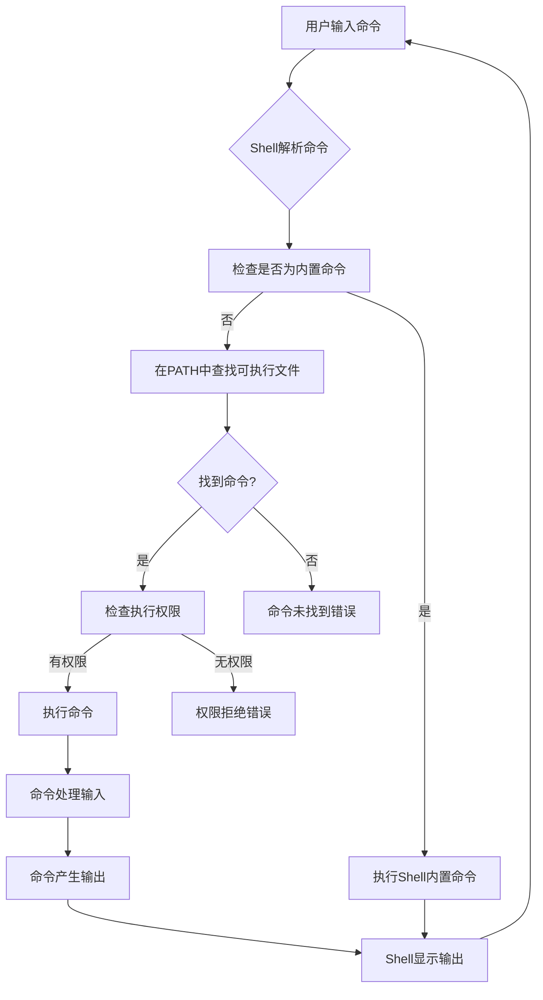
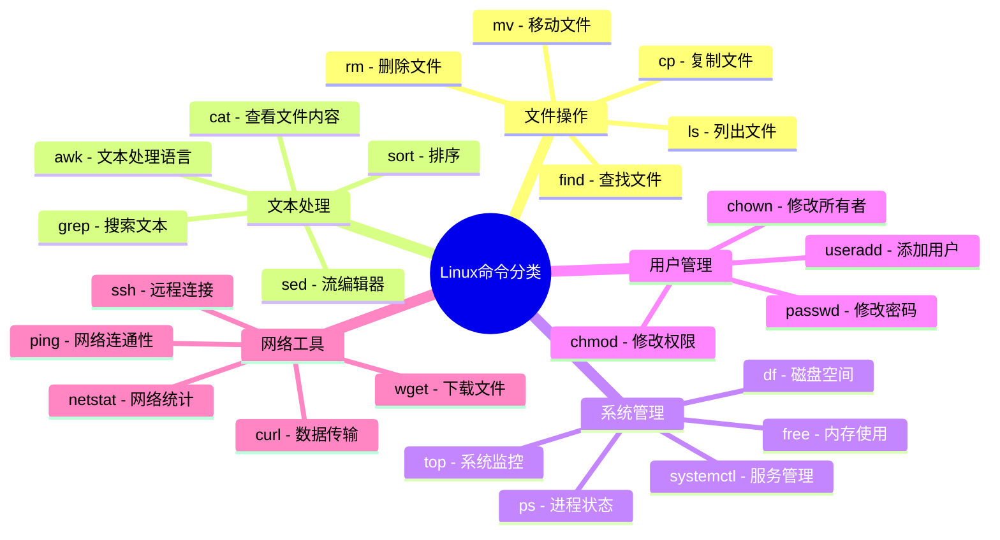

# 命令行基础

本节内容将详细介绍Linux命令行的基础知识和使用技巧，帮助用户理解Shell环境的工作原理和高效使用命令行的方法。

命令行界面（Command Line Interface，CLI）是与计算机交互的强大方式，相比图形用户界面（GUI），它提供了更高的灵活性、自动化能力和系统控制权。掌握命令行基础知识不仅能提高工作效率，还能帮助你更深入地理解操作系统的工作原理。

## 学习路径

本章节按照由浅入深的顺序，从Shell的基本概念到高级工具的使用，系统地介绍命令行相关知识：

### [Shell类型与特点对比](./01-Shell类型与特点对比.md)

介绍Bash、Zsh、Fish等不同Shell的历史背景、功能特性和使用场景。通过对比各种Shell的优缺点，帮助你选择最适合自己工作习惯的Shell环境。同时讲解如何在不同Shell之间切换，以及如何设置默认Shell。

### [命令结构与参数规则](./02-命令结构与参数规则.md)

详细解析Linux命令的基本结构，包括命令名、选项和参数的组织方式。介绍短选项、长选项的区别，参数传递的规则，以及如何正确组合多个选项和参数。通过实例说明命令语法的规范和常见模式。

### [Linux命令执行原理](./03-Linux命令执行原理.md)

深入探讨命令从输入到执行的完整过程，包括命令解析、路径查找、权限检查、加载执行等步骤。解释内部命令与外部命令的区别，以及Shell如何处理命令别名、函数和内置命令。

### [环境变量工作机制](./04-环境变量工作机制.md)

全面介绍环境变量的概念、分类和作用，包括系统环境变量和用户环境变量。详细讲解如何查看、设置、修改和删除环境变量，以及环境变量在Shell会话和系统启动过程中的加载顺序。

### [命令查找路径与优先级](./05-命令查找路径与优先级.md)

解析PATH环境变量的作用和配置方法，说明系统如何根据PATH变量查找可执行文件。介绍命令查找的优先级规则，以及如何使用which、whereis等工具确定命令的实际位置。

### [命令行快捷键与效率技巧](./06-命令行快捷键与效率技巧.md)

汇总常用的命令行操作快捷键，包括光标移动、文本编辑、命令控制等。介绍如何利用这些快捷键提高命令输入和编辑效率，减少重复操作，提升命令行工作体验。

### [历史命令与自动补全](./07-历史命令与自动补全.md)

详细讲解历史命令功能的使用方法，包括查看、搜索和重用历史命令。介绍Tab自动补全的强大功能，包括命令补全、文件路径补全、选项补全等，以及如何配置和扩展自动补全功能。

### [管道与重定向实战应用](./08-管道与重定向实战应用.md)

深入讲解Linux中管道和重定向的概念和使用方法。通过实际案例演示如何使用管道组合多个命令，如何使用重定向控制输入输出流，以及如何解决复杂数据处理问题。

### [命令行环境个性化配置](./09-命令行环境个性化配置.md)

介绍如何通过配置文件（如.bashrc、.zshrc）定制命令行环境，包括提示符设置、颜色主题、功能扩展等。提供实用的配置示例和最佳实践，帮助你打造个性化的命令行工作环境。

### [别名设置提升效率](./10-别名设置提升效率.md)

详细讲解如何创建和管理命令别名，将常用的复杂命令简化为简短易记的形式。提供实用的别名示例集合，涵盖文件操作、系统管理、网络工具等多个领域，帮助你大幅提高日常工作效率。

### [10个提高效率的命令行工具](./11-10个提高效率的命令行工具.md)

介绍10个现代化的命令行工具，这些工具能够替代传统命令，提供更友好的界面和更强大的功能。包括文件查找、文本处理、系统监控、目录导航等方面的高效工具，以及它们的安装和基本使用方法。

## 为什么要学习命令行？

命令行相比图形界面有许多优势：

1. **效率更高** - 许多任务在命令行中只需几个命令就能完成，而在图形界面中可能需要多次点击和操作
2. **自动化能力** - 命令行操作可以轻松编写成脚本，实现任务自动化
3. **远程管理便捷** - 通过SSH等工具可以轻松管理远程服务器，即使在低带宽环境下也能高效工作
4. **资源占用少** - 命令行界面比图形界面占用更少的系统资源
5. **精确控制** - 提供对系统更精细的控制能力，可以执行图形界面无法实现的操作
6. **批处理能力** - 可以轻松处理大量文件或执行重复任务

## 命令行工作流程

下图展示了命令行操作的基本工作流程：

## 学习建议

1. **动手实践** - 命令行技能需要通过实际操作来掌握，阅读后请尝试在自己的系统上运行相关命令
2. **循序渐进** - 按照章节顺序学习，打好基础后再尝试高级技巧
3. **建立习惯** - 尝试将日常任务转移到命令行中完成，逐步培养命令行使用习惯
4. **记录笔记** - 记录下常用命令和技巧，形成个人知识库
5. **查阅手册** - 学会使用`man`、`help`和`--help`等获取命令帮助的方法

## 常见命令分类

## 适用环境说明

虽然本章节主要以Linux命令行为例进行讲解，但大部分概念和技巧也适用于：

- macOS终端（基于Unix，与Linux命令行非常相似）
- Windows的WSL（Windows Subsystem for Linux）
- Windows的PowerShell（有自己的语法，但概念类似）
- Windows的Git Bash或Cygwin等Unix-like环境

通过学习这些基础知识，你将能够在各种操作系统环境中更加得心应手地使用命令行工具。

让我们开始命令行的探索之旅吧！