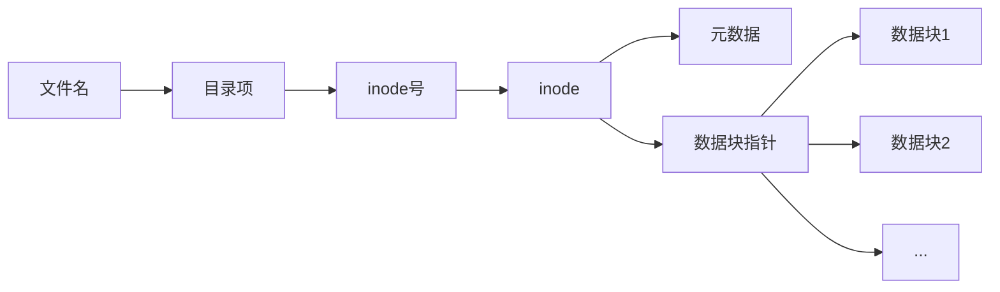

# 文件类型与属性详解

Linux系统中的文件分为多种类型，每个文件都有一系列属性。本文将详细介绍Linux中的文件类型（普通文件、目录、链接、设备文件等）以及文件的基本属性（权限、所有者、时间戳等），帮助用户全面了解Linux文件系统的基础知识。

## 1. Linux文件系统概述

在Linux系统中，"一切皆文件"是一个核心理念。这意味着不仅仅是文档和图片是文件，连目录、硬件设备、甚至进程和网络套接字也都被视为文件。这种统一的抽象使得Linux能够用相同的接口和命令来处理各种不同类型的系统资源。

### 1.1 文件系统层次

Linux文件系统采用树状结构，从根目录（`/`）开始，向下分支到各个子目录。每个文件和目录都有一个唯一的路径，用来标识其在文件系统中的位置。

```mermaid
graph TD
    root[/] --> bin[/bin]
    root --> etc[/etc]
    root --> home[/home]
    home --> user1[/home/user1]
    home --> user2[/home/user2]
    user1 --> docs[/home/user1/documents]
    user1 --> pics[/home/user1/pictures]
```

### 1.2 inode与数据块

在理解文件类型和属性之前，有必要了解Linux文件系统的底层结构：

- **inode（索引节点）**：存储文件的元数据，包括文件类型、权限、所有者、时间戳、数据块指针等，但不包含文件名。
- **数据块（Data Block）**：存储文件的实际内容。
- **目录项（Directory Entry）**：将文件名与inode号关联起来。

当我们访问一个文件时，系统首先通过目录项找到文件的inode号，然后通过inode获取文件的元数据和数据块位置，最后读取数据块中的内容。



## 2. Linux文件类型详解

Linux系统中有多种不同类型的文件，每种类型都有其特定的用途和特性。

### 2.1 普通文件（Regular File）

普通文件是最常见的文件类型，用于存储数据、文本、程序等内容。

**特点**：
- 在`ls -l`命令输出中以`-`开头表示
- 可以包含任何类型的数据
- 有明确的大小限制（取决于文件系统）

**分类**：
1. **文本文件**：包含可读文本，如配置文件、脚本、日志等
2. **二进制文件**：包含机器可读的数据，如可执行程序、图像、音频等

**示例**：
```bash
# 创建文本文件
echo "Hello World" > hello.txt

# 查看文件类型
file hello.txt
# 输出: hello.txt: ASCII text

# 查看文件详细信息
ls -l hello.txt
# 输出: -rw-r--r-- 1 user group 12 Jan 1 12:00 hello.txt
```

### 2.2 目录（Directory）

目录是一种特殊的文件，用于组织和存储其他文件和目录的信息。

**特点**：
- 在`ls -l`命令输出中以`d`开头表示
- 包含指向其他文件和目录的引用
- 有读、写、执行权限，但含义与普通文件不同

**目录的内部结构**：
目录实际上是一个表，包含文件名和对应的inode号。当我们列出目录内容时，系统读取这个表并显示文件名。

**示例**：
```bash
# 创建目录
mkdir test_dir

# 查看目录类型
file test_dir
# 输出: test_dir: directory

# 查看目录详细信息
ls -ld test_dir
# 输出: drwxr-xr-x 2 user group 4096 Jan 1 12:00 test_dir
```

### 2.3 符号链接（Symbolic Link）

符号链接（也称为软链接）是指向另一个文件或目录的引用，类似于Windows中的快捷方式。

**特点**：
- 在`ls -l`命令输出中以`l`开头表示
- 包含指向目标文件或目录的路径
- 当原始文件被删除时，链接会失效
- 可以跨文件系统

**示例**：
```bash
# 创建符号链接
ln -s hello.txt hello_link

# 查看链接类型
file hello_link
# 输出: hello_link: symbolic link to 'hello.txt'

# 查看链接详细信息
ls -l hello_link
# 输出: lrwxrwxrwx 1 user group 9 Jan 1 12:00 hello_link -> hello.txt
```

### 2.4 硬链接（Hard Link）

硬链接是指向同一个inode的多个目录项，可以看作是同一个文件的多个名称。

**特点**：
- 在`ls -l`命令输出中与普通文件相同，以`-`开头
- 与原始文件共享同一个inode和数据块
- 只有当所有硬链接都被删除时，文件才会真正被删除
- 不能跨文件系统
- 不能链接到目录（在大多数文件系统中）

**示例**：
```bash
# 创建硬链接
ln hello.txt hello_hard

# 查看文件的inode号
ls -i hello.txt hello_hard
# 输出: 1234567 hello.txt  1234567 hello_hard

# 查看硬链接数量
ls -l hello.txt
# 输出: -rw-r--r-- 2 user group 12 Jan 1 12:00 hello.txt
```

### 2.5 设备文件（Device File）

设备文件是Linux中表示硬件设备的特殊文件，分为字符设备和块设备。

#### 2.5.1 字符设备文件（Character Device File）

**特点**：
- 在`ls -l`命令输出中以`c`开头表示
- 以字符流方式传输数据
- 不可随机访问，只能顺序读写
- 常见例子：终端、串口、键盘等

**示例**：
```bash
# 查看字符设备文件
ls -l /dev/tty
# 输出: crw-rw-rw- 1 root tty 5, 0 Jan 1 12:00 /dev/tty
```

#### 2.5.2 块设备文件（Block Device File）

**特点**：
- 在`ls -l`命令输出中以`b`开头表示
- 以块为单位传输数据
- 支持随机访问
- 常见例子：硬盘、USB存储设备等

**示例**：
```bash
# 查看块设备文件
ls -l /dev/sda
# 输出: brw-rw---- 1 root disk 8, 0 Jan 1 12:00 /dev/sda
```

### 2.6 命名管道（Named Pipe）

命名管道（也称为FIFO）是一种特殊类型的文件，用于进程间通信。

**特点**：
- 在`ls -l`命令输出中以`p`开头表示
- 数据以先进先出（FIFO）方式传输
- 持久存在于文件系统中，直到被删除
- 允许不相关的进程进行通信

**示例**：
```bash
# 创建命名管道
mkfifo my_pipe

# 查看管道类型
file my_pipe
# 输出: my_pipe: fifo (named pipe)

# 查看管道详细信息
ls -l my_pipe
# 输出: prw-r--r-- 1 user group 0 Jan 1 12:00 my_pipe
```

### 2.7 套接字文件（Socket File）

套接字文件用于进程间网络通信，特别是本地进程间通信。

**特点**：
- 在`ls -l`命令输出中以`s`开头表示
- 提供双向通信
- 常用于守护进程和客户端之间的通信

**示例**：
```bash
# 查看系统中的套接字文件
ls -l /var/run/*.sock
# 输出可能类似: srwxrwxrwx 1 root root 0 Jan 1 12:00 /var/run/docker.sock
```

## 3. 文件属性详解

每个文件都有一系列属性，这些属性定义了文件的特性、访问权限、所有权等信息。

### 3.1 文件权限

Linux文件权限系统控制谁可以访问文件以及如何访问。

#### 3.1.1 基本权限

文件权限分为三组，分别针对文件所有者（user）、所属组（group）和其他用户（others）：

- **读取权限（r）**：允许读取文件内容或列出目录内容
- **写入权限（w）**：允许修改文件内容或在目录中创建、删除文件
- **执行权限（x）**：允许执行文件或访问目录

在`ls -l`命令输出中，权限以10个字符表示：
```
-rwxr-xr--
```

- 第1个字符表示文件类型（`-`表示普通文件，`d`表示目录等）
- 第2-4个字符表示所有者权限（`rwx`）
- 第5-7个字符表示所属组权限（`r-x`）
- 第8-10个字符表示其他用户权限（`r--`）

#### 3.1.2 数字表示法

权限也可以用数字表示，其中：
- 读取权限（r）= 4
- 写入权限（w）= 2
- 执行权限（x）= 1

通过将每组权限的数值相加，可以得到一个三位数：
```
rwxr-xr-- = 754
```
- 所有者权限：4+2+1 = 7
- 所属组权限：4+0+1 = 5
- 其他用户权限：4+0+0 = 4

#### 3.1.3 特殊权限

除了基本权限外，Linux还支持三种特殊权限：

1. **Set User ID (SUID)**：
   - 用数字4000表示
   - 使文件在执行时以所有者的权限运行
   - 在`ls -l`输出中表现为所有者执行位置上的`s`（如`-rwsr-xr-x`）

2. **Set Group ID (SGID)**：
   - 用数字2000表示
   - 对文件：使文件在执行时以所属组的权限运行
   - 对目录：在该目录中创建的新文件将继承目录的所属组
   - 在`ls -l`输出中表现为所属组执行位置上的`s`（如`-rwxr-sr-x`）

3. **Sticky Bit**：
   - 用数字1000表示
   - 主要用于目录，防止用户删除其他用户的文件
   - 在`ls -l`输出中表现为其他用户执行位置上的`t`（如`drwxrwxr-t`）

**示例**：
```bash
# 设置SUID权限
chmod u+s executable_file
# 或
chmod 4755 executable_file

# 设置SGID权限
chmod g+s shared_directory
# 或
chmod 2775 shared_directory

# 设置Sticky Bit
chmod +t public_directory
# 或
chmod 1777 public_directory
```

### 3.2 文件所有者和所属组

每个文件都有一个所有者（用户）和一个所属组。

#### 3.2.1 查看所有者和所属组

```bash
ls -l file.txt
# 输出: -rw-r--r-- 1 user group 12 Jan 1 12:00 file.txt
```

在这个例子中，`user`是文件所有者，`group`是文件所属组。

#### 3.2.2 更改所有者和所属组

```bash
# 更改文件所有者
chown new_user file.txt

# 更改文件所属组
chgrp new_group file.txt

# 同时更改所有者和所属组
chown new_user:new_group file.txt

# 递归更改目录及其内容
chown -R new_user:new_group directory/
```

### 3.3 文件时间戳

Linux文件系统记录三种不同的时间戳：

1. **访问时间（Access Time, atime）**：
   - 最后一次读取文件内容的时间
   - 使用`ls -lu`查看

2. **修改时间（Modification Time, mtime）**：
   - 最后一次修改文件内容的时间
   - 使用`ls -l`查看（默认显示）

3. **状态更改时间（Change Time, ctime）**：
   - 最后一次修改文件元数据（如权限、所有者）的时间
   - 使用`ls -lc`查看

**示例**：
```bash
# 查看所有时间戳
stat file.txt

# 更新访问和修改时间
touch file.txt

# 只更新访问时间
touch -a file.txt

# 只更新修改时间
touch -m file.txt

# 设置特定的时间戳
touch -t 202101010000.00 file.txt  # 设置为2021年1月1日00:00
```

### 3.4 文件大小和块数

文件大小表示文件内容的字节数，而块数表示文件在磁盘上实际占用的存储块数量。

**示例**：
```bash
# 查看文件大小
ls -l file.txt
# 输出: -rw-r--r-- 1 user group 12345 Jan 1 12:00 file.txt

# 查看文件大小（人类可读格式）
ls -lh file.txt
# 输出: -rw-r--r-- 1 user group 12K Jan 1 12:00 file.txt

# 查看文件大小和块数
ls -ls file.txt
# 输出: 24 -rw-r--r-- 1 user group 12345 Jan 1 12:00 file.txt
```

在这个例子中，文件大小是12345字节，占用了24个512字节的块（共12288字节）。

### 3.5 文件属性扩展

除了基本属性外，现代Linux文件系统还支持扩展属性和特殊标记。

#### 3.5.1 扩展属性（Extended Attributes）

扩展属性允许用户将额外的元数据附加到文件上，分为四个命名空间：

- **user**：用户定义的属性
- **system**：系统定义的属性
- **security**：安全相关属性
- **trusted**：特权进程使用的属性

**示例**：
```bash
# 设置扩展属性
setfattr -n user.description -v "Important document" file.txt

# 获取扩展属性
getfattr -n user.description file.txt

# 列出所有扩展属性
getfattr -d file.txt
```

#### 3.5.2 文件系统标记（File System Flags）

文件系统标记提供额外的文件特性控制，如不可变（immutable）或只追加（append-only）。

**示例**：
```bash
# 查看文件标记
lsattr file.txt
# 输出可能类似: ----i----------- file.txt

# 设置不可变标记（防止修改或删除）
chattr +i file.txt

# 设置只追加标记（只能添加内容，不能修改或删除）
chattr +a file.txt

# 移除标记
chattr -i file.txt
```

## 4. 文件类型和属性的实际应用

了解文件类型和属性对于系统管理、安全配置和故障排除非常重要。以下是一些实际应用场景。

### 4.1 安全配置

#### 4.1.1 敏感文件保护

```bash
# 保护配置文件，只允许所有者读写
chmod 600 /path/to/sensitive.conf

# 保护私钥文件
chmod 400 ~/.ssh/id_rsa

# 保护目录及其内容
chmod -R 700 /path/to/private/directory
```

#### 4.1.2 共享目录设置

```bash
# 创建一个共享目录，所有新文件继承组权限
mkdir /shared
chown user:shared_group /shared
chmod 2775 /shared  # 设置SGID位
```

#### 4.1.3 临时目录保护

```bash
# 设置公共临时目录，防止用户删除他人文件
chmod 1777 /tmp  # 设置Sticky Bit
```

### 4.2 特殊文件应用

#### 4.2.1 使用符号链接简化访问

```bash
# 创建指向复杂路径的简单链接
ln -s /very/long/path/to/frequently/used/directory ~/quick

# 创建指向当前版本的链接
ln -s program-2.1.5 program-current
```

#### 4.2.2 使用命名管道进行进程通信

```bash
# 创建命名管道
mkfifo /tmp/mypipe

# 在一个终端中写入数据
echo "Hello through pipe" > /tmp/mypipe

# 在另一个终端中读取数据
cat < /tmp/mypipe
```

#### 4.2.3 使用硬链接实现文件备份

```bash
# 创建文件的硬链接作为备份
ln important.txt important.txt.backup

# 即使原文件被删除，内容仍然可以通过备份访问
rm important.txt
cat important.txt.backup  # 内容仍然存在
```

### 4.3 文件属性在系统管理中的应用

#### 4.3.1 查找特定类型的文件

```bash
# 查找所有符号链接
find /path -type l

# 查找所有SUID文件（潜在的安全风险）
find /path -perm -4000

# 查找最近修改的文件
find /path -type f -mtime -7  # 7天内修改的文件
```

#### 4.3.2 批量更改文件权限

```bash
# 使所有脚本可执行
find /scripts -name "*.sh" -exec chmod +x {} \;

# 移除所有文件的组写权限
find /path -type f -exec chmod g-w {} \;

# 设置安全的目录权限
find /path -type d -exec chmod 755 {} \;
```

#### 4.3.3 监控文件变化

```bash
# 使用inotifywait监控文件变化
inotifywait -m -e modify,create,delete /path/to/monitor
```

## 5. 文件类型和属性的高级主题

### 5.1 ACL（访问控制列表）

ACL提供比传统Unix权限更精细的访问控制，允许为特定用户或组设置权限。

**示例**：
```bash
# 查看文件的ACL
getfacl file.txt

# 为特定用户设置权限
setfacl -m u:username:rw- file.txt

# 为特定组设置权限
setfacl -m g:groupname:r-- file.txt

# 设置默认ACL（新创建的文件将继承这些ACL）
setfacl -d -m u:username:rw- directory/
```

### 5.2 文件系统属性和性能

不同的文件系统（如ext4、XFS、Btrfs）对文件属性的支持和性能特性有所不同。

**比较**：
- **ext4**：广泛支持的日志文件系统，提供良好的性能和可靠性
- **XFS**：适用于大文件和高性能要求的场景
- **Btrfs**：现代文件系统，支持快照、校验和和动态inode分配

**查看文件系统类型**：
```bash
# 查看挂载的文件系统类型
df -T

# 查看特定目录的文件系统类型
stat -f -c %T /path
```

### 5.3 稀疏文件

稀疏文件是一种特殊的文件，其中空块（全零块）不占用实际磁盘空间，常用于虚拟机镜像和数据库文件。

**示例**：
```bash
# 创建稀疏文件
dd if=/dev/zero of=sparse_file bs=1M count=0 seek=1000  # 创建一个表面上1GB但实际几乎不占空间的文件

# 查看文件大小和实际占用空间
ls -lh sparse_file
du -h sparse_file
```

### 5.4 文件系统层次结构标准（FHS）

FHS定义了Linux系统中文件和目录的标准位置，有助于维护系统的一致性和可预测性。

**主要目录**：
- `/bin`：基本命令
- `/etc`：配置文件
- `/home`：用户主目录
- `/var`：可变数据
- `/usr`：用户程序和数据

## 6. 故障排除和常见问题

### 6.1 权限问题

#### 6.1.1 "Permission denied"错误

```bash
# 检查文件权限
ls -l problematic_file

# 检查目录权限（记住需要执行权限才能访问目录）
ls -ld /path/to/directory

# 检查是否有ACL限制
getfacl problematic_file
```

#### 6.1.2 SUID程序不工作

```bash
# 检查文件系统是否挂载时使用了nosuid选项
mount | grep nosuid

# 检查是否设置了正确的SUID权限
ls -l program_file
```

### 6.2 链接相关问题

#### 6.2.1 符号链接失效

```bash
# 检查链接目标是否存在
ls -l broken_link

# 修复链接
ln -sf /path/to/new/target broken_link
```

#### 6.2.2 无法创建硬链接

```bash
# 检查是否跨文件系统
df -h source_file destination_path

# 检查是否尝试链接目录（通常不允许）
file source_path
```

### 6.3 文件系统满或inode耗尽

```bash
# 检查磁盘空间使用情况
df -h

# 检查inode使用情况
df -i

# 查找大文件
find /path -type f -size +100M -exec ls -lh {} \;

# 查找包含大量小文件的目录（可能导致inode耗尽）
find /path -type d -exec sh -c 'echo $(find "{}" -type f | wc -l) files in "{}"' \; | sort -nr | head
```

## 7. 总结与最佳实践

### 7.1 文件类型选择建议

- 使用**普通文件**存储数据和内容
- 使用**目录**组织文件
- 使用**符号链接**创建快捷方式和版本无关的引用
- 使用**硬链接**确保重要文件的多重备份
- 使用**命名管道**进行简单的进程间通信
- 了解**设备文件**但通常不需要直接创建

### 7.2 权限设置最佳实践

- 遵循**最小权限原则**：只给文件必要的权限
- 对敏感文件使用`600`或`400`权限
- 对可执行文件使用`755`权限
- 对目录使用`755`或`750`权限
- 对共享目录考虑使用SGID和Sticky Bit
- 定期审核SUID和SGID文件（潜在安全风险）

### 7.3 文件管理建议

- 定期备份重要文件
- 使用版本控制系统管理配置文件和代码
- 为临时文件使用`/tmp`目录
- 使用描述性文件名和有组织的目录结构
- 定期检查和清理不需要的文件
- 了解并遵循文件系统层次结构标准（FHS）

通过深入理解Linux文件类型和属性，用户可以更有效地管理系统、提高安全性并解决常见问题。无论是系统管理员、开发人员还是普通用户，这些知识都是在Linux环境中高效工作的基础。