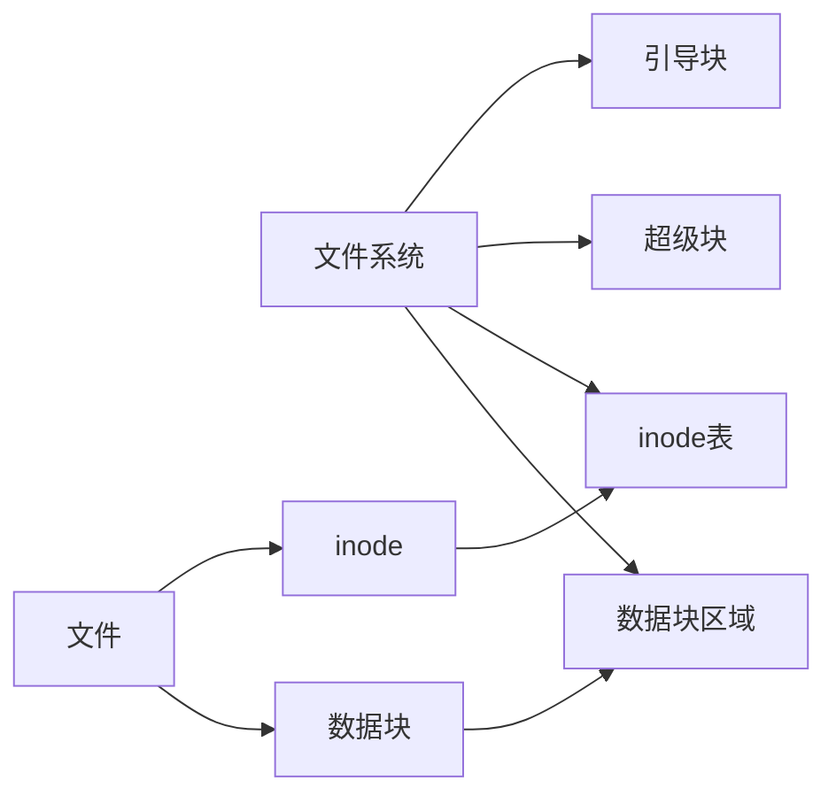
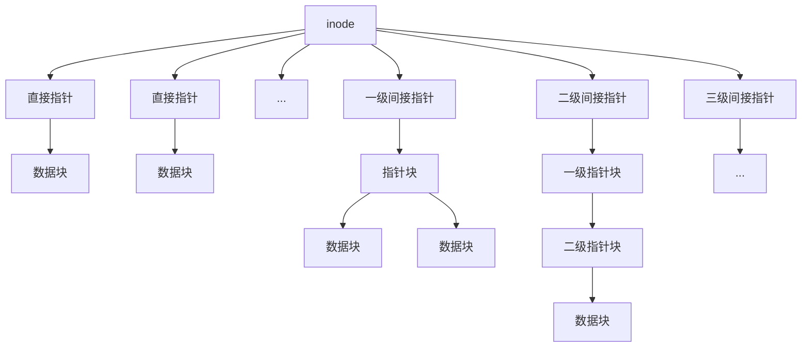
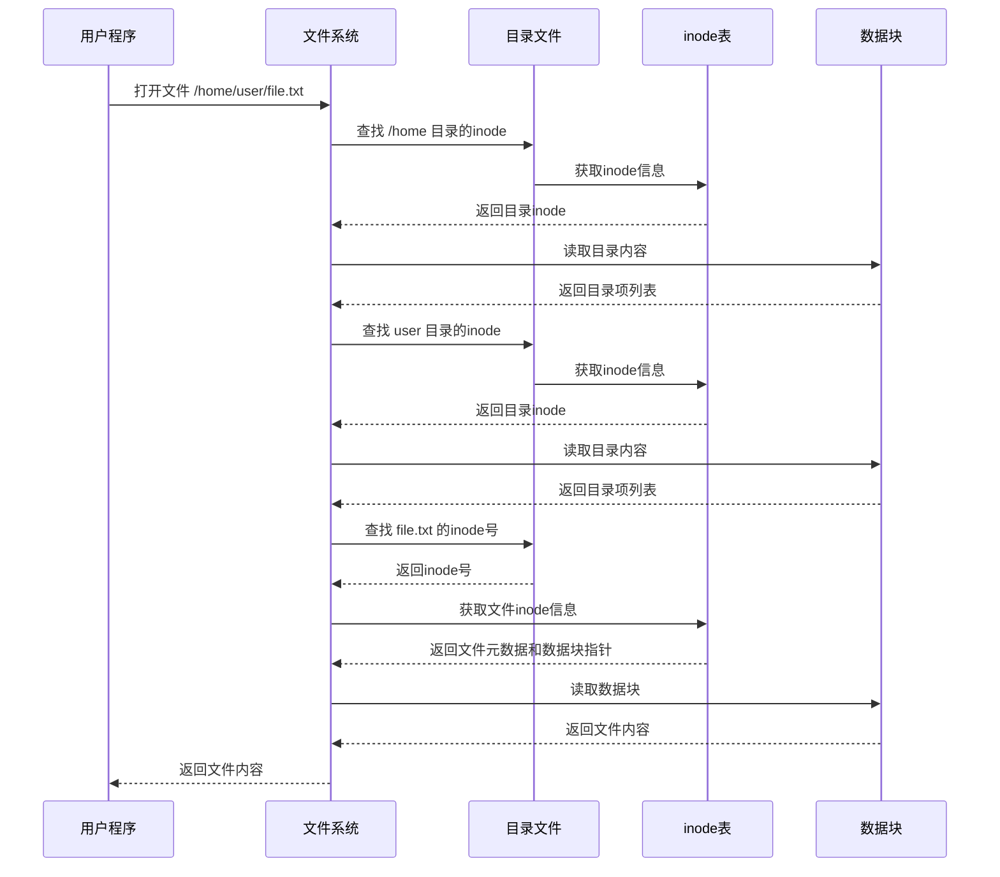

# inode与数据块原理

inode是Linux文件系统的核心概念，它存储了文件的元数据信息。本文将深入解析inode和数据块的工作原理，包括inode的结构、数据块的分配机制以及它们如何共同组成完整的文件系统，帮助用户理解Linux文件系统的底层实现。

## 1. 文件系统基础概念

在深入了解inode和数据块之前，我们需要先理解Linux文件系统的基本组织结构。Linux文件系统通常由以下几个关键部分组成：

1. **引导块（Boot Block）**：位于文件系统的最开始，包含启动操作系统所需的信息
2. **超级块（Superblock）**：存储文件系统的整体信息，如inode和数据块的总数、空闲数量等
3. **inode表（inode Table）**：存储所有inode的区域
4. **数据块（Data Blocks）**：存储文件实际内容的区域

这种设计将文件的元数据（如权限、所有者、时间戳等）与实际内容分离，提供了极大的灵活性和效率。



## 2. inode详解

### 2.1 什么是inode？

inode（索引节点）是文件系统中的一个数据结构，用于存储文件的元数据信息，但不包含文件名和实际内容。每个文件（包括目录，在Linux中目录也是文件的一种）都有一个与之关联的inode。

inode的名称来源于"index node"（索引节点），这反映了它在文件系统中的核心作用：作为文件数据的索引。

### 2.2 inode存储的信息

一个典型的inode包含以下信息：

- **文件类型**（普通文件、目录、符号链接等）
- **文件权限**（读、写、执行权限）
- **文件所有者的用户ID（UID）**
- **文件所属组的组ID（GID）**
- **文件大小**
- **时间戳**
  - 最后访问时间（atime）
  - 最后修改时间（mtime）
  - 最后状态更改时间（ctime）
- **链接计数**（有多少个硬链接指向这个inode）
- **指向数据块的指针**（直接指针、间接指针等）

以下是一个简化的inode结构示意图：

```
+------------------------+
|       inode结构        |
+------------------------+
| 文件类型和权限         |
| 所有者UID              |
| 所属组GID              |
| 文件大小               |
| 访问时间(atime)        |
| 修改时间(mtime)        |
| 状态更改时间(ctime)    |
| 链接计数               |
| 直接数据块指针[0]      |
| 直接数据块指针[1]      |
| ...                    |
| 直接数据块指针[11]     |
| 一级间接块指针         |
| 二级间接块指针         |
| 三级间接块指针         |
+------------------------+
```

### 2.3 inode编号

每个inode都有一个唯一的编号（inode号），用于在文件系统中标识它。这个编号在文件系统创建时分配，并且在文件系统的生命周期内保持不变。

我们可以使用`ls -i`命令查看文件的inode号：

```bash
$ ls -i file.txt
1234567 file.txt
```

在这个例子中，`1234567`就是`file.txt`的inode号。

### 2.4 inode与文件名的关系

**重要概念：inode不存储文件名**。文件名存储在目录文件的数据块中，作为目录项（directory entry，通常简称为dentry）的一部分。每个目录项将文件名与对应的inode号关联起来。

这种设计有几个重要的含义：

1. **同一个文件可以有多个名称**（硬链接）：多个目录项可以指向同一个inode
2. **移动文件通常只需要更改目录项**，而不需要复制文件内容
3. **文件系统可以高效地组织和检索文件**

目录本质上是一个特殊的文件，其内容是一系列目录项，每个目录项包含文件名和对应的inode号：

```
+------------------+
|    目录结构      |
+------------------+
| 文件名 | inode号 |
+------------------+
| file1.txt | 1234 |
| file2.txt | 5678 |
| subdir    | 9012 |
+------------------+
```

## 3. 数据块详解

### 3.1 什么是数据块？

数据块（Data Block）是文件系统中存储文件实际内容的基本单位。文件系统将存储空间划分为固定大小的块，典型的大小有1KB、2KB、4KB等。

数据块的大小在文件系统创建时确定，并且对整个文件系统是统一的。块大小是文件系统性能和空间利用率的重要因素：

- **较大的块**：减少了寻址开销，提高了顺序读写性能，但可能导致内部碎片（文件末尾未填满的块空间被浪费）
- **较小的块**：减少了内部碎片，提高了空间利用率，但增加了寻址开销和管理复杂性

### 3.2 数据块分配

当创建新文件或向现有文件写入数据时，文件系统会分配必要数量的数据块来存储内容。分配策略通常考虑以下因素：

1. **连续性**：尽量分配连续的块，以提高顺序访问性能
2. **可用性**：从可用块列表中选择块
3. **局部性**：尽量在相近位置分配块，减少磁盘寻道时间

不同的文件系统使用不同的分配算法，如位图分配、空闲列表等。

### 3.3 块寻址

文件系统需要一种机制来跟踪哪些数据块属于哪个文件，这就是inode中的数据块指针的作用。为了支持不同大小的文件，inode使用了多级指针结构：

1. **直接指针**：直接指向数据块
2. **间接指针**：指向包含数据块指针的块
3. **二级间接指针**：指向包含间接指针的块
4. **三级间接指针**：指向包含二级间接指针的块

这种多级指针结构允许文件系统高效地支持从很小到非常大的文件。



以ext4文件系统为例，一个inode通常有12个直接指针、1个一级间接指针、1个二级间接指针和1个三级间接指针。假设数据块大小为4KB，指针大小为4字节，那么：

- 12个直接指针可以寻址12个数据块 = 48KB
- 一级间接指针可以寻址1024个数据块 = 4MB
- 二级间接指针可以寻址1024×1024个数据块 = 4GB
- 三级间接指针可以寻址1024×1024×1024个数据块 = 4TB

这样，一个文件的最大理论大小可以达到4TB以上，足以满足大多数应用场景。

## 4. inode与数据块的协同工作

### 4.1 文件创建过程

当创建一个新文件时，文件系统执行以下步骤：

1. **分配inode**：从可用inode池中分配一个inode
2. **初始化inode**：设置文件类型、权限、所有者等信息
3. **创建目录项**：在父目录的数据块中添加新的目录项，包含文件名和inode号
4. **分配数据块**：如果文件有内容，分配必要的数据块
5. **更新inode**：在inode中记录数据块的位置

### 4.2 文件读取过程

当读取一个文件时，文件系统执行以下步骤：

1. **查找inode**：通过文件路径找到对应的inode号，然后读取inode内容
2. **检查权限**：验证用户是否有权限访问该文件
3. **定位数据块**：通过inode中的指针找到文件的数据块
4. **读取数据**：从数据块中读取文件内容



### 4.3 文件修改过程

当修改一个文件时，文件系统执行以下步骤：

1. **查找并读取inode**：与读取过程相同
2. **检查权限**：验证用户是否有写入权限
3. **修改数据块**：如果是小修改，直接修改现有数据块；如果是大修改，可能需要分配新的数据块
4. **更新inode**：更新文件大小、修改时间等信息，如果分配了新的数据块，还需要更新数据块指针
5. **写回inode**：将修改后的inode写回磁盘

### 4.4 文件删除过程

当删除一个文件时，文件系统执行以下步骤：

1. **删除目录项**：从父目录中移除对应的目录项
2. **减少链接计数**：将inode的链接计数减1
3. **检查链接计数**：如果链接计数变为0（没有其他硬链接指向该inode）
   a. **释放数据块**：将文件的所有数据块标记为可用
   b. **释放inode**：将inode标记为可用

这种设计使得硬链接的实现变得简单：多个目录项可以指向同一个inode，只有当最后一个链接被删除时，文件的数据才会被释放。

## 5. inode的限制与挑战

### 5.1 inode数量限制

文件系统在创建时会分配固定数量的inode。这意味着，即使磁盘空间充足，如果inode用尽，也无法创建新文件。这在存储大量小文件的场景中尤为常见。

我们可以使用`df -i`命令查看inode的使用情况：

```bash
$ df -i
Filesystem      Inodes  IUsed   IFree IUse% Mounted on
/dev/sda1      7864320 253946 7610374    4% /
```

### 5.2 inode大小限制

inode的大小是固定的（通常为128字节或256字节），这限制了它能存储的元数据量。对于某些需要大量扩展属性的文件系统，这可能是一个挑战。

### 5.3 文件系统碎片化

随着文件的创建、修改和删除，文件系统可能会变得碎片化，导致一个文件的数据块分散在磁盘的不同位置，影响读写性能。现代文件系统通常实现了各种策略来减少碎片化，如预分配、延迟分配等。

## 6. 不同文件系统的inode实现

不同的文件系统对inode和数据块的实现有所不同，下面简要介绍几种常见Linux文件系统的特点：

### 6.1 ext2/ext3/ext4

ext系列是Linux最传统和广泛使用的文件系统家族。

**ext2**：
- 使用经典的inode/数据块结构
- 没有日志功能，崩溃后恢复慢

**ext3**：
- 在ext2基础上添加了日志功能
- 提高了文件系统的可靠性和崩溃恢复速度

**ext4**：
- 支持更大的文件和文件系统
- 引入了extent（区段）替代传统的块映射，提高了大文件的性能
- 延迟分配和多块分配提高了性能并减少了碎片
- 日志校验和提高了可靠性

### 6.2 XFS

XFS是一个高性能的64位日志文件系统，最初由Silicon Graphics开发。

**特点**：
- 使用B+树索引管理空闲空间和目录
- 高效支持大文件和大文件系统
- 动态inode分配（不限制inode数量）
- 延迟日志记录提高性能

### 6.3 Btrfs

Btrfs（B-tree文件系统）是一个现代的写时复制（copy-on-write）文件系统。

**特点**：
- 动态inode分配
- 内置RAID支持
- 快照和克隆功能
- 校验和保护数据完整性
- 透明压缩和重复数据删除

### 6.4 ZFS

ZFS最初由Sun Microsystems开发，是一个高级的文件系统和逻辑卷管理器。

**特点**：
- 动态inode分配
- 强大的数据完整性保护
- 快照和克隆
- 透明压缩和重复数据删除
- 自动修复功能

## 7. 实用命令和工具

### 7.1 查看inode信息

```bash
# 查看文件的inode号
ls -i file.txt

# 查看文件的详细inode信息
stat file.txt

# 查看文件系统的inode使用情况
df -i

# 查找特定inode号的文件
find / -inum 1234567 2>/dev/null
```

### 7.2 查找和管理大文件和大量文件

```bash
# 查找大文件
find / -type f -size +100M -exec ls -lh {} \; 2>/dev/null

# 查找包含大量文件的目录
find / -type d -exec sh -c 'echo $(ls -1A "{}" | wc -l) files in "{}"' \; | sort -nr | head

# 查找使用大量inode的目录
find / -xdev -type d -exec sh -c 'echo $(find "{}" -type f | wc -l) files in "{}"' \; | sort -nr | head
```

### 7.3 文件系统维护

```bash
# 检查和修复文件系统
fsck /dev/sda1

# 调整文件系统参数
tune2fs -c 0 -i 0 /dev/sda1  # 禁用自动fsck

# 查看文件系统信息
dumpe2fs /dev/sda1 | less

# 查看文件系统的块大小
blockdev --getbsz /dev/sda1
```

### 7.4 处理inode耗尽问题

当文件系统的inode耗尽时，即使有足够的磁盘空间，也无法创建新文件。解决方法包括：

1. **删除不必要的文件**，特别是小文件
2. **备份数据并重新格式化**文件系统，指定更多的inode
3. **使用支持动态inode分配的文件系统**，如XFS、Btrfs或ZFS

```bash
# 使用更多inode重新格式化ext4文件系统
mkfs.ext4 -N 15000000 /dev/sda1  # 分配1500万个inode
```

## 8. 实际应用场景

### 8.1 理解硬链接和软链接

**硬链接**：
- 创建一个指向同一inode的新目录项
- 增加inode的链接计数
- 无法跨文件系统
- 无法链接到目录（大多数文件系统）

```bash
# 创建硬链接
ln original.txt hardlink.txt

# 验证两个文件共享同一个inode
ls -i original.txt hardlink.txt
```

**软链接（符号链接）**：
- 创建一个特殊类型的文件，其内容是目标文件的路径
- 有自己的inode
- 可以跨文件系统
- 可以链接到目录

```bash
# 创建软链接
ln -s original.txt symlink.txt

# 查看软链接的内容
ls -l symlink.txt
```

### 8.2 理解文件删除和恢复

当"删除"一个文件时，实际上只是删除了目录项，如果inode的链接计数不为零或有进程打开该文件，数据块不会被释放。这就是为什么：

1. 删除一个正在被使用的文件不会影响正在使用它的进程
2. 有时可以通过查找和恢复inode来恢复误删的文件

```bash
# 查找被删除但仍被进程打开的文件
lsof | grep deleted
```

### 8.3 优化文件系统性能

了解inode和数据块的工作原理有助于优化文件系统性能：

1. **选择适当的块大小**：大文件系统通常受益于较大的块大小
2. **减少碎片化**：定期使用`e4defrag`（对于ext4）或类似工具
3. **合理组织文件**：将相关文件放在同一目录下，减少目录查找开销
4. **预分配空间**：对于会增长的文件，使用`fallocate`预分配空间

```bash
# 预分配100MB空间
fallocate -l 100M preallocated_file.dat

# 检查ext4文件系统的碎片情况
e4defrag -c /dev/sda1
```

### 8.4 备份和恢复考虑

在设计备份策略时，了解inode和数据块的关系很重要：

1. **inode元数据备份**：确保备份包含文件权限、所有者等元数据
2. **硬链接处理**：确保备份工具正确处理硬链接，避免重复备份同一数据
3. **稀疏文件处理**：确保备份工具能识别和高效处理稀疏文件

## 9. 总结

inode和数据块是Linux文件系统的核心组件，它们共同实现了高效、灵活的文件存储和管理机制。

**inode的关键作用**：
- 存储文件的元数据
- 提供文件内容的索引
- 支持硬链接机制
- 实现文件权限控制

**数据块的关键作用**：
- 存储文件的实际内容
- 提供固定大小的存储单位
- 支持高效的空间分配和回收

通过深入理解inode和数据块的工作原理，我们可以更好地：
- 诊断和解决文件系统问题
- 优化文件系统性能
- 理解Linux文件操作的底层机制
- 选择适合特定需求的文件系统

无论是系统管理员、开发人员还是普通用户，这些知识都有助于更有效地使用Linux系统，并在遇到问题时能够找到合适的解决方案。