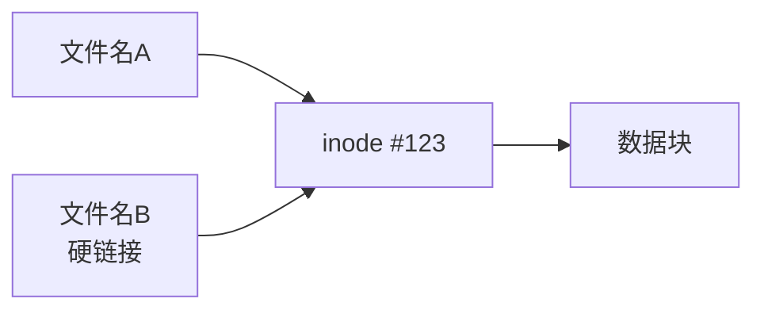

# 软链接与硬链接区别

链接是Linux文件系统中的重要概念，分为软链接（符号链接）和硬链接两种类型。本文将详细对比这两种链接的区别，包括创建方式、工作原理、使用限制和应用场景，帮助用户正确选择和使用链接功能。

## 1. 链接的基本概念

在深入了解软链接和硬链接的区别之前，我们需要先理解链接的基本概念以及它在文件系统中的作用。

### 1.1 什么是链接？

链接是文件系统中指向其他文件或目录的引用。通过链接，我们可以在不同位置访问同一个文件，而不需要创建多个文件副本，从而节省存储空间并确保数据一致性。

链接在以下场景中特别有用：
- 在多个位置访问同一个文件
- 为常用命令或长路径创建快捷方式
- 保持文件的多个版本或视图
- 组织文件而不改变其物理位置

### 1.2 链接与文件系统的关系

要理解链接，我们需要回顾Linux文件系统的基本结构：

1. **inode（索引节点）**：存储文件的元数据（权限、所有者、时间戳等）和数据块指针
2. **数据块**：存储文件的实际内容
3. **目录项**：将文件名与inode号关联起来

在Linux文件系统中，文件名实际上并不是文件本身的属性，而是存储在目录中的一个条目，这个条目将文件名映射到对应的inode号。这种设计使得链接成为可能。

## 2. 硬链接详解

### 2.1 硬链接的定义与工作原理

硬链接是指向同一个inode的多个目录项。从本质上讲，硬链接只是给同一个文件创建了一个新的名称。

当创建硬链接时，文件系统会创建一个新的目录项，指向已存在文件的inode。这个inode的链接计数会增加1，表示有多个目录项引用它。



### 2.2 创建硬链接

在Linux系统中，使用`ln`命令创建硬链接：

```bash
ln 源文件 链接名
```

例如，创建一个指向`original.txt`的硬链接`hardlink.txt`：

```bash
ln original.txt hardlink.txt
```

### 2.3 硬链接的特性

1. **共享同一个inode**：硬链接与原文件共享同一个inode，因此它们具有相同的inode号

   ```bash
   # 查看文件的inode号
   ls -i original.txt hardlink.txt
   # 输出可能如下：
   # 1234567 original.txt
   # 1234567 hardlink.txt
   ```

2. **链接计数**：每创建一个硬链接，文件的链接计数就会增加1

   ```bash
   # 查看文件的链接计数
   ls -l original.txt
   # 输出可能如下：
   # -rw-r--r-- 2 user group 123 Jan 1 12:00 original.txt
   #            ^ 链接计数
   ```

3. **内容同步**：修改任何一个链接的内容，其他链接也会反映这些更改，因为它们共享同一个数据块

4. **独立的元数据**：每个链接可以有不同的文件名和路径，但它们共享相同的权限、所有者和时间戳等元数据

5. **文件删除机制**：只有当链接计数降为0（即所有硬链接都被删除）时，文件的inode和数据块才会被释放

   ```bash
   # 删除原始文件
   rm original.txt
   # 通过硬链接仍然可以访问文件内容
   cat hardlink.txt
   ```

### 2.4 硬链接的限制

1. **不能跨文件系统**：硬链接不能跨越不同的文件系统或分区，因为不同文件系统有独立的inode表

2. **不能链接到目录**：在大多数文件系统中，不允许创建指向目录的硬链接（防止形成循环引用）

3. **必须有原文件的存在**：创建硬链接时，原文件必须已经存在

4. **需要写入权限**：在目标目录中创建硬链接需要有写入权限

## 3. 软链接详解

### 3.1 软链接的定义与工作原理

软链接（也称为符号链接或symlink）是一种特殊类型的文件，其内容是指向另一个文件或目录的路径。软链接类似于Windows中的快捷方式。

当创建软链接时，文件系统会创建一个新的inode和数据块，数据块中存储的是目标文件的路径。


### 3.2 创建软链接

在Linux系统中，使用带`-s`选项的`ln`命令创建软链接：

```bash
ln -s 源文件或目录 链接名
```

例如，创建一个指向`original.txt`的软链接`symlink.txt`：

```bash
ln -s original.txt symlink.txt
```

### 3.3 软链接的特性

1. **独立的inode**：软链接有自己的inode和数据块，与原文件完全不同

   ```bash
   # 查看文件的inode号
   ls -i original.txt symlink.txt
   # 输出可能如下：
   # 1234567 original.txt
   # 7654321 symlink.txt
   ```

2. **存储路径**：软链接的数据块存储的是目标文件的路径，而不是内容

   ```bash
   # 查看软链接的内容
   ls -l symlink.txt
   # 输出可能如下：
   # lrwxrwxrwx 1 user group 12 Jan 1 12:00 symlink.txt -> original.txt
   ```

3. **文件类型**：软链接是一种特殊的文件类型，在`ls -l`输出中以`l`开头表示

4. **大小**：软链接的大小通常是目标路径的字节长度

5. **原文件依赖**：如果原文件被删除或移动，软链接会变成"断链"（指向不存在的位置）

   ```bash
   # 删除原始文件
   rm original.txt
   # 尝试通过软链接访问
   cat symlink.txt
   # 输出可能如下：
   # cat: symlink.txt: No such file or directory
   ```

6. **路径解析**：软链接可以使用相对路径或绝对路径。使用相对路径时，是相对于软链接所在的位置

### 3.4 软链接的优势

1. **可以跨文件系统**：软链接可以指向不同文件系统或分区上的文件

2. **可以链接到目录**：软链接可以指向目录，这在硬链接中通常是不允许的

3. **可以链接到不存在的文件**：可以创建指向尚不存在的文件的软链接（虽然这样的链接在目标创建前是无效的）

4. **明确显示链接关系**：通过`ls -l`命令可以清楚地看到软链接指向的目标

## 4. 软链接与硬链接的对比

下面是软链接和硬链接主要特性的对比表：

| 特性 | 硬链接 | 软链接 |
|------|--------|--------|
| 创建命令 | `ln 源文件 链接名` | `ln -s 源文件 链接名` |
| inode | 与原文件共享同一个inode | 有独立的inode |
| 文件内容 | 直接指向文件数据块 | 存储目标文件的路径 |
| 跨文件系统 | 不支持 | 支持 |
| 链接到目录 | 通常不允许 | 允许 |
| 原文件删除影响 | 不影响，仍可访问文件内容 | 链接失效，变成"断链" |
| 文件大小 | 与原文件相同 | 等于目标路径的字节长度 |
| 修改传播 | 所有硬链接都会反映修改 | 通过任何链接的修改都会反映到原文件 |
| 权限要求 | 需要对原文件有读权限 | 不需要对原文件有任何权限 |
| 链接计数 | 会增加原文件的链接计数 | 不影响原文件的链接计数 |
| 性能 | 略高（直接访问inode） | 略低（需要路径解析） |

## 5. 实际应用场景

了解了软链接和硬链接的区别后，我们来看看它们各自适合的应用场景。

### 5.1 硬链接的应用场景

1. **文件备份与版本控制**：
   创建文件的硬链接作为备份，可以节省空间并保持数据一致性。

   ```bash
   # 创建当前配置文件的备份
   ln config.conf config.conf.backup
   ```

2. **节省存储空间**：
   对于需要在多个位置使用的大文件，使用硬链接可以避免复制，节省存储空间。

   ```bash
   # 在多个用户目录中共享大型参考文件
   ln /data/reference.db /home/user1/reference.db
   ln /data/reference.db /home/user2/reference.db
   ```

3. **保持文件链接计数**：
   某些应用程序依赖于文件的链接计数来确定文件是否仍在使用。

4. **确保文件内容不变**：
   即使原始文件被删除，通过硬链接仍然可以访问文件内容。

### 5.2 软链接的应用场景

1. **创建快捷方式**：
   为常用命令或长路径创建易记的快捷方式。

   ```bash
   # 为复杂路径创建简短别名
   ln -s /var/www/html/very/long/path/to/project project
   ```

2. **版本切换**：
   通过更改软链接的目标，可以轻松切换程序的不同版本。

   ```bash
   # 创建指向当前版本的链接
   ln -s python3.9 /usr/local/bin/python
   
   # 切换版本只需要更改链接
   rm /usr/local/bin/python
   ln -s python3.10 /usr/local/bin/python
   ```

3. **目录重组**：
   在不改变物理存储结构的情况下重组目录结构。

   ```bash
   # 将旧位置的文件逻辑上移动到新位置
   ln -s /old/data/location /new/data/location
   ```

4. **跨文件系统链接**：
   当需要引用不同文件系统上的文件时。

   ```bash
   # 链接到另一个分区上的文件
   ln -s /mnt/external/documents /home/user/documents
   ```

5. **链接到目录**：
   创建指向整个目录的链接。

   ```bash
   # 创建指向配置目录的链接
   ln -s /etc/nginx /home/user/nginx-config
   ```

## 6. 实用技巧与注意事项

### 6.1 识别链接类型

```bash
# 使用ls -l查看文件类型
ls -l file_name
# 软链接会显示为 lrwxrwxrwx 并指示目标
# 硬链接与普通文件相同，但链接计数大于1

# 使用file命令
file file_name
# 软链接会显示为 symbolic link to target
# 硬链接会显示为与原文件相同的类型
```

### 6.2 查找链接

```bash
# 查找指向特定文件的硬链接
find /path -xdev -samefile original_file

# 查找指向特定文件的软链接
find /path -type l -ls | grep original_file

# 查找特定inode号的所有硬链接
find /path -xdev -inum inode_number
```

### 6.3 处理断开的软链接

```bash
# 查找系统中的断开软链接
find /path -type l -xtype l

# 修复断开的软链接
ln -sf new_target broken_symlink
```

### 6.4 链接的安全考虑

1. **符号链接攻击**：
   恶意用户可能创建指向敏感文件的符号链接，诱导特权程序访问或修改这些文件。

   **防护措施**：
   - 在处理用户提供的路径时，使用`realpath()`函数解析真实路径
   - 避免以root身份运行处理用户输入路径的程序
   - 在临时目录中工作时使用`mkstemp()`而不是固定文件名

2. **硬链接限制**：
   某些系统配置了安全限制，防止普通用户创建指向他们没有写权限的文件的硬链接。

3. **链接遍历**：
   在遍历目录时，需要小心处理符号链接，避免无限循环或意外访问受限区域。

### 6.5 链接与文件操作

1. **复制链接**：
   - `cp`命令默认会复制链接指向的内容
   - 使用`cp -P`保留软链接
   - 使用`cp -l`将文件复制为硬链接

2. **备份链接**：
   - 许多备份工具有特殊选项来处理链接
   - 确保备份策略正确处理链接，避免重复备份或丢失链接关系

3. **移动链接**：
   - 移动软链接可能会破坏相对路径链接
   - 移动硬链接不会影响链接关系

## 7. 常见问题与解决方案

### 7.1 软链接相对路径问题

**问题**：使用相对路径创建的软链接在不同目录中访问时可能失效。

**解决方案**：
- 尽量使用绝对路径创建软链接
- 如果必须使用相对路径，确保考虑链接位置与目标位置的关系

```bash
# 使用绝对路径创建软链接
ln -s $(realpath target_file) link_name
```

### 7.2 链接循环问题

**问题**：创建指向自身或形成循环的软链接可能导致无限递归。

**解决方案**：
- 使用`find`命令的`-maxdepth`选项限制递归深度
- 使用专门的工具如`symlinks`检测和修复循环链接

```bash
# 检测循环链接
symlinks -r /path

# 限制find命令的递归深度
find /path -type l -maxdepth 3
```

### 7.3 跨设备硬链接失败

**问题**：尝试在不同文件系统之间创建硬链接会失败。

**解决方案**：
- 使用软链接替代
- 如果必须保持硬链接特性，考虑重组存储结构

```bash
# 当硬链接失败时使用软链接
ln file1 file2 || ln -s $(realpath file1) file2
```

### 7.4 链接权限问题

**问题**：软链接的权限看起来总是`777`，但实际访问时使用目标文件的权限。

**解决方案**：
- 了解软链接权限的工作方式
- 修改目标文件的权限来控制访问

```bash
# 修改目标文件权限
chmod 600 target_file
# 通过软链接访问时会应用目标文件的权限
```

## 8. 总结

软链接和硬链接是Linux文件系统中两种不同类型的链接机制，它们各有优缺点和适用场景：

**硬链接**：
- 直接指向文件的inode
- 不能跨文件系统
- 不能链接目录
- 原文件删除不影响链接
- 适合需要确保文件内容不变的场景

**软链接**：
- 存储指向目标的路径
- 可以跨文件系统
- 可以链接目录
- 原文件删除会导致链接失效
- 适合需要灵活引用和版本切换的场景

选择使用哪种链接类型应基于具体需求：
- 如果需要在多个位置访问同一个文件，并确保内容同步，使用硬链接
- 如果需要创建快捷方式、跨文件系统链接或链接到目录，使用软链接

通过正确理解和使用这两种链接类型，可以更灵活地组织文件系统，提高存储效率，并简化文件管理工作。