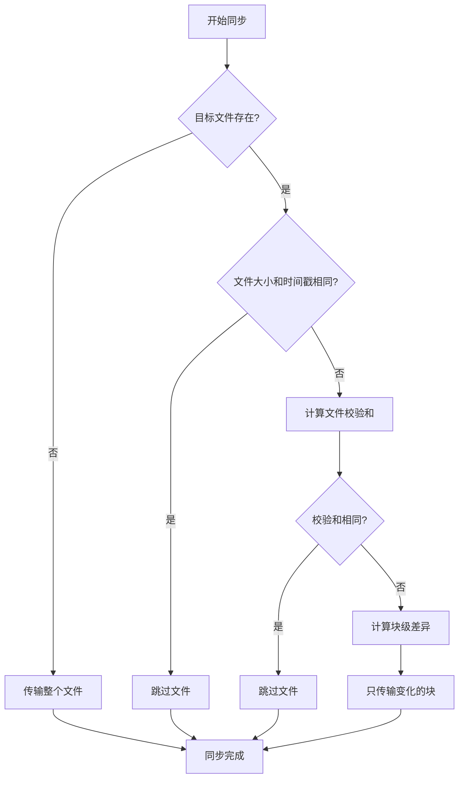

# 文件传输与同步方法

在Linux系统之间传输和同步文件是常见需求。本文将详细介绍scp、rsync、sftp等工具的使用方法，以及文件传输的安全性考虑和性能优化技巧，帮助用户实现高效可靠的文件传输和同步。

## 文件传输概述

文件传输是Linux系统管理中的基础操作，无论是备份数据、部署应用还是系统迁移，都需要在不同主机间传输文件。根据不同场景，我们可以选择不同的工具来满足需求：

- **安全性要求高**：选择基于SSH的工具，如scp、sftp、rsync(通过SSH)
- **需要增量同步**：首选rsync，避免重复传输相同内容
- **需要交互式操作**：使用sftp或FTP客户端
- **大文件或大量文件**：考虑使用rsync或专用传输工具

## SCP (Secure Copy)

SCP是基于SSH协议的安全文件复制工具，提供了简单直接的文件传输方式。

### 基本用法

```bash
# 从本地复制文件到远程服务器
scp /path/to/local/file username@remote_host:/path/to/remote/directory

# 从远程服务器复制文件到本地
scp username@remote_host:/path/to/remote/file /path/to/local/directory

# 复制目录(使用-r参数)
scp -r /path/to/local/directory username@remote_host:/path/to/remote/directory
```

### 常用选项

- `-P port` - 指定SSH端口号(注意是大写P)
- `-r` - 递归复制整个目录
- `-p` - 保留原始文件的修改时间和权限
- `-C` - 传输时启用压缩
- `-l limit` - 限制带宽使用(以Kbit/s为单位)
- `-q` - 静默模式，不显示进度信息

### 实际示例

```bash
# 复制单个文件到远程服务器
scp document.txt user@192.168.1.100:/home/user/documents/

# 使用非标准SSH端口(如2222)
scp -P 2222 document.txt user@192.168.1.100:/home/user/documents/

# 复制整个目录并保留文件属性
scp -rp /local/project/ user@192.168.1.100:/home/user/backup/

# 启用压缩并限制带宽为1000Kbit/s
scp -C -l 1000 largefile.zip user@192.168.1.100:/home/user/downloads/
```

### SCP优缺点

**优点**：
- 简单易用，语法直观
- 基于SSH，安全可靠
- 无需在远程系统安装额外软件
- 适合偶尔的文件传输需求

**缺点**：
- 不支持断点续传
- 无法跳过已存在的相同文件
- 对于大量小文件传输效率较低
- 不支持实时同步

## RSYNC (Remote Sync)

Rsync是一个功能强大的文件同步和传输工具，其增量传输算法使其特别适合大文件或需要频繁同步的场景。

### 基本用法

```bash
# 本地同步
rsync -av /source/directory/ /destination/directory/

# 远程同步(从本地到远程)
rsync -av /source/directory/ username@remote_host:/destination/directory/

# 远程同步(从远程到本地)
rsync -av username@remote_host:/source/directory/ /destination/directory/
```

### 常用选项

- `-a` - 归档模式，保留权限、时间戳等(等同于-rlptgoD)
- `-v` - 详细输出
- `-z` - 传输时压缩数据
- `-P` - 显示进度并允许断点续传
- `--delete` - 删除目标目录中源目录没有的文件
- `--exclude=PATTERN` - 排除匹配模式的文件
- `--include=PATTERN` - 包含匹配模式的文件
- `--dry-run` - 模拟运行，不实际修改文件
- `-n` - 与--dry-run相同，用于测试

### 实际示例

```bash
# 同步目录，显示进度，并允许断点续传
rsync -avzP /local/website/ user@192.168.1.100:/var/www/html/

# 同步并删除目标目录中多余的文件(使目标与源完全一致)
rsync -avz --delete /local/website/ user@192.168.1.100:/var/www/html/

# 排除特定文件或目录
rsync -avz --exclude='*.tmp' --exclude='cache/' /local/website/ user@192.168.1.100:/var/www/html/

# 使用SSH指定端口
rsync -avz -e "ssh -p 2222" /local/website/ user@192.168.1.100:/var/www/html/

# 只同步修改过的文件(增量备份)
rsync -avz --update /local/data/ /backup/data/

# 先测试运行，查看哪些文件会被修改
rsync -avzn /local/website/ user@192.168.1.100:/var/www/html/
```

### 增量传输原理

Rsync的高效主要来自其独特的增量传输算法：

1. 扫描源和目标文件，计算文件校验和
2. 比较校验和确定哪些文件需要更新
3. 对需要更新的文件，计算文件块的滚动校验和
4. 只传输发生变化的文件块，而不是整个文件
5. 在目标端重建完整文件

这种算法使rsync特别适合以下场景：
- 大文件的小部分修改(如日志、数据库文件)
- 定期备份和同步
- 网站部署和更新



### Rsync优缺点

**优点**：
- 增量传输，只传输变化的部分
- 支持保留文件属性(权限、时间戳等)
- 可以通过SSH通道加密传输
- 支持断点续传
- 可以精确控制同步行为
- 适合定期备份和镜像

**缺点**：
- 命令选项较多，学习曲线稍陡
- 需要在源和目标系统都安装rsync
- 对于极大量的小文件，初次同步可能较慢

## SFTP (SSH File Transfer Protocol)

SFTP是SSH的一部分，提供了安全的交互式文件传输功能。

### 基本用法

```bash
# 连接到SFTP服务器
sftp username@remote_host

# 连接后可以使用以下命令
# ls - 列出远程目录内容
# cd - 切换远程目录
# get - 下载文件
# put - 上传文件
# mkdir - 创建远程目录
# rm - 删除远程文件
# exit - 退出SFTP
```

### 常用SFTP命令

```bash
# 连接到SFTP服务器
sftp user@192.168.1.100

# 连接后的交互式命令
ls                      # 列出远程目录内容
cd /path/to/directory   # 切换远程目录
lcd /local/path         # 切换本地目录
get filename            # 下载文件到当前本地目录
get filename /local/path/newname  # 下载并重命名
put filename            # 上传文件到当前远程目录
mget *.txt              # 下载多个文件
mput *.txt              # 上传多个文件
mkdir newdir            # 创建远程目录
rm filename             # 删除远程文件
rmdir dirname           # 删除远程目录
exit                    # 退出SFTP
```

### 非交互式SFTP

也可以使用批处理模式执行SFTP命令：

```bash
# 使用批处理文件
sftp -b batch_file.txt user@192.168.1.100

# batch_file.txt内容示例:
# cd /remote/directory
# get file1.txt
# get file2.txt
# put /local/path/file3.txt
# exit
```

### SFTP优缺点

**优点**：
- 交互式操作，便于浏览和选择文件
- 基于SSH，安全可靠
- 支持断点续传(部分客户端)
- 可以在传输前浏览远程文件系统

**缺点**：
- 不如rsync高效，不支持增量传输
- 交互式操作不便于自动化
- 对于大量文件传输不如其他工具方便

## 其他文件传输工具

除了上述主要工具外，还有其他专用工具可用于特定场景：

### FTP/FTPS

传统的文件传输协议，但安全性较低，建议使用FTPS(FTP Secure)加密版本。

```bash
# 使用命令行FTP客户端
ftp ftp.example.com

# 使用FTPS(FTP Secure)
ftps ftps.example.com
```

### NFS (Network File System)

适合在局域网内持续共享文件系统。

```bash
# 服务器端导出目录
# 在/etc/exports中添加:
/shared/directory 192.168.1.0/24(rw,sync)

# 客户端挂载
mount -t nfs 192.168.1.100:/shared/directory /local/mount/point
```

### Samba/CIFS

适合在Linux和Windows系统间共享文件。

```bash
# 挂载Windows共享
mount -t cifs //windows_server/share /mnt/winshare -o username=user,password=pass

# 创建Samba共享(编辑/etc/samba/smb.conf)
[share_name]
   path = /path/to/shared/directory
   browseable = yes
   read only = no
```

### 专用大文件传输工具

对于特别大的文件或要求高性能的场景：

- **[Aspera](https://www.ibm.com/products/aspera)** - 高速文件传输解决方案
- **[Fast Data Transfer (FDT)](http://monalisa.cern.ch/FDT/)** - 为高带宽网络优化的传输工具
- **[UDT (UDP-based Data Transfer)](https://udt.sourceforge.io/)** - 基于UDP的高性能数据传输协议

## 文件传输安全性考虑

### 加密传输

始终优先选择加密的传输方式：

- 使用基于SSH的工具(scp, sftp, rsync over SSH)
- 避免使用未加密的FTP、Telnet等协议
- 对于HTTP传输，确保使用HTTPS

### 身份验证最佳实践

```bash
# 使用SSH密钥而非密码
ssh-keygen -t ed25519 -C "your_email@example.com"
ssh-copy-id user@192.168.1.100

# 使用非标准端口
scp -P 2222 file.txt user@192.168.1.100:/destination/

# 限制SSH访问(在/etc/ssh/sshd_config中)
AllowUsers specificuser
PermitRootLogin no
```

### 传输数据完整性验证

```bash
# 生成文件校验和
sha256sum file.txt > file.txt.sha256

# 验证文件完整性
sha256sum -c file.txt.sha256
```

## 文件传输性能优化

### 带宽控制

```bash
# 使用rsync限制带宽
rsync --bwlimit=1000 -avz /source/ /destination/

# 使用scp限制带宽
scp -l 1000 file.txt user@192.168.1.100:/destination/
```

### 压缩选项

```bash
# rsync启用压缩
rsync -avz /source/ /destination/

# scp启用压缩
scp -C file.txt user@192.168.1.100:/destination/
```

### 并行传输

对于多文件传输，可以考虑并行处理：

```bash
# 使用GNU Parallel并行传输多个文件
find /source -type f -name "*.jpg" | parallel -j5 scp {} user@192.168.1.100:/destination/

# 使用rsync的--partial-dir选项支持断点续传
rsync -avP --partial-dir=.rsync-partial /source/ user@192.168.1.100:/destination/
```

## 自动化文件传输

### 使用Cron定期同步

```bash
# 编辑crontab
crontab -e

# 添加定时任务(每天凌晨2点同步)
0 2 * * * rsync -avz --delete /source/ user@192.168.1.100:/destination/ >> /var/log/sync.log 2>&1
```

### 使用脚本实现复杂同步逻辑

```bash
#!/bin/bash
# 文件同步脚本示