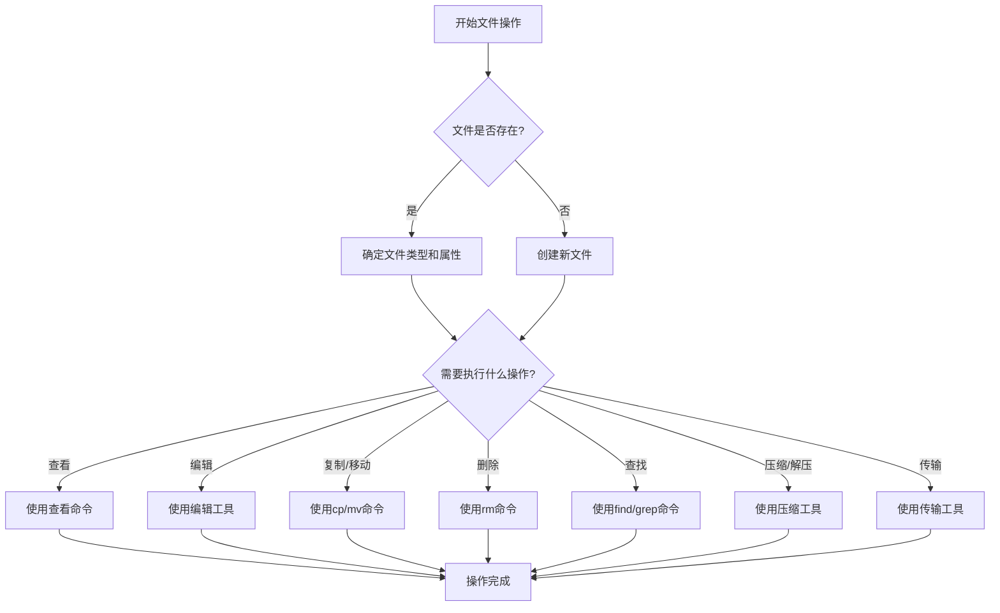
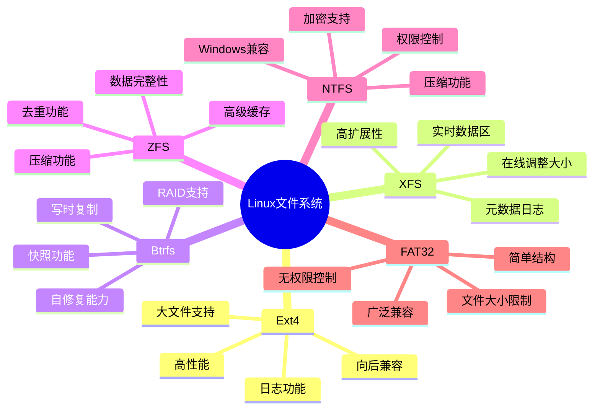

# Linux文件系统操作

Linux文件系统是整个操作系统的基础架构，理解其组织方式和操作方法对于高效使用Linux系统至关重要。本章节将全面介绍Linux文件系统的核心概念、结构特点以及常用操作技巧，帮助您从入门到精通Linux文件管理。

## 文件系统基础

Linux文件系统采用树状结构组织，具有统一的命名空间和灵活的挂载机制。了解其基本结构和设计理念，是掌握Linux系统的第一步。

### [Linux目录结构标准与意义](./01-Linux目录结构标准与意义.md)

详细解析Linux目录结构的标准规范和各目录的功能定位。本节内容包括FHS(文件系统层次结构标准)的核心规定，根目录下各个标准目录的用途和管理原则，以及不同Linux发行版在目录组织上的差异和共性。通过学习，您将理解为什么Linux系统采用这样的目录结构，以及如何在这一结构下高效组织和管理文件。

### [文件类型与属性详解](./02-文件类型与属性详解.md)

全面介绍Linux中的各种文件类型及其属性特征。本节将详细讲解普通文件、目录、链接文件、设备文件、管道文件等不同类型的特点和用途，以及文件权限、所有权、时间戳等重要属性的含义和管理方法。您将学习如何通过命令查看和修改这些属性，以及如何根据文件类型和属性进行有效的系统管理。

### [inode与数据块原理](./03-inode与数据块原理.md)

深入探讨Linux文件系统的底层存储机制和工作原理。本节将解析inode(索引节点)的概念、结构和功能，说明数据块的组织方式，以及文件系统如何通过inode和数据块实现文件的存储和访问。通过理解这些底层机制，您将能够更好地解决文件系统问题，优化存储使用，并理解许多Linux文件操作的本质原理。

### [软链接与硬链接区别](./04-软链接与硬链接区别.md)

比较两种链接方式的实现原理、使用场景和操作方法。本节将详细解释软链接(符号链接)和硬链接的工作原理和实现差异，分析它们各自的优缺点和适用场景，并通过实例演示如何创建、管理和使用这两种链接。您将了解到为什么Linux需要这两种不同的链接机制，以及如何在实际工作中选择合适的链接类型。

### [文件系统层次结构标准](./05-文件系统层次结构标准.md)

解读FHS(文件系统层次结构标准)及其对Linux系统的影响。本节将详细介绍FHS的历史背景、核心原则和具体规范，分析其对Linux系统设计和使用的深远影响，以及不同发行版如何实现和扩展这一标准。通过学习，您将理解Linux文件系统组织的标准化意义，以及如何在遵循标准的前提下灵活管理系统文件。

## 文件操作技巧

掌握高效的文件操作方法，是提升Linux使用体验和工作效率的关键。从基本的浏览查看到高级的查找检索，这些技能将使您的文件管理更加得心应手。

### [文件浏览与内容查看命令](./06-文件浏览与内容查看命令.md)

介绍常用的文件内容查看工具及其高级用法。本节将详细讲解cat、less、more、head、tail等命令的功能特点和使用技巧，以及如何通过这些工具高效浏览和分析文件内容。您将学习如何根据不同的文件类型和查看需求，选择最合适的工具和参数，实现从简单查看到复杂内容分析的各种需求。

### [文件创建编辑与删除操作](./07-文件创建编辑与删除操作.md)

详解文件基本操作的命令、选项及最佳实践。本节将系统介绍touch、mkdir、cp、mv、rm等基本文件操作命令的功能和用法，重点讲解各命令的常用选项和注意事项，以及如何安全高效地执行这些操作。您将掌握文件创建、复制、移动、删除的标准方法和高级技巧，避免常见的操作错误和数据丢失风险。

### [文件查找与检索实用技巧](./08-文件查找与检索实用技巧.md)

分享高效定位和搜索文件的方法与技巧。本节将深入讲解find、locate、grep等查找和检索工具的强大功能和高级用法，介绍如何通过这些工具快速定位文件位置、搜索文件内容、执行批量操作等。您将学习如何构建复杂的查找条件，如何优化查找效率，以及如何将查找结果与其他命令结合使用，实现更强大的文件管理功能。

### [文件压缩与解压缩操作](./09-文件压缩与解压缩操作.md)

全面讲解Linux中各种压缩格式的处理方法。本节将介绍tar、gzip、bzip2、xz、zip等常用压缩工具的特点和使用方法，详细说明如何创建、查看、提取和管理各种格式的压缩文件。您将了解不同压缩算法的优缺点，学习如何选择合适的压缩方式，以及如何处理在Linux系统中遇到的各种压缩文件格式。

### [文件传输与同步方法](./10-文件传输与同步方法.md)

介绍在本地和远程系统间传输文件的多种方式。本节将详细讲解scp、rsync、sftp等文件传输和同步工具的使用方法和最佳实践，分析它们各自的优势和适用场景。您将学习如何安全高效地在不同系统间传输文件，如何设置自动同步任务，以及如何处理大文件传输和断点续传等高级需求。

### [文件操作常见错误](./11-文件操作常见错误.md)

总结文件操作中的常见问题及其解决方案。本节将分析Linux文件操作中最常见的错误类型和原因，如权限不足、磁盘空间不足、文件被锁定等，并提供详细的诊断和解决方法。您将了解如何预防这些错误，如何正确理解错误信息，以及如何在出现问题时快速恢复和修复，提高文件操作的安全性和可靠性。

## Linux文件系统操作流程图

以下流程图展示了Linux文件系统操作的基本流程和关系：

## 文件系统类型对比

Linux支持多种文件系统类型，以下是常见文件系统的特点对比：

通过本章节的学习，您将全面掌握Linux文件系统的核心知识和实用技能，为进一步深入学习Linux系统奠定坚实基础。无论是日常使用还是系统管理，这些知识都将帮助您更加高效、自信地操作Linux系统。