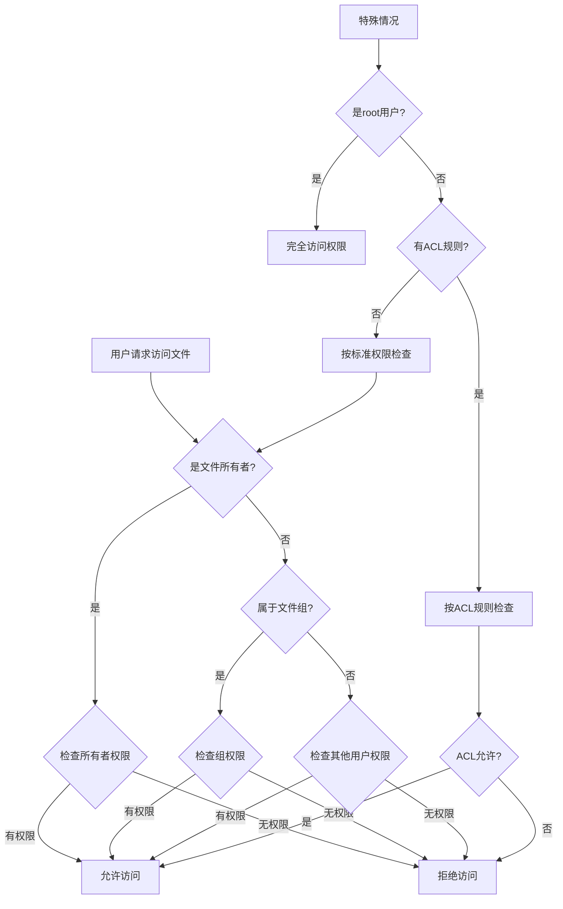
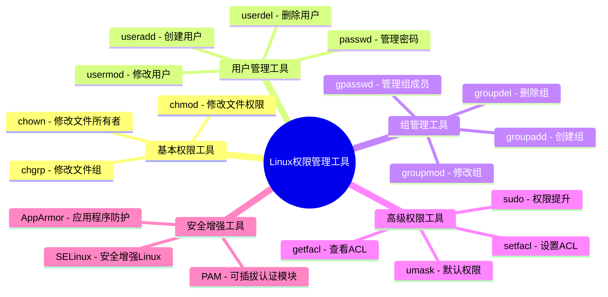

# Linux用户权限管理

Linux系统的多用户特性是其核心优势之一，而用户权限管理则是确保系统安全和稳定运行的关键环节。本章节将全面介绍Linux用户权限管理的各个方面，从基础概念到高级应用，帮助您建立完整的Linux权限管理知识体系。

## 基础概念

首先，我们需要了解Linux用户权限管理的基础概念，包括用户、组的定义以及文件权限模型的工作原理：

### [Linux用户与组的概念](./01-Linux用户与组的概念.md)

介绍Linux系统中用户和组的基本概念、类型和关系。本节详细讲解了用户账户的结构、系统用户与普通用户的区别、用户标识符(UID)的分配规则、主组与附加组的概念，以及用户与组之间的关联关系。您将了解到Linux如何通过用户和组的机制实现多用户环境下的资源隔离和权限控制，以及相关配置文件（如/etc/passwd、/etc/shadow、/etc/group）的结构和作用。

### [文件权限模型详解](./02-文件权限模型详解.md)

深入解析Linux文件权限模型的结构和工作机制。本节全面介绍了Linux权限的三级结构（所有者、所属组、其他用户）、三种基本权限（读、写、执行）的具体含义和作用，以及权限在不同类型文件上的表现差异。您将学习如何解读文件权限表示法（如rwxr-xr--），理解权限的数字表示方式（如755、644），以及权限检查的顺序和逻辑，为灵活运用权限设置奠定基础。

### [权限管理的安全原则](./03-权限管理的安全原则.md)

探讨Linux权限管理中应遵循的安全原则和最佳实践。本节分析了权限管理中的"最小权限原则"、"职责分离原则"和"纵深防御策略"等核心安全理念，并提供了实际应用这些原则的具体方法和案例。您将了解如何评估系统的权限需求，如何避免常见的权限配置错误，以及如何通过合理的权限设计提高系统的整体安全性，为构建安全可靠的Linux环境提供指导。

## 认证与访问控制

接下来，我们将学习Linux系统中的认证机制和访问控制技术：

### [PAM认证机制原理](./04-PAM认证机制原理.md)

详解可插拔认证模块(PAM)的工作原理和配置方法。本节介绍了PAM的架构设计、模块类型和功能分类，解释了PAM如何实现灵活可配置的认证流程，以及如何通过堆栈机制组合多种认证方式。您将学习PAM配置文件的语法和结构，了解常见PAM模块的用途和配置选项，掌握如何通过PAM实现密码策略、登录限制、双因素认证等高级功能，为系统认证安全提供全面保障。

### [ACL访问控制列表详解](./05-ACL访问控制列表详解.md)

介绍访问控制列表(ACL)如何提供更精细的权限控制。本节详细讲解了ACL的概念和优势，分析了传统权限模型的局限性以及ACL如何突破这些限制。您将学习ACL的实现机制、支持ACL的文件系统要求、ACL的设置和查看命令（getfacl、setfacl），以及如何通过ACL为特定用户或组分配独立的权限，实现更加灵活和精确的访问控制，满足复杂环境下的权限管理需求。

## 用户与组管理

掌握用户和组的管理是系统管理员的基本技能：

### [用户账户创建与管理](./06-用户账户创建与管理.md)

全面介绍用户账户的创建、修改、删除和管理方法。本节系统讲解了用户管理的核心命令（useradd、usermod、userdel、passwd等）的详细用法和参数选项，以及用户配置文件的管理技巧。您将学习如何设置用户的初始环境、如何管理用户密码策略、如何设置账户有效期和资源限制，以及如何批量创建和管理用户账户，为高效管理系统用户提供全面的技术支持和最佳实践指导。

### [用户组配置与权限分配](./07-用户组配置与权限分配.md)

详细讲解用户组的配置和基于组的权限分配策略。本节介绍了组管理的基本命令（groupadd、groupmod、groupdel等）的使用方法，解释了主组与附加组的管理差异，以及如何通过组实现权限的集中管理和继承。您将了解如何设计合理的组结构，如何实现基于角色的访问控制，如何处理组成员的动态变化，以及如何利用组权限简化系统管理和提高安全性，为构建可扩展的权限管理体系提供方法论支持。

## 权限设置与高级特性

深入了解权限设置的方法和高级特性：

### [文件权限设置与修改](./08-文件权限设置与修改.md)

介绍如何使用chmod、chown和chgrp命令设置和修改文件权限。本节详细解析了这些命令的语法结构、参数选项和使用技巧，包括符号模式和数字模式的权限设置方法、递归修改权限的操作、保留原有权限的技巧等。您将学习如何根据实际需求精确设置文件权限，如何处理权限继承问题，如何通过umask控制默认权限，以及如何在权限设置中避免常见错误，为日常文件权限管理提供全面的操作指南。

### [特殊权限与访问控制列表](./09-特殊权限与访问控制列表.md)

探讨SUID、SGID、Sticky Bit等特殊权限和ACL的应用。本节深入讲解了这些特殊权限的工作原理、设置方法和安全影响，分析了它们在系统中的典型应用场景和潜在风险。您将了解SUID如何允许用户以文件所有者身份执行程序，SGID如何影响文件执行和目录继承，Sticky Bit如何保护共享目录中的文件，以及如何结合ACL实现更复杂的权限控制需求，为解决特殊权限管理问题提供系统性的解决方案。

## 高级权限管理

最后，我们将学习高级权限管理技术和多用户环境的权限规划：

### [sudo权限配置与安全管理](./10-sudo权限配置与安全管理.md)

详解sudo工具的配置方法和安全最佳实践。本节全面介绍了sudo的工作机制、配置文件(/etc/sudoers)的语法和结构、权限委派的策略和方法，以及sudo日志和审计功能的配置和使用。您将学习如何安全地授予管理权限，如何实现命令级别的精细控制，如何设置sudo的环境和安全选项，以及如何通过sudo实现权限的临时提升而不共享root密码，为提高系统管理的安全性和可审计性提供专业指导。

### [多用户环境权限规划](./11-多用户环境权限规划.md)

介绍如何在多用户环境中规划和实施权限结构。本节讨论了多用户系统的权限设计原则、用户分类和权限分层策略、共享资源的权限管理方法，以及权限结构的演进和维护机制。您将了解如何根据组织结构和业务需求设计用户和组的层次关系，如何处理跨部门协作的权限问题，如何实现权限的动态调整和自动化管理，以及如何通过权限审计保证系统的长期安全，为大型Linux环境的权限规划提供系统化的方法论和实践经验。

## Linux权限管理流程图

以下流程图展示了Linux权限检查的基本过程：

## 权限管理工具对比

Linux提供了多种权限管理工具，以下是它们的功能对比：

通过系统学习这些内容，您将能够全面掌握Linux用户权限管理的理论和实践，为构建安全、高效的Linux系统打下坚实基础。无论您是Linux初学者还是有经验的系统管理员，本章节都能为您提供有价值的知识和技能。