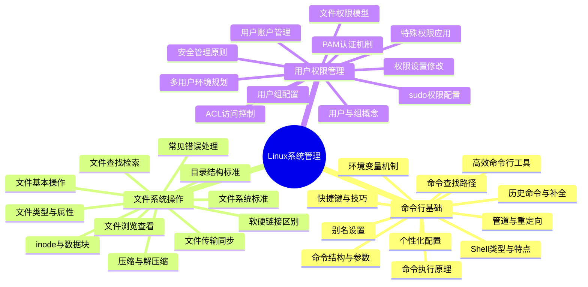

# Linux命令行基础与系统管理

本知识库涵盖了Linux系统操作的核心知识，从命令行基础到文件系统操作，再到用户与权限管理，为初学者提供全面的学习路径，同时也为中高级用户提供系统化的参考。

## 命令行基础

命令行是与Linux系统交互的最基本也是最强大的方式。掌握命令行不仅能提高工作效率，还能深入理解Linux系统的工作原理。

### [Shell类型与特点对比](./01-命令行基础/01-Shell类型与特点对比.md)

详细介绍Bash、Zsh、Fish等不同Shell的历史背景、功能特性和使用场景。通过对比各种Shell的语法差异、配置方式和扩展能力，帮助您选择最适合自己工作习惯的Shell环境。同时讲解如何在不同Shell之间切换，以及如何设置默认Shell。

### [命令结构与参数规则](./01-命令行基础/02-命令结构与参数规则.md)

全面解析Linux命令的基本结构，包括命令名、选项和参数的组织方式。详细说明短选项、长选项的区别，参数传递的规则，以及如何正确组合多个选项和参数。通过实例演示命令语法的规范和常见模式，帮助您准确理解和使用各种复杂命令。

### [Linux命令执行原理](./01-命令行基础/03-Linux命令执行原理.md)

深入探讨命令从输入到执行的完整过程，包括命令解析、路径查找、权限检查、加载执行等步骤。解释内部命令与外部命令的区别，以及Shell如何处理命令别名、函数和内置命令。通过理解这些原理，您将能够更好地排查命令执行问题并优化命令使用方式。

### [环境变量工作机制](./01-命令行基础/04-环境变量工作机制.md)

详细讲解环境变量的概念、分类和作用，包括系统环境变量和用户环境变量。介绍如何查看、设置、修改和删除环境变量，以及环境变量在Shell会话和系统启动过程中的加载顺序。通过掌握环境变量的工作机制，您可以更好地定制和控制系统行为。

### [命令查找路径与优先级](./01-命令行基础/05-命令查找路径与优先级.md)

详解PATH环境变量的作用和配置方法，说明系统如何根据PATH变量查找可执行文件。分析命令查找的优先级规则，包括别名、内置命令、函数和外部命令之间的优先关系，以及如何使用which、whereis等工具确定命令的实际位置和类型。

### [命令行快捷键与效率技巧](./01-命令行基础/06-命令行快捷键与效率技巧.md)

汇总常用的命令行操作快捷键，包括光标移动、文本编辑、命令控制等。介绍如何利用这些快捷键提高命令输入和编辑效率，减少重复操作，提升命令行工作体验。同时分享一些高级技巧，如命令组合、多命令执行和作业控制等，帮助您成为命令行操作的高手。

### [历史命令与自动补全](./01-命令行基础/07-历史命令与自动补全.md)

详细讲解历史命令功能的使用方法，包括查看、搜索和重用历史命令。介绍Tab自动补全的强大功能，包括命令补全、文件路径补全、选项补全等，以及如何配置和扩展自动补全功能。掌握这些技能将大大减少您的输入工作量，提高命令行操作的准确性和效率。

### [管道与重定向实战应用](./01-命令行基础/08-管道与重定向实战应用.md)

深入讲解Linux中管道和重定向的概念和使用方法。通过实际案例演示如何使用管道组合多个命令，如何使用重定向控制输入输出流，以及如何解决复杂数据处理问题。掌握这些技术后，您将能够构建强大的命令链，实现复杂的文本处理和系统管理任务。

### [命令行环境个性化配置](./01-命令行基础/09-命令行环境个性化配置.md)

介绍如何通过配置文件（如.bashrc、.zshrc）定制命令行环境，包括提示符设置、颜色主题、功能扩展等。提供实用的配置示例和最佳实践，帮助您打造个性化的命令行工作环境。同时讲解如何管理多环境配置，以及如何在不同系统间同步您的配置。

### [别名设置提升效率](./01-命令行基础/10-别名设置提升效率.md)

详细讲解如何创建和管理命令别名，将常用的复杂命令简化为简短易记的形式。提供实用的别名示例集合，涵盖文件操作、系统管理、网络工具等多个领域，帮助您大幅提高日常工作效率。同时介绍别名的持久化配置和条件别名的高级用法。

### [10个提高效率的命令行工具](./01-命令行基础/11-10个提高效率的命令行工具.md)

介绍10个现代化的命令行工具，这些工具能够替代传统命令，提供更友好的界面和更强大的功能。包括文件查找、文本处理、系统监控、目录导航等方面的高效工具，以及它们的安装和基本使用方法。这些工具将显著提升您的命令行工作效率和体验。

## 文件系统操作

文件系统是Linux的核心组成部分，理解文件系统的结构和操作方法对于系统管理和日常使用至关重要。

### [Linux目录结构标准与意义](./02-文件系统操作/01-Linux目录结构标准与意义.md)

详细解析Linux目录结构的标准规范和各目录的功能定位。介绍FHS(文件系统层次结构标准)的核心规定，根目录下各个标准目录的用途和管理原则，以及不同Linux发行版在目录组织上的差异和共性。通过学习，您将理解为什么Linux系统采用这样的目录结构，以及如何在这一结构下高效组织和管理文件。

### [文件类型与属性详解](./02-文件系统操作/02-文件类型与属性详解.md)

全面介绍Linux中的各种文件类型及其属性特征。详细讲解普通文件、目录、链接文件、设备文件、管道文件等不同类型的特点和用途，以及文件权限、所有权、时间戳等重要属性的含义和管理方法。您将学习如何通过命令查看和修改这些属性，以及如何根据文件类型和属性进行有效的系统管理。

### [inode与数据块原理](./02-文件系统操作/03-inode与数据块原理.md)

深入探讨Linux文件系统的底层存储机制和工作原理。解析inode(索引节点)的概念、结构和功能，说明数据块的组织方式，以及文件系统如何通过inode和数据块实现文件的存储和访问。通过理解这些底层机制，您将能够更好地解决文件系统问题，优化存储使用，并理解许多Linux文件操作的本质原理。

### [软链接与硬链接区别](./02-文件系统操作/04-软链接与硬链接区别.md)

比较两种链接方式的实现原理、使用场景和操作方法。详细解释软链接(符号链接)和硬链接的工作原理和实现差异，分析它们各自的优缺点和适用场景，并通过实例演示如何创建、管理和使用这两种链接。您将了解到为什么Linux需要这两种不同的链接机制，以及如何在实际工作中选择合适的链接类型。

### [文件系统层次结构标准](./02-文件系统操作/05-文件系统层次结构标准.md)

深入解读FHS(文件系统层次结构标准)的详细规范和实现方式。分析标准的历史演变、核心原则和具体要求，以及不同Linux发行版如何实现和扩展这一标准。通过学习，您将了解Linux文件系统组织的标准化过程，掌握符合标准的文件组织方法，以及如何在遵循标准的前提下满足特定的系统需求。

### [文件浏览与内容查看命令](./02-文件系统操作/06-文件浏览与内容查看命令.md)

详细介绍各种文件内容查看工具及其高级用法。系统讲解cat、less、more、head、tail等命令的功能特点和使用技巧，以及如何通过这些工具高效浏览和分析文件内容。您将学习如何根据不同的文件类型和查看需求，选择最合适的工具和参数，实现从简单查看到复杂内容分析的各种需求。

### [文件创建编辑与删除操作](./02-文件系统操作/07-文件创建编辑与删除操作.md)

全面讲解文件基本操作的命令、选项及最佳实践。系统介绍touch、mkdir、cp、mv、rm等基本文件操作命令的功能和用法，重点讲解各命令的常用选项和注意事项，以及如何安全高效地执行这些操作。您将掌握文件创建、复制、移动、删除的标准方法和高级技巧，避免常见的操作错误和数据丢失风险。

### [文件查找与检索实用技巧](./02-文件系统操作/08-文件查找与检索实用技巧.md)

分享高效定位和搜索文件的方法与技巧。深入讲解find、locate、grep等查找和检索工具的强大功能和高级用法，介绍如何通过这些工具快速定位文件位置、搜索文件内容、执行批量操作等。您将学习如何构建复杂的查找条件，如何优化查找效率，以及如何将查找结果与其他命令结合使用，实现更强大的文件管理功能。

### [文件压缩与解压缩操作](./02-文件系统操作/09-文件压缩与解压缩操作.md)

全面讲解Linux中各种压缩格式的处理方法。介绍tar、gzip、bzip2、xz、zip等常用压缩工具的特点和使用方法，详细说明如何创建、查看、提取和管理各种格式的压缩文件。您将了解不同压缩算法的优缺点，学习如何选择合适的压缩方式，以及如何处理在Linux系统中遇到的各种压缩文件格式。

### [文件传输与同步方法](./02-文件系统操作/10-文件传输与同步方法.md)

介绍在本地和远程系统间传输文件的多种方式。详细讲解scp、rsync、sftp等文件传输和同步工具的使用方法和最佳实践，分析它们各自的优势和适用场景。您将学习如何安全高效地在不同系统间传输文件，如何设置自动同步任务，以及如何处理大文件传输和断点续传等高级需求。

### [文件操作常见错误](./02-文件系统操作/11-文件操作常见错误.md)

总结文件操作中的常见问题及其解决方案。分析Linux文件操作中最常见的错误类型和原因，如权限不足、磁盘空间不足、文件被锁定等，并提供详细的诊断和解决方法。您将了解如何预防这些错误，如何正确理解错误信息，以及如何在出现问题时快速恢复和修复，提高文件操作的安全性和可靠性。

## 用户与权限管理

安全是Linux系统的重要特性，而用户与权限管理是保障系统安全的基础。理解并正确配置权限对于系统管理至关重要。

### [Linux用户与组的概念](./03-用户与权限管理/01-Linux用户与组的概念.md)

详细介绍Linux系统中用户和组的基本概念、类型和关系。讲解用户账户的结构、系统用户与普通用户的区别、用户标识符(UID)的分配规则、主组与附加组的概念，以及用户与组之间的关联关系。您将了解到Linux如何通过用户和组的机制实现多用户环境下的资源隔离和权限控制，以及相关配置文件的结构和作用。

### [文件权限模型详解](./03-用户与权限管理/02-文件权限模型详解.md)

深入解析Linux文件权限模型的结构和工作机制。全面介绍Linux权限的三级结构（所有者、所属组、其他用户）、三种基本权限（读、写、执行）的具体含义和作用，以及权限在不同类型文件上的表现差异。您将学习如何解读文件权限表示法，理解权限的数字表示方式，以及权限检查的顺序和逻辑，为灵活运用权限设置奠定基础。

### [权限管理的安全原则](./03-用户与权限管理/03-权限管理的安全原则.md)

探讨Linux权限管理中应遵循的安全原则和最佳实践。分析权限管理中的"最小权限原则"、"职责分离原则"和"纵深防御策略"等核心安全理念，并提供实际应用这些原则的具体方法和案例。您将了解如何评估系统的权限需求，如何避免常见的权限配置错误，以及如何通过合理的权限设计提高系统的整体安全性。

### [PAM认证机制原理](./03-用户与权限管理/04-PAM认证机制原理.md)

详解可插拔认证模块(PAM)的工作原理和配置方法。介绍PAM的架构设计、模块类型和功能分类，解释PAM如何实现灵活可配置的认证流程，以及如何通过堆栈机制组合多种认证方式。您将学习PAM配置文件的语法和结构，了解常见PAM模块的用途和配置选项，掌握如何通过PAM实现密码策略、登录限制、双因素认证等高级功能。

### [ACL访问控制列表详解](./03-用户与权限管理/05-ACL访问控制列表详解.md)

介绍访问控制列表(ACL)如何提供更精细的权限控制。详细讲解ACL的概念和优势，分析传统权限模型的局限性以及ACL如何突破这些限制。您将学习ACL的实现机制、支持ACL的文件系统要求、ACL的设置和查看命令，以及如何通过ACL为特定用户或组分配独立的权限，实现更加灵活和精确的访问控制。

### [用户账户创建与管理](./03-用户与权限管理/06-用户账户创建与管理.md)

全面介绍用户账户的创建、修改、删除和管理方法。系统讲解用户管理的核心命令的详细用法和参数选项，以及用户配置文件的管理技巧。您将学习如何设置用户的初始环境、如何管理用户密码策略、如何设置账户有效期和资源限制，以及如何批量创建和管理用户账户，为高效管理系统用户提供全面的技术支持。

### [用户组配置与权限分配](./03-用户与权限管理/07-用户组配置与权限分配.md)

详细讲解用户组的配置和基于组的权限分配策略。介绍组管理的基本命令的使用方法，解释主组与附加组的管理差异，以及如何通过组实现权限的集中管理和继承。您将了解如何设计合理的组结构，如何实现基于角色的访问控制，如何处理组成员的动态变化，以及如何利用组权限简化系统管理和提高安全性。

### [文件权限设置与修改](./03-用户与权限管理/08-文件权限设置与修改.md)

介绍如何使用chmod、chown和chgrp命令设置和修改文件权限。详细解析这些命令的语法结构、参数选项和使用技巧，包括符号模式和数字模式的权限设置方法、递归修改权限的操作、保留原有权限的技巧等。您将学习如何根据实际需求精确设置文件权限，如何处理权限继承问题，如何通过umask控制默认权限，以及如何在权限设置中避免常见错误。

### [特殊权限与访问控制列表](./03-用户与权限管理/09-特殊权限与访问控制列表.md)

探讨SUID、SGID、Sticky Bit等特殊权限和ACL的应用。深入讲解这些特殊权限的工作原理、设置方法和安全影响，分析它们在系统中的典型应用场景和潜在风险。您将了解SUID如何允许用户以文件所有者身份执行程序，SGID如何影响文件执行和目录继承，Sticky Bit如何保护共享目录中的文件，以及如何结合ACL实现更复杂的权限控制需求。

### [sudo权限配置与安全管理](./03-用户与权限管理/10-sudo权限配置与安全管理.md)

详解sudo工具的配置方法和安全最佳实践。全面介绍sudo的工作机制、配置文件的语法和结构、权限委派的策略和方法，以及sudo日志和审计功能的配置和使用。您将学习如何安全地授予管理权限，如何实现命令级别的精细控制，如何设置sudo的环境和安全选项，以及如何通过sudo实现权限的临时提升而不共享root密码，为提高系统管理的安全性和可审计性提供专业指导。

### [多用户环境权限规划](./03-用户与权限管理/11-多用户环境权限规划.md)

介绍如何在多用户环境中规划和实施权限结构。讨论多用户系统的权限设计原则、用户分类和权限分层策略、共享资源的权限管理方法，以及权限结构的演进和维护机制。您将了解如何根据组织结构和业务需求设计用户和组的层次关系，如何处理跨部门协作的权限问题，如何实现权限的动态调整和自动化管理，以及如何通过权限审计保证系统的长期安全。

## Linux系统管理知识体系

通过系统学习本知识库的内容，您将能够全面掌握Linux系统的基础操作和管理技能，为进一步学习高级主题和解决实际问题打下坚实基础。无论您是Linux初学者还是有经验的系统管理员，这些知识都将帮助您更加高效、安全地使用和管理Linux系统。