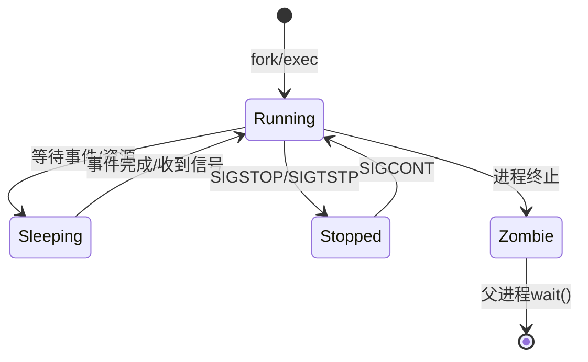

我将为您编写关于Linux进程状态与转换的详细内容。

---
title: Linux进程状态与转换
icon: state
order: 5
---

# Linux进程状态与转换

## 进程状态概述

Linux系统中的进程在其生命周期内会经历多种状态变化。理解这些状态及其转换机制对于系统管理、性能优化和问题排查至关重要。Linux进程主要有以下几种基本状态：

- 运行状态(Running)
- 睡眠状态(Sleeping)
- 停止状态(Stopped)
- 僵尸状态(Zombie)
- 死亡状态(Dead)

## 详细状态解析

### 1. 运行状态(Running)

运行状态实际上包含两种子状态：

- **R (Running or Runnable)**: 进程正在CPU上执行或在运行队列中等待被调度执行。

```bash
$ ps -eo pid,stat,cmd | grep R
  1420 R    /usr/bin/gnome-shell
```

当进程处于R状态时，它要么正在使用CPU资源，要么已准备好使用CPU并等待调度器的安排。系统负载高时，可能会有大量进程处于此状态等待执行。

### 2. 睡眠状态(Sleeping)

睡眠状态分为两种：

- **S (Interruptible Sleep)**: 可中断睡眠状态，进程正在等待某个事件完成或资源可用。收到信号时可以被唤醒。
- **D (Uninterruptible Sleep)**: 不可中断睡眠状态，通常是在进行I/O操作时。此状态的进程不响应信号，直到I/O操作完成。

```bash
$ ps -eo pid,stat,cmd | grep S
  1234 S    /usr/lib/systemd/systemd --user

$ ps -eo pid,stat,cmd | grep D
  2345 D    [kworker/0:1]
```

不可中断睡眠状态(D)的进程是系统管理中需要特别关注的，因为它们无法通过常规信号终止，可能导致系统资源长时间被占用。

### 3. 停止状态(Stopped)

- **T (Stopped)**: 进程被暂停执行，通常是收到SIGSTOP或SIGTSTP信号的结果。

```bash
$ ps -eo pid,stat,cmd | grep T
  3456 T    ./my_program
```

使用`kill -STOP <pid>`命令可以将进程置于停止状态，使用`kill -CONT <pid>`可以恢复其执行。这在调试或临时暂停进程时非常有用。

### 4. 僵尸状态(Zombie)

- **Z (Zombie)**: 进程已终止，但其父进程尚未调用wait()系统调用来获取其退出状态。

```bash
$ ps -eo pid,stat,cmd | grep Z
  4567 Z    [defunct]
```

僵尸进程只保留在进程表中的最小信息（PID、终止状态等），不占用内存或CPU资源，但会占用PID资源。大量僵尸进程可能表明系统存在程序设计问题。

### 5. 死亡状态(Dead)

- **X (Dead)**: 进程即将被销毁，这是一个非常短暂的状态，通常在`ps`命令输出中很难捕捉到。

## 进程状态转换

进程状态之间的转换遵循特定的规则和触发条件：



### 主要转换条件

1. **创建进程**：通过fork()或exec()系统调用，新进程进入运行状态。

```c
#include <unistd.h>
#include <stdio.h>

int main() {
    pid_t pid = fork();
    
    if (pid == 0) {
        // 子进程
        printf("子进程创建成功，PID: %d\n", getpid());
    } else if (pid > 0) {
        // 父进程
        printf("父进程创建了子进程，子PID: %d\n", pid);
    } else {
        // 错误
        perror("fork失败");
    }
    
    return 0;
}
```

2. **运行→睡眠**：进程等待某个条件（如I/O完成、锁释放、定时器到期）时进入睡眠状态。

```c
// 进程进入可中断睡眠状态的例子
#include <unistd.h>
#include <stdio.h>

int main() {
    printf("进程将睡眠5秒...\n");
    sleep(5);  // 进程进入可中断睡眠状态
    printf("进程已唤醒\n");
    return 0;
}
```

3. **睡眠→运行**：当等待的事件发生或收到信号时，进程被唤醒并重新进入运行状态。

4. **运行→停止**：进程收到SIGSTOP或SIGTSTP信号时进入停止状态。

```bash
# 在终端1中运行程序
$ ./my_program

# 在终端2中发送停止信号
$ kill -STOP $(pgrep my_program)

# 恢复程序运行
$ kill -CONT $(pgrep my_program)
```

5. **停止→运行**：进程收到SIGCONT信号时恢复执行。

6. **运行→僵尸**：进程执行完毕或被终止后，如果父进程未调用wait()，则进入僵尸状态。

```c
#include <unistd.h>
#include <stdio.h>
#include <stdlib.h>
#include <sys/wait.h>

int main() {
    pid_t pid = fork();
    
    if (pid == 0) {
        // 子进程
        printf("子进程将退出\n");
        exit(0);  // 子进程退出
    } else if (pid > 0) {
        // 父进程
        printf("父进程将睡眠20秒，此时子进程将成为僵尸\n");
        sleep(20);
        
        // 调用wait()回收僵尸进程
        int status;
        wait(&status);
        printf("父进程回收了子进程\n");
    }
    
    return 0;
}
```

7. **僵尸→终止**：父进程调用wait()或waitpid()系统调用获取子进程退出状态后，僵尸进程被完全移除。

## 进程状态查看方法

### 使用ps命令

`ps`命令是查看进程状态的主要工具：

```bash
# 查看所有进程的状态
$ ps aux

# 查看特定进程状态
$ ps -p <PID> -o pid,ppid,stat,cmd

# 查看详细的状态信息
$ ps -eo pid,ppid,user,stat,etimes,cmd
```

STAT列中的字符含义：

- 主状态码：R, S, D, T, Z, X
- 附加状态标识：
  - `+`: 前台进程组中的进程
  - `<`: 高优先级进程
  - `N`: 低优先级进程
  - `l`: 多线程进程
  - `s`: 会话领导者

### 使用top命令

`top`命令提供了实时的进程状态监控：

```bash
$ top
```

在top输出中，S列显示进程的当前状态。

## 进程状态与系统性能

不同的进程状态对系统性能有不同的影响：

1. **大量R状态进程**：表明CPU资源紧张，可能需要增加CPU资源或优化程序。

2. **大量D状态进程**：通常表明I/O系统存在瓶颈，如磁盘I/O过慢。

3. **大量Z状态进程**：表明存在程序设计问题，父进程未正确处理子进程退出。

## 常见问题与解决方案

### 1. 僵尸进程处理

僵尸进程过多会耗尽PID资源。解决方法：

- 修复父进程代码，正确调用wait()或waitpid()
- 如果父进程无法修改，可以尝试终止父进程，让init进程接管并清理僵尸进程

```bash
# 查找僵尸进程
$ ps aux | grep Z

# 找到僵尸进程的父进程
$ ps -o ppid= -p <僵尸进程PID>

# 终止父进程
$ kill <父进程PID>
```

### 2. 不可中断睡眠(D)状态进程处理

D状态进程通常表明I/O问题：

- 检查磁盘健康状态
- 检查NFS挂载点是否响应
- 在极端情况下，可能需要重启系统

```bash
# 查找D状态进程
$ ps aux | grep " D "

# 查看I/O状态
$ iostat -x 1
```

### 3. 停止(T)状态进程恢复

```bash
# 恢复被停止的进程
$ kill -CONT <PID>
```

## 进程状态与信号的关系

不同的信号会导致进程状态发生变化：

| 信号 | 默认行为 | 可能导致的状态变化 |
|------|---------|-----------------|
| SIGTERM | 终止进程 | Running → Zombie |
| SIGKILL | 强制终止进程 | Running → Zombie |
| SIGSTOP | 停止进程 | Running → Stopped |
| SIGCONT | 继续执行 | Stopped → Running |
| SIGTSTP | 停止进程(可被捕获) | Running → Stopped |
| SIGSEGV | 终止进程(段错误) | Running → Zombie |

## 总结

Linux进程状态系统是操作系统进程管理的核心机制。理解进程状态及其转换条件，有助于：

1. 更有效地进行系统监控和性能分析
2. 排查系统问题和进程异常
3. 优化应用程序设计，避免资源泄漏
4. 实现更精细的进程控制和管理

掌握进程状态知识对于系统管理员和开发人员来说都是必不可少的基础技能，它为深入理解Linux系统运行机制提供了重要视角。