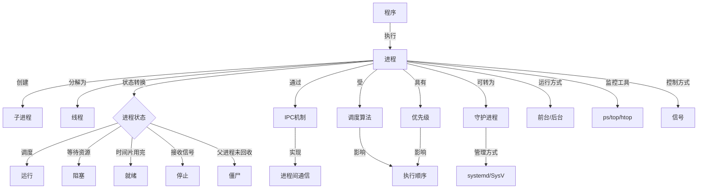
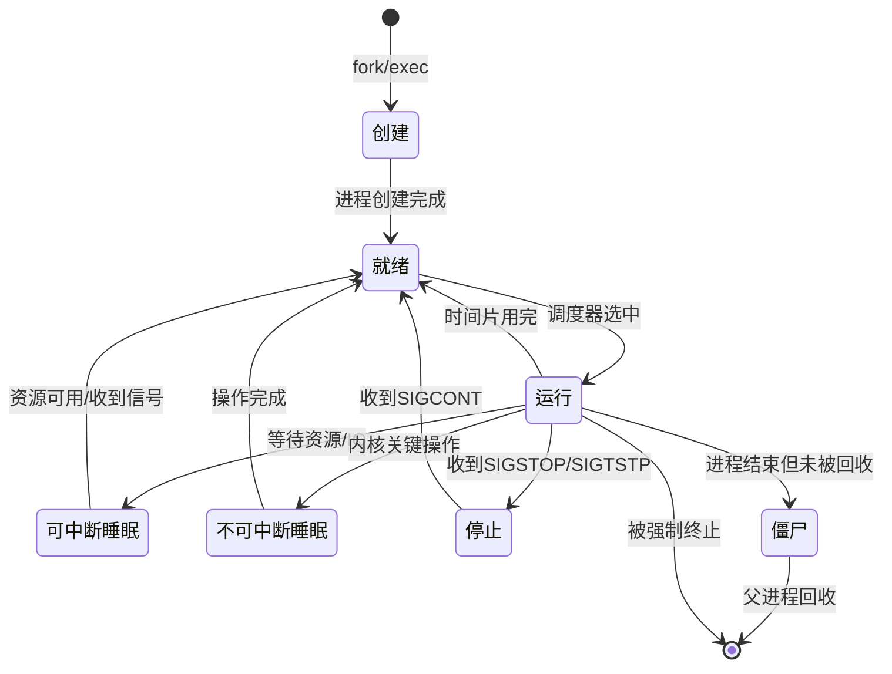

# Linux进程管理

Linux系统中的进程管理是系统管理员和开发人员必须掌握的核心技能之一。进程是程序的执行实例，是操作系统资源分配的基本单位。深入理解进程的概念、生命周期、调度机制以及管理方法，对于优化系统性能、排查问题和开发高效应用至关重要。

本章节将全面介绍Linux进程管理的各个方面，从基础概念到高级技巧，帮助读者建立完整的知识体系。无论您是初学者还是有经验的系统管理员，都能在这里找到有价值的内容。

## 章节目录

### [进程概念与生命周期](./01-进程概念与生命周期.md)

介绍进程的基本概念、组成部分以及完整的生命周期。本节详细解析了进程的定义、进程与程序的区别、进程的内存结构（代码段、数据段、堆栈等）以及进程控制块(PCB)的组成。同时，全面讲解了进程从创建、就绪、运行到阻塞、终止的完整生命周期，以及系统调用如fork()、exec()和exit()在进程生命周期中的作用，帮助读者建立对进程本质的深入理解。

### [进程、线程与作业关系](./02-进程线程与作业关系.md)

详细阐述进程、线程和作业之间的区别与联系。本节首先明确了三者的基本概念，然后从资源占用、调度单位、通信开销等多个维度对比它们的异同。深入分析了多进程与多线程的优缺点及适用场景，解释了轻量级进程的概念，以及Linux系统如何实现线程模型。同时，讲解了作业控制在Shell环境中的应用，以及它与进程管理的关系，帮助读者全面理解这三个密切相关但又有明显区别的概念。

### [进程调度算法详解](./03-进程调度算法详解.md)

深入分析Linux系统中的各种进程调度算法。本节从调度的基本原理出发，详细介绍了先来先服务(FCFS)、轮转调度(Round Robin)、最短作业优先(SJF)、优先级调度等经典算法的工作原理、优缺点及适用场景。重点讲解了Linux系统中的完全公平调度算法(CFS)的设计思想和实现机制，以及实时调度策略(FIFO、RR)的特点。通过具体案例分析不同调度算法对系统性能、响应时间和吞吐量的影响，帮助读者理解调度算法在系统资源分配中的关键作用。

### [进程间通信机制](./04-进程间通信机制.md)

全面介绍Linux系统中的进程间通信(IPC)机制。本节系统讲解了管道(匿名管道和命名管道)、信号、消息队列、共享内存、信号量、套接字等多种IPC机制的基本原理、特点和使用方法。通过丰富的代码示例和实际应用场景，展示了如何选择合适的IPC机制解决不同的通信需求，如何处理同步和互斥问题，以及如何避免常见的IPC陷阱如死锁和竞态条件。同时，对比分析了各种IPC机制的性能特点和适用场景，为读者提供全面的IPC技术指南。

### [Linux进程状态与转换](./05-Linux进程状态与转换.md)

详细讲解Linux进程的各种状态及其转换机制。本节首先介绍了Linux进程的五种基本状态：运行(R)、可中断睡眠(S)、不可中断睡眠(D)、停止(T)和僵尸(Z)，以及它们在ps命令输出中的表示。然后深入分析了进程状态转换的触发条件和内部机制，如调度器的作用、系统调用的影响、信号处理等。特别关注了容易导致问题的状态如僵尸进程和不可中断睡眠的成因、影响和处理方法。通过理解进程状态转换，读者能够更好地诊断系统问题和优化应用性能。

### [进程查看与监控命令](./06-进程查看与监控命令.md)

介绍常用的进程查看和监控命令及其高级用法。本节详细讲解了ps、top、htop、pgrep、pidof等命令的功能特点和常用选项，展示了如何通过这些工具获取进程的详细信息（如CPU使用率、内存占用、运行时间等）。重点介绍了top和htop等交互式工具的高级功能，如排序、过滤、进程树视图等。同时，讲解了如何使用vmstat、iostat、mpstat等工具监控系统整体性能，以及如何结合这些工具进行综合分析，为系统性能优化和问题排查提供数据支持。

### [进程控制与信号处理](./07-进程控制与信号处理.md)

讲解如何通过信号机制控制进程的行为。本节首先介绍了Linux信号的基本概念、常见信号类型及其含义，然后详细讲解了信号的发送方法（如kill、pkill、killall命令）和接收处理机制。通过实例展示了如何在Shell脚本和C程序中发送、捕获和处理信号，如何设置信号处理函数，以及如何利用信号实现进程间的简单通信和控制。特别关注了常见信号如SIGTERM、SIGKILL、SIGINT、SIGHUP等的使用场景和注意事项，帮助读者掌握进程控制的核心技能。

### [前台与后台进程管理](./08-前台与后台进程管理.md)

介绍Linux系统中前台和后台进程的概念、区别以及管理方法。本节详细讲解了如何通过&符号、bg/fg命令、nohup命令等方式在前台和后台运行进程，如何实现进程的前后台切换，以及如何使进程在用户注销后继续运行。重点介绍了作业控制的相关命令（jobs、bg、fg、disown等）的使用方法和技巧。同时，讲解了screen和tmux等终端复用工具的基本用法，展示了它们在长时间运行任务管理中的优势。通过掌握这些技能，读者能够更灵活地管理和控制Linux系统中的进程运行方式。

### [进程优先级调整技巧](./09-进程优先级调整技巧.md)

详细讲解如何通过nice值和实时优先级调整进程的执行优先级。本节首先介绍了Linux进程优先级的基本概念，包括静态优先级(nice值)和动态优先级的区别和关系。然后详细讲解了如何使用nice、renice命令和系统调用调整普通进程的优先级，以及如何使用chrt命令设置实时进程的调度策略和优先级。通过具体案例分析了优先级调整对系统性能的影响，提供了不同场景下的优先级设置建议，如何平衡系统资源分配，确保关键任务的响应速度。同时，讨论了优先级调整的权限要求和潜在风险，帮助读者安全有效地应用这一技术。

### [守护进程配置与管理](./10-守护进程配置与管理.md)

介绍守护进程的概念、特点和工作原理，以及管理方法。本节首先解释了什么是守护进程，它与普通进程的区别，以及守护进程的典型特征（如无控制终端、后台运行等）。然后详细讲解了如何手动创建守护进程（包括fork、setsid、umask、chdir等关键步骤），以及如何通过传统SysV方式（init脚本）和现代systemd方式创建和管理系统服务。重点介绍了systemd的单元文件配置、服务管理命令（systemctl）的使用方法，以及如何设置服务的依赖关系、启动顺序和资源限制。通过掌握这些知识，读者能够有效地管理系统服务，确保关键服务的可靠运行。

### [进程异常排查方法](./11-进程异常排查方法.md)

全面讲解进程异常的常见类型、症状和排查方法。本节系统介绍了进程可能出现的各种异常情况，如CPU占用过高、内存泄漏、进程僵死、无响应等，以及它们的典型症状和可能原因。详细讲解了如何使用各种工具（如top、ps、strace、lsof、gdb等）诊断和分析进程问题，如何查看系统日志和应用日志获取错误信息，以及如何通过core dump分析程序崩溃原因。通过实际案例展示了常见问题的排查思路和解决方法，如何识别资源瓶颈，如何处理失控进程，以及如何预防类似问题再次发生。掌握这些技能将帮助读者有效应对生产环境中的各种进程异常情况。

## 进程管理核心概念图

以下是Linux进程管理的核心概念和关系图：

## 进程状态转换流程

下面是Linux进程状态转换的详细流程图：

## 常用进程管理命令对比

| 命令 | 主要功能 | 优势 | 适用场景 |
|------|---------|------|---------|
| ps | 显示进程快照 | 信息全面，选项丰富 | 获取详细进程信息 |
| top | 动态监控进程 | 实时更新，交互操作 | 系统性能监控 |
| htop | 增强版top | 界面友好，操作便捷 | 交互式进程管理 |
| pgrep | 按名称查找进程 | 结合grep功能，灵活筛选 | 快速定位特定进程 |
| kill | 发送信号给进程 | 精确控制单个进程 | 终止或控制指定进程 |
| pkill | 按名称发送信号 | 批量操作，模式匹配 | 管理多个相关进程 |
| nice/renice | 调整进程优先级 | 影响CPU调度决策 | 优化资源分配 |
| nohup | 忽略挂起信号 | 用户注销后继续运行 | 长时间运行的任务 |
| systemctl | 管理系统服务 | 全面控制systemd单元 | 守护进程的管理 |
| strace | 跟踪系统调用 | 深入分析进程行为 | 故障诊断和调试 |

通过学习本章节的内容，读者将能够全面掌握Linux进程管理的知识和技能，为系统优化、问题排查和应用开发打下坚实基础。无论是日常系统管理还是深入的性能调优，这些知识都将帮助您更加高效地工作和解决问题。