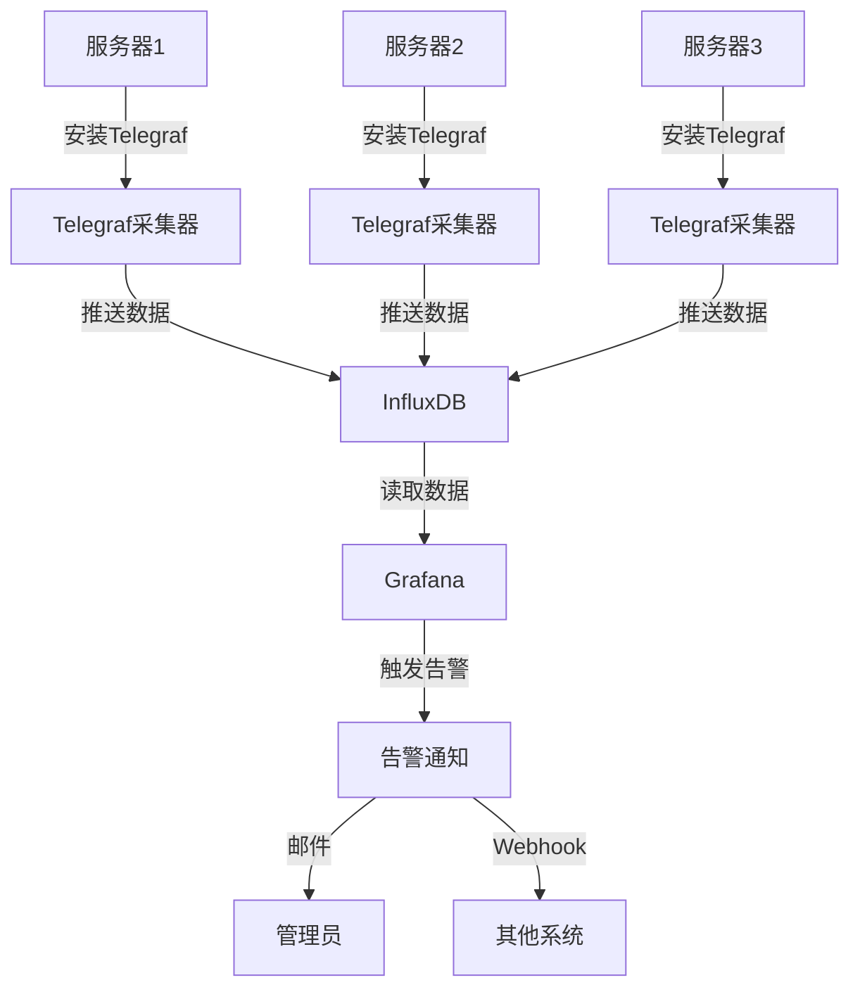

# 构建简易系统监控平台

构建自己的监控平台是运维工作的重要内容。本文将通过实战项目，详细介绍如何使用开源工具构建一个简易但实用的系统监控平台，包括数据采集、存储、可视化和告警等功能的实现，帮助用户掌握监控系统的构建方法，为后续更复杂的监控平台搭建奠定基础。

## 监控系统的重要性

在现代IT基础设施中，监控系统扮演着"眼睛"和"预警器"的角色。一个良好的监控系统能够：

1. **提前发现问题**：在问题影响用户体验前识别并解决
2. **减少故障时间**：快速定位故障源，缩短修复时间
3. **优化资源利用**：通过数据分析，合理分配和使用系统资源
4. **辅助容量规划**：基于历史数据趋势，预测未来资源需求
5. **提供决策依据**：为系统优化和架构调整提供数据支持

## 项目目标

本项目旨在构建一个功能完整的监控系统，具体目标包括：

- 实现对多台服务器的基础监控
- 收集CPU、内存、磁盘、网络等核心指标
- 构建简单的可视化界面
- 实现基本的告警功能

## 技术选型

在开始构建监控系统前，我们需要选择合适的技术组件。本项目采用当前流行的开源监控技术栈：

### 数据采集：Telegraf

Telegraf是一个插件驱动的服务器代理，用于收集和报告指标。选择Telegraf的原因：
- 轻量级，资源占用少
- 插件丰富，支持多种数据源
- 配置简单，易于部署
- 与InfluxDB无缝集成

### 数据存储：InfluxDB

InfluxDB是专为时间序列数据设计的数据库。选择InfluxDB的原因：
- 高性能写入和查询
- 专为监控数据优化
- 内置数据保留策略和降采样功能
- 支持HTTP API，易于集成

### 可视化：Grafana

Grafana是最流行的开源可视化工具。选择Grafana的原因：
- 强大的图表展示能力
- 支持多种数据源
- 丰富的仪表盘模板
- 活跃的社区和插件生态

### 告警：Grafana内置告警 + 邮件通知

利用Grafana的内置告警功能，配合邮件通知，实现基本的告警需求。

## 系统架构

下面是我们将要构建的监控系统架构图：



## 实施步骤

### 1. 环境准备与规划

在开始部署前，需要进行环境规划和准备工作。

#### 硬件需求

对于小型监控系统（监控10台以内的服务器），建议的最低配置：

- **监控服务器**：
  - CPU: 2核心
  - 内存: 4GB
  - 磁盘: 50GB（根据数据保留策略调整）
  - 操作系统: CentOS 7/8, Ubuntu 18.04/20.04

#### 网络规划

确保监控服务器与被监控服务器之间的网络连通性：

- Telegraf到InfluxDB: 8086端口
- Grafana Web界面: 3000端口
- 被监控服务器需开放ICMP协议（用于ping监控）

#### 安装准备

创建安装目录和配置文件目录：

```bash
mkdir -p /opt/monitoring/influxdb
mkdir -p /opt/monitoring/telegraf
mkdir -p /opt/monitoring/grafana
mkdir -p /opt/monitoring/config
```

### 2. InfluxDB安装与配置

InfluxDB作为时间序列数据库，将存储所有监控指标。

#### 安装InfluxDB

在监控服务器上安装InfluxDB：

```bash
# 添加InfluxDB仓库
wget https://dl.influxdata.com/influxdb/releases/influxdb2-2.0.9-windows-amd64.zip
unzip influxdb2-2.0.9-windows-amd64.zip -d /opt/monitoring/influxdb

# 创建配置文件
cd /opt/monitoring/influxdb
./influxd.exe --reporting-disabled
```

首次启动后，访问`http://服务器IP:8086`完成初始化设置：
1. 创建管理员用户和密码
2. 创建组织名称（如"monitoring"）
3. 创建初始存储桶（如"telegraf"）
4. 获取并保存API令牌

#### 配置数据保留策略

为避免监控数据无限增长占满磁盘，设置合理的数据保留策略：

```bash
# 使用influx命令行工具
cd /opt/monitoring/influxdb
./influx.exe bucket create \
  --name metrics_30d \
  --retention 30d \
  --org monitoring
```

这将创建一个保留数据30天的存储桶。

### 3. Telegraf部署与配置

Telegraf需要部署在每台被监控的服务器上，用于采集系统指标。

#### 安装Telegraf

在每台被监控服务器上执行：

```bash
# 下载Telegraf
wget https://dl.influxdata.com/telegraf/releases/telegraf-1.21.4_windows_amd64.zip
unzip telegraf-1.21.4_windows_amd64.zip -d /opt/monitoring/telegraf

# 创建配置目录
mkdir -p /opt/monitoring/telegraf/conf
```

#### 配置Telegraf

创建基础配置文件`/opt/monitoring/telegraf/conf/telegraf.conf`：

```ini
# Global Agent Configuration
[agent]
  interval = "10s"
  round_interval = true
  metric_batch_size = 1000
  metric_buffer_limit = 10000
  collection_jitter = "0s"
  flush_interval = "10s"
  flush_jitter = "0s"
  precision = ""
  hostname = ""
  omit_hostname = false

# InfluxDB Output Plugin
[[outputs.influxdb_v2]]
  urls = ["http://监控服务器IP:8086"]
  token = "YOUR_API_TOKEN"
  organization = "monitoring"
  bucket = "metrics_30d"

# CPU Input Plugin
[[inputs.cpu]]
  percpu = true
  totalcpu = true
  collect_cpu_time = false
  report_active = false

# Memory Input Plugin
[[inputs.mem]]

# Disk Input Plugin
[[inputs.disk]]
  ignore_fs = ["tmpfs", "devtmpfs", "devfs", "iso9660", "overlay", "aufs", "squashfs"]

# Disk IO Input Plugin
[[inputs.diskio]]

# Network Input Plugin
[[inputs.net]]

# System Input Plugin
[[inputs.system]]

# Process Input Plugin
[[inputs.processes]]

# Windows Performance Counters
[[inputs.win_perf_counters]]
  [[inputs.win_perf_counters.object]]
    ObjectName = "Processor"
    Instances = ["*"]
    Counters = ["% Idle Time", "% Interrupt Time", "% Privileged Time", "% User Time", "% Processor Time"]
    Measurement = "win_cpu"

  [[inputs.win_perf_counters.object]]
    ObjectName = "Memory"
    Counters = ["Available Bytes", "Cache Faults/sec", "Demand Zero Faults/sec", "Page Faults/sec", "Pages/sec", "Transition Faults/sec", "Pool Nonpaged Bytes", "Pool Paged Bytes"]
    Instances = ["------"]
    Measurement = "win_mem"

  [[inputs.win_perf_counters.object]]
    ObjectName = "Network Interface"
    Instances = ["*"]
    Counters = ["Bytes Received/sec", "Bytes Sent/sec", "Packets Received/sec", "Packets Sent/sec"]
    Measurement = "win_net"
```

替换配置中的`YOUR_API_TOKEN`为之前保存的API令牌，并将`监控服务器IP`替换为实际的IP地址。

#### 启动Telegraf服务

```bash
cd /opt/monitoring/telegraf
./telegraf.exe --config /opt/monitoring/telegraf/conf/telegraf.conf
```

为了将Telegraf设置为Windows服务，可以使用NSSM工具：

```bash
# 下载NSSM
wget https://nssm.cc/release/nssm-2.24.zip
unzip nssm-2.24.zip

# 安装Telegraf服务
cd nssm-2.24/win64
./nssm.exe install TelegrafService "C:\opt\monitoring\telegraf\telegraf.exe" "--config C:\opt\monitoring\telegraf\conf\telegraf.conf"
./nssm.exe start TelegrafService
```

### 4. Grafana安装与配置

Grafana提供可视化界面和告警功能。

#### 安装Grafana

在监控服务器上执行：

```bash
# 下载Grafana
wget https://dl.grafana.com/oss/release/grafana-8.4.4.windows-amd64.zip
unzip grafana-8.4.4.windows-amd64.zip -d /opt/monitoring/grafana

# 启动Grafana
cd /opt/monitoring/grafana/bin
./grafana-server.exe
```

同样，可以使用NSSM将Grafana设置为服务：

```bash
./nssm.exe install GrafanaService "C:\opt\monitoring\grafana\bin\grafana-server.exe"
./nssm.exe start GrafanaService
```

#### 配置数据源

1. 访问`http://监控服务器IP:3000`
2. 使用默认账号密码登录（admin/admin）
3. 进入"Configuration" > "Data Sources" > "Add data source"
4. 选择"InfluxDB"
5. 配置数据源：
   - URL: `http://localhost:8086`
   - 选择Flux查询语言
   - Organization: `monitoring`
   - Token: 粘贴之前保存的API令牌
   - Default Bucket: `metrics_30d`
6. 点击"Save & Test"确认连接成功

#### 创建仪表盘

Grafana支持导入预设的仪表盘模板，我们可以使用社区提供的模板快速创建监控面板。

1. 进入"Create" > "Import"
2. 输入模板ID：10581（Telegraf系统监控模板）
3. 选择之前配置的InfluxDB数据源
4. 点击"Import"

也可以手动创建仪表盘，添加以下面板：

- CPU使用率面板
- 内存使用率面板
- 磁盘使用率面板
- 网络流量面板
- 系统负载面板

下面是一个创建CPU使用率面板的Flux查询示例：

```
from(bucket: "metrics_30d")
  |> range(start: v.timeRangeStart, stop: v.timeRangeStop)
  |> filter(fn: (r) => r._measurement == "cpu")
  |> filter(fn: (r) => r._field == "usage_system" or r._field == "usage_user")
  |> filter(fn: (r) => r.cpu == "cpu-total")
  |> aggregateWindow(every: v.windowPeriod, fn: mean, createEmpty: false)
  |> yield(name: "mean")
```

### 5. 配置告警规则

Grafana 8.0+版本内置了强大的告警功能，可以直接在Grafana中配置告警规则。

#### 创建告警规则

1. 进入"Alerting" > "Alert rules" > "New alert rule