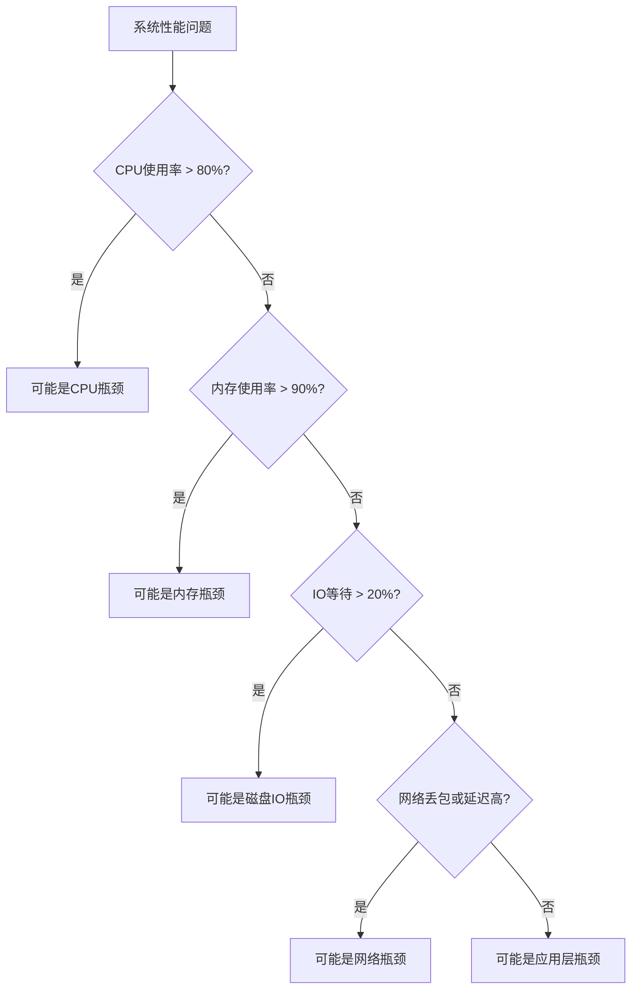

# 性能瓶颈定位流程

系统性能问题的快速定位是运维工作的关键技能。本文将详细介绍系统性能瓶颈的定位流程和方法，包括问题现象分析、监控数据收集、瓶颈识别、根因分析等步骤，以及常见性能问题的排查思路和案例分析，帮助用户建立系统化的性能问题诊断能力。

## 性能瓶颈定位方法论

性能瓶颈定位是一个系统化的过程，需要遵循一定的方法论，从表象到本质，逐步深入分析。下面详细介绍每个步骤的具体内容和操作方法。

### 1. 问题现象收集与分析

首先需要全面收集系统出现性能问题时的各种现象和用户反馈，这是定位问题的起点。

**关键操作：**
- 记录问题发生的具体时间点和持续时间
- 收集用户反馈的具体表现（如响应慢、超时、无法访问等）
- 确认问题的影响范围（全局性还是局部性）
- 了解问题是持续性的还是间歇性的
- 记录问题发生前是否有系统变更（如代码发布、配置修改、硬件变更等）

**示例问题描述：**
> "自昨日10:30起，订单系统响应时间从平均200ms增加到2000ms，影响所有用户，没有错误报告，系统仍能正常处理请求但速度极慢。"

### 2. 系统整体状态评估

在深入具体组件前，先对系统整体状态进行快速评估，建立全局视角。

**关键操作：**
- 检查系统负载（Load Average）趋势
- 查看CPU、内存、磁盘、网络的整体使用率
- 检查系统关键服务的运行状态
- 查看系统日志中的错误和警告信息
- 检查系统进程数量和资源占用情况

**常用命令：**
```bash
# 查看系统负载和资源使用概况
uptime
top
vmstat 1 5

# 检查系统日志
tail -n 100 /var/log/syslog
journalctl -p err -b
```

### 3. 资源使用情况检查

针对CPU、内存、磁盘IO和网络等核心资源进行详细检查，寻找可能的瓶颈点。

#### CPU资源检查

**关键指标：**
- CPU使用率（用户态、系统态、IO等待、中断）
- 运行队列长度
- 上下文切换次数
- 每个进程的CPU占用情况

**常用命令：**
```bash
# CPU使用率详情
mpstat -P ALL 1 5
top -b -n 1 | head -20

# 进程CPU使用情况
ps -eo pid,ppid,cmd,%cpu,%mem --sort=-%cpu | head -10

# 上下文切换情况
vmstat 1 5
```

#### 内存资源检查

**关键指标：**
- 物理内存使用率
- 交换空间使用情况
- 页面调入/调出频率
- 每个进程的内存占用

**常用命令：**
```bash
# 内存使用概况
free -h
vmstat 1 5

# 进程内存使用情况
ps -eo pid,ppid,cmd,%mem,%cpu --sort=-%mem | head -10

# 详细内存统计
cat /proc/meminfo
```

#### 磁盘IO检查

**关键指标：**
- 磁盘读写速率
- IO等待时间
- 队列长度
- 每个进程的IO活动

**常用命令：**
```bash
# 磁盘IO统计
iostat -xz 1 5

# 查看具体进程的IO情况
iotop

# 文件系统使用情况
df -h
```

#### 网络检查

**关键指标：**
- 网络接口吞吐量
- 连接状态统计
- 网络延迟
- 丢包率

**常用命令：**
```bash
# 网络接口统计
netstat -i
ifstat 1 5

# 连接状态
netstat -nat | awk '{print $6}' | sort | uniq -c | sort -rn

# 网络延迟测试
ping -c 5 target_host
```

### 4. 瓶颈点初步定位

基于收集的数据，初步判断瓶颈所在的资源类型和可能的原因。

**定位思路：**
- CPU瓶颈：高CPU使用率、长运行队列、频繁上下文切换
- 内存瓶颈：高内存使用率、频繁页面交换、OOM事件
- 磁盘IO瓶颈：高IO等待时间、低吞吐量、长IO队列
- 网络瓶颈：高网络延迟、低吞吐量、连接异常
- 应用瓶颈：特定进程资源异常、应用日志错误

**瓶颈判断标准：**


### 5. 深入分析与验证

针对初步定位的瓶颈点进行深入分析，验证判断的准确性，并找出具体原因。

#### CPU瓶颈深入分析

**分析方向：**
- 识别高CPU进程及其行为模式
- 分析线程级别的CPU使用情况
- 检查是否存在CPU绑定问题
- 分析系统调用和中断情况

**常用工具：**
```bash
# 进程CPU使用详情
pidstat -u -p <PID> 1 5

# 线程级CPU使用
top -H -p <PID>

# 系统调用跟踪
strace -cp <PID>

# 性能分析采样
perf top -p <PID>
```

#### 内存瓶颈深入分析

**分析方向：**
- 分析进程内存分配和使用模式
- 检查内存泄漏可能性
- 分析堆内存和栈内存使用情况
- 检查大对象分配

**常用工具：**
```bash
# 进程内存映射
pmap -x <PID>

# 堆内存分析
valgrind --tool=massif --massif-out-file=massif.out <program>

# 内存泄漏检测
valgrind --leak-check=full <program>
```

#### 磁盘IO瓶颈深入分析

**分析方向：**
- 识别IO密集型进程
- 分析文件系统性能
- 检查磁盘健康状态
- 分析IO调度策略

**常用工具：**
```bash
# 进程IO活动
iotop -o

# 文件系统性能测试
fio --name=test --filename=test_file --direct=1 --rw=randread --bs=4k --size=1G

# 磁盘健康检查
smartctl -a /dev/sda
```

#### 网络瓶颈深入分析

**分析方向：**
- 分析网络流量模式
- 检查网络配置和MTU设置
- 分析TCP连接状态和参数
- 检查防火墙和路由配置

**常用工具：**
```bash
# 网络流量分析
tcpdump -i eth0 -n

# TCP连接详情
ss -tiepm

# 网络路径分析
traceroute target_host
```

#### 应用瓶颈深入分析

**分析方向：**
- 检查应用日志中的错误和警告
- 分析应用响应时间和吞吐量
- 检查数据库查询性能
- 分析代码热点和锁竞争

**常用工具：**
```bash
# 应用性能分析
jstack <PID>  # Java应用线程转储
jmap -heap <PID>  # Java堆内存分析

# 数据库查询分析
EXPLAIN SELECT * FROM table WHERE condition;
```

### 6. 解决方案制定与实施

基于深入分析的结果，制定针对性的解决方案并实施。

**解决方案类型：**
- 短期缓解措施：快速减轻问题影响
- 中期优化方案：解决当前瓶颈
- 长期架构改进：从根本上提高系统性能和可扩展性

**实施策略：**
- 制定详细的实施计划和回滚方案
- 在非生产环境验证解决方案
- 选择合适的时间窗口实施变更
- 准备监控指标，随时观察变更效果

### 7. 效果验证与复盘

实施解决方案后，验证效果并总结经验教训。

**效果验证：**
- 对比解决前后的性能指标
- 验证用户体验是否改善
- 确认是否有新的问题出现

**复盘总结：**
- 记录问题的完整处理过程
- 分析问题的根本原因
- 总结经验教训和最佳实践
- 更新监控和告警策略，提前发现类似问题

## 常见性能瓶颈类型

不同类型的性能瓶颈有其特定的表现形式和解决思路。下面详细介绍各类瓶颈的特征和处理方法。

### CPU瓶颈

**典型症状：**
- 系统负载（Load Average）持续高于CPU核心数
- CPU使用率长时间接近100%
- 进程运行队列长度持续增加
- 系统响应缓慢，但内存和IO使用正常

**常见原因：**
- 计算密集型任务过多
- 代码效率低下或算法复杂度高
- 线程数过多导致频繁上下文切换
- CPU资源分配不均衡

**解决思路：**
1. **优化代码和算法**：
   - 识别并优化热点代码
   - 改进算法复杂度
   - 使用缓存减少重复计算

2. **调整并发策略**：
   - 优化线程池大小，通常设置为CPU核心数的1-2倍
   - 减少不必要的线程创建和销毁
   - 使用异步处理替代同步等待

3. **资源扩展**：
   - 增加CPU核心数或升级CPU
   - 水平扩展，增加服务器节点
   - 使用负载均衡分散请求

4. **任务调度优化**：
   - 将CPU密集型任务错峰执行
   - 调整进程/线程优先级
   - 使用cgroups限制资源占用

### 内存瓶颈

**典型症状：**
- 可用内存持续低于系统总内存的10%
- 频繁的页面交换（swap in/out）活动
- 出现Out of Memory (OOM) Killer事件
- 应用程序频繁重启或崩溃

**常见原因：**
- 内存泄漏
- 内存配置不足
- 缓存设置过大
- 大量并发连接或请求

**解决思路：**
1. **内存泄漏修复**：
   - 使用内存分析工具定位泄漏点
   - 修复代码中的资源释放问题
   - 实施定期重启策略作为临时措施

2. **内存配置优化**：
   - 调整应用程序的堆内存设置
   - 优化缓存大小和过期策略
   - 调整系统内存分配参数

3. **资源扩展**：
   - 增加物理内存
   - 优化swap配置（如swappiness参数）
   - 考虑使用内存优化技术（如内存压缩）

4. **应用架构优化**：
   - 拆分大型应用为微服务
   - 实现数据分片存储
   - 使用分布式缓存替代本地缓存

### 磁盘IO瓶颈

**典型症状：**
- 高IO等待时间（iowait）
- 磁盘队列长度持续增加
- 磁盘读写吞吐量接近物理极限
- 系统响应间歇性变慢

**常见原因：**
- 频繁的小文件读写
- 数据库索引不合理
- 日志写入过于频繁
- 磁盘碎片化严重
- 硬件性能限制

**解决思路：**
1. **IO模式优化**：
   - 合并小文件读写操作
   - 使用批量处理替代频繁单次操作
   - 实现异步IO和预读取

2. **存储结构优化**：
   - 优化数据库索引
   - 分离热数据和冷数据存储
   - 实施数据分区策略

3. **硬件升级**：
   - 使用SSD替代HDD
   - 实施RAID提高性能和可靠性
   - 使用分布式存储系统

4. **系统配置优化**：
   - 调整IO调度算法
   - 优化文件系统参数
   - 调整预读和缓冲区大小

### 网络瓶颈

**典型症状：**
- 网络延迟增加
- 吞吐量下降或波动
- TCP重传率上升
- 连接建立时间延长

**常见原因：**
- 带宽限制
- 网络拥塞
- DNS解析慢
- 防火墙或代理配置不当
- 网络硬件故障

**解决思路：**
1. **网络配置优化**：
   - 调整TCP参数（窗口大小、超时时间等）
   - 优化DNS解析（使用本地缓存）
   - 检查并优化防火墙规则

2. **传输优化**：
   - 实施数据压缩
   - 使用HTTP/2或QUIC等现代协议
   - 实施内容分发网络(CDN)

3. **连接管理**：
   - 使用连接池减少连接建立开销
   - 实施长连接替代短连接
   - 优化负载均衡策略

4. **硬件升级**：
   - 增加网络带宽
   - 升级网络设备
   - 优化网络拓扑结构

### 应用瓶颈

**典型症状：**
- 特定操作或接口响应慢
- 系统资源使用率不高但性能差
- 随着并发增加性能急剧下降
- 特定时间点性能下降

**常见原因：**
- 代码逻辑效率低下
- 锁竞争严重
- 资源泄漏（连接、内存等）
- 缓存策略不当
- 第三方服务依赖问题

**解决思路：**
1. **代码优化**：
   - 识别并优化热点代码路径
   - 减少不必要的对象创建
   - 优化数据结构和算法

2. **并发控制优化**：
   - 减少锁粒度，使用细粒度锁
   - 使用无锁数据结构
   - 优化事务范围和隔离级别

3. **缓存策略优化**：
   - 实施多级缓存
   - 优化缓存失效策略
   - 预热缓存减少冷启动问题

4. **依赖服务优化**：
   - 实施熔断和降级机制
   - 使用异步调用替代同步等待
   - 优化超时策略和重试机制

## 案例分析

通过实际案例分析，展示性能瓶颈定位和解决的完整流程。

### 案例一：Web应用响应缓慢

**问题现象：**
某电商网站在促销活动期间，用户反馈页面加载缓慢，平均响应时间从200ms增加到2000ms，但系统没有报错。

**定位过程：**

1. **整体状态评估**：
   ```bash
   # 检查系统负载
   $ uptime
   14:30:20 up 15 days, 3:42, 2 users, load average: 15.42, 14.98, 12.65
   
   # 查看资源使用情况
   $ top
   # 发现多个应用服务器进程CPU使用率接近100%
   ```

2. **CPU资源分析**：
   ```bash
   # 查看CPU使用详情
   $ mpstat -P ALL 1 5
   # 发现用户态CPU使用率超过90%，系统态较低
   
   # 查看高CPU进程
   $ ps -eo pid,ppid,cmd,%cpu,%mem --sort=-%cpu | head -10
   # 发现Java应用进程占用大量CPU
   ```

3. **应用层分析**：
   ```bash
   # 获取Java线程转储
   $ jstack <PID> > thread_dump.txt
   
   # 分析热点方法
   $ jmap -histo:live <PID> | head -20
   ```
   
   线程转储分析显示大量线程在执行产品搜索功能，且多数处于RUNNABLE状态。

4. **数据库分析**：
   ```bash
   # 检查数据库慢查询
   mysql> SHOW FULL PROCESSLIST;
   mysql> SELECT * FROM information_schema.processlist WHERE time > 5;
   
   # 分析问题查询
   mysql> EXPLAIN SELECT * FROM products WHERE category='promotion' AND price < 100;
   # 发现该查询没有使用索引，导致全表扫描
   ```

**根因分析**：
促销活动导致产品搜索量激增，而搜索功能使用的SQL查询没有合适的索引，导致每次查询都进行全表扫描，消耗大量CPU资源。

**解决方案**：

1. **短期措施**：
   - 增加应用服务器实例分担负载
   - 实施结果缓存，减少重复查询

2. **中期优化**：
   ```sql
   -- 为热点查询添加复合索引
   CREATE INDEX idx_category_price ON products(category, price);
   
   -- 优化查询语句
   SELECT * FROM products USE INDEX(idx_category_price) 
   WHERE category='promotion' AND price < 100;
   ```

3. **长期改进**：
   - 实施查询结果分页
   - 引入全文搜索引擎(如Elasticsearch)
   - 优化数据库架构，实施读写分离

**效果验证**：
实施索引优化后，查询响应时间从平均1500ms降至50ms，系统CPU使用率降至30%，网站整体响应时间恢复正常。

### 案例二：批处理作业执行缓慢

**问题现象：**
某数据处理系统的夜间批处理作业执行时间从原来的2小时延长到8小时，影响了次日业务启动。

**定位过程：**

1. **整体状态评估**：
   ```bash
   # 检查系统资源
   $ free -h
   # 内存使用正常
   
   $ iostat -xz 1 5
   # 发现IO等待时间(await)超过100ms，且util接近100%
   ```

2. **IO详细分析**：
   ```bash
   # 查看IO密集进程
   $ iotop -o
   # 发现批处理进程大量读写操作
   
   # 检查文件系统使用情况
   $ df -h
   # 发现数据分区使用率达到95%
   
   # 检查磁盘健康状态
   $ smartctl -a /dev/sda
   # 磁盘健康状态正常，但有大量重新分配扇区
   ```

3. **应用日志分析**：
   查看批处理作业日志，发现大量临时文件创建和删除操作，且数据量较前一周增长了3倍。

4. **文件系统分析**：
   ```bash
   # 检查文件系统碎片情况
   $ e2fsck -n /dev/sda1
   # 发现严重的文件系统碎片化
   ```

**根因分析**：
数据量增长导致磁盘使用率高，加上文件系统碎片化严重，使得IO性能大幅下降。批处理作业的