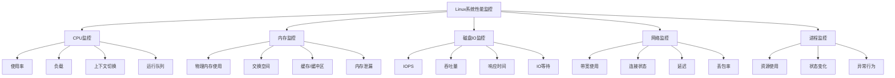
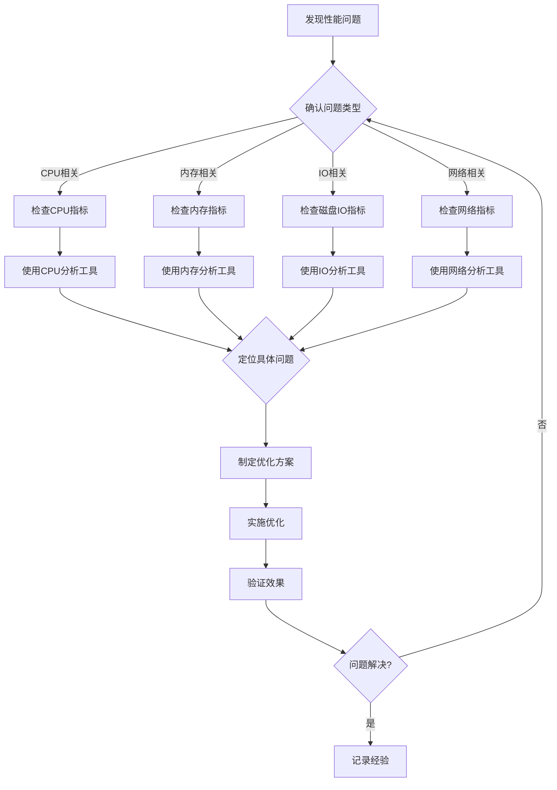

# Linux系统性能监控与分析

本章节将全面介绍Linux系统性能监控与分析的核心知识，从基础的性能指标解析到高级的瓶颈定位流程，帮助您掌握系统性能优化的理论与实践技能。无论您是系统管理员、开发工程师还是运维人员，这里的内容都将为您提供系统性能分析的完整知识体系。

## 内容概览

### 基础理论

#### [系统性能指标解析](./01-系统性能指标解析.md)

详细解读CPU、内存、磁盘IO、网络等关键性能指标，建立性能分析的基础认知。本节内容包括各项指标的定义、计算方法和正常范围，解释了指标异常时可能的原因及影响，并提供了不同场景下的指标解读方法。通过学习，您将能够准确理解各类监控数据的含义，为后续的性能分析打下坚实基础。

#### [Linux内核性能子系统](./02-Linux内核性能子系统.md)

深入探讨Linux内核中与性能相关的关键子系统及其工作原理。本节详细介绍了进程调度器、内存管理、文件系统、网络协议栈等核心子系统的设计理念和实现机制，分析了它们对系统性能的影响因素和调优参数。通过理解这些底层机制，您将能够从根本上把握系统性能的决定因素，为精准优化提供理论支持。

#### [监控数据采集原理](./03-监控数据采集原理.md)

剖析系统性能数据的来源、采集方式及其背后的技术原理。本节讲解了/proc文件系统、sysfs、perf_events等Linux性能数据源的工作机制，介绍了各种监控工具的数据采集方法和精度考量，以及采样与计数器技术的原理与应用。通过学习，您将了解监控数据的可靠性和局限性，能够选择合适的数据源进行性能分析。

### 分析方法

#### [性能瓶颈分析方法论](./04-性能瓶颈分析方法论.md)

介绍系统性能分析的科学方法论和思维模型。本节系统讲解了USE方法(利用率-饱和度-错误)、RED方法(请求率-错误率-延迟)等经典分析框架，提供了从问题现象到根因的推导流程和验证方法。同时，介绍了性能分析中的常见误区和科学的分析思路，帮助您建立系统化的性能问题诊断能力。

#### [系统负载评估模型](./05-系统负载评估模型.md)

解析系统负载的评估标准和模型，帮助准确判断系统状态。本节详细讲解了负载平均值(Load Average)的计算原理和解读方法，分析了CPU密集型、IO密集型和混合型负载的特征与区分方法，介绍了系统饱和点的判定标准和容量规划模型。通过学习，您将能够准确评估系统的健康状态和性能边界，为资源规划提供科学依据。

### 监控工具

#### [系统负载监控工具使用](./06-系统负载监控工具使用.md)

详解uptime、top、htop等系统负载监控工具的使用方法。本节全面介绍了这些工具的功能特点、参数选项和输出解读，提供了实用的监控技巧和常见问题的排查方法。通过丰富的实例演示，您将掌握如何使用这些工具快速获取系统负载状况，识别潜在的性能问题。

#### [CPU性能分析与优化](./07-CPU性能分析与优化.md)

全面介绍CPU性能分析工具及优化技术。本节详细讲解了mpstat、pidstat、perf等CPU性能分析工具的使用方法，分析了CPU使用率、上下文切换、运行队列等关键指标的含义，并提供了针对不同CPU瓶颈的优化策略和实践案例。通过学习，您将能够精准定位CPU性能问题并实施有效的优化措施。

#### [内存使用监控与管理](./08-内存使用监控与管理.md)

深入讲解内存监控工具和内存管理优化策略。本节系统介绍了free、vmstat、pmap等内存监控工具的使用方法，解析了物理内存、虚拟内存、交换空间等概念及其监控指标，并提供了内存泄漏检测、OOM问题排查和内存优化的实用技术。通过学习，您将掌握内存资源管理的核心知识和优化方法。

#### [磁盘IO性能分析工具](./09-磁盘IO性能分析工具.md)

详细介绍磁盘IO性能分析工具及其应用场景。本节全面讲解了iostat、iotop、blktrace等IO监控工具的使用方法，分析了IOPS、吞吐量、响应时间等关键指标的含义和评估标准，并提供了针对不同存储设备和IO模式的优化策略。通过学习，您将能够准确识别IO瓶颈并采取有效的优化措施。

#### [网络流量监控方法](./10-网络流量监控方法.md)

系统讲解网络性能监控工具和分析技术。本节详细介绍了netstat、ss、iftop、tcpdump等网络监控工具的使用方法，解析了带宽利用率、连接状态、延迟、丢包率等关键指标的含义，并提供了网络瓶颈诊断和优化的实用技术。通过学习，您将掌握网络性能分析的专业方法和问题排查技能。

#### [综合性能监控工具应用](./11-综合性能监控工具应用.md)

介绍集成多种监控功能的综合性工具及其应用。本节详细讲解了sysstat、Glances、nmon等综合性能监控工具的特点和使用方法，分析了它们在不同场景下的适用性和优势，并提供了数据可视化和长期趋势分析的实用技术。通过学习，您将能够选择合适的工具构建全面的系统监控方案。

### 实践应用

#### [构建简易系统监控平台](./12-构建简易系统监控平台.md)

指导如何搭建自己的系统监控平台。本节详细介绍了Prometheus、Grafana等开源监控工具的安装配置和基本使用方法，提供了监控指标的采集、存储、可视化的完整实施方案，并讲解了告警规则的设置和通知机制的配置。通过实践，您将能够构建一个功能完善的系统监控平台，实现对多服务器的集中监控和管理。

#### [性能瓶颈定位流程](./13-性能瓶颈定位流程.md)

提供完整的性能问题排查流程和实战案例分析。本节系统讲解了从症状识别到根因确认的性能问题排查方法论，提供了CPU密集型、内存泄漏、IO瓶颈、网络延迟等典型性能问题的诊断流程和解决方案。通过多个实战案例的详细分析，您将掌握系统性能问题的科学排查思路和实用技巧。

## Linux系统性能监控体系

以下是Linux系统性能监控的整体架构图，展示了各个监控领域及其关系：

## 性能分析流程

下面是一个标准的性能问题分析流程：

## 常用监控工具对比

| 监控领域 | 工具名称 | 主要功能 | 适用场景 |
|---------|---------|---------|---------|
| 系统负载 | uptime | 显示系统负载平均值 | 快速检查系统负载状况 |
| 系统负载 | top/htop | 实时显示系统资源使用情况 | 交互式监控系统整体状态 |
| CPU | mpstat | 显示每个CPU的详细统计信息 | 多核CPU性能分析 |
| CPU | pidstat | 显示进程的CPU使用情况 | 进程级CPU使用分析 |
| CPU | perf | 系统性能分析器，支持CPU性能计数器 | 深入分析CPU性能瓶颈 |
| 内存 | free | 显示系统内存使用情况 | 快速检查内存使用状况 |
| 内存 | vmstat | 显示虚拟内存统计信息 | 监控内存使用和交换活动 |
| 内存 | pmap | 显示进程的内存映射 | 分析进程内存使用详情 |
| 磁盘IO | iostat | 显示存储设备IO统计信息 | 监控磁盘IO性能 |
| 磁盘IO | iotop | 显示进程的IO使用情况 | 识别IO密集型进程 |
| 磁盘IO | blktrace | 块设备IO层跟踪工具 | 深入分析IO栈性能 |
| 网络 | netstat/ss | 显示网络连接、路由表等 | 监控网络连接状态 |
| 网络 | iftop | 显示网络带宽使用情况 | 监控实时网络流量 |
| 网络 | tcpdump | 网络数据包分析工具 | 深入分析网络通信问题 |
| 综合 | sysstat | 系统性能工具集合 | 全面的系统性能监控 |
| 综合 | Glances | 跨平台系统监控工具 | 单一界面监控多种资源 |
| 综合 | Prometheus+Grafana | 监控系统和时序数据库+可视化平台 | 构建企业级监控平台 |

通过系统学习本章节内容，您将能够全面掌握Linux系统性能监控与分析的理论知识和实践技能，从容应对各类系统性能挑战。无论是日常系统维护、性能优化，还是故障排查，这里的知识都将为您提供有力支持。