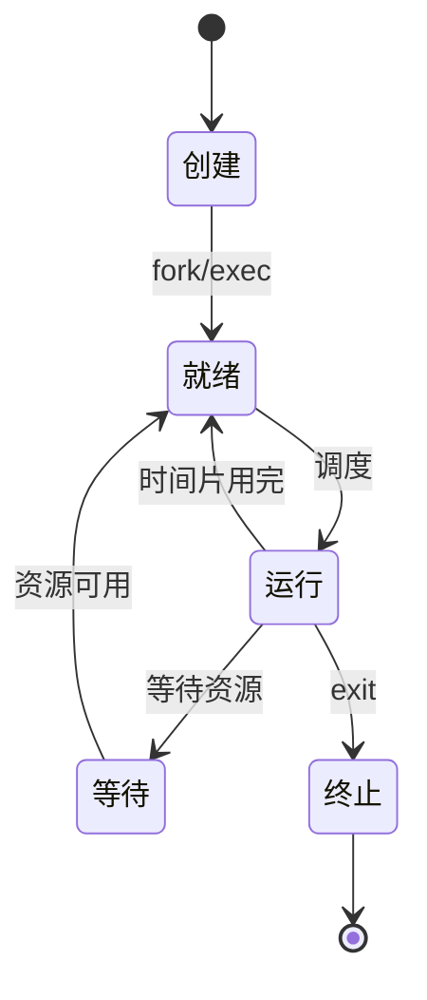

我将为您编写关于进程控制与信号处理的详细内容。

---
title: 进程控制与信号处理
icon: control
order: 7
---

# 进程控制与信号处理

进程控制是系统管理的核心内容，而信号是控制进程的主要方式之一。本文将详细介绍Linux系统中的进程控制方法和信号处理机制，包括进程的启动、终止、暂停和恢复，以及各种信号的含义和使用场景，帮助用户有效管理系统进程。

## 进程基础

### 什么是进程

进程是程序的执行实例，是操作系统分配资源的基本单位。每个进程都有自己的地址空间、程序计数器、寄存器集合和状态信息。

### 进程状态

Linux系统中的进程主要有以下几种状态：

- **运行态(R - Running)**：进程正在执行或等待CPU调度
- **睡眠态(S - Sleeping)**：进程正在等待某个事件或资源
- **不可中断睡眠态(D - Uninterruptible Sleep)**：进程正在等待I/O操作完成
- **停止态(T - Stopped)**：进程被暂停执行
- **僵尸态(Z - Zombie)**：进程已终止，但其父进程尚未调用wait()回收其资源



## 进程控制命令

### 查看进程

#### ps命令

`ps`命令是查看当前系统进程状态的主要工具：

```bash
# 查看所有进程
ps -ef

# 查看详细信息
ps aux

# 以树状结构显示进程
ps -ejH
```

#### top命令

`top`命令提供了实时的系统进程监控：

```bash
# 基本用法
top

# 按内存排序
top -o %MEM

# 只显示特定用户的进程
top -u username
```

### 进程控制

#### 启动进程

在Linux中启动进程的常见方式：

```bash
# 前台启动
command

# 后台启动
command &

# 使用nohup防止终端关闭时进程被终止
nohup command &
```

#### 终止进程

```bash
# 通过PID终止进程
kill PID

# 强制终止
kill -9 PID

# 通过进程名终止
pkill process_name

# 终止所有用户的特定进程
killall process_name
```

#### 暂停和恢复进程

```bash
# 暂停进程
kill -STOP PID

# 恢复进程
kill -CONT PID
```

## 信号处理

### 什么是信号

信号是Linux系统中用于进程间通信的一种机制，也是操作系统通知进程发生事件的方式。信号可以看作是软件中断，当进程收到信号时，会暂停当前执行的任务，转而执行信号处理程序。

### 常见信号

| 信号名称 | 信号编号 | 描述 | 默认行为 |
|---------|---------|------|---------|
| SIGHUP | 1 | 挂起信号，通常用于通知进程重新加载配置 | 终止进程 |
| SIGINT | 2 | 中断信号，通常由Ctrl+C触发 | 终止进程 |
| SIGQUIT | 3 | 退出信号，通常由Ctrl+\触发 | 终止进程并生成core文件 |
| SIGKILL | 9 | 强制终止信号，无法被捕获或忽略 | 终止进程 |
| SIGTERM | 15 | 终止信号，可以被捕获和处理 | 终止进程 |
| SIGSTOP | 19 | 停止信号，无法被捕获或忽略 | 暂停进程 |
| SIGCONT | 18 | 继续信号，使暂停的进程恢复执行 | 恢复进程 |
| SIGUSR1 | 10 | 用户自定义信号1 | 终止进程 |
| SIGUSR2 | 12 | 用户自定义信号2 | 终止进程 |

### 发送信号

使用`kill`命令发送信号：

```bash
# 发送SIGTERM信号
kill PID

# 发送特定信号
kill -SIGNAL PID
# 或
kill -SIGNAL_NUMBER PID

# 例如：发送SIGHUP信号
kill -HUP PID
# 或
kill -1 PID
```

### 在程序中处理信号

在Shell脚本中处理信号：

```bash
#!/bin/bash

# 定义信号处理函数
cleanup() {
    echo "捕获到SIGINT信号，正在清理..."
    # 执行清理操作
    exit 1
}

# 注册信号处理函数
trap cleanup SIGINT

echo "脚本正在运行，按Ctrl+C发送SIGINT信号"
while true; do
    sleep 1
done
```

在C程序中处理信号：

```c
#include <stdio.h>
#include <signal.h>
#include <unistd.h>

// 信号处理函数
void signal_handler(int signum) {
    printf("捕获到信号 %d\n", signum);
    if (signum == SIGINT) {
        printf("这是SIGINT信号，通常由Ctrl+C触发\n");
    }
}

int main() {
    // 注册信号处理函数
    signal(SIGINT, signal_handler);
    
    printf("程序运行中，按Ctrl+C发送SIGINT信号\n");
    
    // 保持程序运行
    while(1) {
        sleep(1);
    }
    
    return 0;
}
```

## 进程优先级管理

### nice和renice命令

Linux系统允许通过调整进程的优先级来控制CPU资源分配：

```bash
# 以较低优先级启动进程（nice值范围：-20到19，值越大优先级越低）
nice -n 10 command

# 调整运行中进程的优先级
renice +5 -p PID
```

## 进程资源限制

### ulimit命令

`ulimit`命令用于控制shell及其启动的进程可用资源的限制：

```bash
# 查看当前限制
ulimit -a

# 设置最大打开文件数
ulimit -n 4096

# 设置最大进程数
ulimit -u 1024
```

## 进程监控与分析

### 使用pgrep查找进程

```bash
# 根据进程名查找PID
pgrep process_name

# 显示匹配进程的详细信息
pgrep -l process_name
```

### 使用lsof查看进程打开的文件

```bash
# 查看特定进程打开的所有文件
lsof -p PID

# 查看哪些进程打开了特定文件
lsof /path/to/file
```

### 使用strace跟踪系统调用

```bash
# 跟踪新启动进程的系统调用
strace command

# 跟踪已运行进程的系统调用
strace -p PID
```

## 实际应用场景

### 守护进程管理

守护进程是在后台运行的特殊进程，通常用于提供系统服务：

```bash
# 使用systemd启动服务
systemctl start service_name

# 停止服务
systemctl stop service_name

# 重启服务
systemctl restart service_name

# 查看服务状态
systemctl status service_name
```

### 处理僵尸进程

僵尸进程是已终止但其父进程未调用wait()回收的进程：

```bash
# 查找僵尸进程
ps aux | grep 'Z'

# 如果父进程无响应，可以尝试终止父进程
kill parent_pid
```

### 批量进程控制

```bash
# 终止所有匹配的进程
pkill -f "pattern"

# 向所有Java进程发送SIGTERM信号
pkill -TERM java
```

## 最佳实践

1. **优雅终止**：尽量使用SIGTERM而非SIGKILL，给进程机会清理资源
2. **避免僵尸进程**：确保父进程正确处理子进程的终止
3. **资源限制**：为关键服务设置适当的资源限制，防止单个进程耗尽系统资源
4. **信号处理**：在程序中实现信号处理程序，确保程序能够优雅地响应各种信号
5. **日志记录**：记录进程的启动、终止和异常情况，便于问题排查

通过掌握进程控制和信号处理的基本知识，系统管理员和开发人员可以更有效地管理系统资源，确保服务的稳定运行，并在出现问题时快速定位和解决。