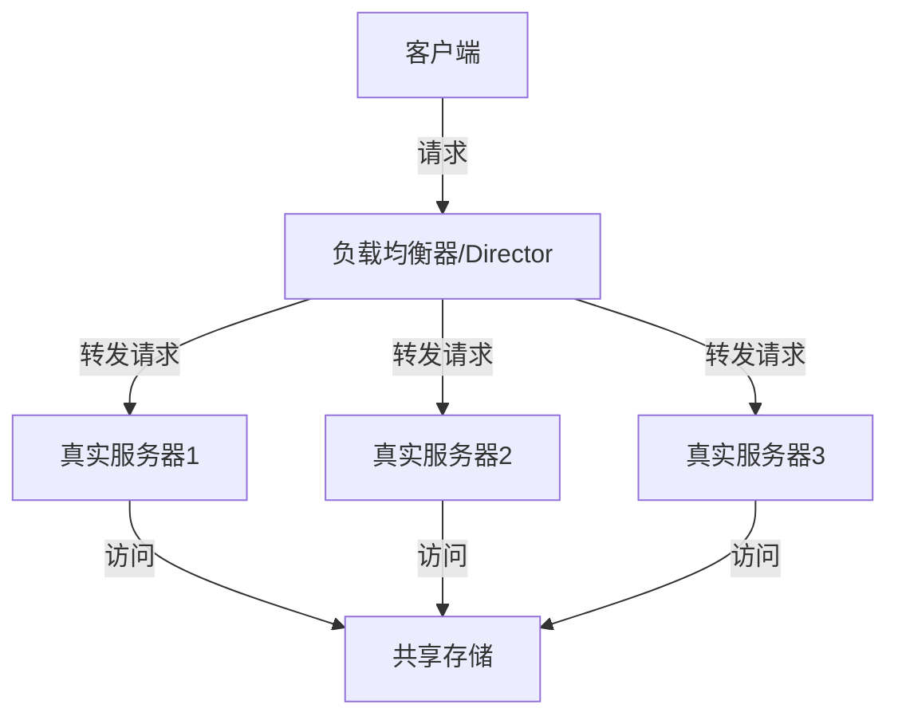
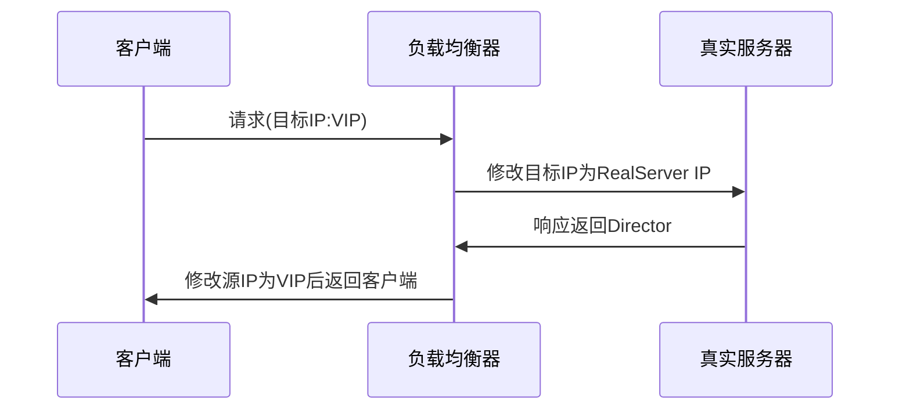
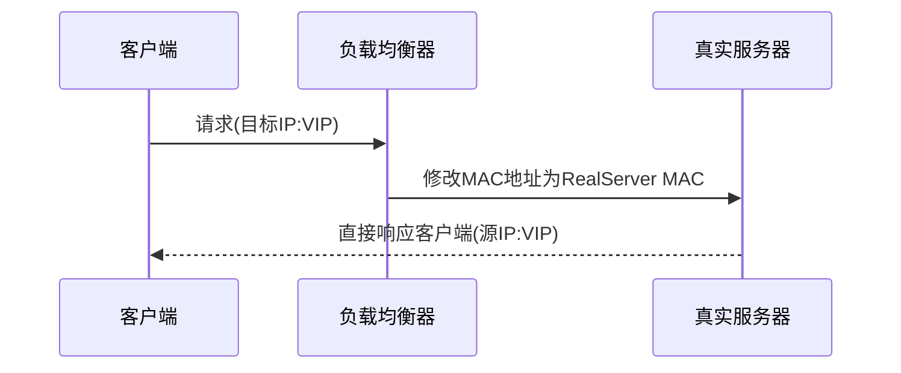
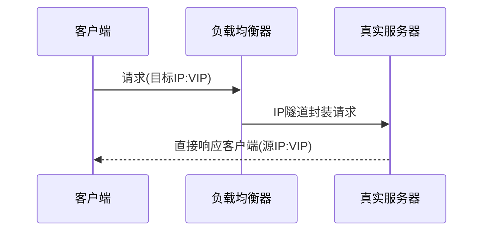
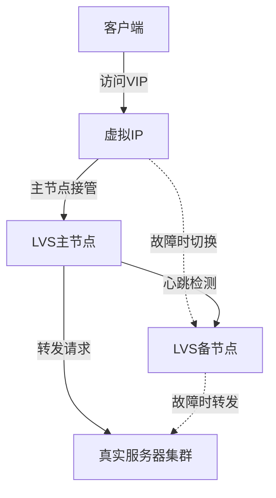
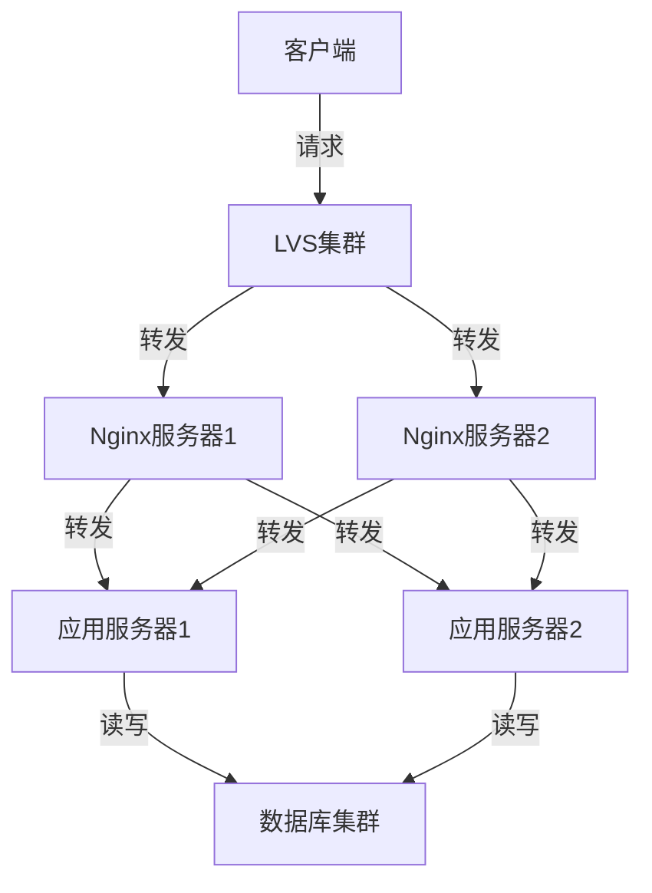

# LVS原理与工作模式详解

---
title: LVS原理与工作模式详解
icon: theory
order: 3
---

# LVS原理与工作模式详解

LVS(Linux Virtual Server)是Linux平台下最流行的负载均衡解决方案之一，通过在内核层实现IP负载均衡技术，提供高性能、高可用的服务。本文将详细介绍LVS的工作原理、架构组成和三种主要工作模式，帮助读者深入理解LVS技术的核心机制。

## LVS简介

LVS是章文嵩博士开发的基于Linux内核的开源负载均衡项目，它通过IPVS(IP Virtual Server)模块实现，IPVS是运行在内核空间的负载均衡调度器，可以将对虚拟服务的请求转发到真实服务器上。

### LVS的核心组件

LVS系统主要由两部分组成：

1. **IPVS (IP Virtual Server)**：运行在内核空间的负载均衡调度器，直接对网络数据包进行操作。
2. **IPVSADM**：运行在用户空间的管理工具，用于配置IPVS。

### LVS的优势

- **高性能**：工作在网络层(TCP/IP)，直接处理IP数据包，性能极高
- **可靠性**：基于Linux内核实现，稳定可靠
- **可扩展性**：支持多种负载均衡算法和工作模式
- **透明性**：对客户端和服务器都是透明的

## LVS的基本架构

LVS的基本架构由三个部分组成：

1. **负载均衡器(Director Server)**：运行IPVS模块的服务器，负责接收客户端请求并转发到真实服务器
2. **真实服务器(Real Server)**：提供实际服务的服务器集群
3. **共享存储(Shared Storage)**：可选组件，用于保存真实服务器的数据，确保数据一致性

## LVS的工作原理

LVS的工作原理基于IP虚拟服务器技术，通过NAT、IP隧道或直接路由等方式将客户端的请求转发到后端真实服务器。

### 基本工作流程

1. 客户端向LVS的VIP(虚拟IP)发送请求
2. LVS接收到请求后，根据配置的调度算法选择一台真实服务器
3. LVS将请求转发到选定的真实服务器
4. 真实服务器处理请求并返回结果
5. 根据不同的工作模式，响应可能直接返回给客户端或通过LVS返回

## LVS的三种工作模式

LVS主要有三种工作模式：NAT模式、DR模式和TUN模式，每种模式各有优缺点，适用于不同的场景。

### 1. NAT模式 (Network Address Translation)

NAT模式通过网络地址转换技术实现负载均衡，所有的请求和响应都需要经过Director服务器。

#### 工作流程

1. 客户端向Director的VIP发送请求
2. Director收到请求后，修改数据包的目标IP为选中的Real Server的IP
3. Real Server处理请求后，将响应发回给Director
4. Director修改响应包的源IP为VIP，发送给客户端

#### 优点

- 配置简单，真实服务器可以使用任何操作系统
- 真实服务器可以使用私有IP地址，节省公网IP资源
- 支持端口映射，可以将一个服务映射到不同端口

#### 缺点

- 所有请求和响应都经过Director，容易成为性能瓶颈
- 扩展性受限，通常适用于中小型网站
- Director负载较重，需要处理大量数据包的转发

### 2. DR模式 (Direct Routing)

DR模式是LVS中性能最高的模式，通过直接路由方式实现负载均衡，请求经过Director，但响应直接从Real Server返回给客户端。

#### 工作流程

1. 客户端向Director的VIP发送请求
2. Director收到请求后，不修改IP地址，而是修改数据包的MAC地址为选中的Real Server的MAC地址
3. 请求直接发送到Real Server(因为在同一个局域网内)
4. Real Server处理请求后，直接将响应发送给客户端(因为Real Server也配置了VIP)

#### 优点

- 性能极高，Director只处理入站请求，出站响应直接由Real Server处理
- 扩展性好，适合处理大型网站的负载均衡
- Director负载较轻，主要进行调度决策

#### 缺点

- 所有服务器(Director和Real Server)必须在同一个物理网络中
- Real Server需要配置VIP(通常配置在lo:0虚拟接口上)
- 不支持端口映射
- 配置相对复杂，Real Server需要特殊配置以避免ARP问题

### 3. TUN模式 (IP Tunneling)

TUN模式通过IP隧道技术实现负载均衡，请求经过Director，响应直接从Real Server返回给客户端。

#### 工作流程

1. 客户端向Director的VIP发送请求
2. Director收到请求后，用IP隧道技术封装原始请求包，将目标地址设为选中的Real Server的IP
3. Real Server收到封装的数据包后，解封装并处理请求
4. Real Server处理完请求后，直接将响应发送给客户端

#### 优点

- 性能高，响应直接从Real Server返回给客户端
- Real Server可以跨网段部署，地理位置可以分散
- 扩展性好，适合地理分布式的集群

#### 缺点

- Real Server必须支持IP隧道功能
- 配置复杂，需要特殊的网络配置
- 不支持端口映射
- Real Server需要配置公网IP地址

## LVS的调度算法

LVS支持多种调度算法，用于决定将请求转发到哪台真实服务器：

1. **轮询(Round Robin)**：按顺序将请求依次分配给每台服务器
2. **加权轮询(Weighted Round Robin)**：根据服务器权重分配请求
3. **最少连接(Least Connection)**：将请求分配给当前连接数最少的服务器
4. **加权最少连接(Weighted Least Connection)**：结合服务器权重和当前连接数分配请求
5. **源地址哈希(Source Hashing)**：根据客户端IP的哈希值分配请求，保证同一客户端的请求总是发送到同一服务器
6. **目标地址哈希(Destination Hashing)**：根据目标地址的哈希值分配请求

## LVS的高可用配置

为了避免LVS负载均衡器成为单点故障，通常会配置LVS的高可用方案，最常用的是LVS+Keepalived组合：

Keepalived通过VRRP协议实现虚拟路由冗余，当主节点故障时，备节点会自动接管VIP，确保服务的连续性。

## LVS与其他负载均衡技术的对比

| 特性 | LVS | Nginx | HAProxy |
|------|-----|-------|---------|
| 工作层次 | 网络层(4层) | 应用层(7层) | 传输层(4层)/应用层(7层) |
| 性能 | 极高 | 高 | 高 |
| 功能 | 简单，仅负载均衡 | 丰富，包括反向代理、缓存等 | 丰富，专注于负载均衡 |
| 配置复杂度 | 中等 | 简单 | 中等 |
| 会话保持 | 支持(IP绑定) | 支持(Cookie) | 支持(多种方式) |
| 健康检查 | 简单 | 丰富 | 丰富 |

## 实际应用场景

### 大型网站架构

在大型网站架构中，通常采用LVS+Nginx的组合：
- LVS作为前端负载均衡器，处理高并发的TCP连接
- Nginx作为中间层，提供HTTP层的负载均衡和缓存功能
- 后端是实际的应用服务器集群

### 电子商务平台

电子商务平台通常采用DR模式的LVS，以处理高并发的购物请求：

- 前端使用LVS DR模式实现高性能负载均衡
- 中间层使用应用服务器集群处理业务逻辑
- 后端使用分布式数据库和缓存系统

## 总结

LVS作为Linux下高性能的负载均衡解决方案，通过其三种工作模式(NAT、DR、TUN)可以适应不同的网络环境和业务需求。在实际应用中，需要根据具体场景选择合适的工作模式和调度算法，并结合Keepalived等高可用方案，构建稳定、高效的负载均衡系统。

- NAT模式适合小型网站和内部系统，配置简单但性能有限
- DR模式适合大型网站和高性能要求的场景，性能最佳但要求所有服务器在同一网段
- TUN模式适合地理分布式的集群，可以跨网段部署但配置较复杂

随着云计算和容器技术的发展，LVS也在不断演进，与Kubernetes等容器编排平台结合，为现代微服务架构提供高性能的负载均衡支持。