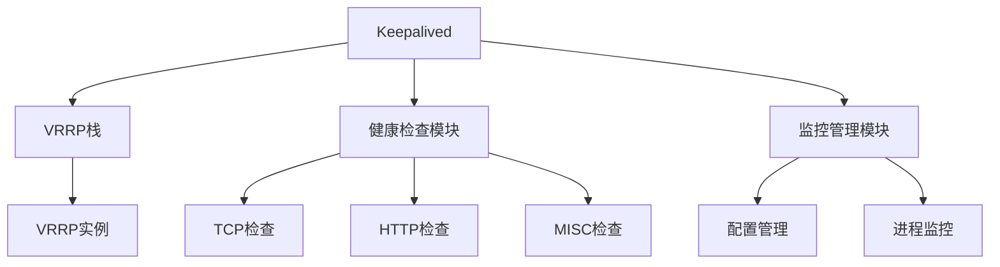
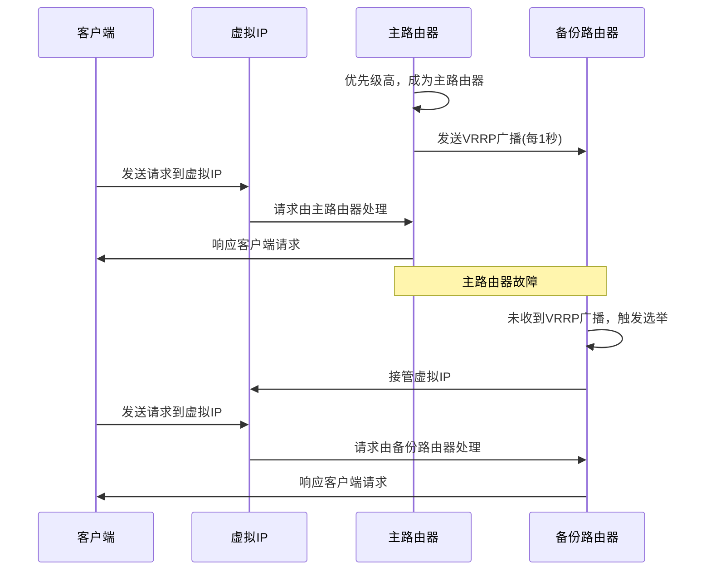
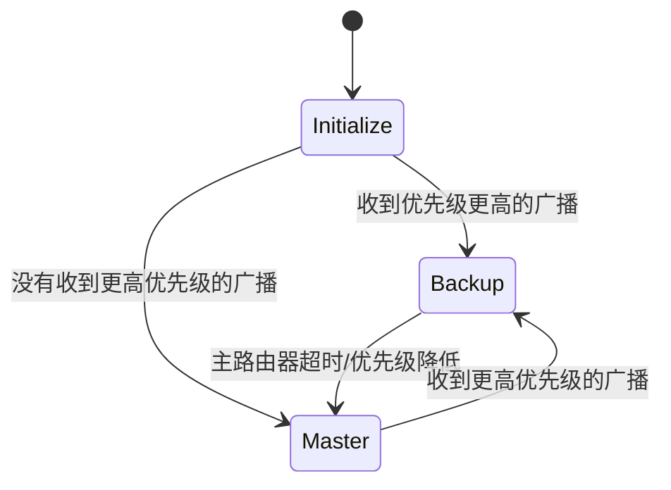
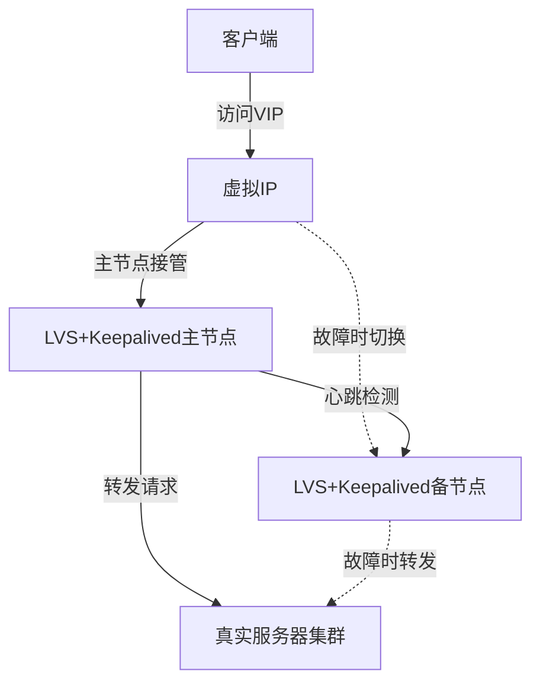
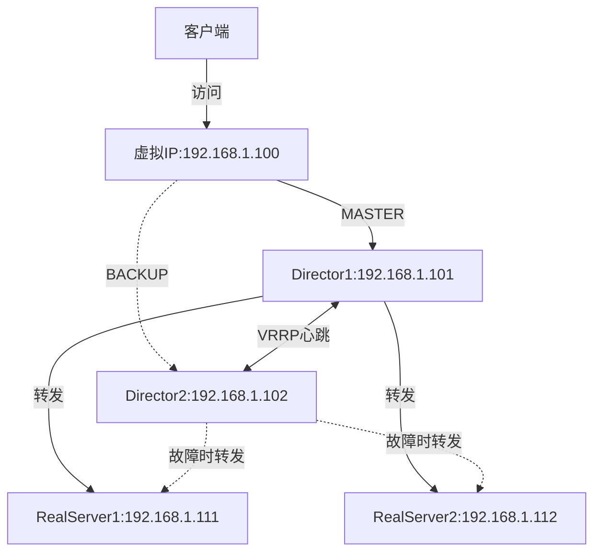

# Keepalived架构与VRRP协议

Keepalived是一个用于实现高可用性的开源软件，通过VRRP协议实现负载均衡器的故障转移，确保服务的连续性。本文将详细介绍Keepalived的架构设计、VRRP协议原理和工作机制，帮助读者理解高可用集群的核心技术。

## Keepalived简介

Keepalived是一个基于VRRP协议的高可用解决方案，主要用于实现负载均衡器、路由器等关键网络设备的故障转移，防止单点故障导致的服务中断。它最初设计用于LVS集群系统，后来发展成为一个独立的、功能丰富的高可用软件。

### Keepalived的主要功能

1. **高可用性(HA)** - 通过VRRP协议实现服务器故障自动切换
2. **负载均衡** - 内置对LVS的支持，可配置健康检查和负载均衡规则
3. **健康检查** - 支持多种检查方式，确保服务的可用性
4. **动态配置** - 支持在不中断服务的情况下动态调整配置

### Keepalived的应用场景

- Web服务器集群的高可用
- 数据库服务器的主备切换
- 负载均衡器(如LVS、HAProxy)的冗余备份
- 网关路由器的故障转移

## Keepalived的架构设计

Keepalived采用模块化设计，主要由三个核心模块组成：VRRP栈、健康检查和监控管理。



### 1. VRRP栈

VRRP栈是Keepalived的核心组件，负责实现VRRP协议，管理虚拟路由器和IP资源。它处理VRRP数据包的发送和接收，维护VRRP状态机，实现主备节点之间的状态转换。

### 2. 健康检查模块

健康检查模块负责监控网络服务的可用性，支持多种检查方式：

- **Layer3检查**：ICMP检查，通过ping测试目标是否可达
- **Layer4检查**：TCP连接检查，尝试建立TCP连接验证服务可用性
- **Layer5-7检查**：应用层检查，如HTTP、SMTP、MySQL等协议的特定检查
- **MISC检查**：自定义脚本检查，可执行外部脚本进行复杂逻辑检查

### 3. 监控管理模块

监控管理模块负责Keepalived自身的管理，包括配置解析、进程监控、日志记录等功能，确保Keepalived服务的稳定运行。

## VRRP协议详解

VRRP(Virtual Router Redundancy Protocol，虚拟路由器冗余协议)是一种网络协议，定义在RFC 3768(VRRPv2)和RFC 5798(VRRPv3)中，用于实现路由器或负载均衡器的高可用性。

### VRRP的基本概念

1. **虚拟路由器(Virtual Router)**：由一组路由器组成的逻辑单元，对外表现为一个具有唯一虚拟IP地址的路由器
2. **VRID(Virtual Router Identifier)**：虚拟路由器的标识符，范围为0-255
3. **主路由器(Master Router)**：负责转发数据包的活动路由器
4. **备份路由器(Backup Router)**：监控主路由器状态，准备在主路由器故障时接管服务
5. **优先级(Priority)**：决定路由器在虚拟路由器中的角色，范围为0-255，值越大优先级越高
6. **抢占模式(Preemption)**：当高优先级的路由器恢复时，是否抢占当前的主路由器角色

### VRRP工作原理

VRRP通过选举机制确定虚拟路由器中的主路由器，主路由器负责响应发送到虚拟IP的请求，备份路由器则监控主路由器的状态。



### VRRP数据包格式

VRRP协议使用IP协议号112，数据包格式如下：

```
 0                   1                   2                   3
 0 1 2 3 4 5 6 7 8 9 0 1 2 3 4 5 6 7 8 9 0 1 2 3 4 5 6 7 8 9 0 1
+-+-+-+-+-+-+-+-+-+-+-+-+-+-+-+-+-+-+-+-+-+-+-+-+-+-+-+-+-+-+-+-+
|Version| Type  | Virtual Rtr ID|   Priority    | Count IP Addrs|
+-+-+-+-+-+-+-+-+-+-+-+-+-+-+-+-+-+-+-+-+-+-+-+-+-+-+-+-+-+-+-+-+
|   Auth Type   |   Adver Int   |          Checksum             |
+-+-+-+-+-+-+-+-+-+-+-+-+-+-+-+-+-+-+-+-+-+-+-+-+-+-+-+-+-+-+-+-+
|                         IP Address (1)                        |
+-+-+-+-+-+-+-+-+-+-+-+-+-+-+-+-+-+-+-+-+-+-+-+-+-+-+-+-+-+-+-+-+
|                            .                                  |
|                            .                                  |
|                            .                                  |
+-+-+-+-+-+-+-+-+-+-+-+-+-+-+-+-+-+-+-+-+-+-+-+-+-+-+-+-+-+-+-+-+
|                         IP Address (n)                        |
+-+-+-+-+-+-+-+-+-+-+-+-+-+-+-+-+-+-+-+-+-+-+-+-+-+-+-+-+-+-+-+-+
|                     Authentication Data (1)                   |
+-+-+-+-+-+-+-+-+-+-+-+-+-+-+-+-+-+-+-+-+-+-+-+-+-+-+-+-+-+-+-+-+
|                     Authentication Data (2)                   |
+-+-+-+-+-+-+-+-+-+-+-+-+-+-+-+-+-+-+-+-+-+-+-+-+-+-+-+-+-+-+-+-+
```

- **Version**：VRRP版本号
- **Type**：VRRP消息类型，目前只定义了ADVERTISEMENT(1)
- **Virtual Rtr ID**：虚拟路由器标识符(VRID)
- **Priority**：路由器优先级，用于主备选举
- **Count IP Addrs**：IP地址数量
- **Auth Type**：认证类型
- **Adver Int**：VRRP广播间隔(单位：秒)
- **Checksum**：校验和
- **IP Address(1-n)**：虚拟路由器的IP地址列表
- **Authentication Data**：认证数据(VRRPv3已废弃)

### VRRP状态机

VRRP协议定义了三种状态：

1. **初始化状态(Initialize)**：路由器启动时的状态
2. **主状态(Master)**：负责转发数据包的活动状态
3. **备份状态(Backup)**：监控主路由器状态的被动状态



状态转换规则：

- 当路由器启动时，如果优先级最高，它会发送VRRP广播并进入Master状态
- 如果收到优先级更高的VRRP广播，则进入Backup状态
- 在Backup状态下，如果在一定时间内没有收到Master的VRRP广播，则认为Master故障，自己切换为Master状态
- 在Master状态下，如果收到优先级更高的VRRP广播，则切换为Backup状态

## Keepalived的配置与实现

### 基本配置结构

Keepalived的配置文件通常位于`/etc/keepalived/keepalived.conf`，主要包含三个部分：

1. **全局配置(global_defs)**：定义全局参数
2. **VRRP实例配置(vrrp_instance)**：定义VRRP实例参数
3. **虚拟服务器配置(virtual_server)**：定义LVS负载均衡规则(可选)

### 配置示例

以下是一个典型的Keepalived配置示例，实现了一个简单的高可用架构：

```
# 全局配置
global_defs {
   notification_email {
     admin@example.com
   }
   notification_email_from keepalived@example.com
   smtp_server 127.0.0.1
   smtp_connect_timeout 30
   router_id LVS_DEVEL
}

# VRRP实例配置
vrrp_instance VI_1 {
    state MASTER              # 初始状态，MASTER或BACKUP
    interface eth0            # 监听接口
    virtual_router_id 51      # 虚拟路由器ID，同一个VRRP组内必须相同
    priority 100              # 优先级，值越大越优先
    advert_int 1              # VRRP广播间隔(秒)
    authentication {          # 认证信息
        auth_type PASS
        auth_pass 1111
    }
    virtual_ipaddress {       # 虚拟IP地址
        192.168.1.100/24
    }
}

# 虚拟服务器配置(LVS)
virtual_server 192.168.1.100 80 {
    delay_loop 6              # 健康检查间隔(秒)
    lb_algo rr                # 负载均衡算法(轮询)
    lb_kind DR                # LVS模式(DR模式)
    persistence_timeout 50    # 会话保持时间(秒)
    protocol TCP              # 协议类型
    
    real_server 192.168.1.101 80 {
        weight 1              # 权重
        TCP_CHECK {           # TCP健康检查
            connect_timeout 3 # 连接超时时间(秒)
            nb_get_retry 3    # 重试次数
            delay_before_retry 3 # 重试间隔(秒)
        }
    }
    
    real_server 192.168.1.102 80 {
        weight 1
        TCP_CHECK {
            connect_timeout 3
            nb_get_retry 3
            delay_before_retry 3
        }
    }
}
```

### 备份节点配置

备份节点的配置与主节点基本相同，主要区别在于：

1. `state`设置为`BACKUP`
2. `priority`设置为比主节点低的值

```
vrrp_instance VI_1 {
    state BACKUP              # 初始状态为BACKUP
    interface eth0
    virtual_router_id 51
    priority 90               # 优先级比主节点低
    advert_int 1
    authentication {
        auth_type PASS
        auth_pass 1111
    }
    virtual_ipaddress {
        192.168.1.100/24
    }
}
```

## Keepalived高级特性

### 1. 非抢占模式

默认情况下，Keepalived工作在抢占模式，即当优先级高的节点恢复时，会抢占当前的主节点角色。可以通过设置`nopreempt`参数禁用抢占模式：

```
vrrp_instance VI_1 {
    state BACKUP
    nopreempt               # 禁用抢占模式
    ...
}
```

注意：只有初始状态为BACKUP的节点才能设置`nopreempt`参数。

### 2. 脚本追踪

Keepalived可以通过脚本追踪功能动态调整节点优先级，根据外部条件(如服务状态、系统负载等)决定是否进行主备切换：

```
vrrp_script check_nginx {
    script "/usr/bin/check_nginx.sh"   # 检查脚本
    interval 2                         # 执行间隔(秒)
    weight -20                         # 权重调整值
    fall 2                             # 连续失败次数
    rise 1                             # 连续成功次数
}

vrrp_instance VI_1 {
    ...
    track_script {
        check_nginx                    # 引用脚本
    }
    ...
}
```

当脚本执行失败时，节点优先级会减去weight值，可能触发主备切换。

### 3. 接口追踪

Keepalived可以监控网络接口状态，当接口故障时自动降低节点优先级：

```
vrrp_instance VI_1 {
    ...
    track_interface {
        eth0 weight 10                 # 监控eth0接口
        eth1 weight 20                 # 监控eth1接口
    }
    ...
}
```

### 4. 通知脚本

Keepalived可以在状态变化时执行通知脚本，用于记录日志、发送告警等：

```
vrrp_instance VI_1 {
    ...
    notify_master "/usr/local/bin/notify.sh master"   # 成为主节点时执行
    notify_backup "/usr/local/bin/notify.sh backup"   # 成为备份节点时执行
    notify_fault "/usr/local/bin/notify.sh fault"     # 发生故障时执行
    notify "/usr/local/bin/notify.sh"                 # 所有状态变化时执行
    ...
}
```

## Keepalived与LVS的结合应用

Keepalived最常见的应用场景是与LVS结合，实现高可用的负载均衡集群。在这种架构中：

1. Keepalived负责管理虚拟IP和监控LVS服务状态
2. LVS负责实际的负载均衡功能



### 典型部署架构



### 配置示例

主节点配置：

```
global_defs {
   router_id LVS_MASTER
}

vrrp_instance VI_1 {
    state MASTER
    interface eth0
    virtual_router_id 51
    priority 100
    advert_int 1
    authentication {
        auth_type PASS
        auth_pass 1111
    }
    virtual_ipaddress {
        192.168.1.100/24
    }
}

virtual_server 192.168.1.100 80 {
    delay_loop 6
    lb_algo rr
    lb_kind DR
    protocol TCP
    
    real_server 192.168.1.111 80 {
        weight 1
        HTTP_GET {
            url { 
              path /health
              status_code 200
            }
            connect_timeout 3
            nb_get_retry 3
            delay_before_retry 3
        }
    }
    
    real_server 192.168.1.112 80 {
        weight 1
        HTTP_GET {
            url { 
              path /health
              status_code 200
            }
            connect_timeout 3
            nb_get_retry 3
            delay_before_retry 3
        }
    }
}
```

备份节点配置：

```
global_defs {
   router_id LVS_BACKUP
}

vrrp_instance VI_1 {
    state BACKUP
    interface eth0
    virtual_router_id 51
    priority 90
    advert_int 1
    authentication {
        auth_type PASS
        auth_pass 1111
    }
    virtual_ipaddress {
        192.168.1.100/24
    }
}

virtual_server 192.168.1.100 80 {
    delay_loop 6
    lb_algo rr
    lb_kind DR
    protocol TCP
    
    real_server 192.168.1.111 80 {
        weight 1
        HTTP_GET {
            url { 
              path /health
              status_code 200
            }
            connect_timeout 3
            nb_get_retry 3
            delay_before_retry 3
        }
    }
    
    real_server 192.168.1.112 80 {
        weight 1
        HTTP_GET {
            url { 
              path /health
              status_code 200
            }
            connect_timeout 3
            nb_get_retry 3
            delay_before_retry 3
        }
    }
}
```

## Keepalived常见问题与解决方案

### 1. 脑裂问题

脑裂(Split Brain)是指两个节点同时认为自己是主节点的情况，通常由网络故障导致。

**解决方案**：
- 使用多个心跳网络
- 配置fence设备(如STONITH)
- 使用仲裁机制

### 2. 虚拟IP无法绑定

**可能原因**：
- 接口配置问题
- 防火墙阻止VRRP通信
- ARP问题

**解决方案**：
- 检查网络接口配置
- 允许VRRP协议(IP协议号112)通过防火墙
- 调整ARP参数：`net.ipv4.conf.all.arp_ignore`和`net.ipv4.conf.all.arp_announce`

### 3. 频繁切换问题

**可能原因**：
- 网络不稳定
- 优先级配置不合理
- 健康检查过于敏感

**解决方案**：
- 增加`advert_int`值
- 调整健康检查参数
- 使用非抢占模式
- 配置`preempt_delay`延迟抢占

## Keepalived与其他高可用方案的对比

| 特性 | Keepalived | Heartbeat | Corosync+Pacemaker |
|------|------------|-----------|-------------------|
| 复杂度 | 低 | 中 | 高 |
| 功能丰富度 | 中 | 中 | 高 |
| 配置难度 | 简单 | 中等 | 复杂 |
| 资源管理 | 有限 | 有限 | 丰富 |
| 集群规模 | 小(通常2节点) | 中 | 大(支持多节点) |
| 适用场景 | 简单的IP/服务故障转移 | 中小型集群 | 复杂的企业级集群 |

## 总结

Keepalived通过VRRP协议实现了简单高效的高可用性解决方案，特别适合与LVS等负载均衡器结合使用。其核心优势在于：

1. **简单易用** - 配置简单，易于部署和维护
2. **高效可靠** - 基于成熟的VRRP协议，故障检测和切换迅速
3. **功能丰富** - 支持多种健康检查方式和高级特性
4. **无缝集成** - 与LVS等负载均衡器无缝集成

在实际应用中，Keepalived已成为构建高可用网络服务的标准工具之一，广泛应用于Web服务、数据库、负载均衡等场景的高可用架构设计中。通过合理配置Keepalived和VRRP参数，可以构建稳定可靠的高可用系统，有效防止单点故障对业务的影响。