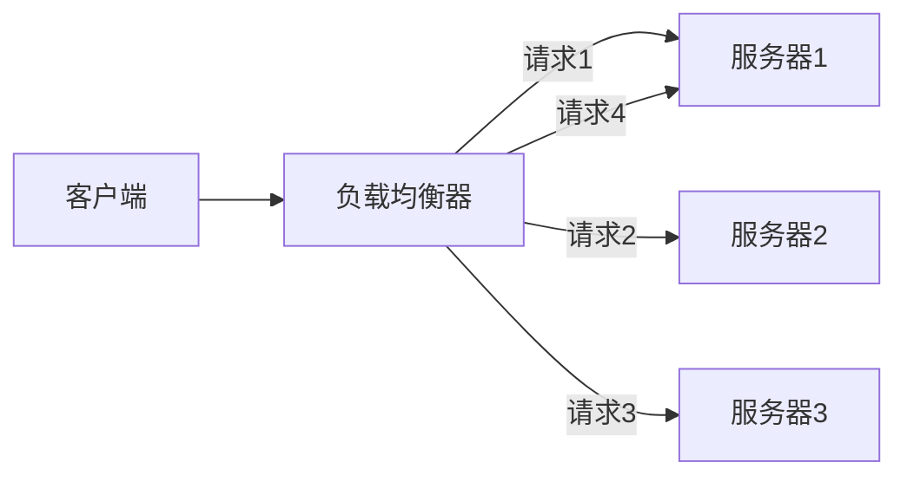
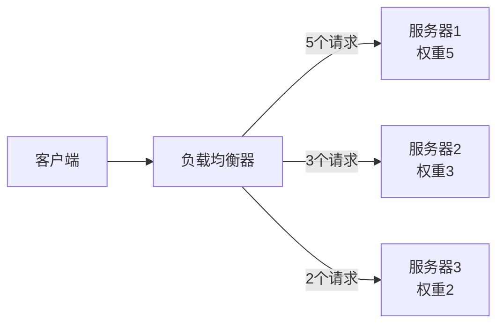
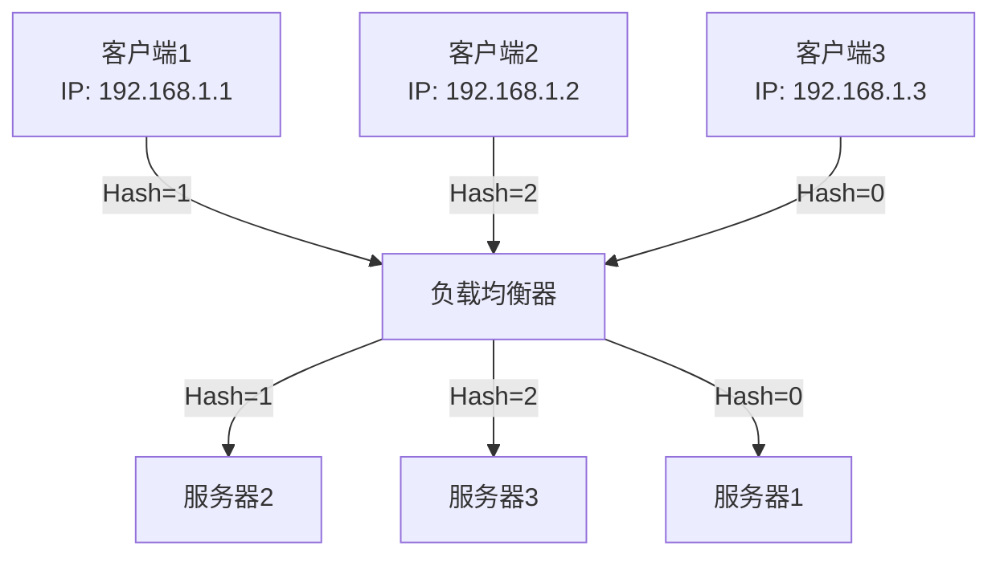
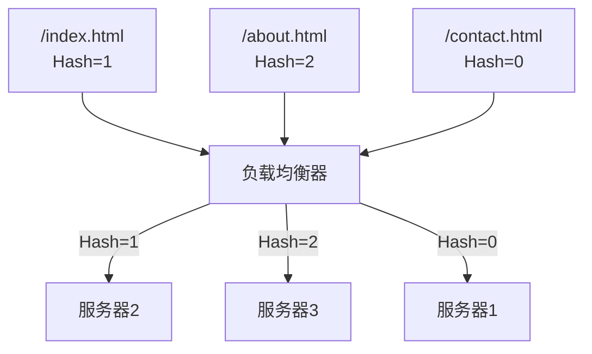
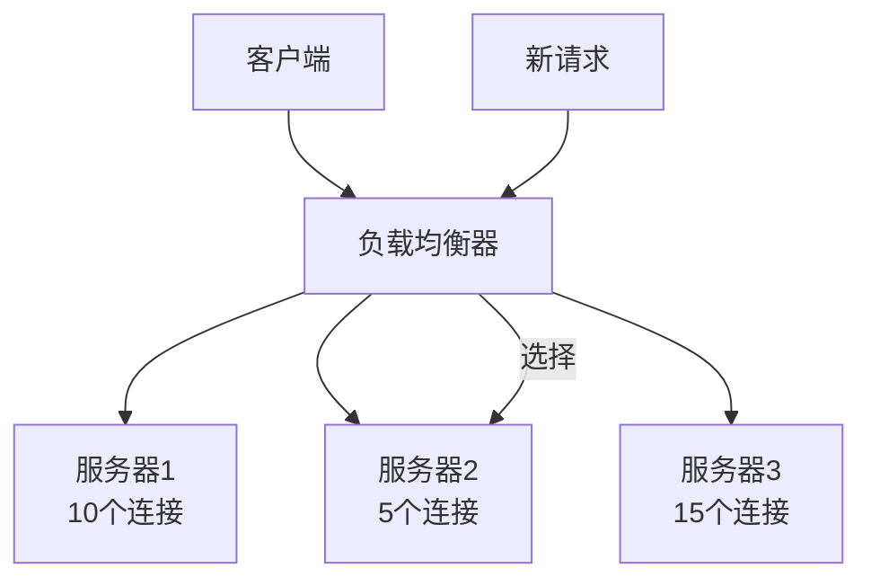
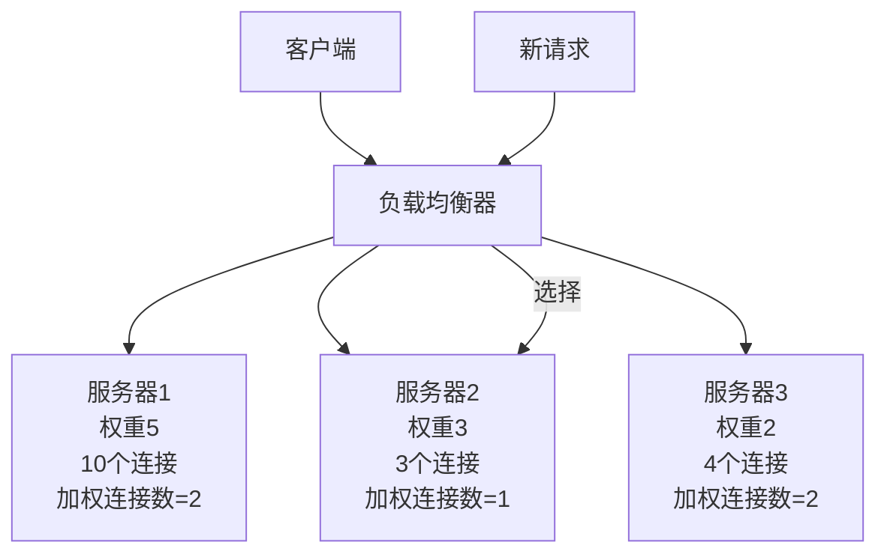
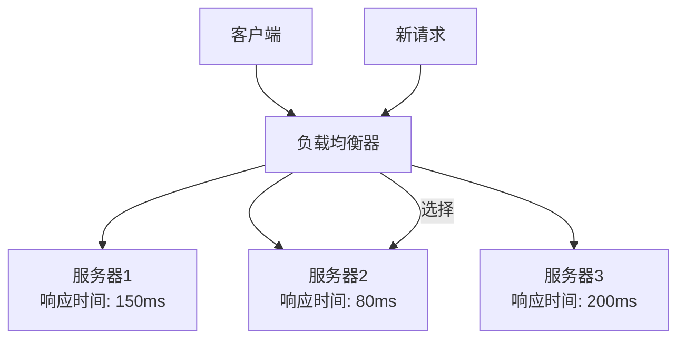
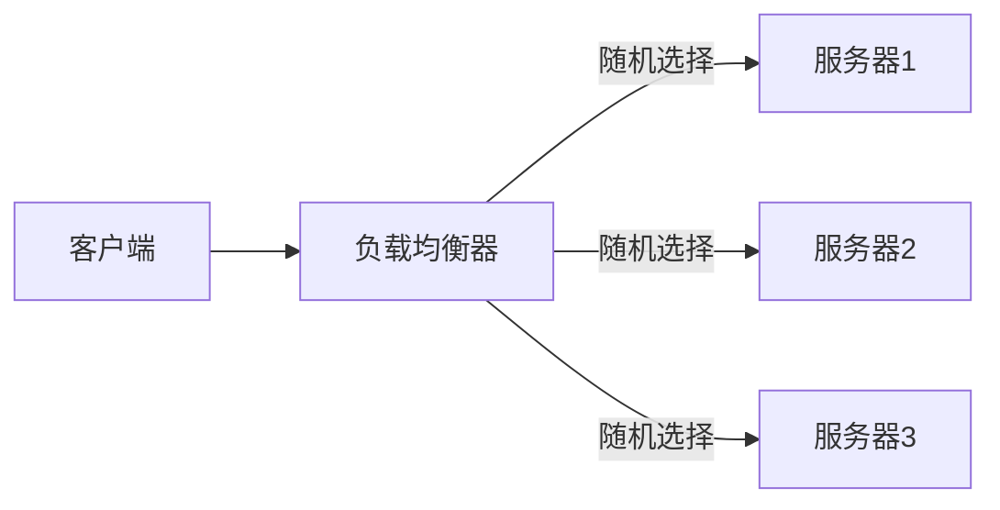
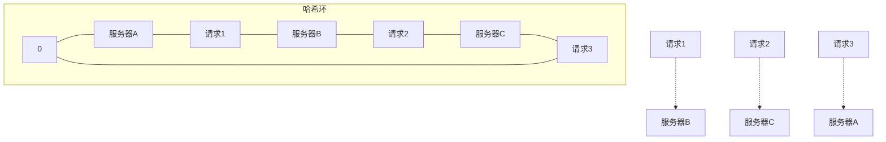
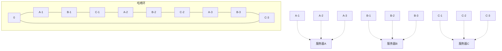

# 负载均衡算法对比分析

负载均衡算法是负载均衡系统的核心组件，不同的算法适用于不同的应用场景和需求。本文将详细介绍常见的负载均衡算法，分析它们的工作原理、优缺点和适用场景，帮助读者选择最适合自己系统的负载均衡策略。

## 负载均衡算法概述

负载均衡算法决定了如何将客户端请求分配到后端服务器，一个好的负载均衡算法应该能够：

1. 公平分配负载，避免某些服务器过载
2. 考虑服务器的处理能力差异
3. 维持会话一致性（当需要时）
4. 具有良好的扩展性和容错性

## 静态负载均衡算法

静态负载均衡算法不考虑服务器的实时状态，根据预设的规则分配请求。这类算法实现简单，开销小，但无法根据服务器的实际负载情况动态调整。

### 1. 轮询算法（Round Robin）

轮询算法是最简单的负载均衡算法，它按顺序将请求依次分配给每台服务器。

#### 工作原理

1. 维护一个服务器列表和一个计数器
2. 每次请求到来时，将计数器加1，然后对服务器数量取模
3. 将请求分配给取模结果对应的服务器



#### 代码示例

```python
class RoundRobinBalancer:
    def __init__(self, servers):
        self.servers = servers
        self.counter = 0
        
    def get_server(self):
        server = self.servers[self.counter % len(self.servers)]
        self.counter += 1
        return server
```

#### 优点

- 实现简单，易于理解
- 公平分配请求，每台服务器接收到的请求数量相同
- 适用于服务器性能相近的场景

#### 缺点

- 不考虑服务器的实际负载和处理能力
- 不考虑请求的复杂度差异
- 可能导致某些服务器过载

#### 适用场景

- 服务器配置相同
- 请求处理时间相近
- 无状态服务，如静态资源服务

### 2. 加权轮询算法（Weighted Round Robin）

加权轮询算法是轮询算法的改进版，考虑了服务器的处理能力差异，为不同服务器分配不同的权重。

#### 工作原理

1. 为每台服务器分配一个权重值，表示其处理能力
2. 按照权重比例分配请求，权重高的服务器处理更多请求



#### 代码示例

```python
class WeightedRoundRobinBalancer:
    def __init__(self, servers, weights):
        self.servers = servers
        self.weights = weights
        self.current_weights = [0] * len(servers)
        self.max_weight = max(weights)
        self.gcd_weight = self._gcd(weights)
        self.cw = 0
        self.pos = -1
        
    def _gcd(self, numbers):
        """计算最大公约数"""
        from math import gcd
        result = numbers[0]
        for i in range(1, len(numbers)):
            result = gcd(result, numbers[i])
        return result
        
    def get_server(self):
        while True:
            self.pos = (self.pos + 1) % len(self.servers)
            if self.pos == 0:
                self.cw = self.cw - self.gcd_weight
                if self.cw <= 0:
                    self.cw = self.max_weight
            if self.weights[self.pos] >= self.cw:
                return self.servers[self.pos]
```

#### 优点

- 考虑服务器处理能力差异
- 可以根据服务器配置调整权重
- 适用于服务器性能不均的场景

#### 缺点

- 不考虑服务器的实时负载状态
- 权重设置需要经验，不易精确调整
- 可能导致请求分配不均匀

#### 适用场景

- 服务器配置不同
- 需要根据服务器性能分配负载
- 服务器负载相对稳定的环境

### 3. IP哈希算法（IP Hash）

IP哈希算法根据客户端IP地址的哈希值分配请求，确保同一客户端的请求总是发送到同一服务器。

#### 工作原理

1. 计算客户端IP地址的哈希值
2. 将哈希值对服务器数量取模
3. 将请求分配给取模结果对应的服务器



#### 代码示例

```python
class IPHashBalancer:
    def __init__(self, servers):
        self.servers = servers
        
    def get_server(self, client_ip):
        # 简单的哈希函数，实际可能更复杂
        hash_value = sum(int(octet) for octet in client_ip.split('.'))
        server_index = hash_value % len(self.servers)
        return self.servers[server_index]
```

#### 优点

- 保证会话一致性，同一客户端总是访问同一服务器
- 适用于需要保持状态的应用
- 减少了会话数据跨服务器同步的需求

#### 缺点

- 负载可能不均衡，取决于客户端IP分布
- 当服务器数量变化时，大部分客户端会被重新分配
- 不考虑服务器的实际负载状态

#### 适用场景

- 需要会话一致性的应用，如购物车、游戏状态
- 客户端IP分布相对均匀
- 服务器数量相对稳定

### 4. URL哈希算法（URL Hash）

URL哈希算法根据请求URL的哈希值分配请求，确保相同URL的请求总是发送到同一服务器。

#### 工作原理

1. 计算请求URL的哈希值
2. 将哈希值对服务器数量取模
3. 将请求分配给取模结果对应的服务器



#### 代码示例

```python
class URLHashBalancer:
    def __init__(self, servers):
        self.servers = servers
        
    def get_server(self, url):
        # 简单的哈希函数，实际可能更复杂
        hash_value = sum(ord(c) for c in url)
        server_index = hash_value % len(self.servers)
        return self.servers[server_index]
```

#### 优点

- 有利于CDN缓存和服务器本地缓存
- 相同资源的请求总是发送到同一服务器
- 提高缓存命中率，减少重复缓存

#### 缺点

- 负载可能不均衡，取决于URL访问分布
- 热门URL可能导致某些服务器过载
- 不考虑服务器的实际负载状态

#### 适用场景

- 内容分发网络(CDN)
- 静态资源服务
- 缓存服务器集群

## 动态负载均衡算法

动态负载均衡算法考虑服务器的实时状态，根据服务器的负载情况动态调整请求分配。这类算法实现较复杂，但能更好地平衡服务器负载。

### 1. 最少连接算法（Least Connection）

最少连接算法将请求分配给当前活动连接数最少的服务器，以平衡服务器负载。

#### 工作原理

1. 跟踪每台服务器的当前活动连接数
2. 将新请求分配给活动连接数最少的服务器
3. 连接结束时减少相应服务器的连接计数



#### 代码示例

```python
class LeastConnectionBalancer:
    def __init__(self, servers):
        self.servers = servers
        self.connections = {server: 0 for server in servers}
        
    def get_server(self):
        # 找到连接数最少的服务器
        server = min(self.connections.items(), key=lambda x: x[1])[0]
        self.connections[server] += 1
        return server
        
    def release_connection(self, server):
        # 连接结束时调用
        if server in self.connections:
            self.connections[server] -= 1
```

#### 优点

- 考虑服务器的实际负载情况
- 能够动态平衡服务器负载
- 适应请求处理时间不同的场景

#### 缺点

- 需要跟踪连接状态，增加了实现复杂度
- 不考虑请求的复杂度差异
- 可能导致新服务器短时间内接收大量请求

#### 适用场景

- 请求处理时间差异较大
- 服务器处理能力相近
- 长连接应用，如数据库连接池

### 2. 加权最少连接算法（Weighted Least Connection）

加权最少连接算法结合了加权轮询和最少连接算法的优点，考虑了服务器的处理能力差异和当前负载状态。

#### 工作原理

1. 为每台服务器分配一个权重值，表示其处理能力
2. 计算每台服务器的加权连接数（连接数/权重）
3. 将新请求分配给加权连接数最低的服务器



#### 代码示例

```python
class WeightedLeastConnectionBalancer:
    def __init__(self, servers, weights):
        self.servers = servers
        self.weights = {servers[i]: weights[i] for i in range(len(servers))}
        self.connections = {server: 0 for server in servers}
        
    def get_server(self):
        # 计算加权连接数并找到最小值
        weighted_connections = {
            server: self.connections[server] / self.weights[server]
            for server in self.servers
        }
        server = min(weighted_connections.items(), key=lambda x: x[1])[0]
        self.connections[server] += 1
        return server
        
    def release_connection(self, server):
        # 连接结束时调用
        if server in self.connections:
            self.connections[server] -= 1
```

#### 优点

- 同时考虑服务器处理能力和当前负载
- 能够更公平地分配负载
- 适应服务器性能不均的场景

#### 缺点

- 实现复杂度高
- 权重设置需要经验
- 需要实时跟踪连接状态

#### 适用场景

- 服务器配置差异大
- 请求处理时间不一致
- 需要精细负载控制的系统

### 3. 最短响应时间算法（Least Response Time）

最短响应时间算法将请求分配给响应时间最短的服务器，综合考虑了连接数和服务器性能。

#### 工作原理

1. 监控每台服务器的响应时间
2. 将新请求分配给当前响应时间最短的服务器
3. 持续更新服务器响应时间统计



#### 代码示例

```python
import time

class LeastResponseTimeBalancer:
    def __init__(self, servers):
        self.servers = servers
        self.response_times = {server: 0 for server in servers}
        self.last_check = {server: time.time() for server in servers}
        
    def get_server(self):
        # 找到响应时间最短的服务器
        server = min(self.response_times.items(), key=lambda x: x[1])[0]
        self.last_check[server] = time.time()
        return server
        
    def update_response_time(self, server, response_time):
        # 更新服务器响应时间
        # 可以使用移动平均等方法平滑响应时间
        alpha = 0.8  # 平滑因子
        old_time = self.response_times[server]
        self.response_times[server] = old_time * alpha + response_time * (1 - alpha)
```

#### 优点

- 直接反映服务器的实际性能
- 能够适应服务器性能波动
- 提供更好的用户体验

#### 缺点

- 需要额外的监控机制
- 实现复杂度高
- 可能受网络波动影响

#### 适用场景

- 对响应时间敏感的应用
- 服务器性能波动较大的环境
- 复杂的微服务架构

### 4. 随机算法（Random）

随机算法随机选择一台服务器处理请求，简单但在大量请求情况下也能实现相对均衡的负载分配。

#### 工作原理

1. 使用随机数生成器选择一台服务器
2. 将请求分配给选中的服务器



#### 代码示例

```python
import random

class RandomBalancer:
    def __init__(self, servers):
        self.servers = servers
        
    def get_server(self):
        return random.choice(self.servers)
```

#### 优点

- 实现极其简单
- 无需维护状态
- 大量请求时负载趋于均衡

#### 缺点

- 单次分配可能不均衡
- 不考虑服务器性能差异
- 不考虑服务器当前负载

#### 适用场景

- 请求量大且均匀
- 服务器配置相同
- 简单系统的快速实现

## 一致性哈希算法

一致性哈希算法是一种特殊的负载均衡算法，主要用于分布式缓存系统，能够在服务器数量变化时最小化重新分配的影响。

### 工作原理

1. 将哈希空间映射为一个环（0到2^32-1）
2. 将服务器和请求都映射到环上的某个点
3. 请求沿顺时针方向寻找第一个遇到的服务器
4. 当服务器增减时，只影响相邻区域的映射



### 虚拟节点优化

为了解决数据分布不均的问题，一致性哈希算法通常使用虚拟节点技术：

1. 为每台实际服务器创建多个虚拟节点
2. 将虚拟节点均匀分布在哈希环上
3. 增加节点数量，使数据分布更均匀



### 代码示例

```python
import hashlib

class ConsistentHashBalancer:
    def __init__(self, servers, replicas=100):
        self.replicas = replicas
        self.ring = {}
        self.sorted_keys = []
        
        # 添加服务器及其虚拟节点
        for server in servers:
            self.add_server(server)
            
    def add_server(self, server):
        # 为每台服务器创建多个虚拟节点
        for i in range(self.replicas):
            key = self._hash(f"{server}:{i}")
            self.ring[key] = server
        self.sorted_keys = sorted(self.ring.keys())
    
    def remove_server(self, server):
        # 移除服务器及其虚拟节点
        for i in range(self.replicas):
            key = self._hash(f"{server}:{i}")
            if key in self.ring:
                del self.ring[key]
        self.sorted_keys = sorted(self.ring.keys())
    
    def get_server(self, key):
        if not self.ring:
            return None
            
        hash_key = self._hash(key)
        
        # 二分查找找到第一个大于等于hash_key的节点
        idx = bisect.bisect(self.sorted_keys, hash_key)
        if idx == len(self.sorted_keys):
            idx = 0
        
        return self.ring[self.sorted_keys[idx]]
    
    def _hash(self, key):
        # 使用MD5哈希函数
        key = str(key).encode('utf-8')
        return int(hashlib.md5(key).hexdigest(), 16)
```

### 优点

- 服务器增减时，只影响哈希环上相邻的一部分请求
- 减少了缓存失效和数据迁移
- 适合动态变化的服务器集群

### 缺点

- 实现复杂度高
- 可能存在数据分布不均的问题
- 需要维护哈希环状态

### 适用场景

- 分布式缓存系统（如Memcached、Redis集群）
- 内容分发网络(CDN)
- 需要频繁扩缩容的系统

## 负载均衡算法的选择策略

选择合适的负载均衡算法需要考虑多种因素，包括：

### 1. 应用特性

- **无状态应用**：可以使用轮询、加权轮询或随机算法
- **有状态应用**：需要使用IP哈希或会话保持机制
- **缓存系统**：适合使用一致性哈希或URL哈希算法

### 2. 服务器配置

- **配置相同**：可以使用轮询、最少连接或随机算法
- **配置不同**：应使用加权轮询或加权最少连接算法

### 3. 请求特性

- **处理时间相近**：轮询或随机算法即可
- **处理时间差异大**：最好使用最少连接或最短响应时间算法

### 4. 系统规模

- **小型系统**：简单的静态算法如轮询或随机算法
- **大型系统**：动态算法如最少连接或一致性哈希算法

### 5. 扩展需求

- **频繁扩缩容**：一致性哈希算法
- **稳定服务器数量**：其他算法均可

## 负载均衡算法性能对比

下表对比了各种负载均衡算法的关键性能指标：

| 算法 | 实现复杂度 | 负载均衡效果 | 会话一致性 | 动态适应性 | 扩展性 |
|------|------------|--------------|------------|------------|--------|
| 轮询 | 低 | 中 | 无 | 无 | 中 |
| 加权轮询 | 中 | 中高 | 无 | 无 | 中 |
| IP哈希 | 中 | 中 | 高 | 无 | 低 |
| URL哈希 | 中 | 中 | 特定URL高 | 无 | 低 |
| 最少连接 | 中高 | 高 | 无 | 高 | 中 |
| 加权最少连接 | 高 | 高 | 无 | 高 | 中 |
| 最短响应时间 | 高 | 高 | 无 | 高 | 中 |
| 随机 | 低 | 中 | 无 | 无 | 高 |
| 一致性哈希 | 高 | 中高 | 高 | 中 | 高 |

## 实际应用案例

### 1. Web服务集群

**场景**：多台Web服务器提供相同的网站内容

**推荐算法**：
- 无状态应用：加权轮询或最少连接
- 有状态应用：IP哈希 + 会话保持

**配置示例(Nginx)**：

```nginx
# 加权轮询
upstream backend {
    server 192.168.1.101 weight=5;
    server 192.168.1.102 weight=3;
    server 192.168.1.103 weight=2;
}

# IP哈希
upstream backend {
    ip_hash;
    server 192.168.1.101;
    server 192.168.1.102;
    server 192.168.1.103;
}

# 最少连接
upstream backend {
    least_conn;
    server 192.168.1.101;
    server 192.168.1.102;
    server 192.168.1.103;
}
```

### 2. 分布式缓存系统

**场景**：多台缓存服务器存储数据，需要确保相同的键总是路由到相同的服务器

**推荐算法**：一致性哈希

**配置示例(HAProxy)**：

```
backend cache_servers
    balance uri
    hash-type consistent
    server cache1 192.168.1.101:11211 check
    server cache2 192.168.1.102:11211 check
    server cache3 192.168.1.103:11211 check
```

### 3. 数据库读写分离

**场景**：一个主数据库多个从数据库，读请求需要分散到从库

**推荐算法**：
- 读请求：加权轮询或最少连接
- 写请求：固定路由到主库

**配置示例(MySQL Proxy)**：

```lua
-- 简化的MySQL Proxy脚本
function read_query(packet)
    if string.find(packet:sub(2), "^SELECT") then
        -- 读请求使用轮询算法
        proxy.connection.backend_ndx = (proxy.connection.backend_ndx % slave_count) + 1
    else
        -- 写请求固定到主库
        proxy.connection.backend_ndx = 1
    end
end
```

## 负载均衡算法的实现与优化

### 1. 算法实现注意事项

- **并发安全**：负载均衡器通常是多线程环境，算法实现需要考虑线程安全
- **性能开销**：算法本身不应成为性能瓶颈
- **容错机制**：当服务器故障时，能够快速剔除并重新分配负载
- **平滑过渡**：服务器增减时，负载重分配应尽量平滑

### 2. 常见优化手段

- **预热机制**：新加入的服务器逐渐增加负载，避免突发流量
- **慢启动**：根据服务器响应时间动态调整权重
- **过载保护**：监控服务器负载，超过阈值时暂停分配新请求
- **健康检查**：定期检查服务器状态，自动剔除故障服务器

### 3. 混合算法策略

在实际应用中，常常使用混合算法策略，结合多种算法的优点：

- **两阶段选择**：先使用一致性哈希选择服务器组，再使用最少连接选择具体服务器
- **动态权重调整**：根据服务器响应时间动态调整加权轮询的权重
- **自适应算法**：根据系统负载情况自动切换不同的负载均衡算法

## 总结

负载均衡算法是构建高可用、高性能分布式系统的关键组件。不同的算法有各自的优缺点和适用场景：

- **静态算法**（轮询、加权轮询、IP哈希、URL哈希）实现简单，适
负载均衡算法是构建高可用、高性能分布式系统的关键组件。不同的算法有各自的优缺点和适用场景：

- **静态算法**（轮询、加权轮询、IP哈希、URL哈希）实现简单，适用于服务器性能稳定、请求处理时间相近的场景
- **动态算法**（最少连接、加权最少连接、最短响应时间）能够根据服务器实时状态调整负载分配，适用于复杂多变的环境
- **特殊算法**（一致性哈希）解决了分布式系统扩缩容时的数据重分布问题，特别适合缓存系统

选择合适的负载均衡算法需要综合考虑应用特性、服务器配置、请求特性、系统规模和扩展需求等因素。在实际应用中，往往需要结合多种算法的优点，设计出适合特定场景的混合策略。

随着云计算和微服务架构的发展，负载均衡算法也在不断演进，更加智能化的自适应算法、基于机器学习的预测性负载均衡等新技术正在兴起，为构建更高效、更可靠的分布式系统提供支持。

## 负载均衡算法的未来发展趋势

### 1. 智能化负载均衡

基于机器学习和人工智能技术的负载均衡算法正在兴起，它们能够：

- 学习请求模式和服务器性能特征
- 预测流量峰值和服务器负载
- 自动调整负载分配策略
- 识别异常流量和潜在故障

### 2. 应用感知负载均衡

传统负载均衡主要基于网络层和传输层信息，未来的负载均衡将更多地考虑应用层信息：

- 请求内容和复杂度
- 用户身份和优先级
- 业务逻辑和数据亲和性
- 服务质量(QoS)要求

### 3. 边缘计算负载均衡

随着边缘计算的发展，负载均衡算法需要适应更加分散的计算环境：

- 地理位置感知的负载分配
- 考虑网络延迟和带宽限制
- 支持异构设备和资源约束
- 适应间歇性连接和网络波动

通过选择合适的负载均衡算法并根据实际需求进行优化，可以显著提高系统的性能、可用性和可扩展性，为用户提供更好的服务体验。